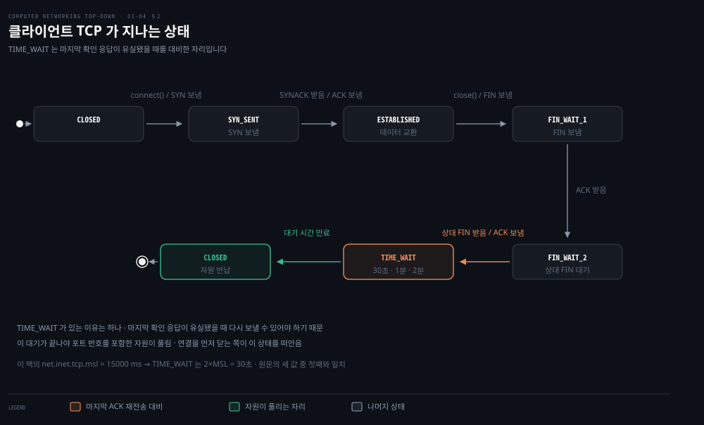
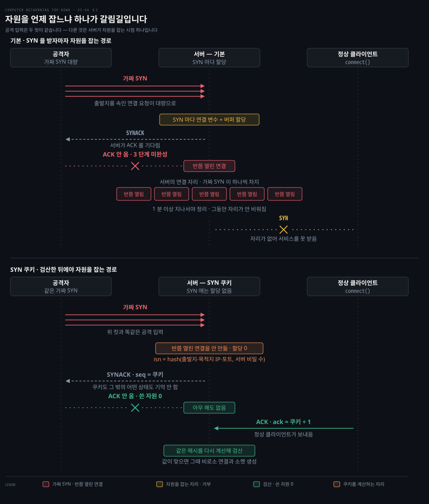
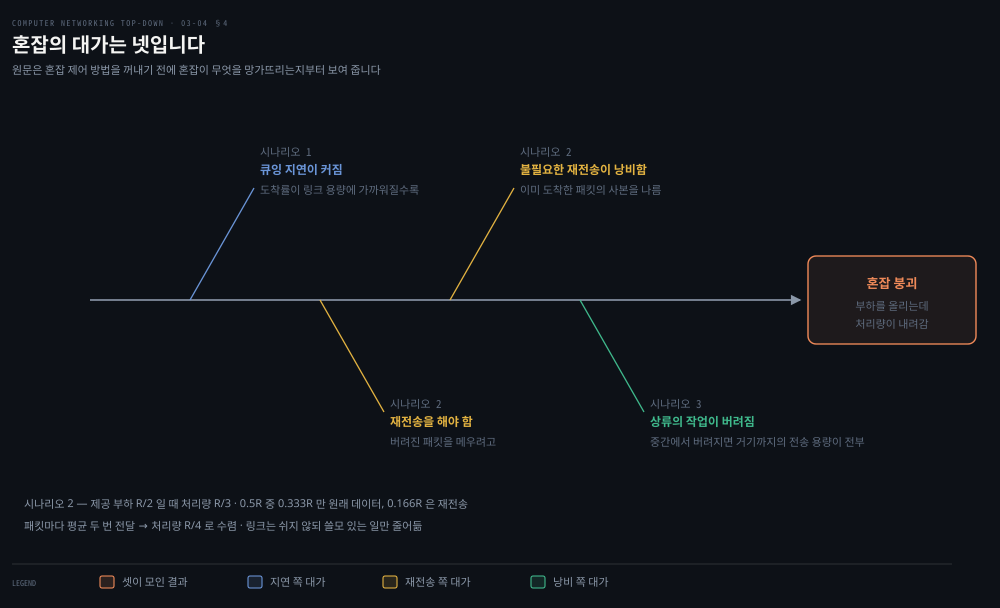

# 흐름 제어와 연결 관리, 그리고 혼잡

---

> 송신자를 늦추는 이유가 둘입니다. 받는 쪽이 못 따라오거나, 망이 못 견디거나입니다. 이 편은 앞의 것을 마치고 뒤의 것을 시작합니다.

## 핵심 요약

> 이 편이 매달린 하나의 생각은 **송신자를 조이는 두 장치가 하는 일은 비슷하지만 이유가 전혀 다르며, 그 구별이 이 장의 나머지를 읽는 열쇠**라는 것입니다.

원문이 이 구별에 한 문단을 씁니다.

> 흐름 제어와 혼잡 제어가 **취하는 행동은 비슷하지만**(송신자를 조입니다) 그 이유는 명백히 다릅니다. 불행히도 많은 저자가 두 용어를 섞어 쓰므로, 눈 밝은 독자는 둘을 구별하는 편이 좋습니다.

| | 흐름 제어 | 혼잡 제어 |
|---|---|---|
| 누가 못 따라오나 | 받는 쪽 애플리케이션 | 경로의 라우터 |
| 신호 | 수신 창 `rwnd` | 손실·지연·명시적 표시 |
| 정보의 출처 | 상대 호스트가 직접 알려 줌 | 대개 추측해야 함 |
| 원문의 표현 | **속도 맞추기 서비스** | 인터넷 전체를 위한 서비스 |

이 편의 후반부가 두 번째 것의 준비 작업입니다. 원문은 혼잡 제어 방법을 바로 꺼내지 않고 **혼잡이 왜 나쁜지부터** 시나리오 셋으로 보여 줍니다. 그리고 셋에서 각각 다른 대가를 뽑아냅니다.

가운데에는 연결 관리가 있습니다. 3-way 핸드셰이크와 그 해제 절차입니다. 원문이 이 주제를 소개하며 솔직하게 적습니다. **그리 신나는 주제로 보이지 않을 수 있다**고요. 그런데 둘이 걸립니다. 연결 수립이 체감 지연에 크게 더해지고, **가장 흔한 공격들이 바로 이 절차의 허점을 노립니다.**


## 학습 목표

> 이 편을 읽고 나면 아래 다섯 가지를 스스로 해낼 수 있습니다.

1. 흐름 제어와 혼잡 제어를 이유로 구별할 수 있습니다.
2. `rwnd` 를 식으로 쓰고, 영 창이 만드는 교착과 그 해법을 설명할 수 있습니다.
3. 3-way 핸드셰이크의 세 단계에서 각각 무엇이 오가고 언제 자원이 할당되는지 말할 수 있습니다.
4. SYN 플러드가 왜 통하는지와 SYN 쿠키가 그것을 어떻게 막는지 설명할 수 있습니다.
5. 혼잡의 대가 네 가지를 시나리오와 함께 댈 수 있습니다.


## 1. 흐름 제어 — 받는 쪽이 못 따라올 때

> 받는 쪽 버퍼가 넘치는 것을 막는 장치입니다. 원문의 표현으로 속도 맞추기 서비스입니다.

### 문제

받는 쪽 TCP 는 순서대로 온 바이트를 수신 버퍼에 넣고, 애플리케이션이 그 버퍼에서 읽어 갑니다. 그런데 **도착하는 순간에 읽어 간다는 보장이 없습니다.** 애플리케이션이 다른 일로 바쁘면 한참 뒤에야 읽으러 옵니다.

애플리케이션이 느리게 읽으면 보내는 쪽이 **너무 많이 너무 빨리 보내** 버퍼를 쉽게 넘치게 할 수 있습니다.

### 변수 넷과 식 둘

받는 쪽 B 가 이 연결에 크기 `RcvBuffer` 의 버퍼를 잡습니다.

- `LastByteRead`: 애플리케이션이 버퍼에서 읽어 간 마지막 바이트의 번호
- `LastByteRcvd`: 망에서 도착해 버퍼에 놓인 마지막 바이트의 번호

버퍼를 넘치면 안 되므로 이 부등식이 성립해야 합니다.

```properties
LastByteRcvd − LastByteRead ≤ RcvBuffer
```

수신 창 `rwnd` 는 버퍼의 **남은 자리**입니다.

```properties
rwnd = RcvBuffer − [LastByteRcvd − LastByteRead]
```

남은 자리가 시시각각 바뀌므로 `rwnd` 도 동적입니다. B 는 A 에게 보내는 **모든 세그먼트의 수신 창 필드에** 현재 값을 실어 알려 줍니다.

보내는 쪽 A 는 변수 둘을 들고 있습니다. `LastByteSent` 와 `LastByteAcked` 입니다. 그 차가 **확인되지 않은 채 보낸 데이터의 양**입니다. A 가 지켜야 하는 조건이 이것입니다.

```properties
LastByteSent − LastByteAcked ≤ rwnd
```

### 사소해 보이지만 교착이 생깁니다

원문이 **"이 방식에 사소한 기술적 문제가 하나 있다"** 며 함정을 하나 꺼냅니다. 읽어 보면 사소하지 않습니다.

1. B 의 버퍼가 가득 차서 `rwnd = 0` 을 광고합니다.
2. 마침 B 는 A 에게 보낼 데이터도 없습니다.
3. 애플리케이션이 버퍼를 비웁니다. 그런데 **TCP 는 보낼 데이터가 있거나 보낼 확인 응답이 있을 때만 세그먼트를 보냅니다.**
4. 그래서 새 `rwnd` 값이 A 에게 전달되지 않습니다. **A 는 막힌 채 영영 더 보내지 못합니다.**

해법이 규격에 박혀 있습니다. **B 의 수신 창이 0 일 때 A 는 데이터 한 바이트짜리 세그먼트를 계속 보냅니다.** 받는 쪽이 이 세그먼트를 확인해 주고, 버퍼가 비기 시작하면 그 확인 응답에 0 이 아닌 `rwnd` 가 실려 옵니다.

> **노트의 읽기**: 이 교착의 뿌리는 TCP 가 **상태 변화를 스스로 알리지 않는다**는 데 있습니다. `rwnd` 는 세그먼트에 얹혀 가는 값이라, 보낼 세그먼트가 없으면 값도 못 갑니다. 이런 구조에서는 **가만히 있는 쪽이 상대를 영영 막을 수 있으므로**, 막힌 쪽이 주기적으로 두드려 상태를 확인하게 만듭니다. 같은 모양의 해법이 뒤의 킵얼라이브나 하트비트에서도 반복됩니다.

### UDP 에는 없습니다

원문이 대비를 한 문단으로 답니다. UDP 는 흐름 제어를 제공하지 않으므로 **버퍼 넘침으로 세그먼트가 유실될 수 있습니다.** 프로세스가 소켓 앞의 유한한 버퍼에서 세그먼트를 충분히 빨리 읽어 가지 않으면 버퍼가 넘치고 세그먼트가 버려집니다.


## 2. 연결을 세우고 허무는 절차

> 세 번의 교환으로 세우고 네 번의 교환으로 허뭅니다. 그 사이 상태가 여럿 지나가고, 각 상태가 실무의 증상과 대응합니다.



### 3-way 핸드셰이크

| 단계 | 보내는 것 | 담긴 것 | 이때 일어나는 일 |
|---|---|---|---|
| 1 | SYN | `SYN=1`, 무작위 `client_isn` | 애플리케이션 데이터 없음 |
| 2 | SYNACK | `SYN=1`, `ack=client_isn+1`, 무작위 `server_isn` | **서버가 버퍼와 변수를 할당합니다** |
| 3 | ACK | `SYN=0`, `ack=server_isn+1` | 클라이언트도 할당. **이 세그먼트는 데이터를 실을 수 있습니다** |

두 번째 세그먼트가 하는 말을 원문이 풀어 씁니다. **"당신의 초기 순서 번호 `client_isn` 으로 연결을 시작하자는 SYN 을 받았습니다. 연결에 동의합니다. 제 초기 순서 번호는 `server_isn` 입니다."**

원문이 재미있는 비유를 답니다. **암벽 등반자와 확보자**가 등반 시작 전에 서로 준비됐는지 확인하는 절차가 TCP 의 3-way 핸드셰이크와 **똑같습니다.**

### 0-RTT 로 줄이기

핸드셰이크가 있는 한 연결 수립에 1 RTT 가 드는 것이 당연해 보입니다. 그런데 **이전에 통신한 적이 있으면 0 으로 줄일 수 있습니다.**

방법은 이렇습니다. 평범한 핸드셰이크 도중에 클라이언트가 **빠른 열기 쿠키**를 달라고 요청합니다. 그 쿠키에는 다음 연결에 필요한 연결 정보가 부호화돼 있고 양쪽이 저장합니다. 다음에 연결할 때는 **쿠키와 애플리케이션 데이터를 첫 메시지에 함께** 보냅니다.

원문이 단서를 답니다. 이것은 **클라이언트 쪽의 최적화 가능성일 뿐**이고, 서버는 정책상 쿠키를 받아들이지 않을 수 있습니다. 원문의 농담이 있습니다. **쿠키를 들고 왔다고 해서 서버가 그것을 먹어야 하는 것은 아닙니다.**

[02-02](./02-02.웹은%20어떻게%20주고받는가.md) 에서 본 QUIC 의 0-RTT 가 같은 계열입니다. TCP Fast Open 은 RFC 7413 이고, TLS 와 QUIC 도 0-RTT 를 지원합니다.

### 허물기와 상태

클라이언트가 닫기를 시작하면 이렇게 진행됩니다.

1. 클라이언트가 `FIN=1` 세그먼트를 보내고 `FIN_WAIT_1` 로 갑니다.
2. 서버가 확인 응답을 보내고, 클라이언트는 `FIN_WAIT_2` 로 갑니다.
3. 서버가 자기 `FIN=1` 세그먼트를 보냅니다.
4. 클라이언트가 그것을 확인해 주고 **`TIME_WAIT`** 로 갑니다.

`TIME_WAIT` 가 있는 이유를 원문이 한 줄로 답합니다. **마지막 확인 응답이 유실됐을 경우 다시 보낼 수 있게** 하려는 것입니다. 머무는 시간은 구현마다 다르며 **전형적으로 30초, 1분, 2분**입니다. 기다림이 끝나야 포트 번호를 포함한 자원이 풀립니다.

이 맥에서 확인해 봤습니다.

```bash
sysctl net.inet.tcp.msl
# net.inet.tcp.msl: 15000      → 밀리초. TIME_WAIT 는 보통 2×MSL 이므로 30초
```

원문이 든 세 값 중 첫 번째와 맞습니다. 여기서 [03-02](./03-02.신뢰성은%20어떻게%20만들어지는가.md) 의 마지막 절이 이어집니다. `TIME_WAIT` 의 길이는 **옛 세그먼트가 망에서 사라졌다고 볼 수 있는 시간**에서 나옵니다.

### 소켓이 없으면 RST

원문이 마지막으로 정상 경로 밖을 하나 다룹니다. 어떤 호스트가 자기에게 없는 소켓 앞으로 온 TCP 세그먼트를 받으면, **RST 플래그를 세운 리셋 세그먼트**를 출발지로 보냅니다. 원문의 의역이 좋습니다.

> **"그 세그먼트에 해당하는 소켓이 저에게 없습니다. 다시 보내지 마십시오."**

UDP 의 경우는 다릅니다. 목적지 포트에 맞는 소켓이 없으면 **ICMP 데이터그램**을 보냅니다.


## 3. SYN 플러드와 SYN 쿠키

> 2단계에서 서버가 자원을 할당한다는 사실 하나가 고전적인 공격을 만듭니다.



### 공격이 통하는 이유

서버는 SYN 을 받으면 연결 변수와 버퍼를 할당하고 SYNACK 를 보낸 뒤 ACK 를 기다립니다. 클라이언트가 세 번째 단계를 완성하지 않으면 서버는 **한참 뒤에야**, 원문의 표현으로 종종 **1분 이상 지나서야** 반쯤 열린 연결을 정리합니다.

공격자는 세 번째 단계를 완성하지 않는 SYN 을 대량으로 보냅니다. 서버의 연결 자원이 **쓰이지도 않을 반쯤 열린 연결에 할당된 채** 고갈되고, 정상 클라이언트는 서비스를 못 받습니다.

원문이 지금의 규모를 답니다. SYN 플러딩은 **가장 먼저 문서화된 DoS 공격 축에 들었고, 30년이 지난 지금도 DoS 공격의 14%** 를 차지합니다.

### SYN 쿠키

효과적인 방어가 있고 **주요 운영체제 대부분에 이미 배포돼** 있습니다. 원리가 우아합니다.

1. 서버는 SYN 을 받아도 **반쯤 열린 연결을 만들지 않습니다.** 대신 출발지·목적지 IP 와 포트 번호, 그리고 **서버만 아는 비밀 수**를 재료로 해시를 계산해 초기 순서 번호를 만듭니다. 이것이 쿠키입니다.
2. 그 쿠키를 초기 순서 번호로 실은 SYNACK 를 보냅니다. **서버는 쿠키도 그 밖의 어떤 상태도 기억하지 않습니다.**
3. 정상 클라이언트가 ACK 를 보내옵니다. 서버는 아무것도 기억하지 않는데 어떻게 확인하나. **같은 해시를 다시 계산**하면 됩니다. SYNACK 의 출발지·목적지 IP 와 포트는 원래 SYN 의 것과 같으므로 같은 값이 나옵니다. 그 값에 1 을 더한 것이 ACK 의 확인 번호와 같으면 유효한 ACK 입니다. 그때 비로소 연결과 소켓을 만듭니다.
4. 클라이언트가 ACK 를 보내지 않으면 **원래의 가짜 SYN 은 서버에 아무 해도 끼치지 않았습니다.** 자원을 할당한 적이 없기 때문입니다.

> **노트의 읽기**: 이 설계의 핵심은 **상태를 기억하는 대신 다시 계산할 수 있게 만든 것**입니다. 서버가 들고 있어야 할 정보를 상대에게 들려 보내고, 돌아올 때 진위를 검산합니다. 같은 발상이 앞 절의 빠른 열기 쿠키에도, 웹의 서명된 세션 토큰에도 있습니다. **기억할 수 없을 만큼 요청이 많은 자리에서는 기억하지 않는 설계가 답이 됩니다.**


## 4. 혼잡이 왜 나쁜가 — 세 시나리오

> 원문이 혼잡 제어 방법을 바로 꺼내지 않습니다. 먼저 혼잡이 무엇을 망가뜨리는지 시나리오 셋으로 보여 줍니다.



### 왜 재전송만으로는 안 되나

원문이 문제를 이렇게 세웁니다. 손실은 대개 망이 혼잡해져 **라우터 버퍼가 넘쳐서** 생깁니다. 그런데 재전송은 **증상을 다룰 뿐 원인을 다루지 않습니다.** 원인은 **너무 많은 출발지가 너무 높은 속도로 보내려는 것**입니다.

### 시나리오 1 — 무한 버퍼

호스트 둘이 라우터 하나를 거쳐 용량 R 의 링크를 나눠 씁니다. 버퍼가 무한하고 오류 회복도 흐름·혼잡 제어도 없습니다.

- 보내는 속도가 0 에서 R/2 사이면 **처리량이 보내는 속도와 같습니다.**
- R/2 를 넘으면 **처리량은 R/2 에 묶입니다.** 링크 용량을 둘이 나눠 쓰기 때문입니다.

여기까지는 좋아 보입니다. 링크를 다 쓰고 있으니까요. 그런데 지연 쪽 그래프가 다른 말을 합니다. **보내는 속도가 R/2 에 가까워질수록 평균 지연이 점점 커지고**, R/2 를 넘으면 큐에 쌓인 패킷 수가 무한해져 **평균 지연이 무한대**가 됩니다.

> **첫 번째 대가**: 패킷 도착률이 링크 용량에 가까워지면 **큰 큐잉 지연**을 겪습니다.

### 시나리오 2 — 유한 버퍼와 재전송

버퍼가 유한하니 가득 찬 버퍼에 도착한 패킷은 버려집니다. 그리고 연결이 신뢰적이라 버려진 것은 다시 보내집니다. 원래 데이터의 속도를 λin, 재전송을 포함한 실제 송출 속도를 λ'in 이라 하고 뒤엣것을 **제공 부하**라 부릅니다.

원문이 경우를 셋으로 나눕니다.

| 가정 | 결과 |
|---|---|
| 버퍼가 빈 것을 마법처럼 알고 그때만 보냄 | 손실이 없고 처리량 = λin. 이상적입니다 |
| **확실히 잃어버린 것만** 재전송 | 제공 부하 R/2 일 때 처리량은 **R/3**. 0.5R 중 0.333R 만 원래 데이터이고 0.166R 은 재전송입니다 |
| 지연됐을 뿐인데 성급히 재전송 | 패킷마다 평균 두 번 전달되므로 처리량이 **R/4** 로 수렴합니다 |

> **두 번째 대가**: 버퍼 넘침으로 버려진 패킷을 메우려고 **재전송을 해야 합니다.**
>
> **세 번째 대가**: 큰 지연 때문에 나가는 **불필요한 재전송**이, 라우터로 하여금 링크 대역폭을 **이미 도착한 패킷의 사본을 나르는 데** 쓰게 만듭니다.

### 시나리오 3 — 여러 홉

호스트 넷이 겹치는 두 홉 경로로 보냅니다. A에서 C 로 가는 연결은 라우터 R1 과 R2 를 지나고, 각 라우터에서 다른 연결과 버퍼를 놓고 경쟁합니다.

제공 부하가 아주 작을 때는 처리량이 부하를 따라 올라갑니다. 그런데 부하가 아주 커지면 이야기가 뒤집힙니다. R2 에서 B–D 트래픽의 도착률이 A–C 보다 훨씬 커지고, **A–C 가 R2 를 통과하는 양이 점점 줄어들어 결국 0 으로** 갑니다.

이유가 명확합니다. 두 번째 홉 라우터에서 버려지는 패킷은, **첫 번째 홉 라우터가 그것을 나르느라 쓴 일을 통째로 낭비**하게 만듭니다. 원문의 표현이 신랄합니다. 첫 라우터가 그 패킷을 그냥 버리고 놀았어도 망의 형편은 **똑같았을**, 더 정확히는 **똑같이 나빴을** 것입니다.

> **네 번째 대가**: 패킷이 경로 중간에서 버려지면, **그 지점까지 오느라 상류 링크들이 쓴 전송 용량이 전부 낭비**됩니다.

이 셋을 합치면 **혼잡 붕괴**입니다. 부하를 올리는데 처리량이 오히려 내려갑니다.


## 5. 목표는 무엇인가 — 병목 링크

> 혼잡 제어가 무엇을 이루려는지 원문이 한 문장으로 못 박습니다. 그 문장이 다음 편의 출발점입니다.

### 병목 링크의 정의

원문의 정의가 이렇습니다. 어떤 연결의 **병목 링크**는, 그 링크를 지나는 송신자들이 전송률을 천천히 올릴 때 **가장 먼저 혼잡 손실을 겪게 되는 링크**입니다. 보통 혼잡 상태일 때만 병목이라 부릅니다.

가정도 하나 밝힙니다. **연결 하나에 병목 링크는 많아야 하나**라는 가정이며, 원문은 이것이 이론에서도 실무에서도 대체로 잘 맞는다고 적습니다.

### 목표

N 개의 연결이 용량 R 의 병목 링크를 함께 지납니다. 링크가 이미 혼잡하면 송신자들이 속도를 올려도 **링크가 더 줄 처리량이 없습니다.** 이미 쉬지 않고 전송하고 있기 때문입니다. 따라서 **N 개 연결이 얻는 총 처리량은 병목의 전송률 R 이 정합니다.** 공평하게 나뉘면 각각 R/N 입니다.

원문의 호스 비유가 이 관계를 잘 잡습니다. 초당 R 리터를 내보내는 호스 하나에서 N 개가 갈라져 나옵니다. 갈래들이 아무리 많이 밀어 넣어도 **공유 호스가 초당 R 리터보다 많이 낼 수 없으므로**, 어느 갈래도 초당 R/N 리터를 넘지 못합니다.

그래서 목표가 이렇게 정해집니다.

> N 개 연결이 트랜스포트 층의 전송률을 정해서, 그 **총합이 병목 링크 용량에 가깝되 넘지 않게** 하는 것입니다.

낮으면 보낼 것이 있는데도 링크가 놀고, 높으면 방금 본 혼잡의 대가를 전부 치릅니다.

### 두 개의 물음

원문이 남은 물음을 둘로 정리합니다. 다음 편이 이 둘에 답합니다.

1. 연결이 자기 경로의 어떤 링크가 혼잡하다는 것을 **어떻게 아는가.**
2. 각 연결이 전송률을 어떻게 조절해야 총합이 병목 용량에 가깝되 넘지 않는가.

> **원문 정오**: 원문이 이 두 물음의 답을 미루면서 **§7.6.2 와 §7.3** 을 가리키고, 바로 앞에서 공평한 분배를 **§7.3.4** 라 적습니다. 셋 다 3장의 절이어야 합니다. 실제로는 각각 **§3.6.2**(종단 간과 망 보조 방식), **§3.7**(TCP 혼잡 제어), **§3.7.4**(공정성)입니다. 7장은 무선·이동 네트워크 장이고, 가리킨 절들의 실제 제목은 §7.6.2 "Satellite Networks", §7.3.4 "Discovery: attaching to a wireless network" 로 혼잡 제어와 무관합니다. 한 쪽 안에서 절 번호의 앞자리가 3 에서 7 로 바뀐 자리가 셋입니다.

### 답을 어디서 얻는가

원문이 방식을 둘로 가릅니다. 기준은 **네트워크 층이 트랜스포트 층에 명시적 도움을 주느냐**입니다.

- **종단 간 혼잡 제어**: 네트워크 층이 아무 지원도 하지 않습니다. **혼잡이 있다는 사실조차 관찰된 동작에서 추론해야** 합니다. 손실과 지연이 그 관찰 대상입니다. IP 가 되먹임을 주도록 요구받지 않으므로 **TCP 가 기본적으로 이 방식**입니다.
- **망 보조 혼잡 제어**: 라우터가 혼잡 상태에 관해 명시적 되먹임을 줍니다. 링크가 혼잡하다는 1비트일 수도 있고, ATM 의 ABR 처럼 라우터가 **감당 가능한 최대 송신 속도를 알려 주는** 정교한 방식일 수도 있습니다.

되먹임이 오는 길도 둘입니다. 라우터가 송신자에게 **직접** 초크 패킷을 보내거나(원문의 의역으로 "나 막혔어요"), 송신자에서 수신자로 가는 **패킷의 한 필드에 표시**를 남기면 수신자가 송신자에게 알리는 방식입니다. 뒤쪽이 더 흔하고 **왕복 한 번이 걸립니다.**


## 흐름 제어·연결 관리 치트시트

> 두 조임 장치의 구별과 상태 전이를 두 장으로 줄였습니다.

**두 조임 장치**

| | 흐름 제어 | 혼잡 제어 |
|---|---|---|
| 창의 이름 | `rwnd` (수신 창) | 혼잡 창 (다음 편) |
| 값을 정하는 쪽 | 받는 쪽 | 보내는 쪽이 추정 |
| 어떻게 전달되나 | 모든 세그먼트의 헤더 필드 | 대개 전달되지 않음 |
| 넘치면 | 수신 버퍼 | 라우터 버퍼 |
| 영일 때 | 1바이트 탐침을 계속 보냄 | 다음 편의 주제 |

**연결 상태와 실무 증상**

| 상태 | 언제 | 여기서 쌓이면 |
|---|---|---|
| `SYN_SENT` | SYN 을 보내고 SYNACK 대기 | 서버 도달 불가나 방화벽 차단 |
| `SYN_RCVD` (서버) | SYNACK 을 보내고 ACK 대기 | **SYN 플러드 의심** |
| `ESTABLISHED` | 데이터를 주고받음 | 정상 |
| `FIN_WAIT_2` | 내 FIN 은 확인됐고 상대 FIN 대기 | 상대가 닫지 않음 |
| `TIME_WAIT` | 마지막 ACK 재전송 대비 | 짧은 연결을 많이 연 쪽에 쌓임 |


## 심화 학습

> 상태와 창은 이 기계에서 바로 셀 수 있습니다.

```bash
# 지금 어떤 상태의 연결이 몇 개인지
netstat -an -p tcp | awk '{print $NF}' | sort | uniq -c | sort -rn | head

# TIME_WAIT 만
netstat -an -p tcp | grep -c TIME_WAIT

# MSL 과 그로부터 나오는 TIME_WAIT 길이
sysctl net.inet.tcp.msl

# 수신 버퍼 기본 크기 — rwnd 의 상한을 정하는 값
sysctl net.inet.tcp.recvspace net.inet.tcp.sendspace

# 리눅스라면 자동 조정 범위가 셋으로 나옵니다
# sysctl net.ipv4.tcp_rmem net.ipv4.tcp_wmem
```

`TIME_WAIT` 가 많이 쌓였다면 그 기계가 **짧은 연결을 많이 여는 쪽**이라는 뜻입니다. 연결을 먼저 닫는 쪽이 이 상태를 떠안기 때문입니다. [02-02](./02-02.웹은%20어떻게%20주고받는가.md) 의 비지속 연결이 성능을 깎는 이유가 여기서도 보입니다.


## 면접 대비

> 이 편에서 실제로 묻는 자리는 두 제어의 구별, 3-way 핸드셰이크의 자원 할당 시점, 그리고 `TIME_WAIT` 의 존재 이유입니다.

### 한 줄 정의

- **흐름 제어**: 보내는 속도를 받는 쪽 애플리케이션의 읽는 속도에 맞추는 서비스입니다.
- **수신 창**: 받는 쪽 버퍼의 남은 자리를 바이트 수로 알리는 값입니다.
- **SYN 쿠키**: 상태를 저장하는 대신 초기 순서 번호에 부호화해 두었다가 되돌아온 ACK 로 검산하는 방어입니다.
- **병목 링크**: 송신자들이 속도를 올릴 때 가장 먼저 혼잡 손실을 겪는 링크입니다.

### 핵심 포인트 세 가지

1. 흐름 제어와 혼잡 제어는 **행동이 같고 이유가 다릅니다.** 하나는 상대의 사정, 하나는 망의 사정입니다.
2. 서버는 **두 번째 단계에서** 자원을 할당합니다. SYN 플러드가 통하는 자리가 정확히 거기입니다.
3. 혼잡의 대가는 지연 증가로 끝나지 않습니다. 재전송과 낭비된 상류 작업이 겹쳐 **혼잡 붕괴**로 갑니다.

### 자주 묻는 질문

**"`TIME_WAIT` 는 왜 있습니까?"** 마지막 ACK 가 유실됐을 때 다시 보내기 위해서입니다. 그리고 옛 연결의 세그먼트가 같은 포트 쌍의 새 연결에 섞여 들어오는 것을 막습니다.

**"`rwnd` 가 0 이면 연결이 멈춥니까?"** 아니요. 보내는 쪽이 1바이트짜리 세그먼트를 계속 보내 창이 열렸는지 확인합니다. 이 탐침이 없으면 교착이 됩니다.

**"SYN 쿠키를 항상 켜 두면 안 됩니까?"** 쿠키 방식은 SYN 세그먼트에 실린 옵션 일부를 보존하기 어렵고 순서 번호 공간을 해시로 소모하므로, 보통 **반쯤 열린 연결이 임계를 넘을 때만** 켜지도록 구현합니다.


## 핵심 개념 체크리스트

> 아래를 보지 않고 말할 수 있으면 이 편은 통과입니다.

- [ ] 흐름 제어와 혼잡 제어를 이유로 구별할 수 있습니다.
- [ ] `rwnd` 를 식으로 쓸 수 있습니다.
- [ ] 보내는 쪽이 지켜야 하는 부등식을 쓸 수 있습니다.
- [ ] 영 창 교착이 왜 생기고 어떻게 푸는지 설명할 수 있습니다.
- [ ] 3-way 핸드셰이크의 세 단계에서 무엇이 오가는지 댈 수 있습니다.
- [ ] 서버가 자원을 할당하는 단계를 지목할 수 있습니다.
- [ ] 세 번째 세그먼트가 데이터를 실을 수 있다는 것을 압니다.
- [ ] `TIME_WAIT` 의 존재 이유를 말할 수 있습니다.
- [ ] SYN 플러드가 통하는 구조적 이유를 설명할 수 있습니다.
- [ ] SYN 쿠키가 상태 없이 검증하는 방법을 설명할 수 있습니다.
- [ ] 혼잡의 대가 네 가지를 시나리오와 함께 댈 수 있습니다.
- [ ] 혼잡 붕괴가 무엇인지 말할 수 있습니다.
- [ ] 병목 링크를 정의하고 목표 전송률을 R/N 으로 설명할 수 있습니다.
- [ ] 종단 간 방식과 망 보조 방식을 가를 수 있습니다.


## 관련 문서

- [03-03 TCP 는 어떻게 세고 어떻게 기다리는가](./03-03.TCP%20는%20어떻게%20세고%20어떻게%20기다리는가.md) — 이 편의 앞. 순서 번호와 재전송 타이머
- [03-05 혼잡을 어떻게 다스리는가](./03-05.혼잡을%20어떻게%20다스리는가.md) — 이 편의 다음. 방금 세운 목표를 TCP 가 어떻게 이루는지
- [02-02 웹은 어떻게 주고받는가](./02-02.웹은%20어떻게%20주고받는가.md) — 연결 수립 지연이 웹에서 무엇을 깎는지
- [Computer Networking — 정독 인덱스](./README.md) — 8개 장 전체 지도


## 참고 자료

- 원본: 《Computer Networking: A Top-Down Approach》 9판 (James F. Kurose · Keith W. Ross, Pearson)
- 다룬 범위: §3.5.5 Flow Control · §3.5.6 TCP Connection Management · §3.6 Principles of Congestion Control
- [RFC 4987 — TCP SYN Flooding Attacks and Common Mitigations](https://www.rfc-editor.org/info/rfc4987) — SYN 쿠키의 근거
- [RFC 7413 — TCP Fast Open](https://www.rfc-editor.org/info/rfc7413) — 0-RTT 연결 수립
