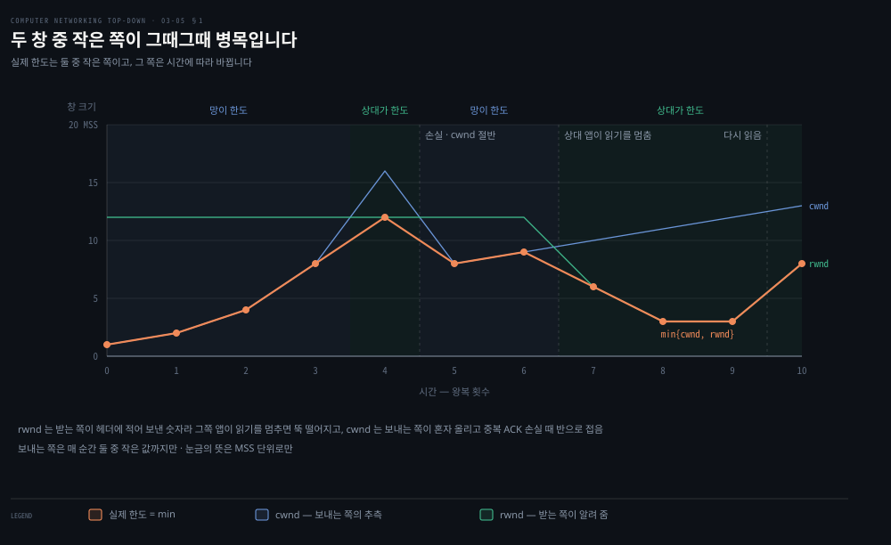
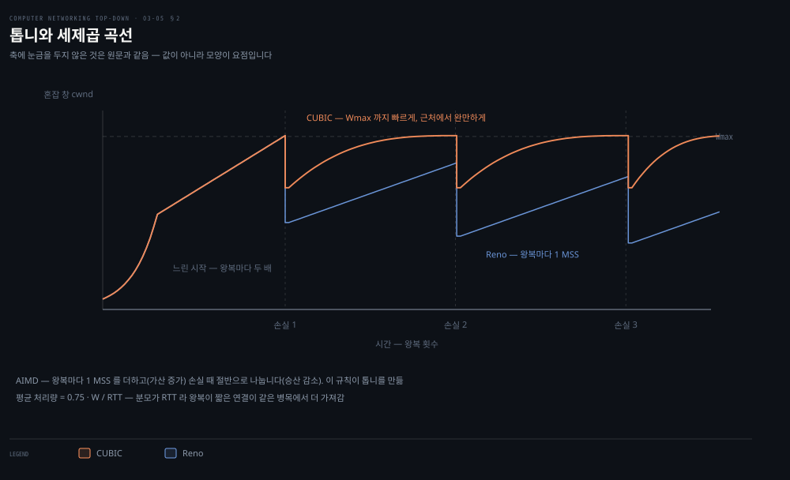
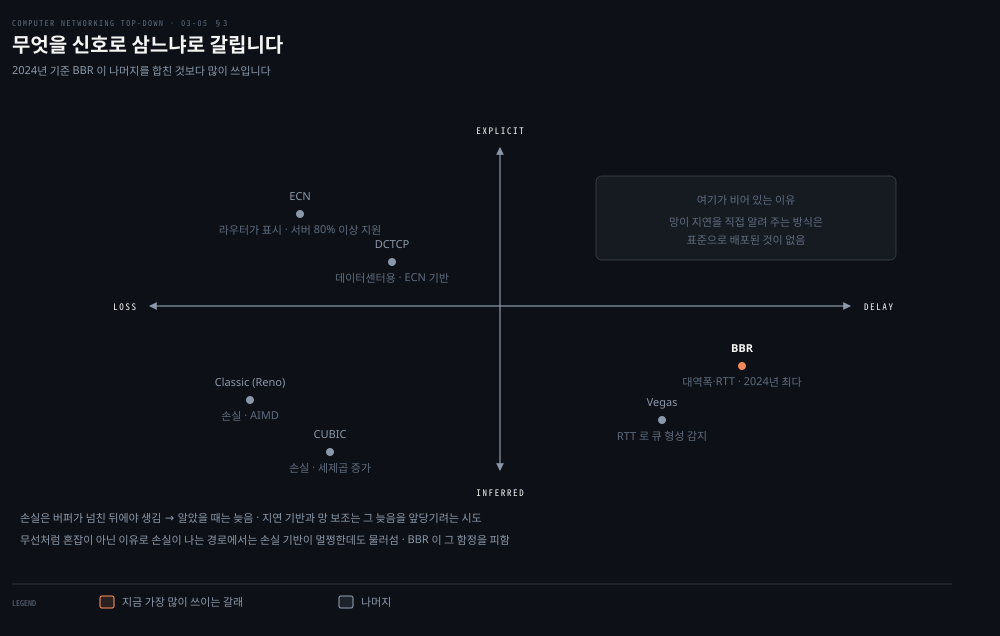
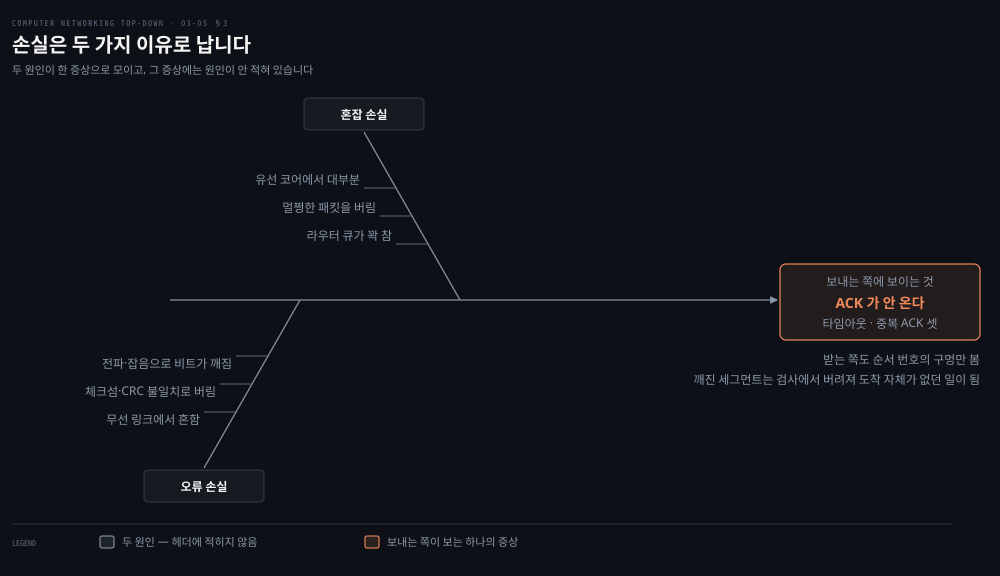
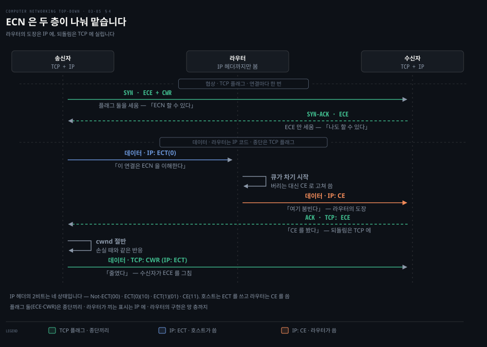
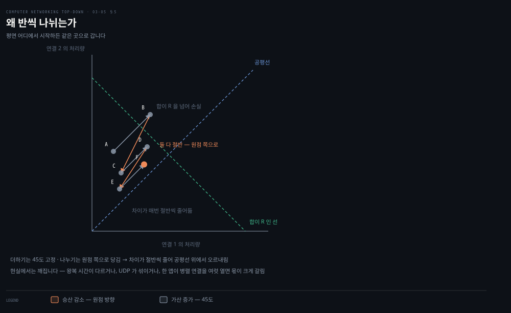

# 혼잡을 어떻게 다스리는가

---

> 앞 편에서 목표를 세웠습니다. 총합이 병목 용량에 가깝되 넘지 않게. 그런데 아무도 그 용량을 알려 주지 않습니다. 이 편은 모르는 값을 각자 더듬어 맞춰 가는 이야기입니다.

## 핵심 요약

> 이 편이 매달린 하나의 생각은 **혼잡 제어가 망이 알려 주지 않는 값을 각 송신자가 국소 정보만으로 추측해 맞춰 가는 분산 알고리즘이며, 무엇을 신호로 삼느냐가 갈래를 나눈다**는 것입니다.

물음이 셋으로 섭니다. 이 셋이 혼잡 제어 알고리즘을 가르는 축입니다.

1. 송신자가 자기 전송률을 **어떻게 제한하는가.**
2. 경로에 혼잡이 있다는 것을 **어떻게 알아채는가.**
3. 알아챈 것에 따라 전송률을 **어떤 규칙으로 바꾸는가.**

첫 물음의 답은 모든 갈래가 같습니다. **혼잡 창** `cwnd` 입니다.

```properties
LastByteSent − LastByteAcked ≤ min{cwnd, rwnd}
```

앞 편의 `rwnd` 와 나란히 놓입니다. 둘 중 작은 쪽이 실제 제약이 됩니다. 손실과 전송 지연을 무시하면 송신 속도가 대략 **`cwnd/RTT`** 이므로, `cwnd` 를 조절하는 것이 곧 속도를 조절하는 것입니다. 

둘째와 셋째 물음에서 갈래가 나뉩니다.

| 갈래 | 혼잡을 무엇으로 아나 | 어떻게 바꾸나 |
|---|---|---|
| Classic (Reno) | 손실 — 타임아웃이나 중복 ACK 세 개 | 더하기로 늘리고 반으로 줄임 |
| CUBIC | 같음 | 손실 직전 값 근처까지 빠르게 올린 뒤 조심스럽게 |
| Vegas | **지연** — 측정한 RTT | 예상 처리량과의 차이로 조절 |
| BBR | **병목 대역폭과 왕복 전파 시간** | 파이프를 꽉 채우되 큐는 안 만듦 |
| ECN | **망이 직접 표시** | 손실과 같게 반응 |

2024년 측정이 현황을 알려 줍니다. **BBR 이 다른 모든 갈래를 합친 것보다 많이 쓰입니다.** 교과서가 자세히 설명하는 Classic TCP 는 이미 주류가 아닙니다.


## 학습 목표

> 이 편을 읽고 나면 아래 여덟 가지를 스스로 해낼 수 있습니다.

1. `cwnd` 가 전송률을 어떻게 제한하는지 식으로 설명할 수 있습니다.
2. 느린 시작과 혼잡 회피가 `cwnd` 를 늘리는 방식의 차이를 말할 수 있습니다.
3. AIMD 라는 이름이 무엇의 줄임인지 답하고 톱니 모양을 설명할 수 있습니다.
4. 손실 기반·지연 기반·망 보조 방식을 갈래별로 가를 수 있습니다.
5. AIMD 가 공평한 분배로 수렴하는 논증을 그림 없이 말로 설명할 수 있습니다.
6. `rwnd` 와 `cwnd` 가 왜 다른 이유로 움직이고, 어느 쪽이 언제 한도가 되는지 말할 수 있습니다.
7. 손실의 두 갈래 원인을 가르고, 보내는 쪽이 왜 ACK 부재만으로는 그 둘을 구별할 수 없는지 설명할 수 있습니다.
8. ECN 의 IP 2비트 네 상태와 TCP 플래그 둘을 「누가 누구에게」로 나눠 말할 수 있습니다.


## 1. 세 개의 지도 원리

> 송신자들은 서로 조율하지 않습니다. 각자 국소 정보만 보고 비동기로 움직이는데 전체가 맞아 들어갑니다.

### 자기 시계로 움직입니다

혼잡이 없으면 확인 응답이 도착합니다. Classic TCP 는 그 도착을 **일이 잘 풀리고 있다는 표시**로 받아들여 창을 늘립니다.

여기서 나오는 성질이 하나 있습니다. 확인 응답이 느리게 오면 창도 느리게 늘고, 빠르게 오면 빠르게 늡니다. 경로가 길거나 링크가 느리면 저절로 조심스러워집니다. 이것을 **자기 클록킹**이라 부릅니다. 창을 늘리는 박자를 **확인 응답 자체가 만듭니다.**

### 세 원리

- **잃은 세그먼트는 혼잡을 뜻하므로 속도를 낮춘다.** 타임아웃이거나 같은 세그먼트에 대한 확인 응답 넷(원래 하나에 중복 셋)이 오면 손실로 봅니다.
- **확인된 세그먼트는 망이 잘 나르고 있다는 뜻이므로 속도를 올린다.**
- **대역폭 탐침.** 손실이 날 때까지 올리고, 나면 물러서고, 다시 올려 봅니다. 비유가 좋습니다. **더 달라고 조르다가 "안 돼!" 소리를 듣고 조금 물러섰다가 얼마 뒤 다시 조르기 시작하는 아이**와 같습니다.

마지막 문장이 이 절의 핵심입니다. **망이 혼잡 상태를 명시적으로 알려 주는 일이 없습니다.** 확인 응답과 손실 사건이 암묵적 신호이고, 각 송신자는 다른 송신자와 **비동기로 국소 정보만 보고** 움직입니다.

### 두 창 중 작은 쪽이 그때그때 병목입니다



여기는 **노트의 읽기**입니다. 망은 안 알려 주지만 상대는 알려 줍니다. `rwnd` 는 받는 쪽이 [03-04](./03-04.흐름%20제어와%20연결%20관리,%20그리고%20혼잡.md) 의 헤더 칸에 적어 보낸 숫자라, 그쪽 애플리케이션이 읽기를 멈추면 뚝 떨어지고 다시 읽으면 되돌아옵니다. `cwnd` 는 위 세 원리대로 보내는 쪽이 혼자 올리고, 손실을 중복 ACK 로 알아채면 반으로 접는 톱니입니다. 타임아웃이면 §2 대로 1 MSS 까지 내려갑니다.

핵심 요약의 `min{cwnd, rwnd}` 는 이 둘을 매 순간 비교한 값입니다. 두 창이 다른 이유로 따로 움직이므로 **어느 쪽이 한도인지도 시간에 따라 바뀝니다.** `cwnd` 를 아무리 잘 키워도 상대가 못 읽으면 소용없고, 상대가 넉넉해도 망이 막히면 `cwnd` 가 잡습니다. 이 편의 나머지는 그 둘 중 `cwnd` 쪽 이야기입니다.


## 2. Classic TCP — 세 국면과 톱니

> 알고리즘의 구성 요소가 셋입니다. 느린 시작, 혼잡 회피, 빠른 회복입니다.



### 느린 시작 — 이름과 달리 빠릅니다

연결이 시작되면 `cwnd` 가 작은 값에서 출발하고, **전송된 세그먼트가 처음 확인될 때마다 1 MSS 씩** 늘어납니다. 확인 응답 하나에 하나씩 늘리므로 **왕복마다 두 배**가 됩니다. 지수적으로 자랍니다.

예로 MSS 가 500바이트이고 RTT 가 200밀리초면 처음 속도가 **약 20 kbps** 입니다. 쓸 수 있는 대역폭이 그보다 훨씬 클 수 있으므로 빨리 찾아 올라가야 합니다.

지수 성장이 끝나는 경우가 셋입니다.

1. **타임아웃**: `cwnd` 를 1 로 되돌리고 느린 시작을 다시 시작합니다. 그리고 `ssthresh` 를 **손실이 감지된 시점 `cwnd` 의 절반**으로 잡습니다.
2. **`cwnd` 가 `ssthresh` 에 닿음**: 지난번 혼잡 지점의 절반이므로 여기서부터 계속 두 배로 가는 것은 무모합니다. 혼잡 회피로 넘어갑니다.
3. 중복 ACK 세 개: 빠른 재전송과 빠른 회복으로 갑니다.

> **책의 오기**: **"`cwnd` 는 보통 1 MSS 라는 작은 값으로 초기화된다 [RFC 3390]"** 고 적습니다. RFC 3390 은 그 반대를 말하는 문서입니다. 초록의 첫 문장이 이렇습니다. `"This document specifies an optional standard for TCP to increase the permitted initial window from one or two segment(s) to roughly 4K bytes."`[^rfc3390] 초기 창을 **1~2 세그먼트에서 약 4KB 로 늘리려고** 나온 문서입니다. 이후 RFC 6928 은 그것을 다시 **10 세그먼트**로 올렸고, 자기 초록에서 RFC 3390 을 `"between 2 and 4 segments"` 로 요약합니다.[^rfc6928] 지금 리눅스와 대부분의 스택이 쓰는 초기 창이 10 세그먼트입니다. 인용된 문서가 본문의 주장을 뒷받침하지 않고 반박합니다.

### 혼잡 회피 — 왕복마다 1 MSS

들어올 때 `cwnd` 는 지난 혼잡 시점의 대략 절반입니다. **혼잡이 코앞에 있을 수 있으므로** 두 배 대신 **왕복마다 1 MSS 씩만** 늘립니다.

구현 방법이 재미있습니다. 새 확인 응답이 올 때마다 `MSS/cwnd` 바이트씩 늘립니다. MSS 가 1,460이고 `cwnd` 가 14,600이면 왕복에 10개를 보내는 셈이므로, 확인 응답 하나가 `1/10 MSS` 를 늘리고 열 개가 다 오면 정확히 1 MSS 가 늘어납니다.

손실이 나면 어떻게 되나가 두 가지로 갈립니다.

| 손실 신호 | `cwnd` | `ssthresh` |
|---|---|---|
| 타임아웃 | 1 MSS 로 | 그때 `cwnd` 의 절반 |
| 중복 ACK 3개 | 절반으로 (거기에 3 MSS 를 더함) | 그때 `cwnd` 의 절반 |

둘을 다르게 대하는 이유가 있습니다. 중복 ACK 가 온다는 것은 **망이 여전히 일부 세그먼트를 나르고 있다는 뜻**이므로 덜 극단적으로 대응합니다.

이 차이가 두 판을 가릅니다. **TCP Tahoe** 는 어느 쪽이든 `cwnd` 를 1 로 잘랐습니다. **TCP Reno** 가 중복 ACK 쪽에 덜 극단적으로 반응하는 변화를 넣었습니다.

예로 확인하면 이렇습니다. 문턱이 8 MSS 로 시작해 `cwnd` 가 12 MSS 일 때 중복 ACK 손실이 납니다. `ssthresh` 는 6 MSS 가 되고, Reno 는 `cwnd` 를 **9 MSS** 로 둡니다. 절반인 6 에 3 을 더한 값입니다.

### AIMD 와 톱니

느린 시작을 빼고 손실이 중복 ACK 로만 온다고 하면, TCP 혼잡 제어는 두 동작으로 요약됩니다. **왕복마다 1 MSS 씩 더하기(가산 증가)** 와 **손실 때 절반으로 나누기(승산 감소)** 입니다. 그래서 **AIMD** 라 부릅니다.

이 규칙이 **톱니 모양**을 만듭니다. 선형으로 올라가다가 손실이 나면 반으로 뚝 떨어지고 다시 선형으로 올라갑니다. 앞 절의 대역폭 탐침이 그림으로 드러난 것입니다.

뜻밖의 사실이 하나 더 있습니다. AIMD 는 실무의 공학적 통찰과 실험으로 만들어졌는데, **개발·배포 10년 뒤의 이론적 분석에서 이 알고리즘이 사용자와 망 성능의 여러 측면을 동시에 최적화하는 분산 비동기 최적화 알고리즘임이 밝혀졌습니다.**

### 평균 처리량

톱니이므로 평균을 낼 수 있습니다. 창 크기가 w 이고 왕복이 RTT 이면 전송률이 대략 `w/RTT` 입니다. 손실 시점의 창을 W 라 하면 전송률이 `W/(2·RTT)` 와 `W/RTT` 사이를 오갑니다. 선형으로 오르내리므로 평균이 그 중간입니다.

```properties
평균 처리량 ≈ 0.75 · W / RTT
```

이 식이 `RTT` 를 분모에 두고 있다는 점이 뒤의 공정성 논의로 이어집니다. **같은 병목을 나눠 쓰는 연결이라도 왕복이 짧은 쪽이 더 많이 가져갑니다.**


## 3. 새 갈래들 — 무엇을 신호로 삼느냐

> 25년 사이의 변화가 정리됩니다. 교과서가 자세히 설명한 Classic TCP 는 이미 주류에서 밀려났습니다.



### 손실은 두 가지 이유로 납니다



여기는 **노트의 읽기**입니다. §1 의 첫 원리는 잃은 세그먼트를 혼잡의 뜻으로 읽습니다. 그런데 세그먼트가 사라지는 길은 크게 둘입니다.

- **혼잡 손실**: 라우터가 큐 때문에 버립니다. 큐가 꽉 차서 버리는 것이 기본이고, RED 같은 능동 큐 관리는 차기 전에 미리 버리기도 합니다. 패킷 자체는 멀쩡합니다. [01-04](./01-04.무엇이%20느려지고%20무엇이%20사라지는가.md) 가 큐가 유한해서 생기는 이 손실을, [03-04](./03-04.흐름%20제어와%20연결%20관리,%20그리고%20혼잡.md) §5 가 그 대가를 다뤘습니다.
- **오류 손실**: 전파나 잡음으로 비트가 깨지고, 링크 층의 검사나 [03-01](./03-01.트랜스포트는%20무엇을%20더하는가.md) §6 의 체크섬이 불일치를 잡고 그 조각을 버립니다. 망이 비어 있어도 납니다. [03-02](./03-02.신뢰성은%20어떻게%20만들어지는가.md) 의 rdt2.0 이 이 채널을 다뤘습니다.

보내는 쪽은 이 둘을 가르지 못합니다. 어느 쪽이든 그 세그먼트에 대한 ACK 가 안 오고, 타임아웃이나 중복 ACK 셋으로만 보입니다. 받는 쪽도 대개 모릅니다. 깨진 세그먼트는 검사에서 버려져 도착 자체가 없던 일이 되므로, 받는 쪽이 아는 것은 순서 번호에 구멍이 났다는 것까지입니다. 이유는 헤더 어디에도 적혀 있지 않습니다.

그래서 첫 원리는 사실이 아니라 가정입니다. 유선 코어에서는 비트 오류가 드물어 이 가정이 거의 맞습니다. 무선 링크에서는 비트 오류가 잦고, 링크 층 재전송으로 다 가려지지 않으면 혼잡이 없어도 손실로 보입니다. 손실을 신호로 쓰는 Reno 와 CUBIC 이 무선에서 멀쩡한 링크를 두고 물러서는 이유가 이것입니다. 아래 BBR 이 손실을 신호에서 뺀 이유도 같습니다. §4 의 ECN 은 혼잡 쪽을 라우터의 표시로 따로 알려 줍니다.

### CUBIC — 가산 증가를 고칩니다

물음이 이렇습니다. 반으로 자르고 천천히 올리는 것이 최선인가. 손실이 났던 링크의 상태가 크게 안 바뀌었다면, **손실 직전 속도 근처까지 빨리 올려놓고 거기서부터만 조심스럽게** 재는 편이 낫지 않은가.

CUBIC 은 혼잡 회피 국면만 바꿉니다. 손실 직전 창을 `Wmax`, 손실 없이 다시 `Wmax` 에 닿을 미래 시점을 `K` 라 두고, **현재 시각 `t` 와 `K` 의 거리의 세제곱**으로 창을 늘립니다.

이 함수 모양이 원하는 동작을 만듭니다.

- `t` 가 `K` 에서 멀면 증가폭이 큽니다. **손실 직전 값으로 빠르게 돌아갑니다.**
- `t` 가 `K` 에 가까우면 증가폭이 작습니다. **`Wmax` 근처에서 조심스럽게 더듬습니다.**
- `t` 가 `K` 를 넘어서면 다시 빠르게 늡니다. **혼잡 수준이 실제로 달라졌다면 새 지점을 빨리 찾습니다.**

배포 이력도 따라옵니다. 2000년 무렵 인기 웹 서버는 거의 다 Classic TCP 였고, 2014년에는 인기 서버 5,000개 중 **거의 절반이 CUBIC** 이었으며 **리눅스의 기본값**이었습니다. 그런데 2024년에는 **BBR 이 CUBIC 은 물론 다른 모든 갈래를 합친 것보다 많이** 쓰입니다.

이 맥에서도 CUBIC 이 기본값입니다.

```bash
sysctl net.inet.tcp.cubic_sockets net.inet.tcp.newreno_sockets
# net.inet.tcp.cubic_sockets: 171
# net.inet.tcp.newreno_sockets: 0
```

> **지금은 다릅니다**: CUBIC 의 근거로 실린 **RFC 8312 는 RFC 9438 로 대체**됐습니다. 새 문서의 머리에 `Obsoletes: 8312` 가 적혀 있습니다. 알고리즘의 뼈대는 같고 문서 번호와 매개변수 서술이 정리된 것입니다.

### Vegas — 지연을 신호로

Classic 도 CUBIC 도 **손실**을 신호로 씁니다. 손실은 이미 버퍼가 넘친 뒤에야 생기므로, 알았을 때는 늦습니다.

TCP Vegas 는 **측정한 RTT** 로 혼잡의 시작을 **손실이 나기 전에** 미리 알아채려 합니다. 논리가 단순합니다.

1. 확인된 패킷들의 RTT 중 최솟값을 `RTTmin` 이라 둡니다. 경로가 안 막혔을 때, 즉 큐잉 지연이 최소일 때의 값입니다.
2. 그러면 안 막힌 상태의 처리량은 `cwnd/RTTmin` 입니다.
3. **실제로 측정한 처리량이 이 값에 가까우면** 경로가 아직 안 막힌 것이므로 속도를 올립니다.
4. **실제 처리량이 그보다 뚜렷이 낮으면** 어딘가에 큐가 쌓인 것이므로 속도를 낮춥니다.

### BBR — 파이프를 꽉 채우되 큐는 안 만듭니다

Vegas 의 직관은 한 문장으로 인용됩니다. **"파이프를 꽉 채우되 그 이상은 채우지 마라."**

- **꽉 채운다**: 처리량을 제한하는 병목 링크가 쉬지 않고 쓸모 있는 일을 하게 합니다.
- **그 이상은 안 채운다**: 파이프가 꽉 찬 뒤에 큐가 쌓이면 **지연만 늘 뿐 얻는 것이 없습니다.**

BBR 은 이 지점을 숫자로 잡습니다. 관건은 **전송 중인 데이터의 양**입니다. 이 값이 **대역폭·지연 곱**에 이르면 파이프가 딱 찹니다. 그보다 더 넣으면 병목 링크에 **지속적인 큐**가 생기는데, 링크는 이미 쉬지 않고 있으므로 **처리량은 안 늘고 RTT 만 늡니다.**

그래서 BBR 은 RTT 를 직접 재고 대역폭·지연 곱을 추정해 전송 중인 양을 그에 맞춥니다. 두 시간 축으로 움직입니다.

- **긴 주기**: 전송 중인 양을 줄여 파이프를 비우고 **더 낮은 RTT 가 있는지** 살핍니다.
- **짧은 주기**: 세 국면을 돕니다. 처리량이 평평해질 때까지 올리는 **가속**, 망이 내주는 속도로 보내는 **순항**, 그보다 느리게 보내 큐 압력을 낮추고 더 낮은 RTT 를 찾는 **감속**입니다.

전송 페이싱 장치도 있어서 세그먼트 뭉치가 연달아 나가지 않게 합니다.

> **노트의 읽기**: BBR 이 손실을 신호로 안 쓴다는 점이 실무에서 중요합니다. 무선 구간처럼 **혼잡이 아닌 이유로 손실이 나는 경로**에서 손실 기반 알고리즘은 멀쩡한데도 물러섭니다. BBR 은 그 함정을 피합니다. 대신 단서가 하나 달립니다. 초기 판본에서 **손실 기반 흐름과 나란히 놓였을 때의 공정성**이 우려됐고, BBRv3 가 그 문제를 명시적으로 다뤘습니다.


## 4. 망이 직접 알려 주면 — ECN

> 앞의 넷은 전부 추측입니다. 라우터가 그냥 말해 주면 안 되나. 그 답이 ECN 입니다.



### 두 층이 함께 움직입니다

**네트워크 층**에서는 IP 헤더 Type of Service 필드의 **2비트**를 씁니다. 쓰임이 둘입니다.

- 라우터가 **자기가 혼잡을 겪고 있음**을 표시합니다. 이 표시가 목적지 호스트까지 실려 갑니다.
- 보내는 호스트가 **자기와 상대가 ECN 을 이해한다**고 라우터에 알립니다.

**트랜스포트 층**에서는 [03-03](./03-03.TCP%20는%20어떻게%20세고%20어떻게%20기다리는가.md) 에서 본 플래그 둘이 일합니다.

1. 받는 쪽 TCP 가 표시된 데이터그램을 받으면, 송신자로 가는 ACK 에 **ECE 비트**를 세웁니다.
2. 송신자는 **손실이 났을 때와 같이 혼잡 창을 반으로** 줄입니다.
3. 그리고 다음 세그먼트에 **CWR 비트**를 세워 줄였다고 알립니다.

여기에 중요한 여백이 하나 있습니다. **RFC 3168 은 라우터가 언제 혼잡한지를 정의하지 않습니다.** 그것은 라우터 제조사가 열어 둔 선택지이고 망 운영자가 정합니다. 다만 의도는 분명합니다. **실제로 손실이 나기 전에** 혼잡의 시작을 알리자는 것입니다.

배포 현황은 이렇습니다. 인용된 측정에서 **인기 웹 서버와 그 경로의 80% 이상이 ECN 을 지원**합니다.

TCP 만의 것도 아닙니다. DCCP 가 ECN 을 쓰고, 데이터센터용인 DCTCP 와 DCQCN 도 씁니다.

### 2비트는 네 상태입니다

여기는 **노트의 읽기**입니다. 앞 절의 약어를 풀면 층이 보입니다.

| 약어 | 풀네임 | 어느 층 | 데이터가 흐를 때 누가 쓰나 |
|---|---|---|---|
| ECN | Explicit Congestion Notification | 방식 전체의 이름 | 둘 다 |
| ECT | ECN-Capable Transport | IP 헤더의 2비트 | 보내는 호스트 |
| CE | Congestion Experienced | IP 헤더의 2비트 | 라우터 |
| ECE | ECN-Echo | TCP 플래그 | 받는 호스트 |
| CWR | Congestion Window Reduced | TCP 플래그 | 보내는 호스트 |

IP 헤더의 2비트는 있다·없다가 아니라 **네 상태**입니다. RFC 3168 은 그것을 코드포인트라 부르고 표로 적습니다.[^rfc3168-cp]

| 비트 | 이름 | 뜻 |
|---|---|---|
| `00` | Not-ECT | 이 패킷은 ECN 을 안 씁니다 |
| `10` | ECT(0) | 양 끝이 ECN 을 이해합니다 |
| `01` | ECT(1) | 위와 같습니다. 라우터는 둘을 같게 다룹니다 |
| `11` | CE | 라우터가 혼잡을 겪었습니다 |

앞 절의 「쓰임이 둘」이 곧 이 방향입니다. **ECT 는 호스트가 라우터에게** 하는 말이고, **CE 는 라우터가 호스트에게** 하는 말입니다. 보내는 호스트가 ECT 를 세워 내보내면, 큐가 차기 시작한 라우터가 그 패킷을 버리는 대신 `11` 로 고쳐 써서 넘깁니다.

ECT 가 둘인 이유는 라우터가 CE 표시를 지우지 않았는지, 받는 쪽이 CE 를 받은 사실을 제대로 보고하는지 보내는 쪽이 검증할 길을 열어 두기 위해서입니다.[^rfc3168-ect2] 하나만 필요한 프로토콜은 ECT(0) 을 씁니다.

층은 누가 누구에게 말하느냐로 갈립니다. **라우터가 끼는 신호는 IP 코드**입니다. **종단끼리 주고받는 신호는 TCP 플래그**입니다. RFC 3168 이 그렇게 갈라 적습니다.[^rfc3168-layers]

협상은 종단끼리의 일이라 TCP 플래그로만 합니다. ECE 와 CWR 을 둘 다 세운 SYN 이 「ECN 할 수 있다」는 물음입니다. ECE 만 세운 SYN-ACK 이 그 답입니다.[^rfc3168-syn]

데이터가 흐를 때는 넷이 이어집니다. 보내는 쪽이 IP 의 ECT 를 세웁니다. 라우터가 그것을 CE 로 바꿉니다. 받는 쪽이 TCP 의 ECE 로 되돌리고, 보내는 쪽이 TCP 의 CWR 로 답합니다.

라우터가 끼는 표시가 IP 에 있는 것은 라우터가 망 층까지만 구현하는 장비이기 때문입니다. 그래서 「라우터의 도장」은 IP 에 찍히고, 「그 도장을 봤다」는 되돌림은 TCP 에 실립니다. 큐가 이미 꽉 찬 라우터는 ECN 이 있어도 버립니다.[^rfc3168-full] 표시는 손실이 나기 전의 신호이지 손실을 없애는 장치가 아닙니다.


## 5. 공정성 — 왜 반씩 나뉘는가

> 서로 조율하지 않는 연결들이 어떻게 공평한 몫으로 수렴하는가. 논증이 그림 하나로 끝납니다.



### 무엇을 공정하다고 하나

전송률 R 의 병목 링크를 K 개의 연결이 나눠 씁니다. 각 연결의 평균 전송률이 대략 **R/K** 이면 그 혼잡 제어를 공정하다고 합니다.

### 두 연결로 따라가면

가정을 넷 깔고 갑니다.

- 두 연결의 MSS 와 RTT 가 같습니다.
- 둘 다 보낼 데이터가 많습니다.
- 이 링크를 지나는 다른 트래픽이 없습니다.
- 느린 시작을 무시하고 늘 혼잡 회피 국면입니다.

그 위에서 두 연결의 처리량을 축으로 하는 평면에 그립니다.

- **45도 대각선**이 두 몫이 같은 선입니다.
- **합이 R 인 선**이 링크를 다 쓰는 선입니다.
- 목표는 이 두 선이 만나는 점 근처입니다.

이제 점 A 에서 시작합니다.

1. 합이 R 보다 작으므로 손실이 없고, **둘 다 왕복마다 1 MSS 씩** 늘립니다. 같은 양을 더하므로 궤적이 **45도 방향**으로 움직입니다.
2. 어느 점 B 에서 합이 R 을 넘어 손실이 납니다.
3. 둘 다 창을 **절반**으로 줄입니다. 같은 비율로 줄이므로 새 점 C 는 **원점과 B 를 잇는 선분의 중점**입니다.
4. C 에서 다시 45도로 올라갑니다.

핵심이 3번에 있습니다. **더하기는 방향이 45도로 고정이고 나누기는 원점 쪽으로 당깁니다.** 원점 쪽으로 당기는 동작이 두 값의 차이를 매번 절반으로 줄이므로, 되풀이하면 **공평선 위에서 오르내리게** 됩니다.

강조되는 점이 하나 있습니다. 이 수렴은 **평면 어디에서 시작하든** 일어납니다.

### 현실에서는 안 그렇습니다

가정을 되짚으면 셋이 무너집니다.

- **왕복 시간이 다르면**: 앞 절의 평균 처리량 식에 `RTT` 가 분모로 있었습니다. 같은 병목을 나눠도 **왕복이 짧은 쪽이 창을 더 빨리 열어 더 많이 가져갑니다.**
- **UDP 가 섞이면**: UDP 는 혼잡 제어를 안 하므로 물러서지 않습니다. TCP 만 물러서니 **UDP 가 TCP 를 밀어냅니다.**
- **한 앱이 연결을 여럿 열면**: 예가 선명합니다. 아홉 앱이 각각 연결 하나를 쓰는 링크에 새 앱이 들어옵니다. 연결 하나를 쓰면 `R/10` 을 받지만, **병렬 연결 11개를 열면 `R/2` 넘게** 받습니다.

마지막 항목이 [02-02](./02-02.웹은%20어떻게%20주고받는가.md) 와 맞물립니다. HTTP/1.1 브라우저가 병렬 연결을 여섯 개까지 연 것이 HOL 블로킹 회피만이 아니라 **대역폭을 더 가져가려는 것**이기도 했다는 서술이, 여기서 공정성 문제로 다시 나타납니다.

> **책의 오기**: 이 절 첫 문단이 병목 링크의 정의를 **§7.6.2** 로 미루고, 앞 절의 BBR 논의는 공정성을 **§7.3.4** 로 가리킵니다. 각각 **§3.6.1** 과 **§3.7.4**(바로 이 절)여야 합니다. 7장은 무선·이동 네트워크 장이며 §7.6.2 의 실제 제목은 "Satellite Networks", §7.3.4 는 "Discovery: attaching to a wireless network" 입니다.
>
> 3장에서 이런 절 번호 오류를 **다섯 자리**에서 찾았습니다. §3.6.1 이 셋(§7.6.2·§7.3·§7.3.4), §3.7.2 가 하나(§7.3.4), §3.7.4 가 하나(§7.6.2)입니다. 모두 앞자리가 3 에서 7 로 바뀐 자리입니다. 여기에 §3.8 이 HOL 블로킹을 **§2.2.5** 라 가리키는 것도 더해집니다. 그 내용은 **§2.2.6** 에 있습니다.


## 6. 트랜스포트의 진화 — 세 번째 선택지

> 40년 동안 UDP 와 TCP 둘뿐이었습니다. 지금은 셋입니다.

### 애플리케이션 층으로 옮겨 갔습니다

지난 10년의 변화를 **더 큰 지각 변동**이라 부릅니다. TCP 의 신뢰적 전송, 흐름 제어, 혼잡 제어가 **애플리케이션 층 모듈로 옮겨 가** UDP 위에서 TCP 같은 서비스를 주는 흐름입니다. 대표가 QUIC 입니다.

그래서 설계자의 선택지가 셋이 됐습니다. 운영체제가 주는 TCP, 운영체제가 주는 UDP, 그리고 **UDP 위에 자기 트랜스포트를 직접 짓는 것**입니다.

왜 그렇게 하는지도 이유가 붙습니다. 트랜스포트 기능을 애플리케이션 층에서 구현하면 **애플리케이션 갱신 주기로 바꿀 수 있습니다.** TCP 나 UDP 를 고치는 속도와는 비교가 안 됩니다. 인용된 RFC 1263 의 농담이 이 사정을 잘 말합니다.

> **"표준화 위원회가 회의 시간을 합의하는 데 걸리는 시간보다 짧은 시간 안에 프로토콜을 설계하고 배포할 수 있도록."**

### QUIC 이 이 장의 결론입니다

QUIC 은 **트랜스포트 층 공부의 좋은 마무리**로 소개됩니다. 이 장에서 배운 것을 거의 다 쓰기 때문입니다.

- **연결 지향이고 안전합니다.** 연결 상태를 세우는 악수가 필요하고 모든 패킷이 암호화됩니다. **연결 수립 악수와 인증·암호화 악수를 합쳐** TCP 를 세운 뒤 그 위에 TLS 를 또 세우는 것보다 훨씬 빠릅니다.
- **스트림.** 여러 애플리케이션 수준 스트림이 QUIC 연결 하나에 다중화됩니다. 연결마다 연결 ID 가, 스트림마다 스트림 ID 가 있고 둘 다 헤더에 들어갑니다.
- **스트림별 신뢰성.** HTTP/1.1 이 TCP 하나로 여러 요청을 보내면 바이트가 순서대로만 배달되므로, 한 요청의 바이트가 유실되면 나머지가 다 막힙니다. QUIC 은 **스트림 단위로** 순서를 보장하므로 **유실된 UDP 세그먼트가 실어 나르던 스트림만** 영향을 받습니다.
- **혼잡 제어는 TCP NewReno 기반**입니다. QUIC 규격이 스스로 이렇게 적습니다. **"TCP 의 손실 검출과 혼잡 제어에 익숙한 독자라면 여기서 잘 알려진 TCP 알고리즘과 나란한 것들을 발견할 것이다."**

마지막 줄이 이 장을 닫습니다. **이 장에서 TCP 혼잡 제어를 꼼꼼히 공부했으니 QUIC 규격의 혼잡 제어 부분을 읽어도 낯설지 않을 것**이라고요.

> **노트의 읽기**: 이 마지막 문장이 이 장 전체의 구조를 드러냅니다. 이 장은 TCP 를 **그 자체로** 가르치기보다 **트랜스포트 층이 풀어야 하는 문제들의 목록**으로 가르쳤습니다. 신뢰성·흐름 제어·혼잡 제어·연결 관리라는 목록입니다. 그래서 QUIC 처럼 구현이 완전히 다른 프로토콜을 만나도 **같은 목록으로 읽을 수 있습니다.** [03-02](./03-02.신뢰성은%20어떻게%20만들어지는가.md) 가 rdt 를 처음부터 지은 것도 같은 이유였습니다.


## 혼잡 제어 치트시트

> 갈래별 신호와 국면별 규칙을 두 장으로 줄였습니다.

**갈래**

| 갈래 | 신호 | 특징 | 지금 |
|---|---|---|---|
| Tahoe | 손실 | 어느 손실이든 `cwnd` 를 1 로 | 역사적 |
| Reno | 손실 | 중복 ACK 에는 절반 + 3 | Classic 의 기준형 |
| CUBIC | 손실 | `Wmax` 까지 빠르게, 근처에서 조심스럽게 | 리눅스·macOS 기본값 |
| Vegas | 지연 | 손실 전에 큐 형성을 감지 | 지연 기반의 원조 |
| BBR | 대역폭·RTT | 파이프를 꽉 채우되 큐는 안 만듦 | 2024년 기준 최다 |
| ECN | 망의 표시 | 손실 전에 라우터가 알림 | 서버·경로 80% 이상 지원 |

**Classic TCP 의 규칙**

| 상황 | `cwnd` | `ssthresh` |
|---|---|---|
| 느린 시작에서 ACK 하나 | +1 MSS (왕복마다 두 배) | 그대로 |
| `cwnd` 가 `ssthresh` 에 닿음 | 혼잡 회피로 전환 | 그대로 |
| 혼잡 회피에서 ACK 하나 | +MSS/`cwnd` (왕복마다 +1 MSS) | 그대로 |
| 중복 ACK 3개 | 절반 + 3 MSS | 그때 `cwnd` 의 절반 |
| 타임아웃 | 1 MSS | 그때 `cwnd` 의 절반 |
| ECN 표시 | 절반 | 그때 `cwnd` 의 절반 |


## 심화 학습

> 자기 기계가 어느 갈래를 쓰는지, 그리고 창이 실제로 어떻게 움직이는지 볼 수 있습니다.

```bash
# macOS — 지금 열린 소켓 중 어느 알고리즘이 몇 개인지
sysctl net.inet.tcp.cubic_sockets net.inet.tcp.newreno_sockets

# 리눅스 — 쓸 수 있는 알고리즘과 현재 기본값
# sysctl net.ipv4.tcp_available_congestion_control
# sysctl net.ipv4.tcp_congestion_control
# sysctl net.ipv4.tcp_ecn        # 0 끔 · 1 켬 · 2 들어오는 것만

# 창이 실제로 어떻게 움직이는지 (리눅스)
# ss -tin | grep -A1 ESTAB | head    # cwnd·ssthresh·rtt 가 함께 나옵니다

# 큰 파일을 받으며 처리량 곡선 보기 — 느린 시작 구간이 눈에 띕니다
curl -s -o /dev/null -w 'speed %{speed_download} B/s · time %{time_total}s\n' \
  https://speed.cloudflare.com/__down?bytes=50000000
```

리눅스라면 `ss -tin` 이 가장 볼만합니다. `cwnd`, `ssthresh`, `rtt`, `bytes_retrans` 가 한 줄에 나오므로, 이 편에서 읽은 변수들이 실제 연결에서 어떤 값을 갖는지 그대로 보입니다.


## 면접 대비

> 이 편에서 실제로 묻는 자리는 AIMD 의 뜻, 느린 시작과 혼잡 회피의 차이, 그리고 손실 기반과 지연 기반의 구별입니다.

### 한 줄 정의

- **혼잡 창**: 송신자가 확인 없이 내보낼 수 있는 데이터 양의 상한입니다.
- **AIMD**: 왕복마다 1 MSS 더하고 손실 때 절반으로 나누는 규칙입니다.
- **자기 클록킹**: 창을 늘리는 박자를 확인 응답의 도착이 만드는 성질입니다.
- **대역폭·지연 곱**: 파이프를 꽉 채우는 데 필요한 전송 중 데이터의 양입니다.
- **ECT 와 CE**: IP 헤더 2비트의 코드포인트입니다. ECT 는 호스트가 「ECN 을 이해한다」고 라우터에게, CE 는 라우터가 「혼잡을 겪었다」고 호스트에게 남기는 표시입니다.

### 핵심 포인트 세 가지

1. `cwnd` 와 `rwnd` 중 **작은 쪽**이 제약입니다. 하나는 망의 사정, 하나는 상대의 사정입니다.
2. 느린 시작은 **왕복마다 두 배**, 혼잡 회피는 **왕복마다 1 MSS** 입니다. 이름과 달리 느린 시작 쪽이 빠릅니다.
3. AIMD 가 공평선으로 수렴하는 이유는 **더하기가 45도이고 나누기가 원점 쪽이기 때문**입니다.

### 자주 묻는 질문

**"타임아웃과 중복 ACK 를 왜 다르게 대합니까?"** 중복 ACK 가 온다는 것은 망이 여전히 세그먼트를 나르고 있다는 뜻입니다. 완전히 막힌 것이 아니므로 덜 극단적으로 물러섭니다.

**"무선에서 손실 기반 알고리즘이 왜 손해입니까?"** 무선의 손실은 혼잡이 아니라 전파 환경 때문일 때가 많습니다. 손실을 혼잡으로 읽는 알고리즘은 링크가 멀쩡한데도 창을 줄입니다. BBR 같은 대역폭·지연 기반이 이 함정을 피합니다.

**"왕복이 짧으면 왜 더 많이 가져갑니까?"** 평균 처리량이 `0.75·W/RTT` 이고, 창을 키우는 속도도 왕복마다 한 번이기 때문입니다. 같은 병목이라도 가까운 쪽이 더 자주 늘립니다.

**"손실이 나면 혼잡이라고 단정해도 됩니까?"** 아닙니다. 큐 넘침과 비트 오류가 둘 다 ACK 부재로만 보입니다. 헤더에 이유가 없습니다. 유선 코어에서는 그 가정이 거의 맞아 손실 기반이 통했습니다. 무선에서는 자주 틀려서 BBR 처럼 손실을 신호에서 빼는 갈래가 나왔습니다.

**"ECN 은 IP 에 있습니까, TCP 에 있습니까?"** 둘 다입니다. 라우터가 찍는 표시는 IP 헤더의 2비트이고, 그 표시를 봤다고 되돌리는 ECE 와 줄였다고 알리는 CWR 은 TCP 플래그입니다. 라우터가 처리하는 층이 IP 라서 도장은 IP 에 찍힙니다.


## 핵심 개념 체크리스트

> 아래를 보지 않고 말할 수 있으면 이 편은 통과입니다.

- [ ] `cwnd` 와 `rwnd` 가 함께 만드는 제약을 식으로 쓸 수 있습니다.
- [ ] `rwnd` 와 `cwnd` 중 어느 쪽이 한도인지가 왜 시간에 따라 바뀌는지 말할 수 있습니다.
- [ ] 송신 속도가 대략 `cwnd/RTT` 인 이유를 설명할 수 있습니다.
- [ ] 손실 사건의 두 가지 형태를 댈 수 있습니다.
- [ ] 손실의 두 원인을 대고, 보내는 쪽과 받는 쪽이 각각 무엇까지만 아는지 말할 수 있습니다.
- [ ] 자기 클록킹이 무엇인지 말할 수 있습니다.
- [ ] 느린 시작이 왕복마다 두 배인 이유를 설명할 수 있습니다.
- [ ] `ssthresh` 가 언제 어떤 값으로 정해지는지 압니다.
- [ ] 혼잡 회피에서 `MSS/cwnd` 씩 늘리는 것이 왕복마다 1 MSS 인 이유를 설명할 수 있습니다.
- [ ] Tahoe 와 Reno 의 차이를 말할 수 있습니다.
- [ ] AIMD 의 뜻과 톱니 모양을 설명할 수 있습니다.
- [ ] 평균 처리량 식을 쓰고 그것이 왜 `0.75·W/RTT` 인지 유도할 수 있습니다.
- [ ] CUBIC 이 Reno 의 무엇을 고쳤는지 말할 수 있습니다.
- [ ] Vegas 와 BBR 이 손실 대신 무엇을 보는지 답할 수 있습니다.
- [ ] ECN 에서 두 층이 각각 무엇을 하는지 설명할 수 있습니다.
- [ ] IP 헤더 ECN 2비트의 네 코드포인트와 ECE·CWR 이 어느 층인지 말할 수 있습니다.
- [ ] AIMD 가 공평선으로 수렴하는 논증을 말로 할 수 있습니다.
- [ ] 공정성을 깨는 세 조건을 댈 수 있습니다.


## 관련 문서

- [03-04 흐름 제어와 연결 관리, 그리고 혼잡](./03-04.흐름%20제어와%20연결%20관리,%20그리고%20혼잡.md) — 이 편의 앞. 혼잡의 대가와 병목 링크
- [02-02 웹은 어떻게 주고받는가](./02-02.웹은%20어떻게%20주고받는가.md) — 병렬 연결이 공정성에 미치는 영향과 QUIC 의 스트림
- [03-02 신뢰성은 어떻게 만들어지는가](./03-02.신뢰성은%20어떻게%20만들어지는가.md) — 창이라는 개념이 처음 나온 자리
- [Computer Networking — 정독 인덱스](./README.md) — 8개 장 전체 지도


## 참고 자료

- 원본: 《Computer Networking: A Top-Down Approach》 9판 (James F. Kurose · Keith W. Ross, Pearson)
- 다룬 범위: §3.7 TCP Congestion Control · §3.8 Evolution of Transport-Layer Functionality
- [RFC 5681 — TCP Congestion Control](https://www.rfc-editor.org/info/rfc5681) — 느린 시작·혼잡 회피·빠른 회복의 정본
- [RFC 9438 — CUBIC for TCP](https://www.rfc-editor.org/info/rfc9438) — RFC 8312 를 대체한 현행 문서
- [RFC 3168 — The Addition of Explicit Congestion Notification (ECN) to IP](https://www.rfc-editor.org/info/rfc3168)
- [RFC 9002 — QUIC Loss Detection and Congestion Control](https://www.rfc-editor.org/info/rfc9002)

[^rfc3390]: RFC 3390 "Increasing TCP's Initial Window" 초록 첫 문장. "This document specifies an optional standard for TCP to increase the permitted initial window from one or two segment(s) to roughly 4K bytes, replacing RFC 2414." <https://www.rfc-editor.org/rfc/rfc3390.txt>
[^rfc6928]: RFC 6928 "Increasing TCP's Initial Window" 초록. "This document proposes an experiment to increase the permitted TCP initial window (IW) from between 2 and 4 segments, as specified in RFC 3390, to 10 segments..." <https://www.rfc-editor.org/rfc/rfc6928.txt>
[^rfc3168-cp]: RFC 3168 "The Addition of Explicit Congestion Notification (ECN) to IP" §5. "This uses an ECN field in the IP header with two bits, making four ECN codepoints, '00' to '11'. The ECN-Capable Transport (ECT) codepoints '10' and '01' are set by the data sender to indicate that the end-points of the transport protocol are ECN-capable; we call them ECT(0) and ECT(1) respectively." 그리고 "The not-ECT codepoint '00' indicates a packet that is not using ECN. The CE codepoint '11' is set by a router to indicate congestion to the end nodes." <https://www.rfc-editor.org/rfc/rfc3168.txt>
[^rfc3168-ect2]: RFC 3168 §5. "The use of both the two codepoints for ECT, ECT(0) and ECT(1), is motivated primarily by the desire to allow mechanisms for the data sender to verify that network elements are not erasing the CE codepoint, and that data receivers are properly reporting to the sender the receipt of packets with the CE codepoint set, as required by the transport protocol." ... "Protocols and senders that only require a single ECT codepoint SHOULD use ECT(0)." <https://www.rfc-editor.org/rfc/rfc3168.txt>
[^rfc3168-syn]: RFC 3168 §6.1.1 TCP Initialization. "We call a SYN packet with the ECE and CWR flags set an "ECN-setup SYN packet", and we call a SYN packet with at least one of the ECE and CWR flags not set a "non-ECN-setup SYN packet". Similarly, we call a SYN-ACK packet with only the ECE flag set but the CWR flag not set an "ECN-setup SYN-ACK packet", ..." <https://www.rfc-editor.org/rfc/rfc3168.txt>
[^rfc3168-layers]: RFC 3168 §6.1 TCP. "Thus, ECN uses the ECT and CE flags in the IP header (as shown in Figure 1) for signaling between routers and connection endpoints, and uses the ECN-Echo and CWR flags in the TCP header (as shown in Figure 4) for TCP-endpoint to TCP-endpoint signaling." <https://www.rfc-editor.org/rfc/rfc3168.txt>
[^rfc3168-full]: RFC 3168 §5. "Routers that have a packet arriving at a full queue drop the packet, just as they do in the absence of ECN." <https://www.rfc-editor.org/rfc/rfc3168.txt>
