# 라우터는 안에서 무엇을 하는가

---

> 3장까지는 종단 시스템의 이야기였습니다. 이제 그 사이의 상자를 엽니다. 상자 안에서 벌어지는 일은 나노초 단위이고, 그 상자를 조종하는 일은 초 단위입니다.

## 핵심 요약

> 이 편이 매달린 하나의 생각은 **네트워크 층의 두 기능이 시간 척도가 다르고 그래서 구현 방식도 갈린다**는 것입니다. 하나는 나노초의 하드웨어이고 다른 하나는 초의 소프트웨어입니다.

원문이 두 단어를 엄격하게 갈라 씁니다. 많은 저자가 섞어 쓰지만 이 책은 그러지 않겠다고 선언합니다.

| | 포워딩 | 라우팅 |
|---|---|---|
| 무엇 | 입력 링크 인터페이스에서 알맞은 출력 링크 인터페이스로 패킷을 옮기는 **라우터 내부의 행동** | 출발지에서 목적지까지의 경로를 정하는 **망 전체의 과정** |
| 시간 척도 | 보통 몇 나노초 | 보통 몇 초 |
| 구현 | 대개 하드웨어 | 대개 소프트웨어 |
| 어느 평면 | 데이터 평면 | 제어 평면 |

원문의 운전 비유가 이 구분을 잘 잡습니다. **포워딩은 나들목 하나를 통과하는 일**이고 **라우팅은 펜실베이니아에서 플로리다까지의 여정을 계획하는 일**입니다.

> **같은 낱말, 다른 뜻**: 이 편에서 "포트"는 라우터 기판에 뚫린 **물리적 구멍**입니다. 2·3장에서 본 TCP·UDP 포트 번호와 이름만 같고 층이 다릅니다. 4장의 일반화 포워딩은 둘을 한 표에서 같이 쓰므로, 어느 쪽인지는 "입력 포트"·"출력 포트"인지 "포트 번호"인지로 가릅니다.

이 시간 척도의 차이가 이 편의 나머지를 설명합니다. 100 Gbps 링크에 64바이트 데이터그램이 들어오면 **다음 데이터그램이 오기까지 5.12 나노초**뿐입니다. 소프트웨어로는 어림도 없어서 입력 포트·스위칭 패브릭·출력 포트가 거의 언제나 하드웨어입니다.

그리고 이 편의 끝에 이 장 전체를 관통하는 추상이 하나 나옵니다. **일치 후 동작**입니다. 라우터도 스위치도 방화벽도 NAT 도 전부 이 한 틀로 읽힙니다.


## 학습 목표

> 이 편을 읽고 나면 아래 다섯 가지를 스스로 해낼 수 있습니다.

1. 포워딩과 라우팅을 시간 척도와 범위로 구별할 수 있습니다.
2. 전통적 제어 평면과 SDN 제어 평면의 차이를 말할 수 있습니다.
3. 인터넷의 네트워크 서비스 모델이 무엇이고 무엇을 보장하지 않는지 답할 수 있습니다.
4. 라우터의 네 구성 요소와 각각의 역할을 설명할 수 있습니다.
5. 최장 접두 일치 규칙을 예를 들어 적용할 수 있습니다.

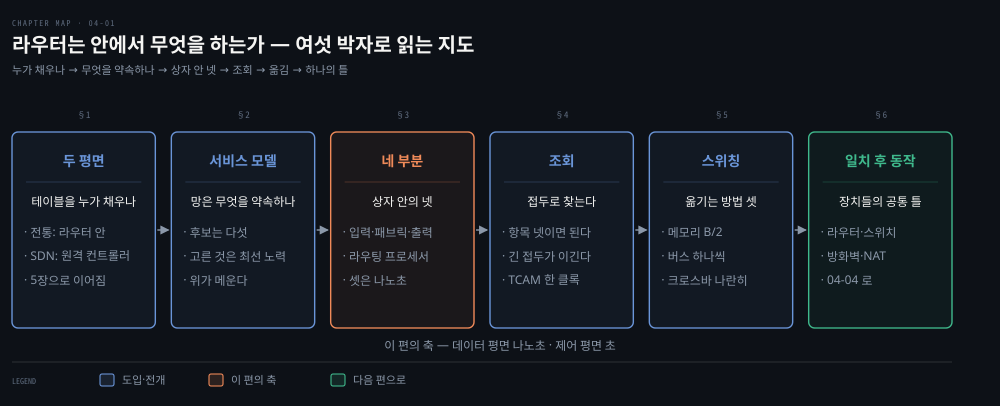

여섯 절이 한 줄로 이어집니다. 첫 절은 포워딩 테이블을 누가 채우는가를 묻습니다. 둘째 절은 망이 무엇을 약속하는지 확인합니다. 셋째부터 다섯째는 상자를 열어 네 부분·조회·스위칭을 봅니다. 마지막 절이 그 모든 장치를 한 틀로 읽는 추상에 닿습니다.

이 편에서 새로 만나는 낱말입니다. `어디서` 는 그 낱말이 실제로 설명되는 절입니다.

| 키워드 | 뜻 | 학습 포인트·연결 개념 | 어디서 |
|---|---|---|---|
| 포워딩 (forwarding) | 라우터 하나 안에서 출력 포트로 옮김 | 나노초 · 하드웨어 · 데이터 평면 | §1 |
| 라우팅 (routing) | 망 전체에서 경로를 정하는 과정 | 초 · 소프트웨어 · 제어 평면 | §1 |
| 데이터 평면 · 제어 평면 | 앞은 라우터 하나 안, 뒤는 망 전체 | SDN 은 제어 평면을 원격 컨트롤러로 뺌 | §1 |
| 최장 접두 일치 (LPM) | 겹치면 접두가 긴 쪽이 이김 | 예외 한 줄이 집약을 안 깨게 하는 규칙 | §4 |
| 스위칭 패브릭 | 입력 포트와 출력 포트를 잇는 속 | 메모리·버스·상호연결망 셋 | §3 |
| 일치 후 동작 (match-plus-action) | 무엇을 보고 무엇을 할지의 한 틀 | 라우터·스위치·방화벽·NAT 이 같은 틀 | §6 |


## 1. 두 평면

> 포워딩 테이블은 어디서 오는가. 이 물음의 답이 둘이고, 그 둘이 지난 10년의 가장 큰 변화입니다.

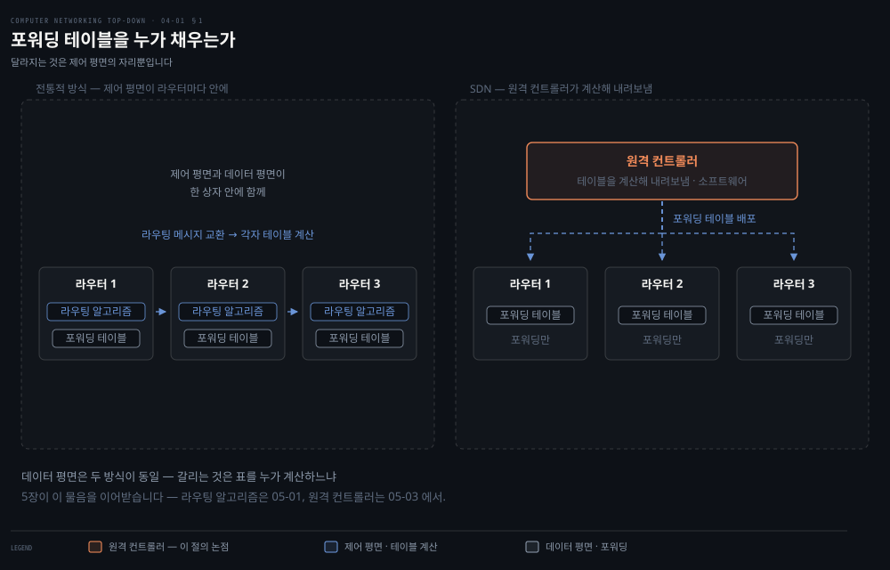

표를 채우는 주체가 어디에 있느냐로 두 방식이 갈립니다. 여기서 포워딩 테이블이란 입력 포트가 패킷의 목적지를 보고 어느 출력 포트로 내보낼지 찾는 표입니다. 도식의 왼쪽은 라우터마다 안에 있고, 오른쪽은 망 밖의 컨트롤러 하나가 계산해 내려보냅니다. 아래 세 줄의 라우터는 양쪽이 같습니다.

### 전통적 방식

라우팅 알고리즘이 **라우터마다 하나씩** 돌면서 다른 라우터의 라우팅 알고리즘과 대화합니다. 대화의 수단은 라우팅 프로토콜에 따라 라우팅 정보를 담아 주고받는 **라우팅 메시지**입니다. 포워딩과 라우팅이 **한 상자 안에** 함께 있습니다.

원문이 이 구분을 드러내려고 가상의 상황을 하나 세웁니다. 모든 포워딩 테이블을 **사람이 라우터 앞에 직접 가서** 설정한다고 해 봅시다. 그러면 라우팅 프로토콜이 아예 필요 없습니다.

물론 사람끼리 서로 이야기해서 패킷이 목적지에 닿도록 맞춰야 하고, 사람이 하는 설정은 **오류가 잦고 위상 변화에 훨씬 느리게 반응**할 것입니다. 그래서 실제로는 둘 다 있는 편이 다행이라고 원문이 덧붙입니다.

### SDN 방식

그런데 방금의 사고 실험이 힌트를 줍니다. 포워딩 테이블을 채우는 주체가 **꼭 그 라우터 안에 있을 필요는 없습니다.**

물리적으로 분리된 **원격 컨트롤러**가 망 안 모든 라우터의 포워딩 테이블을 계산해 내려보냅니다. 이 방식을 원문은 **SDN**(Software-Defined Networking, 소프트웨어로 정의하는 네트워킹)이라 부릅니다. 데이터 평면은 두 방식이 **완전히 같습니다.** 달라지는 것은 제어 평면뿐입니다. 라우팅 장치는 포워딩만 하고, 원격 컨트롤러가 테이블을 계산해 배포합니다.

컨트롤러는 신뢰성과 이중화를 갖춘 원격 데이터센터에 있을 수 있고, ISP 가 운영할 수도 제삼자가 운영할 수도 있습니다.

이름의 뜻도 원문이 밝힙니다. 망이 **소프트웨어로 정의된다**고 하는 것은, 포워딩 테이블을 계산하고 라우터와 대화하는 **컨트롤러가 소프트웨어로 구현되기** 때문입니다. 게다가 그 소프트웨어가 점점 **공개**되고 있어서, 리눅스 코드처럼 누구나 보고 고칠 수 있습니다.


## 2. 인터넷이 주는 서비스는 하나뿐입니다

> 네트워크 층이 줄 수 있었던 서비스는 여럿입니다. 인터넷이 고른 것은 그중 가장 적게 약속하는 것입니다.

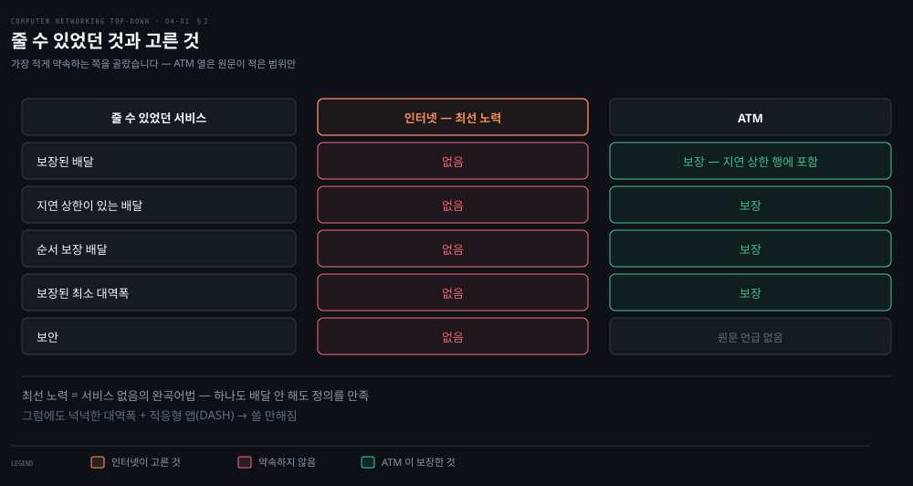

왼쪽 열이 줄 수 있었던 다섯이고, 가운데 인터넷 열은 전부 비어 있습니다. 아래에서 그 다섯을 하나씩 본 뒤 인터넷이 왜 그 빈 열을 골랐는지 봅니다.

### 줄 수 있었던 것들

원문이 가능한 서비스를 다섯 나열합니다.

- **보장된 배달**: 출발지가 보낸 패킷이 결국 목적지에 도착합니다.
- **지연 상한이 있는 보장된 배달**: 도착할 뿐 아니라 정해진 시간 안에, 예컨대 100 밀리초 안에 도착합니다.
- **순서 보장 배달**: 보낸 순서대로 도착합니다.
- **보장된 최소 대역폭**: 정해진 비트율의 전송 링크를 흉내 냅니다. 그 아래로 보내는 한 모든 패킷이 결국 도착합니다.
- **보안**: 출발지에서 암호화하고 목적지에서 복호화합니다.

### 인터넷이 고른 것

인터넷의 네트워크 층은 **최선 노력 서비스** 하나만 줍니다. 순서도 보장 안 되고 배달 자체도 보장 안 되며 지연 상한도 최소 대역폭도 없습니다.

원문이 이 서비스 모델의 허약함을 스스로 조롱합니다.

> 최선 노력 서비스가 **서비스가 없다는 말의 완곡어법**처럼 보일 수 있습니다. 목적지에 패킷을 하나도 배달하지 않는 망도 최선 노력 배달 서비스의 정의를 만족하기 때문입니다.

- 대안이 없었던 것도 아닙니다. **Asynchronous Transfer Mode(비동기 전송 방식)** 은 순서·지연 상한·최소 대역폭을 보장했고, 인터넷 쪽에도 Intserv 같은 확장 제안이 있었습니다.
- 그런데 원문의 결론이 흥미롭습니다. 잘 개발된 대안들이 있었음에도 **최선 노력 서비스에 넉넉한 대역폭 확보와 대역폭 적응형 애플리케이션 프로토콜을 더한 것**이 충분히 "쓸 만하다"는 것이 드러났습니다. 원문이 예로 드는 그 적응형 프로토콜이 [02-04](./02-04.영상은%20어떻게%20끊기지%20않는가.md) 의 DASH 입니다.

> **노트의 읽기**: 이 대목이 3장의 결론과 짝을 이룹니다. 3장에서 **인터넷은 처리량 보장도 타이밍 보장도 주지 않는다**고 했고, 그 자리에서 부족한 것을 애플리케이션이 스스로 메웁니다. 
>
> 4장은 같은 사실을 아래층에서 다시 말합니다. **아래가 적게 약속했기 때문에 위가 많이 만들어야 했고, 결과적으로 위가 유연해졌습니다.** 보장을 주는 망을 골랐다면 DASH 도 QUIC 도 필요 없었겠지만, 대신 새 응용이 나올 때마다 망을 고쳐야 했을 것입니다.


## 3. 라우터의 네 부분

> 상자를 엽니다. 안에 네 덩어리가 있고, 그중 셋은 하드웨어이며 하나만 소프트웨어입니다.

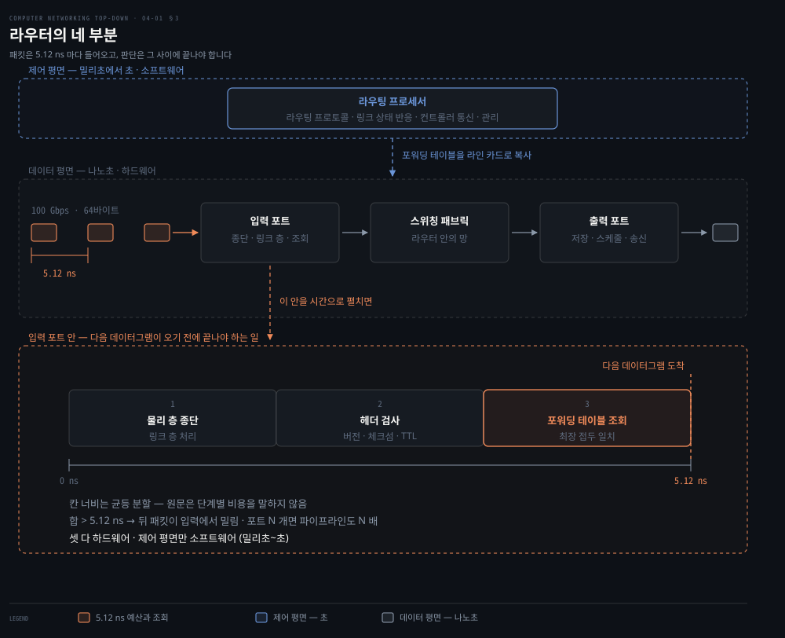

위쪽 점선 칸이 제어 평면이고 가운데가 데이터 평면입니다. 왼쪽 링크 위에 패킷이 연달아 그려져 있는데, 그 **간격이 곧 입력 포트가 쓸 수 있는 시간**입니다. 아래 칸은 그 간격 안을 시간축으로 펼친 것이라, 종단부터 조회까지가 다음 패킷이 도착하기 전에 끝나야 한다는 사실이 한 장에 같이 보입니다.

- **입력 포트**: 물리 층 종단과 링크 층 처리를 하고, 가장 중요하게는 **조회**를 합니다. 포워딩 테이블을 뒤져 이 패킷이 나갈 출력 포트를 정합니다. 라우팅 프로토콜 정보를 나르는 제어 패킷은 라우팅 프로세서로 보냅니다.
- **스위칭 패브릭**: 입력 포트와 출력 포트를 잇습니다. 원문의 표현으로 **라우터 안의 망**입니다.
- **출력 포트**: 패브릭에서 온 패킷을 저장했다가 링크로 내보냅니다. 링크가 양방향이면 보통 같은 라인 카드에서 입력 포트와 짝을 이룹니다.
- **라우팅 프로세서**: 제어 평면 기능을 합니다. 전통 라우터에서는 라우팅 프로토콜을 실행하고 포워딩 테이블을 계산하며, **SDN 라우터에서는 원격 컨트롤러와 통신해 받은 항목을 입력 포트에 심습니다.**

원문이 용어 혼동을 하나 미리 막습니다. 여기서의 **포트는 물리적인 입출력 인터페이스**를 가리키며, 2·3장에서 본 소켓의 소프트웨어 포트와 전혀 다릅니다.

### 왜 하드웨어여야 하나

숫자 하나가 이유를 다 말합니다. **100 Gbps 입력 링크에 64바이트 IP 데이터그램**이면, 다음 데이터그램이 오기까지 **5.12 나노초**뿐입니다.

```python
64 * 8 / 100e9 * 1e9      # 5.12    나노초 — 다음 데이터그램까지의 간격
1 / 3e9 * 1e9             # 0.333   나노초 — 3 GHz 로 잡은 CPU 의 클록 하나
5.12 / (1 / 3e9 * 1e9)    # 15.36   클록   — 예산 안에 쓸 수 있는 전부
```

둘째 줄의 3 GHz 는 원문의 값이 아니라 요즘 서버 CPU 를 넉넉하게 잡은 것입니다. 그렇게 잡아도 예산 전체가 **열다섯 클록 남짓**입니다. 함수 하나를 부르고 돌아오는 정도에 다 쓰이는 양입니다. 포트 여럿을 한 기판에 실은 **라인 카드**에 포트가 N 개 묶여 있으면 이 파이프라인이 **N 배 빨라야** 하니 예산은 거기서 다시 N 분의 1 로 줄어듭니다.

소프트웨어로 해 보면 어떻게 되는지는 이 편 뒤에서 두 번 확인됩니다.

- **§5 의 메모리 교환 방식**이 바로 그 시도였습니다. 패킷마다 인터럽트를 걸어 프로세서를 부르고 메모리에 한 번 쓰고 한 번 읽는 네 걸음을 밟으면, 전체 처리량이 메모리 대역폭의 절반 아래로 접힙니다. 걸음을 늘어놓은 것만으로 상한이 정해집니다.
- **§4 의 조회**도 마찬가지입니다. 보통 메모리로 접두 표를 뒤지면 항목마다 클록이 하나씩 듭니다. 항목이 백만 개면 클록도 백만 번이라, 열다섯 클록 예산과 자릿수가 다섯 개 어긋납니다.

하드웨어가 다른 점은 빠르다는 것이 아니라 **순서대로 하지 않는다**는 것입니다. TCAM 은 모든 항목이 동시에 자기와 맞는지 비교하므로 항목이 늘어도 한 클록입니다. 파이프라인은 앞 패킷의 조회가 끝나기를 기다리지 않고 단계마다 다른 패킷을 물고 있어서, 패킷 하나가 통과하는 데 5.12 나노초보다 오래 걸려도 **5.12 나노초마다 하나씩** 뱉어낼 수 있습니다. 앞 도식의 아래 칸이 이 예산을 그린 것입니다.

### 제어 기능은 초 단위라서 소프트웨어로 됩니다

같은 상자 안인데 라우팅 프로세서만 소프트웨어인 것은, 그쪽이 맡은 일이 패킷이 아니라 **망의 상태**를 다루기 때문입니다. 원문이 그 일을 넷 셉니다.

- **라우팅 프로토콜 실행**: 이웃 라우터와 라우팅 메시지를 주고받고 그 결과로 포워딩 테이블을 다시 계산합니다. 어떤 프로토콜이 어떻게 계산하는지는 5장이 다룹니다.
- **링크가 올라가고 내려가는 것에 대한 반응**: 인터페이스 하나가 죽으면 그 링크를 지나는 경로를 표에서 빼고 다시 계산해 라인 카드로 내려보냅니다.
- **원격 컨트롤러와의 통신**: SDN 이면 표를 스스로 계산하지 않고, 컨트롤러가 보낸 항목을 받아 입력 포트에 심습니다.
- **관리 기능**: 설정을 바꾸고 계수기를 읽고 장비 상태를 보고합니다.

넷 다 **패킷 하나가 올 때가 아니라 망이 바뀔 때** 도는 일입니다. 링크가 끊기는 사건은 초 단위로 일어나고, 표를 다시 계산하는 동안에도 흐르는 패킷은 이미 라인 카드에 복사돼 있는 표로 처리됩니다. 그래서 이쪽은 반응이 몇 밀리초 늦어도 망이 무너지지 않습니다.

두 시간 척도가 얼마나 벌어져 있는지 재 보면 밀리초 하나가 5.12 나노초의 **약 20만 배**입니다. 같은 상자에 들어 있어도 구현 방식이 갈릴 수밖에 없는 간격입니다.

```python
1e-3 / 5.12e-9            # 195312.5  배 — 밀리초 하나가 5.12 ns 의 몇 배인가
```

### 회전교차로 비유

원문이 이 장 내내 쓰는 비유를 여기서 세웁니다. 차가 진입소에 서서 최종 목적지를 말하면 안내원이 나갈 램프를 알려 줍니다.

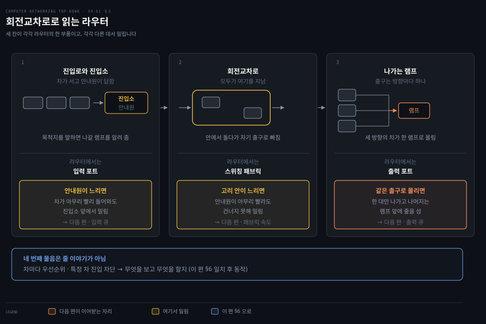

비유가 좋은 이유는 대응이 맞아떨어져서가 아니라 **병목이 생길 자리를 묻게** 만들기 때문입니다. 도식의 세 칸 아래에 붙은 물음이 원문이 던지는 것들이고, 셋 다 다음 편의 큐잉 이야기로 이어집니다. 아래 띠의 넷째 물음만 성격이 다릅니다. 줄이 어디서 길어지느냐가 아니라 무엇을 보고 무엇을 할지의 문제라, 이 편 끝의 일치 후 동작이 그것을 받습니다.


## 4. 조회 — 최장 접두 일치

> 32비트 주소마다 항목을 하나씩 두면 40억 개가 넘습니다. 그래서 주소가 아니라 접두를 봅니다.

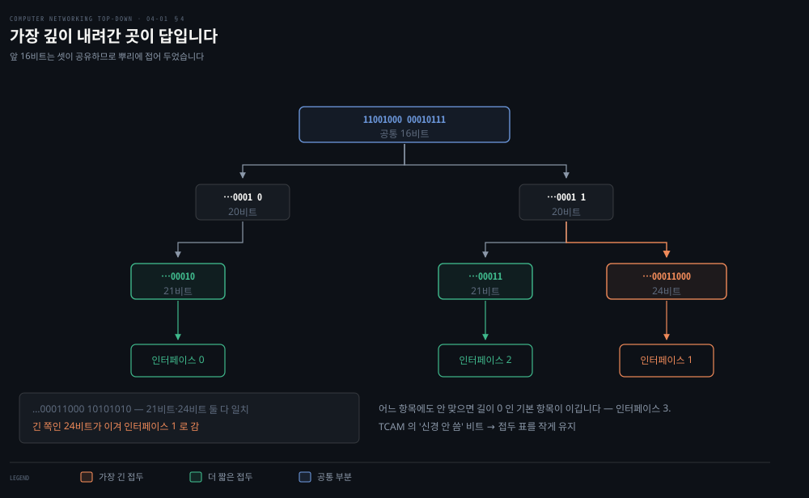

### 접두로 줄입니다

원문의 예를 그대로 옮깁니다. 라우터에 링크가 넷 있고 주소 범위가 이렇게 배정돼 있습니다.

| 목적지 주소 범위 | 링크 인터페이스 |
|---|---|
| `11001000 00010111 00010000 00000000` ~ `11001000 00010111 00010111 11111111` | 0 |
| `11001000 00010111 00011000 00000000` ~ `11001000 00010111 00011000 11111111` | 1 |
| `11001000 00010111 00011001 00000000` ~ `11001000 00010111 00011111 11111111` | 2 |
| 그 밖의 모든 주소 | 3 |

40억 개가 아니라 **네 항목**이면 됩니다.

| 접두 | 링크 인터페이스 |
|---|---|
| `11001000 00010111 00010` | 0 |
| `11001000 00010111 00011000` | 1 |
| `11001000 00010111 00011` | 2 |
| 그 밖 | 3 |

### 겹치면 긴 쪽이 이깁니다

여기에 원문이 **아주 중요한 미묘함**이라 부르는 것이 있습니다. 목적지 주소 하나가 **여러 항목에 맞을 수 있습니다.**

`11001000 00010111 00011000 10101010` 을 보면 앞 24비트가 두 번째 항목에 맞고 앞 21비트가 세 번째 항목에 맞습니다. 이럴 때 라우터는 **최장 접두 일치** 규칙을 씁니다. 가장 긴 항목을 찾아 그 인터페이스로 보냅니다.

표와 예를 코드로 검산했습니다. 원문의 값이 모두 맞습니다.

```python
table = [("11001000 00010111 00010", 0),
         ("11001000 00010111 00011000", 1),
         ("11001000 00010111 00011", 2)]

# 11001000 00010111 00010110 10100001 → 인터페이스 0 (21비트 일치)
# 11001000 00010111 00011000 10101010 → 인터페이스 1 (24비트 일치)
# 11001000 00010111 00011001 00000001 → 인터페이스 2 (21비트 일치)
# 그 밖                                → 인터페이스 3 (기본)
```

- 주소 범위 표와 접두 표가 서로 맞는지도 확인했습니다. 세 범위의 공통 접두가 각각 **21비트, 24비트, 21비트**로 접두 표와 정확히 일치합니다.

### 나노초 안에 찾으려면

개념은 단순한데 속도가 문제입니다. 앞의 5.12 나노초 안에 이 조회를 끝내야 합니다.

실무에서 자주 쓰는 것이 **TCAM**(Ternary Content Addressable Memory) 입니다. 32비트 주소를 연관 메모리에 넣으면 **한 클록 사이클에** 해당 포워딩 테이블 항목의 내용을 돌려줍니다.

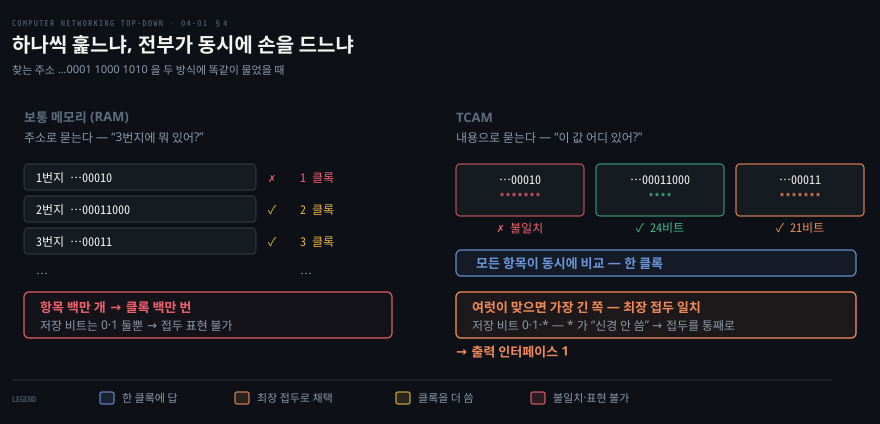

왼쪽이 보통 메모리입니다. 주소로 한 칸을 읽고 접두와 견주기를 반복하므로 항목이 백만 개면 클록도 백만 번입니다. 오른쪽이 TCAM 이고 묻는 방향이 반대입니다. 찾을 값을 던지면 **모든 항목이 동시에 자기와 맞는지 비교하고**, 손을 든 것들 가운데 가장 긴 쪽이 뽑힙니다. 한 클록에 끝나는 이유가 순서대로 보지 않기 때문입니다.

이름의 삼진이 핵심입니다. 표에 저장된 접두의 비트가 **0, 1, 그리고 신경 안 씀(`*`)** 셋을 가질 수 있고, 조회하러 들어오는 주소는 0 과 1 뿐입니다. 이 "신경 안 씀"이 바로 접두 표를 작게 유지하는 열쇠입니다.

대가도 있습니다. TCAM 은 **비싸고 전력을 많이 씁니다.** 그래서 SRAM 을 섞는 혼합 방식과 순수 알고리즘 방식도 함께 쓰입니다.

### 조회 말고도 하는 일

원문이 입력 포트에서 조회 외에 하는 일을 셋 셉니다.

1. 물리 층과 링크 층 처리
2. 패킷의 **버전 번호·체크섬·TTL 필드 검사**, 그리고 뒤의 둘은 **다시 씀**
3. 망 관리용 계수기 갱신


## 5. 스위칭 — 세 가지 방식

> 입력에서 출력으로 실제로 옮기는 방법이 셋입니다. 셋이 각각 다른 자리에서 막힙니다.

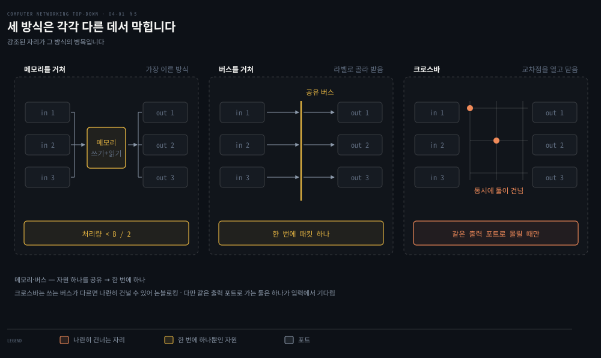

셋 다 하는 일은 같은데 감당하는 양이 다릅니다. 무엇을 여럿이 나눠 쓰느냐가 그 차이를 만드는데, 도식에서 강조된 자리가 바로 그 나눠 쓰는 자원입니다. 아래에서 방식마다 동작 순서와 장단점을 하나씩 봅니다.

### 메모리를 거쳐

가장 단순하고 가장 이른 방식입니다. 초기 라우터는 그냥 컴퓨터였고 입출력 포트가 운영체제의 I/O 장치처럼 동작했습니다. 패킷이 도착하면 입력 포트가 인터럽트로 라우팅 프로세서를 부르고, 프로세서가 패킷을 자기 메모리로 가져와 조회한 뒤 출력 포트 버퍼로 다시 옮깁니다.

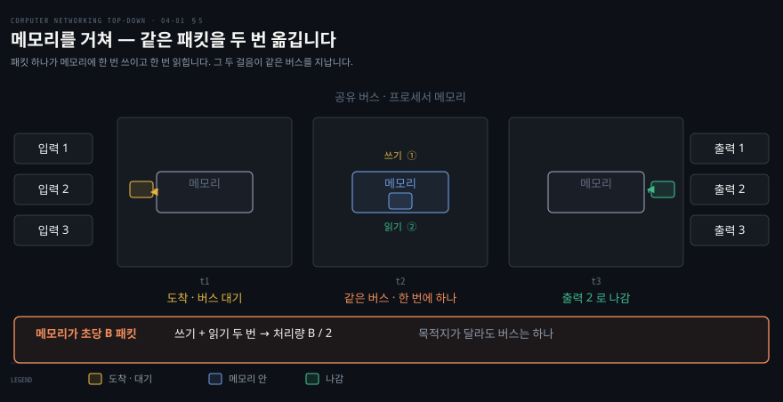

한계가 산수로 나오는 이유는 걸음 둘이 같은 메모리를 쓰기 때문입니다. 메모리가 초당 B 패킷을 읽거나 쓸 수 있어도 패킷마다 쓰기 한 번과 읽기 한 번이 들므로 **전체 포워딩 처리량은 `B/2` 아래**입니다. 게다가 공유 버스에서 한 번에 하나의 메모리 접근만 되므로 **목적지가 달라도 두 패킷을 동시에 보낼 수 없습니다.**

지금의 라우터도 메모리를 거쳐 스위칭하는 것이 있는데, 차이가 하나 있습니다. **조회와 저장을 라인 카드에서** 합니다. 프로세서를 부르는 걸음이 빠지는 것이라, 위 도식에서 단점으로 적힌 셋 중 마지막 하나가 사라집니다.

### 버스를 거쳐

입력 포트가 라우팅 프로세서를 거치지 않고 공유 버스로 출력 포트에 직접 넘깁니다. 방법이 간단합니다. 입력 포트가 **스위치 내부용 라벨**을 패킷 앞에 붙여 버스에 실으면, 모든 출력 포트가 받되 **라벨이 맞는 포트만 보관**합니다. 라벨은 버스를 건너는 데만 쓰이므로 출력 포트에서 떼어 냅니다.

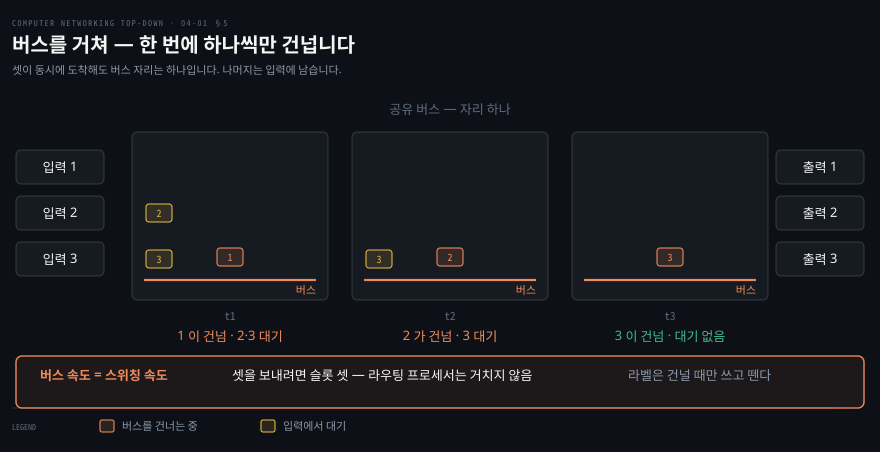

여기서 버스는 무엇을 담아 두는 장치가 아닙니다. 램과 디스크가 무엇인가를 **보관**하는 부품이라면, 버스는 그 부품들이 함께 물려 있는 **배선 다발**입니다. 하는 일이 보관이 아니라 연결이라, 버스 위로는 신호가 지나갈 뿐 머물지 않습니다. 앞 방식이 패킷을 메모리에 한 번 적었다가 다시 읽는 두 걸음이었다면, 이 방식은 그 적는 자리를 없애고 배선만 남긴 것입니다.

한계는 분명합니다. 한 번에 패킷 하나만 버스를 건너므로 **라우터의 스위칭 속도가 버스 속도에 묶입니다.** 회전교차로 비유로는 **한 번에 차 한 대만 들어갈 수 있는 회전교차로**입니다. 도식에서 입력 포트 1 과 3 이 자기 차례를 기다리는 자리가 그 대가입니다.

### 상호연결망을 거쳐

**크로스바 스위치**는 N 개 입력과 N 개 출력을 잇는 **2N 개의 버스**로 이뤄집니다. 세로 버스와 가로 버스가 만나는 자리가 **교차점**이고, 패브릭 컨트롤러가 그것을 열고 닫습니다.

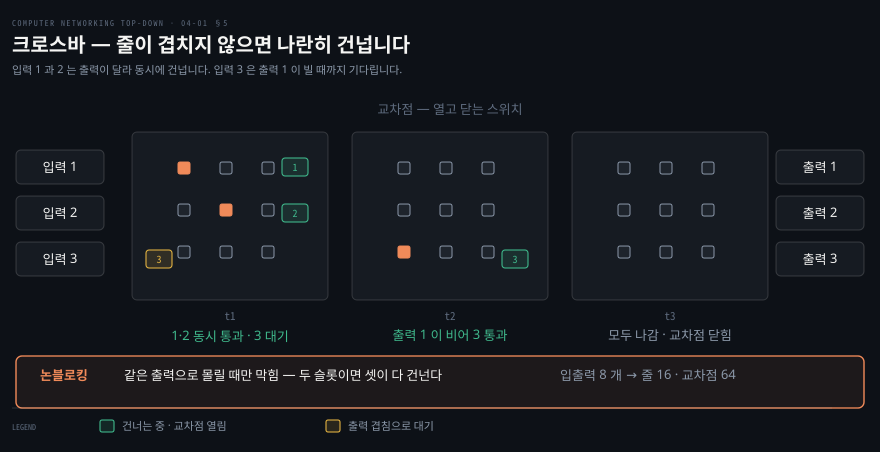

도식은 그 교차점을 입력과 출력의 조합표로 편 것입니다. 닫힌 칸이 둘인데 쓰는 줄이 겹치지 않아 나란히 건너고, 세 번째 입력만 이미 쓰이는 출력을 기다립니다.

A 에서 Y 로 보내려면 A 버스와 Y 버스의 교차점을 닫습니다. 그러면 **B 에서 X 로 가는 패킷을 동시에** 보낼 수 있습니다. 쓰는 버스가 다르기 때문입니다. 앞의 두 방식과 달리 **여러 패킷을 나란히** 보낼 수 있습니다.

산수를 해 보면 앞 방식과 무엇이 다른지 보입니다. 입력이 N 개, 출력이 N 개면 가로 버스 N 줄과 세로 버스 N 줄이 놓여 합쳐 **2N 줄**입니다. 가로줄과 세로줄이 만나는 자리는 **N × N = N² 곳**입니다. 입력과 출력이 각각 8 개면 줄은 16 개이고 교차점은 64 개입니다. 원문은 2N 개의 버스까지만 적으며 교차점 수는 그 정의에서 따라 나옵니다.

이름은 똑같이 버스인데 앞 방식과 다른 점은 줄이 여럿이라는 것이 아닙니다. **줄마다 주인이 정해져 있다는 것**입니다. 공유 버스는 한 줄을 모두가 번갈아 쓰므로 누가 쓰는 동안 나머지는 기다립니다. 크로스바는 입력마다·출력마다 전용 줄이 있고 그 사이를 교차점이 잇습니다. 그래서 A 에서 Y 로 가는 패킷과 B 에서 X 로 가는 패킷이 서로 다른 줄 네 개와 교차점 두 곳을 쓰면서 나란히 갑니다. 값도 같은 산수에서 나옵니다. 줄은 2N 으로 늘지만 교차점은 N² 으로 늘어 포트를 두 배로 하면 교차점은 네 배가 됩니다.

크로스바는 **논블로킹**입니다. 다만 조건이 붙습니다. **같은 출력 포트로 가는 다른 패킷이 없는 한** 막히지 않습니다. 두 입력 포트의 패킷이 같은 출력 포트로 가면 하나는 입력에서 기다려야 합니다.

| 방식 | 강점 | 어디에서 막히나 | 상한 |
|---|---|---|---|
| 메모리 | 패브릭이라 부를 하드웨어가 따로 없음 | 메모리 대역폭 | `B/2` |
| 버스 | 프로세서와 메모리 왕복을 건너뜀 | 버스 속도 | 한 번에 패킷 하나 |
| 크로스바 | 여러 쌍이 나란히 건넘 | 같은 출력 포트로 몰릴 때 | 출력 포트당 하나 |

더 정교한 상호연결망은 **여러 단계**의 스위칭 소자를 써서 서로 다른 입력의 패킷이 같은 출력으로 동시에 나아가게 합니다. 패브릭을 여러 개 나란히 돌려 용량을 키우기도 하는데, 입력 포트가 패킷을 K 조각으로 쪼개 **여러 패브릭에 뿌리고** 출력 포트가 다시 합치는 방식입니다.


## 6. 일치 후 동작 — 이 장의 추상

> 라우터와 스위치와 방화벽과 NAT 는 하는 일이 제각각입니다. 그런데 만드는 쪽에서 보면 같은 틀 위에 얹힙니다.

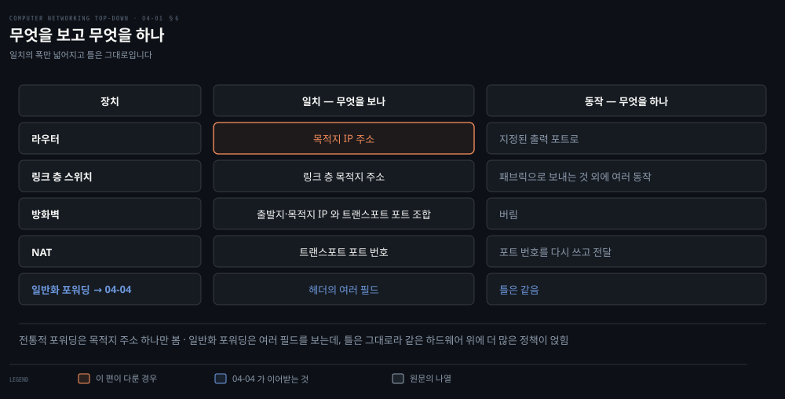

행마다 장치가 하나이고 열은 둘뿐입니다. 무엇을 보는가, 그리고 무엇을 하는가. 다섯째 행은 원문의 나열이 아니라 이 절 끝의 노트가 04-04 로 이어 둔 자리입니다.

같은 하드웨어 구조로 이렇게 다른 장치를 만들 수 있는 이유가 무엇인가. 원문이 절을 닫으며 그 답을 줍니다. 목적지 IP 주소를 조회하고**(일치)** 지정된 출력 포트로 보내는 것**(동작)** 은, 라우터뿐 아니라 **많은 네트워크 장치에서 수행되는 더 일반적인 추상의 특수한 경우**입니다.

같은 틀로 읽히는 것들을 원문이 나열합니다.

| 장치 | 일치 | 동작 |
|---|---|---|
| 라우터 | 목적지 IP 주소 | 지정된 출력 포트로 |
| 링크 층 스위치 | 링크 층 목적지 주소 | 패브릭으로 보내는 것 외에 여러 동작 |
| 방화벽 | 출발지·목적지 IP 와 트랜스포트 포트의 조합 | 버림 |
| NAT | 트랜스포트 포트 번호 | 포트 번호를 다시 쓰고 전달 |

원문의 표현으로 이 추상은 오늘날의 네트워크 장치에서 **강력하고 널리 퍼져** 있으며, 뒤의 일반화 포워딩 개념의 중심입니다.

> **노트의 읽기**: 이 추상이 왜 중요한지는 **일치의 폭**을 보면 알 수 있습니다. 전통적 포워딩은 목적지 주소 하나만 봅니다. 일반화 포워딩은 헤더의 여러 필드를 봅니다. 그런데 **틀 자체는 바뀌지 않습니다.** 그래서 같은 하드웨어 구조 위에서 훨씬 다양한 정책을 표현할 수 있게 되고, 그것이 SDN 을 가능하게 한 기술적 토대입니다. 04-04 가 그 이야기를 이어받습니다.


## 라우터 치트시트

> 두 평면의 구별과 라우터 안의 병목 자리를 두 장으로 줄였습니다.

**두 평면**

| 물음 | 데이터 평면 | 제어 평면 |
|---|---|---|
| 하는 일 | 포워딩 | 라우팅 |
| 범위 | 라우터 하나 안 | 망 전체 |
| 시간 | 나노초 | 초 |
| 구현 | 하드웨어 | 소프트웨어 |
| 어디에 있나 | 언제나 라우터 안 | 라우터 안(전통) 또는 원격 컨트롤러(SDN) |

**라우터 안에서 막히는 자리**

| 자리 | 왜 막히나 | 어디서 다루나 |
|---|---|---|
| 입력 포트의 조회 | 5.12 ns 안에 최장 접두 일치를 끝내야 함 | 이 편 §4 |
| 스위칭 패브릭 | 메모리·버스·교차점의 용량 | 이 편 §5 |
| 같은 출력 포트로 몰림 | 출력 링크가 하나뿐 | 다음 편 |


## 심화 학습

> 최장 접두 일치는 자기 기계의 라우팅 테이블에서 바로 볼 수 있습니다.

```bash
# 이 기계의 포워딩 테이블 — 접두 길이가 다른 항목들이 섞여 있습니다
netstat -rn -f inet | head -12
# 리눅스라면
# ip route show

# 특정 목적지에 어느 항목이 뽑히는지 — 최장 접두 일치의 결과입니다
route -n get 8.8.8.8 2>/dev/null | head -6
# 리눅스라면
# ip route get 8.8.8.8

# 기본 경로(0.0.0.0/0)가 곧 원문 표의 "그 밖" 항목입니다
netstat -rn -f inet | awk '$1=="default"'
```

`netstat -rn` 의 출력에서 접두 길이가 긴 항목과 짧은 항목이 함께 있는 것을 보면, 왜 "가장 긴 것이 이긴다"는 규칙이 필요한지 바로 보입니다. 기본 경로는 길이 0 이므로 **다른 어떤 항목도 없을 때만** 이깁니다.


## 면접 대비

> 이 편에서 실제로 묻는 자리는 포워딩과 라우팅의 구별, 최장 접두 일치, 그리고 크로스바가 언제 막히는가입니다.

### 한 줄 정의

- **포워딩**: 라우터 하나 안에서 입력 인터페이스의 패킷을 알맞은 출력 인터페이스로 옮기는 일입니다.
- **라우팅**: 출발지에서 목적지까지의 경로를 정하는 망 전체의 과정입니다.
- **최장 접두 일치**: 여러 항목이 맞을 때 가장 긴 접두를 가진 항목을 고르는 규칙입니다.
- **일치 후 동작**: 헤더 필드를 보고 정해진 동작을 하는 네트워크 장치의 공통 추상입니다.

### 핵심 포인트 세 가지

1. 두 기능의 차이는 **범위와 시간 척도**입니다. 나노초의 라우터 내부와 초의 망 전체입니다.
2. 인터넷의 네트워크 층은 **최선 노력 하나**만 줍니다. 나머지는 전부 위층이 만듭니다.
3. 크로스바는 논블로킹이지만 **같은 출력 포트로 몰리면** 막힙니다.

### 자주 묻는 질문

**"포워딩 테이블과 라우팅 테이블은 같습니까?"** 아닙니다. 라우팅 테이블은 제어 평면이 유지하는 경로 정보이고, 포워딩 테이블은 그것에서 계산돼 각 라인 카드에 복사된 조회용 표입니다. 원문의 표현으로 라인 카드마다 **그림자 사본**을 두어 패킷마다 중앙 프로세서를 부르지 않습니다.

**"데이터 평면을 소프트웨어로 만들면 왜 안 됩니까?"** 예산이 없기 때문입니다. 100 Gbps 링크에 64바이트 데이터그램이면 패킷 사이가 5.12 나노초입니다. 3 GHz CPU 기준으로 열다섯 클록 남짓이고 그 안에 종단·검사·조회가 다 끝나야 합니다. 소프트웨어는 한 걸음씩 순서대로 밟아서 그 안에 못 들어갑니다. 하드웨어는 TCAM 처럼 모든 항목을 동시에 비교하고 파이프라인으로 단계마다 다른 패킷을 물고 있습니다. 그래서 패킷 하나의 통과 시간이 예산보다 길어도 매 5.12 나노초마다 하나씩 뱉어냅니다.

**"왜 TCAM 을 씁니까?"** 한 클록 사이클에 조회가 끝나기 때문입니다. 삼진 메모리라 "신경 안 씀" 비트를 쓸 수 있어서 접두 표를 작게 유지합니다. 대신 비싸고 전력을 많이 씁니다.

**"SDN 에서 라우터는 무엇을 합니까?"** 포워딩만 합니다. 라우팅 프로세서는 원격 컨트롤러가 계산해 보낸 포워딩 테이블 항목을 받아 입력 포트에 심는 일을 맡습니다.


## 핵심 개념 체크리스트

> 아래를 보지 않고 말할 수 있으면 이 편은 통과입니다.

- [ ] 포워딩과 라우팅을 범위와 시간 척도로 구별할 수 있습니다.
- [ ] 전통적 제어 평면과 SDN 제어 평면의 차이를 말할 수 있습니다.
- [ ] SDN 에서 데이터 평면이 바뀌지 않는다는 것을 압니다.
- [ ] 네트워크 층이 줄 수 있었던 서비스 다섯을 댈 수 있습니다.
- [ ] 최선 노력 서비스가 보장하지 않는 것을 셀 수 있습니다.
- [ ] 라우터의 네 구성 요소와 각각의 역할을 말할 수 있습니다.
- [ ] 왜 데이터 평면이 하드웨어여야 하는지 숫자로 설명할 수 있습니다.
- [ ] 라우팅 프로세서가 맡는 제어 기능 넷을 댈 수 있습니다.
- [ ] 접두 표가 왜 40억 항목보다 작은지 설명할 수 있습니다.
- [ ] 최장 접두 일치를 예에 적용할 수 있습니다.
- [ ] TCAM 의 삼진이 무엇을 뜻하는지 말할 수 있습니다.
- [ ] 세 스위칭 방식의 강점과 한계를 각각 댈 수 있습니다.
- [ ] 크로스바가 논블로킹인 조건을 말할 수 있습니다.
- [ ] 일치 후 동작 추상으로 라우터·스위치·방화벽·NAT 를 설명할 수 있습니다.


## 관련 문서

- [03-05 혼잡을 어떻게 다스리는가](./03-05.혼잡을%20어떻게%20다스리는가.md) — 앞 장의 끝. 라우터 버퍼가 넘치는 것이 왜 문제였는지
- [04-02 줄은 어디에 서고 누가 먼저 나가는가](./04-02.줄은%20어디에%20서고%20누가%20먼저%20나가는가.md) — 이 편의 다음. 큐가 생기는 자리와 스케줄링
- [02-04 영상은 어떻게 끊기지 않는가](./02-04.영상은%20어떻게%20끊기지%20않는가.md) — 최선 노력 위에서 응용이 스스로 적응한 사례
- [Computer Networking — 정독 인덱스](./README.md) — 8개 장 전체 지도


## 참고 자료

- 원본: 《Computer Networking: A Top-Down Approach》 9판 (James F. Kurose · Keith W. Ross, Pearson)
- 다룬 범위: §4.1 Overview of Network Layer · §4.2.1 Input Port Processing · §4.2.2 Switching · §4.2.3 Output Port Processing
- [RFC 1633 — Integrated Services in the Internet Architecture](https://www.rfc-editor.org/info/rfc1633) — 원문이 최선 노력의 대안으로 드는 Intserv
