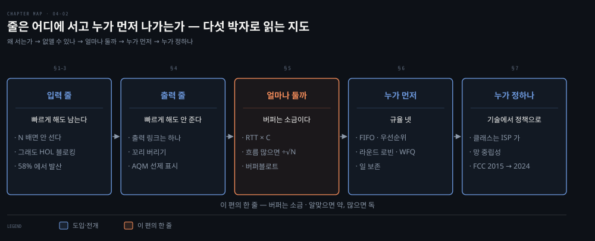
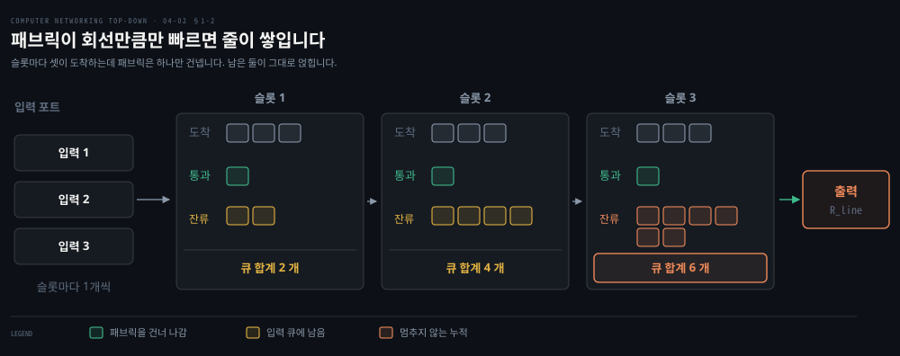
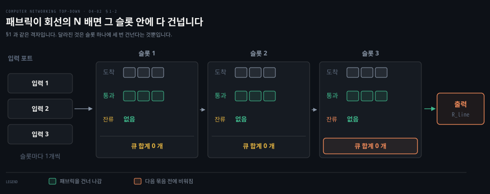
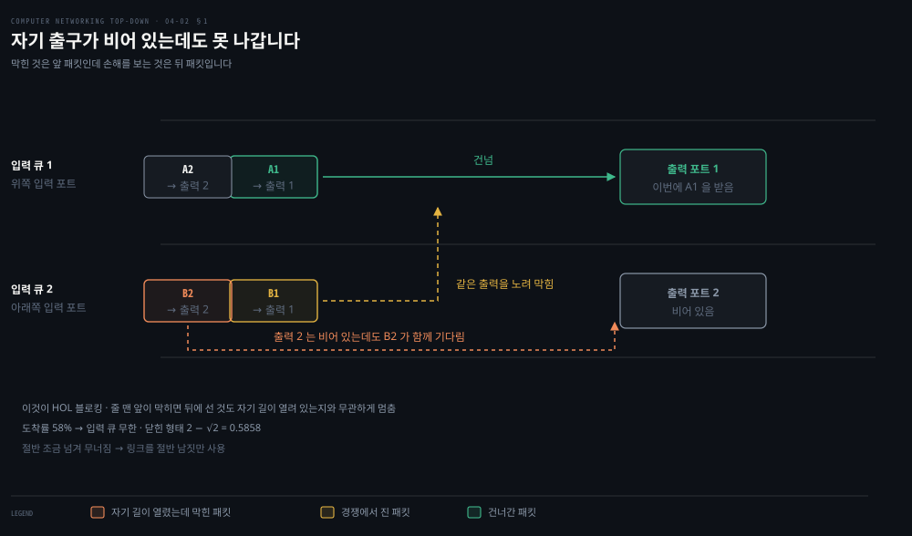
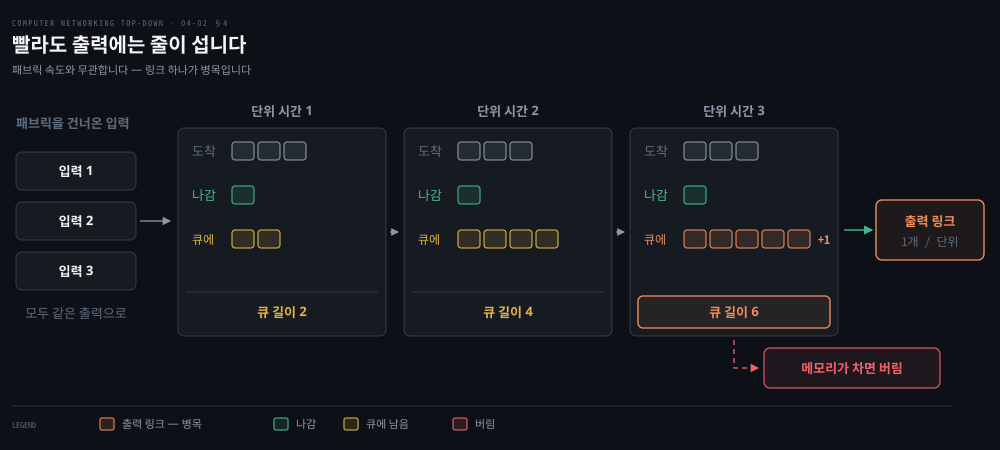
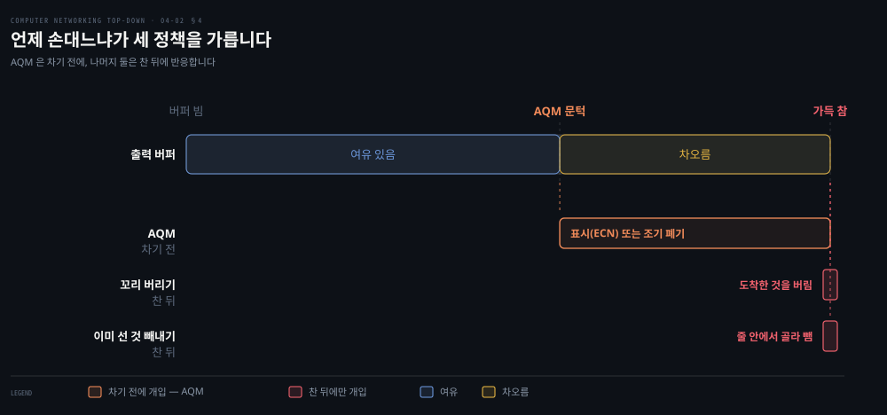
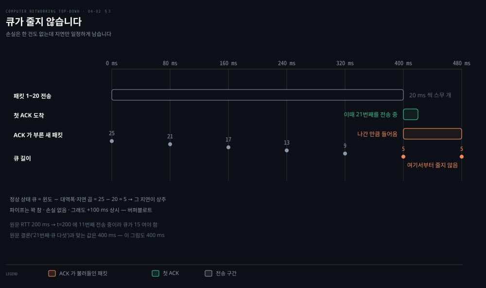
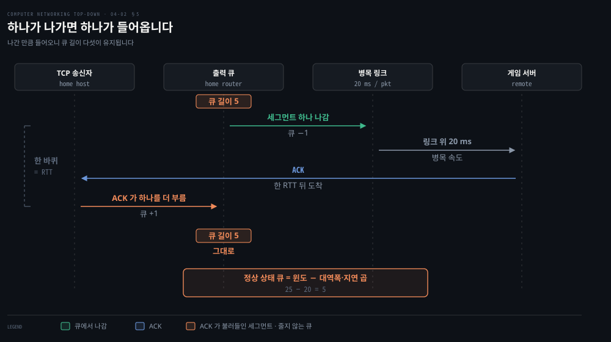
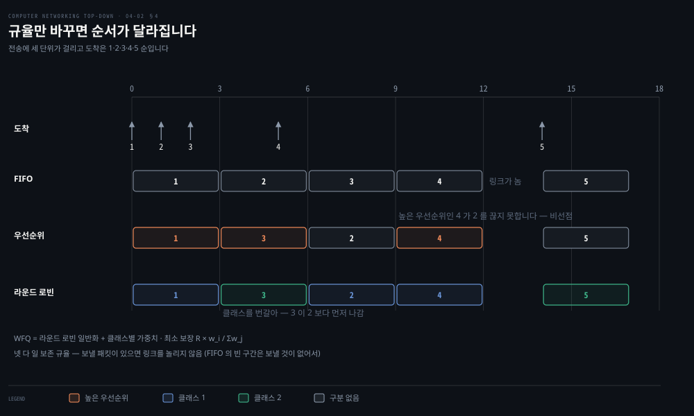
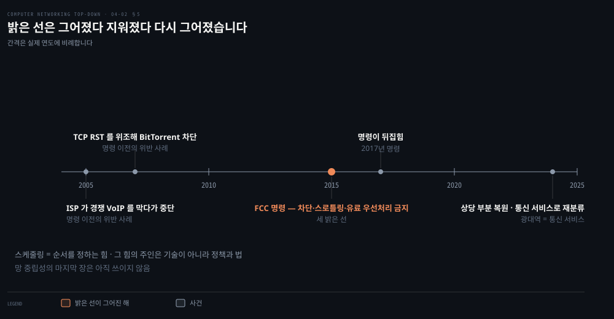

# 줄은 어디에 서고 누가 먼저 나가는가

---

> 앞의 세 장에서 "망에서 패킷을 잃는다"고 여러 번 말했습니다. 그 잃어버림이 실제로 일어나는 자리가 여기입니다.

## 핵심 요약

> 이 편이 매달린 하나의 생각은 **패킷 손실이 추상적인 사고가 아니라 라우터 안 큐의 메모리가 바닥나는 구체적인 사건이며, 그 큐를 어떻게 다루느냐가 지연과 손실을 맞바꾼다**는 것입니다.

앞의 세 장이 "망에서 패킷을 잃었다"고 말할 때 그 잃어버림은 어디까지나 결과였습니다. 원문은 이 절을 열면서 그 표현을 회수해 자리를 지목합니다. 패킷이 실제로 버려지는 곳은 라우터 안의 큐이고, 큐가 차면 버릴 수밖에 없다는 것이 손실의 정체입니다.

그 큐가 생기는 자리는 둘뿐입니다. 스위칭 패브릭을 건너기 전에 기다리면 **입력 큐**이고, 출력 링크로 나가기 전에 기다리면 **출력 큐**입니다. 어느 쪽에 얼마나 생기는지는 트래픽 부하와 스위칭 패브릭의 상대 속도, 그리고 회선 속도가 정합니다.

이 편은 그 두 자리를 훑으면서 같은 모양을 되풀이합니다. **줄이 서는 문제를 하나 세웁니다. 그것을 지우는 방법을 대 봅니다. 그 방법으로 안 지워지는 것이 무엇인지 확인해 다음 문제로 넘깁니다.** 그래서 절을 따로 읽으면 흩어져 보이지만 이어 읽으면 하나의 사슬입니다.

| 절 | 세우는 문제 | 대 보는 답 | 남는 것 |
|---|---|---|---|
| §1 | 패브릭이 느려 입력에 줄이 선다 | — | 줄이 멈추지 않고 자람 |
| §2 | 그 줄을 어떻게 지우나 | 패브릭을 회선의 N 배로 | 속도로 안 풀리는 줄이 남음 |
| §3 | 앞이 막혀 뒤가 못 나간다 | 출력별로 큐를 가름 (VOQ) | 큐 N² 개 · 매 슬롯 짝짓기 |
| §4 | 출력에도 줄이 선다 | 없음 — 링크가 하나뿐 | 무엇을 언제 버릴지의 문제 |
| §5 | 그 줄을 얼마나 길게 두나 | 두 어림 공식 | 지연을 재지 않아 버퍼블로트 |
| §6 | 누가 먼저 나가나 | FIFO·우선순위·RR·WFQ | 가중치를 누가 정하나 |
| §7 | 그 힘을 누가 쥐나 | 기술로 안 남 — 법과 정책 | 아직 안 끝남 |

표의 위 여섯 줄과 마지막 줄은 성격이 다릅니다. §1~§6 은 장치를 어떻게 만들지를 묻고 기술로 답이 납니다. 마지막 §7 이 묻는 것은 **그 장치를 손에 쥔 쪽이 무엇을 해도 되느냐**이고, 이건 기술로 안 납니다. 원문이 망 중립성 곁상자를 다른 곳이 아니라 여기에 두는 이유가 그것입니다.

한 줄로 줄이면 원문의 비유가 전부를 담습니다. **버퍼는 소금 같습니다.** 알맞은 양은 음식을 낫게 하지만 너무 많으면 못 먹게 만듭니다. 이 편이 다루는 지연과 손실의 맞바꿈이 그 한 문장 안에 있습니다.


## 학습 목표

> 이 편을 읽고 나면 아래 다섯 가지를 스스로 해낼 수 있습니다.

1. 입력 큐잉이 언제 생기고 언제 무시할 만해지는지 조건으로 말할 수 있습니다.
2. HOL 블로킹이 패브릭 속도로는 왜 안 풀리는지, 58% 문턱이 무엇인지 설명할 수 있습니다.
3. 버퍼 크기의 두 어림 공식을 쓰고 그 공식이 무엇을 목표로 삼은 값인지 말할 수 있습니다.
4. 버퍼블로트가 왜 손실 없이도 사용자를 괴롭히는지 설명할 수 있습니다.
5. FIFO·우선순위·라운드 로빈·WFQ 를 가르고 WFQ 의 보장을 식으로 쓸 수 있습니다.



일곱 절이 다섯 박자로 묶입니다. 첫 박자인 §1~§3 이 입력 쪽 줄을 문제·해결·남는 문제로 한 바퀴 돕니다. §4 는 출력 쪽에서 같은 해결이 왜 안 통하는지를 봅니다. §5 는 그 줄을 얼마나 둘지 묻고 §6 은 누가 먼저 나갈지 묻습니다. 마지막 §7 이 그 순서를 누가 정하는지로 갑니다.

이 편에서 새로 만나는 낱말입니다. `어디서` 는 그 낱말이 실제로 설명되는 절입니다.

| 키워드 | 뜻 | 학습 포인트·연결 개념 | 어디서 |
|---|---|---|---|
| 입력 큐잉 | 패브릭이 느려 입력 포트에 줄이 섬 | 패브릭이 `R_line` 의 N 배면 안 생김 | §1·§2 |
| HOL 블로킹 | 앞 패킷이 막혀 뒤가 못 나감 | 패브릭을 빠르게 해도 안 지워짐 · 58% 에서 발산 | §3 |
| 출력 큐잉 | 여러 입력이 한 출력으로 몰림 | 패브릭이 아무리 빨라도 생김 | §4 |
| 꼬리 버리기 · AQM | 차면 버리기 vs 미리 알리기 | 갈림은 손대는 시점 · ECN 표시로 이어짐 | §4 |
| 버퍼블로트 (bufferbloat) | 큐가 늘 차 있어 지연만 늘어남 | 손실 없이도 나쁨 · 버퍼는 소금 같음 | §5 |
| WFQ | 가중치 몫만큼 대역을 보장 | 차별을 기술로 구현할 수 있다는 증거 | §6 |


## 1. 입력 포트에 줄이 서는 까닭

> 회선이 밀어 넣는 속도를 스위칭 패브릭이 못 따라가면 그 차액이 입력 포트에 남습니다. 그 남은 것이 입력 큐입니다.



먼저 낱말을 맞추고 갑니다.

| 낱말 | 뜻 | 어디서 기다리나 |
|---|---|---|
| 큐잉 | 다음 단계로 못 넘어가 그 자리 메모리에서 차례를 기다림 | 라우터 안에 그 자리가 둘 |
| 입력 큐잉 | 스위칭 패브릭을 건너기 전에 기다림 | 입력 포트 |
| 출력 큐잉 | 출력 링크로 나가기 전에 기다림 | 출력 포트 |
| 슬롯 | 회선이 패킷 하나를 밀어 넣는 데 걸리는 시간 | 도식의 시간 단위 |

§1 부터 셋은 이 가운데 **입력 큐잉**을 봅니다.

입력 포트가 셋이면 슬롯마다 패킷이 셋 들어옵니다. 그런데 그림 속 패브릭은 회선과 같은 속도여서 그 시간에 하나만 옮깁니다. 건너지 못한 둘은 갈 곳이 없어 입력 포트의 메모리에 머뭅니다.

다음 슬롯에도 셋이 새로 오고 또 하나만 빠집니다. 차액 둘이 슬롯마다 그대로 얹히니 큐 합계가 2 개에서 4 개, 6 개로 늘고 멈출 이유가 없습니다. 도식의 세 칸이 같은 모양으로 반복되는 것이 그 뜻입니다 — 조건이 그대로면 결과도 그대로입니다.

이 줄이 입력 포트의 메모리를 다 쓰는 순간 라우터는 패킷을 버립니다. 앞의 세 장이 "망에서 잃어버렸다"고 말한 그 일이 바로 여기서 일어납니다. 그러니 물음이 하나로 좁혀집니다. **이 줄을 없앨 수 있는가.**


## 2. 패브릭을 N 배로 올리면 줄이 자라지 않습니다

> 첫 번째 답은 단순합니다. 한 슬롯 안에 N 개를 다 옮길 수 있으면 다음 묶음이 올 때 남은 줄이 없습니다.



앞 절과 같은 격자입니다. 달라진 것은 패브릭 속도 하나뿐인데 결과가 뒤집힙니다. 전송 한 번이 슬롯의 3 분의 1 로 줄어 슬롯 하나 안에 세 번이 들어가고, 슬롯이 끝나는 시점의 큐가 0 입니다. §1 에서 2·4·6 으로 불어나던 자리가 0·0·0 이 됩니다.

원문이 이 조건을 말하기 전에 가정을 넷 깔고 갑니다.

| 가정 | 값 |
|---|---|
| 입출력 회선 속도 | 모두 초당 `R_line` 패킷 |
| 입력 포트 · 출력 포트 수 | 각각 N 개 |
| 패킷 길이 | 모두 같음 |
| 도착 방식 | 동기적 |

패브릭이 패킷을 옮기는 속도를 `R_switch` 라 하면 조건은 이렇습니다. **`R_switch` 가 `R_line` 의 N 배면 입력 포트의 큐잉이 무시할 만합니다.**

이유가 명확합니다. 최악의 경우 N 개 입력선에 모두 패킷이 도착하고 그것이 모두 같은 출력 포트로 간다고 해도, **다음 묶음이 오기 전에 이번 묶음 N 개를 패브릭으로 다 밀어낼 수 있습니다.**

### "무시할 만하다"는 0 이라는 뜻이 아닙니다

슬롯 안에서는 여전히 기다립니다. 셋이 동시에 도착해도 패브릭은 한 번에 하나씩 옮기므로 둘째와 셋째는 자기 차례를 기다려야 합니다. 달라진 것은 **다음 묶음이 도착하기 전에 이번 묶음이 전부 빠져나가 누적되지 않는다**는 점입니다.

줄이 사라진 것이 아니라 **줄이 자라지 않게 된 것**이고, 자라지 않으면 메모리를 소진하지 않으니 버릴 일도 없습니다. 원문이 "무시할 만하다"고 적을 때의 뜻이 이것입니다.


## 3. 빨라도 앞이 막히면 뒤가 못 나갑니다

> 패브릭 속도로는 지워지지 않는 줄이 하나 남습니다. 출력 포트가 겹치는 순간, 앞 패킷 하나가 뒤에 선 것까지 붙듭니다.



앞 절의 해결은 **속도의 문제**만 지웁니다. 여기서 원문이 **중요한 결과**라 부르는 현상이 나오는데, 성격이 다릅니다. 패브릭을 아무리 빠르게 해도 남고, 원인이 속도가 아니라 **줄을 꺼내는 방식**에 있습니다.

패브릭이 크로스바이고 회선 속도가 같으며 각 입력 큐에서 FCFS(선착순, 먼저 온 것부터) 로 꺼낸다고 합시다. 출력 포트가 다르면 여러 패킷이 나란히 건널 수 있습니다. **그런데 두 입력 큐의 맨 앞 패킷이 같은 출력 큐로 가면 하나는 막혀 입력에서 기다려야 합니다.**

문제는 그 뒤입니다. 원문의 예에서 아래쪽 입력 큐의 첫 패킷이 기다리게 되는데, **그 뒤에 선 두 번째 패킷도 함께 기다립니다.** 그 두 번째 패킷이 가려는 출력 포트는 **비어 있는데도** 그렇습니다.

이것이 **HOL(Head-of-the-Line) 블로킹**입니다. 원문의 정의를 그대로 옮기면, **자기 출력 포트가 비어 있는데도 줄 맨 앞의 다른 패킷에 막혀 기다려야 하는** 현상입니다.

같은 이름의 현상이 [02-02](./02-02.웹은%20어떻게%20주고받는가.md) §7 에도 있습니다. 그쪽은 TCP 수신 버퍼에서 빠진 세그먼트 하나가 뒤에 도착한 다른 스트림의 세그먼트까지 붙드는 것입니다. 줄이 라우터 안에 있느냐 한 연결 안에 있느냐가 다를 뿐, 앞이 못 나가면 뒤도 못 나가는 구조는 같습니다.

### 절반을 조금 넘기면 무너집니다

원문이 이 현상의 대가를 숫자로 줍니다. HOL 블로킹 때문에, 어떤 가정 아래에서 **입력 링크의 도착률이 용량의 58%에 이르는 순간부터 입력 큐가 무한히 길어집니다.** 비공식적으로 말하면 상당한 패킷 손실이 일어난다는 뜻입니다.

> **노트의 읽기**: 원문은 58%라는 값만 주고 어디서 나왔는지는 인용으로 넘깁니다. 이 값의 닫힌 형태는 **2 − √2 = 0.5858** 입니다.
>
> 큐가 무한히 길어지기 시작하는 문턱이 √2 라는 무리수에서 나온다는 점이 이 결과의 특징입니다. 절반을 조금 넘긴 자리에서 갑자기 무너지는 것이라, **입력 큐잉 방식은 링크를 절반 남짓밖에 못 쓴다**는 뜻이 됩니다.

### 세 번째 해법은 줄을 목적지별로 가르는 것입니다

속도를 올려도 안 되니 다른 자리를 봐야 합니다. HOL 블로킹의 원인을 되짚으면 답이 나옵니다. **입력 포트에 큐가 하나뿐이라 목적지가 다른 패킷이 한 줄에 섞여 있고, 그 줄을 FCFS 로 꺼내기 때문입니다.** 앞사람이 막혔다는 이유로 뒷사람까지 세우는 것은 줄이 하나일 때만 가능한 일입니다.

그래서 입력 포트마다 **출력 포트 수만큼 큐를 따로 둡니다.** 출력 1 로 갈 패킷은 출력 1 용 큐에, 출력 2 로 갈 패킷은 출력 2 용 큐에 섭니다. 출력 1 이 붐벼도 출력 2 용 큐의 맨 앞은 자기 길이 열려 있으니 그대로 건넙니다. 이것이 **가상 출력 큐(VOQ, Virtual Output Queuing)** 이고, 실무의 스위치가 쓰는 구조입니다.

공짜는 아닙니다. 입력 포트마다 큐를 N 개 두니 전체가 N² 개로 늘고, 매 슬롯 **어느 입력의 어느 큐를 꺼내 어느 출력에 붙일지 정하는 장치**가 따로 필요합니다. 앞의 두 해법과 견주면 성격이 이렇게 갈립니다.

| 선택 | 무엇을 바꾸나 | 지우는 문제 | 치르는 값 |
|---|---|---|---|
| 큐 하나 · FCFS | 바꾸지 않음 — 기준선 | 없음 | 58% 에서 발산 |
| 패브릭 가속 | 패브릭 속도를 회선의 N 배로 | 속도가 모자라 생기는 줄 | 더 빠른 패브릭 하드웨어 |
| 가상 출력 큐 | 입력 큐를 출력별로 가름 | HOL 블로킹 | 큐 N² 개 · 매 슬롯 짝짓기 |

> **노트의 읽기**: 위 VOQ 설명은 원문의 서술이 아니라 원문이 한 줄로 언급하고 넘어간 대목을, HOL 블로킹의 원인에서 거슬러 올라가 푼 것입니다. 원문의 범위는 "이런 구조를 쓴다"까지입니다.


## 4. 출력 포트의 줄은 장치를 바꿔 없앨 수 없습니다

> 입력 쪽 줄은 패브릭을 빠르게 해서 지웠습니다. 출력 쪽에는 그 수가 통하지 않고, 빠른 패브릭이 오히려 출력 큐를 키웁니다.



앞의 세 절이 고친 것은 모두 라우터 **안**의 사정이었습니다. 패브릭이 느린 것도, 큐를 꺼내는 방식도 장비 설계자가 바꿀 수 있는 자리입니다. 그런데 출력 포트의 줄은 안이 아니라 **밖에 붙은 링크가 하나**라는 사실에서 나옵니다. 안쪽을 아무리 손봐도 바깥이 그대로면 줄지 않습니다.

패브릭을 건너온 셋이 단위 시간마다 같은 출력으로 몰리는데 링크는 하나만 내보냅니다. 그 차이가 큐에 쌓입니다. §1 의 입력 쪽과 숫자가 같은 것은 우연이 아닙니다 — 들어오는 양과 나가는 양의 차액이 쌓인다는 구조가 같기 때문입니다. 다른 것은 **고칠 수 있느냐**입니다. 입력 쪽은 패브릭을 바꿔 지웠지만 출력 쪽의 링크는 장비 밖에 있습니다.

### 빨라도 생깁니다

`R_switch` 가 `R_line` 의 N 배이고, N 개 입력 포트에 도착한 패킷이 **모두 같은 출력 포트로** 간다고 합시다.

출력 링크로 패킷 하나를 내보내는 동안 **N 개가 새로 도착합니다.** 출력 포트는 단위 시간에 하나만 내보낼 수 있으니 나머지가 줄을 섭니다. 그리고 그 하나를 내보내는 동안 또 N 개가 올 수 있습니다.

원문의 결론이 앞 절과 대비됩니다. **패브릭이 회선 속도의 N 배여도 출력 포트에는 큐가 생깁니다.** 결국 그 수가 커져 출력 포트의 메모리를 소진할 수 있습니다.

### 넘치면 무엇을 버리나

메모리가 모자라면 결정을 내려야 합니다. 원문이 드는 길은 둘이고 여기에 세 번째가 붙습니다. **꼬리 버리기**는 도착한 패킷을 버리고, **이미 줄 선 것을 버리기**는 줄 안에서 하나 이상을 빼내 자리를 만듭니다. 세 번째는 **버퍼가 차기 전에 미리 버리거나 헤더에 표시하는** 것으로, 송신자에게 혼잡 신호를 일찍 주기 위해서입니다. 그 표시가 [03-05](./03-05.혼잡을%20어떻게%20다스리는가.md) 에서 본 ECN 비트입니다.

이런 선제적 정책들을 묶어 **능동 큐 관리(AQM)** 라 부릅니다. 가장 널리 연구되고 구현된 것이 **RED**(Random Early Detection — 이름대로 큐가 차기 전에 미리 알아채 버립니다) 이고, 더 최근의 것으로 **PIE** 와 **CoDel** 이 있습니다.

셋을 가르는 것은 버리는 방법이 아니라 **손대는 시점**입니다.



축 위에서 보면 갈리는 자리가 한눈에 들어옵니다. 꼬리 버리기와 이미 선 것 빼내기는 버퍼가 가득 찬 그 지점에서만 손을 댑니다. 버퍼가 꽉 찼다는 것은 곧 큐잉 지연이 최대라는 뜻이므로, 송신자가 혼잡을 알아채는 순간에는 이미 지연을 다 치른 뒤입니다. AQM 은 문턱을 두고 그 앞에서부터 반응하니 지연이 커지기 전에 신호가 갑니다.

| 정책 | 언제 손대나 | 송신자가 알아채는 방법 | 치르는 값 |
|---|---|---|---|
| 꼬리 버리기 | 버퍼가 찬 **뒤**, 도착한 것을 | 손실 — 재전송으로 | 이미 큐가 꽉 찬 뒤라 지연이 최대일 때 알림 |
| 이미 선 것 버리기 | 버퍼가 찬 **뒤**, 줄 안에서 골라 | 손실 | 고르는 비용 · 줄 순서가 흐트러짐 |
| AQM | 버퍼가 차기 **전** | 손실 또는 ECN 표시 | 언제 얼마나 알릴지 정하는 조율이 필요 |

여기서 물음이 바뀝니다. 무엇을 버릴지가 아니라, 그 줄을 애초에 얼마나 길게 둘 것인가입니다.


## 5. 그럼 줄을 얼마나 길게 둘 것인가

> 버퍼 크기는 손실과 지연을 맞바꾸는 손잡이입니다. 오래 쓰인 공식들은 손실 쪽만 보고 눈금을 매겼고, 그 대가가 지연으로 돌아옵니다.



앞 절에서 넘칠 때 무엇을 버릴지를 정했으니, 이제 **얼마나 두고 나서 버릴지**를 정해야 합니다. 답이 하나로 안 나오는 까닭은 무엇을 목표로 잡느냐에 따라 값이 달라지기 때문입니다.

오랫동안 라우터 설계자가 잡은 목표는 하나였습니다. **비싼 링크를 놀리지 않는 것.** TCP 송신자는 손실을 만나면 윈도를 절반으로 줄이고 한동안 덜 보냅니다. 그 사이 라우터에 내보낼 것이 없으면 링크가 그냥 놀게 되니, 그동안 내보낼 만큼을 미리 갖고 있어야 합니다. 아래 두 공식은 **그 최소량을 재는 자**입니다. 지연이 얼마여야 좋은지를 재는 자가 아니라는 점이 이 절의 전부이고, 뒤의 버퍼블로트가 그 빈자리에서 나옵니다.

### 흐름이 적을 때 — `B = RTT × C`

오랫동안 쓰인 경험칙은 이것이었습니다.

```properties
B = RTT × C
```

평균 왕복 시간에 링크 용량을 곱합니다. 원문의 예로 **RTT 250 밀리초의 10 Gbps 링크면 2.5 Gbit** 의 버퍼가 필요합니다. 이 결과는 **상대적으로 적은 수의 TCP 흐름**에 대한 큐잉 동역학 분석에서 나왔습니다.

### 흐름이 많을 때 — `B = RTT × C / √N`

더 최근의 이론과 실험이 다른 답을 내놓습니다. **독립적인 TCP 흐름이 많이(N개) 지나가면** 필요한 버퍼가 이렇게 줄어듭니다.

```properties
B = RTT × C / √N
```

코어 망에서는 N 이 크므로 **필요한 버퍼 크기의 감소가 상당합니다.** 같은 10 Gbps·250 ms 링크라도 흐름이 100개면 250 Mbit, 10,000개면 25 Mbit 로 내려갑니다.

흐름이 많으면 덜 필요한 까닭은 **톱니가 서로 어긋나기 때문**입니다. 흐름 하나만 지나가면 그 흐름이 윈도를 줄일 때 링크가 통째로 빕니다. 그런데 독립적인 흐름 수백 개가 제각각 다른 시점에 줄이면, 한쪽이 줄일 때 다른 쪽이 늘어 총량이 덜 흔들립니다. 덜 흔들리는 만큼 메워 둘 양도 적어도 됩니다.

### 두 공식이 재지 않는 것

원문이 직관을 먼저 적고 뒤집습니다. 버퍼가 크면 도착률의 요동을 더 흡수하니 손실률이 줄어들 것 같습니다. **그런데 큰 버퍼는 긴 큐잉 지연을 뜻하기도 합니다.**

게이머와 화상회의 사용자에게는 수십 밀리초가 중요합니다. **홉마다 버퍼를 10배로 늘려 손실을 줄이면 종단 지연이 10배가 될 수 있습니다.** 게다가 늘어난 RTT 는 TCP 송신자를 둔감하게 만들어 혼잡과 손실에 느리게 반응하게 합니다.

원문이 이것을 한 문장으로 요약합니다. **버퍼링은 양날의 검**이고, **소금 같아서** 알맞은 양은 음식을 낫게 하지만 너무 많으면 못 먹게 만듭니다.

여기가 두 공식의 사각지대입니다. 둘 다 **링크를 놀리지 않을 최소량**을 답으로 주므로, 그보다 크게 잡는 것을 말릴 근거가 그 안에 없습니다. 메모리 값이 싸지자 넉넉히 얹는 편이 손실에는 이로웠고, 실제로 그렇게들 했습니다. 그 결과가 다음 항목입니다.

### 손실이 없는데도 느려집니다 — 버퍼블로트

지금까지의 논의는 **독립적인 송신자가 여럿 경쟁한다**는 가정 위에 있었습니다. 코어에서는 훌륭한 가정이지만 **가장자리에서는 성립하지 않을 수 있습니다.** 원문이 그 반례로 가정용 라우터 한 대를 듭니다.

| 조건 | 값 |
|---|---|
| 패킷 하나를 내보내는 시간 | 20 밀리초 |
| 경로의 다른 큐잉 지연 | 없음 |
| 왕복 시간 (RTT) | 200 밀리초 — 아래 정오 노트 참고 |
| `t = 0` 의 버스트 | 패킷 25개가 한꺼번에 큐에 |

핵심은 **ACK 클록킹**입니다. ACK 가 하나 오면 TCP 가 세그먼트를 하나 내보내고, 그것이 가정용 라우터의 출력 링크 큐에 들어갑니다.



한 바퀴가 고리 하나입니다. 큐에서 세그먼트가 하나 나가 링크를 건넙니다. 서버가 보낸 ACK 는 한 RTT 뒤에 송신자에 닿습니다. 그 ACK 가 곧바로 새 세그먼트 하나를 같은 큐로 밀어 넣습니다. **나간 만큼 들어오므로 큐 길이가 줄지 않습니다.** 바퀴가 몇 번을 돌아도 도식 양 끝의 큐 길이가 같은 값인 것이 그 뜻입니다.

원문이 말하는 그 값이 다섯이고, 도식 아래의 `정상 상태 큐 = 윈도 − 대역폭·지연 곱` 이 그것을 산출하는 식입니다. 그 다섯이 어느 RTT 에서 나오는지는 아래 정오 노트가 검산합니다.

여기서 원문의 결론이 나옵니다. **종단 간 파이프는 꽉 차 있고**(병목 속도인 20 밀리초마다 하나씩 배달되고 있습니다) **큐잉 지연은 일정하게 지속됩니다.** 게이머는 지연 때문에 불행하고, 부모는 집에 다른 트래픽이 없는데도 왜 지연이 크고 사라지지 않는지 이해하지 못합니다.

이것이 **버퍼블로트**입니다. 원문의 표현으로 이 시나리오는 **처리량만 중요한 것이 아니라 최소 지연도 중요하다**는 것을, 그리고 가장자리 송신자와 망 안 큐의 상호작용이 복잡하고 미묘하다는 것을 보여 줍니다.

> **원문 정오**: 이 시나리오의 숫자가 서로 맞지 않습니다. 원문은 **"`t = 200` ms 에 첫 ACK 가 도착하고 그때 21번째 패킷을 전송 중"** 이며 **"큐 길이가 늘 다섯"** 이라 적습니다. 전송이 20 ms 씩이면 `t = 200` 에는 열 개를 보냈고 **11번째**를 전송 중이며, 25개 중 **15개**가 큐에 남습니다.
>
> ```python
> 200 // 20        # 10 개 전송 완료 → 11 번째가 전송 중
> 25 - 10          # 15 개가 큐에 남음
> ```
>
> 원문의 21번째와 다섯이 성립하려면 스무 개를 다 보냈어야 하고, 그것은 `20 × 20 = 400` ms 입니다. 즉 **RTT 가 400 ms 여야 합니다.** 원문이 다음 ACK 를 `t = 220` 이라 적어 ACK 간격이 전송 시간과 같은 20 ms 임을 확인해 주므로, 어긋난 값은 전송 시간이 아니라 **RTT 200 ms** 쪽입니다. 정상 상태 큐 길이가 `윈도 − 대역폭·지연 곱` 이라는 관계로 검산해도 같은 결론이 나옵니다.
>
> | RTT | 대역폭·지연 곱 | 정상 상태 큐 |
> |---|---|---|
> | 200 ms | 10 패킷 | 15 |
> | 400 ms | 20 패킷 | **5 — 원문의 값** |

고칠 자리가 버퍼 크기 하나만은 아닙니다. 버퍼를 줄이면 지연은 잡히지만 이번에는 링크가 놀 위험이 돌아옵니다. 그래서 실제 해법은 **크기를 줄이는 쪽이 아니라 차기 전에 알리는 쪽**, 곧 앞 절에서 본 AQM 입니다. 큐가 길어지는 낌새를 보고 먼저 신호를 보내면 버퍼가 커도 늘 차 있지는 않게 됩니다.

이 문제를 실제로 다루는 표준도 있습니다. 케이블 망의 DOCSIS 3.1 이 **버퍼블로트에 맞서면서 대량 전송 처리량은 지키는 AQM 장치**를 최근에 더했습니다.

버퍼가 차오르고 AQM 이 그것을 깎는 장면을 그림으로 볼 수 있습니다.

<iframe src="https://unseel.com/embed/cs/codel-aqm.html"
        width="100%" height="600" loading="lazy" allow="autoplay" frameborder="0"
        title="CoDel (Active Queue Management) — interactive visualization"></iframe>

> **이 창이 비어 있다면**: 재생은 MkDocs 로 배포된 사이트에서만 됩니다. GitHub 저장소 뷰나 마크다운 편집기에서는 [Unseel — CoDel (Active Queue Management)](https://unseel.com/cs/codel-aqm) 을 직접 엽니다. 사이트가 스스로 `AI-generated content` 라고 밝히고 있으니, 움직임을 눈에 익히는 용도로만 쓰고 사실 확인은 본문과 원문으로 합니다.


## 6. 누가 먼저 나가는가

> 줄을 없애지도 못하고 길이도 정해 봤으니 남은 물음은 순서입니다. 원문이 규율 넷을 소개하는데, 우리가 이미 일상에서 다 겪어 본 것들입니다.



도식의 네 줄은 **도착 순서가 모두 같습니다.** 바뀐 것은 꺼내는 규칙 하나인데 나가는 차례가 달라집니다.

아래 넷은 따로 떨어진 선택지가 아닙니다. 앞의 것이 남긴 불만을 다음 것이 받아 고쳐 나간 사슬입니다. FIFO 가 급한 것을 못 앞세우니 우선순위가 나왔습니다. 우선순위가 낮은 쪽을 굶기니 라운드 로빈이 나왔고, 그 라운드 로빈이 모두에게 똑같이만 주니 WFQ 가 나왔습니다.

### FIFO

도착한 순서대로 내보냅니다. 선착순이라고도 합니다. 원문이 영국인의 줄서기를 예로 듭니다.

원문의 예에서 패킷마다 전송에 세 단위 시간이 걸립니다. 패킷 4가 나간 뒤 **패킷 5가 올 때까지 링크가 놀고** 있습니다. 보낼 것이 없으면 노는 것이 당연하지만, 이 그림이 뒤의 "일 보존" 개념과 대비됩니다.

### 우선순위 큐잉

도착할 때 **우선순위 클래스로 분류**하고 클래스마다 큐를 둡니다. 내보낼 때는 **비어 있지 않은 가장 높은 클래스**에서 꺼내고, 같은 클래스 안에서는 보통 FIFO 입니다.

실무의 예를 원문이 둘 듭니다. 망 관리 정보를 나르는 패킷이 사용자 트래픽보다 우선할 수 있고, 실시간 VoIP 패킷이 메일 같은 비실시간 트래픽보다 우선할 수 있습니다. 분류의 근거는 출발지·목적지 TCP/UDP 포트 번호 같은 것입니다.

여기에 중요한 단서가 붙습니다. **비선점**입니다. 한 번 시작된 전송은 중간에 끊기지 않습니다. 원문의 예에서 낮은 우선순위 패킷 2를 전송하는 동안 높은 우선순위 패킷 4가 도착하는데, **패킷 2가 끝난 뒤에야** 패킷 4가 나갑니다.

### 라운드 로빈

클래스로 나누는 것은 같은데 **엄격한 우선순위 대신 번갈아** 서비스합니다. 클래스 1, 클래스 2, 클래스 1, 클래스 2 순입니다.

여기서 개념이 하나 나옵니다. **일 보존** 규율은 어떤 클래스든 보낼 패킷이 있는 한 **링크를 놀리지 않습니다.** 일 보존 라운드 로빈은 자기 차례의 클래스에 패킷이 없으면 곧바로 다음 클래스를 봅니다.

### WFQ

라운드 로빈을 일반화한 것이고 라우터에 널리 구현돼 있습니다. 클래스를 원형으로 돌며 서비스하고, 빈 큐를 만나면 곧바로 다음으로 넘어가는 일 보존 규율입니다.

라운드 로빈과 다른 점은 **클래스마다 받는 양이 다를 수 있다**는 것입니다. 클래스 i 에 가중치 `w_i` 를 주면 보장이 이렇게 나옵니다.

```properties
클래스 i 의 몫  ≥  w_i / Σw_j
전송률 R 인 링크에서 클래스 i 의 처리량  ≥  R × w_i / Σw_j
```

분모의 합은 **큐에 패킷이 있는 클래스들에 대해** 취합니다. 최악의 경우 모든 클래스에 패킷이 있어도 저 몫은 보장됩니다.

원문이 스스로 단서를 답니다. 이 서술은 **이상화된 것**이고, 패킷이 이산적이며 한 패킷의 전송이 다른 패킷을 위해 중단되지 않는다는 사실은 고려하지 않았습니다.

### 네 규율을 나란히 두면

| 규율 | 순서를 정하는 기준 | 낮은 우선순위가 굶는가 | 일 보존 |
|---|---|---|---|
| FIFO | 도착 순서 | 해당 없음 | 예 |
| 우선순위 | 클래스 등급 | **굶을 수 있음** | 예 |
| 라운드 로빈 | 클래스를 번갈아 | 아니오 | 예 |
| WFQ | 클래스를 가중치만큼 | 아니오, 최소 몫이 보장됨 | 예 |

토큰이 채워지고 빠지는 속도를 움직이는 그림으로 볼 수 있습니다.

<iframe src="https://unseel.com/embed/cs/rate-limiting-algorithms.html"
        width="100%" height="600" loading="lazy" allow="autoplay" frameborder="0"
        title="Rate Limiting (Token & Leaky Bucket) — interactive visualization"></iframe>

> **이 창이 비어 있다면**: 재생은 MkDocs 로 배포된 사이트에서만 됩니다. GitHub 저장소 뷰나 마크다운 편집기에서는 [Unseel — Rate Limiting (Token & Leaky Bucket)](https://unseel.com/cs/rate-limiting-algorithms) 을 직접 엽니다. 사이트가 스스로 `AI-generated content` 라고 밝히고 있으니, 움직임을 눈에 익히는 용도로만 쓰고 사실 확인은 본문과 원문으로 합니다.


## 7. 그 순서를 누가 정하는가

> 앞 절이 순서를 정하는 장치를 만들었습니다. 그 장치를 손에 쥔 쪽이 무엇을 할 수 있느냐가 남은 물음이고, 이건 기술로 답이 안 납니다.



WFQ 의 가중치 `w_i` 는 누가 정하는가. 앞 절까지는 이 물음이 나오지 않았습니다. 규율의 성질을 따지는 동안에는 가중치가 그냥 주어진 값이었기 때문입니다. 그런데 실제 망에서 그 값을 넣는 것은 ISP 이고, 넣는 순간 기술 문제가 아니게 됩니다. 원문이 망 중립성 곁상자를 다른 곳이 아니라 이 절에 둔 이유가 그것입니다.

도식은 원문이 드는 사건들을 연도 위에 놓은 것입니다. 명령 이전의 위반 둘, 그리고 명령이 그어졌다 지워졌다 다시 그어진 세 시점입니다.

스케줄링 장치는 트래픽의 **클래스마다 다른 수준의 서비스**를 줄 수 있습니다. 그런데 무엇이 클래스인지 정하는 것은 ISP 이고, **IP 데이터그램 헤더의 어떤 필드 조합으로도** 정할 수 있습니다.

원문이 가능한 일을 나열하는데 읽어 보면 범위가 넓습니다.

- 포트 번호로 나눠 망 관리 트래픽을 메일보다 우대할 수 있습니다.
- **출발지 IP 주소**로 나눠 값을 치른 회사의 트래픽을 우대할 수 있습니다.
- 어떤 회사나 **어떤 나라의** 출발지 주소를 아예 막을 수도 있습니다.

그래서 원문이 물음을 이렇게 옮깁니다. **ISP 가 무엇을 할 수 있느냐가 아니라, 어떤 정책과 법이 ISP 가 실제로 할 수 있는 것을 정하느냐**가 진짜 물음입니다.

미국의 경우를 원문이 요약합니다. 2015년 FCC 명령이 세 가지 밝은 선을 그었습니다. **차단 금지 · 스로틀링 금지 · 유료 우선처리 금지**입니다. 이 명령이 2017년 명령으로 뒤집혔다가 2024년에 상당 부분 복원됐고, 광대역 접속 서비스가 **정보 서비스가 아니라 통신 서비스로** 재분류됐습니다.

원문이 명령 이전에 실제로 있었던 위반 사례도 둘 듭니다. 2005년 한 ISP 가 자사 전화 서비스와 경쟁하는 VoIP 서비스를 고객이 못 쓰게 막다가 중단하기로 했고, 2007년에는 한 사업자가 **TCP RST 패킷을 스스로 만들어 보내** BitTorrent 연결을 끊게 한 것으로 판정됐습니다.

원문이 이 곁상자를 이렇게 닫습니다. 관심이 크고 변화가 잦아서 **미국에서도 다른 곳에서도 망 중립성의 마지막 장이 쓰이려면 아직 멀었다**고요.

> **노트의 읽기**: 두 번째 사례가 기술적으로 흥미롭습니다. **RST 패킷을 위조해 보내는 것**은 [03-04](./03-04.흐름%20제어와%20연결%20관리,%20그리고%20혼잡.md) 에서 본 "그 세그먼트에 해당하는 소켓이 없다"는 신호를 중간에서 흉내 낸 것입니다. 
>
> 4튜플만 알면 만들 수 있고, 종단은 그것이 상대가 보낸 것인지 중간이 보낸 것인지 구별할 방법이 없습니다. 스케줄링 정책이 아니라 **프로토콜 설계의 신뢰 가정**을 이용한 것이고, 암호화된 트랜스포트가 널리 퍼진 이유 중 하나가 이런 종류의 개입입니다.


## 큐잉 치트시트

> 큐가 생기는 조건과 규율의 성질을 두 장으로 줄였습니다.

**줄이 서는 까닭과 그 대응**

| 줄이 서는 까닭 | 지우는 방법 | 치르는 값 |
|---|---|---|
| 패브릭이 `R_line` 의 N 배보다 느림 | 패브릭을 회선의 N 배로 | 더 빠른 패브릭 하드웨어 |
| 입력 큐 하나에 목적지가 섞여 FCFS | 출력별로 큐를 가름 (VOQ) | 큐 N² 개 · 매 슬롯 짝짓기 |
| 출력 링크가 하나뿐임 | 없음 — 장치 밖 구조에서 나옴 | 무엇을 언제 버릴지의 문제로 넘어감 |
| 넘쳐서 버려야 함 | 꼬리 버리기 · 줄 안에서 고르기 · AQM | 앞의 둘은 지연이 최대일 때 알림 |

**버퍼 크기와 그 대가**

| 항목 | 값 |
|---|---|
| 두 공식이 재는 것 | 링크를 놀리지 않을 **최소량** — 지연이 아님 |
| 흐름이 적을 때 | `B = RTT × C` |
| 흐름이 많을 때 | `B = RTT × C / √N` |
| 예 (10 Gbps · 250 ms) | 2.5 Gbit → N=100 이면 250 Mbit |
| 버퍼를 10배로 하면 | 손실은 줄고 종단 지연이 10배까지 늘 수 있음 |
| 손실 없이도 나쁜 경우 | 버퍼블로트 — 큐가 일정하게 유지됨 |


## 심화 학습

> 버퍼블로트는 자기 집 회선에서 바로 잴 수 있습니다.

```bash
# 유휴 상태의 왕복 시간
ping -c 20 1.1.1.1 | tail -2

# 상행을 채우면서 동시에 재기 — 지연이 얼마나 뛰는지가 버퍼블로트의 크기입니다
# (터미널 두 개에서 동시에)
#   창 A: curl -s -o /dev/null -T /dev/zero https://speed.cloudflare.com/__up
#   창 B: ping -c 20 1.1.1.1 | tail -2

# 이 기계의 큐 규율 (리눅스)
# tc qdisc show
# fq_codel 이면 CoDel 계열 AQM 이 이미 켜져 있습니다
```

유휴일 때와 회선을 채웠을 때의 왕복 시간 차이가 곧 **큐가 만든 지연**입니다. 수백 밀리초씩 뛴다면 그 경로 어딘가에 지나치게 큰 버퍼가 있는 것이고, 그것이 이 편이 말한 버퍼블로트입니다.


## 면접 대비

> 이 편에서 실제로 묻는 자리는 HOL 블로킹, 버퍼블로트, 그리고 WFQ 의 보장입니다.

### 한 줄 정의

- **큐잉**: 패킷이 다음 단계로 못 넘어가 그 자리의 메모리에서 차례를 기다리는 일입니다.
- **HOL 블로킹**: 자기 출력 포트가 비어 있는데도 줄 앞의 다른 패킷에 막혀 기다리는 현상입니다.
- **가상 출력 큐(VOQ)**: 입력 포트마다 출력 포트별로 큐를 따로 두어 HOL 블로킹을 없애는 구조입니다.
- **꼬리 버리기**: 버퍼가 찼을 때 도착한 패킷을 버리는 정책입니다.
- **버퍼블로트**: 큐가 줄지 않고 유지되어 손실 없이 지연만 커지는 현상입니다.
- **일 보존**: 보낼 패킷이 있는 한 링크를 놀리지 않는 규율의 성질입니다.

### 핵심 포인트 세 가지

1. 패브릭이 회선의 N 배여도 **출력 큐는 생깁니다.** 출력 링크가 하나뿐이기 때문입니다.
2. 버퍼는 **손실과 지연을 맞바꿉니다.** 늘리면 손실이 줄고 지연이 늡니다.
3. 버퍼블로트는 **손실이 없는데도** 나쁜 경우입니다. ACK 클록킹이 큐를 일정하게 유지합니다.

### 자주 묻는 질문

**"입력 큐잉은 패브릭만 빠르면 없어지는 것 아닙니까?"** 두 가지가 섞여 있습니다. **속도가 모자라 생기는 줄**은 패브릭을 회선의 N 배로 올리면 자라지 않습니다. 그런데 **HOL 블로킹은 속도와 무관합니다.** 원인이 입력 큐 하나에 목적지가 섞여 있고 그것을 FCFS 로 꺼낸다는 데 있어서, 패브릭을 아무리 빠르게 해도 앞 패킷이 막히면 뒤가 못 나갑니다. 그래서 해법도 속도가 아니라 구조 쪽, 곧 출력별로 큐를 가르는 VOQ 입니다.

**"HOL 블로킹은 HTTP/2 에서도 나오지 않았습니까?"** 이름이 같고 구조도 같지만 층이 다릅니다. [02-02](./02-02.웹은%20어떻게%20주고받는가.md) 의 것은 한 TCP 연결 위에서 앞선 바이트가 뒤를 막는 것이고, 여기 것은 입력 큐의 앞 패킷이 뒤를 막는 것입니다. **앞의 것이 못 나가면 뒤도 못 나간다**는 같은 형태가 층마다 반복됩니다.

**"버퍼를 늘리면 손실이 주는데 왜 나쁩니까?"** 지연이 늘기 때문입니다. 게임과 화상회의는 수십 밀리초가 중요하고, 늘어난 RTT 는 TCP 송신자의 반응도 둔하게 만듭니다.

**"WFQ 는 무엇을 보장합니까?"** 클래스 i 가 최소한 `R × w_i / Σw_j` 의 처리량을 받는 것입니다. 다른 클래스가 모두 붐벼도 이 몫은 지켜집니다.


## 핵심 개념 체크리스트

> 아래를 보지 않고 말할 수 있으면 이 편은 통과입니다.

- [ ] 큐잉이 무엇이고 라우터 안에서 그 자리가 어디인지 말할 수 있습니다.
- [ ] 입력 큐잉이 무시할 만해지는 조건을 말할 수 있습니다.
- [ ] "무시할 만하다"가 큐 길이 0 이 아니라는 것을 설명할 수 있습니다.
- [ ] HOL 블로킹을 정의하고 예로 설명할 수 있습니다.
- [ ] HOL 블로킹이 패브릭 속도로는 안 풀리는 이유를 말할 수 있습니다.
- [ ] VOQ 가 HOL 의 무엇을 없애고 무엇을 대신 치르는지 말할 수 있습니다.
- [ ] 58% 라는 문턱의 뜻을 말할 수 있습니다.
- [ ] 패브릭이 빨라도 출력 큐가 생기는 이유를 설명할 수 있습니다.
- [ ] 버퍼가 넘칠 때의 세 가지 선택과 각각의 대가를 댈 수 있습니다.
- [ ] AQM 이 무엇이고 왜 미리 버리는지 말할 수 있습니다.
- [ ] 버퍼 크기의 두 어림 공식을 쓸 수 있습니다.
- [ ] 두 공식이 무엇을 목표로 잡은 값인지, 무엇을 재지 않는지 말할 수 있습니다.
- [ ] 두 공식이 갈리는 조건이 흐름 수라는 것을 압니다.
- [ ] 버퍼블로트를 설명하고 손실과 무관하다는 것을 말할 수 있습니다.
- [ ] FIFO·우선순위·라운드 로빈·WFQ 를 가를 수 있습니다.
- [ ] 비선점이 무엇을 뜻하는지 예로 설명할 수 있습니다.
- [ ] 일 보존 규율의 정의를 말할 수 있습니다.
- [ ] WFQ 의 보장을 식으로 쓸 수 있습니다.


## 관련 문서

- [04-01 라우터는 안에서 무엇을 하는가](./04-01.라우터는%20안에서%20무엇을%20하는가.md) — 이 편의 앞. 큐가 생기는 자리인 입력·출력 포트와 패브릭
- [04-03 IP — 데이터그램과 주소](./04-03.IP%20—%20데이터그램과%20주소.md) — 이 편의 다음. 큐를 지나는 그 패킷의 헤더
- [03-05 혼잡을 어떻게 다스리는가](./03-05.혼잡을%20어떻게%20다스리는가.md) — 여기서 버려지는 패킷을 송신자가 어떻게 읽는지
- [02-02 웹은 어떻게 주고받는가](./02-02.웹은%20어떻게%20주고받는가.md) — 같은 형태의 HOL 블로킹이 한 TCP 연결 안에서 생기는 자리
- [Computer Networking — 정독 인덱스](./README.md) — 8개 장 전체 지도


## 참고 자료

- 원본: 《Computer Networking: A Top-Down Approach》 9판 (James F. Kurose · Keith W. Ross, Pearson)
- 다룬 범위: §4.2.4 Where Does Queuing Occur? · §4.2.5 Packet Scheduling
- [RFC 3439 — Some Internet Architectural Guidelines and Philosophy](https://www.rfc-editor.org/info/rfc3439) — 원문이 버퍼 경험칙의 출처로 드는 문서
- [RFC 8033 — Proportional Integral Controller Enhanced (PIE)](https://www.rfc-editor.org/info/rfc8033) — 버퍼블로트에 맞서는 AQM
