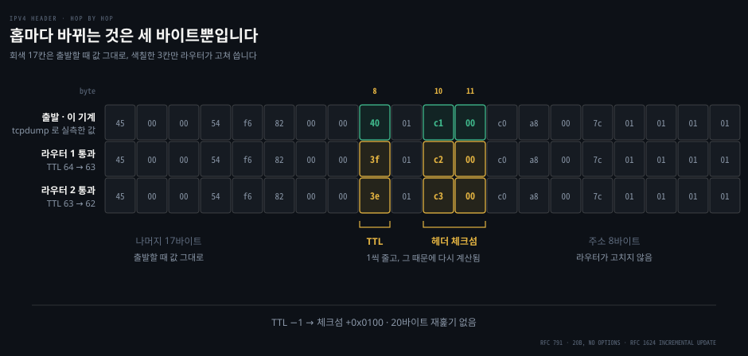
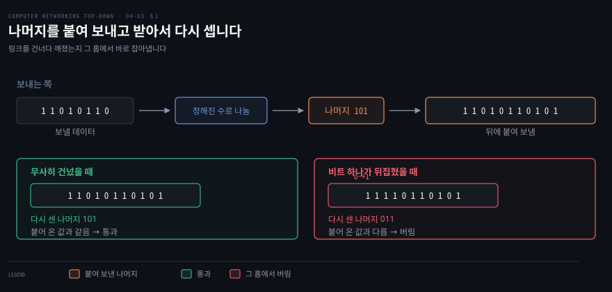
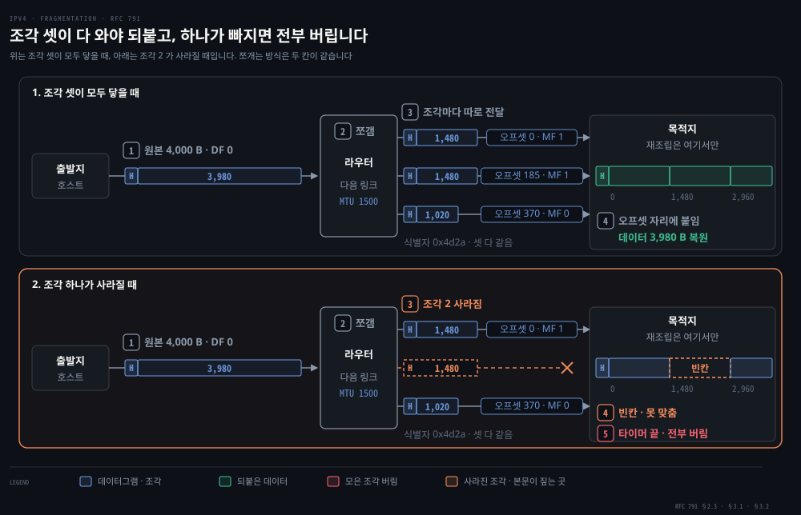

# IP — 데이터그램과 주소

---

> 앞의 두 편은 라우터 안을 들여다봤습니다. 이번에는 그 라우터를 지나가는 것 자체를 봅니다. 20바이트짜리 머리와, 그 안에 적힌 두 개의 주소입니다.

## 핵심 요약

> 이 편이 매달린 하나의 생각은 **IP 주소가 호스트가 아니라 인터페이스에 붙으며, 그 주소를 얼마나 잘 뭉쳐 두었느냐가 전 세계 라우터의 포워딩 테이블 크기를 정한다**는 것입니다.

원문은 이 절을 이례적으로 강한 문장으로 엽니다. IP 주소 지정을 통달하는 것이 곧 인터넷의 네트워크 계층 자체를 통달하는 것입니다.

주소가 왜 그만한 무게를 갖는지는 [04-01](./04-01.라우터는%20안에서%20무엇을%20하는가.md) 의 최장 접두어 일치를 기억하면 곧바로 보입니다. 라우터는 목적지 주소의 **앞자리 몇 비트**만 보고 출력 포트를 정합니다. 그러니 주소를 어떻게 나눠 주느냐가 곧 테이블에 몇 줄이 필요한가를 정합니다. 주소 배분은 행정이 아니라 **포워딩 성능의 설계 결정**입니다.

이 편은 물음 다섯을 차례로 지납니다. 헤더에는 무엇이 들어 있나. 주소는 누구에게 붙나. 그 주소를 어떻게 뭉치나. 어떻게 빌리나. 모자랄 때 어떻게 나눠 쓰나.


## 학습 목표

> 이 편을 읽고 나면 아래 다섯 가지를 스스로 해낼 수 있습니다.

1. IPv4 헤더 20바이트를 필드별로 나누고 각 필드를 누가 읽고 누가 고치는지 말할 수 있습니다.
2. "이 컴퓨터의 IP 주소"라는 표현이 왜 부정확한지 설명하고, 서브넷을 세는 방법을 적용할 수 있습니다.
3. CIDR 이 클래스 주소 지정의 무엇을 고쳤는지, 주소 집약이 포워딩 테이블을 어떻게 줄이는지 설명할 수 있습니다.
4. DHCP 네 단계를 순서대로 말하고 실제 임대 패킷에서 각 값을 짚을 수 있습니다.
5. NAT 변환 표가 어떤 네 값을 짝지어 두는지 말하고, NAT 이 무엇을 깨뜨리는지 설명할 수 있습니다.

이 편에서 새로 만나는 낱말입니다. `어디서` 는 그 낱말이 실제로 설명되는 절입니다.

| 키워드 | 뜻 | 학습 포인트·연결 개념 | 어디서 |
|---|---|---|---|
| TTL (Time To Live) | 홉마다 1 씩 줄어드는 잔여 수명 | 0 이면 버림 · 라우팅 고리를 끊음 | §1 |
| 단편화 (fragmentation) · MTU | 링크 한도보다 큰 데이터그램을 쪼갬 | 이더넷 1,500 · 목적지만 되붙임 · DF 면 버림 | §1 |
| 서브넷 (subnet) | 인터페이스를 떼면 남는 고립망 | 정의가 성질이 아니라 세는 방법 | §2 |
| CIDR | 클래스 경계를 없앤 접두 기반 배분 | 클래스 B 가 크고 클래스 C 가 작던 문제 | §3 |
| DHCP | 주소를 자동으로 빌려주는 절차 | discover → offer → request → ACK | §4 |
| NAT | 사설 주소를 WAN 주소·포트로 바꿈 | 짝은 (WAN, 새 포트) ↔ (사설, 원래 포트) | §5 |


## 1. 20바이트에 무엇이 들어 있나

> 라우터는 초당 수억 개의 데이터그램을 만집니다. 그러니 머리는 작고 단순해야 합니다.


헤더를 필드 이름 순서로 외우면 금방 잊습니다. 열세 개를 나란히 늘어놓은 그림은 어느 것이 중요한지 말해 주지 않기 때문입니다. 그래서 여기서는 **필드를 누가 읽고 누가 고치는가**로 갈라 봅니다. 그러면 20바이트가 세 무리로 나뉩니다. 출발지가 쓰고 아무도 안 건드리는 것, 홉마다 바뀌는 것, 포워딩이 읽는 것입니다.

원문도 이 대목을 꺼내면서 미리 변명을 합니다. 패킷 비트의 문법과 의미보다 무미건조한 것은 없어 보이겠지만, 데이터그램은 인터넷의 한복판에 있으므로 모든 학생과 실무자가 이것을 보고 흡수하고 통달해야 한다고 적습니다.

### 실제 헤더 한 개를 뜯어봅니다

이 기계에서 `ping 1.1.1.1` 을 한 번 치고 그 첫 패킷을 잡았습니다.

```bash
tcpdump -i en0 -c 1 -x icmp
# 0x0000:  4500 0054 f682 0000 4001 c100 c0a8 007c
# 0x0010:  0101 0101 ...
```

앞의 20바이트가 IP 헤더입니다. 한 바이트씩 읽으면 이렇습니다.

| 바이트 | 값 | 필드 | 읽는 방법 |
|--------|-----|------|-----------|
| 0 | `45` | 버전 4 + 헤더 길이 5 | 앞 4비트가 버전, 뒤 4비트가 32비트 워드 수. `5 × 4 = 20바이트` |
| 1 | `00` | 서비스 유형 | DSCP 도 ECN 도 0 |
| 2–3 | `0054` | 전체 길이 | 84바이트. IP 20 + ICMP 8 + 데이터 56 |
| 4–5 | `f682` | 식별자 | 단편화 재조립용 |
| 6–7 | `0000` | 플래그 + 오프셋 | 단편이 아니고 DF 도 안 켜짐 |
| 8 | `40` | TTL | 64. macOS 의 초기값입니다 |
| 9 | `01` | 프로토콜 | 1 = ICMP |
| 10–11 | `c100` | 헤더 체크섬 | 헤더 내용을 요약한 값. 홉마다 바뀝니다 |
| 12–15 | `c0a8 007c` | 출발지 주소 | `192.168.0.124` |
| 16–19 | `0101 0101` | 목적지 주소 | `1.1.1.1` |

원문이 "옵션이 없으면 대개 20바이트"라고 말한 그 20바이트가 그대로 나옵니다. 전체 길이 필드가 16비트라 이론상 최대는 65,535바이트지만 실제로는 1,500바이트를 잘 넘지 않는다는 것도 원문의 지적이고, 이유는 이더넷 프레임의 최대 적재량에 맞추기 위해서입니다.

같은 캡처를 직접 할 때는 두 가지를 챙깁니다. `tcpdump` 는 조건에 맞는 패킷이 올 때까지 기다리기만 하므로, 캡처를 배경에 띄운 뒤 `ping` 으로 트래픽을 만들어야 합니다. 인터페이스 이름도 환경마다 달라서 [§2](#2-주소는-인터페이스에-붙습니다) 대로 목적지로 나가는 인터페이스를 먼저 조회합니다. 이 조회를 건너뛰면 아무것도 잡히지 않을 수 있습니다.

```bash
# 목적지로 나가는 인터페이스를 먼저 조회합니다
IF=$(route -n get 1.1.1.1 | awk '/interface/{print $2}')
# 캡처를 배경에 띄우고 ping 으로 잡을 트래픽을 만듭니다
timeout 10 tcpdump -i "$IF" -c 2 -n -x icmp & sleep 2; ping -c 4 1.1.1.1 >/dev/null; sleep 5
```

### 홉마다 바뀌는 것은 세 바이트뿐입니다



라우터가 헤더를 고쳐 쓴다고 해도 바뀌는 자리는 **TTL 1바이트와 헤더 체크섬 2바이트**뿐입니다. 주소도 길이도 식별자도 출발할 때 값 그대로 목적지까지 갑니다.

| 바뀌는 칸 | 왜 바뀌나 |
|---|---|
| TTL | 데이터그램이 라우팅 고리에 갇혀 계속 돌지 않게 하는 잔여 수명입니다. 라우터를 지날 때마다 1 줄고, 0 이 되면 그 라우터가 버립니다 |
| 헤더 체크섬 | 헤더 내용을 요약한 값이라 TTL 이 바뀌면 맞지 않습니다. 그대로 두면 다음 라우터가 깨진 헤더로 보고 버리므로 TTL 을 고친 라우터가 함께 고칩니다 |

원문이 "체크섬은 라우터마다 다시 계산해 저장해야 한다"고 적은 이 재계산은 스무 바이트를 다시 훑지 않습니다. 체크섬은 헤더를 16비트씩 잘라 더한 값이라 바뀐 조각의 차이만큼만 보정하면 됩니다. 이 방식을 **증분 갱신**이라 부릅니다.

그림에서 체크섬이 `c1 00` 에서 `c2 00`·`c3 00` 으로 `0x0100` 씩 오르는 것이 그 흔적입니다. TTL 은 16비트 조각의 상위 바이트라 1 줄면 조각이 `0x0100` 줄어듭니다. 체크섬은 합을 뒤집은 값이라 같은 만큼 늘어납니다.

받는 쪽은 헤더 전체를 같은 방식으로 더해 `0xffff` 가 나오면 통과시키고 다른 값이면 버립니다. [03-01](./03-01.트랜스포트는%20무엇을%20더하는가.md) 의 UDP 체크섬과 같은 산술이고, 근거도 같은 [RFC 1071](https://www.rfc-editor.org/rfc/rfc1071.txt) 입니다.

> **노트의 읽기**: 원문은 증분 갱신을 언급하지 않고 RFC 1071 의 "빠른 알고리듬"만 가리킵니다. 증분 갱신은 1994년 문서 [RFC 1624](https://www.rfc-editor.org/rfc/rfc1624.txt) `Computation of the Internet Checksum via Incremental Update` 가 다룹니다.

> **곁노트 — 아래층의 CRC**: 한 층 아래 이더넷 프레임 끝에도 4바이트 **CRC**(Cyclic Redundancy Check, 순환 중복 검사)가 붙습니다. 검사값을 붙이고 받는 쪽이 다시 계산해 견주는 얼개는 같지만, 더하는 대신 **정해진 수로 나눈 나머지**를 씁니다.
>
> 
>
> 덧셈은 한 자리가 늘고 다른 자리가 줄면 합이 그대로라 속지만, 나머지는 어느 자리가 바뀌었는지에 따라 값이 달라집니다. 잡음에 가장 많이 노출되는 링크 구간에 가장 센 검사를 둔 셈이고, 계산 방식은 6장 링크 계층이 다룹니다. 이 CRC 와 세그먼트 전체를 검사하는 TCP·UDP 체크섬이 [04-04](./04-04.IPv6%20와%20일반화%20포워딩.md) 에서 IPv6 가 헤더 체크섬을 **없애고도 버티는** 근거입니다.

TTL 은 밖에서도 보입니다. 돌아온 응답의 TTL 은 초기값에서 거쳐 온 라우터 수만큼 줄어 있으므로, 초기값을 알면 홉 수가 나옵니다.

```bash
ping -c1 1.1.1.1   | grep -o 'ttl=[0-9]*'   # ttl=56
traceroute -n 1.1.1.1 | tail -1              # 9번째 줄에서 목적지가 응답
```

목적지 앞에 라우터가 여덟 대이니 `64 − 8 = 56` 으로 맞습니다. 다만 이 셈은 전제 둘에 기댑니다. 2026-09-09 에 다른 망에서 잰 아래 값이 두 전제가 어떻게 깨지는지 보여 줍니다.

| 대상 | 응답 TTL | traceroute | 역산한 초기값 |
|---|---|---|---|
| `1.1.1.1` | 49 | 13홉 | 62 → **64 계열** |
| `8.8.8.8` | 112 | 12홉 | 124 → **128 계열** |

첫째 전제는 초기값이 64 라는 것입니다. `ping` 이 보여 주는 TTL 은 내 요청의 값이 아니라 목적지가 새로 만든 응답 패킷의 값입니다. 그 초기값은 응답을 만든 쪽의 스택이 정하는데, 규격이 한 값으로 못박지 않았습니다. [RFC 1122](https://www.rfc-editor.org/rfc/rfc1122.txt) 는 고정값을 설정할 수 있게만 요구하고 권장값은 Assigned Numbers 문서로 넘겼습니다. 그 문서의 1994년 판 [RFC 1700](https://www.rfc-editor.org/rfc/rfc1700.txt) 이 권고한 64 가 흔하지만, Windows 계열은 128 을 쓰고 일부 네트워크 장비는 필드 최댓값인 255 를 씁니다.

그래서 돌아온 TTL 로 홉 수를 세려면 초기값부터 짐작해야 합니다. 거꾸로 그 짐작은 `nmap` 계열 도구가 상대 운영체제를 추정하는 실마리가 됩니다.

둘째 전제는 가는 길과 오는 길이 같다는 것입니다. `traceroute` 는 가는 길의 라우터를 세고, 응답 TTL 은 오는 길에 깎인 양입니다. 각 라우터는 자기 다음 홉만 정하고 경로 선택은 [05-02](./05-02.AS%20안과%20AS%20사이.md) 의 경제적 계약을 따르는데, 그 계약이 방향마다 다릅니다. 표의 두 대상 모두 오는 길이 더 길게 나온 까닭입니다. 상태를 추적하는 방화벽 앞에서 가는 길과 오는 길이 서로 다른 장비를 지나면 응답이 버려지는 문제도 여기서 생깁니다.

### 왜 체크섬을 두 번 하나

TCP·UDP 도 체크섬을 하는데 IP 가 또 하는 이유를 원문은 두 가지로 답합니다.

1. **범위가 다릅니다.** IP 는 헤더만 검사하고 TCP·UDP 는 세그먼트 전체를 검사합니다.
2. **한 묶음이라는 보장이 없습니다.** TCP 가 다른 네트워크 계층 위에서 돌 수도 있고, IP 가 TCP·UDP 로 올라가지 않을 데이터를 나를 수도 있습니다.

두 번째 이유가 실제로 관측된 것이 위의 패킷입니다. 프로토콜 필드가 `01` 이라 이 데이터그램의 적재량은 ICMP 이고, TCP 로도 UDP 로도 올라가지 않습니다.

프로토콜 필드에 대한 원문의 비유가 좋습니다.

- **프로토콜 번호**: 네트워크 계층과 트랜스포트 계층을 붙이는 접착제입니다.
- **포트 번호**: 트랜스포트 계층과 애플리케이션 계층을 붙이는 접착제입니다.

같은 자리가 층마다 하나씩 있습니다. 링크 계층에도 하나 더 있다는 예고가 뒤따릅니다.

### 다음 링크에 안 들어가면 쪼개거나 버립니다



헤더의 전체 길이 칸은 65,535 바이트까지 적을 수 있지만, 건너갈 이더넷 링크는 한 번에 1,500 바이트까지만 싣습니다. 다음 링크보다 큰 데이터그램을 라우터는 어떻게 넘길까요?

원문은 식별자·플래그·조각 오프셋 세 칸이 이 일에 쓰이고 조각은 목적지가 되붙인다는 데까지 적은 뒤, `"We'll not cover fragmentation here"` 라며 절차를 넘깁니다. 그래서 절차는 [RFC 791](https://www.rfc-editor.org/rfc/rfc791.txt) 로 채웁니다. 6장이 이 절에서 단편화를 다뤘다고 적는 어긋남은 [06-03](./06-03.주소가%20둘인%20이유와%20이더넷.md) §4 의 원문 정오에 있습니다.

라우터는 다음 링크가 한 번에 넘길 수 있는 가장 큰 크기, 곧 **MTU** 와 전체 길이를 견줍니다. MTU 이하면 그대로 넘기고 넘으면 쪼갭니다(§3.2). 쪼갠 조각은 목적지까지 따로 가고, 이때 쓰는 칸은 헤더 정의(§3.1)의 셋입니다.

| 칸 | 폭 | 하는 일 |
|---|---|---|
| 식별자 | 16비트 | 한 데이터그램에서 나온 조각은 모두 같은 값을 가져 다른 데이터그램의 조각과 섞이지 않습니다 |
| 플래그 | 3비트 | 첫 비트는 예약이라 0. **DF**(Don't Fragment)가 1 이면 쪼개지 말라는 뜻이고, **MF**(More Fragments)가 1 이면 뒤에 조각이 더 있다는 뜻입니다 |
| 조각 오프셋 | 13비트 | 이 조각의 데이터가 원래 데이터의 어디서 시작하는지. 13비트로 `2¹³ × 8 = 65,536` 바이트를 가리키려고 8 바이트 단위로 셉니다 |

그림은 UDP 로 보낸 4,000 바이트 데이터그램, 곧 헤더 20 바이트와 데이터 3,980 바이트가 MTU 1,500 링크를 만난 경우입니다. 조각 하나에 담는 데이터는 `(1,500 − 20) ÷ 8 = 185` 블록, 곧 1,480 바이트입니다. 자르는 경계는 8 바이트의 배수여야 하고 마지막 조각만 예외입니다(§2.3).

| 조각 | 데이터 자리 | 전체 길이 | 오프셋 | MF | 플래그와 오프셋 16비트 |
|---|---|---|---|---|---|
| 1 | 0 ~ 1,479 | 1,500 | 0 | 1 | `2000` |
| 2 | 1,480 ~ 2,959 | 1,500 | 185 | 1 | `20b9` |
| 3 | 2,960 ~ 3,979 | 1,040 | 370 | 0 | `0172` |

오프셋에 8 을 곱하면 데이터 자리의 시작이 나옵니다. 조각마다 헤더 20 바이트를 따로 달아 전체 길이의 합은 원래보다 40 바이트 많은 4,040 바이트입니다. 맨 오른쪽 열은 앞 헤더 표의 바이트 6–7 자리이고, `20b9` 는 MF 비트 `0x2000` 에 오프셋 185 인 `0xb9` 를 더한 값입니다.

쪼개면 넘기기는 하지만 대가가 셋 따릅니다.

| 대가 | 왜 생기나 |
|---|---|
| 조각 하나를 잃으면 전부 잃습니다 | 되붙이는 일은 목적지만 합니다. 식별자·출발지·목적지·프로토콜이 같은 조각을 모으다 타이머가 끝나면 받은 조각까지 버리고, 타이머 처음 값으로는 15초를 권합니다(RFC 791 §3.2). IP 에는 재전송이 없으므로(RFC 791 §1.4) TCP 는 [03-03](./03-03.TCP%20는%20어떻게%20세고%20어떻게%20기다리는가.md) 의 재전송으로 세그먼트를 통째로 다시 보내고 UDP 는 앱이 맡습니다 |
| 뒤 조각에는 포트가 없습니다 | 위 계층 헤더는 첫 조각에만 실립니다. 포트로 거르는 상태 없는 방화벽은 뒤 조각을 모두 통과시키거나 모두 막아야 하고, 막으면 정상 트래픽도 막힙니다([RFC 8900](https://www.rfc-editor.org/rfc/rfc8900.txt) §3.4) |
| 다른 데이터그램의 조각끼리 붙습니다 | 식별자가 16비트라 속도가 높으면 같은 값이 짧은 사이에 되풀이되고, TCP·UDP 체크섬으로도 다 걸러지지 않습니다(RFC 8900 §3.6) |

RFC 8900 은 단편화를 폐기하자고 하지는 않습니다. 대신 위 계층이 자기 층에서 크기 문제를 풀어 단편화에 덜 기대라고 권합니다(§1).

쪼개지 않는 길도 같은 헤더에 있습니다. RFC 791 §2.3 에서 DF 가 1 인 데이터그램은 어떤 경우에도 쪼개지 않고, 쪼개지 않고는 갈 수 없으면 그 자리에서 버립니다. 버렸다는 ICMP 알림이 도중에 막혀 연결이 멈추는 장면은 [04-04](./04-04.IPv6%20와%20일반화%20포워딩.md) §3 「Packet Too Big 이 막히면 블랙홀 연결이 됩니다」가 다룹니다. 알림을 받아 경로에 맞는 크기를 찾는 경로 MTU 발견은 그 바로 뒤 소절입니다.

IPv6 는 쪼개는 일을 라우터에게서 뺐습니다. [RFC 8200](https://www.rfc-editor.org/rfc/rfc8200.txt) §4.5 에서 단편화는 출발지 노드만 하고 경로 위 라우터는 하지 않습니다. RFC 8900 §2.1 은 그래서 IPv6 패킷을 모두 DF 가 1 인 IPv4 데이터그램처럼 경로 중간에서 쪼갤 수 없는 패킷으로 봅니다. 라우터에게는 버리고 알리는 일만 남고, 그 알림이 [04-04](./04-04.IPv6%20와%20일반화%20포워딩.md) §1 「라우터를 빠르게 하려고 단편화·헤더 체크섬·옵션을 뺐습니다」의 `Packet Too Big` 입니다. 식별자도 32비트로 넓어져 되풀이 문제가 덜 일어납니다(RFC 8900 §3.6).

데이터그램이 쪼개지고 다시 붙는 장면을 그림으로 볼 수 있습니다.

<iframe src="https://unseel.com/embed/cs/mtu-fragmentation.html"
        width="100%" height="600" loading="lazy" allow="autoplay" frameborder="0"
        title="MTU and IP Fragmentation — interactive visualization"></iframe>

> **이 창이 비어 있다면**: 재생은 MkDocs 로 배포된 사이트에서만 됩니다. GitHub 저장소 뷰나 마크다운 편집기에서는 [Unseel — MTU and IP Fragmentation](https://unseel.com/cs/mtu-fragmentation) 을 직접 엽니다. 사이트가 스스로 `AI-generated content` 라고 밝히고 있으니, 움직임을 눈에 익히는 용도로만 쓰고 사실 확인은 본문과 원문으로 합니다.


## 2. 주소는 인터페이스에 붙습니다

> "이 컴퓨터의 IP 주소가 뭐야"라는 질문은 답할 수 없을 때가 많습니다.


원문이 주소 이야기를 시작하기 전에 먼저 정리하는 개념이 **인터페이스**입니다. 호스트와 물리 링크 사이의 경계를 인터페이스라 부르고, 라우터는 링크마다 하나씩 여러 개를 갖습니다. 그리고 결정적인 한 문장이 나옵니다.

> IP 주소는 기술적으로 그것을 담고 있는 호스트나 라우터가 아니라 **인터페이스에** 결부됩니다.

이 기계에서 확인해 봤습니다.

```bash
ifconfig -l | wc -w                                  # 24
ifconfig | awk '/^[a-z]/{i=$1} /inet /{print i, $2}'
# lo0:       127.0.0.1
# en0:       192.168.0.124
# bridge100: 192.168.139.3
# bridge101: 192.168.107.0
# bridge102: 192.168.194.0
```

인터페이스가 스물넷 있고 그중 다섯에 IPv4 주소가 붙어 있습니다. "이 노트북의 주소"는 하나가 아닙니다. 물어야 할 질문은 "어느 인터페이스의 주소"입니다.

**이 사실이 도구 사용법으로 되돌아오는 자리가 있습니다.** 패킷을 잡으려고 `tcpdump -i en0` 이라 치면 잡히는 것이 없을 때가 있습니다. 인터페이스가 죽어서가 아니라 **그 목적지로 나가는 길이 다른 인터페이스이기 때문**입니다. 2026-09-09 에 이 기계에서 그 일이 났습니다 — 유선을 꽂으면서 기본 경로가 `en0` 에서 `en5` 로 옮겨 갔고, `en0` 로 잡으니 `0 packets captured` 에 `packets received by filter` 만 늘었습니다. 인터페이스는 살아 있어 프레임을 받고는 있는데 필터에 걸리는 ICMP 가 그리로 흐르지 않는 상태였습니다.

그래서 잡기 전에 **어느 인터페이스로 나가는지를 먼저 묻습니다.**

```bash
route -n get 1.1.1.1 | grep -E 'interface|gateway'
#   gateway: 192.168.0.1
# interface: en5
```

이 명령이 하는 일은 호스트의 포워딩 테이블을 [§3](#3-뭉쳐야-라우터가-버팁니다) 의 최장 접두 일치로 조회하는 것 그 자체입니다. 라우터 안에서 벌어지는 일이 호스트 안에서도 똑같이 벌어지고, 그 결과가 "이 목적지에는 이 인터페이스, 이 게이트웨이"라는 한 쌍으로 나옵니다. 노트에 인터페이스 이름을 고정해 적으면 다른 환경에서 재현이 깨지므로, 이 노트의 재현 명령은 이 조회 결과를 `IF` 변수로 받아 씁니다.

### 주소는 32비트이고 점 십진으로 적습니다

주소는 32비트, 즉 4바이트이므로 전부 해야 `2³²` 개, 약 40억 개입니다. 사람이 읽으려고 바이트마다 십진으로 적고 점으로 나눕니다. 원문의 예 `193.32.216.9` 는 이진으로 이렇습니다.

```properties
193.32.216.9 = 11000001 00100000 11011000 00001001
```

### 서브넷은 세는 방법으로 정의됩니다

원문은 서브넷을 정의로 주지 않고 **절차**로 줍니다. 이 방식이 좋은 이유는 어떤 그림에도 기계적으로 적용되기 때문입니다.

> 서브넷을 판정하려면 각 인터페이스를 그것이 붙은 호스트나 라우터에서 **떼어 내어** 고립된 망의 섬을 만듭니다. 인터페이스가 그 섬의 끝점이 됩니다. 이렇게 만들어진 고립망 하나하나가 서브넷입니다.

원문 Figure 4.18 은 라우터 한 대가 호스트 일곱을 잇는 그림이고, 여기에 절차를 적용하면 서브넷이 셋 나옵니다. 원문이 직접 열거하기를 `223.1.1.0/24` 서브넷은 호스트 인터페이스 셋(`223.1.1.1`, `.2`, `.3`)과 라우터 인터페이스 하나(`223.1.1.4`)로 이루어집니다.

절차의 값어치는 그림이 복잡해질 때 드러납니다. Figure 4.20 은 라우터 셋이 점대점 링크로 서로 이어진 그림이고, 같은 절차를 적용하면 여섯이 나옵니다. 라우터 사이를 잇는 링크도 그 자체로 섬이라 `223.1.7.0/24`, `223.1.8.0/24`, `223.1.9.0/24` 가 더해집니다. 위 도식이 그 여섯을 그대로 옮긴 것입니다.

`/24` 라는 표기는 32비트 중 **앞 24비트가 서브넷 주소**라는 뜻이고, 서브넷 마스크라고도 부릅니다. `223.1.1.0/24` 에 호스트를 더 붙이려면 반드시 `223.1.1.xxx` 꼴이어야 합니다.

세는 방법이 절차인 덕에, 라우터가 여러 섬에 동시에 속하는 일이 자연스럽게 설명됩니다. Figure 4.20 의 R1 은 세 섬에 있습니다. `223.1.1.3`, `223.1.9.2`, `223.1.7.0` 입니다. 같은 장비가 겹쳐 있는 것이 아니라 **서로 다른 인터페이스**가 각각 들어가 있는 것입니다.

> **원문 정오**: 그 셋 중 마지막 `223.1.7.0` 은 실제로는 인터페이스에 붙일 수 없는 주소입니다. `223.1.7.0/24` 서브넷 안에서 이 주소는 호스트 자리 8비트가 전부 0 이고, [RFC 1812](https://www.rfc-editor.org/rfc/rfc1812.txt) 는 **"IP 주소는 위에 열거한 특수한 경우를 빼면 `<Host-number>` 나 `<Network-prefix>` 자리에 0 이나 −1 값을 갖는 것이 허용되지 않는다"** 고 규정합니다. 같은 그림에서 R3 의 `223.1.8.0` 도 마찬가지입니다. 그림이 말하려는 것(라우터 사이 링크도 서브넷이다)은 옳고, 거기 적힌 주소 둘이 규격 밖입니다.

여기에 특별한 주소가 하나 더 있습니다. `255.255.255.255` 는 IP 브로드캐스트 주소이고, 이 주소로 보낸 데이터그램은 같은 서브넷의 모든 호스트에게 배달됩니다. 라우터가 이웃 서브넷으로 넘길 수도 있지만 대개 넘기지 않습니다. 이 주소는 §4 에서 곧바로 쓰입니다.

### 주소 하나가 몇 대를 가리키는가

브로드캐스트가 나왔으니 그 옆의 이름들을 여기서 한 번에 갈라 둡니다. 넷을 가르는 축은 하나입니다. **이 주소로 보내면 누구에게 배달되는가.**

| 이름 | 주소가 가리키는 것 | 배달되는 곳 | 이 책에서 만나는 자리 |
|------|------------------|------------|---------------------|
| 유니캐스트 | 인터페이스 하나 | 그 하나 | 지금까지 본 거의 모든 통신의 기본값 |
| 브로드캐스트 | 그 서브넷 전체 | 같은 서브넷의 모든 호스트 | 바로 위의 `255.255.255.255`, §4 의 DHCP. 6장의 ARP 는 이더넷 층에서 같은 일을 합니다 |
| 멀티캐스트 | 미리 가입한 무리 | 그 무리에 든 호스트 전부 | IPv6 가 브로드캐스트를 없애고 대신 쓰는 방식 |
| 애니캐스트 | 같은 주소를 쓰는 여러 대 | 라우팅이 고른 **한 대** | 5장 2절의 루트 DNS 서버 |

애니캐스트가 나머지 셋과 다른 점은 **여럿이 같은 주소를 갖는데 그중 한 대만 받는다**는 것입니다. 앞의 셋은 주소가 배달 범위를 정하지만, 애니캐스트는 어느 한 대가 받을지를 그때그때의 라우팅이 정합니다. [5장 2절이 그 결과를 재 봅니다](./05-02.AS%20안과%20AS%20사이.md) — 같은 주소에 보낸 질의가 서울과 로스앤젤레스로 갈립니다.

> **노트의 읽기**: 이 표는 원문이 한자리에 모아 놓은 것이 아닙니다. 브로드캐스트는 4장, 애니캐스트는 5장, 멀티캐스트는 4장과 6장에 흩어져 나옵니다.

프리픽스 길이가 주소를 어떻게 가르는지 그림으로 확인할 수 있습니다.

<iframe src="https://unseel.com/embed/cs/subnetting-cidr.html"
        width="100%" height="600" loading="lazy" allow="autoplay" frameborder="0"
        title="Subnetting and CIDR — interactive visualization"></iframe>

> **이 창이 비어 있다면**: 재생은 MkDocs 로 배포된 사이트에서만 됩니다. GitHub 저장소 뷰나 마크다운 편집기에서는 [Unseel — Subnetting and CIDR](https://unseel.com/cs/subnetting-cidr) 을 직접 엽니다. 사이트가 스스로 `AI-generated content` 라고 밝히고 있으니, 움직임을 눈에 익히는 용도로만 쓰고 사실 확인은 본문과 원문으로 합니다.


## 3. 뭉쳐야 라우터가 버팁니다

> 조직마다 한 줄씩 넣으면 전 세계 라우터의 테이블이 감당하지 못합니다.


인터넷의 주소 배분 방식을 **CIDR**(Classless Interdomain Routing, [RFC 4632](https://www.rfc-editor.org/rfc/rfc4632.txt))이라 부릅니다. `a.b.c.d/x` 에서 앞 `x` 비트가 네트워크 부분이고 이것을 **접두어**라 합니다. 조직에는 접두어가 같은 연속된 주소 덩어리를 통째로 줍니다.

여기서 원문이 짚는 요점이 이 절의 전부입니다. **조직 바깥의 라우터는 앞 `x` 비트만 봅니다.** 그러니 그 조직 안 어디로 가는 데이터그램이든 `a.b.c.d/x` 한 줄이면 전달됩니다. 조직 안에서 주소를 어떻게 더 쪼개 쓰는지는 바깥이 알 필요가 없습니다.

### 블록을 쪼개는 산수

원문의 예는 ISP 가 `200.23.16.0/20` 을 받아 여덟 조직에 나눠 주는 것입니다. `/20` 을 `/23` 으로 쪼개면 정확히 여덟 개가 나옵니다. 이진으로 늘어놓으면 앞 20비트가 모두 같고 21~23번째 비트만 다릅니다.

```properties
ISP 블록        200.23.16.0/20   11001000 00010111 00010000 00000000
Organization 0  200.23.16.0/23   11001000 00010111 00010000 00000000
Organization 1  200.23.18.0/23   11001000 00010111 00010010 00000000
Organization 7  200.23.30.0/23   11001000 00010111 00011110 00000000
```

ISP 는 바깥 세상에 `200.23.16.0/20` 한 줄만 광고합니다. 원문이 **주소 집약**이라 부르는 것이고 경로 집약, 경로 요약이라고도 합니다. 여덟 줄이 한 줄이 됩니다.

### 예외 하나를 다루는 방법

집약은 주소를 계층적으로 나눠 줄 때만 잘 듣습니다. 원문은 계층이 깨지는 경우를 일부러 만들어 보입니다. Fly-By-Night-ISP 가 ISPs-R-Us 를 인수하고, 조직 1 이 그 자회사를 통해 인터넷에 붙게 됩니다. 그런데 조직 1 의 주소 `200.23.18.0/23` 은 ISPs-R-Us 의 블록 `199.31.0.0/16` 밖에 있습니다.

주소를 다시 매기는 것은 비쌉니다. 조직 1 이 나중에 또 다른 자회사로 옮겨 갈 수도 있습니다. 그래서 실제로 쓰는 해법은 **주소를 그대로 두고 더 구체적인 접두어를 따로 광고하는 것**입니다.

- Fly-By-Night 는 `200.23.16.0/20` 을 그대로 계속 광고합니다.
- ISPs-R-Us 는 `199.31.0.0/16` 에 더해 `200.23.18.0/23` 도 함께 광고합니다.

두 광고가 겹치면 바깥 라우터는 [04-01](./04-01.라우터는%20안에서%20무엇을%20하는가.md) 의 최장 접두어 일치로 판정합니다. 더 구체적인 `/23` 쪽, 곧 ISPs-R-Us 로 보냅니다.

최장 접두어 일치가 단순한 검색 규칙이 아니라 **예외를 표현하는 문법**으로 쓰이는 자리입니다.

### CIDR 이전에는 무엇이 문제였나

CIDR 이전에는 네트워크 부분의 길이가 8, 16, 24비트로 못 박혀 있었고 각각 클래스 A·B·C 라 불렀습니다. 크기가 셋뿐이라는 것이 문제였습니다.

| 클래스 | 접두어 | 수용 호스트 |
|--------|--------|-------------|
| A | `/8` | 16,777,214 |
| B | `/16` | 65,534 |
| C | `/24` | 254 |

호스트 2,000대짜리 조직에는 `/24` 가 모자라고 `/16` 은 지나칩니다. 그래서 `/16` 을 받고 6만 개가 넘는 주소를 놀렸습니다. 클래스 B 공간이 빠르게 말라 간 이유입니다.

> **원문 정오**: 원문은 클래스 B 가 **"최대 65,634 대의 호스트를 지원한다"** 고 적습니다. `2¹⁶ − 2 = 65,534` 이므로 65,534 가 맞습니다. 원문 스스로도 두 문단 뒤에서는 **"최대 65,534 개의 인터페이스"** 라고 옳게 적고 있어, 앞의 숫자는 자리를 잘못 짚은 것으로 보입니다. 이어지는 "6만 3천 개 넘게 남는다"는 서술은 `65,534 − 2,000 = 63,534` 로 정확합니다.

### 블록은 어디서 오나

ISP 도 어딘가에서 블록을 받아야 합니다. 주소 공간은 **ICANN** 이 [RFC 7020](https://www.rfc-editor.org/rfc/rfc7020.txt) 의 지침 아래 관리하고, ICANN 은 지역 인터넷 등록기관(ARIN·RIPE·APNIC·LACNIC 등)에 블록을 배분합니다. 각 등록기관이 자기 지역 안의 배분과 관리를 맡습니다. 원문은 ICANN 이 주소만이 아니라 DNS 루트 서버 관리와 도메인 이름 분쟁 조정까지 맡는다는 점을 함께 적습니다.


## 4. 주소는 어떻게 빌리나

> 노트북을 기숙사에서 도서관으로 옮기면 서브넷이 바뀌고, 주소도 바뀌어야 합니다.


블록을 받았다고 일이 끝나지 않습니다. 그 안의 주소를 인터페이스 하나하나에 배정해야 하고, 노트북처럼 오늘은 여기 내일은 저기 붙는 기기까지 사람이 손으로 감당할 수는 없습니다. 라우터는 관리자가 손으로 넣지만 호스트는 대개 **DHCP**([RFC 2131](https://www.rfc-editor.org/rfc/rfc2131.txt))가 자동으로 처리합니다. 주소만이 아니라 서브넷 마스크, 첫 홉 라우터 주소(기본 게이트웨이), 지역 DNS 서버 주소까지 함께 알려 줍니다. 원문이 이것을 플러그 앤 플레이 또는 제로컨프 프로토콜이라 부르는 이유입니다.

### 네 단계

원문이 정리한 순서는 이렇습니다.

1. **DHCP discover**: 갓 도착한 호스트가 서버를 찾습니다. 자기 주소도 서버 주소도 모르므로, 목적지를 브로드캐스트 `255.255.255.255` 로, 출발지를 "이 호스트" `0.0.0.0` 으로 적어 UDP 67번 포트로 보냅니다. §2 의 브로드캐스트 주소가 여기서 쓰입니다.
2. **DHCP offer**: 서버가 제안을 돌려줍니다. 받은 discover 의 트랜잭션 ID, 제안하는 주소, 네트워크 마스크, 그리고 **임대 시간**이 담깁니다.
3. **DHCP request**: 클라이언트가 제안 하나를 골라 설정값을 그대로 되읽어 보냅니다.
4. **DHCP ACK**: 서버가 확정합니다.

서버가 여럿이면 클라이언트가 제안 중에서 고를 수 있습니다. 서브넷에 서버가 없으면 라우터가 **릴레이 에이전트**로 대신 중개합니다.

### 실제 임대 패킷

macOS 는 마지막으로 받은 DHCP 응답을 그대로 보여 줍니다. 이 기계의 것을 그대로 옮깁니다.

```properties
op = BOOTREPLY                      # ipconfig getpacket en0
xid = 0x82035391
ciaddr = 0.0.0.0
yiaddr = 192.168.0.124              # 나에게 배정된 주소
dhcp_message_type      = ACK 0x5    # 네 단계의 마지막
server_identifier      = 192.168.0.1
lease_time             = 0xe0f      # 3,599초
renewal_t1_time_value  = 0x707      # 1,799초
rebinding_t2_time_value= 0xc4d      # 3,149초
subnet_mask            = 255.255.255.0
router                 = 192.168.0.1
domain_name_server     = 192.168.0.1
```

원문이 이름을 짚은 `yiaddr`("your Internet address")가 그대로 있습니다. 서브넷 마스크와 기본 게이트웨이와 DNS 서버도 원문이 말한 대로 한 응답에 실려 옵니다. 임대는 한 시간짜리이고, 원문이 "보통 몇 시간에서 며칠"이라 적은 범위의 아래쪽 끝입니다.

위 값은 macOS 의 `ipconfig getpacket` 으로 봤습니다. 리눅스라면 NetworkManager 의 `nmcli device show eth0` 이나 `/var/lib/dhcp/dhclient.leases` 에서 같은 값을 찾습니다.

> **노트의 읽기**: 원문은 임대 갱신을 "만료 뒤에도 계속 쓰고 싶은 클라이언트를 위한 장치가 있다"고만 적고 시점을 말하지 않습니다.
>
> [RFC 2131](https://www.rfc-editor.org/rfc/rfc2131.txt) 은 그 시점을 두 타이머로 못 박습니다. **"T1 은 임대 기간의 0.5배, T2 는 0.875배가 기본값"** 입니다. 위 패킷을 검산하면 `3,599 × 0.5 = 1,799.5 → 1,799`, `3,599 × 0.875 = 3,149.1 → 3,149` 로 정확히 맞습니다. T1 에서는 임대해 준 서버에 유니캐스트로, T2 에서는 아무 서버에나 브로드캐스트로 갱신을 시도합니다.

### 제안이 반드시 브로드캐스트여야 하는가

원문은 서버의 offer 도 브로드캐스트라고 적고, 독자에게 "이 응답이 왜 **반드시** 브로드캐스트여야 하는지 생각해 보라"고 권합니다.

> **원문 정오**: "반드시"는 지나칩니다. [RFC 2131](https://www.rfc-editor.org/rfc/rfc2131.txt) §4.1 은 `flags` 필드의 BROADCAST 비트가 이것을 가른다고 규정합니다. 
>
> **"이 비트가 0으로 지워져 있으면 메시지는 `yiaddr` 에 적힌 주소로 IP 유니캐스트로 보내야(SHOULD) 한다"** 고 적습니다. 주소를 배정받기 전에는 유니캐스트를 못 받는 구현이 있어서 그런 클라이언트가 비트를 1로 세우는 것이지, 브로드캐스트가 규격상 강제는 아닙니다. 위에 옮긴 실제 패킷도 `flags = 0x0` 이라 이 응답은 유니캐스트로 왔습니다.

원문의 물음 자체는 여전히 좋은 물음입니다. 답은 "그렇게 해야만 해서"가 아니라 "그렇게 해야만 하는 클라이언트가 있어서"입니다.

### DHCP 가 못 하는 것

원문은 이동성 관점의 약점을 분명히 적습니다. 새 서브넷에 붙을 때마다 새 주소를 받으므로, **원격 애플리케이션과의 TCP 연결은 서브넷을 옮기는 순간 유지되지 않습니다.** 주소가 연결 식별자의 일부이기 때문입니다([03-01](./03-01.트랜스포트는%20무엇을%20더하는가.md) 의 네 값 짝을 떠올리면 곧바로 보입니다). 이동하면서도 주소와 연결을 유지하는 방법은 7장의 셀룰러 망 이야기로 넘어갑니다.

네 번 오가는 임대 절차를 움직이는 그림으로 따라갈 수 있습니다.

<iframe src="https://unseel.com/embed/cs/dhcp.html"
        width="100%" height="600" loading="lazy" allow="autoplay" frameborder="0"
        title="DHCP — interactive visualization"></iframe>

> **이 창이 비어 있다면**: 재생은 MkDocs 로 배포된 사이트에서만 됩니다. GitHub 저장소 뷰나 마크다운 편집기에서는 [Unseel — DHCP](https://unseel.com/cs/dhcp) 을 직접 엽니다. 사이트가 스스로 `AI-generated content` 라고 밝히고 있으니, 움직임을 눈에 익히는 용도로만 쓰고 사실 확인은 본문과 원문으로 합니다.


## 5. 하나의 주소를 여럿이 나눠 씁니다

> 집에 있는 기기 하나하나에 전역 주소를 받아야 한다면 아무도 감당하지 못합니다.


전화·태블릿·게임기·프린터마다 전역 주소가 필요해졌는데, ISP 가 연속된 블록을 이미 다 나눠 줬을 수 있습니다. 원문은 어느 집주인이 IP 주소 관리법을 알고 싶겠느냐고도 묻습니다. NAT 는 이 두 문제를 한꺼번에 없앱니다.

### 사설 주소라는 약속

첫 조각은 **자기 망 안에서만 통하는 주소**입니다. [RFC 1918](https://www.rfc-editor.org/rfc/rfc1918.txt) 이 세 덩어리를 그 용도로 떼어 두었습니다.

| 대역 | 주소 수 | 범위 |
|------|---------|------|
| `10.0.0.0/8` | 16,777,216 | `10.0.0.0` ~ `10.255.255.255` |
| `172.16.0.0/12` | 1,048,576 | `172.16.0.0` ~ `172.31.255.255` |
| `192.168.0.0/16` | 65,536 | `192.168.0.0` ~ `192.168.255.255` |

수십만 가정이 같은 `10.0.0.0/24` 를 써도 집 안에서는 문제가 없습니다. 다만 유일하지 않으므로 이 주소를 출발지로도 목적지로도 삼아 바깥에 나갈 수는 없습니다.

### 표 한 장으로 푸는 방법

NAT 라우터는 바깥에서 보면 라우터가 아니라 **주소 하나짜리 장치 한 대**입니다. 그림은 원문 Figure 4.25 의 값으로 그 왕복을 그렸습니다.

나갈 때 NAT 는 출발지를 자기 WAN 주소와 새로 만든 포트 `5001` 로 바꾸고, 짝 `(138.76.29.7, 5001) ↔ (10.0.0.1, 3345)` 를 **NAT 변환 표**에 적습니다. 돌아온 데이터그램은 목적지 포트로 이 표를 찾아 원래 주소와 포트로 되돌립니다. 그래서 웹 서버는 자기가 상대한 것이 집 안의 어느 기기였는지 끝내 모릅니다. 포트 번호가 16비트라, 원문은 주소 하나로 동시 연결을 6만 개 넘게 받칠 수 있다고 적습니다.

### 두 겹으로 쌓이면

ISP 도 NAT 를 씁니다. 가정용 게이트웨이에 전역 주소 대신 사설 주소를 주면, 집 안 기기가 보낸 데이터그램은 **가정 NAT 와 ISP NAT 를 차례로** 지납니다. 이것을 캐리어급 NAT 라 부릅니다. 두 NAT 가 같은 사설 대역을 고르면 주소가 겹치므로, [RFC 6598](https://www.rfc-editor.org/rfc/rfc6598.txt) 이 ISP 전용 공유 주소 공간으로 `100.64.0.0/10`, 419만 개를 따로 떼어 냈습니다.

내 앞의 NAT 가 몇 겹인지는 밖에서 보이는 내 출발지 주소로 판정합니다.

```bash
ifconfig en0 | awk '/inet /{print $2}'   # 192.168.0.124  ← 사설
curl -s https://api.ipify.org             # 125.141.x.y    ← 밖에서 보이는 출발지
```

돌아온 주소가 `100.64.0.0/10` 안이면 두 겹이고, 전역 유일 주소면 한 겹입니다. 위 결과는 한 겹입니다. 이 노트북은 휴대전화 테더링으로 붙어 있고 DHCP 응답의 `vendor_specific` 에 `ANDROID_METERED` 가 실려 오므로, 그 전화기가 Figure 4.25 의 홈 라우터 자리에 서 있습니다.

`traceroute` 중간 홉에 `100.x` 가 줄줄이 찍혀도 두 겹이라는 뜻은 아닙니다. 통신사가 **자기 백본 장비에** 이 대역을 붙여 쓴 것입니다. 경로에 보이는 주소는 거쳐 가는 장비의 이름이고, NAT 겹 수를 정하는 것은 내 출발지가 무엇으로 바뀌었는가입니다. 2026-09-09 에도 경로에는 `100.65.51.21`·`100.67.33.2`·`100.68.89.18` 이 이어졌지만, 밖에서 보인 주소는 전역 유일한 `1.223.246.75` 였고 NAT 은 한 겹이었습니다.

### NAT 가 깨뜨리는 것

원문의 비판은 두 갈래입니다. 실무로는, 프로세스를 지목하라고 둔 포트 번호를 NAT 가 호스트를 지목하는 데 씁니다. 그래서 잘 알려진 포트에서 기다려야 하는 서버나 들어오는 연결을 받아야 하는 P2P 참가자가 NAT 뒤에 있으면 밖에서 지목할 방법이 없습니다. 원문이 "철학적"이라 부르는 둘째 반론은, 3계층 장비인 라우터가 포트 번호까지 고쳐 호스트끼리 직접 이야기한다는 원칙을 깬다는 것입니다. 이 논쟁은 미들박스를 다루는 [04-04](./04-04.IPv6%20와%20일반화%20포워딩.md) 로 이어집니다.

> **노트의 읽기**: 원문이 NAT 통과 도구로 드는 [RFC 5389](https://www.rfc-editor.org/rfc/rfc5389.txt)(STUN)는 2020년 [RFC 8489](https://www.rfc-editor.org/rfc/rfc8489.txt) 로 대체됐습니다. 같은 계열에서 ICE 는 RFC 5245 에서 [RFC 8445](https://www.rfc-editor.org/rfc/rfc8445.txt) 로, TURN 은 RFC 5766 에서 [RFC 8656](https://www.rfc-editor.org/rfc/rfc8656.txt) 으로 넘어갔습니다. NAT 자체가 어떻게 동작해야 하는지는 [RFC 4787](https://www.rfc-editor.org/rfc/rfc4787.txt) 이 규정합니다.

표가 포트를 갈아 끼우는 장면을 그림으로 볼 수 있습니다.

<iframe src="https://unseel.com/embed/cs/nat.html"
        width="100%" height="600" loading="lazy" allow="autoplay" frameborder="0"
        title="NAT (Network Address Translation) — interactive visualization"></iframe>

> **이 창이 비어 있다면**: 재생은 MkDocs 로 배포된 사이트에서만 됩니다. GitHub 저장소 뷰나 마크다운 편집기에서는 [Unseel — NAT (Network Address Translation)](https://unseel.com/cs/nat) 을 직접 엽니다. 사이트가 스스로 `AI-generated content` 라고 밝히고 있으니, 움직임을 눈에 익히는 용도로만 쓰고 사실 확인은 본문과 원문으로 합니다.


## IP 치트시트

| 물음 | 답 |
|------|-----|
| 옵션 없는 헤더 크기 | 20바이트. TCP 를 실으면 헤더 합계 40바이트 |
| 전체 길이 필드 최대 | 65,535바이트. 실제로는 1,500바이트 이하가 대부분 |
| 홉마다 바뀌는 필드 | TTL 과 그 때문에 다시 계산되는 헤더 체크섬 |
| 체크섬 검사 성공 신호 | 받은 헤더 전체의 1의 보수 합이 `0xffff` |
| 프로토콜 번호 | 1 = ICMP, 6 = TCP, 17 = UDP |
| 주소가 붙는 대상 | 호스트가 아니라 인터페이스 |
| 서브넷 세는 법 | 인터페이스를 떼어 내고 남는 고립망의 개수 |
| 집약이 사는 조건 | 주소를 계층적으로 배분했을 때 |
| 예외 광고가 이기는 이유 | 최장 접두어 일치 |
| DHCP 네 단계 | discover → offer → request → ACK |
| 갱신 시점 기본값 | T1 = 임대의 0.5배, T2 = 0.875배 |
| NAT 표의 짝 | (WAN 주소, 새 포트) ↔ (사설 주소, 원래 포트) |
| ISP 전용 공유 대역 | `100.64.0.0/10` |


## 면접 대비

> 이 편에서 실제로 묻는 자리는 TTL 과 체크섬의 관계, 서브넷을 세는 법, 그리고 NAT 표입니다.

### 한 줄 정의

- **인터페이스**: 호스트나 라우터와 물리 링크 사이의 경계이고, IP 주소가 붙는 대상입니다.
- **서브넷**: 인터페이스를 장비에서 떼어 냈을 때 남는 고립망 하나입니다.
- **주소 집약**: 여러 하위 망을 접두어 하나로 묶어 광고해 포워딩 테이블을 줄이는 것입니다.
- **NAT 변환 표**: WAN 쪽 주소·포트 짝과 사설 쪽 주소·포트 짝을 이어 둔 표입니다.

### 핵심 포인트 세 가지

1. IP 주소는 **인터페이스**에 붙습니다. 라우터가 여러 서브넷에 동시에 속하는 것이 이것으로 설명됩니다.
2. TTL 이 줄면 헤더가 바뀌므로 **체크섬을 홉마다 다시 계산**해야 합니다. 실제로는 바뀐 워드만큼만 보정합니다.
3. 집약은 **계층적 배분**에 기댑니다. 계층이 깨진 자리는 더 구체적인 접두어를 따로 광고해 최장 접두어 일치로 덮습니다.

### 자주 묻는 질문

**"IP 가 체크섬을 하는데 TCP 가 또 하는 이유가 무엇입니까?"** 범위가 다르고 묶음이 보장되지 않기 때문입니다. IP 는 헤더만, TCP 는 세그먼트 전체를 검사합니다. 그리고 IP 가 나르는 것이 언제나 TCP·UDP 인 것도 아닙니다. ICMP 가 그 예입니다.

**"공인 IP 가 하나인데 집 안 기기 열 대가 동시에 웹을 쓰는 것이 어떻게 가능합니까?"** NAT 가 나가는 데이터그램마다 새 출발지 포트를 만들어 붙이고 그 짝을 표에 적어 두기 때문입니다. 돌아온 데이터그램은 목적지 포트로 표를 찾아 원래 주소와 포트를 복원합니다.

**"노트북을 들고 회의실로 옮기면 왜 다운로드가 끊깁니까?"** 서브넷이 바뀌면 DHCP 가 새 주소를 주고, TCP 연결은 주소를 식별자의 일부로 쓰기 때문입니다. 주소가 바뀌는 순간 기존 연결은 성립하지 않습니다.

**"`/24` 와 서브넷 마스크 `255.255.255.0` 은 같은 말입니까?"** 같은 것을 두 표기로 적은 것입니다. 앞 24비트가 네트워크 부분이라는 뜻이고, 마스크로 쓰면 그 24비트가 1 입니다.


## 핵심 개념 체크리스트

> 아래를 보지 않고 말할 수 있으면 이 편은 통과입니다.

- [ ] IPv4 헤더가 옵션 없이 20바이트인 이유를 헤더 길이 필드로 설명할 수 있습니다.
- [ ] 헤더 덤프에서 버전·길이·TTL·프로토콜·두 주소를 짚을 수 있습니다.
- [ ] TTL 의 목적과 0이 됐을 때의 처리를 말할 수 있습니다.
- [ ] 헤더 체크섬을 홉마다 다시 계산해야 하는 이유를 말할 수 있습니다.
- [ ] IP 와 TCP 가 체크섬을 둘 다 하는 두 가지 이유를 댈 수 있습니다.
- [ ] 프로토콜 번호와 포트 번호의 대응 관계를 설명할 수 있습니다.
- [ ] MTU 보다 큰 데이터그램을 라우터가 어떻게 다루는지 DF 값에 따라 나눠 말하고, 조각 하나를 잃으면 왜 전부 잃는지 설명할 수 있습니다.
- [ ] IP 주소가 인터페이스에 붙는다는 것의 뜻을 예로 설명할 수 있습니다.
- [ ] 그림을 보고 서브넷 개수를 셀 수 있습니다.
- [ ] `/x` 표기와 서브넷 마스크의 관계를 말할 수 있습니다.
- [ ] 주소 집약이 포워딩 테이블을 어떻게 줄이는지 설명할 수 있습니다.
- [ ] 계층이 깨진 조직을 최장 접두어 일치로 다루는 방법을 말할 수 있습니다.
- [ ] 클래스 주소 지정의 문제를 숫자로 설명할 수 있습니다.
- [ ] DHCP 네 단계를 순서대로 말할 수 있습니다.
- [ ] DHCP 응답에 함께 실려 오는 값 셋을 댈 수 있습니다.
- [ ] T1·T2 가 무엇이고 기본값이 얼마인지 말할 수 있습니다.
- [ ] 사설 주소 대역 셋을 적을 수 있습니다.
- [ ] NAT 변환 표가 무엇과 무엇을 짝지어 두는지 말할 수 있습니다.
- [ ] NAT 이 P2P 와 서버 운영에 만드는 문제를 설명할 수 있습니다.


## 관련 문서

- [04-02 줄은 어디에 서고 누가 먼저 나가는가](./04-02.줄은%20어디에%20서고%20누가%20먼저%20나가는가.md) — 이 편의 앞. 여기 헤더를 가진 패킷이 어느 큐에 서는지
- [04-04 IPv6 와 일반화 포워딩](./04-04.IPv6%20와%20일반화%20포워딩.md) — 이 편의 다음. 이 헤더에서 무엇을 덜어 냈고 미들박스 논쟁이 어디로 가는지
- [04-01 라우터는 안에서 무엇을 하는가](./04-01.라우터는%20안에서%20무엇을%20하는가.md) — 최장 접두어 일치. §3 의 예외 광고가 왜 이기는지의 근거
- [03-01 트랜스포트는 무엇을 더하는가](./03-01.트랜스포트는%20무엇을%20더하는가.md) — 연결을 식별하는 네 값 짝. §4 의 이동성 한계와 §5 의 NAT 표가 모두 여기에 걸립니다
- [02-03 메일과 이름은 어떻게 찾아가는가](./02-03.메일과%20이름은%20어떻게%20찾아가는가.md) — 목적지 주소를 어디서 얻는지


## 참고 자료

- 《Computer Networking A Top-Down Approach》 9판 (Kurose·Ross, Pearson) §4.3.1~4.3.3
- [RFC 791 — Internet Protocol](https://www.rfc-editor.org/rfc/rfc791.txt)
- [RFC 950 — Internet Standard Subnetting Procedure](https://www.rfc-editor.org/rfc/rfc950.txt)
- [RFC 1071 — Computing the Internet Checksum](https://www.rfc-editor.org/rfc/rfc1071.txt)
- [RFC 1624 — Computation of the Internet Checksum via Incremental Update](https://www.rfc-editor.org/rfc/rfc1624.txt)
- [RFC 1812 — Requirements for IP Version 4 Routers](https://www.rfc-editor.org/rfc/rfc1812.txt)
- [RFC 1918 — Address Allocation for Private Internets](https://www.rfc-editor.org/rfc/rfc1918.txt)
- [RFC 2131 — Dynamic Host Configuration Protocol](https://www.rfc-editor.org/rfc/rfc2131.txt)
- [RFC 4632 — Classless Inter-domain Routing (CIDR)](https://www.rfc-editor.org/rfc/rfc4632.txt)
- [RFC 4787 — NAT Behavioral Requirements for UDP](https://www.rfc-editor.org/rfc/rfc4787.txt)
- [RFC 6598 — IANA-Reserved IPv4 Prefix for Shared Address Space](https://www.rfc-editor.org/rfc/rfc6598.txt)
- [RFC 7020 — The Internet Numbers Registry System](https://www.rfc-editor.org/rfc/rfc7020.txt)
- [RFC 8489 — Session Traversal Utilities for NAT (STUN)](https://www.rfc-editor.org/rfc/rfc8489.txt)
- [IANA Protocol Numbers](https://www.iana.org/assignments/protocol-numbers/protocol-numbers.xhtml)
