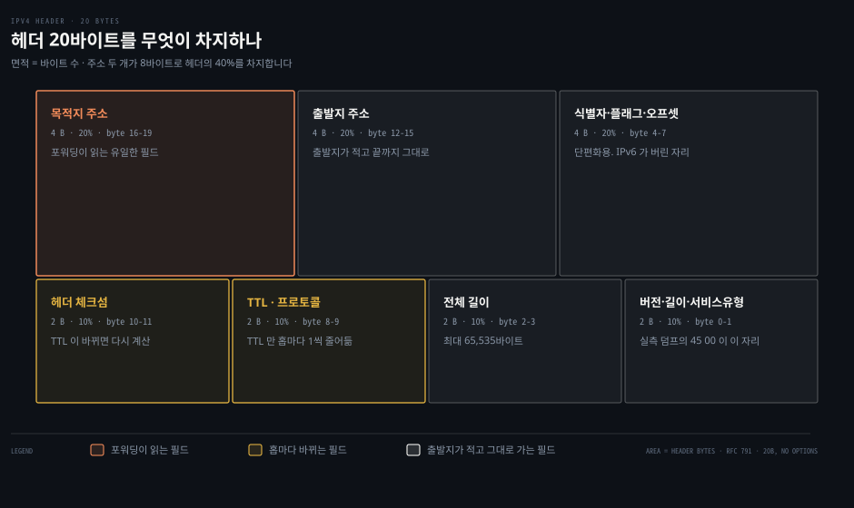
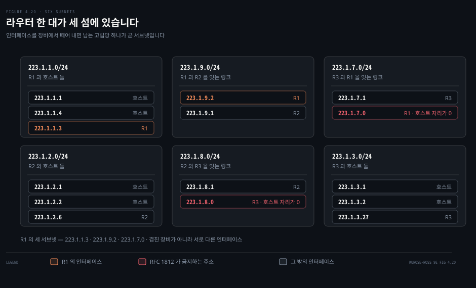
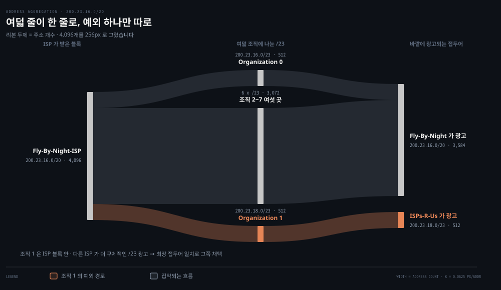
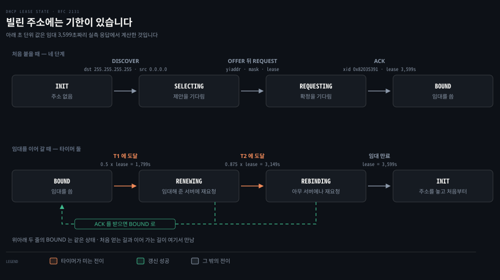
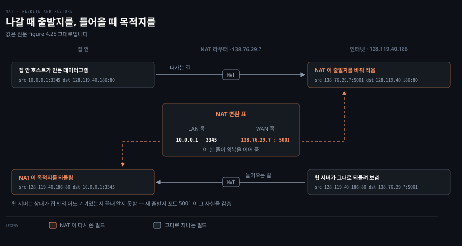

# IP — 데이터그램과 주소

---

> 앞의 두 편은 라우터 안을 들여다봤습니다. 이번에는 그 라우터를 지나가는 것 자체를 봅니다. 20바이트짜리 머리와, 그 안에 적힌 두 개의 주소입니다.

## 핵심 요약

> 이 편이 매달린 하나의 생각은 **IP 주소가 호스트가 아니라 인터페이스에 붙으며, 그 주소를 얼마나 잘 뭉쳐 두었느냐가 전 세계 라우터의 포워딩 테이블 크기를 정한다**는 것입니다.

원문은 이 절을 이례적으로 강한 문장으로 엽니다.

> IP 주소 지정을 통달하는 것이 곧 인터넷의 네트워크 계층 자체를 통달하는 것입니다.

주소가 왜 그만한 무게를 갖는지는 [04-01](./04-01.라우터는%20안에서%20무엇을%20하는가.md) 의 최장 접두어 일치를 기억하면 곧바로 보입니다. 라우터는 목적지 주소의 **앞자리 몇 비트**만 보고 출력 포트를 정합니다. 그러니 주소를 어떻게 나눠 주느냐가 곧 테이블에 몇 줄이 필요한가를 정합니다. 주소 배분은 행정이 아니라 **포워딩 성능의 설계 결정**입니다.

이 편은 물음 다섯을 차례로 지납니다. 헤더에는 무엇이 들어 있나. 주소는 누구에게 붙나. 그 주소를 어떻게 뭉치나. 어떻게 빌리나. 모자랄 때 어떻게 나눠 쓰나.


## 학습 목표

> 이 편을 읽고 나면 아래 다섯 가지를 스스로 해낼 수 있습니다.

1. IPv4 헤더 20바이트를 필드별로 나누고 각 필드를 누가 읽고 누가 고치는지 말할 수 있습니다.
2. "이 컴퓨터의 IP 주소"라는 표현이 왜 부정확한지 설명하고, 서브넷을 세는 방법을 적용할 수 있습니다.
3. CIDR 이 클래스 주소 지정의 무엇을 고쳤는지, 주소 집약이 포워딩 테이블을 어떻게 줄이는지 설명할 수 있습니다.
4. DHCP 네 단계를 순서대로 말하고 실제 임대 패킷에서 각 값을 짚을 수 있습니다.
5. NAT 변환 표가 어떤 네 값을 짝지어 두는지 말하고, NAT 이 무엇을 깨뜨리는지 설명할 수 있습니다.


## 1. 20바이트에 무엇이 들어 있나

> 라우터는 초당 수억 개의 데이터그램을 만집니다. 그러니 머리는 작고 단순해야 합니다.



헤더를 필드 이름 순서로 외우면 금방 잊습니다. 열세 개를 나란히 늘어놓은 그림은 어느 것이 중요한지 말해 주지 않기 때문입니다. 그래서 여기서는 **필드를 누가 읽고 누가 고치는가**로 갈라 봅니다. 그러면 20바이트가 세 무리로 나뉩니다. 출발지가 쓰고 아무도 안 건드리는 것, 홉마다 바뀌는 것, 포워딩이 읽는 것입니다.

원문도 이 대목을 꺼내면서 미리 변명을 합니다. 패킷 비트의 문법과 의미보다 무미건조한 것은 없어 보이겠지만, 데이터그램은 인터넷의 한복판에 있으므로 모든 학생과 실무자가 이것을 보고 흡수하고 통달해야 한다고 적습니다.

### 실제 헤더 한 개를 뜯어봅니다

이 기계에서 `ping 1.1.1.1` 을 한 번 치고 그 첫 패킷을 잡았습니다.

```bash
tcpdump -i en0 -c 1 -x icmp
# 0x0000:  4500 0054 f682 0000 4001 c100 c0a8 007c
# 0x0010:  0101 0101 ...
```

앞의 20바이트가 IP 헤더입니다. 한 바이트씩 읽으면 이렇습니다.

| 바이트 | 값 | 필드 | 읽는 방법 |
|--------|-----|------|-----------|
| 0 | `45` | 버전 4 + 헤더 길이 5 | 앞 4비트가 버전, 뒤 4비트가 32비트 워드 수. `5 × 4 = 20바이트` |
| 1 | `00` | 서비스 유형 | DSCP 도 ECN 도 0 |
| 2–3 | `0054` | 전체 길이 | 84바이트. IP 20 + ICMP 8 + 데이터 56 |
| 4–5 | `f682` | 식별자 | 단편화 재조립용 |
| 6–7 | `0000` | 플래그 + 오프셋 | 단편이 아니고 DF 도 안 켜짐 |
| 8 | `40` | TTL | 64. macOS 의 초기값입니다 |
| 9 | `01` | 프로토콜 | 1 = ICMP |
| 10–11 | `c100` | 헤더 체크섬 | 아래에서 직접 검산합니다 |
| 12–15 | `c0a8 007c` | 출발지 주소 | `192.168.0.124` |
| 16–19 | `0101 0101` | 목적지 주소 | `1.1.1.1` |

원문이 "옵션이 없으면 대개 20바이트"라고 말한 그 20바이트가 그대로 나옵니다. 전체 길이 필드가 16비트라 이론상 최대는 65,535바이트지만 실제로는 1,500바이트를 잘 넘지 않는다는 것도 원문의 지적이고, 이유는 이더넷 프레임의 최대 적재량에 맞추기 위해서입니다.

### 홉마다 바뀌는 것은 세 바이트뿐입니다

TTL: 데이터그램이 라우팅 고리에 갇혀 영원히 돌지 않게 하는 잔여 수명입니다. 라우터를 지날 때마다 1씩 줄고, 0이 되면 그 라우터가 버립니다.

TTL 이 줄면 헤더가 바뀌므로 체크섬을 다시 계산해야 합니다. 원문이 "체크섬은 라우터마다 다시 계산해 저장해야 한다"고 적은 그대로입니다. 얼마나 바뀌는지 직접 계산해 봤습니다.

```python
import struct
hdr = bytes.fromhex("450000 54f68200004001c100c0a8007c01010101".replace(" ", ""))

def ones(words):
    s = 0
    for w in words:
        s += w
    while s >> 16:
        s = (s & 0xFFFF) + (s >> 16)
    return s

W = list(struct.unpack('!10H', hdr))
print(hex(ones(W)))                     # 0xffff  ← 받은 헤더 그대로 더하면
W[5] = 0
print(hex(~ones(W) & 0xFFFF))           # 0xc100  ← 체크섬 자리를 비우고 1의 보수
```

받은 헤더를 통째로 1의 보수 합산하면 `0xffff` 가 나옵니다. 이것이 "오류 없음"의 신호입니다. 체크섬 자리를 0으로 두고 같은 계산을 한 뒤 보수를 취하면 실제 저장된 값 `0xc100` 이 그대로 재현됩니다. [03-01](./03-01.트랜스포트는%20무엇을%20더하는가.md) 에서 UDP 체크섬을 검산했을 때와 같은 산술이고, 근거는 같은 [RFC 1071](https://www.rfc-editor.org/rfc/rfc1071.txt) 입니다.

TTL 을 64 에서 63 으로 낮추고 다시 계산하면 체크섬이 `0xc100` 에서 `0xc200` 으로 바뀝니다. TTL 이 다섯 번째 16비트 워드의 상위 바이트라, 1이 줄면 합이 `0x0100` 만큼 줄고 보수는 그만큼 늘어납니다. 그래서 실제 라우터는 스무 바이트를 다시 훑지 않고 바뀐 워드만큼만 체크섬을 보정합니다.

> **노트의 읽기**: 원문은 이 증분 갱신을 언급하지 않고 [RFC 1071](https://www.rfc-editor.org/rfc/rfc1071.txt) 의 "빠른 알고리듬"만 가리킵니다. 증분 갱신 자체를 다루는 문서는 [RFC 1624](https://www.rfc-editor.org/rfc/rfc1624.txt) `Computation of the Internet Checksum via Incremental Update` 이고, 1994년 문서입니다.

TTL 은 밖에서도 관측됩니다. 응답 패킷의 TTL 은 출발할 때의 초기값에서 거쳐 온 라우터 수만큼 줄어 있으므로, 초기값을 알면 홉 수를 역산할 수 있습니다.

```bash
ping -c1 1.1.1.1   | grep -o 'ttl=[0-9]*'   # ttl=56
traceroute -n 1.1.1.1 | tail -1              # 9번째 줄에서 목적지가 응답
```

`1.1.1.1` 의 응답이 `ttl=56` 으로 왔고, traceroute 는 아홉 번째 홉에서 목적지가 답했습니다. 목적지 앞에 라우터가 여덟 대 있었다는 뜻이고 `64 − 8 = 56` 이 정확히 맞습니다. 같은 방법을 `8.8.8.8` 에 적용하면 어긋납니다. 왕복 경로가 대칭이 아니어서 돌아오는 길이 더 길었기 때문이고, 이 어긋남 자체가 인터넷 경로가 방향마다 다르다는 증거입니다.

### 왜 체크섬을 두 번 하나

TCP·UDP 도 체크섬을 하는데 IP 가 또 하는 이유를 원문은 두 가지로 답합니다.

1. **범위가 다릅니다.** IP 는 헤더만 검사하고 TCP·UDP 는 세그먼트 전체를 검사합니다.
2. **한 묶음이라는 보장이 없습니다.** TCP 가 다른 네트워크 계층 위에서 돌 수도 있고, IP 가 TCP·UDP 로 올라가지 않을 데이터를 나를 수도 있습니다.

두 번째 이유가 실제로 관측된 것이 위의 패킷입니다. 프로토콜 필드가 `01` 이라 이 데이터그램의 적재량은 ICMP 이고, TCP 로도 UDP 로도 올라가지 않습니다.

프로토콜 필드에 대한 원문의 비유가 좋습니다.

- **프로토콜 번호**: 네트워크 계층과 트랜스포트 계층을 붙이는 접착제입니다.
- **포트 번호**: 트랜스포트 계층과 애플리케이션 계층을 붙이는 접착제입니다.

같은 자리가 층마다 하나씩 있습니다. 링크 계층에도 하나 더 있다는 예고가 뒤따릅니다.


## 2. 주소는 인터페이스에 붙습니다

> "이 컴퓨터의 IP 주소가 뭐야"라는 질문은 답할 수 없을 때가 많습니다.



원문이 주소 이야기를 시작하기 전에 먼저 정리하는 개념이 **인터페이스**입니다. 호스트와 물리 링크 사이의 경계를 인터페이스라 부르고, 라우터는 링크마다 하나씩 여러 개를 갖습니다. 그리고 결정적인 한 문장이 나옵니다.

> IP 주소는 기술적으로 그것을 담고 있는 호스트나 라우터가 아니라 **인터페이스에** 결부됩니다.

이 기계에서 확인해 봤습니다.

```bash
ifconfig -l | wc -w                                  # 24
ifconfig | awk '/^[a-z]/{i=$1} /inet /{print i, $2}'
# lo0:       127.0.0.1
# en0:       192.168.0.124
# bridge100: 192.168.139.3
# bridge101: 192.168.107.0
# bridge102: 192.168.194.0
```

인터페이스가 스물넷 있고 그중 다섯에 IPv4 주소가 붙어 있습니다. "이 노트북의 주소"는 하나가 아닙니다. 물어야 할 질문은 "어느 인터페이스의 주소"입니다.

### 주소는 32비트이고 점 십진으로 적습니다

주소는 32비트, 즉 4바이트이므로 전부 해야 `2³²` 개, 약 40억 개입니다. 사람이 읽으려고 바이트마다 십진으로 적고 점으로 나눕니다. 원문의 예 `193.32.216.9` 는 이진으로 이렇습니다.

```properties
193.32.216.9 = 11000001 00100000 11011000 00001001
```

### 서브넷은 세는 방법으로 정의됩니다

원문은 서브넷을 정의로 주지 않고 **절차**로 줍니다. 이 방식이 좋은 이유는 어떤 그림에도 기계적으로 적용되기 때문입니다.

> 서브넷을 판정하려면 각 인터페이스를 그것이 붙은 호스트나 라우터에서 **떼어 내어** 고립된 망의 섬을 만듭니다. 인터페이스가 그 섬의 끝점이 됩니다. 이렇게 만들어진 고립망 하나하나가 서브넷입니다.

원문 Figure 4.18 은 라우터 한 대가 호스트 일곱을 잇는 그림이고, 여기에 절차를 적용하면 서브넷이 셋 나옵니다. 원문이 직접 열거하기를 `223.1.1.0/24` 서브넷은 호스트 인터페이스 셋(`223.1.1.1`, `.2`, `.3`)과 라우터 인터페이스 하나(`223.1.1.4`)로 이루어집니다.

절차의 값어치는 그림이 복잡해질 때 드러납니다. Figure 4.20 은 라우터 셋이 점대점 링크로 서로 이어진 그림이고, 같은 절차를 적용하면 여섯이 나옵니다. 라우터 사이를 잇는 링크도 그 자체로 섬이라 `223.1.7.0/24`, `223.1.8.0/24`, `223.1.9.0/24` 가 더해집니다. 위 도식이 그 여섯을 그대로 옮긴 것입니다.

`/24` 라는 표기는 32비트 중 **앞 24비트가 서브넷 주소**라는 뜻이고, 서브넷 마스크라고도 부릅니다. `223.1.1.0/24` 에 호스트를 더 붙이려면 반드시 `223.1.1.xxx` 꼴이어야 합니다.

세는 방법이 절차인 덕에, 라우터가 여러 섬에 동시에 속하는 일이 자연스럽게 설명됩니다. Figure 4.20 의 R1 은 세 섬에 있습니다. `223.1.1.3`, `223.1.9.2`, `223.1.7.0` 입니다. 같은 장비가 겹쳐 있는 것이 아니라 **서로 다른 인터페이스**가 각각 들어가 있는 것입니다.

> **원문 정오**: 그 셋 중 마지막 `223.1.7.0` 은 실제로는 인터페이스에 붙일 수 없는 주소입니다. `223.1.7.0/24` 서브넷 안에서 이 주소는 호스트 자리 8비트가 전부 0 이고, [RFC 1812](https://www.rfc-editor.org/rfc/rfc1812.txt) 는 **"IP 주소는 위에 열거한 특수한 경우를 빼면 `<Host-number>` 나 `<Network-prefix>` 자리에 0 이나 −1 값을 갖는 것이 허용되지 않는다"** 고 규정합니다. 같은 그림에서 R3 의 `223.1.8.0` 도 마찬가지입니다. 그림이 말하려는 것(라우터 사이 링크도 서브넷이다)은 옳고, 거기 적힌 주소 둘이 규격 밖입니다.

여기에 특별한 주소가 하나 더 있습니다. `255.255.255.255` 는 IP 브로드캐스트 주소이고, 이 주소로 보낸 데이터그램은 같은 서브넷의 모든 호스트에게 배달됩니다. 라우터가 이웃 서브넷으로 넘길 수도 있지만 대개 넘기지 않습니다. 이 주소는 §4 에서 곧바로 쓰입니다.


## 3. 뭉쳐야 라우터가 버팁니다

> 조직마다 한 줄씩 넣으면 전 세계 라우터의 테이블이 감당하지 못합니다.



인터넷의 주소 배분 방식을 **CIDR**(Classless Interdomain Routing, [RFC 4632](https://www.rfc-editor.org/rfc/rfc4632.txt))이라 부릅니다. `a.b.c.d/x` 에서 앞 `x` 비트가 네트워크 부분이고 이것을 **접두어**라 합니다. 조직에는 접두어가 같은 연속된 주소 덩어리를 통째로 줍니다.

여기서 원문이 짚는 요점이 이 절의 전부입니다. **조직 바깥의 라우터는 앞 `x` 비트만 봅니다.** 그러니 그 조직 안 어디로 가는 데이터그램이든 `a.b.c.d/x` 한 줄이면 전달됩니다. 조직 안에서 주소를 어떻게 더 쪼개 쓰는지는 바깥이 알 필요가 없습니다.

### 블록을 쪼개는 산수

원문의 예는 ISP 가 `200.23.16.0/20` 을 받아 여덟 조직에 나눠 주는 것입니다. 표를 그대로 검산해 봤습니다.

```python
import ipaddress
isp = ipaddress.ip_network("200.23.16.0/20")
print([str(s.network_address) for s in isp.subnets(new_prefix=23)])
# ['200.23.16.0', '200.23.18.0', '200.23.20.0', '200.23.22.0',
#  '200.23.24.0', '200.23.26.0', '200.23.28.0', '200.23.30.0']
```

`/20` 을 `/23` 으로 쪼개면 정확히 여덟 개가 나오고, 원문 표의 조직 0·1·2·7 주소가 그 목록의 첫째·둘째·셋째·여덟째와 일치합니다. 이진으로 늘어놓으면 앞 20비트가 모두 같고 21~23번째 비트만 다릅니다.

```properties
ISP 블록        200.23.16.0/20   11001000 00010111 00010000 00000000
Organization 0  200.23.16.0/23   11001000 00010111 00010000 00000000
Organization 1  200.23.18.0/23   11001000 00010111 00010010 00000000
Organization 7  200.23.30.0/23   11001000 00010111 00011110 00000000
```

ISP 는 바깥 세상에 `200.23.16.0/20` 한 줄만 광고합니다. 원문이 **주소 집약**이라 부르는 것이고 경로 집약, 경로 요약이라고도 합니다. 여덟 줄이 한 줄이 됩니다.

### 예외 하나를 다루는 방법

집약은 주소를 계층적으로 나눠 줄 때만 잘 듣습니다. 원문은 계층이 깨지는 경우를 일부러 만들어 보입니다. Fly-By-Night-ISP 가 ISPs-R-Us 를 인수하고, 조직 1 이 그 자회사를 통해 인터넷에 붙게 됩니다. 그런데 조직 1 의 주소 `200.23.18.0/23` 은 ISPs-R-Us 의 블록 `199.31.0.0/16` 밖에 있습니다.

주소를 다시 매기는 것은 비쌉니다. 조직 1 이 나중에 또 다른 자회사로 옮겨 갈 수도 있습니다. 그래서 실제로 쓰는 해법은 **주소를 그대로 두고 더 구체적인 접두어를 따로 광고하는 것**입니다.

- Fly-By-Night 는 `200.23.16.0/20` 을 그대로 계속 광고합니다.
- ISPs-R-Us 는 `199.31.0.0/16` 에 더해 `200.23.18.0/23` 도 함께 광고합니다.

두 광고가 겹치면 바깥 라우터는 [04-01](./04-01.라우터는%20안에서%20무엇을%20하는가.md) 의 최장 접두어 일치로 판정합니다. 더 구체적인 `/23` 쪽, 곧 ISPs-R-Us 로 보냅니다.

최장 접두어 일치가 단순한 검색 규칙이 아니라 **예외를 표현하는 문법**으로 쓰이는 자리입니다.

### CIDR 이전에는 무엇이 문제였나

CIDR 이전에는 네트워크 부분의 길이가 8, 16, 24비트로 못 박혀 있었고 각각 클래스 A·B·C 라 불렀습니다. 크기가 셋뿐이라는 것이 문제였습니다.

| 클래스 | 접두어 | 수용 호스트 |
|--------|--------|-------------|
| A | `/8` | 16,777,214 |
| B | `/16` | 65,534 |
| C | `/24` | 254 |

호스트 2,000대짜리 조직에는 `/24` 가 모자라고 `/16` 은 지나칩니다. 그래서 `/16` 을 받고 6만 개가 넘는 주소를 놀렸습니다. 클래스 B 공간이 빠르게 말라 간 이유입니다.

> **원문 정오**: 원문은 클래스 B 가 **"최대 65,634 대의 호스트를 지원한다"** 고 적습니다. `2¹⁶ − 2 = 65,534` 이므로 65,534 가 맞습니다. 원문 스스로도 두 문단 뒤에서는 **"최대 65,534 개의 인터페이스"** 라고 옳게 적고 있어, 앞의 숫자는 자리를 잘못 짚은 것으로 보입니다. 이어지는 "6만 3천 개 넘게 남는다"는 서술은 `65,534 − 2,000 = 63,534` 로 정확합니다.

### 블록은 어디서 오나

ISP 도 어딘가에서 블록을 받아야 합니다. 주소 공간은 **ICANN** 이 [RFC 7020](https://www.rfc-editor.org/rfc/rfc7020.txt) 의 지침 아래 관리하고, ICANN 은 지역 인터넷 등록기관(ARIN·RIPE·APNIC·LACNIC 등)에 블록을 배분합니다. 각 등록기관이 자기 지역 안의 배분과 관리를 맡습니다. 원문은 ICANN 이 주소만이 아니라 DNS 루트 서버 관리와 도메인 이름 분쟁 조정까지 맡는다는 점을 함께 적습니다.


## 4. 주소는 어떻게 빌리나

> 노트북을 기숙사에서 도서관으로 옮기면 서브넷이 바뀌고, 주소도 바뀌어야 합니다.



블록을 받았다고 일이 끝나지 않습니다. 그 안의 주소를 인터페이스 하나하나에 배정해야 하고, 노트북처럼 오늘은 여기 내일은 저기 붙는 기기까지 사람이 손으로 감당할 수는 없습니다. 라우터는 관리자가 손으로 넣지만 호스트는 대개 **DHCP**([RFC 2131](https://www.rfc-editor.org/rfc/rfc2131.txt))가 자동으로 처리합니다. 주소만이 아니라 서브넷 마스크, 첫 홉 라우터 주소(기본 게이트웨이), 지역 DNS 서버 주소까지 함께 알려 줍니다. 원문이 이것을 플러그 앤 플레이 또는 제로컨프 프로토콜이라 부르는 이유입니다.

### 네 단계

원문이 정리한 순서는 이렇습니다.

1. **DHCP discover**: 갓 도착한 호스트가 서버를 찾습니다. 자기 주소도 서버 주소도 모르므로, 목적지를 브로드캐스트 `255.255.255.255` 로, 출발지를 "이 호스트" `0.0.0.0` 으로 적어 UDP 67번 포트로 보냅니다. §2 의 브로드캐스트 주소가 여기서 쓰입니다.
2. **DHCP offer**: 서버가 제안을 돌려줍니다. 받은 discover 의 트랜잭션 ID, 제안하는 주소, 네트워크 마스크, 그리고 **임대 시간**이 담깁니다.
3. **DHCP request**: 클라이언트가 제안 하나를 골라 설정값을 그대로 되읽어 보냅니다.
4. **DHCP ACK**: 서버가 확정합니다.

서버가 여럿이면 클라이언트가 제안 중에서 고를 수 있습니다. 서브넷에 서버가 없으면 라우터가 **릴레이 에이전트**로 대신 중개합니다.

### 실제 임대 패킷

macOS 는 마지막으로 받은 DHCP 응답을 그대로 보여 줍니다. 이 기계의 것을 그대로 옮깁니다.

```properties
op = BOOTREPLY                      # ipconfig getpacket en0
xid = 0x82035391
ciaddr = 0.0.0.0
yiaddr = 192.168.0.124              # 나에게 배정된 주소
dhcp_message_type      = ACK 0x5    # 네 단계의 마지막
server_identifier      = 192.168.0.1
lease_time             = 0xe0f      # 3,599초
renewal_t1_time_value  = 0x707      # 1,799초
rebinding_t2_time_value= 0xc4d      # 3,149초
subnet_mask            = 255.255.255.0
router                 = 192.168.0.1
domain_name_server     = 192.168.0.1
```

원문이 이름을 짚은 `yiaddr`("your Internet address")가 그대로 있습니다. 서브넷 마스크와 기본 게이트웨이와 DNS 서버도 원문이 말한 대로 한 응답에 실려 옵니다. 임대는 한 시간짜리이고, 원문이 "보통 몇 시간에서 며칠"이라 적은 범위의 아래쪽 끝입니다.

> **노트의 읽기**: 원문은 임대 갱신을 "만료 뒤에도 계속 쓰고 싶은 클라이언트를 위한 장치가 있다"고만 적고 시점을 말하지 않습니다. [RFC 2131](https://www.rfc-editor.org/rfc/rfc2131.txt) 은 그 시점을 두 타이머로 못 박습니다. **"T1 은 임대 기간의 0.5배, T2 는 0.875배가 기본값"** 입니다. 위 패킷을 검산하면 `3,599 × 0.5 = 1,799.5 → 1,799`, `3,599 × 0.875 = 3,149.1 → 3,149` 로 정확히 맞습니다. T1 에서는 임대해 준 서버에 유니캐스트로, T2 에서는 아무 서버에나 브로드캐스트로 갱신을 시도합니다.

### 제안이 반드시 브로드캐스트여야 하는가

원문은 서버의 offer 도 브로드캐스트라고 적고, 독자에게 "이 응답이 왜 **반드시** 브로드캐스트여야 하는지 생각해 보라"고 권합니다.

> **원문 정오**: "반드시"는 지나칩니다. [RFC 2131](https://www.rfc-editor.org/rfc/rfc2131.txt) §4.1 은 `flags` 필드의 BROADCAST 비트가 이것을 가른다고 규정합니다. **"이 비트가 0으로 지워져 있으면 메시지는 `yiaddr` 에 적힌 주소로 IP 유니캐스트로 보내야(SHOULD) 한다"** 고 적습니다. 주소를 배정받기 전에는 유니캐스트를 못 받는 구현이 있어서 그런 클라이언트가 비트를 1로 세우는 것이지, 브로드캐스트가 규격상 강제는 아닙니다. 위에 옮긴 실제 패킷도 `flags = 0x0` 이라 이 응답은 유니캐스트로 왔습니다.

원문의 물음 자체는 여전히 좋은 물음입니다. 답은 "그렇게 해야만 해서"가 아니라 "그렇게 해야만 하는 클라이언트가 있어서"입니다.

### DHCP 가 못 하는 것

원문은 이동성 관점의 약점을 분명히 적습니다. 새 서브넷에 붙을 때마다 새 주소를 받으므로, **원격 애플리케이션과의 TCP 연결은 서브넷을 옮기는 순간 유지되지 않습니다.** 주소가 연결 식별자의 일부이기 때문입니다([03-01](./03-01.트랜스포트는%20무엇을%20더하는가.md) 의 네 값 짝을 떠올리면 곧바로 보입니다). 이동하면서도 주소와 연결을 유지하는 방법은 7장의 셀룰러 망 이야기로 넘어갑니다.


## 5. 하나의 주소를 여럿이 나눠 씁니다

> 집에 있는 기기 하나하나에 전역 주소를 받아야 한다면 아무도 감당하지 못합니다.



집 안의 기기가 늘면서 전화와 태블릿과 게임기와 IP TV 와 프린터마다 주소가 필요해졌습니다. 그런데 ISP 가 연속된 블록을 이미 다 나눠 줬을 수 있습니다. 무엇보다, 어느 집주인이 IP 주소 관리법을 알고 싶어 하겠느냐고 원문은 묻습니다. NAT 는 이 두 가지를 한꺼번에 없애는 방법입니다.

### 사설 주소라는 약속

해법의 첫 조각은 **의미가 자기 망 안에서만 통하는 주소**입니다. [RFC 1918](https://www.rfc-editor.org/rfc/rfc1918.txt) 이 세 덩어리를 그 용도로 떼어 두었습니다.

| 대역 | 주소 수 | 범위 |
|------|---------|------|
| `10.0.0.0/8` | 16,777,216 | `10.0.0.0` ~ `10.255.255.255` |
| `172.16.0.0/12` | 1,048,576 | `172.16.0.0` ~ `172.31.255.255` |
| `192.168.0.0/16` | 65,536 | `192.168.0.0` ~ `192.168.255.255` |

수십만 가정이 같은 `10.0.0.0/24` 를 씁니다. 집 안에서 서로 주고받는 데는 문제가 없지만, 이 주소를 출발지로도 목적지로도 삼아 바깥으로 나갈 수는 없습니다. 유일하지 않기 때문입니다.

### 표 한 장으로 푸는 방법

NAT 라우터는 바깥에서 보면 라우터가 아니라 **주소 하나짜리 장치 한 대**로 보입니다. 원문 Figure 4.25 의 값으로 왕복을 따라가면 이렇습니다.

| 구간 | 출발지 | 목적지 |
|------|--------|--------|
| 집 안 → NAT | `10.0.0.1 : 3345` | `128.119.40.186 : 80` |
| NAT → 인터넷 | `138.76.29.7 : 5001` | `128.119.40.186 : 80` |
| 인터넷 → NAT | `128.119.40.186 : 80` | `138.76.29.7 : 5001` |
| NAT → 집 안 | `128.119.40.186 : 80` | `10.0.0.1 : 3345` |

핵심은 나갈 때 새로 만든 출발지 포트 `5001` 입니다. 이 값과 원래 값의 짝 `(138.76.29.7, 5001) ↔ (10.0.0.1, 3345)` 를 **NAT 변환 표**에 적어 두었다가, 돌아온 데이터그램의 목적지 포트로 표를 찾아 원래 주소와 포트를 복원합니다. 웹 서버는 자기가 상대한 것이 집 안의 어느 기기였는지 끝내 모릅니다.

포트 번호가 16비트라 이론상 65,536 개를 쓸 수 있고, 원문은 이것을 "주소 하나로 동시 연결 6만 개 넘게"라고 표현합니다.

### 이 기계에서 확인한 NAT

지금 이 노트북은 휴대전화 테더링으로 붙어 있습니다. DHCP 응답의 `vendor_specific` 옵션에 `ANDROID_METERED` 가 실려 오므로 주소를 나눠 준 것이 그 전화기입니다. 즉 전화기가 원문 Figure 4.25 의 홈 라우터 자리에 그대로 서 있습니다.

```bash
ifconfig en0 | awk '/inet /{print $2}'   # 192.168.0.124  ← 사설
curl -s https://api.ipify.org             # 125.141.x.y    ← 밖에서 보이는 출발지
```

안에서 쓰는 주소와 바깥이 보는 주소가 다릅니다. 바깥 주소는 사설 대역도 아니고 [RFC 6598](https://www.rfc-editor.org/rfc/rfc6598.txt) 의 공유 대역도 아닌 전역 유일 주소였으므로, 이 경로에는 NAT 이 한 겹만 있습니다.

### 두 겹으로 쌓이면

원문은 ISP 도 NAT 를 쓴다고 짚습니다. 수만 대의 가정용 게이트웨이에 전역 주소를 주는 대신 사설 주소를 주면, 집 안의 기기가 보낸 데이터그램은 **가정 NAT 와 ISP NAT 를 차례로** 지나게 됩니다. 이것을 캐리어급 NAT 라 부릅니다.

여기서 문제가 하나 생깁니다. 가정 NAT 와 ISP NAT 가 같은 사설 대역을 골라 쓰면 주소가 겹칩니다. 그래서 [RFC 6598](https://www.rfc-editor.org/rfc/rfc6598.txt) 이 ISP 전용으로 `100.64.0.0/10` 을 새로 떼어 냈습니다. 419만 개 주소이고, 문서의 표현 그대로 **"공유 주소 공간의 범위는 100.64.0.0/10 이다"** 입니다.

### NAT 가 깨뜨리는 것

원문은 NAT 비판을 두 갈래로 정리합니다.

첫째는 실무적입니다. 포트 번호는 프로세스를 지목하라고 있는 것인데 NAT 는 호스트를 지목하는 데 씁니다. 그 결과 집 안에서 서버를 돌리기 어려워집니다. 서버 프로세스는 잘 알려진 포트에서 기다려야 하고, P2P 참가자는 서버 노릇을 할 때 들어오는 연결을 받아야 하는데, NAT 뒤에 있으면 밖에서 지목할 방법이 없습니다.

둘째는 원문이 "철학적"이라 부르는 반론입니다. 라우터는 3계층 장비이므로 네트워크 계층까지만 처리해야 하는데, NAT 는 IP 주소는 물론 포트 번호까지 고칩니다. 호스트끼리 직접 이야기해야 한다는 원칙을 중간 노드가 깨는 셈입니다. 이 논쟁은 미들박스를 다루는 [04-04](./04-04.IPv6%20와%20일반화%20포워딩.md) 로 이어집니다.

> **노트의 읽기**: 원문이 NAT 통과 도구로 드는 [RFC 5389](https://www.rfc-editor.org/rfc/rfc5389.txt)(STUN)는 2020년 [RFC 8489](https://www.rfc-editor.org/rfc/rfc8489.txt) 로 대체됐습니다. 같은 계열에서 ICE 는 RFC 5245 에서 [RFC 8445](https://www.rfc-editor.org/rfc/rfc8445.txt) 로, TURN 은 RFC 5766 에서 [RFC 8656](https://www.rfc-editor.org/rfc/rfc8656.txt) 로 넘어갔습니다. NAT 자체가 어떻게 동작해야 하는지를 규정한 [RFC 4787](https://www.rfc-editor.org/rfc/rfc4787.txt) 도 함께 보면 통과 도구가 왜 필요한지가 분명해집니다.


## IP 치트시트

| 물음 | 답 |
|------|-----|
| 옵션 없는 헤더 크기 | 20바이트. TCP 를 실으면 헤더 합계 40바이트 |
| 전체 길이 필드 최대 | 65,535바이트. 실제로는 1,500바이트 이하가 대부분 |
| 홉마다 바뀌는 필드 | TTL 과 그 때문에 다시 계산되는 헤더 체크섬 |
| 체크섬 검사 성공 신호 | 받은 헤더 전체의 1의 보수 합이 `0xffff` |
| 프로토콜 번호 | 1 = ICMP, 6 = TCP, 17 = UDP |
| 주소가 붙는 대상 | 호스트가 아니라 인터페이스 |
| 서브넷 세는 법 | 인터페이스를 떼어 내고 남는 고립망의 개수 |
| 집약이 사는 조건 | 주소를 계층적으로 배분했을 때 |
| 예외 광고가 이기는 이유 | 최장 접두어 일치 |
| DHCP 네 단계 | discover → offer → request → ACK |
| 갱신 시점 기본값 | T1 = 임대의 0.5배, T2 = 0.875배 |
| NAT 표의 짝 | (WAN 주소, 새 포트) ↔ (사설 주소, 원래 포트) |
| ISP 전용 공유 대역 | `100.64.0.0/10` |


## 심화 학습

> 위의 관측은 전부 이 기계에서 재현할 수 있습니다.

```bash
# 1) 헤더 20바이트를 직접 잡아 봅니다 (macOS 는 ChmodBPF 가 있으면 sudo 없이 됩니다)
tcpdump -i en0 -c 1 -x icmp &
ping -c 3 1.1.1.1 >/dev/null

# 2) 이 기계에 붙은 주소를 인터페이스별로 셉니다
ifconfig | awk '/^[a-z]/{i=$1} /inet /{print i, $2}'

# 3) 마지막으로 받은 DHCP 응답을 통째로 봅니다
ipconfig getpacket en0        # macOS
# nmcli device show en0       # 리눅스 (NetworkManager)
# cat /var/lib/dhcp/dhclient.leases

# 4) 밖에서 보이는 출발지 주소와 안의 주소를 견줍니다
ifconfig en0 | awk '/inet /{print $2}'
curl -s https://api.ipify.org

# 5) TTL 로 홉 수를 역산합니다
ping -c1 1.1.1.1 | grep -o 'ttl=[0-9]*'
traceroute -n 1.1.1.1
```

네 번째 명령의 두 값이 다르면 그 경로에 NAT 이 있습니다. 바깥 주소가 `100.64.x.x` 로 나온다면 ISP 가 캐리어급 NAT 를 쓰고 있다는 뜻이고, 그때는 NAT 이 두 겹입니다.


## 면접 대비

> 이 편에서 실제로 묻는 자리는 TTL 과 체크섬의 관계, 서브넷을 세는 법, 그리고 NAT 표입니다.

### 한 줄 정의

- **인터페이스**: 호스트나 라우터와 물리 링크 사이의 경계이고, IP 주소가 붙는 대상입니다.
- **서브넷**: 인터페이스를 장비에서 떼어 냈을 때 남는 고립망 하나입니다.
- **주소 집약**: 여러 하위 망을 접두어 하나로 묶어 광고해 포워딩 테이블을 줄이는 것입니다.
- **NAT 변환 표**: WAN 쪽 주소·포트 짝과 사설 쪽 주소·포트 짝을 이어 둔 표입니다.

### 핵심 포인트 세 가지

1. IP 주소는 **인터페이스**에 붙습니다. 라우터가 여러 서브넷에 동시에 속하는 것이 이것으로 설명됩니다.
2. TTL 이 줄면 헤더가 바뀌므로 **체크섬을 홉마다 다시 계산**해야 합니다. 실제로는 바뀐 워드만큼만 보정합니다.
3. 집약은 **계층적 배분**에 기댑니다. 계층이 깨진 자리는 더 구체적인 접두어를 따로 광고해 최장 접두어 일치로 덮습니다.

### 자주 묻는 질문

**"IP 가 체크섬을 하는데 TCP 가 또 하는 이유가 무엇입니까?"** 범위가 다르고 묶음이 보장되지 않기 때문입니다. IP 는 헤더만, TCP 는 세그먼트 전체를 검사합니다. 그리고 IP 가 나르는 것이 언제나 TCP·UDP 인 것도 아닙니다. ICMP 가 그 예입니다.

**"공인 IP 가 하나인데 집 안 기기 열 대가 동시에 웹을 쓰는 것이 어떻게 가능합니까?"** NAT 가 나가는 데이터그램마다 새 출발지 포트를 만들어 붙이고 그 짝을 표에 적어 두기 때문입니다. 돌아온 데이터그램은 목적지 포트로 표를 찾아 원래 주소와 포트를 복원합니다.

**"노트북을 들고 회의실로 옮기면 왜 다운로드가 끊깁니까?"** 서브넷이 바뀌면 DHCP 가 새 주소를 주고, TCP 연결은 주소를 식별자의 일부로 쓰기 때문입니다. 주소가 바뀌는 순간 기존 연결은 성립하지 않습니다.

**"`/24` 와 서브넷 마스크 `255.255.255.0` 은 같은 말입니까?"** 같은 것을 두 표기로 적은 것입니다. 앞 24비트가 네트워크 부분이라는 뜻이고, 마스크로 쓰면 그 24비트가 1 입니다.


## 핵심 개념 체크리스트

> 아래를 보지 않고 말할 수 있으면 이 편은 통과입니다.

- [ ] IPv4 헤더가 옵션 없이 20바이트인 이유를 헤더 길이 필드로 설명할 수 있습니다.
- [ ] 헤더 덤프에서 버전·길이·TTL·프로토콜·두 주소를 짚을 수 있습니다.
- [ ] TTL 의 목적과 0이 됐을 때의 처리를 말할 수 있습니다.
- [ ] 헤더 체크섬을 홉마다 다시 계산해야 하는 이유를 말할 수 있습니다.
- [ ] IP 와 TCP 가 체크섬을 둘 다 하는 두 가지 이유를 댈 수 있습니다.
- [ ] 프로토콜 번호와 포트 번호의 대응 관계를 설명할 수 있습니다.
- [ ] IP 주소가 인터페이스에 붙는다는 것의 뜻을 예로 설명할 수 있습니다.
- [ ] 그림을 보고 서브넷 개수를 셀 수 있습니다.
- [ ] `/x` 표기와 서브넷 마스크의 관계를 말할 수 있습니다.
- [ ] 주소 집약이 포워딩 테이블을 어떻게 줄이는지 설명할 수 있습니다.
- [ ] 계층이 깨진 조직을 최장 접두어 일치로 다루는 방법을 말할 수 있습니다.
- [ ] 클래스 주소 지정의 문제를 숫자로 설명할 수 있습니다.
- [ ] DHCP 네 단계를 순서대로 말할 수 있습니다.
- [ ] DHCP 응답에 함께 실려 오는 값 셋을 댈 수 있습니다.
- [ ] T1·T2 가 무엇이고 기본값이 얼마인지 말할 수 있습니다.
- [ ] 사설 주소 대역 셋을 적을 수 있습니다.
- [ ] NAT 변환 표가 무엇과 무엇을 짝지어 두는지 말할 수 있습니다.
- [ ] NAT 이 P2P 와 서버 운영에 만드는 문제를 설명할 수 있습니다.


## 관련 문서

- [04-02 줄은 어디에 서고 누가 먼저 나가는가](./04-02.줄은%20어디에%20서고%20누가%20먼저%20나가는가.md) — 이 편의 앞. 여기 헤더를 가진 패킷이 어느 큐에 서는지
- [04-04 IPv6 와 일반화 포워딩](./04-04.IPv6%20와%20일반화%20포워딩.md) — 이 편의 다음. 이 헤더에서 무엇을 덜어 냈고 미들박스 논쟁이 어디로 가는지
- [04-01 라우터는 안에서 무엇을 하는가](./04-01.라우터는%20안에서%20무엇을%20하는가.md) — 최장 접두어 일치. §3 의 예외 광고가 왜 이기는지의 근거
- [03-01 트랜스포트는 무엇을 더하는가](./03-01.트랜스포트는%20무엇을%20더하는가.md) — 연결을 식별하는 네 값 짝. §4 의 이동성 한계와 §5 의 NAT 표가 모두 여기에 걸립니다
- [02-03 메일과 이름은 어떻게 찾아가는가](./02-03.메일과%20이름은%20어떻게%20찾아가는가.md) — 목적지 주소를 어디서 얻는지


## 참고 자료

- 《Computer Networking A Top-Down Approach》 9판 (Kurose·Ross, Pearson) §4.3.1~4.3.3
- [RFC 791 — Internet Protocol](https://www.rfc-editor.org/rfc/rfc791.txt)
- [RFC 950 — Internet Standard Subnetting Procedure](https://www.rfc-editor.org/rfc/rfc950.txt)
- [RFC 1071 — Computing the Internet Checksum](https://www.rfc-editor.org/rfc/rfc1071.txt)
- [RFC 1624 — Computation of the Internet Checksum via Incremental Update](https://www.rfc-editor.org/rfc/rfc1624.txt)
- [RFC 1812 — Requirements for IP Version 4 Routers](https://www.rfc-editor.org/rfc/rfc1812.txt)
- [RFC 1918 — Address Allocation for Private Internets](https://www.rfc-editor.org/rfc/rfc1918.txt)
- [RFC 2131 — Dynamic Host Configuration Protocol](https://www.rfc-editor.org/rfc/rfc2131.txt)
- [RFC 4632 — Classless Inter-domain Routing (CIDR)](https://www.rfc-editor.org/rfc/rfc4632.txt)
- [RFC 4787 — NAT Behavioral Requirements for UDP](https://www.rfc-editor.org/rfc/rfc4787.txt)
- [RFC 6598 — IANA-Reserved IPv4 Prefix for Shared Address Space](https://www.rfc-editor.org/rfc/rfc6598.txt)
- [RFC 7020 — The Internet Numbers Registry System](https://www.rfc-editor.org/rfc/rfc7020.txt)
- [RFC 8489 — Session Traversal Utilities for NAT (STUN)](https://www.rfc-editor.org/rfc/rfc8489.txt)
- [IANA Protocol Numbers](https://www.iana.org/assignments/protocol-numbers/protocol-numbers.xhtml)
