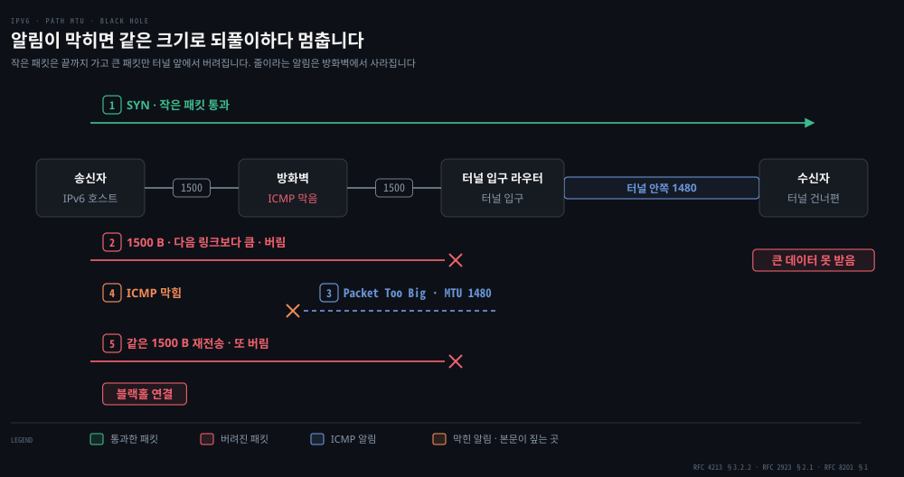
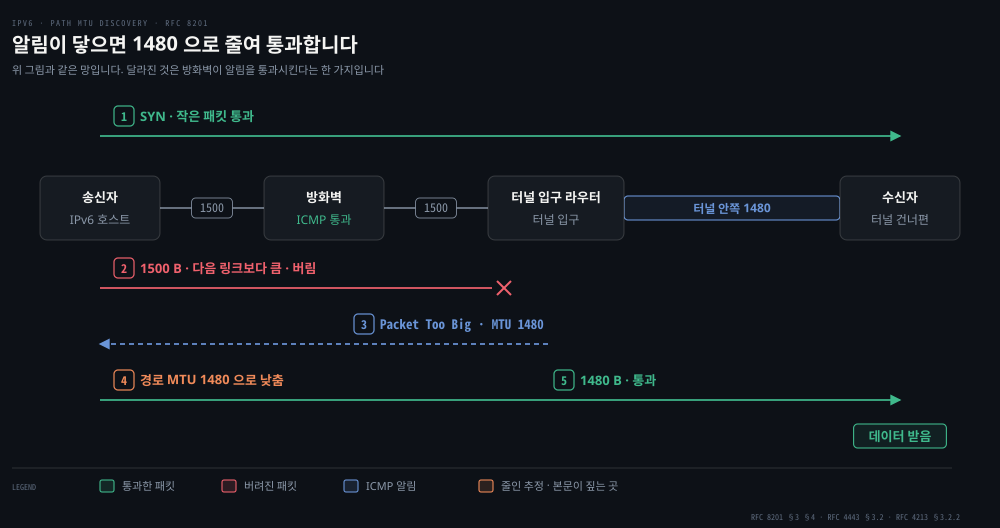
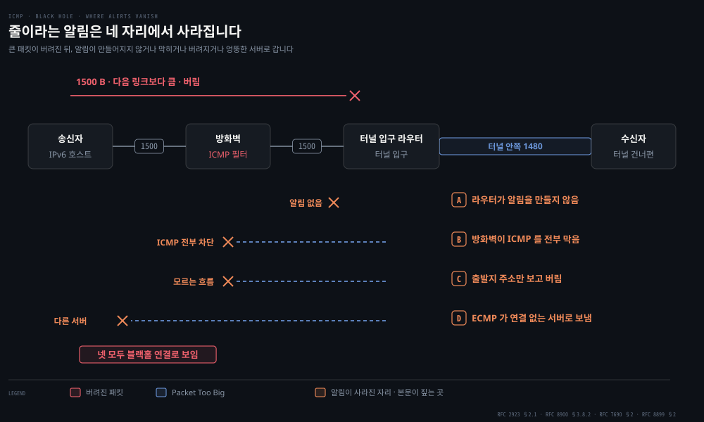
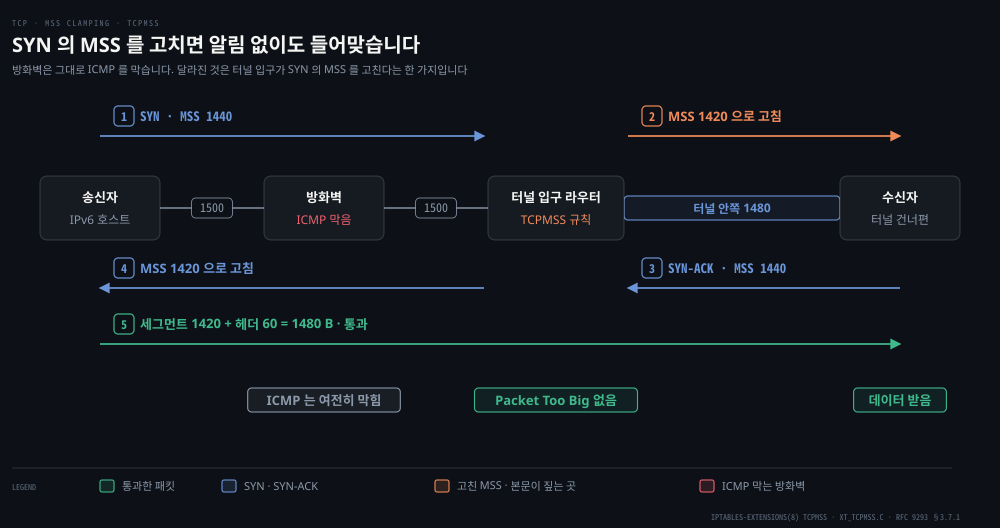
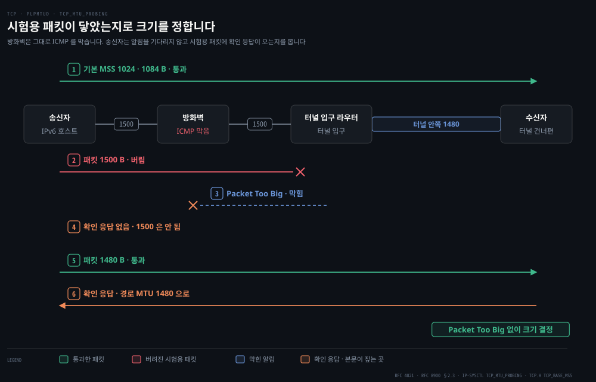
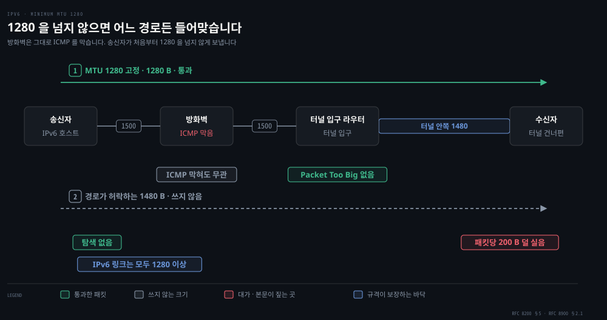

# IPv6 와 일반화 포워딩

---

> 앞의 세 편은 지금 도는 인터넷을 설명했습니다. 이 편은 그 인터넷을 바꾸려 한 두 번의 시도를 봅니다. 하나는 30년째 절반쯤 성공했고, 다른 하나는 포워딩이라는 개념 자체를 다시 썼습니다.

## 핵심 요약

> 이 편이 매달린 하나의 생각은 **네트워크 계층은 바꾸기가 지독히 어렵고, 그래서 새 프로토콜을 깔기보다 기존 상자가 하는 일을 일반화하는 쪽이 실제로 이겼다**는 것입니다.

원문이 IPv6 를 마무리하면서 남기는 문장이 이 편 전체의 결론이기도 합니다.

> 네트워크 계층에 새 프로토콜을 들이는 것은 집의 기초를 갈아 치우는 것과 같습니다. 집을 통째로 허물거나 최소한 사는 사람을 잠시 옮기지 않고는 하기 어렵습니다. 반면 애플리케이션 계층에 새 프로토콜을 들이는 것은 집에 페인트를 한 겹 더 칠하는 것과 같습니다.

같은 장 안에 두 이야기가 나란히 놓인 것이 우연이 아닙니다. IPv6 는 기초를 갈아 치우려는 시도였고 30년이 걸렸습니다. 일반화 포워딩은 기초는 그대로 두고 **라우터가 무엇을 보고 무엇을 하는지만 넓힌** 시도였고, 훨씬 빨리 퍼졌습니다.


## 학습 목표

> 이 편을 읽고 나면 아래 다섯 가지를 스스로 해낼 수 있습니다.

1. IPv6 헤더가 40바이트인 근거를 필드 폭으로 계산하고, IPv4 에서 무엇이 빠졌는지 이유와 함께 말할 수 있습니다.
2. 터널링이 무엇을 어디에 넣는 일인지 설명하고, 터널 안 라우터가 무엇을 모르는지와 터널이 안쪽 MTU 를 줄이는 까닭을 말할 수 있습니다.
3. 경로 MTU 발견(PMTUD)이 Packet Too Big 으로 크기를 맞추는 절차와 알림이 사라지면 블랙홀 연결이 되는 까닭을 설명하고, ICMP 허용·MSS 클램핑·PLPMTUD(`tcp_mtu_probing`)·MTU 1280 고정의 대가를 견줄 수 있습니다.
4. 목적지 기반 포워딩과 일치·동작 포워딩의 차이를 일치 범위와 동작 종류로 갈라 설명하고, 흐름 표 항목으로 포워딩·부하 분산·방화벽을 각각 어떻게 표현하는지 쓸 수 있습니다.
5. 미들박스가 무엇이고 왜 종단 간 논증과 부딪치는지 설명할 수 있습니다.

이 편에서 새로 만나는 낱말입니다. `어디서` 는 그 낱말이 실제로 설명되는 절입니다.

| 키워드 | 뜻 | 학습 포인트·연결 개념 | 어디서 |
|---|---|---|---|
| IPv6 헤더 · IPv6 주소 | 고정 40바이트 · 그중 32가 주소 | 단편화·체크섬·옵션을 뺌 · 주소는 128비트 | §1 |
| 터널링 (tunneling) · 프로토콜 번호 41 | IPv6 를 IPv4 적재량에 넣음 | 안쪽 라우터는 속을 모름 · 안쪽 MTU 가 20 줄어듦 | §2 |
| 경로 MTU 발견 (PMTUD) | 알림으로 경로 최소 MTU 를 찾음 | IPv4 알림은 타입 3 코드 4 · 바닥 1280·68 | §3 |
| MSS 클램핑 (MSS clamping) | SYN 의 MSS 를 낮춰 적음 | TCP 에만 들음 · 흔히 터널 입구 | §3 |
| 일반화 포워딩 · 흐름 표 (flow table) | 여러 필드로 일치하고 동작하는 표 | OpenFlow 1.0 일치 12개 · 동작 없으면 폐기 | §4 |
| 미들박스 (middlebox) | 라우터 표준 기능이 아닌 중간 상자 | 잘록한 허리 · 종단 간 논증과 부딪힘 | §6 |


## 1. 주소 고갈을 풀려고 IPv6 헤더를 40바이트 고정으로 다시 지었습니다

> 주소가 모자란다는 것이 출발점이었지만, 고친 것은 주소만이 아니었습니다.


1990년대 초 IETF 가 IPv4 의 후계자를 만든 동기는 32비트 주소 공간의 고갈입니다. 원문이 옮기는 고갈 시점 논쟁에서 Address Lifetime Expectations 작업반을 이끈 두 사람은 2008년과 2018년을 짚었습니다. 실제로는 **2011년 2월에 IANA 가 미할당 IPv4 주소의 마지막 묶음을 지역 등록기관에 넘겼습니다.**

128비트 주소가 얼마나 큰지는 계산해 봐야 감이 옵니다.

```python
print(f"{2**32:.3e}")            # 4.295e+09   IPv4
print(f"{2**128:.3e}")           # 3.403e+38   IPv6
print(f"{2**128 / 7.5e18:.1e}")  # 4.5e+19     지구 모래알 어림 7.5e18 대비
```

모래알 수를 후하게 잡아도 주소가 그 4×10¹⁹ 배 남습니다. 원문의 "지구의 모래알 하나하나에 IP 주소를 줄 수 있다"는 말은 과장이 아닙니다.

### IPv6 헤더 40바이트를 필드별로 뜯어봅니다

[04-03](./04-03.IP%20—%20데이터그램과%20주소.md) 에서 IPv4 헤더를 뜯어본 것처럼, 이 기계에서 링크 로컬 멀티캐스트로 `ping6` 트래픽을 만들고 첫 패킷을 잡았습니다.

```bash
# 캡처는 패킷이 올 때까지 기다리므로 배경에 띄우고 트래픽을 만듭니다
tcpdump -i en0 -c 1 -x ip6 &
ping6 -c 3 ff02::1%en0
# 0x0000:  6004 0900 0010 3a40 fe80 0000 0000 0000
# 0x0010:  .... .... .... ....  ff02 0000 0000 0000
# 0x0020:  0000 0000 0000 0001  8000 a6ae 282e 0000
```

앞 8바이트에 제어 정보가 모두 있고, 나머지 32바이트가 주소입니다.

| 바이트 | 값 | 필드 | 읽는 방법 |
|--------|-----|------|-----------|
| 0 (앞 4비트) | `6` | 버전 | IPv6 는 6 입니다 |
| 0–1 | `00` | 트래픽 클래스 | IPv4 의 서비스 유형 자리 |
| 1–3 | `0 4090 0` | 흐름 레이블 | 20비트. `0x40900` 이 실려 왔습니다 |
| 4–5 | `0010` | 적재량 길이 | 16바이트. 40바이트 헤더 **뒤**의 크기입니다 |
| 6 | `3a` | 다음 헤더 | 58 = ICMPv6 |
| 7 | `40` | 홉 한도 | 64. IPv4 의 TTL 과 같은 자리, 같은 초기값 |
| 8–23 | `fe80:...` | 출발지 주소 | 링크 로컬. 뒤 64비트는 가렸습니다 |
| 24–39 | `ff02::1` | 목적지 주소 | 같은 링크의 모든 노드 |

필드 폭을 더하면 헤더 크기가 그대로 나옵니다.

```python
bits = 4 + 8 + 20 + 16 + 8 + 8 + 128 + 128
print(bits, bits // 8)   # 320 40
```

주소는 네 배로 커졌는데 헤더는 20바이트에서 40바이트, 두 배에 그쳤습니다. 나머지를 덜어 냈기 때문입니다.

### 라우터를 빠르게 하려고 단편화·헤더 체크섬·옵션을 뺐습니다

원문이 꼽는 셋은 이유가 같습니다. **라우터를 빠르게 하려고**입니다.

| 뺀 것 | 대신 어떻게 하나 | 까닭 |
|---|---|---|
| 단편화와 재조립 | 너무 큰 패킷은 라우터가 버리고 `Packet Too Big` ICMP 오류를 송신자에게 돌려보냅니다. 송신자가 작게 다시 보냅니다 | 시간이 많이 드는 일을 망 안에서 종단으로 옮겼습니다 |
| 헤더 체크섬 | 없앴습니다 | 트랜스포트·링크 계층이 이미 검사합니다. [04-03](./04-03.IP%20—%20데이터그램과%20주소.md) 에서 본, TTL 이 바뀔 때마다 홉마다 다시 계산하던 비용 자체를 지웠습니다 |
| 옵션 | 고정 헤더에서 빼 다음 헤더 사슬의 한 고리로 옮겼습니다 | 기본 헤더가 가변이 아니라 **고정 40바이트**가 됩니다 |

위 덤프에서도 홉 한도 `40` 바로 다음이 출발지 주소라 체크섬이 들어갈 자리가 없습니다.

> **노트의 읽기**: 원문은 흐름 레이블의 정의가 "붙잡기 어렵다"며 [RFC 2460](https://www.rfc-editor.org/rfc/rfc2460.txt) 의 모호한 문장만 인용합니다. 2011년에 나온 [RFC 6437](https://www.rfc-editor.org/rfc/rfc6437.txt) `IPv6 Flow Label Specification` 이 값을 정하고 쓰는 법을 규정했고, 위 패킷의 `0x40900` 도 그 규격대로 운영체제가 채운 값입니다.
>
> IPv6 명세 자체도 2017년 [RFC 8200](https://www.rfc-editor.org/rfc/rfc8200.txt) 으로 바뀌었습니다. RFC 2460 을 폐기하고 인터넷 표준 STD 86 이 된 문서라, 원문의 인용은 역사로는 맞지만 현재 규격은 아닙니다.


## 2. 한꺼번에 갈아탈 수 없어서 터널링으로 IPv6 를 IPv4 위에 싣습니다

> 문제는 IPv6 를 만드는 것이 아니라, 이미 돌고 있는 IPv4 망 위에 그것을 얹는 것이었습니다.


새 IPv6 장비는 IPv4 도 다루게 만들 수 있습니다. 문제는 반대쪽입니다. **이미 깔린 IPv4 장비는 IPv6 데이터그램을 다루지 못합니다.** 그래서 전환은 기술 문제가 아니라 배치 문제가 됩니다.

인터넷의 모든 기계를 한날한시에 갈아 끼우는 **깃발 날**은 역사가 이미 막았습니다. 인터넷이 아주 작던 NCP 에서 TCP 로의 전환 때도 그런 날은 불가능하다고 판단됐고, [RFC 801](https://www.rfc-editor.org/rfc/rfc801.txt) 은 목표를 **1983년 1월 1일까지** 완전히 갈아타는 것으로 잡았습니다. 기계 수십억 대가 걸린 지금은 더 생각할 수 없는 일입니다.

### 터널링은 IPv6 를 IPv4 적재량에 넣고 프로토콜 번호 41 로 알립니다

IPv6 노드 둘 사이에 IPv4 라우터들이 있을 때, 그 구간 전체를 **터널**이라 부릅니다. 원문이 널리 채택된 전환 방법으로 드는 **터널링**의 절차는 넷입니다.

1. 보내는 쪽 IPv6 노드가 **IPv6 데이터그램 전체를 IPv4 데이터그램의 적재량 자리에 넣습니다.**
2. 그 IPv4 데이터그램의 목적지를 터널 반대편 IPv6 노드로 적어 보냅니다.
3. 터널 안의 IPv4 라우터들은 속을 모른 채 여느 IPv4 데이터그램처럼 나릅니다.
4. 반대편 노드가 프로토콜 번호 **41** 을 보고 적재량이 IPv6 임을 알아, 꺼내서 원래대로 포워딩합니다.

바꿔야 할 장비가 터널 양 끝 둘뿐이라는 점이 이 방법의 값어치입니다.

```bash
# IANA 프로토콜 번호 등록부에서 41 을 확인합니다
curl -s https://www.iana.org/assignments/protocol-numbers/protocol-numbers-1.csv | grep '^41,'
# 41,IPv6,IPv6 encapsulation,,[RFC2473]
```

원문은 이 번호의 근거로 [RFC 4213](https://www.rfc-editor.org/rfc/rfc4213.txt) 을 가리키지만, IANA 등록부가 적는 근거 문서는 [RFC 2473](https://www.rfc-editor.org/rfc/rfc2473.txt) 입니다. 번호는 둘 다 41 로 같습니다.

터널의 대가는 원문에 없습니다. 입구가 IPv4 헤더 20 바이트를 붙이는 만큼 안쪽에 실을 크기가 줄어듭니다. 경로 MTU 를 따라가는 입구라면 IPv4 경로 MTU 1500 에서 안쪽 IPv6 패킷은 1480 바이트까지 넘어가고, 더 큰 패킷은 입구에서 버려져 송신자가 `Packet Too Big` 을 받아야 줄입니다. 그 알림이 막히거나 엉뚱한 서버로 가면 큰 데이터만 멈추는데, 그 장면과 대처는 바로 다음 [§3](#3-큰-패킷이-사라지는-블랙홀을-경로-mtu-발견pmtud과-대처-넷으로-풉니다) 이 다룹니다.

### IPv6 채택률은 올랐어도 임의의 경로로 닿는다는 보장은 없습니다

원문이 드는 채택률은 밝습니다. 미국 정부 도메인 약 1,400개 가운데 메일·웹·DNS 서비스의 약 40% 가 IPv6 로 설정돼 있고, 구글은 자사 서비스 접속 클라이언트의 절반 가까이가 IPv6 를 쓴다고 보고합니다. 2012년에는 1% 였습니다. 이 노트를 쓰는 회선에서 재 보면 그림이 다릅니다.

```bash
ifconfig | grep -c 'inet6 [23]'                    # 0  ← 전역 IPv6 주소 없음
curl -6 -s -o /dev/null -w '%{http_code}\n' https://ipv6.google.com   # 000 (실패)
curl -4 -s -o /dev/null -w '%{http_code}\n' https://www.google.com    # 200
```

이 기계에는 링크 로컬 `fe80::` 주소만 있어 IPv6 로는 밖에 나가지 못하고 IPv4 로만 나갑니다. 목적지 쪽도 갈립니다.

```bash
for h in www.google.com www.cloudflare.com www.naver.com github.com gaia.cs.umass.edu; do
  printf '%-22s A:%s AAAA:%s\n' "$h" \
    "$(dig +short A $h | grep -c '^[0-9]')" "$(dig +short AAAA $h | grep -c ':')"
done
```

| 호스트 | A | AAAA |
|--------|---|------|
| `www.google.com` | 8 | 8 |
| `www.cloudflare.com` | 2 | 2 |
| `www.naver.com` | 4 | 0 |
| `github.com` | 1 | 0 |
| `gaia.cs.umass.edu` | 1 | 0 |

공개 리졸버 `8.8.8.8` 과 `1.1.1.1` 로 다시 물어도 같아서, 테더링 DNS 가 AAAA 를 지운 것은 아닙니다. 구글과 Cloudflare 는 이중 스택이고 나머지 셋은 IPv4 전용입니다. **원문이 2장부터 실습 대상으로 삼아 온 `gaia.cs.umass.edu` 자체가 IPv6 로는 닿지 않습니다.**

채택률 숫자가 틀렸다는 뜻은 아닙니다. IPv6 로 통신하려면 회선 쪽 조건(전역 주소가 있고 `curl -6` 이 되는가)과 목적지 쪽 조건(AAAA 가 있는가)이 **동시에** 갖춰져야 하므로, 어느 한쪽 채택률만으로는 실제 도달 가능성을 알 수 없습니다. 구글 접속의 절반이 IPv6 라는 것과 임의의 회선에서 임의의 서버에 IPv6 로 닿는다는 것은 다른 이야기입니다. 원문이 "네트워크 계층 프로토콜을 바꾸는 일이 지독히 어렵다"고 적은 그대로입니다.


## 3. 큰 패킷이 사라지는 블랙홀을 경로 MTU 발견(PMTUD)과 대처 넷으로 풉니다

> IPv6 라우터는 너무 큰 패킷을 쪼개지 않고 버린 뒤 알림만 보냅니다. 크기를 줄이는 일이 알림 한 통에 걸리니, 알림이 막히면 연결은 되는데 큰 데이터만 멈춥니다.

원문은 §1 의 한 문장, 곧 라우터가 버리고 `Packet Too Big` 을 보내면 송신자가 작게 다시 보낸다는 데서 멈춥니다. 알림이 닿지 않는 경우와 그 대처는 다루지 않으므로 이 절은 RFC 와 커널 문서로 채운 원문 밖 내용입니다. 예로 드는 망은 §2 의 터널이 안쪽 MTU 를 1480 으로 줄인 망입니다.

### Packet Too Big 이 막히면 블랙홀 연결이 됩니다



**Packet Too Big**(PTB)은 다음 링크의 **MTU**(Maximum Transmission Unit, 링크가 한 번에 넘길 수 있는 가장 큰 패킷 크기)보다 큰 패킷을 라우터가 버리고 송신자에게 돌려보내는 ICMPv6 오류입니다. 알림에는 그 다음 링크의 MTU 가 적혀 있습니다.

그림은 터널 너머 사용자에게 IPv6 서버가 응답하는 장면입니다. 1번 SYN 은 작아서 끝까지 건넙니다. 2번 1500 바이트 데이터는 터널 입구에서 버려지는데, §2 에서 본 대로 입구가 IPv4 헤더 20 바이트를 붙여 안쪽으로 1480 바이트까지만 넘기기 때문입니다. 3번 Packet Too Big 은 4번처럼 ICMP 를 막는 방화벽에서 사라집니다. 알림을 못 받은 송신자는 5번처럼 같은 크기로 다시 보냅니다.

핸드셰이크는 끝났는데 큰 데이터부터 멈추는 이 상태를 [RFC 8201](https://www.rfc-editor.org/rfc/rfc8201.txt) §1 은 **블랙홀 연결**이라 부릅니다. [RFC 2923](https://www.rfc-editor.org/rfc/rfc2923.txt) §2.1 의 트레이스에서는 1460 바이트 세그먼트가 같은 크기로 열세 번 나간 뒤 연결이 리셋됩니다.

> **이어 읽기**: 방화벽이 막지 않았는데도 Packet Too Big 이 연결 없는 서버로 가서 같은 블랙홀이 되는 길은 [흐름을 가르는 다섯 값](../../../troubleshooting/_concepts/%ED%9D%90%EB%A6%84%EC%9D%84-%EA%B0%80%EB%A5%B4%EB%8A%94-%EB%8B%A4%EC%84%AF-%EA%B0%92.md) 의 「ICMP 오류는 원본 앞부분을 인용합니다」「ECMP 라우터는 보통 바깥 헤더만 해시합니다」「줄이라는 알림이 연결을 못 찾아가는 길」이 차례로 잇습니다.

### 경로 MTU 발견(PMTUD)으로 경로에 맞는 크기를 찾습니다



**경로 MTU**(Path MTU)는 출발지에서 목적지까지 지나는 링크 MTU 가운데 가장 작은 값입니다. 송신자가 이 값을 알림으로 알아내 패킷 크기를 맞추는 절차가 **경로 MTU 발견**이고, 영어 이름 Path MTU Discovery 를 줄여 PMTUD 라 부릅니다. RFC 8201 §1 이 두 용어를 이렇게 씁니다.

같은 문서 §3 의 절차에서 송신자는 첫 링크의 MTU 로 시작합니다. 경로 위 노드가 너무 큰 패킷을 버리고 알림을 보내면 송신자는 알림에 적힌 MTU 로 추정을 낮춥니다. 뒤에 더 좁은 링크가 있으면 이 왕복을 되풀이합니다. 그림에서는 방화벽이 알림을 통과시켜 3번 Packet Too Big 이 닿고, 송신자는 4번에서 1480 으로 낮춰 5번처럼 통과합니다.

| | IPv6 | IPv4 |
|---|---|---|
| 규격 | RFC 8201 | [RFC 1191](https://www.rfc-editor.org/rfc/rfc1191.txt) |
| 알림 | ICMPv6 **타입 2** Packet Too Big ([RFC 4443](https://www.rfc-editor.org/rfc/rfc4443.txt) §3.2) | ICMP **타입 3 코드 4**. RFC 1191 §2 의 송신자가 DF 비트를 켜고 보내고, §4 의 라우터가 버린 뒤 알립니다 |
| 추정의 바닥 | 1280 바이트 ([RFC 8200](https://www.rfc-editor.org/rfc/rfc8200.txt) §5, RFC 8201 §4) | 68 바이트 (RFC 1191 §3) |

알림에는 다음 링크의 MTU 와, 원본 패킷을 최소 IPv6 MTU 를 넘지 않는 만큼 인용한 부분이 담깁니다. 받는 쪽은 그 인용에서 상위 프로토콜을 꺼내 알림을 넘길 곳을 고릅니다(RFC 4443 §2.4). DF 가 켜진 IPv4 데이터그램을 버리는 규칙은 [04-03](./04-03.IP%20—%20데이터그램과%20주소.md) §1 「다음 링크에 안 들어가면 쪼개거나 버립니다」에 있습니다.

그림의 1480 은 [§2](#2-한꺼번에-갈아탈-수-없어서-터널링으로-ipv6-를-ipv4-위에-싣습니다) 의 터널에서 나옵니다. [RFC 4213](https://www.rfc-editor.org/rfc/rfc4213.txt) §3.2.2 에서 경로 MTU 를 따라가는 터널 입구는 IPv4 경로 MTU 에서 헤더 20 을 뺀 값을 IPv6 쪽 MTU 로 보고, 그보다 큰 패킷에 그 값을 담은 Packet Too Big 을 돌려줍니다. 고정값을 쓰는 입구는 1280 과 1480 사이에서 고르되 1280 을 권합니다.

얻는 것은 둘입니다. 라우터가 쪼개거나 되붙이는 일을 떠맡지 않습니다. 그리고 송신자는 최소 MTU 대신 경로가 허락하는 가장 큰 크기를 씁니다. [RFC 8900](https://www.rfc-editor.org/rfc/rfc8900.txt) §2.1 은 최소 MTU 짐작이 늘 안전하지만 실제보다 작기 쉬워 위 계층 성능을 깎는다고 적습니다.

대가는 모든 것이 알림 한 통에 걸린다는 점입니다. RFC 8900 §2.1 은 망이 Packet Too Big 을 송신자에게 전하지 못하면 PMTUD 가 실패한다고 적습니다. ICMP 는 쉽게 위조되고 받는 쪽이 인증하지 않아서, 가짜 알림으로 크기를 쓸데없이 낮추게 하는 공격에도 약합니다.

> **곁노트 — 한 페이지 요약**: PMTUD·ICMP 블랙홀·MSS 클램핑을 한 화면에 모은 [Unseel — MTU and IP Fragmentation](https://unseel.com/cs/mtu-fragmentation) 이 있고, 움직이는 그림은 [04-03](./04-03.IP%20—%20데이터그램과%20주소.md) 의 단편화 소절에 넣어 두었습니다. AI 가 만든 페이지라 틀린 값이 섞여 있습니다. 예를 들어 IPv4 최소 MTU 를 576 으로 적지만, [RFC 791](https://www.rfc-editor.org/rfc/rfc791.txt) 에서 576 은 모든 목적지가 받아야 하는 데이터그램 크기이고 쪼개지 않고 넘겨야 하는 크기는 68 입니다.

### ICMP 블랙홀은 알림을 막는 방화벽과 라우터가 만듭니다



[RFC 8899](https://www.rfc-editor.org/rfc/rfc8899.txt) §2 에서 **블랙홀**은 패킷이 목적지에 닿지 않는데 송신자가 그 사실을 모르는 상태입니다. 그중 Packet Too Big 을 받지 못해 모르는 경우를 **ICMP 블랙홀**로 따로 부릅니다. 알림이 사라지는 자리는 도식의 넷이고, 첫 문제 도식의 블랙홀 연결은 그중 B 입니다.

| 도식 | 알림이 사라지는 자리 | 근거 |
|---|---|---|
| A | ICMP 를 제대로 보내지 않는 라우터 | RFC 2923 §2.1 |
| B | 모든 ICMP 를 막도록 잘못 설정한 방화벽 | RFC 2923 §2.1 |
| C | 구현이 틀린 상태 추적 방화벽. 인용된 원본으로 기존 흐름을 가려야 하는데, 알림의 출발지 주소만 보고 모르는 흐름이라 버리는 가정용 라우터가 많습니다 | RFC 8900 §3.8.2 |
| D | 흐름을 서버 여럿에 나누는 ECMP 앞단이 알림을 연결 없는 서버로 보냄 | [06-05](./06-05.데이터센터와%20웹%20페이지%20하나의%20하루.md) §3, [흐름을 가르는 다섯 값](../../../troubleshooting/_concepts/흐름을-가르는-다섯-값.md) |

진단도 어렵습니다. RFC 2923 §2.1 이 드는 장애에서는 ping 과 일부 대화형 TCP 연결이 되고 대량 전송만 첫 큰 패킷에서 실패합니다. 흔적은 사라진 트래픽에만 남습니다. RFC 8899 §4.3 이 드는 검출 단서 셋 가운데 Packet Too Big 을 뺀 둘도 연달아 잃은 시험용 패킷과 특정 크기에서 지나치게 많은 손실입니다. ICMP 를 끌 수 있는 라우터가 PMTUD 를 조용히 망가뜨린다는 지적은 [RFC 1435](https://www.rfc-editor.org/rfc/rfc1435.txt) 에 이미 있습니다.

> **곁노트 — 일부러 만드는 블랙홀**: 리눅스 [`ip-route(8)`](https://man7.org/linux/man-pages/man8/ip-route.8.html) 의 경로 유형 셋은 모두 패킷을 버리지만 알리는 방식이 다릅니다.
>
> | 유형 | 밖으로 보내는 ICMP | 이 기계 안 송신자가 받는 오류 |
> |---|---|---|
> | `blackhole` | 없음 | `EINVAL` |
> | `unreachable` | host unreachable | `EHOSTUNREACH` |
> | `prohibit` | communication administratively prohibited | `EACCES` |
>
> ICMP 를 만들지 않는 `blackhole` 은 밖에서 보면 위의 블랙홀과 같고, 흔히 null route 라 부릅니다(용어 정리 참고: [Wikipedia — Black hole (networking)](https://en.wikipedia.org/wiki/Black_hole_%28networking%29)).

### 블랙홀 대처는 ICMP 허용·MSS 클램핑·PLPMTUD·MTU 1280 고정 넷입니다

알림이 오는 길은 경로 위 남의 장비에 달려 있어서, 알림에 덜 기대는 방법이 따로 쓰입니다.

| 방법 | 어디에 거나 | 얻는 것 | 대가 |
|---|---|---|---|
| ICMP 허용 | 경로 위 방화벽 | PMTUD 가 원래대로 돌고 모든 프로토콜이 경로를 배웁니다 | 남의 장비라 내가 못 고칠 때가 많습니다 |
| MSS 클램핑 | 경로 위 장비, 흔히 터널 입구 | 알림 없이도 TCP 가 처음부터 작게 보냅니다 | TCP 에만 듣고, 트래픽이 모두 그 장비를 지나야 합니다 |
| PLPMTUD (리눅스 `tcp_mtu_probing`) | 송신 호스트의 TCP | 알림 대신 시험용 패킷이 닿는지로 크기를 찾습니다 | 그 호스트의 연결에만 듣고, 찾는 동안 지연이 생깁니다 |
| MTU 1280 고정 | 송신 호스트의 경로 설정 | 탐색 없이 IPv6 최소 링크 MTU 안에 들어갑니다 | 더 큰 경로에서도 작게 보내 성능을 버립니다 |

근본 수정은 ICMP 허용입니다. [RFC 8900](https://www.rfc-editor.org/rfc/rfc8900.txt) §6.5 는 위조나 부당한 것으로 알려진 경우가 아니면 망 운영자가 ICMPv6 Packet Too Big 을 걸러서는 안 된다고 못박습니다. 상태 추적 방화벽이라면 인용된 원본으로 기존 흐름을 가려 알림을 들이면 됩니다(§3.8.2). ICMP 를 허용했을 때의 흐름은 앞의 경로 MTU 발견 도식 그대로입니다.

막힌 것이 크기인지, 처방이 먹었는지 가리는 명령 넷(`ping -M do`·`tracepath`·`ip route get`·`ss -tin`)과 읽는 법은 실습 노트 [06-01](../network-fundamentals-lab/06-01.%EC%9E%91%EC%9D%80%20%EA%B2%83%EC%9D%80%20%EB%90%98%EA%B3%A0%20%ED%81%B0%20%EA%B2%83%EB%A7%8C%20%EB%A9%8E%EB%8A%94%EB%8B%A4.md) §3 「어느 쪽인지 가리는 명령 넷」에 모았습니다.

### MSS 클램핑은 지나가는 SYN 의 MSS 를 낮춰 적습니다



**MSS**(Maximum Segment Size)는 TCP 세그먼트 하나에 담는 데이터의 최대 바이트 수입니다. [RFC 9293](https://www.rfc-editor.org/rfc/rfc9293.txt) §3.2 에서 이 값은 SYN 에만 실어 알립니다. 상대는 §3.7.1 대로 실제로 보내는 세그먼트를 그 값 아래로 맞춥니다. 경로 위 장비가 지나가는 SYN 의 이 값을 경로에 맞게 고쳐 써서 양 끝이 처음부터 작은 세그먼트로 주고받게 하는 기법이 **MSS 클램핑**입니다.

그림에서 방화벽은 여전히 ICMP 를 막습니다. 달라진 것은 터널 입구의 규칙 하나입니다. 송신자는 링크 MTU 1500 에서 IPv6 헤더 40 과 TCP 헤더 20 을 뺀 1440 을 적어 SYN 을 보냅니다. 입구가 그 값을 터널 안쪽 1480 에서 60 을 뺀 1420 으로 고치고, SYN-ACK 도 같은 규칙으로 1420 이 됩니다. 이후 데이터는 세그먼트 1420 에 헤더 60 을 더한 1480 바이트라 터널에 들어맞아 Packet Too Big 이 생기지 않습니다.

MTU 에서 헤더를 빼 MSS 를 얻는 셈은 [06-03](./06-03.주소가%20둘인%20이유와%20이더넷.md) 심화 학습의 「MTU 1500 이 MSS 1460 이 되는 자리」와 같습니다. 리눅스에서는 iptables 의 `TCPMSS` 타깃이 이 일을 하고, 아래 줄은 [`iptables-extensions(8)`](https://man7.org/linux/man-pages/man8/iptables-extensions.8.html) 이 그대로 싣는 예입니다.

```bash
# 지나가는 TCP 중 SYN 이 켜진 것만 골라 MSS 를 경로 MTU 에 맞춥니다
iptables -t mangle -A FORWARD -p tcp --tcp-flags SYN,RST SYN -j TCPMSS --clamp-mss-to-pmtu
```

| 알아 둘 동작 | 근거 |
|---|---|
| `--clamp-mss-to-pmtu` 는 경로 MTU 에서 IPv4 는 40, IPv6 는 60 을 뺍니다. 값을 직접 정하려면 대신 `--set-mss 값` 을 쓰고, 둘은 함께 못 씁니다 | man 페이지 |
| 리눅스 2.6.25 부터는 원래 MSS 가 이미 더 작으면 올리지 않습니다 | man 페이지 |
| 두 방향의 경로 MTU 가 다르면 작은 쪽을 써서 SYN 과 SYN-ACK 가 같은 값이 됩니다. 경로 MTU 가 방향마다 다른 비대칭 경로에서는 기대대로 안 될 수 있습니다 | [`xt_TCPMSS.c`](https://github.com/torvalds/linux/blob/master/net/netfilter/xt_TCPMSS.c), man 페이지 |

대가는 둘입니다. MSS 가 없는 UDP·ICMP 에는 고칠 값이 없습니다. 또 [RFC 4459](https://www.rfc-editor.org/rfc/rfc4459.txt) §3.2 의 지적대로 트래픽이 모두 클램핑하는 장비를 지나야 하므로, 경로가 하나뿐인 접속 링크가 아니면 지키기 어렵습니다. 같은 규칙을 걸었을 때 TCP 만 살아나는 모습은 [06-01](../network-fundamentals-lab/06-01.%EC%9E%91%EC%9D%80%20%EA%B2%83%EC%9D%80%20%EB%90%98%EA%B3%A0%20%ED%81%B0%20%EA%B2%83%EB%A7%8C%20%EB%A9%8E%EB%8A%94%EB%8B%A4.md) §3 「MSS clamp — TCP 한정 응급처치」에 있습니다.

### PLPMTUD 와 tcp_mtu_probing 은 알림 대신 시험용 패킷으로 크기를 찾습니다



**PLPMTUD**(Packetization Layer Path MTU Discovery, 패킷화 계층 경로 MTU 발견)는 알림을 기다리지 않습니다. [RFC 4821](https://www.rfc-editor.org/rfc/rfc4821.txt) 에서 TCP 같은 패킷화 계층이 점점 큰 시험용 패킷을 보내고, 상대의 확인 응답이 오는지로 크기를 정합니다. 그래서 망이 Packet Too Big 을 전해 주지 못해도 돕니다(RFC 8900 §2.3). RFC 8201 §1 도 이 방법을 ICMPv6 가 닿는다고 장담할 수 없는 경로를 위한 확장으로 소개합니다.

그림에서 송신자는 기본 크기로 시작합니다. 1500 바이트 패킷은 버려지고 알림도 막혀 확인 응답이 오지 않으니 그 크기는 안 되는 것으로 봅니다. 1480 바이트 패킷에 확인 응답이 오자 경로 MTU 를 1480 으로 올립니다. 패킷 크기 둘은 그림의 예시이고, 실제 크기는 구현이 정합니다.

리눅스 TCP 에서 이 방법을 켜는 sysctl 이 **`net.ipv4.tcp_mtu_probing`** 이고, 커널 문서 [`ip-sysctl.rst`](https://github.com/torvalds/linux/blob/master/Documentation/networking/ip-sysctl.rst) 가 적는 값은 셋입니다.

| 값 | 뜻 |
|---|---|
| `0` | 끕니다 |
| `1` | 평소에는 끄고, ICMP 블랙홀이 감지되면 켭니다 |
| `2` | 늘 켜고, 초기 MSS 로 `tcp_base_mss` 를 씁니다 |

`net.ipv4.tcp_base_mss` 는 탐색을 켰을 때 연결이 쓰는 초기 MSS 이고, 지금 커널의 [`include/net/tcp.h`](https://github.com/torvalds/linux/blob/master/include/net/tcp.h) 에서 `TCP_BASE_MSS` 기본값은 1024 입니다. [05-02](./05-02.AS%20안과%20AS%20사이.md) §5 에 적은 2015년 사고 때 Cloudflare 는 IPv4 쪽 임시 조치로 이 탐색을 켰습니다. [Path MTU discovery in practice](https://blog.cloudflare.com/path-mtu-discovery-in-practice/) 는 `tcp_mtu_probing` 을 1, `tcp_base_mss` 를 1024 로 두었고, 당시 기본값은 512 로 적혀 있습니다.

```bash
# 지금 값을 봅니다
cat /proc/sys/net/ipv4/tcp_mtu_probing /proc/sys/net/ipv4/tcp_base_mss
# 블랙홀이 감지될 때만 탐색합니다. Cloudflare 글이 쓴 형식입니다
echo 1 > /proc/sys/net/ipv4/tcp_mtu_probing
```

대가는 적용 범위와 시간입니다. 그 호스트의 TCP 연결에만 듣고, 블랙홀을 감지하는 데 매번 몇 초가 걸릴 수 있습니다. 호스트가 알아서 버티면 망의 블랙홀이 고쳐지지 않고 남기도 쉽습니다(RFC 2923 §2.1).

### MTU 1280 고정은 탐색 없이 IPv6 최소 크기로 보냅니다



넷 가운데 가장 거친 방법입니다. IPv6 는 모든 링크에 1280 바이트 이상을 요구하므로, 1280 을 넘지 않게만 보내면 PMTUD 없이도 어느 경로에나 들어맞습니다. RFC 8200 §5 도 부트 ROM 같은 최소 구현이라면 1280 이하로만 보내고 PMTUD 를 빼도 된다고 적습니다.

Cloudflare 가 같은 사고에서 IPv6 쪽에 쓴 임시 조치가 이것입니다. 대가는 성능입니다. 그림의 망처럼 경로가 1480 을 허락해도 패킷마다 200 바이트를 덜 싣고, RFC 8900 §2.1 의 말대로 이런 보수적 추정은 위 계층 성능을 깎습니다.


## 4. 목적지만 보던 포워딩을 일치·동작 표로 일반화합니다

> 목적지 주소 하나만 보라는 규칙을 풀면, 라우터는 라우터가 아닌 것도 될 수 있습니다.


[04-01](./04-01.라우터는%20안에서%20무엇을%20하는가.md) 의 목적지 기반 포워딩은 두 걸음입니다. 목적지 IP 주소를 찾아보는 **일치**와, 지정된 출력 포트로 보내는 **동작**입니다. 이 틀은 그대로 두고 각각을 넓힙니다.

- **일치**를 넓히면 프로토콜 스택의 서로 다른 계층에 있는 여러 헤더 필드를 함께 봅니다.
- **동작**을 넓히면 부하 분산, 헤더 값 재작성(NAT), 일부러 버리기(방화벽), 특별한 서버로 넘기기(DPI)까지 합니다.

넓힌 표를 **일치·동작 표**라 하고, OpenFlow 에서는 **흐름 표**라 부릅니다. 결정적 차이가 하나 더 있습니다. 이 표는 각 장비가 스스로 만들지 않고 **원격 컨트롤러가 계산해 설치하고 갱신합니다.** [04-01](./04-01.라우터는%20안에서%20무엇을%20하는가.md) 에서 예고한 제어 평면 분리가 여기서 형태를 갖춥니다.

네트워크 계층 주소로도 링크 계층 주소로도 결정을 내리니, 이 장비를 라우터나 스위치라 부르기 어렵습니다. 원문은 여기서부터 **패킷 스위치**라 부릅니다.

### 흐름 표 항목은 일치·계수기·동작 세 칸입니다

| 칸 | 담는 것 |
|---|---|
| 일치할 헤더 필드 값 | 하드웨어에서는 TCAM 으로 가장 빠르게 처리하고, 목적지 주소 항목만 백만 개 넘게 담을 수 있습니다. 어느 항목에도 맞지 않는 패킷은 버리거나 컨트롤러로 올려 보냅니다 |
| 계수기 | 그 항목에 맞은 패킷 수, 항목이 마지막으로 갱신된 뒤 흐른 시간 같은 값입니다 |
| 동작 목록 | 맞았을 때 할 일이고, 여럿이면 적힌 순서대로 수행합니다 |

### OpenFlow 1.0 은 세 계층 헤더의 필드 12개로 일치를 겁니다

OpenFlow 1.0 에서 일치에 쓸 수 있는 것은 **헤더 필드 11개와 들어온 포트 번호, 합쳐 12개**입니다. 원문이 짚는 요점은 이 필드들이 한 계층이 아니라는 것입니다.

> OpenFlow 의 일치 추상은 **세 계층의 프로토콜 헤더**에서 고른 필드에 대해 일치를 걸 수 있게 합니다. 1.5절에서 공부한 계층화 원칙을 꽤나 대담하게 거스르면서 말입니다.

그래서 같은 장비가 표만 바꿔, 이더넷 주소로 포워딩하면 2계층 스위치처럼, IP 주소로 포워딩하면 3계층 라우터처럼 굽니다. 항목에는 **와일드카드**를 쓸 수 있어 `128.119.*.*` 는 앞 16비트가 `128.119` 인 모든 주소에 맞습니다. 항목마다 **우선순위**가 있어 여러 항목에 맞으면 가장 높은 것이 이깁니다.

**TTL 과 데이터그램 길이는 일치에 쓸 수 없습니다.** 원문은 이 선을 기능과 복잡도의 맞바꿈으로 설명하며 Butler Lampson 의 문장을 인용합니다.

> 한 번에 한 가지만 하고, 그것을 잘하십시오. 인터페이스는 추상의 최소 본질을 담아야 합니다. 일반화하지 마십시오. 일반화는 대체로 틀립니다.

| 동작 | 뜻 |
|---|---|
| 전달 | 지정한 물리 출력 포트로, 들어온 포트를 뺀 모든 포트로, 또는 고른 포트 집합으로 보냅니다. 컨트롤러로 캡슐화해 올려 보낼 수도 있습니다 |
| 폐기 | 동작이 하나도 없는 항목은 "버리라"는 뜻입니다 |
| 필드 재작성 | Figure 4.29 의 2·3·4계층 필드 가운데 IP 프로토콜 필드만 뺀 10개의 값을 고쳐 내보냅니다 |

> **원문 정오**: 원문은 P4 를 소개하며 **"5년 전 도입된 이래"** 라고 적습니다. 원문이 스스로 다는 인용이 [Bosshart 2014] 이고 P4 논문은 2014년 ACM SIGCOMM CCR 에 실렸으므로, 2025년판 기준으로는 11년 전입니다.
>
> 같은 성격의 문장이 앞에도 있습니다. NCP 에서 TCP 로의 전환을 **"거의 40년 전"** 이라 적는데, [RFC 801](https://www.rfc-editor.org/rfc/rfc801.txt) 이 목표로 삼은 날은 1983년 1월 1일이라 40년이 넘습니다. 앞 판에서 옮겨 온 상대 시점 표현으로 보이니 절대 연도로 바꿔 읽는 편이 안전합니다.


## 5. 흐름 표만 바꿔 포워딩·부하 분산·방화벽을 만듭니다

> 물리 망은 그대로 두고 표만 바꾸면 망의 성격이 바뀝니다.


표 하나로 어디까지 되는지는 예를 나란히 놓아야 보입니다. 원문 Figure 4.30 의 예제 망에는 호스트가 여섯, 패킷 스위치가 셋 있습니다. 스위치마다 지역 인터페이스가 넷씩이고 번호는 1부터 4까지입니다. 원문은 배선을 한 줄도 건드리지 않고 표만 바꿔 서로 다른 동작 셋을 만듭니다.

### 단순 포워딩은 여러 스위치의 표를 합쳐 경로를 만듭니다

h5 나 h6 에서 h3 이나 h4 로 가는 패킷을 s3, s1, s2 순서로 보내려 합니다. s3 과 s2 를 잇는 직통 링크를 일부러 피하는 것입니다.

```properties
s3 흐름 표   Match: IP Src = 10.3.*.* ; IP Dst = 10.2.*.*        → Forward(3)
s1 흐름 표   Match: Ingress Port = 1 ; IP Src = 10.3.*.* ;
                    IP Dst = 10.2.*.*                            → Forward(4)
s2 흐름 표   Match: Ingress port = 2 ; IP Dst = 10.2.0.3         → Forward(3)
             Match: Ingress port = 2 ; IP Dst = 10.2.0.4         → Forward(4)
```

세 스위치에 각각 항목을 넣어야 경로가 완성됩니다. 경로는 어느 한 장비의 성질이 아니라 **여러 표의 합**입니다.

### 부하 분산은 같은 목적지를 들어온 포트로 갈라 보냅니다

h3 에서 `10.1.*.*` 로 가는 것은 s2 와 s1 의 직통 링크로 보내고, h4 에서 같은 목적지로 가는 것은 s2, s3, s1 순서로 돌립니다.

```properties
s2 흐름 표   Match: Ingress port = 3 ; IP Dst = 10.1.*.*   → Forward(2)
             Match: Ingress port = 4 ; IP Dst = 10.1.*.*   → Forward(1)
```

원문이 덧붙이듯 **이 동작은 IP 의 목적지 기반 포워딩으로는 만들 수 없습니다.** 두 항목의 목적지가 같아서, 갈라 주는 것은 목적지가 아닌 들어온 포트뿐입니다. 일치를 넓힌 값어치가 한 줄로 드러나는 자리입니다.

### 방화벽은 허용할 흐름만 적고 나머지는 버립니다

s2 가 s3 에 붙은 호스트에서 온 트래픽만 받게 합니다.

```properties
s2 흐름 표   Match: IP Src = 10.3.*.* ; IP Dst = 10.2.0.3   → Forward(3)
             Match: IP Src = 10.3.*.* ; IP Dst = 10.2.0.4   → Forward(4)
```

s2 의 흐름 표에 다른 항목이 없으면 `10.3.*.*` 에서 온 것만 전달됩니다. 여기서 "동작이 없으면 폐기"라는 규칙이 일해, 맞는 항목이 없는 패킷은 그냥 버려집니다. **방화벽을 별도 장비로 사는 대신 표 두 줄로 만든 것입니다.**

흐름 표는 결국 개별 패킷 스위치의 행동을 프로그램하는 **API** 이고, 여러 스위치의 표를 함께 채우면 망 전체의 행동을 프로그램하게 됩니다. 원문은 이 프로그래밍 가능성을 더 밀고 나간 것으로 P4 를 소개합니다. 변수와 산술과 조건문을 갖추고 회선 속도로 도는 데이터그램 처리 전용 언어입니다.


## 6. 미들박스가 늘며 잘록한 허리와 종단 간 논증이 흔들립니다

> 데이터 경로 위에 앉아 포워딩 말고 다른 일을 하는 상자들이 계속 늘고 있습니다.


라우터가 포워딩만 한다는 전제는 이 책 안에서 이미 여러 번 깨졌습니다. 2장의 웹 캐시, 3장의 TCP 연결 분리기, [04-03](./04-03.IP%20—%20데이터그램과%20주소.md) 의 NAT 와 방화벽과 침입 탐지 시스템입니다. 이런 것을 통틀어 **미들박스**라 하고, 원문은 [RFC 3234](https://www.rfc-editor.org/rfc/rfc3234.txt) 의 정의를 옮깁니다.

> 출발지 호스트와 목적지 호스트 사이의 데이터 경로에서, IP 라우터의 정상적이고 표준적인 기능이 아닌 기능을 수행하는 모든 중간 상자.

| 부류 | 하는 일 |
|---|---|
| NAT 변환 | 사설 주소를 구현하고 헤더의 주소와 포트를 다시 씁니다 |
| 보안 서비스 | 방화벽이 헤더 값으로 막거나 심층 패킷 검사로 넘기고, 침입 탐지 시스템이 정해진 패턴을 걸러 내고, 메일 필터가 정크와 피싱을 막습니다 |
| 성능 향상 | 압축, 콘텐츠 캐싱, 서비스 요청의 부하 분산입니다 |

미들박스가 늘면 전용 하드웨어와 별도 소프트웨어 스택과 별도 운영 기술이 각각 비용이 됩니다. 그래서 범용 하드웨어와 공통 소프트웨어 스택 위에 특화 소프트웨어로 기능을 올리는 **NFV**(network function virtualization)가 나왔습니다. 원문의 표현대로 **10년 전 SDN 이 택한 접근을 미들박스에 그대로 적용한 것**입니다.

### 잘록한 허리는 네트워크 계층이 IP 하나뿐이라 인터넷을 키웠습니다

인터넷 아키텍처의 원칙을 묻는 자리에서 원문은 [RFC 1958](https://www.rfc-editor.org/rfc/rfc1958.txt) 을 인용합니다. 그 문서는 원칙이랄 것이 거의 없다는 말부터 꺼냅니다.

> 인터넷 공동체의 많은 이들은 아키텍처란 없고 전통만 있다고 주장할 것입니다. 처음 25년 동안은 적어도 IAB 이 그것을 글로 적지 않았습니다. 그러나 아주 일반적인 말로는, **목표는 연결성이고, 도구는 인터넷 프로토콜이며, 지능은 망 안에 숨는 대신 종단에 있다**고 공동체는 믿습니다.

두 번째 조각이 **IP 모래시계**입니다. 물리·링크·트랜스포트·애플리케이션 계층에는 프로토콜이 많은데 네트워크 계층에는 **IP 하나뿐**이고, 인터넷에 붙는 기기는 예외 없이 그 하나를 구현합니다. IP 가 단순하고 그것만 맞추면 되니, 이더넷부터 와이파이·셀룰러·광 전송까지 성질이 전혀 다른 망이 모두 인터넷의 일부가 될 수 있었습니다.

Clark 은 이 허리를 **걸침 계층**이라 부르고, 하부 기술 사이의 세세한 차이를 감추고 위의 애플리케이션에 균일한 서비스 인터페이스를 주는 역할로 적습니다. 원문은 인터넷도 마흔에서 쉰 살의 중년이 되어, **잘록하던 허리가 미들박스 때문에 조금씩 굵어지고 있다**고 덧붙입니다.

### 종단 간 논증은 신뢰성 같은 기능을 망 안이 아니라 양 끝에 둡니다

RFC 1958 의 세 번째 조각인 "지능은 종단에" 는 기능을 어디에 둘 것인가의 문제입니다. 20세기 전화망은 단말이 멍청하고 교환기가 똑똑했지만, 인터넷은 처음부터 프로그램할 수 있는 컴퓨터가 단말이었습니다. 원리로서의 근거는 Saltzer 등의 1984년 논문이 세웠습니다.

> 문제의 그 기능은 통신 시스템의 종단에 서 있는 애플리케이션의 지식과 도움이 있어야만 완전하고 올바르게 구현될 수 있습니다. 따라서 그 기능을 통신 시스템 자체의 기능으로 제공하는 것은 가능하지 않습니다. (때로 통신 시스템이 제공하는 불완전한 판본이 성능 향상으로는 쓸모 있을 수 있습니다.)

신뢰성 있는 데이터 전송이 그 예입니다. 큐에 든 패킷을 쥔 라우터가 죽거나 링크 장애로 구간이 통째로 떨어져 나가면, 버퍼가 넘치지 않아도 패킷은 망 안에서 사라집니다. 그러니 오류 제어는 종단이 해야 합니다. 6장의 일부 링크 계층 프로토콜이 지역 오류 제어를 하기는 하지만 **그것만으로는 불완전하고**, [03-02](./03-02.신뢰성은%20어떻게%20만들어지는가.md) 가 TCP 로 신뢰성을 다시 만든 이유가 이것입니다.

괄호 안의 단서, 곧 불완전한 판본도 성능 향상으로는 쓸모 있다는 말 안에 링크 계층 재전송과 웹 캐시와 TCP 연결 분리기가 삽니다. 미들박스 논쟁은 이 단서가 얼마나 넓은가의 논쟁이기도 합니다. 한쪽은 미들박스를 아키텍처의 흉물로 보고, 다른 쪽은 **중요하고 영구적인 이유가 있어 존재하는 것**이며 앞으로 줄기는커녕 늘 것이라고 봅니다.


## 4장 치트시트

| 물음 | 답 |
|------|-----|
| IPv6 헤더 크기 | 고정 40바이트. 그중 32바이트가 주소 |
| IPv6 가 버린 것 | 단편화, 헤더 체크섬, 고정 헤더 안의 옵션 |
| 단편화를 어디서 하나 | 출발지와 목적지만. 라우터는 버리고 `Packet Too Big` 을 돌려보냄 |
| 경로 MTU 발견의 알림 | IPv6 는 ICMPv6 타입 2 Packet Too Big, IPv4 는 ICMP 타입 3 코드 4 |
| 알림이 사라지면 | 블랙홀 연결. 핸드셰이크는 되고 큰 데이터만 멈춤 |
| 알림 없이 버티기 | MSS 클램핑(TCP), PLPMTUD·`tcp_mtu_probing`(송신 호스트), MTU 1280 고정 |
| IPv4 의 TTL 에 해당하는 것 | 홉 한도. 같은 자리, 같은 감소 규칙 |
| 터널링이 넣는 곳 | IPv4 데이터그램의 적재량 자리 |
| 터널을 알아보는 표시 | IPv4 프로토콜 번호 41 |
| OpenFlow 1.0 일치 대상 | 헤더 11개 + 들어온 포트 = 12개 |
| 일치에 못 쓰는 것 | TTL, 데이터그램 길이 |
| 동작 셋 | 전달, 폐기, 필드 재작성 |
| 동작이 없는 항목의 뜻 | 폐기 |
| 목적지 기반으로 못 만드는 예 | 같은 목적지를 들어온 포트로 갈라 보내는 부하 분산 |
| 미들박스 정의 | 데이터 경로에서 IP 라우터의 표준 기능이 아닌 일을 하는 중간 상자 |
| 모래시계의 허리 | 네트워크 계층 프로토콜이 IP 하나뿐이라는 사실 |


## 면접 대비

> 이 편에서 실제로 묻는 자리는 IPv6 가 무엇을 버렸는가, 터널링의 원리, 그리고 일치·동작의 일반화입니다.

### 한 줄 정의

- **터널링**: 한 프로토콜의 데이터그램을 다른 프로토콜 데이터그램의 적재량 자리에 통째로 넣어 나르는 것입니다.
- **일치·동작 표**: 여러 계층의 헤더 필드로 일치를 걸고 전달·폐기·재작성 중 하나를 수행하는 표입니다.
- **미들박스**: 데이터 경로 위에서 IP 라우터의 표준 기능이 아닌 일을 하는 중간 상자입니다.
- **잘록한 허리**: 네트워크 계층 프로토콜이 IP 하나뿐이라는 구조적 사실입니다.

### 핵심 포인트 세 가지

1. IPv6 는 주소를 네 배로 키우면서 **단편화와 체크섬을 걷어 내** 헤더를 두 배에서 멈추고 고정 길이로 만들었습니다.
2. 전환의 어려움은 기술이 아니라 배치에 있습니다. 그래서 **깃발 날이 아니라 터널링**이 답이 됐습니다.
3. 일치를 여러 계층으로 넓히면 같은 장비가 라우터도 스위치도 방화벽도 부하 분산기도 됩니다. **표가 곧 API 입니다.**

### 자주 묻는 질문

**"IPv6 는 왜 헤더 체크섬을 없앴습니까?"** 트랜스포트와 링크 계층이 이미 검사해 중복이고, IPv4 에서는 TTL 이 바뀔 때마다 홉마다 다시 계산해야 하는 비싼 연산이었기 때문입니다. 그 비용을 지운 것입니다.

**"IPv6 라우터는 왜 단편화를 하지 않습니까?"** 시간이 많이 드는 일이라 망 안에서 걷어 냈습니다. 너무 크면 버리고 `Packet Too Big` 을 송신자에게 돌려보내, 종단이 작게 다시 보내게 합니다.

**"터널 안의 라우터는 무엇을 압니까?"** 자기가 IPv4 데이터그램 하나를 나른다는 것만 압니다. 적재량이 IPv6 데이터그램이라는 사실을 알 필요가 없고, 그래서 그 라우터들을 바꾸지 않아도 됩니다.

**"목적지 기반 포워딩으로는 못 하는 일의 예를 들어 보십시오."** 같은 목적지로 가는 트래픽을 들어온 포트에 따라 다른 링크로 갈라 보내는 부하 분산입니다. 목적지가 같으므로 목적지만 보는 규칙으로는 갈라지지 않습니다.

**"SDN 이 이 장과 어떻게 이어집니까?"** 흐름 표를 각 장비가 아니라 원격 컨트롤러가 계산해 설치하는 구조가 곧 SDN 의 데이터 평면 쪽 그림입니다. 컨트롤러 자체와 통신 프로토콜은 5장이 다룹니다.


## 핵심 개념 체크리스트

> 아래를 보지 않고 말할 수 있으면 4장은 통과입니다.

- [ ] IPv6 헤더 40바이트를 필드 폭의 합으로 계산할 수 있습니다.
- [ ] IPv6 헤더 덤프에서 버전·적재량 길이·다음 헤더·홉 한도를 짚을 수 있습니다.
- [ ] IPv4 에서 빠진 세 가지와 각각의 이유를 말할 수 있습니다.
- [ ] 다음 헤더 필드가 IPv4 의 어느 필드에 해당하는지 압니다.
- [ ] 애니캐스트 주소가 무엇인지 설명할 수 있습니다.
- [ ] 깃발 날이 왜 불가능한지 역사를 들어 설명할 수 있습니다.
- [ ] 터널링의 네 단계를 순서대로 말할 수 있습니다.
- [ ] 프로토콜 번호 41 의 뜻을 압니다.
- [ ] 터널이 안쪽 MTU 를 줄이는 까닭과 IPv4 경로 MTU 1500 일 때의 값을 댈 수 있습니다.
- [ ] 경로 MTU 발견의 알림이 IPv6 와 IPv4 에서 각각 무엇인지 말할 수 있습니다.
- [ ] Packet Too Big 이 사라지는 자리 넷과, 그때 연결은 되는데 큰 데이터만 멈추는 까닭을 설명할 수 있습니다.
- [ ] MSS 클램핑·PLPMTUD·MTU 1280 고정이 각각 어디에 걸고 무엇을 대가로 치르는지 말할 수 있습니다.
- [ ] 자기 회선의 IPv6 사용 여부를 명령으로 판정할 수 있습니다.
- [ ] 목적지 기반 포워딩과 일치·동작 포워딩의 차이를 말할 수 있습니다.
- [ ] 흐름 표 항목의 세 부분을 댈 수 있습니다.
- [ ] OpenFlow 1.0 이 일치에 쓰는 값의 개수와 계층 범위를 압니다.
- [ ] 일치에 쓸 수 없는 필드 둘을 댈 수 있습니다.
- [ ] 흐름 표로 방화벽을 만드는 방법을 설명할 수 있습니다.
- [ ] 미들박스의 정의와 세 가지 부류를 말할 수 있습니다.
- [ ] NFV 가 무엇을 흉내 낸 접근인지 설명할 수 있습니다.
- [ ] 모래시계의 허리가 왜 인터넷을 자라게 했는지 말할 수 있습니다.
- [ ] 종단 간 논증을 신뢰성 있는 전송의 예로 설명할 수 있습니다.


## 관련 문서

- [04-03 IP — 데이터그램과 주소](./04-03.IP%20—%20데이터그램과%20주소.md) — 이 편의 앞. IPv4 헤더와 그 체크섬, NAT
- [04-01 라우터는 안에서 무엇을 하는가](./04-01.라우터는%20안에서%20무엇을%20하는가.md) — 목적지 기반 포워딩의 두 걸음. §3 이 그 틀을 넓힙니다
- [04-02 줄은 어디에 서고 누가 먼저 나가는가](./04-02.줄은%20어디에%20서고%20누가%20먼저%20나가는가.md) — 큐와 규율. 종단 간 논증이 왜 필요한지의 물리적 근거
- [03-02 신뢰성은 어떻게 만들어지는가](./03-02.신뢰성은%20어떻게%20만들어지는가.md) — 종단 간 논증이 실제로 구현된 자리
- [README](./README.md) — 이 책의 지도


## 참고 자료

- 《Computer Networking A Top-Down Approach》 9판 (Kurose·Ross, Pearson) §4.3.4~4.5
- [RFC 801 — NCP/TCP Transition Plan](https://www.rfc-editor.org/rfc/rfc801.txt)
- [RFC 1958 — Architectural Principles of the Internet](https://www.rfc-editor.org/rfc/rfc1958.txt)
- [RFC 2473 — Generic Packet Tunneling in IPv6](https://www.rfc-editor.org/rfc/rfc2473.txt)
- [RFC 3234 — Middleboxes: Taxonomy and Issues](https://www.rfc-editor.org/rfc/rfc3234.txt)
- [RFC 4213 — Basic Transition Mechanisms for IPv6 Hosts and Routers](https://www.rfc-editor.org/rfc/rfc4213.txt)
- [RFC 4291 — IP Version 6 Addressing Architecture](https://www.rfc-editor.org/rfc/rfc4291.txt)
- [RFC 6437 — IPv6 Flow Label Specification](https://www.rfc-editor.org/rfc/rfc6437.txt)
- [RFC 8200 — Internet Protocol, Version 6 (IPv6) Specification](https://www.rfc-editor.org/rfc/rfc8200.txt)
- [IANA Protocol Numbers](https://www.iana.org/assignments/protocol-numbers/protocol-numbers.xhtml)
- Saltzer, Reed, Clark, "End-to-End Arguments in System Design", ACM TOCS 2(4), 1984
- Bosshart et al., "P4: Programming Protocol-Independent Packet Processors", ACM SIGCOMM CCR 44(3), 2014
