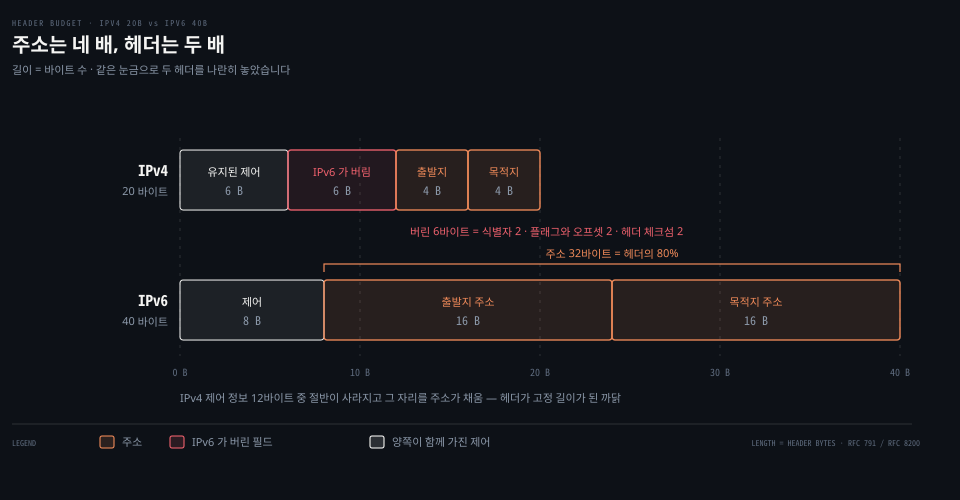
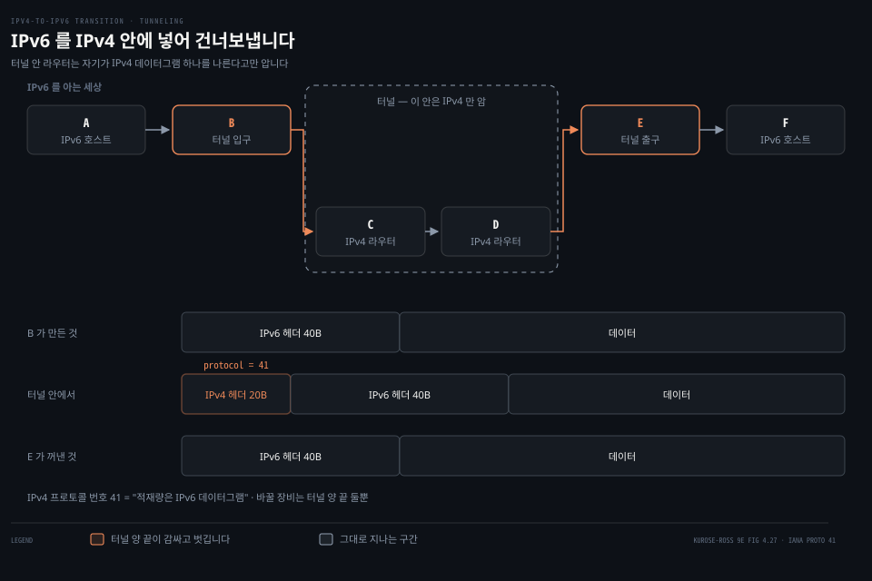
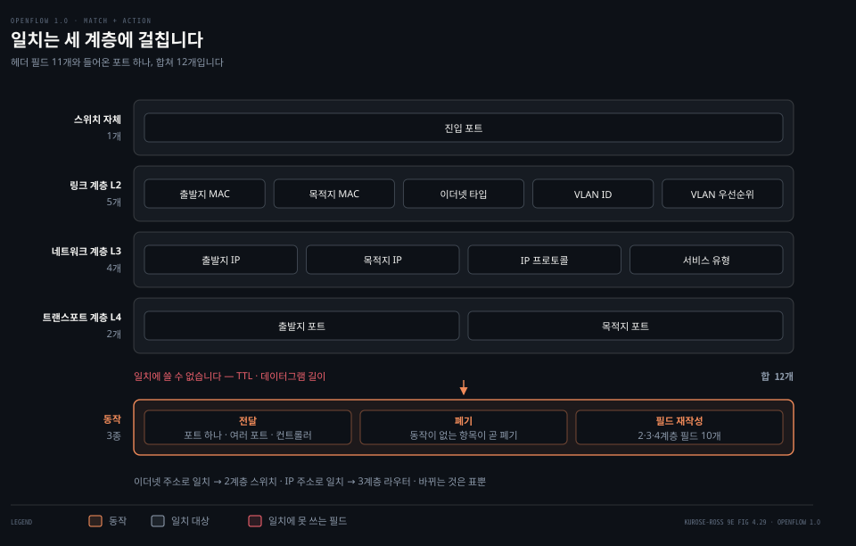
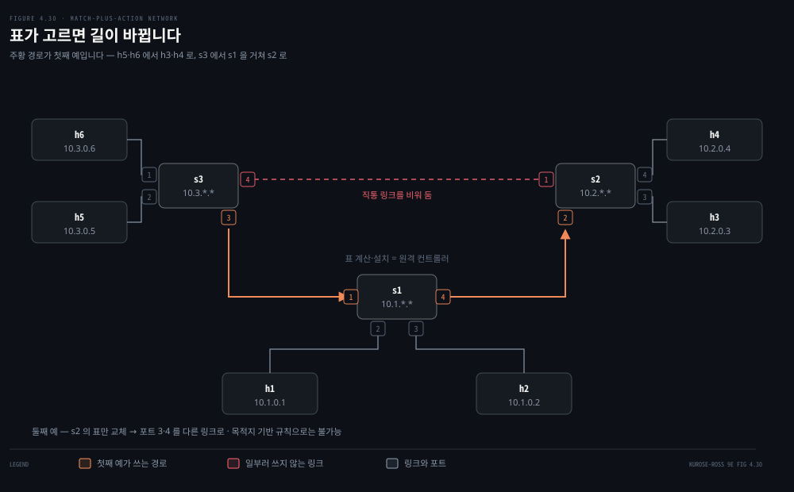
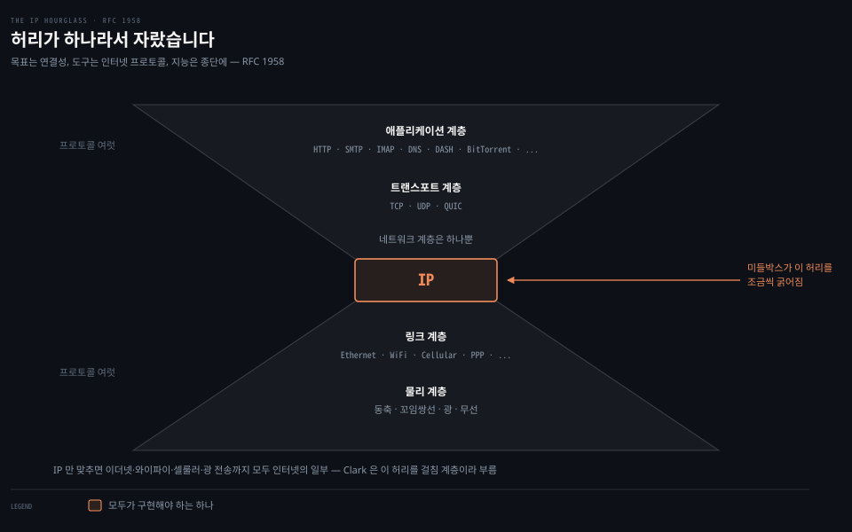

# IPv6 와 일반화 포워딩

---

> 앞의 세 편은 지금 도는 인터넷을 설명했습니다. 이 편은 그 인터넷을 바꾸려 한 두 번의 시도를 봅니다. 하나는 30년째 절반쯤 성공했고, 다른 하나는 포워딩이라는 개념 자체를 다시 썼습니다.

## 핵심 요약

> 이 편이 매달린 하나의 생각은 **네트워크 계층은 바꾸기가 지독히 어렵고, 그래서 새 프로토콜을 깔기보다 기존 상자가 하는 일을 일반화하는 쪽이 실제로 이겼다**는 것입니다.

원문이 IPv6 를 마무리하면서 남기는 문장이 이 편 전체의 결론이기도 합니다.

> 네트워크 계층에 새 프로토콜을 들이는 것은 집의 기초를 갈아 치우는 것과 같습니다. 집을 통째로 허물거나 최소한 사는 사람을 잠시 옮기지 않고는 하기 어렵습니다. 반면 애플리케이션 계층에 새 프로토콜을 들이는 것은 집에 페인트를 한 겹 더 칠하는 것과 같습니다.

같은 장 안에 두 이야기가 나란히 놓인 것이 우연이 아닙니다. IPv6 는 기초를 갈아 치우려는 시도였고 30년이 걸렸습니다. 일반화 포워딩은 기초는 그대로 두고 **라우터가 무엇을 보고 무엇을 하는지만 넓힌** 시도였고, 훨씬 빨리 퍼졌습니다.


## 학습 목표

> 이 편을 읽고 나면 아래 다섯 가지를 스스로 해낼 수 있습니다.

1. IPv6 헤더가 40바이트인 근거를 필드 폭으로 계산하고, IPv4 에서 무엇이 빠졌는지 이유와 함께 말할 수 있습니다.
2. 터널링이 무엇을 어디에 넣는 일인지 설명하고, 터널 안 라우터가 무엇을 모르는지 말할 수 있습니다.
3. 목적지 기반 포워딩과 일치·동작 포워딩의 차이를 일치 범위와 동작 종류로 갈라 설명할 수 있습니다.
4. 흐름 표 항목 하나로 포워딩·부하 분산·방화벽을 각각 어떻게 표현하는지 쓸 수 있습니다.
5. 미들박스가 무엇이고 왜 종단 간 논증과 부딪치는지 설명할 수 있습니다.


## 1. 40바이트로 다시 지은 머리

> 주소가 모자란다는 것이 출발점이었지만, 고친 것은 주소만이 아니었습니다.



1990년대 초 IETF 가 IPv4 의 후계자를 만들기 시작한 동기는 분명했습니다. 32비트 주소 공간이 바닥나고 있었기 때문입니다. 원문은 고갈 시점 논쟁을 그대로 옮깁니다. IETF 의 Address Lifetime Expectations 작업반을 이끈 두 사람은 각각 2008년과 2018년을 짚었고, 실제로는 **2011년 2월에 IANA 가 미할당 IPv4 주소의 마지막 묶음을 지역 등록기관에 넘겼습니다.**

주소를 32비트에서 128비트로 늘린 결과는 감이 잘 안 잡히는 크기입니다. 계산해 보면 이렇습니다.

```python
print(f"{2**32:.3e}")            # 4.295e+09   IPv4
print(f"{2**128:.3e}")           # 3.403e+38   IPv6
print(f"{2**128 / 7.5e18:.1e}")  # 4.5e+19     지구 모래알 어림 7.5e18 대비
```

원문이 "이제 지구의 모래알 하나하나에 IP 주소를 줄 수 있다"고 적은 것은 과장이 아닙니다. 모래알 수를 후하게 잡아도 주소가 그 4×10¹⁹ 배 남습니다.

### 실제 IPv6 헤더 한 개

[04-03](./04-03.IP%20—%20데이터그램과%20주소.md) 에서 IPv4 헤더를 잡아 뜯어봤으니 같은 일을 IPv6 로 합니다. 이 기계에서 링크 로컬 멀티캐스트로 `ping6` 를 한 번 쳤습니다.

```bash
tcpdump -i en0 -c 1 -x ip6
# 0x0000:  6004 0900 0010 3a40 fe80 0000 0000 0000
# 0x0010:  .... .... .... ....  ff02 0000 0000 0000
# 0x0020:  0000 0000 0000 0001  8000 a6ae 282e 0000
```

앞 8바이트에 모든 제어 정보가 들어 있고, 나머지 32바이트가 전부 주소입니다.

| 바이트 | 값 | 필드 | 읽는 방법 |
|--------|-----|------|-----------|
| 0 (앞 4비트) | `6` | 버전 | IPv6 는 6 입니다 |
| 0–1 | `00` | 트래픽 클래스 | IPv4 의 서비스 유형 자리 |
| 1–3 | `0 4090 0` | 흐름 레이블 | 20비트. `0x40900` 이 실려 왔습니다 |
| 4–5 | `0010` | 적재량 길이 | 16바이트. 40바이트 헤더 **뒤**의 크기입니다 |
| 6 | `3a` | 다음 헤더 | 58 = ICMPv6 |
| 7 | `40` | 홉 한도 | 64. IPv4 의 TTL 과 같은 자리, 같은 초기값 |
| 8–23 | `fe80:...` | 출발지 주소 | 링크 로컬. 뒤 64비트는 가렸습니다 |
| 24–39 | `ff02::1` | 목적지 주소 | 같은 링크의 모든 노드 |

필드 폭을 더하면 헤더 크기가 그대로 나옵니다.

```python
bits = 4 + 8 + 20 + 16 + 8 + 8 + 128 + 128
print(bits, bits // 8)   # 320 40
```

주소가 네 배로 커졌는데 헤더는 20바이트에서 40바이트, 두 배에 그쳤습니다. 나머지를 덜어 냈기 때문입니다.

### 무엇을 덜어 냈나

원문이 꼽는 것은 셋이고, 이유가 셋 다 같습니다. **라우터를 빠르게 하려고**입니다.

- **단편화와 재조립**: 중간 라우터에서는 하지 않습니다. 나가는 링크에 비해 데이터그램이 너무 크면 라우터는 그냥 버리고 `Packet Too Big` ICMP 오류를 송신자에게 돌려보냅니다. 송신자가 더 작게 다시 보냅니다. 시간이 많이 드는 일을 망 안에서 걷어 내 종단으로 옮긴 것입니다.
- **헤더 체크섬**: 없앴습니다. 트랜스포트 계층과 링크 계층이 이미 검사하므로 중복이라고 본 것입니다. IPv4 에서 체크섬을 홉마다 다시 계산해야 했던 이유가 TTL 이 바뀌기 때문이었다는 것을 [04-03](./04-03.IP%20—%20데이터그램과%20주소.md) 에서 실제 값으로 확인했는데, IPv6 는 그 비용 자체를 지웠습니다.
- **옵션**: 고정 헤더에서 뺐습니다. 사라진 것은 아니고 다음 헤더 사슬의 한 고리가 됐습니다. TCP 헤더가 다음 헤더일 수 있듯 옵션 헤더도 다음 헤더일 수 있습니다. 덕분에 기본 헤더가 **가변이 아니라 고정 40바이트**가 됩니다.

위 덤프에서 이것이 눈으로 보입니다. 홉 한도 `40` 바로 다음이 출발지 주소입니다. 체크섬이 들어갈 자리가 아예 없습니다.

> **노트의 읽기**: 원문은 흐름 레이블의 정의가 "붙잡기 어렵다"고 하며 [RFC 2460](https://www.rfc-editor.org/rfc/rfc2460.txt) 의 모호한 문장만 인용합니다. 그 뒤에 [RFC 6437](https://www.rfc-editor.org/rfc/rfc6437.txt) `IPv6 Flow Label Specification` 이 2011년에 나와 값을 어떻게 정하고 어떻게 쓰는지를 규정했습니다. 위 실측 패킷의 `0x40900` 도 그 규격에 따라 운영체제가 채운 값입니다. 그리고 IPv6 명세 자체도 2017년 [RFC 8200](https://www.rfc-editor.org/rfc/rfc8200.txt) 으로 갈렸습니다. RFC 2460 을 폐기하고 인터넷 표준 STD 86 이 된 문서입니다. 원문의 인용은 역사로는 맞지만 현재 규격을 가리키지는 않습니다.


## 2. 갈아타는 방법이 없어서 터널을 팝니다

> 문제는 IPv6 를 만드는 것이 아니라, 이미 돌고 있는 IPv4 망 위에 그것을 얹는 것이었습니다.



새 IPv6 장비는 IPv4 도 다룰 수 있게 만들 수 있습니다. 문제는 반대쪽입니다. **이미 깔려 있는 IPv4 장비는 IPv6 데이터그램을 다루지 못합니다.** 그래서 전환은 기술 문제가 아니라 배치 문제가 됩니다.

한 가지 방법은 **깃발 날**을 정하는 것입니다. 어느 날 어느 시각에 인터넷의 모든 기계를 끄고 갈아 끼우는 것입니다. 원문은 이것이 왜 불가능한지를 역사로 답합니다. 마지막 큰 전환이었던 NCP 에서 TCP 로의 갈아타기 때도 그런 날은 불가능하다고 판단됐고, 그때는 인터넷이 아주 작았습니다. [RFC 801](https://www.rfc-editor.org/rfc/rfc801.txt) 은 그 계획을 이렇게 적었습니다.

> 목표는 **1983년 1월 1일까지** NCP 에서 IP/TCP 로 완전히 갈아타는 것입니다.

기계 수십억 대가 걸린 지금은 더 생각할 수 없는 일입니다.

### 실제로 쓰이는 방법

널리 채택된 방법은 **터널링**입니다. IPv6 노드 둘이 그 사이의 IPv4 라우터들을 건너 이야기해야 할 때, 그 사이 구간 전체를 터널이라 부릅니다. 절차는 이렇습니다.

1. 보내는 쪽 IPv6 노드가 **IPv6 데이터그램 전체를 IPv4 데이터그램의 적재량 자리에 넣습니다.**
2. 그 IPv4 데이터그램의 목적지를 터널 반대편 IPv6 노드로 적고 보냅니다.
3. 터널 안의 IPv4 라우터들은 이것을 여느 IPv4 데이터그램처럼 나릅니다. 안에 무엇이 들었는지 모른 채로입니다.
4. 반대편 노드가 받아서 프로토콜 번호가 **41** 인 것을 보고 적재량이 IPv6 데이터그램임을 압니다. 꺼내서 원래대로 포워딩합니다.

터널 안 라우터가 아무것도 몰라도 된다는 점이 이 방법의 값어치입니다. 바꿔야 할 장비가 터널 양 끝 둘뿐입니다.

```bash
# IANA 프로토콜 번호 등록부에서 41 을 확인합니다
curl -s https://www.iana.org/assignments/protocol-numbers/protocol-numbers-1.csv | grep '^41,'
# 41,IPv6,IPv6 encapsulation,,[RFC2473]
```

원문은 이 번호의 근거로 [RFC 4213](https://www.rfc-editor.org/rfc/rfc4213.txt) 을 가리키는데, IANA 등록부가 적는 근거 문서는 [RFC 2473](https://www.rfc-editor.org/rfc/rfc2473.txt) 입니다. 번호 자체는 둘 다 41 로 같습니다.

### 30년이 지나 어디까지 왔나

원문이 드는 채택률은 밝습니다. 미국 정부 도메인 약 1,400개 중 메일·웹·DNS 서비스의 약 40%가 IPv6 로 설정돼 있고, 구글은 자사 서비스 접속 클라이언트의 절반 가까이가 IPv6 를 쓴다고 보고합니다. 2012년에는 1%였습니다.

이 노트를 쓰는 회선에서 재 보면 그림이 다릅니다.

```bash
ifconfig | grep -c 'inet6 [23]'                    # 0  ← 전역 IPv6 주소 없음
curl -6 -s -o /dev/null -w '%{http_code}\n' https://ipv6.google.com   # 000 (실패)
curl -4 -s -o /dev/null -w '%{http_code}\n' https://www.google.com    # 200
```

이 기계에는 링크 로컬 `fe80::` 주소만 있고 전역 IPv6 주소가 없습니다. IPv6 로는 밖에 나가지 못하고 IPv4 로는 나갑니다. 목적지 쪽도 갈립니다.

```bash
for h in www.google.com www.cloudflare.com www.naver.com github.com gaia.cs.umass.edu; do
  printf '%-22s A:%s AAAA:%s\n' "$h" \
    "$(dig +short A $h | grep -c '^[0-9]')" "$(dig +short AAAA $h | grep -c ':')"
done
```

| 호스트 | A | AAAA |
|--------|---|------|
| `www.google.com` | 8 | 8 |
| `www.cloudflare.com` | 2 | 2 |
| `www.naver.com` | 4 | 0 |
| `github.com` | 1 | 0 |
| `gaia.cs.umass.edu` | 1 | 0 |

공개 리졸버 `8.8.8.8` 과 `1.1.1.1` 로 다시 물어도 같은 결과라, 테더링 DNS 가 AAAA 를 지우는 것은 아닙니다. 구글과 Cloudflare 는 이중 스택이고 나머지 셋은 IPv4 전용입니다. 마지막 줄이 특히 눈에 띕니다. **원문이 2장부터 실습 대상으로 삼아 온 `gaia.cs.umass.edu` 자체가 IPv6 로는 닿지 않습니다.**

채택률 숫자가 틀렸다는 뜻이 아닙니다. 구글 접속의 절반이 IPv6 라는 것과 임의의 회선에서 임의의 서버에 IPv6 로 닿는다는 것은 다른 이야기라는 뜻입니다. 원문이 "네트워크 계층 프로토콜을 바꾸는 일이 지독히 어렵다"고 적은 그대로입니다.


## 3. 일치와 동작 — 포워딩을 일반화하면

> 목적지 주소 하나만 보라는 규칙을 풀면, 라우터는 라우터가 아닌 것도 될 수 있습니다.



[04-01](./04-01.라우터는%20안에서%20무엇을%20하는가.md) 에서 본 목적지 기반 포워딩은 두 걸음이었습니다. 목적지 IP 주소를 찾아보고(**일치**), 패킷을 지정된 출력 포트로 보냅니다(**동작**). 이 두 걸음의 틀은 그대로 두고 각각을 넓히면 무엇이 되는가가 이 절의 물음입니다.

- **일치**를 넓히면: 프로토콜 스택의 서로 다른 계층에 있는 여러 헤더 필드를 함께 봅니다.
- **동작**을 넓히면: 출력 포트로 보내는 것 외에 여러 인터페이스로 부하를 나누고(부하 분산), 헤더 값을 고치고(NAT), 일부러 버리고(방화벽), 특별한 서버로 넘길 수 있습니다(DPI).

이 넓힌 표를 **일치·동작 표**라 하고, OpenFlow 에서는 **흐름 표**라 부릅니다. 그리고 결정적인 차이가 하나 더 있습니다. 이 표는 각 장비가 스스로 만들지 않고 **원격 컨트롤러가 계산해 설치하고 갱신합니다.** [04-01](./04-01.라우터는%20안에서%20무엇을%20하는가.md) 에서 예고한 제어 평면 분리가 여기서 형태를 갖춥니다.

포워딩하는 장비를 이제 라우터나 스위치라 부르기 어려워집니다. 네트워크 계층 주소로도 링크 계층 주소로도 결정을 내리기 때문입니다. 원문은 여기서부터 이 장비들을 **패킷 스위치**라 부릅니다.

### 흐름 표 항목 하나에 들어 있는 것

1. **일치할 헤더 필드 값들**. 하드웨어에서는 TCAM 으로 가장 빠르게 처리하고, 목적지 주소 항목만 백만 개 넘게 담을 수 있습니다. 어느 항목에도 맞지 않는 패킷은 버리거나 컨트롤러로 올려 보냅니다.
2. **계수기들**. 그 항목에 맞은 패킷 수, 항목이 마지막으로 갱신된 뒤 흐른 시간 같은 것입니다.
3. **동작 목록**. 맞았을 때 할 일이고, 여럿이면 적힌 순서대로 수행합니다.

### 무엇을 볼 수 있나

OpenFlow 1.0 에서 일치에 쓸 수 있는 것은 **헤더 필드 11개와 들어온 포트 번호, 합쳐 12개**입니다. 여기서 원문이 짚는 요점이 나옵니다.

> OpenFlow 의 일치 추상은 **세 계층의 프로토콜 헤더**에서 고른 필드에 대해 일치를 걸 수 있게 합니다. 1.5절에서 공부한 계층화 원칙을 꽤나 대담하게 거스르면서 말입니다.

이더넷 주소로 포워딩하면 2계층 스위치처럼 굴고, IP 주소로 포워딩하면 3계층 라우터처럼 굽니다. 같은 장비가 표만 바꿔 둘 다 됩니다.

항목에는 **와일드카드**를 쓸 수 있습니다. `128.119.*.*` 는 앞 16비트가 `128.119` 인 모든 주소에 맞습니다. 항목마다 **우선순위**가 있어, 여러 항목에 동시에 맞으면 우선순위가 가장 높은 것이 이깁니다.

볼 수 없는 것도 있습니다. **TTL 과 데이터그램 길이는 일치에 쓸 수 없습니다.** 왜 어떤 필드는 되고 어떤 필드는 안 되는가에 대해 원문은 기능과 복잡도의 맞바꿈이라 답하고, Butler Lampson 의 문장을 인용합니다.

> 한 번에 한 가지만 하고, 그것을 잘하십시오. 인터페이스는 추상의 최소 본질을 담아야 합니다. 일반화하지 마십시오. 일반화는 대체로 틀립니다.

동작 쪽에서 가장 중요한 셋은 이렇습니다.

- **전달**: 지정한 물리 출력 포트로, 또는 들어온 포트를 뺀 모든 포트로, 또는 고른 포트 집합으로 보냅니다. 컨트롤러로 캡슐화해 올려 보낼 수도 있습니다.
- **폐기**: 동작이 하나도 없는 항목은 "버리라"는 뜻입니다.
- **필드 재작성**: 헤더 필드 10개의 값을 고쳐서 내보낼 수 있습니다. Figure 4.29 의 2·3·4계층 필드 중 IP 프로토콜 필드만 빼고 전부입니다.

> **원문 정오**: 원문은 P4 를 소개하며 **"5년 전 도입된 이래"** 라고 적습니다. 원문이 스스로 다는 인용이 [Bosshart 2014] 이고 P4 논문은 2014년 ACM SIGCOMM CCR 에 실렸으므로, 2025년판 기준으로는 11년 전입니다. 같은 성격의 문장이 앞에도 있습니다. NCP 에서 TCP 로의 전환을 **"거의 40년 전"** 이라 적는데, [RFC 801](https://www.rfc-editor.org/rfc/rfc801.txt) 이 목표로 삼은 날은 1983년 1월 1일이라 40년이 넘습니다. 앞 판에서 그대로 옮겨 온 상대 시점 표현으로 보입니다. 절대 연도로 바꿔 읽는 편이 안전합니다.


## 4. 흐름 표 세 장으로 무엇을 만드나

> 물리 망은 그대로 두고 표만 바꾸면 망의 성격이 바뀝니다.



표 하나로 어디까지 되는지는 예를 나란히 놓아야 보입니다. 아래 셋은 배선을 한 줄도 건드리지 않고 표만 바꿔 만든 서로 다른 망입니다.

원문 Figure 4.30 의 예제 망에는 호스트가 여섯, 패킷 스위치가 셋 있습니다. 스위치마다 지역 인터페이스가 넷씩이고 번호는 1부터 4까지입니다. 이 위에서 원문은 세 가지 동작을 차례로 만듭니다.

### 첫째, 단순 포워딩

h5 나 h6 에서 h3 이나 h4 로 가는 패킷을 s3 → s1 → s2 로 보내려 합니다. s3 과 s2 를 잇는 직통 링크를 일부러 피하는 것입니다.

```properties
s3 흐름 표   Match: IP Src = 10.3.*.* ; IP Dst = 10.2.*.*        → Forward(3)
s1 흐름 표   Match: Ingress Port = 1 ; IP Src = 10.3.*.* ;
                    IP Dst = 10.2.*.*                            → Forward(4)
s2 흐름 표   Match: Ingress port = 2 ; IP Dst = 10.2.0.3         → Forward(3)
             Match: Ingress port = 2 ; IP Dst = 10.2.0.4         → Forward(4)
```

세 스위치에 각각 항목을 넣어야 경로가 완성된다는 점이 중요합니다. 경로는 어느 한 장비의 성질이 아니라 **여러 표의 합**입니다.

### 둘째, 부하 분산

h3 에서 `10.1.*.*` 로 가는 것은 s2 와 s1 의 직통 링크로 보내고, h4 에서 같은 목적지로 가는 것은 s2 → s3 → s1 로 돌립니다.

```properties
s2 흐름 표   Match: Ingress port = 3 ; IP Dst = 10.1.*.*   → Forward(2)
             Match: Ingress port = 4 ; IP Dst = 10.1.*.*   → Forward(1)
```

원문이 여기에 한 줄을 덧붙입니다. **이 동작은 IP 의 목적지 기반 포워딩으로는 만들 수 없습니다.** 두 항목의 목적지가 같기 때문입니다. 갈라 주는 것은 들어온 포트, 곧 목적지가 아닌 정보입니다. 일치를 넓힌 값어치가 한 줄로 드러나는 자리입니다.

### 셋째, 방화벽

s2 가 s3 에 붙은 호스트에서 온 트래픽만 받고 싶다고 합시다.

```properties
s2 흐름 표   Match: IP Src = 10.3.*.* ; IP Dst = 10.2.0.3   → Forward(3)
             Match: IP Src = 10.3.*.* ; IP Dst = 10.2.0.4   → Forward(4)
```

s2 의 흐름 표에 다른 항목이 없으면 `10.3.*.*` 에서 온 것만 전달됩니다. **방화벽을 별도 장비로 사는 대신 표 두 줄로 만든 것입니다.** 여기서 "동작이 없으면 폐기"라는 규칙이 일합니다. 맞는 항목이 없는 패킷은 그냥 버려집니다.

흐름 표는 결국 **API** 입니다. 개별 패킷 스위치의 행동을 프로그램하는 창구이고, 여러 스위치의 표를 함께 채우면 망 전체의 행동을 프로그램하게 됩니다. 원문은 이 프로그래밍 가능성을 더 밀고 나간 것이 P4 라고 소개합니다. 변수와 산술과 조건문을 갖춘, 회선 속도로 도는 데이터그램 처리 전용 언어입니다.


## 5. 미들박스와 잘록한 허리

> 데이터 경로 위에 앉아 포워딩 말고 다른 일을 하는 상자들이 계속 늘고 있습니다.



라우터가 포워딩만 한다는 전제는 이 책 안에서 이미 여러 번 깨졌습니다. 데이터 경로 위에서 포워딩이 아닌 일을 하는 상자를 우리는 계속 만나 왔습니다. 2장의 웹 캐시, 3장의 TCP 연결 분리기, [04-03](./04-03.IP%20—%20데이터그램과%20주소.md) 의 NAT 와 방화벽과 침입 탐지 시스템입니다. 이런 것을 통틀어 **미들박스**라 하고, [RFC 3234](https://www.rfc-editor.org/rfc/rfc3234.txt) 의 정의를 원문이 그대로 옮깁니다.

> 출발지 호스트와 목적지 호스트 사이의 데이터 경로에서, IP 라우터의 정상적이고 표준적인 기능이 아닌 기능을 수행하는 모든 중간 상자.

하는 일은 크게 셋으로 나뉩니다.

- **NAT 변환**: 사설 주소를 구현하고 헤더의 주소와 포트를 다시 씁니다.
- **보안 서비스**: 방화벽이 헤더 값으로 막거나 심층 패킷 검사로 넘기고, 침입 탐지 시스템이 정해진 패턴을 걸러 내고, 메일 필터가 정크와 피싱을 막습니다.
- **성능 향상**: 압축, 콘텐츠 캐싱, 서비스 요청의 부하 분산입니다.

미들박스가 늘면 운영·관리·교체 부담도 함께 늡니다. 전용 하드웨어와 별도 소프트웨어 스택과 별도 운영 기술이 각각 비용이 됩니다. 그래서 나온 방향이 **NFV**(network function virtualization)입니다. 범용 하드웨어 위에 공통 소프트웨어 스택을 얹고 그 위에 특화 소프트웨어로 이 기능들을 구현하자는 것이고, 원문의 표현대로 **10년 전 SDN 이 택한 접근을 미들박스에 그대로 적용한 것**입니다.

### 잘록한 허리

인터넷 아키텍처의 원칙을 묻는 자리에서 원문은 [RFC 1958](https://www.rfc-editor.org/rfc/rfc1958.txt) 을 인용합니다. 그 문서는 원칙이랄 것이 거의 없다고 먼저 말합니다.

> 인터넷 공동체의 많은 이들은 아키텍처란 없고 전통만 있다고 주장할 것입니다. 처음 25년 동안은 적어도 IAB 이 그것을 글로 적지 않았습니다. 그러나 아주 일반적인 말로는, **목표는 연결성이고, 도구는 인터넷 프로토콜이며, 지능은 망 안에 숨는 대신 종단에 있다**고 공동체는 믿습니다.

여기서 두 번째 조각이 **IP 모래시계**입니다. 물리·링크·트랜스포트·애플리케이션 계층에는 프로토콜이 많은데 네트워크 계층에는 **IP 하나뿐**입니다. 인터넷에 붙는 수십억 대의 기기가 예외 없이 구현해야 하는 프로토콜이 그 하나입니다.

허리가 잘록한 것이 인터넷을 자라게 했습니다. IP 가 단순하고 그것만 맞추면 되니, 이더넷부터 와이파이·셀룰러·광 전송까지 성질이 전혀 다른 망들이 모두 인터넷의 일부가 될 수 있었습니다. Clark 은 이 허리를 **걸침 계층**이라 부르고 그 역할을 이렇게 적습니다.

> 이 여러 [하부] 기술 사이의 세세한 차이를 감추고, 위의 애플리케이션에 균일한 서비스 인터페이스를 제시하는 것입니다.

그리고 원문이 덧붙이는 관찰이 이 절의 묘미입니다. 인터넷도 마흔에서 쉰 살이 되어 중년에 들어섰고, **중년이 흔히 그렇듯 잘록하던 허리가 미들박스 때문에 조금씩 굵어지고 있다**는 것입니다.

### 종단 간 논증

RFC 1958 의 세 번째 조각인 "지능은 종단에" 는 기능을 어디에 둘 것인가의 문제입니다. 20세기 전화망은 단말이 멍청하고 교환기가 똑똑했습니다. 인터넷은 처음부터 단말이 똑똑했습니다. 프로그램할 수 있는 컴퓨터였기 때문입니다.

원리로서의 근거는 Saltzer 등의 1984년 논문이 세웠습니다.

> 문제의 그 기능은 통신 시스템의 종단에 서 있는 애플리케이션의 지식과 도움이 있어야만 완전하고 올바르게 구현될 수 있습니다. 따라서 그 기능을 통신 시스템 자체의 기능으로 제공하는 것은 가능하지 않습니다. (때로 통신 시스템이 제공하는 불완전한 판본이 성능 향상으로는 쓸모 있을 수 있습니다.)

신뢰성 있는 데이터 전송이 그 예입니다. 버퍼가 넘치지 않아도 패킷은 망 안에서 사라질 수 있습니다.

- 큐에 든 패킷을 쥔 라우터가 죽을 수 있습니다.
- 링크 장애로 그 구간이 통째로 떨어져 나갈 수 있습니다.

그러니 오류 제어는 종단이 해야 합니다. 6장에서 볼 일부 링크 계층 프로토콜이 지역 오류 제어를 하기는 하지만, **그것만으로는 불완전합니다.** [03-02](./03-02.신뢰성은%20어떻게%20만들어지는가.md) 가 TCP 로 신뢰성을 다시 만든 이유가 이것입니다.

괄호 안의 단서가 오래 읽힙니다. "불완전한 판본이 성능 향상으로는 쓸모 있을 수 있다"는 것입니다. 링크 계층 재전송도, 웹 캐시도, TCP 연결 분리기도 그 단서 안에 삽니다. 미들박스 논쟁은 이 단서가 얼마나 넓은가에 대한 논쟁이기도 합니다. 한쪽은 미들박스를 아키텍처의 흉물로 보고, 다른 쪽은 **중요하고 영구적인 이유가 있어 존재하는 것**이며 앞으로 줄기는커녕 늘 것이라고 봅니다.


## 4장 치트시트

| 물음 | 답 |
|------|-----|
| IPv6 헤더 크기 | 고정 40바이트. 그중 32바이트가 주소 |
| IPv6 가 버린 것 | 단편화, 헤더 체크섬, 고정 헤더 안의 옵션 |
| 단편화를 어디서 하나 | 출발지와 목적지만. 라우터는 버리고 `Packet Too Big` 을 돌려보냄 |
| IPv4 의 TTL 에 해당하는 것 | 홉 한도. 같은 자리, 같은 감소 규칙 |
| 터널링이 넣는 곳 | IPv4 데이터그램의 적재량 자리 |
| 터널을 알아보는 표시 | IPv4 프로토콜 번호 41 |
| OpenFlow 1.0 일치 대상 | 헤더 11개 + 들어온 포트 = 12개 |
| 일치에 못 쓰는 것 | TTL, 데이터그램 길이 |
| 동작 셋 | 전달, 폐기, 필드 재작성 |
| 동작이 없는 항목의 뜻 | 폐기 |
| 목적지 기반으로 못 만드는 예 | 같은 목적지를 들어온 포트로 갈라 보내는 부하 분산 |
| 미들박스 정의 | 데이터 경로에서 IP 라우터의 표준 기능이 아닌 일을 하는 중간 상자 |
| 모래시계의 허리 | 네트워크 계층 프로토콜이 IP 하나뿐이라는 사실 |


## 심화 학습

> 자기 회선의 IPv6 상태는 세 줄이면 판정됩니다.

```bash
# 1) 전역 IPv6 주소가 있는가 (fe80:: 은 링크 로컬이라 세지 않습니다)
ifconfig | grep 'inet6 [23]'

# 2) IPv6 로 밖에 나가지는가
curl -6 -s -o /dev/null -w 'v6 %{http_code}\n' https://ipv6.google.com
curl -4 -s -o /dev/null -w 'v4 %{http_code}\n' https://www.google.com

# 3) 목적지 쪽은 준비돼 있는가
dig +short AAAA github.com @1.1.1.1

# 4) IPv6 헤더를 직접 잡아 봅니다 (링크 로컬 멀티캐스트면 충분합니다)
tcpdump -i en0 -c 1 -x ip6 &
ping6 -c 3 ff02::1%en0
```

첫 줄이 비어 있으면 그 회선에는 IPv6 가 없습니다. 세 번째 줄이 비어 있으면 그 서버가 준비되지 않은 것입니다. 두 조건이 **동시에** 갖춰져야 IPv6 로 통신하므로, 어느 한쪽 채택률만으로는 실제 도달 가능성을 알 수 없습니다.


## 면접 대비

> 이 편에서 실제로 묻는 자리는 IPv6 가 무엇을 버렸는가, 터널링의 원리, 그리고 일치·동작의 일반화입니다.

### 한 줄 정의

- **터널링**: 한 프로토콜의 데이터그램을 다른 프로토콜 데이터그램의 적재량 자리에 통째로 넣어 나르는 것입니다.
- **일치·동작 표**: 여러 계층의 헤더 필드로 일치를 걸고 전달·폐기·재작성 중 하나를 수행하는 표입니다.
- **미들박스**: 데이터 경로 위에서 IP 라우터의 표준 기능이 아닌 일을 하는 중간 상자입니다.
- **잘록한 허리**: 네트워크 계층 프로토콜이 IP 하나뿐이라는 구조적 사실입니다.

### 핵심 포인트 세 가지

1. IPv6 는 주소를 네 배로 키우면서 **단편화와 체크섬을 걷어 내** 헤더를 두 배에서 멈추고 고정 길이로 만들었습니다.
2. 전환의 어려움은 기술이 아니라 배치에 있습니다. 그래서 **깃발 날이 아니라 터널링**이 답이 됐습니다.
3. 일치를 여러 계층으로 넓히면 같은 장비가 라우터도 스위치도 방화벽도 부하 분산기도 됩니다. **표가 곧 API 입니다.**

### 자주 묻는 질문

**"IPv6 는 왜 헤더 체크섬을 없앴습니까?"** 트랜스포트와 링크 계층이 이미 검사해 중복이고, IPv4 에서는 TTL 이 바뀔 때마다 홉마다 다시 계산해야 하는 비싼 연산이었기 때문입니다. 그 비용을 지운 것입니다.

**"IPv6 라우터는 왜 단편화를 하지 않습니까?"** 시간이 많이 드는 일이라 망 안에서 걷어 냈습니다. 너무 크면 버리고 `Packet Too Big` 을 송신자에게 돌려보내, 종단이 작게 다시 보내게 합니다.

**"터널 안의 라우터는 무엇을 압니까?"** 자기가 IPv4 데이터그램 하나를 나른다는 것만 압니다. 적재량이 IPv6 데이터그램이라는 사실을 알 필요가 없고, 그래서 그 라우터들을 바꾸지 않아도 됩니다.

**"목적지 기반 포워딩으로는 못 하는 일의 예를 들어 보십시오."** 같은 목적지로 가는 트래픽을 들어온 포트에 따라 다른 링크로 갈라 보내는 부하 분산입니다. 목적지가 같으므로 목적지만 보는 규칙으로는 갈라지지 않습니다.

**"SDN 이 이 장과 어떻게 이어집니까?"** 흐름 표를 각 장비가 아니라 원격 컨트롤러가 계산해 설치하는 구조가 곧 SDN 의 데이터 평면 쪽 그림입니다. 컨트롤러 자체와 통신 프로토콜은 5장이 다룹니다.


## 핵심 개념 체크리스트

> 아래를 보지 않고 말할 수 있으면 4장은 통과입니다.

- [ ] IPv6 헤더 40바이트를 필드 폭의 합으로 계산할 수 있습니다.
- [ ] IPv6 헤더 덤프에서 버전·적재량 길이·다음 헤더·홉 한도를 짚을 수 있습니다.
- [ ] IPv4 에서 빠진 세 가지와 각각의 이유를 말할 수 있습니다.
- [ ] 다음 헤더 필드가 IPv4 의 어느 필드에 해당하는지 압니다.
- [ ] 애니캐스트 주소가 무엇인지 설명할 수 있습니다.
- [ ] 깃발 날이 왜 불가능한지 역사를 들어 설명할 수 있습니다.
- [ ] 터널링의 네 단계를 순서대로 말할 수 있습니다.
- [ ] 프로토콜 번호 41 의 뜻을 압니다.
- [ ] 자기 회선의 IPv6 사용 여부를 명령으로 판정할 수 있습니다.
- [ ] 목적지 기반 포워딩과 일치·동작 포워딩의 차이를 말할 수 있습니다.
- [ ] 흐름 표 항목의 세 부분을 댈 수 있습니다.
- [ ] OpenFlow 1.0 이 일치에 쓰는 값의 개수와 계층 범위를 압니다.
- [ ] 일치에 쓸 수 없는 필드 둘을 댈 수 있습니다.
- [ ] 흐름 표로 방화벽을 만드는 방법을 설명할 수 있습니다.
- [ ] 미들박스의 정의와 세 가지 부류를 말할 수 있습니다.
- [ ] NFV 가 무엇을 흉내 낸 접근인지 설명할 수 있습니다.
- [ ] 모래시계의 허리가 왜 인터넷을 자라게 했는지 말할 수 있습니다.
- [ ] 종단 간 논증을 신뢰성 있는 전송의 예로 설명할 수 있습니다.


## 관련 문서

- [04-03 IP — 데이터그램과 주소](./04-03.IP%20—%20데이터그램과%20주소.md) — 이 편의 앞. IPv4 헤더와 그 체크섬, NAT
- [04-01 라우터는 안에서 무엇을 하는가](./04-01.라우터는%20안에서%20무엇을%20하는가.md) — 목적지 기반 포워딩의 두 걸음. §3 이 그 틀을 넓힙니다
- [04-02 줄은 어디에 서고 누가 먼저 나가는가](./04-02.줄은%20어디에%20서고%20누가%20먼저%20나가는가.md) — 큐와 규율. 종단 간 논증이 왜 필요한지의 물리적 근거
- [03-02 신뢰성은 어떻게 만들어지는가](./03-02.신뢰성은%20어떻게%20만들어지는가.md) — 종단 간 논증이 실제로 구현된 자리
- [README](./README.md) — 이 책의 지도


## 참고 자료

- 《Computer Networking A Top-Down Approach》 9판 (Kurose·Ross, Pearson) §4.3.4~4.5
- [RFC 801 — NCP/TCP Transition Plan](https://www.rfc-editor.org/rfc/rfc801.txt)
- [RFC 1958 — Architectural Principles of the Internet](https://www.rfc-editor.org/rfc/rfc1958.txt)
- [RFC 2473 — Generic Packet Tunneling in IPv6](https://www.rfc-editor.org/rfc/rfc2473.txt)
- [RFC 3234 — Middleboxes: Taxonomy and Issues](https://www.rfc-editor.org/rfc/rfc3234.txt)
- [RFC 4213 — Basic Transition Mechanisms for IPv6 Hosts and Routers](https://www.rfc-editor.org/rfc/rfc4213.txt)
- [RFC 4291 — IP Version 6 Addressing Architecture](https://www.rfc-editor.org/rfc/rfc4291.txt)
- [RFC 6437 — IPv6 Flow Label Specification](https://www.rfc-editor.org/rfc/rfc6437.txt)
- [RFC 8200 — Internet Protocol, Version 6 (IPv6) Specification](https://www.rfc-editor.org/rfc/rfc8200.txt)
- [IANA Protocol Numbers](https://www.iana.org/assignments/protocol-numbers/protocol-numbers.xhtml)
- Saltzer, Reed, Clark, "End-to-End Arguments in System Design", ACM TOCS 2(4), 1984
- Bosshart et al., "P4: Programming Protocol-Independent Packet Processors", ACM SIGCOMM CCR 44(3), 2014
