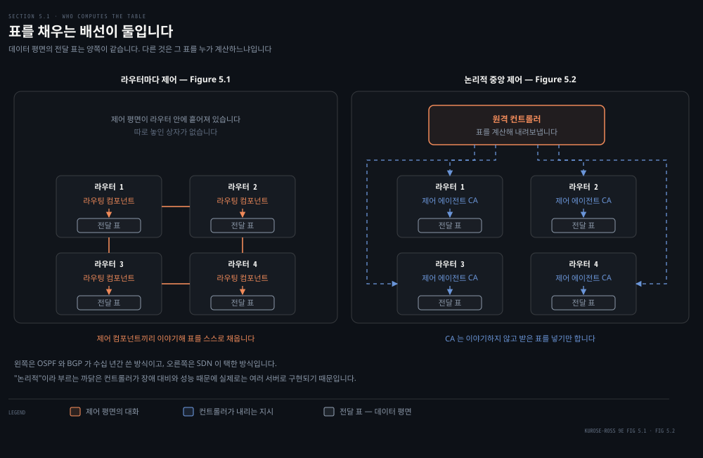
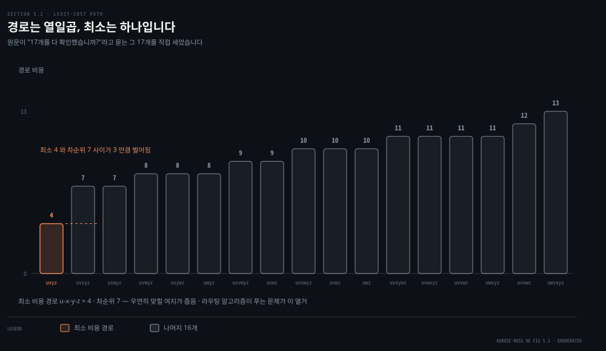
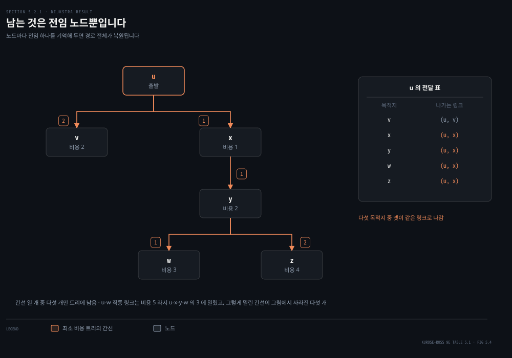
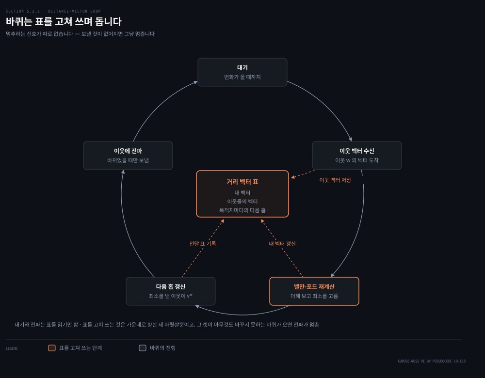
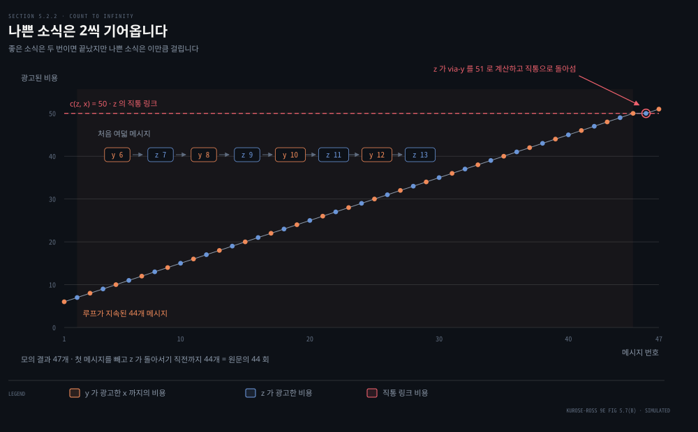

# 길은 어떻게 계산되는가

---

> 4장은 라우터가 표를 보고 나른다는 이야기였습니다. 이 편은 그 표에 값이 어떻게 들어가는지를 봅니다. 답이 두 갈래이고, 그 두 갈래가 인터넷의 라우팅 프로토콜 전부를 나눕니다.

## 핵심 요약

> 이 편이 매달린 하나의 생각은 **최소 비용 경로를 찾는 방법은 전부 아는 쪽과 이웃만 아는 쪽 둘뿐이고, 둘 다 정답을 내지만 틀렸을 때 무너지는 방식이 다르다**는 것입니다.

같은 그래프에 두 알고리즘을 돌려 보면 답은 글자 하나까지 같습니다. 직접 확인했습니다.

```python
DV 가 u 에서 낸 값 : {'v': 2, 'w': 3, 'x': 1, 'y': 2, 'z': 4}
LS 가 u 에서 낸 값 : {'v': 2, 'w': 3, 'x': 1, 'y': 2, 'z': 4}
두 답이 같은가 : True
```

그런데 링크 하나가 끊어졌을 때 링크 상태는 지도를 다시 뿌리고 각자 다시 풀지만, 거리 벡터는 이웃의 말을 믿었다가 44번을 헛돌고서야 진실에 닿습니다. 알고리즘을 고르는 일은 정답을 고르는 일이 아니라 **틀리는 방식을 고르는 일**입니다.


## 학습 목표

> 이 편을 읽고 나면 아래 다섯 가지를 스스로 해낼 수 있습니다.

1. 라우터마다 제어와 논리적 중앙 제어가 무엇으로 갈리는지 설명하고, OSPF·BGP·SDN 을 그 두 갈래에 배치할 수 있습니다.
2. 망을 그래프로 옮겼을 때 최소 비용 경로 문제가 왜 열거 문제가 되는지 말하고, 경로 수가 노드 수에 어떻게 반응하는지 감을 잡습니다.
3. 다익스트라를 손으로 돌려 표를 채우고, 결과에서 전달 표를 만들어 낼 수 있습니다.
4. 벨만-포드 식이 왜 전달 표의 다음 홉을 그대로 준다고 말할 수 있는지 설명합니다.
5. count-to-infinity 가 생기는 조건을 말하고, 독 뿌린 역경로가 무엇을 막고 무엇을 못 막는지 구분합니다.


## 1. 표를 누가 채우는가

> 4장은 라우터가 표대로 나른다는 이야기로 끝났습니다. 그런데 그 표에 값이 어떻게 들어갔는지는 한 번도 말하지 않았습니다.



원문은 답을 두 가지로 나눕니다. 이 구분이 5장 전체의 뼈대입니다.

- **라우터마다 제어**: 라우팅 알고리즘이 모든 라우터 안에서 각각 돕니다. 라우터마다 라우팅 컴포넌트가 있고, 그 컴포넌트들이 서로 이야기해 자기 전달 표를 계산합니다.
- **논리적 중앙 제어**: 논리적으로 중앙에 있는 컨트롤러가 표를 계산해 각 라우터에 내려보냅니다. 라우터 안에는 제어 에이전트(CA)가 있는데, 하는 일은 컨트롤러와 이야기하고 시키는 대로 하는 것뿐입니다.

두 방식을 가르는 지점은 컨트롤러의 존재가 아닙니다. **CA 끼리는 서로 이야기하지 않고 전달 표 계산에 끼어들지도 않는다**는 점입니다. 원문이 이것을 핵심 구분(key distinction)이라 못 박습니다. 라우터마다 제어에서는 라우터가 스스로 판단하는 주체이고, 논리적 중앙 제어에서는 라우터가 실행 장치입니다.

"논리적"이라는 수식어가 붙는 까닭도 짚고 갑니다. 컨트롤러는 하나의 접점처럼 접근되지만 실제 구현은 장애 대비와 성능 확장을 위해 여러 서버로 나뉩니다. 하나의 상자를 뜻하는 말이 아니라 하나처럼 보이는 서비스를 뜻하는 말입니다.

원문이 인용한 2020년 조사에서 SDN 은 데이터센터 64퍼센트, WAN 58퍼센트, 액세스망 40퍼센트로 자리를 잡았습니다. 구글이 자기 데이터센터와 그 사이를 잇는 전 세계 WAN 을 ORION 이라는 SDN 으로 제어한다는 사례도 함께 듭니다. 두 갈래 중 어느 쪽이 이겼다고 말하기보다, **경계가 어디에 그어졌는지**를 기억하는 편이 낫습니다. AS 내부와 AS 사이는 여전히 OSPF 와 BGP 이고, 한 사업자가 통째로 소유한 망 안쪽은 점점 중앙 제어입니다.


## 2. 열일곱 개 중 하나를 고르는 문제

> u 에서 z 로 가는 길을 눈으로 훑어 하나 고른다면, 그게 가장 싼 길일 가능성은 얼마나 될까요.



원문은 이 질문을 독자에게 직접 던집니다. Figure 5.3 을 보고 u 에서 z 까지 경로를 몇 개 그려 본 뒤 "가장 싸 보이는" 것을 고르게 하고는, 괄호 안에 이렇게 씁니다. *u 와 z 사이의 가능한 경로 17개를 다 확인하셨습니까? 아마 아닐 겁니다.*

그 17개를 세어 봤습니다. Figure 5.3 의 간선 열 개를 코드로 옮기고 단순 경로를 전수 열거하면 정확히 17개가 나옵니다. 비용 분포는 4 가 하나, 7 이 둘, 8 이 셋, 9 가 둘, 10 이 셋, 11 이 넷, 12 가 하나, 13 이 하나입니다. **최소는 `u-x-y-z` 의 4 하나뿐이고 두 번째로 싼 경로가 7 이라, 눈대중이 정답을 맞힐 자리가 좁습니다.**

여기서 원문이 쓰는 어휘를 정리합니다.

- **그래프**: `G = (N, E)` 로, 노드 집합 N 과 간선 모음 E 입니다. 노드는 라우터이고 간선은 라우터 사이의 물리 링크입니다.
- **간선 비용**: `c(x, y)` 로 적고, 링크의 물리적 길이나 속도나 금전 비용을 반영합니다. `(x, y)` 가 E 에 없으면 무한대로 둡니다.
- **경로 비용**: 경로 위 간선 비용의 합입니다.
- **최소 비용 경로**: 두 노드 사이 여러 경로 중 비용의 합이 가장 작은 것입니다. 모든 간선 비용이 같으면 최소 비용 경로가 곧 최단 경로가 됩니다.

논의는 무방향 그래프로 한정합니다. `c(x, y)` 와 `c(y, x)` 가 같다고 보되, 방향마다 비용이 다른 경우로 넓히는 것은 어렵지 않다고 원문은 덧붙입니다. BGP 를 다룰 때는 노드가 라우터가 아니라 네트워크가 되고, 간선은 두 망 사이의 직접 연결인 피어링이 됩니다. 같은 그래프 언어를 층을 바꿔 다시 쓰는 셈입니다.

> **원문 정오**: 이 대목을 원문은 *"the edge connecting two such nodes represents **direction** connectivity (**know** as peering)"* 라 적습니다(332쪽). 두 단어가 어긋났습니다. 간선이 나타내는 것은 방향이 아니라 **직접 연결**(direct connectivity)이고, 뒤따르는 말도 `known as` 여야 합니다. 바로 앞에서 논의를 무방향 그래프로 한정해 둔 참이라, `direction` 을 곧이곧대로 읽으면 BGP 그래프만 방향을 갖는다는 오해가 생깁니다.

원문은 라우팅 알고리즘을 세 축으로 가릅니다.

- **중앙 대 분산**: 망 전체의 연결과 비용을 전부 알고 푸는 쪽이 중앙이고, 이것을 링크 상태(LS) 알고리즘이라 부릅니다. 자기에게 붙은 링크의 비용만 알고 시작해 이웃과 주고받으며 좁혀 가는 쪽이 분산이고, 이것을 거리 벡터(DV) 알고리즘이라 부릅니다.
- **정적 대 동적**: 사람이 손으로 고쳐야 바뀌는 쪽이 정적이고, 부하나 위상 변화에 따라 스스로 바뀌는 쪽이 동적입니다. 동적인 쪽은 반응이 빠른 대신 라우팅 루프와 경로 진동에 취약합니다.
- **부하 민감 대 부하 비민감**: 링크 비용이 지금의 혼잡을 반영하면 부하 민감입니다. 초기 ARPAnet 이 그랬는데 여러 문제를 만났고, **오늘날의 RIP·OSPF·BGP 는 전부 부하 비민감**입니다. 링크 비용이 그 링크의 현재 혼잡을 담지 않습니다.

세 번째 축은 뒤에서 다시 나옵니다. 부하를 비용에 넣으면 무슨 일이 벌어지는지가 3절 끝에 있습니다.


## 3. 전부 알고 한 번에 풉니다

> 모두가 같은 지도를 갖고 있다면 길 찾기는 각자 알아서 풀면 되는 문제가 됩니다. 문제는 그 지도를 어떻게 나눠 갖느냐입니다.



지도를 나눠 갖는 방법은 브로드캐스트입니다. 각 노드가 자기에게 붙은 링크의 정체와 비용을 담은 링크 상태 패킷을 망 전체에 뿌립니다. 뿌리기가 끝나면 모든 노드가 **똑같고 완전한** 망 그림을 갖게 되고, 그 다음은 각자 계산입니다. 같은 입력에 같은 알고리즘이므로 모두가 같은 결과를 얻습니다.

계산에 쓰는 것이 다익스트라 알고리즘입니다. 표기는 셋입니다.

- **`D(v)`**: 이번 회차 기준으로 출발지에서 v 까지의 최소 비용입니다.
- **`p(v)`**: 지금 알고 있는 최소 비용 경로에서 v 의 바로 앞 노드입니다.
- **`N'`**: 최소 비용 경로가 확정된 노드의 집합입니다.

의사코드는 초기화 한 번과 반복 하나입니다. 반복은 노드 수만큼 돕니다.

```python
초기화:
  N' = {u}
  모든 노드 v 에 대해
    v 가 u 의 이웃이면 D(v) = c(u, v)
    아니면            D(v) = 무한대

반복:
  N' 밖에서 D(w) 가 가장 작은 w 를 찾는다
  w 를 N' 에 넣는다
  N' 밖에 있는 w 의 이웃 v 마다
    D(v) = min(D(v), D(w) + c(w, v))
N' 이 N 과 같아질 때까지
```

Figure 5.3 에 이것을 돌리면 회차마다 값이 이렇게 움직입니다.

- **초기화**: u 의 이웃인 v, x, w 가 각각 2, 1, 5 로 잡힙니다. y 와 z 는 무한대입니다.
- **`w` 의 초깃값 5**: 곧 더 싼 길이 나올 텐데도 지금은 직통 링크 비용을 그대로 씁니다. 알고리즘이 아직 모르기 때문입니다.
- **1회차**: 비용 1 의 `x` 가 확정됩니다. 그 순간 `w` 가 x 를 거쳐 4 로 내려가고 `y` 는 2 가 됩니다.
- **2회차**: v 와 y 가 나란히 2 입니다. 동점은 임의로 깨는데 원문은 y 를 택합니다. 그러면 `w` 가 3, `z` 가 4 가 됩니다.
- **3회차 이후**: 값이 더 내려가지 않습니다. 남은 노드가 차례로 확정될 뿐입니다.

끝나고 남는 것은 노드마다의 전임 하나뿐입니다. 전임의 전임을 따라가면 경로 전체가 복원되고, 각 목적지의 **첫 홉**을 뽑으면 그게 곧 전달 표입니다. u 의 전달 표에서 다섯 목적지 중 넷이 `(u, x)` 로 나가는 것도 여기서 나옵니다.

복잡도는 원문이 이렇게 셉니다. 출발지를 뺀 노드가 n 개일 때 첫 회차에 n 개를 훑고, 다음에 n−1 개, 그다음 n−2 개를 훑으므로 전체가 `n(n+1)/2` 이고 따라서 `O(n²)` 입니다. 의사코드 그대로(힙이 아니라 선형 훑기로) 구현해 훑은 횟수를 세어 봤습니다.

```python
  노드 수 n+1       실제 훑은 횟수   n(n+1)/2
           6             15         15
          10             45         45
          20            190        190
          50           1225       1225
         100           4950       4950
```

한 자리도 어긋나지 않습니다. 원문이 괄호 안에 덧붙인 대로 힙을 쓰면 최소 찾기가 선형에서 로그로 내려가 이 값이 줄어듭니다.

마지막으로 원문은 병리 하나를 보여 줍니다. **링크 비용을 그 링크가 나르는 부하와 같게 두면 경로가 진동합니다.** Figure 5.5 에서 z 와 x 가 각각 한 단위, y 가 e 만큼의 트래픽을 w 로 보냅니다. 알고리즘이 돌면 y 는 시계 방향이 1, 반시계 방향이 1+e 라 시계 방향으로 옮기고 x 도 따라 옮깁니다. 그러면 반시계 방향이 텅 비어 비용 0 이 되고, 다음 회차에 셋 다 반시계로 옮깁니다. 그다음엔 다시 시계 방향입니다.

막는 방법으로 원문이 드는 것은 둘입니다. 비용이 부하에 의존하지 못하게 막는 쪽은 라우팅의 목적 하나를 버리는 셈이라 받아들이기 어렵고, 모든 라우터가 동시에 알고리즘을 돌리지 않게 하는 쪽이 현실적입니다. 그런데 여기에 함정이 있습니다. 라우터들이 처음에는 서로 다른 시각에 돌기 시작해도 **결국 저절로 맞춰진다**는 사실이 관측돼 있습니다. 그래서 각 라우터가 링크 광고를 보내는 시각을 무작위로 흔드는 것이 실제 대처입니다.


## 4. 이웃만 알고 조금씩 좁힙니다

> 망이 커지면 모든 라우터가 모든 링크의 비용을 아는 일 자체가 부담이 됩니다. 이웃 말고는 아무것도 모르는 채로 최소 비용 경로를 찾을 수 있을까요.



찾을 수 있고, 근거가 벨만-포드 식입니다. `d_x(y)` 를 x 에서 y 까지의 최소 비용이라 할 때 이렇게 씁니다.

```python
d_x(y) = min over v of { c(x, v) + d_v(y) }        # v 는 x 의 모든 이웃
```

읽으면 당연한 말입니다. x 에서 출발하면 어차피 이웃 중 하나로 가야 하니, 이웃마다 "거기까지 가는 비용 + 거기서부터의 최소 비용"을 더해 보고 가장 작은 것을 고르면 그게 최소입니다. 원문은 미심쩍어할 독자를 위해 Figure 5.3 의 u 와 z 로 검산합니다. `d_v(z) = 5`, `d_x(z) = 3`, `d_w(z) = 3` 이므로 `min{2+5, 5+3, 1+3} = 4` 이고, 다익스트라가 낸 값과 같습니다.

이 식이 지적으로만 재미있는 게 아닌 이유가 두 가지입니다. **첫째, 최소를 낸 이웃 `v*` 가 곧 전달 표의 다음 홉입니다.** 식을 풀면 답과 표가 한꺼번에 나옵니다. 둘째, 식의 모양이 이웃끼리 무엇을 주고받아야 하는지를 알려 줍니다. 이웃의 `D_v(y)` 만 있으면 되니, 주고받을 것은 거리 벡터 하나입니다.

각 노드 x 가 들고 있는 것은 셋입니다.

- **이웃까지의 비용**: 이웃 v 마다 `c(x, v)` 입니다.
- **자기 거리 벡터**: `D_x = [D_x(y) : y in N]` 으로, 모든 목적지까지의 비용 추정입니다.
- **이웃들의 거리 벡터**: 이웃 v 마다 받아 둔 `D_v` 입니다.

알고리즘은 이 셋을 가지고 도는 루프입니다. 링크 비용 변화나 이웃 벡터 도착을 기다리다가, 무언가 오면 벨만-포드로 자기 벡터를 다시 계산하고, 바뀌었을 때만 이웃들에게 보냅니다. 원문이 이 알고리즘의 성격을 세 단어로 요약합니다.

- **분산**: 각 노드가 이웃에게서 받고 계산해 이웃에게 돌려줍니다. 전체를 보는 자리가 없습니다.
- **반복**: 이웃 사이에 더 주고받을 것이 없어질 때까지 계속합니다.
- **비동기**: 노드들이 발을 맞춰 돌 필요가 없습니다.

원문이 괄호 안에 재미있어하며 적는 성질이 하나 더 있습니다. **이 알고리즘은 스스로 멈춥니다.** 멈추라는 신호가 따로 없는데, 보낼 것이 없어지면 그냥 멈춥니다. 모든 노드가 대기에 들어간 이 상태를 원문은 조용한 상태(quiescent state)라 부르고, 링크 비용이 바뀔 때까지 그대로 있습니다.

Figure 5.6 의 세 노드 예로 확인합니다. `c(x,y)=2`, `c(x,z)=7`, `c(y,z)=1` 일 때 x 의 초기 벡터는 `[0, 2, 7]` 입니다. 이웃에게 보내고 받고 나면 x 는 이렇게 다시 계산합니다.

```python
D_x(y) = min{ c(x,y) + D_y(y), c(x,z) + D_z(y) } = min{ 2+0, 7+1 } = 2
D_x(z) = min{ c(x,y) + D_y(z), c(x,z) + D_z(z) } = min{ 2+1, 7+0 } = 3
```

z 까지의 추정이 7 에서 3 으로 내려갔고, 이때 x 의 다음 홉은 y 와 z 둘 다 y 가 됩니다. 다음 라운드에서는 y 의 벡터가 바뀌지 않아 y 만 아무것도 보내지 않습니다. **바뀌었을 때만 보낸다는 규칙이 그대로 드러나는 자리입니다.**

앞의 그래프에 거리 벡터를 돌려 보니 세 라운드 만에 값이 굳었고, 그 값이 다익스트라의 답과 같았습니다. 이 편 맨 앞에 실은 확인이 그것입니다.


## 5. 나쁜 소식은 왜 느리게 도나

> 링크 비용이 내려가는 소식은 두 번 만에 퍼집니다. 올라가는 소식은 그렇지 않습니다.



먼저 좋은 소식 쪽입니다. `c(y,x)` 가 4 에서 1 로 내려가면 y 가 그것을 감지해 이웃에게 알립니다. z 는 받아서 자기 값을 5 에서 2 로 고치고 다시 알립니다. y 가 그 소식을 받아 보니 바뀔 것이 없어 아무 말도 하지 않습니다. **두 번의 반복으로 끝납니다.**

이제 올라가는 쪽입니다. `c(y,x)` 가 4 에서 60 으로 오릅니다. `c(y,z)=1`, `c(z,x)=50` 이고, 변화 직전의 값은 `D_y(x)=4`, `D_z(x)=5` 였습니다. y 가 계산합니다.

```python
D_y(x) = min{ c(y,x) + 0, c(y,z) + D_z(x) } = min{ 60+0, 1+5 } = 6
```

우리는 위에서 내려다보고 있으니 이 6 이 틀렸다는 것을 압니다. 하지만 y 가 아는 것은 자기 직통 비용이 60 이라는 것과 **z 가 마지막으로 5 라고 말했다**는 것뿐입니다. 그래서 y 는 z 를 거쳐 가기로 하는데, 정작 z 는 y 를 거쳐 갑니다. 라우팅 루프입니다. 원문은 이것을 블랙홀에 비유합니다. 이 시점에 x 로 가려고 y 나 z 에 도착한 패킷은 전달 표가 바뀔 때까지 둘 사이를 오갑니다.

그다음은 산수입니다. y 가 6 을 알리면 z 가 `min{50, 1+6} = 7` 을, y 가 다시 `min{60, 1+7} = 8` 을 냅니다. 둘이 번갈아 2씩 오릅니다. 원문은 이 과정이 **44회의 반복** 동안 이어진다고 적고, z 가 y 를 거치는 비용을 50 보다 크게 계산할 때 비로소 끝난다고 설명합니다.

세어 봤습니다. 모의하면 메시지는 모두 47개이고, y 는 6, 8, 10 부터 50 을 거쳐 51 까지, z 는 7, 9, 11 부터 49 를 거쳐 50 까지 광고합니다.

> **노트의 읽기**: 44 라는 수는 세는 방식을 정해야 나옵니다. 링크 변화를 알린 첫 메시지를 빼고, z 가 직통 링크로 돌아서기 직전까지 세면 정확히 44개입니다. 메시지를 전부 세면 47개이고, z 가 돌아서는 46번째 메시지까지 세면 46개입니다. 원문이 "반복(iteration)"이라 적고 괄호에 "y 와 z 사이의 메시지 교환"이라 풀어 둔 것을 이 셈으로 읽었습니다.

`c(y,x)` 가 4 에서 10,000 으로 오르고 `c(z,x)` 가 9,999 였다면 어땠을지 원문이 되묻습니다. 이 병리를 count-to-infinity 라 부르는 이유가 거기 있습니다.

부분적인 처방이 **독 뿌린 역경로(poisoned reverse)** 입니다. z 가 x 로 가려고 y 를 거친다면, z 는 y 에게 자기의 x 까지 거리가 무한대라고 알립니다. 실제로는 5 라는 것을 알면서 하는 거짓말입니다. y 는 z 에게 x 로 가는 길이 없다고 믿으므로 z 를 거쳐 갈 생각을 하지 않습니다. 같은 상황을 다시 돌리면 y 는 60 을 그대로 쓰고 z 는 곧장 직통 50 으로 옮겨 가며, 이제 y 가 z 를 거치게 됐으니 이번엔 y 가 z 에게 무한대라고 거짓말을 합니다.

> **원문 정오**: 이 대목에서 원문은 *"우리가 앞서 Figure 5.5(b) 에서 만난 특정 루프 상황"* 이라 적습니다. Figure 5.5 는 부하 민감 라우팅의 진동 그림이고, 비용이 4 에서 60 으로 오르는 이 상황은 **Figure 5.7(b)** 입니다.

> **원문 정오**: 비용 증가 시나리오를 번호로 푸는 네 번째 항목에 *"z 가 `D_z(x) = 9` 를 정하고 **z** 에게 자기 거리 벡터를 보낸다"* 라고 적혀 있습니다. z 가 보낼 상대는 y 입니다. 바로 앞 문장이 y 가 z 에게 보낸다고 제대로 적고 있어서, 같은 문장 안에서 주체와 상대가 겹친 오기로 보입니다.

독 뿌린 역경로가 일반적인 count-to-infinity 를 해결하는지 원문이 스스로 묻고 스스로 아니라고 답합니다. **두 노드가 맞물린 루프는 막지만, 세 노드 이상이 고리를 이루면 잡지 못합니다.** 거짓말은 자기가 지금 거쳐 가는 이웃 하나에게만 하는 것이라, 고리가 길어지면 거짓말이 닿지 않는 자리가 생깁니다.

마지막으로 두 알고리즘을 나란히 둡니다.

- **메시지 복잡도**: 링크 상태는 모든 노드가 모든 링크 비용을 알아야 하므로 `O(|N||E|)` 만큼의 메시지가 필요하고, 비용이 바뀌면 모든 노드에 알려야 합니다. 거리 벡터는 이웃끼리만 주고받되, 바뀐 비용이 누군가의 최소 비용 경로를 실제로 바꿀 때만 퍼집니다.
- **수렴 속도**: 링크 상태는 `O(|N|²)` 로 도는 계산입니다. 거리 벡터는 느리게 수렴할 수 있고, 수렴하는 도중에 라우팅 루프가 생길 수 있으며, count-to-infinity 를 겪습니다.
- **견고성**: 링크 상태에서 라우터가 틀린 값을 뿌려도 그것은 **자기에게 붙은 링크의 비용**뿐이고, 계산은 각자 하므로 오염이 어느 정도 갇힙니다. 다만 원문은 오작동 경로를 하나 더 답니다. 그 노드가 브로드캐스트로 받은 패킷을 훼손하거나 버릴 수도 있습니다. 갇히는 것은 틀린 *비용*이지 노드의 오작동 전부가 아닙니다. 거리 벡터에서는 한 노드가 아무 목적지에 대해서나 틀린 최소 비용을 광고할 수 있고, 그 계산이 이웃을 거쳐 이웃의 이웃으로 번져 나갑니다.

원문은 1997년의 사고를 예로 듭니다. 작은 ISP 의 오동작 라우터 하나가 국가 백본 라우터들에 잘못된 라우팅 정보를 줬습니다. 다른 라우터들이 그 말을 믿고 트래픽을 그리로 몰았고, 인터넷의 큰 부분이 몇 시간 동안 끊겼습니다. 원문의 결론은 담백합니다. 어느 쪽도 명백한 승자가 아니며 실제로 인터넷은 둘 다 씁니다.


## 라우팅 알고리즘 치트시트

| 축 | 링크 상태 (LS) | 거리 벡터 (DV) |
|----|---------------|---------------|
| 아는 것 | 망 전체의 위상과 모든 링크 비용 | 자기에게 붙은 링크 비용과 이웃이 말해 준 것 |
| 계산 방식 | 다익스트라를 각자 한 번에 | 벨만-포드를 이웃과 주고받으며 반복 |
| 알리는 것 | 자기 링크 비용을 모두에게 (브로드캐스트) | 자기 거리 벡터를 이웃에게만 |
| 메시지 복잡도 | `O(\|N\|\|E\|)` | 이웃 간 교환, 최소 경로가 바뀔 때만 |
| 계산 복잡도 | `O(\|N\|²)`, 힙 쓰면 개선 | 회차마다 이웃 수에 비례 |
| 수렴 | 지도만 모이면 즉시 | 느릴 수 있고 도중에 루프 발생 |
| 고장 파급 | 자기 링크 비용만 오염 | 틀린 값이 망 전체로 번짐 |
| 대표 프로토콜 | OSPF | RIP, BGP |

기억할 값과 표현은 이렇습니다.

- **`D(v)` · `p(v)` · `N'`**: 다익스트라의 세 표기로, 각각 현재 최소 비용, 전임 노드, 확정된 노드 집합입니다.
- **`n(n+1)/2`**: 의사코드대로 선형 훑기를 할 때 최소 찾기에 드는 총 비교 횟수입니다.
- **`v*(y)`**: 벨만-포드 식에서 최소를 낸 이웃이고, 목적지 y 의 다음 홉이 됩니다.
- **조용한 상태**: 모든 노드가 대기에 들어가 아무 메시지도 오가지 않는 상태입니다.
- **독 뿌린 역경로**: 내가 거쳐 가는 이웃에게 그 목적지까지의 거리를 무한대라고 알리는 규칙입니다.
- **count-to-infinity**: 비용 증가 소식이 이웃 사이를 오가며 조금씩만 오르는 현상입니다.


## 심화 학습

**RIP 가 무한대를 16 으로 둔 이유**는 count-to-infinity 를 끝내기 위해서입니다. RFC 2453 은 도달 불가를 나타내는 값으로 16 을 쓴다고 적습니다. 그러고는 이 값이 놀랄 만큼 작아 보인다는 점을 스스로 인정하며 곧 이유가 나온다고 예고합니다.[^rfc2453]

이어지는 절에서 그 이유를 풉니다. 망이 사라지면 이웃 라우터들이 시간 초과로 16 을 매깁니다. 한 홉 떨어진 라우터는 최소 17, 두 홉은 최소 18 이 됩니다. 이 값들은 최대치를 넘으므로 모두 16 으로 잘립니다. **무한대를 작게 잡으면 헛도는 횟수가 그만큼에서 끊깁니다.** 대가는 15 홉을 넘는 경로를 쓸 수 없다는 것입니다. RIP 가 큰 망에 못 쓰이는 까닭이 여기 있습니다.

**독 뿌린 역경로가 세 노드에서 왜 실패하는지**는 거짓말의 사정거리로 설명됩니다. z 가 y 에게 무한대라고 말하는 것은 z 가 지금 y 를 거쳐 가기 때문입니다. 고리가 y → z → w → y 처럼 셋이면 셋 다 거짓말을 하기는 합니다. y 는 z 에게, z 는 w 에게, w 는 y 에게 각자 자기가 거쳐 가는 이웃 **하나씩만** 막습니다.

문제는 y 가 z 를 거쳐 간다는 사실 자체가 **z 가 y 에게 유한한 값을 광고했다**는 뜻이라는 데 있습니다. 그 광고를 막는 쪽은 없습니다. z 가 입을 막은 상대는 w 이지 y 가 아니기 때문입니다. w → z 와 y → w 도 같은 이유로 뚫려 있습니다.

그래서 잘못된 값은 고리를 거꾸로 한 바퀴 돌아 제자리로 옵니다. **거짓말이 도는 방향과 정보가 도는 방향이 서로 반대**라 사정거리가 닿지 않습니다. 원문이 스스로 확인해 보라고 남긴 자리인데, 사정거리가 이웃 하나라는 점만 잡으면 바로 보입니다.

**자기 동기화(self-synchronization)** 는 3절 끝에 짧게 나오지만 곱씹을 만합니다. 독립적으로 도는 주기적 프로세스들이 서로 밀고 당기다 결국 위상이 맞아 버리는 현상인데, 라우터만의 문제가 아닙니다. 캐시 만료 시각이 몰려 한꺼번에 원본을 때리거나, 재시도 타이머가 맞아떨어져 부하가 파도치는 것이 같은 얼개입니다. **처방도 같습니다. 주기에 무작위를 섞습니다.** 이 책이 뒤에서 다루는 다른 자리에서도 같은 처방이 나오므로 여기서 이름을 기억해 둘 만합니다.

**두 알고리즘이 같은 답을 낸다는 사실**은 확인해 볼 값어치가 있습니다. 링크 상태는 지도를 모아 한 번에 풀고 거리 벡터는 이웃과 주고받으며 좁히는데, 앞의 그래프에서 둘 다 `{v:2, w:3, x:1, y:2, z:4}` 를 냈습니다. 같은 벨만 최적성 원리를 서로 다른 순서로 적용한 것뿐이라 그렇습니다. 차이는 답이 아니라 **답에 이르는 길과 그 길이 망가지는 방식**에 있습니다.


## 면접 대비

**한 줄 정의**: 라우팅 알고리즘은 그래프에서 최소 비용 경로를 찾아 전달 표의 다음 홉을 정하는 절차이고, 망 전체를 아는 링크 상태와 이웃만 아는 거리 벡터 두 갈래로 나뉩니다.

**핵심 포인트 세 가지**

1. **링크 상태와 거리 벡터를 가르는 것은 정보의 범위입니다.** 링크 상태는 자기 링크 비용을 모두에게 알리고 지도를 받아 각자 다익스트라를 돌립니다. 거리 벡터는 이웃에게만 자기 거리 벡터를 알리고 벨만-포드로 좁힙니다.
2. **거리 벡터의 약점은 수렴이 아니라 오염의 전파입니다.** 한 노드가 틀린 값을 광고하면 그 값이 이웃의 계산에 들어가고 다시 그 이웃의 이웃으로 번집니다. 링크 상태에서는 라우터가 자기 링크 비용만 틀리게 말할 수 있고 계산은 각자 하므로 오염이 갇힙니다.
3. **count-to-infinity 는 값이 조금씩만 오르기 때문에 생깁니다.** 이웃의 말을 믿고 1씩 더해 광고하니 진실에 닿는 데 오래 걸립니다. 독 뿌린 역경로는 두 노드 루프만 막고, RIP 는 무한대를 16 으로 잘라 시간을 끊습니다.

**자주 묻는 질문**

- *다익스트라의 복잡도가 왜 `O(n²)` 입니까?* 최소를 찾는 부분이 매 회차 선형 훑기라서입니다. n, n−1, n−2 로 줄며 훑으므로 총 `n(n+1)/2` 이고, 힙으로 바꾸면 최소 찾기가 로그로 내려갑니다.
- *부하를 링크 비용에 넣으면 안 됩니까?* 넣으면 경로가 진동합니다. 트래픽이 빠져나간 링크가 싸지고 그리로 몰리면 다시 비싸지는 되먹임 때문입니다. 오늘날 RIP·OSPF·BGP 는 모두 부하 비민감입니다.
- *거리 벡터는 언제 멈춥니까?* 멈추라는 신호가 없습니다. 바뀐 것이 없으면 보내지 않고, 보낼 것이 없어지면 모두 대기에 들어갑니다. 이 상태를 조용한 상태라 부릅니다.
- *논리적 중앙 제어에서 라우터는 무엇을 합니까?* 제어 에이전트가 컨트롤러와 이야기하고 시키는 대로 표를 설정합니다. 에이전트끼리는 이야기하지 않고 표 계산에도 끼지 않습니다.


## 핵심 개념 체크리스트

- [ ] 라우터마다 제어와 논리적 중앙 제어의 차이를 CA 끼리 이야기하는지 여부로 설명할 수 있습니다.
- [ ] "논리적으로 중앙"이 하나의 서버를 뜻하지 않는 이유를 말할 수 있습니다.
- [ ] 그래프, 간선 비용, 경로 비용, 최소 비용 경로를 각각 정의할 수 있습니다.
- [ ] 라우팅 알고리즘을 가르는 세 축을 말하고 각 축에서 LS 와 DV 의 자리를 짚을 수 있습니다.
- [ ] 다익스트라를 손으로 돌려 `D(v)`, `p(v)`, `N'` 의 변화를 표로 적을 수 있습니다.
- [ ] 다익스트라 결과에서 전달 표를 만드는 절차를 설명할 수 있습니다.
- [ ] `n(n+1)/2` 가 어디서 나오는지 유도할 수 있습니다.
- [ ] 부하 민감 비용이 왜 진동을 만드는지, 무작위화가 왜 처방인지 말할 수 있습니다.
- [ ] 벨만-포드 식을 적고, 최소를 낸 이웃이 왜 다음 홉인지 설명할 수 있습니다.
- [ ] 거리 벡터가 분산·반복·비동기라는 말의 뜻을 각각 풀 수 있습니다.
- [ ] count-to-infinity 가 생기는 조건과 44회가 나오는 셈법을 설명할 수 있습니다.
- [ ] 독 뿌린 역경로가 막는 것과 못 막는 것을 구분할 수 있습니다.
- [ ] LS 와 DV 를 메시지 복잡도·수렴·견고성 세 축으로 비교할 수 있습니다.


## 관련 문서

- [4장 라우터는 안에서 무엇을 하는가](./04-01.라우터는%20안에서%20무엇을%20하는가.md) — 이 편이 계산한 표가 실제로 어디에 놓이고 어떻게 조회되는지를 다룹니다.
- [4장 IPv6 와 일반화 포워딩](./04-04.IPv6%20와%20일반화%20포워딩.md) — 논리적 중앙 제어가 전제하는 일치와 동작 표가 여기서 나옵니다.
- [이 책의 지도](./README.md) — 장별 목표와 진행 상태입니다.


## 참고 자료

- 《Computer Networking A Top-Down Approach》 9판, Kurose·Ross, Pearson. §5.1 Introduction (책 329–332쪽), §5.2 Routing Algorithms (책 332–345쪽).
- 이 편의 계산은 모두 Figure 5.3 의 간선 열 개를 코드로 옮겨 다시 확인한 것입니다. 간선 비용은 Table 5.1 의 각 칸에서 역산한 뒤 원문 그림과 대조했습니다.

[^rfc2453]: RFC 2453 — RIP Version 2, §3.4.1 Dealing with changes in topology. *"In the existing implementation of RIP, 16 is used. This value is normally referred to as 'infinity', since it is larger than the largest valid metric. 16 may look like a surprisingly small number. It is chosen to be this small for reasons that we will see shortly."* <https://www.rfc-editor.org/rfc/rfc2453.txt>
