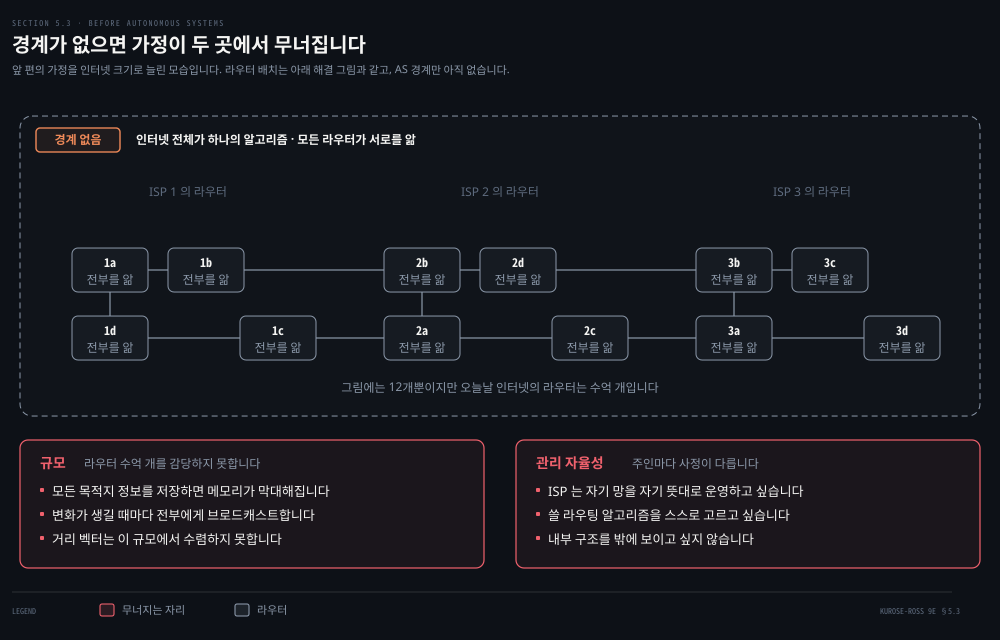
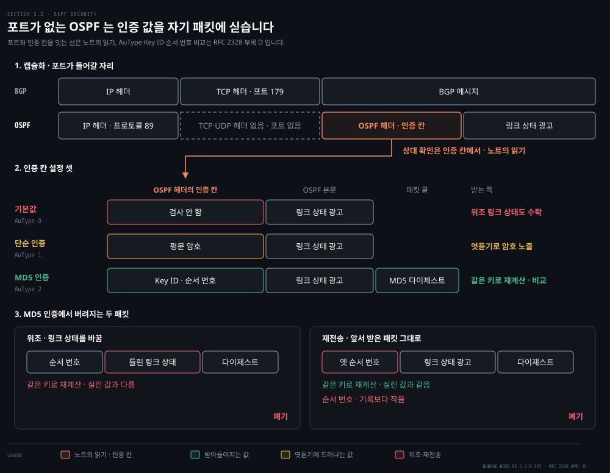
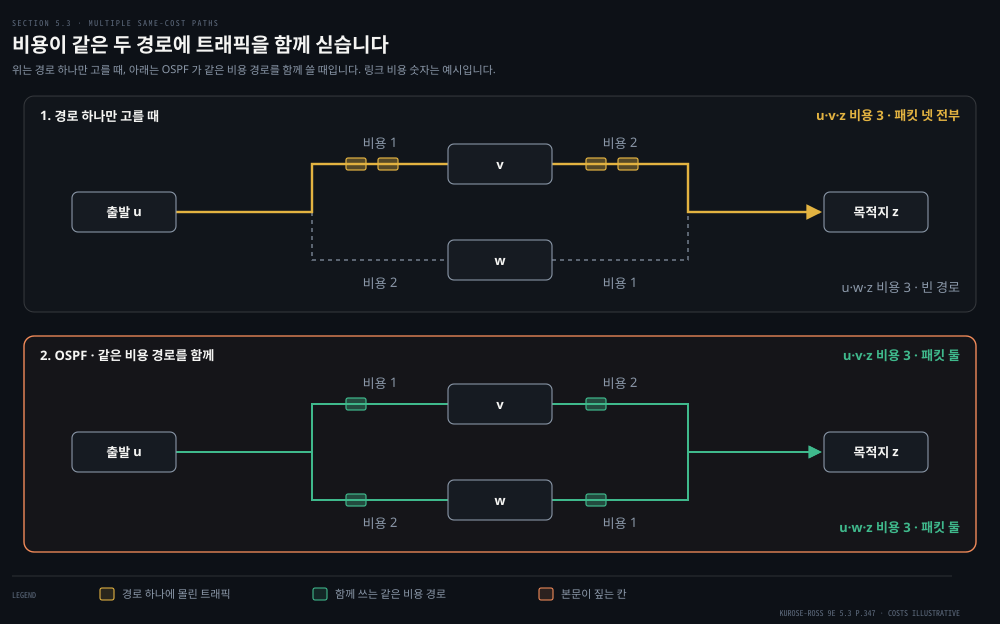
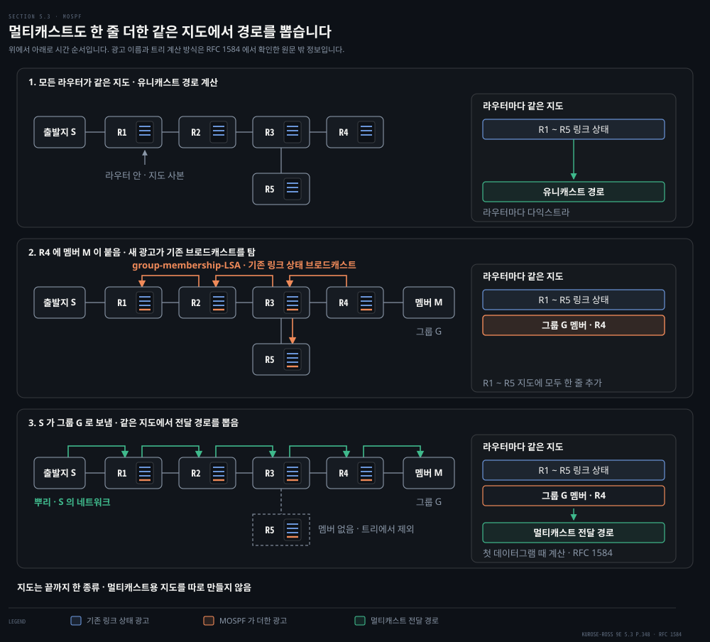
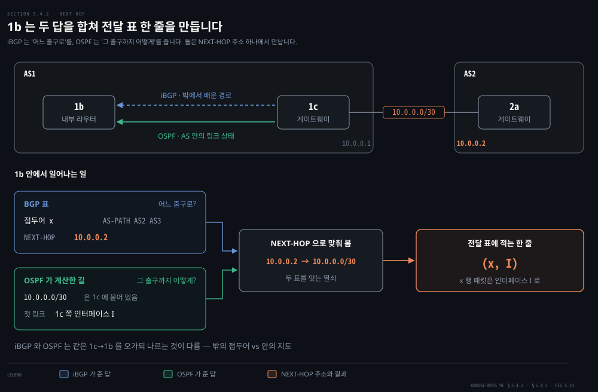
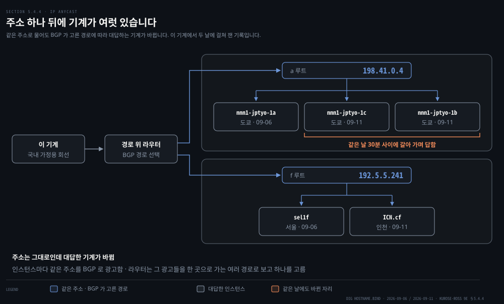
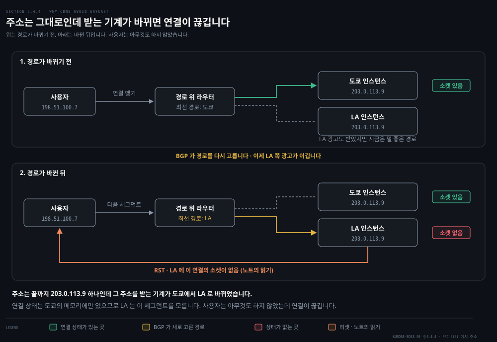

# AS 안과 AS 사이

---

> 앞 편의 알고리즘은 라우터를 모두 같은 것으로 봤습니다. 실제 인터넷은 그렇지 않습니다. 이 편은 경계를 하나 긋고, 그 안과 밖에서 전혀 다른 프로토콜이 도는 이유를 봅니다.

## 핵심 요약

> 이 편이 매달린 하나의 생각은 **AS 안에서는 성능이 목적이고 AS 사이에서는 정책이 목적이라, 같은 최소 비용 경로라는 말이 경계를 넘는 순간 의미를 잃는다**는 것입니다.

이 차이가 가장 또렷하게 드러나는 자리가 BGP 의 경로 선택 규칙입니다. 네 규칙의 순서가 이렇습니다.

1. 관리자가 정한 정책 값
2. AS 홉 수
3. 출구 라우터까지의 AS 안 비용
4. 그래도 안 갈리면 식별자

AS 안에서 다익스트라가 비용의 합만 보고 답을 내던 것과 정반대입니다.

같은 장에서 배우는 IP 애니캐스트가 이 성격을 그대로 보여 줍니다. 루트 DNS 서버 주소 넷에 이 기계에서 질의를 보내 봤더니 응답한 기계는 인천·도쿄·로스앤젤레스로 흩어졌고 왕복 시간은 4 ms 에서 132 ms 까지 벌어졌습니다. 같은 주소 하나가 30분 사이에 다른 기계로 답하기도 했습니다. **어느 기계가 대답할지는 지도가 아니라 BGP 의 경로 선택이 정합니다.**


## 학습 목표

> 이 편을 읽고 나면 아래 다섯 가지를 스스로 해낼 수 있습니다.

1. 라우터를 자율 시스템으로 묶는 두 가지 이유를 말하고, 그 경계가 왜 프로토콜의 경계와 같은지 설명합니다.
2. OSPF 가 링크 상태 알고리즘을 어떤 방식으로 구현하는지 말하고, 영역과 백본이 무엇을 해결하는지 설명합니다.
3. eBGP 와 iBGP 의 역할을 구분하고, AS-PATH 가 언제 길어지는지 말할 수 있습니다.
4. BGP 경로 선택의 네 규칙을 순서대로 적고, 순서가 결과를 어떻게 바꾸는지 예로 보일 수 있습니다.
5. IP 애니캐스트가 무엇에 기대어 동작하는지 말하고, DNS 와 CDN 에서 왜 갈리는지 설명합니다.

이 편에서 새로 만나는 낱말입니다. `어디서` 는 그 낱말이 실제로 설명되는 절입니다.

| 키워드 | 뜻 | 학습 포인트·연결 개념 | 어디서 |
|---|---|---|---|
| 자율 시스템 (AS, Autonomous System) | 같은 관리 아래의 라우터 무리 | 규모와 관리 자율성 · ASN 은 IANA → RIR 순 | §1 |
| OSPF (Open Shortest Path First) | AS 안의 링크 상태 프로토콜 | IP 위에 직접 실림(번호 89) · 손잡이는 링크 비용 | §2 |
| BGP (Border Gateway Protocol) | AS 사이의 경로 프로토콜 | 포트 179 반영구 TCP · 도달 정보 확보 + 경로 선택 | §3 |
| eBGP · iBGP | AS 사이 연결과 AS 안 연결 | AS-PATH 는 eBGP 를 건널 때만 길어짐 | §3 |
| AS-PATH | 광고가 지나온 AS 의 목록 | 내보낼 때 자기 ASN 을 앞에 붙임 · 루프 차단 | §4 |
| 뜨거운 감자 (hot potato routing) | AS 밖 비용을 안 보고 내보냄 | 경로 선택 네 규칙의 셋째 · 라우터마다 다를 수 있음 | §4 |


## 1. 라우터를 무리로 묶는 이유

> 앞 편은 세상의 모든 라우터가 같은 알고리즘을 돌리고 서로를 안다고 가정했습니다. 라우터가 수억 개이고 망마다 주인이 따로 있는 실제 인터넷에서도 그 가정이 성립할까요?



성립하지 않습니다. 원문은 무너지는 자리를 둘로 꼽는데, 그림 아래의 두 칸이 그것입니다.

- **규모**: 라우터가 많아지면 라우팅 정보를 주고받고 계산하고 저장하는 비용이 감당되지 않습니다. 오늘날 인터넷의 라우터는 수억 개입니다. 모든 목적지의 정보를 각 라우터에 저장하려면 막대한 메모리가 들고, 연결과 링크 비용의 변화를 그 전부에게 브로드캐스트하는 부담도 큽니다. 그만한 수의 라우터 사이에서 도는 거리 벡터는 수렴하지 못합니다.
- **관리 자율성**: 인터넷은 ISP 의 망입니다. ISP 는 자기 망을 자기 뜻대로 운영하고 싶어 합니다. 어떤 라우팅 알고리즘을 쓸지 스스로 정하고 싶고 내부 구조는 밖에서 못 보게 하고 싶어 합니다.

### 경계 하나로 두 문제를 풉니다


두 문제를 한 번에 푸는 것이 **자율 시스템(AS)** 입니다. 같은 관리 주체 아래 있는 라우터의 무리를 말합니다. 그림은 위와 같은 라우터에 경계만 그은 것입니다. 아래 두 칸이 위 그림의 두 칸과 한 줄씩 짝을 이룹니다.

- **규모**: 라우팅 알고리즘을 같은 AS 안의 라우터끼리만 돌립니다. 내부 라우팅 정보는 AS 하나 안에서만 오갑니다. 밖의 목적지는 3절의 BGP 가 나르는 접두어로만 알면 됩니다.
- **관리 자율성**: AS 안에서 어떤 알고리즘을 돌릴지는 그 AS 가 정합니다. 밖에 알리는 것은 내부 구조가 아니라 접두어라서 안의 사정을 드러내지 않아도 됩니다.

AS 마다 전 세계에서 유일한 자율 시스템 번호(ASN)가 붙습니다. ASN 은 IP 주소처럼 지역 인터넷 등록기관이 할당합니다.

> **용어 주의**: 원문은 *"AS numbers, like IP addresses, are assigned by **ICANN** regional registries"* 라 적습니다(346쪽). 등록기관의 소속이 실제와 다릅니다. 
>
> RFC 7020 §3 은 이 계층이 *"rooted in the Internet Assigned Numbers Authority (IANA) address allocation function, which serves a set of 'Regional Internet Registries' (RIRs)"* 라 적고, 같은 절이 *"IANA is a role, not an organization"* 이라고 못 박습니다. IANA 는 역할이고 지금 그 역할을 ICANN 이 맡고 있을 뿐, RIR 다섯 곳은 ICANN 산하가 아닙니다. 순서는 IANA 가 RIR 에 할당하고 RIR 이 사업자에 배정하는 것입니다.

ISP 하나가 통째로 AS 하나가 되는 경우가 흔합니다. 다만 티어-1 ISP 중에는 망 전체를 거대한 AS 하나로 두는 곳도 있고 수십 개로 쪼개는 곳도 있습니다.

경계를 그으면 프로토콜도 갈립니다. 같은 AS 안의 라우터는 모두 같은 라우팅 알고리즘을 돌리고 서로의 정보를 갖는데, 이때 도는 것을 **AS 내부 라우팅 프로토콜**이라 합니다. AS 를 넘는 구간은 주인이 다른 AS 들이 함께 맞춰야 하므로 모두가 같은 **AS 사이 라우팅 프로토콜**을 씁니다. 인터넷에서 그 자리를 맡는 것이 3절의 BGP 입니다.

두 프로토콜이 맞닿는 곳이 AS 의 가장자리라서 라우터의 역할도 둘로 갈립니다.

- **게이트웨이 라우터**: AS 의 가장자리에 있으면서 다른 AS 의 라우터에 직접 연결된 라우터입니다.
- **내부 라우터**: 자기 AS 안의 호스트와 라우터에만 연결된 라우터입니다.

### 안과 밖에 서로 다른 프로토콜을 쓰는 이유

경계를 그었다고 안팎의 프로토콜이 꼭 달라야 하는 것은 아닙니다. AS 안에서 쓰던 프로토콜을 AS 사이까지 늘려 쓰면 안 될까요? 원문은 BGP 를 다 설명한 뒤에 이 물음을 던지는데, 이 노트는 경계를 그은 이 자리로 당겨 옵니다. 답은 셋입니다.

- **정책**: AS 사이에서는 정책이 지배합니다. 내 트래픽이 특정 AS 를 지나지 않게 하거나, 나를 지나는 통과 트래픽을 통제하는 일이 중요합니다. AS 안에서는 모두가 명목상 같은 관리 아래 있으므로 정책의 비중이 훨씬 작습니다.
- **규모**: AS 사이 라우팅에서는 많은 망을 감당하는 확장성이 결정적입니다. AS 안에서는 덜 문제인데, ISP 가 너무 커지면 AS 둘로 쪼개면 되기 때문입니다. 2절에서 볼 OSPF 의 영역도 같은 처방입니다.
- **성능**: AS 사이 라우팅은 정책 중심이라 경로의 품질이 부차적입니다. **AS 사이에는 AS 홉 수 말고는 비용이라는 개념 자체가 없습니다.** AS 안에서는 정책 걱정이 적으니 성능에 집중할 수 있습니다.

셋을 모으면 핵심 요약의 한 문장이 됩니다. AS 안은 성능을 쫓고 AS 사이는 정책을 집행합니다. 이제 경계 안쪽부터 봅니다. 2절이 AS 안의 OSPF 를, 3절과 4절이 AS 사이의 BGP 를 다룹니다.


## 2. AS 안에서는 지도를 공유합니다

> AS 안이라면 모두가 한 주인 아래 있습니다. 그러면 앞 편의 두 알고리즘 중 어느 쪽을 쓰는 편이 나을까요?

앞 편의 결론부터 떠올립니다. 원문은 링크 상태와 거리 벡터 중 명백한 승자가 없다고 했습니다. 링크 상태는 지도를 모두에게 뿌리느라 메시지가 `O(|N||E|)` 만큼 듭니다. 거리 벡터는 이웃끼리만 주고받는 대신 수렴이 느리고 count-to-infinity 를 겪습니다([5-1 링크 상태와 거리 벡터를 나란히](./05-01.길은%20어떻게%20계산되는가.md)).

AS 안이라는 조건이 이 저울을 기울입니다. 1절의 경계 덕분에 지도를 뿌리는 범위가 AS 하나로 줄었으므로 링크 상태의 약점인 메시지 비용이 감당할 만해집니다. 모두가 한 주인 아래 있으니 내부 지도를 서로에게 다 보여 줘도 문제가 없습니다. 그래서 인터넷의 AS 내부 라우팅에 널리 쓰이는 것은 링크 상태 계열인 **OSPF**(Open Shortest Path First) 와 그 사촌 IS-IS 입니다.

> **노트의 읽기**: 원문은 OSPF 가 널리 쓰인다는 사실까지만 적습니다. 링크 상태가 AS 안에 맞는 이유는 이 노트가 앞 편의 비교와 1절의 경계를 이어 읽은 것입니다.

이름의 Open 은 명세가 공개돼 있다는 뜻이고, 시스코의 EIGRP 가 20년 가까이 독점 프로토콜이었다가 최근에야 공개된 것과 대비됩니다. 버전 2 는 RFC 2328 에 정의돼 있습니다.

> **원문이 안 적은 것**: 원문은 버전 2 까지만 말합니다. IPv6 를 위한 **OSPF 버전 3** 이 [RFC 5340 "OSPF for IPv6"](https://www.rfc-editor.org/rfc/rfc5340.txt)(2008년 7월)로 따로 있고 RFC 2740 을 대체했습니다. 이 편의 서술은 모두 버전 2 기준입니다.

OSPF 는 링크 상태 프로토콜입니다. 링크 상태 정보를 뿌리고 다익스트라를 돌립니다. 각 라우터가 AS 전체의 위상 지도를 구성하고, 자기를 뿌리로 하는 최단 경로 트리를 모든 서브넷에 대해 계산합니다. 앞 편에서 손으로 돌린 그 알고리즘이 그대로 여기에 있습니다.

브로드캐스트의 범위가 거리 벡터와 다릅니다. **OSPF 라우터는 이웃이 아니라 AS 안의 모든 라우터에게 링크 상태를 알립니다.** 링크의 비용이나 상태가 바뀔 때마다 알리고, 바뀌지 않아도 최소 30분에 한 번은 다시 알립니다. RFC 2328 은 이 주기적 재광고가 링크 상태 알고리즘에 견고함을 더한다고 적습니다.

OSPF 메시지는 IP 위에 직접 실리고 상위 프로토콜 번호는 89 입니다. TCP 도 UDP 도 쓰지 않는다는 뜻이라, **신뢰성 있는 메시지 전달과 링크 상태 브로드캐스트를 OSPF 가 직접 구현해야 합니다.** HELLO 메시지로 링크가 살아 있는지 확인하고, 이웃 라우터의 링크 상태 데이터베이스를 통째로 받아 오는 기능도 갖습니다.

링크 비용은 관리자가 설정합니다. OSPF 는 비용을 어떻게 정할지에 대한 정책을 강제하지 않고 **주어진 비용에서 최소 비용 경로를 찾는 장치만 제공합니다.** 모두 1 로 두면 홉 수 최소가 되고, 용량에 반비례하게 두면 좁은 링크를 피하게 됩니다.

여기에 원문이 곁상자로 붙인 이야기가 재미있습니다. 실무에서는 **원인과 결과가 뒤집힙니다.** 교과서에서는 비용이 먼저 있고 그 결과로 경로가 나옵니다. 그런데 운영자가 진입점과 진출점 사이의 트래픽 흐름을 알고 있고 링크 최대 이용률을 낮추고 싶다면, 원하는 경로가 먼저 정해져 있고 **그 경로가 나오게 만드는 비용 집합을 거꾸로 찾아야** 합니다. OSPF 를 돌리는 운영자에게 손잡이는 링크 비용뿐이기 때문입니다.

원문이 꼽는 OSPF 의 진전은 넷입니다.

### 보안과 두 가지 인증



인증이 없으면 누구든 틀린 링크 상태를 끼워 넣어 모두의 계산을 흔들 수 있습니다. 그래서 라우터 사이의 교환을 인증할 수 있게 했습니다. 기본값은 인증이 없어 위조가 가능합니다. 단순 인증은 평문 암호를 넣는 방식이라 안전하지 않습니다. MD5 인증은 공유 비밀 키로 해시를 계산해 붙이고, 받는 라우터는 미리 설정된 같은 키로 해시를 다시 계산해 패킷에 실린 값과 비교합니다. 재전송 공격을 막으려고 순서 번호도 함께 씁니다.

> **노트의 읽기**: 원문은 인증을 OSPF 가 IP 위에 직접 실린다는 사실과 잇지 않습니다. OSPF 메시지는 TCP 도 UDP 도 쓰지 않아 포트 번호가 없습니다. 포트나 TCP 연결로 상대를 거를 수 없으므로 인증 값을 OSPF 패킷 안에 직접 싣는다고 이 노트는 읽습니다. 그림 첫 단은 3절의 BGP 가 쓰는 TCP 포트 179 와 나란히 놓아 포트 자리가 빈 모습을 보입니다.

> **원문이 안 적은 것**: [RFC 2328](https://www.rfc-editor.org/rfc/rfc2328.txt) 부록 D 에서는 OSPF 패킷 헤더의 AuType 필드가 방식을 고릅니다. 0 은 인증 없음, 1 은 단순 암호, 2 는 암호 인증이고 64비트 Authentication 필드를 그 방식이 씁니다. 암호 인증이면 이 필드에 Key ID 와 32비트 순서 번호가 들어가고 다이제스트는 패킷 끝에 붙습니다. 받는 라우터는 순서 번호가 기록해 둔 값보다 작거나 다시 계산한 다이제스트가 다르면 패킷을 버립니다. 그래서 통째로 베낀 옛 패킷은 해시 비교를 통과해도 순서 번호에서 걸릴 수 있습니다.

### 같은 비용 경로 여럿을 함께 씁니다



비용이 같은 경로가 여럿인데 하나만 고르면 모든 트래픽이 그 하나로 갑니다. OSPF 는 그럴 때 여럿을 함께 쓸 수 있게 합니다. 그림의 링크 비용 1 과 2 는 v 쪽과 w 쪽 경로의 합이 똑같이 3 이 되도록 고른 예시입니다.

> **원문이 안 적은 것**: 원문은 경로 하나만 고를 필요가 없다는 데서 멈추고, 여러 경로에 트래픽을 어떤 기준으로 나누는지는 적지 않습니다. 그림의 패킷 개수도 여러 경로에 실린다는 표시일 뿐 비율이 아닙니다.

### 유니캐스트와 멀티캐스트가 지도 하나를 나눕니다



멀티캐스트 라우팅을 위해 지도를 따로 만들지 않아도 됩니다. MOSPF 가 기존 링크 데이터베이스를 그대로 쓰고 새 링크 상태 광고 유형만 더합니다. 새 광고도 기존 링크 상태 브로드캐스트에 실려 퍼집니다.

그림은 같은 망을 위에서 아래로 세 칸에 옮겨 그렸습니다. 둘째 칸에서 R4 에 그룹 멤버가 붙자 모든 라우터의 지도에 한 줄이 더해집니다. 셋째 칸의 라우터는 그 같은 지도로 멀티캐스트 경로를 뽑습니다.

> **원문이 안 적은 것**: 새 광고 유형은 [RFC 1584 "Multicast Extensions to OSPF"](https://www.rfc-editor.org/rfc/rfc1584.txt)(1994년 3월)에서 **group-membership-LSA** 라는 이름과 LS type 6 을 갖습니다. 그룹 멤버가 붙은 라우터가 이 광고를 만들어 다른 링크 상태 광고와 같은 방식으로 퍼뜨리고, 그 덕에 멀티캐스트 그룹 멤버의 위치가 데이터베이스 안에 짚입니다. 같은 RFC 는 멤버 호스트 자체는 데이터베이스에 나타나지 않는다고 적습니다. 그래서 그림의 새 줄도 M 이 아니라 R4 를 적었습니다.
>
> 셋째 칸의 계산 방식도 같은 RFC 에서 왔습니다. 라우터는 데이터그램의 출발지를 뿌리로 삼아 최단 경로 트리를 만든 뒤 멤버가 없는 가지를 잘라 냅니다. 이 트리는 첫 데이터그램이 도착할 때 만들어집니다. 출발지와 목적지가 같은 뒤따르는 데이터그램은 캐시해 둔 계산 결과를 다시 씁니다. 망 모양과 그룹 이름 G 는 가지가 잘리는 모습을 보이려고 고른 예시입니다.

### AS 안의 계층은 영역으로 나눕니다


AS 가 크면 링크 상태를 AS 전체에 뿌리는 비용이 다시 커집니다. 그래서 AS 를 **영역**으로 나눌 수 있습니다. 마지막 항목이 1절의 이야기를 한 겹 안으로 되풀이합니다.

- **영역**: 각자 자기 영역의 링크 상태 알고리즘을 돌립니다. 광고도 그 영역 안에서만 돕니다.
- **영역 경계 라우터**: 영역마다 하나 이상 두며, 영역 밖으로 나가는 패킷을 맡습니다.
- **백본 영역**: AS 안의 정확히 한 영역이 여기로 지정됩니다. 다른 영역 사이의 트래픽을 나르는 것이 주 임무이고, AS 안의 모든 영역 경계 라우터를 반드시 포함합니다.

영역을 넘는 경로는 세 단계입니다. 먼저 영역 안 라우팅으로 경계 라우터까지 가고, 백본을 지나 목적지 영역의 경계 라우터에 닿은 뒤, 마지막으로 그 영역 안에서 목적지까지 갑니다. 얻는 것은 광고가 도는 범위가 영역 하나로 좁아진다는 점입니다. 대가는 영역을 넘는 트래픽이 반드시 백본을 지난다는 점입니다.

### OSPF 말고 고를 수 있는 것

1절에서 본 대로 AS 안의 프로토콜은 그 AS 가 고릅니다. 원문이 이름만 스치는 선택지를 계열로 나누면 이렇습니다.

| 프로토콜 | 계열 | 원문에서의 자리 | 명세 |
|---|---|---|---|
| IS-IS | 링크 상태 | OSPF 의 사촌으로 이름만 나옵니다 | [RFC 1195](https://www.rfc-editor.org/rfc/rfc1195.txt) (1990) · OSI IS-IS 를 TCP/IP 에 쓰는 법 |
| RIP | 거리 벡터 | 앞 편에서 무한대를 16 으로 자르는 예로 나옵니다 | [RFC 2453](https://www.rfc-editor.org/rfc/rfc2453.txt) (1998) · RIP Version 2 |
| EIGRP | 거리 벡터 계열 · DUAL 알고리즘으로 계산 중에도 루프를 막음 | "20년 가까이 독점이었다"는 대비로만 나옵니다 | [RFC 7868](https://www.rfc-editor.org/rfc/rfc7868.txt) (2016) |

계열과 연도는 원문 밖 정보라 각 RFC 에서 확인했습니다. 어느 쪽을 고르든 경계 밖에는 드러나지 않습니다. AS 사이에서는 모두 BGP 로 맞추기 때문입니다.


## 3. AS 를 넘으려면 광고가 먼저 건너가야 합니다

> AS 안의 목적지는 OSPF 가 채웁니다. 그러면 AS 밖의 목적지는 전달 표에 어떻게 들어갈까요?


여기서 **BGP**(Border Gateway Protocol) 가 나섭니다. AS 사이 라우팅 프로토콜은 여러 AS 의 협조가 필요하므로 서로 같은 것을 써야 하고, 실제로 인터넷의 모든 AS 가 BGP 하나를 씁니다. 원문은 BGP 를 두고 인터넷의 모든 프로토콜 중 가장 중요하다고 말할 만하며 겨룰 상대는 IP 정도라고 적습니다. 수천 개 ISP 를 하나로 붙이는 접착제이기 때문입니다.

BGP 가 나르는 것은 주소가 아니라 **CIDR 로 표기한 접두어**입니다. 예를 들어 `138.16.68.0/22` 는 주소 1,024개를 담습니다. 그래서 전달 표의 항목은 `(접두어, 인터페이스 번호)` 꼴이 됩니다. BGP 가 각 라우터에 해 주는 일은 둘입니다.

- **이웃 AS 로부터 접두어 도달 정보를 얻습니다.** BGP 는 각 서브넷이 자기 존재를 인터넷 전체에 알리게 해 줍니다. 원문의 표현대로 서브넷이 "나 여기 있다"고 외치면 BGP 가 모든 라우터에 그 사실을 전합니다. BGP 가 없으면 각 서브넷은 아무도 모르고 닿을 수 없는 외딴섬이 됩니다.
- **그중 가장 좋은 경로를 정합니다.** 한 접두어에 여러 경로를 알게 되면 라우터가 스스로 경로 선택 절차를 돌립니다.

전파의 실제 모습은 조금 더 구체적입니다. AS 가 메시지를 보내는 것이 아니라 **라우터가 보냅니다.** 라우터 쌍이 포트 179 위의 반영구적 TCP 연결로 라우팅 정보를 주고받습니다. 이 연결과 그 위의 모든 메시지를 통틀어 BGP 연결이라 부릅니다.

- **eBGP**: 두 AS 를 잇는 연결입니다.
- **iBGP**: 같은 AS 안 라우터 사이의 연결입니다.

iBGP 가 따로 필요한 이유는 경로를 배우는 자리가 가장자리뿐이기 때문입니다. 다른 AS 와 eBGP 로 이어진 것은 게이트웨이뿐이라 1b 같은 내부 라우터는 밖에서 무엇이 광고됐는지 스스로 알 길이 없습니다. OSPF 도 도와주지 못합니다. OSPF 가 나르는 것은 AS 안의 링크 상태이지 밖에서 배운 접두어가 아닙니다. 그래서 게이트웨이가 배운 경로를 iBGP 로 AS 안의 다른 라우터에게 넘깁니다.

흔한 구성에서는 AS 안 모든 라우터 쌍이 각각 연결을 갖는 TCP 그물이 만들어집니다. **iBGP 연결이 물리 링크와 일치하지는 않습니다.** 도식에서 iBGP 를 점선으로 그린 이유입니다.

> **원문 밖의 대안**: 그물은 라우터 n 개에 iBGP 연결 `n(n-1)/2` 개가 필요해 AS 가 크면 부담이 됩니다. [RFC 4456 "BGP Route Reflection"](https://www.rfc-editor.org/rfc/rfc4456.txt) 도 같은 셈을 적고 이어서 *This "full mesh" requirement clearly does not scale when there are a large number of IBGP speakers* 라 말합니다. 그 대안이 **라우트 리플렉션**입니다. 리플렉터 역할의 라우터가 받은 경로를 다른 iBGP 피어에게 되비춰 주어 그물을 대신합니다.

AS3 의 접두어 x 가 AS1 까지 가는 과정을 따라가면 이렇습니다.

1. 게이트웨이 3a 가 게이트웨이 2c 에게 eBGP 로 "AS3 x" 를 보냅니다.
2. 2c 가 AS2 안의 다른 모든 라우터에게 iBGP 로 같은 "AS3 x" 를 보냅니다. 게이트웨이 2a 도 이때 받습니다.
3. 2a 가 게이트웨이 1c 에게 eBGP 로 "AS2 AS3 x" 를 보냅니다. AS2 를 지나왔으므로 경로가 한 칸 길어졌습니다.
4. 1c 가 AS1 안의 모든 라우터에게 iBGP 로 "AS2 AS3 x" 를 보냅니다.

**AS 를 넘을 때만 경로가 길어집니다.** iBGP 로 도는 동안에는 그대로입니다. AS-PATH 의 길이가 라우터 홉이 아니라 AS 홉을 세는 이유가 여기 있습니다.

실제 망에서는 한 목적지에 이르는 길이 여럿입니다. 원문은 Figure 5.8 에 1d 와 3d 를 잇는 물리 링크를 하나 더해 Figure 5.10 을 만드는데, 그러면 AS1 에서 x 로 가는 길이 둘이 됩니다. 1c 를 지나는 "AS2 AS3" 와 1d 를 지나는 "AS3" 입니다.

> **원문 정오**: 뒤쪽 경로를 원문은 *"another that uses the AS-PATH **"A3"**"* 라 적습니다(351쪽). 같은 문장의 앞부분이 `"AS2 AS3"` 라 제대로 적고 있으므로 여기서 나와야 하는 것은 `"AS3"` 입니다. `A3` 라는 표기는 이 책 어디에도 정의된 적이 없습니다.

광고가 AS 를 건너가는 경로를 움직이는 그림으로 따라갈 수 있습니다.

<iframe src="https://unseel.com/embed/cs/bgp.html"
        width="100%" height="600" loading="lazy" allow="autoplay" frameborder="0"
        title="Border Gateway Protocol (BGP) — interactive visualization"></iframe>

> **이 창이 비어 있다면**: 재생은 MkDocs 로 배포된 사이트에서만 됩니다. GitHub 저장소 뷰나 마크다운 편집기에서는 [Unseel — Border Gateway Protocol (BGP)](https://unseel.com/cs/bgp) 을 직접 엽니다. 사이트가 스스로 `AI-generated content` 라고 밝히고 있으니, 움직임을 눈에 익히는 용도로만 쓰고 사실 확인은 본문과 원문으로 합니다.


## 4. 여러 길 중 하나를 고르는 규칙

> 길이 여럿이면 골라야 합니다. 인터넷의 라우터는 한 접두어에 대해 수십 개의 경로를 받는 일이 흔합니다.


고르기 전에 어휘가 둘 더 필요합니다. 접두어를 BGP 연결로 광고할 때는 여러 **속성**이 함께 실리고, 접두어와 속성을 묶어 **경로(route)** 라 부릅니다. 이 절에 필요한 속성은 AS-PATH 와, 아래 소절에서 볼 NEXT-HOP 입니다.

- **AS-PATH**: 광고가 지나온 AS 의 목록입니다. 광고를 **다른 AS 로 내보내는 쪽**이 자기 ASN 을 목록 앞에 붙입니다. **라우터가 자기 AS 를 목록 안에서 발견하면 그 광고를 버립니다.** 이것이 BGP 의 루프 차단 장치입니다.

> **원문 정오**: 원문은 이 대목을 *"when a prefix is passed to an AS, the AS adds its ASN to the existing list in the AS-PATH"* 라 적습니다. 받는 쪽이 붙인다는 말이 되는데, 그러면 바로 아래 예에서 AS1 이 아는 경로가 `AS1 AS2 AS3` 이어야 합니다. 원문 자신이 `AS2 AS3` 이라 적으므로 앞뒤가 맞지 않습니다.
>
> [RFC 4271 §5.1.2](https://www.rfc-editor.org/rfc/rfc4271.txt) 가 규정하는 것은 반대입니다. *"When a given BGP speaker advertises the route to an external peer, the advertising speaker … prepends its own AS number"* 이고, 같은 절이 **내부 피어에게 광고할 때는 AS_PATH 를 고치지 않는다**고 못 박습니다. 이 편의 치트시트가 적은 "AS-PATH 는 eBGP 를 건널 때만 길어진다"가 이 규정과 맞는 서술입니다.

### NEXT-HOP 이 다리인 이유



AS-PATH 만으로는 1b 가 패킷을 내보낼 수 없습니다. 1b 는 게이트웨이가 아니어서 iBGP 로 "AS2 AS3 x" 를 받습니다. 그런데 전달 표에 적어야 하는 것은 `(접두어, 인터페이스 번호)` 이고, AS 번호의 목록에서는 어느 인터페이스로 내보낼지가 나오지 않습니다.

그 빈칸을 채우는 속성이 **NEXT-HOP** 입니다. AS-PATH 를 시작하는 라우터 인터페이스의 IP 주소로, 위 경로라면 AS2 의 게이트웨이 2a 쪽 주소입니다. 이 주소는 내 AS 에 속하지 않지만 그 주소를 담은 서브넷은 내 AS 에 직접 붙어 있습니다.

그래서 NEXT-HOP 이 AS 사이 프로토콜과 AS 안 프로토콜을 잇는 다리가 됩니다. 1b 는 이 주소 하나만 받으면 됩니다. 나머지는 OSPF 의 몫입니다. 그 주소가 든 서브넷은 1c 에 직접 붙어 있고 1c 가 그것을 OSPF 로 알리므로, 1b 는 링크 상태 데이터베이스만 풀어도 "그 서브넷으로 가려면 1c 방향"이라는 답을 얻습니다. **BGP 는 어느 출구로 나가는지를 답하고, OSPF 는 그 출구까지 어떻게 가는지를 답합니다.** 두 답이 이 주소 하나에서 만납니다.

도식은 이 과정을 위아래로 나눠 보여 줍니다.

1. **위쪽 망**: 1c 에서 1b 로 두 가지가 따로 흐릅니다. 점선 iBGP 는 밖에서 배운 경로 "x 는 AS2 AS3 로, NEXT-HOP 10.0.0.2" 를 나릅니다. 실선 OSPF 는 "10.0.0.0/30 은 1c 에 붙어 있다"는 AS 안의 링크 상태를 나릅니다.
2. **아래 왼쪽 두 칸**: 1b 안에 두 표가 생깁니다. BGP 표는 어느 출구로 나갈지를, OSPF 가 계산한 길은 그 출구까지 어느 인터페이스로 갈지를 답합니다.
3. **가운데**: 1b 는 BGP 표의 NEXT-HOP `10.0.0.2` 를 들고 OSPF 쪽에서 그 주소가 든 `10.0.0.0/30` 을 찾습니다. 두 표가 이 주소 하나로 이어집니다.
4. **오른쪽**: 결과가 전달 표 한 줄 `(x, I)` 입니다. x 로 가는 패킷은 1c 쪽 인터페이스 I 로 나갑니다.

주소 `10.0.0.0/30` 과 그 안의 두 주소, 인터페이스 이름 I 는 **노트의 읽기**입니다. 원문은 "2a 의 가장 왼쪽 인터페이스 주소"라고만 적습니다.

앞 절의 예에서 AS1 의 각 라우터가 아는 경로 둘은 이렇게 적힙니다.

```bash
2a 의 가장 왼쪽 인터페이스 주소 ; AS2 AS3 ; x
3d 의 가장 왼쪽 인터페이스 주소 ; AS3     ; x
```

### 뜨거운 감자와 그 앞에 오는 규칙

가장 단순한 선택 방식이 **뜨거운 감자 라우팅**입니다. 후보 중에서 그 경로를 시작하는 NEXT-HOP 라우터까지의 AS 안 비용이 가장 싼 것을 고릅니다. 라우터 1b 는 AS 안 라우팅 정보를 뒤져 2a 까지의 최소 비용과 3d 까지의 최소 비용을 각각 구하고, 더 작은 쪽을 택합니다. 비용을 지나는 링크 수로 정하면 1b 에서 2a 까지가 2, 3d 까지가 3 이라 2a 가 선택됩니다.

> **원문 정오**: 이 대목에서 원문은 *"1b 에서 라우터 **2d** 까지의 최소 비용이 3"* 이라 적습니다. 바로 앞 문장이 비교 대상을 2a 와 **3d** 라고 못 박았으므로 여기서 나와야 하는 것은 3d 입니다. Figure 5.10 에 2d 라는 라우터가 실제로 있고 1b 에서 그곳까지의 링크 수도 마침 3 이라, 숫자만 보면 어긋나지 않아 눈에 잘 걸리지 않습니다. 결론인 2a 선택도 바뀌지 않습니다. 그래서 더 조용히 지나가는 오기입니다.

이름의 뜻은 그대로입니다. 손에 든 감자가 뜨거우니 남에게 빨리 넘기듯, 자기 AS 밖의 비용은 생각하지 않고 **일단 자기 AS 에서 빨리 내보내려는** 방식입니다. 원문이 이기적인 알고리즘이라 부릅니다. 같은 AS 안의 두 라우터가 같은 접두어에 대해 서로 다른 AS 경로를 고를 수도 있습니다.

실제 BGP 는 뜨거운 감자를 품되 더 복잡합니다. 후보가 둘 이상이면 아래 규칙을 차례로 적용해 하나만 남을 때까지 제거합니다.

1. **로컬 선호도**가 가장 높은 것만 남깁니다. 이 값은 라우터가 정했거나 같은 AS 안의 다른 라우터에게서 배운 것이고, **값을 정하는 것은 전적으로 그 AS 관리자의 정책 결정**입니다.
2. 남은 것 중 **AS-PATH 가 가장 짧은** 것만 남깁니다.
3. 남은 것 중 **뜨거운 감자**, 즉 NEXT-HOP 라우터까지의 **AS 안 비용**이 가장 작은 것을 고릅니다. 지리적 거리가 아니라 IGP 가 계산한 비용입니다.
4. 그래도 남으면 BGP 식별자로 자릅니다.

> **노트의 읽기**: 이 넷은 원문이 추린 것이고 실제 절차는 더 깁니다. [RFC 4271 §9.1.2.2](https://www.rfc-editor.org/rfc/rfc4271.txt) 는 AS_PATH 다음에 ORIGIN·MED·eBGP 우선 같은 비교를 더 둡니다. 넷만으로 승자를 예측하려면 그 사이 값들이 같다는 전제가 필요합니다.

순서가 결과를 바꿉니다. 라우터 1b 는 감자만 따지면 AS2 를 지나는 쪽을 골랐을 텐데, **규칙 2 가 규칙 3 보다 먼저이므로 AS-PATH 가 짧은 쪽, 즉 AS2 를 건너뛰는 경로가 선택됩니다.** 이 순서 덕분에 BGP 는 이기적인 알고리즘이 아니게 되고, 짧은 AS 경로를 먼저 찾음으로써 종단 간 지연을 줄일 가능성이 커집니다.

규칙 2 가 유일한 규칙이라면 BGP 는 AS 홉 수를 거리로 쓰는 거리 벡터가 됩니다. **규칙 1 이 그 앞에 있다는 사실이 BGP 의 성격을 정합니다.** 티어-1 ISP 라우터에서 뽑은 BGP 표는 흔히 경로가 50만 개를 넘습니다.


## 5. 같은 주소를 여럿이 나눠 씁니다

> 같은 내용을 여러 나라의 서버에 복제해 두었을 때, 사용자를 가장 가까운 서버로 보내려면 무엇이 필요할까요? 한 가지 답은 서버들에게 같은 주소 하나를 나눠 주고 길 고르기를 BGP 에 맡기는 것입니다.



BGP 의 경로 선택이 그 일을 해 줍니다. **IP 애니캐스트**는 여러 서버에 **같은 IP 주소**를 주고 각 서버에서 그 주소를 BGP 로 광고하는 방식입니다. BGP 라우터는 같은 주소에 대한 광고 여럿을 받으면 그것을 한 장소로 가는 여러 경로라고 여깁니다. 그리고 경로 선택 알고리즘으로 가장 좋은 하나를 고릅니다. 실제로는 서로 다른 장소인데도 그렇게 취급합니다.

이 기계에서 실제로 확인했습니다. 루트 DNS 서버는 `a` 부터 `m` 까지 이름이 열셋입니다. 이름마다 IPv4·IPv6 주소가 하나씩 있으며 그 주소 하나하나가 애니캐스트 주소입니다. 주소마다 어느 물리 인스턴스가 대답하는지는 `hostname.bind` 를 물으면 나옵니다. 왕복 시간도 같은 질의에서 봅니다.

```bash
dig +short f.root-servers.net A
dig @f.root-servers.net hostname.bind CH TXT | grep -E 'hostname.bind|Query time'
```

```bash
192.5.5.241
hostname.bind.		60	CH	TXT	"ICN.cf.f.root-servers.org"
;; Query time: 5 msec
```

`+short` 에는 왕복 시간이 안 나오므로 `+short` 없이 물어 `;; Query time` 줄을 봅니다.

애니캐스트의 증거는 **한 주소가 때마다 다른 기계로 간다**는 데 있습니다. 위 그림이 그 기록입니다. `198.41.0.4` 하나를 같은 날 30분 사이에 두 번 물었더니 `nnn1-jptyo-1c` 와 `nnn1-jptyo-1b` 가 갈아 가며 답했습니다. 닷새 전 기록은 `nnn1-jptyo-1a` 였습니다. `192.5.5.241` 은 닷새 전 서울의 `sel1f` 였다가 지금은 인천의 `ICN.cf` 입니다. **주소는 그대로인데 받는 기계가 바뀝니다.**

아래 표는 결이 다릅니다. 네 줄은 **주소가 서로 다른** 루트 넷이라 대답한 기계가 다른 것이 당연합니다. 이 표가 보여 주는 것은 주소마다 BGP 가 고른 인스턴스까지의 왕복입니다.

| 이름 | 주소 | 대답한 인스턴스 | 왕복 |
|------|------|----------------|------|
| f | `192.5.5.241` | `ICN.cf.f.root-servers.org` (인천) | 5 ms |
| l | `199.7.83.42` | `kr-icn-aa` (인천) | 4 ms |
| a | `198.41.0.4` | `nnn1-jptyo-1b` (도쿄) | 32 ms |
| c | `192.33.4.12` | `lax1a.c.root-servers.org` (로스앤젤레스) | 132 ms |

왕복 시간은 그 선택을 따라갑니다. 국내에 인스턴스가 있는 f 와 l 은 5 ms 안쪽입니다. 국내에 없는 c 는 태평양을 건너 132 ms 입니다. **26배 차이를 만드는 것은 주소가 아니라 BGP 가 고른 경로입니다.**

### 상태가 있으면 깨질 수 있습니다



원문은 CDN 이 애니캐스트를 쓰는 예로 설명을 시작합니다. 그러고는 곧 실제로는 **CDN 이 대체로 쓰지 않는다**고 덧붙입니다. BGP 라우팅이 바뀌면 같은 TCP 연결의 패킷들이 서로 다른 웹 서버 인스턴스에 도착할 수 있기 때문입니다. 그림은 이 한 문장을 경로가 바뀌기 전과 뒤의 두 칸으로 풀어 놓은 것입니다.

1. **경로가 바뀌기 전**: 도쿄와 LA 인스턴스가 같은 주소를 광고합니다. 그림의 `203.0.113.9` 는 문서용 예시 주소입니다. 경로 위 라우터가 지금은 도쿄 쪽 경로를 최선으로 골랐으므로 사용자가 맺은 TCP 연결은 도쿄 인스턴스에 닿습니다. 이 연결의 상태, 곧 소켓은 도쿄에만 생깁니다.
2. **경로가 바뀌는 순간**: BGP 라우팅이 바뀌어 라우터가 이제 LA 쪽 광고를 최선으로 고릅니다. 목적지 주소는 그대로라 사용자는 이 변화를 알 수 없습니다.
3. **경로가 바뀐 뒤**: 같은 연결의 다음 세그먼트가 같은 주소로 나가지만 LA 인스턴스에 도착합니다. [연결은 양 끝 호스트의 메모리에만 있는 상태](./03-03.TCP%20는%20어떻게%20세고%20어떻게%20기다리는가.md)라서 LA 는 도쿄가 들고 있는 그 상태를 나눠 갖지 않습니다.
4. **리셋**: 상태가 없는 호스트에 세그먼트가 도착하면 [맞는 소켓이 없다는 이유로 리셋](./03-04.흐름%20제어와%20연결%20관리,%20그리고%20혼잡.md)이 돌아옵니다. 사용자 쪽은 아무것도 하지 않았는데 연결이 끊깁니다.

반드시 그렇게 된다는 말은 아닙니다. 경로가 바뀌어도 같은 인스턴스로 갈 수 있고, 리셋 대신 조용히 버려져 재전송 시간 초과로 끝날 수도 있습니다. 인스턴스끼리 상태를 나눠 갖도록 만들어 피하는 설계도 있습니다. 다만 **어느 쪽이든 종단이 감당해야 할 일이 생긴다**는 점이 애니캐스트와 연결 상태가 서로 맞지 않는다는 근거입니다. 도식의 리셋 화살표는 **노트의 읽기**입니다. 원문은 인스턴스가 갈린다는 사실까지만 적습니다.

반면 DNS 는 이 방식을 널리 씁니다. 질의 하나가 응답 하나로 끝나므로 어느 인스턴스가 받아도 상관없습니다. 위의 측정이 그 사실을 그대로 보여 줍니다.

여기에도 단서가 하나 붙습니다. DNS 가 늘 UDP 한 번으로 끝나는 것은 아닙니다. [RFC 7766](https://www.rfc-editor.org/rfc/rfc7766.txt) 은 DNS 구현이 TCP 를 지원해야 한다고 요구하고 연결 재사용을 권합니다. TCP 를 쓰는 동안에는 DNS 도 위와 같은 제약 아래 놓입니다. 애니캐스트와 어긋나는 것은 프로토콜 이름이 아니라 **연결 상태를 드느냐**입니다.

> **원문이 안 적은 것**: 이 절 첫머리의 BGP 라우터는 같은 주소의 광고 여럿 중 가장 좋은 하나만 고릅니다. 서버 바로 앞 라우터에서는 하나만 고르지 않는 구성도 씁니다. [RFC 7690](https://www.rfc-editor.org/rfc/rfc7690.txt)(2016년 1월)은 비용이 같은 경로 여럿(ECMP)으로 TCP·UDP 흐름을 서버 여럿에 나누는 방식을 다룹니다. 이 문서는 그 구성을 모든 목적지가 마지막 라우터에서 같은 거리에 있는 제한된 형태의 애니캐스트라 부릅니다. 라우터가 흐름의 헤더를 해시해 다음 홉을 고르므로 한 흐름의 패킷은 한 서버로 갑니다.
>
> 포트 번호가 없는 ICMP 오류가 여기서 어긋납니다. 경로 중간 장비가 서버의 패킷을 두고 만든 ICMPv6 Packet Too Big 은 목적지가 애니캐스트 주소라 역시 서버 중 하나로 나뉩니다. 그런데 원래 흐름으로 식별되지 않아 그 흐름과 같은 다음 홉으로 해시될 가능성이 낮다고 RFC 7690 은 적습니다.
>
> [Cloudflare 의 "Path MTU discovery in practice"](https://blog.cloudflare.com/path-mtu-discovery-in-practice/)(2015년 2월)가 실제로 겪은 일입니다. 서버들의 BGP 메트릭을 같게 맞춰 ECMP 로 부하를 나누자 라우터는 TCP 를 출발지·목적지의 IP 와 포트로 해시했지만 ICMP 는 출발지·목적지 IP 로만 해시했습니다. 그 결과 ICMP 가 TCP 연결을 맡은 서버가 아닌 다른 서버로 가는 일이 생겼습니다. ECMP 는 [6-5 데이터센터 편](./06-05.데이터센터와%20웹%20페이지%20하나의%20하루.md), Packet Too Big 은 [4-4 IPv6 편](./04-04.IPv6%20와%20일반화%20포워딩.md)으로 이어집니다. 둘을 이어 알림이 연결 없는 서버에 떨어지는 걸음은 트러블슈팅 개념 노트 [흐름을 가르는 다섯 값](../../../troubleshooting/_concepts/%ED%9D%90%EB%A6%84%EC%9D%84-%EA%B0%80%EB%A5%B4%EB%8A%94-%EB%8B%A4%EC%84%AF-%EA%B0%92.md) 이 다룹니다.

### CDN 은 무엇으로 가까운 서버를 고르나

애니캐스트를 피한다고 CDN 이 가까운 서버로 보내는 일을 포기하는 것은 아닙니다. 그러면 무엇으로 고를까요? [2장 영상 편](./02-04.영상은%20어떻게%20끊기지%20않는가.md)에서 본 두 방식이 답입니다. YouTube 는 **DNS 재지향**으로 고르고, Netflix 는 클라우드의 자기 소프트웨어가 클라이언트에게 쓸 서버를 직접 알려 줍니다. 둘 다 고르는 일을 연결을 맺기 **전에** 끝냅니다.

애니캐스트와 가장 흔한 DNS 재지향을 나란히 두면 이렇습니다.

| | IP 애니캐스트 | DNS 재지향 |
|---|---|---|
| 누가 고르나 | 경로 위 라우터들의 BGP 경로 선택 | CDN 이 운영하는 DNS 서버 |
| 언제 고르나 | 패킷마다, 경로가 바뀌면 연결 도중에도 | 이름을 물을 때 한 번 |
| 무엇을 기준으로 | 로컬 선호도·AS 홉 같은 정책과 경로 | 클러스터까지의 RTT·부하 같은 CDN 의 측정 |
| 연결과의 궁합 | 경로가 바뀌면 연결이 다른 인스턴스로 갈 수 있음 | 주소가 정해진 뒤에는 연결이 한 서버에 머묾 |

**DNS 재지향은 고르는 시점을 연결 앞으로 당겨 상태 문제를 피합니다.** 대신 고르는 주체가 CDN 이 되므로 측정과 선택을 CDN 이 직접 운영해야 합니다. 애니캐스트는 그 선택을 인터넷의 BGP 에 맡기는 대가로 연결 도중의 경로 변화를 떠안습니다.

같은 주소가 여러 곳으로 갈리는 장면을 그림으로 볼 수 있습니다.

<iframe src="https://unseel.com/embed/cs/anycast.html"
        width="100%" height="600" loading="lazy" allow="autoplay" frameborder="0"
        title="Anycast — interactive visualization"></iframe>

> **이 창이 비어 있다면**: 재생은 MkDocs 로 배포된 사이트에서만 됩니다. GitHub 저장소 뷰나 마크다운 편집기에서는 [Unseel — Anycast](https://unseel.com/cs/anycast) 을 직접 엽니다. 사이트가 스스로 `AI-generated content` 라고 밝히고 있으니, 움직임을 눈에 익히는 용도로만 쓰고 사실 확인은 본문과 원문으로 합니다.


## 6. 정책이 최단 경로를 이깁니다

> 라우터가 길을 고를 때, 더 짧은 길을 두고 더 긴 길을 택하는 일이 왜 생길까요?


두 가지가 겹치기 때문입니다. 하나는 4절에서 본 대로 경로 선택 규칙의 맨 앞이 로컬 선호도이고 그 값을 정책이 정한다는 점입니다. 다른 하나는 그보다 앞 단계에서 일어납니다. **짧은 길이라도 누군가 광고하지 않으면 그 길은 후보조차 되지 못합니다.** 무엇을 광고할지도 정책이 정합니다.

원문은 AS 여섯 개로 이 두 번째 손잡이를 보여 줍니다. A·B·C 는 백본 제공자이고 W·X·Y 는 액세스 ISP 입니다. 그림은 같은 망에서 두 장면을 좌우로 나눠 그린 것입니다. 선의 색은 셋입니다.

- **파란 화살표**: 광고입니다.
- **빨간 점선**: 알고 있지만 막은 광고입니다.
- **초록 화살표**: 그 결과 트래픽이 실제로 타는 길입니다.

> **같은 낱말, 다른 뜻**: 여기서 "백본"은 **큰 ISP 사업자**를 말합니다. 2절의 OSPF 백본은 한 AS 안에서 다른 영역들을 이어 주는 **영역 0** 이라는 이름의 영역이고, 사업자가 아닙니다. 층이 다릅니다. 하나는 AS 안의 구획이고 다른 하나는 AS 그 자체입니다.

**장면 1** 은 액세스 쪽입니다. X 는 제공자 B 와 C 에 동시에 붙은 **다중 접속** 액세스 ISP 입니다. 액세스 ISP 로 들어오는 모든 트래픽은 그 망이 목적지여야 하고 나가는 모든 트래픽은 그 망에서 출발해야 합니다. 그렇다면 X 가 B 와 C 사이의 통과 트래픽을 나르는 일을 어떻게 막을까요? 답은 단순합니다. **X 가 자기 말고는 어디로도 가는 길이 없다고 광고하면 됩니다.**

X 는 X-C-Y 경로를 알고 있어도 그것을 B 에게 알리지 않습니다. 왼쪽 칸의 빨간 점선입니다. B 의 표에는 X 를 지나 Y 로 가는 경로가 없으므로 B 는 Y 행 트래픽을 X 로 보내지 않고 초록 길처럼 C 를 거쳐 보냅니다. **광고하지 않는 것이 곧 정책의 집행입니다.**

**장면 2** 는 제공자 쪽입니다. B 가 A 에게서 "A 를 지나 W 로 가는 길"을 배웠다고 합시다. B 는 이 경로를 자기 고객 X 에게 알리고 싶어 합니다. 그런데 C 에게도 알려야 할까요? 알리면 C 가 B 를 거쳐 W 로 트래픽을 보낼 수 있습니다. A 와 C 사이의 통과 트래픽을 B 가 자기 비용으로 나를 이유가 없으므로 B 는 C 에게 알리지 않습니다. 오른쪽 칸의 빨간 점선입니다. C 의 표에 B 를 지나는 W 행 경로가 없으니 C 는 W 행 트래픽을 B 로 보내지 않습니다.

백본 ISP 사이의 라우팅을 규율하는 공식 표준은 없습니다. 다만 상용 ISP 들이 따르는 경험칙이 있습니다.

> 어떤 ISP 의 백본을 지나는 트래픽은 그 ISP 의 고객인 망을 **출발지나 목적지 중 하나로(또는 둘 다로)** 가져야 합니다. 그렇지 않으면 그 트래픽은 ISP 의 망을 공짜로 타는 셈입니다.

조건이 합집합이라는 점이 중요합니다. 둘 다 내 고객일 필요는 없고 하나면 됩니다. 장면 2 에 대 보면 C 쪽에서 B 로 들어와 W 로 가는 트래픽은 출발지도 목적지 W 도 B 의 고객이 아니므로 합집합 바깥입니다. 그 바깥이 무임승차라서 B 는 광고하지 않습니다. 개별 피어링 협약은 ISP 쌍 사이에서 협상되며 대체로 비공개입니다.

정리하면 정책을 집행하는 손잡이는 둘입니다.

- **무엇을 광고할지**: 남이 나를 어떻게 쓸지를 정합니다. X 가 B 에게 Y 행 경로를 알리지 않는 것이 이쪽입니다.
- **받은 경로 중 무엇을 고를지**: 내가 남을 어떻게 쓸지를 정합니다. 4절 규칙 1 의 로컬 선호도가 이쪽이라, 더 짧은 AS-PATH 가 있어도 선호도가 높은 경로가 이깁니다.

AS 안팎에 다른 프로토콜을 쓰는 세 이유 중 첫째인 정책이 이렇게 구체적인 모습을 얻습니다. 세 이유는 [1절](#안과-밖에-서로-다른-프로토콜을-쓰는-이유)에 모아 두었습니다.

### 조각을 모으면 웹 서버 하나가 세상에 보입니다

마지막으로 원문은 이 장의 조각들을 모아 하나의 이야기를 만듭니다. 회사를 차려 웹 서버를 세상에 내놓으려면 무엇이 필요할까요?

1. 지역 ISP 와 계약해 물리적 연결과 `/24` 같은 주소 범위를 받습니다.
2. 등록기관과 계약해 도메인 이름을 받습니다.
3. 등록기관에 내 DNS 서버의 IP 주소를 알려 `.com` 최상위 도메인 서버에 항목이 생기게 합니다.
4. 내 DNS 서버에 웹 서버 이름과 주소의 대응을 넣습니다.

그런데 여기서 한 걸음이 더 남습니다. 앨리스가 내 웹 서버의 IP 주소로 데이터그램을 보내면 그것이 여러 AS 의 라우터를 거치는데, **그 라우터들이 내 `/24` 접두어의 존재를 알아야** 전달 표를 뒤져 내보낼 포트를 정할 수 있습니다. 어떻게 알게 될까요? 내가 지역 ISP 와 계약해 접두어를 받으면 그 ISP 가 BGP 로 자기 이웃들에게 광고하고, 그 이웃들이 다시 전파합니다. **결국 인터넷의 라우터들이 내 접두어로 가는 길을 알게 됩니다.** 웹에 존재를 갖는다는 말의 마지막 한 조각이 BGP 입니다.

다만 모든 라우터가 내 `/24` 를 *한 줄로* 들고 있다는 뜻은 아닙니다. [4장 3절이 본 대로](./04-03.IP%20—%20데이터그램과%20주소.md) 상위 ISP 가 여러 고객 접두어를 한 덩어리로 뭉쳐 광고하면 먼 라우터의 표에는 그 덩어리 한 줄만 남습니다. 도달할 수 있다는 것과 내 접두어가 독립된 항목으로 보인다는 것은 다른 말입니다.


## 문제와 해결을 한자리에

> 이 편이 다룬 문제를 원인·해결·대가·다른 길 순으로 모읍니다. 절마다 흩어진 판단을 한 화면에서 견주려는 표입니다.

| 어디서 | 문제 | 왜 생기나 | 해결 | 얻는 것 | 대가와 다른 길 |
|---|---|---|---|---|---|
| §1 | 모든 라우터가 서로를 안다는 가정이 무너진다 | 라우터가 수억 개이고 망마다 주인이 다릅니다 | 라우터를 AS 로 묶고 안팎의 프로토콜을 가릅니다 | 라우팅 정보가 AS 안에서만 돌고, 안의 운영은 AS 가 정합니다 | AS 사이에는 모두가 맞춘 프로토콜 하나가 필요합니다. AS 가 너무 커지면 둘로 쪼갭니다 |
| §2 | AS 안의 길을 무엇으로 계산하나 | 앞 편의 두 알고리즘에 명백한 승자가 없습니다 | 링크 상태 계열 OSPF 로 지도를 AS 안에 뿌립니다 | 한 주인 아래라 지도를 다 공유해도 되고, count-to-infinity 가 없습니다 | 광고가 AS 전체에 퍼지는 비용이 듭니다. 다른 길은 같은 계열의 IS-IS, 거리 벡터 계열의 RIP·EIGRP 입니다 |
| §2 | 큰 AS 에서 링크 상태 광고가 다시 무거워진다 | 광고가 AS 안의 모든 라우터에게 갑니다 | 영역과 백본 영역으로 나눕니다 | 광고가 영역 안에서만 돕니다 | 영역을 넘는 트래픽은 반드시 백본을 지납니다 |
| §3 | AS 밖의 목적지를 전달 표에 어떻게 넣나 | OSPF 는 AS 안의 링크만 알고, 밖의 경로는 게이트웨이만 배웁니다 | BGP 가 접두어를 eBGP 로 건네고 iBGP 로 AS 안에 퍼뜨립니다 | 모든 서브넷이 인터넷 전체에 존재를 알릴 수 있습니다 | iBGP 그물은 라우터 n 개에 연결 `n(n-1)/2` 개가 듭니다. 다른 길은 라우트 리플렉션(RFC 4456)입니다 |
| §4 | 내부 라우터가 출구로 가는 인터페이스를 모른다 | AS-PATH 에는 AS 번호만 있습니다 | NEXT-HOP 주소를 받고 그 주소까지는 OSPF 로 갑니다 | BGP 와 OSPF 가 주소 하나에서 맞물립니다 | NEXT-HOP 이 든 서브넷을 게이트웨이가 AS 안에 알려야 합니다 |
| §4 | 한 접두어에 경로가 여럿이다 | 망이 여러 갈래로 이어져 있습니다 | 로컬 선호도, AS-PATH, 뜨거운 감자, 식별자 순으로 거릅니다 | 정책을 먼저 지키고 그 안에서 짧은 AS 경로를 찾습니다 | 뜨거운 감자만 쓰면 자기 비용만 보는 이기적인 선택이 됩니다. 실제 절차는 RFC 4271 에서 더 깁니다 |
| §5 | 복제한 서버 중 가까운 곳으로 보내고 싶다 | 사용자는 주소 하나로 접속합니다 | 같은 주소를 여러 곳에서 BGP 로 광고합니다 | BGP 의 경로 선택이 가까운 인스턴스를 고릅니다 | 경로가 바뀌면 연결 상태가 깨질 수 있습니다. 다른 길은 CDN 의 DNS 재지향으로, 연결 전에 한 번 고릅니다 |
| §6 | 내 망이 남의 통과 트래픽을 공짜로 나른다 | 경로를 광고하면 남이 그 경로를 씁니다 | 고객이 출발지나 목적지가 아닌 경로는 광고하지 않습니다 | 고객의 트래픽만 내 비용으로 나릅니다 | 개별 피어링 협약은 비공개로 협상됩니다. 그 결과 인터넷의 경로는 최단이 아닙니다 |

두 줄로 줄이면 이렇습니다. **경계 안에서는 모두가 한 주인이라 지도를 나눠 갖고 성능을 쫓습니다.** 경계 사이에서는 주인이 달라 광고와 선택으로 정책을 집행하고, 두 세계는 NEXT-HOP 주소 하나에서 만납니다.


## AS 안과 밖 치트시트

| 축 | AS 안 (OSPF) | AS 사이 (BGP) |
|----|-------------|--------------|
| 목적 | 성능 | 정책 |
| 알고리즘 | 링크 상태 · 다익스트라 | 거리 벡터 계열 · 경로 선택 규칙 |
| 알리는 범위 | 자기 영역 안 모든 라우터 (영역을 안 나눴으면 AS 전체) | BGP 이웃 (eBGP · iBGP) |
| 나르는 단위 | 링크 상태 | 접두어와 속성, 곧 경로 |
| 전송 | IP 위에 직접 · 프로토콜 번호 89 | TCP 포트 179 |
| 비용 개념 | 관리자가 정한 링크 비용 | AS 홉 수 말고는 없음 |
| 루프 차단 | 지도를 갖고 계산하므로 자연히 방지 | AS-PATH 에 내 ASN 이 보이면 폐기 |
| 계층 | 영역과 백본 영역 | 고객·제공자 관계 |

기억할 값과 표현은 이렇습니다.

- **ASN**: 자율 시스템 번호로, 지역 인터넷 등록기관이 할당합니다. 그 위에서 IANA 역할이 RIR 에 대역을 할당합니다.
- **프로토콜 번호 89**: OSPF 가 IP 위에 직접 실릴 때 쓰는 번호입니다.
- **30분**: OSPF 가 변화가 없어도 링크 상태를 다시 광고하는 최대 주기입니다.
- **TCP 179**: BGP 연결이 쓰는 포트입니다.
- **eBGP · iBGP**: AS 를 넘는 연결과 AS 안의 연결입니다. AS-PATH 는 eBGP 를 건널 때만 길어집니다.
- **AS-PATH · NEXT-HOP**: 각각 지나온 AS 의 목록과 그 경로를 시작하는 인터페이스의 IP 주소입니다.
- **뜨거운 감자**: NEXT-HOP 까지의 AS 안 비용이 가장 싼 경로를 고르는 방식입니다.
- **50만**: 티어-1 ISP 라우터의 BGP 표가 흔히 넘는 경로 수입니다.


## 심화 학습

**OSPF 비용 설정의 역방향 문제**는 곁상자로 짧게 지나가지만 실무의 무게가 큽니다. 운영자가 원하는 것은 대개 "최대 링크 이용률을 낮추는 것" 같은 트래픽 공학 목표입니다. 그런데 OSPF 를 쓰는 한 손잡이는 링크 비용뿐이라, **원하는 흐름을 먼저 정해 놓고 그 흐름이 나오게 하는 비용 집합을 역으로 찾아야** 합니다. 앞 편에서 부하를 비용에 넣으면 진동한다고 배웠는데, 여기서는 부하가 아니라 **예측된 흐름**을 근거로 비용을 미리 정합니다. 부하 민감이 아니면서 부하를 고려하는 방법인 셈입니다.

**애니캐스트는 상태를 덜 들수록 편한 방식**입니다. 원문이 CDN 은 대체로 쓰지 않고 DNS 는 널리 쓴다고 갈라 적는 이유가 여기 있습니다. BGP 경로가 바뀌면 같은 목적지 주소로 가던 패킷이 다른 물리 기계에 도착하는데, 그 기계가 연결 상태를 안 들고 있으면 연결이 끊깁니다. 질의 하나에 응답 하나로 끝나는 DNS 는 그 장면을 거의 만나지 않습니다. 3장에서 배운 연결 상태라는 개념이 5장의 주소 배정 방식을 제약하는 셈입니다.

**규칙 1 과 규칙 2 사이의 긴장**도 곱씹을 만합니다. 규칙 2 만 있으면 BGP 는 AS 홉으로 재는 거리 벡터이고, 앞 편에서 본 대로 거리 벡터는 오염이 번지고 수렴이 느립니다. 규칙 1 은 그 위에 사람이 정한 값을 얹어 알고리즘의 판단을 덮습니다. **인터넷의 경로가 최단이 아닌 것은 버그가 아니라 설계입니다.** 성능이 목적이 아닌 자리에서 성능을 기대하면 오해가 생깁니다.


## 면접 대비

**한 줄 정의**: AS 는 같은 관리 주체 아래 놓인 라우터의 무리이고, 그 안은 성능을 목적으로 하는 OSPF 가, 그 사이는 정책을 목적으로 하는 BGP 가 맡습니다.

**핵심 포인트 세 가지**

1. **AS 는 규모와 자율성을 함께 푸는 경계입니다.** 라우터 수억 개의 정보를 모두가 갖는 것이 불가능하고, ISP 는 내부를 숨기고 자기 뜻대로 운영하고 싶어 합니다. 경계 하나가 둘을 해결합니다.
2. **AS-PATH 는 eBGP 를 건널 때만 길어집니다.** iBGP 로 AS 안을 도는 동안에는 그대로입니다. 그래서 AS-PATH 의 길이는 AS 홉 수이고, 라우터 홉 수가 아닙니다.
3. **경로 선택은 정책·AS 홉·AS 안 비용 순입니다.** 로컬 선호도가 맨 앞이라 정책이 최단 경로를 이깁니다. 뜨거운 감자는 세 번째라서, 뜨거운 감자만 따지면 나왔을 답과 실제 답이 다를 수 있습니다.

**자주 묻는 질문**

- *OSPF 는 왜 TCP 를 쓰지 않습니까?* IP 위에 직접 실리고 프로토콜 번호는 89 입니다. 대신 신뢰성 있는 전달과 브로드캐스트를 OSPF 가 스스로 구현합니다.
- *eBGP 와 iBGP 의 차이는 무엇입니까?* 연결이 AS 를 넘으면 eBGP, 같은 AS 안이면 iBGP 입니다. 프로토콜은 같고 역할이 다릅니다. AS-PATH 는 eBGP 에서만 길어집니다.
- *OSPF 와 iBGP 는 둘 다 AS 안에서 도는데 무엇이 다릅니까?* 나르는 것이 다릅니다. OSPF 는 AS 안의 링크 상태, 곧 내부 지도를 나르고 그 지도로 AS 안의 최단 경로를 계산합니다. iBGP 는 게이트웨이가 밖에서 배운 접두어와 AS-PATH·NEXT-HOP 을 AS 안의 다른 라우터에게 건넵니다. 받은 경로 중 하나를 고르는 일은 하지만 AS 안에서 어느 링크로 갈지는 계산하지 않습니다. 프로토콜로 보면 iBGP 는 eBGP 와 같은 BGP 이고 연결이 AS 안에 걸렸을 뿐입니다. 내부 라우터는 둘을 NEXT-HOP 주소에서 합쳐 전달 표 항목을 만듭니다.
- *BGP 는 루프를 어떻게 막습니까?* AS-PATH 목록 안에 자기 AS 가 보이면 그 광고를 버립니다.
- *애니캐스트를 CDN 이 왜 잘 안 씁니까?* BGP 경로가 바뀌면 같은 TCP 연결의 패킷이 다른 인스턴스에 도착할 수 있습니다. 대개의 DNS 질의는 한 번 묻고 한 번 받아 끝나므로 그 장면을 거의 만나지 않습니다. 다만 [RFC 7766](https://www.rfc-editor.org/rfc/rfc7766.txt) 이후 DNS 도 TCP 연결을 재사용하므로 그쪽은 같은 제약을 받습니다. CDN 은 대신 DNS 재지향처럼 연결 전에 서버를 고르는 방식을 씁니다.
- *OSPF 영역은 무엇을 해결합니까?* 링크 상태 브로드캐스트의 범위를 영역 안으로 줄입니다. AS 를 나눈 것과 같은 이유를 AS 안에서 되풀이합니다.


## 핵심 개념 체크리스트

- [ ] AS 로 묶는 두 가지 이유를 각각 한 문장으로 말할 수 있습니다.
- [ ] 게이트웨이 라우터와 내부 라우터를 구분할 수 있습니다.
- [ ] OSPF 가 링크 상태를 누구에게 얼마나 자주 알리는지 말할 수 있습니다.
- [ ] OSPF 가 IP 위에 직접 실리는 결과로 무엇을 스스로 구현해야 하는지 설명할 수 있습니다.
- [ ] 링크 비용 설정에서 원인과 결과가 뒤집히는 실무 상황을 설명할 수 있습니다.
- [ ] 영역과 백본 영역의 역할을 구분하고 영역 간 경로의 세 단계를 말할 수 있습니다.
- [ ] BGP 가 나르는 단위가 주소가 아니라 접두어인 이유를 말할 수 있습니다.
- [ ] eBGP 와 iBGP 를 구분하고 AS-PATH 가 언제 길어지는지 설명할 수 있습니다.
- [ ] AS-PATH 와 NEXT-HOP 이 각각 무엇인지, NEXT-HOP 이 왜 다리 역할인지 말할 수 있습니다.
- [ ] 뜨거운 감자 라우팅이 이기적이라 불리는 이유를 설명할 수 있습니다.
- [ ] 경로 선택 네 규칙을 순서대로 적고 순서가 결과를 바꾸는 예를 들 수 있습니다.
- [ ] IP 애니캐스트가 BGP 의 무엇에 기대는지, DNS 와 CDN 에서 왜 갈리는지 말할 수 있습니다.
- [ ] CDN 이 애니캐스트 대신 쓰는 DNS 재지향이 고르는 시점을 어떻게 바꾸는지 설명할 수 있습니다.
- [ ] AS 안에서 링크 상태 계열이 널리 쓰이는 이유와 OSPF 말고 고를 수 있는 프로토콜을 계열로 말할 수 있습니다.
- [ ] 내부 라우터에게 iBGP 가 필요한 이유와 iBGP 그물이 커질 때의 대안을 말할 수 있습니다.
- [ ] 통과 트래픽의 경험칙을 집합 조건으로 말할 수 있습니다.
- [ ] AS 안팎에 다른 프로토콜을 쓰는 세 가지 이유를 들 수 있습니다.


## 관련 문서

- [5장 길은 어떻게 계산되는가](./05-01.길은%20어떻게%20계산되는가.md) — OSPF 가 쓰는 다익스트라와 BGP 가 닮은 거리 벡터를 여기서 먼저 봅니다.
- [4장 IP — 데이터그램과 주소](./04-03.IP%20—%20데이터그램과%20주소.md) — BGP 가 나르는 CIDR 접두어와 주소 집합이 여기서 나옵니다.
- [3장 TCP 는 어떻게 세고 어떻게 기다리는가](./03-03.TCP%20는%20어떻게%20세고%20어떻게%20기다리는가.md) — 5절에서 애니캐스트가 깨지는 이유인 "연결은 양 끝 메모리에만 있다"가 여기 있습니다.
- [3장 흐름 제어와 연결 관리, 그리고 혼잡](./03-04.흐름%20제어와%20연결%20관리,%20그리고%20혼잡.md) — 맞는 소켓이 없으면 리셋을 돌려주는 규칙이 여기 있습니다.
- [2장 영상은 어떻게 끊기지 않는가](./02-04.영상은%20어떻게%20끊기지%20않는가.md) — 5절에서 애니캐스트 대신 CDN 이 쓰는 DNS 재지향과 클러스터 선택이 여기 있습니다.
- [이 책의 지도](./README.md) — 장별 목표와 진행 상태입니다.


## 참고 자료

- 《Computer Networking A Top-Down Approach》 9판, Kurose·Ross, Pearson.
  - §5.3 Intra-AS Routing in the Internet: OSPF — 책 345–348쪽
  - §5.4 Routing Among the ISPs: BGP — 책 348–359쪽
- OSPF 버전 2 명세: [RFC 2328](https://www.rfc-editor.org/rfc/rfc2328.txt). 자율 시스템 번호: [RFC 1930](https://www.rfc-editor.org/rfc/rfc1930.txt). BGP-4: [RFC 4271](https://www.rfc-editor.org/rfc/rfc4271.txt).
- 원문 밖 대안의 명세: IS-IS [RFC 1195](https://www.rfc-editor.org/rfc/rfc1195.txt), RIP [RFC 2453](https://www.rfc-editor.org/rfc/rfc2453.txt), EIGRP [RFC 7868](https://www.rfc-editor.org/rfc/rfc7868.txt), 라우트 리플렉션 [RFC 4456](https://www.rfc-editor.org/rfc/rfc4456.txt). 2026-09-13 에 각 RFC 원문에서 제목·연도·계열을 확인했습니다.
- 5절의 주소·인스턴스 이름·왕복 시간은 2026-09-06 과 2026-09-11 에 이 기계에서 `dig` 로 측정한 값입니다. 국내 가정용 회선이고, 측정 위치와 시각이 다르면 다른 값이 나옵니다. 같은 주소가 며칠 사이 다른 인스턴스로 바뀐 것도 그 측정에서 나왔습니다.
