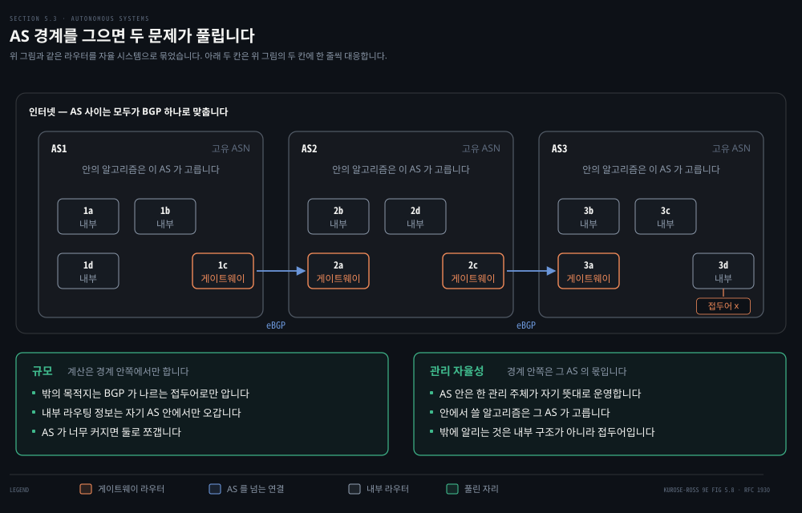
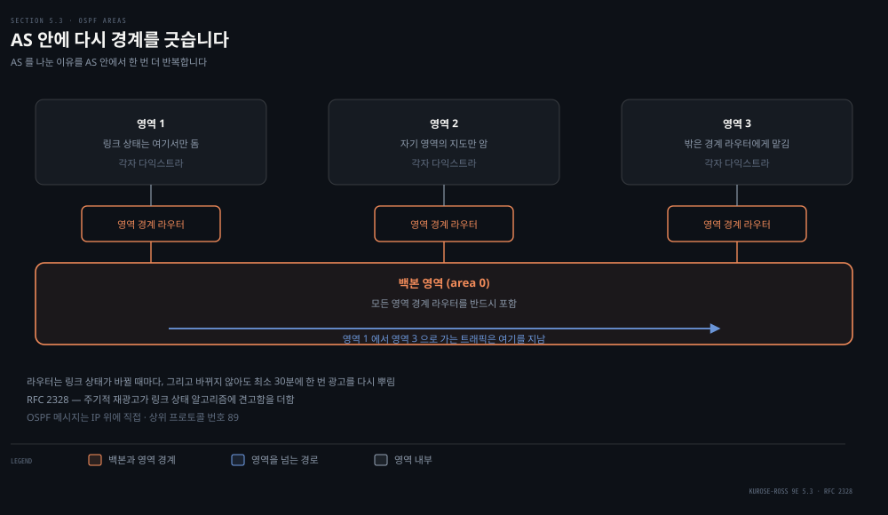
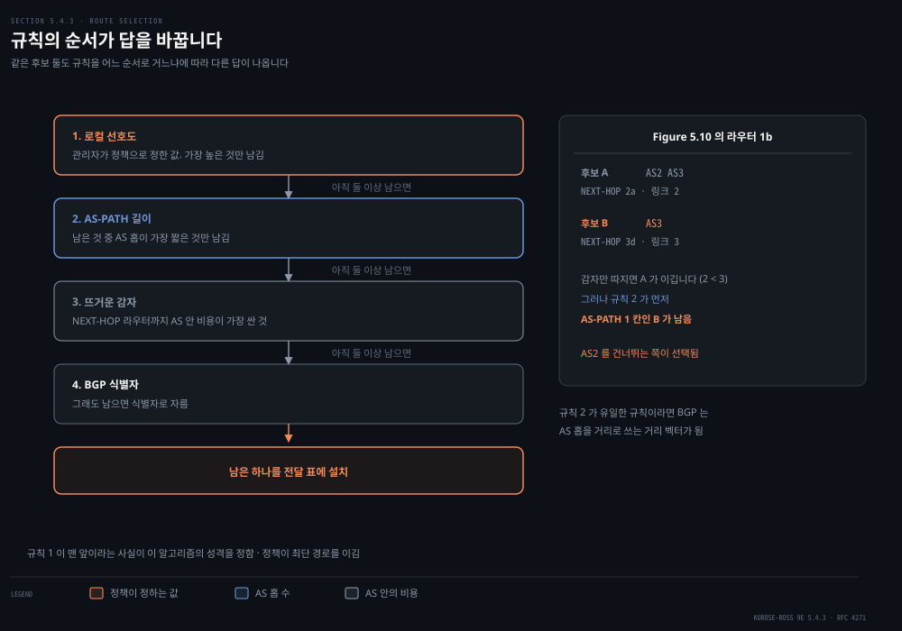
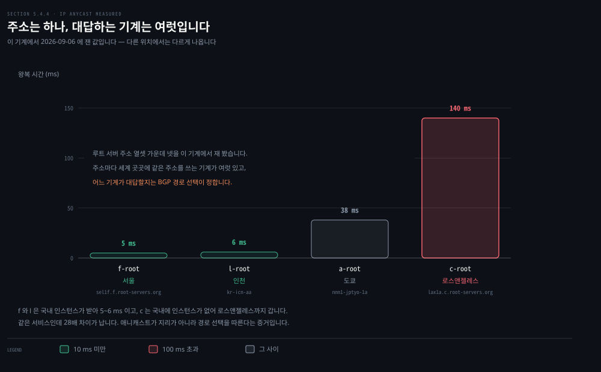
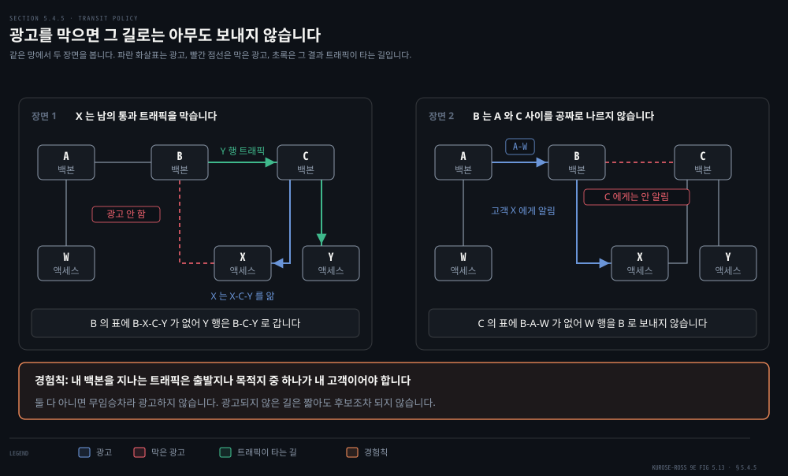

# AS 안과 AS 사이

---

> 앞 편의 알고리즘은 라우터를 모두 같은 것으로 봤습니다. 실제 인터넷은 그렇지 않습니다. 이 편은 경계를 하나 긋고, 그 안과 밖에서 전혀 다른 프로토콜이 도는 이유를 봅니다.

## 핵심 요약

> 이 편이 매달린 하나의 생각은 **AS 안에서는 성능이 목적이고 AS 사이에서는 정책이 목적이라, 같은 최소 비용 경로라는 말이 경계를 넘는 순간 의미를 잃는다**는 것입니다.

이 차이가 가장 또렷하게 드러나는 자리가 BGP 의 경로 선택 규칙입니다. 네 규칙의 순서가 이렇습니다.

1. 관리자가 정한 정책 값
2. AS 홉 수
3. 실제 거리
4. 그래도 안 갈리면 식별자

AS 안에서 다익스트라가 비용의 합만 보고 답을 내던 것과 정반대입니다.

같은 장에서 배우는 IP 애니캐스트가 이 성격을 그대로 보여 줍니다. 루트 DNS 서버 주소 열셋에 이 기계에서 질의를 보내 봤더니, 같은 서비스인데 응답한 기계가 서울·인천·도쿄·로스앤젤레스로 흩어졌고 왕복 시간이 5 ms 에서 140 ms 까지 벌어졌습니다. **어느 기계가 대답할지는 지도가 아니라 BGP 의 경로 선택이 정합니다.**


## 학습 목표

> 이 편을 읽고 나면 아래 다섯 가지를 스스로 해낼 수 있습니다.

1. 라우터를 자율 시스템으로 묶는 두 가지 이유를 말하고, 그 경계가 왜 프로토콜의 경계와 같은지 설명합니다.
2. OSPF 가 링크 상태 알고리즘을 어떤 방식으로 구현하는지 말하고, 영역과 백본이 무엇을 해결하는지 설명합니다.
3. eBGP 와 iBGP 의 역할을 구분하고, AS-PATH 가 언제 길어지는지 말할 수 있습니다.
4. BGP 경로 선택의 네 규칙을 순서대로 적고, 순서가 결과를 어떻게 바꾸는지 예로 보일 수 있습니다.
5. IP 애니캐스트가 무엇에 기대어 동작하는지 말하고, CDN 이 왜 쓰지 않는지 설명합니다.


## 1. 라우터를 무리로 묶는 이유

> 앞 편은 세상의 모든 라우터가 같은 알고리즘을 돌리고 서로를 안다고 가정했습니다. 라우터가 수억 개일 때도 그 가정이 성립할까요.



성립하지 않습니다. 원문이 이유를 둘로 나눕니다.

- **규모**: 라우터가 많아지면 라우팅 정보를 주고받고 계산하고 저장하는 비용이 감당되지 않습니다. 오늘날 인터넷의 라우터는 수억 개입니다. 모든 목적지의 정보를 각 라우터에 저장하려면 막대한 메모리가 들고, 연결과 링크 비용의 변화를 그 전부에게 브로드캐스트하는 부담도 큽니다. 그만한 수의 라우터 사이에서 도는 거리 벡터는 수렴하지 못합니다.
- **관리 자율성**: 인터넷은 ISP 의 망입니다. ISP 는 자기 망을 자기 뜻대로 운영하고 싶어 하고, 어떤 라우팅 알고리즘을 쓸지도 스스로 정하고 싶어 하며, 내부 구조를 밖에서 못 보게 하고 싶어 합니다.

두 문제를 한 번에 푸는 것이 **자율 시스템(AS)** 입니다. 같은 관리 주체 아래 있는 라우터의 무리를 말합니다. 전 세계에서 유일한 자율 시스템 번호(ASN)로 식별되며, ASN 은 IP 주소처럼 지역 인터넷 등록기관이 할당합니다.

> **용어 주의**: 원문은 *"AS numbers, like IP addresses, are assigned by **ICANN** regional registries"* 라 적습니다(346쪽). 등록기관의 소속이 실제와 다릅니다. RFC 7020 §3 은 이 계층이 *"rooted in the Internet Assigned Numbers Authority (IANA) address allocation function, which serves a set of 'Regional Internet Registries' (RIRs)"* 라 적고, 같은 절이 *"IANA is a role, not an organization"* 이라고 못 박습니다. IANA 는 역할이고 지금 그 역할을 ICANN 이 맡고 있을 뿐, RIR 다섯 곳은 ICANN 산하가 아닙니다. 순서는 IANA 가 RIR 에 할당하고 RIR 이 사업자에 배정하는 것입니다.

ISP 하나가 통째로 AS 하나가 되는 경우가 흔합니다. 다만 티어-1 ISP 중에는 망 전체를 거대한 AS 하나로 두는 곳도 있고 수십 개로 쪼개는 곳도 있습니다.

경계를 그으면 프로토콜도 갈립니다. 같은 AS 안의 라우터는 모두 같은 라우팅 알고리즘을 돌리고 서로의 정보를 갖는데, 이때 도는 것을 **AS 내부 라우팅 프로토콜**이라 합니다. AS 를 넘을 때는 다른 것이 필요합니다. AS 안팎에서 라우터의 역할도 갈립니다.

- **게이트웨이 라우터**: AS 의 가장자리에 있으면서 다른 AS 의 라우터에 직접 연결된 라우터입니다.
- **내부 라우터**: 자기 AS 안의 호스트와 라우터에만 연결된 라우터입니다.


## 2. AS 안에서는 지도를 공유합니다

> AS 안이라면 모두가 한 주인 아래 있습니다. 그러면 앞 편의 두 알고리즘 중 어느 쪽을 쓰는 편이 나을까요.



인터넷의 AS 내부 라우팅에 널리 쓰이는 것은 **OSPF** 와 그 사촌인 IS-IS 입니다. 이름의 Open 은 명세가 공개돼 있다는 뜻이고, 시스코의 EIGRP 가 20년 가까이 독점 프로토콜이었다가 최근에야 공개된 것과 대비됩니다. 최신판인 버전 2 는 RFC 2328 에 정의돼 있습니다.

OSPF 는 링크 상태 프로토콜입니다. 링크 상태 정보를 뿌리고 다익스트라를 돌립니다. 각 라우터가 AS 전체의 위상 지도를 구성하고, 자기를 뿌리로 하는 최단 경로 트리를 모든 서브넷에 대해 계산합니다. 앞 편에서 손으로 돌린 그 알고리즘이 그대로 여기에 있습니다.

브로드캐스트의 범위가 거리 벡터와 다릅니다. **OSPF 라우터는 이웃이 아니라 AS 안의 모든 라우터에게 링크 상태를 알립니다.** 링크의 비용이나 상태가 바뀔 때마다 알리고, 바뀌지 않아도 최소 30분에 한 번은 다시 알립니다. RFC 2328 은 이 주기적 재광고가 링크 상태 알고리즘에 견고함을 더한다고 적습니다.

OSPF 메시지는 IP 위에 직접 실리고 상위 프로토콜 번호는 89 입니다. TCP 도 UDP 도 쓰지 않는다는 뜻이라, **신뢰성 있는 메시지 전달과 링크 상태 브로드캐스트를 OSPF 가 직접 구현해야 합니다.** HELLO 메시지로 링크가 살아 있는지 확인하고, 이웃 라우터의 링크 상태 데이터베이스를 통째로 받아 오는 기능도 갖습니다.

링크 비용은 관리자가 설정합니다. OSPF 는 비용을 어떻게 정할지에 대한 정책을 강제하지 않고 **주어진 비용에서 최소 비용 경로를 찾는 장치만 제공합니다.** 모두 1 로 두면 홉 수 최소가 되고, 용량에 반비례하게 두면 좁은 링크를 피하게 됩니다.

여기에 원문이 곁상자로 붙인 이야기가 재미있습니다. 실무에서는 **원인과 결과가 뒤집힙니다.** 교과서에서는 비용이 먼저 있고 그 결과로 경로가 나옵니다. 그런데 운영자가 진입점과 진출점 사이의 트래픽 흐름을 알고 있고 링크 최대 이용률을 낮추고 싶다면, 원하는 경로가 먼저 정해져 있고 **그 경로가 나오게 만드는 비용 집합을 거꾸로 찾아야** 합니다. OSPF 를 돌리는 운영자에게 손잡이는 링크 비용뿐이기 때문입니다.

원문이 꼽는 OSPF 의 진전은 넷입니다.

- **보안**: 라우터 사이의 교환을 인증할 수 있습니다. 기본값은 인증이 없어 위조가 가능하고, 단순 인증은 평문 암호를 넣는 방식이라 안전하지 않으며, MD5 인증은 공유 비밀 키로 해시를 계산해 붙입니다. 재전송 공격을 막으려고 순서 번호도 함께 씁니다.
- **같은 비용 경로 여럿**: 목적지까지 비용이 같은 경로가 여럿이면 하나만 고르지 않고 여럿을 함께 쓸 수 있습니다.
- **유니캐스트와 멀티캐스트 통합**: MOSPF 가 기존 링크 데이터베이스를 그대로 쓰고 새 링크 상태 광고 유형을 더합니다.
- **AS 안의 계층**: AS 를 **영역**으로 나눌 수 있습니다.

마지막 항목이 1절의 이야기를 한 겹 안으로 되풀이합니다.

- **영역**: 각자 자기 영역의 링크 상태 알고리즘을 돌립니다. 광고도 그 영역 안에서만 돕니다.
- **영역 경계 라우터**: 영역마다 하나 이상 두며, 영역 밖으로 나가는 패킷을 맡습니다.
- **백본 영역**: AS 안의 정확히 한 영역이 여기로 지정됩니다. 다른 영역 사이의 트래픽을 나르는 것이 주 임무이고, AS 안의 모든 영역 경계 라우터를 반드시 포함합니다.

영역을 넘는 경로는 세 단계입니다. 먼저 영역 안 라우팅으로 경계 라우터까지 가고, 백본을 지나 목적지 영역의 경계 라우터에 닿은 뒤, 마지막으로 그 영역 안에서 목적지까지 갑니다.


## 3. AS 를 넘으려면 광고가 먼저 건너가야 합니다

> AS 안의 목적지는 OSPF 가 채웁니다. 그러면 AS 밖의 목적지는 전달 표에 어떻게 들어갈까요.


여기서 **BGP** 가 나섭니다. AS 사이 라우팅 프로토콜은 여러 AS 의 협조가 필요하므로 서로 같은 것을 써야 하고, 실제로 인터넷의 모든 AS 가 BGP 하나를 씁니다. 원문은 BGP 를 두고 인터넷의 모든 프로토콜 중 가장 중요하다고 말할 만하며 겨룰 상대는 IP 정도라고 적습니다. 수천 개 ISP 를 하나로 붙이는 접착제이기 때문입니다.

BGP 가 나르는 것은 주소가 아니라 **CIDR 로 표기한 접두어**입니다. 예를 들어 `138.16.68.0/22` 는 주소 1,024개를 담습니다. 그래서 전달 표의 항목은 `(접두어, 인터페이스 번호)` 꼴이 됩니다. BGP 가 각 라우터에 해 주는 일은 둘입니다.

- **이웃 AS 로부터 접두어 도달 정보를 얻습니다.** BGP 는 각 서브넷이 자기 존재를 인터넷 전체에 알리게 해 줍니다. 원문의 표현대로 서브넷이 "나 여기 있다"고 외치면 BGP 가 모든 라우터에 그 사실을 전합니다. BGP 가 없으면 각 서브넷은 아무도 모르고 닿을 수 없는 외딴섬이 됩니다.
- **그중 가장 좋은 경로를 정합니다.** 한 접두어에 여러 경로를 알게 되면 라우터가 스스로 경로 선택 절차를 돌립니다.

전파의 실제 모습은 조금 더 구체적입니다. AS 가 메시지를 보내는 것이 아니라 **라우터가 보냅니다.** 라우터 쌍이 포트 179 위의 반영구적 TCP 연결로 라우팅 정보를 주고받습니다. 이 연결과 그 위의 모든 메시지를 통틀어 BGP 연결이라 부릅니다.

- **eBGP**: 두 AS 를 잇는 연결입니다.
- **iBGP**: 같은 AS 안 라우터 사이의 연결입니다.

흔한 구성에서는 AS 안 모든 라우터 쌍이 각각 연결을 갖는 TCP 그물이 만들어집니다. **iBGP 연결이 물리 링크와 일치하지는 않습니다.**

AS3 의 접두어 x 가 AS1 까지 가는 과정을 따라가면 이렇습니다.

1. 게이트웨이 3a 가 게이트웨이 2c 에게 eBGP 로 "AS3 x" 를 보냅니다.
2. 2c 가 AS2 안의 다른 모든 라우터에게 iBGP 로 같은 "AS3 x" 를 보냅니다. 게이트웨이 2a 도 이때 받습니다.
3. 2a 가 게이트웨이 1c 에게 eBGP 로 "AS2 AS3 x" 를 보냅니다. AS2 를 지나왔으므로 경로가 한 칸 길어졌습니다.
4. 1c 가 AS1 안의 모든 라우터에게 iBGP 로 "AS2 AS3 x" 를 보냅니다.

**AS 를 넘을 때만 경로가 길어집니다.** iBGP 로 도는 동안에는 그대로입니다. AS-PATH 의 길이가 라우터 홉이 아니라 AS 홉을 세는 이유가 여기 있습니다.

실제 망에서는 한 목적지에 이르는 길이 여럿입니다. 원문은 Figure 5.8 에 1d 와 3d 를 잇는 물리 링크를 하나 더해 Figure 5.10 을 만드는데, 그러면 AS1 에서 x 로 가는 길이 둘이 됩니다. 1c 를 지나는 "AS2 AS3" 와 1d 를 지나는 "AS3" 입니다.

> **원문 정오**: 뒤쪽 경로를 원문은 *"another that uses the AS-PATH **"A3"**"* 라 적습니다(351쪽). 같은 문장의 앞부분이 `"AS2 AS3"` 라 제대로 적고 있으므로 여기서 나와야 하는 것은 `"AS3"` 입니다. `A3` 라는 표기는 이 책 어디에도 정의된 적이 없습니다.


## 4. 여러 길 중 하나를 고르는 규칙

> 길이 여럿이면 골라야 합니다. 인터넷의 라우터는 한 접두어에 대해 수십 개의 경로를 받는 일이 흔합니다.



고르기 전에 어휘가 둘 더 필요합니다. 접두어를 BGP 연결로 광고할 때는 여러 **속성**이 함께 실리고, 접두어와 속성을 묶어 **경로(route)** 라 부릅니다.

- **AS-PATH**: 광고가 지나온 AS 의 목록입니다. 접두어가 어떤 AS 에 전달되면 그 AS 가 자기 ASN 을 목록에 더합니다. **라우터가 자기 AS 를 목록 안에서 발견하면 그 광고를 버립니다.** 이것이 BGP 의 루프 차단 장치입니다.
- **NEXT-HOP**: AS-PATH 를 시작하는 라우터 인터페이스의 IP 주소입니다. 이 주소는 내 AS 에 속하지 않지만, 그 주소를 담은 서브넷은 내 AS 에 직접 붙어 있습니다.

NEXT-HOP 이 AS 사이 프로토콜과 AS 안 프로토콜을 잇는 다리입니다. 앞 절의 예에서 AS1 의 각 라우터가 아는 경로 둘은 이렇게 적힙니다.

```bash
2a 의 가장 왼쪽 인터페이스 주소 ; AS2 AS3 ; x
3d 의 가장 왼쪽 인터페이스 주소 ; AS3     ; x
```

가장 단순한 선택 방식이 **뜨거운 감자 라우팅**입니다. 후보 중에서 그 경로를 시작하는 NEXT-HOP 라우터까지의 AS 안 비용이 가장 싼 것을 고릅니다. 라우터 1b 는 AS 안 라우팅 정보를 뒤져 2a 까지의 최소 비용과 3d 까지의 최소 비용을 각각 구하고, 더 작은 쪽을 택합니다. 비용을 지나는 링크 수로 정하면 1b 에서 2a 까지가 2, 3d 까지가 3 이라 2a 가 선택됩니다.

> **원문 정오**: 이 대목에서 원문은 *"1b 에서 라우터 **2d** 까지의 최소 비용이 3"* 이라 적습니다. 바로 앞 문장이 비교 대상을 2a 와 **3d** 라고 못 박았으므로 여기서 나와야 하는 것은 3d 입니다. Figure 5.10 에 2d 라는 라우터가 실제로 있고 1b 에서 그곳까지의 링크 수도 마침 3 이라, 숫자만 보면 어긋나지 않아 눈에 잘 걸리지 않습니다. 결론인 2a 선택도 바뀌지 않습니다. 그래서 더 조용히 지나가는 오기입니다.

이름의 뜻은 그대로입니다. 손에 든 감자가 뜨거우니 남에게 빨리 넘기듯, 자기 AS 밖의 비용은 생각하지 않고 **일단 자기 AS 에서 빨리 내보내려는** 방식입니다. 원문이 이기적인 알고리즘이라 부릅니다. 같은 AS 안의 두 라우터가 같은 접두어에 대해 서로 다른 AS 경로를 고를 수도 있습니다.

실제 BGP 는 뜨거운 감자를 품되 더 복잡합니다. 후보가 둘 이상이면 아래 규칙을 차례로 적용해 하나만 남을 때까지 제거합니다.

1. **로컬 선호도**가 가장 높은 것만 남깁니다. 이 값은 라우터가 정했거나 같은 AS 안의 다른 라우터에게서 배운 것이고, **값을 정하는 것은 전적으로 그 AS 관리자의 정책 결정**입니다.
2. 남은 것 중 **AS-PATH 가 가장 짧은** 것만 남깁니다.
3. 남은 것 중 **뜨거운 감자**, 즉 NEXT-HOP 라우터가 가장 가까운 것을 고릅니다.
4. 그래도 남으면 BGP 식별자로 자릅니다.

순서가 결과를 바꿉니다. 라우터 1b 는 감자만 따지면 AS2 를 지나는 쪽을 골랐을 텐데, **규칙 2 가 규칙 3 보다 먼저이므로 AS-PATH 가 짧은 쪽, 즉 AS2 를 건너뛰는 경로가 선택됩니다.** 이 순서 덕분에 BGP 는 이기적인 알고리즘이 아니게 되고, 짧은 AS 경로를 먼저 찾음으로써 종단 간 지연을 줄일 가능성이 커집니다.

규칙 2 가 유일한 규칙이라면 BGP 는 AS 홉 수를 거리로 쓰는 거리 벡터가 됩니다. **규칙 1 이 그 앞에 있다는 사실이 BGP 의 성격을 정합니다.** 티어-1 ISP 라우터에서 뽑은 BGP 표는 흔히 경로가 50만 개를 넘습니다.


## 5. 같은 주소를 여럿이 나눠 씁니다

> 같은 내용을 여러 나라의 서버에 복제해 두었을 때, 사용자를 가장 가까운 서버로 보내려면 무엇이 필요할까요.



BGP 의 경로 선택이 그 일을 해 줍니다. **IP 애니캐스트**는 여러 서버에 **같은 IP 주소**를 주고 각 서버에서 그 주소를 BGP 로 광고하는 방식입니다. BGP 라우터는 같은 주소에 대한 광고 여럿을 받으면 그것을 한 장소로 가는 여러 경로라고 여기고, 경로 선택 알고리즘으로 가장 좋은 하나를 고릅니다. 실제로는 서로 다른 장소인데도 그렇게 취급합니다.

이 기계에서 실제로 확인했습니다. 루트 DNS 서버 주소는 열셋이고, 각 주소에 질의를 보내 어떤 물리 인스턴스가 대답하는지 물었습니다.

```bash
dig +short . NS | wc -l                                   # 13
dig +short @f.root-servers.net hostname.bind CH TXT       # "sel1f.f.root-servers.org"
dig +short @l.root-servers.net hostname.bind CH TXT       # "kr-icn-aa"
dig +short @a.root-servers.net hostname.bind CH TXT       # "nnn1-jptyo-1a"
dig +short @c.root-servers.net hostname.bind CH TXT       # "lax1a.c.root-servers.org"
```

**주소는 하나인데 대답한 기계가 서울, 인천, 도쿄, 로스앤젤레스로 흩어집니다.** 왕복 시간도 그만큼 갈렸습니다. f 가 5 ms, l 이 6 ms, a 가 38 ms, c 가 140 ms 입니다. 국내에 인스턴스가 있는 f 와 l 은 즉시 대답하고, 국내에 인스턴스가 없는 c 는 태평양을 건넙니다. **28배 차이가 나는데, 그 차이를 만드는 것은 지리가 아니라 BGP 가 고른 경로입니다.**

원문은 CDN 이 애니캐스트를 쓰는 예로 설명을 시작하지만, 곧 실제로는 **CDN 이 대체로 쓰지 않는다**고 덧붙입니다. BGP 라우팅이 바뀌면 같은 TCP 연결의 패킷들이 서로 다른 웹 서버 인스턴스에 도착할 수 있기 때문입니다. 연결 상태를 갖는 서비스와는 잘 맞지 않습니다.

반면 DNS 는 이 방식을 널리 씁니다. 질의 하나가 응답 하나로 끝나므로 어느 인스턴스가 받아도 상관없습니다. 위의 측정이 그 사실을 그대로 보여 줍니다.


## 6. 정책이 최단 경로를 이깁니다

> 라우터가 길을 고를 때, 더 짧은 길을 두고 더 긴 길을 택하는 일이 왜 생길까요.



경로 선택 규칙의 맨 앞이 로컬 선호도이고 그 값은 정책이 정하기 때문입니다. 원문은 AS 여섯 개로 상황을 만듭니다. A·B·C 는 백본 제공자이고 W·X·Y 는 액세스 ISP 입니다. 액세스 ISP 로 들어오는 모든 트래픽은 그 망이 목적지여야 하고, 나가는 모든 트래픽은 그 망에서 출발해야 합니다.

X 는 제공자 둘에 동시에 붙은 **다중 접속** 액세스 ISP 입니다. 그렇다면 X 가 B 와 C 사이의 통과 트래픽을 나르는 일을 어떻게 막을까요. 답은 단순합니다. **X 가 자기 말고는 어디로도 가는 길이 없다고 광고하면 됩니다.** X 는 X-C-Y 경로를 알고 있어도 그것을 B 에게 알리지 않습니다. B 는 X 에게 Y 로 가는 길이 있다는 사실을 모르므로 Y 행 트래픽을 X 로 보내지 않습니다. **광고하지 않는 것이 곧 정책의 집행입니다.**

제공자 쪽도 같은 계산을 합니다. B 가 A 에게서 "A 를 지나 W 로 가는 길"을 배웠다고 합시다. B 는 이 경로를 자기 고객 X 에게 알리고 싶어 합니다. 그런데 C 에게도 알려야 할까요. 알리면 C 가 B 를 거쳐 W 로 트래픽을 보낼 텐데, A 와 C 사이의 통과 트래픽을 B 가 자기 비용으로 나를 이유가 없습니다.

백본 ISP 사이의 라우팅을 규율하는 공식 표준은 없습니다. 다만 상용 ISP 들이 따르는 경험칙이 있습니다.

> 어떤 ISP 의 백본을 지나는 트래픽은 그 ISP 의 고객인 망을 **출발지나 목적지 중 하나로(또는 둘 다로)** 가져야 합니다. 그렇지 않으면 그 트래픽은 ISP 의 망을 공짜로 타는 셈입니다.

조건이 합집합이라는 점이 중요합니다. 둘 다 내 고객일 필요는 없고 하나면 됩니다. 그 합집합 바깥이 무임승차이고, 그래서 광고하지 않습니다. 개별 피어링 협약은 ISP 쌍 사이에서 협상되며 대체로 비공개입니다.

원문은 여기서 한 걸음 물러나 근본적인 질문을 던집니다. **AS 사이와 AS 안에 왜 서로 다른 프로토콜을 쓰는가.** 답이 셋입니다.

- **정책**: AS 사이에서는 정책이 지배합니다. 내 트래픽이 특정 AS 를 지나지 않게 하거나, 내가 나를 통과 트래픽을 통제하는 일이 중요합니다. AS 안에서는 모두가 명목상 같은 관리 아래 있으므로 정책의 비중이 훨씬 작습니다.
- **규모**: AS 사이 라우팅에서는 많은 망을 감당하는 확장성이 결정적입니다. AS 안에서는 덜 문제인데, ISP 가 너무 커지면 AS 둘로 쪼개면 되기 때문입니다. OSPF 의 영역도 같은 처방입니다.
- **성능**: AS 사이 라우팅은 정책 중심이라 경로의 품질이 부차적입니다. **AS 사이에는 AS 홉 수 말고는 비용이라는 개념 자체가 없습니다.** AS 안에서는 정책 걱정이 적으니 성능에 집중할 수 있습니다.

마지막으로 원문은 이 장의 조각들을 모아 하나의 이야기를 만듭니다. 회사를 차려 웹 서버를 세상에 내놓으려면 무엇이 필요한가.

1. 지역 ISP 와 계약해 물리적 연결과 `/24` 같은 주소 범위를 받습니다.
2. 등록기관과 계약해 도메인 이름을 받습니다.
3. 등록기관에 내 DNS 서버의 IP 주소를 알려 `.com` 최상위 도메인 서버에 항목이 생기게 합니다.
4. 내 DNS 서버에 웹 서버 이름과 주소의 대응을 넣습니다.

그런데 여기서 한 걸음이 더 남습니다. 앨리스가 내 웹 서버의 IP 주소로 데이터그램을 보내면 그것이 여러 AS 의 라우터를 거치는데, **그 라우터들이 내 `/24` 접두어의 존재를 알아야** 전달 표를 뒤져 내보낼 포트를 정할 수 있습니다. 어떻게 알게 될까요. 내가 지역 ISP 와 계약해 접두어를 받으면 그 ISP 가 BGP 로 자기 이웃들에게 광고하고, 그 이웃들이 다시 전파합니다. **결국 인터넷의 모든 라우터가 내 접두어를 알게 됩니다.** 웹에 존재를 갖는다는 말의 마지막 한 조각이 BGP 입니다.


## AS 안과 밖 치트시트

| 축 | AS 안 (OSPF) | AS 사이 (BGP) |
|----|-------------|--------------|
| 목적 | 성능 | 정책 |
| 알고리즘 | 링크 상태 · 다익스트라 | 거리 벡터 계열 · 경로 선택 규칙 |
| 알리는 범위 | AS 안 모든 라우터 (브로드캐스트) | BGP 이웃 (eBGP · iBGP) |
| 나르는 단위 | 링크 상태 | 접두어와 속성, 곧 경로 |
| 전송 | IP 위에 직접 · 프로토콜 번호 89 | TCP 포트 179 |
| 비용 개념 | 관리자가 정한 링크 비용 | AS 홉 수 말고는 없음 |
| 루프 차단 | 지도를 갖고 계산하므로 자연히 방지 | AS-PATH 에 내 ASN 이 보이면 폐기 |
| 계층 | 영역과 백본 영역 | 고객·제공자 관계 |

기억할 값과 표현은 이렇습니다.

- **ASN**: 자율 시스템 번호로, 지역 인터넷 등록기관이 할당합니다. 그 위에서 IANA 역할이 RIR 에 대역을 할당합니다.
- **프로토콜 번호 89**: OSPF 가 IP 위에 직접 실릴 때 쓰는 번호입니다.
- **30분**: OSPF 가 변화가 없어도 링크 상태를 다시 광고하는 최대 주기입니다.
- **TCP 179**: BGP 연결이 쓰는 포트입니다.
- **eBGP · iBGP**: AS 를 넘는 연결과 AS 안의 연결입니다. AS-PATH 는 eBGP 를 건널 때만 길어집니다.
- **AS-PATH · NEXT-HOP**: 각각 지나온 AS 의 목록과 그 경로를 시작하는 인터페이스의 IP 주소입니다.
- **뜨거운 감자**: NEXT-HOP 까지의 AS 안 비용이 가장 싼 경로를 고르는 방식입니다.
- **50만**: 티어-1 ISP 라우터의 BGP 표가 흔히 넘는 경로 수입니다.


## 심화 학습

**OSPF 비용 설정의 역방향 문제**는 곁상자로 짧게 지나가지만 실무의 무게가 큽니다. 운영자가 원하는 것은 대개 "최대 링크 이용률을 낮추는 것" 같은 트래픽 공학 목표입니다. 그런데 OSPF 를 쓰는 한 손잡이는 링크 비용뿐이라, **원하는 흐름을 먼저 정해 놓고 그 흐름이 나오게 하는 비용 집합을 역으로 찾아야** 합니다. 앞 편에서 부하를 비용에 넣으면 진동한다고 배웠는데, 여기서는 부하가 아니라 **예측된 흐름**을 근거로 비용을 미리 정합니다. 부하 민감이 아니면서 부하를 고려하는 방법인 셈입니다.

**iBGP 그물이 왜 필요한가**는 처음 보면 낭비처럼 보입니다. AS 안에는 이미 OSPF 가 도는데 BGP 연결을 또 만들기 때문입니다. 그러나 둘이 나르는 것이 다릅니다. OSPF 는 AS 안의 링크 상태를 나르고, iBGP 는 **AS 밖에서 배운 접두어와 그 속성**을 나릅니다. 게이트웨이 하나가 eBGP 로 받은 경로를 내부 라우터들이 알 방법은 iBGP 말고 없습니다. 그래서 iBGP 연결은 물리 링크와 무관합니다. AS 안 라우터 쌍마다 하나씩 놓이는 그물이 됩니다.

**애니캐스트는 무상태 프로토콜의 특권**입니다. 원문이 CDN 은 대체로 쓰지 않고 DNS 는 널리 쓴다고 갈라 적는 이유가 여기 있습니다. BGP 경로가 바뀌면 같은 목적지 주소로 가던 패킷이 다른 물리 기계에 도착하는데, TCP 연결은 그 순간 깨집니다. **질의 하나에 응답 하나로 끝나는 DNS 는 아무 문제가 없습니다.** 3장에서 배운 연결 상태라는 개념이 5장의 주소 배정 방식을 제약하는 셈입니다.

**규칙 1 과 규칙 2 사이의 긴장**도 곱씹을 만합니다. 규칙 2 만 있으면 BGP 는 AS 홉으로 재는 거리 벡터이고, 앞 편에서 본 대로 거리 벡터는 오염이 번지고 수렴이 느립니다. 규칙 1 은 그 위에 사람이 정한 값을 얹어 알고리즘의 판단을 덮습니다. **인터넷의 경로가 최단이 아닌 것은 버그가 아니라 설계입니다.** 성능이 목적이 아닌 자리에서 성능을 기대하면 오해가 생깁니다.


## 면접 대비

**한 줄 정의**: AS 는 같은 관리 주체 아래 놓인 라우터의 무리이고, 그 안은 성능을 목적으로 하는 OSPF 가, 그 사이는 정책을 목적으로 하는 BGP 가 맡습니다.

**핵심 포인트 세 가지**

1. **AS 는 규모와 자율성을 함께 푸는 경계입니다.** 라우터 수억 개의 정보를 모두가 갖는 것이 불가능하고, ISP 는 내부를 숨기고 자기 뜻대로 운영하고 싶어 합니다. 경계 하나가 둘을 해결합니다.
2. **AS-PATH 는 eBGP 를 건널 때만 길어집니다.** iBGP 로 AS 안을 도는 동안에는 그대로입니다. 그래서 AS-PATH 의 길이는 AS 홉 수이고, 라우터 홉 수가 아닙니다.
3. **경로 선택은 정책·AS 홉·거리 순입니다.** 로컬 선호도가 맨 앞이라 정책이 최단 경로를 이깁니다. 뜨거운 감자는 세 번째라서, 뜨거운 감자만 따지면 나왔을 답과 실제 답이 다를 수 있습니다.

**자주 묻는 질문**

- *OSPF 는 왜 TCP 를 쓰지 않습니까?* IP 위에 직접 실리고 프로토콜 번호는 89 입니다. 대신 신뢰성 있는 전달과 브로드캐스트를 OSPF 가 스스로 구현합니다.
- *eBGP 와 iBGP 의 차이는 무엇입니까?* 연결이 AS 를 넘으면 eBGP, 같은 AS 안이면 iBGP 입니다. 프로토콜은 같고 역할이 다릅니다. AS-PATH 는 eBGP 에서만 길어집니다.
- *BGP 는 루프를 어떻게 막습니까?* AS-PATH 목록 안에 자기 AS 가 보이면 그 광고를 버립니다.
- *애니캐스트를 CDN 이 왜 잘 안 씁니까?* BGP 경로가 바뀌면 같은 TCP 연결의 패킷이 다른 인스턴스에 도착할 수 있습니다. DNS 는 질의와 응답이 한 번씩이라 문제가 없습니다.
- *OSPF 영역은 무엇을 해결합니까?* 링크 상태 브로드캐스트의 범위를 영역 안으로 줄입니다. AS 를 나눈 것과 같은 이유를 AS 안에서 되풀이합니다.


## 핵심 개념 체크리스트

- [ ] AS 로 묶는 두 가지 이유를 각각 한 문장으로 말할 수 있습니다.
- [ ] 게이트웨이 라우터와 내부 라우터를 구분할 수 있습니다.
- [ ] OSPF 가 링크 상태를 누구에게 얼마나 자주 알리는지 말할 수 있습니다.
- [ ] OSPF 가 IP 위에 직접 실리는 결과로 무엇을 스스로 구현해야 하는지 설명할 수 있습니다.
- [ ] 링크 비용 설정에서 원인과 결과가 뒤집히는 실무 상황을 설명할 수 있습니다.
- [ ] 영역과 백본 영역의 역할을 구분하고 영역 간 경로의 세 단계를 말할 수 있습니다.
- [ ] BGP 가 나르는 단위가 주소가 아니라 접두어인 이유를 말할 수 있습니다.
- [ ] eBGP 와 iBGP 를 구분하고 AS-PATH 가 언제 길어지는지 설명할 수 있습니다.
- [ ] AS-PATH 와 NEXT-HOP 이 각각 무엇인지, NEXT-HOP 이 왜 다리 역할인지 말할 수 있습니다.
- [ ] 뜨거운 감자 라우팅이 이기적이라 불리는 이유를 설명할 수 있습니다.
- [ ] 경로 선택 네 규칙을 순서대로 적고 순서가 결과를 바꾸는 예를 들 수 있습니다.
- [ ] IP 애니캐스트가 BGP 의 무엇에 기대는지, DNS 와 CDN 에서 왜 갈리는지 말할 수 있습니다.
- [ ] 통과 트래픽의 경험칙을 집합 조건으로 말할 수 있습니다.
- [ ] AS 안팎에 다른 프로토콜을 쓰는 세 가지 이유를 들 수 있습니다.


## 관련 문서

- [5장 길은 어떻게 계산되는가](./05-01.길은%20어떻게%20계산되는가.md) — OSPF 가 쓰는 다익스트라와 BGP 가 닮은 거리 벡터를 여기서 먼저 봅니다.
- [4장 IP — 데이터그램과 주소](./04-03.IP%20—%20데이터그램과%20주소.md) — BGP 가 나르는 CIDR 접두어와 주소 집합이 여기서 나옵니다.
- [이 책의 지도](./README.md) — 장별 목표와 진행 상태입니다.


## 참고 자료

- 《Computer Networking A Top-Down Approach》 9판, Kurose·Ross, Pearson.
  - §5.3 Intra-AS Routing in the Internet: OSPF — 책 345–348쪽
  - §5.4 Routing Among the ISPs: BGP — 책 348–359쪽
- OSPF 버전 2 명세: [RFC 2328](https://www.rfc-editor.org/rfc/rfc2328.txt). 자율 시스템 번호: [RFC 1930](https://www.rfc-editor.org/rfc/rfc1930.txt). BGP-4: [RFC 4271](https://www.rfc-editor.org/rfc/rfc4271.txt).
- 5절의 왕복 시간과 인스턴스 이름은 2026-09-06 에 이 기계에서 `dig` 로 측정한 값입니다. 측정 위치가 다르면 다른 값이 나옵니다.
