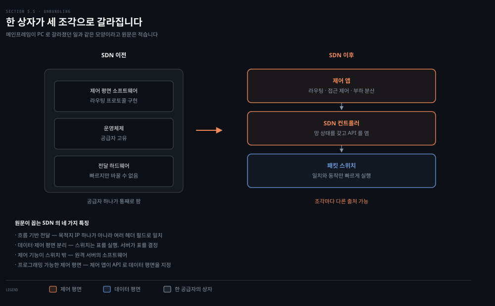
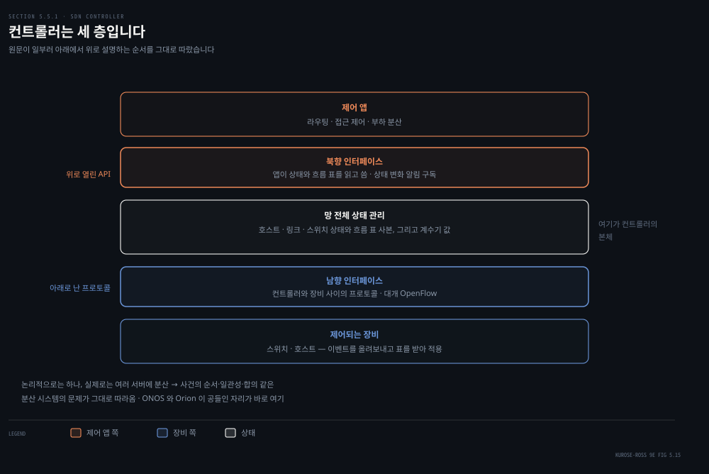
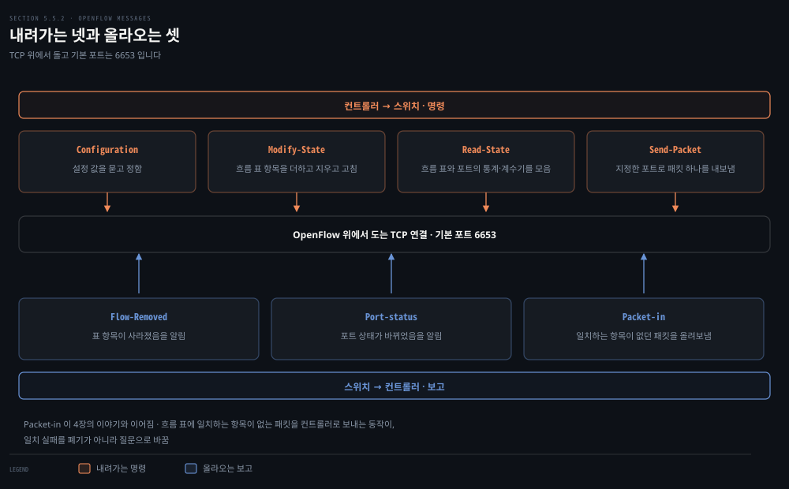
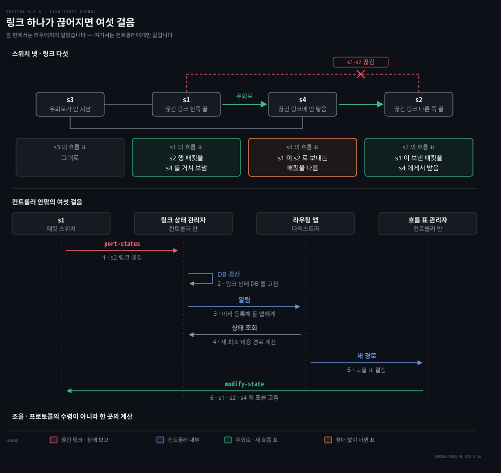
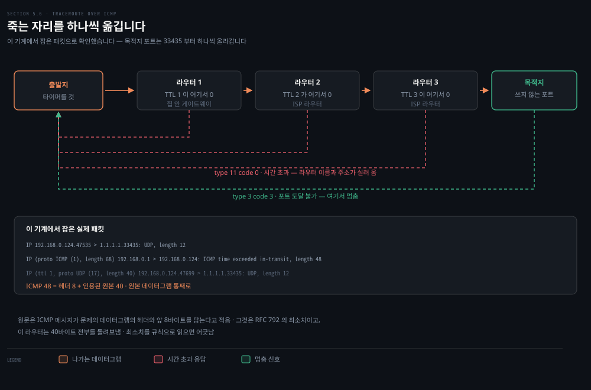
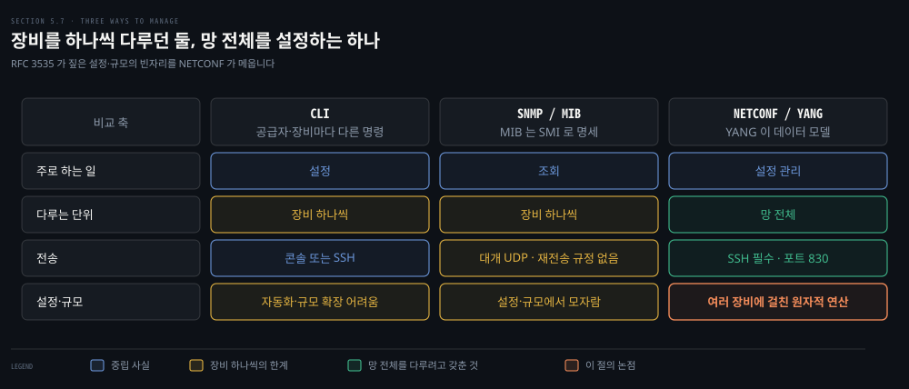

# 제어를 밖으로 빼고 망을 들여다봅니다

---

> 앞의 두 편은 라우터가 서로 이야기해 표를 채우는 세계였습니다. 이 편은 그 대화를 걷어내고 한곳에서 계산해 내려보내는 세계, 그리고 망이 자기 사정을 사람에게 알리는 방법을 봅니다.

## 핵심 요약

> 이 편이 매달린 하나의 생각은 **제어를 상자 밖으로 꺼내면 바꾸기가 쉬워지는 대신 컨트롤러 자체가 분산 시스템 문제가 되고, 그래서 망을 들여다보는 도구가 함께 중요해진다**는 것입니다.

앞 편에서 링크 하나가 끊어지면 라우터들이 광고를 뿌리고 각자 다시 계산해 서서히 수렴했습니다. SDN 에서는 스위치가 컨트롤러에게만 알리고, 컨트롤러 안의 앱이 한 번 계산해 관련된 스위치 셋의 표를 한꺼번에 고칩니다. **조율이 프로토콜의 수렴이 아니라 한 곳의 계산이 됩니다.**

들여다보는 쪽도 같은 편에 있습니다. 이 기계에서 `traceroute` 를 돌리며 패킷을 잡아 보니 원문의 설명이 그대로 보였습니다. TTL 을 1 부터 올린 UDP 데이터그램이 나가고, 각 라우터가 ICMP 시간 초과를 돌려보냅니다. 다만 한 가지가 원문과 달랐습니다.

```bash
IP (proto ICMP (1), length 68) ... ICMP time exceeded in-transit, length 48
    IP (ttl 1, proto UDP (17), length 40) ...
```

ICMP 메시지 48바이트는 헤더 8 에 **원본 데이터그램 40바이트 전부**를 더한 값입니다. 원문은 "헤더와 앞 8바이트"라고 적는데, 그것은 RFC 792 의 최소치이고 실제 라우터는 더 많이 담아 보냅니다.


## 학습 목표

> 이 편을 읽고 나면 아래 다섯 가지를 스스로 해낼 수 있습니다.

1. SDN 아키텍처의 네 가지 특징을 말하고, 그것이 왜 번들 해체로 불리는지 설명합니다.
2. SDN 컨트롤러의 세 층을 아래에서 위로 짚고, 남향과 북향 인터페이스가 각각 무엇을 나르는지 말합니다.
3. OpenFlow 메시지를 방향별로 나누고, Packet-in 이 4장의 어느 이야기와 이어지는지 설명합니다.
4. ICMP 가 IP 위 어디에 놓이는지 말하고, traceroute 가 ICMP 를 어떻게 쓰는지 단계로 풀 수 있습니다.
5. CLI, SNMP/MIB, NETCONF/YANG 을 대상 범위와 쓰임으로 갈라 놓을 수 있습니다.


## 1. 제어를 상자 밖으로 꺼내면

> 앞의 두 편에서 라우터는 스스로 판단하는 주체였습니다. 그 판단을 통째로 다른 기계에 맡기면 무엇이 달라질까요.



원문이 SDN 아키텍처의 특징을 넷으로 꼽습니다.

- **흐름 기반 전달**: 전달을 트랜스포트·네트워크·링크 계층 헤더의 여러 필드로 결정합니다. 4장에서 본 OpenFlow 1.0 이 헤더 필드 11개로 일치를 겁니다. 앞의 두 편에서 IP 데이터그램의 전달이 **오직 목적지 IP 주소** 하나로 결정되던 것과 날카롭게 갈립니다.
- **데이터 평면과 제어 평면의 분리**: 데이터 평면은 흐름 표의 일치와 동작 규칙을 실행하는, 비교적 단순하지만 빠른 스위치들입니다. 제어 평면은 그 표를 정하고 관리하는 서버와 소프트웨어입니다.
- **제어 기능이 스위치 밖에**: 제어 평면 소프트웨어가 스위치와 **구분되고 떨어진** 서버에서 돕니다. 제어 평면은 다시 SDN 컨트롤러와 제어 앱 묶음으로 나뉩니다.
- **프로그래밍 가능한 제어 평면**: 제어 앱이 컨트롤러가 제공하는 API 로 데이터 평면을 지정합니다. 라우팅 앱은 다익스트라를 돌려 종단 간 경로를 정하고, 다른 앱은 접근 제어를, 또 다른 앱은 서버 부하 분산을 합니다.

여기서 원문이 쓰는 말이 **번들 해체(unbundling)** 입니다. SDN 이전의 스위치와 라우터는 데이터 평면과 제어 평면 소프트웨어와 프로토콜 구현이 한 상자에 수직 통합돼 한 공급자가 팔았습니다. SDN 은 그것을 데이터 평면 스위치, 컨트롤러, 제어 앱 셋으로 나누고 **각각을 다른 곳에서 조달할 수 있게** 합니다.

원문은 이 변화를 메인프레임이 PC 로 갈라진 일에 견줍니다. 하드웨어와 시스템 소프트웨어와 애플리케이션을 한 회사가 대던 시절이 셋으로 갈리자 세 영역 모두에서 혁신이 터져 나왔다는 것입니다. **SDN 에 거는 기대도 같은 모양입니다.**

그림을 보고 나면 질문이 따라옵니다. 흐름 표는 어디서 어떻게 계산됩니까. 링크가 끊어지는 것 같은 사건에 표가 어떻게 반응합니까. 여러 스위치의 표가 어떻게 서로 어긋나지 않게 맞춰집니까. **이 셋에 답하는 것이 제어 평면의 일입니다.**


## 2. 컨트롤러 안에는 세 층이 있습니다

> 컨트롤러가 표를 계산해 내려보낸다고 했습니다. 그러려면 컨트롤러 안에 무엇이 있어야 할까요.



원문은 이 물음에 원리부터 답합니다. 컨트롤러가 반드시 갖춰야 할 기능을 따져 보면 구조가 저절로 나오고, 실제 구현들이 그 구조를 닮았다는 것입니다. 설명 순서도 일부러 아래에서 위로 갑니다.

- **통신 계층**: 컨트롤러와 제어 대상 장비 사이에 정보를 나르는 프로토콜입니다. 장비는 자기가 겪은 일을 컨트롤러에 알려야 합니다. 링크가 오르내렸다거나, 장비가 방금 망에 붙었다거나, 살아 있다는 심장 박동 같은 것입니다. 이 사건들이 컨트롤러에 최신 망 상태를 줍니다. 이 경계를 **남향 인터페이스**라 부르고, 여기서 도는 대표적인 프로토콜이 OpenFlow 입니다.
- **망 전체 상태 관리 계층**: 호스트·링크·스위치를 비롯한 제어 대상 장비의 최신 상태입니다. 스위치 흐름 표의 계수기 값도 여기에 들어오고, 컨트롤러가 흐름 표의 사본을 들고 있기도 합니다.
- **제어 앱 인터페이스 계층**: 앱과 이야기하는 **북향 인터페이스**입니다. 앱이 망 상태와 흐름 표를 읽고 쓸 수 있게 하고, 상태 변화 사건에 대한 알림을 구독하게 해 줍니다. 널리 쓰이는 컨트롤러 둘은 REST 요청-응답 방식으로 앱과 이야기합니다.

여기서 다시 "논리적으로 중앙"이라는 말이 나옵니다. 밖에서 보면 하나의 서비스이지만, 실제 구현은 장애 대비와 가용성과 성능 때문에 **여러 서버로 흩어집니다.** 그러면 컨트롤러 내부 동작의 의미를 따로 따져야 합니다. 사건의 논리적 시간 순서, 일관성, 합의 같은 것들입니다. **분산 시스템의 문제가 그대로 따라옵니다.** ONOS 와 ORION 이 공을 들인 자리가 여기입니다.

원문이 곁상자로 두 컨트롤러를 소개합니다. **ONOS** 는 오픈 네트워킹 재단이 만들어 배포하는 오픈소스 컨트롤러이고, 특징은 **의도 프레임워크**입니다. 앱이 "호스트 A 와 B 를 연결하라" 또는 "A 와 B 가 통신하지 못하게 하라" 같은 높은 수준의 요구를 그것이 어떻게 이루어지는지 몰라도 낼 수 있게 합니다. 상태는 여러 서버에 복제된 분산 코어가 들고 있습니다.

> **지금은 다릅니다**: 오픈 네트워킹 재단은 2023년 12월 14일 발표로 해산했습니다. 발표문은 *"As a result of this merger, ONF will be dissolved, transferring all operations to LF"* 라 적고 포트폴리오가 리눅스 재단 아래 독립 프로젝트로 옮겨 간다고 밝힙니다. 다만 그 발표문이 이름을 댄 것은 SEBA·VOLTHA·Aether·SD-Core·SD-RAN·P4·SD-Fabric·Stratum 이고 **ONOS 는 한 번도 나오지 않습니다.** ONOS 의 관리 주체가 어디로 갔는지는 이 문서만으로 말할 수 없습니다. 어긋난 것은 원문이 현재형으로 적은 "재단이 만들어 배포한다" 하나입니다.

**ORION** 은 구글이 자기 데이터센터 망과 그것들을 잇는 전 세계 WAN 을 제어하는 2세대 SDN 플랫폼입니다. 구글 망을 도메인으로 나누고 도메인마다 컨트롤러 인스턴스를 두는데, **장애의 범위와 영향을 일부러 제한하려는** 설계입니다. 핵심에는 논리적으로 중앙인 데이터 저장소 NIB(Network Information Base)가 있고, 발행과 구독으로 앱과 코어 구성요소가 읽고 쓰며 변화 알림을 받습니다. 논리적으로 중앙인 저장소는 **망 사건에 전역 순서를 매길 수 있다**는 이점이 있어 디버깅에 크게 도움이 됩니다. 만든 사람들의 말로는 NIB 가 가장 성공적인 설계 요소 중 하나였습니다.

> **원문 정오**: 같은 문단이 *"Orion **MIB** 는 초당 약 백만 건의 읽기·쓰기 사건을 처리할 수 있다"* 라고 적습니다. 문단 전체가 NIB 를 설명하고 있고 바로 앞 문장이 NIB 를 인용하므로 여기서 나와야 하는 것은 NIB 입니다. Config Manager 를 설명하는 대목에서도 *"MIB 표에 설정 파라미터 속성을 지정한다"* 라고 적는데 Figure 5.18 의 그 상자는 NIB 입니다. 하필 MIB 는 이 장의 §5.7 에서 다른 뜻으로 쓰이는 진짜 용어라 더 헷갈립니다.

> **원문 정오**: 같은 곁상자가 *"Figure **7.18** 의 가운데에 Orion SDN 코어가 있다"* 라고 두 번 적습니다. 한 문장 앞에서 스스로 "Figure 5.18 이 Orion 의 개괄을 보여 준다"고 적었고, 캡션도 Figure 5.18 입니다. 7장에는 Orion 그림이 없습니다.

ORION 이 여는 접근을 원문은 **의도 기반 네트워킹**이라 부릅니다. 망을 그 상태로 만들기 위한 변경 절차를 지시하는 것이 아니라 **원하는 최종 상태를 서술**하는 방식입니다. 의도는 위에서 아래로 전파되며 오래 안정적으로 남고, 망 상태와 그것을 의도에 맞추는 변경은 아래에서 위로 빠르게 오갑니다.


## 3. OpenFlow 가 나르는 메시지

> 남향 인터페이스에서 실제로 오가는 것이 무엇인지 보면 컨트롤러가 스위치에 무엇까지 할 수 있는지가 드러납니다.



OpenFlow 는 컨트롤러와 OpenFlow API 를 구현한 스위치 사이에서 돕니다. **TCP 위에서 돌고 기본 포트 번호는 6653** 입니다. 컨트롤러에서 스위치로 내려가는 중요한 메시지가 넷입니다.

- **Configuration**: 스위치의 설정 파라미터를 묻고 정합니다.
- **Modify-State**: 흐름 표 항목을 더하거나 지우거나 고치고, 포트 속성을 정합니다.
- **Read-State**: 흐름 표와 포트에서 통계와 계수기 값을 모읍니다.
- **Send-Packet**: 지정한 포트로 특정 패킷 하나를 내보냅니다. 보낼 패킷 자체가 메시지의 적재량에 실립니다.

스위치에서 컨트롤러로 올라가는 것 가운데 원문이 꼽는 메시지는 셋입니다.

- **Flow-Removed**: 흐름 표 항목이 사라졌음을 알립니다. 시간이 다 됐거나 Modify-State 를 받은 결과입니다.
- **Port-status**: 포트 상태가 바뀌었음을 알립니다.
- **Packet-in**: 어느 흐름 표 항목과도 일치하지 않은 패킷을 컨트롤러로 올려보냅니다. 일치한 패킷도 동작으로 지정하면 올라갈 수 있습니다.

> **노트의 읽기**: 두 목록 모두 원문이 *"Among the important messages"*, *"Among the messages"* 라 열어 둔 **부분 목록**입니다. 넷과 셋은 OpenFlow 가 정의한 메시지의 전부가 아니라 원문이 고른 수입니다. 프로토콜 명세는 이보다 많은 종류를 정의하므로, 이 일곱을 완전한 목록으로 외우지 않는 편이 좋습니다.

> **지금은 다릅니다**: 6653 은 원문이 맞게 적었지만 처음부터 그 번호였던 것은 아닙니다. 같은 문단이 함께 언급하는 OpenFlow 1.0 명세(ONF TS-001, 2009년 12월 31일) §4.4 는 컨트롤러 서버가 *"located by default on TCP port 6633"* 이라 적습니다. IANA 가 `openflow` 라는 이름으로 6653 을 등록한 것은 2013년 7월 18일이고, 6633/tcp 는 지금 레지스트리에 그냥 `Reserved` 로 남아 있습니다. 1.0 시절 자료나 옛 실습 환경에서 6633 을 만나면 오타가 아닙니다.

마지막 것이 4장의 이야기와 이어집니다. 4장에서 **동작이 없는 항목이 곧 폐기**라고 배웠는데, 일치하는 항목이 아예 없을 때는 폐기가 아니라 컨트롤러에게 묻습니다. **일치 실패를 폐기가 아니라 질문으로 바꾸는 장치**가 Packet-in 입니다. 이 하나 때문에 스위치는 자기가 모르는 트래픽을 만나도 규칙을 새로 배울 수 있습니다.


## 4. 링크 하나가 끊어지면

> 앞 편에서는 라우터들이 서로 알리고 각자 계산해 서서히 맞춰졌습니다. 컨트롤러가 있으면 같은 사건이 어떻게 흐를까요.



원문이 예로 드는 상황은 단순합니다. 스위치 s1 과 s2 사이 링크가 끊어집니다. 최단 경로 라우팅이 도는 중이고, s1·s3·s4 의 흐름 규칙이 영향을 받습니다. s2 의 동작은 그대로입니다. 앞 편과 다른 점이 둘입니다.

- **다익스트라가 패킷 스위치 밖의 별도 앱으로 돕니다.**
- **스위치는 서로가 아니라 컨트롤러에게만 링크 갱신을 보냅니다.**

흐름은 여섯 걸음입니다.

1. s1 이 링크 장애를 겪고 OpenFlow **port-status** 메시지로 컨트롤러에 알립니다.
2. 컨트롤러가 그 메시지를 받아 링크 상태 관리자에 넘기고, 관리자가 링크 상태 데이터베이스를 갱신합니다.
3. 링크 상태 라우팅을 구현한 제어 앱은 링크 상태가 바뀌면 알려 달라고 **미리 등록해 두었으므로** 알림을 받습니다.
4. 라우팅 앱이 링크 상태 관리자에게서 갱신된 상태를 받고, 상태 관리 계층의 다른 구성요소도 필요하면 참조해 새 최소 비용 경로를 계산합니다.
5. 라우팅 앱이 흐름 표 관리자와 이야기해 어떤 표를 고칠지 정합니다.
6. 흐름 표 관리자가 OpenFlow 로 영향받는 스위치들의 흐름 표 항목을 갱신합니다.

여섯 번째가 핵심입니다. 고쳐지는 것은 s1 뿐이 아닙니다.

- **s1**: 이제 s2 행 패킷을 s4 를 거쳐 보냅니다.
- **s2**: s1 이 보낸 패킷을 s4 에게서 받기 시작합니다.
- **s4**: s1 이 s2 로 보내는 패킷을 날라야 합니다.

**s2 는 아무 일도 겪지 않았는데 표가 바뀝니다.** 한 곳에서 계산하니 세 스위치가 한꺼번에 맞춰집니다.

원문이 이 예에서 끌어내는 결론은 **바꾸기가 쉬워졌다**는 것입니다. 컨트롤러가 흐름 표를 마음대로 다듬을 수 있으므로, 최소 비용 경로 대신 손으로 다듬은 방식으로 옮겨 가는 일이 제어 앱 소프트웨어만 바꾸면 됩니다. 라우터별 제어에서는 **여러 공급자에게서 산 모든 라우터의 소프트웨어를** 바꿔야 했던 일입니다.

SDN 의 뿌리는 생각보다 오래됐습니다. 인터넷의 조상인 ARPAnet 은 일부러 분산된 프로토콜 기반 제어를 택했습니다. 그런데 1970년대 초의 다른 두 망은 중앙 제어와 데이터·제어 평면의 분리를 온전히 받아들였습니다. TYMNET I 은 중앙 컨트롤러를 두고 **제어용 트리 망을 물리적으로 따로** 깔았습니다. AT&T 의 Spider 망도 제어 메시지 전용 가상 회선을 두었습니다. 2004년에는 여러 연구가 데이터 평면과 제어 평면의 분리를 나란히 주장했습니다.

지금 모습에 가장 가까운 것은 Ethane 프로젝트입니다. 일치와 동작 흐름 표를 가진 단순한 이더넷 스위치들, 흐름 승인과 라우팅을 관리하는 중앙 컨트롤러, 일치하지 않은 패킷을 컨트롤러로 올려보내는 방식을 함께 제안했습니다. **2007년에 이미 300대가 넘는 Ethane 스위치가 돌고 있었고**, 이것이 곧 OpenFlow 프로젝트가 됩니다.


## 5. 망이 자기 사정을 알리는 법

> 패킷이 목적지에 닿지 못했을 때, 보낸 쪽은 그 사실을 어떻게 알게 될까요.



**ICMP** 가 그 일을 합니다. 호스트와 라우터가 네트워크 계층 정보를 서로 주고받는 데 쓰이고, 가장 흔한 쓰임은 오류 보고입니다. 웹을 쓰다 만나는 "목적지 망에 도달할 수 없음" 같은 메시지의 출처가 여기입니다. 어느 라우터가 목적지로 가는 길을 찾지 못해 ICMP 메시지를 만들어 보낸 것입니다.

자리를 정확히 잡아야 합니다. **ICMP 는 흔히 IP 의 일부로 여겨지지만 구조상으로는 IP 바로 위에 있습니다.** ICMP 메시지가 IP 데이터그램 안에 실려 나르기 때문입니다. TCP 나 UDP 세그먼트가 IP 적재량으로 실리는 것과 같습니다. 호스트가 상위 프로토콜 번호 1 인 데이터그램을 받으면 그 내용을 ICMP 로 역다중화합니다.

ICMP 메시지는 타입과 코드 필드를 갖고, 그 메시지를 만들게 한 IP 데이터그램의 헤더와 앞 8바이트를 담습니다. 보낸 쪽이 어느 데이터그램이 문제였는지 알아내기 위해서입니다.

`ping` 은 타입 8 코드 0 을 보내고 상대는 타입 0 코드 0 으로 답합니다. 이 기계에서 잡아 보니 그대로였습니다.

```bash
ICMP echo request
ICMP echo reply
```

`traceroute` 쪽이 더 재미있습니다. 원문의 설명은 이렇습니다. 출발지가 목적지로 평범한 IP 데이터그램을 잇달아 보내는데, 각각 **쓰이지 않을 법한 UDP 포트 번호**를 담은 UDP 세그먼트를 나릅니다. 첫 번째는 TTL 이 1, 두 번째는 2, 세 번째는 3 입니다. n 번째 데이터그램이 n 번째 라우터에 닿으면 TTL 이 막 만료돼 라우터가 그것을 버리고, 대개 **타입 11 코드 0** 경고를 출발지로 보냅니다. 이 메시지에 라우터의 이름과 IP 주소가 실려 있습니다.

멈추는 방법도 같은 얼개입니다. TTL 을 계속 올리다 보면 언젠가 데이터그램이 목적지 호스트까지 갑니다. 담긴 UDP 세그먼트의 포트가 쓰이지 않는 번호이므로 목적지는 **타입 3 코드 3**, 포트 도달 불가를 돌려보냅니다. 그것을 받으면 더 보낼 필요가 없음을 압니다.

이 기계에서 그대로 확인했습니다.

```bash
IP 192.168.0.124.47535 > 1.1.1.1.33435: UDP, length 12
IP 192.168.0.1 > 192.168.0.124: ICMP time exceeded in-transit, length 48
IP 192.168.0.124.47535 > 1.1.1.1.33436: UDP, length 12
```

목적지 포트가 33435 에서 하나씩 올라가는 것이 보입니다. 이 기계의 `man traceroute` 가 적은 기본 base 포트가 33434 이니 첫 탐침이 33435 입니다. 원문이 "쓰이지 않을 법한 포트"라 부른 그 번호대입니다.

홉마다가 아니라 **탐침마다** 오르는 이유도 원문에 있습니다. 표준 traceroute 는 같은 TTL 로 패킷을 세 개씩 묶어 보내고, 그래서 출력이 TTL 하나당 세 값을 냅니다(370쪽). 포트는 그 세 번에도 각각 하나씩 오릅니다.

> **노트의 읽기**: 인용되는 양이 원문의 서술과 다릅니다. 잡은 ICMP 메시지의 길이는 48바이트인데, ICMP 헤더 8 에 인용된 원본 40 을 더한 값입니다. 원본 UDP 데이터그램이 IP 헤더 20 에 UDP 헤더 8 에 데이터 12 로 딱 40 이니, **이 라우터는 원본을 통째로 돌려보냈습니다.** 원문의 "헤더와 앞 8바이트"는 RFC 792 가 정한 최소치이고, RFC 1812 는 576바이트를 넘지 않는 선에서 가능한 한 많이 담으라고 권합니다. 최소치를 규칙으로 읽으면 실제와 어긋납니다.

IPv6 용 ICMP 는 RFC 4443 에 따로 정의됐습니다. 기존 타입과 코드를 재정리하면서 IPv6 가 필요로 하는 것들을 더했는데, 4장에서 본 **"패킷이 너무 큼"** 타입과 "알 수 없는 IPv6 옵션" 오류 코드가 그것입니다.


## 6. 망을 운영한다는 것

> 장비가 수백 수천 개일 때, 그것들이 지금 어떤 상태인지 알고 설정을 바꾸는 일을 어떻게 합니까.



원문이 인용하는 정의는 길지만 범위를 잘 보여 줍니다. 망 관리란 **하드웨어와 소프트웨어와 사람을 배치하고 통합하고 조율해**, 실시간·운영·서비스 품질 요구를 합리적인 비용으로 만족시키도록 망과 자원을 감시·시험·조회·설정·분석·평가·제어하는 일입니다.

틀의 구성요소가 다섯입니다.

- **관리 서버**: 망 운영 센터의 중앙 관리 스테이션에서 도는 응용이고, 대개 사람이 함께 있습니다. 정보의 수집·처리·분석·전달을 통제합니다.
- **관리 대상 장비**: 호스트·라우터·스위치·미들박스·모뎀, 심지어 온도계까지 망에 붙은 장비입니다.
- **데이터**: 장비마다 갖는 상태입니다. 관리자가 명시적으로 지정한 **설정 데이터**, 장비가 돌면서 얻는 **운영 데이터**(예: OSPF 이웃 목록), 갱신되는 **장비 통계**(예: 인터페이스에서 버려진 패킷 수, 냉각 팬 속도)로 나뉩니다.
- **관리 에이전트**: 관리 대상 장비에서 도는 소프트웨어 프로세스로, 관리 서버의 명령에 따라 국소적인 조치를 합니다.
- **관리 프로토콜**: 관리 서버와 장비 사이에서 도는 프로토콜입니다.

마지막 항목에 원문이 미묘하지만 중요하다고 못 박는 구분이 있습니다. **관리 프로토콜 자체가 망을 관리하는 것이 아닙니다.** 그것은 관리자가 망을 관리할 때 쓰는 능력을 제공할 뿐입니다.

실무에서 쓰는 방식은 셋입니다.

- **CLI**: 장비에 직접 명령을 칩니다. 콘솔에서 치거나 SSH 로 붙어 스크립트로 돌립니다. 공급자와 장비마다 달라 난해하고, 오류가 나기 쉬우며, 자동화와 규모 확장이 어렵습니다.
- **SNMP/MIB**: 장비의 MIB 객체에 담긴 데이터를 SNMP 로 읽고 씁니다. 어떤 MIB 는 장비·공급자 고유이고, 어떤 MIB 는 장비에 무관해 추상을 제공합니다. 운영자는 대개 **이 방식으로 조회하고 CLI 로 설정합니다.**
- **NETCONF/YANG**: 더 추상적이고 망 전체를 보는 방식이며, **설정 관리에 훨씬 무게를 둡니다.** 정확성 제약을 명시하고 여러 장비에 걸친 원자적 관리 연산을 제공합니다.

앞의 둘은 **장비를 하나씩 다룹니다.** 2002년 인터넷 아키텍처 위원회의 워크숍(RFC 3535)은 SNMP/MIB 가 장비 감시에는 값어치가 있지만 설정과 규모에서는 모자란다고 짚었고, 그 지적이 NETCONF 와 YANG 을 낳았습니다.

SNMP 쪽을 조금 더 봅니다. SNMPv3 는 응용 계층 프로토콜이고, 관리 서버가 요청을 보내면 에이전트가 처리해 답하는 요청-응답이 가장 흔한 쓰임입니다. 에이전트가 요청 없이 보내는 **트랩** 메시지도 있어, 링크가 오르내리는 것 같은 예외 상황을 알립니다. MIB 객체는 SMI 라는 데이터 기술 언어로 명세되는데, 원문이 이름만 봐서는 기능을 짐작할 수 없는 묘한 이름이라고 덧붙입니다.

전송 쪽에 곱씹을 대목이 있습니다. SNMP PDU 는 대개 **UDP 데이터그램의 적재량**에 실리고 RFC 3417 이 UDP 를 선호 매핑이라 적습니다. UDP 는 신뢰성이 없으므로 요청도 응답도 도착이 보장되지 않습니다. 그런데 SNMP 표준은 재전송 절차를 정하지 않았고, 재전송을 하는지조차 규정하지 않았습니다. 요구하는 것은 관리 서버가 재전송의 빈도와 지속에 관해 **"책임감 있게 행동해야 한다"** 는 것뿐입니다. 원문은 그러면 책임감 있는 프로토콜이란 어떻게 구는 것이냐고 되묻습니다.

> **노트의 읽기**: MIB 의 규모를 원문이 두 번 적는데 세는 단위가 다릅니다. 앞에서는 *"2024년 말 기준 MIB 관련 RFC 가 400개가 넘는다"* 라 하고, 뒤에서는 *"여러 RFC 에 400개가 넘는 MIB 모듈이 정의돼 있다"* 라 합니다. RFC 의 수와 모듈의 수는 다른 값입니다. 둘 다 400 언저리라고 적혀 있어 어느 쪽이 의도한 값인지 본문만으로는 가리기 어렵습니다.

> **원문 정오**: 뒤쪽 문장은 *"There are over 400 MIB modules defined in various **IETC** RFC's"* 라 적습니다(376쪽). 표준화 기구의 이름은 **IETF** 입니다. `IETC` 라는 기구는 없어서 그대로 찾아보면 아무것도 나오지 않습니다.

NETCONF 는 성격이 다릅니다. 관리 서버가 설정을 **구조화된 XML 문서**로 보내고 장비에서 활성화합니다. 원격 프로시저 호출 방식이라 메시지도 XML 이고, TCP 위 TLS 같은 안전한 연결 위에서 오갑니다. 세션은 안전한 연결을 맺고 서로의 능력을 `<hello>` 로 선언하며 시작합니다.

주요 연산은 이렇습니다.

- **`<get-config>`**: 설정의 전부 또는 일부를 가져옵니다.
- **`<get>`**: 설정 상태와 운영 상태를 함께 가져옵니다.
- **`<edit-config>`**: 지정한 설정을 바꿉니다. 실패하면 이전 상태로 되돌릴 수 있습니다.
- **`<lock>` · `<unlock>`**: 장비의 설정 저장소 전체를 잠그고 풉니다. 다른 NETCONF 나 SNMP 나 CLI 의 간섭 없이 바꾸기 위해서이고, 잠금은 짧게 쓰도록 의도됐습니다.
- **`<create-subscription>` · `<notification>`**: 관심 있는 사건의 알림을 구독합니다.

이 기본 연산들을 엮으면 여러 장비에 걸쳐 **한 덩어리로 성공하거나 전부 되돌려지는** 관리 트랜잭션을 만들 수 있습니다. RFC 3535 가 내놓은 운영자 요구, 곧 개별 장비가 아니라 망 전체의 설정에 집중하게 하라는 요구가 이렇게 구현됩니다.

> **원문 정오**: 원문은 *"세션은 `<session-close message>` 로 닫힌다"* 라고 적습니다. RFC 6241 §7.8 이 정의한 연산의 이름은 **`<close-session>`** 이고, `session-close` 라는 문자열은 RFC 전체에 한 번도 나오지 않습니다. 확인해 보니 RFC 6241 에 `close-session` 이 8번, 강제 종료용 `kill-session` 이 10번 나옵니다.

**YANG** 은 NETCONF 가 쓰는 관리 데이터의 구조와 문법과 의미를 정하는 데이터 모델링 언어입니다. SNMP 에서 SMI 가 MIB 를 명세하는 것과 같은 자리입니다. 내장 데이터 타입은 적지만 **유효한 설정이 만족해야 할 제약을 표현할 수 있어**, 설정이 정확성과 일관성 조건을 지키는지 돕습니다.


## 5장 치트시트

| 축 | 라우터별 제어 | SDN 제어 |
|----|-------------|---------|
| 계산 위치 | 모든 라우터 안 | 스위치 밖의 제어 앱 |
| 알리는 상대 | 서로 (브로드캐스트 또는 이웃) | 컨트롤러에게만 |
| 조율 방식 | 프로토콜이 시간을 들여 수렴 | 한 곳에서 계산해 한꺼번에 설치 |
| 전달 기준 | 목적지 IP 주소 하나 | 헤더 필드 11개까지 |
| 바꾸려면 | 모든 라우터의 소프트웨어 | 제어 앱 소프트웨어 |
| 대표 프로토콜 | OSPF · BGP | OpenFlow (TCP 6653) |

관리와 진단 쪽의 값과 표현은 이렇습니다.

- **프로토콜 번호 1**: IP 데이터그램이 ICMP 를 나를 때 쓰는 상위 프로토콜 번호입니다.
- **타입 8 코드 0 · 타입 0 코드 0**: ping 의 에코 요청과 에코 응답입니다.
- **타입 11 코드 0**: TTL 만료로 버렸음을 알리는 시간 초과입니다.
- **타입 3 코드 3**: 포트 도달 불가이고, traceroute 가 멈추는 신호입니다.
- **33434 + n**: macOS traceroute 의 기본 base 포트가 33434 이고(`man traceroute`), 첫 탐침이 33435 입니다. 탐침마다 하나씩 올라갑니다.
- **TCP 6653**: OpenFlow 의 기본 포트입니다.
- **SNMP 는 UDP**: RFC 3417 이 UDP 를 선호 매핑이라 적고, 재전송 절차는 정하지 않았습니다.
- **`<close-session>`**: NETCONF 세션을 정상 종료하는 연산입니다.


## 심화 학습

**의도 기반 네트워킹이 왜 SDN 위에서만 성립하는지**를 짚어 볼 만합니다. "무엇을"만 적고 "어떻게"를 맡기려면 그 "어떻게"를 계산할 자리와, 지금 상태를 전부 아는 자리가 필요합니다. 라우터별 제어에는 둘 다 없습니다. 각 라우터가 자기 부분만 알고 자기 부분만 정하므로 **망 전체를 대상으로 한 의도를 받아 낼 주체가 없습니다.** 컨트롤러가 망 전체 상태를 들고 있게 되자 비로소 의도를 받아 그것과 실제 상태의 차이를 좁히는 되먹임을 만들 수 있게 됐습니다.

**논리적 중앙이 만드는 새 문제**는 이 편에서 두 번 나옵니다. 5.1 에서 처음 나올 때는 장애 대비와 성능을 위한 구현 세부처럼 읽히는데, 5.5.1 에 오면 사건의 순서·일관성·합의가 걸린 본격적인 분산 시스템 문제가 됩니다. **제어를 한곳으로 모으면 조율 문제가 사라지는 것이 아니라 자리를 옮깁니다.** 라우터 사이에 있던 문제가 컨트롤러 서버 사이로 옮겨간 것이고, ORION 이 도메인으로 쪼개 장애 범위를 제한한 것도 그 문제를 다루는 한 방법입니다.

**ICMP 가 IP 위에 있다는 사실**이 실무에서 걸리는 자리가 있습니다. ICMP 메시지가 IP 데이터그램으로 실려 오므로, 경로 어딘가에서 ICMP 를 막으면 오류가 조용히 사라집니다. 그러면 traceroute 가 별표만 찍고, 경로 MTU 발견이 실패해 큰 패킷만 사라지는 증상이 생깁니다. **오류 보고 채널이 데이터 채널과 같은 길을 쓴다는 것**이 이 설계의 대가입니다.

**SNMP 가 UDP 를 쓰는 선택**도 곱씹을 만합니다. 관리 트래픽이 망을 더 막히게 하면 안 되고, 감시는 한 번 놓쳐도 다음 주기에 다시 물으면 되므로 가벼운 쪽이 합리적입니다. 문제는 그 논리가 **설정에는 통하지 않는다**는 것입니다. 설정을 반쯤 적용하고 응답을 잃으면 장비가 어떤 상태인지 알 수 없습니다. SNMP 로 조회만 하고 설정은 CLI 로 하던 실무 관행, 그리고 NETCONF 가 TLS 위 TCP 와 잠금과 원자적 트랜잭션을 들고 나온 이유가 여기서 만납니다.


## 면접 대비

**한 줄 정의**: SDN 제어 평면은 망 전체 상태를 들고 흐름 표를 계산해 내려보내는 논리적 중앙 서비스이고, ICMP 와 SNMP·NETCONF 는 그 망이 자기 사정을 알리고 사람이 그것을 바꾸는 통로입니다.

**핵심 포인트 세 가지**

1. **SDN 의 본질은 번들 해체입니다.** 데이터 평면 스위치, 컨트롤러, 제어 앱이 각각 다른 곳에서 올 수 있게 된 것이 변화의 실체이고, 흐름 기반 전달과 프로그래밍 가능성이 그것을 가능하게 합니다.
2. **조율 문제는 사라지지 않고 자리를 옮깁니다.** 라우터 사이의 수렴 문제가 컨트롤러 서버 사이의 일관성 문제가 됩니다. 논리적 중앙은 하나의 상자를 뜻하지 않습니다.
3. **ICMP 는 IP 위에 있습니다.** IP 데이터그램에 실려 다니므로 상위 프로토콜 번호 1 로 역다중화되고, 경로에서 막히면 오류가 조용히 사라집니다.

**자주 묻는 질문**

- *Packet-in 은 왜 필요합니까?* 흐름 표에 일치하는 항목이 없는 패킷을 폐기하지 않고 컨트롤러에 올려보내기 위해서입니다. 일치 실패를 질문으로 바꿔 규칙을 새로 배울 수 있게 합니다.
- *남향과 북향 인터페이스의 차이는 무엇입니까?* 남향은 컨트롤러와 장비 사이이고 대표적으로 OpenFlow 입니다. 북향은 컨트롤러와 제어 앱 사이이고 앱이 상태와 흐름 표를 읽고 씁니다.
- *traceroute 는 무엇을 보내고 무엇을 받습니까?* TTL 을 1 부터 올린 데이터그램에 쓰이지 않는 포트의 UDP 를 실어 보내고, 시간 초과(타입 11 코드 0)를 받다가 목적지의 포트 도달 불가(타입 3 코드 3)를 받으면 멈춥니다.
- *SNMP 와 NETCONF 를 언제 갈라 씁니까?* SNMP 는 장비를 하나씩 조회하는 데, NETCONF 는 망 전체를 원자적으로 설정하는 데 씁니다. RFC 3535 가 지적한 설정과 규모의 빈자리를 NETCONF 가 메웁니다.
- *SDN 에서 링크가 끊어지면 몇 곳의 표가 바뀝니까?* 장애를 겪은 스위치만이 아닙니다. 우회 경로에 놓인 스위치와 목적지 쪽 스위치의 표도 함께 바뀝니다.


## 핵심 개념 체크리스트

- [ ] SDN 아키텍처의 네 가지 특징을 각각 한 문장으로 말할 수 있습니다.
- [ ] 번들 해체가 무엇을 셋으로 나눈 것인지 설명할 수 있습니다.
- [ ] 컨트롤러의 세 층을 아래에서 위로 짚을 수 있습니다.
- [ ] 남향과 북향 인터페이스가 각각 무엇과 무엇을 잇는지 말할 수 있습니다.
- [ ] "논리적으로 중앙"이 만드는 분산 시스템 문제를 셋 이상 들 수 있습니다.
- [ ] OpenFlow 메시지를 방향별로 갈라 이름과 역할을 댈 수 있습니다.
- [ ] Packet-in 이 4장의 어떤 동작과 이어지는지 설명할 수 있습니다.
- [ ] 링크 실패 시나리오의 여섯 단계를 순서대로 말할 수 있습니다.
- [ ] s2 가 겪은 일이 없는데도 표가 바뀌는 이유를 설명할 수 있습니다.
- [ ] ICMP 가 IP 의 일부가 아니라 그 위에 있다는 말의 뜻을 풀 수 있습니다.
- [ ] ping 과 traceroute 가 쓰는 ICMP 타입과 코드를 댈 수 있습니다.
- [ ] traceroute 가 언제 멈추는지, 무엇을 받고 멈추는지 말할 수 있습니다.
- [ ] 망 관리 틀의 다섯 구성요소를 들 수 있습니다.
- [ ] CLI · SNMP/MIB · NETCONF/YANG 을 대상 범위와 쓰임으로 갈라 놓을 수 있습니다.
- [ ] SNMP 가 UDP 를 쓰는 이유와 그로 인한 한계를 설명할 수 있습니다.


## 관련 문서

- [5장 AS 안과 AS 사이](./05-02.AS%20안과%20AS%20사이.md) — 라우터별 제어의 완성형인 OSPF 와 BGP 를 여기서 봅니다.
- [4장 IPv6 와 일반화 포워딩](./04-04.IPv6%20와%20일반화%20포워딩.md) — 이 편의 흐름 표와 일치·동작 추상이 여기서 나옵니다.
- [이 책의 지도](./README.md) — 장별 목표와 진행 상태입니다.


## 참고 자료

- 《Computer Networking A Top-Down Approach》 9판, Kurose·Ross, Pearson.
  - §5.5 The SDN Control Plane — 책 359–369쪽
  - §5.6 ICMP — 책 369–371쪽
  - §5.7 Network Management and SNMP, NETCONF/YANG — 책 371–379쪽
- ICMP: [RFC 792](https://www.rfc-editor.org/rfc/rfc792.txt). IPv6 용 ICMP: [RFC 4443](https://www.rfc-editor.org/rfc/rfc4443.txt). 라우터 요구사항: [RFC 1812](https://www.rfc-editor.org/rfc/rfc1812.txt).
- NETCONF: [RFC 6241](https://www.rfc-editor.org/rfc/rfc6241.txt). YANG: [RFC 6020](https://www.rfc-editor.org/rfc/rfc6020.txt). 2002년 워크숍 보고: [RFC 3535](https://www.rfc-editor.org/rfc/rfc3535.txt).
- OpenFlow 1.0 명세: [ONF TS-001, Version 1.0.0 (2009-12-31)](https://opennetworking.org/wp-content/uploads/2013/04/openflow-spec-v1.0.0.pdf) §4.4 — 기본 포트 6633.
  6653 등록은 [IANA Service Name and Transport Protocol Port Number Registry](https://www.iana.org/assignments/service-names-port-numbers/service-names-port-numbers.xhtml) 의 `openflow` 항목(2013-07-18).
- 오픈 네트워킹 재단 해산: [Linux Foundation 보도자료 (2023-12-14)](https://www.linuxfoundation.org/press/onf-merges-market-leading-portfolio-of-networking-projects-into-linux-foundation).
- 5절의 패킷은 2026-09-06 에 이 기계에서 `tcpdump` 로 잡은 것입니다. 경로 중간의 ISP 라우터 주소는 적지 않았습니다.
