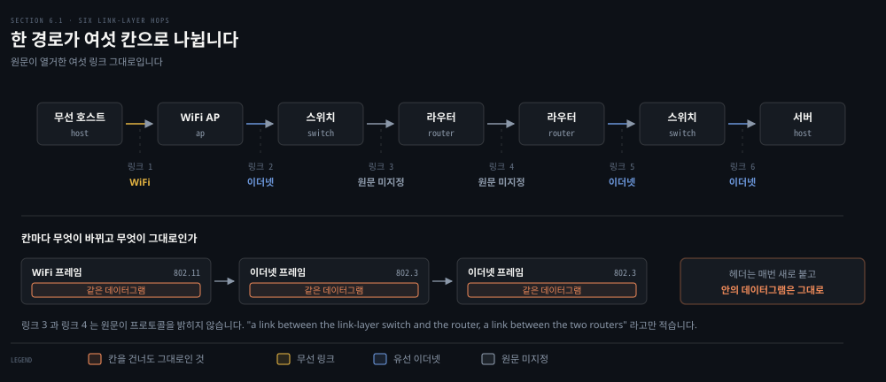
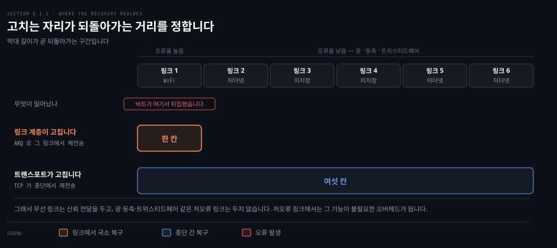
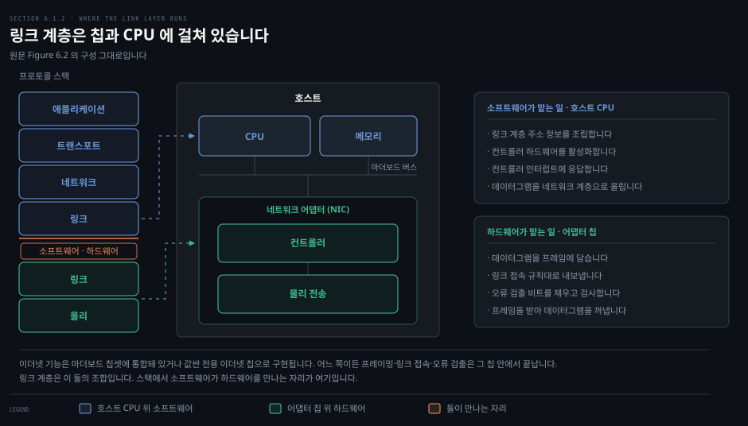
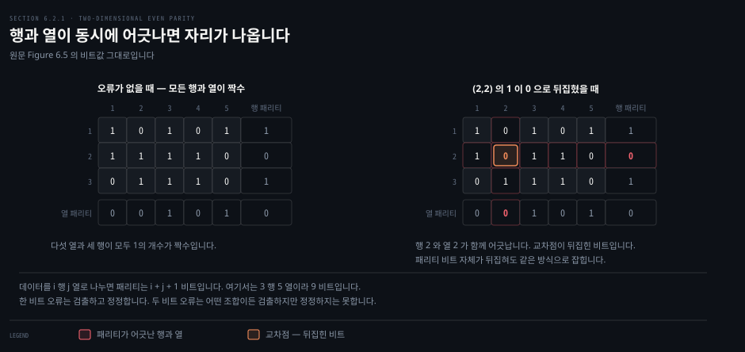
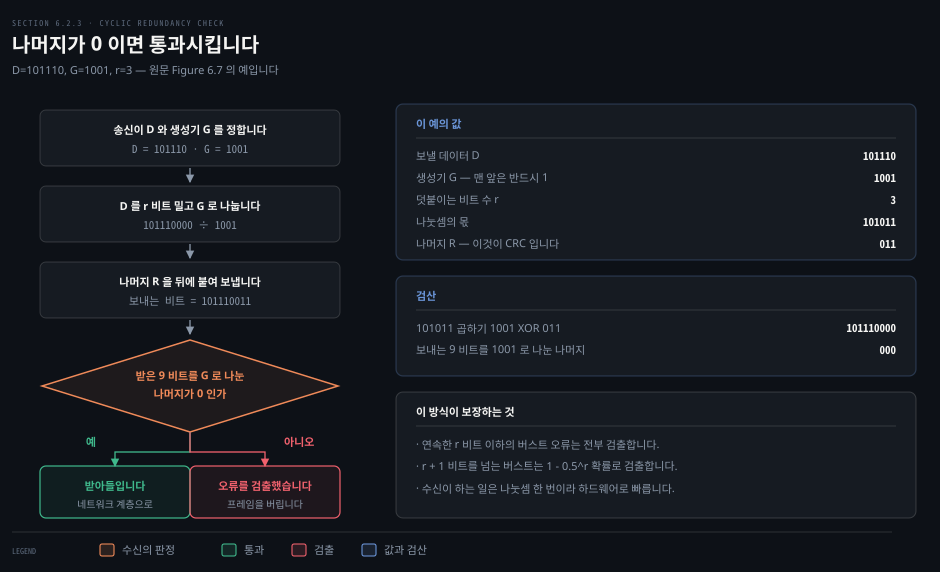

# 한 칸을 건너는 데 무엇이 필요한가

---

> 앞의 다섯 장이 종단 간 경로를 *정하는* 이야기였다면, 이 편부터는 그 경로의 한 칸을 확대합니다. 데이터그램이 이웃 노드까지 건너가는 그 짧은 구간에서 무엇이 필요한지를 봅니다.

## 핵심 요약

> 이 편이 매달린 하나의 생각은 **링크 계층이 이웃까지만 책임지기 때문에 오히려 복구가 싸진다**는 것입니다.

트랜스포트도 신뢰 전달을 하고 오류 검출을 합니다. 그런데 링크 계층이 같은 일을 또 합니다. 겹쳐 보이는 이 중복에는 이유가 있습니다. 오류가 난 그 자리에서 고치면 되돌아가는 거리가 한 칸이고, 종단까지 갔다가 고치면 여섯 칸입니다. 범위가 좁다는 것이 링크 계층의 약점이 아니라 강점입니다.

같은 이유로 구현 자리도 갈립니다. 트랜스포트의 체크섬은 호스트 운영체제 안 소프트웨어라 단순하고 빨라야 하고, 링크의 CRC 는 어댑터 칩 안 전용 하드웨어라 더 복잡한 연산을 감당합니다. **어디서 도는가가 무엇을 쓸지를 정합니다.**

그리고 이 편에서 원문의 어긋남을 둘 찾았습니다. 하나는 이더넷을 다루는 절 번호를 잘못 적은 것이고, 다른 하나는 CRC 가 홀수 개 오류를 전부 잡는다고 적은 것입니다. 뒤엣것은 원문이 바로 앞 문단에 인쇄한 CRC-32 생성기로 반례를 만들 수 있습니다.


## 학습 목표

> 이 편을 읽고 나면 아래 다섯 가지를 스스로 해낼 수 있습니다.

1. 노드와 링크를 정의하고, 한 종단 간 경로가 왜 여러 링크 계층 프로토콜로 나뉘는지 설명합니다.
2. 링크 계층이 제공할 수 있는 다섯 가지 서비스를 들고, 신뢰 전달을 어떤 링크가 두고 어떤 링크가 두지 않는지 이유와 함께 말합니다.
3. 링크 계층이 어댑터 하드웨어와 호스트 소프트웨어에 어떻게 나뉘어 구현되는지 짚습니다.
4. 1비트 패리티에서 2차원 패리티로 갈 때 무엇이 더 가능해지는지 설명하고, FEC 가 왕복 지연을 아끼는 이유를 말합니다.
5. 체크섬과 CRC 를 검출력과 구현 위치로 갈라 놓고, CRC 가 무엇을 보장하고 무엇을 보장하지 않는지 판별합니다.


## 1. 한 경로가 여섯 칸으로 나뉩니다

> 4·5장에서 라우터가 경로를 골랐습니다. 그런데 그 경로는 이름의 나열이 아니라 실제로 건너야 하는 칸의 연속입니다.



### 풀려는 문제

라우팅 테이블은 "다음 홉은 이쪽"이라고만 알려 줍니다. 그 한 칸을 실제로 건너는 일은 아직 아무도 하지 않았습니다. 데이터그램은 어떤 그릇에 담겨 건너가는지, 칸마다 그릇이 같은지, 무선 구간과 유선 구간이 섞여 있으면 어떻게 되는지가 남아 있습니다.

### 노드와 링크

원문은 어휘를 먼저 정리합니다. 링크 계층 프로토콜을 돌리는 모든 장치를 **노드**라 부릅니다. 호스트, 라우터, 스위치, 그리고 7장에서 다룰 WiFi 접속점이 전부 노드입니다. 경로 위에서 인접한 노드를 잇는 통신 채널을 **링크**라 부릅니다.

원문이 든 회사 망의 예에서 무선 호스트가 서버로 데이터그램을 보내면 여섯 링크를 지납니다. 보내는 호스트와 WiFi 접속점 사이의 WiFi 링크, 접속점과 링크 계층 스위치 사이의 이더넷 링크, 스위치와 라우터 사이의 링크, 두 라우터 사이의 링크, 라우터와 스위치 사이의 이더넷 링크, 마지막으로 스위치와 서버 사이의 이더넷 링크입니다.

> **노트의 읽기**: 원문은 셋째와 넷째 링크의 프로토콜을 밝히지 않습니다. `"a link between the link-layer switch and the router, a link between the two routers"` 라고만 적습니다. 앞뒤 문맥으로 짐작할 수는 있지만 원문이 말하지 않은 것이라 도식에도 `원문 미지정`으로 두었습니다.

링크마다 송신 노드는 데이터그램을 **프레임**에 담아 링크로 내보냅니다. 칸이 바뀌면 프레임도 새로 만들어집니다. 안에 든 데이터그램은 그대로인데 겉을 감싸는 헤더가 매번 갈립니다.

### 여행으로 들어가는 입구

원문은 여행 비유로 이 구조를 엽니다. 여행사가 프린스턴에서 로잔까지 가는 여정을 짭니다. 프린스턴에서 JFK 공항까지는 리무진, JFK 에서 제네바 공항까지는 비행기, 제네바 공항에서 로잔 역까지는 기차입니다.

세 구간은 서로 다른 회사가 맡고 교통수단도 전부 다릅니다. 그래도 각 구간이 하는 일은 같습니다. 승객을 한 지점에서 인접한 지점으로 옮기는 것입니다. 이 비유에서 여행자가 데이터그램, 구간이 링크, 교통수단이 링크 계층 프로토콜, 여정을 짠 여행사가 라우팅 프로토콜입니다.

비유는 여기까지입니다. 리무진 회사는 승객이 비행기를 탈 것을 알지만, 링크 계층 프로토콜은 자기 다음에 무엇이 오는지 알지 못합니다.

### 채널은 두 종류입니다

링크 계층 채널은 근본적으로 두 갈래로 나뉩니다. 첫째는 **브로드캐스트 채널**입니다. 무선 LAN, 위성 망, 하이브리드 광-동축(HFC) 접속 망이 여기 속합니다. 여러 호스트가 같은 채널에 붙어 있으므로 누가 언제 보낼지를 조율하는 매체 접속 프로토콜이 필요합니다.

둘째는 **점대점 링크**입니다. 장거리 링크로 이어진 두 라우터 사이, 또는 사무실 컴퓨터와 가까운 이더넷 스위치 사이가 그렇습니다. 접속을 조율하는 일이 훨씬 간단합니다. 원문은 점대점 프로토콜(PPP)의 자세한 논의를 책 웹사이트의 참고 자료로 넘깁니다.

이 갈림이 다음 편의 주제입니다. 브로드캐스트 채널에서 충돌을 어떻게 다루는지가 §6.3 전체입니다.


## 2. 링크 계층이 맡는 다섯 가지

> 트랜스포트도 신뢰 전달을 하고 오류 검출을 합니다. 링크가 같은 일을 또 하는 데는 범위의 차이라는 이유가 있습니다.



### 풀려는 문제

3장에서 TCP 가 손실을 메우고 체크섬으로 오류를 잡는 것을 이미 봤습니다. 그런데 링크 계층도 신뢰 전달과 오류 검출을 서비스 목록에 올립니다. 중복으로 보이는 이 배치를 이해하지 못하면, 어떤 링크가 왜 재전송을 하고 어떤 링크가 왜 하지 않는지 판단할 수 없습니다.

### 다섯 서비스

원문이 링크 계층 프로토콜이 제공할 수 있는 서비스를 다섯으로 듭니다.

- **프레이밍**: 네트워크 계층 데이터그램을 프레임에 담습니다. 프레임은 데이터그램이 들어가는 데이터 필드와 여러 헤더 필드로 이뤄지고, 그 구조는 링크 계층 프로토콜이 정합니다.
- **링크 접속**: 매체 접속 제어(MAC) 프로토콜이 프레임을 링크에 올리는 규칙을 정합니다. 점대점 링크에서는 규칙이 단순하거나 아예 없어서 링크가 놀고 있으면 그냥 보냅니다.
- **신뢰 전달**: 각 데이터그램을 오류 없이 링크 너머로 옮기는 것을 보장합니다. 3장의 확인 응답과 재전송으로 만듭니다.
- **오류 검출**: 송신 노드가 프레임에 오류 검출 비트를 넣고 수신 노드가 검사합니다. 신호 감쇠와 전자기 잡음이 비트를 뒤집습니다.
- **오류 정정**: 검출에서 한 걸음 더 나아가 오류가 프레임의 *어디에* 났는지까지 알아내 고칩니다.

### 왜 어떤 링크는 신뢰 전달을 두지 않는가

링크 계층 신뢰 전달의 목적은 오류가 난 그 링크에서 국소적으로 고치는 것입니다. 종단 간 재전송을 트랜스포트나 애플리케이션에 떠넘기지 않는 것이 요점입니다.

되돌아가는 거리를 세면 차이가 분명해집니다. 무선 링크에서 비트가 뒤집혔을 때 링크 계층이 고치면 그 한 칸만 되돌아갑니다. TCP 가 고치면 여섯 칸을 전부 되돌아갑니다. 오류율이 높은 링크에서는 이 차이가 크게 벌어집니다.

그래서 무선 링크는 신뢰 전달을 둡니다. 반대로 광, 동축, 트위스티드페어 구리선처럼 비트 오류율이 낮은 링크에서는 같은 기능이 불필요한 오버헤드가 됩니다. **유선 링크 계층 프로토콜이 신뢰 전달을 제공하지 않는 것은 빠뜨린 것이 아니라 뺀 것입니다.**

### 링크 접속이 어려워지는 자리

점대점 링크에서 MAC 프로토콜은 시시합니다. 한쪽 끝에 송신자 하나, 다른 쪽 끝에 수신자 하나뿐이라 조율할 상대가 없습니다.

흥미로워지는 것은 여러 노드가 브로드캐스트 링크 하나를 나눠 쓸 때입니다. 원문은 이것을 **다중 접속 문제**라 부릅니다. 여기서 MAC 프로토콜은 여러 노드의 프레임 전송을 조율하는 일을 맡습니다. 다음 편이 이 문제만 다룹니다.


## 3. 링크 계층은 어디서 돕니까

> 계층 그림은 논리적입니다. 그 논리적 층이 실제로 어느 칩에서 도는지를 알아야 프레임을 잡는 도구가 무엇을 보고 있는지도 알 수 있습니다.



### 풀려는 문제

프로토콜 스택 다섯 층은 종이 위의 구획입니다. 그런데 링크 계층에 오면 이 구획이 물리적 경계와 겹칩니다. 어디까지가 운영체제이고 어디부터가 별도 칩인지 모르면, 오류 검출이 왜 하드웨어여야 하는지도 답할 수 없습니다.

### 어댑터 안에서 끝나는 일

링크 계층은 대부분 **네트워크 어댑터**라 불리는 칩 위에 구현됩니다. 네트워크 인터페이스 컨트롤러(NIC)라고도 부릅니다. 이더넷 기능은 마더보드 칩셋에 통합돼 있거나 값싼 전용 이더넷 칩으로 구현됩니다.

어댑터는 프레이밍, 링크 접속, 오류 검출을 비롯한 여러 링크 계층 서비스를 구현합니다. 원문은 실제 제품을 예로 듭니다. 인텔 800 시리즈 어댑터가 이더넷 프로토콜을, 퀄컴의 Atheros Fastconnect 6800 서브시스템 컨트롤러가 7장에서 다룰 802.11 프로토콜을 구현합니다.

> **원문 정오**: 이 대목에서 원문은 인텔 어댑터가 `"the Ethernet protocols we'll study in Section 6.5"` 를 구현한다고 적습니다. 9판에서 이더넷을 다루는 절은 **§6.4.2** 이고, §6.5 는 링크 가상화(MPLS·VXLAN)입니다. 판을 거듭하며 절이 옮겨진 자국으로 보입니다. 2·3장에서 찾은 상호 참조 어긋남과 같은 유형입니다.

보내는 쪽에서 컨트롤러는 상위 계층이 호스트 메모리에 만들어 둔 데이터그램을 가져다 프레임에 담습니다. 그리고 링크 접속 프로토콜에 따라 그 프레임을 링크로 내보냅니다. 받는 쪽에서 컨트롤러는 프레임 전체를 받아 데이터그램을 꺼냅니다. 오류 검출 비트를 채우는 것도 검사하는 것도 컨트롤러의 일입니다.

### 소프트웨어가 하드웨어를 만나는 자리

링크 계층 전부가 하드웨어인 것은 아닙니다. 일부는 호스트 CPU 에서 도는 소프트웨어입니다. 소프트웨어 쪽은 링크 계층 주소 정보를 조립하고 컨트롤러 하드웨어를 활성화하는 상위 기능을 맡습니다.

받는 쪽에서 링크 계층 소프트웨어는 컨트롤러 인터럽트에 응답합니다. 프레임이 하나 이상 도착했다는 신호를 받아 오류 상황을 처리하고 데이터그램을 네트워크 계층으로 올립니다.

원문은 이 절을 한 문장으로 닫습니다. 링크 계층은 하드웨어와 소프트웨어의 조합이며, **프로토콜 스택에서 소프트웨어가 하드웨어를 만나는 자리**입니다.

이 경계는 실무에서 그대로 보입니다. 캡처 도구가 무엇을 보고 무엇을 못 보는지가 여기서 갈립니다. 관측 쪽 이야기는 [Wireshark 책 02-01](../paw_packet-analysis-wireshark/02-01.%ED%8C%A8%ED%82%B7%EC%9D%84%20%EC%9E%A1%EB%8A%94%20%EB%B2%95.md)이 맡고 있으므로 다시 쓰지 않습니다.


## 4. 오류를 알아채는 뼈대와 패리티

> 수신은 원본을 갖고 있지 않습니다. 그런데도 비트가 뒤집혔다는 것을 알아채야 합니다.



### 풀려는 문제

수신 노드가 받은 것은 `D'` 와 `EDC'` 뿐입니다. 원래의 `D` 를 본 적이 없습니다. 비교할 대상이 없는데 어떻게 "이건 틀렸다"를 말할 수 있는지가 이 절의 물음입니다.

### 검출의 뼈대

송신 노드에서 보호할 데이터 `D` 에 오류 검출·정정 비트 `EDC` 를 덧붙입니다. 보호 대상에는 네트워크 계층에서 내려온 데이터그램뿐 아니라 링크 수준 주소 정보, 순서 번호, 프레임 헤더의 다른 필드도 들어갑니다.

원문이 표현을 조심스럽게 고른 자리가 있습니다. 수신의 판정은 "오류가 *일어났는가*"가 아니라 "오류가 *검출되는가*"입니다. 검출 비트를 붙여도 놓치는 오류는 남습니다. 수신이 손상된 데이터그램을 네트워크 계층으로 올려 보낼 수도 있고, 헤더 필드가 망가진 것을 모를 수도 있습니다.

여기에 맞바꿈이 있습니다. 놓치는 확률이 작은 정교한 기법일수록 오버헤드가 큽니다. 계산이 더 들고 검출 비트도 더 많이 보내야 합니다.

### 한 비트로는 부족합니다

가장 단순한 검출은 패리티 비트 하나입니다. 짝수 패리티에서 송신은 원래 정보에 비트 하나를 더해, `d + 1` 비트 안의 1의 개수가 짝수가 되게 값을 고릅니다.

수신이 하는 일도 단순합니다. 받은 `d + 1` 비트에서 1의 개수를 셉니다. 짝수 패리티인데 홀수가 나오면 오류가 최소 하나 있다는 것을 압니다. 더 정확히는 **홀수 개의 비트 오류**가 일어났다는 것을 압니다.

짝수 개의 오류가 나면 검출되지 않습니다. 오류가 비트마다 독립적으로 드물게 일어난다면 이 정도로 충분할 수도 있습니다. 그런데 측정 결과는 다릅니다. 오류는 독립적으로 흩어지지 않고 **버스트**로 뭉쳐서 납니다. 버스트 조건에서 1비트 패리티가 놓치는 확률은 50 퍼센트에 가까워질 수 있습니다.

### 행과 열을 함께 걸면 자리가 나옵니다

2차원 패리티는 이 단순한 발상을 한 차원 늘린 것입니다. `d` 비트를 `i` 행 `j` 열로 나누고 행마다 열마다 패리티를 계산합니다. 그렇게 나온 `i + j + 1` 비트가 프레임의 오류 검출 비트가 됩니다.

원본 정보에서 비트 하나가 뒤집히면 그 비트가 속한 행과 열의 패리티가 둘 다 어긋납니다. 수신은 오류가 났다는 사실만 아는 것이 아니라 **어긋난 행과 열의 교차점**으로 그 비트를 짚어 고칠 수 있습니다. 위 도식이 원문 Figure 6.5 의 예입니다. `(2, 2)` 자리의 1 이 0 으로 뒤집혔고, 행 2 와 열 2 의 패리티가 함께 어긋납니다.

패리티 비트 자체가 하나 뒤집혀도 같은 방식으로 검출하고 정정합니다. 두 비트 오류는 어떤 조합이든 검출하지만 정정하지는 못합니다.

### 되돌아가지 않아도 되는 이득

수신이 검출과 정정을 함께 해내는 능력을 **순방향 오류 정정(FEC)** 이라 부릅니다. 오디오 CD 같은 음성 저장·재생 장치에서 흔히 쓰입니다. 망에서는 단독으로 쓰거나 3장에서 본 ARQ 기법과 함께 씁니다.

FEC 의 값어치는 재전송 횟수를 줄이는 데만 있지 않습니다. 더 중요한 것은 수신에서 즉시 고친다는 점입니다. 송신이 NAK 를 받고 재전송한 패킷이 다시 도착할 때까지의 왕복 전파 지연을 기다리지 않아도 됩니다. 실시간 애플리케이션이나 심우주 링크처럼 전파 지연이 긴 곳에서 이 이득이 큽니다.


## 5. 왜 링크는 CRC 를 쓰고 트랜스포트는 체크섬을 쓰는가

> 같은 오류 검출인데 층마다 다른 기법을 씁니다. 취향의 문제가 아니라 어디서 도는가의 문제입니다.



### 풀려는 문제

3장에서 인터넷 체크섬을 배웠고 이 장에서 CRC 를 배웁니다. 둘 다 오류 검출입니다. 어느 하나가 더 낫다면 왜 둘 다 쓰이고 있는지, 그리고 새 프로토콜을 볼 때 어느 쪽을 기대해야 하는지가 남습니다.

### 체크섬은 더하기입니다

체크섬 기법은 데이터 `d` 비트를 `k` 비트 정수의 나열로 봅니다. 그 정수들을 더한 합을 오류 검출 비트로 씁니다. 인터넷 체크섬이 이 방식입니다. 바이트를 16비트 정수로 보고 더한 뒤, 그 합의 1의 보수를 세그먼트 헤더에 싣습니다.

수신은 받은 데이터의 1의 보수 합을 구해 결과가 전부 1인지 봅니다. 1이 아닌 비트가 하나라도 있으면 오류입니다. 알고리즘과 구현의 자세한 내용은 RFC 1071 에 있습니다.[^rfc1071]

계층마다 계산 범위가 다릅니다. TCP 와 UDP 는 헤더와 데이터를 포함한 모든 필드에 걸쳐 계산합니다. IP 는 IP 헤더에만 계산합니다. 안에 든 UDP·TCP 세그먼트가 자기 체크섬을 이미 갖고 있기 때문입니다.

체크섬은 오버헤드가 적습니다. TCP 와 UDP 의 체크섬은 16비트뿐입니다. 대신 오류 보호는 CRC 보다 약합니다.

### CRC 는 나눗셈입니다

순환 중복 검사(CRC)는 오늘날 컴퓨터 망에서 널리 쓰이는 검출 기법입니다. 보낼 비트열을 계수가 0과 1인 다항식으로 볼 수 있어서 **다항식 코드**라고도 부릅니다.

송신과 수신이 먼저 `r + 1` 비트 패턴 하나에 합의합니다. 이것을 **생성기** `G` 라 부르고, 맨 앞 비트는 반드시 1 이어야 합니다. 송신은 데이터 `D` 뒤에 붙일 `r` 비트 `R` 을 고르는데, `d + r` 비트 전체가 modulo-2 산술에서 `G` 로 나누어떨어지도록 고릅니다.

modulo-2 산술에는 자리올림도 자리내림도 없습니다. 덧셈과 뺄셈이 같아지고 둘 다 비트별 XOR 과 같습니다. `R` 을 구하는 식은 이렇게 정리됩니다.

```bash
R = remainder( D · 2^r / G )
```

원문 Figure 6.7 의 예를 그대로 따라가면 이렇습니다. `D = 101110`, `d = 6`, `G = 1001`, `r = 3` 입니다.

```bash
       101011            <- 몫
       ---------
1001 ) 101110000         <- D 를 r=3 비트 왼쪽으로 민 값
       1011
       1001
       ----
        0101
        0000
        ----
         1010
         1001
         ----
          0110
          0000
          ----
           1100
           1001
           ----
            1010
            1001
            ----
             011         <- 나머지 R
```

보내는 9비트는 `101110011` 입니다. 검산도 맞아떨어집니다. `101011` 에 `G` 를 곱하고 `R` 을 XOR 하면 `101110000` 이 나옵니다.

수신이 하는 일은 훨씬 간단합니다. 받은 `d + r` 비트를 `G` 로 나눕니다. 나머지가 0 이 아니면 오류가 났다는 것을 알고, 0 이면 데이터를 받아들입니다. 나눗셈 한 번이면 끝납니다.

### CRC 가 보장하는 것

8비트, 12비트, 16비트, 32비트 생성기에 국제 표준이 정해져 있습니다. 여러 IEEE 링크 수준 프로토콜이 채택한 CRC-32 표준의 생성기는 33비트입니다.

```bash
G_CRC-32 = 100000100110000010001110110110111
```

각 CRC 표준은 `r + 1` 비트 미만의 버스트 오류를 검출합니다. 연속한 `r` 비트 이하의 오류는 전부 잡힌다는 뜻입니다. `r + 1` 비트를 넘는 버스트는 적절한 가정 아래 `1 − 0.5^r` 확률로 검출됩니다.

> **원문 정오**: 원문은 이어서 `"each of the CRC standards can detect any odd number of bit errors"` 라고 적습니다. CRC 가 홀수 개 오류를 전부 검출하려면 생성기 다항식이 `x + 1` 을 인수로 가져야 하고, 그것은 생성기의 항 개수가 짝수라는 것과 같습니다. 바로 위에 인쇄된 CRC-32 생성기는 항이 **15개로 홀수**라 이 조건을 만족하지 않습니다. 오류 패턴을 생성기 자기 자신으로 두면 15비트를 뒤집었는데도 나머지가 0 이 되어 검출을 빠져나갑니다. 8·12·16비트 표준 생성기는 항이 짝수라 원문의 서술이 맞고, 어긋나는 것은 CRC-32 하나입니다. 근거는 아래 심화 학습에 실측으로 실었습니다.

### 그래서 층마다 다릅니다

원문이 직접 던지는 물음이 이것입니다. 왜 체크섬은 트랜스포트에서 쓰고 CRC 는 링크에서 쓰는가.

답은 구현 위치입니다. 트랜스포트 계층은 보통 호스트 운영체제의 일부로 소프트웨어에 구현됩니다. 소프트웨어로 돌려야 하므로 체크섬처럼 단순하고 빠른 기법이 중요합니다.

반면 링크 계층의 오류 검출은 어댑터 안 전용 하드웨어에 구현됩니다. 하드웨어는 더 복잡한 CRC 연산을 빠르게 처리할 수 있습니다. §3에서 본 어댑터의 자리가 여기서 답으로 돌아옵니다.


## 결정 치트시트

> 네 기법을 검출력과 자리로 갈라 놓습니다. 고르는 축은 성능이 아니라 어디서 도는가입니다.

| 기법 | 검출 비트 | 잡는 것 | 못 잡는 것 | 도는 자리 |
|------|----------|--------|-----------|----------|
| 1비트 패리티 | 1 | 홀수 개 비트 오류 | 짝수 개 오류. 버스트에서 놓칠 확률이 50 퍼센트에 근접 | 이론 설명용 |
| 2차원 패리티 | `i + j + 1` | 1비트 오류는 검출하고 정정. 2비트 오류는 검출 | 3비트 이상 조합의 정정 | FEC 가 필요한 곳 |
| 인터넷 체크섬 | 16 | 대부분의 단일 비트 오류 | 자리 바뀜 같은 상쇄되는 오류 | 호스트 OS 소프트웨어 |
| CRC-32 | 32 | 32비트 이하 버스트 전부 | 생성기의 배수가 되는 오류 패턴 | 어댑터 전용 하드웨어 |

판단 규칙은 한 줄로 줄어듭니다. **소프트웨어로 돌려야 하면 체크섬, 전용 하드웨어를 쓸 수 있으면 CRC 입니다.**


## 심화 학습

> 원문이 인쇄한 CRC-32 생성기를 그대로 써서 두 가지를 이 기계에서 확인했습니다. 하나는 위 정오의 반례이고, 다른 하나는 교과서 CRC 와 실제 이더넷 FCS 의 거리입니다.

### 홀수 개 오류를 놓치는 반례

CRC 부호는 오류 패턴 `E` 가 생성기 `G` 의 배수일 때 검출에 실패합니다. `G` 자기 자신은 언제나 `G` 의 배수이므로, `G` 의 항 개수가 홀수이면 그 패턴이 곧 홀수 무게의 미검출 오류가 됩니다.

```python
G = 0b100000100110000010001110110110111   # 원문 §6.2.3 의 G_CRC-32

def mod2div(a, b):
    la, lb = a.bit_length(), b.bit_length()
    while la >= lb:
        a ^= b << (la - lb)
        la = a.bit_length()
    return a

print(bin(G).count('1'))          # 15 — 홀수이므로 (x+1) 을 인수로 갖지 않습니다
print(mod2div(G, 0b11))           # 1  — (x+1) 로 나눈 나머지가 0 이 아닙니다
```

64비트 데이터에 CRC-32 를 붙여 96비트 부호어를 만든 뒤 `E = G` 를 XOR 하면, **15개 비트를 뒤집었는데도 수신 측 나머지가 0 으로 나옵니다.** 원문의 `any odd number of bit errors` 가 CRC-32 에서는 성립하지 않는다는 것을 한 줄로 보이는 반례입니다.

원문이 생성기를 실제로 인쇄한 것은 CRC-32 하나뿐입니다. 8비트·12비트·16비트 표준의 생성기는 원문에 없어 이 노트가 원문만으로는 확인할 수 없습니다. 널리 쓰이는 값으로 항을 세면 넷 다 짝수입니다.

- ATM HEC `x^8+x^2+x+1` — 4개
- CRC-12 `x^12+x^11+x^3+x^2+x+1` — 6개
- CRC-16 `x^16+x^15+x^2+1` — 4개
- CRC-CCITT `x^16+x^12+x^5+1` — 4개

**다만 이 네 다항식은 책 밖에서 가져온 값이라 확인 불가로 둡니다.** 원문의 서술이 확실히 깨지는 것은 원문 스스로 인쇄한 CRC-32 하나입니다.

### 교과서 CRC 와 실제 이더넷 FCS 는 값이 다릅니다

원문의 절차를 그대로 구현해 이더넷 FCS 와 비교하면 값이 어긋납니다. 같은 생성기를 쓰는데도 그렇습니다.

```python
import zlib
msg = b"Kurose"
# 원문 절차 그대로:      0x4502F50C
# zlib.crc32 (이더넷 FCS): 0x5E186F5B
print(hex(zlib.crc32(msg)))
```

차이는 다항식이 아니라 그 바깥의 규약에서 옵니다. 실제 이더넷 FCS 는 세 가지를 더 합니다.[^ieee8023]

- 입력 바이트의 비트를 반사합니다.
- 레지스터를 `0xFFFFFFFF` 로 초기화합니다.
- 출력을 다시 반사한 뒤 `0xFFFFFFFF` 와 XOR 합니다.

이 셋을 적용하면 원문 절차의 결과가 `0x5E186F5B` 로 바뀌어 `zlib.crc32` 와 정확히 일치합니다.

교과서가 이 규약을 생략하는 것은 잘못이 아닙니다. 검출 능력은 생성기가 정하고 반사와 초기값은 정하지 않기 때문입니다. 다만 **책의 절차를 코드로 옮겨 실제 프레임의 FCS 와 맞춰 보려는 순간 이 거리가 걸립니다.** 값이 안 맞는다고 나눗셈을 의심하기 전에 규약을 먼저 보아야 합니다.


## 면접 대비

> 이 편에서 나올 만한 물음 셋입니다. 셋 다 "왜 중복인가"를 묻는 물음의 변형입니다.

**링크 계층이 있는데 트랜스포트가 또 신뢰성을 제공하는 이유가 무엇입니까.** 링크 계층의 신뢰 전달은 한 링크 안에서만 보장합니다. 경로 위의 모든 링크가 신뢰 전달을 제공하는 것도 아니고, 라우터 내부의 버퍼 넘침 같은 손실은 링크 계층이 손대지 못합니다. 종단 간 보장은 종단에서만 만들 수 있습니다.

**오류 검출을 링크와 트랜스포트에서 각각 하는 것이 낭비 아닙니까.** 낭비가 아니라 역할 분담입니다. 링크의 CRC 는 그 링크의 전송 오류를 잡아 잘못된 프레임이 상위로 올라가지 않게 막고, 트랜스포트의 체크섬은 라우터 메모리 손상처럼 링크 밖에서 생긴 오류까지 종단에서 걸러냅니다.

**같은 오류 검출인데 왜 층마다 다른 기법을 씁니까.** 구현 위치가 다르기 때문입니다. 트랜스포트는 호스트 소프트웨어라 단순하고 빠른 체크섬이 맞고, 링크는 어댑터 전용 하드웨어라 더 강한 CRC 를 감당할 수 있습니다.


## 핵심 개념 체크리스트

- [ ] 노드와 링크를 각각 한 문장으로 정의할 수 있는가?
- [ ] 한 데이터그램이 경로를 지나는 동안 무엇이 바뀌고 무엇이 그대로인지 말할 수 있는가?
- [ ] 링크 계층 서비스 다섯 가지를 들 수 있는가?
- [ ] 무선 링크가 신뢰 전달을 두고 광 링크가 두지 않는 이유를 설명할 수 있는가?
- [ ] 링크 계층의 어느 부분이 어댑터 하드웨어이고 어느 부분이 호스트 소프트웨어인지 가를 수 있는가?
- [ ] 1비트 패리티가 버스트 오류에 약한 이유를 말할 수 있는가?
- [ ] 2차원 패리티가 오류를 *정정*까지 할 수 있는 원리를 설명할 수 있는가?
- [ ] `R = remainder(D · 2^r / G)` 를 손으로 계산할 수 있는가?
- [ ] CRC 가 무엇을 보장하고 무엇을 보장하지 않는지 판별할 수 있는가?


## 관련 문서

- [이 폴더의 정독 인덱스](./README.md) — 장별 진도와 학습 상태
- [05-03 제어를 밖으로 빼고 망을 들여다봅니다](./05-03.%EC%A0%9C%EC%96%B4%EB%A5%BC%20%EB%B0%96%EC%9C%BC%EB%A1%9C%20%EB%B9%BC%EA%B3%A0%20%EB%A7%9D%EC%9D%84%20%EB%93%A4%EC%97%AC%EB%8B%A4%EB%B4%85%EB%8B%88%EB%8B%A4.md) — 바로 앞 편. 5장을 닫는 자리
- [03-01 트랜스포트는 무엇을 더하는가](./03-01.%ED%8A%B8%EB%9E%9C%EC%8A%A4%ED%8F%AC%ED%8A%B8%EB%8A%94%20%EB%AC%B4%EC%97%87%EC%9D%84%20%EB%8D%94%ED%95%98%EB%8A%94%EA%B0%80.md) — 인터넷 체크섬과 종단 간 원칙
- [Wireshark 책 02-01 패킷을 잡는 법](../paw_packet-analysis-wireshark/02-01.%ED%8C%A8%ED%82%B7%EC%9D%84%20%EC%9E%A1%EB%8A%94%20%EB%B2%95.md) — 어댑터 경계가 캡처에서 어떻게 보이는가


## 참고 자료

- 원본: 《Computer Networking: A Top-Down Approach》 9판, James F. Kurose · Keith W. Ross, Pearson. 6장 도입 · §6.1 · §6.2 (책 389–399쪽)
- [RFC 1071 — Computing the Internet Checksum](https://www.rfc-editor.org/rfc/rfc1071)
- [IEEE 802.3 — Ethernet 표준](https://standards.ieee.org/ieee/802.3/10422/)

[^rfc1071]: RFC 1071 — Computing the Internet Checksum. 1의 보수 합 알고리즘과 구현 기법. <https://www.rfc-editor.org/rfc/rfc1071>
[^ieee8023]: IEEE Std 802.3 — Ethernet. FCS 필드의 생성기 다항식과 비트 반사·초기값·최종 XOR 규약. <https://standards.ieee.org/ieee/802.3/10422/>
