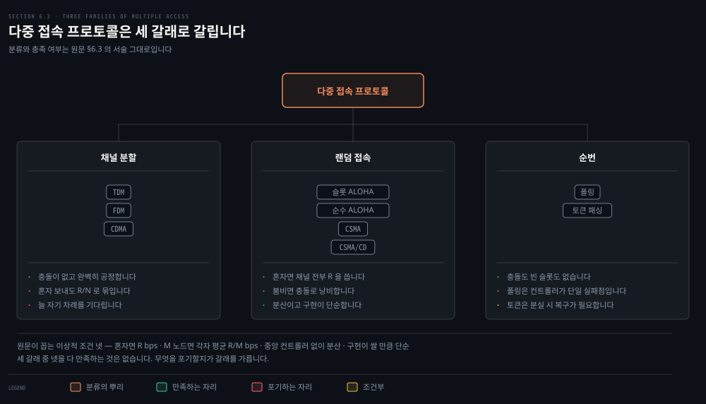
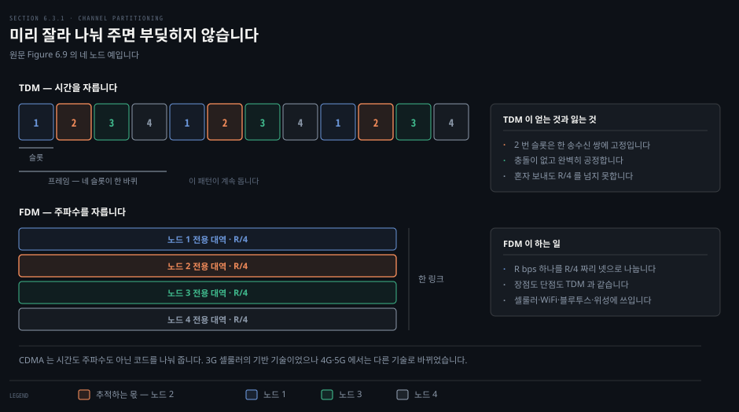
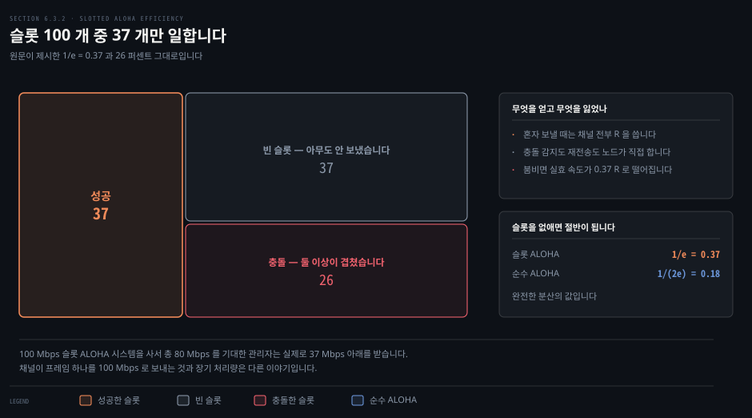
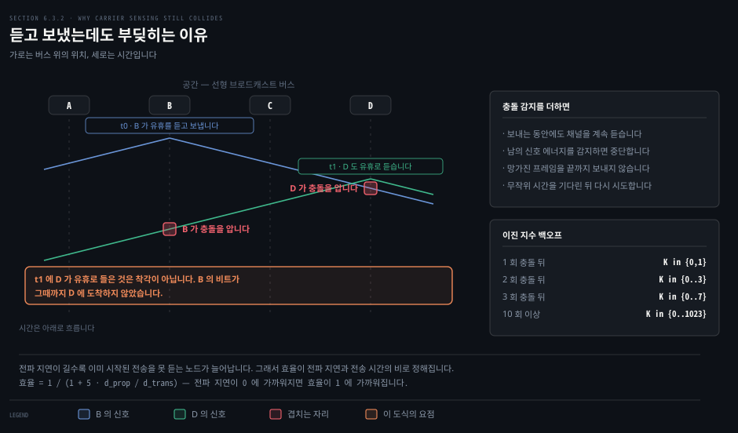
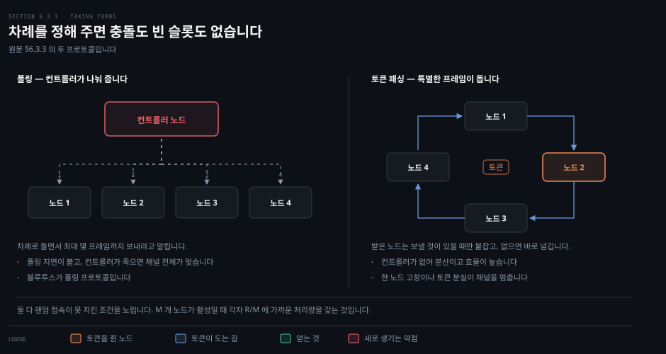
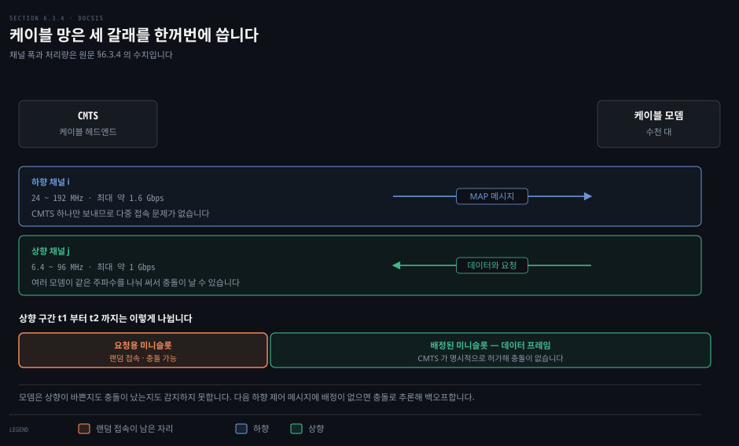

# 하나의 채널을 여럿이 어떻게 나눠 쓰는가

---

> 앞 편이 링크 하나를 건너는 데 무엇이 필요한지를 봤다면, 이 편은 그 링크를 여럿이 공유할 때 생기는 문제만 다룹니다. 링크 계층의 중심 문제입니다.

## 핵심 요약

> 이 편이 매달린 하나의 생각은 **넷을 다 만족하는 다중 접속 프로토콜은 없고, 무엇을 포기하느냐가 갈래를 가른다**는 것입니다.

원문은 이상적인 프로토콜의 조건을 넷으로 못박습니다. 혼자 보낼 때 채널 전부를 쓰고 M 개 노드가 보낼 때 각자 평균 R/M 을 가져야 합니다. 그러면서 중앙 컨트롤러 없이 분산으로 돌고 구현이 쌀 만큼 단순해야 합니다.

세 갈래가 각각 다른 조건을 버립니다. 채널 분할은 첫째를 버리고 충돌을 없앱니다. 랜덤 접속은 첫째를 지키는 대신 둘째를 버리고 충돌을 감수합니다. 순번은 충돌과 빈 슬롯을 다 없애는 대신 컨트롤러나 토큰이라는 단일 실패점을 들입니다.

그리고 숫자 하나가 이 편의 중심에 있습니다. **슬롯 ALOHA 는 최선의 경우에도 슬롯의 37 퍼센트만 일합니다.** 100 Mbps 시스템을 사서 80 Mbps 를 기대한 관리자가 37 Mbps 아래를 받는 이유가 여기 있습니다.


## 학습 목표

> 이 편을 읽고 나면 아래 다섯 가지를 스스로 해낼 수 있습니다.

1. 다중 접속 문제를 정의하고, 이상적인 프로토콜의 조건 네 가지를 들 수 있습니다.
2. TDM 과 FDM 이 충돌을 없애는 대신 무엇을 잃는지 설명합니다.
3. 슬롯 ALOHA 의 최대 효율이 왜 1/e 인지, 그 37 퍼센트가 실무에서 무엇을 뜻하는지 말합니다.
4. 반송파 감지를 하는데도 충돌이 나는 이유를 전파 지연으로 설명하고, 이진 지수 백오프의 구간이 어떻게 커지는지 짚습니다.
5. 케이블 접속망이 세 갈래를 어떻게 한꺼번에 쓰는지 설명합니다.


## 1. 여럿이 한 채널에 대고 말하면

> 브로드캐스트 링크에서는 한 노드가 보낸 프레임을 다른 노드 전부가 받습니다. 그래서 누가 언제 말할지를 정하는 규칙이 필요해집니다.



### 풀려는 문제

점대점 링크에서는 조율할 것이 없습니다. 한쪽 끝에 송신자 하나, 다른 쪽 끝에 수신자 하나뿐입니다. 그런데 이더넷과 무선 LAN 은 브로드캐스트 링크입니다. 여러 노드가 같은 채널에 붙어 있는데 아무 규칙도 없으면 무슨 일이 벌어지는지가 이 절의 물음입니다.

### 충돌하면 전부 잃습니다

브로드캐스트라는 말은 한 노드가 프레임을 보내면 채널이 그것을 방송하고 다른 노드 각각이 사본을 받는다는 뜻입니다. 모든 노드가 보낼 수 있으므로 둘 이상이 동시에 보내는 일이 생깁니다.

그러면 모든 수신자에서 프레임들이 **충돌**합니다. 충돌한 프레임들의 신호가 서로 얽혀 버려서 어느 수신 노드도 어느 프레임도 알아보지 못합니다. 충돌에 얽힌 프레임은 전부 잃고, 충돌이 지속된 구간 동안 브로드캐스트 채널은 낭비됩니다.

원문은 이 상황을 칵테일 파티에 견줍니다. 많은 사람이 큰 방에 모여 말하고 듣습니다. 공기가 방송 매체 노릇을 합니다. 교실도 같은 구조입니다. 두 경우 모두의 중심 문제는 누가 언제 말할지를 정하는 것입니다.

사람은 이 문제를 푸는 규칙을 이미 갖고 있습니다. 원문이 여섯을 듭니다.

> "모두에게 말할 기회를 주세요." · "말을 걸기 전에는 말하지 마세요." · "대화를 독점하지 마세요." · "질문이 있으면 손을 드세요." · "남이 말할 때 끼어들지 마세요." · "남이 말할 때 졸지 마세요."

### 넷을 다 만족하는 것은 없습니다

R bps 브로드캐스트 채널을 위한 이상적인 다중 접속 프로토콜의 조건을 원문이 넷으로 정리합니다.

1. 한 노드만 보낼 것이 있을 때 그 노드는 R bps 의 처리량을 갖습니다.
2. M 개 노드가 보낼 것이 있을 때 각 노드는 R/M bps 의 처리량을 갖습니다. 매 순간 R/M 일 필요는 없고 적당한 구간의 평균이 R/M 이면 됩니다.
3. 프로토콜이 분산으로 돕니다. 망 전체의 단일 실패점이 되는 중앙 컨트롤러 노드가 없습니다.
4. 프로토콜이 단순해서 구현이 쌉니다.

지난 50 년 동안 수천 편의 논문과 수백 편의 박사 논문이 다중 접속 프로토콜을 다뤘습니다. 그렇게 나온 수십 가지를 원문은 세 범주로 묶습니다. 채널 분할, 랜덤 접속, 순번입니다. 다음 세 절이 그 셋입니다.


## 2. 미리 잘라 나눠 주기

> 충돌을 없애는 가장 확실한 방법은 애초에 겹칠 수 없게 만드는 것입니다. 그 대신 혼자 보낼 때도 자기 몫에 묶입니다.



### 풀려는 문제

충돌이 낭비라면 겹치지 않게 미리 배정하면 됩니다. 이 발상이 어디까지 통하고 어디서 막히는지를 봐야, 이더넷이 왜 이 길을 안 갔는지 알 수 있습니다.

### TDM 은 시간을 자릅니다

1장에서 회선 교환을 다룰 때 본 시분할 다중화와 주파수 분할 다중화가 그대로 쓰입니다. 채널이 N 개 노드를 받치고 전송률이 R bps 라고 하겠습니다.

TDM 은 시간을 **시간 프레임**으로 나누고 각 시간 프레임을 다시 N 개 **시간 슬롯**으로 나눕니다. 각 슬롯을 N 개 노드 중 하나에 배정합니다. 보낼 것이 생긴 노드는 돌아가는 TDM 프레임 안의 자기 슬롯 동안 비트를 내보냅니다. 슬롯 크기는 보통 패킷 하나가 들어가게 고릅니다.

> **용어 주의**: 여기서 말하는 TDM 시간 프레임은 링크 계층이 주고받는 데이터 단위인 프레임과 다릅니다. 원문도 이 혼동을 짚고, 이 소절에서만 링크 계층 데이터 단위를 **패킷**이라 부르겠다고 밝힙니다.

TDM 은 매력적입니다. 충돌을 없애고 완벽히 공정합니다. 각 노드가 프레임 시간마다 R/N bps 의 전용 전송률을 얻습니다.

단점은 둘입니다. 첫째, 혼자만 보낼 것이 있어도 평균 R/N bps 에 묶입니다. 둘째, 늘 자기 차례를 기다려야 합니다. 혼자만 할 말이 있는데도 순서를 기다려야 하는 파티 참가자를 떠올리면 됩니다.

### FDM 은 주파수를 자릅니다

TDM 이 시간으로 채널을 나눈다면 FDM 은 R bps 채널을 서로 다른 주파수로 나눕니다. 각 주파수가 R/N 의 대역폭을 갖고 N 개 노드 중 하나에 배정됩니다. 큰 채널 하나가 작은 채널 N 개가 됩니다.

FDM 은 TDM 과 장점도 단점도 같습니다. 충돌을 피하고 대역폭을 공정하게 나눕니다. 그리고 혼자 보낼 때도 R/N 을 넘지 못합니다.

둘 다 실무에서 널리 쓰입니다. 7장에서 다룰 셀룰러, WiFi, 블루투스, 위성 시스템이 전부 이 기법을 씁니다. 케이블 접속망도 마찬가지이며 이 편 마지막 절에서 다시 만납니다.

### CDMA 는 코드를 나눠 줍니다

세 번째 채널 분할 프로토콜은 코드 분할 다중 접속(CDMA)입니다. TDM 이 시간 슬롯을, FDM 이 주파수를 배정한다면 CDMA 는 노드마다 다른 **코드**를 배정합니다. 각 노드가 자기 코드로 보낼 비트를 부호화합니다.

코드를 잘 고르면 서로 다른 노드가 동시에 전송해도 각 수신자가 상대의 코드를 안다는 전제 아래 원래 비트를 정확히 복원합니다. 다른 노드의 간섭이 있어도 그렇습니다.

> **지금은 다릅니다**: CDMA 는 3G 셀룰러의 기반 기술이었지만 4G 와 5G 에서는 다른 기술로 대체됐습니다. 9판은 CDMA 의 자세한 설명을 본문에서 덜어내고, 이전 판 7장을 보라고 안내합니다.


## 3. 부딪히면 물러나기

> 미리 배정하지 않고 일단 보낸 뒤 충돌하면 물러나는 길도 있습니다. 혼자일 때는 채널 전부를 쓰지만 붐비면 대부분을 잃습니다.



### 풀려는 문제

채널 분할의 약점은 분명합니다. 혼자 보낼 때도 R/N 에 묶입니다. 그 제약을 없애려면 배정을 포기해야 하는데, 배정을 포기하면 충돌이 돌아옵니다. 이 맞바꿈이 얼마나 비싼지를 숫자로 알아야 합니다.

### 랜덤 접속의 규칙

랜덤 접속 프로토콜에서 전송하는 노드는 언제나 채널의 최대 속도인 R bps 로 보냅니다. 충돌이 나면 충돌에 얽힌 각 노드가 프레임이 충돌 없이 통과할 때까지 반복해서 재전송합니다.

곧바로 재전송하지는 않습니다. 무작위 지연을 기다린 뒤에 다시 보냅니다. 충돌에 얽힌 각 노드가 서로 독립적으로 지연을 고릅니다. 독립적으로 고르기 때문에 그중 하나가 남들보다 충분히 짧은 지연을 뽑아 충돌 없이 채널로 빠져나갈 수 있습니다.

### 슬롯 ALOHA 의 가정과 동작

가장 단순한 랜덤 접속 프로토콜인 슬롯 ALOHA 는 다섯 가지를 가정합니다.

- 모든 프레임이 정확히 L 비트입니다.
- 시간이 L/R 초 크기의 슬롯으로 나뉩니다. 한 슬롯이 프레임 하나를 보내는 시간과 같습니다.
- 노드는 슬롯이 시작할 때만 전송을 시작합니다.
- 노드들이 동기화돼 있어 각자 슬롯이 언제 시작하는지 압니다.
- 한 슬롯에서 둘 이상이 충돌하면 슬롯이 끝나기 전에 모든 노드가 그 사실을 감지합니다.

동작은 세 줄입니다. 새 프레임이 생기면 다음 슬롯 시작을 기다려 슬롯 안에 전체를 보냅니다. 충돌이 없으면 성공이라 재전송을 생각할 필요가 없습니다. 충돌이 있으면 슬롯이 끝나기 전에 감지하고, 이후 각 슬롯마다 확률 p 로 재전송합니다.

확률 p 로 재전송한다는 것은 노드가 편향된 동전을 던지는 것과 같습니다. 앞면이 재전송이고 확률 p 로 나옵니다. 뒷면은 이 슬롯을 건너뛰고 다음 슬롯에서 다시 던지는 것이며 확률 1 − p 로 나옵니다.

장점이 여럿입니다. 채널 분할과 달리 혼자 활성일 때는 full rate R 로 계속 보낼 수 있습니다. 각 노드가 스스로 충돌을 감지하고 재전송 시점을 정하므로 고도로 분산입니다. 프로토콜 자체도 극히 단순합니다.

### 37 퍼센트라는 상한

혼자일 때 잘 도는 것과 여럿일 때 잘 도는 것은 다릅니다. 활성 노드가 여럿이면 일부 슬롯은 충돌로 낭비되고, 다른 일부는 모두가 확률적으로 자제해 비어 버립니다. 낭비되지 않는 슬롯은 정확히 한 노드만 전송한 슬롯뿐입니다.

슬롯 방식 다중 접속 프로토콜의 **효율**은 활성 노드가 많고 각자 보낼 프레임이 많을 때 성공 슬롯의 장기 비율로 정의합니다. 접근 제어가 전혀 없어 충돌 즉시 재전송한다면 효율은 0 입니다.

N 개 활성 노드에서 슬롯 ALOHA 의 효율은 `Np(1−p)^(N−1)` 입니다. 이것을 최대로 만드는 p 를 찾고 N 을 무한대로 보내면 최대 효율이 나옵니다.

```bash
최대 효율 = 1/e = 0.37
```

활성 노드가 많고 보낼 프레임이 많을 때 최선의 경우에도 슬롯의 37 퍼센트만 유용한 일을 합니다. 채널의 실효 전송률이 R 이 아니라 0.37 R 입니다. 같은 분석이 37 퍼센트는 빈 슬롯이고 26 퍼센트는 충돌 슬롯임을 보입니다.

원문이 든 장면이 이 숫자의 뜻을 잘 보여 줍니다. 100 Mbps 슬롯 ALOHA 시스템을 사서 여러 사용자 사이에 총 80 Mbps 를 쓰려던 관리자는 실제로 37 Mbps 아래를 받습니다.

### 슬롯을 없애면 절반이 됩니다

슬롯 ALOHA 는 모든 노드가 슬롯 시작에 맞춰 전송하도록 동기화를 요구합니다. 최초의 ALOHA 프로토콜은 슬롯이 없는 완전 분산 프로토콜이었습니다.

순수 ALOHA 에서 프레임이 도착하면 노드는 곧바로 프레임 전체를 브로드캐스트 채널로 내보냅니다. 충돌을 겪으면 자기 프레임을 다 보낸 직후 확률 p 로 즉시 재전송합니다. 그렇지 않으면 프레임 전송 시간만큼 기다린 뒤 확률 p 로 보내거나 확률 1 − p 로 또 한 프레임 시간을 쉽니다.

성공하려면 두 구간이 비어 있어야 합니다. 내 전송이 시작되기 직전 한 프레임 시간과, 내가 전송하는 동안입니다. 그래서 성공 확률이 `p(1−p)^(2(N−1))` 이 되고 최대 효율은 `1/(2e)` 로 떨어집니다.

**슬롯 ALOHA 의 정확히 절반입니다.** 완전한 분산을 얻는 대가입니다.


## 4. 듣고 말하기

> 사람은 말하기 전에 듣습니다. 그 규칙을 프로토콜로 옮긴 것이 CSMA 인데, 그래도 충돌은 남습니다.



### 풀려는 문제

슬롯 ALOHA 든 순수 ALOHA 든 노드는 다른 노드가 무엇을 하는지 보지 않고 보냅니다. 남이 말하는 중에도 시작하고, 남이 끼어들어도 멈추지 않습니다. 원문의 표현으로는 남이 말하든 말든 떠드는 무례한 파티 참가자입니다. 이 무례함을 고치면 얼마나 나아지는지가 물음입니다.

### 두 규칙

예의 있는 대화의 규칙 둘을 프로토콜로 옮깁니다.

- **말하기 전에 듣습니다.** 남이 말하고 있으면 끝날 때까지 기다립니다. 망에서는 이것을 **반송파 감지**라 부릅니다. 노드가 보내기 전에 채널을 듣고, 다른 노드의 프레임이 흐르고 있으면 잠시 아무 전송도 감지되지 않을 때까지 기다린 뒤 시작합니다.
- **동시에 말하기 시작했으면 멈춥니다.** 망에서는 이것을 **충돌 감지**라 부릅니다. 보내는 노드가 보내면서도 채널을 듣고, 다른 노드의 간섭 프레임을 감지하면 전송을 멈추고 무작위 시간을 기다린 뒤 다시 감지하고 보내는 순환으로 돌아갑니다.

이 둘이 CSMA 와 CSMA/CD 프로토콜 가족입니다.

### 그런데도 왜 충돌하는가

모든 노드가 반송파 감지를 하는데 왜 충돌이 나느냐는 물음이 자연스럽게 따라옵니다. 답은 공간-시간 도식으로 설명됩니다.

선형 브로드캐스트 버스에 노드 넷이 붙어 있습니다. 시각 t0 에 노드 B 가 채널이 유휴임을 감지합니다. 다른 노드가 전송하고 있지 않기 때문입니다. B 가 전송을 시작하고 비트가 매체를 따라 양방향으로 퍼집니다.

시각 t1 에 노드 D 에게 보낼 프레임이 생깁니다. t1 은 t0 보다 뒤입니다. B 는 그때 전송 중이지만 **B 의 비트가 아직 D 에 닿지 않았습니다.** 그래서 D 도 채널을 유휴로 듣고, CSMA 규칙에 따라 전송을 시작합니다. 잠시 뒤 B 의 전송이 D 에서 D 의 전송과 간섭하기 시작합니다.

여기서 브로드캐스트 채널의 종단 간 전파 지연이 성능을 좌우한다는 것이 드러납니다. 전파 지연이 길수록, 다른 노드에서 이미 시작된 전송을 아직 감지하지 못한 채 보내기 시작하는 노드가 늘어납니다.

### 충돌을 감지하면 중단합니다

충돌 감지가 없으면 B 와 D 는 충돌이 났는데도 프레임을 끝까지 보냅니다. 충돌 감지를 하는 노드는 감지하는 즉시 전송을 멈춥니다. 간섭으로 이미 망가진 프레임을 통째로 보내지 않는 것만으로도 성능이 좋아집니다.

어댑터 관점에서 CSMA/CD 의 동작은 다섯 단계입니다.

1. 어댑터가 네트워크 계층에서 데이터그램을 받아 링크 계층 프레임을 만들어 어댑터 버퍼에 넣습니다.
2. 채널이 유휴로 감지되면 전송을 시작합니다. 채널에서 신호 에너지가 들어오지 않는 상태를 말합니다. 바쁘면 신호 에너지가 사라질 때까지 기다렸다가 시작합니다.
3. 보내는 동안 다른 어댑터에서 오는 신호 에너지가 있는지 계속 살핍니다.
4. 다른 어댑터의 신호 에너지 없이 프레임 전체를 보냈으면 그 프레임은 끝난 것입니다. 보내는 중에 감지하면 전송을 중단합니다.
5. 중단한 뒤 무작위 시간을 기다렸다가 2 단계로 돌아갑니다.

무작위여야 하는 이유는 분명합니다. 두 노드가 동시에 보내고 똑같이 고정된 시간을 기다리면 영원히 충돌합니다.

### 백오프 구간은 두 배씩 커집니다

좋은 대기 구간은 충돌한 노드 수에 따라 달라집니다. 구간이 큰데 충돌한 노드가 적으면 채널을 놀리며 오래 기다리게 됩니다. 구간이 작은데 충돌한 노드가 많으면 고른 값이 서로 비슷해져 또 충돌합니다.

**이진 지수 백오프**가 이 문제를 풉니다. n 번 충돌한 프레임을 보낼 때 노드는 K 를 `{0, 1, 2, ..., 2^n − 1}` 에서 무작위로 고릅니다. 충돌을 많이 겪은 프레임일수록 K 를 고르는 구간이 넓어집니다.

이더넷에서 실제 대기 시간은 K 곱하기 512 비트 시간입니다. 512 비트를 이더넷에 밀어 넣는 데 걸리는 시간의 K 배라는 뜻이고, n 의 최댓값은 10 으로 묶여 있습니다.

1 차 충돌 뒤에는 K 를 0 또는 1 에서 각각 0.5 확률로 고릅니다. K 가 0 이면 즉시 채널을 감지하기 시작하고, 1 이면 512 비트 시간을 기다립니다. 100 Mbps 이더넷에서 512 비트 시간은 5.12 마이크로초입니다. 2 차 충돌 뒤에는 0 부터 3, 3 차 뒤에는 0 부터 7, 10 차 이상에서는 0 부터 1023 에서 고릅니다.

새 프레임을 준비할 때마다 노드는 최근 충돌을 셈에 넣지 않고 CSMA/CD 를 처음부터 실행합니다. 그래서 다른 노드들이 백오프 상태에 있는 동안 새 프레임을 가진 노드가 바로 끼어들어 성공할 수 있습니다.

### 효율은 두 시간의 비로 정해집니다

CSMA/CD 의 효율은 활성 노드가 많을 때 충돌 없이 프레임이 전송되고 있는 시간의 장기 비율로 정의합니다. 원문은 유도를 생략하고 근사식만 제시합니다.

```bash
효율 = 1 / (1 + 5 · d_prop / d_trans)
```

`d_prop` 은 임의의 두 어댑터 사이를 신호 에너지가 지나는 데 걸리는 최대 시간이고, `d_trans` 는 최대 크기 프레임을 전송하는 시간입니다. 10 Mbps 이더넷에서 `d_trans` 는 약 1.2 밀리초입니다.

식을 읽으면 두 가지가 보입니다. `d_prop` 이 0 에 가까워지면 효율이 1 에 가까워집니다. 전파 지연이 없으면 충돌한 노드가 즉시 중단해 채널을 낭비하지 않기 때문입니다. `d_trans` 가 커져도 효율이 1 에 가까워집니다. 한 프레임이 채널을 오래 붙잡고 있으면 그동안 채널이 생산적인 일을 하기 때문입니다.


## 5. 차례를 정해 주기

> 랜덤 접속은 첫째 조건을 지키고 둘째를 버렸습니다. 둘째를 되찾으려는 시도가 순번 프로토콜입니다.



### 풀려는 문제

ALOHA 와 CSMA 는 혼자일 때 R bps 를 냅니다. 그런데 M 개 노드가 활성일 때 각자 R/M 에 가까운 처리량을 갖지는 못합니다. 충돌과 빈 슬롯이 그 몫을 먹습니다. 이 둘을 없애면서도 채널 분할의 경직됨은 피할 방법이 필요합니다.

### 폴링 — 컨트롤러가 나눠 줍니다

폴링 프로토콜은 노드 하나를 컨트롤러 노드로 지정합니다. 컨트롤러가 나머지 노드를 라운드 로빈으로 폴링합니다. 노드 1 에게 최대 몇 개 프레임까지 보내도 된다고 알리고, 노드 1 이 보내고 나면 노드 2 에게 같은 말을 합니다. 채널에 신호가 없어지는 것으로 그 노드가 다 보냈음을 압니다.

폴링은 랜덤 접속을 괴롭히던 충돌과 빈 슬롯을 없앱니다. 그래서 훨씬 높은 효율을 냅니다.

대신 약점이 둘 생깁니다. 첫째는 **폴링 지연**입니다. 노드에게 보내도 된다고 알리는 데 걸리는 시간입니다. 노드 하나만 활성이어도 그 노드는 R bps 보다 낮은 속도로 보내게 됩니다. 활성 노드가 최대치를 다 보낼 때마다 컨트롤러가 나머지 비활성 노드를 차례로 폴링해야 하기 때문입니다.

둘째가 더 심각합니다. **컨트롤러 노드가 죽으면 채널 전체가 멎습니다.**

> **원문 정오**: 원문은 블루투스를 폴링 프로토콜의 예로 들면서 `"which we will study in Section 7.5.1"` 이라 적습니다. 9판의 §7.5.1 은 **Mobility Principles** 이고, 블루투스는 **§7.6.1 Bluetooth networks** 입니다. 앞 편에서 찾은 §6.5 표기와 같은 유형의 어긋남입니다.

### 토큰 패싱 — 특별한 프레임이 돕니다

두 번째 순번 프로토콜에는 컨트롤러가 없습니다. **토큰**이라 불리는 작고 특별한 프레임이 노드들 사이를 고정된 순서로 돕니다. 노드 1 이 늘 노드 2 에게, 노드 2 가 늘 노드 3 에게, 노드 N 이 늘 노드 1 에게 넘기는 식입니다.

토큰을 받은 노드는 보낼 프레임이 있을 때만 붙잡고, 없으면 즉시 다음 노드로 넘깁니다. 있으면 최대 개수까지 보낸 뒤 넘깁니다.

토큰 패싱은 분산이고 효율이 높습니다. 그래도 문제는 남습니다. 한 노드의 고장이 채널 전체를 무너뜨릴 수 있습니다. 어떤 노드가 실수로 토큰을 놓아 주지 않으면 토큰을 다시 돌게 하는 복구 절차가 필요합니다. FDDI 와 IEEE 802.5 토큰 링을 비롯한 여러 토큰 패싱 프로토콜이 각자 이 문제들을 다뤄야 했습니다.


## 6. 케이블 망은 세 갈래를 다 씁니다

> 앞의 세 절이 갈래를 갈랐다면, 케이블 접속망은 그 셋이 한 망 안에서 어떻게 겹쳐 쓰이는지를 보여 줍니다.



### 풀려는 문제

분류는 이해를 돕지만 실제 망은 한 갈래만 쓰지 않습니다. 셋이 한 망에서 어떻게 층을 이루는지를 보지 않으면, 분류가 시험용 지식으로 남습니다.

### FDM 으로 먼저 가릅니다

케이블 접속망은 수천 대의 가정용 케이블 모뎀을 케이블 망 헤드엔드의 CMTS 에 연결합니다. DOCSIS 명세가 이 망의 구조와 프로토콜을 정합니다.

DOCSIS 는 FDM 으로 하향과 상향 구간을 여러 주파수 채널로 나눕니다. 하향 채널은 폭이 24 MHz 에서 192 MHz 사이이고 채널당 최대 처리량이 약 1.6 Gbps 입니다. 상향 채널은 폭이 6.4 MHz 에서 96 MHz 사이이고 최대 처리량이 약 1 Gbps 입니다.

하향과 상향 채널 모두 브로드캐스트 채널입니다. 그런데 하향은 CMTS 하나만 전송하므로 다중 접속 문제가 없습니다. **어려운 쪽은 상향입니다.** 여러 케이블 모뎀이 같은 상향 주파수를 공유하므로 충돌이 날 수 있습니다.

### 상향은 TDM 처럼 자르고 중앙이 배정합니다

각 상향 채널은 시간 구간으로 나뉘고, 각 구간은 케이블 모뎀이 CMTS 에게 전송할 수 있는 미니슬롯의 나열을 담습니다. CMTS 가 개별 모뎀에게 특정 미니슬롯 동안 보내도 된다고 명시적으로 허가합니다.

허가는 **MAP 메시지**로 전달됩니다. CMTS 가 하향 채널로 이 제어 메시지를 보내, 어느 모뎀이 어느 미니슬롯에 보낼지를 그 구간에 대해 지정합니다. 미니슬롯이 명시적으로 배정되므로 미니슬롯 안에서는 충돌이 없습니다.

### 랜덤 접속이 남는 자리

그러면 CMTS 는 애초에 어느 모뎀이 보낼 데이터를 갖고 있는지 어떻게 알까요. 이 자리에 랜덤 접속이 남아 있습니다.

모뎀은 이 목적으로 따로 마련된 미니슬롯 집합에서 **미니슬롯 요청 프레임**을 보냅니다. 이 요청 프레임들은 랜덤 접속 방식으로 전송되므로 서로 충돌할 수 있습니다.

케이블 모뎀은 상향 채널이 바쁜지 감지할 수도, 충돌을 감지할 수도 없습니다. 대신 **추론**합니다. 다음 하향 제어 메시지에 요청한 배정에 대한 응답이 없으면 자기 요청 프레임이 충돌했다고 판단합니다. 충돌을 추론하면 이진 지수 백오프로 재전송을 미룹니다.

상향 트래픽이 적을 때는 요청용으로 지정된 슬롯에 데이터 프레임을 그냥 보내기도 합니다. 미니슬롯 배정을 기다리지 않아도 되기 때문입니다.

원문은 이 절을 이렇게 닫습니다. 케이블 접속망은 FDM, TDM, 랜덤 접속, 중앙 할당 시간 슬롯이 **한 망 안에** 다 들어 있는 훌륭한 사례입니다.


## 결정 치트시트

> 세 갈래를 이상적 조건 네 가지로 견줍니다. 고르는 축은 "무엇을 포기할 수 있는가"입니다.

| 축 | 채널 분할 | 랜덤 접속 | 순번 |
|----|----------|----------|------|
| 대표 프로토콜 | TDM · FDM · CDMA | 슬롯 ALOHA · 순수 ALOHA · CSMA/CD | 폴링 · 토큰 패싱 |
| 혼자일 때 처리량 | R/N — 조건 1 미충족 | R 전부 — 조건 1 충족 | R 보다 낮음 (폴링 지연) |
| 여럿일 때 처리량 | R/N 보장 | 충돌로 깎임 — 조건 2 미충족 | R/M 에 가까움 |
| 분산 여부 | 배정이 미리 필요 | 완전 분산 | 폴링은 중앙, 토큰은 분산 |
| 충돌 | 없음 | 있음 | 없음 |
| 새로 생기는 약점 | 놀고 있어도 못 씁니다 | 붐비면 대부분을 잃습니다 | 컨트롤러·토큰이 단일 실패점 |

효율 숫자만 따로 모으면 이렇습니다.

| 프로토콜 | 최대 효율 | 근거 |
|---------|---------|------|
| 슬롯 ALOHA | `1/e = 0.37` | 성공 37% · 빈 슬롯 37% · 충돌 26% |
| 순수 ALOHA | `1/(2e) = 0.18` | 슬롯 동기화를 버린 대가로 정확히 절반 |
| CSMA/CD | `1/(1 + 5·d_prop/d_trans)` | 전파 지연이 짧고 프레임이 길수록 1 에 가까움 |


## 심화 학습

> 원문이 유도를 숙제로 넘긴 자리 셋을 이 기계에서 직접 계산했습니다. 세 결과 모두 원문의 수치와 맞습니다.

### 최적 확률은 정확히 1/N 이고, 상한에는 위에서 수렴합니다

`Np(1−p)^(N−1)` 을 최대로 만드는 `p*` 를 N 별로 수치 탐색하면 언제나 `1/N` 이 나옵니다. 그리고 최대 효율은 N 이 커질수록 `1/e` 로 **위에서** 내려옵니다.

| N | `p*` | 최대 효율 |
|---|------|----------|
| 2 | 0.5 | 0.5000 |
| 10 | 0.1 | 0.3874 |
| 100 | 0.01 | 0.3697 |
| 1000 | 0.001 | 0.3681 |
| 극한 | `1/N` | `1/e = 0.3679` |

노드가 적으면 37 퍼센트보다 낫다는 뜻입니다. 원문이 "활성 노드가 많을 때"를 조건으로 붙인 이유가 여기 있습니다.

`p = 1/N` 을 넣고 N 을 100 만으로 두면 성공 36.8 퍼센트, 빈 슬롯 36.8 퍼센트, 충돌 26.4 퍼센트가 나옵니다. 원문이 반올림해 적은 37 · 37 · 26 과 맞습니다.

### 512 비트 시간은 속도가 오르면 짧아집니다

원문은 100 Mbps 이더넷의 5.12 마이크로초만 적습니다. 세 속도로 계산하면 백오프 구간이 속도에 반비례해 줄어드는 것이 보입니다.

| 속도 | 512 비트 시간 | K 가 1023 일 때 대기 |
|------|-------------|-------------------|
| 10 Mbps | 51.20 µs | 52.4 ms |
| 100 Mbps | 5.12 µs | 5.2 ms |
| 1 Gbps | 0.512 µs | 0.5 ms |

### 효율 식에 실제 값을 넣어 보면

원문은 식만 주고 값을 넣지 않습니다. 10 Mbps 이더넷의 최대 프레임 1518 바이트로 `d_trans` 를 계산하면 1.2144 밀리초가 나와 원문의 "약 1.2 밀리초"와 맞습니다.

`d_prop` 은 케이블 안 신호 속도를 초당 2 × 10⁸ 미터로 잡아 계산한 값입니다.[^ieee8023-2] 이 가정은 책 밖에서 가져온 것입니다.

| 세그먼트 길이 | `d_prop` | 효율 |
|-------------|---------|------|
| 100 m | 0.50 µs | 0.998 |
| 500 m | 2.50 µs | 0.990 |
| 2500 m | 12.50 µs | 0.951 |

10 Mbps 이더넷이 규정한 최대 거리에서도 효율이 0.95 위입니다. **CSMA/CD 가 실무에서 통했던 이유가 이 표에 있습니다.** 전송 시간이 전파 지연보다 훨씬 길었기 때문입니다. 속도가 올라 `d_trans` 가 짧아지면 이 여유가 줄어드는데, 이것이 뒤에 이더넷이 전이중 스위칭으로 옮겨 간 배경입니다.


## 면접 대비

> 이 편에서 나올 만한 물음 셋입니다. 셋 다 숫자 하나를 근거로 대답할 수 있습니다.

**슬롯 ALOHA 의 효율이 37 퍼센트라는 것이 무슨 뜻입니까.** 활성 노드가 많고 각자 보낼 프레임이 많을 때, 슬롯 중 성공하는 비율의 장기 한계가 `1/e` 라는 뜻입니다. 나머지는 37 퍼센트가 빈 슬롯이고 26 퍼센트가 충돌입니다. 100 Mbps 채널의 장기 처리량이 37 Mbps 아래가 됩니다.

**반송파 감지를 하는데 왜 충돌이 납니까.** 전파에 시간이 걸리기 때문입니다. 한 노드가 이미 보내기 시작했어도 그 비트가 아직 도달하지 않은 노드는 채널을 유휴로 듣습니다. 전파 지연이 길수록 이런 노드가 늘어납니다.

**이진 지수 백오프는 무엇을 조절합니까.** 대기 시간을 뽑는 구간의 크기입니다. n 번 충돌한 프레임은 K 를 0 부터 `2^n − 1` 에서 고릅니다. 충돌이 잦으면 구간이 넓어져 서로 다른 값을 뽑을 확률이 오르고, 충돌이 없으면 구간이 좁아 채널을 놀리지 않습니다.


## 핵심 개념 체크리스트

- [ ] 다중 접속 문제를 한 문장으로 정의할 수 있는가?
- [ ] 이상적인 다중 접속 프로토콜의 조건 네 가지를 들 수 있는가?
- [ ] TDM 의 두 가지 단점을 말할 수 있는가?
- [ ] TDM 시간 프레임과 링크 계층 프레임이 왜 다른 것인지 구별할 수 있는가?
- [ ] 슬롯 ALOHA 의 다섯 가지 가정을 들 수 있는가?
- [ ] 슬롯 ALOHA 의 최대 효율이 `1/e` 인 이유를 설명할 수 있는가?
- [ ] 순수 ALOHA 가 슬롯 ALOHA 의 절반인 이유를 말할 수 있는가?
- [ ] 공간-시간 도식으로 CSMA 의 충돌을 설명할 수 있는가?
- [ ] 이진 지수 백오프의 구간이 어떻게 커지는지 K 로 적을 수 있는가?
- [ ] DOCSIS 상향에서 랜덤 접속이 어느 자리에만 남아 있는지 짚을 수 있는가?


## 관련 문서

- [이 폴더의 정독 인덱스](./README.md) — 장별 진도와 학습 상태
- [06-01 한 칸을 건너는 데 무엇이 필요한가](./06-01.%ED%95%9C%20%EC%B9%B8%EC%9D%84%20%EA%B1%B4%EB%84%88%EB%8A%94%20%EB%8D%B0%20%EB%AC%B4%EC%97%87%EC%9D%B4%20%ED%95%84%EC%9A%94%ED%95%9C%EA%B0%80.md) — 링크 접속이 링크 계층 서비스 중 하나로 처음 나온 자리
- [01-03 코어는 어떻게 나르는가](./01-03.%EC%BD%94%EC%96%B4%EB%8A%94%20%EC%96%B4%EB%96%BB%EA%B2%8C%20%EB%82%98%EB%A5%B4%EB%8A%94%EA%B0%80.md) — TDM 과 FDM 이 회선 교환에서 처음 나온 자리


## 참고 자료

- 원본: 《Computer Networking: A Top-Down Approach》 9판, James F. Kurose · Keith W. Ross, Pearson. §6.3 (책 399–413쪽)
- [IEEE 802.3 — Ethernet 표준](https://standards.ieee.org/ieee/802.3/10422/)
- [CableLabs — DOCSIS 명세](https://www.cablelabs.com/specifications/search?category=DOCSIS)

[^ieee8023-2]: IEEE Std 802.3 — Ethernet. 슬롯 타임과 최대 세그먼트 길이 규정. 전파 속도 2 × 10⁸ m/s 는 이 노트가 계산에 쓴 통상값입니다. <https://standards.ieee.org/ieee/802.3/10422/>
