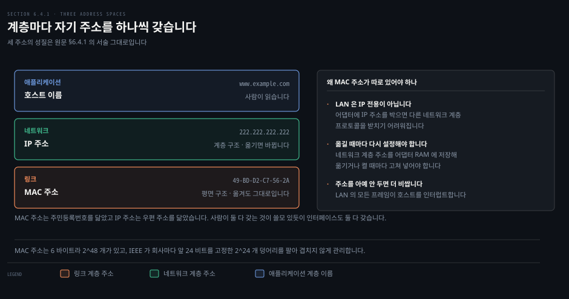
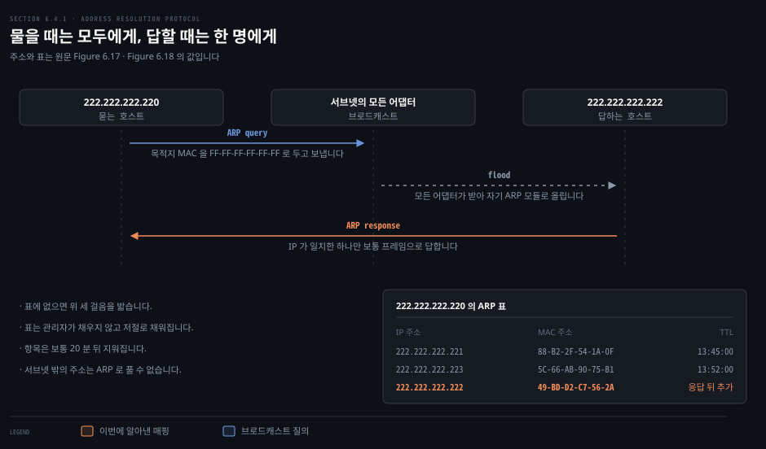
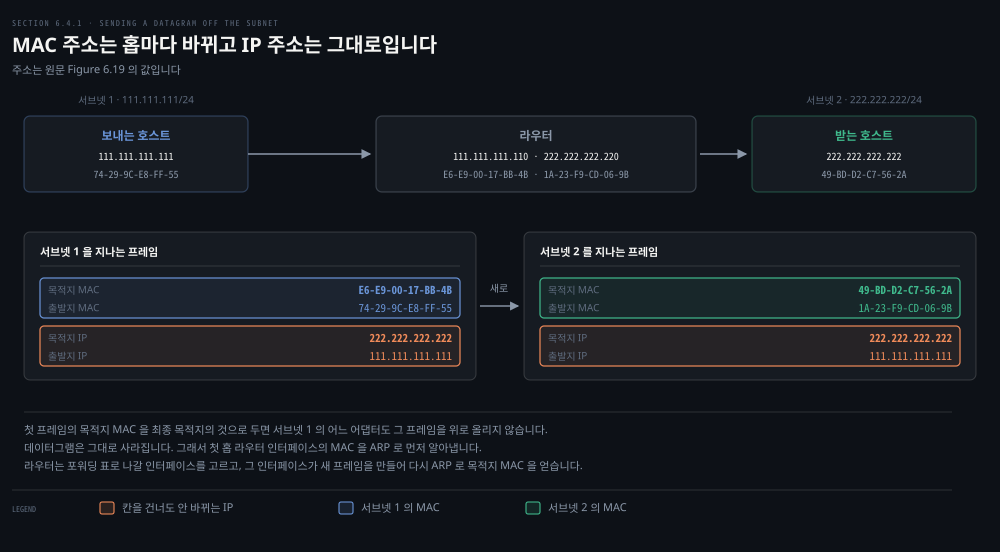
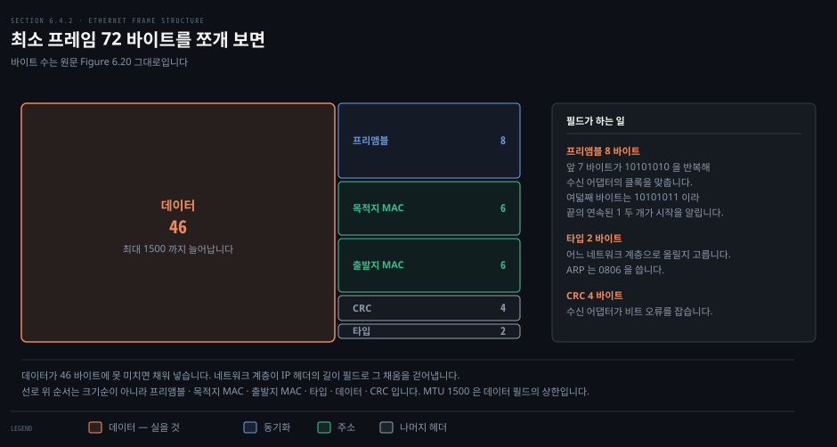
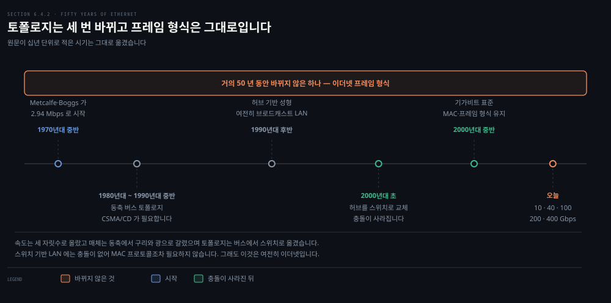

# 주소가 둘인 이유와 이더넷

---

> 앞 두 편이 링크를 공유하는 규칙을 다뤘다면, 이 편은 그 링크 위에서 서로를 어떻게 부르는지를 봅니다. 그리고 유선 LAN 시장을 통째로 가져간 이더넷의 프레임을 뜯어봅니다.

## 핵심 요약

> 이 편이 매달린 하나의 생각은 **주소가 둘인 이유는 계층을 독립적으로 두기 위해서이고, 그 대가가 홉마다 프레임을 다시 만드는 일**이라는 것입니다.

4장에서 인터페이스에 IP 주소가 붙는 것을 봤습니다. 링크 계층에도 주소가 있는데, 둘 다 필요한 이유가 이 편의 첫 물음입니다. 답은 계층 독립성입니다. LAN 은 IP 만을 위해 설계된 것이 아니고, 어댑터가 네트워크 계층 주소를 들고 있으면 옮길 때마다 다시 설정해야 합니다.

그 대가가 뒤따릅니다. 데이터그램 하나가 서브넷을 건널 때 **IP 주소는 그대로이지만 MAC 주소는 홉마다 바뀝니다.** 첫 프레임의 목적지 MAC 을 최종 목적지의 것으로 두면 그 데이터그램은 아무에게도 닿지 못하고 사라집니다.

이더넷 쪽에서는 프레임 형식이 이야기의 중심입니다. 속도가 세 자릿수로 오르고 토폴로지가 세 번 바뀌고 이제는 MAC 프로토콜조차 필요 없어졌는데, **거의 50 년 동안 프레임 형식만 그대로**입니다.

## 학습 목표

> 이 편을 읽고 나면 아래 다섯 가지를 스스로 해낼 수 있습니다.

1. MAC 주소와 IP 주소의 구조를 대비하고, 인터페이스가 왜 둘 다 가져야 하는지 설명합니다.
2. ARP 가 무엇을 하고 어디까지만 할 수 있는지 말하고, DNS 와의 차이를 짚습니다.
3. 서브넷 밖으로 보낼 때 첫 프레임의 목적지 MAC 이 무엇이어야 하는지 근거와 함께 답합니다.
4. 이더넷 프레임의 여섯 필드를 들고 각 필드가 무엇을 하는지 설명합니다.
5. 이더넷이 제공하는 서비스의 성격을 말하고, 프레임이 버려질 때 위 계층에서 무슨 일이 일어나는지 풉니다.

## 1. 주소가 왜 둘인가

> 인터페이스는 IP 주소와 MAC 주소를 함께 갖습니다. 중복처럼 보이지만 계층을 갈라 두려면 주소 체계도 갈라져 있어야 합니다.

### 풀려는 문제

4장에서 호스트와 라우터가 네트워크 계층 주소를 갖는 것을 배웠습니다. 그런데 링크 계층에도 주소가 있습니다. 어느 하나로 통일하면 될 것 같은데 실제로는 둘 다 씁니다. 이 중복이 낭비가 아니라 설계라는 것을 이해해야 다음 절의 ARP 가 왜 있어야 하는지 알 수 있습니다.

### 주소를 갖는 것은 어댑터입니다

정확히 말하면 링크 계층 주소를 갖는 것은 호스트나 라우터가 아니라 **그 어댑터**입니다. 네트워크 인터페이스가 여럿인 호스트나 라우터는 링크 계층 주소도 여럿 갖습니다. IP 주소를 여럿 갖는 것과 같은 이치입니다.

링크 계층 스위치는 다릅니다. 호스트나 라우터로 연결되는 인터페이스에 링크 계층 주소를 갖지 않습니다. 스위치의 일은 호스트와 라우터 사이로 데이터그램을 나르는 것이고, 그 일을 **투명하게** 합니다. 보내는 쪽이 중간의 스위치를 명시적으로 지목할 필요가 없다는 뜻입니다.

링크 계층 주소는 LAN 주소, 물리 주소, MAC 주소로 두루 불립니다. 이더넷과 802.11 무선 LAN 을 비롯한 대부분의 LAN 에서 MAC 주소는 6 바이트이고, 그래서 가능한 주소가 2⁴⁸ 개입니다. 바이트마다 16진수 두 자리로 적습니다.

영구적이도록 설계됐지만 지금은 소프트웨어로 어댑터의 MAC 주소를 바꿀 수 있습니다.

### 겹치지 않는 방법

대만의 회사와 벨기에의 회사가 만든 어댑터의 주소가 겹치지 않는 것은 IEEE 가 주소 공간을 관리하기 때문입니다. 어댑터를 만들려는 회사는 명목상의 요금을 내고 2²⁴ 개짜리 주소 덩어리를 삽니다. IEEE 는 MAC 주소의 앞 24 비트를 고정해 그 덩어리를 배정하고, 회사는 뒤 24 비트를 어댑터마다 다르게 만듭니다.

### 평면과 계층

MAC 주소는 **평면 구조**이고 어댑터가 어디로 가든 바뀌지 않습니다. 이더넷 인터페이스를 가진 노트북은 어디로 옮겨도 같은 MAC 주소를 갖습니다.

IP 주소는 반대로 **계층 구조**입니다. 네트워크 부분과 호스트 부분으로 나뉘고, 호스트가 붙는 망을 바꾸면 IP 주소도 바꿔야 합니다.

원문의 비유가 이 대비를 잘 잡습니다. MAC 주소는 주민등록번호를 닮았습니다. 평면 구조이고 사람이 어디로 가든 바뀌지 않습니다. IP 주소는 우편 주소를 닮았습니다. 계층 구조이고 이사하면 바꿔야 합니다. 사람이 둘 다 갖는 것이 쓸모 있듯이 인터페이스도 둘 다 갖습니다.

### 자기 것이 아니면 버립니다

보내는 어댑터는 목적지 어댑터의 MAC 주소를 프레임에 넣어 LAN 으로 내보냅니다. 스위치가 들어온 프레임을 모든 인터페이스로 브로드캐스트하는 경우가 있고 802.11 도 프레임을 브로드캐스트하므로, 어댑터는 자기에게 온 것이 아닌 프레임도 받게 됩니다.

그래서 어댑터는 프레임을 받으면 목적지 MAC 주소가 자기 것과 맞는지 확인합니다. 맞으면 안에 든 데이터그램을 꺼내 프로토콜 스택 위로 올립니다. 맞지 않으면 데이터그램을 올리지 않고 프레임을 버립니다. **목적지만 인터럽트되는 것이 이 검사의 목적입니다.**

LAN 의 모든 어댑터가 받아 처리하게 하고 싶을 때는 목적지 주소 필드에 **MAC 브로드캐스트 주소**를 넣습니다. 6 바이트 주소를 쓰는 LAN 에서는 1 이 48 개 연속된 값이고 16진수로 `FF-FF-FF-FF-FF-FF` 입니다.

### 계층을 독립적으로 두기 위해서

원문이 곁상자에서 이유를 셋으로 정리합니다.

1. **LAN 은 IP 전용이 아닙니다.** 임의의 네트워크 계층 프로토콜을 위해 설계됐습니다. 어댑터에 중립적인 MAC 주소 대신 IP 주소를 배정하면 다른 네트워크 계층 프로토콜을 받치기 어려워집니다.
2. **옮길 때마다 다시 설정해야 합니다.** 어댑터가 네트워크 계층 주소를 쓰면 그 주소를 어댑터 RAM 에 저장해 두어야 하고, 어댑터를 옮기거나 전원을 켤 때마다 다시 넣어야 합니다.
3. **주소를 아예 안 두면 더 비쌉니다.** 어댑터가 받은 모든 프레임의 데이터를 위로 올려 네트워크 계층이 판별하게 하면, 호스트가 같은 브로드캐스트 LAN 의 다른 호스트로 가는 프레임에도 전부 인터럽트됩니다.

계층이 서로 크게 독립적인 구성 요소로 남으려면 계층마다 자기 주소 체계를 가져야 합니다. 지금까지 셋을 봤습니다. 애플리케이션 계층의 호스트 이름, 네트워크 계층의 IP 주소, 링크 계층의 MAC 주소입니다.

## 2. ARP 는 같은 서브넷 안에서만 답을 줍니다

> 보내는 쪽은 목적지의 IP 주소만 압니다. 프레임을 만들려면 MAC 주소가 있어야 하고, 그 간극을 메우는 것이 ARP 입니다.

### 풀려는 문제

같은 서브넷의 `222.222.222.222` 로 데이터그램을 보내려 합니다. 어댑터에 넘겨야 하는 것은 데이터그램만이 아닙니다. 목적지의 MAC 주소도 함께 줘야 어댑터가 프레임을 만들 수 있습니다. IP 주소만 아는 상태에서 MAC 주소를 어떻게 얻는지가 물음입니다.

> **원문 정오**: 원문은 이 예를 세우면서 `"in the same subnet, in the addressing sense of Section 4.3.3"` 라고 적습니다. 9판에서 IPv4 주소 지정은 **§4.3.2** 이고 §4.3.3 은 NAT 입니다. 아래 DNS 참조와 같은 방향의 어긋남입니다.

### DNS 를 닮았지만 범위가 다릅니다

이 일을 하는 것이 **주소 결정 프로토콜(ARP)** 입니다.[^rfc826] 보내는 호스트의 ARP 모듈에 같은 LAN 의 IP 주소를 넣으면 대응하는 MAC 주소가 나옵니다.

호스트 이름을 IP 주소로 푸는 DNS 와 닮았습니다. 그런데 중요한 차이가 하나 있습니다. DNS 는 인터넷 어디에 있는 호스트든 이름을 풉니다. **ARP 는 같은 서브넷에 있는 호스트와 라우터 인터페이스의 IP 주소만 풉니다.** 캘리포니아의 노드가 미시시피의 노드 주소를 ARP 로 풀려 하면 오류가 돌아옵니다.

> **원문 정오**: 원문은 DNS 를 `"studied in Section 2.5"` 라고 적습니다. 9판에서 DNS 는 **§2.4** 이고, §2.5 는 비디오 스트리밍과 CDN 입니다. 2·3장에서 찾은 상호 참조 어긋남과 같은 유형입니다.

### 표에 없으면 소리쳐 묻습니다

호스트와 라우터는 메모리에 **ARP 표**를 두고 IP 주소와 MAC 주소의 매핑을 담습니다. 표에는 TTL 값도 함께 들어가 각 매핑이 언제 지워질지를 알려 줍니다. 서브넷의 모든 호스트와 라우터가 표에 들어 있는 것은 아닙니다. 한 번도 들어온 적 없는 것도 있고 만료된 것도 있습니다. 항목 하나의 통상적인 만료 시간은 표에 들어간 때로부터 20 분입니다.

표에 목적지 항목이 없으면 ARP 프로토콜로 주소를 풉니다. 보내는 쪽이 **ARP 패킷**을 만듭니다. 보내는 쪽과 받는 쪽의 IP 주소와 MAC 주소를 담는 필드가 있고, 질의 패킷과 응답 패킷의 형식이 같습니다.

보내는 호스트는 ARP 질의 패킷을 어댑터에 넘기면서 `FF-FF-FF-FF-FF-FF` 로 보내라고 알립니다. 어댑터는 그 패킷을 링크 계층 프레임에 담고 프레임의 목적지 주소를 브로드캐스트 주소로 두어 서브넷에 내보냅니다.

원문의 비유가 이 장면을 잘 그립니다. 회사 사무실의 칸막이 방에서 누군가 크게 외치는 것과 같습니다. "팔로알토 AnyCorp 112 호 13번 칸막이에 있는 사람의 주민등록번호가 무엇입니까."

서브넷의 모든 어댑터가 이 프레임을 받고, 브로드캐스트 주소이므로 각자 안의 ARP 패킷을 자기 ARP 모듈로 올립니다. 각 ARP 모듈이 자기 IP 주소가 질의의 목적지 IP 주소와 맞는지 봅니다. 맞는 하나가 원하는 매핑을 담은 응답 ARP 패킷을 되돌려 보냅니다.

### 두 가지 성질

여기서 눈여겨볼 것이 둘 있습니다.

첫째, **질의는 브로드캐스트 프레임에 실리고 응답은 보통 프레임에 실립니다.** 물을 때는 누가 답할지 모르니 모두에게 보내야 하고, 답할 때는 물은 상대의 MAC 주소를 이미 질의 패킷에서 알았으니 그 한 명에게만 보내면 됩니다.

둘째, **ARP 는 플러그 앤 플레이입니다.** ARP 표는 저절로 채워지고 시스템 관리자가 설정하지 않습니다. 호스트가 서브넷에서 떨어져 나가면 그 항목은 결국 다른 ARP 표에서 지워집니다.

### 계층 경계에 걸쳐 있습니다

ARP 가 링크 계층 프로토콜인지 네트워크 계층 프로토콜인지는 원문도 딱 잘라 말하지 않습니다. ARP 패킷은 링크 계층 프레임에 담기므로 구조상 링크 계층 *위*에 있습니다. 그런데 링크 계층 주소를 담은 필드가 있으니 링크 계층 프로토콜이라 할 만하고, 네트워크 계층 주소도 담으니 네트워크 계층 프로토콜이라 할 만도 합니다.

원문의 결론은 이렇습니다. ARP 는 **링크 계층과 네트워크 계층의 경계에 걸친 프로토콜**로 보는 것이 낫고, 1장에서 배운 단순한 계층 스택에 깔끔하게 들어가지 않습니다. 실제 프로토콜의 복잡함이 이런 것입니다.

캡처 화면에서 ARP 가 어떻게 보이는지는 [Wireshark 책 05-01](../paw_packet-analysis-wireshark/05-01.%EC%A3%BC%EC%86%8C%EB%A5%BC%20%EB%B0%9B%EC%95%84%20%EC%98%A4%EB%8A%94%20%ED%94%84%EB%A1%9C%ED%86%A0%EC%BD%9C.md)이 맡고 있으므로 다시 쓰지 않습니다.

## 3. 서브넷 밖으로 보낼 때는 목적지가 둘입니다

> 최종 목적지의 MAC 주소를 프레임에 적으면 그 데이터그램은 아무에게도 닿지 못합니다.

### 풀려는 문제

같은 서브넷 안이면 ARP 로 목적지 MAC 을 얻어 끝입니다. 그런데 목적지가 라우터 너머 다른 서브넷에 있으면 어느 MAC 주소를 적어야 할까요. 최종 목적지의 MAC 을 적는 것이 자연스러워 보이는데, 원문은 그것이 틀렸다고 못박습니다.

### 틀린 답이 왜 틀렸는가

원문 Figure 6.19 의 망을 봅니다. 서브넷 1 은 `111.111.111/24`, 서브넷 2 는 `222.222.222/24` 이고 라우터 하나가 둘을 잇습니다. 각 호스트는 IP 주소 하나와 어댑터 하나를 갖고, 라우터는 인터페이스마다 IP 주소와 ARP 모듈과 어댑터를 하나씩 갖습니다.

호스트 `111.111.111.111` 이 `222.222.222.222` 로 보내려 합니다. 목적지 호스트의 MAC 주소인 `49-BD-D2-C7-56-2A` 를 프레임에 적으면 어떻게 될까요.

**서브넷 1 의 어느 어댑터도 그 프레임을 위로 올리지 않습니다.** 프레임의 목적지 주소가 서브넷 1 의 어떤 어댑터 MAC 과도 맞지 않기 때문입니다. 원문의 표현으로는 데이터그램이 그대로 죽습니다.

### 맞는 답과 그다음

데이터그램이 서브넷 2 로 가려면 먼저 라우터 인터페이스 `111.111.111.110` 에 닿아야 합니다. 최종 목적지로 가는 경로의 첫 홉 라우터 주소입니다. 그러니 프레임의 목적지 MAC 은 그 인터페이스 어댑터의 주소인 `E6-E9-00-17-BB-4B` 여야 합니다. 이 주소를 얻는 방법이 ARP 입니다.

라우터의 서브넷 1 쪽 어댑터가 자기에게 온 프레임임을 확인하고 라우터의 네트워크 계층으로 올립니다. 여기서 끝이 아닙니다. 라우터가 **포워딩 표**를 보고 어느 인터페이스로 내보낼지 정합니다. 표는 `222.222.222.220` 인터페이스로 보내라고 알려 줍니다.

그 인터페이스가 데이터그램을 자기 어댑터에 넘기고, 어댑터가 **새 프레임**을 만들어 서브넷 2 로 내보냅니다. 이번에는 프레임의 목적지 MAC 이 최종 목적지의 것입니다. 라우터도 그 주소를 ARP 로 얻습니다.

정리하면 이렇습니다. **IP 주소 쌍은 종단에서 종단까지 그대로이고, MAC 주소 쌍은 링크마다 새로 채워집니다.** 앞 편에서 본 "프레임은 칸마다 새로 만들어진다"는 말이 여기서 주소로 구체화됩니다.

## 4. 이더넷 프레임의 여섯 필드

> 이더넷이 왜 이겼는가보다 먼저, 이더넷 프레임이 무엇을 담는지 봅니다. 이 형식이 거의 50 년 동안 안 바뀐 것이기도 합니다.

### 풀려는 문제

앞 절까지 주소를 다뤘습니다. 그 주소가 실제로 어느 자리에 얼마만큼 들어가는지, 그리고 그 옆에 무엇이 더 붙는지를 봐야 프레임을 읽을 수 있습니다.

### 여섯 필드

같은 이더넷 LAN 의 어댑터 A 가 어댑터 B 로 IP 데이터그램을 보내는 상황으로 봅니다. 어댑터 A 가 데이터그램을 이더넷 프레임에 담아 물리 계층으로 넘기고, 어댑터 B 가 프레임을 받아 데이터그램을 꺼내 네트워크 계층으로 올립니다.

- **데이터 (46 ~ 1,500 바이트)**: IP 데이터그램이 실립니다. 이더넷의 MTU 가 1,500 바이트라는 것이 이 상한에서 나옵니다. 데이터그램이 1,500 바이트를 넘으면 호스트가 단편화해야 합니다. 46 바이트에 못 미치면 46 까지 채워 넣고, 네트워크 계층이 IP 데이터그램 헤더의 길이 필드로 그 채움을 걷어냅니다.
- **목적지 주소 (6 바이트)**: 목적지 어댑터의 MAC 주소입니다. 어댑터 B 는 목적지 주소가 자기 것이거나 MAC 브로드캐스트 주소일 때만 데이터 필드를 네트워크 계층으로 올리고, 그 외에는 버립니다.
- **출발지 주소 (6 바이트)**: 프레임을 LAN 에 내보낸 어댑터의 MAC 주소입니다.
- **타입 (2 바이트)**: 이더넷이 네트워크 계층 프로토콜을 다중화하게 해 줍니다.
- **CRC (4 바이트)**: 받는 어댑터가 프레임의 비트 오류를 검출합니다.
- **프리앰블 (8 바이트)**: 프레임이 시작하는 자리를 알리고 클록을 맞춥니다.

> **원문 정오**: 원문은 단편화를 `"as discussed in Section 4.3.2"` 라 적습니다. 9판에서 단편화를 언급하는 곳은 **§4.3.1 IPv4 Datagram Format** 이고 §4.3.2 는 IPv4 주소 지정입니다. 게다가 §4.3.1 은 `"We'll not cover fragmentation here"` 라며 온라인 자료로 넘깁니다. 절 번호도 틀렸고, 그 절에서 다뤘다는 전제 자체가 성립하지 않습니다.

### 타입 필드가 계층을 잇습니다

호스트는 IP 말고 다른 네트워크 계층 프로토콜도 쓸 수 있습니다. 한 호스트가 애플리케이션마다 다른 네트워크 계층 프로토콜을 쓰기도 합니다. 그래서 프레임이 어댑터 B 에 도착하면 데이터 필드의 내용을 어느 네트워크 계층 프로토콜로 올려야 할지 알아야 합니다.

각 프로토콜이 표준화된 타입 번호를 갖습니다. ARP 도 자기 번호를 갖고, 들어온 프레임의 타입 필드가 16진수 `0806` 이면 안의 ARP 패킷이 ARP 프로토콜로 올라갑니다.

원문이 이 필드의 자리를 정확히 짚습니다. 타입 필드는 네트워크 계층 데이터그램의 프로토콜 필드, 트랜스포트 계층 세그먼트의 포트 번호 필드와 같은 역할입니다. **한 계층의 프로토콜을 그 위 계층의 프로토콜에 붙이는 접착제**입니다.

### 프리앰블은 클록을 맞춥니다

프레임은 8 바이트 프리앰블로 시작합니다. 앞 7 바이트의 값이 각각 `10101010` 이고 마지막 바이트는 `10101011` 입니다.

왜 클록을 맞춰야 할까요. 어댑터 A 는 LAN 종류에 따라 정해진 속도로 프레임을 보내려 하지만 정확히 그 속도로 보내지는 못합니다. 목표 속도에서 얼마간 흔들리고, 그 흔들림을 다른 어댑터가 미리 알 수 없습니다. 받는 어댑터는 프리앰블 앞 7 바이트의 비트에 물려 들어가는 것만으로 어댑터 A 의 클록에 맞출 수 있습니다.

여덟째 바이트의 마지막 두 비트가 연속된 1 두 개입니다. 이것이 어댑터 B 에게 이제부터 중요한 내용이 온다고 알립니다.

## 5. 이더넷이 주는 서비스와 이름

> 이더넷은 CRC 로 오류를 잡지만 확인 응답도 부정 응답도 보내지 않습니다. 그래서 위 계층으로 올라가는 데이터그램 흐름에 구멍이 생길 수 있습니다.

### 풀려는 문제

CRC 필드가 있으니 이더넷이 오류를 잡는다는 것은 알겠습니다. 그런데 잡은 다음에 무엇을 하는지가 남습니다. 여기서 3장에서 배운 TCP 의 재전송과 어떻게 맞물리는지가 갈립니다.

### 비연결이고 비신뢰입니다

모든 이더넷 기술은 네트워크 계층에 **비연결 서비스**를 제공합니다. 어댑터 A 가 어댑터 B 로 데이터그램을 보낼 때 먼저 핸드셰이크하지 않고 그냥 프레임을 LAN 으로 내보냅니다. IP 의 데이터그램 서비스, UDP 의 비연결 서비스와 같은 성격입니다.

그리고 **비신뢰 서비스**입니다. 어댑터 B 는 프레임을 받아 CRC 검사를 돌리지만, 통과했다고 확인 응답을 보내지도 않고 실패했다고 부정 응답을 보내지도 않습니다. 실패하면 그냥 버립니다. 그래서 어댑터 A 는 자기가 보낸 프레임이 B 에 닿았는지도, CRC 를 통과했는지도 알지 못합니다.

이 단순함이 이더넷을 싸게 만듭니다. 대신 네트워크 계층으로 올라가는 데이터그램 흐름에 구멍이 생길 수 있습니다.

### 구멍이 앱까지 가는가

버려진 프레임 때문에 생긴 구멍을 호스트 B 의 애플리케이션도 보게 될까요. 3장의 내용대로 UDP 를 쓰느냐 TCP 를 쓰느냐에 달렸습니다.

UDP 를 쓰면 애플리케이션이 데이터의 구멍을 그대로 봅니다. TCP 를 쓰면 호스트 B 의 TCP 가 버려진 프레임에 담겼던 데이터를 확인 응답하지 않고, 그래서 호스트 A 의 TCP 가 재전송합니다.

여기에 원문이 짚는 재미있는 자리가 있습니다. TCP 가 재전송한 데이터는 결국 그것이 버려졌던 바로 그 이더넷 어댑터로 돌아옵니다. 그런 뜻에서 **이더넷은 데이터를 재전송하기는 합니다.** 다만 자기가 새 데이터그램을 나르는지 이미 한 번 나른 적 있는 데이터를 나르는지 알지 못합니다.

### 이름을 읽는 법

이더넷은 하나의 프로토콜 표준처럼 말해 왔지만 실제로는 여러 갈래입니다. `10BASE-T`, `10BASE-2`, `100BASE-T`, `1000BASE-LX`, `10GBASE-T`, `40GBASE-T` 같은 이름이 IEEE 802.3 작업 그룹에서 표준화됐습니다.

이름에는 규칙이 있습니다. 앞부분이 속도이고, `BASE` 는 기저대역을 뜻하며 그 물리 매체가 이더넷 트래픽만 나른다는 의미입니다. 뒷부분이 물리 매체이고 `T` 는 대체로 트위스티드페어 구리선입니다. 이더넷은 링크 계층 명세이자 물리 계층 명세라서 동축, 구리, 광을 두루 씁니다.

> **원문 정오**: 원문은 앞부분의 값으로 `"10, 100, 1000, or 10G"` **넷**을 들고, 대응하는 속도로 `"10 Megabit (per second), 100 Megabit, Gigabit, 10 Gigabit and 40 Gigabit Ethernet, respectively"` **다섯**을 답니다. 바로 앞 문장이 예로 든 `40GBASE-T` 의 접두어 `40G` 가 목록에서 빠졌습니다. `respectively` 로 짝지으라고 적어 놓고 개수가 맞지 않습니다.

> **노트의 읽기**: 원문은 `"The early 10BASE-2 and 10BASE-5 standards specify 10 Mbps Ethernet over two types of coaxial cable, each limited in length to 500 meters"` 라고 적습니다. `each` 가 둘 다 500 미터라는 뜻인데, 그러면 두 표준을 가르는 마지막 숫자가 무엇을 가리키는지 설명이 되지 않습니다. 원문 자신이 이름의 뒷부분은 물리 매체를 가리킨다고 했고 앞의 `10` 은 속도로 같으므로, 두 이름을 가르는 것은 `2` 와 `5` 뿐입니다. **다만 IEEE 802.3 원문을 열지 못해 각 표준의 실제 세그먼트 길이는 확인하지 못했습니다.** 확인 불가로 남겨 둡니다.

### 토폴로지는 세 번 바뀌었습니다

원조 이더넷은 1970년대 중반 밥 메칼프와 데이비드 보그스가 만들었고 동축 버스로 노드를 이었습니다. 버스 토폴로지는 1980년대를 지나 1990년대 중반까지 남았습니다. 버스 이더넷은 브로드캐스트 LAN 이라 앞 편에서 본 CSMA/CD 가 필요했습니다.

1990년대 후반에는 대부분의 기업과 대학이 허브 기반 성형 토폴로지로 바꿨습니다. 허브는 프레임이 아니라 개별 비트를 다루는 물리 계층 장치입니다. 한 인터페이스에서 비트가 들어오면 그것을 다시 만들어 세기를 키워 다른 모든 인터페이스로 내보냅니다. 그래서 허브 성형 이더넷도 브로드캐스트 LAN 이고, 두 인터페이스에서 프레임이 동시에 들어오면 충돌이 납니다.

2000년대 초에 가운데의 허브가 스위치로 바뀌었습니다. 스위치는 충돌이 없을 뿐 아니라 진짜 저장 후 전달 패킷 교환기입니다. 3계층까지 다루는 라우터와 달리 2계층까지만 다룹니다.

2000년대 중반에는 기가비트 이더넷 표준이 자리를 잡았습니다. 앞선 10 Mbps 와 100 Mbps 의 MAC 프로토콜과 프레임 형식은 그대로 두고 더 빠른 물리 계층만 새로 정의했습니다. 오늘날은 10, 40, 100, 200, 400 Gbps 표준까지 나와 있습니다.

### MAC 프로토콜조차 필요 없어졌습니다

원문이 절 끝에 스스로 물음을 던집니다. 오늘날 이더넷이 스위치 기반 성형에 저장 후 전달 방식이라면, 이더넷 MAC 프로토콜이 아직도 필요할까요.

스위치는 자기 전송을 조율해 같은 인터페이스로 한 번에 두 프레임을 내보내지 않습니다. 게다가 현대 스위치는 전이중이라 스위치와 노드가 서로에게 동시에 프레임을 보내도 간섭하지 않습니다. **스위치 기반 이더넷 LAN 에는 충돌이 없고, 따라서 MAC 프로토콜이 필요 없습니다.**

속도는 세 자릿수로 올랐고 매체는 여러 갈래로 갈렸고 스위치 이더넷이 주류가 됐고 이제 MAC 프로토콜조차 없어도 됩니다. 그래도 이것이 이더넷이냐는 물음에 원문은 정의상 그렇다고 답합니다. 그리고 거의 50 년 동안 바뀌지 않은 것이 하나 있다고 덧붙입니다. **이더넷의 프레임 형식**입니다.

## 결정 치트시트

> 이 편의 판단 규칙은 셋입니다. 어느 MAC 을 적을지, 어디까지 ARP 로 풀 수 있는지, 프레임이 버려지면 누가 메우는지입니다.

| 상황 | 프레임의 목적지 MAC | 이유 |
|------|-------------------|------|
| 같은 서브넷의 호스트로 | 그 호스트 어댑터의 MAC | ARP 로 직접 풉니다 |
| 다른 서브넷의 호스트로 | **첫 홉 라우터 인터페이스의 MAC** | 최종 목적지 MAC 을 적으면 프레임이 아무에게도 안 올라갑니다 |
| LAN 의 모두에게 | `FF-FF-FF-FF-FF-FF` | 48 비트가 전부 1 인 브로드캐스트 주소 |

| 물음 | 답 |
|------|-----|
| ARP 로 캘리포니아에서 미시시피 주소를 풀 수 있는가 | 풀 수 없습니다. ARP 는 같은 서브넷 안에서만 답합니다 |
| ARP 표를 관리자가 채워야 하는가 | 채우지 않습니다. 플러그 앤 플레이로 저절로 채워집니다 |
| CRC 검사에 실패한 프레임은 | 그냥 버려집니다. 확인 응답도 부정 응답도 없습니다 |
| 그 구멍은 누가 메우는가 | TCP 면 종단에서 재전송하고, UDP 면 애플리케이션이 구멍을 봅니다 |

## 심화 학습

> 원문이 준 바이트 수만으로 계산되는 두 가지를 확인했습니다. 둘 다 실무에서 자주 부딪히는 숫자로 이어집니다.

### 작은 프레임일수록 오버헤드가 큽니다

프레임의 고정 오버헤드는 프리앰블 8, 목적지 6, 출발지 6, 타입 2, CRC 4 를 더한 **26 바이트**입니다. 데이터 크기별로 프레임에서 데이터가 차지하는 비중을 계산하면 이렇습니다.

| 데이터 | 프레임 전체 | 데이터 비중 |
|-------|-----------|-----------|
| 46 바이트 | 72 바이트 | 63.9 % |
| 128 바이트 | 154 바이트 | 83.1 % |
| 512 바이트 | 538 바이트 | 95.2 % |
| 1,500 바이트 | 1,526 바이트 | 98.3 % |

작은 패킷을 많이 보내는 워크로드에서 링크 이용률이 왜 기대만큼 안 나오는지가 이 표에 있습니다. 최소 크기 프레임에서는 선로에 실린 비트의 **36 퍼센트가 헤더**입니다.

### MTU 1500 이 MSS 1460 이 되는 자리

이더넷의 MTU 1,500 바이트에서 위 계층 헤더를 빼면 3장에서 본 MSS 가 나옵니다. IPv4 헤더 20 바이트와 TCP 헤더 20 바이트를 빼면 1,460 바이트입니다. IPv6 는 헤더가 40 바이트 고정이라 1,440 바이트가 됩니다.[^ip-headers]

TCP 연결의 MSS 로 1460 이 자주 보이는 이유가 여기 있습니다. **트랜스포트 계층의 숫자가 링크 계층 상한에서 내려온 것입니다.** 4장에서 IPv6 헤더가 40 바이트 고정이라고 배운 것이 여기서 20 바이트의 차이로 나타납니다.

### 타입 번호는 등록부가 관리합니다

원문은 ARP 의 `0806` 만 예로 듭니다. 타입 번호 전체는 IANA 의 이더넷 번호 등록부가 관리하며, 새 네트워크 계층 프로토콜이 값을 받아 가는 자리도 여기입니다.[^ethertype]

## 면접 대비

> 이 편에서 나올 만한 물음 셋입니다. 셋 다 "왜 하나로 통일하지 않았는가"의 변형입니다.

**IP 주소가 있는데 MAC 주소가 왜 또 필요합니까.** 계층을 독립적으로 두기 위해서입니다. LAN 은 IP 전용이 아니라 임의의 네트워크 계층 프로토콜을 받치도록 설계됐고, 어댑터가 네트워크 계층 주소를 들고 있으면 옮기거나 켤 때마다 다시 설정해야 합니다. 주소를 아예 없애면 호스트가 LAN 의 모든 프레임에 인터럽트됩니다.

**다른 서브넷으로 보낼 때 프레임의 목적지 MAC 은 무엇입니까.** 첫 홉 라우터 인터페이스의 MAC 입니다. 최종 목적지의 MAC 을 적으면 같은 서브넷의 어느 어댑터와도 맞지 않아 아무도 그 프레임을 위로 올리지 않습니다. IP 주소는 종단까지 그대로이고 MAC 주소만 링크마다 바뀝니다.

**이더넷이 CRC 로 오류를 잡으면 신뢰성이 있는 것 아닙니까.** 아닙니다. 검사에 실패하면 프레임을 버릴 뿐 확인 응답도 부정 응답도 보내지 않습니다. 보낸 쪽은 닿았는지 모릅니다. 그 구멍은 TCP 가 종단에서 메우고, UDP 를 쓰면 애플리케이션이 그대로 봅니다.

## 핵심 개념 체크리스트

- [ ] MAC 주소를 갖는 것이 호스트가 아니라 무엇인지 말할 수 있는가?
- [ ] 링크 계층 스위치가 왜 MAC 주소를 갖지 않는지 설명할 수 있는가?
- [ ] 평면 주소와 계층 주소의 차이를 예로 들 수 있는가?
- [ ] MAC 브로드캐스트 주소를 적을 수 있는가?
- [ ] ARP 와 DNS 의 결정적 차이를 한 문장으로 말할 수 있는가?
- [ ] ARP 질의가 브로드캐스트이고 응답이 보통 프레임인 이유를 설명할 수 있는가?
- [ ] 서브넷 밖으로 보낼 때 첫 프레임의 목적지 MAC 을 지목할 수 있는가?
- [ ] 이더넷 프레임의 여섯 필드와 각 바이트 수를 들 수 있는가?
- [ ] 이더넷의 MTU 가 1,500 바이트인 근거를 프레임 구조로 설명할 수 있는가?
- [ ] 스위치 기반 이더넷에 MAC 프로토콜이 필요 없는 이유를 말할 수 있는가?

## 관련 문서

- [이 폴더의 정독 인덱스](./README.md) — 장별 진도와 학습 상태
- [06-02 하나의 채널을 여럿이 어떻게 나눠 쓰는가](./06-02.%ED%95%98%EB%82%98%EC%9D%98%20%EC%B1%84%EB%84%90%EC%9D%84%20%EC%97%AC%EB%9F%BF%EC%9D%B4%20%EC%96%B4%EB%96%BB%EA%B2%8C%20%EB%82%98%EB%88%A0%20%EC%93%B0%EB%8A%94%EA%B0%80.md) — CSMA/CD 가 이더넷의 MAC 프로토콜로 나온 자리
- [04-03 IP — 데이터그램과 주소](./04-03.IP%20%E2%80%94%20%EB%8D%B0%EC%9D%B4%ED%84%B0%EA%B7%B8%EB%9E%A8%EA%B3%BC%20%EC%A3%BC%EC%86%8C.md) — 서브넷과 IPv4 헤더
- [Wireshark 책 05-01 주소를 받아 오는 프로토콜](../paw_packet-analysis-wireshark/05-01.%EC%A3%BC%EC%86%8C%EB%A5%BC%20%EB%B0%9B%EC%95%84%20%EC%98%A4%EB%8A%94%20%ED%94%84%EB%A1%9C%ED%86%A0%EC%BD%9C.md) — ARP 를 캡처에서 읽는 법

## 참고 자료

- 원본: 《Computer Networking: A Top-Down Approach》 9판, James F. Kurose · Keith W. Ross, Pearson. §6.4 · §6.4.1 · §6.4.2 (책 413–426쪽)
- [RFC 826 — An Ethernet Address Resolution Protocol](https://www.rfc-editor.org/rfc/rfc826)
- [RFC 1180 — A TCP/IP Tutorial](https://www.rfc-editor.org/rfc/rfc1180)
- [IANA — IEEE 802 Numbers (Ethertype 등록부)](https://www.iana.org/assignments/ieee-802-numbers/ieee-802-numbers.xhtml)

[^rfc826]: RFC 826 — An Ethernet Address Resolution Protocol. 원문이 ARP 의 정의로 지목하는 문서입니다. <https://www.rfc-editor.org/rfc/rfc826>
[^ip-headers]: 헤더 크기는 이 책 §4.3.1 IPv4 20 바이트와 §4.3.4 IPv6 40 바이트 고정, §3.5 TCP 20 바이트를 그대로 쓴 값입니다. 뺄셈은 이 노트가 했습니다.
[^ethertype]: IANA — IEEE 802 Numbers. 이더넷 타입 번호 등록부입니다. <https://www.iana.org/assignments/ieee-802-numbers/ieee-802-numbers.xhtml>
