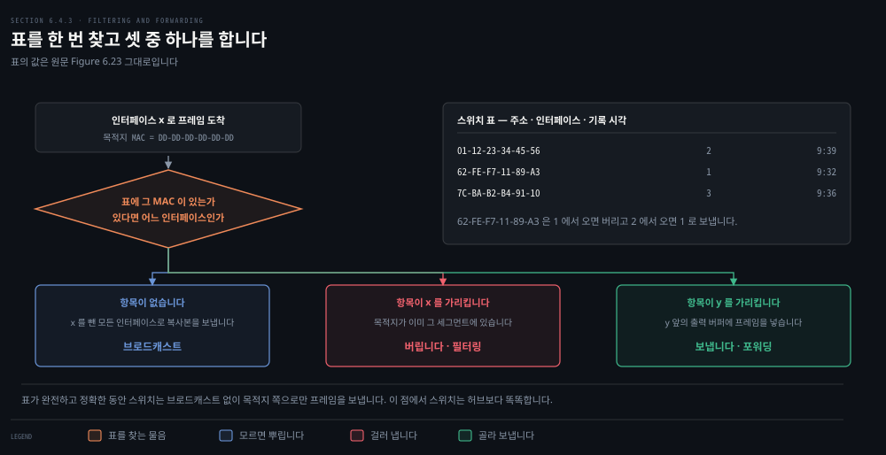
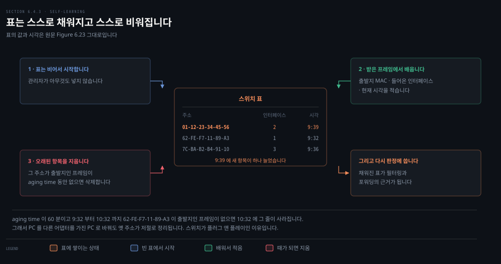
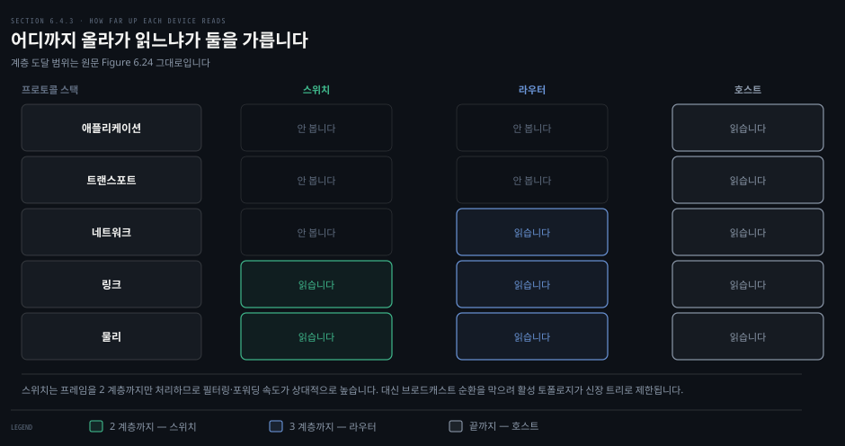
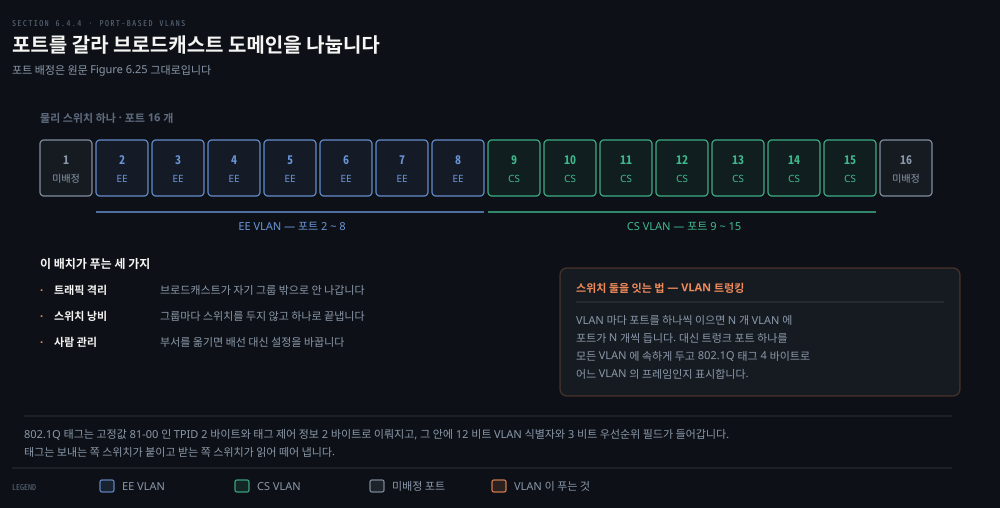
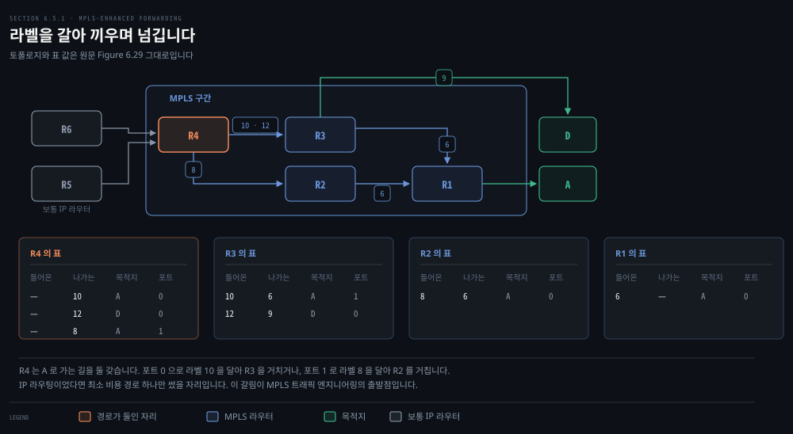
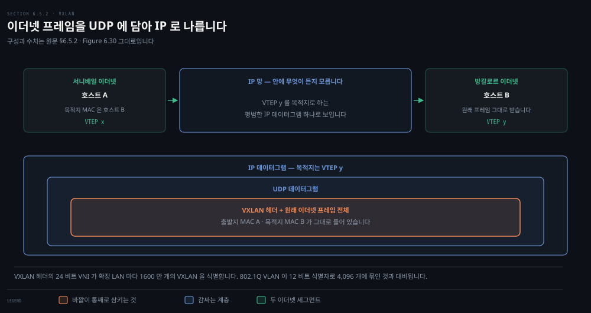

# 스위치는 어떻게 배우고 무엇으로 갈라놓는가

---

> 앞 편에서 스위치를 "투명하게 나르는 장치"라고만 하고 넘어갔습니다. 이 편은 그 안을 열어 표가 어떻게 채워지는지 보고, 그 표를 논리적으로 쪼개는 VLAN 과 망 전체를 링크 하나로 감싸는 기술까지 갑니다.

## 핵심 요약

> 이 편이 매달린 하나의 생각은 **링크 계층이 사람 손을 덜어내는 방향으로 진화해 왔다**는 것입니다.

스위치 표는 관리자가 채우지 않습니다. 들어온 프레임의 출발지 주소를 보고 저절로 채워집니다. 일정 시간이 지나면 저절로 지워지기도 합니다. 원문은 이것을 **플러그 앤 플레이**라 부르며 라우터와 견줄 때 스위치의 가장 큰 장점으로 꼽습니다.

VLAN 도 같은 방향입니다. 부서를 옮긴 직원 때문에 배선을 다시 하는 대신 **설정 한 줄을 바꿉니다.** 물리 스위치 하나의 포트를 그룹으로 나누면 그룹마다 별개의 브로드캐스트 도메인이 됩니다.

그 끝에 링크 가상화가 있습니다. MPLS 는 IP 주소를 안 보고 라벨만 보고 넘기고, VXLAN 은 이더넷 프레임을 UDP 에 담아 지구 반대편까지 보냅니다. **링크라는 말이 전선에서 채널로, 채널에서 망 전체로 넓어지는 것**이 이 장의 마지막 걸음입니다.

## 학습 목표

> 이 편을 읽고 나면 아래 다섯 가지를 스스로 해낼 수 있습니다.

1. 스위치가 프레임을 받았을 때 하는 세 가지 판정을 들고, 각각 언제 일어나는지 설명합니다.
2. 스위치 표가 어떻게 채워지고 어떻게 비워지는지 단계로 풉니다.
3. 스위치와 라우터를 계층 도달 범위·플러그 앤 플레이·최적 경로 세 축으로 견줍니다.
4. VLAN 이 푸는 세 가지 문제를 들고, 트렁킹과 802.1Q 태그가 왜 필요한지 말합니다.
5. MPLS 와 VXLAN 이 각각 무엇을 링크로 삼는지 설명합니다.

## 1. 스위치는 무엇을 거르고 무엇을 넘기는가

> 스위치는 표를 한 번 찾고 셋 중 하나를 합니다. 뿌리거나, 버리거나, 골라 보냅니다.

### 풀려는 문제

앞 편에서 스위치가 호스트와 라우터 사이로 프레임을 투명하게 나른다고만 했습니다. 그 투명함이 어떻게 만들어지는지, 그리고 아무도 스위치를 지목하지 않는데 스위치가 어떻게 프레임을 어디로 보낼지 정하는지가 남았습니다.

### 두 함수와 하나의 표

스위치가 하는 일은 둘로 나뉩니다. **필터링**은 프레임을 어느 인터페이스로 보낼지 아니면 그냥 버릴지 정하는 기능이고, **포워딩**은 프레임을 보낼 인터페이스를 정해 그리로 옮기는 기능입니다. 둘 다 **스위치 표**로 합니다.

표는 LAN 의 호스트와 라우터 중 일부를 담습니다. 전부일 필요는 없습니다. 항목 하나에는 MAC 주소, 그 주소로 가는 스위치 인터페이스, 그 항목이 표에 들어간 시각이 들어갑니다.

출력 인터페이스로 프레임이 몰릴 수 있으므로 스위치 출력 인터페이스는 버퍼를 갖습니다. 라우터 출력 인터페이스가 데이터그램용 버퍼를 갖는 것과 같은 구조입니다.

### 세 가지 경우

목적지 주소가 `DD-DD-DD-DD-DD-DD` 인 프레임이 인터페이스 `x` 로 들어왔다고 하겠습니다. 스위치는 그 MAC 주소로 표를 찾고 세 갈래 중 하나로 갑니다.

- **표에 항목이 없습니다.** `x` 를 뺀 모든 인터페이스 앞의 출력 버퍼로 복사본을 보냅니다. 목적지를 모르면 뿌립니다.
- **항목이 `x` 를 가리킵니다.** 프레임이 이미 그 어댑터가 있는 LAN 세그먼트에서 온 것입니다. 다른 어디로도 보낼 필요가 없으므로 버립니다. 이것이 **필터링**입니다.
- **항목이 `x` 가 아닌 `y` 를 가리킵니다.** `y` 에 붙은 세그먼트로 보내야 합니다. `y` 앞의 출력 버퍼에 프레임을 넣습니다. 이것이 **포워딩**입니다.

원문의 예로 걸어 보면 이렇습니다. 목적지 `62-FE-F7-11-89-A3` 인 프레임이 인터페이스 1 에서 들어오면, 표는 목적지가 인터페이스 1 쪽에 있다고 알려 줍니다. 목적지가 있는 세그먼트에 이미 방송된 것이므로 스위치는 버립니다. 같은 프레임이 인터페이스 2 에서 들어오면 인터페이스 1 앞의 버퍼로 보냅니다.

**표가 완전하고 정확한 동안 스위치는 브로드캐스트 없이 목적지 쪽으로만 보냅니다.** 이 점에서 스위치는 허브보다 똑똑합니다.

### 라우터의 표와는 다릅니다

프레임 포워딩이 4장의 데이터그램 포워딩과 닮아 보입니다. 실제로 §4.4 의 일반화 포워딩에서 현대 패킷 스위치가 2계층 목적지 MAC 으로도 3계층 목적지 IP 로도 포워딩하게 설정될 수 있다는 것을 봤습니다.

그래도 원문은 구분을 못박습니다. **스위치는 IP 주소가 아니라 MAC 주소로 넘깁니다.** 그리고 SDN 이 아닌 전통적 맥락의 스위치 표는 라우터의 포워딩 표와 아주 다른 방식으로 만들어집니다. 그 방식이 다음 절입니다.

## 2. 표는 스스로 채워지고 스스로 비워집니다

> 관리자도 설정 프로토콜도 필요 없습니다. 프레임의 출발지 주소가 표를 먹이고, 그 표가 다음 판정을 먹입니다.

### 풀려는 문제

라우터의 포워딩 표는 OSPF 같은 라우팅 프로토콜이 채웁니다. 스위치에는 그런 링크 계층 대응물이 있을까요, 아니면 과로한 관리자가 손으로 넣어야 할까요. 앞 절이 이 물음으로 끝났습니다.

### 세 단계

답은 **자기 학습**입니다. 표가 자동으로, 동적으로, 자율적으로 만들어집니다. 관리자의 개입도 설정 프로토콜도 없습니다.

1. 스위치 표는 비어서 시작합니다.
2. 인터페이스로 프레임이 들어올 때마다 스위치는 프레임의 출발지 주소 필드에 있는 MAC 주소, 그 프레임이 들어온 인터페이스, 현재 시각을 표에 적습니다. 이렇게 보낸 쪽이 어느 LAN 세그먼트에 있는지가 기록됩니다. LAN 의 모든 호스트가 언젠가 프레임을 보내면 모두가 표에 들어갑니다.
3. 어떤 주소가 출발지인 프레임이 일정 시간 동안 오지 않으면 그 주소를 지웁니다. 이 시간을 **aging time** 이라 부릅니다.

원문의 예를 따라가면 9시 39분에 출발지 주소 `01-12-23-34-45-56` 인 프레임이 인터페이스 2 에서 들어옵니다. 그 주소가 표에 없으므로 스위치가 새 항목을 더합니다.

aging time 이 60 분이고 9시 32분부터 10시 32분까지 `62-FE-F7-11-89-A3` 이 출발지인 프레임이 하나도 오지 않으면, 10시 32분에 스위치가 그 주소를 표에서 지웁니다. **PC 를 다른 어댑터를 가진 PC 로 바꿔도 옛 주소가 저절로 정리되는 것이 이 규칙 덕분입니다.**

### 그래서 플러그 앤 플레이입니다

스위치를 설치하려는 관리자가 할 일은 LAN 세그먼트를 스위치 인터페이스에 꽂는 것뿐입니다. 설치할 때도, 호스트를 세그먼트에서 떼어낼 때도 표를 설정하지 않습니다.

스위치는 **전이중**이기도 합니다. 어느 인터페이스든 동시에 보내고 받을 수 있습니다. 앞 편에서 스위치 기반 이더넷에 MAC 프로토콜이 필요 없다고 한 근거가 여기 있습니다.

리눅스 브리지가 같은 표를 어떻게 들고 있는지는 [`networking/01-01`](../../networking/01-01.%EB%84%A4%ED%8A%B8%EC%9B%8C%ED%82%B9%20%EA%B8%B0%EC%B4%88.md)이 커널 쪽에서 다룹니다. 이 편은 그 표가 왜 저절로 채워지는가라는 규격만 맡습니다.

## 3. 스위치와 라우터는 어디까지 올라가 읽는가

> 둘 다 저장 후 전달 패킷 교환기입니다. 갈리는 것은 어느 계층까지 읽느냐이고, 거기서 나머지 차이가 따라옵니다.

### 풀려는 문제

부서 LAN 과 서버와 게이트웨이 라우터를 잇는 자리에 스위치를 둘 수도 라우터를 둘 수도 있습니다. 라우터를 두어도 충돌 없이 부서 간 통신이 됩니다. 둘 다 후보라면 무엇을 기준으로 고를지가 물음입니다.

### 스위치의 장점과 약점

스위치는 플러그 앤 플레이입니다. 그리고 필터링·포워딩 속도가 상대적으로 높습니다. 스위치는 프레임을 2계층까지만 처리하는 반면 라우터는 데이터그램을 3계층까지 처리하기 때문입니다.

약점도 분명합니다. 브로드캐스트 프레임이 돌고 도는 것을 막으려면 스위치 망의 활성 토폴로지가 **신장 트리**로 제한됩니다. 큰 스위치 망은 호스트와 라우터에 큰 ARP 표를 요구하고 상당한 ARP 트래픽과 처리를 만듭니다. 그리고 **브로드캐스트 폭풍**에 약합니다. 호스트 하나가 고장 나 이더넷 브로드캐스트 프레임을 끝없이 보내면 스위치들이 그것을 다 퍼뜨려 망 전체가 무너집니다.

### 라우터의 장점과 약점

네트워크 주소는 계층 구조라 망에 여분 경로가 있어도 패킷이 라우터 사이를 맴돌지 않습니다. 그래서 신장 트리에 묶이지 않고 출발지와 목적지 사이의 최선 경로를 씁니다. 유럽과 북미 사이에 여러 활성 링크를 둘 수 있는 풍부한 토폴로지가 이 성질 덕분입니다. 라우터는 2계층 브로드캐스트 폭풍에 대한 방화벽 노릇도 합니다.

가장 큰 약점은 플러그 앤 플레이가 아니라는 것입니다. 라우터도 거기 붙는 호스트도 IP 주소를 설정해야 합니다. 그리고 3계층 필드까지 처리하므로 패킷당 처리 시간이 스위치보다 큰 편입니다.

### 규모가 기준입니다

원문이 정리한 비교는 이렇습니다.

| 항목 | 허브 | 라우터 | 스위치 |
|------|------|--------|--------|
| 트래픽 격리 | 없음 | 있음 | 있음 |
| 플러그 앤 플레이 | 예 | 아니오 | 예 |
| 최적 경로 | 없음 | 있음 | 없음 |

고르는 기준은 규모입니다. 호스트 몇백 대에 LAN 세그먼트가 몇 개인 작은 망은 스위치로 충분합니다. IP 주소를 설정하지 않고도 트래픽을 국소화하고 총 처리량을 올립니다.

호스트 수천 대인 큰 망은 스위치와 함께 **라우터를 망 안에 둡니다.** 트래픽을 더 튼튼하게 격리하고 브로드캐스트 폭풍을 잡고 더 똑똑한 경로를 쓰기 위해서입니다.

## 4. VLAN 은 포트를 갈라 놓습니다

> 물리 배선을 바꾸지 않고 논리적으로 LAN 을 나눕니다. 부서를 옮긴 직원 때문에 케이블을 다시 꽂지 않아도 됩니다.

### 풀려는 문제

부서마다 자기 스위치드 LAN 을 두고 그것을 스위치 계층으로 잇는 구성은 이상적인 세계에서는 잘 돕니다. 현실은 그렇지 않고, 원문이 문제를 셋으로 꼽습니다.

- **트래픽 격리가 안 됩니다.** 계층 구조가 그룹 트래픽을 한 스위치 안에 가두기는 합니다. 그런데 ARP 와 DHCP 메시지를 담은 프레임, 자기 학습 스위치가 아직 목적지를 못 배운 프레임 같은 브로드캐스트는 여전히 기관 망 전체를 지나야 합니다. 성능도 문제지만 보안과 사생활 쪽이 더 큽니다. 한 그룹이 임원진이고 다른 그룹이 패킷 스니퍼를 돌리는 불만 있는 직원들이라면, 관리자는 임원의 트래픽이 직원 호스트에 아예 닿지 않기를 바랄 것입니다.
- **스위치가 낭비됩니다.** 그룹이 셋이 아니라 열이면 1단계 스위치가 열 대 필요합니다. 각 그룹이 열 명 미만이라면 96 포트 스위치 한 대로 다 담을 수 있는데, 그 한 대는 트래픽 격리를 못 해 줍니다.
- **사람 관리가 어렵습니다.** 직원이 그룹을 옮기면 물리 배선을 바꿔 다른 스위치에 연결해야 합니다. 두 그룹에 걸친 직원이면 더 어렵습니다.

### 포트를 그룹으로 나눕니다

**가상 근거리 통신망(VLAN)** 을 지원하는 스위치가 이 셋을 다 풉니다. 하나의 물리 LAN 기반 위에 여러 개의 가상 LAN 을 정의할 수 있게 해 줍니다. 같은 VLAN 안의 호스트들은 자기들만 그 스위치에 붙어 있는 것처럼 통신합니다.

**포트 기반 VLAN** 에서는 관리자가 스위치 포트를 그룹으로 나눕니다. 각 그룹이 하나의 VLAN 이 되고, 그 안의 포트들이 하나의 브로드캐스트 도메인을 이룹니다. 한 포트의 브로드캐스트 트래픽이 같은 그룹의 다른 포트에만 닿는다는 뜻입니다.

원문의 예는 16 포트 스위치 하나입니다. 포트 2 부터 8 이 EE VLAN, 포트 9 부터 15 가 CS VLAN 이고 포트 1 과 16 은 배정되지 않았습니다. 관리자가 스위치 관리 소프트웨어로 포트가 어느 VLAN 에 속하는지 선언하면 스위치 안에 포트-VLAN 매핑 표가 유지되고, 스위치 하드웨어는 같은 VLAN 에 속한 포트 사이로만 프레임을 나릅니다.

**포트 8 의 사용자가 CS 학과로 옮기면 관리자는 VLAN 소프트웨어에서 포트 8 을 CS VLAN 으로 다시 묶기만 하면 됩니다.** 케이블은 그대로입니다.

### 완전히 갈라 놓으면 새 문제가 생깁니다

두 VLAN 을 완전히 격리하면 EE 에서 CS 로 트래픽을 보낼 수 없습니다. 한 가지 해법은 VLAN 스위치 포트 하나를 외부 라우터에 연결하고 그 포트가 EE 와 CS 양쪽 VLAN 에 속하게 설정하는 것입니다. 같은 물리 스위치를 쓰면서도 논리적으로는 두 학과가 라우터로 연결된 별개 스위치를 가진 모양이 됩니다.

스위치 제조사가 VLAN 스위치와 라우터를 한 장비에 넣어 만들기 때문에 별도의 외부 라우터는 대개 필요하지 않습니다.

### 트렁킹과 802.1Q 태그

스위치가 둘이면 어떻게 이을까요. 각 스위치에 VLAN 마다 포트를 하나씩 정의해 서로 잇는 방법이 있습니다. 그런데 이 방법은 **VLAN 이 N 개면 스위치마다 포트가 N 개** 필요해 확장되지 않습니다.

더 확장성 있는 방법이 **VLAN 트렁킹**입니다. 각 스위치의 특별한 포트 하나를 트렁크 포트로 설정해 두 VLAN 스위치를 잇습니다. 트렁크 포트는 모든 VLAN 에 속하고, 어느 VLAN 으로 가는 프레임이든 트렁크 링크로 넘어갑니다.

그러면 받는 쪽 스위치는 트렁크 포트로 들어온 프레임이 어느 VLAN 소속인지 어떻게 알까요. IEEE 가 VLAN 트렁크를 건너는 프레임을 위해 확장 이더넷 프레임 형식 **802.1Q** 를 정의했습니다. 표준 이더넷 프레임의 헤더에 4 바이트 VLAN 태그를 더해 그 프레임이 속한 VLAN 의 정체를 나릅니다.

태그는 보내는 쪽 트렁크 스위치가 붙이고 받는 쪽 스위치가 읽어 떼어 냅니다. 태그 안에는 고정 16진값 `81-00` 을 갖는 2 바이트 TPID 필드와, 12 비트 VLAN 식별자와 3 비트 우선순위 필드를 담은 2 바이트 태그 제어 정보 필드가 들어갑니다. 우선순위 필드의 의도는 IP 데이터그램의 TOS 필드와 비슷합니다.

포트 기반 말고도 VLAN 을 정의하는 방법이 여럿입니다. **MAC 기반 VLAN** 에서는 관리자가 VLAN 마다 속하는 MAC 주소 집합을 지정하고, 장치가 포트에 붙으면 그 장치의 MAC 주소에 따라 알맞은 VLAN 으로 연결됩니다. 네트워크 계층 프로토콜을 비롯한 다른 기준으로도 정의할 수 있습니다.

## 5. 망 하나가 링크 하나가 됩니다

> 이 장을 열 때 링크는 두 호스트를 잇는 전선이었습니다. 이제는 스위치와 라우터로 가득 찬 망 전체가 링크 하나로 보입니다.

### 풀려는 문제

링크라는 말이 이 장에서 계속 넓어졌습니다. 전선에서 시작해 공유 채널이 되었고, 이더넷 LAN 을 보면서 스위치로 짜인 복잡한 기반 시설이 되었습니다. 그동안 호스트는 그 모두를 그저 자기와 남을 잇는 링크 계층 채널로 봤습니다. 이 넓어짐이 어디까지 가는지가 이 절의 물음입니다.

전화망을 지나는 다이얼업 연결이 좋은 예입니다. 두 호스트를 잇는 링크가 실제로는 자기만의 스위치와 링크와 프로토콜 스택을 가진 별개의 전 지구적 통신망입니다. 그런데 인터넷의 링크 계층 관점에서는 그냥 전선 한 가닥입니다. **인터넷이 전화망을 가상화한 것입니다.**

### MPLS 는 라벨만 봅니다

**다중 프로토콜 라벨 스위칭(MPLS)** 은 1990년대 중후반에 IP 라우터의 포워딩 속도를 올리려는 여러 시도에서 나왔습니다. 가상 회선 망의 핵심 개념인 **고정 길이 라벨**을 가져온 것입니다.

목적은 목적지 기반 IP 데이터그램 포워딩을 버리는 것이 아니었습니다. 선택적으로 데이터그램에 라벨을 붙여, 가능할 때는 라우터가 목적지 IP 주소 대신 고정 길이 라벨로 넘기게 **보태는** 것이었습니다. IP 주소 지정과 라우팅을 그대로 쓰면서 함께 돕니다.

MPLS 가능 장치 사이를 오가는 링크 계층 프레임에는 2계층 헤더와 3계층 헤더 **사이**에 작은 MPLS 헤더가 붙습니다. 헤더 안에는 라벨, 실험용으로 예약된 3 비트, 쌓인 MPLS 헤더의 끝을 알리는 S 비트 하나, TTL 필드가 있습니다.[^rfc3032]

그래서 MPLS 프레임은 양쪽이 다 MPLS 가능일 때만 오갈 수 있습니다. MPLS 를 모르는 라우터가 IP 헤더를 기대한 자리에서 MPLS 헤더를 만나면 헷갈립니다.

MPLS 가능 라우터를 **라벨 스위치 라우터**라 부릅니다. MPLS 프레임을 받으면 라벨을 자기 포워딩 표에서 찾아 곧바로 알맞은 출력 인터페이스로 넘깁니다. 목적지 IP 주소를 꺼내 최장 접두어 일치를 할 필요가 없습니다.

### 값어치는 속도가 아니라 경로 선택입니다

원문의 예에서 R1 부터 R4 는 MPLS 가능이고 R5 와 R6 은 보통 IP 라우터입니다. R4 는 A 로 가는 MPLS 경로를 **둘** 갖습니다. 포트 0 으로 나가는 라벨 10 을 달아 R3 을 거치거나, 포트 1 로 나가는 라벨 8 을 달아 R2 를 거칩니다.

IP 계층에서 IP 주소로 포워딩했다면 5장에서 배운 라우팅 프로토콜이 A 로 가는 최소 비용 경로 하나만 지정했을 것입니다. **MPLS 는 표준 IP 라우팅으로는 불가능한 경로로 패킷을 보낼 수 있게 합니다.**

이것이 MPLS 트래픽 엔지니어링의 단순한 형태입니다. 망 운영자가 보통의 IP 라우팅을 덮어쓰고, 같은 목적지로 가는 트래픽 일부를 이 경로로 나머지를 저 경로로 강제할 수 있습니다. 정책 때문일 수도, 성능 때문일 수도 있습니다.

MPLS 는 링크 실패에 대비해 미리 계산해 둔 대체 경로로 트래픽을 빠르게 되돌리는 데도, 가상 사설망을 구현하는 데도 쓰입니다. 원문은 MPLS 가 SDN 이 나오기 전에 자리를 잡았고 그 트래픽 엔지니어링 능력 상당수가 SDN 과 일반화 포워딩으로도 얻어진다고 덧붙입니다. 둘이 계속 공존할지 새 기술이 대체할지는 앞으로의 일이라고 남겨 둡니다.

## 6. VXLAN 은 이더넷을 UDP 에 담습니다

> 802.1Q VLAN 은 4,096 개에 묶이고 하나의 스위치드 이더넷 안에 갇힙니다. 그 둘을 한꺼번에 푸는 방법이 터널입니다.

### 풀려는 문제

VLAN 에는 한계가 둘 있습니다. 태그의 VLAN 식별자 필드가 12 비트라 4,096 개를 넘을 수 없고, 종단 간 전부 스위치드 이더넷인 하나의 LAN 기반 시설 안에 담겨야 합니다. 더 큰 가상 LAN 을 만들거나 지구 반대편의 2계층 장치를 하나의 가상 LAN 으로 묶을 수 있을까요.

> **원문 정오**: 이 대목에서 원문은 앞 절의 표준을 `"The 802.11Q VLANs that we studied in Section 6.4.4"` 라 적고 같은 문장 안에서 `"the 802.11Q VLAN tag"` 라고 한 번 더 적습니다. 802.1Q 가 맞습니다. §6.4.4 본문에서는 원문 스스로 802.1Q 로 정확히 적고 있습니다. **802.11 은 무선 LAN 표준이라 두 규격이 겹쳐 읽힐 수 있는 자리**입니다.

### 터널의 양 끝

답은 **가상 확장 근거리 통신망(VXLAN)** 입니다.[^rfc7348] 원문은 캘리포니아 서니베일과 인도 방갈로르의 물리적으로 떨어진 두 이더넷 LAN 을 하나의 논리적 VXLAN 으로 묶는 예를 듭니다. 서니베일 세그먼트의 호스트가 방갈로르 호스트의 MAC 주소로 보낸 이더넷 프레임이 그 호스트에 도착합니다.

한쪽 끝이 서니베일 LAN 의 장치에, 다른 끝이 방갈로르 LAN 의 장치에 있는 링크 계층 터널을 만들어 이렇게 합니다. **VXLAN 터널은 이더넷을, 더 넓게는 2계층 서브넷을 3계층 망 경계 너머로 늘립니다.** 4장에서 IPv6 망을 IPv4 망 너머로 잇는 데 터널링을 쓴 것과 같은 발상입니다.

터널의 양 끝을 **VTEP** 이라 부릅니다. VXLAN 을 구현하도록 설정된 보통의 물리 스위치나 라우터, 또는 데이터센터의 가상화된 스위치나 라우터입니다.

### 세 겹으로 감쌉니다

호스트 A 가 호스트 B 의 MAC 주소로 이더넷 프레임을 보내면 이렇게 흘러갑니다.

1. 서니베일 LAN 에 붙은 VTEP x 가 프레임을 받고, 목적지 호스트 B 가 터널 반대편에 있음을 압니다.
2. VTEP x 가 **이더넷 프레임 전체**를 VXLAN 헤더 정보와 함께 보통 UDP 데이터그램의 페이로드에 넣습니다.
3. 그 UDP 데이터그램을 VTEP y 를 목적지로 하는 IP 데이터그램 안에 넣습니다.
4. x 와 y 사이의 IP 망이 그 데이터그램을 여느 데이터그램처럼 배달합니다. **안에 무엇이 들었는지는 모릅니다.**
5. VTEP y 가 받아 VXLAN 이더넷 프레임을 담은 UDP 세그먼트임을 알아채고, 이더넷 프레임을 꺼내 방갈로르 이더넷으로 내보냅니다.

원문의 표현대로 이더넷을 UDP 안에, UDP 를 IP 안에 넣는 이 특이한 계층 배치를 머리에 그릴 수 있다면 터널링과 링크 가상화, 그리고 망 하나가 링크 하나가 된다는 개념을 붙잡은 것입니다.

VXLAN 헤더 정보에는 **24 비트 VXLAN 네트워크 식별자(VNI)** 가 들어갑니다. 확장 LAN 마다 1600 만 개의 VXLAN 을 식별할 수 있다는 뜻이고, 데이터센터에서 이 큰 수가 특히 값집니다.

## 결정 치트시트

> 이 편의 판단 규칙 셋입니다. 무엇으로 이을지, 무엇으로 나눌지, 무엇을 링크로 삼을지입니다.

| 상황 | 고르는 것 | 이유 |
|------|----------|------|
| 호스트 몇백 대 · LAN 세그먼트 몇 개 | 스위치 | IP 설정 없이 트래픽을 국소화하고 총 처리량을 올립니다 |
| 호스트 수천 대 | 스위치 + 라우터 | 트래픽 격리가 더 튼튼하고 브로드캐스트 폭풍을 잡습니다 |
| 같은 스위치를 쓰면서 그룹을 갈라야 할 때 | 포트 기반 VLAN | 배선 대신 설정으로 브로드캐스트 도메인을 나눕니다 |
| VLAN 스위치를 여럿 이을 때 | 트렁크 포트 + 802.1Q 태그 | VLAN 마다 포트를 따로 두면 N 개에 N 포트가 듭니다 |
| IP 라우팅이 고르지 않는 경로로 보내야 할 때 | MPLS | 라벨로 넘기므로 최소 비용 경로에 묶이지 않습니다 |
| 4,096 개를 넘거나 3계층 너머로 2계층을 늘려야 할 때 | VXLAN | 24 비트 VNI 와 IP 터널로 둘을 한꺼번에 풉니다 |

## 심화 학습

> 원문이 준 비트 수와 바이트 수로 계산되는 두 가지를 확인했습니다. 둘 다 실무에서 걸리는 숫자로 이어집니다.

### 식별자 공간이 4,096 배 늘어납니다

VLAN 식별자가 12 비트이므로 `2¹² = 4,096` 개, VXLAN VNI 가 24 비트이므로 `2²⁴ = 16,777,216` 개입니다. 원문이 "1600 만"이라 적은 수가 이 값입니다. **정확히 4,096 배**입니다.

데이터센터에서 이 차이가 큰 이유가 여기 있습니다. 테넌트마다 격리된 2계층 망을 하나씩 준다고 하면 VLAN 으로는 4,096 테넌트가 상한입니다.

### 태그를 붙이면 프레임이 4 바이트 길어집니다

앞 편에서 본 이더넷 필드 여섯을 최대치로 더하면 1,526 바이트이고, 프리앰블 8 바이트를 뺀 선로 위 프레임은 1,518 바이트입니다. 802.1Q 태그 4 바이트가 붙으면 **1,522 바이트**가 됩니다.

주의할 점이 있습니다. **MTU 는 그대로 1,500 입니다.** 태그는 데이터 필드가 아니라 헤더에 들어가기 때문입니다. 그래서 트렁크 링크를 지나는 장비는 1,518 이 아니라 1,522 바이트 프레임을 받아 줘야 하고, 이것을 못 하는 장비에서 태그된 프레임만 조용히 떨어지는 일이 생깁니다.

### MPLS 헤더의 폭은 원문이 밝히지 않습니다

원문은 MPLS 헤더의 필드를 라벨, 실험용 3 비트, S 비트 1 개, TTL 로 열거하지만 **라벨과 TTL 의 비트 수는 적지 않습니다.** RFC 3032 가 라벨 20 비트, 실험용 3 비트, S 비트 1 비트, TTL 8 비트로 정해 전체가 4 바이트임을 밝힙니다.[^rfc3032] 헤더 크기를 알아야 하는 자리에서는 원문이 아니라 RFC 를 봐야 합니다.

## 면접 대비

> 이 편에서 나올 만한 물음 셋입니다. 셋 다 "왜 사람 손이 덜 가는가"의 변형입니다.

**스위치 표는 누가 채웁니까.** 아무도 채우지 않습니다. 들어온 프레임의 출발지 MAC 과 들어온 인터페이스와 현재 시각을 스위치가 스스로 적습니다. aging time 동안 그 주소가 출발지인 프레임이 없으면 스스로 지웁니다. 그래서 스위치가 플러그 앤 플레이입니다.

**스위치와 라우터를 어떻게 고릅니까.** 규모입니다. 호스트 몇백 대 규모는 스위치로 충분합니다. IP 설정 없이 트래픽을 국소화합니다. 수천 대 규모는 라우터를 함께 둡니다. 스위치 망은 신장 트리에 묶이고 브로드캐스트 폭풍에 약하기 때문입니다.

**VLAN 트렁킹이 왜 필요합니까.** VLAN 마다 포트를 하나씩 두어 스위치를 이으면 VLAN 이 N 개일 때 스위치마다 포트가 N 개 듭니다. 트렁크 포트 하나를 모든 VLAN 에 속하게 두고 802.1Q 태그 4 바이트로 소속을 표시하면 포트 하나로 끝납니다.

## 핵심 개념 체크리스트

- [ ] 필터링과 포워딩을 각각 한 문장으로 정의할 수 있는가?
- [ ] 스위치 표 항목이 담는 세 가지를 들 수 있는가?
- [ ] 목적지가 표에 없을 때 스위치가 무엇을 하는지 말할 수 있는가?
- [ ] 자기 학습의 세 단계를 순서대로 설명할 수 있는가?
- [ ] aging time 이 있는 이유를 예로 들 수 있는가?
- [ ] 스위치가 신장 트리에 묶이는 이유를 말할 수 있는가?
- [ ] VLAN 이 푸는 세 가지 문제를 들 수 있는가?
- [ ] 802.1Q 태그가 4 바이트인 내역을 필드로 나눌 수 있는가?
- [ ] MPLS 라우터가 IP 주소를 안 보고도 넘길 수 있는 이유를 설명할 수 있는가?
- [ ] VXLAN 이 이더넷 프레임을 어디에 담아 보내는지 순서대로 말할 수 있는가?

## 관련 문서

- [이 폴더의 정독 인덱스](./README.md) — 장별 진도와 학습 상태
- [06-03 주소가 둘인 이유와 이더넷](./06-03.%EC%A3%BC%EC%86%8C%EA%B0%80%20%EB%91%98%EC%9D%B8%20%EC%9D%B4%EC%9C%A0%EC%99%80%20%EC%9D%B4%EB%8D%94%EB%84%B7.md) — 스위치가 MAC 주소를 갖지 않는 이유가 나온 자리
- [04-04 IPv6 와 일반화 포워딩](./04-04.IPv6%20%EC%99%80%20%EC%9D%BC%EB%B0%98%ED%99%94%20%ED%8F%AC%EC%9B%8C%EB%94%A9.md) — 일치 후 동작과 터널링
- [`networking/01-01` 네트워킹 기초](../../networking/01-01.%EB%84%A4%ED%8A%B8%EC%9B%8C%ED%82%B9%20%EA%B8%B0%EC%B4%88.md) — 리눅스 브리지가 같은 표를 커널에서 들고 있는 모습

## 참고 자료

- 원본: 《Computer Networking: A Top-Down Approach》 9판, James F. Kurose · Keith W. Ross, Pearson. §6.4.3 · §6.4.4 · §6.5 (책 426–440쪽)
- [RFC 3031 — Multiprotocol Label Switching Architecture](https://www.rfc-editor.org/rfc/rfc3031)
- [RFC 3032 — MPLS Label Stack Encoding](https://www.rfc-editor.org/rfc/rfc3032)
- [RFC 7348 — Virtual eXtensible Local Area Network (VXLAN)](https://www.rfc-editor.org/rfc/rfc7348)

[^rfc3032]: RFC 3032 — MPLS Label Stack Encoding. 라벨 20 비트 · 실험용 3 비트 · S 비트 1 비트 · TTL 8 비트로 헤더가 4 바이트임을 정합니다. <https://www.rfc-editor.org/rfc/rfc3032>
[^rfc7348]: RFC 7348 — Virtual eXtensible Local Area Network. 원문이 VXLAN 의 정의로 지목하는 문서입니다. <https://www.rfc-editor.org/rfc/rfc7348>
