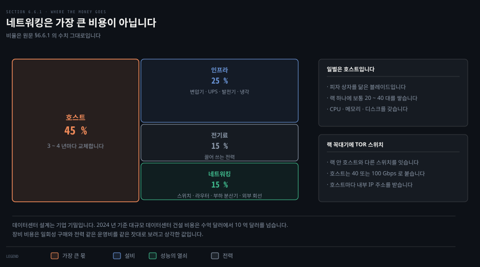
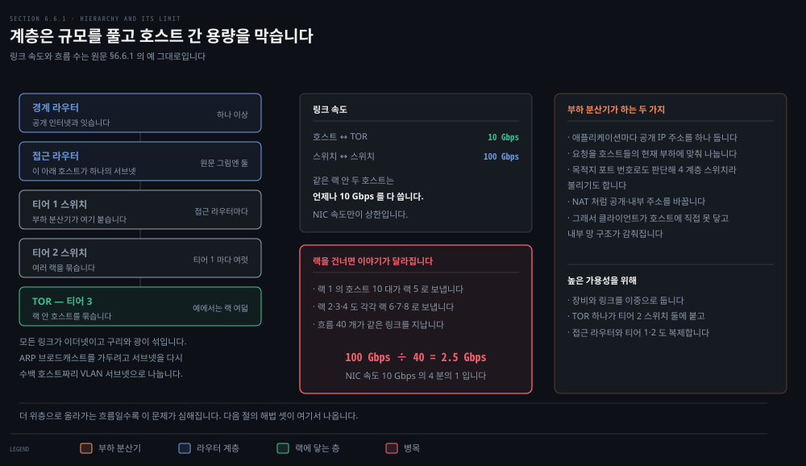
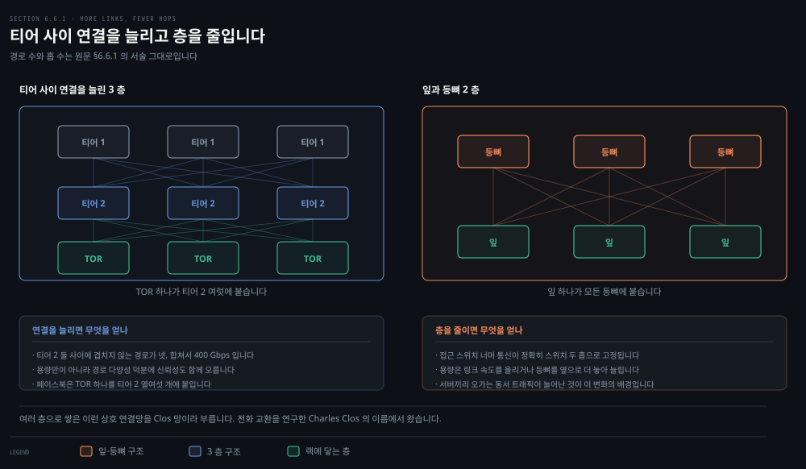
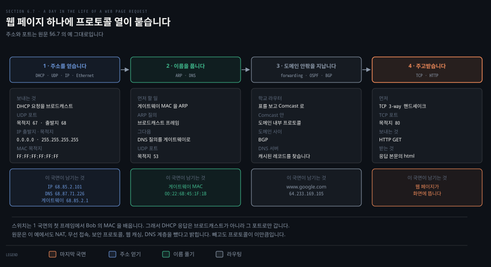

# 데이터센터와 웹 페이지 하나의 하루

---

> 6장의 마지막 편입니다. 링크 계층 기술이 실제로 어떤 규모에서 쓰이는지 데이터센터에서 보고, 그다음 여섯 장에서 배운 프로토콜 전부가 웹 페이지 하나에 어떻게 얽히는지를 봅니다.

## 핵심 요약

> 이 편이 매달린 하나의 생각은 **데이터센터에서는 링크 계층 설계가 곧 성능 설계**라는 것입니다.

원문이 밝힌 대규모 데이터센터의 비용 구성에서 네트워킹은 15 퍼센트입니다. 호스트가 45 퍼센트로 가장 크고 인프라가 25 퍼센트입니다. 그런데 원문은 바로 이어서 **전체 비용을 낮추고 성능을 끌어올리는 열쇠가 네트워킹 혁신**이라고 못박습니다.

그 이유가 한 계산에 담겨 있습니다. 호스트가 TOR 에 10 Gbps 로 붙고 스위치 사이가 100 Gbps 인 계층 구조에서, 랙을 건너는 흐름 40 개가 같은 링크를 쓰면 각자 **2.5 Gbps** 만 받습니다. NIC 속도의 4 분의 1 입니다. 계층 구조가 규모 문제를 푸는 대신 호스트 간 용량을 막습니다.

편의 뒤쪽은 6장을 넘어 여섯 장 전체를 닫습니다. Bob 이 노트북을 꽂고 구글 첫 페이지를 받기까지 DHCP·UDP·IP·이더넷·ARP·DNS·OSPF·BGP·TCP·HTTP 가 차례로 붙습니다. 원문은 이 예에서도 NAT 와 무선과 보안과 캐싱을 뺐다고 밝힙니다. **빼고도 이만큼입니다.**


## 학습 목표

> 이 편을 읽고 나면 아래 다섯 가지를 스스로 해낼 수 있습니다.

1. 데이터센터의 비용 구성을 들고, 네트워킹이 왜 비중보다 중요한지 설명합니다.
2. 블레이드·랙·TOR·부하 분산기의 관계를 짚고, 부하 분산기가 하는 두 가지 일을 말합니다.
3. 계층 구조에서 호스트 간 용량이 왜 깎이는지 숫자로 계산합니다.
4. 티어 사이 연결을 늘리는 것과 층을 줄이는 것이 각각 무엇을 얻는지 설명합니다.
5. 웹 페이지 하나를 받기까지 붙는 프로토콜을 네 국면으로 나눠 말합니다.


## 1. 데이터센터는 무엇으로 이뤄지는가

> 비용의 45 퍼센트가 호스트이고 네트워킹은 15 퍼센트입니다. 그런데 원문은 네트워킹 혁신이 전체를 좌우한다고 적습니다.



### 풀려는 문제

지금까지 링크 계층 기술을 하나씩 봤습니다. 그것들이 실제로 가장 큰 규모로 쓰이는 자리가 데이터센터인데, 그 안이 어떤 부품으로 이뤄지고 무엇에 돈이 드는지를 모르면 왜 그런 설계를 하는지도 알 수 없습니다.

### 세 가지 목적

구글, 마이크로소프트, 아마존, 알리바바 같은 인터넷 기업이 지은 거대한 데이터센터에는 각각 수만에서 수십만 대의 호스트가 들어 있습니다. 인터넷에 연결돼 있을 뿐 아니라 안쪽으로도 **데이터센터 망**이라 불리는 복잡한 망이 내부 호스트를 잇습니다.

데이터센터는 크게 세 가지 일을 합니다. 첫째로 웹 페이지, 검색 결과, AI 챗봇, 메일, 스트리밍 영상 같은 콘텐츠를 사용자에게 줍니다. 둘째로 검색 엔진의 분산 색인 계산 같은 특정 작업을 위한 대규모 병렬 계산 기반입니다. 셋째로 다른 기업에게 클라우드 컴퓨팅을 제공합니다.

### 돈이 어디로 가는가

데이터센터 설계는 기업 기밀입니다. 앞선 클라우드 기업에게 결정적인 경쟁 우위를 주기 때문입니다. 2024 년 기준으로 대규모 데이터센터를 짓는 비용은 수억 달러에서 10 억 달러를 넘습니다.

비용은 넷으로 나뉩니다. 호스트 자체가 약 45 퍼센트이고 3 년에서 4 년마다 교체해야 합니다. 변압기, 무정전 전원 장치, 장기 정전용 발전기, 냉각 시스템을 포함한 인프라가 25 퍼센트입니다. 끌어 쓰는 전력의 전기료가 15 퍼센트이고, 스위치·라우터·부하 분산기 같은 장비와 외부 회선과 통과 트래픽 비용을 합한 네트워킹이 15 퍼센트입니다.

장비 비용은 일회성 구매와 전력 같은 운영비를 같은 잣대로 보려고 상각한 값입니다. 그리고 원문이 이어서 적습니다. **네트워킹이 가장 큰 비용은 아니지만, 전체 비용을 줄이고 성능을 최대로 끌어내는 열쇠는 네트워킹 혁신입니다.**

### 일벌은 호스트입니다

데이터센터의 호스트를 **블레이드**라 부르고 피자 상자를 닮았습니다. CPU 와 메모리와 디스크를 가진 범용 기계입니다. 블레이드는 랙에 쌓이고 랙 하나에 보통 20 대에서 40 대가 들어갑니다.

각 랙 꼭대기에는 이름 그대로 **TOR 스위치**가 있습니다. 랙 안의 호스트끼리, 그리고 데이터센터의 다른 스위치와 잇습니다. 랙 안 호스트마다 TOR 스위치로 가는 네트워크 인터페이스가 있고, TOR 스위치에는 다른 스위치로 갈 포트가 더 있습니다. 오늘날 호스트는 보통 40 Gbps 또는 100 Gbps 이더넷으로 TOR 에 붙습니다. 호스트마다 데이터센터 내부 IP 주소도 하나씩 받습니다.

데이터센터 망은 두 종류의 트래픽을 받칩니다. 외부 클라이언트와 내부 호스트 사이의 흐름, 그리고 내부 호스트끼리의 흐름입니다. 앞의 것을 위해 데이터센터 망은 공개 인터넷과 잇는 **경계 라우터**를 하나 이상 둡니다.


## 2. 계층은 규모를 풀고 용량을 막습니다

> 세 티어로 내려가면 수십만 호스트까지 늘릴 수 있습니다. 대신 랙을 건너는 흐름이 위층 링크에서 서로를 깎아 먹습니다.



### 풀려는 문제

호스트 몇천 대짜리 작은 데이터센터라면 경계 라우터 하나, 부하 분산기 하나, 이더넷 스위치 하나로 랙 수십 개를 잇는 것으로 충분할 수 있습니다. 수만에서 수십만 대로 늘리려면 무엇이 달라져야 하는지가 물음입니다.

### 부하 분산기가 하는 두 가지

클라우드 데이터센터는 검색, 메일, 영상 같은 애플리케이션을 동시에 여럿 제공합니다. 외부 클라이언트의 요청을 받으려고 애플리케이션마다 공개된 IP 주소를 하나씩 둡니다. 클라이언트는 그 주소로 요청을 보내고 그 주소에서 응답을 받습니다.

데이터센터 안에서 외부 요청은 먼저 **부하 분산기**로 갑니다. 부하 분산기의 일은 호스트들의 현재 부하에 맞춰 요청을 나눠 주는 것입니다. 큰 데이터센터에는 부하 분산기가 여럿 있고 각각이 특정 클라우드 애플리케이션 묶음을 맡습니다.

부하 분산기를 **4 계층 스위치**라 부르기도 합니다. 패킷의 목적지 IP 주소만이 아니라 목적지 포트 번호까지 보고 판단하기 때문입니다.

일이 하나 더 있습니다. **NAT 와 비슷한 기능**을 합니다. 공개 외부 IP 주소를 알맞은 호스트의 내부 IP 주소로 바꾸고 돌아가는 패킷에서는 반대로 되돌립니다. 덕분에 클라이언트가 호스트에 직접 접촉하지 못합니다. 내부 망 구조가 감춰지는 보안 이득이 따라옵니다.

### 세 티어로 내려갑니다

수만에서 수십만 호스트로 늘리려면 라우터와 스위치의 계층을 씁니다. 꼭대기의 경계 라우터가 접근 라우터에 연결되고, 각 접근 라우터 아래에 스위치 세 티어가 있습니다.

접근 라우터가 최상위 티어 스위치에 연결되고, 각 최상위 티어 스위치가 여러 2 티어 스위치와 부하 분산기에 연결됩니다. 각 2 티어 스위치가 다시 랙의 TOR 스위치, 즉 3 티어 스위치를 통해 여러 랙에 연결됩니다. 모든 링크는 링크 계층과 물리 계층 프로토콜로 이더넷을 쓰고 구리와 광 케이블이 섞입니다.

가용성을 위해 장비와 링크를 이중으로 둡니다. TOR 스위치 하나가 2 티어 스위치 둘에 연결되고, 접근 라우터와 1 티어·2 티어 스위치도 복제해 설계에 넣습니다.

주목할 자리가 하나 더 있습니다. 각 접근 라우터 아래의 호스트들이 **하나의 서브넷**을 이룹니다. ARP 브로드캐스트 트래픽을 국소화하려고 이 서브넷을 다시 수백 대 규모의 VLAN 서브넷으로 나눕니다. 앞 편의 VLAN 이 여기서 쓰입니다.

### 2.5 Gbps 라는 숫자

계층 구조는 규모 문제를 풉니다. 그런데 호스트 간 용량이 제한됩니다. 원문의 계산을 그대로 따라가 보겠습니다.

호스트가 TOR 스위치에 10 Gbps 링크로 붙고 스위치 사이는 100 Gbps 이더넷이라고 하겠습니다. 같은 랙의 두 호스트는 언제나 10 Gbps 를 다 씁니다. 호스트 NIC 속도만이 상한입니다.

다른 랙 사이는 다릅니다. 랙 1 의 호스트 10 대가 랙 5 의 짝에게 각각 보내고, 랙 2·3·4 도 각각 랙 6·7·8 로 같은 식으로 보낸다고 하겠습니다. 흐름 40 개가 생깁니다. 각 흐름이 링크 용량을 고르게 나눠 쓰면 100 Gbps 링크를 지나는 40 개 흐름이 각각 이만큼을 받습니다.

```bash
100 Gbps / 40 = 2.5 Gbps
```

NIC 속도 10 Gbps 의 4 분의 1 입니다. **더 위층으로 올라가야 하는 흐름일수록 이 문제가 심해집니다.**

원문은 해법 셋을 듭니다. 첫째는 더 빠른 스위치와 라우터를 까는 것인데, 포트 속도가 높은 장비가 아주 비싸 데이터센터 비용을 크게 올립니다. 둘째는 관련된 서비스와 데이터를 되도록 가까이, 같은 랙이나 가까운 랙에 두는 것입니다. 다만 데이터센터의 핵심 요구가 계산과 서비스를 어디에나 놓을 수 있는 유연성이라 이 방법은 한계가 있습니다. 셋째가 다음 절입니다.


## 3. 연결을 늘리고 층을 줄입니다

> 티어 사이 연결을 늘리면 랙 사이에 겹치지 않는 경로가 여럿 생깁니다. 그 흐름의 끝이 두 층짜리 잎-등뼈 구조입니다.



### 풀려는 문제

앞 절의 병목은 위층 링크 하나에 흐름이 몰려서 생깁니다. 링크를 더 빠르게 하는 것도 배치를 몰아 두는 것도 한계가 있다면, 남은 길은 링크를 더 많이 놓는 것입니다. 그것이 무엇을 얼마나 바꾸는지가 물음입니다.

### 경로를 여럿 만듭니다

세 번째 해법은 TOR 스위치와 2 티어 스위치 사이, 그리고 2 티어 스위치와 1 티어 스위치 사이의 연결을 늘리는 것입니다. TOR 를 접근 스위치, 2 티어를 집계 스위치, 1 티어를 코어 스위치라고도 부릅니다.

TOR 스위치 하나를 2 티어 스위치 둘에 연결하면 랙 사이에 링크도 스위치도 겹치지 않는 경로가 여럿 생깁니다. 원문의 예에서는 첫 2 티어 스위치와 둘째 2 티어 스위치 사이에 서로 다른 경로가 넷 있고 **합쳐서 400 Gbps** 의 용량을 냅니다.

티어 사이 연결 정도를 올리면 이득이 둘입니다. 용량이 늘고, 경로 다양성 덕분에 신뢰성도 함께 오릅니다. 페이스북 데이터센터에서는 각 TOR 가 서로 다른 2 티어 스위치 열여섯 개에, 각 2 티어 스위치가 서로 다른 1 티어 스위치 열여섯 개에 연결됩니다.

연결이 늘어난 직접적인 결과로 **다중 경로 라우팅이 일급 시민**이 됩니다. 흐름은 기본적으로 다중 경로 흐름입니다. 가장 단순한 방식이 ECMP 이고, 출발지와 목적지 사이의 스위치들에서 다음 홉을 무작위로 고릅니다.[^rfc2992]

### 두 층으로 줄입니다

세 층 계층은 두 층짜리 상호 연결 직물인 **잎-등뼈 토폴로지**로 진화했습니다. 접근 스위치를 잎 스위치, 코어 스위치를 등뼈 스위치라 부르고, **잎 스위치가 모든 등뼈 스위치에 하나도 빠짐없이 연결됩니다.**

용량은 잎과 등뼈 사이 링크 속도를 올리거나 등뼈 노드를 옆으로 더 놓아 늘립니다. 그리고 이 구조에서는 접근 스위치 너머의 모든 데이터센터 내부 통신이 **정확히 스위치 두 홉**입니다. 앞선 구조들의 가변적이고 더 커질 수 있는 홉 수와 대비됩니다.

잎-등뼈로 옮겨 간 배경은 트래픽의 성격 변화입니다. 데이터센터 안 서버끼리 오가는 **동서 트래픽**이, 서버와 데이터센터 밖 종단 사이의 **남북 트래픽**보다 많아졌습니다.

이렇게 여러 층으로 쌓은 상호 연결망을 **Clos 망**이라 부릅니다. 전화 교환의 맥락에서 이런 망을 연구한 Charles Clos 의 이름에서 왔습니다. 그 뒤로 풍부한 이론이 발전해 데이터센터 망과 다중 프로세서 상호 연결망에 쓰이고 있습니다.


## 4. 데이터센터 망이 가는 방향

> 비용 절감, 가상화, 물리 제약, 관리 편의, 확장성, 맞춤화가 변화를 밀고 있습니다.

### 풀려는 문제

앞 세 절이 지금의 구조를 다뤘습니다. 그런데 이 분야는 빠르게 바뀌고 있고, 어느 방향으로 가는지를 알아야 지금의 설계가 왜 그런지도 이해됩니다.

### 다섯 가지 흐름

원문이 꼽는 추세를 정리하면 이렇습니다.

| 추세 | 무엇이 일어나고 있나 |
|------|-------------------|
| 중앙 집중 SDN 제어 | 데이터센터는 한 조직이 관리하므로 논리적 중앙 제어가 자연스럽습니다. 구글의 Orion 이 데이터센터 망과 그것을 잇는 광역 B4 망을 함께 제어합니다. 데이터 평면은 단순한 범용 스위치로, 제어 평면은 소프트웨어로 갈라 놓습니다 |
| 가상화 | 가상 머신이 소프트웨어를 물리 하드웨어에서 떼어 냅니다. 다른 랙의 물리 서버로 매끄럽게 옮기려면 표준 이더넷과 IP 로는 부족합니다. 데이터센터 망 전체를 하나의 평평한 2 계층 망으로 다루고, **ARP 를 브로드캐스트 대신 DNS 방식 질의로 바꿔** 디렉터리가 VM 의 IP 와 현재 붙은 물리 스위치를 매핑하게 합니다 |
| 물리 제약 | 40 Gbps 와 100 Gbps 링크가 흔하고 지연이 마이크로초 단위입니다. 버퍼가 작아 TCP 와 그 변종이 잘 늘어나지 않습니다. 손실 복구와 타임아웃이 극심한 비효율을 낳으므로, 데이터센터 전용 TCP 변종이나 표준 이더넷 위의 RDMA 가 쓰입니다 |
| 하드웨어 모듈화 | 12 미터 표준 선적 컨테이너 안에 미니 데이터센터를 만들어 실어 보냅니다. 컨테이너마다 수천 대까지 담고 배치 뒤에는 정비가 어려워 **우아한 성능 저하**로 설계합니다. 부품이 하나씩 죽어도 계속 돌다가 성능이 기준 아래로 떨어지면 컨테이너째 교체합니다 |
| 에너지와 탄소 | 2024 년 데이터센터가 약 400 테라와트시를 소비했고 이는 전 세계 **전력** 사용의 1 에서 2 퍼센트입니다. 대규모 언어 모델을 비롯한 AI 애플리케이션 수요에 밀려 10 년 말에는 전 세계 **에너지** 사용의 3 에서 4 퍼센트로 오를 것으로 봅니다 |

> **노트의 읽기**: 위 표의 마지막 줄에서 원문이 분모를 바꿉니다. 2024 년 수치는 `"between 1% and 2% of global electricity use"` 이고 10 년 말 전망은 `"3-4% of global energy use"` 입니다. 전력은 에너지의 부분집합이라 두 수치를 같은 축에서 비교할 수 없습니다. 원문 표현을 그대로 옮겨 두었습니다.

마지막 흐름 하나가 더 있습니다. 큰 클라우드 사업자가 데이터센터 안의 거의 모든 것을 **직접 만들거나 맞춤 제작**하는 방향입니다. 네트워크 어댑터, 스위치, 라우터, TOR, 소프트웨어, 네트워킹 프로토콜까지 포함합니다. 아마존이 개척한 **가용 영역**은 몇 킬로미터 떨어진 가까운 건물에 별개 데이터센터를 복제해, 같은 영역 안에서 트랜잭션 데이터를 동기화하면서 장애 내성을 얻는 방식입니다.


## 5. 웹 페이지 하나의 하루

> 여섯 장을 내려온 여정이 여기서 닫힙니다. 가장 단순한 요청 하나에 프로토콜이 몇이나 붙는지를 셉니다.



### 풀려는 문제

계층마다 프로토콜을 하나씩 배웠습니다. 그런데 그 프로토콜들이 실제로 어떤 순서로 맞물리는지는 따로 보지 않았습니다. 웹 페이지 하나를 받는 가장 단순한 요청으로 전부를 꿰어 보는 것이 이 절의 목적입니다.

무대는 이렇습니다. 학생 Bob 이 노트북을 학교 이더넷 스위치에 꽂고 구글 첫 페이지를 내려받습니다. 스위치는 학교 라우터에, 학교 라우터는 ISP 인 comcast.net 에 연결됩니다. DNS 서비스는 학교가 아니라 Comcast 망 안에 있고, DHCP 서버는 흔히 그렇듯 라우터 안에서 돕니다.

### 1 국면 — 주소를 얻습니다

IP 주소가 없으면 아무것도 못 합니다. 그래서 첫 동작이 DHCP 입니다.

노트북 운영체제가 DHCP 요청 메시지를 만들어 UDP 세그먼트에 넣습니다. 목적지 포트 67 이 DHCP 서버이고 출발지 포트 68 이 DHCP 클라이언트입니다. 그 세그먼트를 IP 데이터그램에 넣는데, 목적지는 브로드캐스트 주소 `255.255.255.255` 이고 출발지는 아직 주소가 없어 `0.0.0.0` 입니다.

그 데이터그램이 이더넷 프레임에 담깁니다. 목적지 MAC 주소는 `FF:FF:FF:FF:FF:FF` 라 스위치에 붙은 모든 장치로 방송되고, 출발지 MAC 은 노트북의 `00:16:D3:23:68:8A` 입니다.

라우터 안의 DHCP 서버가 `68.85.2.0/24` 블록에서 `68.85.2.101` 을 할당합니다. DHCP ACK 에는 그 IP 주소와 함께 DNS 서버 주소 `68.87.71.226`, 기본 게이트웨이 라우터 주소 `68.85.2.1`, 서브넷 블록이 담깁니다.

여기서 앞 편의 자기 학습이 등장합니다. 스위치는 DHCP 요청이 담긴 첫 프레임에서 이미 Bob 의 MAC 을 배웠습니다. **그래서 DHCP ACK 프레임을 방송하지 않고 노트북으로 가는 포트로만 보냅니다.**

### 2 국면 — 이름을 풉니다

Bob 이 브라우저에 URL 을 칩니다. 브라우저는 HTTP 요청을 보낼 TCP 소켓을 만들려 하는데, 그러려면 `www.google.com` 의 IP 주소가 있어야 합니다. DNS 가 그 일을 합니다.

DNS 질의 메시지가 UDP 세그먼트에 담기고 목적지 포트는 53 입니다. IP 목적지는 DHCP ACK 에서 받은 DNS 서버 주소이고 출발지는 방금 받은 자기 주소입니다.

그런데 여기서 한 걸음이 더 필요합니다. 이 프레임은 링크 계층에서 학교 게이트웨이 라우터로 보내져야 하는데, **노트북은 게이트웨이의 IP 주소는 알아도 MAC 주소는 모릅니다.** 그래서 ARP 를 먼저 씁니다.

노트북이 목표 IP 를 게이트웨이 주소로 둔 ARP 질의를 만들어 브로드캐스트 프레임으로 보냅니다. 게이트웨이 라우터가 목표 IP 가 자기 인터페이스 주소와 맞는 것을 보고, 자기 MAC 주소 `00:22:6B:45:1F:1B` 를 담은 ARP 응답을 노트북에게 보냅니다.

이제 노트북은 DNS 질의를 담은 이더넷 프레임을 게이트웨이 MAC 으로 보낼 수 있습니다. **이 프레임에서 IP 목적지는 DNS 서버이고 프레임 목적지는 게이트웨이 라우터입니다.** 앞 편에서 본 "서브넷 밖으로 보낼 때는 목적지가 둘"이 이 장면입니다.

### 3 국면 — 도메인 안팎을 지납니다

게이트웨이 라우터가 프레임에서 데이터그램을 꺼내 목적지 주소를 보고, 포워딩 표에서 Comcast 망의 라우터로 보내야 한다고 판단합니다. 데이터그램이 그 링크에 맞는 링크 계층 프레임에 담겨 나갑니다.

Comcast 망의 라우터도 같은 일을 합니다. 그 라우터의 포워딩 표는 Comcast 의 도메인 내부 프로토콜과 인터넷의 도메인 사이 프로토콜인 BGP 가 채운 것입니다. 5장의 두 축이 여기서 함께 쓰입니다.

DNS 서버가 질의를 받아 자기 데이터베이스에서 이름을 찾고, `www.google.com` 의 IP 주소를 담은 자원 레코드를 찾습니다. 캐시된 것이라면 그 데이터는 원래 `google.com` 의 책임 DNS 서버에서 왔습니다. 응답이 UDP 세그먼트에 담겨 Comcast 망을 거쳐 학교 라우터로, 다시 이더넷 스위치를 거쳐 노트북으로 돌아옵니다.

### 4 국면 — 주고받습니다

이제 노트북이 TCP 소켓을 만들 수 있습니다. TCP 가 먼저 3-way 핸드셰이크를 합니다. 노트북이 목적지 포트 80 인 TCP SYN 세그먼트를 만들어 IP 데이터그램에 넣습니다. 그 데이터그램을 게이트웨이 라우터의 MAC 주소를 목적지로 한 프레임에 넣어 스위치로 보냅니다.

학교 망과 Comcast 망과 구글 망의 라우터들이 각자의 포워딩 표로 데이터그램을 넘깁니다. Comcast 와 구글 망 사이의 도메인 간 링크에서 포워딩을 결정하는 표는 BGP 가 채운 것입니다.

구글에 도착한 SYN 은 포트 80 의 환영 소켓으로 역다중화됩니다. 연결 소켓이 만들어지고 SYNACK 이 돌아옵니다. 소켓이 연결 상태가 되면 브라우저가 HTTP GET 메시지를 만들어 소켓에 씁니다. GET 이 TCP 세그먼트의 페이로드가 되어 구글로 갑니다.

구글 HTTP 서버가 GET 을 읽고 응답 메시지를 만들어 요청된 웹 페이지 내용을 본문에 넣어 소켓으로 보냅니다. 응답이 세 망을 거쳐 노트북에 도착하면 브라우저가 본문에서 html 을 꺼내 화면에 그립니다.

### 무엇을 뺐는가

원문이 스스로 밝힙니다. 이 예에서도 학교 게이트웨이 라우터의 NAT, 학교 망 무선 접속, 접속과 암호화를 위한 보안 프로토콜, 망 관리 프로토콜을 뺐습니다. 웹 캐싱과 DNS 계층도 고려에서 뺐습니다. **빼고도 프로토콜이 이만큼입니다.**

원문은 이 예가 "왜"보다 "어떻게"에 치우쳤다고도 덧붙이며, 설계 원칙에 대한 더 넓은 시각을 원하면 §4.5 의 인터넷 아키텍처 원칙을 다시 읽으라고 안내합니다.

> **원문 정오**: 이 절의 상호 참조가 여러 자리에서 어긋납니다. DNS 를 §2.5·§2.5.2·§2.5.3 이라 적는데 9판에서는 **§2.4·§2.4.2·§2.4.3** 이고, 소켓 프로그래밍을 §2.7 이라 적는데 **§2.6** 이며, DHCP 와 CIDR 를 §4.3.3 이라 적는데 **§4.3.2** 입니다. §6.7 안에서만 아홉 자리이고, 2장과 4장 참조가 한 절씩 뒤로 밀린 **같은 방향의 어긋남**입니다. 판을 거듭하며 절이 앞으로 당겨진 자국으로 보입니다.


## 6. 6장이 남긴 것

> 링크 계층의 기본 서비스는 데이터그램을 이웃 노드로 옮기는 것 하나입니다. 그 위에 얹힌 것이 이 장 전체였습니다.

### 풀려는 문제

다섯 편을 지나며 오류 검출부터 데이터센터까지 왔습니다. 흩어진 조각을 하나의 문장으로 묶어 두지 않으면 다음에 필요할 때 꺼내 쓰기 어렵습니다.

### 하나의 서비스와 여러 갈래

링크 계층의 기본 서비스는 네트워크 계층 데이터그램을 한 노드에서 인접한 노드로 옮기는 것입니다. 모든 링크 계층 프로토콜이 데이터그램을 링크 계층 프레임에 담아 보내는 공통의 프레이밍 기능을 갖습니다.

그 공통 기능 너머에서는 갈립니다. 링크 접속, 전달, 전송 서비스가 프로토콜마다 아주 다릅니다. 링크의 종류가 다양하기 때문입니다. 점대점 링크는 하나의 전선 위에 송신자 하나와 수신자 하나뿐이고, 다중 접속 링크는 여러 송수신자가 나눠 씁니다. **VXLAN 과 MPLS 의 경우 두 노드를 잇는 "링크"가 그 자체로 하나의 망입니다.**

원리 쪽에서는 오류 검출과 정정, 다중 접속 프로토콜, 링크 계층 주소 지정, 가상화, 확장된 스위치드 LAN 과 데이터센터 망을 봤습니다. 오늘날 링크 계층의 관심은 대부분 이 스위치드 망에 있습니다.

원문이 마지막으로 남기는 말이 있습니다. 링크 계층 아래에 물리 계층이 있지만 그 자세한 내용은 컴퓨터 네트워킹이 아니라 통신 이론 강의의 몫이라는 것입니다. **프로토콜 스택을 내려오는 여정은 여기서 끝납니다.**

남은 두 장은 무선과 보안입니다. 원문이 짚듯 이 둘은 어느 한 계층에 깔끔하게 들어가지 않고 여러 계층을 가로지릅니다. 그래서 스택 전체에 대한 탄탄한 바탕을 요구하고, 그 바탕을 6장이 마지막으로 채웠습니다.


## 결정 치트시트

> 데이터센터 망 설계의 판단 규칙 셋입니다. 규모, 병목, 트래픽 방향이 축입니다.

| 상황 | 고르는 것 | 이유 |
|------|----------|------|
| 호스트 몇천 대 | 경계 라우터 + 부하 분산기 + 이더넷 스위치 하나 | 랙 수십 개는 단순한 구성으로 충분합니다 |
| 호스트 수만 ~ 수십만 대 | 라우터·스위치 계층 | 계층이 규모 문제를 풉니다 |
| 랙 사이 흐름이 깎일 때 | 티어 사이 연결 늘리기 | 겹치지 않는 경로가 여럿 생겨 용량과 신뢰성이 함께 오릅니다 |
| 동서 트래픽이 많을 때 | 잎-등뼈 두 층 | 접근 스위치 너머가 정확히 두 홉으로 고정됩니다 |
| VM 을 랙 사이로 옮겨야 할 때 | 망 전체를 평평한 2 계층으로 | ARP 를 DNS 방식 질의로 바꿔 위치를 디렉터리가 관리합니다 |


## 심화 학습

> 원문의 병목 예를 조건만 바꿔 다시 계산했습니다. 그리고 이 편이 앞 편들과 어디서 만나는지를 세었습니다.

### 흐름이 늘면 몫이 반비례로 줄어듭니다

원문의 예는 100 Gbps 링크에 40 흐름이라 흐름당 2.5 Gbps 였습니다. 링크 속도와 흐름 수를 바꿔 가며 계산하면 이렇습니다.

| 링크 | 흐름 수 | 흐름당 | NIC 10 Gbps 대비 |
|------|--------|-------|-----------------|
| 100 Gbps | 10 | 10 Gbps | 100 % |
| 100 Gbps | 40 | 2.5 Gbps | 25 % |
| 100 Gbps | 100 | 1 Gbps | 10 % |
| 400 Gbps | 40 | 10 Gbps | 100 % |

읽어 낼 것이 둘입니다. 첫째, **흐름 수가 NIC 속도와 링크 속도의 비를 넘는 순간부터 몫이 깎이기 시작합니다.** 100 Gbps 링크에 10 Gbps NIC 이면 흐름 10 개까지가 경계입니다. 둘째, 티어 사이 연결을 넷으로 늘려 400 Gbps 를 만들면 같은 40 흐름에서 다시 NIC 속도를 채웁니다. 원문이 든 400 Gbps 라는 숫자가 왜 그 예에 맞는지가 여기서 보입니다.

### 6장의 모든 절이 마지막 절에 모입니다

§6.7 의 네 국면을 앞 편들과 대조하면 6장 전체가 한 예에 들어와 있습니다.

| §6.7 의 장면 | 어느 편에서 배웠나 |
|-------------|------------------|
| 프레임에 데이터그램을 담습니다 | [06-01](./06-01.%ED%95%9C%20%EC%B9%B8%EC%9D%84%20%EA%B1%B4%EB%84%88%EB%8A%94%20%EB%8D%B0%20%EB%AC%B4%EC%97%87%EC%9D%B4%20%ED%95%84%EC%9A%94%ED%95%9C%EA%B0%80.md) — 프레이밍과 CRC |
| 브로드캐스트 프레임이 스위치를 지납니다 | [06-02](./06-02.%ED%95%98%EB%82%98%EC%9D%98%20%EC%B1%84%EB%84%90%EC%9D%84%20%EC%97%AC%EB%9F%BF%EC%9D%B4%20%EC%96%B4%EB%96%BB%EA%B2%8C%20%EB%82%98%EB%88%A0%20%EC%93%B0%EB%8A%94%EA%B0%80.md) — 브로드캐스트 채널 |
| ARP 로 게이트웨이 MAC 을 얻습니다 | [06-03](./06-03.%EC%A3%BC%EC%86%8C%EA%B0%80%20%EB%91%98%EC%9D%B8%20%EC%9D%B4%EC%9C%A0%EC%99%80%20%EC%9D%B4%EB%8D%94%EB%84%B7.md) — 주소가 둘인 이유 |
| 스위치가 첫 프레임에서 MAC 을 배웁니다 | [06-04](./06-04.%EC%8A%A4%EC%9C%84%EC%B9%98%EB%8A%94%20%EC%96%B4%EB%96%BB%EA%B2%8C%20%EB%B0%B0%EC%9A%B0%EA%B3%A0%20%EB%AC%B4%EC%97%87%EC%9C%BC%EB%A1%9C%20%EA%B0%88%EB%9D%BC%EB%86%93%EB%8A%94%EA%B0%80.md) — 자기 학습 |

**§6.7 은 새 내용을 하나도 더하지 않습니다.** 그래서 이 절이 잘 읽히지 않으면 앞 절 어딘가가 비어 있다는 신호로 쓸 수 있습니다.


## 면접 대비

> 이 편에서 나올 만한 물음 셋입니다. 셋 다 규모가 만들어 내는 문제입니다.

**데이터센터에서 계층 구조의 한계가 무엇입니까.** 호스트 간 용량입니다. 랙을 건너는 흐름이 위층 링크를 공유하면서 서로를 깎습니다. 100 Gbps 링크에 흐름 40 개면 각자 2.5 Gbps 로 NIC 속도 10 Gbps 의 4 분의 1 입니다. 더 위층으로 올라가는 흐름일수록 심해집니다.

**잎-등뼈 구조가 무엇을 개선합니까.** 잎 스위치가 모든 등뼈 스위치에 연결되므로 접근 스위치 너머 통신이 정확히 두 홉으로 고정됩니다. 용량은 링크 속도를 올리거나 등뼈를 옆으로 더 놓아 늘립니다. 서버끼리 오가는 동서 트래픽이 늘어난 것이 이 변화의 배경입니다.

**데이터센터에서 TCP 가 왜 잘 안 맞습니까.** 링크 용량이 크고 지연이 마이크로초 단위이며 버퍼가 작기 때문입니다. 손실 복구와 타임아웃이 극심한 비효율을 낳습니다. 그래서 데이터센터 전용 TCP 변종이나 표준 이더넷 위의 RDMA 를 씁니다.


## 핵심 개념 체크리스트

- [ ] 데이터센터 비용 구성 네 항목을 비율과 함께 들 수 있는가?
- [ ] 블레이드·랙·TOR 의 관계를 한 문장으로 설명할 수 있는가?
- [ ] 부하 분산기가 하는 두 가지 일을 말할 수 있는가?
- [ ] 부하 분산기를 왜 4 계층 스위치라 부르는지 설명할 수 있는가?
- [ ] 100 Gbps 링크에 흐름 40 개일 때 흐름당 속도를 계산할 수 있는가?
- [ ] 티어 사이 연결을 늘려서 얻는 두 가지를 들 수 있는가?
- [ ] 잎-등뼈에서 홉 수가 몇인지 답할 수 있는가?
- [ ] 동서 트래픽과 남북 트래픽을 구별할 수 있는가?
- [ ] 웹 페이지 하나를 받기까지의 네 국면을 순서대로 말할 수 있는가?
- [ ] 각 국면에서 얻는 것을 하나씩 짚을 수 있는가?


## 관련 문서

- [이 폴더의 정독 인덱스](./README.md) — 장별 진도와 학습 상태
- [06-04 스위치는 어떻게 배우고 무엇으로 갈라놓는가](./06-04.%EC%8A%A4%EC%9C%84%EC%B9%98%EB%8A%94%20%EC%96%B4%EB%96%BB%EA%B2%8C%20%EB%B0%B0%EC%9A%B0%EA%B3%A0%20%EB%AC%B4%EC%97%87%EC%9C%BC%EB%A1%9C%20%EA%B0%88%EB%9D%BC%EB%86%93%EB%8A%94%EA%B0%80.md) — VLAN 과 링크 가상화
- [05-03 제어를 밖으로 빼고 망을 들여다봅니다](./05-03.%EC%A0%9C%EC%96%B4%EB%A5%BC%20%EB%B0%96%EC%9C%BC%EB%A1%9C%20%EB%B9%BC%EA%B3%A0%20%EB%A7%9D%EC%9D%84%20%EB%93%A4%EC%97%AC%EB%8B%A4%EB%B4%85%EB%8B%88%EB%8B%A4.md) — 구글 Orion 과 SDN 제어 평면
- [02-04 영상은 어떻게 끊기지 않는가](./02-04.%EC%98%81%EC%83%81%EC%9D%80%20%EC%96%B4%EB%96%BB%EA%B2%8C%20%EB%81%8A%EA%B8%B0%EC%A7%80%20%EC%95%8A%EB%8A%94%EA%B0%80.md) — CDN 이 데이터센터를 어디에 놓는가


## 참고 자료

- 원본: 《Computer Networking: A Top-Down Approach》 9판, James F. Kurose · Keith W. Ross, Pearson. §6.6 · §6.7 · §6.8 (책 440–454쪽)
- [RFC 2992 — Analysis of an Equal-Cost Multi-Path Algorithm](https://www.rfc-editor.org/rfc/rfc2992)

[^rfc2992]: RFC 2992 — Analysis of an Equal-Cost Multi-Path Algorithm. 원문이 ECMP 의 근거로 지목하는 문서입니다. <https://www.rfc-editor.org/rfc/rfc2992>
