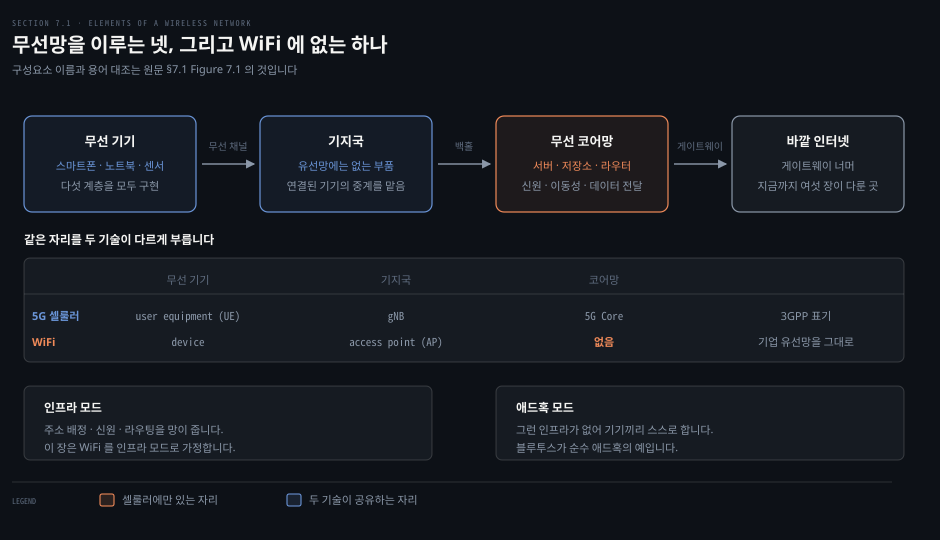
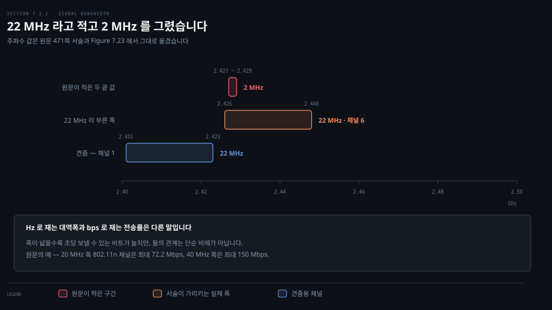
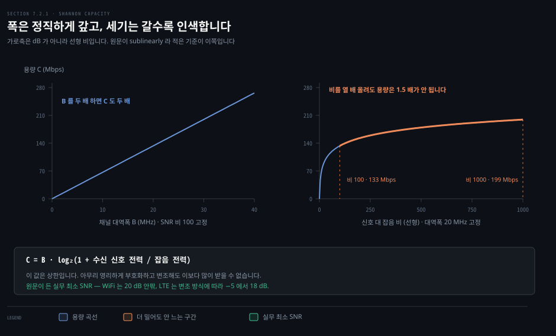
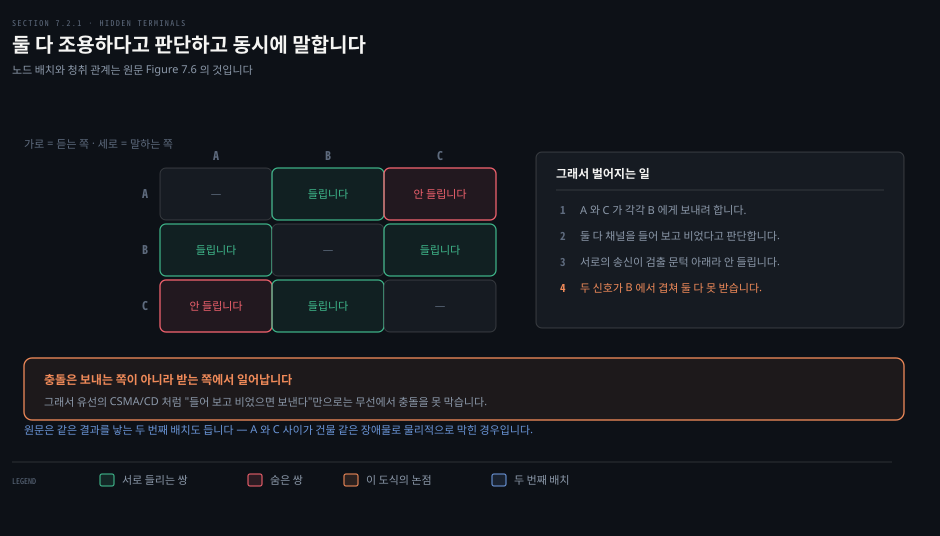
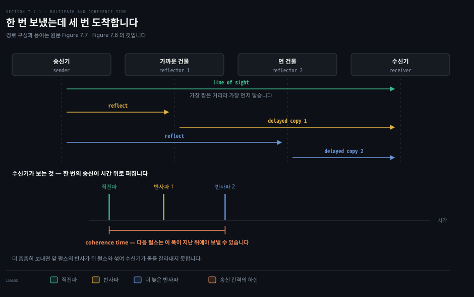
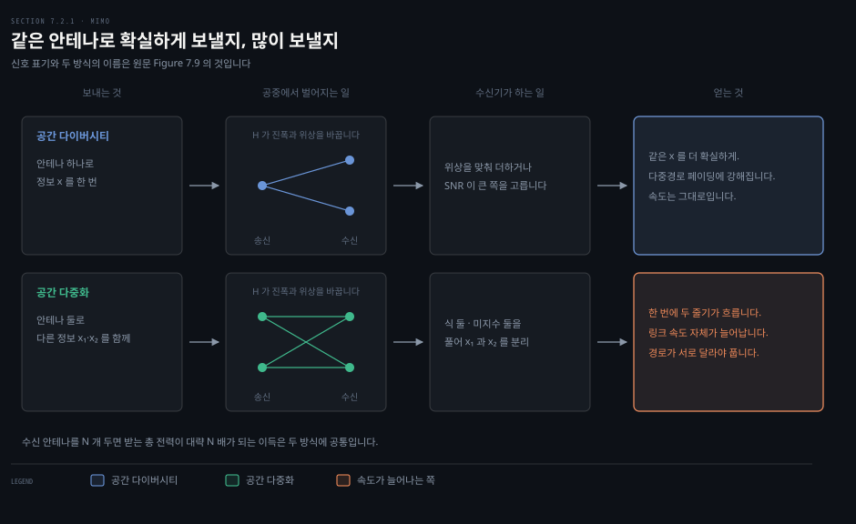

# 무선은 왜 유선처럼 되지 않는가

---

> 7장의 첫 편입니다. 여섯 장 동안 물리 계층을 "비트가 지나가는 관"으로 접어 두고 왔는데, 무선에서는 그 접기가 통하지 않습니다.

## 핵심 요약

> 이 편이 매달린 하나의 생각은 **무선에서는 물리 계층을 추상화해 치울 수 없다**는 것입니다.

저자들은 이 책이 하향식이라는 점을 여러 번 못박아 왔습니다. 그런데 7장만은 **아래에서 위로** 올라가겠다고 선언합니다. 무선 네트워킹의 많은 면이 복잡하고 시시각각 변하며 용량이 제한된 공유 채널에서 나오기 때문에, 라디오 채널을 먼저 익히지 않으면 그 위의 거의 모든 것을 이해할 수 없다는 이유입니다.

무엇이 다르기에 그럴까요. 유선 링크는 비트 전송률과 비트 오류율과 전파 지연 세 숫자로 요약해도 2장부터 6장까지 아무 문제가 없었습니다. 무선 링크는 그 세 숫자가 **거리·주파수·장애물·다른 사람의 전자레인지에 따라 계속 바뀝니다.**

이 편은 그 변동의 출처를 하나씩 봅니다. 신호를 깎는 경로 손실, 서로를 못 듣게 만드는 숨은 단말, 한 번의 송신을 여러 번의 도착으로 바꾸는 다중경로, 그리고 그 다중경로를 오히려 자원으로 되돌리는 MIMO 입니다. 마지막으로 이 모든 판단 위에 **그 주파수를 쓸 권리가 있는가**라는 제도의 층이 얹힙니다.


## 학습 목표

> 이 편을 읽고 나면 아래 다섯 가지를 스스로 해낼 수 있습니다.

1. 무선망을 이루는 네 요소를 들고, WiFi 에 코어망이 없는 이유를 설명합니다.
2. Hz 로 재는 대역폭과 bps 로 재는 전송률을 구분해 말합니다.
3. 섀넌 용량 정리에서 대역폭과 SNR 이 서로 다르게 붙는다는 것을 근거와 함께 설명합니다.
4. 숨은 단말이 왜 유선의 CSMA/CD 전제를 깨는지 설명합니다.
5. MIMO 의 두 이득이 각각 무엇을 얻고 무엇을 얻지 못하는지 가릅니다.


## 1. 무선망은 무엇으로 이뤄지는가

> 무선망에는 유선망에 대응물이 없는 부품이 하나 있습니다. 기지국입니다.



### 풀려는 문제

여섯 장 동안 쌓아 온 어휘를 무선에 그대로 얹으면 자리가 하나씩 어긋납니다. 스위치에 해당하는 것이 무엇인지, 라우터가 어디 있는지, 서브넷이 어디서 끝나는지가 바로 안 잡힙니다. 이름을 먼저 맞춰 두지 않으면 뒤의 모든 절이 흐릿해집니다.

### 넷으로 나뉩니다

원문은 무선망의 공통 요소를 넷으로 셉니다.

- **무선 접속망**: 기기를 라디오 채널로 큰 망에 잇는 가장 바깥 가장자리. 6장에서 배운 LAN 의 성격을 그대로 갖습니다. 지리적으로 좁고, 한 사업자가 통제하며, 주로 링크 계층 서비스를 줍니다. 셀룰러에서는 RAN, WiFi 에서는 WLAN 이라 부릅니다.
- **무선 코어망**: 접속망의 기기와 바깥 망 사이에 놓인 서버·저장소·라우터와 대체로 유선인 링크들. 신원·이동성·접근 보안 같은 제어 서비스와 데이터그램 전달을 함께 맡습니다.
- **무선 기기**: 스마트폰·태블릿·노트북, 또는 센서나 가전 같은 IoT 기기. 애플리케이션을 실제로 돌리는 쪽입니다.
- **기지국**: 유선망에 대응물이 없어서 가장 특이한 부품입니다. 자기에게 연결된 기기와 패킷을 주고받는 일을 맡습니다.

**WiFi 에는 코어망이 없습니다.** 기업은 WLAN 에 유선 LAN 과 같은 인프라를 그대로 씁니다. 기업이 보기에 WiFi 는 그저 또 하나의 링크 계층 기술입니다. 셀룰러에는 사업자가 운영하는 코어망이 뚜렷하게 있고, 그 차이가 7장 후반의 절반을 만듭니다.

### 연결됐다는 말의 뜻

기기가 기지국에 **연관됐다**고 말할 때는 두 가지가 동시에 참입니다. 기기가 기지국의 통신 거리 안에 있고, 둘이 프로토콜을 실행해 기지국이 기기와 인터넷 사이의 중계자가 된 상태입니다. 기지국에서 기기로 가는 방향을 다운링크, 반대 방향을 업링크라 부릅니다.

5G 표준은 기지국을 gNB, 4G 는 eNB 라 부릅니다. 저자들은 이 약어를 두고 네트워킹 전체에서 가장 직관적이지 않고 가장 뚫고 들어가기 어려운 약어일 것이라고 적고, 이 장에서는 그냥 **기지국**이라 쓰겠다고 선언합니다. 다만 표준 문서를 직접 팔 사람은 두 약어가 3GPP 용어라는 것을 기억해 두라고 덧붙입니다.

### 인프라가 있느냐 없느냐

기지국에 연관된 기기는 **인프라 모드**로 동작한다고 말합니다. 주소 배정, 신원과 접근 권한, 라우팅 같은 전통적 서비스를 망이 주기 때문입니다. **애드혹 망**에는 그런 인프라가 없어서 기기들이 스스로 조직해 라우팅과 주소 배정과 이름 변환을 해내야 합니다.

WiFi 는 둘 다 됩니다. 이 장은 WiFi 가 기지국을 가진 인프라 모드로 동작한다고 가정합니다. 블루투스는 순수 애드혹 망의 예이고 이 책 §7.6.1 에서 다시 나옵니다.

기기가 한 기지국의 범위를 벗어나 다른 기지국의 범위로 들어가면 붙어 있는 지점을 바꿉니다. 이것을 **핸드오버**라 부르고, 여기서 어려운 질문이 줄줄이 따라옵니다. 움직이는 기기의 현재 위치를 어떻게 찾는지, 주소는 어떻게 다루는지, TCP 연결 도중에 움직이면 데이터그램이 어떻게 따라가는지입니다. 이 편은 답하지 않고 다섯째 편으로 넘깁니다.


## 2. "대역폭"이 두 가지를 가리킵니다

> 지금까지 대역폭은 초당 비트였습니다. 이 장에서는 헤르츠로 잰 주파수 폭입니다.



### 풀려는 문제

같은 단어가 두 가지를 가리키면 계산이 조용히 어긋납니다. "20 MHz 채널"과 "20 Mbps 링크"를 같은 종류의 수로 읽는 순간 이 장의 나머지가 전부 틀어집니다. 저자들도 학생들이 여기서 헷갈리는 것이 이해된다고 적어 둘 만큼 흔한 함정입니다.

### 전파가 가진 다섯 가지

전송기의 안테나에서 시간에 따라 변하는 전류가 전자기파를 만들고, 그 파동이 공간을 지나 수신 안테나에 전류를 만듭니다. 송신기는 그 파동의 성질을 바꿔서 정보를 싣습니다. 원문이 세는 성질은 다섯입니다.

- **진폭**: 특정 시공간에서 파동의 높이
- **파장**: 이웃한 두 마루 사이의 거리
- **주기**: 이웃한 두 마루 사이의 시간
- **주파수**: 주기의 역수이고 헤르츠로 잽니다
- **위상**: 시각 t 까지 지나온 한 주기의 비율이고 보통 각도로 씁니다

전자기파는 방향을 가지고 빛의 속도인 초당 약 3 × 10⁸ 미터로 나아갑니다.

### 전력과 스펙트럼 밀도

**전력**은 송신기가 내보내는 전자기파에 실은 단위 시간당 에너지입니다. 무선망에서는 보통 밀리와트로 잽니다. 전기공학자들은 dBm 을 즐겨 쓰지만 이 책은 선형 단위인 mW 를 씁니다.

이상적인 전자기파는 주파수가 하나뿐입니다. 실제 송신기의 전력은 여러 주파수에 퍼집니다. 그 퍼짐을 나타내는 것이 **전력 스펙트럼 밀도 함수**이고, 보통 **반송파 주파수**를 중심으로 모입니다.

이제 대역폭을 정확히 말할 수 있습니다. 라디오 신호의 **대역폭은 그 신호가 차지하는 주파수 범위의 폭**이고 헤르츠로 잽니다.

> **원문 정오**: 471쪽은 "Figure 7.3(b) 의 신호는 22 MHz 의 대역폭을 가지며, 전력이 2.427 과 2.429 GHz 사이에 고르게 퍼져 있다"고 적습니다. 두 끝 값의 차이는 **2 MHz** 라서 같은 문장의 22 MHz 와 맞지 않습니다. 뒤에 이어지는 서술대로 WiFi 채널 6 이라면 중심이 2.437 GHz 이므로 폭 22 MHz 는 대략 **2.426 에서 2.448 GHz** 입니다. 위 도식이 두 구간을 나란히 놓은 것입니다.

> **원문 정오**: 같은 문장은 "**Section 7.6** 에서 이 22 MHz 폭 채널이 WiFi 의 채널 6 에 해당하는 것을 보게 된다"고 적습니다. §7.6 은 블루투스·위성·IoT 를 다루는 절입니다. WiFi 채널 배치는 **§7.3.2 의 Figure 7.23** 에 있습니다.

### 폭과 속도의 관계는 단순하지 않습니다

라디오 신호의 대역폭은 헤르츠로, 링크의 전송률은 초당 비트로 잽니다. 폭이 넓을수록 초당 보낼 수 있는 비트가 대체로 늘어나는 것은 맞습니다. 원문이 든 예로 20 MHz 폭 802.11n 채널은 최대 72.2 Mbps 를 내고, 40 MHz 폭은 150 Mbps 를 냅니다.

폭이 두 배인데 속도는 두 배를 조금 넘습니다. 둘의 관계가 단순 비례가 아니라는 뜻이고, 왜 그런지는 다음 절의 섀넌 정리가 답합니다.


## 3. 잡음이 상한을 정합니다

> 폭을 넓히면 용량이 그만큼 늡니다. 신호를 세게 하면 갈수록 덜 늡니다.



### 풀려는 문제

무선 링크를 빠르게 만들 방법은 둘로 보입니다. 더 넓은 채널을 쓰거나, 더 세게 쏘는 것입니다. 둘 중 어디에 돈을 쓸지는 감으로 정할 문제가 아닙니다. 답이 식으로 나와 있습니다.

### 잡음은 어디서 오는가

원문은 잡음의 출처를 셋으로 나눕니다.

- **간섭하는 송신기**: 2.4에서 2.5 GHz 같은 비면허 대역에서는 베이비 모니터와 차고문 개폐기와 여러 가전이 전파를 냅니다. 더 중요한 것은 WiFi·블루투스·지그비가 서로 조율 없이 같은 대역을 쓴다는 점입니다.
- **전자기 방사체**: 전기 모터와 전자레인지, 특히 차폐가 약한 옛 모델이 전파를 냅니다.
- **열 잡음과 전자 잡음**: 자연스러운 열 변동과 송수신기 전자 부품의 불완전함이 신호에 잡음을 더합니다.

첫 항목에 원문이 붙인 문장이 이 장의 성격을 잘 보여 줍니다. **한 사람의 네트워크 송신은 다른 사람의 잡음입니다.** 내 WiFi 가 그 대역을 쓰는 것은 좋지만, 이웃의 WiFi 는 내 망에 그저 잡음으로 보입니다.

### SNR 과 섀넌 용량

신호 전력과 잡음 전력의 비를 **SNR** 이라 하고 보통 데시벨로 잽니다. SNR 이 0 이라는 것은 신호와 잡음의 양이 같다는 뜻입니다. 원문이 든 실무 기준으로 WiFi 는 수신 신호의 최소 SNR 이 20 dB 안팎이고, LTE 는 변조 방식에 따라 −5 에서 18 dB 사이입니다.

여기에 통신 이론에서 가장 중요한 결과 하나가 붙습니다. **섀넌 용량 정리**는 채널 용량 C 를 대역폭 B 와 수신 신호·잡음 전력으로 잇습니다.

```bash
C = B · log2(1 + 수신 신호 전력 / 잡음 전력)
```

이 값은 **상한**입니다. 데이터를 아무리 영리하게 부호화하고 변조해도 주어진 대역폭과 SNR 에서 받는 양은 C 를 넘지 못합니다.

### 실무로 옮기면 두 문장

원문은 이 정리에서 두 가지 실무적 귀결을 뽑습니다.

1. SNR 이 고정이면 최대 용량은 채널 대역폭에 **선형으로** 비례합니다. 폭이 넓으면 초당 보낼 비트가 그만큼 늘어납니다.
2. SNR 이 이미 높은 구간에서는 SNR 을 더 올리는 데 힘을 쓸 이익이 작습니다. 최대 용량이 **로그로만**, 즉 선형보다 느리게 늘기 때문입니다.

위 도식의 오른쪽에서 곡선이 눕는 자리가 그 지점입니다. 가로축이 dB 가 아니라 **선형 비**라는 점을 봐 두십시오. 원문이 "SNR 이 커질수록 선형보다 느리게"라고 적은 기준이 선형 비이기 때문입니다. dB 눈금 위에 그리면 같은 곡선이 직선으로 펴져서 이 결론이 안 보입니다.

이 결론이 뒤에서 두 번 더 돌아옵니다. 채널을 묶어 폭을 늘리는 WiFi 의 채널 본딩이 첫 번째입니다. 신호가 좋은 기기에게 먼저 보내는 MAC 스케줄링이 두 번째입니다.


## 4. 멀어지면 서로를 못 듣습니다

> 신호는 거리와 주파수의 제곱에 반비례해 약해집니다. 그래서 같은 방 안에서도 서로 안 들리는 짝이 생깁니다.



### 풀려는 문제

6장의 CSMA/CD 는 한 가지를 전제했습니다. 선로에 실린 신호를 모든 노드가 듣는다는 것입니다. 그 전제가 무선에서 무너지면 "들어 보고 비었으면 보낸다"는 규칙 자체가 안 통합니다. 무엇이 그 전제를 깨는지 보아야 합니다.

### 신호가 약해지는 방식

파동은 나아가면서 힘을 잃습니다. 이 약해짐을 **경로 손실** 또는 감쇠라 부릅니다. 송수신기 사이에 가리는 것이 없는 가시선 경로에서는 송신 전력 대비 수신 전력이 다음 관계로 줄어듭니다.

```bash
P_수신 / P_송신  ~  1 / (f · d)²
```

여기서 f 는 신호의 주파수이고 d 는 송수신기 사이의 거리입니다. 직관은 구의 표면적에 있습니다. 구의 표면적은 반지름의 제곱으로 커지므로, 거리 d 에서 단위 면적을 지나는 에너지는 거리 2d 에서 네 배 넓은 면적을, 거리 3d 에서 아홉 배 넓은 면적을 지나게 됩니다.

지수 2 는 공기 중의 자유 공간 손실입니다. 도시 야외에서는 3 안팎이 흔하고, 건물 안에서는 4 이상이 흔합니다. 실내에서 경로 손실이 훨씬 큰 걱정거리가 되는 이유입니다.

> **원문 정오**: 474쪽과 475쪽은 같은 감쇠를 두고 세 번에 걸쳐 "**exponential**", 즉 지수적으로 줄어든다고 적습니다. 바로 위에서 정의한 관계는 1/(f·d)² 이라 거듭제곱 감쇠이지 지수 감쇠가 아닙니다. 거듭제곱 감쇠는 거리가 두 배가 되면 전력이 네 배로 줄어듭니다. 지수 감쇠는 거리가 일정한 양만큼 늘 때마다 같은 배수로 줄어드는 다른 꼴입니다. 서술어만 어긋났고 식과 뒤따르는 계산은 모두 거듭제곱 기준으로 맞습니다.

주파수 쪽도 같은 제곱이 붙습니다. 원문이 드는 계산으로, 같은 폭의 채널을 5 GHz 에서 50 GHz 로 옮기면 받는 전력이 **100 분의 1** 이 됩니다. 높은 주파수의 채널이 짧은 거리에서 쓰이고 낮은 주파수가 먼 거리를 덮는 이유가 이 한 줄입니다.

### 숨은 단말

전력이 거리에 따라 떨어진다는 사실에서 곧바로 **숨은 단말** 문제가 나옵니다. 노드 A 와 B 는 서로의 신호가 검출 문턱 위에 있어서 서로를 듣습니다. B 와 C 도 서로를 듣습니다. 그런데 A 와 C 사이는 경로 손실 때문에 수신 전력이 문턱 아래로 떨어져 **서로를 듣지 못합니다.**

A 와 C 가 둘 다 B 에게 보내려 한다고 해 봅시다. 둘 다 채널을 들어 보고 상대의 송신을 듣지 못해 비었다고 판단합니다. 그런데 두 송신은 B 에서 서로를 간섭합니다. 원문은 같은 결과를 낳는 두 번째 배치도 듭니다. A 와 C 사이가 건물 같은 장애물로 물리적으로 막힌 경우입니다.

여기서 기억할 문장이 하나 있습니다. **충돌은 보내는 쪽이나 중간이 아니라 목적지에서 겹치는 신호로 나타납니다.** 보내는 쪽이 아무리 잘 들어 봐도 받는 쪽에서 벌어질 일을 알 수 없습니다. 이 한 줄이 다음 편의 CSMA/CA 와 RTS/CTS 설계를 통째로 밀고 갑니다.


## 5. 반사파가 뒤따라옵니다

> 한 번 보낸 신호가 시차를 두고 여러 번 도착합니다. 그 시차가 송신 간격의 하한을 정합니다.



### 풀려는 문제

앞 절까지는 신호가 약해지는 이야기였습니다. 이번에는 신호가 **여러 벌로 늘어나는** 이야기입니다. 수신기가 받은 파형에서 원본을 되살리려는데 같은 것이 시차를 두고 겹쳐 들어오면, 어디까지가 한 펄스인지 가를 수 없습니다.

### 같은 신호, 다른 거리

송신 신호의 일부는 수신기까지 가시선 경로로 곧장 갑니다. 그런데 같은 신호가 건물 같은 물체에 반사되어 더 긴 거리를 지나 조금 늦게 도착합니다. 이것이 **다중경로**입니다. 한 순간에 보낸 신호가 수신기에서는 시간 위로 퍼집니다.

퍼짐은 수신기의 복원을 어렵게 만드는 데서 끝나지 않습니다. 송신기가 신호를 바꿀 수 있는 최대 속도, 따라서 비트를 보낼 수 있는 속도까지 제약합니다. 송신기는 가시선 신호와 그 모든 반사가 **다음 펄스가 도착하기 전에** 수신기에 닿도록 펄스 간격을 벌려야 합니다. 그러지 않으면 두 펄스와 그 반사들이 수신기에서 시간상 섞입니다.

원문은 이 최소 간격을 수신기의 **coherence time** 이라 부릅니다.

> **용어 주의**: 무선 통신 문헌에서 coherence time 은 보통 다른 것을 가리킵니다. 채널의 특성이 대체로 변하지 않는다고 볼 수 있는 시간 구간을 뜻하고, 기기의 이동 속도가 만드는 도플러 확산의 역수 규모입니다. 원문이 여기서 정의한 것은 반사파의 지연 확산이 정하는 심볼 간격 쪽에 가깝습니다. 이 책을 읽을 때는 원문의 정의를 따르되, 다른 자료에서 같은 단어를 만나면 어느 쪽인지 확인하는 편이 안전합니다.

이 절의 결론은 사슬 하나입니다.

1. 주변이 복잡할수록 반사가 늘어납니다.
2. 반사가 늘어날수록 최소 간격이 벌어집니다.
3. 간격이 벌어질수록 비트를 천천히 보내야 합니다.

도시 실내에서 무선이 느려지는 이유 가운데 하나가 이것입니다.


## 6. 안테나를 여럿 두면 무엇이 달라지는가

> 다중경로는 골칫거리였습니다. MIMO 는 그것을 자원으로 뒤집습니다.



### 풀려는 문제

앞 절에서 여러 경로는 문제였습니다. 그런데 경로가 여럿이라는 말은 **독립된 통로가 여럿**이라는 말이기도 합니다. 같은 사실을 손해로 읽을지 자원으로 읽을지가 2000년대 초 무선망이 갈린 자리입니다.

### 두 갈래 이득

2000년대 초부터 무선망은 송수신 각각 안테나 하나이던 구성에서 양쪽 모두 여럿을 두는 **MIMO** 로 옮겨 갔습니다. 수신 안테나를 N 개 두면 받는 총 전력이 대략 N 배가 되는 것은 바로 보이는 이득입니다. 그런데 MIMO 의 본론은 그 너머에 있고, 두 갈래로 갈립니다.

**공간 다이버시티**는 같은 정보를 중복해서 여러 경로로 보냅니다. 서로 다른 물리 경로를 지난 신호가 서로 다른 열화를 겪는다는 사실을 이용합니다. 수신기는 여러 벌을 받아 위상을 맞춰 더하거나 SNR 이 큰 쪽을 고르는 식으로 합칩니다. 다중경로 페이딩에 맞서는 데 필수적인 기법이고, 안테나가 휴대폰 위에서 몇 센티미터만 떨어져 있어도 경로 조건이 꽤 달라집니다.

**공간 다중화**는 다른 정보를 경로마다 나눠 병렬로 보냅니다. 송신 안테나 둘이 각각 x₁ 과 x₂ 를 보내면 수신 안테나 각각은 둘이 공중에서 합쳐진 신호를 받습니다. 수신기의 일은 y₁ 과 y₂ 에서 x₁ 과 x₂ 를 되찾는 것입니다. 식이 둘이고 미지수가 둘이라는 관찰이 해법의 실마리입니다.

두 방식이 얻는 것이 다릅니다. 다이버시티는 **같은 속도를 더 확실하게** 얻습니다. 다중화는 **속도 자체를 늘립니다.**

저자들은 신호 처리의 이론과 실제가 이 책의 범위를 크게 넘는다고 밝힙니다. 두 이름과 감을 심어 주는 것이 이 절의 목표라고 적어 두었습니다.

### 빔포밍과 MU-MIMO

**빔포밍**은 신호를 사방으로 뿌리는 대신 특정 사용자나 영역 쪽으로 향하게 합니다. 안테나 배열의 각 소자에서 위상과 진폭을 조절해 원하는 방향에는 보강 간섭을, 다른 방향에는 상쇄 간섭을 만듭니다. 사용자가 움직여도 빔 방향을 계속 맞추는 동적 운용이 가능합니다.

원문이 세는 이득은 넷입니다.

1. **신호 세기 증가**: 한 방향에 모으므로 의도한 사용자가 받는 세기가 커지고 속도와 안정성이 함께 오릅니다.
2. **간섭 감소**: 원치 않는 방향으로 새는 신호를 줄여 기기가 밀집한 환경에서 성능이 좋아집니다.
3. **커버리지 개선**: 방향성 빔이 가장자리까지 닿아 경계 지역의 연결이 나아집니다.
4. **용량 증가**: 주어진 스펙트럼을 효율적으로 써서 동시에 받칠 수 있는 사용자가 늘어납니다.

지금까지의 MIMO 는 한 기기에게 보내는 **단일 사용자 MIMO** 였습니다. 실제로 이런 구성의 안테나 수는 작아서 WiFi 기지국이라면 둘에서 넷입니다. 셀룰러에서는 한 송신자가 여러 수신자에게 동시에 보내는 **MU-MIMO** 를 씁니다. 안테나의 부분집합마다 다른 기기를 맡고, 각 부분집합 안에서 다시 공간 다이버시티를 씁니다. 현대 5G 기지국의 MU-MIMO 안테나는 빔포밍 송신 소자를 최대 64 개까지, 그리고 그와 같거나 비슷한 수의 수신 소자를 담을 수 있습니다.


## 7. 주파수는 나라가 나눕니다

> 앞의 모든 기술 판단 위에 제도의 층이 하나 더 있습니다. 그 주파수를 쓸 권리가 있는가입니다.

### 풀려는 문제

여기까지는 물리와 신호 처리의 이야기였습니다. 그런데 실제로 망을 깔려면 먼저 답해야 할 질문이 있습니다. 그 주파수를 써도 되는가, 그리고 쓰려면 얼마를 내야 하는가입니다. 이 답이 셀룰러와 WiFi 의 요금 구조와 설계 목표를 갈라 놓습니다.

### 국가 자산으로 다룹니다

**라디오 스펙트럼**은 전자기 스펙트럼 중 3 Hz 에서 3 THz 까지의 범위입니다. 국가 자산으로 취급되어 나라마다 규제하고, 국제전기통신연합이 규제 없이 조정만 맡습니다. 보통 한 나라가 특정 주파수 범위를 특정 용도에 배정합니다. 해상·항공 무선 항법, 지상파 방송, 위성 방송, GPS 같은 무선 측위, 아마추어 무선, 전파 천문, 기상 레이더가 그런 용도입니다.

쓰임은 크게 둘로 갈립니다.

- **면허 스펙트럼**: 그 대역에서 송신기를 운용하려면 정부가 발급한 면허가 있어야 합니다. 상용 셀룰러 사업자가 쓰는 대역이 여기 듭니다.
- **비면허 스펙트럼**: 면허 없이 기기를 사서 쓸 수 있습니다. 다만 송신 출력 제한 같은 사용 규칙을 지켜야 하고, 조율되지 않은 기기가 많이 몰리므로 서로 간섭합니다.

많은 나라가 **스펙트럼 경매**로 셀룰러 사업자에게 면허를 배정합니다. 인도와 영국과 미국에서 수백억에서 수천억 달러에 이르는 면허료가 나왔습니다. 여기서 요금 구조의 차이가 나옵니다. 비싼 스펙트럼 권리를 사고 기지국과 부지까지 확보한 셀룰러 사업자는 그 비용을 모두 회수하고 이익을 남길 수 있게 요금을 매겨야 합니다. WiFi 사업자와 사정이 다릅니다.

### 비싸니까 나눠 씁니다

면허 스펙트럼이 희소하고 비싸기 때문에 **스펙트럼 공유** 방식이 개발되고 있습니다. 면허권자가 아닌 기기가 정해진 규칙과 조건 아래 면허 대역을 쓰게 하는 것입니다. 미국의 3.5 GHz **CBRS** 대역이 예입니다. 그 대역에 해군 레이더가 없을 때에 한해 셀룰러 기지국이 송신할 수 있습니다. 지금 쓰이지 않는 스펙트럼을 감지해 쓰는 인지 무선 방식도 함께 탐색되고 있습니다.

### 표로 보는 배치

원문의 Table 7.1 은 미국에서 무선망이 쓰는 흔한 대역을 정리합니다. 아래는 그중 이 책이 뒤에서 다시 쓰는 행만 옮긴 것입니다.

| 대역 | 망 종류 | 면허 | 특징 |
|------|--------|------|------|
| 2.4 GHz (2.40~2.49) | WiFi · 블루투스 · 지그비 | 비면허 | 802.11 b/g/n/ax |
| 5 GHz (5.17~5.83) | WiFi | 비면허 | 802.11 a/h/n/ac/ax |
| 6 GHz (5.9~7.12) | WiFi | 비면허 | 802.11 ax/be |
| 1 GHz 미만 | 셀룰러 | 면허 | 멀리 가고 느립니다. 50~250 Mbps |
| 1.8 GHz · 3.3~3.8 GHz · 6 GHz | 셀룰러 | 면허 | 균형점입니다. 약 8 km, 100~900 Mbps |
| 3.5 GHz CBRS | 셀룰러 | 면허 · 비면허 | 사설 5G 라고도 부릅니다 |
| 26 · 40 · 50 · 66 GHz | 셀룰러 | 면허 | 밀리미터파. 1.6 km 미만, 3 Gbps 미만 |
| 915 MHz (902~928) | LoRa (IoT) | 비면허 | §7.6.3 에서 다룹니다 |

거리 수치는 원문이 마일로 적은 것을 킬로미터로 옮긴 값입니다. 중간 대역의 "5 miles" 가 약 8 km, 고대역의 "< mile" 이 약 1.6 km 미만입니다.

> **원문 정오**: Table 7.1 의 셀룰러 행 두 개가 잘못된 절을 가리킵니다. 1 GHz 미만 행은 "See Section 7.2.2" 라 적는데 §7.2.2 는 부호화와 변조를 다루는 절입니다. 고대역 행은 "See Section 7.3.2" 라 적는데 §7.3.2 는 WiFi 를 다루는 절입니다. 셀룰러 대역은 **§7.3.3 의 5G RAN** 에서 다뤄지고, 중간 대역 행은 실제로 §7.3.3 을 가리키고 있습니다.

> **노트의 읽기**: 이 표는 미국 기준입니다. 원문도 표 제목에 미국 밖에서는 주파수가 조금씩 다르다고 밝혀 두었습니다. 국내 배치를 확인하려면 과학기술정보통신부의 주파수 분배표를 봐야 합니다.


## 결정 치트시트

> 이 편의 판단 기준을 한 표에 모았습니다.

| 상황 | 판단 | 근거 |
|------|------|------|
| 링크를 빠르게 하고 싶은데 SNR 이 이미 높다 | 출력을 올리지 말고 대역폭을 넓힙니다 | 용량은 B 에 선형, SNR 에 로그 |
| 커버리지를 넓히고 싶다 | 낮은 주파수 대역을 씁니다 | 경로 손실이 주파수의 제곱에 비례 |
| 실내에서 예상보다 훨씬 안 터진다 | 경로 손실 지수가 4 이상인 환경을 의심합니다 | 건물 안 4 이상, 야외 도시 3 안팎 |
| 기기가 밀집한 곳의 성능이 나쁘다 | 빔포밍과 MU-MIMO 를 봅니다 | 새는 신호를 줄이고 동시 사용자를 늘림 |
| 속도가 아니라 끊김이 문제다 | 공간 다중화가 아니라 다이버시티를 봅니다 | 다중화는 속도, 다이버시티는 확실성 |
| 면허 없이 망을 깔아야 한다 | 비면허 대역으로 가되 간섭을 설계에 넣습니다 | 조율되지 않은 기기가 같은 대역에 몰림 |


## 심화 학습

> 책 밖 보강입니다. 원문이 다루지 않거나 지금 기준이 달라진 자리만 적습니다.

### 경로 손실 지수를 실제로 잰다면

원문은 지수 2·3·4 를 예로 들고 넘어갑니다. 실측에서는 환경마다 값을 회귀로 추정합니다. ITU-R 은 실내 전파 예측을 위한 별도 권고를 따로 둡니다.[^itu-p1238]

학습 목적이라면 지수 하나로 실내 커버리지를 계산해 보십시오. 실제 값과 얼마나 벌어지는지 보는 것이 감을 잡는 데 좋습니다.

### CBRS 는 3단 우선순위입니다

원문은 CBRS 를 "해군 레이더가 없으면 쓸 수 있다"로 요약합니다. 실제 규칙은 3단 계층입니다. 최우선인 기존 사용자, 경매로 산 우선 접근 면허, 그리고 기회적으로 쓰는 일반 인가 접근입니다.[^fcc-cbrs] 사설 5G 를 검토한다면 자기 망이 어느 단에 놓이는지가 첫 질문입니다.

### 스펙트럼 공유는 국내에서도 열리고 있습니다

원문의 사례는 전부 미국입니다. 한국은 5G 특화망 용도로 4.7 GHz 대역과 28 GHz 대역을 별도 배정했고, 이동통신사가 아닌 사업자도 지역 단위로 쓸 수 있습니다.[^kr-private5g] 원문의 CBRS 서술을 국내에 그대로 옮기면 대역도 절차도 맞지 않습니다.


## 면접 대비

> 이 편에서 실제로 물어보기 좋은 것만 골랐습니다.

### 한 줄 정의

무선 채널이란 시간에 따라 변하고 용량이 제한되며 여럿이 나눠 쓰는 공유 매체이고, 그래서 유선처럼 물리 계층을 세 숫자로 접어 둘 수 없는 링크입니다.

### 핵심 포인트 세 가지

1. 무선에서 대역폭은 헤르츠로 잰 주파수 폭이고, 초당 비트로 잰 전송률과는 다른 양입니다.
2. 섀넌 용량은 대역폭에 선형이고 SNR 에 로그입니다. 그래서 투자할 곳이 갈립니다.
3. 충돌은 보내는 쪽이 아니라 받는 쪽에서 생깁니다. 그래서 유선의 충돌 검출을 그대로 못 씁니다.

### 자주 묻는 질문

**Q: WiFi 채널 1, 6, 11 만 쓰라는 말은 어디서 나왔습니까?**
A: 2.4 GHz 대역의 채널이 5 MHz 간격으로 놓이는데 각 채널의 폭은 20 MHz 입니다. 겹치지 않으려면 채널 번호로 다섯 이상 떨어져야 하고, 1에서 11 사이에서 그 조건을 만족하는 세 채널의 조합은 1·6·11 하나뿐입니다. 자세한 셈은 다음다음 편에서 다시 다룹니다.

**Q: 안테나를 늘리면 항상 빨라집니까?**
A: 아닙니다. 공간 다중화는 경로들이 서로 충분히 달라야 성립합니다. 경로가 비슷하면 연립방정식이 잘 안 풀려서 다중화 이득이 나오지 않고, 그때는 같은 안테나가 다이버시티 이득으로만 쓰입니다.

**Q: 5 GHz 가 2.4 GHz 보다 왜 안 멀리 갑니까?**
A: 경로 손실이 거리뿐 아니라 주파수의 제곱에도 반비례하기 때문입니다. 주파수를 열 배 올리면 같은 거리에서 받는 전력이 100 분의 1 이 됩니다.


## 핵심 개념 체크리스트

- [ ] 무선망의 네 요소를 들고 WiFi 에 코어망이 없는 이유를 말할 수 있는가?
- [ ] 인프라 모드와 애드혹 모드의 차이를 한 문장으로 설명할 수 있는가?
- [ ] Hz 로 잰 대역폭과 bps 로 잰 전송률을 구분해 쓰는가?
- [ ] 섀넌 용량 식을 쓰고 두 귀결을 각각 설명할 수 있는가?
- [ ] 경로 손실이 거리와 주파수 양쪽의 제곱에 반비례한다는 것을 계산으로 보일 수 있는가?
- [ ] 숨은 단말이 왜 CSMA/CD 의 전제를 깨는지 말할 수 있는가?
- [ ] 다중경로가 왜 전송 속도의 상한을 만드는지 설명할 수 있는가?
- [ ] 공간 다이버시티와 공간 다중화가 각각 무엇을 얻는지 가릴 수 있는가?
- [ ] 면허 대역과 비면허 대역이 요금 구조를 어떻게 가르는지 말할 수 있는가?


## 관련 문서

- [6장 마지막 편 — 데이터센터와 웹 페이지 하나의 하루](./06-05.데이터센터와%20웹%20페이지%20하나의%20하루.md) — 여섯 장을 닫은 자리
- [6장 두 번째 편 — 하나의 채널을 여럿이 어떻게 나눠 쓰는가](./06-02.하나의%20채널을%20여럿이%20어떻게%20나눠%20쓰는가.md) — 이 편이 전제하는 다중 접속의 기초
- [1장 세 번째 편 — 코어는 어떻게 나르는가](./01-03.코어는%20어떻게%20나르는가.md) — 물리 계층을 세 숫자로 접어 두던 시절
- [책 폴더 README](./README.md)


## 참고 자료

- 원서: Kurose·Ross, 《Computer Networking: A Top-Down Approach》 9판, Pearson. 7장 도입 · §7.1 · §7.2 · §7.2.1
- 원문이 인용한 자료
  - [Meraki 2023]: WiFi 최소 SNR
  - [Rohde and Schwarz 2013]: LTE SNR 범위
  - [Goldsmith 2005; Tze 2005; Halperin 2010]: MIMO 신호 처리
  - [NTIA 2016]: 미국 스펙트럼 배치도
  - [Parvini 2023]: 스펙트럼 공유 서베이

[^itu-p1238]: ITU-R Recommendation P.1238 — 실내 전파 예측과 경로 손실 모델. <https://www.itu.int/rec/R-REC-P.1238/en>
[^fcc-cbrs]: FCC — Citizens Broadband Radio Service (3.5 GHz Band), 3단 접근 계층. <https://www.fcc.gov/wireless/bureau-divisions/mobility-division/35-ghz-band/35-ghz-band-citizens-broadband-radio>
[^kr-private5g]: 과학기술정보통신부 — 5G 특화망 주파수 공급 방안. <https://www.msit.go.kr/bbs/view.do?sCode=user&mId=113&mPid=112&bbsSeqNo=94&nttSeqNo=3180509>
