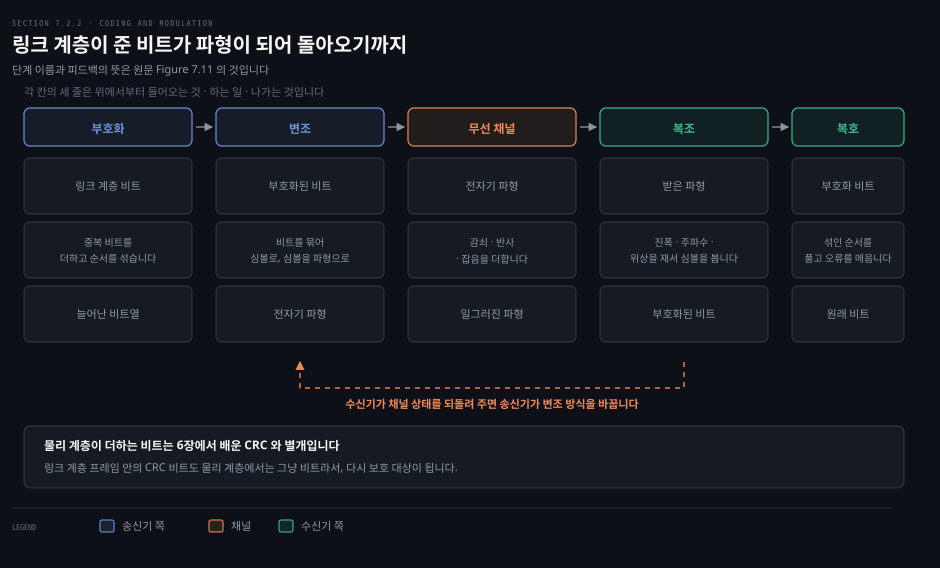
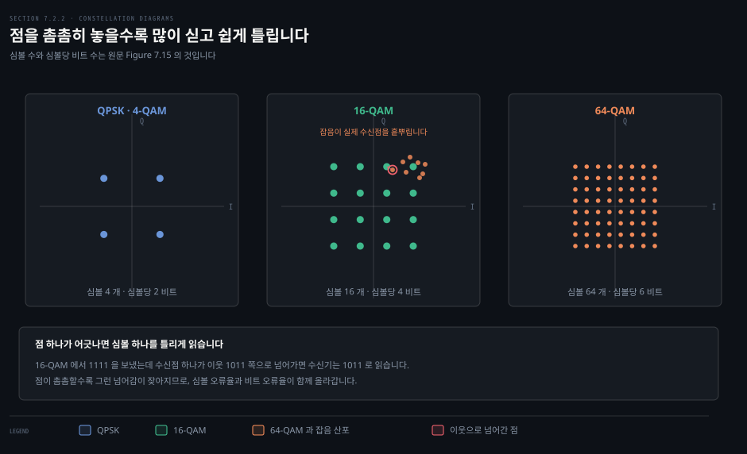
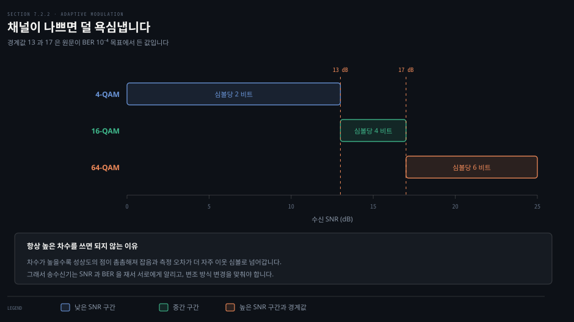
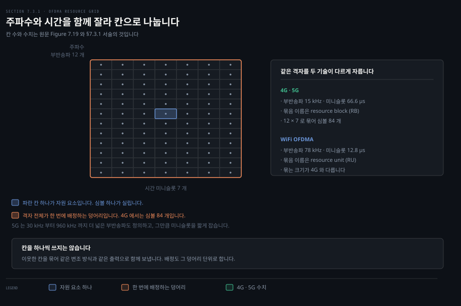
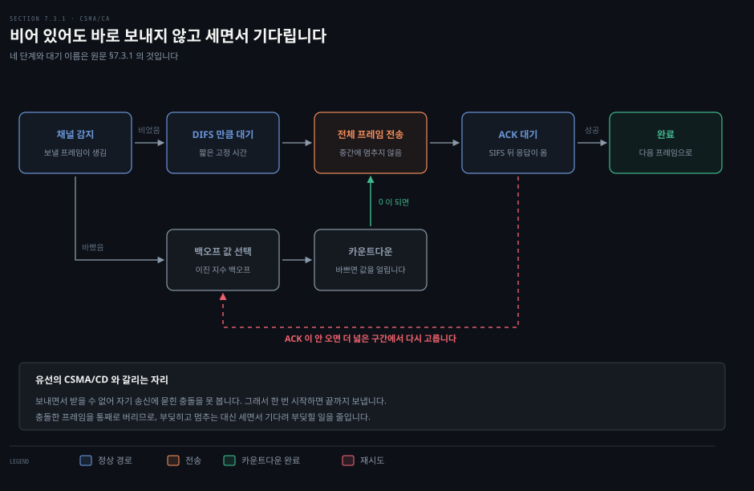
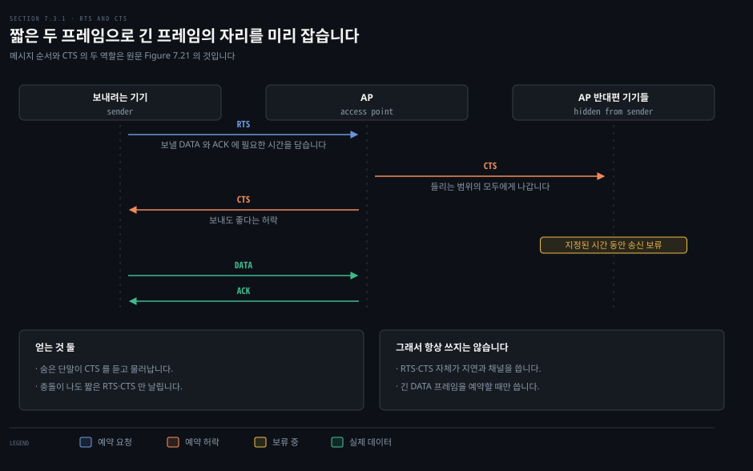

# 어떻게 실어 보내고 어떻게 부딪히지 않는가

---

> 앞 편이 무선 채널의 성질을 봤다면, 이 편은 그 채널 위에서 실제로 비트를 옮기는 두 가지 일을 봅니다. 파형에 싣는 일과 순서를 정하는 일입니다.

## 핵심 요약

> 이 편이 매달린 하나의 생각은 **무선의 두 결정이 모두 "채널이 지금 얼마나 나쁜가"에 매여 있다**는 것입니다.

첫 번째 결정은 한 심볼에 비트를 몇 개나 실을지입니다. 많이 실으면 빠르지만 잡음에 약해집니다. 그래서 송수신기는 SNR 을 재서 변조 방식을 **계속 바꿉니다.**

두 번째 결정은 누가 언제 보낼지입니다. 유선에서는 부딪히면 멈추면 됐습니다. 무선에서는 보내면서 부딪힘을 볼 수 없어서, 부딪힌 뒤에 대응하는 대신 **부딪힐 일을 미리 줄입니다.**

두 결정을 잇는 것이 하나 더 있습니다. 넓은 채널 하나를 통째로 쓰는 대신 주파수와 시간을 잘게 잘라 칸으로 나누는 **OFDMA** 입니다. 칸이 있어야 여러 기기에게 동시에, 그리고 기기마다 다른 변조 방식으로 보낼 수 있습니다.


## 학습 목표

> 이 편을 읽고 나면 아래 다섯 가지를 스스로 해낼 수 있습니다.

1. 링크 계층의 비트가 파형이 되기까지의 단계를 순서대로 설명합니다.
2. 성상도를 읽고 QAM 의 차수와 심볼당 비트 수를 대응시킵니다.
3. 적응 변조가 왜 필요한지 오류율 관점에서 설명합니다.
4. FDM 과 OFDM 과 OFDMA 가 각각 무엇을 더한 것인지 가릅니다.
5. CSMA/CA 가 CSMA/CD 와 갈리는 두 지점을 근거와 함께 말합니다.


## 1. 비트가 파형이 되기까지

> 링크 계층이 건넨 비트는 늘어나고 섞인 뒤에야 파형이 됩니다. 수신기는 그 역순을 밟습니다.



### 풀려는 문제

앞 편은 채널의 성질까지만 봤습니다. 그런데 실제로 비트를 보내려면 그 비트를 전자기 파형으로 바꿔야 합니다. 그 사이에 어떤 단계가 있는지 모르면 "무선이 느리다"는 말이 어느 단계에서 나오는 것인지 짚을 수 없습니다.

### 부호화는 비트를 늘리고 섞습니다

첫 단계인 **부호화**에서 원래 데이터 비트가 늘어납니다. 가장 단순한 경우로 중복 사본을 더해서 채널 잡음에 일부 비트가 망가지는 것에 대비합니다. 여기서 더해지는 비트는 6장에서 배운 링크 계층의 체크섬이나 CRC 비트와 **별개**입니다. 링크 계층 프레임 안의 CRC 비트도 물리 계층에서는 그냥 비트라서, 그 자체가 다시 물리 계층 비트의 보호를 받습니다.

늘리기만 하면 부족합니다. 잡음은 보통 몰려서 옵니다. 그래서 중복 비트를 원래 비트 사이에 흩뿌리는 **재배열**을 함께 합니다. 원문이 든 예를 그대로 따라가 보겠습니다.

```bash
# 원래 8 비트
d1 d2 d3 d4 d5 d6 d7 d8

# 사본을 붙여 16 비트로 (d1' 은 d1 의 사본)
d1 d1' d2 d2' d3 d3' d4 d4' d5 d5' d6 d6' d7 d7' d8 d8'

# 사본을 멀리 떼어 놓도록 섞기
d1 d5' d2 d6' d3 d7' d4 d8' d5 d1' d6 d2' d7 d3' d8 d4'

# 7·8·9 번째 비트가 연달아 날아간 경우 (x = 못 읽음)
d1 d5' d2 d6' d3 d7' x  x  x  d1' d6 d2' d7 d3' d8 d4'

# 다시 원래 순서로 풀면
d1 d1' d2 d2' d3 d3' x  d4' x  d5' d6 d6' d7 d7' d8 x
```

날아간 셋은 d4 와 d8' 과 d5 입니다. 풀고 나면 그 셋이 서로 떨어진 자리에 흩어져서, 각각의 짝인 d4' 과 d8 과 d5' 이 모두 살아남습니다. **연속 3 비트가 통째로 날아가도 원래 8 비트를 전부 되찾습니다.** 섞지 않았다면 연속된 세 자리는 d4·d4'·d5 였고 d4 는 사본까지 함께 잃었을 것입니다.

### 마지막에 화살표가 하나 되돌아옵니다

Figure 7.11 의 위쪽에는 수신기에서 송신기로 되돌아가는 점선 화살표가 있습니다. 수신기가 지금 채널이 어떤지 알려 주면 송신기가 그에 맞는 변조 방식을 고르는 통로입니다. 이 화살표 하나가 이 편의 세 번째 절 전체입니다.


## 2. 무엇을 흔들어 정보를 실을까요

> 흔들 수 있는 것은 진폭과 주파수와 위상 셋뿐입니다. 현대 무선의 속도는 그 셋을 조합하는 데서 나옵니다.



### 풀려는 문제

0 과 1 을 전파에 어떻게 얹을까요. 파동이 가진 성질은 앞 편에서 다섯을 셌지만, 실제로 정보를 실을 수 있는 것은 셋입니다. 그 셋을 어떻게 쓰느냐가 링크 속도를 정합니다.

### 셋 중 하나를 흔듭니다

**변조**는 부호화 모듈에서 나온 비트를 받아 그 비트를 담은 파형을 만드는 일입니다. 방법은 셋입니다.

- **진폭 변조**: 반송파의 진폭을 여러 이산 값 사이에서 바꿉니다. 진폭 편이 변조라고도 부릅니다.
- **주파수 변조**: 시간 구간마다 반송파의 주파수를 바꿉니다. 주파수 편이 변조라고도 부릅니다.
- **위상 변조**: 시간 구간마다 반송파의 위상을 바꿉니다. 위상 편이 변조라고도 부릅니다.

수신기는 라디오 신호의 진폭이나 주파수나 위상을 재기만 하면 0 인지 1 인지 알 수 있습니다. 다만 주파수와 위상의 변화를 검출하려면 송수신기의 클록이 세심하게 맞춰져 있어야 합니다.

### 왜 둘에서 멈추지 않는가

값을 둘만 쓸 이유가 없습니다. 진폭이나 위상이나 주파수의 값을 셋 이상 쓰면 한 번에 더 많은 정보를 담을 수 있고, 여러 성질을 동시에 흔들면 더 담을 수 있습니다. 현대의 물리 계층 변조 기법이 이 질문에서 나왔습니다.

비트를 둘씩 묶으면 00·01·10·11 네 가지가 됩니다. 이 묶음을 **심볼**이라 부릅니다. 송신기의 일이 비트를 보내는 것에서 심볼을 보내는 것으로 바뀝니다. 네 심볼이면 위상 값 네 개로 충분하고, 이것이 **QPSK** 입니다. 네 위상은 45도와 135도와 225도와 315도이고 진폭은 모두 같습니다.

여기서 덤이 하나 나옵니다. **심볼을 처리하는 속도가 비트율의 절반**이라 심볼 하나를 다루는 데 쓸 시간이 두 배로 늘어납니다. 비트 단위로 신호를 처리하는 것보다 여유가 생깁니다.

### 성상도와 QAM

네 심볼을 한 그림에 담는 것이 **성상도**입니다. 점 하나가 심볼 하나이고, 원점에서의 거리가 진폭, 동쪽에서 반시계로 잰 각도가 위상입니다. QPSK 의 네 점은 같은 거리에 90도씩 떨어져 놓입니다.

**QAM** 은 위상만이 아니라 진폭도 함께 흔듭니다. 앞의 숫자가 심볼 개수입니다.

- **4-QAM**: 사실상 QPSK 와 같습니다. 심볼당 2 비트입니다.
- **16-QAM**: 심볼당 4 비트입니다.
- **64-QAM**: 심볼당 6 비트입니다.

원문에 따르면 16-QAM 과 64-QAM 과 256-QAM 이 4G·5G 와 WiFi 에서 쓰입니다. 1024-QAM 과 4096-QAM 같은 더 높은 차수는 WiFi 6 과 WiFi 7 표준에 등장합니다.

성상도는 잡음이 오류를 만드는 방식도 보여 줍니다. 16-QAM 에서 1111 심볼을 보냈다고 해 봅시다. 전자기 잡음과 수신기의 측정 오차 때문에 실제로 측정되는 진폭과 위상은 매번 조금씩 다릅니다. 대부분은 1111 에 가깝게 찍히지만, 하나쯤은 이웃한 1011 쪽으로 넘어갑니다. 그러면 수신기는 **1011 이 왔다고 잘못 읽습니다.**


## 3. 채널이 나쁘면 덜 욕심냅니다

> 높은 차수가 항상 좋다면 낮은 차수는 왜 남아 있을까요. 오류율이 답을 정합니다.



### 풀려는 문제

앞 절의 결론만 보면 차수를 계속 올리는 것이 이득입니다. 그런데 실제 장비는 상황에 따라 낮은 차수로 내려갑니다. 무엇이 그 결정을 강제하는지 알아야 무선 속도가 왜 자꾸 흔들리는지도 설명할 수 있습니다.

### 촘촘할수록 잘 틀립니다

성상도가 촘촘해질수록 잡음과 측정 오차의 영향이 두드러집니다. 그러면 심볼 오류율이 올라가고 따라서 비트 오류율도 올라갑니다. 전송률이 높은 것이 늘 좋아 보이지만 오류율이 너무 높으면 아무 소용이 없습니다.

여기서 원문이 뽑는 통찰이 이 절의 제목입니다. **송수신기는 지금의 채널 조건에 맞는 변조 방식을 골라야 합니다.**

### 경계값

비트 오류율을 10⁻⁴ 아래로 유지하면서 가능한 한 높은 전송률을 내는 것이 목표라고 해 봅시다. 원문이 Figure 7.17 에서 읽어 주는 경계는 이렇습니다.

| 수신 SNR | 고를 변조 | 심볼당 비트 |
|---------|----------|-----------|
| 13 dB 미만 | 4-QAM | 2 |
| 13 에서 17 dB | 16-QAM | 4 |
| 17 dB 초과 | 64-QAM | 6 |

SNR 은 시간에 따라 변합니다. 그래서 송수신기가 쓰는 변조 방식도 동적으로 바뀝니다. 그러려면 양쪽이 BER 과 SNR 을 재서 서로에게 알리고, 변조 방식 변경을 맞춰야 합니다. 앞 절에서 본 되돌아가는 점선 화살표가 이 조율의 통로입니다.

> **노트의 읽기**: 위 경계값은 원문 그림이 가정한 조건에서 읽은 값입니다. 오류 정정 부호의 이득이나 채널 모델이 달라지면 같은 BER 목표에서도 경계가 옮겨 갑니다. 숫자 자체를 외우기보다 **경계가 있다는 사실과 그 경계가 SNR 로 정해진다는 구조**를 기억하는 편이 낫습니다.

이 조율을 어떻게 하는지는 4G·5G 를 다룰 때 다시 나옵니다. 기기가 채널 품질 지표를 주기적으로 올려 보내면 기지국이 그 값으로 변조 방식과 자원 배정을 함께 정합니다.


## 4. 주파수를 잘게 쪼개 겹쳐 씁니다

> 넓은 채널 하나를 통째로 쓰는 대신 잘게 나눕니다. 나누면 여럿에게 동시에 줄 수 있습니다.



### 풀려는 문제

6장 §6.3 에서 채널을 나눠 쓰는 방법 세 갈래를 배웠습니다. 주파수나 시간으로 자르는 채널 분할, 알로하와 CSMA 같은 랜덤 접속, 그리고 폴링 같은 순번 방식입니다. 무선에서는 이 셋이 그대로 쓰이기도 하고 결합되거나 확장되기도 합니다. 무엇이 왜 달라졌는지를 봐야 합니다.

### 광대역 하나가 아니라 좁은 여럿으로

이상적으로는 넓은 채널 하나에 전력을 고르게 퍼뜨리면 됩니다. 그런데 두 가지 이유로 그렇게 하지 않습니다. 광대역 채널 하나는 실제로 구현하기 어렵습니다. 주파수마다 겪는 손상이 다르기 때문입니다. 그리고 기기가 채널 전체 폭을 다 쓸 필요도 없습니다.

그래서 대역을 좁은 채널 여럿으로 나눕니다. 이때 이웃한 부채널끼리 간섭하지 않도록 아무 신호도 싣지 않는 **가드 밴드**를 사이에 둡니다. 가드 밴드는 안전하지만 낭비입니다.

**OFDM** 은 부채널의 반송파를 서로 상쇄되도록 변조해서 겹쳐 놓습니다. 겹쳐도 서로를 지우기 때문에 가드 밴드가 필요 없습니다. 스펙트럼 밀도 곡선 아래 면적이 그만큼 늘어나므로, OFDM 이 가드 밴드를 쓰는 FDM 보다 **스펙트럼 효율이 높습니다.** 스펙트럼이 희소하고 비싼 자원이라는 앞 편의 결론을 생각하면 이 차이가 작지 않습니다.

> **원문 정오**: 489쪽은 "**Section 7.4** 에서 4G/5G 와 WiFi 망이 각자의 채널과 부채널 대역폭을 어떻게 정의하는지 보게 된다"고 적습니다. §7.4 는 무선 코어망을 다루는 절이라 채널 대역폭이 나오지 않습니다. WiFi 채널 정의는 **§7.3.2**, 5G 채널과 대역 정의는 **§7.3.3** 에 있습니다.

### 시간까지 함께 자르면 OFDMA

**OFDMA** 는 주파수 분할과 시간 분할을 함께 씁니다. OFDM 의 각 주파수 부채널을 다시 시간 미니슬롯으로 자릅니다. 한 부채널 주파수에서의 한 미니슬롯이 **자원 요소**이고, 여기에 심볼 하나가 실립니다. 자원 요소가 OFDMA 채널 자원의 가장 작은 단위입니다.

수치는 기술마다 다릅니다.

- **4G·5G**: 자원 요소가 부채널 대역폭 15 kHz 를 차지하고 지속 시간은 66.6 µs 입니다.
- **WiFi 의 OFDMA**: 자원 요소가 부채널 대역폭 78 kHz 를 차지하고 지속 시간은 12.8 µs 입니다.

자원 요소를 하나씩 쓰지는 않습니다. 주파수와 시간 양쪽에서 이웃한 것들을 묶고, 묶음 안의 모든 심볼을 같은 변조 방식과 같은 출력으로 보냅니다. 4G·5G 는 이 묶음을 **자원 블록**, WiFi 는 **자원 단위**라 부릅니다. 4G 에서 자원 블록 하나는 미니슬롯 7 개와 부채널 12 개가 만나는 심볼 84 개입니다.

> **원문 정오**: 489쪽의 소제목은 OFDMA 를 "Orthogonal Frequency Division Multiple Access" 로 풀어 놓고, 바로 아래 첫 문장은 같은 약어를 "Orthogonal Frequency Division **Multiplexing** Access" 로 풉니다. 표준 표기는 소제목 쪽인 Multiple Access 입니다.

### 알로하는 아직 살아 있습니다

랜덤 접속 쪽도 짚고 갑니다. 알로하에서 노드는 보낼 것이 생기면 채널 전체 폭을 써서 그냥 보냅니다. 둘 이상이 동시에 보내면 신호가 겹칩니다. 그러면 어느 쪽도 목적지에 제대로 닿지 못합니다.

알로하 계열은 50 년도 더 전에 무선 위성망을 위해 개발됐습니다. 그런데 지금도 쓰입니다. 위성망과 IoT 망에서 쓰이고, 4G·5G 의 일부 제어 평면 기능에도 들어가 있습니다. 다음 편에서 기기가 5G 망에 처음 붙을 때 쓰는 상향 임의 접속 채널이 그 자리입니다.


## 5. 들어 보고 세면서 기다립니다

> 무선에서는 보내면서 부딪힘을 볼 수 없습니다. 그래서 부딪힌 뒤 멈추는 대신 부딪힐 일을 미리 줄입니다.



### 풀려는 문제

앞 편에서 숨은 단말이 "들어 보고 비었으면 보낸다"는 규칙을 깬다는 것을 봤습니다. 그런데 문제는 하나가 아닙니다. 무선에는 유선의 충돌 검출을 그대로 옮길 수 없게 만드는 두 번째 이유가 따로 있습니다.

### 두 가지 도전

원문은 CSMA/CA 가 다루는 무선 고유의 문제를 둘로 셉니다.

- **숨은 단말**: 첫 송신자가 자기와 같은 목적지로 보내는 숨은 두 번째 송신자의 송신을 아예 못 듣습니다.
- **충돌 검출 불가**: 충돌을 검출하려면 보내면서 동시에 받아야 합니다. 그런데 수신 신호의 세기가 자기 송신 신호의 세기에 비해 아주 작아서, 자기 무전기 안에서조차 진행 중인 송신과의 충돌을 알아채기 어렵습니다.

두 번째가 낳는 결과가 이 절 전체를 밀고 갑니다. **CSMA/CA 는 충돌 검출을 안 쓰므로, 한 국이 프레임을 보내기 시작하면 끝까지 다 보냅니다.** 시작하면 되돌아갈 수 없습니다. 충돌이 잦은 상황에서 긴 프레임을 통째로 보내는 것은 성능을 크게 떨어뜨립니다.

### 그래서 확인 응답을 답니다

무선에서는 목적지에서의 충돌이 유선보다 흔합니다. 그래서 CSMA/CA 는 명시적인 **링크 계층 확인 응답**을 둡니다. 목적지 국이 프레임을 제대로 받으면, 즉 CRC 검사를 통과하면 **SIFS** 라는 짧은 시간을 기다린 뒤 확인 응답 프레임을 돌려보냅니다.

송신 국이 정해진 시간 안에 확인 응답을 못 받으면 오류가 났다고 보고 CSMA/CA 를 다시 밟아 재전송합니다. 정해진 횟수만큼 재전송해도 응답이 없으면 포기하고 프레임을 버립니다.

### 네 단계

이제 프로토콜 전체를 말할 수 있습니다. 기기나 AP 가 보낼 프레임을 가졌다고 해 봅시다.

1. 처음에 채널이 비어 있다고 감지되면 **DIFS** 라는 짧은 시간 뒤에 프레임을 보냅니다.
2. 그렇지 않으면 이진 지수 백오프로 임의의 백오프 값을 고르고, DIFS 뒤에 채널이 비었다고 감지될 때만 그 값을 내려 셉니다. 채널이 바쁜 동안에는 **카운터 값이 얼어붙습니다.**
3. 카운터가 0 에 닿으면 프레임 전체를 보내고 확인 응답을 기다립니다.
4. 확인 응답을 받으면 다음 프레임은 2 단계부터 새로 시작합니다. 못 받으면 **더 넓은 구간에서 값을 다시 골라** 백오프 단계로 되돌아갑니다.

### 왜 카운트다운을 하는가

6장의 이더넷 CSMA/CD 에서는 채널이 비었다고 감지되는 즉시 보내기 시작했습니다. CSMA/CA 는 비어 있어도 세는 동안에는 안 보냅니다. 왜 다를까요.

두 국이 각각 보낼 프레임을 가졌는데 지금은 세 번째 국이 보내고 있어서 둘 다 기다리는 상황을 생각해 보십시오. CSMA/CD 라면 세 번째 국이 끝나는 순간 둘이 동시에 보내고 충돌합니다. 이더넷에서는 이것이 큰 문제가 아닙니다. 둘 다 즉시 중단하므로 프레임의 나머지를 쓸데없이 보내는 일이 없기 때문입니다.

WiFi 는 다릅니다. 충돌한 프레임이 통째로 다 나갑니다. 그래서 목표가 **가능한 한 충돌을 피하는 것**으로 바뀝니다.

두 국이 채널이 바쁘다고 감지하면 둘 다 즉시 임의 백오프에 들어갑니다. 서로 다른 값을 골랐기를 기대하는 것입니다. 값이 다르면 한쪽이 먼저 보내기 시작합니다. 서로 숨어 있지 않다면 지는 쪽이 그 송신을 듣고 카운터를 얼려 기다립니다. 값비싼 충돌을 이렇게 피합니다.

물론 충돌이 완전히 사라지지는 않습니다. 두 국이 서로에게 숨어 있을 수도 있고, 백오프 값이 충분히 가까워서 먼저 시작한 쪽의 송신이 아직 상대에게 닿지 않았을 수도 있습니다.


## 6. 안 들리는 상대를 위해 미리 예약합니다

> 짧은 프레임 두 개로 긴 프레임의 자리를 잡아 둡니다. 부딪히더라도 짧은 것만 낭비됩니다.



### 풀려는 문제

앞 절의 백오프는 서로 들리는 국들 사이에서만 통합니다. 숨은 단말은 상대의 송신을 아예 못 듣기 때문에 카운터를 얼릴 이유도 없습니다. 그래서 CSMA/CA 위에 예약 장치가 하나 더 필요합니다.

### 무엇이 문제인가

앞 편의 배치를 다시 씁니다. A 와 B 는 서로 들리고 B 와 C 도 서로 들리지만 A 와 C 는 서로를 못 듣습니다. A 가 B 에게 프레임을 보내는 도중에 C 가 B 에게 보내려 합니다. C 는 A 의 송신을 못 들으므로 DIFS 만 기다리고 그냥 보냅니다. B 에서 충돌이 나고, **A 와 C 의 송신 시간 전체가 낭비됩니다.**

### RTS 와 CTS

이를 막으려고 CSMA/CA 는 선택적인 짧은 제어 프레임 두 개를 둡니다. 보내려는 국이 먼저 **RTS** 를 AP 에게 보냅니다. RTS 에는 데이터 프레임과 확인 응답 프레임을 보내는 데 필요한 총 시간이 들어 있습니다. AP 는 RTS 를 받으면 **CTS** 를 브로드캐스트합니다.

CTS 는 두 가지 일을 동시에 합니다.

1. 보낸 국에게 **보내도 좋다는 명시적 허락**을 줍니다.
2. 목적지의 가청 범위 안에 있는 다른 국들에게 **지정된 시간 동안 보내지 말라**고 지시합니다.

Figure 7.21 을 따라가면 순서가 보입니다. 송신자가 RTS 를 뿌리면 가청 범위의 모든 국과 AP 가 듣습니다. AP 반대편의 국들은 송신자의 가청 거리 밖이라 이 RTS 를 못 받습니다. 그런데 AP 가 답으로 내는 CTS 는 AP 의 가청 범위 전체에 닿으므로 그 국들도 듣습니다. CTS 를 들은 국들은 지정된 시간 동안 송신을 멈춥니다.

### 얻는 것 둘, 그래도 선택적인 이유

원문이 세는 이점은 둘입니다.

- 긴 데이터 프레임이 채널을 예약한 **뒤에야** 나가므로 숨은 국 문제가 완화됩니다.
- RTS 와 CTS 는 짧아서, 이들이 충돌하더라도 짧은 시간만 낭비됩니다. RTS 와 CTS 가 제대로 오가면 뒤따르는 데이터와 확인 응답은 보통 충돌 없이 나갑니다.

다만 RTS/CTS 가 채널을 완벽히 예약해 주지는 않습니다. RTS 나 CTS 자체가 페이딩이나 잡음으로 사라질 수 있습니다.

그리고 이 교환은 지연을 만들고 채널 자원을 씁니다. 그래서 **긴 데이터 프레임을 예약할 때만** 쓰고, 쓴다 하더라도 선택적입니다.


## 결정 치트시트

> 이 편의 판단 기준을 한 표에 모았습니다.

| 상황 | 판단 | 이유 |
|------|------|------|
| 링크 속도가 자꾸 흔들린다 | 적응 변조가 도는 것을 의심합니다 | SNR 구간마다 차수가 바뀜 |
| 오류가 몰려서 난다 | 인터리빙 깊이를 봅니다 | 중복만으로는 연속 오류에 약함 |
| 기기 하나가 채널을 다 쓴다 | OFDM 단독인지 확인합니다 | OFDM 은 전체 폭, OFDMA 는 나눠 씀 |
| 기기가 많은 곳에서 느리다 | OFDMA 를 쓰는 세대인지 봅니다 | 동시 다중 사용자를 겨냥한 방식 |
| 긴 프레임에서만 처리량이 무너진다 | RTS/CTS 를 켜 봅니다 | 숨은 단말이 긴 프레임을 통째로 날림 |
| 짧은 프레임인데 RTS/CTS 를 켰다 | 끕니다 | 예약 비용이 프레임보다 큼 |


## 심화 학습

> 책 밖 보강입니다. 원문이 다루지 않는 자리만 적습니다.

### 인터리빙과 오류 정정 부호는 짝입니다

원문의 예는 단순 중복입니다. 실제 무선에서는 컨볼루션 부호나 터보 부호, 그리고 5G 에서 채택된 LDPC 와 폴라 부호가 쓰입니다.[^3gpp-38212] 이 부호들은 흩어진 오류를 잘 고치지만 몰린 오류에는 약합니다. 인터리빙이 몰린 오류를 흩어진 오류로 바꿔 주기 때문에 둘이 짝으로 쓰입니다.

### 성상도를 직접 흔들어 볼 수 있습니다

원문은 QPSK 를 다루면서 대화형 사이트를 하나 소개합니다.[^geogebra-qpsk] 위상 값을 직접 바꿔 보면 왜 네 점이 90도씩 떨어져 있어야 하는지가 손에 잡힙니다. 점 사이 거리가 곧 잡음 여유이기 때문입니다.

### WiFi 의 OFDMA 는 6 세대부터입니다

OFDM 은 20 년 넘게 모든 802.11 표준에 있었습니다. OFDMA 는 WiFi 6 부터 들어왔습니다. 그 전까지 WiFi 는 한 순간에 한 기기만 채널을 썼습니다.

이 차이가 밀집 환경의 성능을 갈랐습니다. 다음 편에서 옛 기기와 새 기기가 한 채널을 나눠 쓰는 방법으로 이어집니다.


## 면접 대비

> 이 편에서 실제로 물어보기 좋은 것만 골랐습니다.

### 한 줄 정의

적응 변조란 수신 SNR 을 재서 심볼당 비트 수를 동적으로 바꾸는 기법이고, 오류율 목표를 지키면서 그 순간 낼 수 있는 최대 전송률을 얻는 것이 목적입니다.

### 핵심 포인트 세 가지

1. 심볼당 비트를 늘리면 빨라지지만 성상도의 점이 촘촘해져 오류율이 올라갑니다.
2. OFDM 은 가드 밴드를 없애 효율을 올리고, OFDMA 는 거기에 시간 축을 더해 여럿에게 동시에 줍니다.
3. CSMA/CA 는 충돌을 검출하지 못하므로 검출 대신 회피를 택했고, 그래서 비어 있어도 세면서 기다립니다.

### 자주 묻는 질문

**Q: WiFi 는 왜 CSMA/CD 를 안 씁니까?**
A: 충돌을 검출하려면 보내면서 동시에 받아야 하는데, 자기 송신 신호가 수신 신호보다 훨씬 세서 자기 무전기 안에서도 충돌을 알아채기 어렵습니다. 검출을 못 하니 시작한 프레임은 끝까지 나가고, 그래서 검출 대신 회피가 답이 됩니다.

**Q: 채널이 비어 있는데 왜 바로 안 보냅니까?**
A: 앞선 송신이 끝나는 순간 기다리던 국들이 동시에 뛰어들면 충돌하기 때문입니다. 이더넷은 그 충돌을 즉시 중단할 수 있어 손해가 작지만, WiFi 는 충돌한 프레임이 통째로 나가서 손해가 큽니다.

**Q: RTS/CTS 는 왜 기본으로 켜져 있지 않습니까?**
A: 교환 자체가 지연과 채널 자원을 쓰기 때문입니다. 짧은 프레임에서는 예약 비용이 프레임보다 커집니다. 그래서 긴 데이터 프레임을 보낼 때만, 그것도 선택적으로 씁니다.


## 핵심 개념 체크리스트

- [ ] 물리 계층 부호화가 링크 계층 CRC 와 어떻게 다른지 말할 수 있는가?
- [ ] 인터리빙이 몰린 오류에 왜 효과가 있는지 예로 보일 수 있는가?
- [ ] ASK·FSK·PSK 를 각각 무엇을 바꾸는 것인지 구분하는가?
- [ ] 성상도에서 원점 거리와 각도가 각각 무엇인지 아는가?
- [ ] QAM 차수와 심볼당 비트 수를 대응시킬 수 있는가?
- [ ] 적응 변조가 필요한 이유를 오류율로 설명할 수 있는가?
- [ ] OFDM 이 FDM 보다 스펙트럼 효율이 높은 이유를 말할 수 있는가?
- [ ] 자원 요소와 자원 블록의 관계를 수치로 설명할 수 있는가?
- [ ] CSMA/CA 의 네 단계를 순서대로 말할 수 있는가?
- [ ] CTS 가 하는 두 가지 일을 각각 설명할 수 있는가?


## 관련 문서

- [7장 첫 편 — 무선은 왜 유선처럼 되지 않는가](./07-01.무선은%20왜%20유선처럼%20되지%20않는가.md) — 이 편이 전제하는 채널의 성질
- [6장 두 번째 편 — 하나의 채널을 여럿이 어떻게 나눠 쓰는가](./06-02.하나의%20채널을%20여럿이%20어떻게%20나눠%20쓰는가.md) — FDM·TDM·알로하·CSMA/CD 의 원형
- [6장 첫 편 — 한 칸을 건너는 데 무엇이 필요한가](./06-01.한%20칸을%20건너는%20데%20무엇이%20필요한가.md) — 링크 계층의 CRC
- [책 폴더 README](./README.md)


## 참고 자료

- 원서: Kurose·Ross, 《Computer Networking: A Top-Down Approach》 9판, Pearson. §7.2.2 · §7.3 · §7.3.1
- 원문이 인용한 자료
  - [Goldsmith 2005]: 부호화 기법
  - [Abramson 1972; Schwartz 2009]: 알로하의 역사
  - [Meraki WiFi6 2020]: WiFi 6 의 MU-RTS 동작

[^3gpp-38212]: 3GPP TS 38.212 — 5G NR 의 채널 부호화. LDPC 와 폴라 부호의 적용 범위가 정의돼 있습니다. <https://www.3gpp.org/DynaReport/38212.htm>
[^geogebra-qpsk]: 원문이 소개한 QPSK 대화형 자료. <https://www.geogebra.org/m/enkymjtg>
