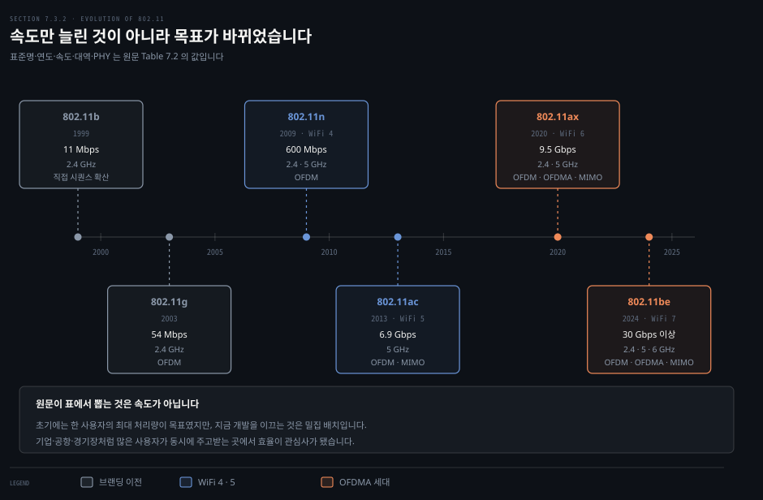
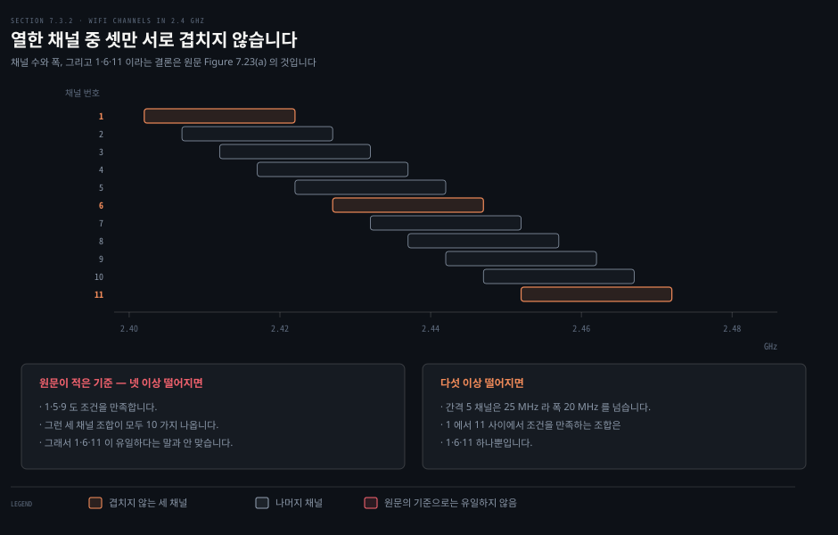
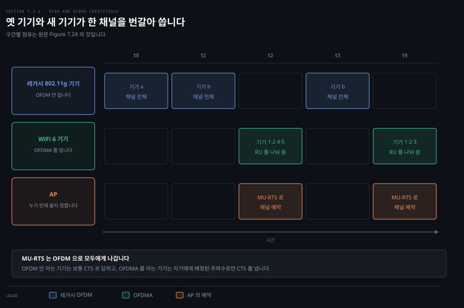
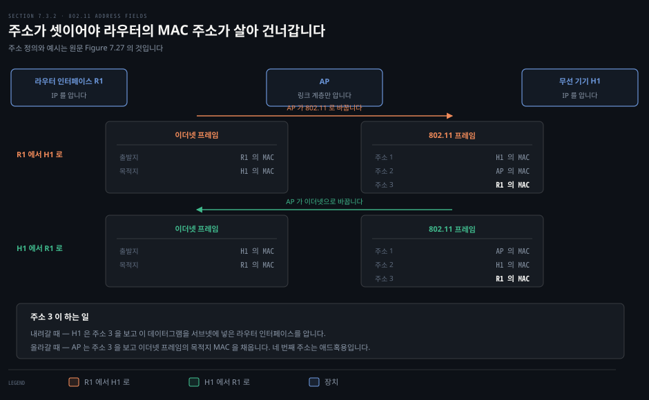
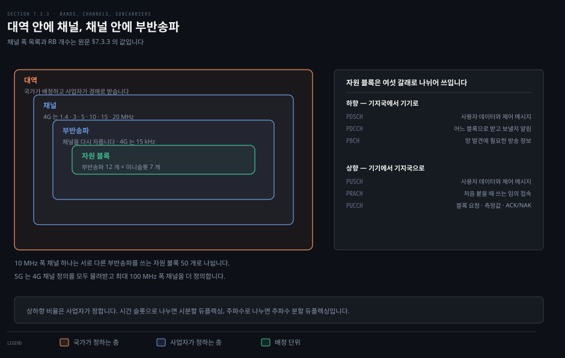
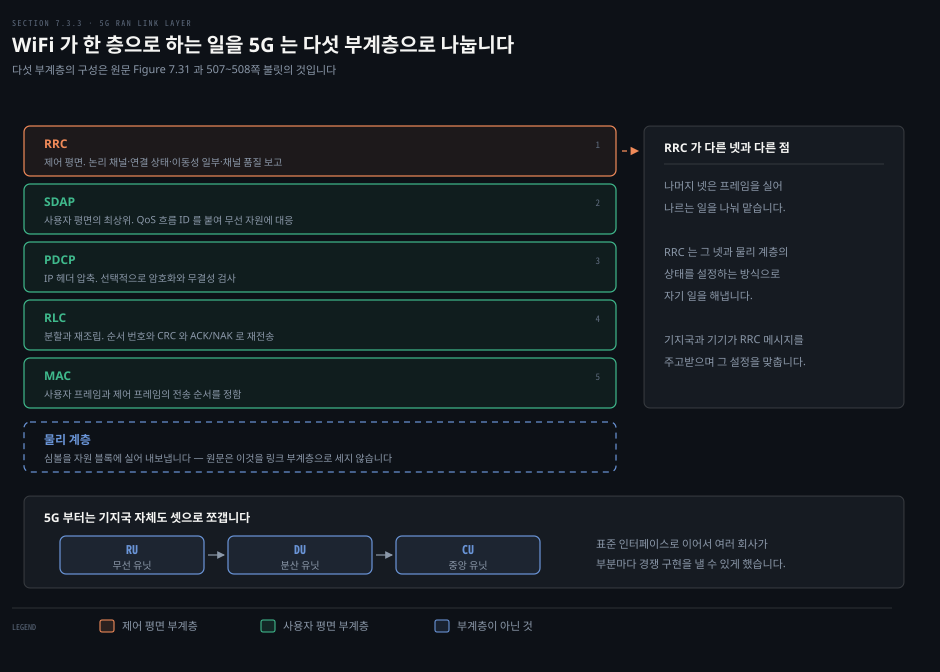

# WiFi 와 5G 는 같은 공기를 다르게 씁니다

---

> 앞 두 편이 원리였다면 이 편은 실물입니다. 같은 물리 계층 위에 802.11 과 5G RAN 이라는 두 접속망이 어떻게 다르게 서 있는지 봅니다.

## 핵심 요약

> 이 편이 매달린 하나의 생각은 **두 기술의 차이가 채널을 누가 정하느냐에서 나온다**는 것입니다.

WiFi 에서는 AP 가 채널 하나를 고르고, 그 채널 안에서 기기들이 **경쟁**합니다. 비면허 대역이라 옆집 AP 와도 같은 공기를 나눠 씁니다. 그래서 겹치지 않는 채널이 몇 개인가가 실제 성능을 정합니다.

5G 에서는 사업자가 경매로 받은 대역을 채널로 자릅니다. 그 안에서 기지국이 자원 블록을 **배정**합니다. 경쟁이 없는 대신 층이 많습니다. 대역 안에 채널이 있고 채널 안에 부반송파가 있습니다. 링크 계층만 해도 다섯 부계층으로 나뉩니다.

두 기술이 겹치는 자리도 있습니다. WiFi 6 이 OFDMA 를 들여오면서 **옛 기기와 새 기기를 한 채널에 두는 문제**를 풀어야 했고, 그 해법이 숨은 단말용으로 만든 RTS/CTS 의 확장이었습니다.


## 학습 목표

> 이 편을 읽고 나면 아래 다섯 가지를 스스로 해낼 수 있습니다.

1. 802.11 세대가 무엇을 늘려 왔고 최근 세대의 목표가 어떻게 바뀌었는지 설명합니다.
2. 2.4 GHz 에서 겹치지 않는 채널이 왜 셋뿐인지 계산으로 보입니다.
3. OFDM 기기와 OFDMA 기기가 한 채널에 공존하는 방법을 설명합니다.
4. 802.11 프레임의 주소가 왜 넷인지, 그중 셋이 각각 무엇인지 말합니다.
5. 5G RAN 의 자원 계층 넷과 링크 부계층 다섯을 나열하고 역할을 붙입니다.


## 1. 세대가 늘린 것과 바꾼 것

> 세대마다 최대 속도가 올랐습니다. 그런데 최근 세대가 겨냥하는 것은 한 사람의 속도가 아닙니다.



### 풀려는 문제

무선 LAN 은 1990년대에 여럿 나왔지만 하나가 확실하게 이겼습니다. IEEE 802.11 입니다. 유선 LAN 을 이더넷이 지배하듯 무선 LAN 을 WiFi 가 지배합니다. 그런데 세대 표를 속도만 보고 읽으면 최근 표준이 왜 그런 모양인지 놓칩니다.

### 이름부터 정리합니다

802.11 표준은 IEEE 802.11 표준 위원회가 만듭니다. 2000년부터 그중 일부가 WiFi 얼라이언스에 의해 **WiFi 로 브랜딩**됐고, 세대 번호를 붙이는 방식이 셀룰러의 세대 개념과 비슷하게 자리 잡았습니다. WiFi 브랜딩에 들어가지 않은 802.11 표준도 있습니다. 이 책은 주요 상용 표준이 각각 WiFi 세대에 대응한다고 보고 두 이름을 섞어 씁니다.

> **원문 정오**: 495쪽은 WiFi 브랜딩 밖의 표준들이 "**Table 7.3** 에 나온 것보다 높거나 낮은 주파수 대역에서 동작한다"고 적습니다. 7장에는 Table 7.3 이 없습니다. 표는 Table 7.1 과 Table 7.2 둘뿐이고, 주파수 대역이 실린 것은 그 둘입니다.

> **원문 정오**: 같은 쪽에서 "무선 망이 기기 이동성을 어떻게 받치는지는 **Section 7.4.2** 에서 다룬다"고 적습니다. §7.4.2 는 사용자 평면 기능을 다루는 절입니다. WiFi 의 이동성은 **§7.5.2** 에 있습니다.

### 세 축이 함께 움직였습니다

원문은 최대 처리량 너머를 보라고 하면서 세 가지 변화를 짚습니다.

- **주파수**: 대부분의 WiFi 는 비면허 대역에서 동작합니다. 예외로 차량 간 통신용 802.11p 가 면허 대역을 씁니다. 쓰는 대역은 2.4 GHz 하나에서 5 GHz 로, 그리고 지금은 6 GHz 까지 넓어졌습니다. 1 GHz 미만 대역을 쓰는 표준도 있고, 60 GHz 이상 밀리미터파를 쓰는 표준도 있습니다.
- **대역폭**: 채널의 최소 폭은 20 MHz 이고, 이웃한 20 MHz 채널을 **묶어서** 더 넓은 폭을 냅니다. 한 WiFi 망은 그중 하나의 채널에서만 동작합니다.
- **물리 계층**: 3G 셀룰러의 확산 스펙트럼과 가까운 변조에서 시작해 OFDM 으로, 그리고 OFDMA 로 옮겨 왔습니다.

> **원문 정오**: 496쪽은 채널 본딩을 설명하면서 "**Figure 7.43** 을 보라"고 적습니다. Figure 7.43 은 §7.5 의 이동성 범위를 그린 그림입니다. 채널 배치는 **Figure 7.23** 입니다.

> **원문 정오**: 같은 쪽에 "**801**.11ad" 라는 오탈자가 있습니다. 802.11ad 입니다.

> **원문 정오**: Table 7.2 는 802.11ax 의 주파수를 "2.4, 5" 로만 적습니다. 그런데 같은 장의 Table 7.1 은 6 GHz 대역을 "802.11 **ax**/be" 로 표시하고, 본문도 대역이 6 GHz 까지 넓어졌다고 적습니다. 두 표가 서로 어긋납니다.

### 목표가 바뀐 자리

표에서 읽히는 첫인상은 최대 처리량의 꾸준한 상승입니다. 그런데 원문은 곧바로 단서를 답니다. WiFi 망이 **한 사용자에게 최대 처리량을 주려고 깔리는 경우는 많지 않습니다.**

최근 개발을 이끄는 사례는 밀집 배치입니다. 대기업, 공항, 경기장, 공공장소처럼 많은 사용자가 동시에 주고받으려는 곳입니다. 그런 곳에서는 한 사람에게 최대 처리량을 주는 것보다 **여러 사용자를 효율적으로 받치는 것**이 초점이 됩니다. OFDMA 가 WiFi 6 에 들어온 이유가 여기 있습니다.

### 기본 구성 단위

802.11 무선 LAN 구조의 기본 벽돌은 **기본 서비스 집합** 입니다. 하나의 BSS 에는 무선 노드가 둘 이상 있습니다. 그중 하나가 보통 중앙 기지국인 AP 입니다. AP 는 스위치나 라우터 같은 상호연결 장치에 붙고, 그것이 인터넷으로 이어집니다.

가정용 망에서는 AP 하나와 2 계층 스위치 하나와 3 계층 라우터 하나가 보통 한 상자에 통합돼 있습니다. 이 책은 편의상 그 조합 전체를 AP 라 부르기도 하지만, 802.11 표준에서 **AP 는 2 계층 전용 장치**입니다.

> **노트의 읽기**: 원문은 여기서 "기기는 AP 와만 주고받을 수 있고 기기 사이 직접 통신은 일어나지 않는다"고 잘라 말합니다. 이 문장은 인프라 모드를 전제한 것입니다. 같은 절 뒤쪽에서 프레임의 네 번째 주소 필드가 **애드혹 모드에서 기기끼리 프레임을 전달할 때** 쓰인다고 밝히고 있으니, 두 서술은 범위가 다릅니다.


## 2. 열한 채널 중 셋만 겹치지 않습니다

> 채널은 5 MHz 간격으로 놓이는데 폭은 20 MHz 입니다. 번호가 가까우면 서로 간섭합니다.



### 풀려는 문제

집이나 사무실에서 WiFi 가 느릴 때 "채널을 1, 6, 11 중 하나로 바꾸라"는 조언을 흔히 듣습니다. 왜 하필 그 셋인지 모르면 상황이 달라졌을 때 판단할 수 없습니다. 근거는 두 숫자에 있습니다.

### 두 숫자가 답을 정합니다

2.4 GHz 대역에서 802.11 은 부분적으로 겹치는 채널 11 개를 정의하고, 각 채널의 폭은 20 MHz 입니다. 채널 번호는 5 MHz 간격으로 매겨집니다. 그러니 이웃한 번호끼리는 폭의 4 분의 3 이 겹칩니다.

셋이 서로 겹치지 않으려면 번호가 충분히 떨어져야 합니다. 채널 1 과 6 은 번호로 다섯 칸, 주파수로 25 MHz 떨어져 있어서 20 MHz 폭이 서로 닿지 않습니다. 1 과 6 과 11 이면 세 쌍 모두 그 조건을 만족합니다. 이 셋으로 AP 세 대를 같은 공간에 두면 서로 간섭하지 않습니다.

> **원문 정오**: 497쪽은 "두 채널이 겹치지 않을 필요충분조건은 **넷 이상** 떨어지는 것"이라 적고, 바로 다음 문장에서 "1·6·11 이 유일한 세 채널 조합"이라고 적습니다. 두 문장이 서로 맞지 않습니다. 넷 이상을 기준으로 삼으면 1·5·9 도 조건을 만족하고, 1 에서 11 사이에서 그런 조합이 **모두 10 가지** 나옵니다. 유일하려면 기준이 **다섯 이상**이어야 합니다.

셈은 간단합니다. 1 에서 11 중 세 채널을 고르되 인접 간격이 g 이상이라는 조건은, 변수를 옮기면 1 에서 11−2(g−1) 사이에서 서로 다른 셋을 고르는 문제가 됩니다.

```bash
간격 4 이상 → 1..5 에서 셋 고르기 → 10 가지
              (1,5,9) (1,5,10) (1,5,11) (1,6,10) (1,6,11)
              (1,7,11) (2,6,10) (2,6,11) (2,7,11) (3,7,11)

간격 5 이상 → 1..3 에서 셋 고르기 → 1 가지
              (1,6,11)
```

### 그래서 무슨 일이 생기는가

세 망이 1·6·11 을 쓰면 서로 간섭하지 않습니다. 그런데 두 망이 겹치는 채널에서 동작하면 두 망의 기기들이 서로를 간섭합니다. 문제가 되는 것은 같은 공간의 WiFi 망들이 **서로 독립적으로 운영될 때**입니다. 내 집 WiFi 와 30 미터 안 모든 아파트의 WiFi 가 그런 관계입니다.

앞 편에서 본 문장이 여기서 다시 살아납니다. 이웃의 네트워크 송신은 내 망에게 잡음입니다. 비면허 대역이라 조율할 방법도 없습니다.


## 3. 옛 기기와 새 기기가 한 채널을 나눕니다

> WiFi 6 은 OFDMA 를 들여오면서 OFDM 만 아는 옛 기기를 버릴 수 없었습니다. 예약 장치를 확장해 풀었습니다.



### 풀려는 문제

AP 하나는 아주 오래된 802.11g 기기부터 최신 WiFi 6 기기까지 모두 받쳐야 합니다. 그런데 OFDM 은 한 기기가 채널 전체를 쓰는 방식이고, OFDMA 는 여럿이 나눠 쓰는 방식입니다. 여기에 CSMA/CA 까지 같은 채널에서 돌아야 합니다. **셋을 한 망에서 어떻게 동시에 쓸 수 있을까요.**

### 세 방식이 하나의 채널에

지난 20 년의 모든 802.11 표준이 OFDM 을 받칩니다. OFDM 은 채널을 만드는 데 쓰이고, AP 는 그 채널 중 하나에서 동작하도록 설정됩니다. 또는 주 채널을 배정받은 뒤 이웃한 보조 채널을 묶어 폭을 동적으로 넓힐 수 있습니다. OFDM 을 쓸 때는 기기든 AP 든 **채널 전체 폭**을 씁니다.

WiFi 6 부터는 OFDMA 도 받칩니다. 채널을 부채널로 나눠 여러 기기에게 동시에 주고받고, 기기마다 다른 부채널과 시간 슬롯을 씁니다. 그리고 CSMA/CA 는 여전히 채널 접근에 쓰입니다.

### 해법은 예약 장치의 확장이었습니다

답은 숨은 단말을 풀려고 만든 RTS/CTS 를 영리하게 늘린 데 있습니다. WiFi 6 은 **MU-RTS** 라는 새 RTS 메시지를 도입했습니다.

하향 방향에서 AP 가 여러 기기에게 OFDMA 로 보내려 하면 MU-RTS 를 냅니다. 이 메시지에는 어떤 자원 단위로 어떤 기기에게 동시에 보낼지, 그리고 채널을 얼마 동안 쓸지가 들어 있습니다. MU-RTS 는 **OFDM 으로** 모든 기기에게 나갑니다. OFDMA 를 모르는 기기까지 포함해서입니다.

- **OFDM 만 아는 기기**: 앞 편에서 본 대로 보통의 CTS 로 답합니다.
- **OFDMA 를 아는 기기**: 자기에게 배정된 주파수에서만 CTS 를 냅니다.

이 교환이 성공하면 AP 는 채널을 예약한 것이고, 여러 기기에게 OFDMA 로 자원 단위를 나눠 보냅니다. 상향 방향의 송신도 AP 가 MU-RTS 로 조율합니다.

Figure 7.24 의 예를 따라가 보겠습니다. 레거시 802.11g 기기 a 와 b, 그리고 802.11ax 기기 다섯 대가 있습니다. t0 과 t1 에서 기기 a 와 b 가 각각 CSMA/CA 로 채널 전체를 얻습니다. t2 에서 AP 가 MU-RTS 로 채널을 잡고 기기 1·2·4·5 에게 동시에 보냅니다. t3 에서 기기 b 가 다시 CSMA/CA 로 채널을 얻어 OFDM 으로 보냅니다. t4 에서 AP 가 다시 MU-RTS 로 잡고 기기 1·2·3 에게 보냅니다.

**옛 기기는 자기가 무엇에 끼어 있는지 모릅니다.** 알 필요도 없습니다. MU-RTS 가 자기가 아는 OFDM 으로 오고, 자기가 아는 CTS 로 답하면 되기 때문입니다.


## 4. 주소가 넷인 프레임

> 802.11 프레임에는 MAC 주소 필드가 넷 있습니다. 이더넷의 둘로는 안 되는 이유가 있습니다.



### 풀려는 문제

이더넷 프레임에는 출발지와 목적지 두 주소면 충분했습니다. 6장에서 그렇게 배웠습니다. 그런데 802.11 프레임에는 넷이 있습니다. 무엇이 더 필요해진 걸까요.

### 무엇이 다른가

원문은 셋이 **인터네트워킹을 위해** 필요하다고 말합니다. 정확히는 무선 기기에서 AP 를 거쳐 라우터 인터페이스로 네트워크 계층 데이터그램을 옮기기 위해서입니다. 네 번째는 AP 없이 기기끼리 프레임을 전달하는 애드혹 모드에서 씁니다. 인프라 망만 보는 이 편에서는 앞의 셋에 집중합니다.

- **주소 2**: 이 802.11 프레임을 **보낸** 장치의 MAC 주소입니다. 기기가 보냈으면 기기의 주소, AP 가 보냈으면 AP 의 주소가 들어갑니다.
- **주소 1**: 이 프레임을 **받을** 무선 장치의 MAC 주소입니다. 기기가 보냈으면 목적지 AP 의 주소, AP 가 보냈으면 목적지 기기의 주소가 들어갑니다.
- **주소 3**: BSS 가 붙어 있는 서브넷을 다른 서브넷과 잇는 **라우터 인터페이스의 MAC 주소**입니다.

### 주소 3 이 왜 필요한가

AP 는 링크 계층 장치라서 IP 를 말하지도 못하고 IP 주소를 이해하지도 못합니다. 여기서 문제가 생깁니다.

라우터 인터페이스 R1 에서 무선 기기 H1 으로 데이터그램을 보내는 경우를 봅시다. 라우터는 자기와 H1 사이에 AP 가 있다는 것을 모릅니다. 라우터가 보기에 H1 은 자기가 붙은 서브넷의 한 기기일 뿐입니다.

1. 라우터가 ARP 로 H1 의 MAC 주소를 알아내고 데이터그램을 이더넷 프레임에 담습니다. 출발지는 R1 의 MAC, 목적지는 H1 의 MAC 입니다.
2. AP 가 그 이더넷 프레임을 받아 802.11 프레임으로 바꿉니다. 주소 1 에 H1 의 MAC, 주소 2 에 자기 MAC 을 넣고, **주소 3 에 R1 의 MAC 을 넣습니다.**
3. H1 은 주소 3 을 보고 이 데이터그램을 서브넷에 넣은 라우터 인터페이스의 MAC 주소를 알게 됩니다.

반대 방향도 짝을 이룹니다. H1 이 802.11 프레임을 만들 때 주소 1 에 AP 의 MAC, 주소 2 에 자기 MAC, 주소 3 에 R1 의 MAC 을 넣습니다. AP 는 그 프레임을 이더넷 프레임으로 바꾸면서 **주소 3 을 보고 목적지 MAC 을 채웁니다.**

한 문장으로 줄이면 이렇습니다. **주소 3 은 링크 계층만 아는 AP 가 3 계층 정보를 몰라도 프레임을 옳게 변환하게 해 주는 통로입니다.**

### 나머지 필드

- **페이로드와 CRC**: 페이로드에는 보통 IP 데이터그램이나 MAC 제어 프레임이나 ARP 패킷이 들어갑니다. 2,312 바이트까지 허용되지만 보통 1,500 바이트 미만입니다. 이더넷처럼 32 비트 CRC 가 붙는데, 무선에서는 비트 오류가 훨씬 흔해서 더 요긴합니다.
- **순서 번호**: 확인 응답이 사라질 수 있어서 송신 국이 같은 프레임을 여러 번 보낼 수 있습니다. 수신 국이 새 프레임과 재전송을 구별하려면 순서 번호가 필요합니다. 3장의 rdt2.1 에서 순서 번호가 하던 일과 정확히 같습니다.
- **지속 시간**: 앞 편의 RTS 와 CTS 가 채널을 예약할 때 담는 그 시간입니다. 데이터 프레임에도 들어갑니다.
- **프레임 제어**: 타입과 서브타입이 제어 프레임과 데이터 프레임을 가릅니다. 전력 관리 비트는 기기가 잠들 때 씁니다.

> **원문 정오**: 이 소절의 제목이 **7.3.2 로 두 번째로 붙어 있습니다.** 494쪽의 "7.3.2 WiFi: the 802.11 Wireless LAN" 과 499쪽의 "7.3.2 802.11 MAC: the WiFi wireless link layer" 가 같은 번호를 씁니다. 목차에는 앞의 것만 실려 있습니다.


## 5. 5G 는 자원을 겹겹이 나눕니다

> 대역 안에 채널이 있고, 채널 안에 부반송파가 있습니다. 층마다 자르는 사람이 다릅니다.



### 풀려는 문제

WiFi 에서는 AP 가 채널 하나를 고르면 끝이었습니다. 5G 에서는 같은 자리에 층이 넷 있습니다. 이 층들을 구분하지 않으면 "채널"이라는 말이 무엇을 가리키는지 매번 헷갈립니다. 원문도 채널이 무선 네트워킹에서 가장 많이 쓰이는, 어쩌면 남용되는 단어라고 적어 둡니다.

### 큰 그림부터

5G 셀룰러 망은 두 부분으로 나뉩니다.

- **무선 접속망**: 가장자리에 있습니다. 사용자 기기가 라디오 채널로 기지국에 붙는 자리입니다. WiFi 의 무선 LAN 에 해당하고, 하는 일이 훨씬 많고 복잡합니다.
- **5G 코어**: RAN 과 인터넷 게이트웨이 사이의 링크와 라우터와 서버와 코어 네트워크 기능들입니다. 보통 유선이고, 4장부터 6장까지 배운 인터넷 프로토콜을 그대로 씁니다.

한 셀룰러 망은 보통 코어 하나에 여러 접속망이 붙습니다. 4장과 5장에서 나눈 데이터 평면과 제어 평면의 구분이 5G 에도 그대로 있는데, 데이터 평면을 **사용자 평면**이라 부릅니다. 이 분리가 워낙 근본적이어서 5G 표준에는 약어까지 있습니다.

### 자원을 자르는 네 층

4G 와 5G RAN 은 앞 편에서 본 OFDMA 로 채널을 나눠 씁니다. 4G 에서 가장 작은 부채널 폭은 15 kHz 입니다. 한 미니슬롯에서 심볼 하나를 보내는 데 66 µs 가 걸립니다.

5G 는 30·60·120·240·480·960 kHz 같은 더 넓은 부채널도 정의합니다. 부채널이 넓어진 만큼 미니슬롯은 짧아집니다.

자원 요소를 묶은 **자원 블록**이 기기나 기지국이 쓰는 가장 작은 채널 자원 단위입니다. 4G 에서 자원 블록 하나는 이웃한 부반송파 12 개와 연속된 미니슬롯 7 개가 만나는 심볼 84 개이고, 이것이 4G 의 **유일한** 묶음 방식입니다. 5G 에는 여러 묶음 방식이 있습니다.

그 위로 층이 둘 더 있습니다. 10 MHz 폭 채널 하나는 서로 다른 부채널을 쓰는 자원 블록 50 개로 이뤄집니다. 4G 의 표준 채널 폭은 1.4·3·5·10·15·20 MHz 입니다. 5G 는 이를 모두 물려받고 100 MHz 폭까지 더 정의합니다.

채널 여럿을 묶은 것이 **대역**입니다. 대역 안의 스펙트럼을 사업자에게 배정하는 것은 국가입니다. 배정받은 대역을 채널로 어떻게 나눌지는 사업자가 정합니다.

### 물리 채널 여섯

자원 블록에는 방향이 있습니다. 기지국에서 기기로 가는 하향과 그 반대인 상향입니다. 원문은 유선 케이블 망에서 본 것과 같은 비대칭을 짚습니다. 4G·5G 에서 하향과 상향 트래픽의 비가 약 **10 대 1** 입니다.

사업자는 방향별 자원 비율을 정할 수 있습니다. OFDMA 시간 슬롯을 방향마다 얼마나 줄지로 정하면 시분할 듀플렉싱이고, 주파수 범위를 방향별로 전용하면 주파수 분할 듀플렉싱입니다.

자원 블록은 다시 용도별로 셋씩 묶입니다.

| 방향 | 채널 | 하는 일 |
|------|------|--------|
| 하향 | PDSCH | 사용자 데이터 전부와 기지국이 보내는 제어 메시지 |
| 하향 | PDCCH | 어느 자원 블록으로 받고 어느 것으로 보낼지 알림 |
| 하향 | PBCH | 기기가 망을 발견하고 붙는 데 필요한 방송 정보 |
| 상향 | PUSCH | 상향 사용자 데이터와 기기가 보내는 제어 메시지 |
| 상향 | PRACH | 기기가 처음 붙을 때 쓰는 임의 접속 |
| 상향 | PUCCH | 자원 블록 요청, 측정값, 신뢰 전송용 ACK/NAK |

이 위에 논리 채널이 따로 정의되고 물리 채널에 대응됩니다. 같은 논리 채널을 흐르는 정보는 의미상 서로 관련이 있습니다.


## 6. 링크 계층이 다섯 층으로 나뉩니다

> WiFi 가 MAC 한 층으로 하는 일을 5G 는 다섯 부계층에 나눠 담습니다.



### 풀려는 문제

앞 절에서 802.11 의 링크 계층은 MAC 하나였습니다. 데이터 평면과 제어 평면이 있었지만 층은 하나입니다. 5G 는 왜 다섯으로 나눴을까요. 나누면 무엇을 얻고 무엇을 잃을까요.

### 다섯 부계층

원문이 세는 부계층은 다섯이고, **첫째가 제어 평면 쪽인 RRC** 입니다. 나머지 넷이 사용자 평면 쪽입니다. 물리 계층은 이 다섯에 들어가지 않습니다.

1. **RRC**: 제어 평면 기능입니다. 링크 계층 논리 채널을 열고 유지하고 닫습니다. 기기별 링크 계층 연결 상태를 관리합니다. 기기 이동성의 일부를 맡습니다. 채널 품질을 재서 보고합니다.
2. **SDAP**: 사용자 평면 링크 계층의 최상위입니다. 패킷 흐름에 서비스 품질 보장을 줘야 할 때 QoS 흐름 ID 를 배정하고 그 흐름을 하부 무선 자원에 대응시킵니다.
3. **PDCP**: IP 헤더를 압축하고, 선택적으로 암호화와 암호학적 메시지 무결성 검사를 합니다.
4. **RLC**: 분할과 재조립을 하고, 순서 번호와 CRC 와 ACK/NACK 을 쓰는 단순한 ARQ 로 신뢰 전송을 합니다. 3장에서 배운 그 구조입니다.
5. **MAC**: 기지국과 기기 사이에서 사용자 프레임과 제어 프레임의 전송 순서를 정합니다. 이 프레임의 데이터가 잘게 나뉘어 자원 블록에 실립니다.

RRC 가 나머지 넷과 다른 자리에 있다는 점을 봐 두십시오. 다른 넷이 프레임을 실어 나르는 일을 나눠 맡는 동안, RRC 는 **그 넷과 물리 계층의 상태를 설정하는 방식으로** 자기 일을 해냅니다. 기지국과 기기 사이에 RRC 프로토콜 메시지를 주고받으면서입니다.

> **원문 정오**: RRC 를 설명하면서 이동성 관리를 "**Section 7.4**", 그리고 링크 계층 제어 평면 서비스를 설명하면서 "**Section 7.4.2**" 라 적습니다. 이동성은 **§7.5** 입니다. 앞선 WiFi 절과 같은 자리에서 같은 방식으로 어긋나 있습니다.

### 대가는 헤더입니다

Figure 7.26 의 WiFi 프레임은 비교적 단순합니다. 5G RAN 프레임은 훨씬 복잡한데, 부계층이 여럿이라는 데서 대부분 옵니다. 5G 링크 계층 프레임에는 IP 데이터그램이나 RRC 제어 메시지에 SDAP·PDCP·RLC·MAC 의 헤더 필드가 차례로 붙습니다. 각 부계층이 사용자·제어 구분 비트, 순서 번호나 식별자, 페이로드 필드, 그리고 자기 기능에 필요한 필드를 더합니다.

### 기지국 자체도 쪼갭니다

2G 부터 4G 까지 RAN 기지국은 한 덩어리였습니다. 한 회사가 만든 전용 상자 하나가 그 세대의 표준 기능을 전부 구현했습니다. 5G 부터는 이것을 **분해**해서 표준 인터페이스로 이어지는 여러 기능 단위로 나눕니다.

| 단위 | 이름 |
|------|------|
| RU | 무선 유닛 |
| DU | 분산 유닛 |
| CU | 중앙 유닛 |

이 단위들을 기지국에 둘지, 에지 클라우드에 둘지, 중앙 클라우드에 둘지는 구현 결정입니다. 통신 지연과 실시간 요구가 그 결정을 이끕니다. 분해의 효과는 5장에서 SDN 을 볼 때 만난 동기와 같습니다. 여러 회사가 부분마다 경쟁 구현을 낼 수 있게 되어 진입 장벽이 낮아지고 경쟁과 혁신이 늘어납니다.

### 제어 평면도 분해합니다

두 번째 분해는 제어 평면에서 일어납니다. RRC 제어 평면이 사용자 평면과 분리돼 있으므로, 표준화된 RRC 기능을 SDN 처럼 구현할 수 있습니다. 이렇게 만든 것이 소프트웨어 정의 RAN 입니다. 주요 구성 요소는 셋입니다.

- **제어 평면 프록시**: RAN 과 5G 코어의 제어 평면 사이에 3GPP 표준을 따르는 인터페이스를 구현합니다.
- **RIC**: 5장의 SDN 컨트롤러와 비슷한 자리입니다. 데이터 평면 RAN 구성 요소에 명령을 보내는 하위 통신 계층, 채널 상태와 기기별 연결·신원 정보와 QoS 요구를 담는 RAN 전역 상태 관리 계층, 그리고 응용 계층 제어 프로세스로 향하는 인터페이스로 이뤄집니다.
- **제어 프로세스**: 부하 분산, 기기 핸드오버, QoS 제공 같은 결정을 내립니다. OpenRAN 용어로 **xApp** 이라 부르고, RIC 바깥에서 별도 프로세스로 돕니다.

> **용어 주의**: 원문은 RIC 를 "real-time intelligent controller" 로 풀어 씁니다. O-RAN 얼라이언스의 규격에서 RIC 는 **RAN Intelligent Controller** 입니다.[^oran-ric] 그리고 시간 규모에 따라 둘로 나뉩니다. 10 밀리초에서 1 초 사이의 제어 루프를 도는 near-RT RIC 와, 그보다 느린 루프를 도는 non-RT RIC 입니다. 원문의 서술은 near-RT RIC 쪽에 해당합니다. 표준 문서를 찾을 때는 O-RAN 의 이름으로 검색해야 합니다.


## 결정 치트시트

> 이 편의 판단 기준을 한 표에 모았습니다.

| 상황 | 판단 | 근거 |
|------|------|------|
| 아파트에서 WiFi 가 느리다 | 채널을 1·6·11 중 하나로 옮깁니다 | 그 셋만 서로 겹치지 않음 |
| 채널을 바꿔도 안 낫다 | 5 GHz 나 6 GHz 대역으로 옮깁니다 | 2.4 GHz 는 가전까지 함께 씀 |
| 기기가 밀집한 곳을 설계한다 | WiFi 6 이상을 봅니다 | OFDMA 가 동시 사용자를 겨냥 |
| 옛 기기를 못 버린다 | 그대로 둡니다 | MU-RTS 가 OFDM 으로 나가 공존 |
| 802.11 프레임을 캡처했는데 주소가 셋이다 | 주소 3 으로 라우터 인터페이스를 찾습니다 | AP 는 3 계층을 모름 |
| 5G 문서에서 "채널"이 헷갈린다 | 대역·채널·부반송파·물리 채널 중 어느 층인지 먼저 가릅니다 | 같은 단어가 네 층에 쓰임 |
| RAN 벤더를 섞고 싶다 | RU·DU·CU 인터페이스 표준 준수를 봅니다 | 분해의 목적이 다중 벤더 |


## 심화 학습

> 책 밖 보강입니다. 원문이 다루지 않거나 지금 기준이 달라진 자리만 적습니다.

### 국내 2.4 GHz 채널은 13 개입니다

원문의 "채널 11 개"는 미국 기준입니다. 한국을 포함한 대부분의 지역에서 2.4 GHz 대역은 채널 13 개를 씁니다.[^kr-wifi-ch] 그래도 겹치지 않는 세 채널을 고르는 결론은 같습니다. 13 개까지 늘어나면 1·6·11 외에 1·5·9·13 같은 네 채널 조합도 이론적으로 가능해지지만, 실제 스펙트럼 마스크의 누출 때문에 현장에서는 1·6·11 이 여전히 기본입니다.

### 6 GHz 대역은 나라마다 다릅니다

원문의 Table 7.1 은 6 GHz 를 5.9에서 7.12 GHz 로 적습니다. 이것도 미국 기준입니다. 국내는 5,925에서 7,125 MHz 를 비면허로 공급했고, 실외 사용 조건이 따로 정해져 있습니다.[^kr-6ghz] WiFi 6E 와 WiFi 7 장비를 도입할 때 실제로 걸리는 것은 이 조건입니다.

### O-RAN 은 표준이 아니라 규격 모음입니다

3GPP 가 5G 표준을 정하고, O-RAN 얼라이언스는 그 위에서 **인터페이스를 더 잘게 열어 두는 규격**을 냅니다.[^oran-spec] 원문이 "3GPP 명세에도 RU·DU·CU 가 있지만 O-RAN 이 한 걸음 더 나아가 인터페이스를 규정한다"고 적은 것이 이 관계입니다. 둘을 같은 층위로 두면 문서를 찾을 때 헤맵니다.


## 면접 대비

> 이 편에서 실제로 물어보기 좋은 것만 골랐습니다.

### 한 줄 정의

BSS 란 하나의 AP 와 그에 연관된 무선 기기들로 이뤄진 802.11 의 기본 구성 단위이고, 하나의 3 계층 서브넷 안에 놓입니다.

### 핵심 포인트 세 가지

1. 2.4 GHz 채널은 5 MHz 간격에 20 MHz 폭이라, 겹치지 않으려면 다섯 칸 이상 떨어져야 합니다.
2. 802.11 프레임의 주소 3 은 링크 계층만 아는 AP 가 프레임을 옳게 변환하게 해 주는 필드입니다.
3. 5G 는 자원을 대역·채널·부반송파·자원 블록의 네 층으로, 링크 계층을 RRC·SDAP·PDCP·RLC·MAC 다섯으로 나눕니다.

### 자주 묻는 질문

**Q: WiFi 6 기기와 옛 기기가 섞이면 성능이 떨어집니까?**
A: 옛 기기가 채널을 쓰는 동안은 그 기기 혼자 전체 폭을 씁니다. 그래서 밀집 환경에서 얻는 OFDMA 이득이 그만큼 줄어듭니다. 다만 공존 자체는 MU-RTS 덕분에 깨지지 않습니다.

**Q: AP 는 스위치입니까 라우터입니까?**
A: 표준상 AP 는 2 계층 전용 장치입니다. 가정용 공유기가 라우터처럼 보이는 것은 AP 와 스위치와 라우터가 한 상자에 들어 있기 때문입니다. 그 경우 상자 전체는 3 계층 장치가 됩니다.

**Q: 5G 에서 기지국을 셋으로 쪼개면 무엇이 좋습니까?**
A: 표준 인터페이스로 이어지므로 부분마다 다른 회사의 구현을 쓸 수 있습니다. 그리고 각 단위를 기지국·에지 클라우드·중앙 클라우드 중 어디에 둘지를 지연 요구에 맞춰 고를 수 있습니다.


## 핵심 개념 체크리스트

- [ ] 802.11 과 WiFi 라는 두 이름의 관계를 설명할 수 있는가?
- [ ] 최근 WiFi 세대가 겨냥하는 목표가 무엇으로 바뀌었는지 말할 수 있는가?
- [ ] 2.4 GHz 에서 겹치지 않는 세 채널을 계산으로 도출할 수 있는가?
- [ ] MU-RTS 가 OFDM 기기와 OFDMA 기기를 어떻게 함께 다루는지 설명할 수 있는가?
- [ ] BSS 안에서 AP 의 계층 위치를 말할 수 있는가?
- [ ] 802.11 주소 1·2·3 을 각각 정의할 수 있는가?
- [ ] 주소 3 이 없으면 무엇이 깨지는지 설명할 수 있는가?
- [ ] 5G 의 대역·채널·부반송파·자원 블록을 순서대로 나열할 수 있는가?
- [ ] 하향 물리 채널 셋과 상향 물리 채널 셋의 이름과 역할을 말할 수 있는가?
- [ ] 5G 링크 계층 다섯 부계층을 RRC 부터 순서대로 들고 책임을 하나씩 붙일 수 있는가?


## 관련 문서

- [7장 두 번째 편 — 어떻게 실어 보내고 어떻게 부딪히지 않는가](./07-02.어떻게%20실어%20보내고%20어떻게%20부딪히지%20않는가.md) — 이 편이 전제하는 OFDMA 와 CSMA/CA
- [6장 세 번째 편 — 주소가 둘인 이유와 이더넷](./06-03.주소가%20둘인%20이유와%20이더넷.md) — 이더넷 프레임과 ARP
- [5장 세 번째 편 — 제어를 밖으로 빼고 망을 들여다봅니다](./05-03.제어를%20밖으로%20빼고%20망을%20들여다봅니다.md) — SD-RAN 이 본뜬 SDN
- [책 폴더 README](./README.md)


## 참고 자료

- 원서: Kurose·Ross, 《Computer Networking: A Top-Down Approach》 9판, Pearson. §7.3.2 · §7.3.3
- 원문이 인용한 자료
  - [IEEE 802.11 Standards 2024]: 802.11 표준 목록
  - [Meraki WiFi6 2020]: MU-RTS 동작 설명
  - [3GPP TS 38.331 2024]: RRC 프로토콜
  - [O-RAN Architecture 2024; Polese 2023]: RAN 분해와 인터페이스

[^oran-ric]: O-RAN Alliance — Near-RT RIC 는 "near-real-time RAN Intelligent Controller" 이고 E2 인터페이스로 10 ms 에서 1 s 사이의 제어 루프를 돕니다. <https://www.o-ran.org/o-ran-resources>
[^kr-wifi-ch]: 국립전파연구원 — 무선설비규칙 및 2.4 GHz 대역 기술기준. <https://rra.go.kr/ko/reference/laws_List.do>
[^kr-6ghz]: 과학기술정보통신부 — 6 GHz 대역 비면허 주파수 공급. <https://www.msit.go.kr/bbs/view.do?sCode=user&mId=113&mPid=112&bbsSeqNo=94&nttSeqNo=3179998>
[^oran-spec]: O-RAN Alliance — 규격 목록과 3GPP 와의 관계. <https://www.o-ran.org/specifications>
