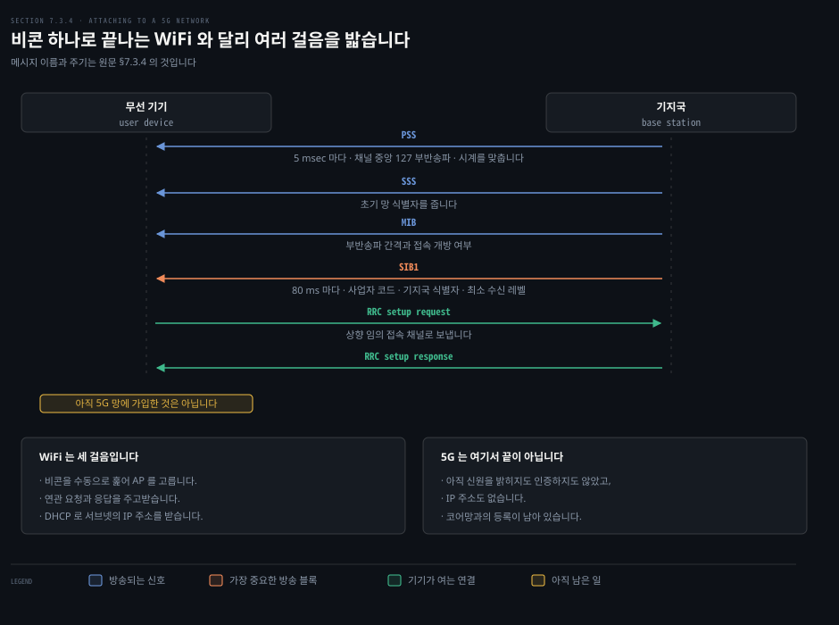
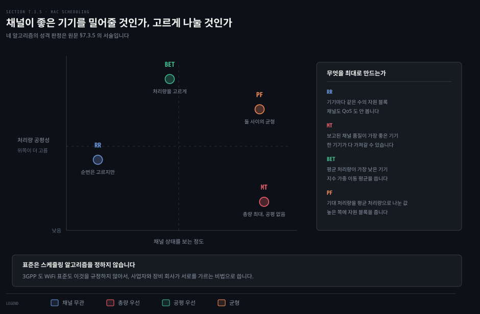
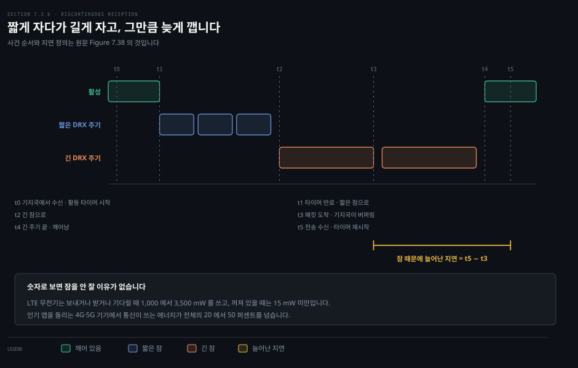
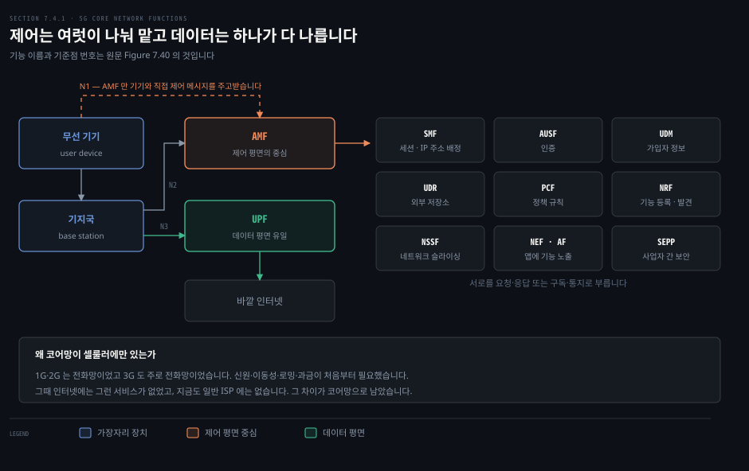
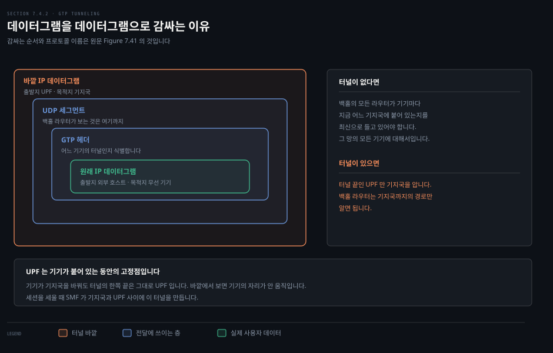
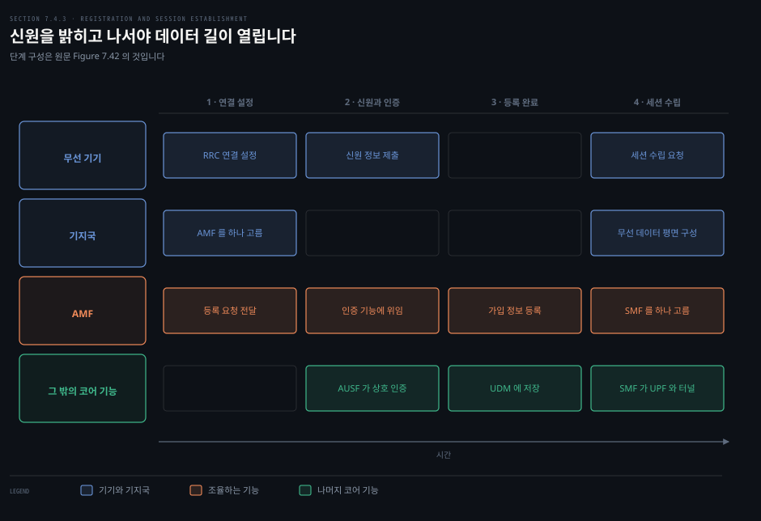

# 어떻게 붙고 누가 먼저 보내고 언제 잠드는가

---

> 앞 편이 두 접속망의 구조였다면, 이 편은 그 안에서 실제로 벌어지는 네 가지 일입니다. 붙기, 순서 정하기, 잠들기, 그리고 코어망에 가입하기입니다.

## 핵심 요약

> 이 편이 매달린 하나의 생각은 **무선망의 어려운 일이 대부분 "기기가 지금 어떤 상태인가"를 관리하는 데서 나온다**는 것입니다.

기기가 지날 수 있는 상태가 여럿입니다.

- 켜져 있어도 망에 붙어 있지 않을 수 있습니다.
- 붙어 있어도 신원을 밝히지 않았을 수 있습니다.
- 신원을 밝혔어도 IP 주소가 없을 수 있습니다.
- 주소가 있어도 지금 자고 있을 수 있습니다.

유선에서는 케이블을 꽂으면 대부분 한 번에 끝나던 일입니다.

이 상태들을 관리하는 방식이 WiFi 와 5G 를 다시 가릅니다. WiFi 는 비콘 하나와 연관 요청 하나로 붙습니다. DHCP 로 주소를 받으면 끝입니다. 5G 는 **동기 신호와 방송 블록을 여러 개 읽고 연결을 연 뒤, 코어망에 따로 등록**해야 합니다.

그 대가로 5G 가 얻는 것이 있습니다. SIM 이라는 전역 신원, 사업자 사이의 로밍, 그리고 기지국을 바꿔도 바깥에서 보면 자리가 안 움직이는 **터널**입니다.


## 학습 목표

> 이 편을 읽고 나면 아래 다섯 가지를 스스로 해낼 수 있습니다.

1. 기기가 WiFi 와 5G 에 붙는 절차를 각각 순서대로 설명합니다.
2. MAC 스케줄러 네 가지를 채널 인지와 공평성 두 축으로 가릅니다.
3. 조율된 잠과 조율되지 않은 잠의 차이를 예로 설명합니다.
4. 5G 코어의 핵심 기능 셋과 각각의 역할을 말합니다.
5. 왜 터널을 파는지를 이동성과 라우터 상태 관점에서 설명합니다.


## 1. 망을 찾아 붙기까지

> 유선이든 무선이든 기기는 먼저 망이 있다는 것을 알아야 합니다. 무선에서는 그 발견부터가 프로토콜입니다.



### 풀려는 문제

유선 이더넷은 케이블을 꽂는 순간 물리적으로 붙습니다. 무선에는 꽂을 데가 없습니다. 기기가 주변에 어떤 망이 있는지 스스로 알아낸 뒤 그중 하나를 골라 자기를 알려야 합니다. 이 과정을 **네트워크 연관**이라 부릅니다.

### 비콘부터

5G 든 WiFi 든 기지국은 주기적으로 **비콘 메시지**를 보냅니다. 접속망이 존재한다는 것과 그 특성을 알리는 메시지입니다. 이름, 지원하는 전송률 같은 전송 능력, 그리고 라디오 채널의 물리 계층 파라미터가 들어갑니다. 붙으려는 기기는 여러 채널을 **수동으로 훑으며** 그런 비콘을 찾습니다.

어느 망을 고를지는 표준이 정하지 않습니다. 기기나 사용자, 또는 기기 펌웨어와 소프트웨어를 만든 사람에게 맡깁니다. 보통은 가장 최근에 붙었던 망을 고르거나, 정렬된 목록에서 고르거나, 신호가 가장 센 망에 붙습니다. 공중 5G 망에서는 거의 항상 **SIM 을 발급한 사업자**의 망을 우선합니다.

### WiFi 는 세 걸음

AP 를 고른 뒤 WiFi 기기는 802.11 **연관 요청 프레임**을 AP 에 보내고, AP 가 **연관 응답 프레임**으로 답합니다. 그림에는 없지만 기기는 비콘을 받은 뒤 연관 전이나 후에 WPA 보안으로 자기를 인증합니다.

AP 에 연관되고 나면 기기는 AP 가 속한 서브넷에 들어가고 싶어집니다. 그래서 보통 DHCP 발견 메시지를 AP 를 거쳐 서브넷에 보내 IP 주소를 받습니다. 주소를 받고 나면 바깥 세상은 그 기기를 **그 서브넷의 또 하나의 IP 기기**로 볼 뿐입니다.

> **원문 정오**: 512쪽은 서브넷을 두고 "IP 주소지정의 의미로는 **Section 4.3.3**" 이라고 적습니다. 4장의 §4.3.3 은 NAT 를 다루는 절입니다. 서브넷과 IP 주소지정은 **§4.3.2** 에 있습니다.

### 5G 는 여러 걸음

5G 기기는 필요한 정보를 담은 비콘 하나를 찾는 대신 여러 단계를 밟습니다.

1. **PSS** 를 먼저 찾아 기지국과 시계를 맞춥니다. **SSS** 를 찾아 초기 망 식별자를 얻습니다. 둘은 모든 5G 기지국이 모든 5G 채널의 중앙 127 부반송파에서 5 밀리초마다 방송합니다.
2. **MIB** 를 얻습니다. 부반송파 간격과, 이 셀이 연관을 받고 있는지 여부가 들어 있습니다. PSS 와 SSS 와 MIB 를 합쳐 하나의 블록이라 부릅니다.
3. 그 정보로 최대 20 개의 **SIB** 를 찾아 받습니다. 가장 중요한 것이 80 밀리초마다 전송되는 SIB1 이고, 사업자의 국가 코드와 망 코드, 기지국 식별자, 그리고 받아들일 수 있는 최소 수신 품질이 들어 있습니다.
4. 붙기로 정하면 셀의 **상향 임의 접속 채널**로 RRC 연결 설정 요청을 보냅니다. 앞 편의 PRACH 가 이 자리입니다. 기지국이 아직 이 기기의 존재를 모르고, 기기에게 배정된 상향 자원 블록도 없기 때문입니다.
5. 기지국이 RRC 연결 설정 응답으로 답합니다.

여기까지 오면 기기와 기지국이 RAN 안에서 제어 메시지를 주고받을 수 있습니다. 그런데 **기기는 아직 5G 망에 가입하지 않았습니다.** 신원을 밝히지도 인증하지도 않았고 IP 주소도 없습니다. 그 나머지는 이 편의 마지막 절에서 다룹니다.

> **노트의 읽기**: 원문은 PSS 와 SSS 와 MIB 를 합친 것을 "System Signal Block" 이라 적습니다. 3GPP 규격에서 이 블록의 이름은 **동기 신호와 PBCH 를 합친 블록**입니다.[^3gpp-ssb] 원문이 적은 "채널 중앙 127 부반송파"는 규격과 일치합니다. 규격은 여기에 더해 PSS 와 SSS 가 각각 심볼 하나를 차지한다고 정합니다. 표준 문서를 찾을 때는 3GPP 쪽 이름으로 검색해야 합니다.


## 2. 누구에게 먼저 줄 것인가

> 유선에서는 순서를 바꿔도 총 처리량이 같았습니다. 무선에서는 다릅니다.



### 풀려는 문제

기지국에 보낼 데이터가 쌓인 기기가 수십 수백이라면 누구에게 먼저 보내야 할까요. 4장에서 유선 링크의 스케줄링을 볼 때는 이 질문이 총 처리량과 무관했습니다. 초당 보내는 프레임 수가 어느 프레임을 고르든 같았기 때문입니다.

무선은 결정적으로 다릅니다. 기지국은 가까이 있고 가시선이 트인 기기에게 **더 높은 비트율의 변조**로 보낼 수 있습니다. 멀리 있고 다중경로에 시달리는 기기에게는 그럴 수 없습니다. 그래서 **누구를 고르느냐가 총 처리량을 바꿉니다.**

MIMO 의 공간 다중화와 다이버시티가 자유도를 더하고, 빔포밍이 여러 수신자에게 동시에 보낼 기회를 줍니다. 그리고 채널 특성은 시시각각 변합니다.

### 네 가지 고려

원문이 세는 스케줄링의 고려는 넷입니다.

1. **채널 품질 인지**: 기지국과 기기 사이 라디오 채널의 품질 추정을 결정에 넣는가. 품질이 좋은 기기에게 우선 보내면 망 전체의 처리량이 올라갑니다.
2. **기기 간 공평성**: 어느 정도의 공평을 주는가. 그리고 여기서 공평이란 무엇인가. 품질이 가장 좋은 기기에게만 보내면 처리량은 높지만 공평하지 않습니다.
3. **트래픽 종류별 우선순위**: 제어 평면과 사용자 평면을 가리는가. 실시간 제약이 있는 트래픽과 없는 트래픽을 가리는가.
4. **서비스 품질 인지**: 성능 보장을 제공하도록 결정하는가.

### 네 알고리즘

원문은 대표 알고리즘 넷을 듭니다. 위 도식의 두 축이 그 넷을 가릅니다.

- **순번**: 기기마다 같은 수의 자원 블록을 다음 회차에 배정합니다. 채널도 QoS 도 안 봅니다. **순번으로는 공평하지만 처리량으로는 공평하지 않습니다.** 기기마다 채널 조건이 달라 같은 블록 수로 다른 처리량을 내기 때문입니다.
- **최대 처리량**: 그 블록에서 측정된 채널 품질이 가장 좋고 보낼 데이터가 있는 기기에게 블록을 줍니다. 채널을 보지만 공평하지 않습니다. 가장 극단적인 경우 품질이 가장 좋은 기기 하나가 모든 블록을 가져갈 수 있습니다.
- **균등 처리량**: 평균 처리량이 가장 낮으면서 보낼 데이터가 쌓인 기기에게 블록을 줍니다. 처리량 공평을 명시적으로 겨냥합니다.
- **비례 공평**: 기대 처리량을 평균 처리량으로 나눈 값이 가장 큰 조합에 블록을 줍니다. 분자가 크면 성능이 좋아지고 분모가 작으면 그동안 못 받은 기기가 밀려 올라옵니다. 성능과 공평 사이의 균형을 노립니다.

### 채널 품질은 어떻게 아는가

5G 기지국은 자원 블록의 정해진 자리에 **기준 신호 심볼**을 주기적으로 방송합니다. 기기는 그 신호를 어떻게 받았는지에 근거해 **4 비트짜리 채널 품질 지시자**를 주기적으로 올려 보냅니다. 기지국은 그 값으로 변조 방식을 정하고, 그것이 다시 자원 블록당 비트 수를 정합니다.

평균 처리량은 지수 가중 이동 평균으로 추적합니다. 3장에서 TCP 가 왕복 시간을 추정할 때 만난 그 형태입니다.

```bash
R_i(t) = (1 − β) · r_i(t) + β · R_i(t−1)

r_i(t) : 기기 i 가 구간 t 에 실제로 낸 처리량
R_i(t) : 기기 i 의 평균 처리량 추정치
β      : 0 과 1 사이
```

> **원문 정오**: 516쪽은 이 식 바로 아래에서 "**β 값이 클수록 최근 값에 더 큰 중요도를 준다**"고 적습니다. 식에서 최근 값 r_i(t) 에 붙는 계수는 (1 − β) 입니다. β 가 커지면 (1 − β) 가 작아지므로 **최근 값의 비중은 오히려 줄어듭니다.** 큰 β 는 과거 추정치 R_i(t−1) 쪽에 무게를 싣습니다. 같은 쪽에서 그리스 문자 β 를 로마자 b 로 적은 오식도 있습니다.

> **노트의 읽기**: 이 혼동에는 원인이 있어 보입니다. 3장의 TCP 왕복 시간 추정식은 계수가 **새 표본** 쪽에 붙습니다. 두 식이 같은 형태처럼 보이지만 계수가 붙는 자리가 반대라, TCP 쪽 감각을 그대로 옮기면 설명이 뒤집힙니다.

스케줄링 알고리즘은 3GPP 도 WiFi 표준도 규정하지 않습니다. 전적으로 사업자의 손에 있습니다. 그래서 장비 회사와 사업자가 경쟁사와 자기를 가르는 비법으로 내세웁니다.

스케줄링 결정은 4G·5G 에서 **1 밀리초마다** 내려집니다. WiFi 6 에서는 그보다 짧을 수 있습니다.


## 3. 언제 자고 언제 깨는가

> 무전기를 계속 켜 두면 배터리가 먼저 죽습니다. 그래서 자되, 깊이 잘수록 패킷이 오래 기다립니다.



### 풀려는 문제

무선 기기에서 에너지는 귀한 자원입니다. 그런데 무전기를 끄면 오는 것을 못 받습니다. 언제 끄고 언제 켤지를 정하는 문제이고, 답이 두 갈래로 갈립니다.

### 숫자가 먼저입니다

원문이 드는 측정값이 이 절의 동기를 한 줄로 말해 줍니다. LTE 무전기는 보내거나 받거나 받기를 기다리는 동안 **1,000 에서 3,500 mW** 를 쓰고, 꺼져 있을 때는 **15 mW 미만**입니다. 켜져 있을 때의 약 1 퍼센트입니다. 그리고 인기 앱을 돌리는 4G·5G 기기에서 통신이 쓰는 에너지가 전체의 **20 에서 50 퍼센트를 넘습니다.**

### 두 갈래

- **조율된 잠**: 기기와 기지국 사이의 프로토콜이 잠과 깸의 주기를 맞춥니다. 양쪽이 기기의 상태와 다음에 깰 시각을 압니다. 기지국은 자는 기기에게 온 데이터그램을 쌓아 두었다가 깰 때 보냅니다. WiFi 와 5G 가 이쪽입니다.
- **조율되지 않은 깸-전송**: 기기는 보낼 것이 생겼을 때만 깹니다. 센서가 이따금 값을 보내는 IoT 기기가 이런 경우입니다. 보내고 나서 답이 있을지 잠깐 기다렸다가 다시 잡니다. 블루투스와 LoRaWAN 과 4G LTE 협대역 IoT 가 이쪽입니다.

> **원문 정오**: 518쪽은 조율되지 않은 방식을 쓰는 예를 들면서 "블루투스(**Section 7.5.1**), LoRaWAN(**Section 7.5.3**)" 이라 적습니다. 블루투스는 **§7.6.1**, LoRa 와 IoT 망은 **§7.6.3** 입니다. 같은 절 안에서 802.11ah 와 LoRa 를 가리킬 때도 같은 방식으로 §7.5.3 이라 적어, 이 어긋남이 세 번 반복됩니다.

### WiFi 는 비트 하나로 알립니다

WiFi 기기는 802.11 프레임 헤더의 **전력 관리 비트**를 1 로 세워 잠들겠다고 AP 에 알립니다. AP 는 그 기기에게 오는 프레임을 버퍼에 담아 둡니다. 기기가 깨면 AP 의 비콘 프레임에서 **트래픽 표시 맵**을 찾습니다. 버퍼에 프레임이 쌓인 기기들의 목록입니다. 자기 것이 없으면 다시 자고, 있으면 폴링 요청을 보내 받아 갑니다.

> **원문 정오**: 518쪽은 바로 앞 문장에서 이 비트를 power-management bit 라 부르고, 다음 문장에서는 같은 비트를 "the set **power-transmission** bit" 이라 적습니다. 802.11 프레임에 그런 이름의 비트는 없습니다.

WiFi 6 은 **목표 기상 시각**을 도입해 기기가 잠자는 길이를 AP 와 협상하게 했습니다. 센서 값을 이따금 올리는 IoT 환경에 요긴합니다. 원문은 최대 값이 4 년 5 개월 16 일 13 시간 37 분 39.49 초라고 적습니다.

> **노트의 읽기**: 이 이상한 숫자는 계산해 보면 맞습니다. 802.11 의 목표 기상 시각 필드는 16 비트 가수와 5 비트 지수로 마이크로초를 표현하므로 최대값이 65,535 × 2³¹ 마이크로초입니다. 계산하면 약 140,735,341 초입니다. 원문의 값을 초로 되돌리면 달의 길이를 며칠로 잡느냐에 따라 편차가 0.01 에서 0.14 퍼센트 사이로 갈립니다. 그레고리력 기준으로 0.052 퍼센트, 율리우스력 기준으로 0.054 퍼센트입니다. **어느 관례로 읽어도 자릿수가 맞으므로 원문의 값은 이 필드 인코딩에서 나온 것이 맞습니다.**

IoT 전용으로 설계된 IEEE 802.11ah 는 802.11 의 절전 기능을 물려받고 헤더 크기 축소 같은 것을 더했습니다.

### 5G 는 두 깊이로 잡니다

5G 기기의 잠은 얕은 잠과 깊은 잠으로 나뉩니다. 얕은 잠을 **불연속 수신**이라 하고, 그 안에서 다시 짧은 주기와 긴 주기로 갈립니다. 둘은 자는 길이만 다릅니다. 지연과 전력 사이의 맞바꿈입니다.

Figure 7.38 의 예를 따라가 보겠습니다.

1. 기기가 기지국에서 전송을 받고 활동 타이머를 시작합니다.
2. 그 뒤로 받은 것도 보낼 것도 없어 타이머가 만료되면 **짧은 주기**에 들어갑니다. 각 주기 끝에 깨어나 기지국이 알리는 것이 있는지, 자기가 보낼 것이 생겼는지 확인합니다.
3. 몇 주기 동안 아무 일도 없으면 **긴 주기**로 넘어갑니다.
4. 그동안 패킷이 기지국에 도착하면 기기가 자고 있으므로 버퍼에 쌓입니다.
5. 긴 주기가 끝나 깨어난 기기가 알림을 보고 활성 상태로 돌아가 전송을 받습니다.

**패킷이 겪는 추가 지연은 도착한 시각부터 실제로 받은 시각까지입니다.** 깊이 잘수록 이 값이 커집니다.

DRX 보다 더 깊은 상태도 있습니다. 더 오래 아무 일이 없으면 기기는 유휴 상태나 비활성 상태로 들어가고, 데이터를 주고받으려면 RAN 안에서 자기 존재를 다시 세우는 단계를 밟아야 합니다.

### 조율 없이 깨는 쪽

LoRa 는 단순한 IoT 기기를 위한 저전력 저비트율 기술이고, 보통 몇 킬로미터 안의 게이트웨이에 센서 값을 올리는 일을 합니다. 가장 단순한 클래스 A 기기는 보낼 것이 생기면 그냥 깨어나 게이트웨이와 아무 조율 없이 보냅니다. 게이트웨이가 거기 있는지조차 모른 채로입니다. 보낸 뒤 하향 데이터를 잠깐 기다렸다가 다시 잡니다.

여기서 대가가 분명합니다. 게이트웨이가 기기에게 보낼 것이 생겨도 **기기가 다음에 깨어나기를 기다려야 합니다.** 블루투스 저전력과 4G 협대역 IoT 도 기기가 먼저 깨는 방식을 받치지만, 이쪽은 깨어난 뒤 먼저 제어 노드나 기지국에 연락해 전송 슬롯을 배정받아야 합니다.


## 4. 코어망은 왜 셀룰러에만 있는가

> 5G 코어는 기능 단위로 쪼개진 서비스 모음입니다. 그중 사용자 데이터를 나르는 것은 하나뿐입니다.



### 풀려는 문제

지금까지 인터넷을 배우면서 "코어망"이라는 이름의 별도 구성 요소를 만난 적이 없습니다. 그런데 셀룰러에는 있습니다. WiFi 에는 없습니다. 무엇이 이 차이를 만들었는지 알아야 5G 문서의 절반을 차지하는 기능 이름들이 왜 필요한지도 보입니다.

### 답은 전화망의 뿌리에 있습니다

1G 와 2G 셀룰러 망은 사실상 전화 전용 망이었습니다. 3G 도 주로 전화망이었고 패킷 데이터가 부가 서비스로 얹혀 있었습니다. 이 초기 망들은 처음부터 네 가지를 받쳐야 했습니다.

1. SIM 으로 사용자 신원을 관리합니다.
2. 사업자 망 안에서 기기 이동성을 다룹니다.
3. 사업자 사이의 로밍을 처리합니다.
4. 회계와 청구와 정산을 합니다.

**그때 배포된 인터넷에는 그런 서비스가 하나도 없었습니다.** 4G 와 5G 는 이제 모두 IP 망이 됐고 전통적인 IP 망의 서비스를 많이 받아들였습니다. 그런데 신원·이동성·로밍·과금 같은 서비스의 네이티브 지원은 여전히 일반 ISP 에 없습니다. 그 차이가 오늘날에도 남아 있고, 그 자리가 코어망입니다.

WiFi 에 코어망이 없는 이유도 같은 자리에서 나옵니다. 전통적인 IP 망은 유선 이더넷과 WiFi 에 **같은 관리·제어 메커니즘**을 씁니다. 기업이 보기에 WiFi 는 자기 망의 또 하나의 링크 계층 기술입니다.

### 서비스 기반 구조

5G 코어는 **서비스 기반 구조**를 채택합니다. 구성 요소를 네트워크 기능과 그것이 제공하는 서비스로 정의합니다. 규격이 구현 방법을 정하지는 않지만, 이런 서술은 논리적으로 중앙화된 데이터센터의 마이크로서비스로 자연스럽게 옮겨집니다.

4G 이전은 달랐습니다. 프로토콜로 상호작용하는 전통적인 망 "개체"들을 정의했고 보통 단일 기능 전용 장비로 구현됐습니다. 5G 는 4G 와 결별하면서 서비스 요소의 이름과 약어를 전부 새로 지었습니다. 그것이 배우는 사람에게 두통을 안깁니다.

### 가장 중요한 셋

- **UPF**: RAN 과 바깥 인터넷 사이에서 트래픽을 실제로 전달합니다. **데이터 평면에 있는 유일한 5G 네트워크 기능**입니다. 기기가 인터넷으로 보내는 모든 데이터그램과 그 반대 방향의 모든 데이터그램이 이곳을 지납니다.
- **AMF**: 기기가 5G 망의 서비스에 접근하도록 승인하고 연결을 세우는 일, 그리고 기기 이동성을 관리하는 일의 핵심입니다. 제어 평면의 중심 기능이라 할 만합니다. 인증을 위해 AUSF 와 협력하는 것처럼 다른 기능들과 함께 일합니다.
- **SMF**: 기기별 세션을 관리합니다. IP 주소 할당과 배정, 그리고 정책 기반 접근 제어와 과금 같은 기능의 기기별 상태 설치, 그리고 UPF 를 통한 데이터 평면 전달 경로 수립이 여기 듭니다.

> **원문 정오**: 522쪽은 AMF 가 "기지국과 직접 제어 메시지를 주고받는 **두 기능 중 하나**" 라고 적습니다. 그런데 527쪽에서는 같은 AMF 를 "기지국과 기기와 직접 통신하는 **유일한** 네트워크 기능" 이라 적습니다. 두 문장이 서로 맞지 않습니다.

### 나머지 기능들

데이터와 상태를 다루는 기능들이 여럿 있습니다. 기기 프로필과 서비스와 인증 정보는 **UDM** 이 관리하고, 데이터를 자기 안에 두거나 별도의 **UDR** 에 둘 수 있습니다. 외부에 두고 원격으로 읽고 쓰면 상태 없는 트랜잭션이 가능해져서, HTTP 의 상태 없는 클라이언트·서버 상호작용과 비슷한 방식으로 확장성과 복원력이 좋아집니다.

- **NEF 와 AF**: 앞 편에서 본 로컬 브레이크아웃 응용에 망 데이터와 기능 서비스를 노출합니다.
- **AUSF 와 SEPP**: 다른 사업자 망에 붙을 때 방문 망의 AUSF 가 홈 망의 AUSF 와 인증을 주고받고, 그 통신을 SEPP 가 안전하게 감쌉니다.
- **NRF**: 기능들이 자기 서비스를 등록하고 서로를 찾게 해 줍니다. 복잡한 수동 설정을 없앱니다.
- **PCF**: 이동성 관리와 기기별 QoS 와 로밍에 쓰이는 정책 규칙의 제어와 관리와 중앙 저장을 맡습니다.
- **NSSF**: 네트워크 슬라이싱의 중심입니다. RAN 과 코어 자원을 가상화해서, 같은 물리 자원 위에 여러 논리 망을 정의합니다. 6장에서 본 가상 사설망 여럿이 같은 물리 자원 위에서 도는 것과 같은 발상입니다.

기능들은 요청과 응답 방식으로 서로를 부를 수도 있고, 구독과 통지 방식으로 부를 수도 있습니다. 표준은 어느 쪽을 권하지 않습니다.


## 5. 왜 터널을 파는가

> 데이터그램을 데이터그램 안에 넣는 이유는 하나입니다. 백홀의 라우터들이 기기의 위치를 몰라도 되게 하려는 것입니다.



### 풀려는 문제

5G 데이터 평면은 모두 IP 망이라서 4장과 5장에서 본 대로 돌아갑니다. 그런데 5G 제어 평면은 전통적인 IP 망에 늘 있지는 않은 두 서비스를 데이터 평면에 얹습니다. 서비스 품질 보장과 **터널링**입니다. 데이터그램 하나를 다른 데이터그램 안에 넣는 것이 왜 이득인지 따져 봐야 합니다.

### 무엇을 감싸는가

기기마다 그 기기의 기지국과 그 기기의 UPF 사이에 터널이 하나씩 세워집니다. 터널을 쓰면 기지국과 UPF 사이의 백홀 망에 있는 라우터와 링크의 바다 전체가, 그 기기에게는 **가상 링크 하나**로 추상화됩니다.

UPF 가 바깥 인터넷에서 자기 데이터 평면의 어느 기기로 갈 데이터그램을 받으면 이렇게 합니다.

1. 그 데이터그램을 **GTP** 로 UDP 세그먼트 안에 캡슐화합니다.
2. 그 UDP 데이터그램이 새 IP 데이터그램의 페이로드가 됩니다.
3. 새 데이터그램은 기지국 주소로 향하는 보통의 IP 데이터그램처럼 백홀을 지납니다.
4. 기지국이 터널된 UDP 데이터그램의 껍질을 벗기고, 안의 IP 데이터그램을 꺼내 RAN 으로 기기에게 보냅니다.

### 왜 이렇게 하는가

4장에서 터널링은 IPv4 망과 IPv6 망이 함께 동작하게 하는 장치였습니다. 순수 5G 망 안에서 데이터그램을 데이터그램으로 감싸 얻는 것은 무엇일까요. **답은 이동성에 있습니다.**

터널이 없다면 백홀의 모든 라우터가 기기의 현재 위치를 최신으로 알고 있어야 합니다. 지금 어느 기지국에 붙어 있는지를 말입니다. 그것도 그 사업자 망의 **모든** 기기에 대해서입니다.

터널이 있으면 터널의 끝인 UPF 만 그 기기가 붙은 기지국의 정체를 알면 됩니다. 백홀 라우터들은 기지국까지 데이터그램을 어떻게 보내고 라우팅할지만 알면 됩니다.

그래서 UPF 는 기기가 5G 망에 붙어 있는 동안 데이터그램 전달의 **고정점** 노릇을 합니다. 기기가 그 순간 어느 기지국에 붙어 있든 상관없습니다.

> **원문 정오**: 525쪽은 터널의 이유를 밝히면서 이동성을 "기기가 붙은 기지국을 바꾸는 것(**Section 7.4**)" 이라 적습니다. §7.4 는 코어망 전체를 가리키는 절 번호이고, 이동성을 다루는 절은 **§7.5** 입니다.


## 6. SIM 하나로 등록하고 세션을 엽니다

> 앞 절들의 조각이 여기서 합쳐집니다. 신원을 밝히고 인증을 받은 뒤에야 데이터 길이 열립니다.



### 풀려는 문제

첫 절에서 기기는 기지국과 제어 메시지를 주고받을 수 있게 됐지만 아직 망에 가입하지는 않았습니다. 남은 일이 무엇이고 어느 기능이 그 일을 하는지를 봐야 5G 의 그림이 닫힙니다.

### SIM 이 곧 신원입니다

4G·5G 기기가 망에 붙으려면 물리 SIM 카드나 소프트웨어만으로 된 eSIM 이 필요합니다. **SIM 은 당신과 당신의 홈 망을 전 세계 모든 셀룰러 사업자에게 식별시켜 줍니다.** 셀룰러 세계에서 SIM 은 곧 전역 망 신원입니다.

SIM 이 담는 것은 사업자마다 다르지만 대체로 이렇습니다.

- **IMSI**: 세 부분으로 나뉩니다. 세 자리 국가 코드, 두세 자리 망 코드, 그리고 가입 식별 번호입니다. 앞의 둘이 홈 망을 정하고, 마지막이 그 망 안에서 SIM 을 유일하게 식별합니다.
- **암호 키와 PIN**: 기기가 5G 망에 붙을 때 인증에 쓰입니다.
- **지역 식별 정보**: 지금과 최근에 방문한 망의 목록입니다. 셀룰러 서비스를 찾을 때 먼저 시도할 망을 정하는 데 씁니다.
- **연락처와 문자 메시지**: 저장될 수 있습니다.

홈 망이 서비스하지 않는 지역에서는 다른 사업자의 망에 붙을 수 있고, 이것을 **방문 망에서 로밍한다**고 말합니다. 방문 망에서 쓸 수 있는 서비스는 홈 망과의 가입 계획, 그리고 두 사업자 사이의 과금·정산 방식에 따라 달라집니다. 원문은 여기에 한마디를 붙입니다. 큰 좌절과 함께, 그냥 붙을 수 없는 망도 있습니다.

### 두 벌의 일

기기가 5G 망에 붙을 때 하는 일은 두 벌입니다.

- **등록**: 기기가 망에 자기를 알리고 인증하며, 망도 기기에게 자기를 인증합니다.
- **PDU 세션 수립**: 기기에게 IP 주소를 배정하고 기기와 UPF 사이의 데이터 평면 경로를 만듭니다. PDU 는 3GPP 가 패킷을 부르는 말입니다.

둘 다 코어의 네트워크 기능들이 수행하고 **AMF 가 중심에서 조율합니다.** 인증은 AUSF 와, 세션 수립은 SMF 와 함께 합니다.

### 순서를 따라가면

**등록**은 이렇게 흘러갑니다. 기기와 기지국이 첫 절에서 본 연결 설정 요청과 응답을 주고받아 RAN 신호 채널을 세웁니다. 기지국이 그 기기를 맡을 AMF 인스턴스를 하나 고르고 등록 요청을 보냅니다. AMF 가 기기에게 연락해 신원 정보를 받고, 그 정보를 인증 기능에 넘깁니다. 인증 기능이 기기와 상호 인증을 수행합니다.

방문 망이라면 그 망의 인증 기능이 **홈 망의 인증 기능에 대리로 물어봅니다.** 실제 인증은 홈 망이 합니다. 인증이 성공하면 AMF 가 기기의 신원과 가입 서비스 정보를 지역 UDM 에 등록하고, 등록 수락 메시지를 기기에게 돌려보냅니다.

**세션 수립**은 기기가 PDU 세션 수립 요청을 AMF 에 보내면서 시작합니다. AMF 는 이 기기의 데이터 평면을 세우고 관리할 SMF 를 고릅니다. SMF 는 기기가 요청한 세션 파라미터가 허용되는지 확인한 뒤 UPF 인스턴스를 하나 고르고, 앞 절에서 본 터널을 기지국과 그 UPF 사이에 세웁니다. 그리고 터널 정보와 IPv4 주소 정보와 추가 세션 정보를 AMF 와 기지국을 거쳐 기기에게 돌려줍니다. 마지막으로 기지국과 기기가 RAN 데이터 평면을 설정하면 **기기는 이제 인터넷으로 데이터그램을 보낼 수 있습니다.**

> **원문 정오**: 528쪽은 세션 수립을 설명하면서 "**User Data Management** Function 을 통해 확인한 뒤" 라고 적습니다. 523쪽에서 정의한 이름은 **Unified Data Management** 입니다. 같은 기능을 두 이름으로 부릅니다.

원문은 이것이 가장 중요한 상호작용만 보인 것이라고 밝힙니다. 정책 제어 기능과 과금 기능도 세션 수립에 관여하고, IPv6 를 설정하려면 단계가 더 필요합니다. 3GPP 규격에서 이 과정에 할애된 분량이 **빽빽한 34 쪽**입니다.


## 결정 치트시트

> 이 편의 판단 기준을 한 표에 모았습니다.

| 상황 | 판단 | 근거 |
|------|------|------|
| WiFi 는 붙는데 인터넷이 안 된다 | 연관은 됐고 DHCP 가 안 된 것을 의심합니다 | 연관과 IP 주소 획득은 별개 단계 |
| 5G 가 안테나는 뜨는데 데이터가 안 된다 | RRC 연결까지만 되고 코어 등록이 안 됐을 수 있습니다 | 붙기와 가입이 별개 |
| 총 처리량을 최대로 하고 싶다 | 최대 처리량 스케줄러 | 채널이 좋은 기기에 몰아줌 |
| 모든 기기가 비슷한 속도를 내야 한다 | 균등 처리량 스케줄러 | 총량은 줄어드는 것을 감수 |
| 둘 다 어느 정도 필요하다 | 비례 공평 스케줄러 | 기대 처리량을 평균으로 나눔 |
| IoT 기기 배터리가 빨리 닳는다 | 깨는 주기와 목표 기상 시각을 봅니다 | 통신이 전체 에너지의 20~50 퍼센트 |
| 게이트웨이에서 IoT 기기로 보낸 명령이 늦게 닿는다 | 조율되지 않은 방식인지 확인합니다 | 기기가 깨야만 받을 수 있음 |
| 기지국을 바꿔도 TCP 가 안 끊긴다 | UPF 가 고정점 노릇을 하는 것입니다 | 터널의 반대쪽 끝은 그대로 |


## 심화 학습

> 책 밖 보강입니다. 원문이 다루지 않거나 이름이 다른 자리만 적습니다.

### SSB 의 주기는 하나가 아닙니다

원문은 PSS 와 SSS 가 5 밀리초마다 방송된다고 적습니다. 3GPP 규격에서 이 블록의 주기는 5·10·20·40·80·160 밀리초 중에서 망이 설정합니다.[^3gpp-ssb-period] 5 밀리초는 그중 가장 짧은 값이고, 기기가 처음 셀을 찾을 때 가정하는 기본값은 보통 20 밀리초입니다. 실측 도구로 SSB 를 찾을 때는 이 설정값을 먼저 확인해야 합니다.

### 채널 품질 지시자 4 비트의 뜻

원문은 CQI 가 4 비트라고만 적습니다. 3GPP 는 이 4 비트를 표로 정의해 각 값에 변조 방식과 부호율을 대응시킵니다.[^3gpp-cqi] 값 0 은 "쓸 수 없음"이고 1 부터 15 까지가 QPSK 에서 256-QAM 까지로 올라갑니다. 스케줄러가 이 표를 거쳐 자원 블록당 비트 수를 정한다는 원문의 서술이 이 표를 가리킵니다.

### 자는 기기를 상대하는 서버는 타임아웃을 다시 봅니다

이 절의 지연은 서버 쪽 설정으로 곧장 넘어옵니다. 긴 DRX 주기에 들어간 기기는 기지국이 데이터그램을 쥐고 있는 동안 깨어나기를 기다립니다. 서버가 보낸 응답이 늦는 것이 아니라 **마지막 한 홉에서 잠들어 있는 것**입니다.

Spring 애플리케이션에서 걸리는 자리가 셋입니다.

- **커넥션 유휴 타임아웃**: 잠든 기기가 깨어나기 전에 서버가 연결을 끊으면 기기는 깬 뒤 다시 핸드셰이크부터 합니다. 무선 클라이언트가 많은 API 는 이 값을 무선 잠 주기보다 넉넉히 잡습니다.
- **재시도 백오프**: 응답이 없다고 곧바로 재시도하면 자는 기기에게 같은 요청이 쌓입니다. 지수 백오프에 지터를 넣는 이유가 여기서도 같습니다.
- **푸시 대 폴링**: 조율되지 않은 방식으로 자는 IoT 기기에는 서버가 먼저 보낼 수 없습니다. 기기가 깰 때 가져가도록 서버 쪽에 큐를 두는 설계로 뒤집어야 합니다.

원문은 이 연결을 다루지 않습니다. 다만 원문이 준 숫자로 크기를 가늠할 수는 있습니다. 긴 DRX 주기가 초 단위이고 LoRa 클래스 A 기기는 자기가 다음에 깰 때까지이므로, 두 경우의 타임아웃 예산이 자릿수부터 다릅니다.

### 국내에서 SIM 을 옮길 때

원문은 SIM 이 전역 신원이라고 말하지만 실제 이동성은 사업자 정책에 걸립니다. 국내에서는 eSIM 이 2022 년부터 일반 이용자에게 열렸고, 단말과 사업자가 모두 지원해야 프로파일을 내려받을 수 있습니다.[^kr-esim] 원문의 SIM 서술을 국내 상황으로 옮길 때 가장 먼저 걸리는 조건입니다.


## 면접 대비

> 이 편에서 실제로 물어보기 좋은 것만 골랐습니다.

### 한 줄 정의

PDU 세션이란 기기에게 IP 주소를 배정하고 기기와 UPF 사이에 데이터 평면 경로를 세운 상태이고, 이것이 있어야 기기가 인터넷으로 데이터그램을 보낼 수 있습니다.

### 핵심 포인트 세 가지

1. WiFi 는 연관과 DHCP 로 끝나지만, 5G 는 RRC 연결 위에 코어망 등록과 세션 수립이 더 필요합니다.
2. 무선에서는 누구에게 보내느냐가 총 처리량을 바꾸므로, 스케줄러 선택이 곧 성능 정책입니다.
3. 터널은 백홀 라우터가 기기의 위치를 몰라도 되게 만들고, UPF 가 그 고정점이 됩니다.

### 자주 묻는 질문

**Q: 5G 에서 기지국이 바뀌어도 TCP 연결이 왜 안 끊깁니까?**
A: 터널의 한쪽 끝인 UPF 가 그대로이기 때문입니다. 바깥에서 보는 기기의 IP 주소는 UPF 가 배정한 것이고, 기지국이 바뀌면 터널의 반대쪽 끝만 옮겨 갑니다.

**Q: 스케줄러를 공평하게 만들면 무엇을 잃습니까?**
A: 총 처리량입니다. 채널이 나쁜 기기에게도 자원을 주면 같은 자원으로 더 적은 비트를 보내게 됩니다. 원문은 공평의 대가가 총 처리량의 감소라고 명시합니다.

**Q: 왜 5G 는 붙는 절차가 이렇게 깁니까?**
A: 신원과 인증과 과금이 처음부터 요구된 전화망의 뿌리 때문입니다. WiFi 는 기업 유선망의 인프라를 그대로 쓰지만, 셀룰러는 전 세계 사업자 사이에서 신원을 확인하고 정산까지 해야 합니다.


## 핵심 개념 체크리스트

- [ ] 비콘이 담는 정보와 기기가 망을 고르는 기준을 말할 수 있는가?
- [ ] 5G 붙기의 다섯 단계를 순서대로 나열할 수 있는가?
- [ ] 연관과 IP 주소 획득이 별개 단계인 이유를 설명할 수 있는가?
- [ ] 무선 스케줄링이 유선과 다른 이유를 한 문장으로 말할 수 있는가?
- [ ] 네 스케줄러를 채널 인지와 공평성으로 배치할 수 있는가?
- [ ] EWMA 식에서 계수가 어느 항에 붙는지 정확히 아는가?
- [ ] 조율된 잠과 조율되지 않은 잠의 차이를 예로 들 수 있는가?
- [ ] 5G 코어의 세 핵심 기능과 역할을 각각 말할 수 있는가?
- [ ] 터널이 없으면 무엇이 깨지는지 설명할 수 있는가?
- [ ] 등록과 세션 수립이 각각 무엇을 얻는 단계인지 가릴 수 있는가?


## 관련 문서

- [7장 세 번째 편 — WiFi 와 5G 는 같은 공기를 다르게 씁니다](./07-03.WiFi%20와%205G%20는%20같은%20공기를%20다르게%20씁니다.md) — 이 편이 전제하는 RAN 구조
- [4장 세 번째 편 — IP, 데이터그램과 주소](./04-03.IP%20—%20데이터그램과%20주소.md) — 서브넷과 DHCP
- [6장 네 번째 편 — 스위치는 어떻게 배우고 무엇으로 갈라놓는가](./06-04.스위치는%20어떻게%20배우고%20무엇으로%20갈라놓는가.md) — 가상 사설망과 링크 가상화
- [책 폴더 README](./README.md)


## 참고 자료

- 원서: Kurose·Ross, 《Computer Networking: A Top-Down Approach》 9판, Pearson. §7.3.4 · §7.3.5 · §7.3.6 · §7.4
- 원문이 인용한 자료
  - [Huang 2012]: LTE 무전기 전력 측정
  - [Xu 2020]: 앱별 통신 에너지 비중
  - [Capozzi 2012; Haque 2023]: MAC 스케줄링 서베이
  - [3GPP TS 29.281 2022]: GTP 규격
  - [3GPP TS 23.501 2024; 3GPP TS 23.502 2024]: 5G 시스템 구조와 절차

[^3gpp-ssb]: 3GPP TS 38.300 — SS/PBCH block. PSS 와 SSS 가 각각 심볼 하나와 127 부반송파를 차지합니다. <https://www.3gpp.org/DynaReport/38300.htm>
[^3gpp-ssb-period]: 3GPP TS 38.213 — SSB 주기 설정값. <https://www.3gpp.org/DynaReport/38213.htm>
[^3gpp-cqi]: 3GPP TS 38.214 — CQI 표와 변조·부호율 대응. <https://www.3gpp.org/DynaReport/38214.htm>
[^kr-esim]: 과학기술정보통신부 — eSIM 도입 방안. <https://www.msit.go.kr/bbs/view.do?sCode=user&mId=113&mPid=112&bbsSeqNo=94&nttSeqNo=3181491>
