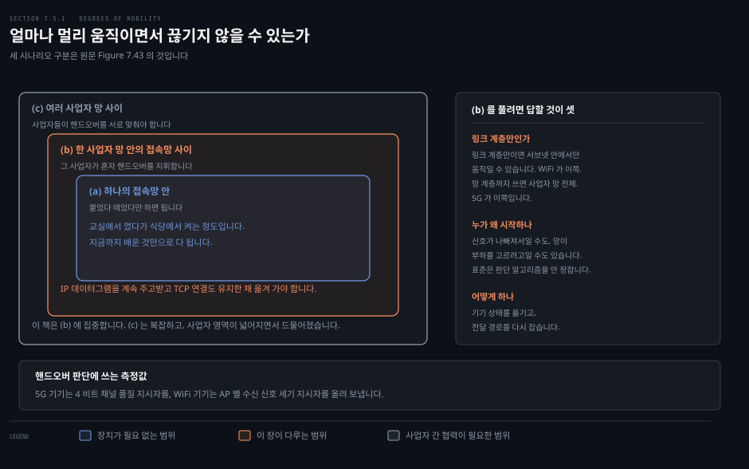
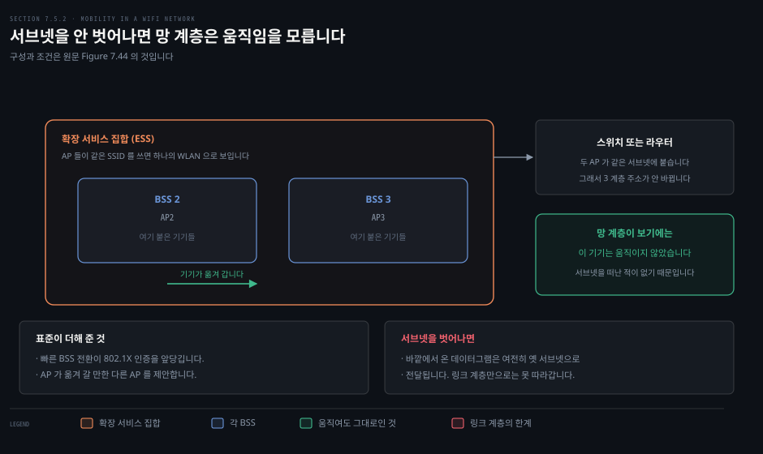
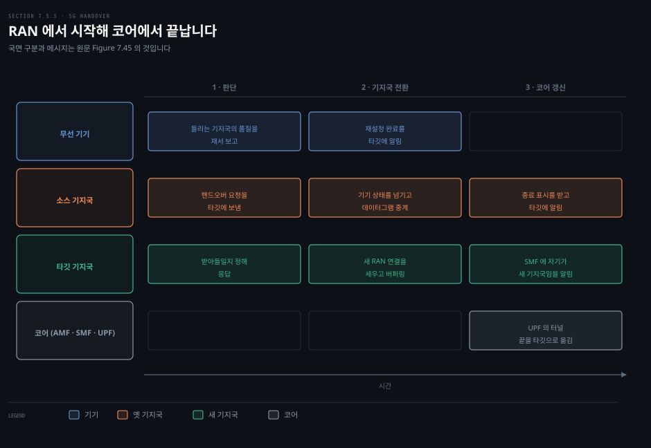
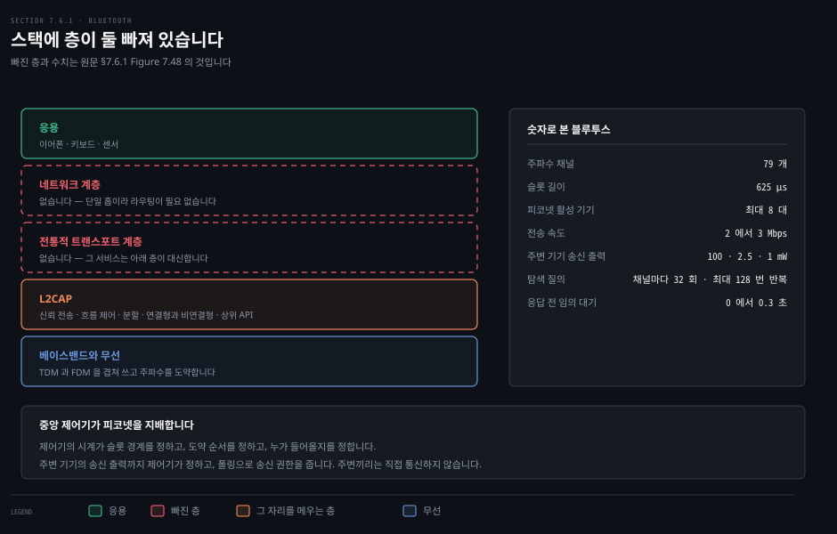
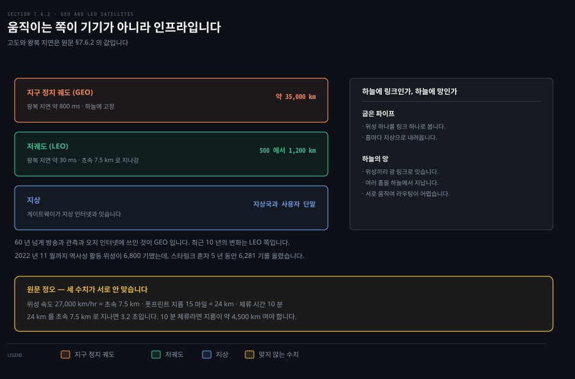
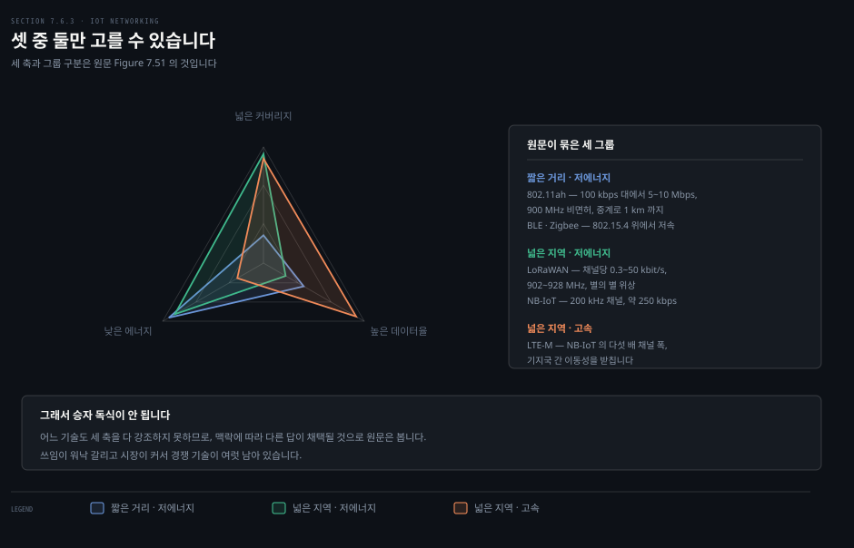

# 움직이는 동안 연결은 어떻게 유지되는가

---

> 7장의 마지막 편입니다. 무선의 가장 고유한 성질인 이동성을 보고, 그다음 WiFi 와 5G 밖의 세 가지 무선망으로 장을 닫습니다.

## 핵심 요약

> 이 편이 매달린 하나의 생각은 **이동성은 기술이 아니라 범위의 문제**라는 것입니다.

한 접속망 안에서만 움직이면 아무 장치도 필요 없습니다. 껐다 켜면 그만입니다. 한 사업자 망 안의 여러 접속망 사이를 움직이면서 TCP 연결까지 유지하려면 **핸드오버**가 필요합니다. 사업자를 넘나들면 사업자들이 서로 맞춰야 합니다.

WiFi 와 5G 가 여기서 마지막으로 갈립니다. WiFi 는 링크 계층 표준이라 이동성도 링크 계층에서만 다루고, 그래서 **서브넷 안에 묶입니다.** 5G 는 망 계층까지 동원해 사업자 망 전체에서 움직이게 합니다.

장을 닫는 세 기술은 각자 다른 답을 냈습니다. 블루투스는 기지국을 아예 없앴고, 저궤도 위성은 **인프라 쪽이 움직이며**, IoT 망들은 커버리지와 에너지와 속도 셋 중 둘씩만 골랐습니다.

## 학습 목표

> 이 편을 읽고 나면 아래 다섯 가지를 스스로 해낼 수 있습니다.

1. 이동성의 세 범위를 구분하고 각각에 필요한 것을 말합니다.
2. WiFi 의 이동성이 왜 서브넷 안에 묶이는지 설명합니다.
3. 5G 핸드오버의 세 국면을 순서대로 짚습니다.
4. Mobile IP 가 표준이 있는데도 안 깔린 이유를 설명합니다.
5. 블루투스와 저궤도 위성과 IoT 망이 각각 어떤 제약에서 나온 설계인지 말합니다.

## 1. "이동성"은 하나가 아닙니다

> 얼마나 멀리 움직이면서 끊기지 않을 수 있는가에 따라 세 층으로 갈립니다.

### 풀려는 문제

"움직이면서 쓴다"는 말이 실제로는 여러 뜻입니다. 교실에서 노트북을 껐다가 도서관에서 켜는 것도 움직인 것이고, 통화하면서 차를 타고 도시를 가로지르는 것도 움직인 것입니다. 이 둘에 필요한 기술이 전혀 다른데 같은 단어를 쓰면 논의가 흐려집니다.

### 세 시나리오

원문은 기기가 통신을 끊지 않고 얼마나 멀리 움직일 수 있는지로 셋을 가릅니다. 라우팅에서 도메인 안과 도메인 사이를 가른 것과 같은 발상입니다.

- **하나의 접속망 안에서만**: 학생이 교실 무선망에서 끊고 노트북을 끈 뒤, 식당에 가서 그곳 망에 붙고, 다시 끊고 도서관 망에 붙는 식입니다. 기기가 차례로 각 망에 연관되고 해제될 뿐입니다. **지금까지 배운 것만으로 다 됩니다.**
- **한 사업자 망 안의 여러 접속망 사이**: 여기서부터가 진짜 관심사입니다. IP 데이터그램을 계속 주고받고 TCP 같은 상위 연결도 유지한 채 옮겨 가야 합니다. 망이 **핸드오버**를 제공해야 합니다. 한 사업자 안이면 그 사업자가 혼자 지휘합니다.
- **여러 사업자 망 사이**: 사업자들이 핸드오버를 서로 맞춰야 합니다. 훨씬 복잡합니다.

이 책은 두 번째에 집중합니다. 세 번째는 복잡하고, 사업자들의 지리적 영역이 넓어지면서 드물어졌기 때문입니다.

### 답해야 할 것 셋

두 번째 시나리오를 받치려면 세 질문에 답해야 합니다.

**첫째, 이동성을 링크 계층에서만 받치는가 망 계층까지 동원하는가.** 링크 계층만이면 기기는 무선 접속망 사이를 옮길 수 있지만, 끊기지 않고 움직일 수 있는 범위가 **현재 서브넷 안**으로 제한됩니다. 링크 계층 지원만으로는 바깥에서 온 데이터그램이 언제나 그 서브넷으로 전달되기 때문입니다. 사업자 망 전체에서 움직이려면 코어망이 기기가 지금 어느 접속망에 붙어 있는지 알아야 합니다.

> **원문 정오**: 530쪽은 링크 계층만 쓰는 방식을 두고 "**Section 7.5.3** 에서 볼 텐데 이것이 기업 WiFi 망이 택한 방식" 이라고 적습니다. WiFi 의 이동성은 **§7.5.2** 이고, §7.5.3 은 5G 이동성입니다. 바로 다음 문단에서 5G 를 가리킬 때는 §7.5.3 이라 옳게 적어 두어, 같은 번호가 두 대상을 가리키게 됩니다.

**둘째, 핸드오버는 왜 일어나고 누가 시작하는가.** 기기가 움직이면 신호 품질이 변하므로 성능을 위해 접속망을 바꾸려 할 수 있습니다. 그런데 망 쪽이 접속망 사이의 부하를 고르려고 기기를 옮길 수도 있습니다. **WiFi 표준도 5G 표준도 판단 알고리즘을 정하지 않습니다.** 사업자에게 맡기고, 연구가 활발한 영역입니다.

판단에 쓰는 측정값은 있습니다. 5G 기기는 앞 편에서 본 4 비트 채널 품질 지시자를 올려 보내고, WiFi 기기는 여러 AP 로부터 받은 신호의 세기를 재서 **수신 신호 세기 지시자**로 돌려줍니다. 기기나 망이 앞으로의 이동과 신호 세기를 기계 학습으로 예측해 미리 핸드오버할 수도 있습니다.

**셋째, 어떻게 하는가.** 두 가지 일이 필요합니다. 하나는 인증 상태와 허용 서비스 같은 기기 상태를 옛 기지국에서 새 기지국으로 **옮기는** 일입니다. 이것이 없으면 기기가 옛 기지국에서 해제하고 새 기지국에 다시 연관해야 합니다. 다른 하나는 데이터그램이 끊기지 않고 양방향으로 흐르도록 라우터와 스위치의 전달 표를 **고치는** 일입니다.

> **원문 정오**: 531쪽은 이 절을 닫으며 "다음 두 소절에서 기관 WiFi 망(**Section 7.5.3**)과 5G 셀룰러 망(**Section 7.5.4**)에서 이 고려들이 어떻게 다뤄지는지 본다"고 적습니다. 각각 **§7.5.2** 와 **§7.5.3** 입니다. §7.5.4 는 인터넷 이동성을 다루는 절입니다.

## 2. WiFi 는 서브넷을 못 벗어납니다

> 802.11 은 링크 계층 표준이라 이동성도 링크 계층에서만 다룹니다. 그 선택이 범위를 정합니다.

### 풀려는 문제

사무실에서 노트북을 들고 자리를 옮겨도 화상 회의가 안 끊깁니다. 그런데 건물을 나서면 끊깁니다. 어디가 경계인지, 그리고 그 경계가 왜 거기인지를 알아야 무선망을 설계할 때 무엇을 걱정할지가 정해집니다.

### 확장 서비스 집합

앞 편에서 본 기본 서비스 집합은 AP 하나와 거기 붙은 기기들이었습니다. **확장 서비스 집합**은 여러 BSS 와 그 AP 들을 묶은 것입니다.

핵심 조건이 둘입니다. ESS 안의 각 AP 가 **같은 SSID** 를 쓰고, 기기와 AP 들이 **같은 3 계층 서브넷**에 있어야 합니다. 그러면 ESS 는 기기가 보기에도 망 계층이 보기에도 하나의 WLAN 으로 보입니다.

여기서 결론이 나옵니다. 기기가 한 BSS 에서 다른 BSS 로 옮겨 가도 **망 계층 관점에서는 움직인 적이 없습니다.** 서브넷을 떠난 적이 없기 때문입니다. 그래서 IP 주소가 바뀌지 않고, 바깥에서 오는 데이터그램의 전달 경로도 바뀌지 않습니다.

### 표준이 더해 준 것

IEEE 802.11 은 **빠른 BSS 전환**을 도입했습니다. 기기가 ESS 안의 AP 사이를 옮길 때 802.1X 인증을 앞당기고, AP 가 기기에게 옮겨 갈 만한 다른 AP 를 제안할 수 있게 합니다.

표준 기능 외에 큰 WiFi 장비 회사들이 자체 방식으로 ESS 안 두 AP 사이의 핸드오버를 관리하는 해법을 제공합니다.

### 그래서 어디가 경계인가

경계는 서브넷입니다. 서브넷을 벗어나면 바깥에서 온 데이터그램이 여전히 옛 서브넷으로 전달되고, 링크 계층만으로는 그것을 따라갈 수 없습니다. 사무실 안에서는 끊기지 않고 건물을 나서면 끊기는 이유가 이것입니다.

## 3. 5G 핸드오버는 망 전체가 움직입니다

> WiFi 의 이동성이 링크 계층에서 끝났다면, 5G 는 RAN 에서 시작해 코어에서 끝납니다.

### 풀려는 문제

5G 는 왜 이렇게까지 할까요. 답은 앞 편에서 본 것과 같은 자리에 있습니다. 초기 셀룰러 망이 사용자가 셀을 넘나들어도 통화가 안 끊기게 하는 **통화 핸드오버**를 처음부터 제공했고, 사업자를 넘나드는 것까지 받쳤습니다. 이동성이 처음부터 박혀 있었기 때문에 나중에 데이터 서비스가 붙을 때도 자연스럽게 따라왔습니다.

### 무엇이 바뀌어야 하는가

활성 상태의 기기가 소스 기지국에서 타깃 기지국으로 넘어간다고 해 봅시다. 기기는 바깥 호스트와 TCP 연결을 열고 있고, UPF 로 가는 터널로 데이터 평면도 활성입니다. 핸드오버가 끝나면 이렇게 됩니다.

- 기기가 타깃 기지국에 연관됩니다.
- 소스 기지국이 들고 있던 기기 상태를 놓습니다.
- 데이터 평면 터널이 이제 두 번째 RAN 에서 끝납니다.
- 코어의 모든 기기 상태가 새 기지국을 가리킵니다.

바꿔야 할 것이 이렇게 많습니다.

### 세 국면

**첫째, 판단.** 핸드오버는 RAN 에서 시작합니다. 기기가 들리는 기지국들의 채널 품질을 재서 소스 기지국에 보고합니다. 소스가 핸드오버가 바람직하다고 보면 타깃에게 요청 메시지를 보내고, 타깃이 받아들일지 정해 답합니다.

**둘째, 기지국 사이 전환.** 소스와 타깃과 기기가 함께 기기의 RAN 연결을 옮깁니다. 소스가 두 메시지를 보내며 시작합니다. 기기에게는 재설정 메시지를, 타깃에게는 기기 상태를 넘기는 전송 상태 메시지를 보냅니다. 그러면 기기와 타깃이 새 RAN 연결을 세웁니다. 기기가 재설정 완료 메시지를 타깃에 보내고 두 기지국이 마지막 악수를 하면 끝납니다.

이 동안 **터널의 끝은 아직 바뀌지 않았습니다.** 그래서 소스 기지국이 기기에게 갈 데이터그램을 자기가 RAN 으로 보내는 대신 **타깃 기지국으로 넘겨 줍니다.** 타깃은 그것을 쌓아 두었다가 나중에 기기에게 줍니다. 그래서 핸드오버 중에 들어온 데이터그램이 하나도 사라지지 않습니다.

**셋째, 코어 갱신.** 이제 기기의 RAN 연결을 온전히 맡은 타깃 기지국이 AMF 를 거쳐 SMF 에게 자기가 새 기지국이라고 알립니다. SMF 는 UPF 에게 터널의 끝을 타깃으로 옮기라고 알립니다.

UPF 는 소스 기지국에 **데이터 종료 표시**를 보냅니다. 소스는 터널 끝이 바뀐 것을 알고 타깃에 알립니다. 그러면 타깃이 쌓아 둔 데이터그램을 기기에게 내보내고, 그 뒤로는 UPF 에서 타깃으로 바로 흐릅니다.

### 이것도 가장 단순한 경우입니다

원문은 이 설명이 복잡해 보여도 가장 단순한 시나리오일 뿐이라고 밝힙니다. 다루지 않은 흔한 경우가 있습니다. 기기가 전력을 아끼려고 무전기를 껐을 때입니다.

앞 편에서 본 얕은 잠보다 더 긴 잠에 들면 기기는 유휴 상태를 거쳐 비활성 상태로 들어갑니다. 유휴 상태에서는 데이터를 주고받기 전에 RAN 에서 자기 존재를 다시 세워야 합니다. 비활성 상태에서는 RAN 과 코어 양쪽에서 추가 단계가 필요합니다.

이 상태로 기기가 기지국 사이를 옮겨 다니면 **코어는 그 기기가 어느 RAN 에 있는지조차 모를 수 있습니다.** 그래서 추적 영역 갱신으로 대략의 위치를 알아 두고, 필요할 때 페이징으로 정확한 RAN 을 찾습니다.

## 4. 인터넷에는 왜 이런 것이 없는가

> Mobile IP 는 25 년 넘게 전에 표준이 됐습니다. 그런데 깔리지 않았습니다.

### 풀려는 문제

앞 세 절을 보면 셀룰러가 이동성을 위해 갖춘 것이 많습니다. 전통적인 인터넷에는 그런 인프라가 널리 깔려 있지 않습니다. 기술이 없어서일까요, 아니면 다른 이유일까요. 이 질문의 답이 기술 선택의 성격을 보여 줍니다.

### 기술은 있었습니다

원문은 단호합니다. 기술적 해법이 없어서가 아닙니다. **Mobile IP 구조와 프로토콜은 25 년도 더 전에 인터넷 RFC 로 표준화됐습니다.** 그 뒤로도 더 안전하고 더 일반화된 인터넷 이동성 해법에 대한 연구가 이어졌습니다.

### 안 깔린 이유

원문이 드는 이유는 둘입니다.

첫째로 **사업 동기와 사용 사례가 부족했습니다.** 둘째로 셀룰러 망 쪽에서 대안 이동성 해법이 **먼저 개발되고 배포됐습니다.** 25 년 전 3G 셀룰러 망은 이미 이동 음성 서비스를 제공하고 있었고, 그것이 이동 사용자에게는 결정적인 서비스였습니다. 전역 이동 데이터 서비스의 시작도 있었습니다.

그 서비스들 뒤에는 홈 망 사업자와의 **유료 가입 모델**이 있었고, 사용자가 홈 망에서 방문 망으로 로밍할 수 있게 하는 사업자 간 사업 계약과 정산이 있었습니다. 전통적인 인터넷에는 로밍을 받치는 그런 사업 인프라가 없습니다.

### 지금의 답은 두 기술의 분업입니다

오늘날 이동 인터넷 연결은 두 기술이 나눠 맡습니다. 진짜로 움직이고 있을 때는 셀룰러가 맡고, 가만히 있거나 국지적으로만 움직일 때는 802.11 이나 유선이 맡습니다. 원문은 25 년째 이어져 온 이 분업이 앞으로도 계속될지도 모른다고 적습니다.

> **원문 정오**: 535쪽과 536쪽은 이 분업을 설명하면서 "**Figure 7.44** 의 이동성 스펙트럼" 을 두 번 가리킵니다. Figure 7.44 는 앞 절의 WiFi ESS 그림입니다. 이동성 스펙트럼은 **Figure 7.43** 입니다.

### 발로 투표한 결과

원문이 이 절을 닫는 문장은 숫자 하나입니다. 유선 광대역으로 인터넷에 붙은 가입자와 무선으로 붙은 가입자의 수가 대략 같았던 때가 있었고, 이후 양쪽 다 늘었지만 지금은 **무선이 유선의 다섯 배**입니다. 고객은 발로 투표한다는 말이 있는데, 이동성 높은 인터넷 사용자들이 한 선택을 그렇게 부를 만합니다.

> **원문 정오**: 이 문단은 두 가입자 수가 같았던 때를 "**15 년 전**" 이라 적습니다. 그런데 7장 도입은 같은 사실을 "**2008 년**" 이라 못박고, 다섯 배라는 비교의 기준 시점을 "**지금, 2025 년**" 이라 밝힙니다. 2008 년에서 2025 년까지는 **17 년**입니다. 같은 사실을 가리키는 두 서술의 간격이 2 년 어긋납니다.

## 5. 블루투스는 기지국을 없앴습니다

> 프로토콜 스택에 층이 둘 빠져 있습니다. 그 빠짐이 이 기술의 성격입니다.

### 풀려는 문제

지금까지 본 무선망은 전부 기지국이 있었습니다. 그런데 이어폰과 휴대폰 사이에는 기지국이 없습니다. 기지국을 없애면 무엇을 포기해야 하고 무엇을 새로 해야 하는지를 봐야 애드혹 망을 이해할 수 있습니다.

### 작지만 알찬 링크 계층

블루투스는 수십 미터 이하의 짧은 거리에서 저전력 저비용으로 동작합니다. 그래서 **무선 개인 영역 망**, 또는 범위가 좁아서 **피코넷**이라 부릅니다.

작고 단순해 보이지만 6장에서 배운 링크 계층 기법이 잔뜩 들어 있습니다. 시분할과 주파수 분할 다중화, 임의 백오프, 폴링, 오류 검출과 정정, 그리고 3장의 신뢰 전송과 흐름 제어까지 들어 있습니다.

### 간섭을 전제로 설계했습니다

블루투스는 비면허 2.4 GHz 대역에서 전자레인지와 차고문 개폐기와 무선 전화기와 함께 동작합니다. 그래서 처음부터 잡음과 간섭을 염두에 두고 설계됐습니다.

채널은 TDM 과 FDM 을 겹쳐 씁니다. 주파수 채널 **79 개**가 있고 각 채널이 **625 마이크로초** 슬롯으로 잘립니다. 송신자는 각 슬롯에서 79 채널 중 하나로 보내고, 다음 슬롯에서는 **미리 정해진 방식으로 채널을 바꿉니다.**

이 도약을 **주파수 도약 확산 스펙트럼**이라 부릅니다. 어떤 기기가 특정 주파수에서 간섭해도 소수의 슬롯만 방해받습니다. 신호 대 잡음비가 낮게 나오는 슬롯은 도약 패턴에서 적응적으로 빼 버릴 수 있습니다. 서로 다른 도약 패턴을 쓰면 여러 블루투스 망이 같은 공간에 공존합니다. 속도는 2 에서 3 Mbps 까지 나옵니다.

### 제어기가 피코넷을 지배합니다

블루투스 망에는 기지국이 없습니다. 대부분의 경우 두 기기 사이의 통신입니다. 그런데 표준은 기기들이 망을 이루는 것도 허용하고, 그러면 다중 접속 프로토콜이 필요해집니다.

기기들은 **최대 8 대**가 활성인 피코넷을 이룹니다. 그중 하나가 중앙 제어기가 되고 나머지는 주변 역할의 클라이언트입니다. 제어기가 하는 일이 이렇게 많습니다.

- 제어기의 시계가 피코넷의 시간을 정합니다. 슬롯 경계가 여기서 나옵니다.
- 슬롯마다의 주파수 도약 순서를 정합니다.
- 클라이언트 기기가 피코넷에 들어오는 것을 통제합니다.
- 주변 기기가 송신할 출력을 정합니다. 100 mW 나 2.5 mW 나 1 mW 입니다.
- 폴링으로 송신 권한을 줍니다.

**주변 기기끼리는 직접 통신하지 않습니다.** 통신은 중앙과 주변 사이에서만 일어납니다.

### 스스로 조직하는 두 단계

애드혹이므로 망 구조를 스스로 세워야 합니다. 제어기가 되려는 기기는 먼저 사정 거리 안에 어떤 블루투스 기기가 있는지 알아내야 합니다. **이웃 발견** 문제입니다.

제어기는 서로 다른 주파수 채널에서 **질의 메시지 32 개**를 방송하고, 이 전송 순서를 최대 128 번까지 반복합니다. 클라이언트 기기는 자기가 고른 주파수에서 그중 하나를 듣기를 바라며 기다립니다. 들으면 다른 응답 노드와 충돌하지 않도록 **0 에서 0.3 초 사이**를 임의로 물러난 뒤 자기 기기 ID 를 담아 답합니다. WiFi 와 이더넷의 이진 백오프를 떠올리게 하는 대목입니다.

사정 거리 안의 후보를 찾으면 제어기는 원하는 것들을 초대합니다. 이 두 번째 단계를 블루투스 **페이징**이라 부릅니다. 5G 의 페이징과는 다른 것입니다. 제어기가 다시 동일한 초대 메시지 32 개를 각각 특정 클라이언트 앞으로, 그러나 서로 다른 주파수로 보냅니다. 클라이언트가 아직 도약 패턴을 모르기 때문입니다. 클라이언트가 응답하면 제어기가 도약 정보와 시계 동기 정보와 활성 멤버 주소를 주고, 마지막으로 도약 패턴을 써서 폴링해 연결을 확인합니다.

### 없는 두 층

블루투스 프로토콜 스택에는 **네트워크 계층도 전통적인 트랜스포트 계층도 없습니다.**

네트워크 계층이 없는 것은 놀랍지 않습니다. 블루투스 망은 대체로 단일 홉이고 제어기와 주변 사이의 전송만 있어서, 다중 홉 전달과 라우팅이 관심사가 아니기 때문입니다. 스캐터넷과 저전력 메시 규격에 다중 홉 확장이 있기는 하지만 배포가 극히 제한적이었습니다.

인터넷의 종단 간 트랜스포트 서비스 가운데 신뢰 전송과 흐름 제어와 분할과 연결형·비연결형 서비스와 상위 응용을 위한 API 는 블루투스의 **L2CAP** 계층이 제공합니다. L2CAP 은 연결의 전송을 위해 주기적 슬롯을 예약하는 서비스도 제공하는데, 대역폭 요구와 타이밍이 정해진 멀티미디어 응용에 요긴합니다.

## 6. 위성은 인프라가 움직입니다

> WiFi 와 5G 에서는 기기가 움직였습니다. 저궤도 위성망에서는 망 자체가 움직입니다.

### 풀려는 문제

지금까지의 이동성 논의는 전부 기기가 움직인다는 전제 위에 있었습니다. 그 전제가 뒤집히면 어떻게 될까요. 이 질문이 최근 10 년의 위성망 변화를 이해하는 열쇠입니다.

### 두 궤도

10 년 전까지 배포된 위성 응용은 주로 **지구 정지 궤도** 위성을 썼습니다. 적도 상공 약 35,000 km 에 놓여 지구와 함께 돌기 때문에 지상 관측자에게는 하늘의 같은 자리에 붙박여 보입니다. 60 년 넘게 방송 TV 와 기상·대기·지표 관측과 지상 인터넷이 닿지 않는 지역의 연결에 쓰여 왔습니다.

지난 10 년의 변화는 **저궤도** 쪽입니다. 응용은 같지만 위성이 더 작고 싸고 훨씬 낮게 놓입니다. 지표에서 500 에서 1,200 km 사이입니다. 그래서 왕복 지연이 약 30 밀리초로, 약 800 밀리초인 지구 정지 궤도보다 훨씬 짧습니다.

> **노트의 읽기**: 이 두 지연 값에는 지상 구간과 처리 시간이 포함돼 있습니다. 순수한 전파 왕복만 계산하면 지구 정지 궤도가 약 477 밀리초, 고도 550 km 저궤도가 약 7 밀리초입니다. 원문의 값과 비교하면 나머지가 지상 구간이라는 것을 알 수 있습니다.

규모의 변화가 극적입니다. 2022 년 11 월까지 역사를 통틀어 활동 위성이 6,800 기였는데, 스타링크 혼자 2019 년부터 2024 년까지 5 년 동안 그와 맞먹는 **6,281 기**의 저궤도 위성을 올렸습니다. 오늘날 발사되는 위성의 90 퍼센트 이상이 저궤도 위성입니다.

### 구성 요소

- **위성**: 궤도를 도는 위성들의 무리를 **컨스텔레이션**이라 부릅니다. 스타링크는 6,750 기가 넘는다고 발표했고, 원웹은 2025 년 초 기준 약 650 기입니다. 고도가 낮아 정지해 있지 않고 지면에 대해 시속 **27,000 km** 로 계속 움직입니다.
- **링크**: 위성의 송수신기가 덮는 지상 영역을 **풋프린트**라 부릅니다. 하향은 풋프린트 안의 모든 지상국이 받는 방송 성격이고, 상향은 풋프린트 안의 지상국들이 위성으로 보내는 고전적인 다중 접속 채널입니다. 위성끼리 광 링크로 직접 이어질 수도 있는데, 아직 널리 쓰이지는 않습니다.
- **지상국**: 위성 링크로 데이터그램을 주고받습니다. 위성에만 연결될 수도 있고 지상 인터넷에도 연결돼 게이트웨이 노릇을 할 수도 있습니다.

> **원문 정오**: 541쪽은 "일반적인 저궤도 위성의 풋프린트는 지름 **15 마일**" 이라고 적고, 바로 다음 문장에서 "지상국은 위성 빔의 풋프린트 안에 **10 분 정도**만 머문다"고 적습니다. 같은 쪽에 위성 속도가 **시속 27,000 km** 로 적혀 있습니다. 세 값이 서로 맞지 않습니다.
>
> 시속 27,000 km 는 초속 7.5 km 입니다. 15 마일은 24 km 이므로, 위성이 그 폭을 지나는 데 걸리는 시간은 **3.2 초**입니다. 반대로 10 분 동안 머물려면 풋프린트 지름이 약 **4,500 km** 여야 합니다. 고도 550 km 에서 지평선부터 지평선까지 보이는 시간이 대략 10 분이므로, 어긋난 값은 풋프린트 쪽으로 보입니다.

### 극단적인 이동성

시속 27,000 km 로 나는 위성과, 트럭이나 배나 비행기에 실려 스스로도 움직이는 지상국이 만나면 이동성이 극단으로 갑니다. WiFi 와 5G 와 결정적으로 다른 점은 **움직이는 주체가 사용자 기기가 아니라 망 인프라**라는 것입니다.

지상국이 한 위성에 붙어 있는 시간이 10 분 정도이므로, 궤도를 도는 위성들 사이의 **지상국 핸드오버**가 흔하고 중요한 일이 됩니다. 최근 측정 연구는 위성 핸드오버가 5G 핸드오버보다 훨씬 덜 다듬어져 있고 핸드오버 중 패킷 손실이 의심된다고 보고합니다. 그리고 5G 와 달리 **3GPP 같은 표준화 기구가 없어서** 위성망 구현이 사업자별로 갈립니다.

### 하늘에 링크인가, 하늘에 망인가

위성망을 짓는 방식은 둘로 갈립니다.

- **굽은 파이프**: 위성 하나를 링크 하나로 봅니다. 링크 양 끝에 지상국이 있고, 종단 간 경로는 단일 홉 위성 링크의 연속입니다. 홉마다 패킷이 하늘에서 지상으로 내려옵니다.
- **하늘의 망**: 위성끼리 광 링크로 직접 이어져서, 패킷이 지상으로 내려오기 전에 여러 위성을 건너갑니다.

두 번째 방식에는 어려운 문제가 따라옵니다. 위성이 지면에 대해서도 서로에 대해서도 정지해 있지 않으므로, **위성 간 링크가 계속 바뀝니다.** 저궤도 망의 라우팅이 도전적인 문제인 이유가 이것입니다.

## 7. IoT 는 셋 중 둘만 고를 수 있습니다

> 넓은 커버리지와 낮은 에너지와 높은 데이터율 중 어느 것도 셋을 다 갖지 못합니다.

### 풀려는 문제

IoT 라는 이름 아래 기술이 너무 많습니다. 802.11ah 와 블루투스 저전력과 지그비와 LoRaWAN 과 협대역 IoT 와 LTE-M 이 다 IoT 용이라고 합니다. 무엇을 기준으로 고를지 모르면 이 목록은 그냥 이름의 나열입니다.

### 무엇을 하려는 기술인가

**사물 인터넷**은 작고 에너지가 제한된 기기에 계산 능력을 붙여 물리 세계의 현상을 감지하고 감시하고 보고하고 제어하는 것입니다. 원문이 드는 응용 영역이 다섯입니다.

1. **제조**: 압력, 진동, 온도, 습도, 스위치 설정, 계기 수치를 감시하고 조치합니다.
2. **물류와 공급망**: 자산과 운송 조건을 감시하고 추적합니다.
3. **농업과 환경**: 강우, 온도, 바람, 습도, 동물 추적과 건강, 토양 상태를 감시하고 자원을 투입합니다.
4. **스마트 시티**: 소리, 대기, 물, 날씨, 조명, 교통, 인파를 재고 교통 시스템과 서비스를 감시합니다.
5. **개인 건강 감시와 돌봄**.

이 십 년이 끝날 무렵이면 연결된 IoT 기기가 PC 와 노트북과 태블릿과 휴대폰을 **합친 것의 세 배 이상**이 될 것으로 원문은 인용합니다.

### 세 축, 그리고 둘씩

원문이 드는 특성 축은 셋입니다. 영역 커버리지, 에너지 소비, 높은 데이터율입니다. 그리고 결론이 이 절의 제목입니다. **각 기술은 셋 중 둘을 강조하고, 셋을 다 강조하는 것은 없습니다.**

여기서 원문이 뽑는 함의가 중요합니다. IoT 네트워킹에서 **승자 독식은 일어나지 않을 것**입니다. 맥락에 따라 다른 답이 채택될 것입니다.

**낮은 에너지와 낮은 데이터율을 강조하는 쪽**은 짧은 거리용으로 설계됐습니다. IEEE 802.11ah 는 WiFi 의 한 갈래로, BSS 구조와 채널 개념과 간소화된 802.11 프레임 형식을 물려받았습니다. 100 kbps 대에서 5 에서 10 Mbps 정도를 냅니다. 900 MHz 비면허 대역에서 동작하고 중계를 쓰면 실제로 1 킬로미터까지 뻗습니다. 블루투스 저전력은 원래 블루투스 표준을 IoT 용으로 크게 확장한 것입니다. 지그비는 1990 년대 말에 나온 가장 이른 IoT 기술 가운데 하나이고, IEEE 802.15.4 의 물리 계층과 MAC 계층 위에 서 있습니다.

**낮은 에너지와 넓은 커버리지를 강조하는 쪽**에는 둘이 있습니다.

**LoRaWAN** 은 링크 계층이 아니라 망 전체를 아우르는 표준이라 서버와 게이트웨이와 IoT 기기가 함께 정의됩니다. 902 에서 928 MHz 비면허 대역에서 채널당 0.3 에서 50 kbit/s 로 동작합니다. 게이트웨이가 각 가장자리 별의 중심이 되는 **별의 별** 위상으로 넓은 지역을 덮습니다.

**협대역 IoT** 는 3GPP 의 4G 표준이라 4G RAN 의 구조를 그대로 물려받습니다. 기지국과 사용자 기기, 하향 OFDM 과 상향 단일 반송파 FDMA 가 그대로입니다. 채널 폭이 200 kHz 라 데이터율은 약 250 kbps 로 제한됩니다.

> **원문 정오**: 544쪽은 협대역 IoT 를 설명하면서 "기기가 먼저 깨어 보내는 방식은 **Section 7.6.1** 에서 만난 것" 이라고 적습니다. 그런데 같은 문단 몇 줄 앞에서 같은 방식을 "**Section 7.3.6** 에서 배운 것" 이라 옳게 적어 두었습니다. §7.6.1 은 블루투스입니다.

**넓은 커버리지와 높은 데이터율을 강조하는 쪽**에는 LTE-M 이 있습니다. IoT 를 겨냥한 두 번째이자 더 완전한 3GPP LTE 표준으로, 기지국 사이의 기기 이동성을 받치고 채널 폭이 협대역 IoT 의 다섯 배입니다.

5G 쪽도 움직이고 있습니다. ITU 는 초기 표준과 출시가 주로 향상된 이동 광대역에 집중했다고 적습니다. 그러면서 5G 가 새로운 사업 모델과 무수한 사용 사례를 열어 갈 것으로 봅니다. 특히 **대규모 기계형 통신**과 **초신뢰 저지연 통신**입니다. 이 둘이 IoT 를 포함하고, 5G 표준 안에서 IoT 를 받치는 작업이 진행 중입니다.

> **노트의 읽기**: 원문은 LoRaWAN 이 국제전기통신연합에 의해 표준화됐다고 적습니다. 사양을 개발하고 유지하는 곳은 **LoRa 얼라이언스**이고, ITU-T 가 2021 년에 그것을 권고 Y.4480 으로 채택했습니다.[^itu-y4480] 둘 다 사실이지만 원문은 뒤의 것만 적었습니다.

### 7장을 닫으며

원문이 장을 닫는 방식이 이 편의 결론과 겹칩니다. 무선 이동망은 먼저 전화를 바꿨고 이제 컴퓨터 망을 바꾸고 있습니다. 무선 가입자가 유선의 다섯 배가 넘고, 언제 어디서나 선 없이 붙을 수 있게 되면서 위치에 기반한 새 서비스들이 열렸습니다.

이 장이 밟아 온 길이 이렇습니다. 하향식을 선호하면서도 무선에서는 라디오 채널을 먼저 익혀야 그 위의 거의 모든 것이 이해된다고 보고 **아래에서 위로** 올라왔습니다.

1. 채널의 성질을 봤습니다.
2. 비트가 심볼과 파형이 되는 과정을 봤습니다.
3. 접속망에서 채널을 나눠 쓰고 발견하고 스케줄링하고 에너지를 아끼는 방법을 봤습니다.
4. 코어망의 신원과 이동성과 가입 서비스를 봤습니다.
5. 이 편에서 이동성과 세 가지 다른 무선망으로 닫았습니다.

무선의 보안은 여기서 다루지 않았습니다. **다음 장의 몫입니다.**

## 결정 치트시트

> 이 편의 판단 기준을 한 표에 모았습니다.

| 상황 | 판단 | 근거 |
|------|------|------|
| 건물 안에서만 이동성이 필요하다 | 같은 SSID 의 ESS 로 충분합니다 | 서브넷 안에서는 망 계층이 안 움직임 |
| 건물을 나서면 세션이 끊긴다 | 서브넷 경계를 넘은 것입니다 | 링크 계층 이동성의 한계 |
| 차량에서 끊기지 않아야 한다 | 셀룰러를 씁니다 | 코어망이 위치를 추적 |
| 핸드오버 중 패킷 유실이 걱정된다 | 5G 는 소스가 타깃으로 중계합니다 | 터널이 옮겨질 때까지 버퍼링 |
| 이어폰 같은 일대일 연결이 필요하다 | 블루투스 | 기지국 없이 피코넷 |
| 오지에 연결이 필요하다 | 저궤도 위성 | 지연 30 ms 대, 지상 인프라 불필요 |
| 센서가 배터리로 수년을 버텨야 한다 | LoRaWAN 이나 협대역 IoT | 저에너지와 넓은 커버리지 |
| 센서에 이동성과 속도가 함께 필요하다 | LTE-M | 넓은 커버리지와 높은 데이터율 |

## 심화 학습

> 책 밖 보강입니다. 원문이 다루지 않거나 지금 기준이 달라진 자리만 적습니다.

### Mobile IP 의 후속은 다른 곳에서 살아 있습니다

원문은 Mobile IP 가 안 깔렸다고 정리하고 끝냅니다. 그런데 그 아이디어의 일부는 다른 이름으로 남아 있습니다. 다중 경로 TCP 는 연결을 여러 인터페이스에 걸쳐 유지해 WiFi 와 셀룰러 사이를 오갈 때 세션을 지킵니다.[^rfc8684] QUIC 은 연결 식별자를 IP 주소와 분리해서 주소가 바뀌어도 연결을 이어 갑니다.[^rfc9000] 이동성을 망 계층이 아니라 트랜스포트 계층에서 푼 셈입니다.

### 국내 저궤도 위성 서비스

원문의 사례는 스타링크와 원웹입니다. 국내에서는 2025 년에 저궤도 위성 통신 서비스가 제도적으로 열렸고, 지상 게이트웨이와 단말의 적합성 인증이 조건입니다.[^kr-leo] 원문이 말한 "표준화 기구가 없다"는 문제가 국내 도입에서는 규제 절차의 형태로 나타납니다.

### 지그비의 등장 시점

원문은 지그비를 "1990 년대 말에 소개됐다"고 적습니다. 개념 작업이 1998 년에 시작된 것은 맞지만, IEEE 802.15.4 표준은 2003 년에, 첫 지그비 사양은 2004 년에 나왔습니다.[^csa-zigbee] 배포 가능한 기술로 보면 2000 년대 중반이 시작점입니다.

## 면접 대비

> 이 편에서 실제로 물어보기 좋은 것만 골랐습니다.

### 한 줄 정의

핸드오버란 기기가 움직이는 동안 데이터그램을 전달할 책임을 한 기지국에서 다른 기지국으로 넘기는 일이고, 기기 상태 이전과 전달 경로 변경 두 가지를 함께 해야 합니다.

### 핵심 포인트 세 가지

1. 이동성은 기술이 아니라 범위의 문제입니다. 접속망 안, 사업자 안, 사업자 사이가 각각 다른 장치를 요구합니다.
2. WiFi 의 이동성은 링크 계층에서만 다뤄져 서브넷 안에 묶이고, 5G 는 코어망까지 동원해 사업자 망 전체를 덮습니다.
3. 저궤도 위성망에서는 움직이는 것이 기기가 아니라 인프라라서 핸드오버가 상시로 일어납니다.

### 자주 묻는 질문

**Q: 같은 SSID 인데 왜 어떤 곳에서는 끊기고 어떤 곳에서는 안 끊깁니까?**
A: 같은 SSID 라도 AP 들이 같은 서브넷에 있어야 ESS 가 됩니다. 서브넷이 다르면 IP 주소가 바뀌므로 링크 계층 이동성만으로는 세션을 못 지킵니다.

**Q: Mobile IP 는 왜 안 깔렸습니까?**
A: 기술이 없어서가 아닙니다. 셀룰러가 먼저 이동 음성과 데이터를 제공했고, 그 뒤에 로밍을 받치는 가입과 정산이라는 사업 인프라가 있었습니다. 전통적인 인터넷에는 그 인프라가 없습니다.

**Q: 저궤도 위성이 지구 정지 궤도보다 왜 지연이 짧습니까?**
A: 고도가 30 분의 1 수준이기 때문입니다. 다만 낮은 만큼 한 위성이 한 지점을 덮는 시간이 짧아져서, 지상국이 계속 다른 위성으로 넘어가야 합니다.

## 핵심 개념 체크리스트

- [ ] 이동성의 세 범위를 구분하고 각각에 필요한 것을 말할 수 있는가?
- [ ] 핸드오버를 시작하는 두 가지 이유를 댈 수 있는가?
- [ ] BSS 와 ESS 의 관계와 ESS 의 두 조건을 말할 수 있는가?
- [ ] WiFi 이동성이 서브넷에 묶이는 이유를 설명할 수 있는가?
- [ ] 5G 핸드오버 세 국면을 순서대로 짚을 수 있는가?
- [ ] 핸드오버 중 데이터그램이 안 사라지는 장치를 설명할 수 있는가?
- [ ] Mobile IP 가 안 깔린 이유를 기술이 아닌 축에서 말할 수 있는가?
- [ ] 블루투스 스택에 없는 두 층과 그 이유를 말할 수 있는가?
- [ ] 주파수 도약이 간섭에 강한 이유를 설명할 수 있는가?
- [ ] 저궤도와 지구 정지 궤도의 차이가 무엇을 바꾸는지 말할 수 있는가?
- [ ] IoT 기술을 세 축으로 분류하고 각 그룹의 예를 들 수 있는가?

## 관련 문서

- [7장 네 번째 편 — 어떻게 붙고 누가 먼저 보내고 언제 잠드는가](./07-04.어떻게%20붙고%20누가%20먼저%20보내고%20언제%20잠드는가.md) — 터널과 코어망 기능
- [7장 첫 편 — 무선은 왜 유선처럼 되지 않는가](./07-01.무선은%20왜%20유선처럼%20되지%20않는가.md) — 이 장이 시작한 자리
- [4장 네 번째 편 — IPv6 와 일반화 포워딩](./04-04.IPv6%20와%20일반화%20포워딩.md) — 터널링의 원형
- [책 폴더 README](./README.md)

## 참고 자료

- 원서: Kurose·Ross, 《Computer Networking: A Top-Down Approach》 9판, Pearson. §7.5 · §7.6 · §7.7
- 원문이 인용한 자료
  - [RFC 5944; Perkins 1998]: Mobile IP
  - [Arkko 2012]: Mobile IP 미배포의 배경
  - [Cisco 802.11r 2016]: 빠른 BSS 전환
  - [Bhattacherjee 2019; Kassem 2022]: 저궤도 위성망 측정과 개관
  - [Ahmad 2019]: IoT 기술의 세 축 분류

[^itu-y4480]: ITU-T Recommendation Y.4480 (2021-11), "Low power protocol for wide area wireless networks". <https://www.itu.int/rec/T-REC-Y.4480/en>
[^rfc8684]: RFC 8684 — TCP Extensions for Multipath Operation with Multiple Addresses. <https://www.rfc-editor.org/rfc/rfc8684>
[^rfc9000]: RFC 9000 — QUIC: A UDP-Based Multiplexed and Secure Transport. 연결 마이그레이션은 9절입니다. <https://www.rfc-editor.org/rfc/rfc9000>
[^kr-leo]: 과학기술정보통신부 — 저궤도 위성통신 서비스 도입 관련 정책 자료. <https://www.msit.go.kr/bbs/list.do?sCode=user&mId=113&mPid=112>
[^csa-zigbee]: Connectivity Standards Alliance — Zigbee 표준 연혁. <https://csa-iot.org/all-solutions/zigbee/>
