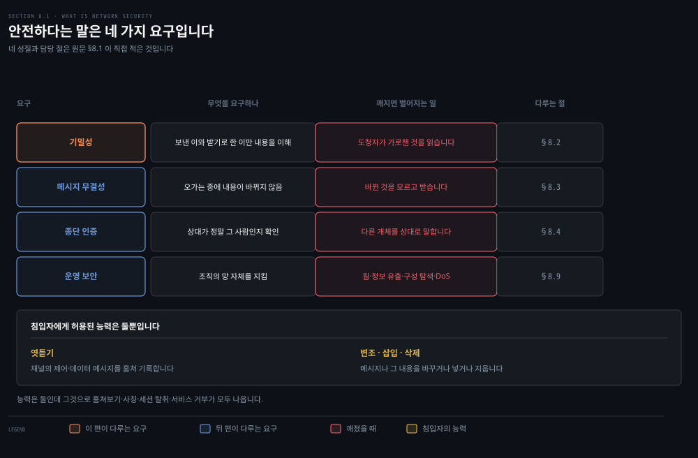
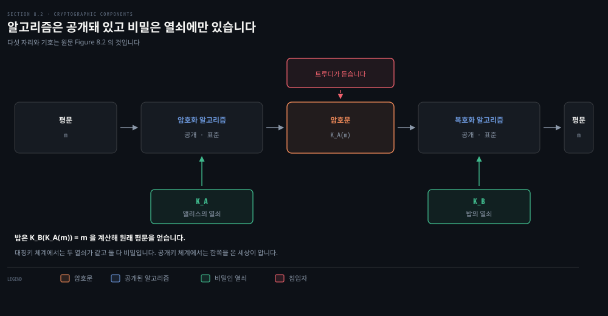
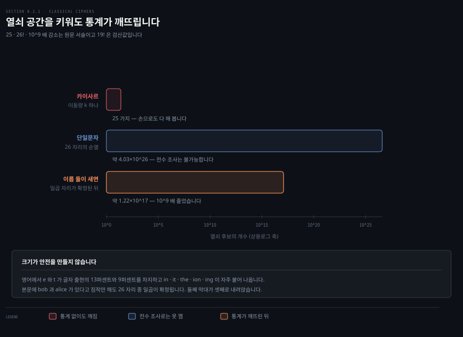
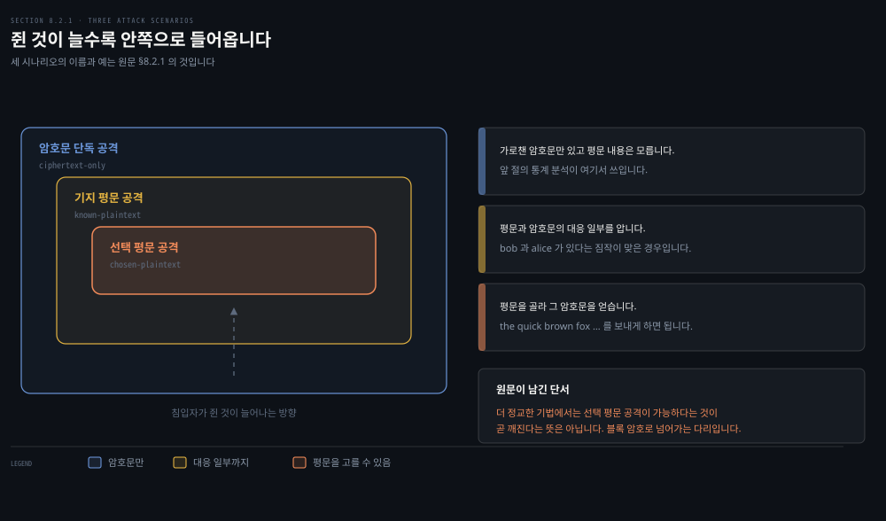
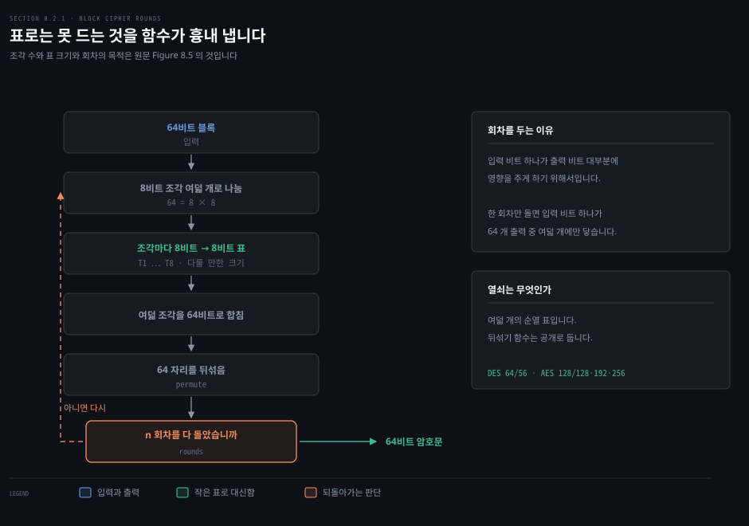
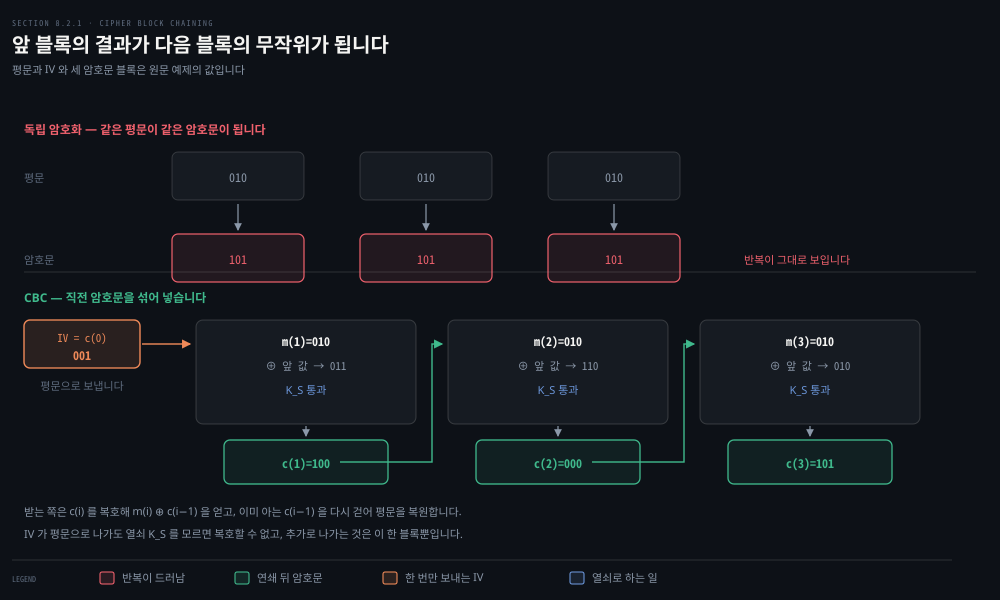

# 무엇을 지키자는 것이고, 비밀은 어디에 있는가

---

> 7장까지가 "어떻게 닿는가"였다면 8장은 "닿는 동안 무엇을 지키는가"입니다. 이 편은 지킨다는 말을 넷으로 갈라 놓고, 그중 첫째인 기밀성을 만드는 가장 오래된 방법부터 봅니다.

## 핵심 요약

> 이 편이 매달린 하나의 생각은 **비밀이 알고리즘이 아니라 열쇠에만 있다**는 것입니다.

암호 알고리즘을 감추는 것이 안전을 만든다고 생각하기 쉽습니다. 인터넷에서 쓰는 방식은 정반대입니다. 알고리즘은 표준으로 공개돼 있고 누구나 읽을 수 있으며, 침입자도 그것을 압니다. 그런데도 통신이 안전한 이유는 열쇠 하나를 모르기 때문입니다.

그래서 이 편의 이야기는 "열쇠 공간을 어떻게 크게 만드는가"로 흐릅니다. 다만 크기만으로는 부족합니다. 열쇠 후보가 10의 26제곱 개나 되는 방식이 통계 하나로 무너지는 장면을 보고 나면, 안전이 경우의 수가 아니라 **구조**의 문제라는 것이 드러납니다.

마지막 절은 그 구조가 한 겹 더 필요하다는 것을 보입니다. 같은 평문 조각이 늘 같은 암호문 조각이 되면, 열쇠를 몰라도 읽어낼 수 있는 것이 생깁니다.


## 학습 목표

> 이 편을 읽고 나면 아래 다섯 가지를 스스로 해낼 수 있습니다.

1. 안전한 통신이 요구하는 네 가지 성질을 대고, 각각이 깨졌을 때 무슨 일이 벌어지는지 설명할 수 있습니다.
2. 평문·암호문·열쇠의 관계를 기호로 쓰고, 대칭키와 공개키가 무엇으로 갈리는지 말할 수 있습니다.
3. 카이사르·단일문자·다중문자 치환의 열쇠 공간을 세고, 열쇠 공간이 커도 깨지는 이유를 설명할 수 있습니다.
4. 침입자가 쥔 정보에 따라 공격을 셋으로 가르고, 각 단계에서 무엇이 더 쉬워지는지 말할 수 있습니다.
5. 블록 암호가 전체 표 대신 함수를 쓰는 이유를 대고, CBC 가 무엇을 막으려고 IV 를 두는지 설명할 수 있습니다.


## 1. 지킨다는 말은 넷으로 갈립니다

> 안전하게 통신하고 싶다는 말은 한 가지 요구가 아닙니다. 원문은 그것을 네 가지 성질로 나눕니다.



### 풀려는 문제

앨리스가 밥에게 안전하게 메시지를 보내고 싶다고 합시다. 여기까지는 누구나 말할 수 있습니다. 문제는 다음 질문입니다. 무엇이 갖춰지면 안전한 것입니까. 이 물음에 답하지 않으면 어떤 대책도 무엇을 막는지 모른 채 쌓이게 됩니다.

원문은 답을 넷으로 나눕니다. 넷이 서로 다른 요구라는 점이 중요합니다. 하나를 만족시키는 장치가 나머지 셋을 자동으로 주지 않습니다.

- **기밀성**: 보낸 이와 받기로 한 이만 내용을 이해할 수 있어야 합니다. 도청자가 메시지를 가로챌 수 있으므로, 가로챈 것이 이해되지 않도록 암호화가 필요합니다. 사람들이 "안전한 통신"이라 할 때 가장 흔히 떠올리는 것이 이 성질입니다.
- **메시지 무결성**: 오가는 도중에 내용이 바뀌지 않아야 합니다. 악의로 바뀌든 사고로 바뀌든 마찬가지입니다. 신뢰적 전송과 링크 계층에서 만난 체크섬 기법을 확장해 이 성질을 만듭니다.
- **종단 인증**: 보내는 쪽과 받는 쪽 모두 상대가 정말 그 사람인지 확인할 수 있어야 합니다. 얼굴을 마주 보는 대화는 이 문제를 눈으로 풉니다. 서로를 볼 수 없는 매체에서는 간단하지 않습니다.
- **운영 보안**: 조직의 망 자체를 지키는 일입니다. 공격자는 호스트에 웜을 심고, 기업 비밀을 빼내고, 내부 구성을 훑고, 서비스 거부 공격을 겁니다.

### 침입자가 할 수 있는 일은 둘입니다

원문이 침입자에게 허용하는 능력은 두 가지뿐입니다. 채널에서 제어 메시지와 데이터 메시지를 **엿듣고 기록하는 일**, 그리고 메시지나 그 내용을 **바꾸거나 넣거나 지우는 일**입니다.

능력은 둘인데 그것으로 벌일 수 있는 공격은 여럿입니다.

- 통신을 훔쳐보아 비밀번호와 데이터를 빼냅니다.
- 다른 개체인 척합니다.
- 진행 중인 세션을 가로챕니다.
- 자원을 과부하시켜 정당한 사용자의 서비스를 막습니다.

이런 취약점의 요약은 CERT 조정 센터가 유지합니다.

### 앨리스와 밥이 사람이 아닐 때가 더 많습니다

앨리스와 밥을 연애하는 두 사람으로 두면 이야기가 편합니다. 실제 인터넷에서 이 둘의 자리에 서는 것은 대개 기계입니다. 라우팅 표를 안전하게 주고받으려는 라우터 둘일 수 있습니다. 안전한 전송 연결을 맺으려는 클라이언트와 서버일 수 있습니다. 안전한 메일을 주고받으려는 메일 응용 둘일 수도 있습니다.

**망 인프라 자체가 당사자인 경우**가 특히 중요합니다. 2장에서 본 DNS 와 5장에서 본 라우팅 데몬은 안전한 통신을 필요로 합니다. 망 관리 응용도 마찬가지입니다. DNS 조회나 라우팅 계산이나 망 관리 기능에 능동적으로 끼어들 수 있는 침입자는 인터넷에 큰 혼란을 일으킬 수 있습니다.


## 2. 알고리즘은 공개돼 있습니다

> 현대 암호 체계는 방법을 감추지 않습니다. 감추는 것은 열쇠 하나뿐입니다.



### 풀려는 문제

암호라는 말을 들으면 "방법을 아무도 모르게 한다"는 그림이 먼저 떠오릅니다. 그 그림대로라면 방법이 알려지는 순간 끝입니다. 그런데 인터넷이 쓰는 암호 기법은 표준으로 **출판되고 표준화되고 누구에게나 공개**돼 있습니다. 잠재적 침입자도 그것을 압니다. 그러면 무엇이 안전을 만듭니까.

### 기호로 적으면 이렇습니다

앨리스의 메시지를 원래 형태 그대로 둔 것이 **평문**(plaintext, cleartext)입니다. 앨리스는 암호화 알고리즘으로 평문을 **암호문**(ciphertext)으로 바꿉니다. 이 암호문은 침입자에게 알아볼 수 없는 것으로 보여야 합니다.

모두가 부호화 방법을 안다면 침입자가 해독하지 못하게 막는 비밀 정보가 어딘가에 있어야 합니다. 그 자리가 **열쇠**입니다.

앨리스는 숫자나 문자의 문자열인 열쇠 `K_A` 를 암호화 알고리즘의 입력으로 줍니다. 알고리즘은 열쇠와 평문 `m` 을 받아 암호문을 냅니다. 그 암호문을 `K_A(m)` 이라 적습니다. 밥은 열쇠 `K_B` 를 복호화 알고리즘에 주고, `K_B(K_A(m)) = m` 을 계산해 원래 평문을 얻습니다.

### 대칭키와 공개키를 가르는 한 줄

여기서 갈림이 하나 생깁니다.

- **대칭키 체계**: 앨리스의 열쇠와 밥의 열쇠가 같고 둘 다 비밀입니다.
- **공개키 체계**: 열쇠가 쌍으로 쓰입니다. 한쪽은 밥과 앨리스 둘 다 알고 사실 온 세상이 알며, 다른 한쪽은 밥이나 앨리스 중 한 사람만 압니다.

이 편은 앞쪽을, 다음 편이 뒤쪽을 다룹니다. 기밀성을 만드는 데 암호가 쓰인다는 것은 자명하지만, 원문은 곧 **종단 인증과 메시지 무결성에도 암호가 중심**이라고 덧붙입니다. 암호학이 망 보안의 주춧돌이 되는 이유가 거기 있습니다.

> **원문 정오**: 560쪽은 *"현대 암호 기법은 지난 **30년** 동안 이루어진 진전에 기대고 있다"* 라고 적습니다. 같은 장이 몇 쪽 뒤에서 그 진전의 연도를 직접 댑니다 — *"1976년에 디피와 헬먼이 …"*, `[RSA 1978]`, 그리고 "1970년대 초"입니다. 9판이 2025년 책이므로 그 진전은 30년이 아니라 **50년 전**의 것입니다. 판을 거듭하며 갱신되지 않은 문장으로 보입니다.


## 3. 글자를 바꿔치기하던 세 세대

> 고전 암호는 열쇠 공간을 키우는 방향으로 발전했습니다. 그리고 그 방향만으로는 부족하다는 것을 스스로 증명했습니다.



### 풀려는 문제

모든 암호 알고리즘은 무언가를 다른 것으로 바꿔치기합니다. 현대 방식으로 바로 들어가기 전에, 원문은 아주 오래되고 아주 단순한 대칭키 알고리즘부터 발을 담급니다. 여기서 얻는 것은 기법 자체가 아니라 **무엇이 암호를 깨는가**에 대한 감각입니다.

### 카이사르 암호

평문의 각 글자를 알파벳에서 `k` 글자 뒤의 글자로 바꿉니다. z 다음은 a 로 돌아옵니다. `k = 3` 이면 a 는 d 가 되고 b 는 e 가 됩니다. 여기서 `k` 값이 열쇠입니다.

```bash
# k = 3
평문:   bob, i love you. Alice
암호문: ere, l oryh brx. dolfh
```

암호문은 알아볼 수 없어 보입니다. 그런데 카이사르 암호를 쓴다는 것만 알면 오래 걸리지 않습니다. **열쇠 값이 25 가지뿐**이기 때문입니다.

### 단일문자 암호

규칙적인 이동 대신 아무 글자나 아무 글자로 바꿉니다. 글자마다 대응이 하나씩만 있으면 됩니다. 그러면 열쇠는 26 자리를 짝지은 순열 전체가 되고, 경우의 수는 25 가 아니라 26 팩토리얼, 즉 10의 26제곱 규모가 됩니다.

```bash
평문:   bob, i love you. Alice
암호문: nkn, s gktc wky. Mgsbc.
```

전수 조사로 10의 26제곱 가지를 다 해 보는 것은 현실적이지 않습니다. 그런데 이 암호는 전수 조사로 깨지지 않습니다. **통계로 깨집니다.**

영어에서 e 와 t 는 가장 자주 나오는 글자로 각각 글자 출현의 13퍼센트와 9퍼센트를 차지합니다. 두세 글자 묶음도 자주 같이 나타납니다(`in`, `it`, `the`, `ion`, `ing`). 이것만으로도 대응을 상당히 좁힐 수 있습니다.

침입자가 내용을 조금이라도 짐작하면 훨씬 쉬워집니다. 트루디가 밥의 아내이고 밥이 앨리스와 바람났다고 의심한다면, 본문에 `bob` 과 `alice` 가 나올 것이라 짐작할 만합니다. 그 짐작이 맞으면 **26 개 대응 중 일곱**이 즉시 확정됩니다.

일곱이 확정되면 남는 것은 19 개의 순열입니다. 26 팩토리얼은 약 4.03×10의 26제곱이고 19 팩토리얼은 약 1.22×10의 17제곱이므로, 확인해야 할 경우의 수가 **10의 9제곱 배 줄어듭니다.** 원문이 적은 그대로입니다.

### 다중문자 암호

500년 전에 나온 개선이 다중문자 암호입니다. 단일문자 암호를 여럿 두고, 평문의 위치마다 정해진 것을 씁니다. 같은 글자라도 위치가 다르면 다르게 부호화됩니다.

원문의 예는 카이사르 암호 둘(`k = 5` 인 C1, `k = 19` 인 C2)을 `C1, C2, C2, C1, C2` 패턴으로 반복해 씁니다.

```bash
평문:   bob, i love you.
암호문: ghu, n etox dhz.
```

평문의 첫 b 는 C1 로, 두 번째 b 는 C2 로 부호화됐습니다. 그래서 같은 글자가 다른 결과를 냅니다. 여기서 열쇠는 **두 카이사르 열쇠와 패턴을 함께 아는 것**입니다.


## 4. 침입자가 무엇을 쥐었느냐가 난이도를 정합니다

> 같은 암호라도 공격자가 가진 정보에 따라 깨기의 난이도가 달라집니다. 원문은 그 정보를 세 단계로 나눕니다.



### 풀려는 문제

"이 암호는 안전한가"라는 질문은 그대로는 답할 수 없습니다. 누구를 상대로 안전한지를 먼저 정해야 하기 때문입니다. 원문은 그 상대를 침입자가 쥔 정보로 정의합니다.

### 세 단계

- **암호문 단독 공격**(ciphertext-only attack): 가로챈 암호문만 있고 평문 내용에 대한 확실한 정보는 없습니다. 앞 절에서 본 통계 분석이 여기서 쓰입니다.
- **기지 평문 공격**(known-plaintext attack): 평문과 암호문의 대응 일부를 압니다. 트루디가 `bob` 과 `alice` 가 들어 있다고 확신했던 경우가 여기입니다. 암호문 전송을 전부 기록해 두었다가 밥이 종이에 적어 둔 복호본 하나를 발견하는 경우도 마찬가지입니다.
- **선택 평문 공격**(chosen-plaintext attack): 평문을 골라 그에 대응하는 암호문을 얻을 수 있습니다. 앞의 단순한 알고리즘들이라면, 트루디가 앨리스에게 `The quick brown fox jumps over the lazy dog` 를 보내게 할 수만 있어도 암호 체계가 통째로 깨집니다.

마지막 문장에 원문이 단서를 답니다. **더 정교한 기법에서는 선택 평문 공격이 가능하다고 해서 반드시 깨지는 것은 아닙니다.** 이 단서가 다음 절로 넘어가는 다리입니다.


## 5. 현대의 대칭키는 표 대신 함수를 씁니다

> 블록 암호는 열쇠 공간을 천문학적으로 키웁니다. 그런데 그 크기를 표로 들고 있을 수는 없습니다.



### 풀려는 문제

앞 절들이 보인 것은 글자 단위 치환의 한계입니다. 현대의 대칭키는 글자가 아니라 **비트 덩어리**를 통째로 바꿉니다. 이것이 블록 암호이고, 안전한 메일용 PGP 와 TCP 연결을 지키는 TLS 와 망 계층 전송을 지키는 IPsec 이 모두 이것을 씁니다.

### 블록과 사상

블록 암호는 메시지를 `k` 비트 블록으로 나눠 각 블록을 독립적으로 암호화합니다. 부호화는 `k` 비트 평문 블록을 `k` 비트 암호문 블록으로 보내는 일대일 사상으로 합니다.

> **노트의 읽기**: 엄밀히 말하면 이 정의가 가리키는 것은 블록 암호 자체가 아니라 **ECB**(Electronic Codebook) 모드입니다. 블록 암호는 고정 길이 블록 하나를 열쇠로 뒤집는 가역 변환이고, 그 변환을 여러 블록에 어떻게 이어 붙일지는 **운영 모드**가 정합니다. 블록마다 같은 사상을 따로 적용하는 것이 그 모드 가운데 하나일 뿐입니다. 원문이 여기서 둘을 붙여 놓은 것은 6절의 CBC 로 가는 계단이기 때문입니다. 뒤에서 만날 `AES/CBC/PKCS5Padding` 의 가운데 자리가 바로 이 구분입니다.

원문의 예는 `k = 3` 입니다. 표 8.1 의 사상을 쓰면 이렇게 됩니다.

```bash
사상: 000→110  001→111  010→101  011→100
      100→011  101→010  110→000  111→001

평문:   010 110 001 111
암호문: 101 000 111 001
```

이 사상은 여럿 중 하나일 뿐입니다. 사상은 결국 가능한 입력 전체의 순열이므로, 입력이 2의 3제곱, 즉 여덟 가지면 사상은 8 팩토리얼, 즉 **40,320 가지**입니다. 사상 하나하나가 열쇠입니다.

`k = 3` 에서 40,320 가지는 개인용 컴퓨터로 금방 다 해 봅니다. 그래서 블록 암호는 훨씬 큰 블록을 씁니다. 일반적인 `k` 비트 블록 암호의 사상 수는 **2의 k제곱 팩토리얼**이고, `k = 64` 처럼 적당한 값에서도 이미 천문학적입니다.

### 표를 들 수 없어서 함수를 씁니다

문제는 구현입니다. `k = 64` 이고 사상이 정해졌다면, 앨리스와 밥은 입력 2의 64제곱 개짜리 표를 들고 있어야 합니다. 불가능한 일입니다. 게다가 열쇠를 바꾸면 그 표를 각자 다시 만들어야 합니다.

그래서 블록 암호는 **무작위로 뒤섞인 표를 흉내 내는 함수**를 씁니다. 원문이 든 64비트 예는 이렇게 돕니다. 64비트 블록을 8비트짜리 여덟 조각으로 나눕니다. 조각마다 다룰 만한 크기인 8비트 대 8비트 표를 하나씩 통과시킵니다. 나온 여덟 조각을 다시 64비트로 합친 뒤 그 64비트의 자리를 뒤섞습니다. 이 출력을 다시 입력으로 넣어 다음 회차를 시작합니다.

**회차를 두는 이유**는 입력 비트 하나가 출력 비트 대부분에 영향을 주게 하기 위해서입니다. 한 회차만 돌리면 입력 비트 하나가 64 개 출력 비트 중 여덟 개에만 영향을 줍니다. 이 알고리즘에서 열쇠는 여덟 개의 순열 표입니다.

### 실제로 쓰이는 것들

오늘날 널리 쓰이는 블록 암호는 DES 와 3DES 와 AES 입니다. 셋 다 정해진 표가 아니라 함수를 쓰고, 열쇠로 비트 문자열을 받습니다.

| 알고리즘 | 블록 크기 | 열쇠 길이 |
|---------|----------|----------|
| DES | 64 비트 | 56 비트 |
| AES | 128 비트 | 128 · 192 · 256 비트 |

열쇠 길이가 `n` 이면 가능한 열쇠는 2의 n제곱 개입니다. NIST 는 **56비트 DES 를 1초에 깨는 기계**가 128비트 AES 열쇠를 깨는 데 약 **149조 년**이 걸린다고 추정합니다. 검산하면 2의 72제곱 초는 약 1.5×10의 14제곱 년이므로 원문의 수치와 맞습니다.

> **지금은 다릅니다**: 원문은 DES 와 3DES 를 AES 와 나란히 "오늘날 널리 쓰이는" 것으로 셉니다. DES 표준은 2005년에 철회됐고, NIST 는 3DES 를 규정하던 SP 800-67 마저 물려 **2024년부터 새로 암호학적 보호를 걸 때 쓰지 못하게** 했습니다.[^3des] 옛 데이터를 푸는 용도만 남습니다. 셋 가운데 지금 새로 고를 수 있는 것은 **AES 하나**입니다.


## 6. 같은 평문이 같은 암호문이 되면 안 됩니다

> 블록을 독립적으로 암호화하면 열쇠를 몰라도 읽히는 것이 생깁니다. CBC 는 그 자리를 막습니다.



### 풀려는 문제

망 응용에서는 대개 긴 메시지나 긴 데이터 흐름을 암호화합니다. 메시지를 `k` 비트 블록으로 잘라 각각 독립적으로 암호화하면 미묘하지만 중요한 문제가 생깁니다.

평문 블록 둘 이상이 같을 수 있습니다. 예를 들어 두 블록의 평문이 모두 `HTTP 1.1` 일 수 있습니다. 같은 블록이면 블록 암호는 당연히 같은 암호문을 냅니다. 공격자는 같은 암호문 블록이 보이는 것만으로 평문을 짐작할 수 있고, 프로토콜 구조에 대한 지식을 보태면 메시지 전체를 해독할 수도 있습니다.

원문의 3비트 예가 이 문제를 그대로 보입니다.

```bash
평문:   010 010 010
암호문: 101 101 101   ← 세 블록이 같으니 평문 세 블록도 같다는 것이 드러납니다
```

### 무작위를 섞으면 대역폭이 두 배가 됩니다

해법의 방향은 암호문에 무작위를 섞어, 같은 평문 블록이 다른 암호문 블록이 되게 하는 것입니다. 보내는 쪽이 `i` 번째 블록마다 무작위 `k` 비트 수 `r(i)` 를 만들어 `c(i) = K_S(m(i) ⊕ r(i))` 를 계산하고, `c(i)` 와 `r(i)` 를 함께 보냅니다. 받는 쪽은 `m(i) = K_S(c(i)) ⊕ r(i)` 로 되돌립니다.

> **노트의 읽기**: 되돌리는 식에 부호화와 같은 `K_S` 를 적었지만, 실제로 쓰이는 것은 그 **역함수**입니다. 원문의 표기가 열쇠 이름 하나로 양방향을 다 가리키는 탓에 구분이 묻힙니다. 하필 표 8.1 의 사상이 `000↔110`, `001↔111`, `010↔101`, `011↔100` 처럼 넷 다 짝을 이뤄 **자기 자신이 역함수**라, 예제를 그대로 따라가면 어긋남이 드러나지 않습니다. 짝을 이루지 않는 다른 사상을 골라 같은 식을 적용하면 복호가 깨집니다.

`r(i)` 가 평문으로 나가므로 트루디가 그것을 볼 수 있지만, 열쇠 `K_S` 를 모르므로 평문은 얻지 못합니다.

```bash
평문:      010     010     010
무작위:    r=001   r=111   r=100
암호문:    100     010     000   ← 평문이 같아도 결과가 다릅니다
```

여기서 눈 밝은 독자는 새 문제를 봅니다. **암호 비트마다 무작위 비트를 하나씩 더 보내야 하니 대역폭이 두 배가 됩니다.**

### 그래서 앞의 결과를 다음 무작위로 씁니다

블록 암호가 쓰는 기법이 **암호 블록 연쇄**(Cipher Block Chaining, CBC)입니다. 아이디어는 한 줄로 요약됩니다. 무작위 값은 맨 처음 한 번만 보내고, 그다음부터는 **계산된 부호 블록을 무작위 수 대신 씁니다.**

1. 보내는 쪽이 무작위 `k` 비트 문자열을 만듭니다. 이것을 **초기화 벡터**(Initialization Vector, IV)라 하고 `c(0)` 으로 적으며, 평문 그대로 받는 쪽에 보냅니다.
2. 첫 블록은 `c(1) = K_S(m(1) ⊕ c(0))` 으로 계산해 보냅니다.
3. `i` 번째 블록은 `c(i) = K_S(m(i) ⊕ c(i−1))` 로 계산합니다.

받는 쪽은 `c(i)` 를 `K_S` 로 복호해 `s(i) = m(i) ⊕ c(i−1)` 을 얻고, `c(i−1)` 을 이미 알고 있으므로 `m(i) = s(i) ⊕ c(i−1)` 로 평문을 복원합니다.

같은 3비트 예를 IV `c(0) = 001` 로 돌리면 이렇게 됩니다.

```bash
c(1) = K_S(010 ⊕ 001) = K_S(011) = 100
c(2) = K_S(010 ⊕ 100) = K_S(110) = 000
c(3) = K_S(010 ⊕ 000) = K_S(010) = 101
```

얻는 것이 넷입니다.

1. 받는 쪽이 원문을 그대로 복원합니다.
2. 평문 블록이 같아도 암호문은 거의 항상 달라집니다.
3. IV 가 평문으로 나가도 열쇠를 모르는 침입자는 복호하지 못합니다.
4. 추가로 나가는 것은 IV 한 블록뿐이라 긴 메시지에서는 대역폭 증가가 무시할 만합니다.

마지막으로 원문이 설계에 남기는 숙제가 있습니다. **IV 를 보내는 쪽에서 받는 쪽으로 전달할 장치를 프로토콜 안에 마련해야 합니다.** 이 장의 뒤쪽 절들이 프로토콜마다 그것을 어떻게 하는지 보여 줍니다.


## 결정 치트시트

> 이 편의 판단 기준을 한 표에 모았습니다.

| 상황 | 판단 | 근거 |
|------|------|------|
| 암호 알고리즘을 감출지 정할 때 | 감추지 않습니다 | 인터넷 표준 암호는 공개돼 있고 비밀은 열쇠에만 둡니다 |
| 열쇠 공간이 크면 안전한지 물을 때 | 크기만으로는 부족합니다 | 단일문자 암호는 10의 26제곱 규모인데 통계로 깨집니다 |
| 안전성을 주장할 때 | 상대를 먼저 정합니다 | 암호문 단독·기지 평문·선택 평문에서 난이도가 다릅니다 |
| 블록 암호를 전체 표로 만들지 정할 때 | 함수로 만듭니다 | `k = 64` 면 표가 2의 64제곱 항목이라 들 수 없습니다 |
| 긴 데이터를 블록 암호로 암호화할 때 | 연쇄 모드를 씁니다 | 독립 암호화는 같은 평문 블록을 같은 암호문으로 드러냅니다 |
| IV 를 감출지 정할 때 | 평문으로 보내도 됩니다 | 열쇠를 모르면 IV 만으로는 복호할 수 없습니다 |


## 심화 학습

> 책 밖 보강입니다. 원문이 다루지 않는 자리만 적습니다.

### 자바에서 이 절의 선택이 문자열 하나로 나타납니다

이 편이 나눈 세 가지 결정이 자바 암호 확장에서는 한 문자열로 합쳐집니다. 알고리즘과 운영 모드와 패딩입니다. `Cipher.getInstance` 에 넘기는 변환 문자열이 `"알고리즘/모드/패딩"` 형태이고, 공식 문서가 드는 예가 `AES/CBC/PKCS5Padding` 입니다.[^jce]

```java
Cipher c = Cipher.getInstance("AES/CBC/PKCS5Padding");
```

`AES` 가 5절의 블록 암호이고 `CBC` 가 6절의 연쇄 모드입니다. 모드와 패딩을 빼고 `"AES"` 만 넘기면 제공자별 기본값이 쓰인다고 문서가 밝힙니다 — 어떤 모드로 도는지가 제공자에 달리므로, 실무에서는 세 자리를 다 적는 편이 안전합니다.

6절이 남긴 숙제도 API 에 그대로 드러납니다. 다만 IV 를 넘겨야 하는 쪽은 한쪽뿐입니다. 부호화할 때 IV 를 주지 않으면 제공자가 무작위로 만들어 쓰고, 만든 값은 `getIV()` 로 받아 옵니다. 반드시 알아야 하는 쪽은 **복호화**입니다. 부호화 때 쓴 그 IV 를 그대로 넘겨야 풀립니다. 원문이 "IV 를 전달할 장치를 프로토콜에 마련해야 한다"고 적은 것이 코드에서는 "IV 를 어디에 실어 보낼 것인가"라는 설계 질문이 됩니다.

### 열쇠 길이의 수치는 직접 확인할 수 있습니다

원문의 149조 년은 검산이 가능합니다. 128비트 열쇠와 56비트 열쇠의 비는 2의 72제곱이고, 1초에 2의 56제곱 개를 시도하는 기계라면 2의 72제곱 초가 걸립니다.

```bash
python3 -c "print(f'1.496e+14 년')"
# 1.496e+14 년
```

원문이 적은 149조 년과 맞습니다. 이런 수치는 외우기보다 **왜 지수가 저렇게 벌어지는지**를 잡아 두는 편이 낫습니다. 열쇠 한 비트가 늘 때마다 시도할 경우의 수가 두 배가 됩니다.


## 면접 대비

> 이 편에서 실제로 물어보기 좋은 것만 골랐습니다.

### 한 줄 정의

- **기밀성**: 보낸 이와 받기로 한 이만 내용을 이해할 수 있는 성질입니다.
- **평문과 암호문**: 원래 형태의 메시지와 암호화된 형태의 메시지입니다.
- **대칭키**: 양쪽 열쇠가 같고 둘 다 비밀인 체계입니다.
- **블록 암호**: 메시지를 `k` 비트 블록으로 나눠 각 블록을 일대일 사상으로 바꾸는 방식입니다.
- **IV**: CBC 의 첫 블록에 섞을 무작위 값이며 평문으로 전달됩니다.

### 핵심 포인트 세 가지

1. **비밀은 알고리즘이 아니라 열쇠에 있습니다.** 인터넷 표준 암호는 공개돼 있고 침입자도 방법을 압니다. 그런데도 안전한 이유가 열쇠 하나입니다.
2. **열쇠 공간의 크기가 안전을 보장하지 않습니다.** 단일문자 암호의 경우의 수는 10의 26제곱 규모인데 글자 빈도 통계로 깨집니다. 구조가 통계를 남기면 크기는 소용이 없습니다.
3. **CBC 는 대역폭을 지키면서 반복을 지웁니다.** 블록마다 무작위를 보내면 대역폭이 두 배가 되므로, 앞 블록의 암호문을 다음 블록의 무작위 대신 씁니다. 추가 비용은 IV 한 블록뿐입니다.

### 자주 묻는 질문

- *암호 알고리즘을 비밀로 하면 더 안전하지 않습니까?* 인터넷 표준은 반대로 갑니다. 알고리즘을 공개해 검증을 받고 비밀은 열쇠에만 둡니다. 알고리즘이 비밀이면 그것이 새는 순간 모든 통신이 무너지지만, 열쇠는 바꿀 수 있습니다.
- *블록 암호가 전체 사상 표를 안 쓰는 이유는 무엇입니까?* `k = 64` 면 표 항목이 2의 64제곱 개라 저장할 수 없고, 열쇠를 바꿀 때마다 다시 만들어야 합니다. 그래서 무작위 순열 표를 흉내 내는 함수를 여러 회차 돌립니다.
- *회차를 여러 번 도는 이유는 무엇입니까?* 입력 비트 하나가 출력 비트 대부분에 영향을 주게 하기 위해서입니다. 한 회차만 돌면 입력 비트 하나가 64 개 출력 중 여덟 개에만 닿습니다.
- *IV 를 평문으로 보내도 괜찮습니까?* 괜찮습니다. IV 를 알아도 열쇠 `K_S` 를 모르면 암호문 블록을 복호할 수 없습니다. 다만 IV 는 예측 불가능한 무작위여야 합니다.


## 핵심 개념 체크리스트

- [ ] 안전한 통신의 네 성질을 대고 각각이 깨졌을 때 벌어지는 일을 말할 수 있습니다.
- [ ] 침입자에게 허용된 두 가지 능력을 대고, 그것으로 벌어지는 공격 유형을 몇 가지 들 수 있습니다.
- [ ] `K_B(K_A(m)) = m` 을 설명하고 대칭키와 공개키가 무엇으로 갈리는지 말할 수 있습니다.
- [ ] 카이사르·단일문자·다중문자의 열쇠 공간을 각각 대고, 통계 분석이 왜 통하는지 설명할 수 있습니다.
- [ ] 세 가지 공격 모델을 순서대로 대고 각 단계에서 공격자가 무엇을 더 쥐는지 말할 수 있습니다.
- [ ] 블록 암호가 전체 표 대신 함수를 쓰는 이유와 회차의 목적을 설명할 수 있습니다.
- [ ] CBC 의 세 단계를 적고 IV 가 무엇을 막는지 말할 수 있습니다.


## 관련 문서

- [8장 README](./README.md) — 이 책의 장별 목표와 진행 상태입니다.
- [7장 움직이는 동안 연결은 어떻게 유지되는가](./07-05.%EC%9B%80%EC%A7%81%EC%9D%B4%EB%8A%94%20%EB%8F%99%EC%95%88%20%EC%97%B0%EA%B2%B0%EC%9D%80%20%EC%96%B4%EB%96%BB%EA%B2%8C%20%EC%9C%A0%EC%A7%80%EB%90%98%EB%8A%94%EA%B0%80.md) — 앞 장의 마지막 편입니다. 무선 구간의 인증은 이 장 §8.8 에서 다시 나옵니다.
- [3장 신뢰성은 어떻게 만들어지는가](./03-02.%EC%8B%A0%EB%A2%B0%EC%84%B1%EC%9D%80%20%EC%96%B4%EB%96%BB%EA%B2%8C%20%EB%A7%8C%EB%93%A4%EC%96%B4%EC%A7%80%EB%8A%94%EA%B0%80.md) — 이 편이 언급한 체크섬이 여기서 나옵니다. 무결성은 그 확장입니다.


## 참고 자료

- 《Computer Networking A Top-Down Approach》 9판, Kurose·Ross, Pearson.
  - 8장 도입 — 책 557–558쪽
  - §8.1 What Is Network Security? — 책 558–560쪽
  - §8.2 Principles of Cryptography 도입 — 책 560–561쪽
  - §8.2.1 Symmetric Key Cryptography — 책 561–567쪽
- 자바 암호 확장의 변환 문자열: [Cipher (Java SE 21 API)](https://docs.oracle.com/en/java/javase/21/docs/api/java.base/javax/crypto/Cipher.html).
- 본문의 검산(26 팩토리얼, 2의 72제곱 초)은 이 기계에서 `python3` 으로 직접 계산한 값입니다.

[^3des]: NIST CSRC (2023-06-29) — *"NIST will withdraw Special Publication (SP) 800-67 Revision 2 … on January 1, 2024."* 같은 글이 DES 에 대해서는 *"DEA was originally specified in FIPS 46, The Data Encryption Standard, which was withdrawn in 2005"* 라 적고, 3DES 에 대해서는 *"this category of use of TDEA will be deprecated for all applications through 2023, and disallowed after December 31, 2023"* 라 적습니다. 다만 *"TDEA will continue to be allowed for the decryption, key unwrapping, and verification of MACs of already-protected data"* 입니다. <https://csrc.nist.gov/news/2023/nist-to-withdraw-sp-800-67-rev-2>

[^jce]: Oracle — `javax.crypto.Cipher`. 변환 문자열은 *"algorithm/mode/padding"* 형태이며 문서가 드는 예가 `Cipher.getInstance("AES/CBC/PKCS5Padding")` 입니다. <https://docs.oracle.com/en/java/javase/21/docs/api/java.base/javax/crypto/Cipher.html>
