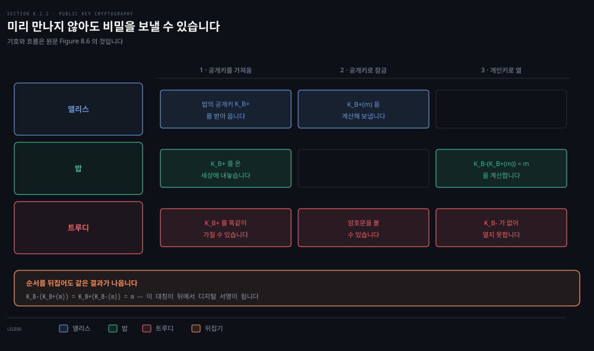
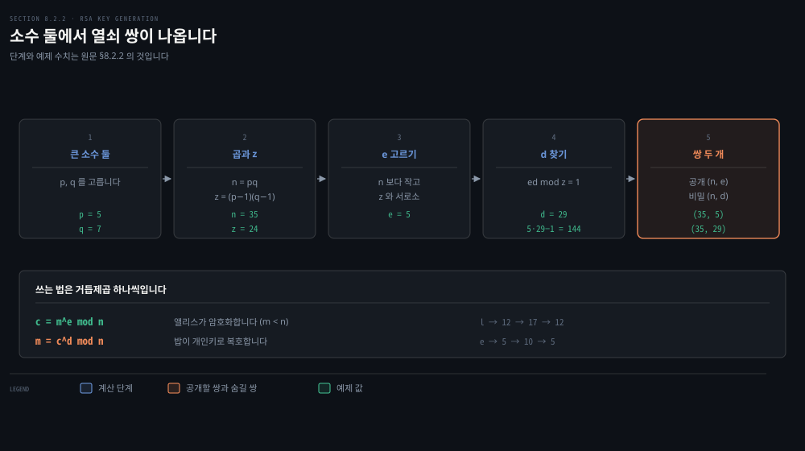
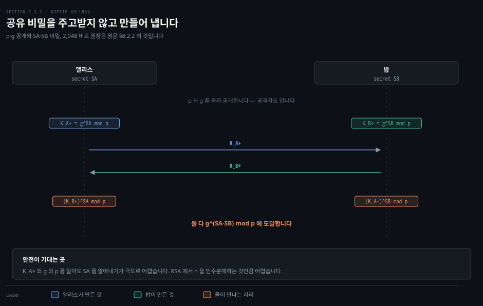
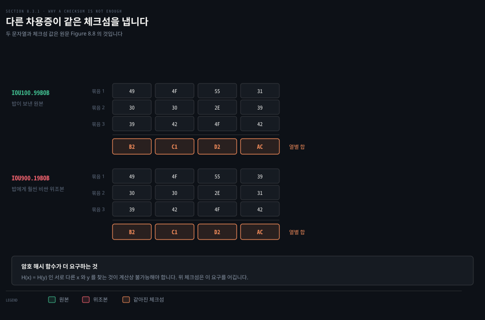
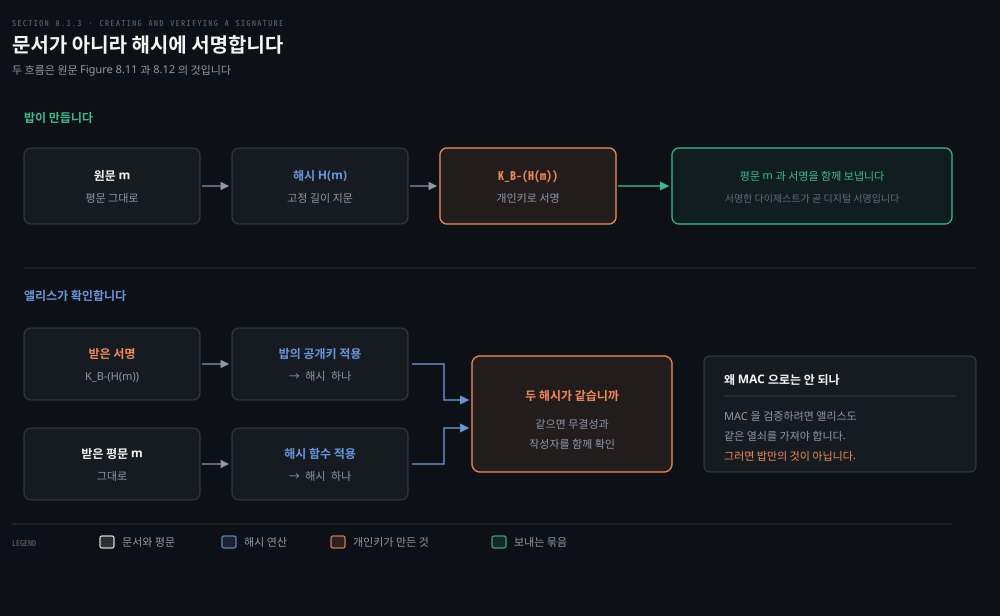
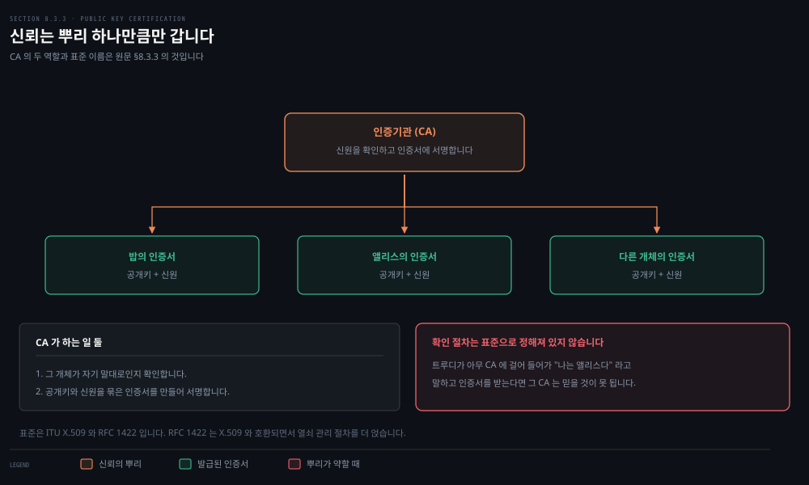

# 열쇠를 나눠 갖지 않고 어떻게 비밀을 만드는가

---

> 앞 편은 양쪽이 같은 열쇠를 이미 나눠 가졌다고 전제했습니다. 이 편은 그 전제를 걷어냅니다. 열쇠를 걷어내자 기밀성뿐 아니라 무결성과 서명까지 딸려 나옵니다.

## 핵심 요약

> 이 편이 매달린 하나의 생각은 **열쇠를 둘로 쪼개면 쓰는 순서를 뒤집을 수 있고, 그 뒤집기가 서명이 된다**는 것입니다.

대칭키의 곤란은 열쇠를 먼저 나눠 가져야 한다는 데 있습니다. 그런데 안전하게 나눠 가지려면 이미 안전한 통신이 있어야 합니다. 닭과 달걀입니다. 공개키는 열쇠를 공개용과 비밀용 한 쌍으로 쪼개 이 고리를 끊습니다.

쪼개고 나면 예상 못 한 것이 따라옵니다. 공개키로 잠그고 개인키로 여는 것이 기밀성이라면, **개인키로 잠그고 공개키로 여는 것**은 "이것을 만든 사람은 개인키를 쥔 그 사람뿐"이라는 증명이 됩니다. 이것이 디지털 서명입니다.

다만 공개키 하나만으로는 부족합니다. 그 공개키가 정말 그 사람의 것인지 아무도 보증하지 않으면, 남의 이름으로 피자를 시킬 수 있습니다. 마지막 절이 그 보증을 누가 서는지를 봅니다.


## 학습 목표

> 이 편을 읽고 나면 아래 다섯 가지를 스스로 해낼 수 있습니다.

1. 대칭키의 열쇠 배포 문제를 설명하고 공개키가 그것을 어떻게 끊는지 말할 수 있습니다.
2. RSA 의 열쇠 생성 다섯 단계를 순서대로 적고 작은 수로 직접 계산할 수 있습니다.
3. 세션 키가 왜 필요한지 대고, 디피-헬먼이 공유 비밀을 주고받지 않고 만드는 원리를 설명할 수 있습니다.
4. 암호 해시 함수가 체크섬과 무엇이 다른지 반례로 보이고, MAC 세 단계를 적을 수 있습니다.
5. 디지털 서명과 MAC 을 비교하고, 인증기관이 없으면 무엇이 무너지는지 설명할 수 있습니다.


## 1. 미리 만난 적 없는 둘이 비밀을 만듭니다

> 카이사르부터 1970년대까지 2,000년 넘게 암호 통신은 공유 비밀을 요구했습니다. 공개키는 그 요구를 지웁니다.



### 풀려는 문제

대칭키의 곤란은 열쇠 자체가 아니라 **열쇠를 어떻게 합의하느냐**입니다. 두 당사자가 먼저 만나 정하는 방법이 있습니다. 카이사르의 백부장 둘이 로마 목욕탕에서 만나 정하고 그 뒤로 암호로 통신하는 식입니다. 그런데 망으로 이어진 세상에서는 통신하는 둘이 한 번도 만나지 않고 망 밖에서 말을 섞은 적도 없을 수 있습니다.

그래서 질문이 이렇게 섭니다. **미리 아는 공유 비밀 없이 두 당사자가 암호 통신을 할 수 있습니까.** 1976년에 디피와 헬먼이 그럴 수 있다는 것을 알고리즘으로 보였고, 그것이 오늘날의 공개키 암호 체계로 이어졌습니다.

원문이 곁들이는 사실 하나가 있습니다. 디피-헬먼과 RSA 와 비슷한 착상이 1970년대 초 영국 통신전자보안그룹의 비공개 보고서에서 독립적으로 나와 있었습니다. 좋은 착상은 여러 곳에서 따로 솟는데, 다행히 공개키의 진전은 **비공개 쪽에서만이 아니라 공개된 자리에서도** 일어났습니다.

### 열쇠가 둘이 됩니다

밥은 열쇠를 하나가 아니라 둘 갖습니다.

- **공개키** `K_B+`: 온 세상이 압니다. 침입자 트루디도 압니다.
- **개인키** `K_B-`: 밥만 압니다.

앨리스는 밥의 공개키를 가져와 메시지를 암호화합니다. 즉 `K_B+(m)` 을 계산합니다. 밥은 자기 개인키로 복호해 `K_B-(K_B+(m))` 을 얻는데, 이 값이 `m` 이 되도록 열쇠 쌍을 고르는 방법이 있습니다. **아무 비밀도 나눠 갖지 않고 앨리스가 밥에게 비밀을 보냈습니다.**

여기서 원문이 한 걸음 더 나갑니다. 공개키와 개인키의 **적용 순서를 바꿔도 같은 결과**가 나옵니다.

```bash
K_B-(K_B+(m)) = K_B+(K_B-(m)) = m
```

이 대칭이 뒤에서 서명을 만듭니다.

### 곧바로 따라오는 걱정

밥의 암호화 열쇠가 공개돼 있으므로 **누구나 밥에게 암호문을 보낼 수 있습니다.** 앨리스일 수도 있고 앨리스인 척하는 사람일 수도 있습니다.

대칭키에서는 이 문제가 저절로 풀렸습니다. 보낸 이가 비밀 열쇠를 안다는 사실 자체가 받는 이에게 신원을 알려 주었기 때문입니다. 공개키에서는 그것이 사라집니다.

> **노트의 읽기**: "저절로 풀렸다"는 것은 이 대목의 대비를 세우기 위한 말이고, 엄밀히는 참이 아닙니다. 암호화만으로는 **복호가 성공했는지 판정할 방법 자체가 없습니다.** 트루디가 암호문의 비트를 뒤집어도 받는 쪽은 뜻 모를 평문을 얻을 뿐이라 위조를 가려내지 못합니다. 보낸 이를 확인하려면 대칭키에서도 뒤 절의 MAC 같은 무결성 장치가 따로 있어야 합니다. 이 장이 몇 절 뒤에서 그것을 다시 세웁니다.

보낸 이를 메시지에 묶어 두려면 **디지털 서명**이 필요하고, 그것이 이 편의 뒤쪽 절입니다.


## 2. RSA 는 산수 넷으로 열쇠를 만듭니다

> RSA 는 모듈로 연산 위에 서 있습니다. 열쇠 생성은 다섯 단계이고, 작은 수로는 손으로도 따라갈 수 있습니다.



### 풀려는 문제

공개키가 개념으로는 간단해도 "그런 열쇠 쌍을 어떻게 만드느냐"는 남습니다. RSA 는 그 답 중 하나이고, 공개키 암호와 거의 동의어가 될 만큼 널리 퍼졌습니다. 이름은 만든 세 사람인 론 리베스트와 아디 샤미르와 레너드 애들먼에서 왔습니다.

### 먼저 모듈로 산술

`x mod n` 은 `x` 를 `n` 으로 나눈 나머지입니다. `19 mod 5 = 4` 입니다. 덧셈과 곱셈과 거듭제곱을 평소처럼 하되 결과를 `n` 으로 나눈 나머지로 바꿉니다. 다음 세 가지가 계산을 편하게 합니다.

```bash
[(a mod n) + (b mod n)] mod n = (a + b) mod n
[(a mod n) − (b mod n)] mod n = (a − b) mod n
[(a mod n) · (b mod n)] mod n = (a · b) mod n
```

셋째에서 `(a mod n)^d mod n = a^d mod n` 이 따라 나옵니다. 이 항등식이 곧 쓰입니다.

### 열쇠 생성 다섯 단계

메시지는 비트 패턴이고 비트 패턴은 정수 하나로 유일하게 나타낼 수 있습니다. 비트 패턴 `1001` 은 정수 9 입니다. 그래서 RSA 로 메시지를 암호화하는 것은 그 메시지를 나타내는 정수를 암호화하는 것과 같습니다.

밥이 하는 일은 이렇습니다.

1. 큰 소수 둘 `p` 와 `q` 를 고릅니다. 클수록 깨기 어렵지만 부호화와 복호화가 느려집니다. RSA 연구소는 `p` 와 `q` 의 곱이 1,024 비트 규모일 것을 권합니다.
2. `n = pq` 와 `z = (p−1)(q−1)` 을 계산합니다.
3. `n` 보다 작으면서 `z` 와 1 말고는 공약수가 없는 수 `e` 를 고릅니다. 암호화에 쓰이므로 `e` 입니다.
4. `ed − 1` 이 `z` 로 나누어떨어지는 수 `d` 를 찾습니다. 달리 말해 `ed mod z = 1` 입니다. 복호화에 쓰이므로 `d` 입니다.
5. 공개키 `K_B+` 는 쌍 `(n, e)` 이고 개인키 `K_B-` 는 쌍 `(n, d)` 입니다.

암호화와 복호화는 거듭제곱 하나씩입니다.

```bash
c = m^e mod n     # 앨리스가 암호화 (m < n)
m = c^d mod n     # 밥이 복호화
```

### 작은 수로 따라가 보기

원문의 예는 `p = 5`, `q = 7` 입니다. 그러면 `n = 35`, `z = 24` 입니다. `e = 5` 를 고르는데 5 와 24 는 공약수가 없습니다. `d = 29` 를 고르는데 `5 · 29 − 1 = 144` 가 24 로 나누어떨어지기 때문입니다. 밥은 35 와 5 를 공개하고 29 를 숨깁니다.

앨리스가 글자 `l`, `o`, `v`, `e` 를 보냅니다. 글자를 1 부터 26 사이의 수로 읽습니다.

| 평문 글자 | m | m^e | c = m^e mod 35 | c^d mod 35 | 되돌린 글자 |
|---------|---|-----|---------------|-----------|-----------|
| l | 12 | 248832 | 17 | 12 | l |
| o | 15 | 759375 | 15 | 15 | o |
| v | 22 | 5153632 | 22 | 22 | v |
| e | 5 | 3125 | 10 | 5 | e |

이 기계에서 그대로 재현했습니다. 네 글자가 모두 원래대로 돌아옵니다.

> **원문 정오**: 표 8.3 의 `c^d` 열에 적힌 큰 수 넷 가운데 **셋이 틀렸습니다**(571쪽). `17^29` 은 36 자리인데 40 자리로 적혔고, `15^29` 은 35 자리인데 39 자리로 적혔으며, `10^29` 은 1 뒤에 0 이 29 개여야 하는데 30 개가 찍혔습니다. `22^29` 만 맞습니다. 다만 그 오른쪽의 `m = c^d mod n` 열은 넷 다 정확해서 **예제의 결론은 그대로 섭니다.** 자릿수가 어긋난 것은 중간 값 표기뿐입니다.

> **지금은 다릅니다**: 원문이 인용한 "1,024 비트 규모" 권고는 지금 기준으로는 부족합니다. 원문 자신도 뒤의 디피-헬먼 절에서는 2,048 비트 이상을 권합니다. 같은 장 안에서 권고 수치가 갈리는 셈이라 1,024 는 옛 판본의 잔재로 보입니다.


## 3. 왜 되는지는 세 줄로 끝납니다

> 마법처럼 보이지만 유도는 짧습니다. 모듈로 산술의 항등식 하나와 수론의 결과 하나면 끝납니다.

### 풀려는 문제

암호화하고 복호화했더니 원래 메시지가 나온다는 것이 왜 성립합니까. 이것을 손에 쥐지 않으면 RSA 는 외워야 할 절차로 남습니다.

### 유도

암호화는 `c = m^e mod n` 이고 복호화는 그 값을 `d` 제곱해 다시 `mod n` 을 취하는 것이므로, 이어 붙이면 `(m^e mod n)^d mod n` 입니다.

앞 절의 항등식 `(a mod n)^d mod n = a^d mod n` 에 `a = m^e` 를 넣습니다.

```bash
(m^e mod n)^d mod n = m^(ed) mod n
```

남은 것은 `m^(ed) mod n = m` 을 보이는 일입니다. 여기서 수론의 결과 하나를 빌립니다. `p` 와 `q` 가 소수이고 `n = pq`, `z = (p−1)(q−1)` 이면 `x^y mod n` 은 `x^(y mod z) mod n` 과 같습니다. `x = m`, `y = ed` 로 두면 이렇게 됩니다.

```bash
m^(ed) mod n = m^(ed mod z) mod n
```

그런데 `e` 와 `d` 를 고를 때 `ed mod z = 1` 이 되도록 골랐습니다. 그래서 `m^1 mod n = m` 입니다. 찾던 결과입니다.

> **원문 정오**: 여기서 빌려 온 "수론의 결과"가 **조건 없이는 성립하지 않습니다**(572쪽). 원문은 *"if p and q are prime, n = pq, and z = (p − 1)(q − 1), then x^y mod n is the same as x^(y mod z) mod n"* 이라 적는데, 이 등식에는 `x` 와 `n` 이 서로소라는 조건이 더 필요합니다. `p = 5`, `q = 7` 이면 `n = 35`, `z = 24` 입니다. 여기에 `x = 5`, `y = 24` 를 넣으면 좌변은 `5^24 mod 35 = 15` 이고 우변은 `5^0 mod 35 = 1` 이라 갈립니다. `5` 가 `35` 의 약수라 서로소 조건이 깨진 탓입니다.
>
> 이 구멍이 RSA 를 무너뜨리지는 않습니다. 서로소가 아닌 `m` 에 대해서는 중국인의 나머지 정리로 `p` 와 `q` 를 따로 따져 `m^(ed) ≡ m` 을 다시 세울 수 있고, 결론은 그대로 섭니다. 다만 원문이 든 한 줄만으로는 증명이 닫히지 않습니다. 위 검산은 이 기계에서 `python3` 으로 직접 계산했습니다.

순서를 뒤집어도 같습니다. `d` 제곱을 먼저 하고 `e` 제곱을 나중에 해도 `m^(de) = m^(ed)` 이므로 결과가 같습니다. **이 뒤집기가 뒤에서 서명이 됩니다.**

### 안전은 무엇에 기대고 있습니까

RSA 의 안전은 **공개값 `n` 을 소인수 `p` 와 `q` 로 빠르게 쪼개는 알고리즘이 알려져 있지 않다**는 사실에 기댑니다. `p` 와 `q` 를 알면 공개된 `e` 로부터 비밀 `d` 를 쉽게 구할 수 있습니다.

여기에 원문이 단서를 답니다. 빠른 인수분해 알고리즘이 존재하는지 **아닌지는 밝혀지지 않았고**, 그런 뜻에서 RSA 의 안전은 보장된 것이 아닙니다. 최근에는 타원곡선 암호(ECC)가 대안으로 떠올랐고, 양자 컴퓨팅의 진전과 양자용 빠른 인수분해 알고리즘 때문에 RSA 가 영원히 안전하지는 않으리라는 우려가 있습니다. 그 우려가 진지해서 미국 국립표준기술연구소가 양자 내성 공개키 알고리즘 표준 초안 셋을 제안하기에 이르렀습니다.


## 4. 세션 키와 디피-헬먼

> 공개키는 느립니다. 그래서 실제로는 공개키로 대칭키를 나르고 본문은 대칭키로 암호화합니다.



### 풀려는 문제

RSA 가 요구하는 거듭제곱은 꽤 느립니다. 앨리스가 밥에게 **많은 양**의 암호화된 데이터를 보내야 한다면 전부를 RSA 로 처리하는 것은 낭비입니다.

### 세션 키

그래서 실제로는 공개키와 대칭키를 섞어 씁니다.

1. 앨리스가 데이터 자체를 부호화할 열쇠를 하나 고릅니다. 이것이 **세션 키** `K_S` 입니다.
2. 앨리스가 밥의 공개키로 세션 키를 암호화합니다. `c = (K_S)^e mod n` 입니다.
3. 밥이 그것을 받아 자기 개인키로 복호해 `K_S` 를 얻습니다.
4. 이제 둘은 DES 나 AES 같은 대칭키 암호로 본문을 주고받습니다.

공개키는 **열쇠 하나를 나르는 데만** 쓰이고 무거운 일은 대칭키가 맡습니다.

### 주고받지 않고 만드는 방법

공개키로 할 수 있는 일이 하나 더 있습니다. 한 번도 만난 적 없어 미리 정한 비밀이 없는 두 개체가 **대칭 열쇠를 유도**하는 것입니다. 방법이 **디피-헬먼 열쇠 합의 프로토콜**입니다. TLS 의 중심 부품이기도 합니다.

큰 소수 `p` 와 그보다 작은 큰 수 `g` 를 앨리스나 밥이 골라 공개합니다. 공격자도 이 둘을 압니다. 그다음 각자 비밀값 `SA` 와 `SB` 를 고릅니다. 원문은 `p` 와 `SA` 와 `SB` 셋 다 권장 길이가 2,048 비트 이상이라고 적습니다.

```bash
K_A+ = g^SA mod p     # 앨리스의 공개키
K_B+ = g^SB mod p     # 밥의 공개키

앨리스가 계산: (K_B+)^SA mod p = g^(SB·SA) mod p
밥이 계산:     (K_A+)^SB mod p = g^(SA·SB) mod p
```

둘이 같은 값에 도달합니다. **공유 비밀을 한 번도 주고받지 않았는데 둘 다 그것을 갖게 됐습니다.** 안전은 `K_A+` 와 `g` 와 `p` 를 알아도 `SA` 를 알아내기가 극도로 어렵다는 데 기댑니다. 원문은 이것이 RSA 에서 `n` 을 인수분해하는 것만큼 어렵다고 적습니다.

> **노트의 읽기**: 이 문단의 세 대목이 실물 규격과 어긋납니다. 첫째, `g` 는 클 필요가 없습니다. 필요한 것은 큰 위수의 부분군을 생성하는 것뿐이라, TLS 가 쓰는 이름 붙은 유한체 군을 정한 RFC 7919 는 **`g = 2`** 를 씁니다.[^ffdhe] 둘째, 2,048 비트는 법 `p` 의 길이이지 비밀 지수의 길이가 아닙니다. 같은 RFC 가 ffdhe3072 에서 지수를 **275 비트**로 줄여도 보안 수준이 유지된다고 적습니다. 셋째, 이산로그와 인수분해는 서로 다른 문제이고 난이도가 같다는 것은 증명되지 않았습니다. 둘 다 어렵다고 믿긴다는 것이 지금까지 말할 수 있는 전부입니다.

> **원문 정오**: 이 대목의 지수 표기가 **세 자리에서 어긋납니다**(573쪽). 밥의 공개키를 `K_B+ = g^SA mod p` 라 적는데 밥의 비밀값은 `SB` 이므로 `g^SB` 여야 합니다. 밥이 계산하는 공유 비밀도 `(K_A+)^SA` 라 적혀 있는데 `^SB` 여야 합니다. 마지막으로 검증 문단은 `(K_A+)^BA mod p = (g^SA mod p)^SB mod p` 라 적어 **같은 등식의 좌우에서 지수를 다르게 씁니다.** `BA` 는 `SB` 의 오식입니다. 등식의 오른쪽 전개는 제대로 `SB` 를 쓰고 결론도 맞으므로, 어긋난 것은 표기뿐입니다.


## 5. 바뀌지 않았음을 어떻게 압니까

> 기밀성과 무결성은 다른 요구입니다. 암호화하지 않고도 무결성만 필요한 자리가 실제로 많습니다.



### 풀려는 문제

밥이 메시지를 받고 그것을 앨리스가 보냈다고 믿습니다. 이 믿음을 확인하려면 둘을 검증해야 합니다. **메시지가 정말 앨리스에게서 왔는가**, 그리고 **오는 길에 손대지 않았는가**입니다.

이것이 한가한 문제가 아닙니다. 5장에서 본 링크 상태 라우팅을 떠올려 봅시다. 각 라우터가 이웃과 비용을 담은 링크 상태 메시지를 망 전체에 뿌리고, 모두가 그것을 모아 지도를 만듭니다. 트루디가 **틀린 링크 상태 메시지를 뿌리는 것**이 이 알고리즘에 대한 비교적 쉬운 공격입니다.

### 암호 해시 함수

해시 함수는 입력 `m` 을 받아 고정 길이 문자열 `H(m)` 을 냅니다. 3장의 인터넷 체크섬과 6장의 CRC 도 이 정의를 만족합니다. **암호 해시 함수**는 여기에 성질을 하나 더 요구합니다.

- `H(x) = H(y)` 인 서로 다른 `x` 와 `y` 를 찾는 것이 계산상 불가능해야 합니다.

이 성질이 없으면 침입자가 원문과 같은 해시를 갖는 다른 내용을 지어낼 수 있습니다.

### 체크섬이 왜 부족한지는 한 예로 끝납니다

원문이 드는 반례가 선명합니다. 밥이 앨리스에게 100달러 99센트를 빚졌고 `IOU100.99BOB` 라는 차용증을 보냅니다. 각 글자를 바이트로 보고 네 바이트씩 묶어 더하는 방식으로 체크섬을 냅니다.

```bash
IOU100.99BOB → 49 4F 55 31 30 30 2E 39 39 42 4F 42 → 체크섬 B2 C1 D2 AC
IOU900.19BOB → 49 4F 55 39 30 30 2E 31 39 42 4F 42 → 체크섬 B2 C1 D2 AC
```

밥에게 훨씬 비싼 두 번째 메시지가 **같은 체크섬**을 냅니다. 이 기계에서 그대로 재현했습니다. 원래 데이터가 있으면 같은 체크섬을 내는 다른 데이터를 찾기가 쉽다는 뜻이므로, 앞의 요구를 어깁니다.

### 실제로 쓰이는 해시

원문이 드는 것은 둘입니다. **MD5** 는 128비트 해시를 네 단계로 냅니다. 채우기와 길이 덧붙이기와 누산기 초기화, 그리고 16워드 블록을 네 회차로 주무르는 반복입니다. **SHA-1** 은 MD4 와 비슷한 원리에 서 있고 160비트 다이제스트를 냅니다. 출력이 길어 더 안전하다고 원문은 적습니다.

> **지금은 다릅니다**: 원문은 *"SHA-1 은 미국 연방 표준이며 연방 응용에서 암호 해시가 필요할 때 쓰도록 요구된다"* 고 현재형으로 적습니다(576쪽). NIST 는 2022년 12월 15일 발표로 SHA-1 의 퇴역을 **예고**했습니다. 이미 끝난 일이 아니라 기한이 정해진 일입니다. 발표문은 *"SHA-1 should be phased out by Dec. 31, 2030, in favor of the more secure SHA-2 and SHA-3 groups of algorithms"* 라 적고, *"anyone relying on SHA-1 for security migrate to SHA-2 or SHA-3 as soon as possible"* 을 권합니다.[^sha1] MD5 는 그보다 더 오래전에 무너졌습니다. **새로 짜는 코드에서 둘 다 고르지 않습니다.**

### MAC — 해시에 비밀을 섞습니다

해시만으로 무결성을 만들려는 첫 시도는 이렇습니다. 앨리스가 `m` 과 `H(m)` 을 함께 보내고 밥이 다시 계산해 맞춰 봅니다.

이 방식은 **명백히 어긋납니다.** 트루디가 자기가 앨리스라고 주장하는 가짜 메시지 `m'` 을 만들고 `H(m')` 을 계산해 함께 보내면, 밥의 검사는 통과합니다.

그래서 앨리스와 밥은 공유 비밀 `s` 를 하나 더 갖습니다. 비트 문자열일 뿐이고 **인증 키**라 부릅니다.

1. 앨리스가 `m` 에 `s` 를 이어 붙여 `H(m + s)` 를 계산합니다. 이 값이 **메시지 인증 코드**(MAC)입니다.
2. 앨리스가 `(m, H(m + s))` 를 보냅니다.
3. 밥이 `s` 를 알고 있으므로 `H(m + s)` 를 계산해 맞춰 봅니다.

> **용어 주의**: 여기서의 MAC 은 **message authentication code** 이고, 6장 링크 계층의 MAC(**medium access control**)과 다른 말입니다. 원문도 같은 자리에서 이 점을 못 박습니다.

MAC 의 좋은 점은 **암호화 알고리즘을 요구하지 않는다**는 것입니다. 앞서 든 링크 상태 라우팅처럼 무결성만 필요하고 기밀성은 필요 없는 자리가 많습니다. 표준 중 오늘날 가장 널리 쓰이는 것은 **HMAC** 이고, 데이터와 인증 키를 해시 함수에 **두 번** 통과시킵니다.

다만 "요구하지 않는다"와 "쓰지 않는다"는 다릅니다. 해시 대신 블록 암호로 짠 MAC 도 표준에 있습니다. AES-CMAC 이 그렇고 TLS 가 쓰는 AEAD 안의 GMAC 도 그렇습니다.

남는 문제가 하나 있습니다. **공유 인증 키를 어떻게 배포합니까.** 관리자가 라우터마다 직접 찾아가는 방법이 있고, 라우터마다 공개키가 있다면 그 공개키로 인증 키를 암호화해 망으로 보내는 방법이 있습니다.


## 6. 서명은 개인키를 거꾸로 씁니다

> 손으로 하는 서명이 요구하는 두 성질이 검증 가능성과 위조 불가능성입니다. 공개키가 그 둘을 그대로 줍니다.



### 풀려는 문제

밥이 문서에 서명한다면 **자기에게만 있는 무언가**를 문서에 얹어야 합니다. MAC 을 붙이는 방법이 먼저 떠오릅니다. 그런데 앨리스가 그 서명을 검증하려면 같은 열쇠 사본을 가져야 하고, 그러면 그 열쇠는 더 이상 밥에게만 있는 것이 아닙니다. **MAC 으로는 서명이 안 됩니다.**

공개키에서는 밥이 공개키와 개인키를 갖고 둘 다 밥의 것입니다. 서명에 딱 맞는 재료입니다.

### 만들고 검증하기

밥은 자기 **개인키**로 문서를 처리합니다. `K_B-(m)` 이 밥의 디지털 서명입니다. 개인키는 원래 복호에 쓰던 것인데 서명에 쓰는 것이 처음에는 이상해 보입니다. 그런데 암호화와 복호화는 수학 연산일 뿐이고, 밥의 목적은 내용을 감추는 것이 아니라 **검증 가능하고 위조 불가능하게 서명하는 것**입니다.

앨리스는 밥의 공개키를 서명에 적용해 `K_B+(K_B-(m))` 을 계산하고, 원래 문서와 정확히 같은 `m` 을 얻습니다. 그러면 이렇게 주장할 수 있습니다.

- 서명한 사람은 `K_B+(K_B-(m)) = m` 이 되도록 개인키 `K_B-` 를 썼음이 분명합니다.
- 그 개인키를 알 수 있는 사람은 열쇠 쌍을 만든 밥뿐입니다. 공개키를 안다고 개인키를 알 수는 없기 때문입니다.

문서가 `m'` 으로 바뀌면 `K_B+(K_B-(m))` 이 `m'` 과 같지 않으므로 서명이 무효가 됩니다. **서명은 무결성까지 함께 줍니다.**

### 문서 대신 해시에 서명합니다

암호화와 복호화는 계산이 비쌉니다. 문서 전체를 그렇게 처리하는 것은 과합니다. 그래서 밥은 문서가 아니라 **해시에 서명**합니다. `K_B-(H(m))` 입니다. `H(m)` 이 원문보다 훨씬 짧으므로 계산이 크게 줍니다.

밥은 원문을 평문 그대로, 서명한 다이제스트를 함께 보냅니다. 앨리스는 서명에 밥의 공개키를 적용해 해시 하나를 얻고, 받은 평문에 해시 함수를 적용해 해시 하나를 더 얻습니다. **둘이 같으면** 무결성과 작성자를 함께 확인한 것입니다.

> **노트의 읽기**: "개인키로 잠그고 공개키로 연다"는 이 그림은 서명 일반이 아니라 **RSA 한 알고리즘의 성질**입니다. 두 연산이 서로의 역이라 순서를 뒤집을 수 있는 것이 RSA 의 특징일 뿐이고, DSA 와 ECDSA 는 애초에 뒤집을 암호화 연산이 없습니다. 서명과 검증이 별개 절차입니다. 더 중요한 것은, 위 식대로 해시에 지수 연산만 걸어 만든 서명은 **위조됩니다.** 트루디가 아무 값 `s` 를 고르고 `m = s^e mod n` 을 계산하면, 개인키 없이도 검증을 통과하는 짝 `(m, s)` 를 얻습니다. 실물 RSA 서명이 PSS 같은 채우기 방식을 함께 규정하는 이유가 여기 있습니다.[^pkcs1]

### MAC 과 무엇이 다릅니까

| 축 | MAC | 디지털 서명 |
|----|-----|-----------|
| 재료 | 메시지에 인증 키를 이어 붙여 해시 | 메시지의 해시를 개인키로 암호화 |
| 암호화 사용 | 요구하지 않습니다 | 공개키 암호를 씁니다 |
| 필요한 기반 | 공유 비밀 하나 | 인증기관을 포함한 공개키 기반구조 |
| 무게 | 가볍습니다 | 무겁습니다 |

> **원문 정오**: 이 비교 바로 뒤의 두 문장이 절 번호를 **한 칸씩 앞으로 당겨 적습니다**(580쪽). *"§8.4 에서 PGP 가 무결성에 디지털 서명을 쓰는 것을 보게 된다"* 고 적는데 PGP 는 **§8.5.2** 이고 §8.4 는 종단 인증입니다. 이어서 *"§8.5 와 §8.6 에서 MAC 이 전송 계층과 망 계층 보안 프로토콜에도 쓰이는 것을 보게 된다"* 고 적는데, 전송 계층은 **§8.6**(TLS)이고 망 계층은 **§8.7**(IPsec)입니다. §8.5 는 메일이라 응용 계층입니다.


## 7. 그 공개키가 정말 그 사람 것입니까

> 공개키 암호가 쓸모 있으려면 그 공개키가 누구 것인지 확인할 수 있어야 합니다. 확인해 주는 자리가 인증기관입니다.



### 풀려는 문제

원문이 드는 예가 인터넷판 피자 장난입니다. 앨리스가 피자 배달을 하고 밥이 주문을 보냅니다. 밥은 자기가 진짜 주문자임을 보이려고 디지털 서명을 함께 붙이고, 앨리스는 밥의 공개키를 구해 서명을 확인합니다.

트루디가 끼어듭니다. 트루디가 앨리스에게 **자기가 밥이라며** 밥의 집 주소로 피자를 주문하는데, 그 메시지에 **트루디 자신의 공개키**를 넣고 **트루디 자신의 개인키로 만든 서명**을 붙입니다. 앨리스는 그 공개키가 밥의 것인 줄 알고 서명을 확인해 "밥이 만든 것이 맞다"고 결론 냅니다. 밥은 페퍼로니와 앤초비가 얹힌 피자를 받고 놀랄 것입니다.

**서명 자체는 제대로 동작했습니다.** 무너진 것은 공개키와 사람을 잇는 고리입니다.

### 인증기관이 하는 일 둘

공개키를 특정 개체에 묶는 일을 **인증기관**(CA, Certificate Authority)이 합니다.

> **같은 낱말, 다른 뜻**: 5장 1절에도 CA 가 나오는데 그것은 **제어 에이전트**(Control Agent)로, SDN 라우터 안에서 컨트롤러의 지시를 받는 부품입니다. 줄임말만 같고 아무 관계가 없습니다. 역할은 둘입니다.

1. 그 개체가 자기가 말하는 그 개체인지 **확인**합니다. 확인 절차가 표준으로 정해져 있지 않다는 점이 중요합니다. 트루디가 아무 CA 에 걸어 들어가 "나는 앨리스다"라고 말하고 앨리스 이름의 인증서를 받을 수 있다면, 그 CA 가 인증한 공개키는 믿을 것이 못 됩니다. **공개키에 딸린 신원은 그 CA 와 그 CA 의 확인 기법을 믿는 만큼만 믿을 수 있습니다.**
2. 확인이 끝나면 공개키와 신원을 묶는 **인증서**를 만듭니다. 인증서에는 공개키와 소유자의 전 세계에서 유일한 식별 정보가 들어가고, CA 가 그것에 디지털 서명을 합니다.

이제 밥은 주문할 때 CA 가 서명한 자기 인증서를 함께 보냅니다. 앨리스는 **CA 의 공개키**로 인증서의 유효성을 확인하고 거기서 밥의 공개키를 꺼냅니다.

### 표준과 필드

CA 표준은 국제전기통신연합과 IETF 양쪽에서 나왔습니다. **ITU X.509** 가 인증 서비스와 인증서 문법을 정하고, **RFC 1422** 가 안전한 인터넷 메일용 CA 기반 열쇠 관리를 기술합니다. RFC 1422 는 X.509 와 호환되면서 열쇠 관리 구조를 위한 절차와 관례를 더 얹습니다.

| 필드 | 내용 |
|------|------|
| Version | X.509 명세의 판 번호 (아래 정오를 함께 보십시오) |
| Serial number | CA 가 발급한 인증서의 유일한 식별자 |
| Signature | CA 가 이 인증서에 서명할 때 쓴 알고리즘 |
| Issuer name | 발급한 CA 의 신원 (DN 형식) |
| Validity period | 유효 기간의 시작과 끝 |
| Subject name | 이 공개키의 주인인 개체의 신원 (DN 형식) |
| Subject public key | 주체의 공개키와 그 알고리즘 표시 |

> **원문 정오**: 표 8.5 의 첫 줄이 `Version` 을 *"Version number of X.509 specification"* 이라 풀이합니다(582쪽). 이 필드가 담는 것은 명세의 판 번호가 아니라 **인코딩된 인증서 형식의 판 번호**입니다. RFC 5280 §4.1.2.1 이 *"This field describes the version of the encoded certificate"* 라 적고 값으로 `v1(0)`, `v2(1)`, `v3(2)` 를 둡니다. 오늘 발급되는 인증서는 확장 필드를 쓰므로 거의 다 `v3` 입니다. 문서의 판이 아니라 그 인증서가 어느 형식으로 담겼는지를 말하는 자리입니다.


## 결정 치트시트

> 이 편의 판단 기준을 한 표에 모았습니다.

| 상황 | 판단 | 근거 |
|------|------|------|
| 많은 데이터를 공개키로 보낼 때 | 세션 키를 씁니다 | 공개키의 거듭제곱이 느립니다 |
| 무결성만 필요할 때 | MAC 을 씁니다 | 암호화 알고리즘 없이 됩니다 |
| 부인 방지가 필요할 때 | 디지털 서명을 씁니다 | MAC 의 열쇠는 양쪽이 갖고 있어 유일하지 않습니다 |
| 서명 대상을 정할 때 | 문서가 아니라 해시에 서명합니다 | 계산량이 크게 줍니다 |
| 해시 알고리즘을 고를 때 | SHA-2 나 SHA-3 로 갑니다 | SHA-1 은 2022년에 퇴역했고 MD5 는 그 전에 무너졌습니다 |
| 공개키를 받았을 때 | 인증서를 함께 검증합니다 | 공개키만으로는 주인을 알 수 없습니다 |


## 심화 학습

> 책 밖 보강입니다. 원문이 다루지 않는 자리만 적습니다.

### 자바에서 서명과 MAC 이 다른 클래스로 갈립니다

이 편이 나눈 둘이 자바 표준 라이브러리에서도 갈라져 있습니다. MAC 은 `javax.crypto.Mac` 이고 서명은 `java.security.Signature` 입니다. 앞은 `SecretKey` 하나를 받고 뒤는 `PrivateKey` 로 서명해 `PublicKey` 로 검증합니다.[^jsig] 클래스가 갈린 자리가 곧 이 절의 "열쇠가 유일한가"라는 구분입니다.

인증서를 다루는 자리는 또 다릅니다. `java.security.cert.X509Certificate` 가 7절의 X.509 를 그대로 옮긴 것입니다. `getIssuerX500Principal` 과 `getNotAfter` 같은 접근자가 위 표의 Issuer name 과 Validity period 에 각각 대응합니다.

### 표 8.3 은 직접 확인해 볼 수 있습니다

원문의 큰 수가 맞는지는 한 줄로 확인됩니다.

```bash
python3 -c "print(len(str(17**29)), len(str(15**29)), len(str(22**29)), len(str(10**29)))"
# 36 35 39 30
```

책에 인쇄된 자릿수는 40, 39, 39, 31 입니다. 셋째만 맞습니다. **큰 수가 나오는 예제는 자릿수부터 세는 것이 빠릅니다.**


## 면접 대비

> 이 편에서 실제로 물어보기 좋은 것만 골랐습니다.

### 한 줄 정의

- **공개키와 개인키**: 온 세상이 아는 열쇠와 주인만 아는 열쇠의 쌍입니다.
- **세션 키**: 본문을 암호화할 대칭 열쇠입니다. 공개키로 실어 나르거나 디피-헬먼으로 양쪽이 각자 유도합니다.
- **암호 해시 함수**: 같은 해시를 내는 다른 입력을 찾기가 계산상 불가능한 해시입니다.
- **MAC**: 메시지에 공유 인증 키를 이어 붙여 해시한 값입니다.
- **디지털 서명**: 메시지의 해시를 개인키로 처리한 값입니다.
- **인증기관**: 신원을 확인하고 공개키와 신원을 묶어 서명해 주는 자리입니다.

### 핵심 포인트 세 가지

1. **공개키는 열쇠 배포 문제를 푸는 것이지 대칭키를 대체하는 것이 아닙니다.** 실제로는 공개키가 세션 키를 세우는 데까지만 쓰이고 본문은 대칭키가 처리합니다. 세우는 방식은 둘입니다. 공개키로 열쇠를 실어 나르거나, 디피-헬먼으로 양쪽이 각자 유도합니다. TLS 1.3 은 앞의 길을 아예 없애고 뒤만 남겼습니다.
2. **MAC 과 서명은 열쇠가 유일한지에서 갈립니다.** MAC 의 인증 키는 양쪽이 갖고 있어 "그 사람만"을 증명하지 못합니다. 그래서 부인 방지가 필요하면 서명입니다.
3. **서명이 맞아도 상대가 맞는다는 보장은 아닙니다.** 공개키를 사람에 묶는 것은 인증서이고, 그 신뢰는 CA 를 믿는 만큼만 갑니다.

### 자주 묻는 질문

- *공개키로 암호화하고 개인키로 복호하는데, 왜 서명은 반대입니까?* 목적이 다르기 때문입니다. 감추는 것이 목적이면 아무나 잠그고 주인만 열어야 하니 공개키로 잠급니다. 증명이 목적이면 주인만 잠그고 아무나 열 수 있어야 하니 개인키로 잠급니다.
- *해시만 붙이면 무결성이 되지 않습니까?* 안 됩니다. 공격자가 가짜 메시지와 그 해시를 함께 만들면 검사를 통과합니다. 공유 비밀을 섞어야 위조를 막습니다.
- *체크섬과 암호 해시의 차이는 무엇입니까?* 충돌을 일부러 만들 수 있느냐입니다. `IOU100.99BOB` 와 `IOU900.19BOB` 가 같은 체크섬을 냅니다.
- *인증서가 없으면 무엇이 무너집니까?* 서명 검증 자체는 됩니다. 다만 그 공개키가 누구 것인지 모르므로, 공격자가 자기 공개키를 남의 것이라 내밀면 그대로 속습니다.


## 핵심 개념 체크리스트

- [ ] 대칭키의 열쇠 배포 문제를 설명하고 공개키가 그것을 어떻게 끊는지 말할 수 있습니다.
- [ ] `K_B-(K_B+(m)) = K_B+(K_B-(m)) = m` 이 왜 성립하는지 유도할 수 있습니다.
- [ ] RSA 열쇠 생성 다섯 단계를 순서대로 적고 작은 수로 계산할 수 있습니다.
- [ ] 세션 키를 쓰는 이유와 그 절차 네 단계를 말할 수 있습니다.
- [ ] 디피-헬먼에서 양쪽이 같은 값에 도달하는 과정을 식으로 쓸 수 있습니다.
- [ ] 암호 해시 함수의 추가 요구를 대고, 체크섬 반례를 들 수 있습니다.
- [ ] MAC 세 단계를 적고 링크 계층 MAC 과 헷갈리지 않습니다.
- [ ] 서명과 MAC 을 네 축으로 비교할 수 있습니다.
- [ ] 인증기관의 두 역할과 인증서 주요 필드를 댈 수 있습니다.


## 관련 문서

- [8장 README](./README.md) — 이 책의 장별 목표와 진행 상태입니다.
- [8장 무엇을 지키자는 것이고, 비밀은 어디에 있는가](./08-01.%EB%AC%B4%EC%97%87%EC%9D%84%20%EC%A7%80%ED%82%A4%EC%9E%90%EB%8A%94%20%EA%B2%83%EC%9D%B4%EA%B3%A0%2C%20%EB%B9%84%EB%B0%80%EC%9D%80%20%EC%96%B4%EB%94%94%EC%97%90%20%EC%9E%88%EB%8A%94%EA%B0%80.md) — 앞 편입니다. 대칭키와 블록 암호가 거기 있습니다.
- [5장 AS 안과 AS 사이](./05-02.AS%20%EC%95%88%EA%B3%BC%20AS%20%EC%82%AC%EC%9D%B4.md) — 이 편이 예로 든 링크 상태 라우팅 공격의 배경입니다.


## 참고 자료

- 《Computer Networking A Top-Down Approach》 9판, Kurose·Ross, Pearson.
  - §8.2.2 Public Key Cryptography — 책 567–573쪽
  - §8.3 Message Integrity and Digital Signatures — 책 573–583쪽
- SHA-1 퇴역: [NIST Retires SHA-1 Cryptographic Algorithm (2022-12-15)](https://www.nist.gov/news-events/news/2022/12/nist-retires-sha-1-cryptographic-algorithm).
- 자바 표준 라이브러리: [Mac](https://docs.oracle.com/en/java/javase/21/docs/api/java.base/javax/crypto/Mac.html) · [Signature](https://docs.oracle.com/en/java/javase/21/docs/api/java.base/java/security/Signature.html) · [X509Certificate](https://docs.oracle.com/en/java/javase/21/docs/api/java.base/java/security/cert/X509Certificate.html).
- 본문의 검산(RSA 예제, IOU 체크섬, 표 8.3 자릿수)은 이 기계에서 `python3` 으로 직접 계산한 값입니다.

[^sha1]: NIST — *NIST Retires SHA-1 Cryptographic Algorithm* (2022-12-15). 발표문은 SHA-1 을 2030년 12월 31일까지 단계적으로 폐지하고 SHA-2 또는 SHA-3 으로 옮길 것을 권합니다. <https://www.nist.gov/news-events/news/2022/12/nist-retires-sha-1-cryptographic-algorithm>

[^ffdhe]: RFC 7919 — *Negotiated Finite Field Diffie-Hellman Ephemeral Parameters for TLS*. 수록된 이름 붙은 군은 모두 *"The generator is: g = 2"* 입니다. §5.2 Short Exponents 는 ffdhe3072 를 두고 *"each peer can choose to do 2\*2\*275 multiplications by choosing their secret exponent from the range \[2^274, 2^275\] … and still keep the same approximate security level"* 이라 적습니다. <https://www.rfc-editor.org/rfc/rfc7919.html#section-5.2>

[^pkcs1]: RFC 8017 (PKCS #1 v2.2) §8 *Signature Scheme with Appendix* — 서명 방식을 RSASSA-PSS(§8.1)와 RSASSA-PKCS1-v1_5(§8.2) 둘로 규정하고 *"RSASSA-PSS is REQUIRED in new applications"* 이라 못박습니다. 지수 연산만 걸친 이른바 교과서 RSA 서명은 이 문서의 방식이 아닙니다. <https://www.rfc-editor.org/rfc/rfc8017.html#section-8>

[^jsig]: Oracle — `javax.crypto.Mac` 과 `java.security.Signature`. 앞은 비밀 열쇠로 MAC 을 계산하고, 뒤는 `initSign(PrivateKey)` 로 서명하고 `initVerify(PublicKey)` 로 검증합니다. <https://docs.oracle.com/en/java/javase/21/docs/api/java.base/java/security/Signature.html>
