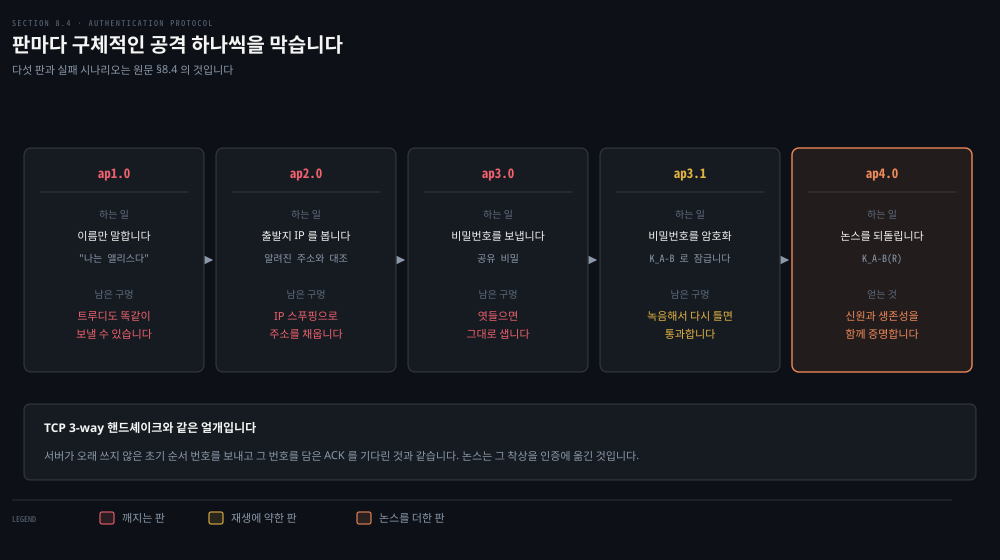
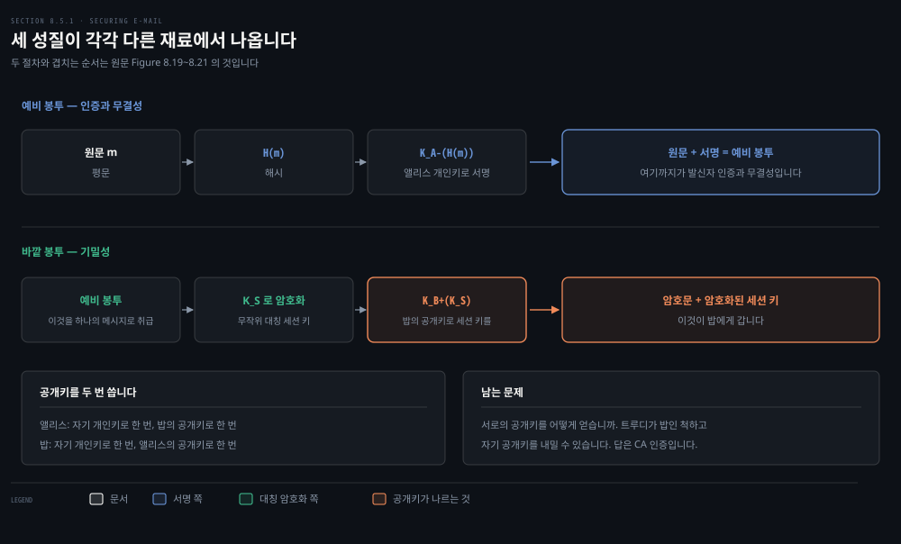
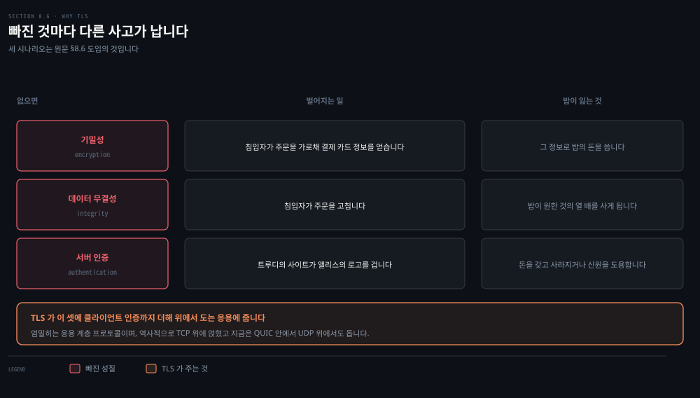
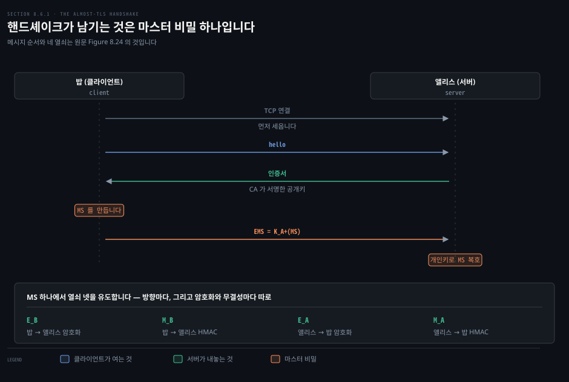
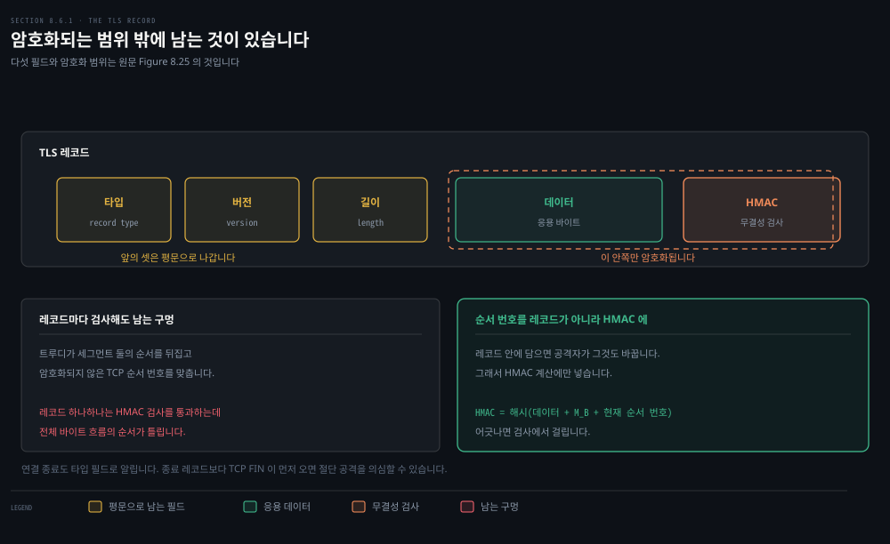
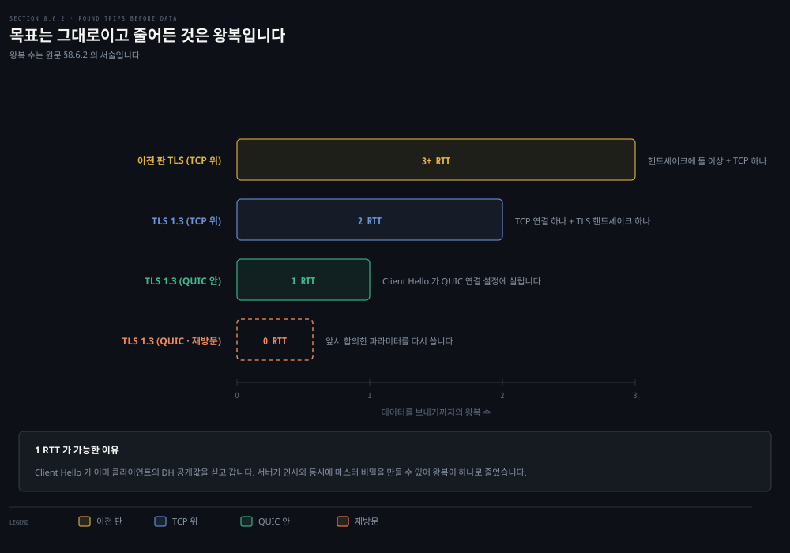

# 살아 있는 상대를 확인하고 메일과 TCP 에 붙입니다

---

> 앞의 두 편이 재료를 만들었습니다. 이 편은 그 재료를 실제 프로토콜에 붙입니다. 붙이는 순간 재료만으로는 안 보이던 요구가 하나 더 드러납니다.

## 핵심 요약

> 이 편이 매달린 하나의 생각은 **"맞는 사람이다"와 "지금 거기 있다"가 다른 요구**라는 것입니다.

서명을 검증했다고 상대가 지금 거기 있는 것은 아닙니다. 어제 오간 메시지를 그대로 다시 틀어도 검증은 통과하기 때문입니다. 그래서 인증 프로토콜은 한 번 쓰고 버리는 값을 하나 섞습니다. 이 값이 논스입니다.

같은 요구가 층을 올라가며 되풀이됩니다. 메일에서는 세션 키와 서명을 겹쳐 기밀성과 인증과 무결성을 한 봉투에 담고, TCP 위에서는 그 봉투를 레코드로 잘라 순서 번호까지 해시에 넣습니다. **한 겹씩 쌓이는 이유가 매번 구체적인 공격 하나**입니다.

마지막 절은 그 쌓기가 거꾸로 줄어드는 대목을 봅니다. TLS 1.3 은 왕복을 하나로 줄였고, QUIC 안에서는 아예 0 이 될 수 있습니다.

## 학습 목표

> 이 편을 읽고 나면 아래 다섯 가지를 스스로 해낼 수 있습니다.

1. 인증 프로토콜 ap1.0 부터 ap4.0 까지의 실패 시나리오를 각각 대고, 다음 판이 무엇을 고쳤는지 말할 수 있습니다.
2. 논스가 무엇을 막는지 설명하고, TCP 3-way 핸드셰이크와 같은 얼개임을 짚을 수 있습니다.
3. 안전한 메일이 기밀성·발신자 인증·무결성을 어떤 순서로 겹쳐 얻는지 그릴 수 있습니다.
4. almost-TLS 의 세 국면을 대고, 레코드로 자르는 이유와 순서 번호가 막는 공격을 설명할 수 있습니다.
5. TLS 1.3 이 왕복을 줄인 방법과 QUIC 에서 0-RTT 가 가능한 조건을 말할 수 있습니다.

## 1. 살아 있다는 것을 어떻게 증명합니까

> 종단 인증은 한 개체가 다른 개체에게 자기 신원을 증명하는 일입니다. 원문은 그 프로토콜을 다섯 번 다시 짓습니다.

### 풀려는 문제

사람끼리는 얼굴을 알아보고 목소리를 알아듣고 여권 사진과 대조해 서로를 인증합니다. 망에서는 그런 생체 정보를 쓸 수 없습니다. 게다가 실제로 서로를 인증해야 하는 것은 **라우터나 클라이언트·서버 프로세스**인 경우가 많습니다.

그래서 인증은 오로지 **주고받는 메시지와 데이터만으로** 이루어져야 합니다. 인증 프로토콜은 대개 다른 프로토콜보다 먼저 돌아 서로의 신원을 확인하고, 그 뒤에야 본래의 일이 시작됩니다.

앞 편의 서명과 다른 점이 하나 있습니다. 서명은 **과거에 받은 메시지**가 정말 그 사람에게서 왔는지를 증명합니다. 여기서 다루는 것은 **지금 이 순간 살아 있는 상대**를 확인하는 일입니다. 미묘하지만 다른 문제입니다.

### 다섯 판

3장에서 신뢰적 데이터 전송 프로토콜을 여러 판으로 지어 올렸던 것과 같은 방식으로, 원문은 인증 프로토콜을 `ap` 라 부르며 판마다 구멍을 뚫습니다.

- **ap1.0**: 앨리스가 "나는 앨리스다"라는 메시지를 보냅니다. 구멍이 뻔합니다. 밥은 그 말을 보낸 사람이 정말 앨리스인지 알 길이 없습니다. 트루디도 똑같이 보낼 수 있습니다.
- **ap2.0**: 앨리스가 늘 같은 주소에서 통신한다면, 밥이 IP 데이터그램의 출발지 주소를 앨리스의 알려진 주소와 맞춰 봅니다. 망에 어두운 침입자는 막히지만 그뿐입니다. **IP 스푸핑**으로 출발지 주소를 원하는 값으로 채워 보낼 수 있기 때문입니다. 첫 홉 라우터가 자기 주소를 담은 데이터그램만 전달하도록 설정하면 막히지만, 그 설정이 어디서나 배치돼 있지도 강제되지도 않습니다.
- **ap3.0**: 고전적인 방법인 비밀번호를 씁니다. 지메일과 페이스북과 telnet 과 FTP 가 이 방식을 씁니다. 구멍이 분명합니다. 트루디가 엿들으면 비밀번호를 알게 됩니다. telnet 으로 로그인하면 비밀번호가 암호화 없이 서버로 갑니다.
- **ap3.1**: 비밀번호를 암호화합니다. 앨리스와 밥이 대칭 비밀 열쇠를 공유한다고 두면, 앨리스는 비밀번호를 암호화해 보내고 밥이 복호해 확인합니다. 트루디가 비밀번호를 알아내는 것은 막힙니다. 그런데 **재생 공격**이 남습니다. 트루디는 암호화된 비밀번호를 녹음해 두었다가 그대로 다시 틀기만 하면 됩니다.
- **ap4.0**: 밥이 문제를 겪은 이유는 **원래의 인증과 나중의 재생을 구별하지 못한다**는 데 있었습니다. 앨리스가 지금 저쪽 끝에 있는지, 아니면 예전 인증의 녹음인지 가릴 수 없었습니다.

### 논스

**논스**(nonce)는 프로토콜이 평생에 딱 한 번만 쓰는 수입니다. 한 번 쓴 논스는 다시 쓰지 않습니다.

1. 앨리스가 "나는 앨리스다"를 보냅니다.
2. 밥이 논스 `R` 을 골라 앨리스에게 보냅니다.
3. 앨리스가 공유 대칭 열쇠 `K_A-B` 로 논스를 암호화해 `K_A-B(R)` 을 돌려보냅니다.
4. 밥이 복호해 자기가 보낸 논스와 같으면 앨리스를 인증합니다.

밥이 확신할 수 있는 것이 둘입니다. 앨리스가 **자기가 말하는 그 사람**이라는 것은 `R` 을 암호화하는 데 필요한 비밀 열쇠를 알기 때문이고, **살아 있다**는 것은 밥이 방금 만든 논스를 암호화했기 때문입니다.

이 얼개를 이미 본 적이 있습니다. TCP 3-way 핸드셰이크에서 서버가 클라이언트의 SYN 이 옛 재전송인지 가려야 했을 때, 오래 쓰지 않은 초기 순서 번호를 보내고 그 번호를 담은 ACK 를 기다렸습니다. **같은 착상을 인증에 옮긴 것**입니다.

> **노트의 읽기**: 원문의 사다리는 ap4.0 에서 멈춥니다. 대칭키 대신 공개키로 같은 일을 할 수 있는지는 장 끝의 연습 문제로 넘겼습니다. 8판까지 본문에 있던 ap5.0 이 9판에서는 본문에 없으므로, 다른 자료에서 ap5.0 을 보더라도 이 판의 본문에서는 찾을 수 없습니다.

## 2. 안전한 메일을 한 겹씩 조립합니다

> 원하는 성질을 한꺼번에 만들지 않습니다. 하나씩 얻고 마지막에 합칩니다.

### 풀려는 문제

앨리스가 밥에게 메일을 보내고 트루디가 끼어들려 합니다. 시스템을 설계하기 전에 **무엇이 필요한지**부터 정해야 합니다. 원문이 꼽는 것은 넷입니다.

- **기밀성**: 트루디가 앨리스의 메일을 읽지 못해야 합니다.
- **발신자 인증**: 밥이 받은 메시지가 트루디가 아니라 앨리스에게서 왔음을 확신해야 합니다.
- **메시지 무결성**: 오는 길에 내용이 바뀌지 않았음이 보장돼야 합니다.
- **수신자 인증**: 앨리스가 밥인 척하는 누군가가 아니라 진짜 밥에게 보내고 있음을 확인해야 합니다.

### 기밀성부터

가장 단순한 방법은 대칭키로 암호화하는 것입니다. 열쇠가 충분히 길고 앨리스와 밥만 갖고 있으면 다른 누구도 읽기가 대단히 어렵습니다. 그런데 앞 편에서 본 곤란이 그대로 남습니다. **열쇠를 둘만 갖도록 배포하는 일**입니다.

그래서 공개키로 갑니다. 밥이 공개키를 공개해 두고 앨리스가 그것으로 암호화해 보냅니다. 이 방법도 문제가 하나 있습니다. **공개키 암호화는 긴 메시지에 비효율적**입니다.

효율 문제를 넘기려고 세션 키를 씁니다. 앨리스가 하는 일은 다섯입니다.

1. 무작위 대칭 세션 키 `K_S` 를 고릅니다.
2. 메시지 `m` 을 그 대칭 키로 암호화합니다.
3. 대칭 키를 밥의 공개키 `K_B+` 로 암호화합니다.
4. 암호화된 메시지와 암호화된 대칭 키를 이어 붙여 하나의 봉투를 만듭니다.
5. 봉투를 밥의 메일 주소로 보냅니다.

밥은 개인키로 세션 키를 얻고, 그 세션 키로 메시지를 복호합니다.

### 인증과 무결성

이번에는 기밀성을 잠시 잊고 발신자 인증과 무결성만 봅니다. 앨리스가 하는 일은 넷입니다.

1. 메시지 `m` 에 해시 함수 `H` 를 적용해 다이제스트를 얻습니다.
2. 그 결과를 자기 개인키 `K_A-` 로 서명합니다.
3. 암호화하지 않은 원문과 서명을 이어 붙여 봉투를 만듭니다.
4. 봉투를 보냅니다.

밥은 앨리스의 공개키를 서명된 다이제스트에 적용하고, 받은 메시지에 자기가 해시를 적용해 둘을 비교합니다. 같으면 앨리스에게서 왔고 바뀌지 않았음을 꽤 확신할 수 있습니다.

### 셋을 다 얻으려면 겹칩니다

셋을 다 제공하려면 두 절차를 **겹쳐** 씁니다. 앨리스는 먼저 원문과 서명한 해시로 예비 봉투를 만들고, **그 예비 봉투를 하나의 메시지로 취급해** 앞의 세션 키 절차에 다시 통과시킵니다.

여기서 눈여겨볼 것이 있습니다. **앨리스가 공개키 암호를 두 번 씁니다.** 한 번은 자기 개인키로, 한 번은 밥의 공개키로입니다. 밥도 마찬가지로 두 번 씁니다. 자기 개인키로 한 번, 앨리스의 공개키로 한 번입니다.

남는 문제가 하나 있습니다. 이 설계는 앨리스가 밥의 공개키를, 밥이 앨리스의 공개키를 얻을 것을 요구합니다. **그 배포가 만만치 않습니다.** 트루디가 밥인 척하고 자기 공개키를 밥의 것이라며 앨리스에게 줄 수 있습니다. 앞 편에서 본 대로 답은 CA 로 공개키를 인증하는 것입니다.

### PGP

1991년에 필 짐머만이 만든 **PGP**(Pretty Good Privacy)가 이 설계의 좋은 예입니다. PGP 의 설계는 본질적으로 위에서 겹쳐 만든 그림과 같습니다. 판에 따라 다이제스트에 MD5 나 SHA 를, 대칭키 암호에 CAST 나 triple-DES 나 IDEA 를, 공개키 암호에 RSA 를 씁니다.

## 3. TLS 가 없으면 무엇이 무너집니까

> 한 층 내려갑니다. 같은 재료로 TCP 와 HTTP 를 지키는 것이 TLS 입니다.

### 풀려는 문제

밥이 앨리스 주식회사의 향수 판매 사이트에서 주문을 넣습니다. 향수 종류와 수량, 주소, 결제 카드 번호를 적고 제출을 누릅니다. 아무 보안 조치가 없으면 밥은 놀랄 일을 겪습니다.

- **기밀성이 없으면**: 침입자가 주문을 가로채 결제 카드 정보를 얻습니다. 그 정보로 밥의 돈을 씁니다.
- **데이터 무결성이 없으면**: 침입자가 주문을 고쳐 밥이 원한 것의 열 배를 사게 만듭니다.
- **서버 인증이 없으면**: 트루디가 운영하는 사이트가 앨리스 주식회사의 로고를 걸고 있을 수 있습니다. 주문을 받은 뒤 돈을 갖고 사라지거나, 이름과 주소와 카드 번호를 모아 신원 도용을 합니다.

TLS 는 위에서 도는 응용에 기밀성·데이터 무결성·서버 인증·클라이언트 인증을 줍니다.

### TLS 가 어디에 있습니까

엄밀히 말하면 TLS 는 **응용 계층 프로토콜**이며 TLS 를 쓰는 클라이언트와 서버 프로세스 사이에 보안 서비스를 제공합니다. 역사적으로는 TCP 위에 구현돼 TCP 가 주는 프로세스 대 프로세스 서비스를 지켰고, 지금은 HTTP 3 을 위한 QUIC 의 일부로 **UDP 위에서도** 돕니다.

뿌리는 넷스케이프를 위해 개발된 SSL 입니다. TLS 1.0 을 규정한 RFC 2246 이 *"이 프로토콜과 SSL 3.0 의 차이는 극적이지 않다"* 고 적을 정도입니다. 배치는 광범위합니다. 모든 주요 브라우저와 웹 서버가 지원하고 HTTP 3 에서 기본으로 쓰이며, 해마다 수천억 달러가 TLS 위에서 오갑니다. URL 이 `http:` 가 아니라 `https:` 로 시작하면 TLS 가 쓰이는 것입니다. 현행 판은 **TLS 1.3** 이고 RFC 8446 이 규정합니다.

## 4. almost-TLS 의 세 국면

> 진짜 TLS 로 바로 들어가지 않습니다. 단순화한 판으로 왜와 어떻게를 먼저 잡습니다.

### 풀려는 문제

TLS 의 세부는 많습니다. 세부부터 읽으면 무엇을 위한 장치인지 놓칩니다. 원문은 단순화한 **almost-TLS** 를 먼저 세우고 다음 절에서 진짜를 채웁니다. almost-TLS 도 진짜 TLS 도 국면이 셋입니다.

### 핸드셰이크

이 국면에서 밥(클라이언트)이 해야 할 일이 셋입니다.

1. 앨리스(서버)와 TCP 연결을 맺습니다.
2. 앨리스가 정말 앨리스인지 확인합니다.
3. 마스터 비밀 열쇠를 보냅니다.

TCP 연결이 서면 밥이 hello 를 보냅니다. 앨리스가 **자기 인증서**로 응답하는데 그 안에 공개키가 들어 있습니다. 인증서가 CA 의 인증을 받았으므로 밥은 그 공개키가 앨리스의 것임을 확신합니다. 밥은 이 TLS 세션에서만 쓸 **마스터 비밀**(MS)을 만들고, 앨리스의 공개키로 암호화해 EMS 를 만들어 보냅니다. 앨리스가 개인키로 복호해 MS 를 얻습니다.

이 국면이 끝나면 밥과 앨리스만이 이 세션의 마스터 비밀을 압니다.

### 열쇠 유도

원칙적으로는 MS 를 그대로 세션 키로 써도 됩니다. 그런데 **양쪽이 서로 다른 열쇠를 쓰고, 암호화와 무결성 검사에도 다른 열쇠를 쓰는 편**이 대체로 더 안전합니다. 그래서 MS 에서 넷을 만듭니다.

| 열쇠 | 쓰임 |
|------|------|
| `E_B` | 밥에서 앨리스로 가는 데이터의 암호화 |
| `M_B` | 밥에서 앨리스로 가는 데이터의 HMAC |
| `E_A` | 앨리스에서 밥으로 가는 데이터의 암호화 |
| `M_A` | 앨리스에서 밥으로 가는 데이터의 HMAC |

MS 를 넷으로 잘라 쓰는 식으로도 되지만 실제 TLS 는 조금 더 복잡합니다.

### 데이터 전송

TCP 는 바이트 흐름 프로토콜입니다. 응용 데이터를 흐르는 대로 암호화해 TCP 에 넘기는 방법이 자연스러워 보입니다. 그런데 그러면 **무결성 검사용 HMAC 을 어디에 둡니까.** 세션이 끝날 때까지 기다렸다가 전체 무결성을 검사할 수는 없습니다.

그래서 TLS 는 데이터 흐름을 **레코드**로 자릅니다. 레코드마다 HMAC 을 붙이고, 레코드와 HMAC 을 함께 암호화해 TCP 로 넘깁니다.

## 5. 레코드를 자르는 것만으로는 부족합니다

> 레코드마다 검사해도 레코드끼리의 순서는 지켜지지 않습니다. 그 구멍을 순서 번호가 막습니다.

### 풀려는 문제

트루디가 중간에서 TCP 세그먼트를 넣고 지우고 바꿀 수 있다고 합시다. 트루디가 밥이 보낸 세그먼트 둘을 잡아 **순서를 뒤집고**, 암호화되지 않은 TCP 순서 번호를 맞춰 앨리스에게 보냅니다. 앨리스 쪽에서 벌어지는 일은 이렇습니다.

1. TCP 는 아무 문제 없다고 보고 두 레코드를 TLS 부계층에 넘깁니다.
2. TLS 가 두 레코드를 복호합니다.
3. TLS 가 각 레코드의 HMAC 으로 무결성을 검증합니다. **통과합니다.**
4. 복호된 바이트 흐름이 응용 계층으로 올라가는데, 레코드가 뒤집혔으므로 **전체 바이트 흐름의 순서가 틀립니다.**

레코드 하나하나는 멀쩡한데 전체가 틀어집니다.

### 순서 번호를 해시에 넣습니다

해법은 순서 번호입니다. 다만 두는 자리가 특이합니다. 밥은 0 에서 시작해 레코드마다 올리는 순서 번호 계수기를 둡니다. 그런데 **순서 번호를 레코드 안에 담지 않습니다.** 대신 HMAC 을 계산할 때 순서 번호를 함께 넣습니다.

그래서 HMAC 은 데이터와 HMAC 열쇠 `M_B` 와 **현재 순서 번호**의 해시가 됩니다. 앨리스는 밥의 순서 번호를 따라가며 같은 번호를 넣어 검증합니다. 순서를 바꾸거나 재생하면 HMAC 이 맞지 않습니다.

> **노트의 읽기**: "담으면 바꿔치기당하니까 안 담는다"는 설명은 이유로 서기 어렵습니다. 담아 놓고 그 번호까지 HMAC 으로 인증하면 바꿔치기는 그대로 걸리기 때문입니다. 실제로 그렇게 하는 프로토콜이 있어서, UDP 위에 얹히는 DTLS 는 순서 번호를 레코드에 **실어 보내고** 인증합니다. 순서가 뒤바뀌고 유실되는 바닥 위에서는 받는 쪽이 번호를 스스로 셀 수 없기 때문입니다. TLS 가 안 담는 진짜 이유는 **TCP 가 이미 순서대로 올려 준다**는 데 있습니다. 양쪽이 각자 세면 어긋날 일이 없으니 굳이 바이트를 쓸 까닭이 없습니다. 보내지 않는 것은 안전 때문이 아니라 **아낄 수 있어서**입니다.

### 레코드 형식

almost-TLS 레코드는 다섯 자리로 이루어집니다. 타입·버전·길이·데이터·HMAC 입니다. **앞의 셋은 암호화되지 않습니다.**

- **타입**: 이 레코드가 핸드셰이크 메시지인지 응용 데이터인지 표시합니다. TLS 연결을 닫는 데도 쓰입니다.
- **길이**: 받는 쪽 TLS 가 들어오는 TCP 바이트 흐름에서 레코드를 잘라 내는 데 씁니다.

### 연결을 닫는 것도 프로토콜의 일입니다

밥이 그냥 TCP FIN 을 보내 세션을 끝내면 어떻게 됩니까. **절단 공격**의 자리가 열립니다. 트루디가 중간에서 TCP FIN 으로 세션을 일찍 끝내면, 앨리스는 밥의 데이터를 다 받았다고 여기지만 실제로는 일부만 받은 것입니다.

그래서 타입 필드에 **이 레코드가 세션을 끝내는 것인지**를 표시합니다. 앨리스가 종료 TLS 레코드보다 먼저 TCP FIN 을 받으면 뭔가 이상하다는 것을 압니다.

## 6. TLS 1.3 이 줄인 것

> 판이 올라가며 바뀐 것은 목표가 아니라 왕복 횟수와 알고리즘 목록입니다.

### 풀려는 문제

TLS 는 1.0 에서 1.3 까지 여러 번 바뀌었습니다. 일부는 이전 판에서 발견된 보안 결함 때문이거나 새로운 모범 사례를 반영하려는 것이었고, 다른 일부는 **성능** 때문입니다. 특히 TLS 연결을 세우는 데 필요한 왕복 횟수를 줄이려는 것입니다. 2장에서 HTTP 의 진화를 볼 때 만났던 주제와 같습니다.

바뀌지 않은 것도 있습니다. TLS 의 목표는 그대로 기밀성·데이터 무결성·인증입니다.

### 핸드셰이크 세 메시지

- **Client Hello**: TLS 판 번호(1.3), 세 가지 암호 스위트 중 하나와 파라미터, 그리고 재생 공격을 막을 논스를 담습니다. 암호 스위트를 이루는 것은 둘입니다. 마스터 비밀을 만들 **열쇠 교환 기법**과 그 뒤 추가 열쇠를 유도할 SHA 해시 알고리즘이 하나이고, 데이터 전송에 쓸 **AEAD** 알고리즘이 다른 하나입니다. AEAD 는 암호화와 무결성을 따로 두지 않고 하나로 제공하며 암호화에는 AES 나 ChaCha20 을 씁니다. 마스터 비밀 생성에는 어느 경우든 **디피-헬먼의 변형**이 쓰입니다.
- **Server Hello, Finished**: 서버가 인사하자마자 곧바로 작별합니다. Server Hello 에 서버의 인증서와 고른 암호 스위트와 서버가 만든 논스가 들어갑니다. Client Hello 에 이미 클라이언트의 DH 공개값이 있으므로, 서버는 자기 DH 공개·개인값을 만들고 클라이언트의 공개값과 자기 개인값으로 공유 마스터 비밀을 만듭니다. 자기 DH 공개값은 이 메시지에 실어 보냅니다.
- **Client Finished**: 클라이언트가 서명과 인증서를 검증하고, 자기 DH 개인값과 받은 서버 DH 공개값으로 마스터 비밀 사본을 만듭니다. Finished 메시지는 Client Hello 와 Server Hello 의 서명된 해시를 담아 그 메시지들이 제대로 도착했고 손대지 않았음을 검증합니다.

> **원문 정오**: 이 세 줄이 TLS 1.3 을 설명한다면서 **1.2 시절의 얼개를 그대로 옮겨 적습니다**(595~596쪽). 세 자리입니다.
>
> 첫째, 암호 스위트를 *"열쇠 교환 기법과 SHA 해시가 하나이고 AEAD 가 다른 하나"* 라 쪼갭니다. 1.3 은 그 반대로 갔습니다. RFC 8446 은 바뀐 점을 *"The cipher suite concept has been changed to **separate the authentication and key exchange mechanisms from** the record protection algorithm … and a hash"* 라 적고, 부록 B.4 에서 *"A symmetric cipher suite defines the pair of the AEAD algorithm and hash algorithm to be used with HKDF"* 라 다시 못박습니다. 열쇠 교환은 `key_share` 와 `supported_groups` 확장으로 따로 정합니다. "세 가지 중 하나"라는 개수도 맞지 않아, 정의된 스위트는 `{0x13,0x01}` 부터 `{0x13,0x05}` 까지 **다섯**이고 클라이언트는 하나를 고르는 것이 아니라 **지원 목록을 제안**합니다.
>
> 둘째, *"Server Hello 에 서버의 인증서가 들어간다"* 고 적습니다. 1.3 에서 인증서는 ServerHello 뒤에 오는 **별개의 `Certificate` 메시지**이고, RFC 8446 그림 1 이 그것을 중괄호로 감싸 **핸드셰이크 열쇠로 암호화된다**고 표시합니다. 인증서를 평문으로 흘리지 않게 된 것이 1.3 의 눈에 띄는 변화라서, 이 자리를 1.2 처럼 읽으면 그 변화가 통째로 지워집니다.
>
> 셋째, *"Finished 메시지는 두 Hello 의 서명된 해시를 담는다"* 고 적습니다. Finished 가 담는 것은 서명이 아니라 **HMAC** 입니다. RFC 8446 §4.4.4 가 `verify_data = HMAC(finished_key, Transcript-Hash(…))` 라 규정합니다. 전자서명을 지는 것은 그 앞의 `CertificateVerify` 이고 둘은 다른 메시지입니다.

Client Finished 를 보내고 나면 클라이언트는 곧바로 응용 메시지를 보낼 수 있습니다. **TLS 1.3 은 왕복 하나면 됩니다.** 이전 판은 전체 핸드셰이크를 할 때 둘 이상이 필요했습니다.

### TCP 위인가 QUIC 안인가

| 얹는 자리 | 데이터 전까지 왕복 | 이유 |
|---------|-----------------|------|
| TCP 위 | 2 | TCP 연결을 먼저 세우고 그다음 TLS 핸드셰이크 |
| QUIC 안 | 1 | TLS 1.3 이 QUIC 위가 아니라 **안에 통합**돼 Client Hello 가 QUIC 연결 설정 메시지의 일부로 UDP 로 나갑니다 |
| QUIC 안 (재방문) | 0 | 이전에 통신하며 다음 연결에 쓸 TLS 파라미터를 합의해 두었을 때 |

> **원문 정오**: 이 절에서 판 번호가 **세 번 뒤집혀 적힙니다**(595~596쪽). 소제목은 "TLS 1.3 Handshake" 인데 바로 다음 문장이 *"the goal of the **TLS 3.1** handshake"* 라 적고, 이어서 *"the common case **TLS 3.1** handshake"*, *"The **TLS 3.1** server says hello"* 로 두 번 더 나옵니다. 같은 장에서 `TLS 1.3` 은 11번 제대로 쓰였으므로 자릿수를 뒤집은 오식입니다.

> **원문 정오**: 같은 절이 *"TLS 1.3 을 TCP 위에서 돌릴 때는 **the TCP handshake** 가 진행되기 전에 TCP 연결이 먼저 서야 한다"* 고 적습니다(596쪽). 그대로 읽으면 "TCP 핸드셰이크 전에 TCP 연결을 세워야 한다"가 되어 순환합니다. 뒤에 와야 하는 것은 **TLS 핸드셰이크**입니다.

> **원문 정오**: 0-RTT 를 설명하며 *"클라이언트가 곧바로 TLS 로 보호된 데이터를 **a client** 에게 보내기 시작할 수 있다"* 고 적습니다(597쪽). 받는 쪽은 **서버**입니다.

### 논스는 무엇을 더 막습니까

순서 번호가 있는데 왜 논스까지 둡니까. 순서 번호는 **세션 안에서 개별 패킷을 재생하는 것**을 막습니다. 막지 못하는 것이 **연결 재생 공격**입니다.

트루디가 앨리스와 밥 사이의 메시지를 전부 엿듣습니다. 다음 날 트루디가 밥인 척하고 어제 밥이 보낸 것과 **정확히 같은 순서의 메시지**를 앨리스에게 보냅니다. 논스가 없으면 앨리스는 어제와 똑같은 메시지를 답하고, 받는 메시지마다 무결성 검사를 통과하므로 이상을 눈치채지 못합니다. 앨리스가 전자상거래 서버라면 밥이 똑같은 것을 한 번 더 주문했다고 여깁니다.

논스를 넣으면 세션마다 다른 논스가 쓰이므로 암호화 열쇠가 달라집니다. 어제 녹음한 TLS 레코드를 다시 틀면 무결성 검사에서 걸립니다.

## 결정 치트시트

> 이 편의 판단 기준을 한 표에 모았습니다.

| 상황 | 판단 | 근거 |
|------|------|------|
| 출발지 IP 로 인증할지 정할 때 | 쓰지 않습니다 | IP 스푸핑으로 원하는 주소를 채울 수 있습니다 |
| 비밀번호를 암호화만 할 때 | 부족합니다 | 암호화된 것을 그대로 다시 틀면 통과합니다 |
| 살아 있음을 확인할 때 | 논스를 씁니다 | 방금 만든 값을 되돌려 받아야 지금이 증명됩니다 |
| 긴 메일을 공개키로 보낼 때 | 세션 키를 겹칩니다 | 공개키 암호는 긴 메시지에 비효율적입니다 |
| 무결성 검사를 어디서 할지 | 레코드마다 합니다 | 세션 끝까지 기다릴 수 없습니다 |
| 레코드 순서를 지킬 때 | 순서 번호를 HMAC 에 넣습니다 | TCP 가 순서를 지켜 주므로 양쪽이 각자 세면 됩니다 |
| 연결을 끝낼 때 | 종료를 타입 필드로 알립니다 | TCP FIN 만으로는 절단 공격을 못 가립니다 |

## 심화 학습

> 책 밖 보강입니다. 원문이 다루지 않는 자리만 적습니다.

### 논스와 재생 방지는 백엔드에서도 같은 모양입니다

이 편의 논스는 웹 인증에서 그대로 되풀이됩니다. 서버가 예측 불가능한 값을 내려보내고 클라이언트가 그것을 되돌려야 통과시키는 구조입니다. Spring Security 의 CSRF 토큰이 같은 얼개이고, 결제 API 의 멱등성 키도 "같은 요청을 두 번 받아도 한 번만 처리한다"는 같은 문제를 다룹니다.

붙이는 자리가 다르면 막는 것도 달라집니다. **순서 번호는 세션 안의 재생을, 논스는 세션 자체의 재생을 막습니다.** 이 구분을 손에 쥐고 있으면 "토큰을 어디까지 유효하게 둘 것인가"라는 설계 질문이 선명해집니다.

### almost-TLS 와 진짜 TLS 의 차이를 한 줄로

원문이 마지막에 한 줄로 정리합니다. TLS 1.3 의 레코드는 almost-TLS 레코드와 형식이 같되 **명시적 HMAC 이 필요 없습니다.** AEAD 알고리즘이 기밀성과 무결성을 함께 제공하기 때문입니다. 5절에서 따로 두었던 두 열쇠(`E`, `M`)가 1.3 에서는 한 알고리즘 안으로 들어간 셈입니다.

> **노트의 읽기**: "HMAC 만 빠졌다"는 정리는 배우는 순서로는 옳지만 실물 레코드와는 한 겹 어긋납니다. 1.3 은 레코드의 **타입 필드마저 암호문 안으로 넣었습니다.** 바깥에 노출되는 타입은 언제나 `application_data` 로 위장하고, 진짜 타입은 평문 뒤에 한 바이트로 붙어 함께 암호화됩니다. 그 뒤에 길이를 감추기 위한 `0` 채우기를 얼마든지 덧댈 수 있고, 마지막에 AEAD 인증 태그가 붙습니다. 무결성 값이 사라진 것이 아니라 **자리를 옮겨 태그가 된 것**이고, 덤으로 무엇이 오가는지까지 가려집니다.

## 면접 대비

> 이 편에서 실제로 물어보기 좋은 것만 골랐습니다.

### 한 줄 정의

- **종단 인증**: 한 개체가 망을 통해 다른 개체에게 자기 신원을 증명하는 일입니다.
- **논스**: 프로토콜이 평생 한 번만 쓰는 수입니다.
- **재생 공격**: 녹음한 인증 메시지를 그대로 다시 틀어 통과하는 공격입니다.
- **마스터 비밀**: TLS 핸드셰이크에서 만들어 네 열쇠를 유도하는 씨앗입니다.
- **AEAD**: 암호화와 무결성을 한 알고리즘으로 함께 제공하는 방식입니다.

### 핵심 포인트 세 가지

1. **인증은 신원과 생존성 둘을 확인하는 일입니다.** 서명 검증만으로는 어제의 녹음과 오늘의 상대를 못 가립니다. 논스가 그 구분을 만듭니다.
2. **TLS 는 레코드 단위로 자릅니다.** 흐름 전체를 끝까지 기다려 검사할 수 없기 때문입니다. 그런데 레코드마다 검사하면 레코드끼리의 순서가 비므로, 순서 번호를 HMAC 계산에 넣습니다.
3. **TLS 1.3 의 1-RTT 는 Client Hello 가 DH 공개값을 먼저 싣기 때문입니다.** 서버가 인사와 동시에 마스터 비밀을 만들 수 있어 왕복이 하나로 줄었습니다.

### 자주 묻는 질문

- *비밀번호를 암호화해 보내면 안전하지 않습니까?* 아닙니다. 트루디가 암호문을 녹음해 그대로 다시 보내면 됩니다. 열쇠를 몰라도 통과합니다.
- *TLS 순서 번호는 왜 레코드에 안 담습니까?* TCP 가 이미 순서대로 올려 주므로 양쪽이 각자 세도 어긋나지 않기 때문입니다. 담아서 인증해도 안전에는 문제가 없고, 실제로 UDP 위의 DTLS 는 그렇게 합니다. 아낄 수 있어서 안 보내는 것입니다.
- *논스와 순서 번호는 중복 아닙니까?* 막는 것이 다릅니다. 순서 번호는 진행 중인 세션 안의 개별 패킷 재생을, 논스는 세션 전체를 통째로 재생하는 공격을 막습니다.
- *TLS 는 응용 계층입니까 전송 계층입니까?* 엄밀히는 응용 계층 프로토콜이며 TLS 를 쓰는 프로세스끼리의 보안을 담당합니다. 역사적으로 TCP 위에 얹혔고 지금은 QUIC 안에도 들어갑니다.

## 핵심 개념 체크리스트

- [ ] ap1.0 부터 ap4.0 까지의 실패 시나리오를 각각 댈 수 있습니다.
- [ ] 논스가 무엇을 막는지 설명하고 TCP 3-way 핸드셰이크와 견줄 수 있습니다.
- [ ] 안전한 메일에서 세션 키와 서명이 어떻게 겹쳐지는지 순서대로 적을 수 있습니다.
- [ ] 앨리스가 공개키 암호를 두 번 쓰는 이유를 말할 수 있습니다.
- [ ] almost-TLS 의 세 국면과 유도되는 네 열쇠를 댈 수 있습니다.
- [ ] 레코드로 자르는 이유와 순서 번호를 HMAC 에 넣는 이유를 설명할 수 있습니다.
- [ ] 절단 공격과 그 대책을 말할 수 있습니다.
- [ ] TLS 1.3 의 1-RTT 근거와 QUIC 0-RTT 의 조건을 댈 수 있습니다.

## 관련 문서

- [8장 README](./README.md) — 이 책의 장별 목표와 진행 상태입니다.
- [8장 열쇠를 나눠 갖지 않고 어떻게 비밀을 만드는가](./08-02.%EC%97%B4%EC%87%A0%EB%A5%BC%20%EB%82%98%EB%88%A0%20%EA%B0%96%EC%A7%80%20%EC%95%8A%EA%B3%A0%20%EC%96%B4%EB%96%BB%EA%B2%8C%20%EB%B9%84%EB%B0%80%EC%9D%84%20%EB%A7%8C%EB%93%9C%EB%8A%94%EA%B0%80.md) — 앞 편입니다. 이 편이 붙이는 재료가 거기서 만들어집니다.
- [2장 웹은 어떻게 주고받는가](./02-02.%EC%9B%B9%EC%9D%80%20%EC%96%B4%EB%96%BB%EA%B2%8C%20%EC%A3%BC%EA%B3%A0%EB%B0%9B%EB%8A%94%EA%B0%80.md) — TLS 가 지키는 HTTP 와 왕복 횟수 이야기가 여기서 나옵니다.

## 참고 자료

- 《Computer Networking A Top-Down Approach》 9판, Kurose·Ross, Pearson.
  - §8.4 End-Point Authentication — 책 583–586쪽
  - §8.5 Securing E-Mail — 책 586–591쪽
  - §8.6 Securing TCP and HTTP Connections: TLS — 책 591–598쪽
- TLS 1.3 규격: [RFC 8446](https://www.rfc-editor.org/rfc/rfc8446.txt). 출발지 주소 필터링: [RFC 2827](https://www.rfc-editor.org/rfc/rfc2827.txt). HMAC: [RFC 2104](https://www.rfc-editor.org/rfc/rfc2104.txt).
