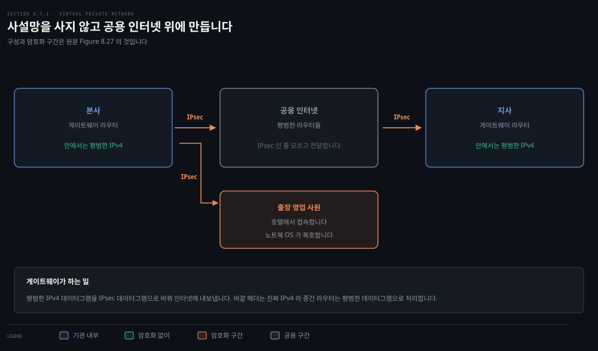
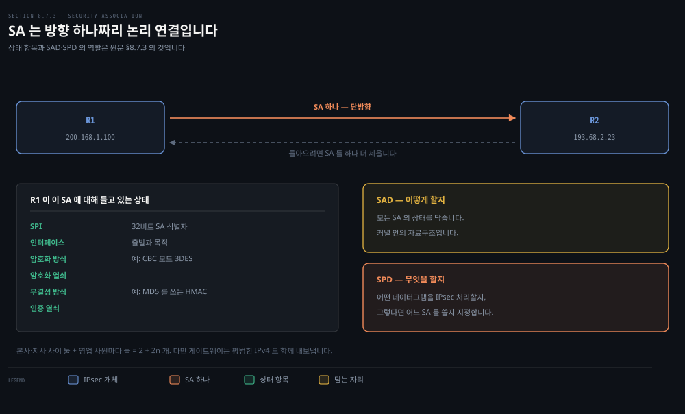
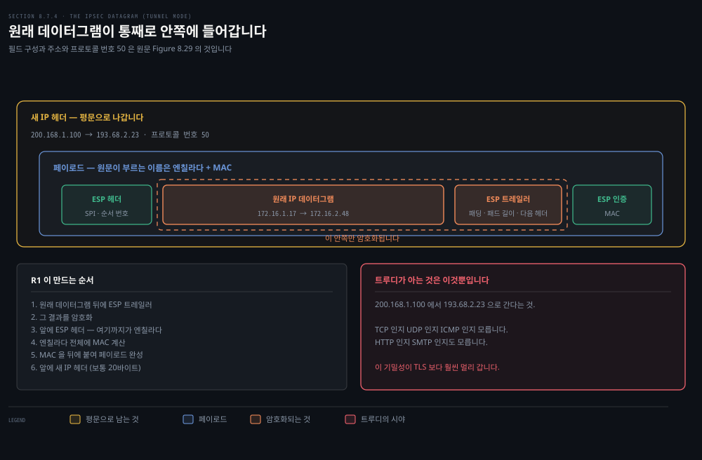
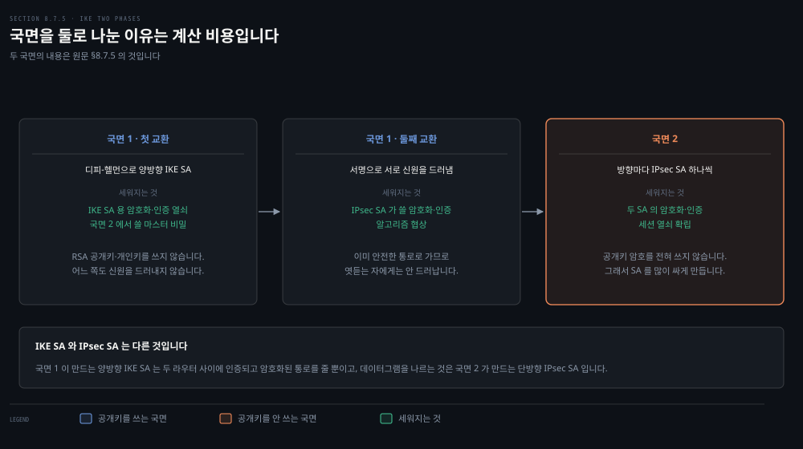
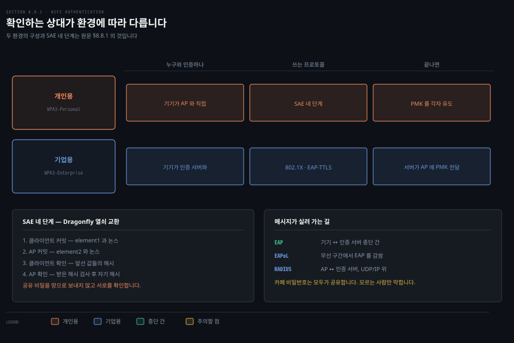
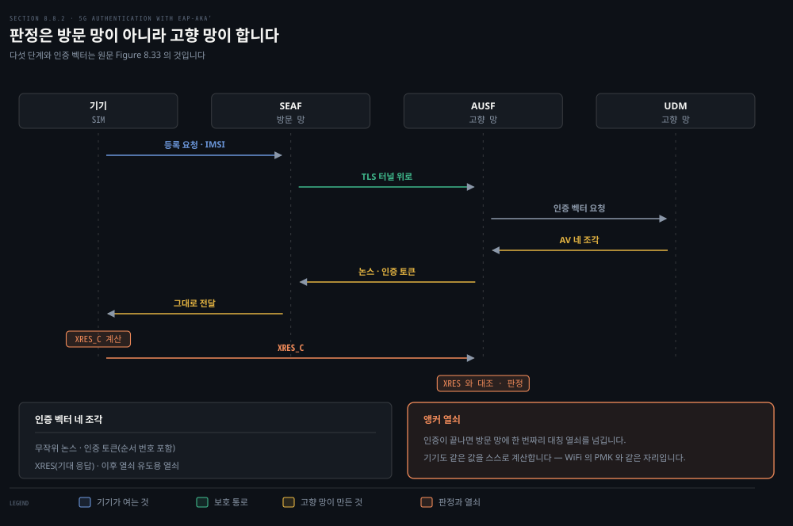

# 망 계층에 통째로 씌우고 무선에 붙입니다

---

> 앞 편은 응용과 전송에 보안을 붙였습니다. 이 편은 한 층 더 내려가 망 계층에 씌우고, 다시 무선 구간으로 올라옵니다. 층이 내려갈수록 가려지는 것이 늘어납니다.

## 핵심 요약

> 이 편이 매달린 하나의 생각은 **어느 층에 붙이느냐가 무엇을 가릴 수 있느냐를 정한다**는 것입니다.

TLS 는 TCP 페이로드를 가립니다. 그래서 어떤 응용인지는 몰라도 어떤 호스트가 어떤 호스트와 말하는지는 그대로 드러납니다. IPsec 은 원래 데이터그램을 통째로 페이로드 안에 넣고 새 IP 헤더를 씌우므로, **출발지와 목적지 주소와 프로토콜 번호까지 가려집니다.** 원문이 이것을 "담요 덮개"라 부릅니다.

무선은 반대 방향의 문제를 냅니다. 전송 범위 안에 수신기만 놓으면 프레임을 주울 수 있습니다. 그래서 붙기 전에 서로를 확인하는 일이 먼저입니다. 그런데 확인할 상대가 자리마다 다릅니다. 개인용 WiFi 에서는 AP 이고 기업용에서는 인증 서버이며, 5G 에서는 **방문한 망이 아니라 고향 망**입니다.

세 자리 모두 재료는 같습니다. 논스와 해시와 대칭 열쇠 유도입니다. 달라지는 것은 **누가 판정하느냐**뿐입니다.

## 학습 목표

> 이 편을 읽고 나면 아래 다섯 가지를 스스로 해낼 수 있습니다.

1. 망 계층 기밀성이 TLS 보다 무엇을 더 가리는지 구체적으로 말할 수 있습니다.
2. 보안 결합(SA)이 무엇이고 왜 방향마다 하나씩 필요한지 설명하고, VPN 의 SA 수를 셀 수 있습니다.
3. 터널 모드 IPsec 데이터그램의 구성 순서를 적고 각 필드가 무엇을 위한 것인지 말할 수 있습니다.
4. WPA3-Personal 의 SAE 네 단계와 기업용 802.1X·EAP-TTLS 의 차이를 설명할 수 있습니다.
5. 5G 인증에서 판정이 왜 고향 망에서 이루어지는지 대고, 인증 벡터 네 조각을 댈 수 있습니다.

## 1. 망 계층에 씌우면 무엇이 달라집니까

> 망 계층 기밀성은 두 개체 사이의 모든 데이터그램 페이로드를 암호화합니다. 그래서 원문이 이것을 담요 덮개라 부릅니다.

### 풀려는 문제

기관이 여러 지역에 걸쳐 있으면 자기 IP 망을 갖고 싶어집니다. 라우터와 링크와 DNS 를 공용 인터넷과 완전히 분리해 직접 깔면 **사설망**이 됩니다. 그런데 물리 인프라를 사고 설치하고 유지하는 비용이 큽니다.

그래서 오늘날 많은 기관이 공용 인터넷 위에 **VPN** 을 만듭니다. 사무실 간 트래픽을 물리적으로 독립된 망이 아니라 공용 인터넷으로 보내되, 인터넷에 들어가기 전에 암호화합니다.

### 어떻게 도는가

본사에 있는 호스트가 호텔에 있는 영업 사원에게 데이터그램을 보낸다고 합시다.

1. 본사의 게이트웨이 라우터가 평범한 IPv4 데이터그램을 **IPsec 데이터그램으로 바꿉니다.**
2. 그 IPsec 데이터그램에는 전통적인 IPv4 헤더가 붙어 있으므로, 공용 인터넷의 라우터들은 그것을 **평범한 데이터그램으로 처리합니다.**
3. 다만 페이로드에는 IPsec 헤더가 들어 있고 **페이로드가 암호화돼 있습니다.**
4. 영업 사원의 노트북에 닿으면 운영체제가 페이로드를 복호하고 무결성을 확인한 뒤 상위 프로토콜로 올려보냅니다.

본사 안의 호스트 둘이 서로 통신하거나 지사 안의 호스트 둘이 통신할 때는 IPsec 없이 평범한 IPv4 를 씁니다. **공용 인터넷을 지나는 경로일 때만** 암호화합니다.

### 망 계층이 주는 것 넷

망 계층 보안 프로토콜이 줄 수 있는 것은 기밀성만이 아닙니다. IPsec 은 넷을 다 줍니다.

- **기밀성**: 보내는 개체가 페이로드를 암호화합니다. 그 페이로드는 TCP 세그먼트일 수도 UDP 세그먼트일 수도 ICMP 메시지일 수도 있습니다.
- **출발지 인증**: 받는 개체가 데이터그램의 출처를 검증할 수 있습니다.
- **데이터 무결성**: 오는 도중에 손댔는지 확인할 수 있습니다.
- **재생 공격 방지**: 공격자가 끼워 넣은 중복 데이터그램을 탐지할 수 있습니다.

## 2. 방향 하나짜리 논리 연결

> IPsec 데이터그램을 보내기 전에 두 개체가 논리 연결을 하나 세웁니다. 그것이 단방향이라는 점이 이 절의 전부입니다.

### 풀려는 문제

앞 절에서 "라우터가 IPsec 데이터그램으로 바꾼다"고 넘어갔습니다. 그런데 무엇으로 암호화하고 어떤 열쇠를 쓰는지는 어디에 적혀 있습니까. 그 상태를 담는 자리가 있어야 합니다.

### 프로토콜은 둘, 쓰는 것은 하나

IPsec 은 열 개가 넘는 RFC 로 정의된 복잡한 물건입니다. 그중 주된 프로토콜이 둘입니다.

| 프로토콜 | 주는 것 | 실제 |
|---------|--------|------|
| **AH** (Authentication Header) | 출발지 인증 · 데이터 무결성 | 기밀성이 없어 덜 쓰입니다 |
| **ESP** (Encapsulation Security Payload) | 출발지 인증 · 데이터 무결성 · **기밀성** | VPN 에는 기밀성이 결정적이라 훨씬 널리 쓰입니다 |

원문도 복잡함을 덜기 위해 **ESP 만** 다룹니다.

### SA 는 단방향입니다

보내기 전에 두 개체가 망 계층 논리 연결을 세우는데, 이것이 **보안 결합**(Security Association, SA)입니다. SA 는 **단방향**입니다. 양쪽이 서로 보내려면 방향마다 하나씩, 즉 **둘**이 필요합니다.

본사와 지사 사이가 양방향이고 본사와 영업 사원 `n` 명 사이가 양방향이면 SA 는 몇 개입니까. 본사·지사 게이트웨이 사이에 둘, 노트북마다 둘씩이므로 **`2 + 2n` 개**입니다.

여기에 원문이 단서를 답니다. **게이트웨이가 인터넷으로 내보내는 트래픽이 전부 IPsec 인 것은 아닙니다.** 본사의 호스트가 공용 웹 서버에 접속할 수도 있으므로, 게이트웨이는 평범한 IPv4 데이터그램과 IPsec 데이터그램을 **둘 다** 내보냅니다.

### SA 안에 무엇이 있습니까

R1 이 R2 로 가는 SA 하나에 대해 R1 이 들고 있는 상태는 이렇습니다.

- SA 를 가리키는 32비트 식별자인 **SPI**(Security Parameter Index)
- SA 의 출발 인터페이스와 목적 인터페이스
- 쓸 암호화 방식 (예: CBC 모드의 3DES)
- 암호화 열쇠
- 무결성 검사 방식 (예: MD5 를 쓰는 HMAC)
- 인증 열쇠

이 상태를 전부 모아 둔 곳이 **SAD**(Security Association Database)이고, 운영체제 커널 안의 자료구조입니다.

### SAD 만으로는 부족합니다

R1 이 본사 호스트에게서 평범한 데이터그램을 받았을 때, **이것을 IPsec 으로 바꿔야 하는지** 어떻게 압니까. 바꿔야 한다면 SAD 안의 많은 SA 중 어느 것을 써야 합니까.

그래서 자료구조가 하나 더 있습니다. **SPD**(Security Policy Database)는 어떤 데이터그램이 IPsec 처리 대상인지를 출발지 IP·목적지 IP·프로토콜 종류로 지정하고, 대상이라면 어느 SA 를 쓸지도 지정합니다.

**SPD 는 "무엇을" 할지를, SAD 는 "어떻게" 할지를 담습니다.**

## 3. 원래 데이터그램을 통째로 감쌉니다

> 터널 모드는 원래 데이터그램 전체를 페이로드로 밀어 넣고 새 IP 헤더를 씌웁니다. 그래서 주소까지 가려집니다.

### 풀려는 문제

IPsec 에는 패킷 형식이 둘 있습니다. **터널 모드**와 **전송 모드**입니다. 터널 모드가 VPN 에 더 알맞아 훨씬 널리 배치돼 있고, 원문도 터널 모드만 다룹니다.

### 만드는 순서

R1 이 `172.16.1.17` 에서 `172.16.2.48` 로 가는 평범한 IPv4 데이터그램을 받았다고 합시다. R1 이 밟는 순서가 이렇습니다.

1. 원래 IPv4 데이터그램 **뒤에** ESP 트레일러를 붙입니다. 원래 헤더 필드까지 포함한 데이터그램 전체가 대상입니다.
2. SA 가 지정한 알고리즘과 열쇠로 그 결과를 **암호화합니다.**
3. 암호화된 덩어리 **앞에** ESP 헤더를 붙입니다. 여기까지를 원문이 **엔칠라다**라 부릅니다.
4. 엔칠라다 전체에 대해 인증 MAC 을 만듭니다.
5. MAC 을 엔칠라다 **뒤에** 붙여 페이로드를 완성합니다.
6. 마지막으로 고전적인 IPv4 헤더 필드를 갖춘 **새 IP 헤더**(보통 20바이트)를 앞에 붙입니다.

결과는 진짜 IPv4 데이터그램입니다. 다만 페이로드 안에 ESP 헤더와 원래 IP 데이터그램과 ESP 트레일러와 ESP 인증 필드가 들어 있고, **원래 데이터그램과 트레일러는 암호화돼 있습니다.**

### 주소가 둘이 됩니다

원래 데이터그램의 출발지와 목적지는 `172.16.1.17` 과 `172.16.2.48` 입니다. 이 주소들은 페이로드 안에 들어가 **암호화됩니다.**

새 IP 헤더의 주소는 터널 양 끝 라우터 인터페이스인 `200.168.1.100` 과 `193.68.2.23` 입니다. 그리고 새 헤더의 프로토콜 번호는 TCP 도 UDP 도 아닌 **50** 이며, ESP 를 쓰는 IPsec 데이터그램임을 뜻합니다.

### 필드가 하는 일

**ESP 트레일러**는 셋으로 이루어집니다.

- **패딩**: 블록 암호는 메시지가 블록 길이의 정수 배여야 하므로 무의미한 바이트를 채웁니다.
- **패드 길이**: 받는 쪽이 얼마나 걷어 내야 하는지 알려 줍니다.
- **다음 헤더**: 페이로드 데이터의 종류를 알려 줍니다.

**ESP 헤더**는 평문으로 나가며 둘로 이루어집니다. **SPI** 는 받는 쪽에 이 데이터그램이 어느 SA 에 속하는지 알려 주어 SAD 를 색인하게 하고, **순서 번호**는 재생 공격을 막습니다.

### 받는 쪽의 여섯 단계

R2 는 목적지 주소가 자기이므로 처리하고, 프로토콜 필드가 50 이므로 ESP 처리를 적용합니다.

1. SPI 로 어느 SA 인지 알아냅니다.
2. 엔칠라다의 MAC 을 계산해 값이 맞는지 확인합니다. 맞으면 R1 에게서 왔고 손대지 않은 것입니다.
3. 순서 번호로 재생이 아닌지 확인합니다.
4. SA 의 복호 알고리즘과 열쇠로 암호화된 부분을 복호합니다.
5. 패딩을 걷어 내고 원래 데이터그램을 꺼냅니다.
6. 지사 망 쪽으로 전달합니다.

### 트루디가 볼 수 있는 것

중간에 앉은 트루디가 할 수 있는 일을 따져 보면 이 절의 값어치가 드러납니다.

트루디는 원래 데이터그램을 **볼 수 없습니다.** 데이터뿐 아니라 **프로토콜 번호와 출발지 IP 와 목적지 IP 까지** 가려집니다. 트루디가 아는 것은 `200.168.1.100` 에서 `193.68.2.23` 으로 간다는 것뿐입니다. TCP 인지 UDP 인지 ICMP 인지, HTTP 인지 SMTP 인지 알 수 없습니다.

**이 기밀성이 TLS 보다 훨씬 멀리 갑니다.** 나머지 셋도 막힙니다. 비트를 뒤집으면 MAC 검사에서 걸립니다. R1 인 척해도 마찬가지입니다. 순서 번호가 있으므로 재생도 통하지 않습니다.

## 4. 열쇠를 손으로 넣을 수는 없습니다

> 끝점이 둘이면 관리자가 직접 넣어도 됩니다. 수백 수천이면 자동 장치가 필요합니다.

### 풀려는 문제

VPN 의 끝점이 라우터 둘뿐이라면 관리자가 SA 정보를 SAD 에 손으로 넣을 수 있습니다. 그런데 수백 수천 개의 IPsec 라우터와 호스트로 이루어진 큰 VPN 에서는 명백히 비현실적입니다. **SA 를 자동으로 만드는 장치**가 필요하고, 그것이 **IKE**(Internet Key Exchange)입니다.

### TLS 와 닮았지만 국면이 둘입니다

IPsec 개체마다 공개키를 담은 인증서가 있습니다. TLS 처럼 두 개체가 인증서를 교환하고 알고리즘을 협상하며 세션 열쇠 재료를 안전하게 주고받습니다. TLS 와 다른 점은 이 일을 **두 국면**으로 나눈다는 것입니다.

**국면 1** 은 메시지 쌍 두 번의 교환입니다.

- **첫 교환**: 디피-헬먼으로 라우터 사이에 **양방향 IKE SA** 를 만듭니다. 이 IKE SA 는 앞 절의 IPsec SA 와 전혀 다른 것입니다. IKE SA 는 두 라우터 사이에 인증되고 암호화된 통로를 줍니다. 이때 IKE SA 용 암호화·인증 열쇠가 세워지고, 국면 2 에서 IPsec SA 열쇠를 계산할 마스터 비밀도 함께 세워집니다. **이 단계에서는 RSA 공개키와 개인키를 쓰지 않습니다.** 어느 쪽도 개인키로 서명해 신원을 드러내지 않습니다.
- **둘째 교환**: 양쪽이 메시지에 서명해 서로에게 신원을 드러냅니다. 다만 메시지가 이미 안전한 IKE SA 통로로 가므로 **수동적으로 엿듣는 자에게는 신원이 드러나지 않습니다.** 이 단계에서 IPsec SA 가 쓸 암호화·인증 알고리즘을 협상합니다.

**국면 2** 에서 양쪽이 방향마다 SA 를 하나씩 만듭니다. 끝나면 두 SA 의 암호화·인증 세션 열쇠가 양쪽에 세워집니다.

### 왜 둘로 나눕니까

이유는 **계산 비용**입니다. 국면 2 는 공개키 암호를 전혀 쓰지 않으므로, IKE 는 두 IPsec 개체 사이에 **많은 수의 SA 를 적은 비용으로** 만들 수 있습니다.

> **지금은 다릅니다**: 원문은 IKE 를 *"RFC 5996 이 규정한다"* 고 적습니다(604쪽). RFC 5996 은 2010년 9월 판이고 **RFC 7296 (IKEv2, 2014)** 으로 폐기됐습니다. RFC Editor 의 해당 항목이 *"Obsoleted by RFC 7296: Internet Key Exchange Protocol Version 2 (IKEv2)"* 라고 표시합니다. 프로토콜의 얼개는 그대로이므로 본문 설명은 유효하고, 찾아볼 문서 번호만 바뀝니다.

## 5. 무선은 붙기 전에 서로를 확인합니다

> 전송 범위 안에 수신기만 놓으면 프레임이 잡힙니다. 그래서 상호 인증이 먼저입니다.

### 풀려는 문제

무선에서는 공격자가 송신자의 전송 범위 안 아무 데나 수신 장비를 놓기만 하면 프레임을 주울 수 있습니다. 802.11 과 4G·5G 양쪽 모두 그렇습니다. 그래서 802.11 망이 다뤄야 할 관심사가 둘입니다.

- **상호 인증**: 망은 붙으려는 기기의 신원과 접근 권한을 확인하고 싶어 합니다. 기기도 자기가 붙는 망이 정말 붙으려던 그 망인지 확인하고 싶어 합니다. **양방향**이라 상호 인증입니다.
- **암호화**: 프레임이 도청되고 조작될 수 있는 채널로 가므로 링크 수준 프레임을 암호화해야 합니다. 고속으로 해야 하므로 **대칭키**를 쓰고, 기기와 AP 가 그 열쇠를 유도해야 합니다.

인증 방식은 **환경에 따라 갈립니다.** 개인용(집·카페·소규모 사무실)에서는 기기가 AP 와 직접 인증합니다. 기업용에서는 중앙 인증 서버와 인증하고 **AP 는 통과 장치 역할만** 합니다.

### 개인용 — WPA3-Personal 과 SAE

개인용 표준은 **WPA3-Personal** 입니다. WPA3 은 WiFi 얼라이언스가 만든 보안 인증 프로그램이고, 2018년부터 "WiFi certified" 표시를 받으려면 WPA3 을 구현해야 합니다.

WPA3-Personal 은 **비밀번호 기반**입니다. 붙는 기기 전부가 같은 비밀번호를 씁니다. 카페 벽에 붙어 있는 그 비밀번호입니다. 그러니 이 망은 **비밀번호를 모르는 악당에게만** 안전합니다.

쓰는 프로토콜이 **SAE**(Simultaneous Authentication of Equals)이고 네 단계의 Dragonfly 열쇠 교환입니다.

1. **클라이언트 커밋**: 비밀번호로 `element1` 을 만드는데, 그 값에서 비밀번호를 역산할 수 없습니다. 논스 역할을 할 무작위 값도 만들어 함께 보냅니다.
2. **AP 커밋**: AP 는 공유 비밀을 아는 덕에 `element1` 을 만든 쪽도 그것을 안다고 판정합니다. AP 도 `element2` 와 무작위 값을 만들어 보냅니다.
3. **클라이언트 확인**: 기기도 같은 방식으로 AP 가 공유 비밀을 안다고 판정합니다. 재생 공격을 막으려고 공유 비밀과 앞서 오간 값들의 해시를 보냅니다.
4. **AP 확인**: AP 가 받은 해시를 검사하고 자기 해시를 보냅니다.

끝나면 둘은 **공유 비밀을 망으로 보내지 않고도** 서로가 그것을 안다는 것을 확인했습니다. 그다음 공유 비밀과 오간 무작위 값으로 **PMK**(pairwise master key)를 만듭니다. 기기마다 무작위 값이 다르므로 PMK 도 다르고, 붙을 때마다 새로 만들어지므로 **동적 열쇠**라 부르기도 합니다.

### 기업용 — 802.1X 와 EAP-TTLS

기업용은 **IEEE 802.1X** 가 인증 과정을 정의합니다. 그 틀 안에서 **EAP**(Extensible Authentication Protocol)가 인증을 제공합니다. 이름 그대로 확장 가능해서 표준화된 EAP 방법이 40가지가 넘습니다. 802.1X 는 그중 어느 것을 쓸지 정하지 않습니다. 학계에서 익숙한 것이 **EAP-TTLS** 입니다.

큰 그림은 이렇습니다. 비컨과 WLAN 결합이 끝나면 인증 자체는 **기기와 인증 서버 사이에서** 일어나고 AP 는 통과 장치입니다. EAP-TTLS 는 기기와 인증 서버 사이에 만든 **TLS 터널**에 크게 기댑니다.

- 1~3 단계에서 기기가 AP 에게 EAP 로 인증해 붙겠다고 알립니다. AP 가 허용하면 자리표시자 신원을 요청해 받습니다. **진짜 신원은 TLS 터널 안에서만** 드러냅니다.
- 4 단계에서 AP 가 RADIUS 로 요청을 인증 서버에 중계합니다.
- 5~8 단계에서 인증 서버가 기기의 진짜 신원과 공유 비밀을 받아 검증합니다. 확인되면 TLS 터널을 걷고, AP 에게 인증됐음을 알리며 **PMK 를 넘깁니다.**

메시지가 실려 가는 길도 층이 나뉩니다.

- **EAP**: 기기와 인증 서버 사이의 종단 간 프로토콜입니다.
- **EAPoL**: 무선 구간에서 EAP 메시지를 감쌉니다.
- **RADIUS**: AP 가 EAPoL 을 풀고 다시 감싸 UDP/IP 로 인증 서버에 보냅니다.

> **원문 정오**: 기업용 절의 한 문장이 **개인용과 기업용을 바꿔 적습니다**(608쪽). 절 제목이 "Authentication in the WiFi Enterprise Setting: 802.1x and WPA3-Enterprise" 이고 그림도 Figure 8.31 WPA3-Enterprise 인데, 본문은 *"**Wi-Fi Protected** 3—Personal (**WPA3-Personal**) certification simply adopts the IEEE 802.1x standard"* 라 적습니다. 802.1X 를 받아들이는 것은 **WPA3-Enterprise** 이고, WPA3-Personal 은 바로 앞 소절에서 본 SAE 를 씁니다. 덧붙여 정식 이름은 **Wi-Fi Protected Access 3** 이라 `Access` 도 빠졌습니다.

> **지금은 다릅니다**: 원문은 *"최근 표준화된 DIAMETER 프로토콜 [RFC 3588] 이 언젠가 RADIUS 를 대체할 것으로 전망된다"* 고 적습니다(610쪽). RFC 3588 은 **2003년 9월** 판이고 **RFC 6733 (2012)** 으로 폐기됐습니다. 2025년 책에서 "최근"이라 부르기 어렵고, 실제로도 RADIUS 는 여전히 사실상 표준입니다. 원문이 인용한 RADIUS 규격 RFC 2865 는 폐기되지 않았습니다.

## 6. 5G 는 고향 망이 판정합니다

> WiFi 와 얼개는 같습니다. 다른 것은 기기가 방문한 망에 있어도 판정은 고향 망에서 한다는 점입니다.

### 풀려는 문제

목표는 802.11 과 같습니다. 프레임을 암호화할 공유 대칭 열쇠를 유도하고, 망은 기기를 인증하며 기기도 망을 인증하는 것입니다.

**기기가 망을 인증해야 하는 이유**가 덜 분명해 보입니다. 그런데 악당이 가짜 기지국을 돌려 아무것도 모르는 기기를 붙게 만든 사례가 기록으로 남아 있습니다. 붙는 순간 여러 공격에 노출됩니다.

WiFi 와 다른 결정적 지점이 하나 있습니다. 셀룰러에서는 기기가 **고향 망**에 붙어 있을 수도 있고 **방문 망**에서 로밍 중일 수도 있습니다. 로밍이면 두 망이 인증과 열쇠 생성에서 서로 맞물려야 합니다.

### WPA3-Enterprise 와 닮은 자리 넷

- 인증은 **기기와 인증 서버 사이**에서 일어납니다. 5G 기지국과 방문 망의 5G 코어는 주로 통과 역할입니다.
- 인증 메시지를 나르는 데 **EAP** 를 씁니다. 5G 에서 쓰는 것 하나가 **EAP-AKA'** 입니다.
- 양쪽 모두 **미리 나눠 가진 비밀**에 기댑니다. 5G 에서 그 비밀은 기기의 SIM 카드와 고향 망의 인증 서버에 있습니다.
- 인증 메시지를 안전하게 나르는 데 **TLS** 를 씁니다.

### 다른 자리 하나

WiFi 에는 **고향 망이라는 개념이 없습니다.** 5G 의 인증 판정은 기기의 고향 망에 있는 **AUSF**(Authentication Server)가 내립니다. 방문 망이 아닙니다.

이유는 단순합니다. 기기의 신원과 암호 정보가 저장된 곳이 **SIM 카드와 고향 망 둘뿐**이기 때문입니다. 4G 에서는 방문 망이 더 큰 역할을 했으므로 이것은 상당한 변화이고, **민감한 정보는 고향 망만 다뤄야 한다**는 믿음이 반영된 것입니다.

### 다섯 단계

1. 기기가 붙으려는 망의 5G 코어에 있는 **AMF** 에 등록 요청을 보냅니다. **IMSI** 를 함께 보내는데, 여기에 고향 망과 그 안에서의 신원이 담깁니다. AMF 의 논리 구성요소인 **SEAF** 가 고향 망의 AUSF 를 찾아내고, 먼저 **TLS 터널**을 세워 이후 메시지가 인증되고 암호화되게 합니다.
2. AUSF 가 고향 망의 **UDM** 에 연락합니다. UDM 은 가입자의 IMSI 와 암호화 열쇠와 서비스 권한을 갖고 있으며, **인증 벡터** 네 조각을 만들어 돌려줍니다.

| 조각 | 무엇인가 |
|------|---------|
| 무작위 논스 | 재생을 막는 한 번짜리 값 |
| 인증 토큰 | 기기가 "이 정보가 정말 고향 인증 서버에서 왔고 최신인가"를 확인하는 값. 순서 번호와 기기 비밀 열쇠에서 유도한 열쇠를 담고 UDM 이 서명합니다 |
| XRES | 기기가 논스에 대해 계산해 낼 것으로 **기대되는 응답**. 논스와 공유 비밀로 UDM 이 만듭니다 |
| 유도 열쇠 | 방문 망과 기기가 이후 추가 열쇠를 만드는 데 씁니다 |

3. AUSF 가 논스와 인증 토큰을 방문 망의 SEAF 에 보내고, SEAF 가 기기에 그대로 전달합니다.
4. 기기가 SIM 의 공유 비밀과 논스로 **토큰이 정말 고향 인증 서버가 만든 것이고 재생이 아님**을 판정합니다. 그다음 UDM 과 같은 절차로 응답값을 스스로 계산해 `XRES_C` 를 만들어 보냅니다.
5. 인증 서버가 `XRES_C` 와 `XRES` 를 맞춰 봅니다. 같으면 인증하고 방문 망과 UDM 에 알립니다.

### 앵커 열쇠

인증 서버는 **대칭 앵커 열쇠**도 만들어 방문 망에 보냅니다. 한 번만 쓰는 이 열쇠는 기기와 인증 서버가 공유한 비밀로 계산되므로 **기기도 같은 값을 스스로 계산할 수 있습니다.**

앵커 열쇠는 기기와 기지국과 방문 망의 5G 코어 기능들이 세션 동안 쓸 다른 열쇠를 만드는 데 쓰입니다. **WiFi 의 PMK 와 여러모로 닮은 자리**입니다.

## 결정 치트시트

> 이 편의 판단 기준을 한 표에 모았습니다.

| 상황 | 판단 | 근거 |
|------|------|------|
| 사무실 간 트래픽을 지킬 때 | 사설망 대신 VPN | 물리 인프라를 직접 깔면 비용이 큽니다 |
| AH 와 ESP 중 고를 때 | ESP | VPN 에는 기밀성이 결정적입니다 |
| 양방향으로 IPsec 을 쓸 때 | SA 를 둘 세웁니다 | SA 는 단방향입니다 |
| 무엇을 IPsec 으로 보낼지 정할 때 | SPD 가 정합니다 | SAD 는 "어떻게"만 담습니다 |
| 터널과 전송 모드 중 고를 때 | 터널 모드 | VPN 에 알맞고 주소까지 가립니다 |
| VPN 끝점이 많을 때 | IKE 로 자동화합니다 | 손으로 넣는 것은 비현실적입니다 |
| 카페 WiFi 를 믿을지 정할 때 | 믿지 않습니다 | 비밀번호를 모두가 공유하고 벽에 붙어 있기도 합니다 |
| 5G 인증 판정 주체를 물을 때 | 고향 망의 AUSF | 신원과 암호 정보가 SIM 과 고향 망에만 있습니다 |

## 심화 학습

> 책 밖 보강입니다. 원문이 다루지 않는 자리만 적습니다.

### 계층마다 가려지는 범위가 다릅니다

이 편의 핵심을 한 표로 세우면 앞 편과의 차이가 선명해집니다. 백엔드에서 "TLS 를 썼으니 안전하다"는 말이 어디까지 참인지도 여기서 갈립니다.

| 붙인 자리 | 가려지는 것 | 드러나는 것 |
|---------|-----------|-----------|
| TLS (§8.6) | 응용 데이터 | 출발지·목적지 IP, 포트, 어느 호스트가 어느 호스트와 말하는지 |
| IPsec 터널 모드 (§8.7) | 응용 데이터, 원래 IP 헤더, 프로토콜 번호, 원래 주소 | 터널 양 끝 라우터 주소만 |

서비스 사이 통신을 TLS 로만 감싸면 **트래픽 분석**은 그대로 열려 있습니다. 어떤 서비스가 어떤 서비스를 언제 얼마나 호출하는지가 보입니다. 서비스 메시의 mTLS 도 같은 한계를 갖습니다 — 내용은 가리지만 호출 관계는 가리지 않습니다.

### SPD 와 SAD 의 분리는 익숙한 모양입니다

"무엇을 할지"와 "어떻게 할지"를 다른 자료구조로 나눈 것은 백엔드에서 자주 보는 분리입니다. 라우팅 규칙과 커넥션 풀, 권한 정책과 자격 증명 저장소, 스케줄 정의와 실행기 설정이 같은 모양입니다. **정책이 자주 바뀌고 실행 상태는 무거울 때** 이 분리가 값을 합니다.

## 면접 대비

> 이 편에서 실제로 물어보기 좋은 것만 골랐습니다.

### 한 줄 정의

- **VPN**: 공용 인터넷 위에 암호화로 만든 기관 전용 망입니다.
- **SA**: IPsec 이 데이터그램을 보내기 전에 세우는 단방향 논리 연결입니다.
- **SPI**: SA 를 가리키는 32비트 식별자이며 ESP 헤더에 평문으로 실립니다.
- **SAE**: WPA3-Personal 이 쓰는 네 단계 열쇠 교환 프로토콜입니다.
- **PMK**: WiFi 인증 뒤 링크 암호화 열쇠를 유도할 씨앗 열쇠입니다.
- **앵커 열쇠**: 5G 에서 PMK 에 해당하는 한 번짜리 열쇠입니다.

### 핵심 포인트 세 가지

1. **IPsec 터널 모드는 주소까지 가립니다.** 원래 데이터그램 전체가 페이로드로 들어가고 새 헤더가 씌워지므로, 트루디가 아는 것은 터널 양 끝 주소뿐입니다. TLS 보다 훨씬 멀리 가는 기밀성입니다.
2. **SA 는 단방향입니다.** 양방향이면 둘, 영업 사원 `n` 명이면 `2 + 2n` 개입니다. 이 셈을 못 하면 SAD 크기를 잘못 잡습니다.
3. **5G 는 판정을 고향 망이 합니다.** 신원과 암호 정보가 SIM 과 고향 망에만 있기 때문입니다. 4G 에서 방문 망이 하던 역할이 옮겨 온 것이고, 신뢰 경계를 좁힌 설계 결정입니다.

### 자주 묻는 질문

- *IPsec 이 있는데 TLS 는 왜 씁니까?* 가리는 범위와 붙이는 주체가 다릅니다. IPsec 은 망 계층에 담요처럼 씌워 두 개체 사이의 모든 트래픽을 덮고, TLS 는 응용이 자기 연결만 지킵니다. 배치 주체도 각각 망 관리자와 응용 개발자입니다.
- *AH 는 왜 덜 쓰입니까?* 기밀성을 주지 않기 때문입니다. VPN 에서는 기밀성이 결정적이라 ESP 가 훨씬 널리 쓰입니다.
- *IKE 를 두 국면으로 나눈 이유는 무엇입니까?* 계산 비용입니다. 국면 2 는 공개키 암호를 쓰지 않아서, 한 번 세운 IKE SA 위에서 많은 IPsec SA 를 싸게 만들 수 있습니다.
- *카페 WiFi 의 WPA3 는 무엇을 지켜 줍니까?* 비밀번호를 모르는 사람만 막습니다. 같은 비밀번호를 아는 사람끼리는 서로에 대해 별도 보호를 받지 못합니다. 다만 SAE 덕분에 기기마다 다른 PMK 가 생기므로 링크 암호화 열쇠는 갈립니다.

## 핵심 개념 체크리스트

- [ ] 망 계층 기밀성이 TLS 보다 무엇을 더 가리는지 항목으로 댈 수 있습니다.
- [ ] AH 와 ESP 를 비교하고 왜 ESP 가 널리 쓰이는지 말할 수 있습니다.
- [ ] SA 가 단방향임을 설명하고 `2 + 2n` 을 유도할 수 있습니다.
- [ ] SPI · SAD · SPD 가 각각 무엇을 하는지 구분할 수 있습니다.
- [ ] 터널 모드 데이터그램의 여섯 단계 조립 순서를 적을 수 있습니다.
- [ ] 프로토콜 번호 50 이 무엇을 뜻하는지 말할 수 있습니다.
- [ ] IKE 두 국면의 차이와 나눈 이유를 설명할 수 있습니다.
- [ ] SAE 네 단계를 대고 PMK 가 왜 동적 열쇠인지 말할 수 있습니다.
- [ ] 802.1X · EAP · EAPoL · RADIUS 가 각각 어디에 놓이는지 그릴 수 있습니다.
- [ ] 5G 인증 벡터 네 조각을 대고 판정이 고향 망에서 이루어지는 이유를 말할 수 있습니다.

## 관련 문서

- [8장 README](./README.md) — 이 책의 장별 목표와 진행 상태입니다.
- [8장 살아 있는 상대를 확인하고 메일과 TCP 에 붙입니다](./08-03.%EC%82%B4%EC%95%84%20%EC%9E%88%EB%8A%94%20%EC%83%81%EB%8C%80%EB%A5%BC%20%ED%99%95%EC%9D%B8%ED%95%98%EA%B3%A0%20%EB%A9%94%EC%9D%BC%EA%B3%BC%20TCP%20%EC%97%90%20%EB%B6%99%EC%9E%85%EB%8B%88%EB%8B%A4.md) — 앞 편입니다. 이 편이 견주는 TLS 가 거기 있습니다.
- [7장 어떻게 붙고 누가 먼저 보내고 언제 잠드는가](./07-04.%EC%96%B4%EB%96%BB%EA%B2%8C%20%EB%B6%99%EA%B3%A0%20%EB%88%84%EA%B0%80%20%EB%A8%BC%EC%A0%80%20%EB%B3%B4%EB%82%B4%EA%B3%A0%20%EC%96%B8%EC%A0%9C%20%EC%9E%A0%EB%93%9C%EB%8A%94%EA%B0%80.md) — 이 편이 전제하는 WiFi 결합과 5G 코어가 여기서 나옵니다.

## 참고 자료

- 《Computer Networking A Top-Down Approach》 9판, Kurose·Ross, Pearson.
  - §8.7 Network-Layer Security: IPsec and Virtual Private Networks — 책 598–605쪽
  - §8.8 Securing Wireless LANs and 4G/5G Cellular Networks — 책 605–614쪽
- IKEv2 현행: [RFC 7296](https://www.rfc-editor.org/rfc/rfc7296.txt) (원문이 인용한 [RFC 5996](https://www.rfc-editor.org/info/rfc5996) 은 이것으로 폐기).
- Diameter 현행: [RFC 6733](https://www.rfc-editor.org/rfc/rfc6733.txt) (원문이 인용한 [RFC 3588](https://www.rfc-editor.org/info/rfc3588) 은 이것으로 폐기). RADIUS: [RFC 2865](https://www.rfc-editor.org/rfc/rfc2865.txt).
- Dragonfly 열쇠 교환: [RFC 7664](https://www.rfc-editor.org/rfc/rfc7664.txt). EAP: [RFC 3748](https://www.rfc-editor.org/rfc/rfc3748.txt). EAP-TTLS: [RFC 5281](https://www.rfc-editor.org/rfc/rfc5281.txt).
