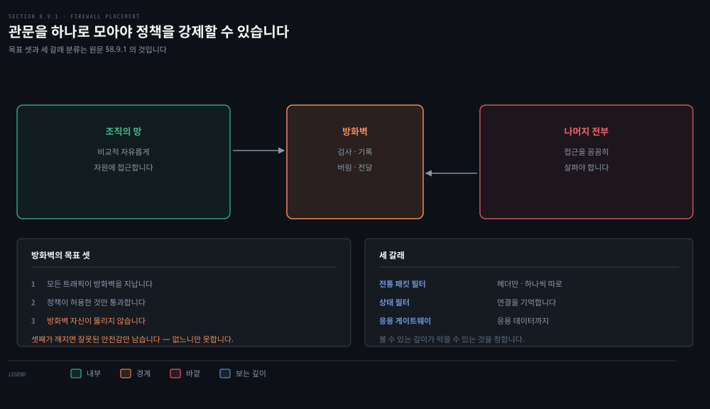
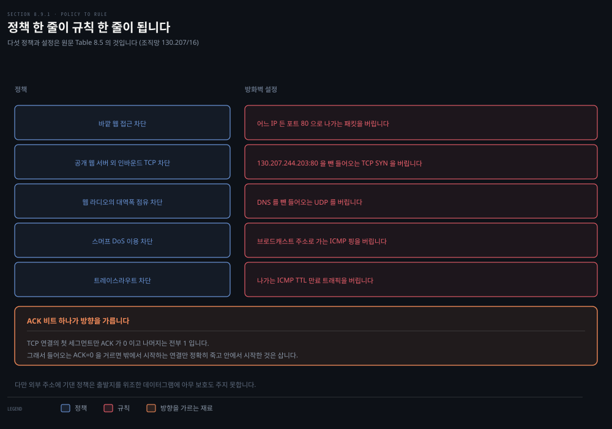
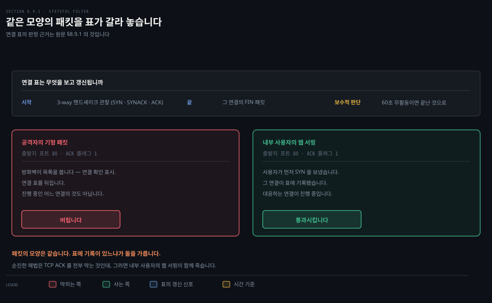
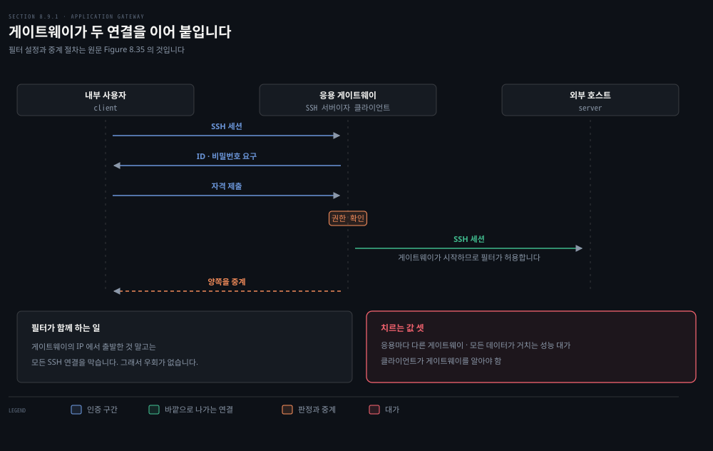
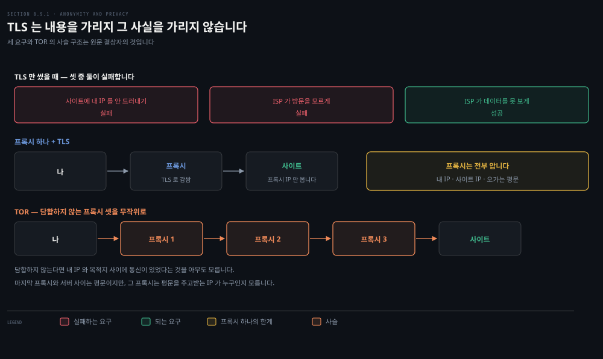
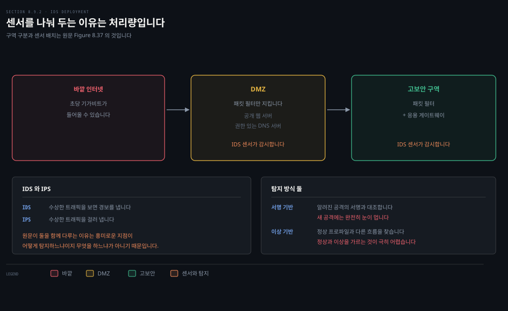

# 통신을 지키는 것과 망을 지키는 것은 다릅니다

---

> 앞의 네 편은 두 당사자 사이의 통신을 지켰습니다. 이 편은 조직의 망 자체를 지킵니다. 관심사가 "내용을 가리는 것"에서 "무엇을 들여보낼 것인가"로 옮겨 갑니다.

## 핵심 요약

> 이 편이 매달린 하나의 생각은 **볼 수 있는 깊이가 곧 막을 수 있는 것의 범위**라는 것입니다.

전통 패킷 필터는 IP 와 TCP·UDP 헤더만 봅니다. 그래서 주소와 포트와 플래그로만 판단합니다. 상태 필터는 여기에 **연결의 기억**을 더해 "이 응답이 우리가 시작한 연결의 것인가"를 물을 수 있게 됩니다. 응용 게이트웨이는 헤더 밖으로 나가 응용 데이터까지 보고, 그래서 "이 사용자에게 권한이 있는가"를 물을 수 있습니다.

IDS 는 그 깊이를 모든 패킷에 적용합니다. 대신 값을 치릅니다. 서명 수만 개와 대조해야 하므로 처리가 무겁고, 그래서 센서를 여럿 두어 트래픽을 나눠 받습니다.

층마다 얻는 것이 다르므로 **하나로 다 되지 않습니다.** 원문이 셋을 나란히 두고 각각의 한계를 함께 적는 이유가 거기 있습니다.


## 학습 목표

> 이 편을 읽고 나면 아래 다섯 가지를 스스로 해낼 수 있습니다.

1. 방화벽의 목표 셋을 대고, 세 번째 목표가 왜 방화벽 자신에 관한 것인지 설명할 수 있습니다.
2. 조직의 정책을 패킷 필터 규칙으로 옮기고, ACK 비트 트릭이 무엇을 가능하게 하는지 말할 수 있습니다.
3. 상태 필터가 연결 표로 무엇을 더 막는지 구체적인 공격 하나로 설명할 수 있습니다.
4. 응용 게이트웨이가 필터로는 안 되는 무엇을 하는지 대고, 그 대가 셋을 말할 수 있습니다.
5. 서명 기반과 이상 기반 IDS 를 비교하고, 센서를 여럿 두는 이유를 댈 수 있습니다.


## 1. 관문을 하나로 모읍니다

> 망 관리자가 보기에 세상은 둘로 갈립니다. 그 경계에서 검사하는 장치가 방화벽입니다.



### 풀려는 문제

인터넷은 안전한 곳이 아닙니다. 망 관리자의 눈으로 보면 세상은 깔끔하게 둘로 갈립니다. 조직의 망에 속하고 자원에 비교적 자유롭게 접근해도 되는 쪽과, 접근을 꼼꼼히 살펴야 하는 나머지 전부입니다.

중세의 성부터 현대의 사무 빌딩까지 많은 조직이 **출입구를 하나로 모아** 그 자리에서 검사했습니다. 성에서는 도개교 끝의 문이었고 사무 빌딩에서는 보안 데스크입니다. 컴퓨터 망에서 드나드는 트래픽을 검사하고 기록하고 버리거나 전달하는 것이 **방화벽**과 **침입 탐지 시스템**(IDS)과 **침입 방지 시스템**(IPS)입니다.

### 방화벽의 목표 셋

방화벽은 조직의 내부 망을 인터넷 전체로부터 격리하는 하드웨어와 소프트웨어의 조합입니다. 목표가 셋입니다.

1. **밖에서 안으로, 안에서 밖으로 가는 모든 트래픽이 방화벽을 지나야 합니다.** 큰 조직은 방화벽을 여러 겹 두거나 분산 배치하기도 하지만, 망의 접근점 하나에 두면 보안 접근 정책을 관리하고 강제하기가 쉬워집니다.
2. **지역 보안 정책이 허용한 트래픽만 통과해야 합니다.** 모든 트래픽이 방화벽을 지나므로 방화벽이 접근을 제한할 수 있습니다.
3. **방화벽 자신이 뚫리지 않아야 합니다.** 방화벽도 망에 붙은 장치입니다. 제대로 설계하거나 설치하지 않으면 뚫릴 수 있고, 그러면 **잘못된 안전감만 줍니다.** 원문은 그것이 방화벽이 아예 없는 것보다 나쁘다고 적습니다.

### 세 갈래

방화벽은 셋으로 나뉩니다. **전통 패킷 필터**와 **상태 필터**와 **응용 게이트웨이**입니다. 이어지는 세 절이 각각을 봅니다.

> **원문 정오**: 이 대목에서 원문은 *"Palo Alto Networks, Cisco and Check Point are **two of** the leading firewall vendors today"* 라 적습니다(615쪽). 업체를 **셋** 대 놓고 둘이라 세었습니다. 앞 판에서 둘을 적었다가 하나를 더하며 수를 안 고친 것으로 보입니다.


## 2. 헤더만 보고 거릅니다

> 패킷 필터는 데이터그램 하나하나를 따로 봅니다. 그래서 판단 재료가 헤더 필드로 한정됩니다.



### 풀려는 문제

조직은 대개 내부 망과 ISP 를 잇는 게이트웨이 라우터를 둡니다. 드나드는 모든 트래픽이 이 라우터를 지나므로 여기서 거르면 됩니다. 그런데 **무엇을 보고 거를 수 있습니까.**

### 볼 수 있는 것

패킷 필터는 데이터그램을 **고립된 하나로** 보고 관리자가 정한 규칙에 따라 통과시킬지 버릴지 정합니다. 판단 재료는 이렇습니다.

- 출발지 또는 목적지 IP 주소
- IP 데이터그램 필드의 프로토콜 종류: TCP · UDP · ICMP · OSPF 등
- TCP 또는 UDP 의 출발지·목적지 포트
- TCP 플래그 비트: SYN · ACK 등
- ICMP 메시지 종류
- 나가는 것과 들어오는 것에 다른 규칙
- 라우터 인터페이스마다 다른 규칙

### 정책이 규칙이 됩니다

원문이 조직망 `130.207/16` 과 웹 서버 `130.207.244.203` 을 예로 정책과 규칙을 짝지어 보입니다.

| 정책 | 방화벽 설정 |
|------|-----------|
| 바깥 웹 접근을 막습니다 | 어느 IP 든 포트 80 으로 나가는 패킷을 전부 버립니다 |
| 공개 웹 서버 것 말고는 들어오는 TCP 연결을 막습니다 | `130.207.244.203` 포트 80 을 뺀 모든 들어오는 TCP SYN 을 버립니다 |
| 웹 라디오가 대역폭을 먹지 못하게 합니다 | DNS 를 뺀 모든 들어오는 UDP 를 버립니다 |
| 스머프 DoS 에 이용되지 않게 합니다 | 브로드캐스트 주소로 가는 ICMP 핑을 전부 버립니다 |
| 트레이스라우트로 내부를 훑지 못하게 합니다 | 나가는 ICMP TTL 만료 트래픽을 전부 버립니다 |

여기에 원문이 단서를 답니다. **외부 주소에 기댄 정책은 출발지 주소를 위조한 데이터그램에 아무 보호도 주지 못합니다.**

> **지금은 다릅니다**: 이 표의 앞 두 줄은 **웹이 포트 80 이던 시절의 규칙**입니다(616쪽). 지금 웹 트래픽은 거의 다 HTTPS 라 포트 **443** 으로 갑니다. 80 만 막으면 브라우저는 그냥 443 으로 나가므로 첫 줄의 정책이 서지 않고, 둘째 줄의 공개 서버 예외도 443 을 함께 열지 않으면 사이트가 열리지 않습니다. 셋째 줄도 마찬가지여서, 오늘의 스트리밍은 UDP 가 아니라 HTTP 위에서 도는 것이 대부분이고 HTTP/3 을 쓰면 UDP 443 으로 갑니다. **포트 번호로 응용을 지목하는 방식 자체가 낡은 것**이고, 그래서 실제 조직은 뒤에 나올 응용 게이트웨이나 TLS 를 들여다보는 장비로 넘어갑니다. 규칙의 형태를 배우는 예로는 여전히 유효합니다.

### ACK 비트 하나로 방향을 가릅니다

거르기의 재료로 **TCP ACK 비트**를 쓰는 것이 요긴합니다. 3장에서 본 대로 TCP 연결의 첫 세그먼트는 ACK 비트가 0 이고 나머지는 전부 1 입니다.

그래서 조직이 **바깥 클라이언트가 내부 서버로 연결을 시작하는 것**만 막고 싶다면, 들어오는 세그먼트 중 ACK 비트가 0 인 것을 전부 거르면 됩니다. 밖에서 시작하는 TCP 연결은 전부 죽고 안에서 시작한 것은 삽니다.

### 접근 제어 목록

규칙은 라우터에서 **접근 제어 목록**(ACL)으로 구현되고 인터페이스마다 자기 목록을 갖습니다. 규칙은 위에서 아래로 차례로 적용됩니다.

원문의 예에서 앞의 두 규칙이 함께 **내부 사용자의 웹 서핑**을 허용합니다.

1. 목적지 포트 80 인 TCP 패킷의 외출을 허용합니다.
2. 출발지 포트 80 이면서 ACK 비트가 선 TCP 패킷의 입장을 허용합니다.
3. 다음 두 규칙이 DNS 를 양방향으로 허용합니다.
4. 마지막 규칙이 나머지 전부를 막습니다.

바깥에서 내부 호스트로 연결을 세우려 하면 포트가 80 이어도 막힙니다.

4장의 일반화 포워딩에서 본 목록과 닮았다고 느꼈다면 맞습니다. 원문도 그 절에서 일반화 포워딩 규칙으로 패킷 필터 방화벽을 만드는 예를 이미 들었습니다.


## 3. 연결을 기억하면 더 막을 수 있습니다

> 앞 절의 목록은 꽤 빡빡한데도 구멍이 남습니다. 그 구멍이 "따로 보기" 때문에 생깁니다.



### 풀려는 문제

앞 절의 접근 제어 목록은 **밖에서 오면서 ACK 가 1 이고 출발지 포트가 80 인** 패킷을 그냥 통과시킵니다. 공격자는 그런 패킷으로 기형 패킷을 보내 내부 시스템을 죽이거나 서비스 거부를 걸거나 내부 망을 훑을 수 있습니다.

순진한 해법은 TCP ACK 패킷도 막는 것입니다. 그러면 **내부 사용자의 웹 서핑이 함께 죽습니다.**

### 연결 표

상태 필터는 진행 중인 TCP 연결을 **연결 표**로 추적해 이 문제를 풉니다. 가능한 이유는 방화벽이 연결의 시작과 끝을 볼 수 있기 때문입니다.

- **시작**: 3-way 핸드셰이크(SYN · SYNACK · ACK)를 관찰합니다.
- **끝**: 그 연결의 FIN 패킷을 봅니다. 엄밀히는 FIN 하나가 닫는 것이 **한 방향**뿐이라, 실제 구현은 양쪽 FIN 을 다 보거나 RST 를 봐야 표에서 지웁니다.
- **보수적 판단**: 60초쯤 아무 활동이 없으면 끝난 것으로 봅니다. TCP 에 그런 규칙이 있는 것이 아니라 방화벽이 정하는 값입니다.

그리고 접근 제어 목록에 **"연결 확인"** 열이 하나 붙습니다. 앞 절의 목록과 같되 두 규칙에 이 표시가 붙습니다.

### 두 장면으로 확인하기

**공격자의 기형 패킷.** 출발지 포트 80 에 ACK 플래그를 세워 보냅니다. 방화벽이 목록을 보고 "연결 표도 확인하라"는 표시를 발견합니다. 표를 뒤져 이 패킷이 진행 중인 어느 TCP 연결의 것도 아님을 확인하고 **버립니다.**

**내부 사용자의 웹 서핑.** 사용자가 먼저 TCP SYN 을 보내므로 그 연결이 표에 기록됩니다. 웹 서버가 ACK 비트를 세워 응답하면 방화벽이 표를 보고 대응하는 연결이 진행 중임을 확인해 **통과시킵니다.**

같은 모양의 패킷인데 **표에 기록이 있느냐**가 둘을 가릅니다.

> **원문 정오**: 이 장면을 설명하며 원문은 *"방화벽이 **Table 8.7** 의 접근 제어 목록을 확인한다"* 고 적습니다(618쪽). Table 8.7 은 **연결 표**이고 접근 제어 목록은 **Table 8.8** 입니다. 세 줄 앞에서 스스로 *"its access control list, as shown in Table 8.8"* 이라 제대로 적었으므로 같은 쪽 안에서 어긋난 오기입니다.


## 4. 헤더 밖으로 나가야 하는 일

> 사용자가 누구인지는 헤더에 없습니다. 응용 데이터에 있습니다.



### 풀려는 문제

조직이 **내부 사용자 일부에게만** SSH 를 열어 주고 싶다고 합시다. IP 주소가 아니라 사람 단위입니다. 게다가 그 사용자들이 먼저 자기를 인증한 뒤에야 바깥으로 SSH 를 걸 수 있게 하고 싶습니다.

전통 필터로도 상태 필터로도 안 됩니다. **내부 사용자의 신원은 응용 계층 데이터이고 IP·TCP·UDP 헤더에 없기 때문입니다.**

### 응용 게이트웨이

더 촘촘한 보안을 위해 방화벽은 패킷 필터에 **응용 게이트웨이**를 결합합니다. 응용 게이트웨이는 헤더 너머를 보고 응용 데이터로 정책을 판단합니다. 모든 응용 데이터가 반드시 지나야 하는 **응용별 서버**이고, 한 호스트에서 여러 개를 돌릴 수 있지만 각각은 자기 프로세스를 가진 별도 서버입니다.

### 어떻게 도는가

라우터의 필터를 **응용 게이트웨이의 IP 주소에서 출발한 것 말고는 모든 SSH 연결을 막도록** 설정합니다. 그러면 나가는 SSH 연결은 전부 게이트웨이를 지나야 합니다.

내부 사용자가 바깥으로 SSH 를 걸려 합니다.

1. 사용자가 먼저 게이트웨이와 세션을 맺습니다. 게이트웨이의 응용이 사용자 ID 와 비밀번호를 묻습니다.
2. 게이트웨이가 그 사용자에게 바깥 SSH 권한이 있는지 확인합니다. 없으면 **연결을 끊습니다.**
3. 있으면 접속할 외부 호스트의 이름을 묻고, 게이트웨이와 그 호스트 사이에 SSH 세션을 세웁니다.
4. 사용자에게서 오는 데이터를 외부 호스트로, 외부 호스트에서 오는 데이터를 사용자로 **중계합니다.**

게이트웨이는 사용자 권한을 판정할 뿐 아니라 **SSH 서버이자 SSH 클라이언트로 동시에 동작합니다.** 필터가 3 단계를 허용하는 이유는 그 연결을 게이트웨이가 시작하기 때문입니다.

> **원문 정오**: 이 절차의 첫 단계를 원문은 *"사용자는 먼저 응용 게이트웨이와 **Telnet** 세션을 세워야 한다"* 고 적습니다(620쪽). 나머지 서술은 전부 SSH 이고, 바로 다음 문장도 *"게이트웨이에서 도는 응용이 들어오는 **SSH** 세션을 듣는다"* 라 적습니다. 예제를 Telnet 에서 SSH 로 옮기며 한 자리를 못 고친 것으로 보입니다.

### 값을 치릅니다

응용 게이트웨이에는 단점이 셋 있습니다.

1. **응용마다 다른 게이트웨이가 필요합니다.**
2. **성능 대가를 치릅니다.** 모든 데이터가 게이트웨이를 거쳐 중계되기 때문입니다. 여러 사용자나 응용이 같은 게이트웨이 기계를 쓰면 특히 문제가 됩니다.
3. **클라이언트 소프트웨어가 게이트웨이를 알아야 합니다.** 어떻게 연락할지, 어느 외부 서버로 붙어 달라고 말할지를 알아야 합니다.


## 5. 프록시를 겹쳐 익명을 만듭니다

> 원문이 곁상자로 다루는 주제입니다. TLS 만으로는 익명이 되지 않는 이유가 여기 있습니다.



### 풀려는 문제

논쟁적인 사이트를 방문하면서 셋을 원한다고 합시다. 사이트에 내 IP 를 드러내지 않는 것, 내가 그 사이트에 갔다는 것을 내 ISP 가 모르는 것, 주고받는 데이터를 내 ISP 가 못 보는 것입니다.

암호화 없이 직접 접속하면 셋 다 실패합니다. **TLS 를 써도 앞의 둘은 실패합니다.** 보내는 데이터그램마다 출발지 IP 가 사이트에 그대로 제시되고, 목적지 주소는 내 ISP 가 쉽게 엿볼 수 있기 때문입니다.

### 신뢰하는 프록시 하나

프록시와 TLS 를 함께 쓰면 됩니다. 먼저 프록시에 TLS 연결을 맺습니다. 그 연결 안으로 원하는 사이트의 HTTP 요청을 보냅니다. 프록시가 그것을 복호해 평문 HTTP 요청을 사이트로 전달합니다. 응답을 받아 TLS 로 내게 돌려줍니다.

사이트는 **프록시의 IP 만** 봅니다. 나와 프록시 사이는 전부 암호화되므로 내 ISP 도 어느 사이트를 갔는지 기록할 수 없습니다.

다만 이 해법은 **프록시를 얼마나 믿느냐만큼만** 좋습니다. 프록시는 전부 압니다. 내 IP 도, 내가 보는 사이트의 IP 도, 오가는 평문도 봅니다.

### 사슬로 겹치기

더 튼튼한 방법이 **TOR** 가 택한 것입니다. 서로 담합하지 않는 프록시 여럿을 거치게 합니다. TOR 는 개인이 프록시를 기여할 수 있게 하고, 접속할 때 프록시 풀에서 **셋을 무작위로 골라** 사슬로 엮어 모든 트래픽을 그 사슬로 보냅니다.

프록시들이 담합하지 않는다면 **사슬 위의 어느 한 노드도 양 끝을 함께 알지 못합니다.** 마지막 프록시와 서버 사이는 평문이지만, 그 마지막 프록시는 평문을 주고받는 IP 가 누구인지 모릅니다.

> **노트의 읽기**: 이 절의 TOR 설명을 세 자리에서 좁혀 읽어야 합니다.
>
> 첫째, 노드를 **아무렇게나 셋 고르는 것이 아닙니다.** 자리마다 조건이 달라서 첫 노드는 오래 고정해 두는 가드이고 마지막은 자기 출구 정책이 허용하는 목적지로만 내보내며, 선택 자체가 대역폭에 가중치를 둡니다. 사슬도 하나로 고정되지 않아 주기적으로 갈아 끼우고 여러 개를 동시에 씁니다. "접속할 때 셋을 골라 모든 트래픽을 그리로 보낸다"는 그림보다 실물이 훨씬 유동적입니다.
>
> 둘째, "아무도 모른다"는 **담합하지 않는 릴레이**에 대해서만 참입니다. 사슬 밖에서 입구와 출구의 트래픽을 함께 관찰할 수 있는 관찰자는 **오간 시각과 양의 무늬를 맞춰** 양 끝을 이을 수 있습니다. TOR 설계 문서가 이 상관 분석을 막지 못한다고 처음부터 밝혀 둡니다. 국가 규모의 관찰자를 상정한 위협 모형이 아닙니다.
>
> 셋째, "마지막 프록시와 서버 사이는 평문"은 **목적지가 HTTP 일 때**입니다. HTTPS 로 가면 TLS 는 브라우저와 목적지 서버 사이에서 맺히므로 출구 노드도 암호문만 봅니다. 출구가 내용을 읽는다는 걱정은 평문 프로토콜에 한정된 이야기입니다.


## 6. 헤더를 넘어 내용을 봅니다

> 많은 공격은 헤더만으로 못 잡습니다. 그래서 패킷이 나르는 응용 데이터까지 들여다봅니다.



### 풀려는 문제

패킷 필터는 IP·TCP·UDP·ICMP 헤더 필드를 봅니다. 그런데 많은 공격 유형을 잡으려면 **깊은 패킷 검사**가 필요합니다. 헤더 너머 실제 응용 데이터를 봐야 합니다. 응용 게이트웨이가 그것을 하지만 **특정 응용에 대해서만** 합니다.

그래서 자리가 하나 남습니다. 지나는 모든 패킷의 헤더를 보면서 깊은 검사도 하는 장치입니다. 수상한 패킷을 보면 막을 수도 있고, 어디까지나 수상할 뿐이므로 통과시키되 관리자에게 경보를 보낼 수도 있습니다.

- **IDS**: 잠재적으로 악의적인 트래픽을 보면 **경보를 냅니다.**
- **IPS**: 수상한 트래픽을 **걸러 냅니다.**

원문은 둘을 함께 다룹니다. 기술적으로 흥미로운 지점이 경보를 보내느냐 버리느냐가 아니라 **어떻게 수상함을 탐지하느냐**이기 때문입니다.

### 센서를 여럿 두는 이유

조직은 IDS 센서를 하나 이상 둘 수 있습니다. 여럿이면 대개 함께 일하며 중앙 IDS 처리기에 정보를 보내고, 그것이 모아 판단해 관리자에게 경보를 냅니다.

원문의 예에서 조직은 망을 둘로 나눕니다. 패킷 필터와 응용 게이트웨이가 지키고 IDS 가 감시하는 **고보안 구역**과, 패킷 필터만 지키되 IDS 는 감시하는 **DMZ** 입니다. DMZ 에는 공개 웹 서버와 권한 DNS 서버처럼 **바깥과 통신해야 하는 서버**가 들어갑니다.

센서를 하나만 두지 않는 이유는 처리량입니다. IDS 는 깊은 검사만 하는 것이 아니라 지나는 패킷마다 **수만 개의 서명과 대조**해야 합니다. 조직이 초당 기가비트를 받는다면 상당한 처리 부담입니다. 센서를 하류에 나눠 두면 각 센서가 트래픽의 일부만 보므로 따라갈 수 있습니다.

### 서명 기반과 이상 기반

| 축 | 서명 기반 | 이상 기반 |
|----|----------|----------|
| 무엇에 기대나 | 알려진 공격의 서명 데이터베이스 | 정상 운영에서 관찰한 트래픽 프로파일 |
| 어떻게 판단하나 | 패킷을 서명과 대조 | 통계적으로 이상한 흐름을 찾음 |
| 새 공격 | **서명에 없으면 못 봅니다** | 잠재적으로 탐지 가능 |
| 약점 | 오탐 발생 · 서명이 많아지면 처리에 압도돼 놓칩니다 | 정상과 이상을 가르는 것 자체가 극히 어렵습니다 |
| 실제 | 대부분의 배치가 이쪽 | 일부 기능만 섞여 들어감 |

서명은 숙련된 보안 엔지니어가 알려진 공격을 조사해 만들고, 조직의 관리자가 고치거나 자기 것을 더할 수 있습니다.

### Snort 의 서명 한 줄

오픈소스 IDS 인 **Snort** 는 Wireshark 도 쓰는 `libpcap` 을 씁니다.

> **원문 정오**: 원문은 Snort 를 *"a **public-domain**, open source IDS"* 라 적습니다(624쪽). 퍼블릭 도메인과 오픈소스는 같은 말이 아닙니다. 퍼블릭 도메인은 저작권이 아예 없어 아무 조건 없이 쓰는 것이고, Snort 엔진은 저작권이 살아 있는 채로 **GPL v2** 로 배포됩니다. 공식 라이선스 안내가 *"The source-code license governing your use of the Snort Engine and the Community Snort Rules is the GNU General Public License Version 2"* 라 적습니다. 고쳐 배포할 때 지켜야 할 의무가 붙는다는 뜻이라, 사내에 넣을 때 실제로 갈리는 구분입니다. 게다가 같은 안내가 **독점 규칙은 별도의 비상업 라이선스**를 따른다고 밝히므로, 엔진이 자유롭다고 규칙까지 자유로운 것도 아닙니다.[^snort] 앞 절에서 원문이 배치된 IDS 를 두고 *"public-domain systems"* 라 부른 자리도 같은 혼동입니다. 서명 하나가 이렇게 생겼습니다.

```bash
alert icmp $EXTERNAL_NET any -> $HOME_NET any
(msg:"ICMP PING NMAP"; dsize: 0; itype: 8;)
```

바깥(`$EXTERNAL_NET`)에서 조직망(`$HOME_NET`)으로 들어오는 ICMP 패킷 중 **타입 8**(ICMP 핑)이고 **적재량이 빈** 것에 걸립니다. nmap 이 이런 특징의 핑 패킷을 만들므로 이 서명은 nmap 핑 스윕을 잡으려는 것입니다.

Snort 에서 가장 인상적인 것은 **서명 데이터베이스를 유지하는 공동체**입니다. 새 공격이 나오고 몇 시간 안에 공동체가 서명을 써서 배포하고, 전 세계 배치가 그것을 내려받습니다.


## 결정 치트시트

> 이 편의 판단 기준을 한 표에 모았습니다.

| 상황 | 판단 | 근거 |
|------|------|------|
| 방화벽을 어디에 둘지 정할 때 | 접근점 하나에 모읍니다 | 정책을 관리하고 강제하기 쉬워집니다 |
| 헤더만으로 거를 수 있는지 물을 때 | 주소·포트·플래그까지입니다 | 사용자 신원은 응용 계층에 있습니다 |
| 밖에서 시작하는 연결만 막을 때 | 들어오는 ACK=0 을 거릅니다 | 연결의 첫 세그먼트만 ACK 가 0 입니다 |
| ACK=1 인 기형 패킷을 막을 때 | 상태 필터를 씁니다 | 연결 표에 기록이 없으면 버립니다 |
| 사용자 단위 정책이 필요할 때 | 응용 게이트웨이를 겹칩니다 | 응용마다 하나씩 필요하고 성능 대가를 냅니다 |
| TLS 만으로 익명이 되는지 물을 때 | 되지 않습니다 | 출발지·목적지 주소가 그대로 드러납니다 |
| IDS 센서 수를 정할 때 | 트래픽량으로 정합니다 | 패킷마다 수만 서명과 대조해야 합니다 |
| 새 공격을 잡고 싶을 때 | 서명 기반만으로는 안 됩니다 | 어느 서명에도 안 걸리는 공격은 그대로 지나갑니다 |


## 심화 학습

> 책 밖 보강입니다. 원문이 다루지 않는 자리만 적습니다.

### 세 단계는 백엔드의 관문에도 그대로 있습니다

이 편의 세 단계는 이름만 바꾸면 백엔드에서 익숙한 모양입니다. L4 로드밸런서가 전통 패킷 필터에, 연결을 추적하는 L4 방화벽이 상태 필터에, API 게이트웨이가 응용 게이트웨이에 대응합니다. **볼 수 있는 깊이가 곧 강제할 수 있는 정책의 범위**라는 규칙도 그대로입니다.

게이트웨이의 대가 셋도 그대로 옮겨 옵니다. 프로토콜마다 어댑터가 필요합니다. 모든 트래픽이 한 지점을 거치므로 병목과 단일 장애점이 됩니다. 클라이언트가 그 지점을 알아야 합니다. **API 게이트웨이를 둘지 말지의 논의가 매번 이 셋을 다시 꺼내는 이유**가 여기 있습니다.

### DMZ 라는 이름이 남긴 것

원문의 DMZ 구분은 지금도 망 분리의 기본형입니다. 바깥과 통신해야 하는 서버만 낮은 보안 구역에 두고 나머지를 안쪽에 둡니다. 다만 요즘은 경계 하나를 믿는 대신 **모든 호출에 인증을 요구하는 방향**으로 무게가 옮겨 갔습니다. 이 편의 방화벽이 "경계 안은 믿는다"를 전제하는 반면, 그 전제를 지우는 설계가 따로 논의된다는 점을 함께 기억해 두면 좋습니다.


## 면접 대비

> 이 편에서 실제로 물어보기 좋은 것만 골랐습니다.

### 한 줄 정의

- **방화벽**: 내부 망을 인터넷으로부터 격리해 일부 패킷만 통과시키는 하드웨어와 소프트웨어의 조합입니다.
- **상태 필터**: 진행 중인 TCP 연결을 연결 표로 추적해 판단하는 필터입니다.
- **응용 게이트웨이**: 응용 데이터를 보고 정책을 판단하는 응용별 서버입니다.
- **깊은 패킷 검사**: 헤더 너머 응용 데이터까지 들여다보는 검사입니다.
- **DMZ**: 바깥과 통신해야 하는 서버를 두는 낮은 보안 구역입니다.

### 핵심 포인트 세 가지

1. **볼 수 있는 깊이가 막을 수 있는 것을 정합니다.** 헤더만 보면 주소·포트·플래그까지이고, 연결을 기억하면 "우리가 시작했는가"를 물을 수 있으며, 응용 데이터를 보면 "이 사용자에게 권한이 있는가"를 물을 수 있습니다.
2. **ACK 비트 하나가 방향을 가릅니다.** TCP 연결의 첫 세그먼트만 ACK 가 0 이므로, 들어오는 ACK=0 을 거르면 밖에서 시작하는 연결만 정확히 막힙니다.
3. **서명 기반 IDS 는 서명에 없는 것을 못 봅니다.** 새 공격이라도 기존 서명에 걸리는 무늬를 품고 있으면 잡히므로, 못 보는 것은 "새것"이 아니라 "어느 서명에도 안 걸리는 것"입니다. 이상 기반이 그것을 노리지만 정상과 이상을 가르는 문제가 극히 어려워, 실제 배치는 대부분 서명 기반입니다.

### 자주 묻는 질문

- *상태 필터가 전통 필터보다 무엇을 더 막습니까?* 출발지 포트 80 에 ACK 를 세운 기형 패킷입니다. 전통 필터는 규칙만 보므로 통과시키지만, 상태 필터는 연결 표에 기록이 없음을 보고 버립니다.
- *응용 게이트웨이는 왜 응용마다 필요합니까?* 응용 데이터의 형식과 의미가 응용마다 다르기 때문입니다. SSH 게이트웨이가 HTTP 를 이해하지 못합니다.
- *IDS 와 IPS 의 차이는 무엇입니까?* 경보를 내느냐 걸러 내느냐입니다. 탐지 방식은 같아서 원문도 둘을 함께 다룹니다.
- *TLS 를 쓰면 익명이 됩니까?* 아닙니다. 내용은 가려지지만 출발지와 목적지 주소는 그대로 드러납니다. 익명을 원하면 프록시를 겹쳐야 합니다.


## 핵심 개념 체크리스트

- [ ] 방화벽의 목표 셋을 대고 세 번째가 왜 방화벽 자신에 관한 것인지 말할 수 있습니다.
- [ ] 패킷 필터가 보는 재료 일곱 가지를 댈 수 있습니다.
- [ ] 정책 한 줄을 규칙 한 줄로 옮길 수 있습니다.
- [ ] ACK 비트 트릭이 무엇을 가능하게 하는지 설명할 수 있습니다.
- [ ] 상태 필터가 연결의 시작과 끝을 어떻게 알아채는지 말할 수 있습니다.
- [ ] 응용 게이트웨이가 필요한 상황과 그 대가 셋을 댈 수 있습니다.
- [ ] TLS 만으로 익명이 되지 않는 이유와 TOR 의 사슬 구조를 설명할 수 있습니다.
- [ ] 서명 기반과 이상 기반 IDS 를 다섯 축으로 비교할 수 있습니다.
- [ ] Snort 서명 한 줄을 읽고 무엇을 잡는 것인지 말할 수 있습니다.


## 8장 마무리

> 원문의 정리를 이 폴더의 맥락에 붙여 적습니다.

원문은 8장을 앨리스와 밥이 안전하게 통신하기 위한 장치들의 목록으로 정리합니다. 기밀성과 종단 인증과 메시지 무결성이 그 축이고, 앞의 절들이 그 셋을 층마다 어떻게 얻는지 보였습니다.

이 책을 여기까지 읽고 나면 그림이 하나로 모입니다. 1장부터 7장까지가 **어떻게 닿는가**를 위에서 아래로 훑었다면, 8장은 그 각 층에 **무엇을 씌울 수 있는가**를 다시 위에서 아래로 훑습니다.

- §8.5: 메일에 씌웁니다.
- §8.6: TCP 에 씌웁니다.
- §8.7: IP 에 씌웁니다.
- §8.8: 무선 링크에 씌웁니다.

마지막에 원문이 방향을 한 번 틉니다. **기밀성은 망 보안이라는 그림의 작은 조각일 뿐**이고, 갈수록 초점은 망 인프라 자체를 지키는 쪽으로 옮겨 갔다는 것입니다. 이 편이 다룬 방화벽과 IDS 가 그 자리입니다.


## 관련 문서

- [8장 README](./README.md) — 이 책의 장별 목표와 진행 상태입니다.
- [8장 망 계층에 통째로 씌우고 무선에 붙입니다](./08-04.%EB%A7%9D%20%EA%B3%84%EC%B8%B5%EC%97%90%20%ED%86%B5%EC%A7%B8%EB%A1%9C%20%EC%94%8C%EC%9A%B0%EA%B3%A0%20%EB%AC%B4%EC%84%A0%EC%97%90%20%EB%B6%99%EC%9E%85%EB%8B%88%EB%8B%A4.md) — 앞 편입니다. 통신을 지키는 축의 마지막이 거기입니다.
- [8장 무엇을 지키자는 것이고, 비밀은 어디에 있는가](./08-01.%EB%AC%B4%EC%97%87%EC%9D%84%20%EC%A7%80%ED%82%A4%EC%9E%90%EB%8A%94%20%EA%B2%83%EC%9D%B4%EA%B3%A0%2C%20%EB%B9%84%EB%B0%80%EC%9D%80%20%EC%96%B4%EB%94%94%EC%97%90%20%EC%9E%88%EB%8A%94%EA%B0%80.md) — 이 장의 첫 편입니다. 운영 보안이 네 성질 중 하나로 처음 등장하는 자리입니다.


## 참고 자료

- 《Computer Networking A Top-Down Approach》 9판, Kurose·Ross, Pearson.
  - §8.9 Operational Security: Firewalls and Intrusion Detection Systems — 책 614–624쪽
  - §8.10 Summary — 책 624–625쪽
- Snort: [snort.org](https://www.snort.org/). TOR: [torproject.org](https://www.torproject.org/).
- TOR 의 경로 선택 제약과 위협 모형: [Tor path specification](https://spec.torproject.org/path-spec/) 및 [Tor: The Second-Generation Onion Router](https://spec.torproject.org/) 설계 문서.

[^snort]: Snort 공식 라이선스 안내 — *"The source-code license governing your use of the Snort Engine and the Community Snort Rules is the GNU General Public License Version 2. The source-code license governing your use of the Proprietary Snort Rules is the Non-Commercial Use License for the Proprietary Snort Rules."* <https://www.snort.org/license>
