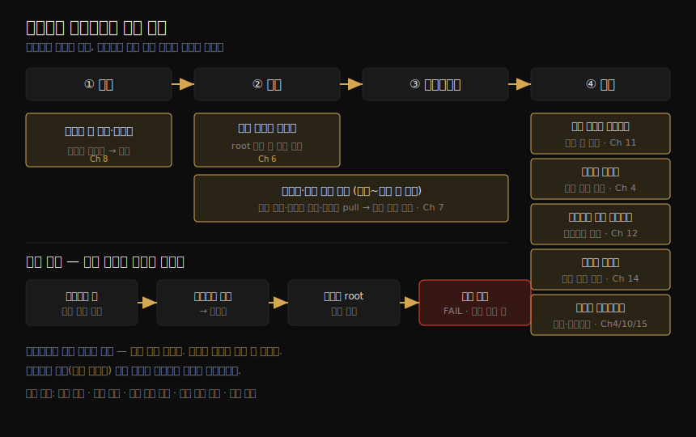

# 컨테이너 보안 위협 — 위협 모델·공격 벡터·보안 원칙
---
> 컨테이너 보안을 깊이 파기 전에, 무엇을 막아야 하는지를 먼저 정리하는 장입니다. 위험(risk)·위협(threat)·완화(mitigation)를 구분하고, 컨테이너 생애주기의 각 단계에 어떤 공격 벡터가 있는지를 짚습니다. 컨테이너는 보안 경계이지만 약한 경계이므로, 경계를 여러 겹 쌓는 사고가 필요합니다. 마지막으로 최소 권한·심층 방어 같은 보안 원칙이 컨테이너의 세분성과 어떻게 맞물리는지를 봅니다.

컨테이너로 옮긴다고 해서 공격자가 사라지지는 않습니다. 데이터를 훔치거나, 시스템 동작을 바꾸거나, 남의 컴퓨팅 자원으로 암호화폐를 캐려는 사람들은 전통적 배포에서나 컨테이너 배포에서나 똑같이 존재합니다. 다만 컨테이너는 애플리케이션이 *실행되는 방식*을 크게 바꾸고, 그 결과 위험의 구성이 달라집니다. 이 장의 목적은 그 달라진 위험 지형을 한눈에 그려 보는 것입니다.

이 노트는 책의 첫 장 전체 — 위협 모델부터 보안 원칙까지 — 를 한 흐름으로 다룹니다. 개별 메커니즘(격리·이미지·런타임)의 깊은 내용은 뒤따르는 장들이 채우며, 여기서는 그 장들이 각각 어떤 위협에 대응하는지를 지도처럼 연결합니다.

> 전제: 이 장은 "무엇을 막을지"를 정의하는 장입니다. "어떻게 막는지"의 구체적 메커니즘은 Chapter 3·4(격리), 5(VM 비교), 6~9(이미지·공급망), 10~16(하드닝·통신·런타임)이 이어받습니다.

## 1. 위험·위협·완화 — 세 용어의 구분

> 셋은 다릅니다. 위험은 일어날 수 있는 문제와 그 여파, 위협은 그 위험에 이르는 경로, 완화는 그 경로를 막거나 성공 확률을 낮추는 대응책입니다.

보안을 체계적으로 논하려면 세 용어를 먼저 갈라야 합니다. 책은 자동차 열쇠 비유로 이 셋을 설명합니다.

1. **위험(risk)**: 일어날 수 있는 잠재적 문제와 그것이 실제로 일어났을 때의 여파입니다. 예 — 누군가 집에서 자동차 열쇠를 훔쳐 차를 몰고 가 버리는 것.
2. **위협(threat)**: 그 위험에 이르는 경로입니다. 예 — 창문을 깨고 손을 넣어 열쇠를 집거나, 우편함에 낚싯대를 넣거나, 문을 두드려 주의를 끄는 사이 공범이 슬쩍 들어와 열쇠를 챙기는 여러 방법.
3. **완화(mitigation)**: 위협을 막거나 성공 가능성을 줄이는 대응책입니다. 예 — 열쇠를 눈에 안 띄는 곳에 두는 것 하나로 위 세 위협을 모두 누그러뜨립니다.

위험은 조직마다 크게 다릅니다. 고객 돈을 맡은 은행에게 가장 큰 위험은 돈 도난이고, 이커머스는 사기 거래를, 개인 블로그 운영자는 사칭 후 부적절한 글 게시를 걱정합니다. 개인정보 유출 위험조차 지역에 따라 갈립니다. 어떤 나라에서는 평판 손상 "정도"지만, 유럽의 GDPR 은 회사 총매출의 최대 4% 까지 벌금을 매깁니다.

> 위험이 다르면 위협의 상대적 중요도도, 적절한 완화책도 달라집니다. **위험 관리 프레임워크(risk management framework)** 는 위험을 체계적으로 사고하는 절차입니다 — 가능한 위협을 열거하고, 중요도로 우선순위를 매기고, 완화 접근을 정의합니다. 그 안에서 **위협 모델링(threat modeling)** 은 시스템 구성 요소와 가능한 공격 양태를 체계적으로 훑어, 어디가 가장 취약한지를 찾아내는 작업입니다.

단일 만능 위협 모델은 없습니다. 위험·환경·조직·실행 중인 애플리케이션에 따라 달라지기 때문입니다. 그래도 거의 모든 컨테이너 배포에 공통되는 위협들은 추려 낼 수 있고, 이 장이 바로 그 일을 합니다.

## 2. 위협 행위자 — 누가 공격하는가

> 위협 모델은 "누가" 관련되는지를 따지는 데서 시작합니다. 외부 공격자부터 무심코 사고를 내는 내부자, 그리고 사람이 아닌 애플리케이션 프로세스까지 행위자에 포함됩니다.

위협 모델을 시작하는 한 방법은 관련된 행위자(actor)를 헤아리는 것입니다. 책이 드는 다섯 부류는 다음과 같습니다.

1. **외부 공격자(external attacker)**: 배포 외부에서 접근을 시도하는 자.
2. **내부 공격자(internal attacker)**: 배포의 일부에 이미 접근한 자.
3. **악의적 내부자(malicious internal actor)**: 배포에 접근할 일정 권한을 가진 개발자·관리자 중 악의를 품은 자.
4. **부주의한 내부자(inadvertent internal actor)**: 실수로 문제를 일으키는 자.
5. **애플리케이션 프로세스**: 시스템을 노리는 의식적 존재는 아니지만, 시스템에 프로그램적으로 접근하는 프로세스. 이것도 위협 행위자에 넣어야 합니다.

각 행위자가 어떤 권한을 갖는지를 세 축으로 따집니다. 이 셋을 묻는 이유는, 같은 행위자라도 어떤 자격·권한·네트워크 접근을 갖느냐에 따라 도달할 수 있는 곳이 달라지기 때문입니다.

| 축 | 무엇을 묻는가 | 예 |
|----|-------------|-----|
| 자격(credentials) | 어떤 자격으로 접근하는가 | 호스트 머신의 사용자 계정 접근 권한이 있는가 |
| 권한(permissions) | 시스템에서 무엇을 할 수 있는가 | K8s RBAC, 정책 엔진·런타임 보안 도구, 클라우드 IAM 정책 |
| 네트워크 접근 | 어디까지 닿는가 | VPC 포함 범위, 접근을 제한하는 네트워크 보안 정책 유무 |

## 3. 컨테이너 생애주기별 공격 벡터

> 컨테이너 배포를 공격하는 길은 여럿이고, 한 가지 정리법은 컨테이너 생애주기의 각 단계마다 어떤 공격 벡터가 있는지를 보는 것입니다. 코드 작성 → 이미지 빌드 → 레지스트리 → 실행으로 이어지는 흐름 위에 위협이 놓입니다.

공격 벡터를 컨테이너의 생애주기 단계에 맞춰 펼치면 다음 그림처럼 정리됩니다. 코드가 작성되고, 이미지로 빌드되고, 레지스트리에 저장됐다 꺼내져, 호스트 위에서 실행되는 흐름의 각 길목이 공격 지점입니다.

각 벡터가 무엇이고 이 책의 어느 장이 그 대응을 다루는지를 묶어 보면 다음과 같습니다.

| 단계 | 공격 벡터 | 무엇이 문제인가 | 대응 장 |
|------|----------|----------------|--------|
| 코드 | 취약한 앱 코드·의존성 | 직접 작성한 코드와 서드파티 의존성에 든 알려진 취약점(vulnerability). 공표된 취약점이 수천 개 | 이미지 스캔 (Ch 8) |
| 빌드 | 잘못 설정된 이미지 | 빌드 설정 단계의 약점 — 예: 컨테이너를 root 로 실행해 필요 이상의 권한 부여 | Ch 6 |
| 빌드~배포 | 공급망·빌드 머신 공격 | 소스 변조, 빌드 방식 조작, 레지스트리 이미지 교체, 엉뚱한 이미지 pull 유도 → 임의 코드 실행 | Ch 7 |
| 실행 | 잘못 설정된 컨테이너 | 불필요·계획에 없던 권한을 주는 설정. 인터넷의 YAML 을 검토 없이 실행하지 말 것 | Ch 11 |
| 실행 | 취약한 호스트 | 호스트가 취약한 코드(알려진 취약점이 있는 구버전 오케스트레이션 등)를 돌림. 설치 소프트웨어 최소화로 공격 표면 축소 | Ch 4 (+ GitOps Ch 9) |
| 통신 | 안전하지 않은 네트워킹 | 컨테이너 간·외부와의 통신. 마이크로세그멘테이션·네트워크 정책으로 제한 | Ch 12 (+ 암호화 Ch 13) |
| 통신 | 노출된 시크릿 | 컨테이너 코드에 자격·토큰·비밀번호를 전달하는 방식의 안전성 차이 | Ch 14 |
| 실행 | 런타임 익스플로잇 | containerd·CRI-O 의 미발견 버그나 커널 취약점으로 컨테이너 탈출·권한 상승 가능 | 격리 Ch 4, 강한 격리 Ch 10, 탐지 Ch 15 |

> 이 책의 범위를 벗어나는 벡터도 있습니다. 소스 저장소·이미지 레지스트리 자체에 대한 공격, 호스트 머신을 잇는 네트워크(VPC·방화벽·IAM)의 보호, 오케스트레이터의 안전하지 않은 설정·관리자 접근 통제는 전통적 배포와 똑같이 적용되며 본서가 깊이 다루지 않습니다. 다만 사용자 접근 통제는 적절히 해 두어야 합니다.

## 4. 보안 경계와 공격 사슬

> 보안 경계는 시스템의 두 부분 사이에서, 그 사이를 넘으려면 다른 권한이 필요하게 만드는 선입니다. 컨테이너도 보안 경계입니다 — 다만 약한 경계입니다. 그래서 경계를 여러 겹 쌓아야 합니다.

**보안 경계(security boundary)** — 신뢰 경계(trust boundary)라고도 합니다 — 는 시스템의 부분과 부분 사이에 있어, 그 사이를 이동하려면 다른 권한 집합이 필요하게 만드는 선입니다. 예를 들어 리눅스에서 관리자는 사용자가 속한 그룹을 바꿔, 그 사용자가 어떤 파일에 접근할 수 있는지를 정하는 경계를 조정합니다.

"컨테이너는 보안 경계가 아니다"라는 말을 듣곤 하는데, 정확하지 않습니다. **컨테이너는 보안 경계가 맞습니다 — 단지 강한 경계가 아닐 뿐입니다.** 애플리케이션 코드는 그 컨테이너 안에서 돌아야 하고, 명시적으로 권한을 받은 경우(예: 컨테이너에 마운트된 볼륨)를 빼면 컨테이너 밖의 코드나 데이터에 접근할 수 없어야 합니다. 컨테이너가 주는 경계가 비교적 약하기 때문에, 애플리케이션 보안에 확신을 가지려면 경계를 더 둬야 합니다.

> 공격자와 목표(예: 고객 데이터) 사이의 보안 경계가 많을수록, 목표에 닿기가 어려워집니다.

§3 의 공격 벡터들은 사슬처럼 엮여 여러 보안 경계를 차례로 뚫을 수 있습니다. 책이 드는 전형적 사슬은 다음과 같습니다.

1. 애플리케이션 의존성의 취약점 때문에 공격자가 컨테이너 안에서 원격으로 코드를 실행합니다.
2. 뚫린 컨테이너에 값진 데이터가 없다면, 공격자는 컨테이너 밖 — 다른 컨테이너나 호스트 — 으로 나갈 길을 찾습니다. 컨테이너 탈출 취약점이나 안전하지 않은 컨테이너 설정이 그 통로입니다. 둘 중 하나가 열려 있으면 호스트에 닿습니다.
3. 다음은 호스트의 root 권한을 노립니다. 애플리케이션이 컨테이너 안에서 root 로 돌고 있었다면 이 단계는 사소해집니다(Ch 4).
4. 호스트의 root 권한을 쥐면, 그 호스트나 그 위 어떤 컨테이너가 닿을 수 있는 모든 것에 닿습니다.

이 사슬을 보면 결론은 분명합니다. 배포에 보안 경계를 더하고 강화할수록 공격자의 삶은 고달파집니다. 그리고 위협 모델의 중요한 한 축은, 애플리케이션이 도는 *환경 안에서의* 공격 가능성 — 즉 자원을 남과 공유하는 데서 오는 위협 — 을 따지는 것입니다.

## 5. 멀티테넌시 — 자원 공유의 위협

> 여러 사용자(테넌트)가 공유 하드웨어에서 워크로드를 돌리는 것이 멀티테넌시입니다. 누가 그 워크로드를 소유하고 서로 얼마나 신뢰하느냐에 따라 필요한 경계의 강도가 달라집니다.

**멀티테넌시(multitenancy)** 는 서로 다른 사용자(테넌트)가 공유 하드웨어에서 자기 워크로드를 돌리는 구조입니다(여기서는 하드웨어 공유만 가리킵니다). 1960년대 메인프레임 시절 고객이 공유 머신의 CPU 시간·메모리·스토리지를 빌리던 것에서 시작했고, 오늘날 AWS·Azure·GCP 같은 퍼블릭 클라우드도 본질이 다르지 않습니다. 신뢰 관계와 공유 수준에 따라 테넌트 사이에 더 강한 경계가 필요해집니다.

### 공유 머신

한 리눅스 머신을 여러 사용자가 공유하는 상황입니다. 대학이 전형적인 예로, 사용자끼리도, 관리자와 사용자 사이도 서로 신뢰하지 않는 진짜 멀티테넌시입니다. 여기서는 리눅스 접근 통제로 사용자별 로그인 ID 를 주고, 자기 디렉토리의 파일만 수정하도록 엄격히 제한합니다. 학생들이 동기의 파일을 읽거나 고칠 수 있다면 벌어질 혼란을 떠올려 보면 됩니다.

> 같은 호스트의 모든 컨테이너는 같은 커널을 공유합니다(Ch 4). 머신이 Docker 데몬을 돌리고 있으면 `docker` 명령을 칠 수 있는 사용자는 사실상 root 권한을 가지므로, 관리자는 신뢰하지 않는 사용자에게 그 권한을 주려 하지 않습니다.

### 가상화

가상 머신(VM)끼리는 비교적 강하게 격리됩니다 — 이웃이 내 VM 활동을 관찰하거나 간섭하기 어렵다는 뜻입니다(Ch 5). 받아들여지는 정의로는 가상화는 멀티테넌시에 해당하지도 않습니다. 멀티테넌시는 여러 무리가 같은 소프트웨어 한 인스턴스를 공유하는 것인데, 가상화에서 사용자는 자기 VM 을 관리하는 하이퍼바이저에 접근하지 못하므로 소프트웨어를 공유하지 않기 때문입니다.

그렇다고 VM 간 격리가 완벽하지는 않습니다. 한 물리 머신을 공유하는 탓에 성능이 예기치 않게 출렁이는 "시끄러운 이웃(noisy neighbor)" 문제가 역사적으로 제기됐습니다. 퍼블릭 클라우드 초기 채택자인 Netflix 는 2010년 블로그에서, 하위 작업이 너무 느리면 일부러 포기하도록 시스템을 설계했다고 밝혔습니다. VM 경계를 깨뜨릴 수 있는 소프트웨어 취약점 사례도 있었고, 클라우드 제공자는 이런 하이퍼바이저 수준 취약점을 막으려 추가 하드닝을 합니다.

> 정부·금융·의료처럼 침해의 여파가 충분히 심각한 조직은 완전한 물리적 분리를 택합니다. 자체 데이터센터의 프라이빗 클라우드, 단독 점유가 보장되는 VM, 또는 베어메탈 머신을 빌려 시끄러운 이웃 문제를 피하고 물리 머신 간의 강한 격리를 얻습니다.

### 컨테이너 멀티테넌시

컨테이너 간 격리는 VM 간 격리만큼 강하지 않습니다(Ch 4). 위험 프로파일에 따라 다르지만, 신뢰하지 않는 상대와 같은 머신에서 컨테이너를 쓰고 싶지는 않을 것입니다. 모든 컨테이너를 본인이나 절대 신뢰하는 사람이 돌린다 해도, 사람의 실수 가능성에 대비해 컨테이너끼리 간섭하지 못하게 막는 편이 낫습니다.

Kubernetes 에서는 **namespace** 로 클러스터를 개인·팀·애플리케이션별로 나눌 수 있습니다. 다만 여기에는 흔한 혼동이 있어 짚어 둡니다.

> **namespace 는 한 단어에 두 뜻이 겹친 용어입니다.** Kubernetes 의 namespace 는 클러스터 자원을 나눠 서로 다른 접근 통제를 거는 고수준 추상이고, 리눅스의 namespace 는 프로세스가 인식하는 머신 자원을 격리하는 저수준 메커니즘입니다(후자는 Ch 4 에서 상세히). 둘은 이름만 같습니다.

RBAC(역할 기반 접근 통제)로 이 Kubernetes namespace 들에 누가·무엇이 접근할지를 제한합니다. 단, **K8s RBAC 은 Kubernetes API 를 통한 행위만 통제합니다.** 같은 호스트에 떠 있는 서로 다른 namespace 의 Pod 컨테이너들은, namespace 가 달라도 오직 컨테이너 격리로만 서로 보호됩니다. 공격자가 컨테이너를 탈출해 호스트에 닿으면, Kubernetes namespace 경계는 다른 컨테이너에 영향을 주는 능력에 조금도 차이를 만들지 못합니다.

### 컨테이너 인스턴스 (관리형 서비스)

Azure Container Instances, AWS Fargate 는 컨테이너가 도는 머신(또는 VM)을 신경 쓰지 않고 컨테이너를 돌리게 해 주는 관리형 서비스입니다. 관리 부담을 크게 덜고 확장이 쉬워지지만, 적어도 이론상 내 컨테이너 인스턴스가 다른 고객의 것과 같은 VM 에 함께 배치(colocate)될 수 있습니다. 의심스러우면 클라우드 제공자에게 확인해야 합니다.

## 6. 다섯 가지 보안 원칙

> 무엇을 보안하든 현명하다고 통하는 일반 지침들입니다. 최소 권한·심층 방어·공격 표면 축소·폭발 반경 제한·직무 분리 — 다섯 원칙이 컨테이너의 세분성과 잘 맞물립니다.

본격적인 메커니즘에 들어가기 전, 무엇을 보안할지 판단할 때 사고를 이끌어 줄 기본 원칙 다섯을 정리합니다.

| 원칙 | 핵심 | 컨테이너에서의 적용 |
|------|------|---------------------|
| 최소 권한(least privilege) | 사람·구성 요소가 일하는 데 필요한 최소한으로 접근을 제한 | 컨테이너마다 기능에 꼭 필요한 최소 권한 집합만 부여. 예 — 상품 검색 마이크로서비스에는 상품 DB 읽기 전용 자격만 |
| 심층 방어(defense in depth) | 보호를 여러 겹으로. 한 겹이 뚫려도 다음 겹이 막음 | 컨테이너가 보안 보호를 강제할 또 하나의 경계를 제공 |
| 공격 표면 축소 | 복잡할수록 공격 길이 늘어남 — 인터페이스를 작고 단순하게, 접근 주체·코드량을 최소화 | 모놀리스를 단순 마이크로서비스로 쪼개 깨끗한 인터페이스로 복잡도 축소(반론: 오케스트레이션 계층이 새 공격 표면을 더함) |
| 폭발 반경 제한(limit blast radius) | 보안 통제를 작은 셀로 나눠, 최악의 경우에도 여파를 가둠 | 아키텍처를 여러 마이크로서비스 인스턴스로 나누면 컨테이너 자체가 보안 경계 역할 |
| 직무 분리(segregation of duties) | 각 구성 요소·사람에게 필요한 최소 부분의 권한만 부여 | 자격·시크릿을 필요한 컨테이너에만 전달 → 한 시크릿이 털려도 전부 잃지는 않음 |

> 이 이점들은 좋게 들리지만 다소 이론적입니다. 실무에서는 잘못된 시스템 설정, 나쁜 이미지 위생, 안전하지 않은 관행에 의해 쉽게 상쇄될 수 있습니다. 컨테이너의 세분성이 다섯 원칙의 적용을 *돕는* 것이지, 자동으로 보장하지는 않습니다.

## 7. 학습 점검 — 백지 복기

> 이 노트를 덮고 입으로 답해 봅니다. 막히는 항목이 다음 장에서 먼저 채울 빈칸입니다.

1. 위험·위협·완화를 자동차 열쇠 비유로 각각 한 문장씩 구분해 봅니다.
2. 컨테이너 생애주기의 공격 벡터를 **코드 → 빌드 → 레지스트리 → 실행** 순으로 최소 다섯 개 떠올리고, 각각 대응하는 장을 짝지어 봅니다.
3. "컨테이너는 보안 경계가 아니다"라는 말이 왜 정확하지 않은지, 그리고 왜 경계를 여러 겹 쌓아야 하는지를 연결해 설명해 봅니다.
4. 공격 사슬 4단계(컨테이너 내 코드 실행 → 컨테이너 탈출 → 호스트 root → 전체 장악)를 빈 종이에 그려 봅니다.
5. Kubernetes namespace 와 리눅스 namespace 의 차이를 한 문장으로 말하고, 컨테이너 탈출 시 K8s namespace 경계가 왜 무력해지는지를 덧붙여 봅니다.
6. 다섯 보안 원칙을 들고, 그중 하나가 컨테이너의 세분성과 어떻게 맞물리는지 예를 들어 봅니다.

> 답이 막힌 항목은 이정표입니다. 이 노트의 역할은 그 빈칸의 위치를 알려 주는 것까지입니다.

## 다음 단계

> 무엇을 막을지를 정의했으니, 다음 장부터 그것을 떠받치는 메커니즘으로 내려갑니다.

이 장은 컨테이너 기반 배포를 노리는 공격의 큰 그림과, 방어에 적용할 보안 원칙을 잡았습니다. 나머지 장들은 컨테이너를 떠받치는 메커니즘을 파고들어, 보안 도구와 모범 관행이 이 원칙들을 어떻게 구현하는지를 보여 줍니다.

작성 순서는 책 구조를 따릅니다(전체 지도는 [개요 노트](./00-00.책%20개요와%20학습%20로드맵.md) 참조).

1. **Ch 2**: 핵심 리눅스 메커니즘 — 시스템 콜·capability. 컨테이너 이해의 바탕.
2. **Ch 3~4**: 컨테이너의 구성과 격리 — 이 장이 거듭 언급한 "컨테이너 탈출"·"root 실행"의 실제 메커니즘.
3. **Ch 5 이후**: VM 격리 비교, 이미지·공급망·런타임 보안.

## 관련 문서

> 이 장은 위협의 지도이고, 거기서 언급된 격리 메커니즘은 02_os 의 커널 노트가 "운영 관점"에서 다룹니다.

- [00-00.책 개요와 학습 로드맵](./00-00.책%20개요와%20학습%20로드맵.md) — 16챕터 전체 지도. 이 장이 짚은 위협별 대응 장과 연결
- [02_os/kernel/01-05.namespace 실습 — 8가지 격리와 unshare](../../kernel/01-05.namespace%20실습%20—%208가지%20격리와%20unshare.md) — §5 가 언급한 "리눅스 namespace"(K8s namespace 와 다른 저수준 격리)의 실습편
