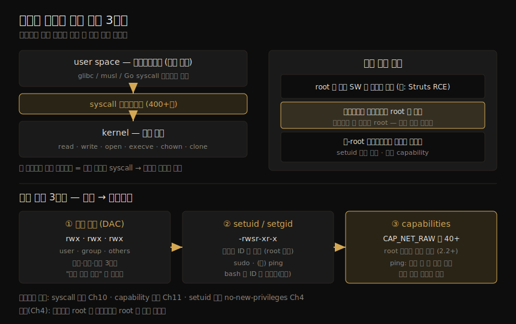

# 리눅스 시스템 콜·권한·Capabilities
---
> 컨테이너는 호스트에서 보이는 평범한 리눅스 프로세스를 돌립니다. 그래서 컨테이너 보안의 모든 통제는 이 장의 리눅스 기초 — 시스템 콜, 파일 권한, capabilities — 위에 얹힙니다. 컨테이너화된 프로세스도 일반 프로세스와 똑같이 syscall 을 쓰고 권한을 필요로 하지만, 컨테이너는 이 권한을 빌드 시점·런타임에 제어하는 새로운 방법을 줍니다. 그것이 보안에 큰 차이를 만듭니다.

이 장이 중요한 이유는 한 문장으로 정리됩니다. 컨테이너 안의 코드도 결국 호스트 커널에 시스템 콜을 거는 리눅스 프로세스이고, 컨테이너 보안 메커니즘은 전부 이 기초 메커니즘을 변형·제한한 것이기 때문입니다. 기초를 모르면 뒤따르는 격리·하드닝 장이 마법처럼 보입니다.

이 노트는 책 Chapter 2 전체 — 시스템 콜, 파일 권한(DAC·setuid/setgid), capabilities, 권한 상승 — 를 한 흐름으로 다룹니다. 각 개념이 컨테이너에서 어느 장으로 이어지는지(syscall 제한 Ch 10, capability 제어 Ch 11, root·탈출 Ch 4·11)를 함께 짚습니다.

> 전제: 이 개념들에 익숙하다면 다음 장(컨테이너의 구성)으로 건너뛰어도 됩니다. 다만 "호스트의 root 와 컨테이너의 root 가 같은 것"이라는 결론(Ch 4)을 이해하려면 이 장의 권한 메커니즘이 바탕이 됩니다.

이 장의 두 축 — user space 가 커널에 일을 청하는 syscall 구조와, 권한이 굵게(DAC)에서 세밀하게(capabilities)로 나뉘는 3계층 — 을 한 장으로 정리하면 다음과 같습니다.




## 1. 시스템 콜 — user space 가 커널에 일을 청하는 창구

> 애플리케이션은 권한이 낮은 user space 에서 돕니다. 파일 접근·네트워크 통신·시각 조회처럼 커널의 도움이 필요한 일은 system call(syscall) 인터페이스로 커널에 요청합니다.

애플리케이션은 **user space** 에서 실행됩니다. 이곳은 운영체제 커널보다 권한 수준이 낮습니다. 그래서 파일을 열거나, 네트워크로 통신하거나, 심지어 현재 시각을 알아내는 것조차 애플리케이션이 직접 할 수 없습니다. 커널에게 대신 해 달라고 청해야 하고, 그 요청에 쓰는 프로그래밍 인터페이스가 **시스템 콜(syscall)** 입니다.

리눅스 커널 버전에 따라 다르지만 시스템 콜은 400개가 넘습니다. 대표적인 몇 가지는 다음과 같습니다.

| syscall | 하는 일 |
|---------|---------|
| `read` | 파일에서 데이터 읽기 |
| `write` | 파일에 데이터 쓰기 |
| `open` | 이후 읽기/쓰기를 위해 파일 열기 |
| `execve` | 실행 파일 실행 |
| `chown` | 파일 소유자 변경 |
| `clone` | 새 프로세스 생성 |

앱 개발자가 syscall 을 직접 다룰 일은 거의 없습니다. 보통 더 높은 추상으로 감싸여 있기 때문입니다. 개발자가 마주칠 가장 낮은 추상이 glibc·musl 라이브러리나 Go 의 `syscall` 패키지이고, 이마저도 대개 그 위 계층에 다시 감싸여 있습니다.

> 컨테이너 안이든 밖이든 앱 코드가 syscall 을 쓰는 방식은 똑같습니다. 그런데 보안에서 결정적인 사실이 하나 있습니다 — **한 호스트의 모든 컨테이너는 같은 커널에 syscall 을 겁니다**(같은 커널을 공유합니다). 이 공유가 뒤에서 다룰 여러 위협의 뿌리입니다.

모든 앱이 모든 syscall 을 필요로 하지는 않습니다. 그래서 최소 권한 원칙을 따라, 프로그램이 접근할 수 있는 syscall 집합을 제한하는 리눅스 보안 기능이 있습니다(컨테이너 적용은 Ch 10).


## 2. 파일 권한 — 리눅스 보안의 주춧돌 (DAC)

> 리눅스에서는 "모든 것이 파일"이고, 파일 권한이 누가 무엇을 할 수 있는지를 정합니다. 이 권한 모델을 임의적 접근 통제(DAC)라 부릅니다.

컨테이너를 쓰든 안 쓰든, 리눅스 시스템에서 파일 권한은 보안의 주춧돌입니다. "리눅스에서는 모든 것이 파일이다"라는 말이 있습니다. 앱 코드·데이터·설정·로그는 물론, 화면이나 프린터 같은 물리 장치도 파일로 표현됩니다. 파일 권한은 어떤 사용자가 그 파일에 접근할 수 있고 어떤 동작을 할 수 있는지를 정합니다. 이 권한 모델을 **임의적 접근 통제(DAC, Discretionary Access Control)** 라 부릅니다.

`ls -l` 출력의 권한 속성은 9개 문자로, **3개씩 세 묶음**으로 읽습니다.

```
-rwxr-xr--  1 liz staff  ...  myapp
 │└┬┘└┬┘└┬┘
 │ │  │  └─ others: 그 외 사용자
 │ │  └──── group:  파일 그룹(staff) 구성원
 │ └─────── user:   소유자(liz)
 └───────── 파일 종류(- 일반 파일)
```

각 묶음의 세 비트는 `r`(읽기)·`w`(쓰기)·`x`(실행)이며, 설정되면 문자, 아니면 `-` 입니다. 위 예에서 소유자 `liz` 만 쓸 수 있고(`w` 는 첫 묶음에만), 소유자와 `staff` 그룹은 실행할 수 있고(`x`), 모든 사용자가 읽을 수 있습니다(`r` 이 세 묶음 모두).

`r`·`w`·`x` 가 끝이 아닙니다. **setuid·setgid·sticky 비트**가 권한에 영향을 줍니다. 앞의 둘은 보안상 중요한데, 프로세스가 추가 권한을 얻게 해 주어 공격자가 악용할 수 있기 때문입니다.


## 3. setuid / setgid — 다른 사용자로 행세하기

> 보통 파일을 실행하면 그 프로세스는 실행한 사람의 사용자 ID 를 물려받습니다. setuid 비트가 켜져 있으면 파일 *소유자* 의 ID 로 돕니다. 이것이 권한 상승의 통로가 됩니다.

평소 파일을 실행하면 시작된 프로세스는 *실행한 사용자* 의 ID 를 상속합니다. 그런데 파일에 **setuid 비트**가 켜져 있으면, 프로세스는 *파일 소유자* 의 ID 로 돕니다. 책은 `sleep` 복사본으로 이를 보여 줍니다.

```bash
$ cp /usr/bin/sleep ./mysleep      # liz 가 복사 → liz 소유
$ sudo chown root ./mysleep        # 소유자를 root 로
$ sudo chmod +s ./mysleep          # setuid 켜기
$ ls -l mysleep
-rwsr-sr-x 1 root liz 35336 ... mysleep   # rwx 의 x 자리에 s
```

이 상태로 일반 사용자가 `./mysleep 10` 을 돌리면, 프로세스는 실행한 `liz` 가 아니라 **소유자 root 의 ID** 로 뜹니다.

```bash
$ ps -fC mysleep
UID    PID  ...  CMD
root  37940 ...  ./mysleep 10      # liz 가 실행했는데 root 로 동작
```

이렇게 setuid 는 일반 사용자에게는 보통 주지 않는 권한을, 그 권한이 필요한 프로그램에 부여하는 장치입니다. 익숙한 예가 `sudo` 입니다 — root 소유에 setuid 가 켜져 있어, 실행되면 root 로 돈 뒤 sudoers 정책을 확인해 실제 호출자가 권한이 있는지 검사합니다.

### ping 과 setuid — 역사적 예

setuid 로 권한을 더하던 정석 예가 `ping` 이었습니다. `ping` 은 ICMP 메시지를 주고받으려고 raw 네트워크 소켓을 열 권한이 필요합니다. 관리자가 사용자에게 `ping` 은 허용하고 싶어도, 사용자가 다른 목적으로 raw 소켓을 여는 것까지 허용하고 싶지는 않습니다. 그래서 `ping` 은 root 소유에 setuid 를 켜 설치돼, root 권한을 빌려 썼습니다.

> 커널 5.6 의 ICMP 소켓 추가로 이제는 이 방식이 필요 없습니다. 다만 집필 시점 대부분의 배포판은 아직 ICMP 소켓 대신, `CAP_NET_RAW` capability 로 `ping` 에 raw 소켓 접근 권한을 줍니다(§4).

### setuid 의 함정 — bash 는 ID 를 되돌린다

setuid 가 켜진 root 소유 실행 파일이라고 늘 root 로 도는 것은 아닙니다. `bash` 복사본으로 시험하면 예상이 빗나갑니다.

```bash
$ sudo chown root ./mybash ; sudo chmod +s ./mybash
$ ./mybash
mybash-5.2$ whoami
liz                                # root 가 아니다!
```

현대 `bash`(그리고 `python`·`node`·`ruby` 같은 여러 인터프리터)는 root 로 시작하더라도, 잠재적 권한 상승을 막으려고 **자기 사용자 ID 를 원래 사용자로 명시적으로 되돌립니다**(`setresuid`/`setuid` syscall 사용). 이렇게 ID 를 되돌리도록 작성된 실행 파일은 극소수이고, `sleep` 복사본처럼 보통의 setuid 동작은 그냥 소유자 ID 를 따릅니다.

### setuid 의 보안 함의

setuid 는 다른 사용자로 행세하게 해 주므로, 가져선 안 될 파일·실행 파일·권한에 접근할 길을 엽니다. 위험한 권한 상승 통로이기 때문에, 일부 이미지 스캐너(Ch 8)는 setuid 비트가 켜진 파일을 보고합니다.

방어책으로 `docker run` 의 `--security-opt no-new-privileges` 옵션으로 컨테이너 안에서 setuid 사용을 막을 수 있습니다(Ch 4). 다만 이것이 공격자가 호스트의 마운트된 디렉토리에 root 소유 setuid 실행 파일을 쓰는 것까지 막지는 못합니다. 호스트 볼륨 마운트는 온갖 공격으로 이어지며 Ch 11 에서 더 다룹니다.

> setuid 는 권한이 단순하던 시절(root 이거나 아니거나) 비-root 사용자에게 추가 권한을 주려고 만든 장치입니다. 리눅스 커널 2.2 가 이 추가 권한을 더 세밀하게 나눈 것이 **capabilities** 입니다.


## 4. Linux Capabilities — 권한의 세분화

> capability 는 root 의 전권을 40여 개로 쪼갠 것입니다. 스레드가 특정 동작을 할 수 있는지를 capability 단위로 정합니다 — 예: 낮은 포트 바인딩은 `CAP_NET_BIND_SERVICE`, raw 소켓은 `CAP_NET_RAW`.

오늘날 리눅스 커널에는 40개가 넘는 capability 가 있습니다. capability 는 스레드에 부여되어 그 스레드가 특정 동작을 할 수 있는지를 정합니다. 대표적인 예는 다음과 같습니다.

| capability | 무엇을 허용 |
|------------|------------|
| `CAP_NET_BIND_SERVICE` | 1024 미만 낮은 포트에 바인딩 |
| `CAP_NET_RAW` | raw 네트워크 소켓 열기(ping 이 씀) |
| `CAP_SYS_BOOT` | 시스템 재부팅 |
| `CAP_SYS_MODULE` | 커널 모듈 적재·제거 |
| `CAP_BPF` | eBPF 프로그램 적재 |

capability 는 파일과 프로세스 양쪽에 부여됩니다. 파일은 `getcap`, 프로세스는 `getpcaps` 로 봅니다.

```bash
$ getcap $(which ping)
/usr/bin/ping cap_net_raw=ep        # 파일에 CAP_NET_RAW
$ getpcaps $$
22355: =                            # 내 셸은 capability 없음
```

> 과거 `getpcaps` 는 root 로 도는 프로세스면 모든 capability 를 가졌다고 가정해 전체 목록을 보여 줬습니다. 지금은 그 가정을 하지 않아, root 프로세스도 보통 capability 없음으로 나옵니다.

### ping 은 왜 CAP_NET_RAW 없이도 소켓을 여는가

`ping` 실행 파일에는 `CAP_NET_RAW` 가 붙어 있는데, 실행 중인 `ping` 프로세스를 `getpcaps` 로 보면 capability 가 비어 있습니다. 모순처럼 보이지만, `strace` 로 syscall 을 추적하면 답이 나옵니다. **현대 `ping` 은 capability 를 인식해, 소켓을 연 뒤 더는 필요 없는 `CAP_NET_RAW` 를 스스로 버립니다.**

```
capget(...)  {permitted=1<<CAP_NET_RAW}        # ① 쓸 수 있는지 확인
capset(...)  {effective=1<<CAP_NET_RAW}         # ② capability 를 effective 로
socket(AF_INET, SOCK_RAW, IPPROTO_ICMP) = 3    # ③ 소켓 열기
capset(...)  {effective=0}                      # ④ 다 썼으니 effective 에서 제거
```

`getpcaps` 가 들여다본 시점엔 이미 ④ 단계가 지나 `CAP_NET_RAW` 가 effective 에서 빠진 뒤였습니다. 최소 권한 원칙의 모범 — 필요한 순간에만 권한을 켜고 즉시 끄는 — 을 코드가 실천한 셈입니다.

> 최소 권한 원칙을 따라, 프로세스가 일하는 데 필요한 capability 만 부여하는 것이 좋습니다. 컨테이너를 돌릴 때 허용할 capability 를 제어할 수 있습니다(Ch 11).


## 5. 권한 상승 — 가져선 안 될 권한으로 넘어가기

> 권한 상승(privilege escalation)은 원래 가져야 할 권한을 넘어, 해선 안 될 동작을 하게 되는 것입니다. 공격자는 취약점이나 잘못된 설정을 이용해 스스로에게 추가 권한을 부여합니다.

**권한 상승**은 원래 가지기로 된 권한을 넘어서서, 허용되지 않은 동작을 할 수 있게 되는 것입니다. 공격자는 시스템 취약점이나 나쁜 설정을 이용해 추가 권한을 얻습니다. 흔한 수법은 이미 root 로 도는 소프트웨어를 찾아 그 알려진 취약점을 악용하는 것입니다. 예를 들어 웹 서버가 root 로 돌고 거기에 원격 코드 실행 취약점(예: Struts 취약점)이 있으면, 공격자가 원격 실행한 코드도 root 권한으로 돕니다. 그래서 가능하면 소프트웨어를 비-root 사용자로 돌리는 것이 좋습니다.

여기서 컨테이너의 결정적 특성이 드러납니다. **기본적으로 컨테이너는 root 로 돕니다.** 전통적 리눅스 머신과 비교하면, 컨테이너 안 애플리케이션은 root 로 도는 경우가 훨씬 많습니다. 컨테이너 안 프로세스를 장악한 공격자는 여전히 컨테이너를 탈출해야 하지만, 일단 탈출하면 호스트의 root 가 되어 더 이상의 권한 상승이 필요 없습니다(Ch 11).

컨테이너가 비-root 사용자로 돌더라도, 이 장에서 본 리눅스 권한 메커니즘만으로 권한 상승의 여지가 남습니다.

1. setuid 비트가 켜진 실행 파일을 포함한 컨테이너 이미지
2. 비-root 컨테이너에 부여된 추가 capability

이 둘을 누그러뜨리는 방법은 뒤의 장들에서 다룹니다.


## 6. 학습 점검 — 백지 복기

> 이 노트를 덮고 입으로 답해 봅니다. 막히는 항목이 다음 장에서 먼저 채울 빈칸입니다.

1. user space 와 커널의 권한 차이를 들고, 앱이 파일을 열 때 왜 syscall 이 필요한지 설명해 봅니다.
2. "한 호스트의 모든 컨테이너가 같은 커널을 공유한다"가 왜 보안 위협의 뿌리인지 한 문장으로 말해 봅니다.
3. `-rwsr-xr-x` 에서 `s` 가 무엇이고, `./mysleep 10` 을 liz 가 실행했는데 root 로 뜨는 이유를 설명해 봅니다.
4. `bash` 복사본에 setuid 를 켜도 root 가 안 되는 이유는? 어떤 syscall 이 관여하나요?
5. `ping` 실행 파일엔 `CAP_NET_RAW` 가 있는데 실행 중 프로세스엔 없는 이유를, capget/capset/socket 4단계로 그려 봅니다.
6. "기본적으로 컨테이너는 root 로 돈다"가 권한 상승 관점에서 왜 위험한지, 컨테이너 탈출과 연결해 설명해 봅니다.

> 답이 막힌 항목은 이정표입니다. 이 노트의 역할은 그 빈칸의 위치를 알려 주는 것까지입니다.


## 다음 단계

> 리눅스 권한 기초를 잡았으니, 다음 장부터 이 기초로 컨테이너가 어떻게 만들어지는지를 봅니다.

이 장은 뒤따르는 장들을 이해하는 데 필수인 리눅스 메커니즘 — 시스템 콜, 파일 권한, capabilities, 권한 상승 — 을 정리했습니다. 컨테이너 보안 통제는 모두 이 기초 위에 세워집니다.

작성 순서는 책 구조를 따릅니다(전체 지도는 [개요 노트](./00-00.책%20개요와%20학습%20로드맵.md) 참조).

1. **Ch 3~4**: 컨테이너의 구성과 격리 — "호스트의 root 와 컨테이너의 root 가 같다"는 결론을 이 장의 권한 메커니즘 위에서 확인.
2. **Ch 5**: VM 격리 비교 — user space/커널 권한 이야기가 다시 등장.
3. **Ch 10~11**: syscall 제한·capability 제어·setuid 차단 등 이 장 개념의 컨테이너 적용.


## 관련 문서

> 이 장은 리눅스 권한의 기초이고, user namespace 를 통한 UID 격리는 02_os 의 커널 노트가 운영 관점에서 다룹니다.

- [01-01.컨테이너 보안 위협 — 위협 모델·공격 벡터·보안 원칙](./01-01.컨테이너%20보안%20위협%20—%20위협%20모델·공격%20벡터·보안%20원칙.md) — 이 장의 권한 메커니즘이 받쳐 주는 위협 모델(특히 권한 상승·공격 사슬)
- [00-00.책 개요와 학습 로드맵](./00-00.책%20개요와%20학습%20로드맵.md) — 16챕터 전체 지도
- [02_os/kernel/01-07.OverlayFS와 user namespace — Netflix UID 격리](../../kernel/01-07.OverlayFS와%20user%20namespace%20—%20Netflix%20UID%20격리.md) — UID 매핑으로 컨테이너 root 와 호스트 비-root 를 분리하는 운영 사례. §5 "기본 root 실행" 위험의 완화 한 갈래
