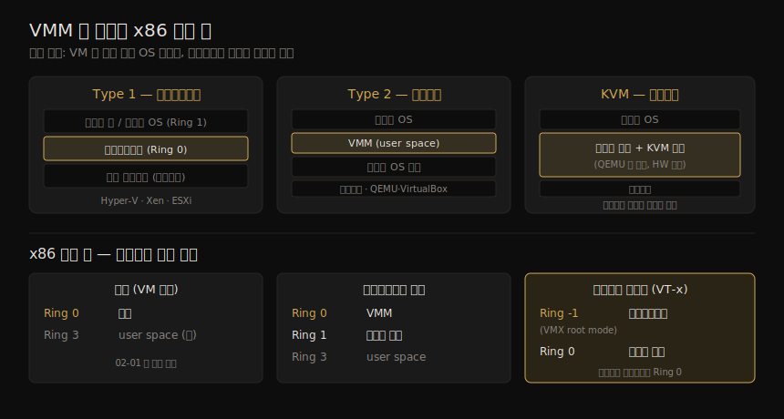
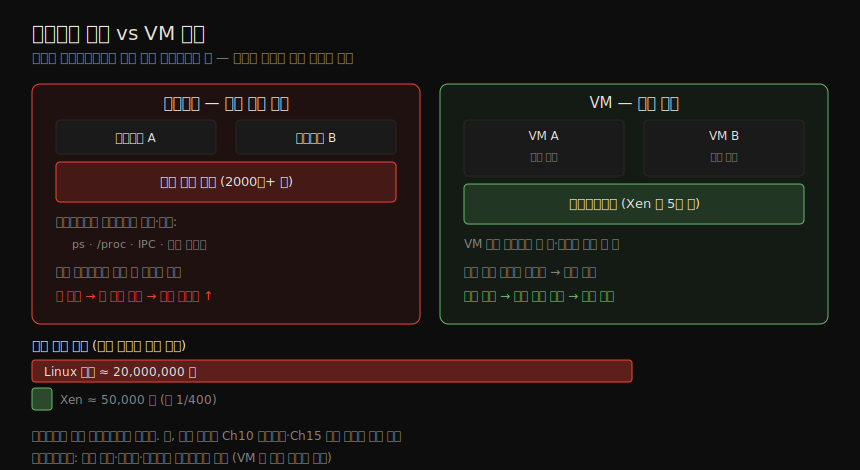

# 가상 머신 — VMM과 격리 비교
---
> 컨테이너는 격리 측면에서 VM 과 자주 비교됩니다. 근본적 차이는 하나입니다 — **VM 은 커널을 포함한 운영체제 전체 사본을 돌리고, 컨테이너는 호스트의 커널을 공유합니다.** 이 차이가 격리 강도를 가릅니다. VMM(가상 머신 모니터)이 자원을 나눠 각 VM 에 자기 커널을 주고, 하이퍼바이저는 풀 커널보다 훨씬 작고 단순해 공격 표면이 작습니다. 그래서 VM 격리는 강하다고 여겨지고, 컨테이너는 강한 멀티테넌시 환경에는 적합하지 않다고 봅니다.

이 장은 컨테이너를 VM 과 견주기 위한 장입니다. 둘의 차이를 정확히 알면 전통적 보안 수단이 컨테이너에서 어디까지 통하는지, 그리고 Ch 10 의 샌드박싱 도구(컨테이너를 VM 에 가깝게 만드는)가 무엇을 강화하는지를 판단할 수 있습니다. 사실 둘의 경계는 칼로 자르듯 명확하지는 않지만, "보통 컨테이너" 와 VM 의 차이를 먼저 단단히 잡아야 그 회색지대를 이해할 수 있습니다.

이 노트는 머신 부팅에서 출발해 VMM 의 역할, Type 1·Type 2·KVM 의 구분, trap-and-emulate 메커니즘, 그리고 핵심인 **격리 강도 비교** 로 이어집니다. 앞 장(04)이 "컨테이너가 무엇인가" 였다면, 이 장은 "왜 컨테이너 격리가 VM 보다 약한가" 의 답입니다.

> 전제: 이 장은 VM 의 작동 원리와 격리 비교에 집중합니다. VM 자체를 보안하는 방법은 이 책 범위 밖이고, 호스트 설정 하드닝은 04-02 §4 에서 다뤘습니다.

## 1. 머신 부팅과 VMM 의 등장

> 일반 시스템은 부트로더가 OS 커널을 띄우고, 커널이 Ring 0 에서 자원을 직접 관리합니다. VM 환경에서는 VMM 이 그 첫 계층을 맡아 자원을 쪼개 각 VM 에 나눠 주고, 각 VM 은 자기 커널을 받습니다.

물리 서버를 켜면 BIOS(현대는 UEFI)가 메모리·네트워크 인터페이스·장치를 열거하고, 부트로더가 OS 커널을 적재·실행합니다. 02-01 에서 봤듯 커널 코드는 애플리케이션보다 높은 권한으로 돕니다. x86 에서 권한 수준은 **링(ring)** 으로 조직되며, **Ring 0 이 가장 높고 Ring 3 이 가장 낮습니다.** 일반 설정(VM 없음)에서는 커널이 Ring 0, user space 코드가 Ring 3 에서 돕니다.

커널은 초기화를 마치면 user space 프로그램을 시작합니다. 프로세스가 도는 CPU 스레드를 시작·관리·스케줄링하고, 프로세스를 나타내는 자료구조로 추적합니다. 그중 중요한 것이 **메모리 관리** 입니다 — 커널은 각 프로세스에 메모리 블록을 할당하고, 프로세스끼리 서로의 메모리에 접근하지 못하게 막습니다. 이 "메모리 격리 책임" 이 뒤의 격리 비교에서 핵심이 됩니다.

VM 의 세계에서는 **VMM(Virtual Machine Monitor)** 이 자원 관리의 첫 계층을 맡습니다. 자원을 쪼개 각 VM 에 할당하고, **각 VM 은 자기만의 커널을 받습니다.** 일반 서버에서 BIOS 가 커널에 머신 자원 정보를 주듯, VM 환경에서는 VMM 이 자원을 나눠 각 게스트 커널에 *그 부분집합* 의 정보만 줍니다. 게스트 OS 는 물리 메모리·장치에 직접 접근한다고 여기지만, 실제로는 VMM 이 제공하는 추상에 접근하는 것입니다.

> VMM 의 책임은 게스트 OS 와 그 애플리케이션이 할당된 자원의 경계를 넘지 못하게 막는 것입니다. 예를 들어 게스트에 호스트 메모리의 한 범위가 할당되면, 게스트가 그 범위 밖 메모리에 접근하려는 시도는 금지됩니다. ("virtual machine manager" 라는 용어도 보이는데, 이는 virt-manager·lima 같은 *관리 도구* 를 가리키며 가상화를 제공하는 구성 요소와는 다릅니다.)

## 2. VMM 의 세 유형 — Type 1·Type 2·KVM

> VMM 은 크게 Type 1(베어메탈 하이퍼바이저)과 Type 2(호스트 OS 위 user space)로 나뉘고, 그 사이 회색지대에 KVM(커널 모듈)이 있습니다.

세 유형의 핵심 차이는 "VMM 이 어디서 도는가" 입니다.

| 유형 | VMM 위치 | 예 | 게스트 커널 |
|------|---------|-----|------------|
| Type 1 (하이퍼바이저) | 베어메탈 위 직접(Ring 0), OS 없음 | Hyper-V, Xen, ESXi | Ring 1(하이퍼바이저보다 낮은 권한) |
| Type 2 (호스티드) | 호스트 OS 의 user space | QEMU, Parallels, VirtualBox | 게스트·호스트 OS 가 공존 |
| KVM (회색지대) | 호스트 OS 의 *커널 안* | Linux KVM 모듈 | 호스트 커널에서 직접 |

**Type 1 하이퍼바이저** 는 부트로더가 OS 커널 대신 전용 커널급 VMM 을 띄웁니다. 하드웨어 위에서 직접 돌고(그 아래 OS 없음), Ring 0 에서 돕니다. 게스트 OS 커널은 Ring 1 에서 돌아 하이퍼바이저보다 권한이 낮습니다.

**Type 2 VMM** 은 노트북·데스크톱에서 VM 을 돌릴 때입니다. macOS 위에서 QEMU 로 Linux 게스트를 돌리면, macOS 커널과 별개의 Linux 커널이 반드시 있어야 합니다. VMM 애플리케이션은 사용자가 다루는 user space 부분과, 가상화를 제공하는 특권 구성 요소를 함께 설치합니다.

세 유형이 "VMM 이 어디서 도는가" 로 갈리는 모습과 각 환경의 권한 링 배치를 한 장으로 정리하면 다음과 같습니다.

**KVM(Kernel-based Virtual Machine)** 은 둘 사이 회색지대입니다. 호스트 OS *커널 안* 에서 VMM 을 돌립니다. 게스트 OS 가 호스트 OS 를 거치지 않아 보통 Type 1 으로 분류되지만, 이 분류는 지나치게 단순합니다. KVM 은 흔히 QEMU 와 함께 쓰이며 — QEMU 가 게스트 syscall 을 호스트 syscall 로 동적 변환하고, KVM 의 하드웨어 가속을 활용합니다.

> KubeVirt: Kubernetes Pod 의 컨테이너 *안* 에서 VM 을 돌리는 프로젝트입니다. KVM 가상화를 쓰므로 컨테이너 안 게스트 VM 은 실제로 호스트 커널에서 직접 돕니다. 그 호스트가 다시 VM(예: 퍼블릭 클라우드의 관리형 K8s 노드)이면 **중첩 가상화(nested virtualization)** 가 되며, 인스턴스에 명시적 설정이 필요할 수 있습니다(모든 인스턴스 유형이 지원하지는 않습니다).

## 3. trap-and-emulate 와 비가상화 명령

> VMM 의 기본 아이디어는 trap-and-emulate 입니다. 게스트가 특권 명령을 실행하면 trap 이 걸려 VMM 핸들러가 대신 처리합니다. 다만 x86 은 "민감하지만 특권이 아닌" 비가상화 명령이 있어 추가 기법이 필요합니다.

일부 CPU 명령은 **특권(privileged)** 이라 Ring 0 에서만 실행됩니다. 더 높은 링에서 시도하면 **trap** 이 걸립니다 — 애플리케이션의 예외가 에러 핸들러를 부르듯, trap 은 CPU 가 Ring 0 코드의 핸들러를 부르게 합니다. VMM 이 Ring 0 에, 게스트 OS 커널이 더 낮은 권한에 있으면, 게스트가 실행한 특권 명령이 VMM 의 핸들러를 불러 그 명령을 *에뮬레이트* 하게 합니다. 이렇게 VMM 은 게스트 OS 들이 특권 명령으로 서로 간섭하지 못하게 보장합니다.

문제는 특권 명령이 이야기의 전부가 아니라는 점입니다. 머신 자원에 영향을 주는 명령 집합을 **민감(sensitive)** 명령이라 하는데, x86 에서는 **민감하지만 특권은 아닌** 명령이 있습니다. 이런 명령은 trap 이 안 걸려 VMM 이 가로채지 못하므로 "비가상화(non-virtualizable)" 라 불립니다. 게스트 OS 코드는 Ring 0 동작을 가정하고 쓰였기에, VMM 이 이를 따로 처리해야 합니다.

비가상화 명령을 다루는 세 기법이 있습니다.

| 기법 | 방식 | 쓰는 곳 |
|------|------|--------|
| 이진 변환(binary translation) | VMM 이 실시간으로 비특권·민감 명령을 찾아 다시 씀 | 신형 x86 의 하드웨어 보조로 단순화 |
| 반가상화(paravirtualization) | 게스트 OS 를 비가상화 명령을 피하도록 고쳐 씀(하이퍼바이저에 syscall) | Xen |
| 하드웨어 가상화(예: Intel VT-x) | 하이퍼바이저를 Ring -1(VMX root mode)에서 돌려, 게스트 커널을 Ring 0 처럼 | 현대 CPU |

## 4. 프로세스 격리와 보안 — 왜 VM 격리가 더 강한가

> 핵심 질문입니다 — 커널도 하이퍼바이저처럼 메모리·장치 접근을 관리하는데, 왜 VM 격리가 더 강하다고 할까요? 답은 하이퍼바이저의 일이 훨씬 단순하고, 그래서 코드가 훨씬 작기 때문입니다.

애플리케이션을 서로 안전하게 격리하는 것은 일차적 보안 관심사입니다. 내 앱이 당신 앱의 메모리를 읽을 수 있다면 당신 데이터에 접근하는 셈이기 때문입니다. **물리적 격리** 가 가장 강합니다 — 완전히 별개의 물리 머신에서 돌면 내 코드가 당신 앱의 메모리에 닿을 길이 없습니다.

커널은 user space 프로세스를 관리하며 각 프로세스에 메모리를 할당하고, 한 앱이 다른 앱의 메모리에 접근하지 못하게 막습니다. 그런데 커널의 메모리 관리에 버그가 있으면 공격자가 닿아선 안 될 메모리에 닿을 수 있습니다. 커널은 오랫동안 실전에서 검증돼 왔지만 동시에 거대하고 복잡하며 여전히 진화 중입니다. 이런 결함은 하드웨어의 정교함에서 비롯되기도 합니다 — 근래 CPU 의 **투기적 실행(speculative processing)** 이 성능을 크게 올렸지만, 동시에 Spectre·Meltdown 익스플로잇의 문을 열었습니다.

그렇다면 왜 하이퍼바이저가 커널보다 강한 격리를 준다고 할까요? 하이퍼바이저 결함도 VM 간 격리에 심각한 문제를 낼 수 있는데도 말입니다. **차이는 하이퍼바이저의 일이 훨씬, 훨씬 단순하다는 데 있습니다.**

| 측면 | 커널(프로세스 격리) | 하이퍼바이저(VM 격리) |
|------|---------------------|------------------------|
| 프로세스끼리 가시성 | `ps`·`/proc` 로 서로 보임 | 한 VM 에서 다른 VM 프로세스 못 봄 |
| 메모리 공유 | IPC·공유 메모리로 의도적 공유 허용 | VM 끼리 메모리 공유 안 함 |
| 처리할 상황 | 프로세스 간 합법적 정보 공유까지 | 공유를 처리할 필요 없음 → 코드 적음 |
| 코드 규모 | Linux 커널 **2,000만+ 줄** | Xen 하이퍼바이저 **약 5만 줄** |

커널에서는 한 프로세스가 다른 프로세스의 정보를 *합법적으로* 발견하도록 허용된 메커니즘(`ps`, `/proc`, IPC, 공유 메모리)이 많고, 이 통로 하나하나가 예기치 않은 결함으로 격리를 약하게 만들 여지입니다. VM 에는 그런 등가물이 없습니다 — VM 끼리 프로세스를 못 보고 메모리를 공유하지 않으므로, 하이퍼바이저는 그런 상황을 처리할 코드가 필요 없어 풀 커널보다 훨씬 작고 단순합니다. 두 격리의 강도 차이를 한 장으로 정리하면 다음과 같습니다.

> 코드가 적고 복잡도가 낮으면 공격 표면이 작고 악용 가능한 결함의 가능성도 낮습니다. 그래서 VM 은 강한 격리 경계를 가졌다고 여겨집니다. 다만 VM 익스플로잇이 없는 것은 아니며(NIST 가 가상화 환경 하드닝 지침을 냅니다), 절대적이지는 않습니다.

## 5. VM 의 단점과 컨테이너 격리 비교

> VM 격리가 그렇게 강하다면 왜 컨테이너를 쓸까요? 시작 시간·이식성·비용에서 VM 이 불리하기 때문입니다. 그리고 컨테이너의 약한 격리는 Ch 10 의 샌드박싱으로 강화할 수 있습니다.

VM 의 격리 이점에도 컨테이너를 쓰는 이유는 VM 의 단점에 있습니다.

1. **시작 시간**: VM 은 컨테이너보다 시작 시간이 몇 자릿수 깁니다. 컨테이너는 새 리눅스 프로세스를 시작할 뿐이지만, VM 은 전체 부팅·초기화를 거칩니다. 느린 시작은 오토스케일링에 둔하고, 하루에 여러 번 코드를 배포하려는 조직에 불리합니다(다만 빠른 시작의 "마이크로 VM" 이 있으며 Ch 10 에서 다룹니다).
2. **이식성**: 컨테이너는 "build once, run anywhere" 를 빠르고 효율적으로 줍니다. VM 전체 이미지를 만들어 노트북에서 돌릴 수도 있지만 훨씬 느리고, 컨테이너만큼 개발자 사이에 자리 잡지 못했습니다.
3. **비용**: 클라우드에서 VM 을 빌리면 CPU·메모리를 지정해야 하고, 안에서 실제로 얼마를 쓰든 그 자원만큼 비용을 냅니다.

VM 과 컨테이너 중 무엇을 쓸지는 성능·가격·편의·위험·필요한 보안 경계 강도 사이의 트레이드오프입니다.

04 장에서 봤듯 **컨테이너는 시야가 제한된 리눅스 프로세스** 일 뿐이고, namespace·cgroup·root 변경으로 커널이 서로 격리합니다. 이 메커니즘들은 프로세스 간 격리를 위해 만들어졌지만, **컨테이너가 커널을 공유한다는 단순한 사실** 때문에 기본 격리는 VM 보다 약합니다.

> 그래도 길은 있습니다. 추가 보안 기능과 샌드박싱으로 이 격리를 강화할 수 있고(Ch 10), 컨테이너가 마이크로서비스를 캡슐화하는 경향을 활용한 효과적 보안 도구도 있습니다(Ch 15). "약한 기본 격리 + 강화 수단" 이 컨테이너 보안의 현실적 그림입니다.

## 6. 학습 점검 — 백지 복기

> 이 노트를 덮고 입으로 답해 봅니다.

1. VM 과 컨테이너의 근본적 차이를 "커널" 한 단어로 설명해 봅니다.
2. x86 권한 링에서 Ring 0·Ring 1·Ring 3·Ring -1 이 각각 무엇인지(일반·하이퍼바이저·VT-x) 말해 봅니다.
3. Type 1·Type 2·KVM 이 "VMM 이 어디서 도는가" 로 어떻게 갈리는지 구분해 봅니다.
4. trap-and-emulate 가 무엇이고, "민감하지만 특권이 아닌" 비가상화 명령이 왜 문제인지 설명해 봅니다.
5. 커널 2,000만 줄 vs Xen 5만 줄이 격리 강도와 어떻게 연결되는지, `ps`·`/proc`·IPC 를 들어 말해 봅니다.
6. VM 격리가 더 강한데도 컨테이너를 쓰는 세 가지 이유(시작 시간·이식성·비용)를 들어 봅니다.

> 답이 막힌 항목은 이정표입니다.

## 다음 단계

> 컨테이너와 VM 의 격리 차이를 잡았으니, 다음 장부터 컨테이너 이미지로 내려갑니다.

이 장으로 VM 이 무엇이고, 왜 VM 간 격리가 컨테이너 격리보다 강하다고 여겨지며, 왜 컨테이너가 강한 멀티테넌시 환경에 적합하지 않다고 보는지를 이해했습니다. 이 차이는 컨테이너 보안을 논할 때 도구상자에 넣어 둘 중요한 도구입니다.

이 장으로 ② 해부 그룹(Ch 3~5)이 끝났습니다. 다음 장(Ch 6)부터는 ③ 이미지·공급망 그룹 — 컨테이너 이미지 안에 무엇이 들었고, 이미지가 보안에 어떤 영향을 주는지 — 으로 넘어갑니다. 뒤의 장들에서는 컨테이너의 약한 격리가 오설정으로 쉽게 깨지는 예도 보게 됩니다(Ch 11).

## 관련 문서

> 이 장은 VM 격리를 컨테이너 격리와 견줍니다. 컨테이너 쪽 메커니즘은 04 장이, 권한 링의 기초는 02-01 이 받칩니다.

- [04-02.컨테이너 격리 (2) — user namespace·Pod·호스트 관점](./04-02.컨테이너%20격리%20(2)%20—%20user%20namespace·Pod·호스트%20관점.md) — "컨테이너는 호스트 커널을 공유한다" 는 이 장 비교의 출발점
- [02-01.리눅스 시스템 콜·권한·Capabilities](./02-01.리눅스%20시스템%20콜·권한·Capabilities.md) — §1 user space/커널 권한 차이. 이 장의 Ring 0/Ring 3 권한 모델의 기초
- [00-00.책 개요와 학습 로드맵](./00-00.책%20개요와%20학습%20로드맵.md) — 16챕터 전체 지도. 이 장으로 ② 해부 그룹 완료
