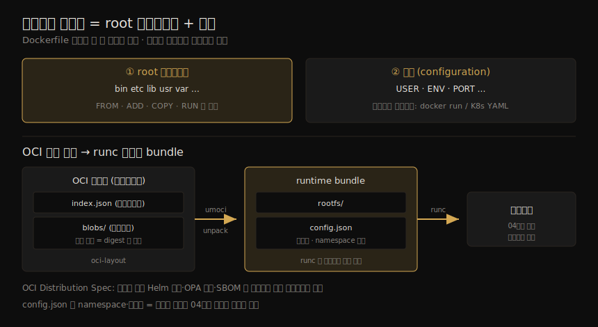
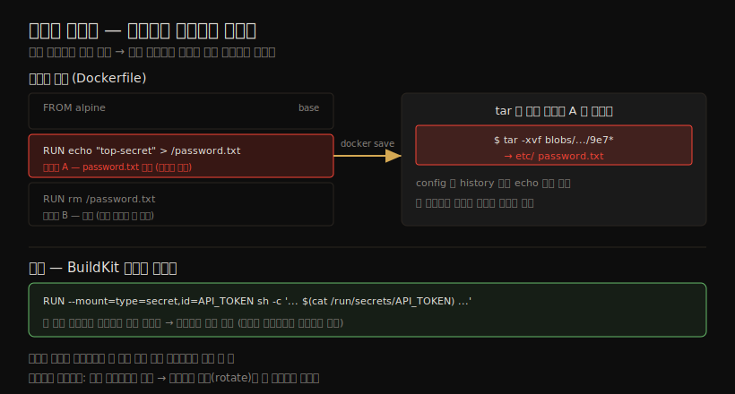

# 컨테이너 이미지 — 구조·빌드·저장
---
> 컨테이너 이미지는 두 부분 — root 파일시스템과 설정(configuration) — 으로 이뤄집니다. 이미지가 무엇으로 구성되는지를 알면, 이미지를 빌드·저장·가져올 때의 보안 함의를 따질 수 있습니다. 이 단계들에는 공격 벡터가 많습니다. 빌드 데몬이 root 로 돈다는 점, 삭제한 시크릿이 레이어에 그대로 남는다는 점, 태그는 옮길 수 있지만 digest 는 내용에 묶인다는 점이 핵심입니다.

이미 Docker·Kubernetes 를 써 봤다면 레지스트리에 저장하는 컨테이너 이미지 개념에 익숙할 것입니다. 이 장은 그 이미지가 실제로 무엇을 담고, Docker·containerd·podman·CRI-O 같은 런타임이 이를 어떻게 쓰는지를 파고듭니다. 그 위에서 빌드·저장·취득 과정의 보안 위험과 모범 관행을 봅니다.

이 노트는 Chapter 6 전체 — 이미지의 두 부분, OCI 표준, 빌드(와 Docker 빌드의 위험), 레이어와 시크릿, 멀티플랫폼, 저장과 식별 — 을 한 흐름으로 다룹니다. ③ 이미지·공급망 그룹의 첫 장이고, 다음 장(Ch 7)의 공급망 보안으로 이어집니다.

> 전제: 이 장은 이미지 *구조와 빌드* 의 보안을 다룹니다. 이미지에 든 취약점 스캔은 Ch 8, 시크릿을 런타임에 전달하는 방법은 Ch 14, 변조 방지(공급망)는 Ch 7 입니다.


## 1. 이미지의 두 부분 — root 파일시스템과 설정

> 이미지는 root 파일시스템과 설정 정보로 이뤄집니다. Dockerfile 의 `FROM`·`COPY`·`RUN` 은 파일시스템을, `USER`·`ENV`·`PORT` 는 설정을 바꿉니다. 설정은 런타임에 덮어쓸 수 있습니다.

컨테이너 이미지는 두 부분으로 나뉩니다. **root 파일시스템** 과 **설정(configuration)** 입니다. 04 장에서 Alpine root 파일시스템을 내려받아 컨테이너의 root 로 쓴 것처럼, 컨테이너를 시작하면 이미지로부터 인스턴스화되며 이미지가 root 파일시스템을 담습니다.

Dockerfile 의 명령은 둘 중 하나에 작용합니다.

| 작용 대상 | Dockerfile 명령 |
|-----------|----------------|
| root 파일시스템 변경 | `FROM`, `ADD`, `COPY`, `RUN` |
| 설정 정보 변경 | `USER`, `PORT`, `ENV` |

설정 정보는 이미지를 돌릴 때 기본으로 설정될 런타임 매개변수를 Docker 에 지시합니다. 예를 들어 Dockerfile 의 `ENV` 로 환경변수를 지정하면, 컨테이너 프로세스가 돌 때 그 환경변수가 정의됩니다. `docker inspect` 로 이 설정 정보를 볼 수 있습니다.

### 런타임에 설정 덮어쓰기

설정은 런타임에 덮어쓸 수 있습니다. Docker 는 명령줄 매개변수로, Kubernetes 는 Pod YAML 로 합니다.

```bash
$ docker run --rm -it alpine whoami
root
$ docker run --rm -it --user 405 alpine whoami    # 이미지의 USER 를 덮어씀
guest
```

```yaml
spec:
  containers:
  - name: demo-container
    image: demo-reg.io/some-org/demo-image:1.0
    env:
    - name: DEMO_ENV
      value: "This overrides the value"     # 이미지의 ENV 를 덮어씀
  securityContext:
    runAsUser: 1000                          # 이미지의 USER 를 덮어씀
```

OCI 준수 런타임(containerd/runc)이면 이 YAML 값들이 OCI 준수 `config.json` 파일로 흘러 들어갑니다.


## 2. OCI 표준과 이미지 구조

> OCI(Open Container Initiative)는 이미지·런타임 표준을 정의합니다. 이미지는 매니페스트·blob(레이어)로 이뤄지고 digest 로 식별됩니다. runc 는 이미지를 그대로 쓰지 않고 runtime bundle(rootfs + config.json)로 풀어 씁니다.

OCI 는 Docker 의 작업을 이어받아 이미지·런타임 표준을 정의하려 만들어졌습니다. Image Format Spec 1.0(2017)에 이어 Distribution Spec 1.0(2021)이 push/pull 방식을 정의했고, 지금은 Harbor·Docker Hub·AWS ECR·GitHub Container Registry 등 레지스트리에 폭넓게 구현돼 있습니다.

이미지의 한 장으로 본 구조와, 그것이 런타임에서 풀리는 흐름은 다음과 같습니다.



`skopeo` 로 Docker 이미지를 OCI 포맷으로 바꾸면 `blobs`·`index.json`·`oci-layout` 이 나옵니다. `index.json` 의 매니페스트에는 이미지를 식별하는 고유 **digest** 가 들어 있고, 이 digest 가 `blobs` 의 한 blob 과 일치합니다. 이 blob 들이 이미지의 **레이어** 입니다.

```bash
$ skopeo copy docker://alpine:latest oci:alpine:latest
$ ls alpine
blobs  index.json  oci-layout
```

OCI 준수 런타임 runc 는 이 포맷을 직접 쓰지 않습니다. 먼저 **runtime filesystem bundle** 로 풀어야 합니다. `umoci` 로 풀면 `rootfs` 디렉토리(Alpine 배포판 내용)와 `config.json`(런타임 설정)이 나옵니다.

```bash
$ sudo umoci unpack --image alpine:latest alpine-bundle
$ ls alpine-bundle           # config.json  rootfs  ...
```

`config.json` 에는 03·04 장에서 본 내용이 그대로 담깁니다 — runc 가 컨테이너를 만들 때 할 모든 것: `/proc`·cgroup 마운트 목록, 그리고 생성할 **namespace 목록**(pid·network·ipc·uts·mount). 즉 이미지 설정이 04 장의 격리 메커니즘을 그대로 지시하는 것입니다.

> OCI Distribution Spec 은 컨테이너 이미지만이 아니라 임의 콘텐츠 저장을 허용합니다. 그래서 레지스트리에 Helm 차트, OPA 정책, SBOM·attestation(Ch 7) 같은 컨테이너 인접 아티팩트도 저장됩니다.


## 3. 이미지 빌드와 Docker 빌드의 위험

> 대부분 `docker build` 로 Dockerfile 을 따라 이미지를 만듭니다. 그런데 고전 Docker 구조에서 데몬은 root 로 돌고 Docker 소켓에 접근하는 누구나 그 데몬에 명령을 보낼 수 있습니다 — 빌드를 돌릴 수 있으면 사실상 그 머신의 root 입니다.

대부분의 이미지 빌드는 Dockerfile 로 정의되고 `docker build` 로 만듭니다. 근래 Docker 는 Moby 프로젝트의 **BuildKit** 을 도입해(v23+ 기본 빌더) rootless 모드, 멀티플랫폼 빌드, 다중 레지스트리 push 등을 지원합니다.

고전 Docker 구조의 보안 위험을 짚어야 합니다. `docker` CLI 자체는 거의 일하지 않고, 명령을 API 요청으로 바꿔 **Docker 소켓** 을 통해 데몬에 보냅니다. **이 소켓에 접근하는 어떤 프로세스든 데몬에 API 요청을 보낼 수 있습니다.** 데몬은 컨테이너·이미지를 실제로 돌리는 장수 프로세스로, namespace 를 만들어야 하므로 **root 로 돕니다**.

```bash
$ ps -fC dockerd
UID   PID  ...  CMD
root 22240 ...  /usr/bin/dockerd ...     # 데몬은 root
```

여기서 위험이 나옵니다. 사용자는 Dockerfile 의 `RUN` 명령으로 데몬이 임의 명령을 실행하게 할 수 있습니다. **데몬이 root 로 도니, 빌드를 돌릴 수 있는 누구나 사실상 그 머신의 root 권한을 가진 셈입니다.** 게다가 악의적 행위를 해도 추적이 어렵습니다 — 감사 로그가 사용자 ID 가 아니라 데몬 프로세스 ID 를 기록하기 때문입니다.

이 위험을 피하는 데몬 비의존 빌드 방법이 여럿 있습니다.

| 도구·방식 | 특징 |
|-----------|------|
| BuildKit `docker-container` 드라이버 | 빌드를 컨테이너 안에서 격리 실행 |
| Docker rootless 모드 | `buildkitd` 를 비-root 로(opt-in) |
| podman · buildah (Red Hat) | 비특권 빌드, 데몬리스 |
| Bazel · Nix | 결정론적·재현 가능 빌드 |
| ko (Go) · jib (Java) | 언어 특화 이미지 빌드 |

> 수동으로 돌릴 수도 있지만, 프로덕션 빌드는 CI/CD 파이프라인으로 자동화하는 것이 보통입니다.


## 4. 이미지 레이어와 시크릿 — 삭제해도 남는다

> Dockerfile 의 각 명령은 파일시스템 레이어나 설정 변경을 낳습니다. 모든 레이어가 따로 저장되므로, 다음 레이어가 파일을 지워도 **이전 레이어에 그 파일이 그대로 남습니다.** 이미지에 시크릿을 넣으면 안 됩니다.

Dockerfile 의 각 명령은 파일시스템 레이어 또는 설정 변경을 만듭니다. 이미지에 접근할 수 있는 누구나 그 이미지에 든 어떤 파일에도 접근할 수 있으므로, 비밀번호·토큰 같은 민감 정보를 이미지에 넣지 말아야 합니다.

핵심 함정은 **레이어가 각각 따로 저장된다** 는 점입니다. 한 레이어가 파일을 만들고 다음 레이어가 지워도, 그 파일은 이전 레이어에 남습니다. 이 위험을 한 장으로 정리하면 다음과 같습니다.



```dockerfile
FROM alpine
RUN echo "top-secret" > /password.txt   # 레이어 A: 생성
RUN rm /password.txt                     # 레이어 B: 삭제
```

빌드 후 실행하면 `password.txt` 가 없어 보입니다(`ls: No such file`). 하지만 속으면 안 됩니다 — `docker save` 로 tar 를 풀면 시크릿이 그대로 있습니다.

```bash
$ docker save sensitive > sensitive.tar
$ tar -xf sensitive.tar       # blobs/ index.json manifest.json ...
$ tar -xvf blobs/sha256/9e7*  # 해당 레이어 풀기 → etc/ password.txt
$ cat password.txt
top-secret                    # 삭제했어도 레이어에 남음
```

`config` 의 `history` 에도 `RUN echo "top-secret"...` 명령이 그대로 드러납니다. **어떤 레이어에든 한 번이라도 존재한 파일은 이미지를 풀면 쉽게 꺼낼 수 있습니다.** 이미지 접근자 누구에게도 보여줄 수 없는 것은 어떤 레이어에도 넣지 말아야 합니다.

> 이미지에서 시크릿이 발견되면, 미래 버전에 안 들어가게 빌드를 고치는 것만으로 부족합니다 — **그 시크릿을 회전(rotate)** 해, 옛 이미지 접근자에게 무용하게 만들어야 합니다. 스캐너(Ch 8)는 레이어에 든 시크릿도 검출할 수 있습니다.

### BuildKit 시크릿 마운트 — 레이어에 안 남기기

빌드 중 시크릿이 필요하면 BuildKit 의 시크릿 마운트로 레이어에 쓰지 않고 전달할 수 있습니다. 시크릿은 그 빌드 단계에만 임시 마운트되고 메모리에만 존재합니다.

```bash
$ docker build --secret id=API_TOKEN,src=token.txt .
```

```dockerfile
RUN --mount=type=secret,id=API_TOKEN \
    sh -c 'curl -H "Authorization: Bearer $(cat /run/secrets/API_TOKEN)" ...'
```

> 다만 시크릿 값을 파일로 영속화하는 명령을 쓰면 이 이점이 사라집니다. `RUN --mount=type=secret,id=x cat /run/secret/x > out.txt` 같은 패턴은 `out.txt` 를 이미지에 남기므로 피해야 합니다.


## 5. 멀티플랫폼 이미지

> 이미지는 여러 CPU 아키텍처(amd64·arm64)를 지원하도록 빌드할 수 있습니다. 멀티플랫폼 이미지는 아키텍처별 이미지를 가리키는 manifest list 를 갖고, 런타임은 자기 플랫폼에 맞는 것을 가져옵니다.

이미지는 amd64(Intel)·arm64(ARM) 등 여러 CPU 아키텍처를 지원할 수 있습니다. 멀티플랫폼 이미지는 아키텍처별 이미지를 가리키는 **manifest list** 를 갖고, 각 플랫폼 이미지는 자기 digest 로 식별됩니다. 런타임은 pull 할 때 자기 플랫폼에 맞는 이미지를 가져옵니다.

```bash
$ docker manifest inspect alpine    # platform: amd64 / arm64 ... 각각 digest
```

> 플랫폼별 이미지의 내용은 서로 독립적입니다. 여러 플랫폼이 섞인 환경이면 **모든 플랫폼에 대해** 취약점·오설정 스캔을 해야 합니다 — 내용이 같다는 보장이 없기 때문입니다(스캔은 Ch 8).


## 6. 이미지 저장과 식별 — 태그 vs digest

> 이미지는 레지스트리에 저장됩니다. 각 레이어는 내용 해시로 식별되는 blob 으로 한 번만 저장됩니다. 이미지 매니페스트의 해시가 **digest** 입니다. 태그는 옮길 수 있어 같은 결과를 보장하지 못하지만, digest 는 내용에 묶여 동일 이미지를 보장합니다.

이미지는 컨테이너 레지스트리에 저장됩니다(Docker Hub, AWS ECR, GCR, Harbor 등). **자체 레지스트리** 를 운영하면 누가 push/pull 하는지 통제·가시성이 커지고, 레지스트리 주소를 위조하는 DNS 공격 가능성도 줄어듭니다(VPC 안에 두면 더욱). 레지스트리의 저장 매체(예: AWS S3 버킷)는 직접 접근을 제한하는 권한을 둬야 합니다.

저장을 **push**, 취득을 **pull** 이라 합니다. 각 레이어는 내용 해시로 식별되는 blob 으로 저장되며, 같은 blob 은 여러 이미지가 참조해도 한 번만 저장됩니다. 이미지 매니페스트의 해시가 전체 이미지의 고유 식별자 — **image digest** — 이고, 이미지가 조금이라도 바뀌면 이 해시도 바뀝니다.

이미지를 가리키는 두 방식은 다음과 같습니다.

```
<레지스트리 URL>/<조직·사용자>/<repository>@sha256:<digest>
<레지스트리 URL>/<조직·사용자>/<repository>:<tag>
```

| 방식 | 성격 |
|------|------|
| 태그(tag) | 사람이 읽는 임의 라벨. 옮길 수 있고, 한 이미지에 여러 태그 가능 |
| digest | 내용에서 파생된 해시. 동일 이미지를 보장 |

**태그는 이미지 사이를 옮길 수 있어, 오늘 태그로 지정한 이미지가 내일도 같다는 보장이 없습니다.** 반면 digest 는 내용 해시라 동일 이미지를 보장합니다. 의미적 버저닝(major.minor 태그)으로 패치를 자동으로 받으려면 태그가 편하지만, 고유 참조가 중요할 때가 있습니다.

> 예: 취약점 스캔(Ch 8)을 통과한 이미지만 배포하는 admission controller 가 스캔 기록을 태그로 참조하면, 이미지가 바뀌었는지 알 수 없어 정보가 불안정합니다. **자동 배포·프로덕션에서는 digest 참조가 모범 관행입니다.** 일부 레지스트리는 태그를 불변(immutable)으로 설정해 "태그 혼동" 을 막습니다(대신 의미적 버저닝의 태그 재사용은 못 함).


## 7. 학습 점검 — 백지 복기

> 이 노트를 덮고 입으로 답해 봅니다.

1. 이미지의 두 부분을 들고, Dockerfile 의 `RUN` 과 `ENV` 가 각각 어느 쪽을 바꾸는지 말해 봅니다.
2. runc 가 OCI 이미지를 바로 쓰지 않고 무엇으로 풀어 쓰는지, `config.json` 이 04 장의 무엇을 담는지 설명해 봅니다.
3. "빌드를 돌릴 수 있으면 사실상 그 머신의 root" 가 왜 참인지, Docker 소켓·데몬·`RUN` 으로 연결해 설명해 봅니다.
4. 시크릿을 만들고 다음 레이어에서 지웠는데도 왜 이미지에 남는지, `docker save` 로 어떻게 드러나는지 말해 봅니다.
5. BuildKit 시크릿 마운트가 시크릿을 레이어에 안 남기는 원리와, 그 이점을 잃는 안티패턴을 들어 봅니다.
6. 태그와 digest 의 차이를, "스캔 통과 이미지만 배포" 시나리오로 설명해 봅니다.

> 답이 막힌 항목은 이정표입니다.


## 다음 단계

> 이미지가 무엇이고 어떻게 빌드·저장되는지 알았으니, 다음 장에서 그 이미지가 변조되지 않았다는 신뢰 — 공급망 보안 — 으로 넘어갑니다.

이 장은 이미지가 어떻게 빌드·저장되는지, 어떻게 무심코 민감 데이터를 담을 수 있는지, 시크릿을 안전하게 전달하는 법, 태그와 digest 로 이미지를 가리키는 법을 봤습니다.

레지스트리에서 이미지를 pull 할 때, 그것이 기대한 코드를 담고 악성 코드가 없다는 확신이 필요합니다. 다음 장(Ch 7)은 이미지와 그 내용의 보안·출처(provenance) — **공급망 보안(supply chain security)** — 을 다룹니다.


## 관련 문서

> 이 장은 이미지 구조·빌드의 보안을 봅니다. 이미지가 지시하는 격리 메커니즘은 04 장이, 빌드 데몬의 root 권한 위험은 02-01 이 받칩니다.

- [05-01.가상 머신 — VMM과 격리 비교](./05-01.가상%20머신%20—%20VMM과%20격리%20비교.md) — 직전 장(② 해부의 마지막). 이 장부터 ③ 이미지·공급망
- [04-01.컨테이너 격리 (1) — namespace와 root 디렉토리 변경](./04-01.컨테이너%20격리%20(1)%20—%20namespace와%20root%20디렉토리%20변경.md) — `config.json` 이 담는 rootfs·namespace 의 메커니즘
- [02-01.리눅스 시스템 콜·권한·Capabilities](./02-01.리눅스%20시스템%20콜·권한·Capabilities.md) — §3 의 "데몬이 root 라 빌드=root" 위험의 권한 기초
- [00-00.책 개요와 학습 로드맵](./00-00.책%20개요와%20학습%20로드맵.md) — 16챕터 전체 지도
