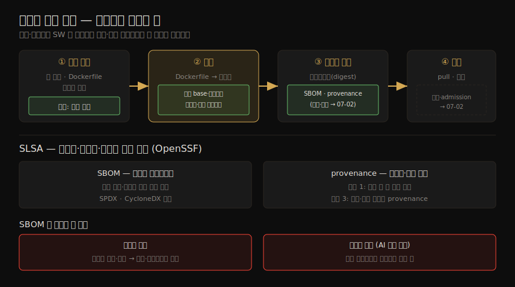

# 공급망 보안 (1) — SLSA·SBOM·Dockerfile·빌드 머신
---
> 이미지를 배포하는 사람은 그 안의 소프트웨어가 안전하고 변조되지 않았다는 확신이 필요합니다. 공급망 보안은 배포·실행하는 소프트웨어가 *기대한 그것* 인지 — 신뢰하는 소스 코드에서, 신뢰하는 빌드 시스템으로 만들어졌는지 — 를 보장하는 일입니다. 소스부터 빌드·저장·실행까지 사슬의 여러 약점이 있고, 이 노트는 이미지를 *안전하게 만드는* 쪽 — SLSA 프레임워크, SBOM, 최소 base image, Dockerfile 모범 관행, 빌드 머신 보호 — 을 다룹니다.

01-01 §3 에서 본 공급망·빌드 머신 공격이 이 장의 주제입니다. 소스 코드를 변조하거나, 빌드 방식을 조작하거나, 레지스트리 이미지를 교체하거나, 엉뚱한 이미지를 pull 하게 만들면 공격자는 프로덕션에서 임의 코드를 실행할 수 있습니다. 이미지를 pull 할 때 "기대한 코드가 들었고 악성 코드가 없다" 는 확신을 어떻게 얻는가가 공급망 보안입니다.

이 노트는 Chapter 7 의 전반부 — 신뢰의 기초를 세우는 쪽 — 을 다룹니다. 만들어진 이미지의 진위를 *서명·검증* 하는 쪽(SBOM 생성·sigstore 서명·attestation·admission control)은 짝 노트(07-02)가 잇습니다.

> 전제: 이미지에 든 취약점을 스캔하는 것은 Ch 8, 시크릿을 런타임에 전달하는 것은 Ch 14 입니다. 이 노트는 빌드 *이전·도중* 의 신뢰 확보에 집중합니다.


## 1. 이미지의 소프트웨어 구성 요소

> 이미지에는 배포판 파일시스템, 패키지(apt·yum), 애플리케이션 바이너리·스크립트, 언어별 라이브러리(crate·gem·npm), 설정·데이터 파일이 섞여 있습니다. 이 중 무엇이든 취약 코드를 담을 수 있고, 각각 다른 개발자·다른 소스에서 옵니다.

컨테이너 이미지에는 여러 소프트웨어 구성 요소가 들어갑니다.

| 구성 요소 | 설명 |
|-----------|------|
| 배포판 파일시스템 | 보통 Linux 배포판 기반(04 장). 그 배포판의 모든 파일·디렉토리 |
| 패키지 | apt·yum 등으로 설치. 이상적으로는 앱이 필요로 하는 의존성만 |
| 애플리케이션 | 언어에 따라 컴파일된 바이너리거나 해석되는 스크립트 |
| 언어별 라이브러리 | Rust crate, Ruby gem, Node·Python 패키지 |
| 기타 파일 | 설정·데이터 등 이미지에 빌드된 것 |

이 중 무엇이든 공격자가 악용할 취약 코드를 담을 수 있습니다. 그리고 이 구성 요소들은 대개 **서로 다른 개발자가 쓰고 서로 다른 소스에서 옵니다.** 예를 들어 Red Hat Enterprise Linux base image 를 pull 한다면, 그것이 정말 Red Hat 에서 왔고 악의적 사칭이 아님을 확신해야 합니다. 패키지·라이브러리도 정당한 제공자에게서 왔다는 확신이 필요합니다.

소스 코드 저장소에는 적절한 접근 통제를 둬, 무단 사용자가 코드를 변조하거나 이미지에 빌드되는 것을 바꾸지 못하게 해야 합니다. **어떤 구성 요소가 어떤 버전으로 들었는지 아는 것** 이 알려진 취약점을 짚는 출발점입니다(Ch 8). 이 장은 이미지의 생성·전달 경로의 모든 구성 요소를 검증·추적할 수 있게 하는 데 집중합니다.

공급망의 각 단계와 그 약점·방어, 그리고 SLSA·SBOM·provenance 의 위치를 한 장으로 정리하면 다음과 같습니다.




## 2. SLSA — 공급망 보안 수준 프레임워크

> SLSA(Supply chain Levels for Software Artifacts)는 OpenSSF 의 프레임워크로, 무결성·추적성·출처(provenance)의 신뢰 수준을 1~3 레벨로 정의합니다. 재현 가능 빌드, 격리된 빌드 환경, 어떻게 무엇으로 빌드됐는지의 감사 가능한 기록을 권고합니다.

**SLSA(Supply chain Levels for Software Artifacts)** 는 OpenSSF 의 프레임워크로, 소프트웨어 공급망을 보호하는 바람직한 특성을 정의합니다. 레벨 1~3 은 아티팩트(컨테이너 이미지 포함)의 무결성·추적성·출처에 대한 신뢰가 점점 높아짐을 나타냅니다. 권고 사항은 다음과 같습니다.

1. 재현 가능한 빌드(reproducible builds)
2. 격리된 빌드 환경(isolated build environments)
3. 소프트웨어가 어떻게, 어떤 의존성으로 빌드됐는지를 정의하는 감사 가능한 기록

여기서 두 개념이 갈립니다. **SBOM(Software Bill of Materials)** 은 *무엇이* 빌드에 들어갔는지를 알려 주고, **provenance(출처)** 는 아티팩트가 *어떻게, 누구에 의해* 빌드됐는지를 기술합니다.

| SLSA 레벨 | 요건(요약) |
|-----------|-----------|
| 1 | 빌드 설정 파일(예: GitHub workflow) — 서명·포맷 안 된 provenance |
| 3 | provenance 를 생성·서명하는 호스팅 플랫폼에서 빌드 + 빌드 실행이 서로 영향 못 줌 + 진위 검증 가능한 서명된 provenance |

SBOM·provenance 는 이미지를 빌드하는 과정에서 만들어지고, 이미지 소비자는 배포할 때 그 정보를 검증합니다. 이 검증 단계도 SLSA 가 규정합니다(검증은 07-02).


## 3. SBOM — 의존성 혼동과 패키지 환각

> SBOM 은 이미지에 들어간 모든 구성 요소와 버전의 기계 판독 가능한 목록입니다. 새 취약점이 나왔을 때 어떤 이미지를 갱신할지 자동화하고, 의존성 혼동·패키지 환각 같은 취약점에 맞서는 핵심 역할을 합니다.

SBOM 은 이미지에 들어간 모든 구성 요소를 버전 정보와 함께 기계 판독 가능한 목록으로 제공합니다. 새 취약점이 발견됐을 때 어떤 이미지를 갱신해야 하는지를 자동으로 식별하게 해 주고(Ch 8), 라이선스 정보도 담아 컴플라이언스에 도움을 줍니다. SBOM 은 두 종류의 취약점에 맞서는 핵심 역할을 합니다.

**의존성 혼동(dependency confusion)** 은 의존성을 잘못 지정하거나(버전 미명시) 엉뚱한 위치(잘못된 레지스트리·패키지 매니저·캐시)에서 가져와 *예상치 못한 버전* 을 쓰게 되는 것입니다. 의존성의 버전과 위치를 명시적으로 지정하면 피할 수 있습니다.

**패키지 환각(package hallucination)** 은 AI 생성 코드의 등장으로 훨씬 커진 문제입니다. 2025년 연구에 따르면 LLM 이 만든 코드는 존재하지 않는 패키지 이름을 — 예측 가능한 명명 패턴을 따라 — 환각하는 경향이 있습니다. 생성 코드가 없는 패키지를 import 해 안 도는 것도 문제지만, 더 큰 문제는 **악의적 행위자가 흔히 환각되는 패키지 이름을 미리 채워 두면**, 생성 코드가 도는 것처럼 보이면서 익스플로잇이 박힌 의존성을 끌어들인다는 점입니다.

### 언어별 SBOM

소스 코드는 의존성의 정확한 버전을 느슨하게만 명시합니다(Python 의 `import antigravity` 에 버전 번호가 없듯). lock 파일, Go 의 `go.sum`, Python 의 `requirements.txt` 가 언어별 해법이지만 모두 선택적이고, 06 장에서 봤듯 이미지 태그도 버전을 느슨하게만 가리킵니다. 빌드 과정에서 이 느슨한 명세가 *구체적 버전* 으로 해소됩니다.

이상적 SBOM 은 빌드 시점에 해소된 정확한 버전을 기록합니다. Bazel 같은 재현 가능 빌드 도구나 OWASP CycloneDX 생태계(언어별 플러그인)로 만들 수 있습니다.

```bash
# Java: pom.xml 기반
mvn org.cyclonedx:cyclonedx-maven-plugin:makeAggregateBom
# Go: go.mod 기반
cyclonedx-gomod mod -licenses -json -output sbom.json
```

> 빌드 시점에 안 만들면, 이미지를 들여다봐 역공학하는 도구로도 생성할 수 있지만 — 특히 언어별 패키지에서 — 덜 완전·덜 정확합니다. SBOM 생성은 trivy·syft 같은 취약점 스캐너가 푸는 문제와 본질이 같습니다. **모범 관행은 언어별 SBOM 과 컨테이너 수준 SBOM 을 짝지어 완전한 그림을 얻는 것입니다**(컨테이너 SBOM 생성은 07-02).


## 4. 최소 base image

> Dockerfile 의 첫 줄 `FROM` 이 base image 를 지정합니다. base image 가 작을수록 불필요한 코드가 적어 공격 표면이 작고, 네트워크 전송도 빠릅니다. scratch·distroless·hardened 이미지 등이 최소화 방법입니다.

Dockerfile 의 첫 줄 `FROM` 이 나머지 이미지가 그 위에 세워질 base image 를 지정합니다. base image 는 파일시스템의 출발점이 되어 이미지 첫 레이어에 나타납니다. **base image 가 작을수록 불필요한 코드가 적어 공격 표면이 작고**, 네트워크 전송도 빠릅니다.

| 최소화 방법 | 설명 |
|-------------|------|
| `scratch` 에서 빌드 | 완전히 빈 이미지(독립 바이너리용). 멀티스테이지 빌드로 컴파일 후 바이너리만 복사 |
| 최소 base image | Google distroless, Chainguard·Docker 의 hardened 이미지, Amazon Linux 최소 이미지, Azure Linux, Canonical chisel(Ubuntu 패키지 최소화) |
| Slim Toolkit | 이미지를 분석해 제거 가능한 중복 구성 요소를 식별 |

> 의존성·base image 만이 취약점 경로는 아닙니다. 애플리케이션 개발자가 직접 쓴 코드도 보안에 영향을 줍니다. 정적·동적 분석 도구, 동료 리뷰, 보안 평가, 침투 테스트가 개발 중 들어간 취약점을 짚는 데 도움이 됩니다 — 컨테이너 여부와 무관하게 적용됩니다.


## 5. Dockerfile 보안 모범 관행

> 빌드 단계는 Dockerfile 을 이미지로 바꿉니다. Dockerfile 도 소스 코드처럼 접근 통제가 필요하고(변조 시 악성 단계 삽입 가능), 그 내용이 이미지 보안을 크게 좌우합니다.

Dockerfile 을 변조할 수 있는 공격자는 멀웨어·크립토마이너 삽입, 빌드 시크릿 접근, 빌드 인프라의 네트워크 토폴로지 열거, 빌드 호스트 공격을 할 수 있습니다. 그래서 Dockerfile 은 소스 코드처럼 적절한 접근 통제가 필요합니다. 내용 면의 모범 관행은 다음과 같습니다.

| 관행 | 이유 |
|------|------|
| **신뢰하는 레지스트리의 base image** | 사칭 방지. 일부 조직은 사전 승인된 "golden" base image 강제 |
| **멀티스테이지 빌드** | 빌드용 툴체인(예: Go 컴파일러)을 최종 이미지에서 제거 → 작은 공격 표면 |
| **비-root USER** | `USER` 로 기본 사용자를 비-root 로(Ch 11 의 이유들) |
| **RUN 명령 주의** | `RUN` 은 임의 명령 실행 — Dockerfile 변조 = 원격 코드 실행. 편집 권한을 신뢰 멤버로 제한, 코드 리뷰·감사 |
| **민감 디렉토리 마운트 금지** | `/etc`·`/bin` 같은 디렉토리를 볼륨 마운트하지 않기(Ch 11) |
| **시크릿 미포함** | 자격·비밀번호를 이미지에 넣지 않기(06 장 BuildKit 시크릿 마운트, Ch 14) |
| **setuid 바이너리 회피** | 권한 상승 위험(02 장) |
| **불필요한 코드 회피** | 코드가 적을수록 공격 표면 작음. scratch·distroless 권장 |
| **필요한 것은 모두 포함** | 런타임에 패키지를 설치하면 정당성 검증이 어려움 → 빌드 시 모두 설치해 불변 이미지로 |

### 의존성 혼동 회피 (Dockerfile)

`FROM` 의 base image 는 가능하면 해시로, 최소한 버전 태그로(`latest` 의존 금지) 지정하고 **레지스트리를 명시** 합니다(기본 위치로 폴백 방지). 패키지 매니저도 올바른 레지스트리에서 가져오게 합니다 — `pip install --index-url`, `npm config set @my-org:registry`. 패키지 버전을 정밀하게 핀(`apt-get install <pkg>=<ver>`)하고, 암묵적 업그레이드를 피하며(`pip install --require-hashes`), 권장 패키지 자동 설치도 끕니다(`apt-get install --no-install-recommends`).

> 트레이드오프: 버전을 정밀하게 핀하면 의존성 혼동을 피하지만, 갱신을 안 하면 중요한 보안 업데이트를 놓칩니다. 너무 느슨하면 새 버전의 breaking change 를 만납니다. 취약점 스캔(Ch 8)이 보안 업데이트 필요를, 테스트가 breaking change 를 짚지만 둘 다 완벽하지 않습니다. 자동 업데이트와 명시적 의존성 사이의 균형이 필요합니다.


## 6. 빌드 머신 공격

> 빌드 머신은 두 이유로 위험 지점입니다 — 침해되면 시스템의 다른 곳에 닿을 수 있고, 빌드 결과를 조작해 악성 이미지를 만들게 할 수 있습니다. 프로덕션만큼 단단히 하드닝하고, 가능하면 빌드마다 새로 띄우는 임시(ephemeral) 인프라를 쓰는 것이 좋습니다.

빌드 머신이 위험한 두 이유는 다음과 같습니다.

1. **다른 곳으로의 확산**: 공격자가 빌드 머신을 침해해 코드를 돌리면 시스템의 다른 부분에 닿을 수 있습니다(06 장 "Docker 빌드의 위험"). 가능하면 rootless·비특권 빌더를 씁니다.
2. **빌드 결과 조작**: 공격자가 빌드를 조작하면 악성 이미지를 만들어 결국 프로덕션에서 돌리게 됩니다 — 예: 빌드되는 코드에 백도어 삽입.

빌드 머신은 결국 프로덕션에서 돌릴 코드를 만들므로, **프로덕션 클러스터만큼 중요하게 여겨 하드닝** 해야 합니다. 빌드는 프로덕션과 분리된 머신·클러스터에서 돌려 빌드 공격의 폭발 반경을 제한하는 것이 좋습니다. 더 나아가 가능하면 **빌드마다 새 VM 을 띄우는 임시(ephemeral) 인프라** 가 낫습니다 — 빌드 사이에 (악의적일 수 있는) 파일이 남지 않아 공격자가 발판을 만들기 어렵습니다.

> GitHub Actions·GitLab CI/CD·Bitbucket Pipelines 같은 플랫폼은 **runner** — 빌드 작업을 위해 띄우는 임시 VM — 개념을 지원합니다. 작업은 runner 에서 직접, 또는 그 위 컨테이너에서 돕니다. 추가로: 비특권 빌더로 호스트 코드 실행 가능성을 막고, 심층 방어로 빌드 머신의 네트워크·클라우드 서비스 접근을 제한하며, 불필요한 도구를 제거하고, 직접 사용자 접근을 제한하고, VPC·방화벽으로 무단 네트워크 접근을 막습니다.


## 7. 학습 점검 — 백지 복기

> 이 노트를 덮고 입으로 답해 봅니다.

1. 공급망 보안이 보장하려는 것을 "신뢰하는 소스·신뢰하는 빌드 시스템" 으로 한 문장으로 설명해 봅니다.
2. SLSA 의 SBOM 과 provenance 가 각각 무엇을 기술하는지 구분해 봅니다.
3. 의존성 혼동과 패키지 환각의 차이를, AI 생성 코드와 악의적 행위자를 들어 설명해 봅니다.
4. base image 를 작게 하는 세 방법(scratch·distroless·Slim)과 그 보안 이점을 말해 봅니다.
5. "Dockerfile 변조 = 원격 코드 실행" 이 왜 참인지, `RUN` 으로 연결해 설명해 봅니다.
6. 빌드 머신이 위험한 두 이유와, 임시(ephemeral) 인프라가 왜 도움이 되는지 말해 봅니다.

> 답이 막힌 항목은 이정표입니다.


## 다음 단계

> 이미지를 안전하게 만드는 기초를 잡았으니, 짝 노트에서 그 이미지의 진위를 서명·검증하는 쪽으로 넘어갑니다.

이 노트는 신뢰의 기초 — SLSA, SBOM, 최소 base image, Dockerfile 모범 관행, 빌드 머신 보호 — 를 봤습니다. 이 관행들은 이미지를 더 악용하기 어렵게 만듭니다.

짝 노트(07-02)는 만들어진 이미지의 진위를 *증명·검증* 하는 쪽 — 컨테이너 수준 SBOM 생성, sigstore(cosign/fulcio/rekor)로 이미지 서명, 빌드 attestation(in-toto), 이미지 매니페스트, 배포 시점 검증과 admission control — 을 다룹니다.


## 관련 문서

> 이 노트는 이미지를 안전하게 *만드는* 쪽입니다. 진위를 *증명·검증* 하는 쪽은 짝 노트가, 이미지 구조의 기초는 06 장이 받칩니다.

- [07-02.공급망 보안 (2) — 서명·attestation·배포 검증](./07-02.공급망%20보안%20(2)%20—%20서명·attestation·배포%20검증.md) — 짝 노트. SBOM 생성·서명·검증
- [06-01.컨테이너 이미지 — 구조·빌드·저장](./06-01.컨테이너%20이미지%20—%20구조·빌드·저장.md) — base image·레이어 시크릿·태그/digest 의 기초. 이 장의 Dockerfile 관행이 그 위에 섬
- [01-01.컨테이너 보안 위협 — 위협 모델·공격 벡터·보안 원칙](./01-01.컨테이너%20보안%20위협%20—%20위협%20모델·공격%20벡터·보안%20원칙.md) — §3 의 공급망·빌드 머신 공격 벡터의 원본
