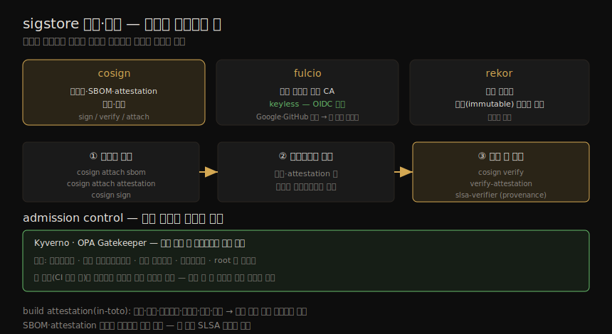

# 공급망 보안 (2) — 서명·attestation·배포 검증
---
> 이미지를 안전하게 만드는 것만으로는 부족합니다. 그 이미지가 신뢰하는 곳에서 왔고 빌드 후 변조되지 않았음을 *증명하고 검증* 해야 합니다. 이미지 서명은 암호적 신원을 이미지에 묶고, build attestation 은 어떻게 빌드됐는지를 기록하며, admission control 은 배포 직전에 이 모든 것을 점검합니다. "서명된 이미지가 있어도 서명을 확인하지 않으면 의미가 없습니다."

짝 노트(07-01)가 SLSA·SBOM·Dockerfile·빌드 머신으로 이미지를 *안전하게 만드는* 쪽이었다면, 이 노트는 만들어진 이미지의 *진위를 증명·검증* 하는 쪽입니다. 컨테이너 수준 SBOM 을 생성하고, 이미지를 서명하고, 빌드 attestation 을 붙이고, 배포 직전에 검증하는 흐름입니다.

이 노트는 Chapter 7 의 후반부 — SBOM 생성, sigstore 서명, attestation, 매니페스트, 배포 보안, admission control — 을 다룹니다. ③ 이미지·공급망 그룹에서 신뢰를 *완성·강제* 하는 단계입니다.

> 전제: 이미지를 *만드는* 쪽의 신뢰(SLSA·Dockerfile·빌드 머신)는 07-01 이 다뤘습니다. 이 노트는 그 위에서 서명·검증으로 신뢰를 증명·강제합니다.


## 1. 컨테이너 수준 SBOM 생성

> SBOM 은 빌드 시점에 생성하는 것이 이상적입니다(`docker build --sbom=true`). 기존 이미지에는 syft·trivy 로 생성할 수 있고, SPDX·CycloneDX 포맷으로 나옵니다. 취약점 스캔 입력, 라이선스 컴플라이언스, 구성 요소 정책 강제에 쓰입니다.

07-01 에서 본 언어별 SBOM 에 더해, base image 와 설치된 OS 패키지 정보도 기록해야 합니다. SBOM 은 **빌드 시점에 생성하는 것이 이상적** 입니다(`docker build --sbom=true`). 기존 이미지에는 `syft`·`trivy` 로 생성할 수 있고, 흔히 SPDX 나 CycloneDX 포맷으로 나옵니다.

```bash
$ trivy image --format spdx-json nginx
```

이 출력에는 이미지 안 패키지, 라이선스 정보, 패키지 간 관계, 생성 도구 정보가 담깁니다(nginx 이미지의 경우 8,000줄 이상). 한 패키지 항목은 이름·버전·공급자·라이선스·purl(package URL) 같은 필드를 갖습니다.

SBOM 의 쓰임은 다음과 같습니다.

| 용도 | 설명 |
|------|------|
| 취약점 스캔 입력 | 알려진 취약점과 교차 참조(Ch 8). SBOM 을 색인해 신규 취약점 영향 구성 요소를 빠르게 식별 |
| 라이선스 컴플라이언스 | 상용·독점 SW 라면 GPL 포함 여부 점검 |
| 구성 요소 정책 강제 | 이미지에 허용되는 구성 요소를 조직 정책으로 강제 |

> SBOM 은 그것이 가리키는 이미지와 함께 저장하는 것이 좋습니다. OCI 아티팩트로 레지스트리에 올려 이미지를 참조하게 하거나, 서명해 이미지에 붙입니다.


## 2. 이미지·아티팩트 서명 — sigstore

> 이미지 서명은 암호적 신원을 이미지에 묶어, 신뢰하는 곳에서 만들어졌고 빌드 후 변조되지 않았음을 검증하게 합니다. sigstore(cosign/fulcio/rekor)가 Kubernetes 생태계의 사실상 표준이며, 핵심 혁신은 keyless 서명입니다.

이미지 서명은 암호적 신원을 이미지에 연결합니다(인증서 서명과 비슷, Ch 11). 이로써 이미지가 신뢰하는 곳에서 만들어졌고 빌드 후 수정되지 않았음을 검증할 수 있습니다. SBOM 같은 다른 아티팩트도 서명해 누가 공급했는지 증명할 수 있습니다.

서명 흐름과 각 도구의 역할을 한 장으로 정리하면 다음과 같습니다.



원조는 notary 기반의 **Docker Content Trust** 였지만 너무 복잡하다고 여겨져, CLI 도구가 `notation` 인 v2 프로젝트로 대체됐습니다(AWS·Microsoft·Docker 지원). Google 에서 출발해 지금은 OpenSSF 소유인 **sigstore** 가 Kubernetes 생태계의 사실상 표준 도구입니다. 세 구성 요소는 다음과 같습니다.

| 구성 요소 | 역할 |
|-----------|------|
| `cosign` | 컨테이너 이미지·Helm 차트·SBOM 파일을 서명·검증 |
| `fulcio` | 단기(short-lived) 인증서를 발급하는 인증 기관(CA) |
| `rekor` | 서명 작업을 불변(immutable) 로그에 기록 |

sigstore 의 가장 큰 진전은 **keyless 서명** 입니다. 개인 키(전체 PKI 가 필요)를 쓰는 대신, Google·Microsoft·GitHub 같은 OIDC 신원 제공자를 기반으로 자동 발급되는 단기 인증서를 씁니다. 사용자가 키 회전·배포를 걱정할 필요가 없습니다.

```bash
$ cosign attach sbom --sbom sbom.json my-image:v0.0.1   # SBOM 붙이기
$ cosign sign my-image:latest                            # 서명
```


## 3. Build Attestation — 어떻게 빌드됐는가

> 서명은 "신뢰하는 곳에서 왔다" 를 확인하지만, 빌드 과정 자체가 변조됐는지는 모릅니다. build attestation 은 소스 저장소·커밋, 빌드 환경, 툴체인 버전, 빌드 파라미터·산출물, 누가·언제 빌드를 촉발했는지를 기술합니다.

이미지 서명을 검증하면 신뢰하는 곳에서 왔음을 확인합니다. 그런데 이미지와 그 구성 요소를 만드는 *빌드 과정* 을 누군가 변조했는지는 어떻게 알까요? **build attestation** 이 이미지가 어떻게 빌드됐는지를 기술합니다.

| attestation 이 담는 것 |
|------------------------|
| 소스 저장소와 커밋 |
| 빌드 환경 |
| 툴체인 버전 |
| 빌드 파라미터와 산출물 |
| 누가·무엇이 언제 빌드를 촉발했는지 |

attestation 은 이미지에 동반되는 OCI 메타데이터로 레지스트리에 저장되고, 배포 시 검증됩니다. SLSA 프로젝트는 GitHub Actions 용 `slsa-github-generator`, 명령줄용 `slsa-provenance` 를 제공합니다. 모범 관행은 `cosign` 으로 attestation 을 서명하는 것입니다.

> **in-toto** 도 공급망 우려를 다루는 프레임워크입니다. 기대한 빌드 단계 각각이 완전히 실행됐고, 올바른 입력에 올바른 출력을 냈으며, 올바른 순서로 올바른 사람이 수행했음을 보장합니다. 여러 단계를 사슬로 엮어 보안 메타데이터를 전달해, 프로덕션의 소프트웨어가 개발자가 노트북에서 보낸 코드와 검증 가능하게 동일하도록 합니다.

```bash
$ cosign attach attestation my-image:v0.0.1 --attestation ./my-image-sbom.att.json
$ cosign sign my-image:latest
```

SBOM·attestation 을 붙이는 것은 선택이지만 좋은 보안 관행이고, 더 높은 SLSA 등급을 얻는 데 도움이 됩니다. 서드파티 이미지를 base image 등으로 쓸 때는 `cosign verify` 로 기대한 공급자에게서 왔는지 확인할 수 있습니다.

### 이미지 매니페스트 안의 서명·attestation

서명·attestation 이 포함되면 06 장에서 본 **이미지 매니페스트** 의 일부가 됩니다. CNCF 의 `oras` 도구로 매니페스트를 들여다볼 수 있습니다. 멀티플랫폼 이미지의 매니페스트에는 각 플랫폼 이미지의 digest 와 함께 그 이미지를 가리키는 `attestation-manifest` 항목이 들어 있고, 그 안에 `in-toto` attestation(예: docker-scout·buildkit 이 만든 SBOM)이 담깁니다.

> 일상 운영에서 매니페스트·attestation·서명을 이렇게 직접 들여다볼 일은 없지만, 공급망 보안 문제의 근본 원인을 추적할 때 이 정보가 손에 있다는 것을 알아 두면 도움이 됩니다.


## 4. 배포 시점 보안

> 배포 시 주된 관심사는 *올바른 이미지* 가 pull·실행되는지입니다. 태그는 옮길 수 있으니 digest 참조가 안전하고, 배포 정의(YAML)의 출처도 이미지만큼 검증해야 합니다.

배포 시점의 주된 보안 관심사는 올바른 이미지가 pull·실행되도록 하는 것입니다.

**올바른 이미지 배포**: 06 장에서 봤듯 태그는 보통 불변이 아니라 같은 이미지의 다른 버전으로 옮길 수 있습니다(AWS ECR 등은 불변 태그 지원). **digest 참조** 가 버전을 확실히 합니다. 다만 빌드 시스템이 의미적 버저닝을 엄격히 지키면 태그로도 충분하고 관리가 쉽습니다(마이너 업데이트마다 참조를 바꿀 필요 없음). 태그로 참조하면 실행 전 늘 최신 버전을 pull 해야 합니다 — Kubernetes 의 `imagePullPolicy` 가 이를 정합니다(digest 참조 시 매번 pull 은 불필요).

**악의적 배포 정의**: 오케스트레이터의 설정 파일(K8s YAML)도 이미지만큼 출처를 검증해야 합니다. 인터넷에서 받은 YAML 은 프로덕션에 돌리기 전 꼼꼼히 점검해야 합니다 — **레지스트리 URL 의 한 글자 교체** 같은 작은 변형이 악성 이미지를 돌릴 수 있습니다.

**서명·provenance 검증**: 서명된 이미지가 있어도 서명을 확인하지 않으면 의미가 없습니다. 서명 검증은 이미지가 기대한 신뢰 소스(자체 파이프라인이든 벤더든)에서 왔음을, provenance 검증은 빌드의 모든 단계가 기대대로 수행됐음을 확인합니다. SLSA 나 US 행정명령 14028 같은 규제를 따른다면 컴플라이언스를 위해 이 검증이 필요합니다.

```bash
$ cosign verify --key supplier.pub myimage:tag             # 서명 검증
$ cosign verify-attestation ...                            # attestation 검증
# SLSA 의 slsa-verifier 로 provenance 검증
```

> 이 검증 단계들은 CI/CD 파이프라인의 자동 배포 전 단계나 Kubernetes admission controller 에 넣을 수 있습니다.


## 5. Admission Control — 배포 직전의 관문

> admission controller(Kyverno·OPA Gatekeeper)는 리소스를 클러스터에 배포하기 직전에 정책으로 점검합니다. 스캔 여부·신뢰 레지스트리·서명·승인·root 실행 여부를 검사해, 시스템 앞 단계의 점검을 우회하지 못하게 막습니다.

**admission controller**(Kyverno, OPA Gatekeeper)는 리소스를 클러스터에 배포하려는 시점에 정책에 비춰 점검합니다. 점검에 실패하면 컨테이너가 돌지 않습니다. 이미지에 대한 정책은 컨테이너가 인스턴스화되기 전에 다음 같은 보안 점검을 넣을 수 있습니다.

| admission 정책 점검 |
|---------------------|
| 이미지가 취약점·멀웨어·기타 정책에 대해 스캔됐는가 |
| 신뢰하는 레지스트리에서 왔는가 |
| 신뢰하는 곳이 서명했는가 |
| 승인된 이미지인가 |
| root 로 도는가 |

> 이 점검들은 **시스템 앞 단계의 점검을 누구도 우회하지 못하게** 보장합니다. 예를 들어 CI 파이프라인에 취약점 스캔을 넣어도, 사람들이 스캔 안 된 이미지를 가리키는 배포 지시를 쓸 수 있다면 그 스캔은 거의 무의미합니다. admission control 이 마지막 관문으로 그 빈틈을 막습니다.


## 6. 학습 점검 — 백지 복기

> 이 노트를 덮고 입으로 답해 봅니다.

1. 컨테이너 수준 SBOM 을 빌드 시점·기존 이미지에서 각각 어떻게 생성하는지, 그 세 가지 쓰임을 말해 봅니다.
2. 이미지 서명이 무엇을 보장하는지, sigstore 의 cosign·fulcio·rekor 역할을 구분해 봅니다.
3. sigstore 의 keyless 서명이 기존 방식 대비 어떤 부담을 없애는지 설명해 봅니다.
4. 서명만으로는 부족하고 build attestation 이 추가로 무엇을 증명하는지, in-toto 의 역할과 함께 말해 봅니다.
5. 배포 시 태그 대신 digest 를 권하는 이유와, "레지스트리 URL 한 글자" 위험을 연결해 설명해 봅니다.
6. admission control 의 다섯 점검을 들고, 그것이 왜 "앞 단계 우회" 를 막는 마지막 관문인지 설명해 봅니다.

> 답이 막힌 항목은 이정표입니다.


## 다음 단계

> 이미지의 진위를 증명·검증하는 법을 봤으니, 다음 장에서 그 이미지 안의 알려진 취약점을 찾아내는 스캔으로 넘어갑니다.

이 노트는 SBOM 생성, 이미지 서명, attestation, 배포 검증, admission control 로 신뢰를 증명·강제하는 법을 봤습니다. 공급망 보안 도구는 이미지를 그 내용·빌드 방식 정보와 함께 서명하게 하고, 배포 시점에 admission controller 가 서명·provenance 검증을 포함한 보안 점검의 기회를 줍니다.

컨테이너 이미지는 애플리케이션 코드와 서드파티 패키지·라이브러리 의존성을 캡슐화합니다. 다음 장(Ch 8)은 이 의존성이 악용 가능한 취약점을 담을 수 있음을 살피고, 그것을 식별·제거하는 도구를 봅니다. ③ 이미지·공급망 그룹의 마지막 두 장(Ch 8 취약점, Ch 9 불변성·GitOps)이 이어집니다.


## 관련 문서

> 이 노트는 이미지의 진위를 *증명·검증* 하는 쪽입니다. *만드는* 쪽 기초는 짝 노트가, 매니페스트·태그/digest 의 기초는 06 장이 받칩니다.

- [07-01.공급망 보안 (1) — SLSA·SBOM·Dockerfile·빌드 머신](./07-01.공급망%20보안%20(1)%20—%20SLSA·SBOM·Dockerfile·빌드%20머신.md) — 짝 노트. 이미지를 안전하게 만드는 기초
- [06-01.컨테이너 이미지 — 구조·빌드·저장](./06-01.컨테이너%20이미지%20—%20구조·빌드·저장.md) — 이미지 매니페스트·태그/digest 의 기초. 서명·attestation 이 매니페스트에 붙음
- [00-00.책 개요와 학습 로드맵](./00-00.책%20개요와%20학습%20로드맵.md) — 16챕터 전체 지도
