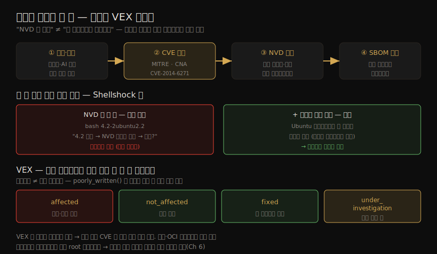

# 이미지 취약점 (1) — 취약점 연구·CVE·VEX
---
> 배포한 코드의 취약점을 찾아 고치는 일은 오래된 보안 과제이지만, 공격자가 취약점을 악용하기까지 걸리는 시간이 점점 짧아지며 더 급한 문제가 됐습니다. 2024년 Mandiant 보고서는 그 시간을 단 5일로 봤고, AI가 악용되면서 이미 그보다 짧아졌을 가능성이 큽니다. 이 노트는 "취약점이란 무엇이고 어떻게 공개·추적되는가"라는 토대를 다룹니다. CVE 식별자와 NVD, 그리고 NVD만 봐서는 안 되는 이유, 마지막으로 거짓 양성을 줄이는 VEX 까지 봅니다.

이 노트는 Chapter 8 의 전반부입니다. 스캔 도구를 돌리기 *전에*, 무엇을 스캔하는지 — 취약점이라는 대상 자체 — 를 이해하는 단계입니다. 도구·CI/CD 통합·제로데이 같은 실무는 짝 노트(08-02)가 다룹니다.

컨테이너 환경에서도 패치는 전통적인 SW 배포만큼 중요합니다. 다만 뒤에서 보듯 패치 *과정* 이 완전히 새로 설계됐다는 점이 다릅니다. 그 차이를 이해하려면 먼저 취약점이 어떻게 발견·공개·추적되는지부터 알아야 합니다.

> 전제: 이미지에 무엇이 들어 있는지 기록하는 SBOM(07-01·07-02)이 여기서 핵심 입력이 됩니다. 신규 취약점이 공개되면 SBOM 과 대조해 어떤 이미지가 영향받는지 식별합니다.


## 1. 취약점이란 — 그리고 누가 찾는가

> 취약점은 공격자가 악의적 행위에 이용할 수 있는, 알려진 SW 결함입니다. 일반적으로 SW 가 복잡할수록 결함이 많고 그중 일부는 악용 가능합니다. 흔한 SW 의 취약점은 배포된 모든 곳에서 악용될 수 있으므로, 공개 SW(특히 OS 패키지·언어 라이브러리)의 신규 취약점을 찾아 보고하는 연구 산업이 따로 존재합니다.

Shellshock·Meltdown·Heartbleed 처럼 이름과 때로는 로고까지 얻는 취약점은 취약점 세계의 스타이지만, 매년 보고되는 수천 건 중 극히 일부일 뿐입니다. 대부분의 취약점은 이름 없이 식별자만으로 추적됩니다.

요즘은 사람만 취약점을 찾지 않습니다. AI 도 적극적으로 발견하고 있습니다.

| 사례 | 내용 |
|------|------|
| unpatched.ai | 2025년 1월 초 Microsoft 가 이 자동 취약점 발견 플랫폼에 다수 고위험 이슈 보고를 크레딧 |
| DARPA AI Cyber Challenge | 리눅스 커널·Jenkins·SQLite 등 인프라 코드의 취약점을 AI 도구로 찾아 고치는 대회 |
| Google OSS-Fuzz | AI 강화 퍼징 기법으로 점점 더 많은 이슈를 식별 |

다만 AI 는 양날의 칼입니다. 실제 이슈를 찾기도 하지만, 진짜가 아닌 "취약점"에 대한 이른바 **AI-slop 보안 보고서** 도 대량 생산합니다. 이는 프로젝트 메인테이너의 시간을 갉아먹고 번아웃으로 내몰 수 있습니다. AI 를 버그 바운티 양산의 지름길로 쓰려는 생각이라면 다시 생각해야 합니다.

#### 책임 있는 보안 공개 (responsible disclosure)

취약점이 식별되면, 공격자가 악용하기 전에 사용자가 수정본을 배포할 수 있도록 수정본 공개를 향한 경주가 시작됩니다. 신규 이슈를 곧바로 대중에 알리면 공격자에게 무방비로 멍석을 깔아 주는 셈이 됩니다. 이를 피하려고 책임 있는 보안 공개라는 개념이 자리 잡았습니다.

취약점을 찾은 연구자가 해당 SW 의 개발자·벤더에게 먼저 연락하고, 양측이 공개 시점을 합의한 뒤 그 기한이 지나야 연구자가 발견 내용을 공개합니다. 벤더가 적시에 수정본을 내놓도록 하는 긍정적 압력이 작동합니다. 공개 전에 수정본이 준비되는 편이 벤더와 사용자 모두에게 이롭기 때문입니다.


## 2. CVE 식별자와 추적 — CVE·CNA·NVD

> 신규 이슈는 "CVE"(Common Vulnerabilities and Exposures)로 시작하고 연도가 붙는 고유 식별자를 받습니다. 예컨대 2014년에 발견된 Shellshock 은 공식적으로 CVE-2014-6271 입니다. ID 를 관리하는 조직은 MITRE 이고, 일정 범위 안에서 ID 를 발급할 수 있는 400곳 이상의 CNA(CVE Numbering Authority)를 감독합니다.

Microsoft·Red Hat·Oracle 같은 대형 벤더는 자사 제품 취약점에 ID 를 부여하는 CNA 입니다. GitHub 는 2019년 말 CNA 가 됐습니다. CVE 가 식별되면 CVE 웹사이트에 기록되고, 이 식별자가 **NVD**(National Vulnerability Database)에서 어떤 패키지·버전이 영향받는지 추적하는 데 쓰입니다.

> 주의: NVD 는 미국 조직으로 전 세계가 널리 쓰지만, EU·프랑스·독일·일본·브라질 등의 국가별 데이터베이스도 존재합니다. 이들도 대체로 CVE 번호 체계를 쓰거나 적어도 참조합니다.

여기까지만 보면 "영향받는 버전 목록이 있으니, 그중 하나를 쓰면 노출된 것"이라고 결론 내고 싶어집니다. 하지만 그렇게 간단하지 않습니다. 사용하는 리눅스 배포판이 해당 패키지의 *패치된* 버전을 갖고 있을 수 있기 때문입니다.


## 3. NVD 만 봐서는 안 되는 이유 — 배포판 보안 권고

> NVD 의 영향 버전 목록에 내 버전이 들어 있어도, 배포판 메인테이너가 그 버전에 패치를 적용해 두었다면 안전합니다. 서버에 깔린 패키지가 실제로 취약한지 정확히 알려면, NVD 뿐 아니라 *내 배포판에 적용되는 보안 권고* 까지 함께 봐야 합니다.

발견·공개부터 CVE 부여·NVD 기록, 그리고 두 층 대조와 VEX 필터링까지의 전체 흐름을 한 장으로 정리하면 다음과 같습니다.



Shellshock 을 예로 들면, CVE-2014-6271 의 NVD 페이지에는 GNU bash 1.14.0 부터 4.3 까지 긴 취약 버전 목록이 있습니다. 아주 오래된 Ubuntu 12.04 에서 `bash 4.2-2ubuntu2.2` 를 발견하면, bash 4.2 기반이고 NVD 목록에 들어 있으니 취약하다고 생각하기 쉽습니다.

그러나 같은 취약점에 대한 Ubuntu 보안 권고에 따르면, 바로 그 버전에는 수정 패치가 적용돼 있어 안전합니다. Ubuntu 메인테이너가 모두에게 새 마이너 버전으로 올리라고 요구하는 대신, 패치만 적용한 버전을 제공하기로 결정한 결과입니다.

이 패키지들은 `apt`·`yum`·`rpm`·`apk` 같은 패키지 관리자로 바이너리 형태로 배포됩니다. 서버나 VM 에서는 모든 애플리케이션이 이 패키지를 공유하는데, 이 공유가 끝없는 문제를 일으킵니다. 한 앱이 의존하는 패키지 버전이 같은 머신에서 돌리려는 다른 앱과 호환되지 않을 수 있습니다. **컨테이너는 각 컨테이너마다 별도의 root 파일시스템을 둠으로써 이 의존성 관리 문제를 해결** 합니다(Ch 6).


## 4. 애플리케이션 수준 취약점

> OS 패키지뿐 아니라 애플리케이션 수준에도 취약점이 있습니다. 대부분의 앱은 언어별 패키지 관리자(npm·pip·Maven 등)로 설치한 서드파티 라이브러리를 씁니다. Go·C·Rust 같은 컴파일 언어에서는 서드파티 의존성이 공유 라이브러리로 설치되거나 빌드 시점에 바이너리에 링크됩니다.

이런 도구가 설치하는 서드파티 패키지는 또 다른 잠재적 취약점 원천입니다. 07장에서 본 것처럼 언어별 도구가 상세한 SBOM 을 생성할 수 있고, 이는 pip·npm·Maven 등이 끌어온 의존성의 취약점을 잡는 데 도움이 됩니다.

#### standalone 바이너리와 scratch 이미지

standalone(독립 실행) 바이너리는 정의상(이름 그대로) 외부 의존성이 없습니다. 서드파티 라이브러리·패키지에 의존할 수는 있지만, 그것들이 실행 파일 안에 빌드돼 들어갑니다. 이 경우 바이너리 실행 파일 하나만 담는 `scratch`(빈) base image 기반으로 컨테이너 이미지를 만들 수 있습니다.

```dockerfile
FROM scratch
COPY myapp /myapp
ENTRYPOINT ["/myapp"]
```

> 앱에 의존성이 없으면 *공개된 패키지 취약점* 으로는 스캔할 수 없습니다. 그래도 공격자에게 악용될 결함은 가질 수 있는데, 이는 제로데이 취약점(08-02)에서 다룹니다.

여기서 한 가지 긴장이 보입니다. scratch 이미지는 공격 표면을 최소화하는 좋은 방법(07-01)이지만, 정적 링크된 바이너리는 패키지 메타데이터가 없어 스캐너가 안에 든 라이브러리·버전을 알아내기 어렵습니다. 이 스캔 측면의 함정은 08-02 에서 이어집니다.


## 5. 취약점 위험 관리

> 취약점 대응은 위험 관리의 한 축입니다. 사소하지 않은 SW 배포라면 일부 취약점을 포함할 가능성이 크고, 그를 통해 시스템이 공격받을 위험이 있습니다. 이 위험을 관리하려면 어떤 취약점이 있는지 식별하고, 심각도를 평가해 우선순위를 매기고, 고치거나 완화하는 프로세스를 갖춰야 합니다.

핵심은 **취약점이 존재한다고 해서 내 앱에서 반드시 관련 있거나 악용 가능한 것은 아니라는 점** 입니다. 예를 들어 한 라이브러리에 `decent_code()` 와 `poorly_written()` 두 함수가 있다고 합시다. 앱이 `decent_code()` 를 쓰려고 이 라이브러리를 임포트했다면, `poorly_written()` 코드는 존재하더라도 호출되지 않으니 그 앱을 통해서는 도달할 수 없습니다.

취약점이 존재하지만 실제로 악용 불가능하다면, 그것은 보안 팀이 검토하느라 일거리만 늘리는 **거짓 양성(false positive)** 입니다. 이 지점에서 VEX 가 도움을 줍니다.


## 6. VEX — 취약점 악용 가능성 교환

> VEX(Vulnerability Exploitability eXchange)는 알려진 CVE 의 *영향* 을 기술하는 기계 판독 포맷입니다. VEX 문서는 일정 수의 CVE 를 다루며, 특정 SW 아티팩트가 각 CVE 에 대해 어떤 상태인지를 명시합니다.

| 상태 | 의미 |
|------|------|
| `affected` | 취약점이 존재하고 악용될 수 있음 |
| `not_affected` | 이 아티팩트에는 해당 취약점이 적용되지 않음 |
| `fixed` | 이 버전에서 취약점이 해결됨 |
| `under_investigation` | 영향 여부를 판단하는 작업이 진행 중 |

SW 의 작성자가 VEX 문서를 만들어, 그 제품 소비자에게 CVE 상태를 알릴 수 있습니다. VEX 문서는 진위를 증명하도록 서명할 수 있고, 그것이 기술하는 이미지와 함께 OCI 레지스트리에 저장할 수 있습니다.

취약점 스캐너는 알려진 취약점이 이미지에 있는지 식별하는 과정을 자동화합니다. 각 이슈가 얼마나 심각한지, 수정이 적용된 패키지 버전이 무엇인지(수정본이 있다면) 알려 줍니다. **스캐너에 VEX 정보를 입력으로 주면 제품에 영향 없는 취약점을 걸러내, 결과가 더 정확해집니다.**

> VEX 의 핵심 가치: "있다"와 "악용 가능하다"는 다릅니다. VEX 는 이 둘 사이의 간극을 메워 거짓 양성을 줄입니다. 스캐너의 동작과 결과가 도구마다 다른 이유는 08-02 에서 이어집니다.


## 7. 학습 점검

> 이 노트의 핵심을 스스로 떠올려 봅니다. 답이 막히면 해당 섹션으로 돌아가 확인합니다.

- NVD 의 취약 버전 목록에 내 패키지 버전이 들어 있는데도 안전할 수 있는 이유를 한 문장으로 말해 봅니다. (→ §3)
- CVE 식별자를 발급하는 MITRE·CNA·NVD 의 역할을 각각 구분해 봅니다. (→ §2)
- "취약점이 존재한다"와 "악용 가능하다"가 어떻게 다른지, `decent_code()`/`poorly_written()` 예로 설명해 봅니다. (→ §5)
- VEX 의 네 상태(`affected`·`not_affected`·`fixed`·`under_investigation`)를 떠올려 보고, VEX 가 스캔 결과를 어떻게 개선하는지 말해 봅니다. (→ §6)
- standalone 바이너리를 scratch 이미지로 만들 때 공격 표면과 스캔 가능성 사이에 어떤 긴장이 생기는지 설명해 봅니다. (→ §4)
