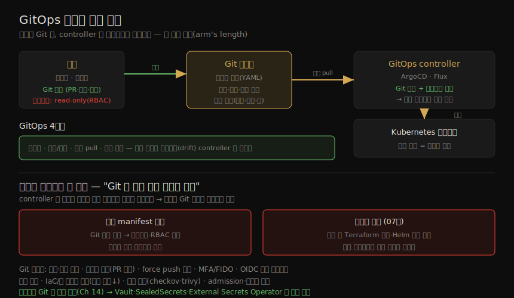

# IaC 와 GitOps — 선언적 인프라·배포 보안
---
> 컨테이너가 실제로 도는 클라우드 배포에서는, 인프라를 *설정하는 도구와 과정* 자체가 컨테이너의 보안 결과에 큰 영향을 줍니다. 인프라를 수동 명령이 아니라 코드로 기술하면(IaC) 신뢰성·재현성이 올라가고, 그 코드를 Git 에 두고 자동 controller 가 시스템을 일치시키게 하면(GitOps) 사람이 실행 시스템에 직접 손대지 않아도 됩니다. 이 "팔 길이 거리(arm's length)"가 곧 강력한 보안 특성으로 이어집니다.

이 노트는 Chapter 9 전체를 다룹니다. ③ 이미지·공급망 그룹의 마지막 장으로, 07·08장이 *이미지* 의 신뢰를 다뤘다면 이 장은 *배포 설정* 의 신뢰를 다룹니다. 설정 파일도 애플리케이션 소스 코드와 똑같은 공급망 공격의 대상이 된다는 점이 핵심 연결 고리입니다.

이 책은 컨테이너 보안에 초점을 두므로 네트워크·컴퓨터 보안 전반은 다루지 않습니다. 다만 프로덕션 컨테이너가 사는 클라우드 환경에서 인프라를 어떻게 세우느냐가 보안을 좌우하므로, IaC 를 짧게 보고 그 위에 선 GitOps 의 보안 특성으로 넘어갑니다.

> 전제: 07장의 의존성 혼동·서명·admission control, 06장의 공급망 공격 개념이 이 장에서 *설정 파일* 에도 그대로 적용됩니다.

## 1. IaC — 인프라를 코드로

> 클라우드에서 SW 를 돌리려면 VM·네트워킹·관리형 서비스 같은 인프라를 프로비저닝해야 합니다. IaC(infrastructure as code)는 이를 수동 명령으로 하는 대신, 인프라를 기술한 파일을 Terraform/OpenTofu·CloudFormation·Pulumi 같은 도구의 입력으로 주어 자동 프로비저닝하는 방식입니다. 사람이 명령을 일일이 입력하는 것보다 신뢰성·재현성이 높아집니다.

프로비저닝 대상에는 VM·베어메탈, OS 선택, 머신을 격리하는 VPC, 그리고 SW 가 접근할 데이터베이스·메시징 같은 클라우드 서비스가 들어갑니다. 퍼블릭 클라우드에서는 관리형 Kubernetes 나 AWS ECS 같은 컨테이너 오케스트레이션도 포함됩니다.

인프라 설정을 기술한 파일은 Git 같은 소스 관리에 두는 것이 마땅합니다. 그러면 다음 이점이 따라옵니다.

| 이점 | 내용 |
|------|------|
| 버전 이력 | 잘못된 변경을 쉽게 되돌림 |
| 협업·리뷰 | 여러 사람이 인프라를 함께 다루고 서로의 변경을 검토 |
| 감사·문제 해결 | 무엇이 배포됐는지 기록이 남음 |

> 인프라는 VM 수 오토스케일링을 빼면 자주 바뀌지 않습니다. 새 배포(새 리전·테스트 환경)는 보통 명령 한 번이나 콘솔 버튼으로 자동 프로비저닝을 발동시킵니다. 그런데 클라우드 네이티브 앱의 장점은 *잦은 업데이트* 입니다. GitOps 는 IaC 개념을 워크로드 설정에 확장해, 자동·동적 업데이트를 가능하게 합니다.

## 2. GitOps — 선언적 상태를 Git 으로

> GitOps(Alexis Richardson, 2017)는 시스템 상태에 관한 모든 설정 정보를, 애플리케이션 소스처럼, 소스 관리 아래 두는 방법론입니다. 운영 변경을 하려면 명령을 직접 적용하는 대신 *원하는 상태* 를 코드 형태(예: Kubernetes YAML)로 커밋합니다. GitOps controller 라는 자동 시스템이 코드로 정의된 최신 상태를 실행 시스템에 반영합니다. ArgoCD·Flux 가 대표적 오픈소스이며 둘 다 CNCF Graduated 단계입니다.

GitOps 가 보안에 주는 유익은 큽니다. 사용자는 더 이상 실행 시스템에 직접 접근할 필요가 없습니다 — 모든 것이 소스 관리(이름대로 보통 Git)를 통해 팔 길이 거리에서 이뤄집니다. 사용자 자격증명은 *소스 관리* 접근만 허용하고, 실행 시스템을 수정할 권한은 *자동 GitOps operator* 만 갖습니다. Git 이 모든 변경을 기록하므로 모든 작업에 감사 추적이 남습니다.

이 권한 경계와 흐름을 한 장으로 정리하면 다음과 같습니다.

#### GitOps 4원칙 (OpenGitOps)

| 원칙 | 의미 |
|------|------|
| 선언적(declarative) | 파일이 *원하는 상태* 를 기술. 명령 나열(명령형)과 대비 — 시작 상태가 무엇이든 도구가 목표 상태로 가는 길을 찾음 |
| 버전·불변(versioned & immutable) | Git 의 버전 이력이 감사 추적(누가·언제, 커밋 메시지로 왜까지). Git 의 파일이 *그대로* 쓰이고, Git 파일이 주도하는 변경만 허용 — 신뢰 사용자도 즉석 변경 불가 |
| 자동 pull(automatic pulls) | 도구가 Git 에서 원하는 상태를 *자동으로* 가져옴. 수동 입력·제어 불필요 |
| 지속 조정(continuous reconciliation) | 실제 상태가 원하는 상태와 맞는지 반복 점검하고 차이를 메움. Git 이 바뀌면 결국 실행 시스템도 그에 맞춰짐 |

> GitOps 는 보통 Kubernetes 와 함께 갑니다. Kubernetes 가 선언적 API 와 지속 조정을 하는 controller 를 갖기 때문입니다. Crossplane·Cluster API 는 이 개념을 *인프라* 관리까지 확장해 Kubernetes controller 로 다룹니다.

## 3. 배포 보안 함의 — GitOps 가 바꾸는 것

> IaC·GitOps 는 재현성·자동화 이점에 더해, 배포 보안 자세를 근본적으로 바꿉니다. 사람이 Kubernetes 클러스터에 직접 설정할 일이 사라지고, 초점이 *GitOps 도구와 Git 저장소 자체* 로 옮겨 갑니다.

| 보안 함의 | 내용 |
|----------|------|
| 버전 이력 | 누가·언제 파일을 고쳤는지 감사 추적 |
| 변경 관리 | 올바른 Git 권한자만 설정 변경을 push. 병합 전 다인 sign-off 같은 규칙 강제 가능 |
| drift 방지 | 지속 조정이 실행 시스템을 설정에 계속 맞춤. 침해로 수동 변경이 들어가도 controller 가 곧 원래 상태로 되돌림 |
| 설정 스캔 | checkov·conftest·kubescape·trivy 로 IaC/GitOps 파일의 보안 이슈를 스캔. 스캔 미통과 설정 변경을 거부 가능(이미지 스캔과 동일 원리, 08-02) |
| 권한 요구 감소 | 사람은 클러스터 쓰기 권한 불필요. 도구만 쓰기, 사람의 `kubectl` 은 RBAC 로 read-only 로 제한 → 공격 표면·오설정 기회 축소 |
| 시크릿 관리 | 시크릿은 소스 관리에 두지 않음(Ch 14). Vault·SealedSecrets·External Secrets Operator 같은 외부 도구와 연동해 필요 시 값을 가져옴 |
| 롤백 | 문제 발생 시 이전에 정상이던 버전으로 손쉽게 되돌림 |
| 설정=문서 | Git 의 설정 파일이 시스템 동작의 단일 진실. 현실과 어긋나기 쉬운 별도 문서가 불필요. 모든 변경에 커밋·메시지·PR 이 붙음 |

이 함의들은 하나의 방향을 가리킵니다. 사람이 클러스터를 직접 만지지 않으니 우발적 오설정이나 침해를 통한 직접 조작의 기회가 줄어듭니다. 대신 모든 변경이 Git 의 커밋·PR·리뷰를 거치므로, 보안 통제가 코드 리뷰 절차 안으로 자연스럽게 들어옵니다.

> 핵심 전환: GitOps 는 클러스터 자체의 보안 자세를 크게 끌어올리는 대신, 위험의 초점을 *Git 저장소와 GitOps 도구* 로 옮깁니다. 설정이 코드 파일로 존재하므로, 그 파일은 애플리케이션 소스와 똑같은 공급망 공격(06장)의 대상이 됩니다.

## 4. 두 공격 — 악성 manifest 주입·의존성 혼동

> 설정이 코드라는 사실은 곧 설정도 공격당할 수 있다는 뜻입니다. GitOps 맥락에서 특히 두 공격이 두드러집니다.

**악성 manifest 주입(malicious manifest injection)** 이 가장 직접적인 위험입니다. Git 저장소 접근을 얻은 공격자가 무엇이 배포될지를 좌우할 수 있습니다. 설정 파일을 고칠 수 있다면 원하는 워크로드를 넣고, RBAC 권한을 바꾸고, 데이터 유출용 사이드카 컨테이너를 끼워 넣을 수 있습니다. 다른 방어 계층이 막지 않는 한, GitOps controller 는 저장소에 기술된 상태를 — 악성 변경까지 — 충실히 배포합니다.

**의존성 혼동(dependency confusion, 07장)** 도 GitOps 에 적용됩니다. GitOps 파이프라인이 배포 중 Terraform 모듈이나 Helm 차트 참조를 해석할 수 있는데, 이때 공개 레지스트리에서 악성 버전 의존성을 끌어오도록 속을 수 있습니다.

두 공격의 뿌리는 같습니다. controller 는 Git 의 상태를 의심 없이 그대로 구현하므로, 그 Git 이 오염되면 오염이 곧장 클러스터로 흘러듭니다.

> 두 공격 모두 "controller 는 Git 에 적힌 대로 충실히 실행한다"는 GitOps 의 강점이 그대로 약점으로 뒤집힌 형태입니다. 그래서 방어의 무게가 Git 저장소를 단단히 하는 쪽으로 쏠립니다.

## 5. GitOps 보안 모범 관행

> 다음 관행은 GitHub·GitLab 같은 도구 안에서 쉽게 강제할 수 있습니다. 대부분 "Git 저장소를 단단히 해 두 공격의 진입을 막는다"는 한 방향을 향합니다.

| 관행 | 내용 |
|------|------|
| 커밋 서명 | 모든 커밋을 서명해 누가 파일을 바꿨는지 증명. IaC/GitOps 뿐 아니라 모든 소스에 현명한 조치 |
| 릴리스 태그 서명 | 롤백 대상이 신뢰·권위 있는 사람이 식별한 known-good 릴리스가 되도록 태그도 서명 |
| 브랜치 보호 | 변경자 외 최소 1명 리뷰어 승인 PR 강제(특히 보안 정책·RBAC). PR 이 누가·왜·승인 기록을 남김 |
| force push 금지 | 이력을 다시 써 감사 추적을 흐리고, 커밋 제거가 Flux·ArgoCD controller 를 혼란시킬 수 있음 |
| MFA·FIDO | Git 로그인에 MFA 요구. SMS 등은 피싱 가능 → 기기 결속 암호 자격증명의 passwordless FIDO 가 더 나음 |
| 장수 PAT 회피 | CI/CD 에 장수 Personal Access Token 대신 OIDC 자기 인증 + 단기 자격증명(시크릿 조회·이미지 push·배포) |
| 상태 점검 강제 | 병합 전 스캔 도구의 상태 점검이 성공해야 함 |
| 최소 권한 | 신뢰 사용자만 push·merge·review. controller 는 클러스터 *쓰기* 와 Git *읽기* 권한만 필요 |
| 저장소 분리 | IaC/GitOps manifest 저장소와 앱 소스 저장소를 분리 → 침해 시 폭발 반경 축소·최소 권한 용이 |
| admission·런타임 | admission controller·런타임 보안 도구로 예기치 않은 SW 배포를 탐지·차단 |

> controller 의 권한 비대칭에 주목합니다 — 클러스터에는 *쓰기*, Git 에는 *읽기* 만 필요합니다. 이 최소 권한이 GitOps 보안 모델의 토대입니다. 사람의 자격증명은 Git 접근까지, 클러스터 쓰기는 오직 controller 에만 둡니다.

## 6. 학습 점검

> 이 노트의 핵심을 스스로 떠올려 봅니다. 답이 막히면 해당 섹션으로 돌아가 확인합니다.

- IaC 와 GitOps 의 차이를 한 문장으로 구분해 봅니다 — 무엇을 코드로 두고, 무엇이 자동화되나? (→ §1, §2)
- "사람은 Git 만, controller 만 클러스터를 수정한다"는 팔 길이 거리 모델이 왜 보안 자세를 끌어올리는지 설명해 봅니다. (→ §2, §3)
- GitOps 4원칙(선언·버전/불변·자동 pull·지속 조정)을 떠올려 보고, 지속 조정이 drift 를 어떻게 막는지 말해 봅니다. (→ §2, §3)
- GitOps 가 위험의 초점을 어디로 옮기는지, 그리고 악성 manifest 주입·의존성 혼동이 왜 생기는지 설명해 봅니다. (→ §3, §4)
- controller 가 클러스터에는 쓰기, Git 에는 읽기 권한만 갖는 것이 왜 중요한지 말해 봅니다. (→ §5)
