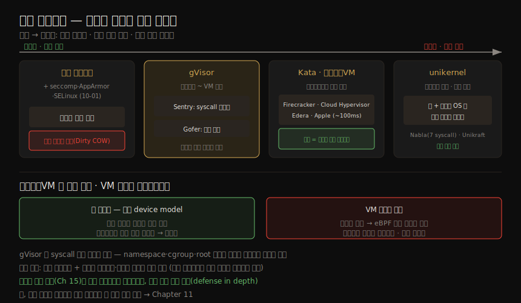

# 격리 강화 (2) — gVisor·Kata·마이크로VM
---
> 10-01 의 seccomp·AppArmor·SELinux 는 사용자 공간 행동만 제한할 뿐 커널은 여전히 공유했습니다. 이 노트는 그 한계를 넘어, 컨테이너와 VM *사이* 또는 VM 격리를 쓰는 sandboxing 으로 넘어갑니다. gVisor 는 syscall 을 사용자 공간에서 가로채 재구현하고, Kata·마이크로VM 은 컨테이너마다 자기 커널을 가진 가벼운 VM 안에 넣으며, unikernel 은 앱과 필요한 OS 부분만 합친 전용 이미지를 만듭니다. 모두 더 강한 경계를 성능과 맞바꿉니다.

이 노트는 Chapter 10 의 후반부입니다. ④ 격리 강화 그룹에서, 공유 커널을 떠나 *커널 경계 자체* 를 강화하는 쪽입니다. VM 의 기본 개념(Type 1/2·하이퍼바이저·paravirtualization)은 05-01 이 다뤘고, 이 노트는 그것을 컨테이너에 적용한 형태들입니다.

> 전제: 공유 커널이 컨테이너 격리의 약한 고리(10-01 §4 Dirty COW)라는 점이 출발점입니다. 여기 기법들은 "커널을 얼마나 떼어 놓느냐"로 갈립니다 — gVisor(사용자 공간 재구현) → Kata·마이크로VM(컨테이너별 커널) → unikernel(앱+최소 OS).


## 1. gVisor — 사용자 공간의 게스트 커널

> Google 의 gVisor 는 하이퍼바이저가 게스트 VM 의 syscall 을 가로채듯, 컨테이너의 syscall 을 가로채 sandboxing 합니다. paravirtualization 으로 상당수의 리눅스 syscall 을 *사용자 공간에서* 재구현합니다(05-01). 즉 사용자 공간에서 도는 게스트 커널인 셈입니다.

구조는 두 구성 요소로 갈립니다.

| 구성 요소 | 역할 |
|----------|------|
| Sentry | 앱의 syscall 을 가로챔. seccomp 로 강하게 sandboxing 돼 파일시스템 자원에 직접 접근 못 함. 파일 무관 syscall 도 호스트 커널로 넘기지 않고 *Sentry 안에서 재구현* |
| Gofer | 파일 접근 관련 syscall 을 Sentry 가 떼어 넘기는 별도 프로세스 |

gVisor 는 OCI 번들과 호환되는 `runsc` 실행 파일을 제공해, 06-01 의 `runc` 처럼 동작합니다.

```bash
$ sudo runsc run sh          # OCI 번들로 컨테이너 실행
$ sudo runsc list            # runsc 가 만든 컨테이너 목록
$ runsc ps <ID>              # 컨테이너 안 프로세스(예: sleep 보임)
```

흥미로운 점은 *호스트 관점* 입니다. `ps fax` 로 보면 `runsc-gofer`·`runsc-sandbox`(문서상 Sentry)와 그 자식들이 보이는데, 자식·손자 프로세스가 모두 `runsc` 실행 파일을 가리킵니다(`/proc/<pid>/exe → /usr/bin/runsc`). 컨테이너 안에서 도는 `sleep` 은 호스트에서 직접 보이지 않습니다(`ps -eaf | grep sleep` 실패).

> 컨테이너 안 프로세스가 호스트에서 안 보이는 이 동작은 일반 컨테이너보다 VM 에 훨씬 가깝습니다. 공격자가 호스트 root 를 얻어도 호스트와 sandbox 안 프로세스 사이에 비교적 강한 경계가 남습니다. 다만 `runsc exec <ID> ps` 로 호스트 root 가 컨테이너 안에서 작업할 수는 있습니다.

#### 한계와 적용 범위

| 항목 | 내용 |
|------|------|
| syscall 호환성 | 모든 syscall 이 구현되진 않음. 다만 다수 언어가 가용 syscall 을 보고 대안으로 폴백해 대부분 앱이 동작. GPU·TPU(ML 가속)에서도 동작 |
| 성능 | 보안 강화를 위해 성능 일부를 의도적으로 희생. bare-metal 에는 KVM 기반 platform 모드로 성능 개선 가능 |
| 가용성 | Google Cloud 에서 바로 사용, 자체 관리 vanilla Kubernetes 에서도 가능 |

> gVisor 는 *앱이 syscall 에 접근하는 방식만* 바꿉니다. namespace·cgroup·root 변경은 여전히 컨테이너 격리에 쓰입니다 — VM 을 닮았지만 컨테이너 메커니즘 위에 섭니다.


## 2. Kata Containers — 컨테이너를 VM 안에

> 일반 컨테이너는 런타임이 호스트 안에 새 프로세스를 띄웁니다(04-01). Kata Containers 는 컨테이너를 *별도의 VM 안에서* 돌립니다. 일반 OCI 이미지를 그대로 쓰면서 VM 의 격리를 얻는 방식입니다. Open Infra Foundation 이 호스팅합니다.

Kata 는 컨테이너마다 **micro-VMM** — Firecracker·QEMU·Cloud Hypervisor 같은 경량 VMM — 으로 별도 VM 을 만듭니다. gVisor 가 syscall 을 사용자 공간에서 가로채는 것과 달리, Kata 는 컨테이너를 진짜 VM 안에 통째로 넣어 더 두꺼운 경계를 세웁니다. 앱 입장에서는 평소처럼 OCI 이미지를 돌리지만, 그 아래 격리 수준이 컨테이너가 아니라 VM 이 됩니다.

> gVisor 처럼 Kata 도 보안과 성능을 맞바꿉니다. 워크로드가 본질적으로 신뢰되는(예: 모두 같은 회사가 만들고 운영) 배포에서는 추가 격리가 불필요한 비용입니다 — 메모리·CPU 가 더 들고 성능에 영향을 주며, 공유 볼륨·GPU 지원 같은 기능이 안 될 수 있습니다.


## 3. 경량·마이크로 VM — 빠르게 뜨는 VM

> 전통적 VM 은 부팅이 느려, 컨테이너의 단명 워크로드에 안 맞습니다(05-01). 그런데 *극히 빠르게* 뜨는 VM 이 있다면 어떨까요? 경량 VM(lightweight VM)·마이크로 VM(micro VM)이라 불리는 최소 VM 들이, 하이퍼바이저를 통한 안전한 격리와 비공유 커널의 이점을 주면서도 컨테이너용으로 빠른 시작 시간을 노립니다.

빠르게 뜨는 비결은 **컨테이너에 불필요한 커널 기능을 덜어낸** 데 있습니다. 장치 열거(device enumeration)는 부팅에서 가장 느린 부분 중 하나인데, 컨테이너 앱은 많은 장치를 쓸 이유가 드뭅니다. 핵심 절약은 필수 장치만 남긴 최소 device model 에서 옵니다. 같은 마이크로VM 이라도 출신과 지향이 갈리므로, 무엇을 고르느냐는 워크로드 성격에 따라 달라집니다.

| 프로젝트 | 배경·특징 |
|----------|----------|
| Firecracker | AWS 출신, Lambda 를 대규모로 구동. Rust 작성(메모리 안전), 약 100ms 시작. 최소 기능으로 가장 빠른 시작 |
| Cloud Hypervisor | Rust 작성. 중첩 가상화·Windows 게스트·GPU 등 더 복잡한 워크로드 지원 |
| Edera | Xen 기반을 Rust 로 대부분 재작성. 컨테이너를 VM 같은 "zone"에서 돌려 강한 격리 강조 |
| Apple Containerization | Swift 로 쓴 하이퍼바이저. Mac 에서 Linux VM 을 호스트로 두지 않고도 컨테이너를 자기 경량 VM 에서 구동 |

> 트레이드오프: 컨테이너마다 자기 커널을 가지므로 "컨테이너 탈출"은 "가상화 탈출"을 통해서만 가능 — 훨씬 강한 보안 경계입니다. 단점은 공유 커널이 없어 eBPF 기반 인프라 도구가 호스트의 모든 컨테이너에 대한 가시성·통제를 잃고, 컨테이너/VM 마다 인스턴스를 두는 사이드카 모델에 가까워진다는 점입니다. 성능 영향은 많은 워크로드에서 작지만 차이를 낼 수 있습니다.


## 4. unikernel — 앱 + 필요한 OS 만

> 실무에서는 드물지만, 게스트 OS 크기를 더 극단적으로 줄이는 접근이 unikernel 입니다. VM 의 범용 OS 는 어떤 앱에도 재사용되지만, 앱이 OS 의 모든 기능을 쓸 가능성은 낮습니다. 안 쓰는 부분을 떼면 공격 표면이 줄어듭니다.

unikernel 의 발상은 **앱 + 그 앱이 필요로 하는 OS 부분만** 으로 전용 머신 이미지를 만드는 것입니다. 이 이미지는 하이퍼바이저에서 바로 부팅돼, 일반 VM 수준의 격리에 Firecracker 같은 가벼운 시작 시간을 얻습니다. 앱마다 필요한 모든 것을 담은 unikernel 이미지로 컴파일해야 합니다.

| 프로젝트 | 내용 |
|----------|------|
| IBM Nabla | 현재 대부분 비활성. 단 7개 syscall 만 쓰도록 seccomp 로 단속, 나머지는 unikernel 라이브러리 OS 가 처리 → 커널 일부만 접근해 공격 표면 축소 |
| Unikraft | Linux Foundation 산하, 클라우드 앱 대상 unikernel 프로젝트 |

> unikernel 은 컨테이너가 아닙니다 — 공유 호스트에서 앱을 서로 격리하는 *다른 방식* 입니다.


## 5. 세 범주 비교와 선택 기준

> 이 장의 격리 방식은 크게 세 범주로 갈립니다. 무엇이 맞는지는 위험 프로파일과, 퍼블릭 클라우드·관리형 솔루션이 제공하는 선택지에 달려 있습니다.

네 방식을 "커널을 얼마나 떼어 놓느냐"의 한 축 위에 늘어놓으면 다음과 같습니다.



| 범주 | 방식 | 트레이드오프 |
|------|------|------------|
| 일반 컨테이너 + 보안 메커니즘 | seccomp·AppArmor·SELinux(10-01) | 검증됐으나 효과적 관리가 어렵기로 유명 |
| 컨테이너~VM 사이 | gVisor | syscall 접근 방식만 바꿈, 성능 일부 희생 |
| VM 격리 | Kata·마이크로VM·unikernel | VM 의 격리, 성능 페널티 가능 |

> 런타임 보안 도구(Chapter 15)도 함께 고려할 가치가 있습니다. 정적 sandboxing 프로파일보다 유연·동적인 접근으로, 정적 프로파일의 대안이 되거나 함께 묶어 심층 방어(defense in depth)를 이룰 수 있습니다. 어떤 런타임·격리를 쓰든 사용자가 격리를 쉽게 무너뜨릴 수 있는 길이 있는데, 그것은 Chapter 11(11장 노트)에서 다룹니다.


## 6. 학습 점검

> 이 노트의 핵심을 스스로 떠올려 봅니다. 답이 막히면 해당 섹션으로 돌아가 확인합니다.

- gVisor 의 Sentry 와 Gofer 가 각각 무슨 일을 하는지, 그리고 왜 컨테이너 안 `sleep` 이 호스트에서 안 보이는지 설명해 봅니다. (→ §1)
- gVisor 가 VM 을 닮았지만 여전히 컨테이너 메커니즘(namespace·cgroup·root)에 의존하는 이유를 말해 봅니다. (→ §1)
- Kata Containers 가 일반 컨테이너와 무엇이 다른지 한 문장으로 구분해 봅니다. (→ §2)
- 마이크로 VM 이 그렇게 빠르게 뜨는 비결(최소 device model)을 설명하고, Firecracker·Cloud Hypervisor·Edera·Apple 의 차이를 떠올려 봅니다. (→ §3)
- "컨테이너 탈출은 가상화 탈출을 통해서만 가능"이 무슨 뜻이고, 비공유 커널의 단점(eBPF 가시성 상실)이 무엇인지 말해 봅니다. (→ §3)
- unikernel 이 컨테이너와 어떻게 다르고, 어떻게 공격 표면을 줄이는지 설명해 봅니다. (→ §4)
