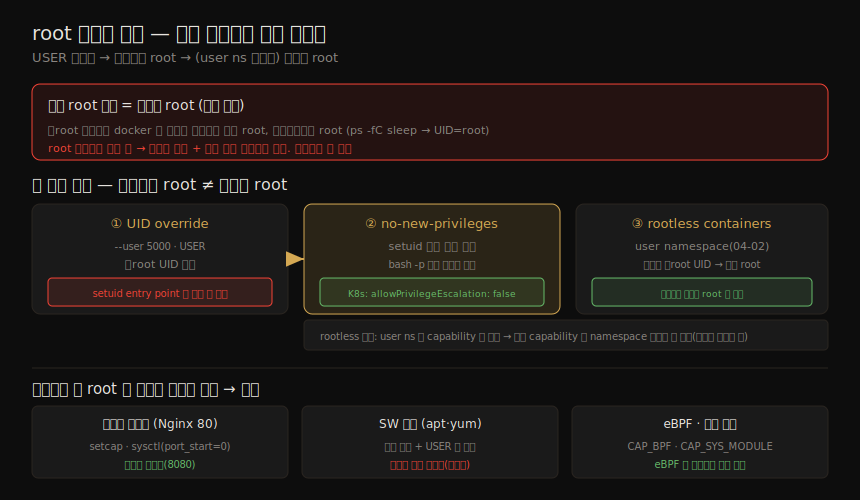

# 격리 붕괴 (1) — root 문제와 회피
---
> 4장에서 컨테이너가 어떻게 만들어지고 머신을 제한적으로만 보는지 봤다면, 이 장은 그 격리가 얼마나 쉽게 무너지는지를 봅니다. 때로는 의도적으로(예: 네트워킹을 사이드카로 떼어내기), 때로는 심각하게 보안을 해치는 형태로요. 그 출발점은 컨테이너 세계에서 가장 안전하지 않은 기본값 — **기본 root 실행** 입니다. 이 노트는 root 문제와, 그것을 피하는 길(UID override·no-new-privileges·rootless)을 다룹니다.

이 노트는 Chapter 11 의 전반부입니다. 10장이 격리를 *강화* 했다면 11장은 격리가 *무너지는* 길을 다루는 거울상입니다. 전반부는 "누구로 도는가"(root) 축, 후반부(11-02)는 "무엇을 열어 주는가"(--privileged·마운트·namespace 공유) 축입니다.

> 전제: user namespace(04-02)와 DAC·capabilities·setuid(02-01)가 여기서 핵심 개념입니다. root 회피의 정석은 비root 사용자 또는 user namespace 로, 컨테이너 안 root 가 호스트 root 와 *같지 않게* 만드는 것입니다.


## 1. 기본 root 실행 — 컨테이너 root = 호스트 root

> 이미지가 비root 사용자를 지정하거나 실행 시 다른 사용자를 지정하지 않으면, 컨테이너는 기본적으로 root 로 돕니다. 그리고 user namespace 를 쓰지 않는 한, 이것은 컨테이너 *안* root 일 뿐 아니라 *호스트* root 이기도 합니다.

Docker 로 비root 사용자가 Alpine 컨테이너를 띄워도 안의 신원은 root 입니다. 호스트의 둘째 터미널에서 확인하면 그 root 가 호스트 root 와 같습니다.

```bash
$ whoami
liz
$ docker run -it alpine sh
/ $ whoami
root
/ $ sleep 100        # 호스트 둘째 터미널에서:
# $ ps -fC sleep → UID=root  (컨테이너 안 root = 호스트 root)
```

Docker 에서 비root 사용자가 띄운 컨테이너가 root 로 도는 것은 일종의 **권한 상승** 입니다. root 컨테이너 자체가 곧 문제는 아니지만, 보안상 경종을 울립니다. 공격자가 root 컨테이너를 탈출하면 호스트 전체 root 를 얻어, 다른 모든 컨테이너를 포함해 머신의 모든 것에 자유롭게 접근합니다. 공격자가 호스트를 장악하기까지 방어선이 단 하나뿐이길 원하지는 않을 것입니다.

> `runc`(docker 가 아니라)로 띄우면 데모가 덜 극적입니다 — rootless 가 아닌 한 namespace 생성에 충분한 capability 가 있는 root 만 컨테이너를 띄울 수 있기 때문입니다. Docker 에서는 root 로 도는 Docker 데몬이 대신 컨테이너를 만듭니다. (podman 은 root 처리가 달라 이 데모가 다르게 동작합니다 — §5 참조.)


## 2. 사용자 ID override

> 다행히 컨테이너를 비root 로 돌릴 수 있습니다. 비root 사용자 ID 를 지정하거나 rootless 를 쓰는 두 길입니다. 먼저 UID override 입니다.

root 문제의 본질과 세 회피 경로, 그리고 정당한 root 필요 경우와 대안을 한 장으로 정리하면 다음과 같습니다.



실행 시점에 사용자 ID 를 지정하면 됩니다. 방식은 런타임마다 다릅니다.

| 방식 | 방법 |
|------|------|
| runc | 번들 안 `config.json` 의 `process.user.uid` 변경(예: 5000) |
| docker | `docker run --user 5000 ubuntu bash` |
| Dockerfile | `USER` 명령으로 이미지에 빌드된 UID 변경 |

```bash
$ docker run -it --user 5000 ubuntu bash
I have no name!@b7ca6ec82aa4:/$    # uid 5000, /etc/passwd 에 없어 이름 없음
```

> 문제는 공개 저장소의 이미지 대다수가 `USER` 설정이 없어 root 로 돈다는 점입니다. 사용자 ID 가 지정되지 않으면 기본값은 root 입니다.


## 3. no-new-privileges — setuid 우회 차단

> `USER` 로 비root 를 지정해도 안심할 수 없습니다. setuid 플래그(02-01)가 있는 실행 파일이 entry point 이면, 컨테이너를 띄우는 것만으로 `USER` 지정이 덮이고 root 로 돌 수 있습니다.

예를 들어 `bash` 사본에 setuid 비트(`chmod 4755`)를 주고 비root `USER` 로 entry point 를 잡은 이미지를 봅시다. `bash` 는 02-01 에서 본 대로 user ID 를 점검해 원래 사용자로 되돌려 이 쉬운 권한 상승을 막습니다. 그래서 평소엔 `myuser` 로 돕니다.

```bash
$ docker run -it nopriv          # myuser 로 동작
$ docker run -it nopriv -p       # bash -p 가 점검을 우회 → euid=0(root)!
```

`bash` 의 `-p` 옵션이 이 점검을 우회해 파일 소유자(root)로 돕니다. `id` 출력의 `euid=0(root)` 가 그 증거입니다. `bash` 라서 `-p` 가 필요했지만, *다른* setuid 실행 파일이 entry point 이면 컨테이너를 띄우는 것만으로 `USER` 가 덮입니다.

setuid 플래그를 간과하기 쉬우므로, 방어 한 겹을 더해 **no-new-privileges** 보안 옵션으로 이런 권한 상승을 막습니다.

```bash
$ docker run -it --security-opt no-new-privileges nopriv -p
# → myuser 로 유지 (euid 가 root 로 안 올라감)
```

> Kubernetes 에서는 컨테이너 spec 의 `securityContext.allowPrivilegeEscalation: false` 로 같은 효과를 냅니다. pod 안 권한 상승을 허용할 아주 좋은 이유가 없는 한, 모든 앱에 적용할 좋은 기본값입니다.


## 4. 컨테이너 안 root 필요성 — 그리고 그 대안

> 서버용으로 설계된 SW 를 담은 이미지가 root 를 요구하기도 합니다. Nginx 가 대표적입니다 — 기본 80 포트(1024 미만)를 열려면 `CAP_NET_BIND_SERVICE`(02-01)가 필요하고, 가장 쉬운 보장이 root 실행이기 때문입니다. 그런데 컨테이너에서는 포트 매핑으로 아무 포트나 80 에 매핑할 수 있어 이 요구가 훨씬 덜 타당합니다.

저포트 바인딩 문제를 root 없이 푸는 길은 다음과 같습니다.

| 대안 | 내용 |
|------|------|
| `setcap` | 빌드 시 실행 파일에 `CAP_NET_BIND_SERVICE` 부여 → 비root 도 저포트 바인딩. 단 `--cap-drop=ALL` 시 작동 안 함, `libcap2-bin` 필요 |
| `sysctl` | `net.ipv4.ip_unprivileged_port_start=0` 으로 비root 의 모든 포트 바인딩 허용. Docker 기본 적용, K8s 는 `podSecurityContext` 로 설정 |
| 비특권 이미지 | Nginx 공식 unprivileged 이미지(기본 8080). Bitnami·Chainguard·Google distroless 가 비root 이미지를 제공 |

#### SW 설치를 위한 root

또 다른 흔한 root 요구는 `yum`·`apt` 로 SW 를 설치하는 경우입니다. 이미지 *빌드 중* 설치는 타당하지만, 설치 후 Dockerfile 뒷 단계에서 `USER` 로 비root 로 바꿔야 합니다(멀티스테이지 빌드 권장, 07장). **런타임 SW 설치는 강하게 비권장** 합니다.

| 이유 | 내용 |
|------|------|
| 비효율 | 빌드 시 한 번이면 될 일을 인스턴스마다 반복 |
| 미스캔 | 런타임 설치 패키지는 취약점 스캔을 안 거침(08장) |
| 추적 불가 | 인스턴스마다 어떤 버전이 깔렸는지 알기 어려워, 취약점 발생 시 무엇을 죽일지 모름 |
| 비불변 | 런타임 추가는 불변성(08-02)을 깨뜨림. `--read-only` 로 설치를 더 어렵게 만들 수 있음 |


## 5. eBPF·커널 모듈 권한, 그리고 rootless

> 커널 수정 — 런타임에 커널 모듈이나 eBPF 로 기능을 확장하는 것 — 도 큰 권한을 요구합니다. 모든 컨테이너가 같은 커널을 공유하므로, 커널에 관측·보안 도구를 넣으면 호스트의 모든 컨테이너를 즉시 보고 영향을 줄 수 있습니다.

커널 모듈은 커뮤니티 검증·실전 경화가 부족해, 버그가 머신 전체를 다운시킬 위험에 사용자가 경계합니다. 반면 **eBPF 프로그램은 검증(verification) 과정** 덕에 커널에서 안전하게 도는 것이 보장됩니다 — 모든 실행 경로를 분석해 크래시 가능성이 있으면 로드를 거부합니다. 그래서 eBPF 는 컨테이너 환경 인프라 도구의 강력한 토대입니다.

커널 모듈 로드에는 `CAP_SYS_MODULE`, eBPF 에는 최소 `CAP_BPF`(Linux 5.8+, 이전엔 `CAP_SYS_ADMIN`)에 더해 작업에 따라 추가 capability(`CAP_NET_ADMIN`·`CAP_PERFMON`·`CAP_SYS_RESOURCE`·`CAP_SYS_ADMIN`·`CAP_SYS_PTRACE`)가 필요합니다. 호스트 파일시스템 일부(`/lib/modules`·`/sys/fs/bpf`)를 마운트해야 할 수도 있습니다. eBPF 기반 런타임 보안 도구(Chapter 15)의 이점이 위험을 상회할 수 있습니다.

#### rootless containers

> 자기 앱 코드는 가능하면 비root 또는 user namespace 로 돌려, 컨테이너 안 root 가 호스트 root 와 같지 않게 합니다. 그 실용적 방법이 rootless container 입니다.

Rootless Containers 이니셔티브가 비root 사용자의 컨테이너 실행을 가능케 한 커널 변경을 이끌었습니다. Docker·containerd 가 rootless 를 완전 지원하고, podman 은 오래전부터 지원하며 Docker 같은 특권 데몬을 쓰지 않습니다(그래서 이 장 도입 데모가 podman 에서 다르게 동작합니다).

rootless 는 **user namespace(04-02)** 를 씁니다 — 호스트의 일반 비root UID 를 컨테이너 안 root 로 매핑합니다. 탈출이 일어나도 공격자가 자동으로 호스트 root 를 얻지 못하므로 큰 보안 강화입니다.

다만 만능은 아닙니다. user namespace 는 UID·GID 뿐 아니라 **capability 도 격리** 합니다 — 어떤 capability 를 더해도 그 namespace *안에서만* 적용됩니다. 그래서 rootless 컨테이너에 `CAP_NET_BIND_SERVICE` 를 주고 호스트 네트워크를 공유해도, capability 가 namespace 밖에선 안 통해 저포트 바인딩이 안 됩니다.

> 이 capability 의 namespace 화는 대체로 좋은 일입니다 — 컨테이너 프로세스가 root 처럼 보이되 시계 변경·재부팅 같은 시스템 수준 작업은 못 하게 합니다. 대다수 앱은 rootless 에서도 잘 돕니다. (단 파일 소유권 재매핑을 지원하는 파일시스템이 필요할 수 있습니다.) root 컨테이너 자체가 문제라기보다 *탈출* 이 문제이지만, 위험한 설정(11-02)과 결합하면 재앙의 레시피가 됩니다.

> ⚠️ Docker 에서 rootless 가 아니어도 `docker` 그룹 멤버는 root 없이 컨테이너를 띄울 수 있는데, 이는 **호스트 root 와 동등** 합니다. 그 멤버가 `docker run -v /:/host <image>` 로 호스트 루트를 마운트하면 호스트 전체 파일시스템에 접근합니다.


## 6. 학습 점검

> 이 노트의 핵심을 스스로 떠올려 봅니다. 답이 막히면 해당 섹션으로 돌아가 확인합니다.

- "컨테이너 안 root = 호스트 root"가 왜 권한 상승이고, 왜 user namespace 가 이를 끊는지 설명해 봅니다. (→ §1, §5)
- `USER` 로 비root 를 지정해도 setuid entry point 가 어떻게 그것을 덮는지, no-new-privileges 가 무엇을 막는지 말해 봅니다. (→ §3)
- Nginx 가 root 를 요구하는 이유와, root 없이 저포트를 여는 세 대안을 들어 봅니다. (→ §4)
- 런타임 SW 설치를 비권장하는 이유 네 가지를 떠올려 봅니다. (→ §4)
- 커널 모듈과 eBPF 의 안전성 차이(verification)를 설명하고, eBPF 로드에 필요한 capability 를 말해 봅니다. (→ §5)
- rootless 가 어떻게 user namespace 로 보안을 강화하는지, 그리고 capability 의 namespace 화가 왜 양날인지 설명해 봅니다. (→ §5)
