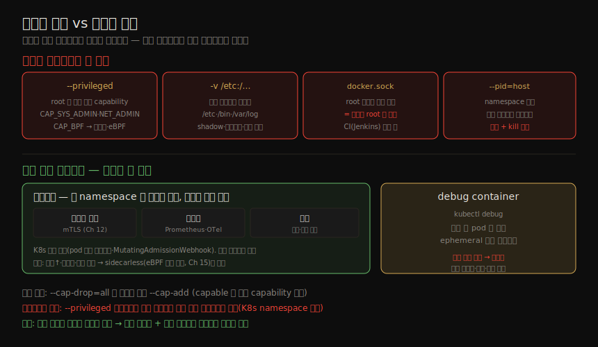

# 격리 붕괴 (2) — 위험한 설정·정당한 공유
---
> 11-01 이 "누구로 도는가"(root) 축이었다면, 이 노트는 "무엇을 열어 주는가" 축입니다. `--privileged` 플래그, 민감 디렉토리 마운트, Docker socket, namespace 공유 — 모두 격리를 우회하는 길입니다. 다만 같은 메커니즘이 *정당한* 이유로도 쓰입니다. 사이드카·debug container 가 그렇습니다. 이 노트는 위험한 설정과 그 정당한 쌍둥이를 함께 봅니다.

이 노트는 Chapter 11 의 후반부입니다. ④ 격리 강화 그룹의 마지막으로, 취약점 없이도 *설정* 만으로 격리를 무너뜨리는 길들과, 그 같은 공유가 좋은 목적으로 쓰이는 패턴을 다룹니다.

> 핵심 관점: 이 설정들은 모두 정당한 이유로 제공됩니다. 보안이 걱정이라면 사용을 최소화하고, 언제 쓰이는지 탐지하는 도구를 둡니다. 멀티테넌트 환경이라면 더욱 주의해야 합니다 — `--privileged` 컨테이너는 같은 호스트의 다른 모든 컨테이너에 접근합니다(K8s namespace 가 같든 다르든 무관).


## 1. --privileged 플래그와 capabilities

> `--privileged` 는 Andrew Martin 이 "컴퓨팅 역사상 가장 위험한 플래그"라 부른 것으로, 강력하고 널리 오해됩니다. 흔히 "root 로 돌리는 것"과 같다고 여기지만, 컨테이너는 이미 기본 root 입니다(11-01). 그럼 무엇을 더 주는 걸까요? root 의 평소 capability 중 상당수가 *기본으로는 부여되지 않는데*, `--privileged` 가 그 전부를 풉니다.

`capsh` 로 부여된 capability 를 봅니다. Docker 기본은 14개가량의 capability 를 줍니다(`cap_chown`·`cap_net_bind_service`·`cap_sys_chroot` 등). 정확한 기본 집합은 구현 의존이며 OCI 가 `runc` 의 기본 집합을 정의합니다.

```bash
# 기본: 14개가량 capability
$ docker run --rm -it alpine sh -c 'apk add -U libcap; capsh --print'
# --privileged: 거의 모든 capability (bounding set 에 CAP_SYS_ADMIN 등)
$ docker run --rm -it --privileged alpine sh -c 'apk add -U libcap; capsh --print'
```

`--privileged` 의 bounding set 에는 `CAP_SYS_ADMIN`(namespace 조작·파일시스템 마운트), `CAP_NET_ADMIN`(네트워크 스택), `CAP_BPF`(eBPF 로드) 등이 들어갑니다. `CAP_SYS_ADMIN` 하나만으로도 광범위한 특권 작업이 열립니다.

> Docker 가 `--privileged` 를 도입한 이유는 "Docker in Docker"(CI/CD 가 컨테이너로 돌며 이미지를 빌드)입니다. 정당하지만 주의해서 써야 합니다. 더 미묘한 위험은 "이 플래그가 root 를 준다"는 오해의 *역* — "이 플래그 없으면 root 가 아니다"라는 착각입니다. 플래그 없이도 컨테이너는 root 입니다(11-01).

#### 최소 권한 — capability 좁히기

`--privileged` 를 써야 해도, 정말 필요한 컨테이너만 받도록 통제·감사해야 합니다. 개별 capability 를 지정하는 편이 낫습니다. eBPF 기반 `capable` 도구로 컨테이너가 커널에 요청하는 capability 를 추적해, 필요한 집합을 파악한 뒤 **전부 drop 후 필요한 것만 add** 하는 것이 권장 방식입니다.

```bash
$ docker run --cap-drop=all --cap-add=<cap1> --cap-add=<cap2> <image> ...
```


## 2. 민감 디렉토리 마운트

> `-v` 로 호스트 디렉토리를 컨테이너에 마운트할 수 있고, 호스트 루트(`/`)를 마운트하는 것도 막을 장치가 없습니다. 기본 이미지는 root 로 돌므로, 이 컨테이너를 탈취한 공격자는 호스트 root 이자 호스트 파일시스템 전체에 접근합니다.

전체 루트 마운트는 극단적 예이고, 더 미묘한 위험들이 있습니다.

| 마운트 대상 | 위험 |
|------------|------|
| `/etc` | 호스트 `/etc/shadow` 수정, cron·init·systemd 조작 |
| `/bin`·`/usr/bin`·`/usr/sbin` | 호스트에 실행 파일을 쓰거나 기존 실행 파일 덮어쓰기 |
| 호스트 로그 디렉토리 | 로그를 고쳐 침입 흔적 삭제 |
| `/var/log`(K8s) | 컨테이너 로그가 symlink → 다른 파일을 가리키게 해 `kubectl logs` 로 호스트 전체 접근. `runAsNonRoot` 로 완화, `/var/log` 쓰기 마운트 금지 |

> K8s 에서 볼륨을 `readOnly` 로 표시해도, 그 안의 submount 가 쓰기 가능할 수 있습니다. `recursiveReadOnly: enabled` 로 submount 까지 읽기 전용으로 만듭니다. 이 위치들은 컨테이너가 root(또는 특권 사용자)로 돌 때만 취약합니다 — 비root·namespace 같은 모범 관행을 적용하면 표준 리눅스 파일 권한이 대부분을 보호합니다.


## 3. Docker socket 마운트

> Docker 환경의 모든 일은 Docker 데몬이 합니다. `docker` CLI 는 `/var/run/docker.sock` socket 으로 데몬에 지시를 보냅니다. 그 socket 에 쓸 수 있는 주체는 누구든 데몬에 지시를 보낼 수 있고, 데몬은 root 로 돌며 무엇이든 실행합니다. 따라서 **Docker socket 접근은 사실상 호스트 root 접근과 동등** 합니다.

흔한 용도가 Jenkins 같은 CI 도구입니다 — 파이프라인에서 이미지 빌드 지시를 Docker 에 보내려 socket 이 필요합니다. 정당하지만 무른 배(soft underbelly)를 만듭니다. `Jenkinsfile` 을 고칠 수 있는 사용자가 Docker 로 명령을 돌려, 기저 클러스터의 root 를 얻을 수 있습니다.

> 그래서 **프로덕션 클러스터에서 Docker socket 을 마운트하는 CI/CD 파이프라인을 돌리는 것은 극히 나쁜 관행** 입니다.


## 4. namespace 공유 — --pid=host

> 컨테이너가 호스트의 namespace 일부를 쓰게 할 이유가 있을 때가 있습니다. 예를 들어 호스트의 프로세스 정보에 접근하려면 Docker 에서 `--pid=host` 로 요청합니다. 그런데 컨테이너 프로세스는 모두 호스트에서 보이므로, 프로세스 namespace 를 공유하면 그 컨테이너가 *다른 컨테이너의 프로세스* 도 보게 됩니다.

격리를 무너뜨리는 네 설정과, 같은 namespace 공유가 정당하게 쓰이는 두 패턴을 한 장으로 대비하면 다음과 같습니다.



```bash
$ docker run --name sleep --rm -d alpine sleep 1000      # 첫 컨테이너
$ docker run --pid=host --name alpine --rm -it alpine sh # 둘째: --pid=host
$ ps | grep sleep        # 첫 컨테이너의 sleep 이 보임!
# → kill -9 <pid> 로 첫 컨테이너의 sleep 을 죽일 수도 있음
```

> namespace·볼륨 공유는 격리를 약화시키지만, 컨테이너와 정보를 나누는 것이 늘 나쁜 것은 아닙니다. 좋은 이유로 namespace 를 공유하는 두 패턴 — 사이드카와 debug container — 이 그것입니다.


## 5. 정당한 공유 (1) — 사이드카

> 사이드카는 앱 컨테이너의 namespace 한둘에 *의도적으로* 접근해, 그 앱의 기능을 떼어내 맡는 컨테이너입니다. 마이크로서비스에서 모든 서비스에 재사용할 기능을 사이드카 이미지로 묶으면 쉽게 재사용됩니다. 라이브러리와 달리 컨테이너라서 어떤 언어로든 쓸 수 있고, 서드파티 컨테이너에도 계측을 붙일 수 있습니다.

| 사이드카 용도 | 내용 |
|--------------|------|
| 서비스 메시 | 앱 대신 네트워킹을 맡아 모든 연결에 mutual TLS 보장(Ch 12). 앱 팀이 매번 재구현·테스트할 필요 없음 |
| 관측성 | 로깅·트레이싱·메트릭의 목적지·설정 구성(Prometheus·OpenTelemetry) |
| 보안 | 앱 컨테이너 안 허용 실행 파일·네트워크 연결을 단속 |

#### 사이드카 배포와 한계

Kubernetes 에서 사이드카는 일급 시민입니다 — pod spec 에 여러 컨테이너를 두고 네트워크 namespace·볼륨을 공유하며 함께 스케줄·재시작됩니다. Istio·Linkerd·Vault 같은 도구는 배포 시 `MutatingAdmissionWebhook` 으로 pod spec 에 사이드카 정의를 끼워 넣습니다. AWS ECS·Fargate 도 Task Definition 으로 네이티브 지원합니다. Docker 는 네이티브 지원이 약하나 Docker Compose 로 비슷하게 흉내 낼 수 있습니다.

> 한계도 뚜렷합니다. 앱 컨테이너당 사이드카 하나씩 늘어 자원을 더 씁니다. 의도적으로 격리했기에 정보 공유가 일부러 어려워 사이드카마다 설정·라우팅 테이블 사본이 필요합니다. 생애주기가 워크로드에 강결합돼, 사이드카 업그레이드에 워크로드 재시작이 따르고 시작 순서 문제도 생깁니다. 이 한계들이 업계를 **사이드카 없는(sidecarless)** 모델 — eBPF 로 (가상)머신 전체를 커널 수준에서 계측 — 로 밀고 있습니다(Chapter 15).


## 6. 정당한 공유 (2) — debug container

> Kubernetes 의 debug container 는 `kubectl debug` 로 실행 중인 pod 에 붙이는 ephemeral 컨테이너로, 문제 해결·진단에 씁니다.

진단에 요긴하지만, 짐작대로 임의 코드 실행 경로를 제공하므로 악용되기 쉽습니다. **고위험·특권 도구로 취급** 해야 합니다.

> 프로덕션 클러스터에서 허용한다면 적절한 접근 통제로 신뢰 사용자에게만 제한하고, 철저한 감사 로깅을 두며, 일정 시간 후 자동 정리해 ephemeral 성격을 강제하는 것이 좋습니다.


## 7. 학습 점검

> 이 노트의 핵심을 스스로 떠올려 봅니다. 답이 막히면 해당 섹션으로 돌아가 확인합니다.

- `--privileged` 가 root 실행과 다른 점이 무엇이고, 왜 "이 플래그 없으면 root 가 아니다"가 착각인지 설명해 봅니다. (→ §1)
- 최소 권한을 위해 capability 를 좁히는 권장 방식(전부 drop 후 필요한 것만 add)을 말해 봅니다. (→ §1)
- `/etc`·`/var/log` 마운트가 각각 어떤 위험을 만드는지, 그리고 비root 실행이 왜 대부분을 막아 주는지 설명해 봅니다. (→ §2)
- Docker socket 접근이 왜 호스트 root 와 동등하고, CI 도구에서 왜 위험한지 말해 봅니다. (→ §3)
- `--pid=host` 가 무엇을 가능하게 하는지(다른 컨테이너 프로세스 관찰·kill) 설명해 봅니다. (→ §4)
- 사이드카가 *정당하게* namespace 를 공유하는 세 용도와, 그 한계가 왜 sidecarless 로 이어지는지 말해 봅니다. (→ §5)
