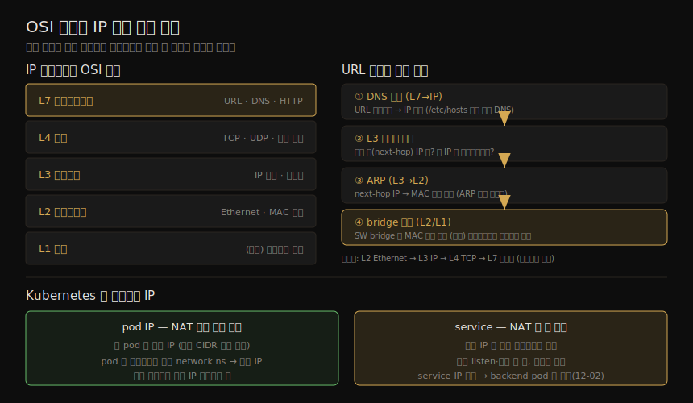

# 컨테이너 네트워크 (1) — 세그멘테이션·OSI·IP
---
> 모든 외부 공격은 네트워크를 타고 배포에 닿습니다. 그래서 앱과 데이터를 지키려면 네트워킹의 멘탈 모델이 필요합니다. 이 노트는 그 토대를 다룹니다 — 전통 방화벽보다 훨씬 세밀한 컨테이너 방화벽·마이크로세그멘테이션, OSI 7계층 모델, IP 패킷이 출발해 도착하기까지의 흐름(DNS·라우팅·ARP·bridge), 그리고 Kubernetes 에서 컨테이너에 IP 가 붙는 방식과 네트워크 격리까지입니다.

이 노트는 Chapter 12 의 전반부입니다. ⑤ 통신·런타임 그룹의 첫 절반으로, 정책을 *어떻게 구현하는가*(iptables·eBPF·NetworkPolicy·Service Mesh) 이전에, 정책이 작동하는 *바탕*(어느 계층에서·어떤 주소로) 을 세우는 단계입니다. 구현은 짝 노트(12-02)가 다룹니다.

이 책은 네트워킹 전반을 망라하지 않습니다. 다만 컨테이너 배포의 네트워크 보안을 사고할, 합리적인 멘탈 모델의 핵심을 잡는 것이 목표입니다.

> 전제: network namespace(04-01)가 컨테이너에 독립 네트워크 스택을 줍니다. 이 노트의 IP 주소·격리 논의는 그 위에 섭니다.

## 1. 컨테이너 방화벽과 마이크로세그멘테이션

> 컨테이너는 마이크로서비스 아키텍처와 함께 가는 경우가 많습니다. 앱을 작은 컴포넌트로 쪼개면 보안상 이점이 있습니다 — 작은 컴포넌트일수록 "정상 행동"을 정의하기가 훨씬 쉽기 때문입니다. 한 컨테이너는 제한된 수의 다른 컨테이너하고만 통신하면 되고, 외부 세계와 닿아야 하는 컨테이너는 일부뿐입니다.

예를 들어 이커머스 앱에서 상품 검색 서비스는 검색 요청을 받아 상품 DB 를 조회합니다. 이 서비스는 결제 게이트웨이와 통신할 이유가 없습니다. **컨테이너 방화벽** 은 컨테이너 집합을 오가는 트래픽을 제한합니다. Kubernetes 같은 오케스트레이터에서는 이 용어보다 **마이크로세그멘테이션** 이라 부르며, 개별 컨테이너가 아니라 워크로드·서비스 단위로 정책을 정의합니다. 어느 쪽이든 원칙은 같습니다 — 승인된 목적지로만 트래픽이 흐르게 제한합니다.

Kubernetes 오픈소스 배포판은 네트워킹 기능을 내장하지 않고, **CNI(Container Network Interface)** 라는 인터페이스를 둡니다. 그 반대편 기능을 채우는 프로젝트·제품을 **CNI 플러그인** 이라 합니다. Kubernetes 는 Network Policy 개념을 네이티브로 갖지만, 뒤에서 보듯 정책을 *강제하려면 적절한 CNI 를 골라야* 합니다. Docker 는 (가상)네트워크를 분리해 컨테이너를 격리하는 것 외엔 네트워크 정책 개념이 없습니다.

> 컨테이너 네트워크 보안 도구는 규칙 밖 연결 시도를 보고해 공격 조사에 유용한 포렌식을 줍니다. 전통 도구와 함께 심층 방어를 이룹니다 — VPC 로 호스트 격리, 클러스터 둘레 방화벽, L7 의 API 방화벽(WAF), 트래픽 암호화(13장).

## 2. OSI 네트워킹 모델

> OSI(Open Systems Interconnection) 모델은 1984년 발표된 계층형 네트워킹 모델로, 지금도 흔히 참조됩니다. 다만 7계층 전부가 IP 기반 네트워크에 대응하지는 않습니다. 네트워크 보안 기능이 *어느 계층에서* 작동하는지 알면, 그 기능의 성격과 한계를 이해할 수 있습니다.

IP 기반 네트워크에서 중요한 계층은 다음과 같습니다.

| 계층 | 이름 | 내용 |
|------|------|------|
| L7 | 애플리케이션 | 웹 요청·REST API. URL 로 주소 지정, DNS 가 도메인명을 IP 로 매핑 |
| L4 | 전송 | TCP·UDP 패킷. *포트 번호* 가 적용되는 계층 |
| L3 | 네트워크 | IP 패킷이 오가고 IP 라우터가 작동. 컨테이너가 네트워크에 합류하면 IP 주소 하나를 받음 |
| L2 | 데이터링크 | 물리·가상 인터페이스에 연결된 endpoint 로 주소 지정. 컨테이너는 주로 Ethernet, *MAC 주소* 로 지정 |
| L1 | 물리 | 물리(또는 가상) 네트워크 장치. 컨테이너 인터페이스는 보통 L1 에서도 가상 |

> 컨테이너가 네트워크에 합류할 때마다 그 네트워크로 가는 L1 인터페이스를 갖습니다. VMM 이 게스트 커널에 물리 장치를 매핑한 가상 장치를 주듯(05-01), 컨테이너 인터페이스도 흔히 L1 에서 가상입니다.

## 3. IP 패킷 전송 — DNS·라우팅·ARP·bridge

> 앱이 목적지 URL 로 요청을 보내는 과정을 따라가면, 한 메시지가 여러 계층을 거치는 흐름이 보입니다. 이 흐름을 알아야 어느 지점에서 보안 규칙이 끼어드는지 가늠할 수 있습니다.

OSI 계층별 주소·단위와 IP 패킷의 전송 흐름, 그리고 Kubernetes 의 pod IP·service NAT 를 한 장으로 정리하면 다음과 같습니다.

순서는 다음과 같습니다.

1. **DNS 조회 (L7→IP)** — URL 의 호스트명에 대응하는 IP 주소를 찾습니다. 로컬(`/etc/hosts`)이거나 원격 DNS 요청입니다. (이미 IP 를 알면 생략.)
2. **L3 라우팅 결정** — 목적지로 가는 다음 홉(next-hop)의 IP 가 무엇인지, 그 IP 에 대응하는 인터페이스가 무엇인지 정합니다.
3. **Ethernet 프레임 변환 + ARP (L3→L2)** — next-hop IP 를 대응 MAC 주소로 매핑합니다. 모르면 **ARP(Address Resolution Protocol)** 로 알아냅니다(ARP 캐시에 있으면 재사용).
4. **인터페이스로 전송 (L2/L1)** — point-to-point 이거나 **bridge** 에 연결됩니다.

**bridge** 는 여러 Ethernet 케이블이 꽂힌 물리 장치를 상상하면 쉽습니다 — 각 케이블 끝의 MAC 주소를 학습해, 연결된 장치들이 서로 패킷을 주고받게 합니다. 컨테이너 네트워킹에서는 bridge 가 SW 로 구현되고 케이블은 가상 Ethernet 인터페이스로 대체됩니다. 메시지가 bridge 에 닿으면 next-hop MAC 으로 어느 인터페이스로 전달할지 정합니다.

메시지가 반대편에 닿으면 IP 패킷이 추출돼 L3 로 올라갑니다. 데이터는 계층마다 헤더로 캡슐화됩니다(L2 Ethernet 헤더 → L3 IP 헤더 → L4 TCP 헤더 → L7 데이터). 최종 목적지면 수신 앱으로 올리고, 아니면 다음 홉을 정하는 라우팅을 다시 합니다.

## 4. 컨테이너의 IP 주소 — pod IP 와 service NAT

> 컨테이너는 호스트의 IP 를 공유하거나, 각자 자기 network namespace 에서 독립 네트워크 스택을 가질 수 있습니다(04-01). Kubernetes 에서는 **각 pod 가 자기 IP 주소** 를 갖고, pod 안 여러 컨테이너는 같은 network namespace 를 공유하므로 같은 IP 를 씁니다.

각 노드는 주소 범위(CIDR 블록)를 쓰도록 구성되고, pod 가 노드에 스케줄되면 그 범위에서 주소 하나를 받습니다. (AWS 처럼 VPC 범위에서 동적 할당하는 경우도 있습니다.)

#### NAT 와 Kubernetes service

Kubernetes 는 클러스터 안 pod 들이 **NAT 없이 직접** 서로 연결되길 요구합니다. NAT(Network Address Translation)는 IP 주소를 매핑해, 실제 주소가 아닌 다른 주소로 목적지를 보이게 하는 기법입니다. 두 pod 가 통신할 수 있다면 NAT 매핑 없이 서로의 IP 를 투명하게 봅니다. 단 pod 와 외부 세계 사이에는 NAT 가 있을 수 있습니다.

> **Kubernetes service 자체가 NAT 의 한 형태** 입니다. service 는 독립 리소스로 자기 IP 를 받지만, 인터페이스가 없어 트래픽을 직접 listen·전송하지 않습니다. 그 IP 는 라우팅 용도일 뿐입니다. service 는 실제 일을 하는 여러 pod 와 연결되고, service IP 로 온 패킷은 그 pod 중 하나로 전달됩니다(전달 방식은 12-02). (포트 번호를 바꾸는 것은 port mapping 이라 부릅니다.)

## 5. 네트워크 격리

> 두 컴포넌트는 *같은 네트워크에 연결돼 있을 때만* 서로 통신할 수 있습니다. 전통 호스트 환경에서는 앱마다 별도 VLAN 으로 격리하곤 했습니다.

컨테이너 세계에서 Docker 는 `docker network` 로 여러 네트워크를 쉽게 만들지만, 이는 모든 pod 가 (정책·보안 도구를 제외하면) 서로 IP 로 접근할 수 있는 Kubernetes 모델과는 잘 맞지 않습니다.

> 한 가지 짚을 점은, **Kubernetes 의 컨트롤 컴포넌트도 pod 로 돌며 앱 pod 와 같은 네트워크에 연결** 된다는 것입니다. 전화망에서 보안을 위해 컨트롤 플레인과 데이터 플레인을 분리하려 애썼던 통신 배경의 독자에겐 놀라울 수 있습니다. 대신 Kubernetes 는 network policy 로 격리를 강제합니다 — L3/4 에서, 그리고 플러그인에 따라 L7 에서. 그 구현이 12-02 의 주제입니다.

## 6. 학습 점검

> 이 노트의 핵심을 스스로 떠올려 봅니다. 답이 막히면 해당 섹션으로 돌아가 확인합니다.

- 마이크로서비스 구조가 왜 네트워크 보안에 유리한지(작은 컴포넌트=정상 행동 정의 쉬움), 마이크로세그멘테이션이 무엇인지 설명해 봅니다. (→ §1)
- Kubernetes 가 네트워킹을 내장하지 않고 CNI 를 두는 이유와, NetworkPolicy 가 "조용히 무시될" 수 있는 이유를 말해 봅니다. (→ §1)
- OSI L3·L4·L7 이 각각 무슨 주소·단위로 작동하는지(IP·포트·URL) 구분해 봅니다. (→ §2)
- IP 패킷이 URL 에서 출발해 목적지까지 가는 네 단계(DNS·라우팅·ARP·bridge)를 순서대로 떠올려 봅니다. (→ §3)
- Kubernetes 에서 pod 가 IP 를 받는 방식과, service 가 왜 NAT 의 한 형태인지 설명해 봅니다. (→ §4)
- "컨트롤 컴포넌트도 앱 pod 와 같은 네트워크"라는 사실이 왜 네트워크 정책을 중요하게 만드는지 말해 봅니다. (→ §5)
