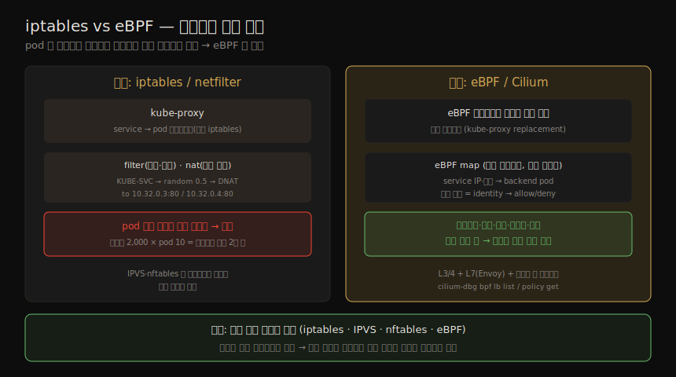

# 컨테이너 네트워크 (2) — 정책·eBPF·Service Mesh
---
> 12-01 이 네트워킹의 바탕(OSI 계층·IP 흐름·컨테이너 IP)을 세웠다면, 이 노트는 그 위에서 트래픽을 *실제로 제어하는* 구현을 다룹니다. 전통적 netfilter/iptables(kube-proxy)가 규모에서 병목이 되자 eBPF(Cilium)로 옮겨 갔고, Network Policy 는 L3/4 와 L7 에서 워크로드 간 트래픽을 허용·차단하며, Service Mesh 는 애플리케이션 계층에 또 한 겹의 통제를 더합니다.

이 노트는 Chapter 12 의 후반부입니다. ⑤ 통신·런타임 그룹에서, 정책이 *어느 계층에서 어떤 주소로* 작동하는지(12-01)를 안 뒤, 그것을 *어떤 기술로 강제하는가* 를 봅니다.

> 전제: 이 규칙들은 모두 커널 안에서 작동합니다(iptables·IPVS·nftables·eBPF). 커널은 모든 컨테이너가 공유하므로(11-01), 이 정책은 *호스트 수준* 에서 강제됩니다 — 각 컨테이너 안이 아닙니다.


## 1. L3/4 라우팅·규칙과 netfilter

> L3 라우팅은 IP 패킷의 다음 홉을 정하는 일이지만, L3/4 규칙으로는 그 이상을 할 수 있습니다 — 패킷 드롭, IP 주소 조작(로드밸런싱·NAT·방화벽·네트워크 보안 정책), 포트 번호 반영(L4) 등입니다. 전통적으로 이 규칙은 커널의 **netfilter** 에 기댑니다.

netfilter 는 리눅스 2.4 에 도입된 패킷 필터링 프레임워크로, 출발·목적 주소에 근거해 패킷을 어떻게 처리할지 정합니다. 사용자 공간에서 netfilter 규칙을 구성하는 가장 흔한 도구가 **iptables** 입니다.

#### iptables 와 kube-proxy

iptables 에는 여러 테이블 타입이 있는데, 컨테이너 네트워킹에서 중요한 둘은 `filter`(드롭·전달 결정)와 `nat`(주소 변환)입니다. Kubernetes 에서 각 노드의 **kube-proxy** 가 기본적으로 iptables 규칙으로 service 트래픽을 pod 들에 로드밸런싱합니다.

```
# service IP(10.100.132.10) → 두 pod 로 50:50 분기
KUBE-SVC-...  random probability 0.5 → KUBE-SEP-... (DNAT to 10.32.0.3:80)
                                     → KUBE-SEP-... (DNAT to 10.32.0.4:80)
```

service 뒤 pod 집합이 바뀌면 각 호스트의 iptables 규칙이 다시 써집니다. 그런데 Kubernetes 에서 pod 는 동적으로 생멸하므로, 이 규칙 재작성이 **규모에서 병목** 이 됩니다(서비스 2,000개 × pod 10개 = 노드마다 iptables 규칙 2만 개 추가).

> 대안으로 IPVS·nftables 가 있었으나 각각 한계로 널리 퍼지지 못했고, Kubernetes 커뮤니티는 단순 필터링·로드밸런싱을 넘어 관측성·정책 통제까지 주는 **eBPF 기반 해법** 으로 옮겨 갔습니다.


## 2. eBPF — Cilium 의 map·identity

> Cilium 네트워킹 플러그인(CNCF Graduated)은 처음부터 eBPF 로 설계됐습니다(Calico 도 eBPF 옵션 보유). kube-proxy replacement 를 켜면 service 로드밸런싱용 iptables 규칙이 *전혀* 없습니다. 대신 Cilium 이 eBPF 프로그램을 커널에 직접 심어 패킷을 가로채고, **eBPF map** 이라는 커널 자료구조에 service IP·포트 → backend pod 매핑을 담습니다.

pod 가 service 로 패킷을 보내면 Cilium eBPF 프로그램이 다음을 합니다.

1. 네트워크 스택 안에서 패킷을 가로채 목적 IP·포트를 식별합니다.
2. eBPF map 에서 service 를 조회해 backend pod 들을 찾습니다.
3. 로드밸런싱 알고리즘(random·round-robin·Maglev)으로 backend pod 를 고릅니다.
4. 패킷을 그 pod 의 목적 IP·포트로 재작성합니다.
5. 전달합니다.

이 모두가 **커널 안에서만** 일어나, 사용자 공간으로의 값비싼 전환을 피합니다. iptables 규칙을 들여다보는 대신 `cilium-dbg bpf lb list` 로 eBPF map 을 봅니다.

iptables 와 eBPF 가 service 로드밸런싱·정책을 강제하는 방식을 한 장으로 대비하면 다음과 같습니다.



> 핵심: iptables·IPVS·nftables·eBPF 모두 커널 안에서 작동합니다. 커널은 모든 컨테이너가 공유하므로, 보안 정책 강제는 *호스트 수준* 에서 일어납니다.


## 3. Network Policy — L3/4 와 L7

> Network Policy 는 어느 pod 가 어디로·어디서 트래픽을 주고받을 수 있는지 정의합니다. 정책이 승인하지 않으면 네트워크는 연결을 거부하거나 패킷을 드롭합니다. L3/4 정책은 포트·IP, 더 흔하게는 **pod 라벨** 로 정의합니다.

전통 환경에서는 IP·포트로 앱을 식별했지만, Kubernetes 에서 pod 는 ephemeral 이고 IP 가 재사용되므로 IP·포트로 워크로드를 식별하는 것이 더 이상 타당하지 않습니다. 대신 **라벨** 이 워크로드를 식별합니다.

```yaml
# access=true 라벨 pod 만 my-nginx 에 접근 허용
kind: NetworkPolicy
spec:
  podSelector:
    matchLabels: { app: my-nginx }
  ingress:
  - from:
    - podSelector:
        matchLabels: { access: "true" }
```

정책을 *강제* 하는 것은 코어 Kubernetes 가 아니라 **네트워킹 플러그인** 이며, 기제는 iptables·eBPF 등입니다. iptables 기반(Weave 등)은 `filter` 테이블에 규칙을 더하고, eBPF 기반(Cilium)은 라벨 해시로 pod **identity** 를 만들어 ingress/egress allow/deny 규칙으로 번역해 eBPF map 에 해시 테이블로 담습니다(빠른 조회).

#### L7 정책

> L3/4 정책은 두 endpoint 사이 트래픽을 통째로 허용·드롭하지만, **L7 정책** 은 애플리케이션 프로토콜 특성으로 더 세밀히 제어합니다. HTTP 는 특정 URL·메서드·헤더, DNS 는 도메인명·쿼리 타입, gRPC 는 메서드·서비스명·헤더로 거를 수 있습니다.

Cilium·Calico·Antrea 가 Envoy 프록시를 통합해 L7 정책을 지원하며, 규칙 강제는 프록시 안 *사용자 공간* 에서 일어납니다. Cilium 은 L3/4·L7·인증 정책을 한 리소스(`CiliumNetworkPolicy`)로 묶을 수 있어 운영·문제 해결이 쉽습니다(예: `app=echo` 에 `app=pod-worker` 에서 온 mutual-auth 된 TCP 3000 의 `GET /headers` 만 허용).


## 4. Service Mesh

> Service Mesh 는 CNI 플러그인에 더해 적용해, 애플리케이션 계층에 또 한 겹의 통제·기능을 줍니다. 사람마다 다른 의미로 쓰지만(서비스 디스커버리·L7 로드밸런싱·카나리·관측성 등), 이 책에서는 가장 근본 기능 — 워크로드 간 *안전한 네트워크 연결* — 에 집중합니다. 둘로 갈립니다 — 암호화·인증된 연결(13장)과, L7 정책으로 애플리케이션 계층 트래픽 제한입니다.

대부분의 Service Mesh 구현에서 이 정책은 CNI 가 강제하는 L3/4 정책과 분리됩니다. Istio·Linkerd, 클라우드 관리형(AWS ECS Service Connect)이 예이고, Cilium CNI 는 별도 컨트롤 플레인 없이도 Service Mesh 기능을 많이 제공합니다.

```yaml
# pod-worker 서비스 계정의 X.509 신원에서 온 GET 만 허용
kind: AuthorizationPolicy   # Istio
spec:
  selector:
    matchLabels: { app: echo }
  action: ALLOW
  rules:
  - from:
    - source: { principals: ["cluster.local/ns/default/sa/pod-worker"] }
    to:
    - operation: { methods: ["GET"] }
```

#### 사이드카 기반 Service Mesh 의 보안 제약

최근까지 대부분 사이드카로 구현됐는데(09장의 한계), 이제 사이드카 없는 옵션(Istio Ambient Mesh·Cilium)도 있습니다. 사이드카 기반을 쓴다면 다음 보안 제약을 알아야 합니다.

| 제약 | 내용 |
|------|------|
| 주입 누락 | 사이드카가 주입된 pod 만 보호. 모든 워크로드에 적용됐는지 테스트·감사 필요 |
| 우회 위험 | 앱 컨테이너 탈취 시 공유 network namespace 의 규칙을 바꾸려 할 수 있음 → 앱 컨테이너에서 `CAP_NET_ADMIN` 을 빼 둘 것 |
| 강결합 | 사이드카 생애주기가 pod 에 강결합 → mesh 업그레이드에 pod 재시작 |

> Service Mesh 정책은 *서비스 수준* 에서 정의되므로, service IP 를 거치지 않고 컨테이너로 직행하는 트래픽까지 제한하려면 컨테이너 네트워크·런타임 보안 도구를 함께 써 심층 방어를 이루는 것이 좋습니다.


## 5. 네트워크 정책 모범 관행

> 어떤 도구로 정책을 만들든, 권장되는 모범 관행이 있습니다. 모두 최소 권한 원칙을 향합니다.

| 관행 | 내용 |
|------|------|
| default deny (ingress) | namespace 마다 ingress 를 기본 거부로 두고, 기대하는 곳만 허용 정책 추가 |
| default deny (egress) | egress(나가는 트래픽)도 기본 거부. 탈취된 컨테이너가 주변을 탐색하지 못하게 |
| pod-to-pod 제한 | 라벨로 허용된 앱 사이로만 트래픽이 흐르게 제한 |
| 포트 제한 | 앱마다 특정 포트로만 트래픽을 받게 제한 |

> 컨테이너의 세밀한 방화벽은 여러 보안 원칙을 함께 지킵니다 — 최소 권한(제한된 통신), 폭발 반경 축소(탈취 컨테이너가 이웃을 못 침), 심층 방어(L3/4·L7·클러스터 둘레 방화벽 결합). 다음 13장은 이 트래픽을 *암호화* 하는 키·인증서를 다룹니다.


## 6. 학습 점검

> 이 노트의 핵심을 스스로 떠올려 봅니다. 답이 막히면 해당 섹션으로 돌아가 확인합니다.

- kube-proxy 가 iptables 로 service 로드밸런싱을 하는 방식과, 그것이 왜 규모에서 병목이 되는지 설명해 봅니다. (→ §1)
- Cilium eBPF 가 패킷을 가로채 backend pod 로 전달하는 다섯 단계를 떠올려 보고, 왜 빠른지(커널 안에서만) 말해 봅니다. (→ §2)
- Kubernetes 에서 IP·포트 대신 라벨로 워크로드를 식별하는 이유를 설명해 봅니다. (→ §3)
- L3/4 정책과 L7 정책의 차이를 한 문장으로 구분하고, L7 강제가 왜 사용자 공간(Envoy)에서 일어나는지 말해 봅니다. (→ §3)
- 사이드카 기반 Service Mesh 의 세 보안 제약과, 왜 앱 컨테이너에서 `CAP_NET_ADMIN` 을 빼야 하는지 설명해 봅니다. (→ §4)
- default deny(ingress·egress)가 왜 최소 권한 원칙의 출발점인지 말해 봅니다. (→ §5)
