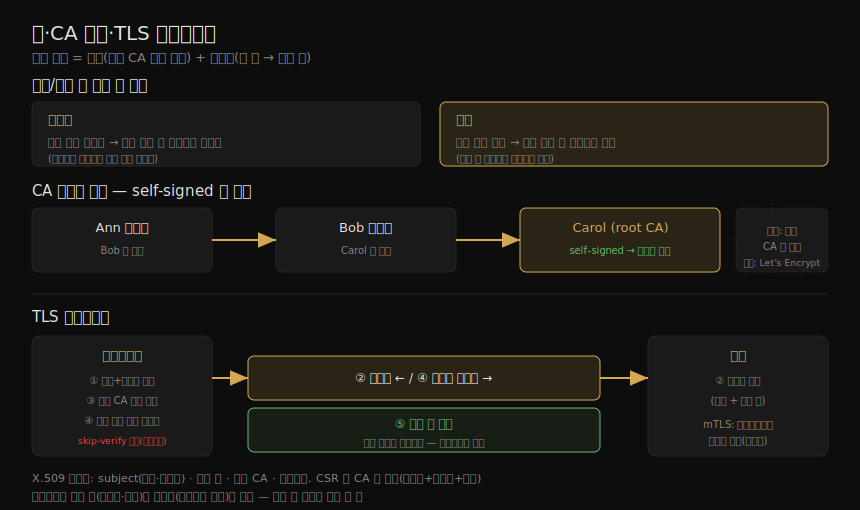

# 안전한 연결 (1) — X.509·키·CA·TLS
---
> 분산 시스템의 컴포넌트들은 서로 메시지를 주고받아야 하고, 악의적 컴포넌트가 그 통신에 끼어들지 못하게 해야 합니다. 이 노트는 그 토대 — 키와 인증서가 어떻게 작동하는가 — 를 다룹니다. 컨테이너에 특화된 내용은 아니지만, Kubernetes·etcd 같은 인프라의 인증서·키·CA 를 설정하려면 "무엇을"이 아니라 "왜·어떻게"를 알아야 합니다. 보안 연결의 두 축(인증·암호화)에서 출발해 X.509·공개/개인 키·CA·CSR·TLS 핸드셰이크까지 봅니다.

이 노트는 Chapter 13 의 전반부입니다. ⑤ 통신·런타임 그룹에서, 트래픽을 암호화하는 *원리* 를 세우는 단계입니다. 이 원리를 컨테이너에 적용하는 WireGuard·Service Mesh·SPIFFE 는 짝 노트(13-02)가 다룹니다.

> 전제: 12장의 네트워크 정책이 *누가 누구와* 통신할지를 정했다면, 이 장은 그 통신을 *어떻게 신뢰·암호화* 할지를 정합니다. 07-02 의 서명·공개키 개념이 여기서 인증서·키 쌍으로 확장됩니다.

## 1. 보안 연결의 두 축 — 인증과 암호화

> 웹 브라우저로 은행에 접속할 때 보안 연결의 두 부분을 봅니다. 첫째, 그 웹사이트가 정말 내 은행 소유인지 — 브라우저가 인증서를 검증해 확인하는 **인증(authentication)** 입니다. 둘째, 제3자가 통신을 가로채지 못하게 하는 **암호화(encryption)** 입니다.

보안 웹 연결은 HTTPS(HTTP-Secure)를 씁니다. 일반 HTTP 에 전송 계층(L4)에서 **TLS(Transport Layer Security)** 로 보안을 더한 것입니다.

> "S 는 SSL 아니었나?" 싶다면, 틀린 게 아닙니다. TLS 는 예전 SSL 의 현대 이름입니다. SSL 첫 스펙은 1995년 Netscape 가 v2 로 발표(v1 은 결함으로 미출시)했고, 1999년 IETF 가 SSL v3.0 기반으로 TLS v1.0 을 만들었으며 지금은 주로 TLS v1.3 을 씁니다. 20년이 지나도 흔히 "SSL 인증서"라 부르지만, 정확히는 **X.509 인증서** 입니다.

TLS 만 보안 연결 수단은 아닙니다. IPSec·WireGuard(13-02)도 흔히 쓰입니다. 이들 모두 신원 정보를 교환하고 암호 cipher 로 트래픽을 암호화하며, 신원·암호화 키 정보는 흔히 X.509 인증서로 교환됩니다.

## 2. X.509 인증서

> X.509 는 ITU 표준의 이름으로, 이 인증서를 정의합니다. 인증서는 소유자의 신원 정보와, 소유자와 통신할 **공개 암호화 키** 를 담은 구조화된 데이터입니다. 이 공개 키는 공개/개인 키 쌍의 절반입니다.

인증서의 핵심 정보는 다음과 같습니다.

| 항목 | 내용 |
|------|------|
| subject(주체) | 이 인증서가 식별하는 대상. 보통 도메인명 형태. 실무에선 여러 이름을 허용하는 "Subject Alternative Names" 필드를 써야 함 |
| 공개 키 | 주체의 공개 키 |
| 발급 CA | 인증서를 서명한 CA 의 이름 |
| 유효기간 | 인증서 만료 일시 |

## 3. 공개/개인 키 쌍 — 암호화와 서명

> 공개/개인 키는 비대칭 암호화의 예입니다. 공개 키로 암호화한 데이터는 *대응하는 개인 키로만* 복호화됩니다. 공개 키는 누구에게나 공유할 수 있지만, 개인 키는 소유자가 절대 노출하면 안 됩니다. 개인 키를 먼저 생성하고, 그로부터 공개 키를 계산합니다.

키 쌍은 두 용도로 쓰입니다.

| 용도 | 작동 |
|------|------|
| 암호화 | **공개 키** 로 암호화 → 대응 **개인 키** 소유자만 복호화. (송신자가 수신자의 공개 키로 암호화) |
| 서명 | **개인 키** 로 서명 → 대응 **공개 키** 소유자가 검증. (개인 키 소유자가 보냈음을 확인) |

두 능력 모두 보안 연결 수립에 쓰입니다. 그런데 한 가지 문제가 있습니다 — 내가 공개 키를 보내도, *그게 정말 나에게서 왔는지* 어떻게 알까요? 사칭일 수 있습니다. 내 신원을 보증할, 당신이 신뢰하는 제3자가 필요합니다. 그것이 **CA(certificate authority)** 의 역할입니다.

## 4. CA·인증서 체인·self-signed

> CA 는 인증서를 서명해, 그 안의 신원이 올바름을 검증하는 신뢰 주체입니다. 신뢰하는 권위자가 서명한 인증서만 신뢰해야 합니다. TLS 연결을 시작한 클라이언트는 목적지의 인증서를 받아, 의도한 대상과 통신 중인지 확인합니다 — 인증서가 신뢰 CA 가 서명한 것인지를 봅니다.

그런데 CA 도 인증서로 표현되고, 그 인증서도 CA 가 서명해야 하고, 그 서명자도 또 인증서가 필요하고… 끝없는 체인이 될 것 같습니다. 결국 신뢰할 수 있는 인증서가 하나 있어야 합니다.

실무에서 체인은 **self-signed 인증서** 로 끝납니다 — CA 가 자기 자신에게 서명한 X.509 인증서입니다. 인증서가 표현하는 신원과, 서명에 쓴 개인 키의 신원이 같습니다. 그 신원을 신뢰할 수 있으면 인증서를 신뢰할 수 있습니다. (예: Ann 의 인증서를 Bob 이, Bob 의 것을 Carol 이 서명하고, 체인은 Carol 의 self-signed 인증서로 끝남.)

| 환경 | CA 선택 |
|------|--------|
| 공개 웹사이트 | 신뢰받는 public CA 가 서명한 인증서 필요(유료 벤더 또는 무료 Let's Encrypt). 브라우저는 root CA 목록으로 검증 |
| 사설 분산 시스템(K8s·etcd) | 공개 신뢰 불필요 — 컴포넌트끼리만 신뢰하면 됨. 자체 CA + self-signed 인증서로 충분 |

> 브라우저는 잘 알려진 신뢰 CA(**root CA**) 집합을 갖고, 그들이 서명한 인증서(체인)를 신뢰합니다. 신뢰 CA 가 서명하지 않으면 사이트를 안전하지 않음으로 표시합니다. 기업 환경에서는 PKI(Public Key Infrastructure)가 CA 기능에 더해 인증서 정책·갱신·폐기를 관리합니다.

## 5. CSR — 인증서 서명 요청

> CSR(Certificate Signing Request)은 CA 에게 인증서를 요청하는 파일입니다. 공개 키, 인증서가 작동할 도메인명, 인증서가 표현할 신원 정보(회사·조직명)를 담습니다. X.509 인증서는 이 정보에 CA 서명을 더한 것이므로, CSR 에 이 내용을 담아 보내는 것이 자연스럽습니다.

`openssl` 같은 도구는 키 쌍과 CSR 을 한 번에 만듭니다. CSR 생성에 *개인 키* 를 입력으로 받는 점이 헷갈릴 수 있는데, 공개 키가 개인 키에서 파생되는 것을 떠올리면 이해됩니다.

> 이 신원으로 도는 컴포넌트는 **개인 키** 로 복호화·서명하고, 공개 키 자체는 직접 쓰지 않습니다. 공개 키가 필요한 쪽은 *통신 상대* 이고, 그들은 인증서에서 공개 키를 얻습니다. 즉 이 컴포넌트에 필요한 것은 *개인 키* 와, 상대에게 보낼 *인증서* 입니다.

## 6. TLS·mTLS 핸드셰이크

> 전송 계층 연결은 한 컴포넌트가 시작하며, 그것을 **클라이언트**, 상대를 **서버** 라 합니다. (이 client-server 관계는 전송 계층에서만 참일 수 있고, 상위 계층에선 peer 일 수 있습니다.)

키 쌍의 두 용도, CA 체인이 self-signed 로 끝나는 구조, 그리고 TLS 핸드셰이크 흐름을 한 장으로 정리하면 다음과 같습니다.

흐름은 다음과 같습니다.

1. 클라이언트가 소켓을 열고 서버에 연결을 요청하며, 보안 연결이면 서버 인증서를 요청합니다.
2. 인증서는 두 정보 — 서버의 신원과 공개 키 — 를 전합니다.
3. 클라이언트는 그 인증서가 *신뢰 CA 가 서명한 것* 인지 확인합니다(신뢰 확인).
4. 신뢰되면 서버의 공개 키로 메시지를 암호화해 보냅니다.
5. 이후 클라이언트·서버는 **대칭 키** 에 합의해 나머지 메시지를 암복호화합니다 — 비대칭 키 쌍보다 빠르기 때문입니다.

> **skip verify** 는 인증서가 알려진 CA 의 서명인지 확인하는 단계를 건너뛰는 옵션입니다. 클라이언트가 인증서의 신원 주장을 그냥 믿습니다. 비프로덕션에서 self-signed 인증서로 편하게 쓸 수 있지만, 사칭을 막지 못하므로 **프로덕션에서는 쓰지 마십시오.**

#### mTLS — 양방향 인증

클라이언트가 서버를 검증했다면, 서버는 클라이언트를 어떻게 신뢰할까요? 은행 로그인 같은 진짜 client/server 관계에서는 보통 L7 인증(아이디·비밀번호 + MFA)으로 처리합니다. 또 다른 방법은 **클라이언트도 X.509 인증서** 를 제시하는 것입니다. 서버가 클라이언트에게 신원을 증명했듯 그 반대도 하는 것 — 이것이 **mutual TLS(mTLS)** 입니다. 서버 측 설정으로 켭니다.

> 컨테이너(또는 Pod)는 클라이언트도 서버도 될 수 있습니다. 다만 이 컨테이너들은 호스트에서 돌고, 컨테이너 간 트래픽을 암호화하는 *다른 방법* 은 호스트 간 모든 네트워크 트래픽을 WireGuard·IPSec 으로 암호화하는 것입니다 — 13-02 의 주제입니다.

## 7. 학습 점검

> 이 노트의 핵심을 스스로 떠올려 봅니다. 답이 막히면 해당 섹션으로 돌아가 확인합니다.

- 보안 연결의 두 축(인증·암호화)을 구분하고, TLS 와 SSL 의 관계를 한 문장으로 말해 봅니다. (→ §1)
- 공개 키로 암호화·개인 키로 복호화, 개인 키로 서명·공개 키로 검증 — 두 용도를 헷갈리지 않게 설명해 봅니다. (→ §3)
- 공개 키를 그냥 보내면 왜 안 되고, CA 가 그 문제를 어떻게 푸는지 말해 봅니다. (→ §3, §4)
- 인증서 체인이 왜 끝없이 이어지지 않고 self-signed 로 끝나는지, 사설 시스템과 공개 웹사이트의 CA 선택이 어떻게 다른지 설명해 봅니다. (→ §4)
- TLS 핸드셰이크 다섯 단계를 떠올려 보고, 왜 마지막에 대칭 키로 전환하는지 말해 봅니다. (→ §6)
- mTLS 가 TLS 와 무엇이 다르고, skip-verify 를 프로덕션에서 쓰면 안 되는 이유를 설명해 봅니다. (→ §6)
