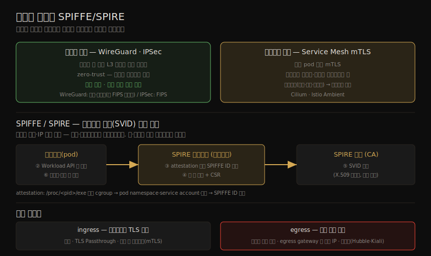

# 안전한 연결 (2) — WireGuard·Mesh·SPIFFE
---
> 13-01 이 키·인증서·TLS 의 *원리* 를 세웠다면, 이 노트는 그것을 컨테이너에 *적용하는* 방법을 다룹니다. 호스트 간 트래픽을 통째로 암호화하는 WireGuard·IPSec, 안과 밖을 모두 의심하는 zero-trust 네트워킹, 탈취된 키에 대응하는 인증서 폐기, 워크로드 대신 mTLS 를 맺어 주는 Service Mesh, 그리고 수천 워크로드의 신원을 자동 발급하는 SPIFFE/SPIRE 까지입니다.

이 노트는 Chapter 13 의 후반부입니다. ⑤ 통신·런타임 그룹에서, 13-01 의 암호 원리를 *컨테이너 배포의 실제 트래픽* 에 적용하는 단계입니다. 호스트 단위(WireGuard·IPSec)부터 워크로드 단위(Service Mesh·SPIFFE), 그리고 배포 경계의 외부 트래픽(ingress·egress)까지 층위별로 봅니다.

> 전제: 13-01 의 X.509·키 쌍·CA·mTLS 가 여기서 인프라 기술로 구현됩니다. 12-02 의 Service Mesh 가 *어떻게 암호화* 하는지를 이 노트가 채웁니다.

## 1. WireGuard·IPSec — L3 터널 암호화

> WireGuard 와 IPSec 은 구현은 다르지만, endpoint 사이에 보안 터널을 세워 그 안을 흐르는 트래픽을 캡슐화하며 IP(L3) 트래픽을 암호화합니다. 둘 다 VPN 에 흔히 쓰입니다 — 회사 네트워크에 안전히 연결하거나, 장치를 다른 나라에 있는 것처럼 보이게 할 때입니다.

| 기술 | 특징 |
|------|------|
| WireGuard | 장치에 `wg0` 인터페이스 생성, UDP 터널로 IP 패킷 캡슐화·암호화. 인터페이스에 자기 개인 키 + peer 목록(공개 키·허용 IP) 구성. 목적 peer 의 공개 키로 암호화, 수신자가 개인 키로 복호화 후 출발 IP 허용 여부 확인 |
| IPSec | 전용 인터페이스 없이 기존 인터페이스에 보안 정책 구성. peer 간 "security association"으로 암호화·인증 알고리즘 협상. transport/tunnel 모드 |

WireGuard 는 보안 수준이 높고 설정이 단순해 노드 간 트래픽 투명 암호화에 좋은 선택입니다. 단 **FIPS 미준수** 가 단점입니다 — 기술적으로 약해서가 아니라, 개발자가 FIPS 검증의 관료적 절차를 거치지 않기로 했기 때문입니다. 규제 환경에서 컴플라이언스 박스를 체크해야 한다면 IPSec 을 고려합니다.

> IPSec tunnel 모드는 원본 패킷의 IP 헤더(출발·목적 IP)까지 암호화해 더 안전하고 NAT 통과에 쓸 수 있습니다. transport 모드는 성능이 낫고, IP 주소가 민감하지 않은 사설 네트워크에 적합합니다.

## 2. zero-trust 네트워킹

> zero-trust 네트워킹은 네트워크 안이든 밖이든 *모든 트래픽이 잠재적으로 악의적* 이고 공격자가 네트워크에 접근했을 수 있다고 가정하는 접근입니다. 이 가정의 위험을 줄이려면 모든 트래픽을 암호화하고 인증해야 합니다.

WireGuard·IPSec 이 여기서 핵심 역할을 합니다. 컨테이너가 zero-trust 네트워크에 연결된 호스트에서 돌면, 트래픽이 호스트에서 호스트로 갈 때 호스트의 신원으로 인증되며 자동 암호화됩니다. 규제 환경을 포함한 많은 배포에서 이것으로 컴플라이언스 요건을 충족하며 운영도 단순합니다.

> Kubernetes 에서 pod 간 연결은 CNI 플러그인이 제공하며(12장), Cilium·Calico 같은 일부 CNI 는 IPSec·WireGuard 를 쓰도록 구성해 호스트 간 모든 트래픽을 암호화할 수 있습니다. 다만 네트워크 전체를 소유하지 않거나(VPC·VPN 연결) 배포된 컨테이너를 다 신뢰하지 못한다면, 호스트 간 암호화로는 부족합니다 — *개별 컨테이너(pod) 사이* 트래픽을 인증·암호화해야 합니다.

## 3. 인증서 폐기

> 공격자가 개인 키를 탈취하면, 대응 인증서의 공개 키로 암호화된 메시지를 복호화할 수 있어 그 신원을 사칭할 수 있습니다. 이를 막으려면 만료일을 기다리지 않고 인증서를 즉시 무효화하는 방법 — **인증서 폐기(revocation)** — 가 필요합니다.

폐기는 더 이상 받아들이면 안 되는 인증서의 목록(CRL, Certificate Revocation List)을 유지해 이룹니다. 신원·인증서를 여러 컴포넌트·사용자가 공유하지 않는 것이 좋습니다. 컴포넌트마다 개별 신원·인증서를 두는 것이 관리 부담처럼 보여도, 한 신원의 인증서를 폐기할 때 정당한 사용자 전부에게 재발급할 필요가 없고, 신원마다 별도 권한을 줄 수 있습니다.

> ⚠️ Kubernetes 는 (집필 시점) **인증서 폐기를 지원하지 않습니다.** 발급된 인증서는 만료 전엔 무효화할 수 없습니다. 대신 모범 관행은 **단기 인증서 + 자동 갱신(rotation)** 입니다. RBAC 으로 그 인증서의 클라이언트 API 접근을 막을 수는 있지만, 인증서로 TLS 연결을 맺는 것 자체는 막지 못합니다. (kubelet 은 인증서로 API 서버에 자신을 인증하며, 클러스터 CA 가 발급하고 자동 회전됩니다.)

## 4. Service Mesh 로 암호화 트래픽

> Service Mesh 가 애플리케이션 계층 정책을 강제하는 것(12장)은 봤지만, *어떻게 인증·암호화 트래픽을 제공* 하는지는 넘어갔습니다. 오랫동안 Service Mesh 는 사이드카 모델로, 모든 pod 에 프록시를 주입했습니다. pod A 가 pod B 에 연결하면 프록시 A 가 그 연결의 endpoint 가 돼 프록시 B 와 mTLS 연결을 맺고 payload 를 그 위로 전달합니다.

사이드카 모델은 규모에서 여러 단점이 있습니다 — pod 1,000개면 사이드카 1,000개가 자원(라우팅 테이블 메모리·CPU)을 더 쓰고, 프록시·앱 컨테이너 사이 추가 홉이 지연을 늘리며, 운영 복잡도가 큽니다(주입 정확성, pod 생애주기 강결합 → mesh 업그레이드에 pod 재시작).

> 그래서 많은 팀이 **사이드카 없는** 접근(Cilium·Istio Ambient Mode)으로 옮겼습니다. 워크로드 인증·암호화 연결·L7 정책·관측성 같은 핵심 mesh 기능은 유지하면서 효율·배포 속도·운영을 개선합니다. 다만 Service Mesh 가 컨테이너 대신 인증하려면, 그 *개별 워크로드를 표현하는 X.509 인증서* 에 접근해야 합니다. 수천 워크로드의 인증서 발급·신원 관리는 어려운데, 이를 돕는 이니셔티브가 SPIFFE 입니다.

암호화의 두 층위(호스트 단위·워크로드 단위)와 SPIFFE/SPIRE 의 신원 발급 흐름, 그리고 외부 트래픽 처리를 한 장으로 정리하면 다음과 같습니다.

## 5. SPIFFE/SPIRE — 워크로드 신원 자동 발급

> SPIFFE(Secure Production Identity Framework For Everyone)는 신원을 발급·관리하는 표준 방식을 정의합니다. 그 신원을 **SVID**(SPIFFE Verifiable Identity Document)라 하며, 실무에선 보통 X.509 인증서(JWT 도 지원)입니다. 핵심은 워크로드 신원을 머신 신원이나 IP 같은 전통 방식에서 *분리* 하는 것입니다 — 워크로드가 단명하고 자주 재스케줄되는 Kubernetes 같은 환경에서도요.

**SPIRE** 는 SPIFFE 의 오픈소스 구현으로, CA 이자 워크로드 attestor 로 작동합니다. 컨테이너 이미지 digest·pod 라벨 같은 특성에 근거해 SVID 를 자동 발급하고, 인가된 워크로드만 유효 신원을 받으며 자동·안전하게 회전됩니다.

mTLS 연결에 필요한 개인 키와 X.509 인증서가 SPIFFE/SPIRE 로 관리되는 흐름은 다음과 같습니다.

1. 각 노드가 **SPIRE 에이전트** 를 돌리고, 로컬 프로세스만 붙을 수 있는 소켓으로 Workload API 를 노출합니다.
2. 워크로드(K8s pod 등)가 시작돼 그 소켓으로 SPIRE 에이전트에 요청합니다.
3. 에이전트가 **워크로드 attestation 플러그인** 으로 워크로드가 무엇이고 SPIFFE ID 가 무엇인지 판별합니다.
4. 유효하면 에이전트가 키 쌍을 생성하고 CSR 을 SPIRE 서버에 보냅니다.
5. 서버가 CA 로서 워크로드용 X.509 인증서를 담은 SVID 로 응답합니다.
6. 에이전트가 인증서·개인 키를 워크로드에 넘겨, 워크로드가 TLS/mTLS 연결에 씁니다.

이로써 키·인증서를 수동 프로비저닝하지 않고 워크로드를 인증할 수 있습니다.

> attestation 플러그인은 보통 프로세스 ID 로 워크로드를 식별합니다. `/proc/<pid>/exe` 로 바이너리를 보는 단순 구현을 떠올릴 수 있습니다(02·11장 지식). Kubernetes attestor 는 프로세스의 cgroup 으로 어느 pod 인지 파악하고 API 로 namespace·service account·라벨 메타데이터를 가져와 SPIFFE ID 에 매핑합니다. 앱이 Workload API 를 직접 쓰거나, Service Mesh 가 워크로드 대신 SVID 를 가져와 앱 코드에 완전히 투명하게 처리할 수 있습니다.

## 6. 외부 트래픽 — ingress·egress

> 지금까지는 컨테이너 *사이* 트래픽이었지만, 컨테이너와 *외부* endpoint 사이 트래픽도 고려해야 합니다. 외부에서 들어오는 ingress(브라우저·사내 클라이언트)와, 컨테이너가 밖으로 내보내는 egress(결제 게이트웨이·S3·DB)입니다.

#### ingress 트래픽

외부 트래픽은 보통 진입점(로드밸런서·K8s Ingress/Gateway API·리버스 프록시)을 거쳐 컨테이너에 닿습니다. 진입점은 어느 컨테이너로 보낼지 정하고, 선택적으로 TLS 를 종료합니다.

| TLS 종료 방식 | 내용 |
|--------------|------|
| ingress 종료 | 모든 TLS 를 ingress 에서 종료, 컨테이너엔 평문 HTTP 전달(WireGuard·IPSec 쓰면 컨테이너망은 여전히 안전) |
| TLS Passthrough | TLS 연결이 컨테이너 endpoint(또는 mesh 프록시)까지 그대로 도달. 멀티테넌시 등 비신뢰 워크로드가 있을 때 필요 |
| 종료 후 재암호화 | ingress 에서 원 연결 종료, ingress↔컨테이너 사이는 mTLS |

#### egress 트래픽

> 기본적으로 컨테이너는 도달 가능한 모든 주소로 나갈 수 있습니다. egress 네트워크 정책·Security Group 으로 제한합니다. 공격자의 데이터 유출을 어렵게 하려면 **명시적으로 필요하지 않은 한 outbound 를 끄는** 것이 좋습니다. egress gateway 는 워크로드 트래픽이 예측 가능한 IP 에서 나오는 것처럼 보이게 해 방화벽 규칙 작성을 쉽게 합니다(Cilium·Istio·클라우드 NAT gateway).

inbound·outbound 연결은 예기치 않은 목적지·트래픽 급증(악성 징후)에 대비해 모니터·로깅해야 합니다. 많은 CNI·Service Mesh 가 관측성 도구(Cilium Hubble·Istio Kiali)를 제공해 연결 문제 디버깅과 침해 정보 파악을 돕습니다(Chapter 15).

## 7. 학습 점검

> 이 노트의 핵심을 스스로 떠올려 봅니다. 답이 막히면 해당 섹션으로 돌아가 확인합니다.

- WireGuard 와 IPSec 이 L3 트래픽을 암호화하는 방식의 공통점과, WireGuard 가 FIPS 미준수인 이유를 설명해 봅니다. (→ §1)
- zero-trust 네트워킹의 가정과, 호스트 간 암호화로 부족해 개별 컨테이너 인증이 필요한 경우를 말해 봅니다. (→ §2)
- 인증서 폐기가 왜 필요하고, Kubernetes 가 폐기 대신 무엇(단기 인증서·자동 회전)으로 대응하는지 설명해 봅니다. (→ §3)
- 사이드카 Service Mesh 가 mTLS 를 맺는 방식과, 사이드카 없는 모델로 옮겨 간 이유를 떠올려 봅니다. (→ §4)
- SPIFFE/SPIRE 가 워크로드에 인증서를 자동 발급하는 여섯 단계를 순서대로 설명해 봅니다. (→ §5)
- ingress TLS 종료 세 방식의 차이와, egress 를 기본 차단하는 것이 왜 좋은지 말해 봅니다. (→ §6)
