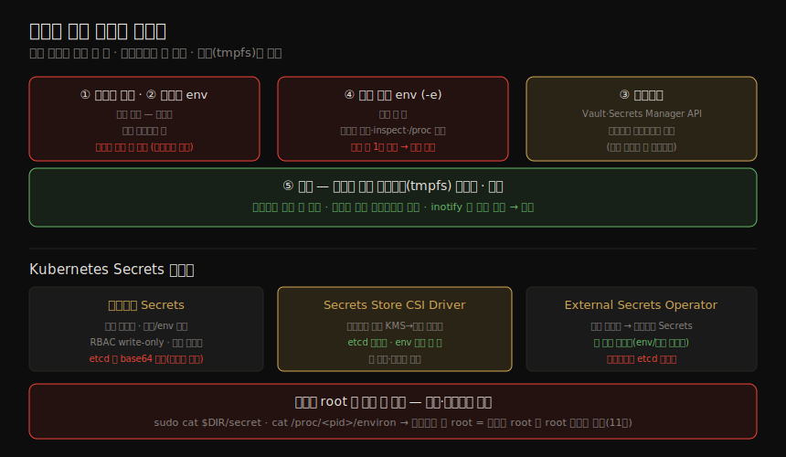

# 시크릿 전달 — 속성·전달방식·K8s Secrets
---
> 앱 코드는 DB 비밀번호나 API 토큰 같은 자격증명(시크릿)을 필요로 합니다. 시크릿은 자원 접근을 제한하려고 존재하므로, 그 자체가 "비밀"로 남아야 하고 최소 권한 원칙대로 정말 필요한 사람·컴포넌트만 접근해야 합니다. 이 노트는 시크릿의 바람직한 속성에서 출발해, 컨테이너에 시크릿을 넣는 다섯 방법의 적합성을 비교하고, Kubernetes 의 네이티브 Secrets 지원과 그 한계 — "root 는 결국 다 본다" — 까지 봅니다.

이 노트는 Chapter 14 전체를 다룹니다. ⑤ 통신·런타임 그룹에서, 13장이 *연결을 신뢰·암호화* 했다면 이 장은 그 신뢰 위에서 *시크릿 값을 안전히 전달* 하는 단계입니다.

> 전제: 13장의 안전한 연결이 있어야 시크릿을 네트워크로 안전히 받을 수 있습니다(그런데 그 연결에도 자격증명이 필요한 부트스트랩 문제가 §3 에 나옵니다). 그리고 11장의 "컨테이너 root = 호스트 root"가 §7 의 핵심 한계로 돌아옵니다.


## 1. 시크릿의 바람직한 속성

> 시크릿의 가장 분명한 속성은 *비밀이어야 한다* 는 것입니다 — 접근 권한이 있는 사람·대상만 볼 수 있어야 합니다. 보통 데이터를 암호화하고 복호화 키를 권한 있는 대상에게만 공유해 이를 보장합니다.

| 속성 | 내용 |
|------|------|
| 저장·전송 시 암호화 | 저장소 접근자 모두가 보지 못하게 암호화 저장. 네트워크 sniffing 방지 위해 전송 중에도 암호화. 평문은 디스크에 안 쓰고 *메모리에만* 두는 것이 이상적 |
| 폐기(revoke) | 더 이상 신뢰할 수 없을 때(유출 의심·팀원 퇴사) 즉시 무효화 |
| 회전(rotate) | 유출 여부를 모를 수 있으므로 주기적으로 바꿔, 탈취된 자격증명이 곧 무용해지게. (사람의 비밀번호 강제 변경은 나쁘지만 SW 는 잦은 변경에 잘 대응) |
| 독립 생애주기 | 시크릿 생애주기가 그것을 쓰는 컴포넌트와 독립적이어야 — 시크릿이 바뀔 때 컴포넌트를 재빌드·재배포하지 않게 |
| 접근 최소화 | 시크릿 접근자 집합은 소스 코드·배포 권한자보다 훨씬 작아야. 흔히 사람에겐 **write-only** — 자동 생성 후 다시 읽을 이유가 없음 |

> "암호화하면 끝"이 아닙니다 — 수신자가 복호화 키를 알아야 하고, 그 키 자체가 또 시크릿이라 어떻게 안전히 전달하느냐는 원래 문제로 돌아옵니다. 접근 제한은 사람만이 아니라 *컴포넌트* 에도 적용됩니다 — 정말 필요한 컨테이너에만 시크릿을 노출해야 합니다.


## 2. 컨테이너에 정보를 넣는 다섯 방법

> 컨테이너는 의도적으로 격리된 대상이므로, 정보(시크릿 포함)를 넣는 방법은 제한적입니다. 어느 시점에 넣느냐 — 빌드 시점 vs 실행 시점 — 가 적합성을 가릅니다.

| # | 방법 | 시점 |
|---|------|------|
| 1 | 이미지 root 파일시스템에 파일로 포함 | 빌드 |
| 2 | 이미지 설정의 환경변수로 정의 | 빌드 |
| 3 | 네트워크 인터페이스로 수신 | 실행 |
| 4 | 실행 시점에 환경변수 정의·재정의(`-e`) | 실행 |
| 5 | 호스트 볼륨을 마운트해 파일에서 읽기 | 실행 |

처음 두 방법(빌드 시점)은 시크릿을 이미지에 하드코딩해야 해 **부적합** 합니다.


## 3. 이미지·네트워크로 전달 — 부적합과 부트스트랩

> 이미지에 시크릿을 굽는(방법 1·2) 것은 일반적으로 나쁜 생각입니다.

소스 접근자 누구나 시크릿을 볼 수 있고, 암호화해 둬도 *복호화할 두 번째 시크릿* 을 또 어떻게 넣을지의 문제가 남습니다. 또 이미지를 재빌드하지 않으면 시크릿을 바꿀 수 없어, Vault·CyberArk 같은 중앙 자동 관리 시스템이 생애주기를 통제할 수 없습니다.

> 놀랍게도 소스에 시크릿을 굽는 일이 흔합니다 — 나쁜 줄 모르거나, 개발·테스트 중 지름길로 넣고 나중에 빼려다 잊기 때문입니다. 이미지 스캐너(08장)가 하드코딩된 시크릿을 잡아 줍니다.

#### 네트워크 전달 — 부트스트랩 문제

방법 3(네트워크)은 AWS Secrets Manager·HashiCorp Vault 같은 관리형 서비스에 앱이 API 로 시크릿을 요청하는 흔한 방식입니다. 다만 컨테이너↔시크릿 서비스 통신이 암호화돼야 하는데, 그 보안 연결에 또 자격증명이 필요한 **부트스트랩 문제** 가 생깁니다(13장). 투명 암호화나 Service Mesh 로 떠넘길 수 있지만, Service Mesh 자체도 다른 방법으로 받은 자격증명이 필요합니다.


## 4. 환경변수로 전달 — 권장하지 않음

> 방법 4(환경변수)는 몇 가지 이유로 권장되지 않습니다.

| 위험 | 내용 |
|------|------|
| 크래시 덤프 | 많은 언어·프레임워크가 크래시 시 환경 설정을 덤프 → 로그로 가면 로그 접근자가 시크릿을 봄 |
| inspect 노출 | `docker inspect` 로 빌드·런타임 환경변수가 다 보임. 정당한 관리자가 시크릿까지 볼 필요는 없음 |
| /proc 노출 | 호스트 접근자가 `cat /proc/<pid>/environ` 으로 모든 환경변수를 봄(§7) |

```bash
$ docker image inspect --format '{{.Config.Env}}' nginx
# → 이미지에 구운 환경변수 전부 노출
$ docker run -e EXTRA_ENV=HELLO --rm -d nginx
$ docker container inspect --format '{{.Config.Env}}' 13bcf
# → 런타임에 넘긴 -e 값까지 노출
```

"Twelve-Factor App" 선언이 환경변수 설정을 권장한 탓에, 시크릿을 환경변수로 기대하는 서드파티 컨테이너를 만날 수 있습니다. 위험을 줄이려면 로그에서 시크릿을 가리거나, 앱·사이드카가 안전한 저장소(Vault·CyberArk Conjur·클라우드 KMS)에서 시크릿을 가져오게 합니다. (AWS Fargate 는 task 정의가 Secrets Manager 의 시크릿을 *참조* 해 task 정의 자체엔 민감 데이터를 안 두지만, 앱이 보는 시점엔 평문 환경변수가 됩니다.)

> 환경변수는 프로세스 생성 시점에 *한 번만* 설정됩니다. 그래서 시크릿을 회전하려면 외부에서 컨테이너 환경을 재구성할 수 없습니다 — 회전에 근본적으로 불리합니다.


## 5. 파일로 전달 — 최선

> 더 나은 방법은 마운트된 볼륨의 파일로 시크릿을 쓰는 것(방법 5)입니다. 이상적으로 그 볼륨은 디스크가 아니라 *메모리에 있는 임시 디렉토리* 여야 합니다. Docker Swarm secrets·Kubernetes secrets 모두 in-memory 파일시스템으로 마운트할 수 있고, 안전한 저장소와 결합하면 시크릿이 평문으로 디스크에 "at rest" 저장되지 않습니다.

다섯 전달 방법의 적합성과 Kubernetes Secrets 생태계, 그리고 root 한계를 한 장으로 정리하면 다음과 같습니다.



파일이 호스트에서 컨테이너로 마운트되므로, 컨테이너를 재시작하지 않고 호스트 쪽에서 언제든 갱신할 수 있습니다. 앱이 옛 시크릿이 멈추면 파일에서 새 시크릿을 읽을 줄 알면, **재시작 없이 회전** 할 수 있습니다.

> 앱이 갱신을 알아채는 일은 Linux **inotify** 로 쉬워졌습니다 — 파일이 바뀌면 파일시스템이 프로세스에 이벤트를 보냅니다. (이 inotify 는 민감 파일 접근 이벤트를 구독하는 런타임 보안 도구에도 유용합니다.)


## 6. Kubernetes Secrets 와 생태계

> Kubernetes 는 네이티브 Secrets 지원으로 §1 의 여러 기준을 충족합니다. 독립 리소스(생애주기 분리), etcd 에 base64 저장(기본은 미암호화이나 API 서버 수준 리소스 암호화를 켤 수 있음), 컴포넌트 간 전송 암호화, 파일·환경변수 두 방식 지원(파일은 in-memory tmpfs), RBAC 으로 write-only 설정까지 됩니다.

네이티브 Secrets 외에 두 확장이 있습니다.

| 확장 | 내용 |
|------|------|
| Secrets Store CSI Driver | Vault·클라우드 KMS 에서 *런타임에 직접* 시크릿을 끌어와 pod 에 파일로 마운트. **etcd 에 저장되지 않고 환경변수로도 노출 안 됨.** 앱이 올바른 파일을 읽도록 수정·재시작 필요(inotify 로 감시 가능). 네이티브 Secrets 로 동기화도 가능하나 그러면 취지가 무색 |
| External Secrets Operator | AWS Secrets Manager·Vault·Google Secret Manager 에서 시크릿을 끌어와 *네이티브 K8s Secrets 로 동기화*. 앱 수정 불필요(환경변수·파일로 그대로 소비). 단 네이티브 Secrets 라 etcd 에 저장됨 |

#### 회전

> Kubernetes 에서 회전은 두 측면입니다 — Secret *값* 의 회전과, etcd 의 Secret 을 암호화하는 EncryptionConfig *키* 의 회전입니다.

값 회전은 `kubectl` 로 값을 바꾼 뒤 그 시크릿을 쓰는 pod 를 보통 재시작해야 합니다(앱이 변경 감시를 안 하면). External Secrets Operator 는 값을 자동 갱신하지만 pod 재시작은 여전히 필요합니다.

EncryptionConfig 키 회전은 API 서버를 *최소 두 번* 재시작하는 다단계입니다 — ① 새 키를 둘째 항목으로 추가 → ② API 서버 재시작(새 키로 복호화 가능) → ③ 새 키를 첫째로 swap → ④ 재시작(새 키로 암호화 시작) → ⑤ 모든 Secret 을 새 키로 재암호화 → ⑥ 옛 키 제거.

> 대다수 기업은 클라우드 KMS(AWS KMS·Azure·GCP)나 HashiCorp·CyberArk 같은 상용 솔루션을 씁니다 — 여러 클러스터가 공유하고, 앱 생애주기와 무관하게 값을 회전하며, 시크릿 처리 방식을 표준화하고 일관된 로그·감사를 얻기 때문입니다.


## 7. root 는 결국 다 본다

> 시크릿을 마운트 파일로 넣든 환경변수로 넣든, 호스트의 **root 사용자는 그것에 접근할 수 있습니다.**

파일로 두면 임시 디렉토리라도 호스트 파일시스템 어딘가에 있어 root 가 봅니다. Kubernetes 노드에서 `sudo mount -t tmpfs` 로 마운트를 찾고 `sudo cat $DIR/ca.crt` 로 시크릿 파일을 읽을 수 있습니다. 환경변수도 마찬가지입니다 — 프로세스 ID 를 찾아 `sudo cat /proc/<pid>/environ` 으로 모든 환경변수를 봅니다(04장).

```bash
$ docker run --rm -it -e SECRET=mysecret ubuntu sh   # 컨테이너에 시크릿 주입
$ sudo cat /proc/<pid>/environ                        # 호스트 root 가 읽음
# → ...SECRET=mysecret...
```

> 암호화해서 넣으면 낫지 않을까 싶지만, 그 복호화 키 — 역시 비밀 — 를 컨테이너에 어떻게 넣을지를 생각하면 도돌이표입니다. **호스트에 root 접근을 가진 자는 그 머신의 모든 것 — 모든 컨테이너와 그 시크릿 — 에 무제한 권한을 갖습니다.** 그래서 무단 root 접근을 막는 것이 중요하고, 컨테이너 안 root 실행이 위험합니다(11장) — 컨테이너 안 root 가 호스트 root 이니, 그 머신의 모든 것을 장악하기까지 한 걸음입니다.


## 8. 학습 점검

> 이 노트의 핵심을 스스로 떠올려 봅니다. 답이 막히면 해당 섹션으로 돌아가 확인합니다.

- 시크릿의 바람직한 속성 다섯 가지를 떠올려 보고, 사람에게 흔히 write-only 인 이유를 설명해 봅니다. (→ §1)
- "암호화하면 끝"이 왜 아닌지(복호화 키도 시크릿) 말해 봅니다. (→ §1)
- 컨테이너에 정보를 넣는 다섯 방법 중 빌드 시점 둘이 왜 부적합한지 설명해 봅니다. (→ §2, §3)
- 네트워크 전달의 부트스트랩 문제가 무엇인지 말해 봅니다. (→ §3)
- 환경변수 전달의 세 위험과, 회전에 불리한 이유(생성 시 1회 설정)를 설명해 봅니다. (→ §4)
- 파일(in-memory tmpfs) 전달이 왜 최선이고, inotify 가 회전을 어떻게 돕는지 말해 봅니다. (→ §5)
- Secrets Store CSI Driver 와 External Secrets Operator 의 핵심 차이(etcd 저장 여부)를 설명해 봅니다. (→ §6)
- "root 는 결국 다 본다"가 컨테이너 안 root 실행을 왜 위험하게 만드는지 말해 봅니다. (→ §7)
