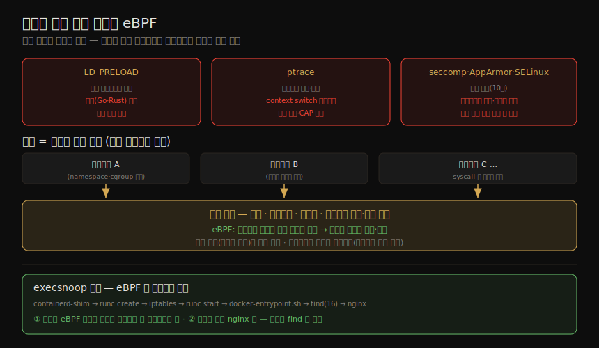

# 런타임 보안 (1) — 정책·eBPF 기술
---
> 10장의 seccomp·AppArmor·SELinux 도 런타임에 작동해 컨테이너의 행동을 제한했지만, 이 장은 더 정교한 도구 — 수상한 런타임 활동을 동적으로 탐지하고 워크로드별로 조율된 정책을 쓰는 — 를 다룹니다. 핵심은 **보안 관측성(security observability)** 입니다. 컨테이너·Kubernetes 신원 정보를 담은 로그·메트릭을 만들어, 수상한 사건을 특정 워크로드에 연결합니다. 이 노트는 무엇을 관측·제한할지(정책)와, 그것을 어느 기술로 강제하는지(eBPF)를 다룹니다.

이 노트는 Chapter 15 의 전반부입니다. ⑤ 통신·런타임 그룹의 핵심 장으로, 책 전반에서 거듭 예고된 "eBPF 기반 런타임 보안"의 토대입니다. 구체적 도구(Falco·Tetragon)와 차단·완화 운영은 짝 노트(15-02)가 다룹니다.

> 전제: 컨테이너가 마이크로서비스로 잘게 쪼개진다는 성질(12·15장)이 출발점입니다. 작은 컴포넌트일수록 "정상 행동"을 정의하기 쉬워, 이미지별 런타임 정책을 세울 수 있습니다.


## 1. 이미지 런타임 정책 — 정상 행동을 프로파일링

> 한 이미지가 한 마이크로서비스의 작은 기능을 담으면, 그것이 *무엇을 해야 하는지* 추론하기 쉽습니다. 같은 이미지에서 뜬 컨테이너는 모두 같게 행동하므로, 이미지마다 기대 행동 프로파일을 정의해 그 이미지 기반 모든 컨테이너의 행동을 단속할 수 있습니다.

이커머스의 상품 검색 마이크로서비스(12장)를 예로, 정상 행동을 네 축으로 프로파일링합니다.

| 축 | 정상 / 이상 |
|----|-----------|
| 네트워크 | ingress/LB 에서 inbound, 상품 DB 로 egress 만 정상. L7 으로 HTTP GET 만 허용 가능. 그 외는 이상(12장) |
| 실행 파일 | `productsearch` 하나만 정상. `bash`·`sh`·`zsh` 가 보이면 경계 — 공격의 reverse shell 과 관리자 maintenance shell 은 보안상 차이가 거의 없음(둘 다 불변성 위반) |
| 파일 접근 | 로그·시크릿 외엔 거의 없음. 단 언어에 따라 런타임 공유 라이브러리 접근이 많음(`cat` 하나도 `opensnoop` 으로 보면 20여 개 파일 접근) |
| User/Group ID | 한 기능엔 보통 한 신원. 다른 신원, 특히 root 로 권한 상승이 보이면 큰 경고 |

> 일부 도구는 **recording 모드** 로 일정 기간 트래픽·동작을 관찰해 정상 프로파일을 자동 구축하고, 이를 정책으로 변환합니다. 손으로 짠 정책은 ancillary 파일을 빠뜨리기 쉬워(`cat` 의 20여 개처럼), 자동 프로파일링이 유용합니다.

#### drift 방지와 fileless 실행

> 컨테이너를 불변으로 다루면 런타임 코드 주입을 잡는 강력한 수단 — **drift 방지** — 이 생깁니다. 컨테이너가 새 실행 프로세스를 돌릴 때, 그 파일이 스캔 시점 이미지에 있었을 때만 허용합니다.

파일명 목록이 아니라 스캔 단계의 **파일 fingerprint** 를 쓰면, 공격자가 주입한 실행 파일을 정당한 이름으로 위장해도 막힙니다. 한편 **fileless 실행** — 명령을 디스크에 안 쓰고 메모리에만 두는 — 은 멀웨어가 시그니처 스캔을 회피하는 기법인데, 현대 런타임 보안 도구는 파일뿐 아니라 메모리 실행도 잡습니다.

#### 민감 파일과 AI 생성 정책

특정 파일(`/etc/shadow`)은 모든 워크로드의 접근(최소한 쓰기)을 로그·차단할 가치가 있고, Kubernetes 에서는 `/etc/kubernetes/manifests` 의 예기치 않은 쓰기를 막아 원치 않는 static pod 생성을 방지합니다.

> 프로파일을 손으로 짜든 자동 생성하든, 정책 밖 행동을 잡는 도구가 필요합니다. AI 가 이미지에 필요한 실행 파일·파일 접근·권한·네트워크 연결을 알아내 정책을 자동 생성하는 도구가 빠르게 등장하고 있습니다 — 관찰된 행동과 취약점 연구에 근거한 자율 세그멘테이션을 약속하는 회사도 이미 있습니다.


## 2. 기술 옵션 (1) — 낡은 방식의 한계

> 정책 밖 활동을 탐지·차단하려면 어떤 기술이 적합한지를 봅니다. 수년간 쓰인 방식들에는 각각 한계가 있습니다.

| 기술 | 작동 | 한계 |
|------|------|------|
| LD_PRELOAD | 표준 동적 라이브러리 대신 계측 코드를 끼워 넣음(C 표준 라이브러리·syscall override) | 동적 링크 앱만 — 정적(Go·Rust) 바이너리는 그냥 통과. 악성 앱이 `LD_PRELOAD` 를 바꿔 우회. glibc·musl 변종 대응 어려움 |
| ptrace | 한 프로세스가 다른 프로세스를 관찰·제어(디버거 기반) | breakpoint 마다 context switch → 큰 오버헤드. 추적당함을 쉽게 감지. `CAP_SYS_PTRACE` 위험으로 기본 미부여(rootless 에선 작동 안 함) |
| seccomp·AppArmor·SELinux | 정적 정책(10장) | 사전 정의 정적·제한적 필터. "컨테이너 A 는 허용, B 는 불가" 표현 어려움. 보안 관측성 없음(차단 로그뿐, 신원 연관 없음). 정적 프로파일 안에서도 권한 상승·fileless·lateral movement 는 못 잡음 |

> 세 방식이 공유하는 한 강점은 모두 *커널에서* 돈다는 것 — 머신의 모든 컨테이너에 접근합니다. 이 커널이라는 관측 지점의 이점이 다음 절의 핵심입니다.


## 3. 기술 옵션 (2) — 커널 기반과 eBPF

> 호스트의 모든 컨테이너는 단일 커널을 공유합니다(04장). 앱은 비특권 사용자 공간에서 돌며 파일·네트워크·메모리가 필요할 때마다 syscall 로 커널에 청합니다. 커널은 프로세스 조율·생성·권한 검사도 맡습니다. 이 모든 동작이 보안상 흥미로우므로, **커널은 런타임 보안 도구가 살기 이상적인 곳** 입니다 — 호스트의 모든 컨테이너를 내려다보고, 컨테이너와 독립된 생애주기를 가집니다(사이드카 대비 큰 장점, 12장).

역사적으로 커널 확장은 **커널 모듈** 뿐이었는데, 크래시 시 머신 전체를 다운시키는 취약성이 큰 우려였습니다(소수만 쓰는 모듈은 검증·경화가 부족). 그래서 많은 조직이 커널 모듈을 꺼립니다.

> **eBPF** 가 이를 바꿨습니다 — 커널에서 돌지만 *검증(verification)* 으로 크래시를 막습니다(11장). 모든 실행 경로를 분석해 크래시 가능성이 있으면 로드를 거부합니다. eBPF 프로그램은 커널 이벤트에 attach 돼, 이벤트를 사용자 공간에 보고하고 최근엔 이벤트 차단·악성 프로세스 종료도 합니다.

기술 옵션들의 한계와, 커널·eBPF 가 관측 지점으로 우수한 이유를 한 장으로 정리하면 다음과 같습니다.



#### execsnoop — eBPF 로 프로세스 관측

가장 기본적인 런타임 보안 관측성은 실행되는 프로그램을 보는 것입니다. `nginx` 컨테이너라면 평소엔 `nginx` 프로세스만 보여야 합니다. `libbpf-tools` 의 `execsnoop`(11장 `capable` 과 같은 패키지)으로 봅니다.

```bash
$ sudo execsnoop          # eBPF 코드 삽입에 root capability 필요
# 다른 터미널: docker run --rm -d --name nginx nginx
# → containerd-shim → runc create → iptables → runc start
#   → docker-entrypoint.sh → find(16개) → 마지막에 nginx
```

두 교훈이 있습니다. 첫째, **호스트의 `execsnoop` 이 컨테이너 안 프로세스를 본다** 는 것 — namespace·cgroup 으로 격리돼도 호스트 커널을 쓰므로 eBPF 가 접근합니다. 둘째, 초기화 기간엔 init 프로세스가 돌지만 이후엔 `nginx` 만 보여야 합니다 — 초기화에 필요한 `find` 가 나중에 다시 보이면 공격자가 파일시스템을 뒤지는 신호일 수 있습니다.

> 공격자가 컨테이너에 암호화폐 채굴기를 넣으면, 채굴기 실행은 관측·보고(가능하면 차단)하되 `nginx` 초기화·정상 실행은 알리지 않아야 합니다. 런타임 보안 도구는 실행 파일을 워크로드 정책과 대조해 이 구분을 합니다. 그 구체적 도구가 15-02 의 주제입니다.


## 4. 학습 점검

> 이 노트의 핵심을 스스로 떠올려 봅니다. 답이 막히면 해당 섹션으로 돌아가 확인합니다.

- 보안 관측성이 무엇이고, 마이크로서비스 구조가 왜 이미지별 런타임 정책을 쉽게 만드는지 설명해 봅니다. (→ 도입, §1)
- 정상 행동을 프로파일링하는 네 축(네트워크·실행 파일·파일 접근·UID)을 떠올려 보고, 관리자 maintenance shell 이 왜 reverse shell 과 보안상 차이가 없는지 말해 봅니다. (→ §1)
- drift 방지가 무엇이고, 파일명 대신 fingerprint 를 쓰는 이유, fileless 실행이 무엇인지 설명해 봅니다. (→ §1)
- LD_PRELOAD·ptrace·seccomp 의 한계를 각각 하나씩 들어 봅니다. (→ §2)
- 커널이 런타임 보안 도구의 이상적 관측 지점인 이유와, 커널 모듈 대비 eBPF 가 안전한 이유(verification)를 말해 봅니다. (→ §3)
- `execsnoop` 예제의 두 교훈(호스트가 컨테이너 안 프로세스를 봄·초기화 후엔 nginx 만)을 설명해 봅니다. (→ §3)
