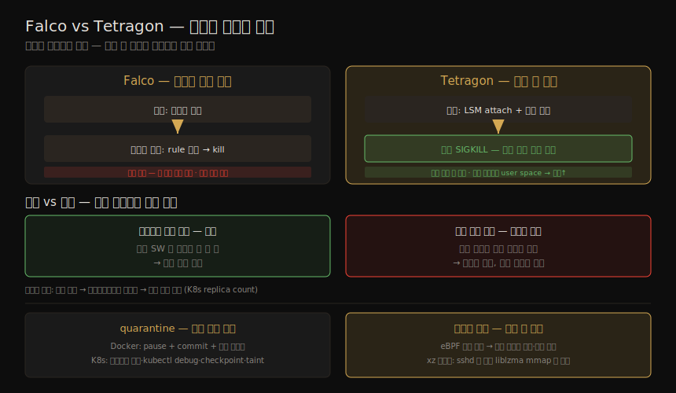

# 런타임 보안 (2) — 도구·차단·완화
---
> 15-01 이 런타임 정책과 eBPF 기술의 *토대* 를 세웠다면, 이 노트는 그것을 구현한 *실제 도구* 와 *운영 결정* 을 다룹니다. eBPF 기반 도구(Falco·Tetragon·Tracee·Inspektor Gadget)가 수상한 행동을 어떻게 탐지·차단하는지, 탐지 시 차단할지 경고만 할지, 의심 컨테이너를 어떻게 격리(quarantine)하는지, 그리고 패치 전 취약점을 런타임에 어떻게 완화하는지(xz 백도어 예)까지입니다.

이 노트는 Chapter 15 의 후반부입니다. ⑤ 통신·런타임 그룹의 핵심 장을 마무리하며, 15-01 의 eBPF 관측 지점 위에서 *무엇으로 막고 어떻게 대응하는가* 를 봅니다.

> 전제: 오늘날 컨테이너 인식 런타임 보안 도구는 모두 eBPF 기반입니다(15-01 의 LD_PRELOAD·ptrace·seccomp 한계 때문). 차단의 핵심은 *커널 안에서 동기적으로* 막느냐, 사용자 공간 컴포넌트가 늦게 죽이느냐의 차이입니다.


## 1. eBPF 기반 런타임 보안 도구

> 오늘날 도구는 모두 eBPF 기반입니다. 오픈소스에서는 Falco 가 가장 널리 쓰이지만 Cilium 의 Tetragon 이 빠르게 추격 중이고, Tracee·Inspektor Gadget 도 있습니다. 핵심 차이는 *정책 비교가 어디서 일어나는가* — 사용자 공간이냐 커널이냐 — 와 *차단(enforcement) 능력이 있느냐* 입니다.

| 도구 | 비교 위치 | 차단 | 특징 |
|------|----------|------|------|
| Falco (CNCF Graduated) | 이벤트는 커널 수집, *사용자 공간* 에서 rule 비교 | 없음(사용자 공간이 반응해 프로세스 kill) | 커뮤니티 rule 다수(NIST·PCI/DSS). K8s 신원으로 이벤트 enrich. Sysdig Secure 가 상용판 |
| Cilium Tetragon | *커널 안* 에서 정책 비교(in-kernel filtering) | 있음(보고·return 값 override·SIGKILL) | K8s 신원 + 타이밍·프로세스 ancestry(포렌식). LSM API 활용. 정책=K8s CRD YAML. Prometheus 메트릭 |
| Tracee (Aqua) | 일부 in-kernel filtering | 없음(탐지만) | eBPF 기반 |
| Inspektor Gadget (CNCF) | gadget 별 | 없음 | 실행·네트워크·syscall·capability·파일 접근 모니터링 gadget 모음. 베이스라인 구축에 유용 |

> Falco 의 한 특징은 이벤트를 *커널에서 수집* 하되 rule 비교는 *사용자 공간* 에서 한다는 점입니다. 반면 Tetragon 은 비교를 *커널 안* 에서 해, 주목할 이벤트만 사용자 공간에 올려 성능이 훨씬 낫습니다.

두 도구의 비교 위치 차이와 동기적 차단, 그리고 차단 vs 경고 결정·quarantine·취약점 완화를 한 장으로 정리하면 다음과 같습니다.



#### Tetragon 의 동기적 차단

Tetragon 정책은 K8s custom resource(`TracingPolicy`) YAML 로 씁니다. LSM API 함수(예: `security_file_permission`)에 attach 해, selector 로 거른 뒤 `Sigkill` 같은 action 으로 차단합니다.

```yaml
kind: TracingPolicy   # Tetragon
spec:
  kprobes:
  - call: "security_file_permission"   # LSM API — 파일 접근마다 호출
    selectors:
    - matchArgs:
      - index: 0
        operator: "Equal"
        values: ["/tmp/liz"]           # 이 파일 접근이면
      matchActions:
      - action: Sigkill                # 책임 프로세스 종료(+ 사용자 공간 보고)
```

> 탈취된 앱이 `/tmp/liz` 에 접근하면 커널의 Tetragon eBPF 프로그램이 발동해, **사용자 공간 전환 없이** 정책과 대조하고 조건이 맞으면 SIGKILL 을 보냅니다. 정책 밖 행동이 *완료되기 전에* 막는 것 — 이 동기성이 차단의 핵심입니다.


## 2. 차단 vs 경고 — 무엇을 할 것인가

> 어떤 도구를 쓰든 마지막 결정이 남습니다 — 수상한 행동을 발견하면 *차단* 할지, 프로세스를 *종료* 할지, *경고* 만 하고 사람(또는 AI)이 판단하게 할지입니다. 정답은 워크로드에 따라 다릅니다.

| 고려 | 내용 |
|------|------|
| 서비스 영향 | 자동 종료·삭제가 사용자 서비스에 영향을 주나? 다른 인스턴스가 받나? 거짓 양성이면? |
| 악순환 | 오케스트레이터가 새 인스턴스를 띄우면 같은 공격에 또 당함 → 컨테이너 생성→탐지→kill→재생성 무한 루프(K8s replica count) |
| 롤백 | 새 버전이면 이전 버전으로 롤백 가능한가? |

> **예방이 치료보다 낫습니다.** 민감 파일 접근을 탐지했을 때, Tetragon 의 동기적 차단은 접근 *전에* 막지만, 다른 도구는 사용자 공간 컴포넌트가 프로세스를 죽이길 기다려야 해 그 사이 데이터가 유출될 수 있습니다. 사람에게 물으면 위험은 더 큽니다. 차단이 가능하면 "좋은" 프로세스는 그대로 돌고 공격(예: 암호화폐 채굴기)만 막혀 컨테이너가 계속 동작할 수 있습니다.

#### 활동 유형별로 다른 대응

차단의 결과가 활동마다 다르므로 대응도 달라야 합니다. 네트워크 패킷 드롭은 수신 SW 가 그 패킷을 못 볼 뿐이라 안전합니다. 반면 파일 접근 차단은 에러 코드를 반환하는데, 개발자가 그 에러를 예상 못 했으면 앱이 크래시할 수 있습니다(드물게 쓰이는 경로면 테스트에서 놓치기 쉬움).

> 그래서 대부분의 파일 접근은 **로깅·경고** 에 의존하고, *가장 민감한 파일* — 크래시가 악성 접근보다 덜 해로운 — 에만 차단을 거는 식으로 나눕니다.


## 3. 포렌식과 quarantine

> 수상한 사건이 차단됐다는 안도에 더해, *실제 공격이었는지·어떻게 일어났는지* 알면 더 좋습니다. 그러려면 수상한 활동 직전까지의 포렌식 증거가 필요합니다. eBPF 도구가 관련 데이터를 기록해 영속 저장소로 보냅니다(Tetragon 의 실행·파일 이벤트 audit, Tracee 의 logging 모드).

의심 컨테이너는 *종료* 대신 **quarantine(격리·보존)** 하는 편이 포렌식에 유리합니다.

| 환경 | 방법 |
|------|------|
| Docker | `docker pause`(프로세스 동결·미종료) + 선택적 `docker commit`(파일시스템 사본) + 볼륨 스냅샷 |
| Kubernetes | 네이티브 pause 없음 → 네트워크 정책으로 격리 · `kubectl debug` 로 조사 · Kubelet Checkpoint API(베타) · 노드 taint 로 새 pod 차단 |

> 컨테이너가 탈취됐다고 보면 최소한 pause·격리해 공격자의 데이터 유출·lateral movement 기회를 줄이는 것이 좋습니다.


## 4. 취약점 완화 — 패치 전의 방어

> 신규 취약점은 계속 공개되고, 수정본이 나와도 이미지를 재빌드·테스트·배포하기까지 시간이 걸립니다. 그 사이 런타임 보안 도구가 취약점 악용을 감시·차단하면 큰 도움이 됩니다. eBPF 의 **동적 로드** — 새 정책을 배포 전체에 즉시·투명하게 적용 — 가 이를 가능하게 합니다.

예로 2024년 **xz utils 백도어**(`liblzma` 의 CVE-2024-3094, SSH 통한 원격 실행)를 봅니다. 취약 라이브러리 코드를 돌리려면 SSH 데몬이 그것을 메모리에 매핑해야 하므로, `security_mmap_file` LSM 함수에 attach 해 그 매핑을 잡습니다.

```yaml
kind: TracingPolicy   # cve-2024-3094-xz-ssh
spec:
  kprobes:
  - call: "security_mmap_file"          # LSM API — 파일 메모리 매핑
    selectors:
    - matchBinaries:
      - operator: "In"
        values: ["/usr/sbin/sshd"]      # SSH 데몬이 매핑할 때만
      matchArgs:
      - index: 0
        values: ["liblzma.so.5.6.0", "liblzma.so.5.6.1"]   # 취약 버전이면
      matchActions:
      - action: Post                     # 보고(rateLimit 1m). 차단도 가능
```

> 매칭(바이너리·파일명)이 모두 *커널 eBPF 프로그램* 에서 일어나 성능 영향이 거의 없습니다. 패치 전 SSH 데몬이 취약 `liblzma` 를 매핑하는 순간을 잡아 보고(또는 차단)합니다.

런타임 보안 관측성·차단은 이 책 1판 이후 eBPF 의 진화·채택 덕에 크게 발전했습니다. 세밀한 런타임 이벤트 탐지를, 앱에 투명하게 거의 무부하로 할 수 있다는 점이 전문 컨테이너 보안 도구를 설득력 있게 만듭니다.


## 5. 학습 점검

> 이 노트의 핵심을 스스로 떠올려 봅니다. 답이 막히면 해당 섹션으로 돌아가 확인합니다.

- Falco 와 Tetragon 의 두 핵심 차이(비교 위치·차단 능력)를 설명해 봅니다. (→ §1)
- Tetragon 의 동기적 차단이 왜 "예방이 치료보다 낫다"를 실현하는지, 다른 도구의 사용자 공간 종료와 무엇이 다른지 말해 봅니다. (→ §1, §2)
- 자동 차단의 악순환(생성→탐지→kill→재생성)이 무엇이고, 활동 유형별로 대응이 왜 달라야 하는지(네트워크 드롭 vs 파일 차단 크래시) 설명해 봅니다. (→ §2)
- 의심 컨테이너를 종료 대신 quarantine 하는 이유와, Docker·Kubernetes 의 방법을 떠올려 봅니다. (→ §3)
- eBPF 의 동적 로드가 패치 전 취약점 완화를 어떻게 가능하게 하는지, xz 백도어 정책이 무엇을 잡는지 설명해 봅니다. (→ §4)
