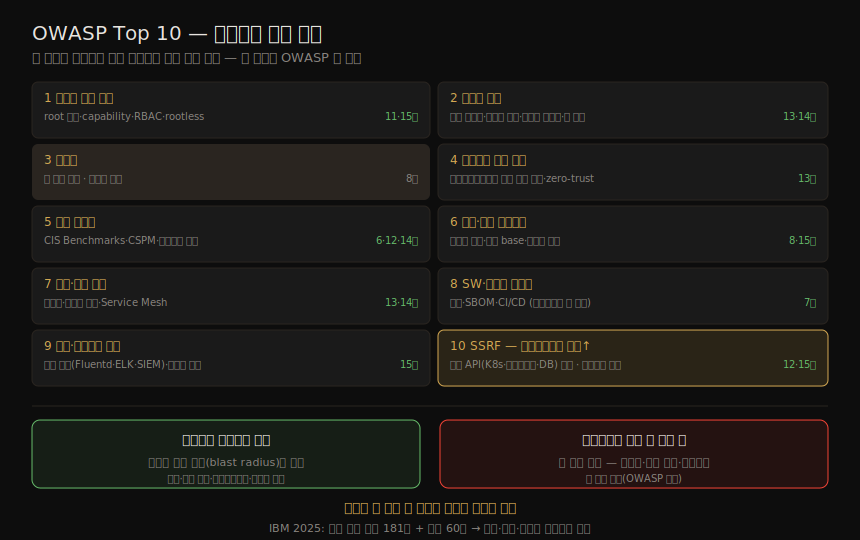

# OWASP Top 10 — 컨테이너 관점 매핑
---
> OWASP(Open Web Application Security Project)는 웹 애플리케이션 보안 위험 Top 10 을 주기적으로 발표합니다. 모든 앱이 웹 앱은 아니지만, 어떤 공격을 가장 경계할지 가늠하는 데 좋은 자료입니다. 이 노트는 OWASP Top 10 의 열 가지 위험을 *컨테이너 특화 완화책* 에 연결합니다. 앞선 장들(7·11~15장)에서 다룬 대응이 각 위험에 어떻게 매핑되는지를 모아, 책 전체를 OWASP 축으로 다시 조망하는 마무리입니다.

이 노트는 Chapter 16 — 책의 **마지막 장** 전체를 다룹니다. ⑤ 통신·런타임 그룹의 끝이자, 앞 장들과 교차참조하는 **허브** 역할을 겸합니다. 새 기법을 도입하기보다, 이미 배운 완화책을 OWASP 의 열 카테고리로 재배열해 점검하는 종합 리뷰입니다.

> 전제: 대부분의 위험에는 컨테이너든 아니든 *전통 배포와 같은 대응* 이 그대로 적용됩니다. 이 노트는 그 위에 *컨테이너 특화* 로 더할 수 있는 것만 정리합니다. 따라서 "컨테이너 관점"이 비어 있는 카테고리(인젝션·무결성 일부)는 앱 코드 수준 대응이 본령입니다.

## 1. OWASP Top 10 — 컨테이너 완화책 매핑

> 열 카테고리 각각에, 컨테이너·클라우드 네이티브에 특화된 완화책과 그것을 다룬 장을 연결합니다. "컨테이너 관점"이 약한 항목은 앱 코드 수준 대응(OWASP 권고)이 본령임을 표시합니다.

OWASP Top 10 과 컨테이너 완화책·참조 장의 매핑, 그리고 폭발 반경 vs 앱 수준 결함의 균형을 한 장으로 정리하면 다음과 같습니다.

| # | OWASP 카테고리 | 컨테이너 특화 완화책 | 참조 장 |
|---|---------------|---------------------|---------|
| 1 | 취약한 접근 통제 | root 실행 금지·capability 제한·K8s RBAC·rootless·런타임 보안 도구로 행동 제한. 단 *앱 수준* 사용자 권한은 전통 대응 그대로 | 11·15장 |
| 2 | 암호화 실패 | 저장·전송 시 강한 알고리즘으로 암호화(양자 대비 NIST·NCSC 최신 권고). 시크릿 접근 최소화·컨테이너 간 트래픽 암호화·이미지에 박힌 키 스캔 | 13·14장 |
| 3 | 인젝션 | 컨테이너 특화 없음. 단 이미지 스캔이 의존성의 알려진 인젝션 취약점을 드러냄. 앱 코드 리뷰·테스트가 본령(Little Bobby Tables) | 8장 |
| 4 | 안전하지 않은 설계 | 마이크로서비스가 모놀리스보다 유리 — 시스템을 구성 요소로 쪼개 각 위협 모델을 하나씩 추론. K8s 의 최신 모범 관행(zero-trust·최소 권한) 활용 | 13장 |
| 5 | 보안 오설정 | CIS Benchmarks(Docker·K8s·Linux 호스트)로 점검. CSPM 도구(Cloud Custodian·Prowler·CloudSploit)로 공개 버킷·약한 정책 점검. 환경변수에 시크릿 금지·레지스트리 접근 통제·네트워크 정책 | 6·12·14장 |
| 6 | 취약·노후 컴포넌트 | 이미지 스캐너로 알려진 취약점 식별·최소 base image. 재빌드·취약 이미지 교체 프로세스. 런타임 도구로 패치 전 완화 | 8·15장 |
| 7 | 인증·식별 실패 | 컨테이너 자격증명을 시크릿으로 취급·런타임 전달. 컴포넌트끼리 서로 식별·보안 연결(앱 코드 직접 또는 Service Mesh·투명 암호화) | 13·14장 |
| 8 | SW·데이터 무결성 실패 | 공급망 보안 — 서명된 이미지·SBOM 검증·CI/CD 파이프라인 보안. 데이터 무결성 검증(insecure deserialization)은 컨테이너 무관, 앱 본령 | 7장 |
| 9 | 로깅·모니터링 실패 | 중앙 로깅(Fluentd·ELK·SIEM)으로 컨테이너 제거돼도 로그 보존. 런타임 도구가 사후 보고를 넘어 *차단* 까지 | 15장 |
| 10 | 서버측 요청 위조(SSRF) | 컨테이너에선 순위가 더 높을 만함 — 앱을 꾀어 내부 메타데이터·컨트롤 플레인 API(K8s API·클라우드 메타데이터·DB)에 요청. 네트워크 정책·런타임 모니터링으로 완화 | 12·15장 |

## 2. 짚어 둘 두 카테고리

> 열 중 둘은 컨테이너 맥락에서 특별히 강조할 가치가 있습니다 — 마이크로서비스 구조가 *유리하게* 작용하는 설계 축과, 컨테이너에서 *순위가 올라갈* SSRF 입니다.

#### 안전하지 않은 설계 — 마이크로서비스의 이점

설계가 보안 관점에서 결함이 있으면, 완벽히 구현해도 불안전합니다. 마이크로서비스로 지은 컨테이너 시스템은 모놀리스보다 유리한 면이 있습니다 — 시스템을 구성 요소로 쪼개므로 각 building block 의 위협 모델을 *하나씩* 추론하기가 더 쉽기 때문입니다. Kubernetes 같은 널리 쓰이는 도구를 쓰면 최신 보안 모범 관행(컨테이너 간 zero-trust 네트워킹·최소 권한 접근)도 활용할 수 있습니다.

#### SSRF — 컨테이너에서 더 위험

> SSRF(Server-Side Request Forgery)는 컨테이너 특화 OWASP Top 10 이라면 더 높은 순위를 받을 만하다고 저자는 봅니다. 앱을 꾀어 내부 메타데이터·컨트롤 플레인 API 에 요청하게 만들어 시스템 제어를 얻을 위험 때문입니다.

공격자가 앱의 SSRF 취약점을 이용해 **Kubernetes API**, **클라우드 제공자 메타데이터 서비스**, 배포 안에서 접근 가능한 **DB 서비스** 에 요청을 보낼 수 있습니다. 이 서비스들은 신뢰 자원에만 열려야 합니다. 네트워크 정책(12장)과 런타임 모니터링(15장)으로 가능성을 줄입니다.

## 3. 컨테이너 무관 — 앱 코드가 본령인 항목

> 모든 위험이 컨테이너 특화 완화책을 갖지는 않습니다. 다음은 컨테이너든 아니든 *앱 코드 수준* 대응이 본령이며, 컨테이너는 보조적으로만 돕습니다.

| 항목 | 컨테이너의 보조 역할 / 본령 |
|------|---------------------------|
| 인젝션 | 이미지 스캔이 의존성 취약점을 드러낼 뿐. 본령은 앱 코드 리뷰·파라미터화(OWASP 권고) |
| 데이터 무결성(insecure deserialization) | 데이터 처리는 컨테이너 실행 여부와 무관. 본령은 앱의 입력 검증 |
| 접근 통제(앱 수준 사용자 권한) | 컨테이너 완화책은 *폭발 반경* 만 줄임. 앱 수준 권한은 전통 대응 그대로 |

> 핵심 균형: 컨테이너 완화책은 공격의 **폭발 반경(blast radius)을 줄이는** 데 강하지만, *앱 수준* 결함(인젝션·잘못된 권한 로직·역직렬화)을 대신 막아 주지는 않습니다. 보안은 앱 코드 *와* 그 앱이 도는 인프라 *양쪽* 에 새겨야 합니다.

## 4. 책 전체 마무리

> OWASP Top 10 은 인터넷에 연결된 어떤 앱이든 가장 흔한 공격에 더 안전하게 만드는 유용한 자료입니다. 이 책의 결론은 한 문장으로 모입니다 — **보안은 앱 코드와 인프라 양쪽에 새겨야 합니다.**

이 책은 컨테이너가 무엇인지(리눅스 커널 기능의 조합)에서 출발해, 그것을 악용하는 수많은 길과 보호하는 수많은 방법을 거쳐, OWASP 라는 공통 축으로 전체를 다시 묶으며 끝납니다. 완벽한 보안은 없지만, 다섯 그룹의 대응 — 위협 이해(①) · 메커니즘 해부(②) · 이미지·공급망(③) · 격리 강화(④) · 통신·런타임(⑤) — 을 겹겹이 적용하면 더 안전한 자리에 설 수 있습니다.

> 로깅·모니터링 한 가지만 봐도 그 가치가 분명합니다 — IBM 2025 보고서는 침해를 식별하는 데 평균 181일, 봉쇄에 추가 60일이 걸린다고 합니다. 충분한 관측과 예상 밖 행동에 대한 경고를 결합하면 이를 크게 줄일 수 있고, 런타임 도구(15장)는 사후 보고를 넘어 *예방* 까지 합니다. 사후 치료보다 사전 예방이 — 이 책 전체를 관통하는 한 마디입니다.

## 5. 학습 점검

> 이 노트의 핵심을 스스로 떠올려 봅니다. 답이 막히면 해당 섹션으로 돌아가 확인합니다.

- 취약한 접근 통제(#1)에 대한 컨테이너 특화 완화책 네 가지(root 금지·capability 제한·RBAC·rootless)를 떠올려 봅니다. (→ §1)
- 인젝션(#3)·데이터 무결성(#8)처럼 컨테이너 특화 완화책이 약한 항목은 무엇이 본령인지 설명해 봅니다. (→ §1, §3)
- 마이크로서비스 구조가 "안전하지 않은 설계"(#4)에 왜 유리한지 말해 봅니다. (→ §2)
- SSRF(#10)가 컨테이너에서 순위가 올라갈 만한 이유와, 어떤 내부 API 가 표적인지 설명해 봅니다. (→ §2)
- "컨테이너 완화책은 폭발 반경을 줄이지만 앱 수준 결함을 대신 막지 못한다"는 균형을 한 문장으로 말해 봅니다. (→ §3)
- 로깅·모니터링(#9)이 왜 중요한지, IBM 181일 통계와 런타임 예방으로 설명해 봅니다. (→ §1, §4)
