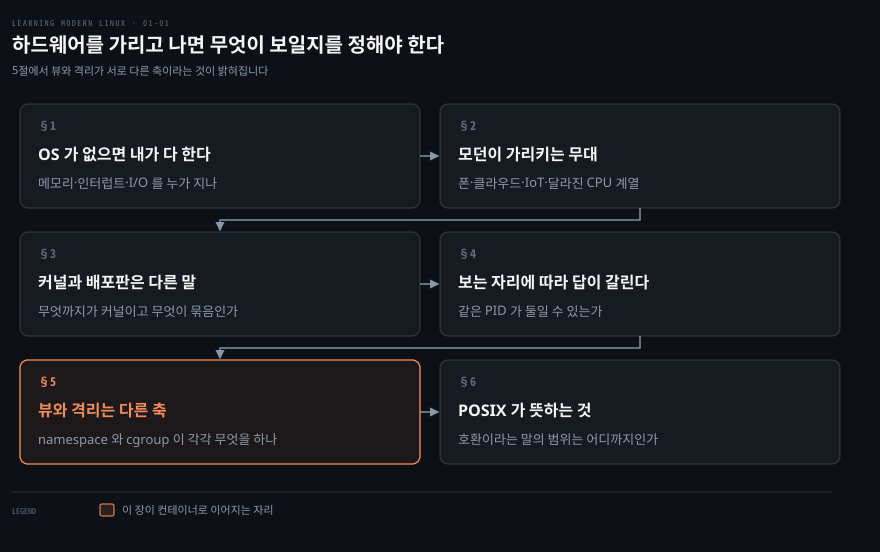
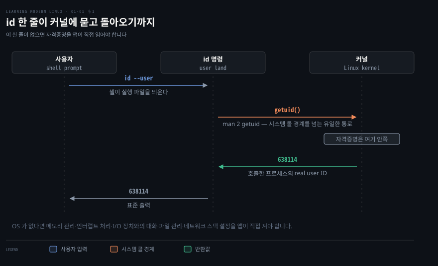
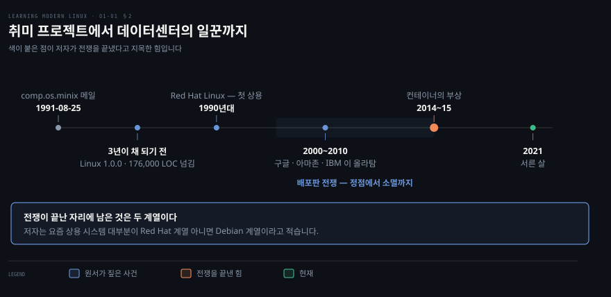
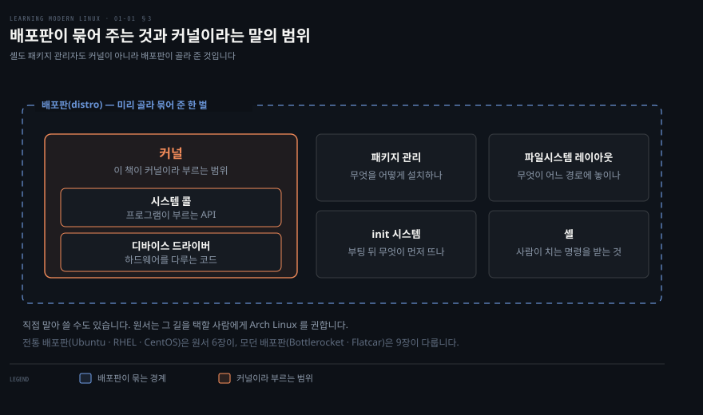
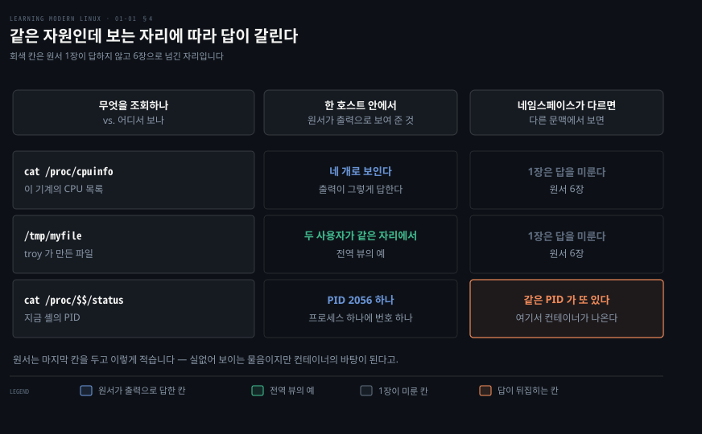
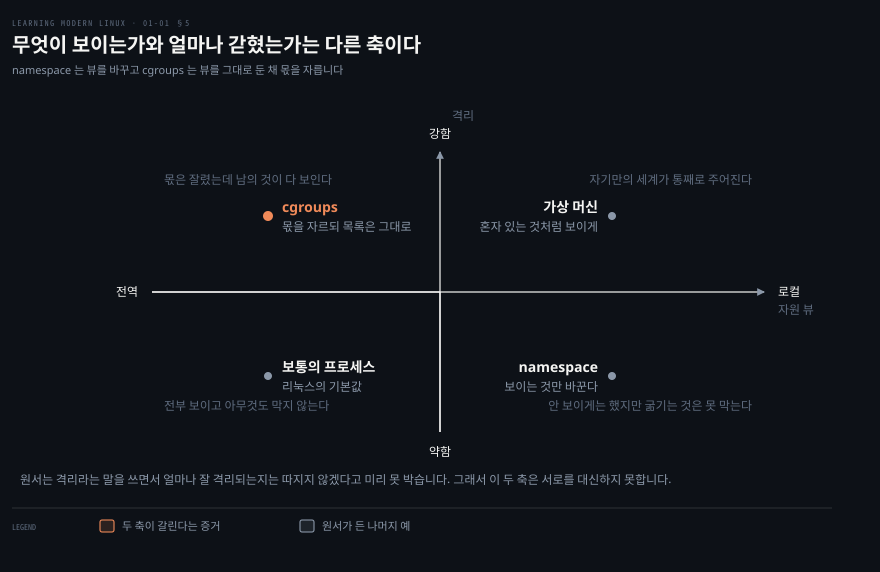

# 하드웨어를 가리고 나면 무엇이 보일지를 정해야 한다

---

> 운영체제는 하드웨어의 차이를 가려 주고 API 하나를 내밉니다. 원서 1장은 그 가림막 위에서 무엇이 보이는지가 자동으로 정해지지 않는다는 데까지 갑니다.

## 핵심 요약

> 이 장 전체가 매달린 하나의 생각은 **운영체제가 하드웨어를 가려 주는 대신, 그 위에서 어느 자원이 어디까지 보이는지는 별도의 장치가 정한다**는 것입니다.

앞의 절반은 익숙한 이야기입니다. 운영체제가 없으면 메모리 관리부터 네트워크 스택 설정까지 전부 직접 져야 하고, 운영체제는 그 짐을 대신 지면서 시스템 콜이라는 API 를 내줍니다. 리눅스가 30년 동안 취미 프로젝트에서 데이터센터의 일꾼이 된 경로도 여기까지의 이야기입니다.

뒤의 절반에서 방향이 꺾입니다. 저자는 `/proc` 를 세 번 조회해 보이고 나서 묻습니다. 다른 사용자로 로그인해도 CPU 개수가 같을까요. 한 사용자가 만든 파일을 다른 사용자도 볼까요. PID 가 같은 프로세스가 둘일 수 있을까요. 마지막 물음의 답이 "그렇다" 이고, 저자는 그 실없어 보이는 물음이 컨테이너의 바탕이 된다고 못 박습니다.

그래서 이 장은 개론이면서 예고편입니다. 자원 뷰를 로컬로 만드는 장치가 namespace 이고 자원의 몫을 자르는 장치가 cgroups 입니다. 저자가 적은 것은 **격리가 가시성과는 별개인 두 번째 독립 차원**이라는 데까지이고, 두 장치가 서로를 대신하지 못한다는 것은 그 문장에서 따라 나오는 이 노트의 읽기입니다. 원서 6장의 컨테이너는 두 축이 만나는 자리입니다.


## 학습 목표

> 이 장을 읽고 나면 아래 다섯 가지를 스스로 해낼 수 있습니다.

1. 운영체제가 대신 지는 일을 다섯 가지로 나열하고, 그 대가로 무엇을 얻는지 설명할 수 있습니다.
2. 명령 한 줄이 시스템 콜이 되어 커널에 닿는 경로를 `id --user` 를 예로 그릴 수 있습니다.
3. 커널이라는 말과 배포판이라는 말이 각각 무엇을 가리키는지 구분해 쓸 수 있습니다.
4. 전역 뷰와 로컬 뷰의 차이를 원서가 든 세 가지 조회로 설명할 수 있습니다.
5. namespace 와 cgroups 가 각각 어느 축을 담당하는지 근거와 함께 가를 수 있습니다.

아래는 이 문서 전체를 읽는 순서로 이은 지도입니다. 칸마다 절 번호와 그 절이 답하는 물음 하나를 적었습니다. 색이 붙은 칸이 이 장의 논지가 컨테이너로 이어지는 자리입니다.




## 이 문서가 다루지 않는 것

> 1장은 무대를 세우는 장이라 이론과 설정이 거의 없습니다. 이미 정리된 노트가 있는 주제는 링크로 넘깁니다.

- 커널의 구성요소와 시스템 콜의 내부 동작은 원서 2장, 그리고 [커널은 전부를 하지만 운영체제는 아니다](./02-01.%EC%BB%A4%EB%84%90%EC%9D%80%20%EC%A0%84%EB%B6%80%EB%A5%BC%20%ED%95%98%EC%A7%80%EB%A7%8C%20%EC%9A%B4%EC%98%81%EC%B2%B4%EC%A0%9C%EB%8A%94%20%EC%95%84%EB%8B%88%EB%8B%A4.md)
- namespace 를 손으로 만들어 넣고 빼는 실습은 [namespace 실습 — 8가지 격리와 unshare](../../kernel/01-05.namespace%20%EC%8B%A4%EC%8A%B5%20%E2%80%94%208%EA%B0%80%EC%A7%80%20%EA%B2%A9%EB%A6%AC%EC%99%80%20unshare.md)
- cgroup 이 실제로 몫을 자르는 방식은 [cgroup v2 깊이](../../kernel/01-02.cgroup%20v2%20%EA%B9%8A%EC%9D%B4.md)
- 컨테이너가 이 두 축을 어떻게 합치는지는 원서 6장, 그리고 [namespace와 루트 디렉토리](../../../08_cloud/book/container-security/04-01.namespace%EC%99%80%20%EB%A3%A8%ED%8A%B8%20%EB%94%94%EB%A0%89%ED%86%A0%EB%A6%AC%20%E2%80%94%20%EA%B2%A9%EB%A6%AC%EB%A5%BC%20%EB%A7%8C%EB%93%9C%EB%8A%94%20%EB%91%90%20%EC%9E%A5%EC%B9%98.md)

남는 것은 **저자가 왜 개론에서 자원 가시성까지 끌고 갔는가** 입니다. 사실 목록이 아니라 그 배치의 의도가 이 노트의 몫입니다.


## 1. 운영체제가 없으면 그 일을 누가 하는가

> 운영체제를 쓸 수 없다고 하면 무엇이 내 일이 되는지부터 세어 보는 것이 저자의 출발점입니다.



저자가 세는 목록은 다섯입니다.

- 메모리 관리
- 인터럽트 처리
- I/O 장치와의 대화
- 파일 관리
- 네트워크 스택의 설정과 관리

저자는 목록 끝에 "the list goes on" 이라고만 적고 멈춥니다. 운영체제는 이 차별화되지 않는 무거운 일을 떠맡고, 서로 다른 하드웨어 부품을 추상화한 뒤 대체로 깔끔하게 설계된 API 를 내줍니다. 그 API 를 우리는 시스템 콜, 줄여서 syscall 이라 부릅니다.

Go·Rust·Python·Java 같은 고수준 언어는 그 시스템 콜 위에 서고, 대개는 라이브러리로 한 번 감쌉니다. 그 덕분에 개발자는 자원을 직접 관리하는 대신 비즈니스 로직에 집중할 수 있습니다.

### 명령 한 줄로 확인하는 방법

추상적인 이야기라 저자는 곧바로 구체적인 예를 듭니다. 지금 사용자의 ID 를 알아내 출력하는 일입니다.

```bash
id --user
```

```bash
638114
```

`id` 는 내부적으로 `getuid` 시스템 콜을 씁니다. 그 시스템 콜의 설명은 한 줄입니다. 호출한 프로세스의 실 사용자 ID 를 돌려준다는 것입니다.

### man 뒤에 붙는 숫자의 뜻

원서가 `getuid(2)` 라고 쓸 때 괄호 안의 2 는 버전이 아닙니다. `man` 유틸리티가 명령을 분류해 둔 절 번호이고, 저자는 우편번호나 국가 코드에 빗댑니다. 이런 표기가 유닉스에서 물려받은 관행이라는 것도 함께 적어 두는데, 그 기원이 1979년 유닉스 프로그래머 매뉴얼 7판 1권이라고 밝힙니다.

### 운영체제 없이도 도는 시스템이 있습니다

저자는 엄밀히 말해 운영체제가 반드시 필요한 것은 아니라고 단서를 붙입니다. 자취가 아주 작은 임베디드 시스템, 이를테면 IoT 비컨 같은 것은 애플리케이션 하나 말고는 아무것도 유지할 자원이 없습니다. Rust 의 Core 와 Standard Library 를 쓰면 베어메탈 위에서 앱을 돌릴 수 있다는 예를 함께 듭니다.


## 2. 모던이라는 말이 가리키는 무대와 30년의 경로

> 제목의 modern 은 새 버전을 뜻하지 않습니다. 리눅스가 놓인 무대가 달라졌다는 뜻이고, 저자는 그 무대를 넷으로 나눕니다.



제목에 modern 이 붙어 있으면 최신 커널 이야기를 기대하게 됩니다. 그 기대로 읽으면 이 절이 왜 폰과 드론 이야기부터 하는지 알 수 없습니다. 저자가 modern 으로 가리키는 것은 리눅스가 놓인 자리이고, 그 자리를 넷으로 나눕니다.

- **모바일 기기**: 누구에게 묻느냐에 따라 다르지만 전화기와 태블릿의 많게는 80% 이상이 안드로이드를 돌리고, 안드로이드는 리눅스의 한 변종입니다. 전력 소비와 견고함에 대한 요구가 공격적입니다.
- **클라우드 컴퓨팅**: ARM 기반 AWS Graviton 처럼 새롭고 강력하며 에너지를 아끼는 CPU 아키텍처가 나왔고, 무거운 일을 클라우드 제공자에게 넘기는 관행이 자리 잡았습니다.
- **사물 인터넷**: 센서에서 드론까지, 스마트 가전과 스마트 카가 여기 듭니다. 모바일보다 전력 요구가 더 까다롭고, 하루에 한 번만 깨어나 데이터를 보내는 식으로 상시 동작하지 않을 수도 있습니다. 실시간 처리 능력도 중요한 축입니다.
- **프로세서 아키텍처의 다양성**: 30여 년 동안 인텔이 지배했고 x86 이 금본위처럼 여겨졌습니다. 모바일의 부상과 함께 ARM 이 올라왔고 최근에는 RISC-V 가 따라옵니다.

### 30년을 세 구간으로 자릅니다

공개 기록상의 시작은 1991년 8월 25일, 리누스 토르발스가 `comp.os.minix` 뉴스그룹에 보낸 메일입니다. 이 취미 프로젝트는 코드 줄 수와 채택 양쪽에서 빠르게 자랐고, 3년이 채 되기 전에 나온 Linux 1.0.0 은 176,000 줄을 넘겼습니다. 유닉스와 GNU 소프트웨어 대부분을 돌린다는 원래 목표는 그때 이미 도달해 있었습니다. 첫 상용 배포판인 Red Hat Linux 도 1990년대에 나옵니다.

2000년부터 2010년까지를 저자는 십대에 빗댑니다. 기능과 지원 하드웨어가 성숙했을 뿐 아니라 유닉스가 할 수 있던 것 너머로 자랐습니다. 구글·아마존·IBM 같은 큰 회사들이 올라탄 시기이자 배포판 전쟁이 정점을 찍은 시기이기도 합니다.

2010년대 이후 리눅스는 데이터센터와 클라우드의 일꾼이 됐고 모든 종류의 IoT 기기와 전화기에도 들어갔습니다. 저자는 어떤 의미에서 배포판 전쟁이 끝났다고 보는데, 요즘 상용 시스템 대부분이 Red Hat 계열 아니면 Debian 계열이기 때문입니다. 그 전쟁을 끝낸 힘으로는 2014년에서 2015년부터의 컨테이너 부상을 지목합니다.


## 3. 커널이라고 말할 때와 리눅스라고 말할 때

> 리눅스라고 말할 때 무엇을 가리키는지가 곧바로 분명하지 않아서, 저자는 이 책에서 쓸 어휘를 여기서 못 박습니다.



"리눅스를 씁니다" 라는 문장은 두 가지로 읽힙니다. 커널을 쓴다는 뜻일 수도 있고 Ubuntu 를 쓴다는 뜻일 수도 있습니다. 이 어긋남을 방치하면 뒤의 장에서 무엇이 커널의 몫이고 무엇이 배포판의 선택인지 갈리지 않으므로, 저자는 여기서 어휘를 못 박습니다.

이 책에서 **리눅스 커널**, 또는 그냥 **커널**이라고 쓸 때는 시스템 콜과 디바이스 드라이버의 집합을 뜻합니다. 그리고 **리눅스 배포판**, 줄여서 배포판이라고 쓸 때는 커널과 관련 구성요소를 실제로 한데 묶어 놓은 것을 뜻합니다. 그 묶음에는 패키지 관리, 파일시스템 레이아웃, init 시스템, 셸이 들어가고, 그것들은 미리 골라져 있습니다.

이 구분이 실무에서 갖는 무게는 도식의 오른쪽 넷에 있습니다. 셸도 패키지 관리자도 커널이 아니라 배포판이 골라 준 것입니다. 그래서 배포판을 바꾸면 커널은 거의 같은데도 손에 닿는 것이 전부 달라 보입니다.

### 직접 말아 쓸 수도 있습니다

물론 이 모든 것을 직접 할 수도 있습니다. 커널을 내려받아 컴파일하고 패키지 관리자를 고르는 일까지 손으로 하면 그것이 자기 배포판입니다. 초기에는 많은 사람이 그렇게 했습니다. 시간이 지나면서 사람들은 이 패키징과 보안 패치를 사설이든 상업이든 전문가에게 맡기고 그 결과물을 그냥 쓰는 편이 시간을 더 잘 쓰는 일이라는 결론에 이릅니다.

만드는 재미가 있어서든 사업상 제약 때문이든 직접 만들 생각이라면 저자는 Arch Linux 를 권합니다. 통제권을 쥐여 주고, 약간의 수고로 상당히 맞춤화된 배포판을 만들 수 있게 해 주기 때문입니다.

배포판의 넓이가 어느 정도인지 감을 잡으려면 DistroWatch 를 보라고 권합니다. Ubuntu·RHEL·CentOS 같은 전통 배포판은 원서 6장이, Bottlerocket·Flatcar 같은 모던 배포판은 9장이 다룹니다.


## 4. 같은 자원인데 보는 자리에 따라 답이 갈린다

> 리눅스는 유닉스의 전통을 이어 자원에 대해 기본적으로 전역 뷰를 갖습니다. 저자는 그 기본값이 전부가 아니라는 것을 보이려고 조회 세 개를 나란히 놓습니다.



`/proc` 를 열어 CPU 개수를 세어 본 사람은 그 값이 이 기계의 사실이라고 여깁니다. 저자는 그 확신이 어디까지 유효한지를 되묻는 데 이 절을 씁니다. 되묻기 전에 자원이라는 말의 범위부터 정합니다.

여기서 자원이란 소프트웨어의 실행을 돕는 데 쓸 수 있는 모든 것을 말합니다. 하드웨어와 그 추상, 파일시스템, 하드 디스크와 SSD, 프로세스, 네트워크 장치나 라우팅 테이블, 사용자를 나타내는 자격증명이 전부 여기 듭니다. 다만 리눅스의 모든 자원이 파일이거나 파일 인터페이스로 표현되는 것은 아니라는 단서도 붙습니다. 그것을 훨씬 멀리 밀고 간 시스템으로는 Plan 9 를 듭니다.

### 먼저 전역으로 보이는 것부터

저자는 전역 속성 하나와 하드웨어 정보 하나를 조회합니다.

```bash
cat /proc/version
cat /proc/cpuinfo | grep "model name"
```

```bash
Linux version 5.4.0-81-generic (buildd@lgw01-amd64-051)
(gcc version 7.5.0 (Ubuntu 7.5.0-3ubuntu1~18.04))
#91~18.04.1-Ubuntu SMP Fri Jul 23 13:36:29 UTC 2021
```

두 번째 명령의 출력은 같은 모델명이 네 줄 반복되는 형태이고, 저자는 그것으로 이 시스템에 코어가 넷 있다고 읽습니다.

> **원문 정오**: 저자는 이 출력을 두고 "four Intel i7 cores" 라고 적지만, 바로 위 출력의 모델명은 `Intel Core Processor (Haswell, no TSX, IBRS)` 이고 i7 이라는 문자열은 어디에도 없습니다. 원서 2장에서 같은 기계에 `lscpu` 를 돌린 출력도 모델명을 똑같이 적고 있어서, i7 은 출력이 뒷받침하지 않는 서술입니다. 코어가 넷이라는 부분은 `lscpu` 의 `CPU(s): 4` 와 맞습니다.

### 그다음 물음 셋

저자는 조회 결과를 곧바로 물음으로 바꿉니다. 다른 사용자로 로그인해도 같은 개수의 CPU 가 보일까요. 사용자 `troy` 가 권한을 갖고 `/tmp/myfile` 을 만들었다면 다른 사용자 `worf` 가 그 파일을 보거나 쓸 수 있을까요. 프로세스는 어떨까요.

프로세스를 보는 방법도 함께 보입니다.

```bash
cat /proc/$$/status | head -n6
```

```bash
Name:   bash
Umask:      0002
State:      S (sleeping)
Tgid:       2056
Ngid:       0
Pid:        2056
```

여기서 `$$` 는 현재 프로세스를 가리키는 특수 변수입니다. 셸의 문맥에서는 명령을 입력한 그 셸의 프로세스 ID 입니다.

### 답이 뒤집히는 한 칸

그리고 저자가 던지는 물음이 이것입니다. 리눅스에 PID 가 같은 프로세스가 여럿 있을 수 있을까요. 실없거나 쓸모없어 보이는 물음이지만, 답은 **그렇다**이고 그 답이 컨테이너의 바탕이 됩니다. 서로 다른 문맥, 곧 namespace 안에서는 같은 PID 가 또 있을 수 있습니다. 도커나 쿠버네티스에서 앱을 돌릴 때 실제로 그런 일이 벌어집니다.

프로세스마다 자기가 특별해서 PID 1 을 가졌다고 여길 수 있는데, 더 전통적인 구성에서 PID 1 은 유저 랜드 프로세스 트리의 뿌리에 예약된 번호입니다.

여기까지에서 배울 것은 하나입니다. 어떤 자원에는 전역 뷰가 있습니다. 두 사용자가 같은 위치에서 파일 하나를 보는 것이 그 예입니다. 다른 자원에는 로컬이거나 가상화된 뷰가 있으며 프로세스가 그 예입니다.

> **노트의 읽기**: 도식의 오른쪽 열에서 회색 칸 둘은 원서 1장이 답하지 않은 자리입니다. CPU 목록과 파일이 namespace 에서 어떻게 갈리는지는 저자가 6장으로 넘깁니다. 이 노트도 거기까지만 적고, 답을 앞당겨 채우지 않습니다.


## 5. 무엇이 보이는가와 얼마나 갇혔는가는 다른 축이다

> 여러 사용자와 프로세스가 나란히 도는 것처럼 보이는 착시의 일부는 자원을 제한적으로 보여 주는 데서 옵니다. 저자는 그 위에 두 번째 축을 얹습니다.



리눅스에서 특정 자원에 로컬 뷰를 주는 방법이 namespace 입니다. 저자는 지원되는 자원에 한해서라는 단서를 붙입니다. 모든 자원이 namespace 로 갈리는 것은 아니라는 뜻입니다.

두 번째이자 독립된 차원이 격리입니다. 저자는 여기서 한 걸음 물러섭니다. 격리라는 말을 쓰면서 그것이 얼마나 잘 되는지는 규정하지 않겠다고 미리 밝힙니다. 프로세스 격리를 생각하는 한 방법은 메모리 소비를 제한해 한 프로세스가 다른 프로세스를 굶기지 못하게 하는 것입니다. 앱에 1 GB 를 주고 그보다 더 쓰면 메모리 부족으로 죽이는 식이며, 이런 종류의 격리를 리눅스에서는 cgroups 라는 커널 기능으로 제공합니다.

반대편 끝에는 완전히 격리된 환경이 있습니다. 앱이 온전히 혼자 있는 것처럼 보이게 만드는 것이고, 가상 머신이 그 예입니다.

### 두 축이 서로를 대신하지 못하는 이유

도식의 왼쪽 위 칸이 이 절의 증거입니다. cgroups 는 몫을 자르지만 목록을 바꾸지 않습니다. 메모리 한도에 걸려 죽을 수 있어도 다른 프로세스의 존재는 그대로 보입니다. 오른쪽 아래 칸은 그 반대입니다. namespace 는 보이는 것을 바꾸지만 그 자체로 굶기는 것을 막지 못합니다.

그래서 컨테이너가 이 둘을 함께 쓰는 것이고, 저자가 두 축을 한 장에서 소개한 뒤 6장으로 넘기는 이유도 여기 있습니다. 하나만으로는 컨테이너가 성립하지 않습니다.


## 6. POSIX 가 뜻하는 것과 뜻하지 않는 것

> POSIX 준수라는 말은 자주 나오지만 그 말이 보장하는 범위는 생각보다 좁습니다.

POSIX 는 Portable Operating System Interface 의 줄임말입니다. 형식을 갖춰 말하면 유닉스 운영체제의 서비스 인터페이스를 정의한 IEEE 표준이고, 동기는 서로 다른 구현 사이의 이식성을 제공하는 것이었습니다. 그래서 POSIX 준수라는 문구를 읽으면 형식 명세의 집합을 떠올리면 되는데, 저자는 그것이 공식 조달 문맥에서 특히 유효하고 일상적인 사용에서는 덜하다고 덧붙입니다.

리눅스는 POSIX 를 준수하도록 만들어졌을 뿐 아니라 유닉스 시스템 V 인터페이스 정의, 곧 SVID 도 준수하도록 만들어졌습니다. 그 덕분에 BSD 계열보다는 옛 AT&T 유닉스 시스템의 결을 갖게 됐습니다.

이 대목이 이 장에 놓인 이유는 앞 두 절과 이어 읽으면 보입니다. 표준은 인터페이스의 모양을 맞춰 주지만, 그 인터페이스로 보이는 자원이 전역인지 로컬인지까지 정해 주지는 않습니다. 그 자리를 채우는 것이 namespace 와 cgroups 이고 둘 다 POSIX 밖의 리눅스 고유 기능입니다.


## 심화 학습

> 원서는 2022년에 나왔습니다. 1장은 개론이라 낡은 사실이 적지만, 원문의 서술과 출력이 어긋나는 자리와 시점이 지나 갱신이 필요한 자리를 표시해 둡니다.

- **CPU 모델명 서술은 출력이 뒷받침하지 않습니다.** 위 4절의 원문 정오가 그것입니다. 이 어긋남은 원서 2장의 `lscpu` 출력과 대조해야 드러나므로, 1장만 읽으면 통과합니다.
- **저자의 실습 기계는 가상 머신으로 보입니다.** 근거는 원서가 스스로 실은 출력 셋입니다. 저자가 그렇게 밝힌 적은 없으므로 이 노트도 정황까지만 적습니다.
    - CPU 모델명이 `Intel Core Processor (Haswell, no TSX, IBRS)` 라는 일반형입니다.
    - 2장의 `lsmod` 에 가상화용 네트워크 드라이버 `virtio_net` 이 올라와 있습니다.
    - 2장의 `ip link` 가 보이는 MAC 이 `52:54:00` 으로 시작합니다.
- **서른 살이라는 서술은 시점을 함께 읽습니다.** 저자는 2021년에 리눅스가 서른 살이 됐다고 적었습니다. 이 노트를 쓰는 2026년 기준으로는 서른다섯 해째입니다. 연표 도식은 원서의 시점을 그대로 두었습니다.
- **이 장이 로드맵에서 갖는 자리는 7장의 앞자리입니다.** [Kubernetes 네트워크 학습 로드맵](../../../network-roadmap.md)의 0단계가 요구하는 것은 이 책의 7장이고, 1장과 2장은 그 7장을 읽을 어휘를 만드는 예비 구간입니다.


## 결정 치트시트

> 1장만으로도 가를 수 있는 판단을 모았습니다. 근거는 모두 본문입니다.

| 상황 | 선택 | 이유 |
|------|------|------|
| 자원이 하나뿐인 아주 작은 임베디드 기기다 | 운영체제 없이 간다 | 앱 하나 말고는 유지할 자원이 없음 |
| 패키징과 보안 패치에 시간을 쓰고 싶지 않다 | 기성 배포판 | 저자가 사람들이 도달했다고 적은 결론 |
| 통제권을 쥐고 맞춤 배포판을 만들어야 한다 | Arch Linux | 저자가 그 목적으로 권한 배포판 |
| 프로세스가 서로를 굶기지 못하게 해야 한다 | cgroups | 자원의 몫을 자르는 축 |
| 프로세스에 자기만의 자원 목록을 보여야 한다 | namespace | 자원 뷰를 로컬로 만드는 축 |
| 앱이 온전히 혼자 있는 것처럼 보여야 한다 | 가상 머신 | 저자가 완전 격리의 예로 든 것 |


## 적용 관점

> 이 장은 개론이라 지금 바꿀 것이 많지 않습니다. 하나만 고른다면 내 기계에서 같은 물음을 직접 던져 보는 일입니다.

**한 가지 실행**: 리눅스 호스트에 붙어 아래 세 줄을 치고, 같은 명령을 컨테이너 안에서 한 번 더 칩니다. 어느 줄의 답이 갈리고 어느 줄이 그대로인지가 이 장의 논지를 손으로 확인하는 가장 짧은 방법입니다.

```bash
cat /proc/version
grep -c "model name" /proc/cpuinfo
cat /proc/$$/status | head -n6
```

Spring 애플리케이션을 쿠버네티스에 올려 본 사람에게 이 장이 닿는 자리는 분명합니다. 컨테이너 안에서 JVM 이 보는 CPU 개수와 메모리 한도는 호스트의 것이 아니라 namespace 와 cgroups 가 정한 값입니다. 컨테이너에 메모리 한도를 걸었는데 힙이 그보다 크게 잡히는 사고가 여기서 나옵니다. 원리는 [cgroup v2 깊이](../../kernel/01-02.cgroup%20v2%20%EA%B9%8A%EC%9D%B4.md)가, 컨테이너 쪽 사례는 [Control Group](../../../08_cloud/book/container-security/03-01.Control%20Group%20%E2%80%94%20%EC%9E%90%EC%9B%90%EC%9D%84%20%EC%A0%9C%ED%95%9C%ED%95%B4%20%EA%B5%B6%EA%B8%B0%EA%B8%B0%EB%A5%BC%20%EB%A7%89%EB%8B%A4.md)이 맡습니다.


## 면접에서 받을 만한 질문

> 자답한 뒤 아래 정답과 맞춰 봅니다.

1. 운영체제가 없다면 애플리케이션이 직접 져야 할 일을 세 가지 이상 말해 보십시오.
2. `id --user` 를 쳤을 때 커널까지 내려갔다 오는 경로를 설명해 보십시오.
3. 커널과 배포판은 각각 무엇을 가리킵니까.
4. 전역 뷰와 로컬 뷰의 차이를 예를 들어 설명해 보십시오.
5. namespace 와 cgroups 는 각각 무엇을 합니까. 하나로 다른 하나를 대신할 수 있습니까.
6. POSIX 준수라는 말은 무엇을 보장하고 무엇을 보장하지 않습니까.


## 정답 (자답 후 펼치기)

### 정답 1 — 운영체제가 대신 지는 일

메모리 관리, 인터럽트 처리, I/O 장치와의 대화, 파일 관리, 네트워크 스택의 설정과 관리입니다. 운영체제는 이 일들을 떠맡고 하드웨어의 차이를 추상화한 뒤 시스템 콜이라는 API 를 내줍니다.

### 정답 2 — id 한 줄의 경로

셸이 `id` 실행 파일을 띄웁니다. `id` 는 `getuid` 시스템 콜을 불러 유저 랜드와 커널의 경계를 넘습니다. 커널은 호출한 프로세스의 실 사용자 ID 를 돌려주고 `id` 가 그 값을 표준 출력에 씁니다.

### 정답 3 — 커널과 배포판

커널은 시스템 콜과 디바이스 드라이버의 집합입니다. 배포판은 그 커널에 패키지 관리, 파일시스템 레이아웃, init 시스템, 셸을 미리 골라 묶어 놓은 것입니다.

### 정답 4 — 전역 뷰와 로컬 뷰

전역 뷰는 두 사용자가 같은 위치에서 같은 파일을 보는 경우입니다. 로컬 뷰는 문맥마다 답이 달라지는 경우이고, 서로 다른 namespace 에서 같은 PID 가 또 있을 수 있는 프로세스가 그 예입니다.

### 정답 5 — 두 축의 역할

namespace 는 자원 뷰를 로컬로 만들고, cgroups 는 자원의 몫을 잘라 한 프로세스가 다른 프로세스를 굶기지 못하게 합니다. 저자가 격리를 가시성과 독립된 차원이라고 적었으므로 하나가 다른 하나를 대신하지 못합니다.

### 정답 6 — POSIX 의 범위

POSIX 는 유닉스 운영체제의 서비스 인터페이스를 정의한 IEEE 표준이며, 서로 다른 구현 사이의 이식성을 겨냥합니다. 인터페이스의 모양은 맞춰 주지만 그 인터페이스로 보이는 자원이 전역인지 로컬인지는 정하지 않습니다.


## 핵심 개념 체크리스트

- [ ] 운영체제가 대신 지는 일 다섯 가지를 나열할 수 있는가?
- [ ] `getuid(2)` 의 괄호 안 숫자가 무엇을 뜻하는지 말할 수 있는가?
- [ ] 커널과 배포판을 각각 한 문장으로 정의할 수 있는가?
- [ ] 원서가 던진 물음 셋 가운데 답이 뒤집히는 것이 어느 것인지 짚을 수 있는가?
- [ ] namespace 와 cgroups 를 가시성과 격리라는 두 축에 각각 배치할 수 있는가?
- [ ] 저자가 격리의 정도를 규정하지 않겠다고 유보한 이유를 설명할 수 있는가?


## 관련 문서

- [Learning Modern Linux 정독 인덱스](./README.md) — 이 책의 장별 진행 상황
- [커널은 전부를 하지만 운영체제는 아니다](./02-01.%EC%BB%A4%EB%84%90%EC%9D%80%20%EC%A0%84%EB%B6%80%EB%A5%BC%20%ED%95%98%EC%A7%80%EB%A7%8C%20%EC%9A%B4%EC%98%81%EC%B2%B4%EC%A0%9C%EB%8A%94%20%EC%95%84%EB%8B%88%EB%8B%A4.md) — 이 장이 예고한 커널의 안쪽
- [namespace 실습 — 8가지 격리와 unshare](../../kernel/01-05.namespace%20%EC%8B%A4%EC%8A%B5%20%E2%80%94%208%EA%B0%80%EC%A7%80%20%EA%B2%A9%EB%A6%AC%EC%99%80%20unshare.md) — 가시성 축을 손으로 만들어 보는 자리
- [cgroup v2 깊이](../../kernel/01-02.cgroup%20v2%20%EA%B9%8A%EC%9D%B4.md) — 격리 축의 구현
- [Kubernetes 네트워크 학습 로드맵](../../../network-roadmap.md) — 이 책이 0단계에 놓인 이유


## 참고 자료

- 원서: 《Learning Modern Linux》 1장 Introduction to Linux
- 서지: Michael Hausenblas, O'Reilly, 2022년
- [DistroWatch](https://distrowatch.com/) — 저자가 배포판의 넓이를 보라며 든 곳
- [Arch Linux](https://archlinux.org/) — 직접 배포판을 만들 사람에게 저자가 권한 것
