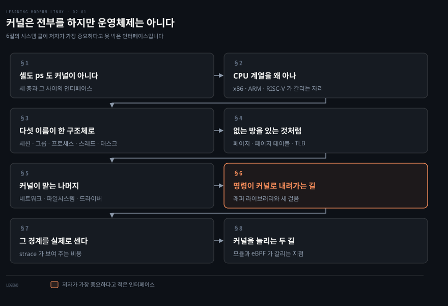
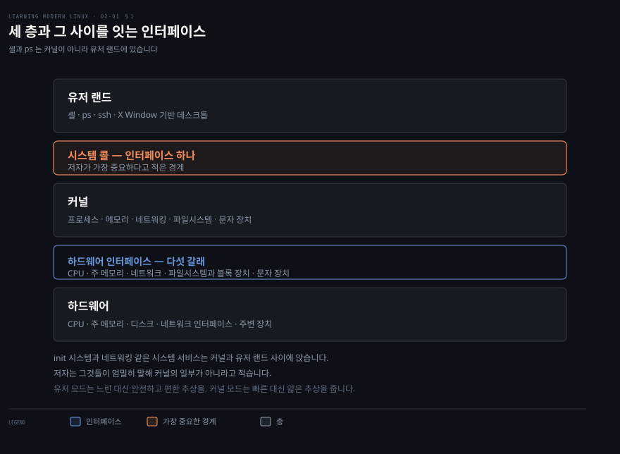
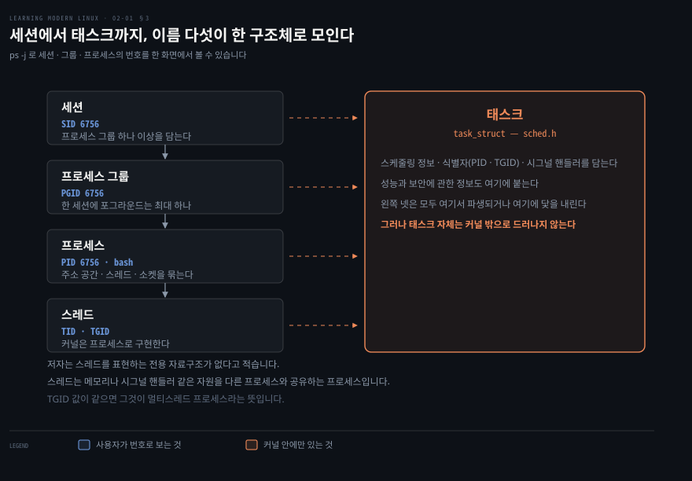
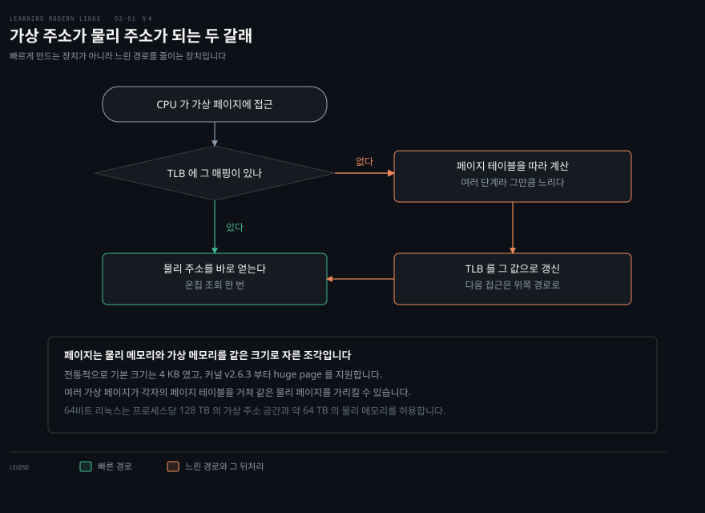
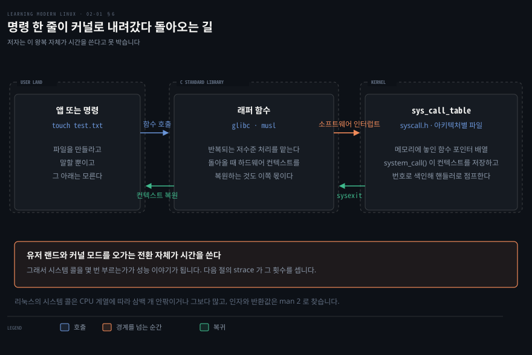
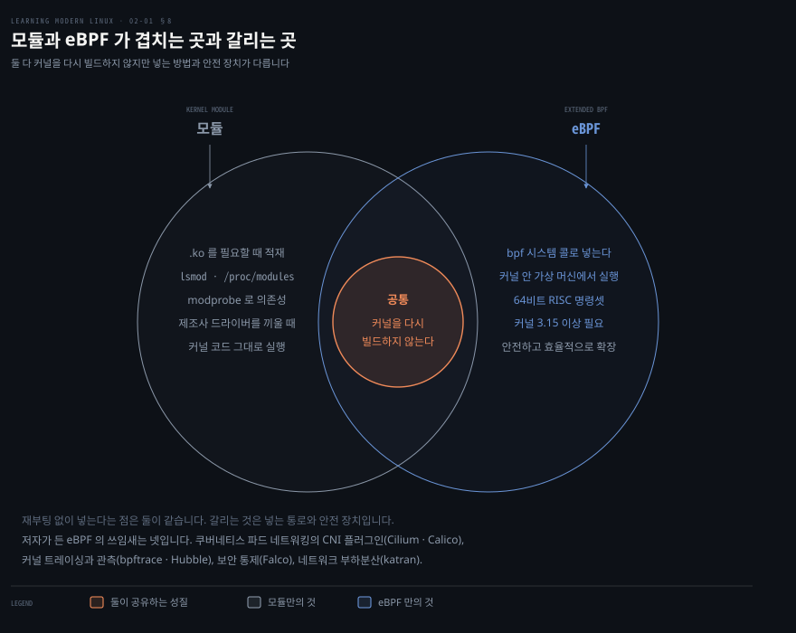

# 커널은 전부를 하지만 운영체제는 아니다

---

> 커널은 핵심 기능을 전부 제공하지만 그 자체가 운영체제는 아닙니다. 원서 2장은 이 문장을 미리 던져 놓고, 커널의 경계가 어디인지를 층과 인터페이스로 되짚습니다.

## 핵심 요약

> 이 장 전체가 매달린 하나의 생각은 저자가 서두에 직접 적은 문장입니다. **커널은 모든 핵심 기능을 제공하지만, 그 자체로는 운영체제가 아니라 운영체제의 아주 중심적인 한 부분일 뿐**이라는 것입니다.

이 문장이 왜 필요한지는 셸을 세어 보면 압니다. `grep`·`find`·`ping` 처럼 리눅스 운영체제의 일부라고 여기는 것들이 사실은 커널이 아니라 내려받은 앱과 다를 바 없는 유저 랜드의 프로그램입니다. 커널이 무엇을 하는지 말하려면 먼저 커널이 아닌 것을 걷어내야 합니다.

걷어내고 남은 커널은 다섯 가지 기능 블록으로 나뉩니다. 프로세스 관리, 메모리 관리, 네트워킹, 파일시스템, 문자 장치와 디바이스 드라이버입니다. 이 블록들은 서로 얽혀 있고, 그 얽힘 속에서 "커널은 유저 랜드를 절대 깨뜨리지 않는다" 는 개발자들의 좌우명을 지키는 일이 만만치 않다고 저자는 적습니다.

그리고 이 장이 가장 무게를 싣는 것은 인터페이스입니다. 커널이 기능을 드러내는 통로는 시스템 콜 하나입니다. 파일을 열든 메모리를 할당하든 네트워크 인터페이스를 나열하든 전부 그 통로를 지납니다. 이 장의 나머지는 그 통로를 실제로 세어 보고 커널을 밖에서 늘리는 두 길을 보이는 데 씁니다.


## 학습 목표

> 이 장을 읽고 나면 아래 다섯 가지를 스스로 해낼 수 있습니다.

1. 리눅스 아키텍처의 세 층을 나누고 그 사이 인터페이스의 성격 차이를 설명할 수 있습니다.
2. 세션·프로세스 그룹·프로세스·스레드·태스크가 어떤 포함 관계인지 번호와 함께 말할 수 있습니다.
3. TLB 가 있을 때와 없을 때 가상 주소가 물리 주소가 되는 경로를 각각 그릴 수 있습니다.
4. 시스템 콜이 실행되는 세 걸음을 순서대로 말하고, 그 왕복이 왜 비용인지 설명할 수 있습니다.
5. 커널 모듈과 eBPF 가 각각 어떤 통로로 커널에 들어가는지 구분할 수 있습니다.

아래는 이 문서 전체를 읽는 순서로 이은 지도입니다. 칸마다 절 번호와 그 절이 답하는 물음 하나를 적었습니다. 색이 붙은 칸이 저자가 가장 중요하다고 못 박은 인터페이스입니다.




## 이 문서가 다루지 않는 것

> 저자는 이 장의 목적이 독자를 커널 개발자나 커널을 직접 설정해 컴파일하는 시스템 관리자로 만드는 것이 아니라고 미리 밝힙니다. 용어를 갖추고, 프로그램과 커널이 만나는 자리를 알아차리게 하는 것까지가 범위입니다.

- 커널을 직접 설정하고 컴파일하는 절차 → 원서 범위 밖. 저자는 Greg Kroah-Hartman 의 《Linux Kernel in a Nutshell》을 권합니다.
- 커널 드라이버 모델의 상세 → 저자가 복잡하고 범위 밖이라고 명시합니다.
- 성능 분석 관점에서 본 같은 주제 → [운영체제 (1) — 커널·시스템 콜·인터럽트·프로세스](../systems-performance/03-01.%EC%9A%B4%EC%98%81%EC%B2%B4%EC%A0%9C%20%281%29%20%E2%80%94%20%EC%BB%A4%EB%84%90%C2%B7%EC%8B%9C%EC%8A%A4%ED%85%9C%20%EC%BD%9C%C2%B7%EC%9D%B8%ED%84%B0%EB%9F%BD%ED%8A%B8%C2%B7%ED%94%84%EB%A1%9C%EC%84%B8%EC%8A%A4.md)
- 네트워크 스택의 상세 → 원서 7장. 이 노트의 5절은 저자가 2장에서 적은 만큼만 담습니다.


## 1. 셸도 ps 도 커널이 아니다

> 커널이 무엇을 하는지 말하기 전에, 커널이 아닌 것을 먼저 걷어내야 경계가 보입니다.



"리눅스가 네트워크를 처리한다" 고 말할 때 그 주어가 커널인지 유저 랜드의 프로그램인지 구분하지 않으면, 장애를 만났을 때 어디를 봐야 할지 정할 수 없습니다. 경계를 먼저 그어야 그 구분이 가능합니다. 저자가 나누는 층은 셋입니다. 맨 아래 **하드웨어**는 CPU 와 주 메모리부터 디스크 드라이브, 네트워크 인터페이스, 키보드와 모니터 같은 주변 장치까지입니다. 가운데가 **커널**이고, 맨 위 **유저 랜드**는 앱 대부분이 도는 곳입니다.

유저 랜드에 무엇이 있는지가 이 절의 핵심입니다. 셸 같은 운영체제 구성요소, `ps` 나 `ssh` 같은 유틸리티, X Window System 기반 데스크톱 같은 그래픽 인터페이스가 전부 여기 있습니다. 우리가 보통 리눅스 운영체제의 일부라고 여기는 `grep`·`find`·`ping` 도 커널이 아니라 유저 랜드의 프로그램입니다.

### 두 인터페이스의 성격이 다릅니다

층 사이의 인터페이스는 잘 정의되어 있고 리눅스 운영체제 묶음의 일부입니다. 다만 위쪽과 아래쪽의 성격이 다릅니다.

커널과 유저 랜드 사이는 **시스템 콜**이라 불리는 인터페이스 하나입니다. 반면 하드웨어와 커널 사이는 하나가 아니라 하드웨어별로 묶인 개별 인터페이스의 모음이고, 저자는 다섯으로 셉니다.

1. CPU 인터페이스
2. 주 메모리와의 인터페이스
3. 네트워크 인터페이스와 드라이버, 유선과 무선 모두
4. 파일시스템과 블록 장치 드라이버 인터페이스
5. 문자 장치, 하드웨어 인터럽트, 그리고 키보드·터미널 같은 입력 장치를 위한 디바이스 드라이버

한편 init 시스템과 네트워킹 같은 시스템 서비스는 커널과 유저 랜드 사이에 앉지만, 저자는 엄밀히 말해 커널의 일부가 아니라고 적습니다.

### 유저 모드와 커널 모드

유저 랜드 이야기를 하다 보면 유저 모드와 커널 모드라는 말을 자주 만납니다. 이 말이 가리키는 것은 하드웨어에 접근하는 권한이 얼마나 큰지, 그리고 쓸 수 있는 추상이 얼마나 제한적인지입니다.

일반적으로 커널 모드는 추상이 얇은 대신 실행이 빠릅니다. 유저 모드는 상대적으로 느린 대신 더 안전하고 편한 추상을 줍니다. 저자의 조언은 담백합니다. 커널 개발자가 아니라면 커널 모드는 거의 언제나 무시해도 되며, 대신 커널과 상호작용하는 방법인 시스템 콜을 아는 것이 중요하다는 것입니다.


## 2. CPU 계열을 왜 알아야 하는가

> 리눅스가 수많은 CPU 아키텍처 위에서 돈다는 사실이 인기의 이유 가운데 하나라고 저자는 적습니다. 커널 안에 아키텍처별 코드가 따로 있기 때문에 가능한 일입니다.

커널에는 일반 코드와 드라이버 말고도 아키텍처에 특화된 코드가 들어 있습니다. 이 분리 덕분에 리눅스를 새 하드웨어로 빠르게 이식할 수 있습니다. 그래서 내가 쓰는 기계가 어느 계열인지 아는 것이 첫걸음이 됩니다.

### 무엇을 쓰고 있는지 확인하는 법

BIOS 와 대화하는 `dmidecode` 라는 전용 도구가 있고, 결과가 신통치 않으면 다음을 씁니다.

```bash
lscpu
```

```bash
Architecture:                x86_64
CPU op-mode(s):              32-bit, 64-bit
Byte Order:                  Little Endian
Address sizes:               40 bits physical, 48 bits virtual
CPU(s):                      4
On-line CPU(s) list:         0-3
Thread(s) per core:          1
Core(s) per socket:          4
Socket(s):                   1
NUMA node(s):                1
Vendor ID:                   GenuineIntel
CPU family:                  6
Model:                       60
Model name:                  Intel Core Processor (Haswell, no TSX, IBRS)
Stepping:                    1
CPU MHz:                     2592.094
```

원서의 출력은 줄임표로 끝나므로 위 블록도 저자가 실은 데까지입니다. 읽을 것은 셋입니다.

- **아키텍처**: `x86_64`
- **CPU 개수**: 넷
- **모델명**: `Intel Core Processor (Haswell)`

비슷한 정보를 얻는 다른 길로는 `cat /proc/cpuinfo` 가 있습니다. 아키텍처만 궁금하면 `uname -m` 한 줄이면 됩니다.

### 세 계열이 갈리는 자리

| 계열 | 성격 | 어디에 있나 | 저자가 함께 적은 것 |
|------|------|------------|------------------|
| x86 | 인텔이 개발해 AMD 에 라이선스한 명령어 집합 계열. 커널 안에서 `x64` 는 인텔 64비트, `x86` 은 인텔 32비트, `amd64` 는 AMD 64비트를 가리킨다 | 데스크톱과 노트북, 그리고 서버. 퍼블릭 클라우드의 바탕 | 강력하고 널리 쓰이지만 에너지 효율이 좋지 않다. 비순차 실행에 크게 기대는 탓에 Meltdown 같은 보안 문제로 주목받았다 |
| ARM | 30년이 넘은 RISC 계열. RISC 는 대개 범용 레지스터가 많고 명령어 집합이 작아 더 빨리 실행된다 | iPhone 과 대부분의 안드로이드 폰, 라즈베리 파이 같은 임베디드. AWS Graviton 처럼 데이터센터에도 | 원래 회사인 Acorn 의 설계자들이 처음부터 최소 전력 소비를 겨냥했다. 빠르고 싸고 열이 덜 나지만 Spectre 같은 취약점에서 자유롭지는 않다 |
| RISC-V | UC 버클리에서 시작된 열린 RISC 표준 | 2021년 기준 알리바바·엔비디아부터 SiFive 같은 스타트업까지 여러 구현 | 흥미롭지만 아직 널리 쓰이지는 않는다 |

### BIOS 와 UEFI

저자가 곁들이는 배경이 하나 있습니다. 전통적으로 유닉스와 리눅스는 부트스트랩에 BIOS 를 썼습니다. 노트북 전원을 켜면 처음에는 전적으로 하드웨어가 통제하고, 하드웨어는 BIOS 의 일부인 POST 를 돌리도록 배선되어 있습니다. POST 는 RAM 같은 하드웨어가 명세대로 동작하는지 확인합니다.

모던 환경에서는 BIOS 의 기능이 사실상 UEFI 로 대체됐습니다. 운영체제와 플랫폼 펌웨어 사이의 소프트웨어 인터페이스를 정의한 공개 명세입니다. 저자의 조언은 실용적입니다. 문서와 글에서 BIOS 라는 말을 여전히 만나겠지만 머릿속에서 UEFI 로 바꿔 읽고 넘어가라는 것입니다.


## 3. 세션에서 태스크까지, 이름 다섯이 한 구조체로 모인다

> 프로세스와 스레드라는 익숙한 두 이름만으로는 `ps -j` 의 출력을 읽을 수 없습니다. 리눅스는 그 위아래로 이름을 셋 더 씁니다.



일반적인 정의부터 놓고 갑니다. 프로세스는 실행 가능한 프로그램에 바탕을 둔, 사용자를 향한 단위입니다. 스레드는 그 프로세스 문맥 안의 실행 단위입니다. 멀티스레딩이라는 말은 한 프로세스 안에서 병렬 실행이 여럿 일어나고, 그것들이 서로 다른 CPU 에서 돌 수도 있다는 뜻입니다.

리눅스가 실제로 쓰는 이름은 다섯입니다.

- **세션**: 프로세스 그룹을 하나 이상 담는, 선택적으로 tty 가 붙는 상위 단위. 커널은 세션 ID 로 식별합니다.
- **프로세스 그룹**: 프로세스를 하나 이상 담고, 한 세션 안에서 포그라운드 프로세스 그룹은 최대 하나입니다. 커널은 PGID 로 식별합니다.
- **프로세스**: 주소 공간, 스레드 하나 이상, 소켓 같은 여러 자원을 묶은 추상입니다. 현재 프로세스는 `/proc/self` 로 드러납니다. 커널은 PID 로 식별합니다.
- **스레드**: 커널은 스레드를 프로세스로 구현합니다. 스레드를 표현하는 전용 자료구조가 없고, 스레드란 메모리나 시그널 핸들러 같은 자원을 다른 프로세스와 공유하는 프로세스입니다. TID 와 TGID 로 식별하며, TGID 가 같으면 멀티스레드 프로세스라는 뜻입니다.
- **태스크**: 커널 안에 `sched.h` 로 정의된 `task_struct` 라는 자료구조가 있고, 프로세스와 스레드를 함께 구현하는 바탕이 됩니다. 스케줄링 정보, PID·TGID 같은 식별자, 시그널 핸들러, 성능과 보안에 관한 정보를 담습니다.

앞의 넷은 전부 태스크에서 파생되거나 태스크에 닻을 내립니다. 다만 태스크 자체는 커널 밖으로 그렇게 드러나지 않습니다.

> **원문 정오**: 저자는 이 목록을 "From most granular to smallest unit" 이라고 소개하지만, 목록은 세션에서 시작해 아래로 내려갑니다. granular 는 잘게 나뉜 쪽을 가리키는 말이라 담는 쪽인 세션에 붙지 않습니다. 목록의 내용은 정확하고 소개 문구만 어긋납니다. 참고로 저자는 태스크를 가장 작은 단위라고 적지 않고 프로세스와 스레드를 함께 구현하는 바탕이라고 적습니다.

### 번호를 눈으로 확인합니다

```bash
ps -j
```

```bash
PID       PGID    SID      TTY       TIME CMD
6756      6756    6756     pts/0     00:00:00 bash
6790      6790    6756     pts/0     00:00:00 ps
```

`bash` 프로세스가 PID·PGID·SID 를 모두 6756 으로 갖습니다. 태스크 수준의 정보는 `ls -al /proc/6756/task/6756/` 에서 얻을 수 있습니다. `ps` 프로세스는 PID 와 PGID 가 6790 이고 SID 는 셸과 같은 6756 입니다. 세 번호를 나란히 보면 세션이 그룹을 담고 그룹이 프로세스를 담는 관계가 그대로 드러납니다.

세션과 프로세스 그룹과 프로세스를 실제로 다루는 법은 원서 6장이 맡고, 컨테이너 문맥에서 다시 나오는 것은 9장입니다.

### 프로세스의 상태

태스크 자료구조에 스케줄링 정보가 준비되어 있다는 것은, 어느 시점에나 프로세스가 어떤 상태에 있다는 뜻입니다. 상태를 바꾸는 것은 사건입니다. 저자가 드는 예는 실행 중이던 프로세스가 파일 읽기 같은 I/O 를 하느라 진행하지 못하고 CPU 밖으로 나가 대기 상태로 옮겨 가는 경우입니다.

엄밀히 말하면 상태는 조금 더 복잡합니다. 리눅스는 인터럽트 가능한 대기와 인터럽트 불가능한 대기를 구분하고, 부모 프로세스를 잃은 좀비 상태도 있습니다. 1장에서 본 `/proc/$$/status` 출력의 `State: S (sleeping)` 이 그 대기 상태 가운데 하나를 가리킵니다.

> **노트의 읽기**: 원서는 상태 전이를 그림 하나로 보여 주고 본문에는 전이 하나만 적습니다. 이 노트는 본문이 적은 것까지만 옮기고 상태 기계를 그리지 않았습니다. 그림에만 있는 상태를 글로 지어내면 원서에 없는 사실이 생기기 때문입니다.


## 4. 없는 방을 있는 것처럼 파는 법

> 가상 메모리는 시스템에 실제보다 많은 메모리가 있는 것처럼 보이게 만듭니다. 그 착시를 값싸게 유지하는 것이 이 절의 문제입니다.



동작 방식은 이렇습니다. 물리 메모리와 가상 메모리를 **페이지**라 부르는 같은 크기의 조각으로 나눕니다. 프로세스마다 자기 가상 주소 공간과 자기 페이지 테이블을 갖고, 그 페이지 테이블이 프로세스의 가상 페이지를 주 메모리의 물리 페이지로 매핑합니다.

여러 가상 페이지가 각자의 프로세스별 페이지 테이블을 거쳐 같은 물리 페이지를 가리킬 수 있습니다. 저자는 이것이 어떤 의미에서 메모리 관리의 핵심이라고 적습니다. 각 프로세스에 자기 페이지가 실제로 RAM 에 있다는 착각을 주면서도 있는 공간을 최적으로 쓰는 일입니다.

### 매번 계산하면 느립니다

CPU 가 프로세스의 가상 페이지에 접근할 때마다 원칙적으로는 가상 주소를 대응하는 물리 주소로 번역해야 합니다. 그런데 이 번역은 여러 단계일 수 있어서 그만큼 느립니다. 이 과정을 빠르게 하려고 현대 CPU 아키텍처는 온칩 조회 장치를 지원하고, 그것이 TLB 입니다.

TLB 는 사실상 작은 캐시입니다. 빗나가면 CPU 가 프로세스의 페이지 테이블을 거쳐 페이지의 물리 주소를 계산하고 그 값으로 TLB 를 갱신합니다. 도식의 오른쪽 경로가 그 빗나간 경우이고, 갱신 덕분에 다음 접근은 왼쪽 경로로 갑니다.

전통적으로 리눅스의 기본 페이지 크기는 4 KB 였고, 커널 v2.6.3 부터 현대 아키텍처와 워크로드를 더 잘 받치려고 huge page 를 지원합니다.

### 실제 값을 읽어 봅니다

```bash
grep MemTotal /proc/meminfo
grep VmallocTotal /proc/meminfo
grep Huge /proc/meminfo
```

```bash
MemTotal:        4014636 kB
VmallocTotal:   34359738367 kB
Hugepagesize:            2048 kB
```

저자는 이 셋을 각각 물리 메모리 4 GB, 가상 메모리 34 TB 남짓, huge page 크기 2 MB 로 읽습니다.

> **노트의 읽기**: `VmallocTotal` 의 34359738367 kB 는 정확히 2의 45제곱 바이트에서 1 KiB 를 뺀 값이고, 2진 접두어로는 32 TiB 입니다. 저자의 "34 TB" 는 같은 숫자를 10진 접두어로 읽은 값이라 어느 쪽도 틀리지 않지만, 두 표기의 차이를 모르면 다른 문서와 대조할 때 어긋나 보입니다.


## 5. 커널이 맡는 나머지 — 네트워크와 파일시스템과 드라이버

> 2장은 나머지 세 블록을 얕게 지나갑니다. 각각 뒤의 장이 따로 있어서인데, 그래도 커널의 몫이 어디까지인지는 여기서 그어집니다.

네트워킹부터 봅니다. 리눅스 네트워크 스택은 계층 구조를 따르고, 저자가 커널의 몫으로 세는 것은 셋입니다. 통신을 추상화하는 **소켓**, 연결 지향 통신과 비연결 통신을 각각 맡는 **TCP 와 UDP**, 그리고 기계를 주소로 지정하는 **IP** 입니다. 여기서 경계가 그어집니다. HTTP 나 SSH 같은 애플리케이션 계층 프로토콜은 대개 유저 랜드에서 구현됩니다.

```bash
ip link
```

```bash
1: lo: <LOOPBACK,UP,LOWER_UP> mtu 65536 qdisc noqueue state UNKNOWN mode
   DEFAULT group default qlen 1000 link/loopback 00:00:00:00:00:00
   brd 00:00:00:00:00:00
2: enp0s1: <BROADCAST,MULTICAST,UP,LOWER_UP> mtu 1500 qdisc fq_codel stat
     UP mode DEFAULT group default qlen 1000 link/ether 52:54:00:12:34:56
     brd ff:ff:ff:ff:ff:ff
```

라우팅 정보는 `ip route` 로 봅니다. 네트워크 스택과 지원 프로토콜, 전형적인 운영은 원서 7장이 따로 다룹니다.

> **노트의 읽기**: 이 짧은 절이 쿠버네티스 네트워크의 출발점입니다. 커널이 소켓·TCP·UDP·IP 까지만 맡는다는 경계가 곧 CNI 플러그인과 kube-proxy 가 서는 자리를 정합니다. 파드에 IP 를 붙이고 인터페이스를 만드는 일은 커널의 기능을 쓰는 유저 랜드 프로그램의 몫이고, Service 를 실제 엔드포인트로 바꾸는 일도 그렇습니다. 원서는 여기까지 말하지 않으며, 그 위층은 [Kubernetes 네트워크 학습 로드맵](../../../network-roadmap.md)의 2단계 이후가 맡습니다.

### 파일시스템과 VFS

리눅스는 파일시스템으로 저장 장치 위의 파일과 디렉토리를 조직합니다. ext4·btrfs·NTFS 처럼 종류가 여럿이고, 같은 파일시스템의 인스턴스를 여러 개 쓸 수도 있습니다.

여러 파일시스템 종류와 인스턴스를 지원하려고 도입된 것이 **가상 파일 시스템**, 곧 VFS 입니다. VFS 의 가장 위층은 열기·닫기·읽기·쓰기 같은 함수의 공통 API 추상을 제공하고, 맨 아래에는 각 파일시스템을 위한 플러그인이라 불리는 추상이 있습니다. 상세는 원서 5장입니다.

### 디바이스 드라이버

드라이버는 커널 안에서 도는 코드 조각이며 장치를 관리하는 일을 맡습니다. 장치는 키보드·마우스·하드 디스크 같은 실제 하드웨어일 수 있습니다. `/dev/pts/` 아래의 유사 터미널처럼 물리 장치는 아니지만 그렇게 다룰 수 있는 유사 장치일 수도 있습니다.

또 하나 흥미로운 부류가 GPU 입니다. 전통적으로는 그래픽 출력을 가속해 CPU 부담을 덜어 주는 데 쓰였는데, 최근에는 머신러닝이라는 새 쓰임새를 찾아서 데스크톱 환경에만 걸리는 이야기가 아니게 됐습니다.

드라이버는 커널에 정적으로 빌드해 넣을 수도 있고, 필요할 때 동적으로 적재하도록 커널 모듈로 만들 수도 있습니다. 뒤쪽 길이 8절의 이야기입니다.

```bash
ls -al /sys/devices/
mount
```

앞 명령은 시스템의 장치를 한눈에 보여 주고, 뒤 명령은 마운트된 장치를 나열합니다.


## 6. 명령 한 줄이 커널로 내려가는 세 걸음

> 터미널에서 `touch test.txt` 를 치든 앱이 원격 파일을 내려받든, 결국 리눅스에게 고수준 지시를 아키텍처에 따라 다른 구체적 단계로 바꿔 달라고 요청하는 일입니다. 그 요청의 창구가 시스템 콜입니다.



리눅스에는 시스템 콜이 수백 개 있습니다. 저자는 CPU 계열에 따라 삼백 개 안팎이거나 그보다 많다고 적습니다. 그런데 우리 프로그램은 대개 그것을 직접 부르지 않고 **C 표준 라이브러리**를 거칩니다. 표준 라이브러리는 래퍼 함수를 제공하고 glibc 나 musl 같은 여러 구현이 있습니다.

이 래퍼 라이브러리가 하는 일이 중요합니다. 시스템 콜 실행에 따르는 반복적인 저수준 처리를 대신 맡아 줍니다. 저자가 적는 세 걸음은 이렇습니다.

1. 커널은 `syscall.h` 와 아키텍처별 파일에 정의된 **시스템 콜 테이블**을 씁니다. 메모리에 놓인 함수 포인터 배열이고 `sys_call_table` 이라는 변수에 담겨, 시스템 콜과 그 핸들러를 추적합니다.
2. `system_call()` 함수가 시스템 콜 멀티플렉서처럼 동작합니다. 먼저 하드웨어 컨텍스트를 스택에 저장하고, 추적이 걸려 있는지 같은 검사를 한 뒤, `sys_call_table` 에서 해당 시스템 콜 번호가 가리키는 함수로 점프합니다.
3. 시스템 콜이 `sysexit` 로 끝나면 래퍼 라이브러리가 하드웨어 컨텍스트를 복원하고, 프로그램 실행은 유저 랜드에서 이어집니다.

이 걸음들에서 눈여겨볼 것은 커널 모드와 유저 랜드 모드 사이의 전환이고, 저자는 그 전환이 시간을 쓰는 연산이라고 못 박습니다.

> **원문 정오**: 저자는 시스템 콜이 "소프트웨어 인터럽트로 구현되어 예외를 일으킨다" 고 적고 복귀에 `sysexit` 를 듭니다. 이는 i386 시절의 경로를 설명한 것입니다. `man 2 syscall` 의 아키텍처별 호출 규약 표는 커널 모드로 전환하는 명령을 i386 에서 `int $0x80`, x86-64 에서 `syscall` 로 각각 적습니다.[^syscall2] 지금 쓰는 64비트 리눅스에서는 소프트웨어 인터럽트가 아니라 전용 `syscall` 명령이 그 경계를 넘습니다. 세 걸음의 골격은 그대로 유효하고, 바뀐 것은 경계를 넘는 수단입니다.

### 어떤 시스템 콜이 있는지

저자가 커널 구성요소별로 널리 쓰이는 시스템 콜을 모아 둔 표입니다. 각각의 인자와 반환값은 man 페이지 2절에서 찾습니다.

| 분류 | 시스템 콜 예 |
|------|------------|
| 프로세스 관리 | `clone` · `fork` · `execve` · `wait` · `exit` · `getpid` · `setuid` · `setns` · `getrusage` · `capset` · `ptrace` |
| 메모리 관리 | `brk` · `mmap` · `munmap` · `mremap` · `mlock` · `mincore` |
| 네트워킹 | `socket` · `setsockopt` · `getsockopt` · `bind` · `listen` · `accept` · `connect` · `shutdown` · `recvfrom` · `recvmsg` · `sendto` · `sethostname` · `bpf` |
| 파일시스템 | `open` · `openat` · `close` · `mknod` · `rename` · `truncate` · `mkdir` · `rmdir` · `getcwd` · `chdir` · `chroot` · `getdents` · `link` · `symlink` · `unlink` · `umask` · `stat` · `chmod` · `utime` · `access` · `ioctl` · `flock` · `read` · `write` · `lseek` · `sync` · `select` · `poll` · `mount` |
| 시간 | `time` · `clock_settime` · `timer_create` · `alarm` · `nanosleep` |
| 시그널 | `kill` · `pause` · `signalfd` · `eventfd` |
| 전역 | `uname` · `sysinfo` · `syslog` · `acct` · `_sysctl` · `iopl` · `reboot` |

네트워킹 줄의 마지막에 `bpf` 가 있는 것이 눈에 띕니다. 8절에서 다시 만납니다.


## 7. 그 경계를 실제로 세어 본다

> 이론이 건조하니 저자는 도구를 하나 꺼냅니다. 앱의 소스가 없는데 그 앱이 무엇을 하는지 알고 싶을 때 쓰는 도구입니다.


`strace` 는 유저 랜드와 커널 사이에서 벌어지는 사건의 흐름에 그대로 갈고리를 겁니다. 어떤 시스템 콜이 어떤 순서로 어떤 인자와 함께 불렸는지 정확히 볼 수 있습니다.

```bash
strace ls
```

```bash
execve("/usr/bin/ls", ["ls"], 0x7ffe29254910 /* 24 vars */) = 0
brk(NULL)                                     = 0x5596e5a3c000
access("/etc/ld.so.preload", R_OK)            = -1 ENOENT (No such file or directory)
openat(AT_FDCWD, "/etc/ld.so.cache", O_RDONLY|O_CLOEXEC) = 3
read(3, "\177ELF\2\1\1\0\0\0\0\0\0\0\0\0\3\0>\0\1\0\0\0 p\0\0\0\0\0\0"..., 832) = 832
```

저자는 출력을 줄였다고 밝힙니다. 자기 시스템에서는 162줄이 나왔고 그 수는 배포판·아키텍처를 비롯한 여러 요인에 따라 달라집니다. 그리고 이 출력이 표준 오류로 나오므로 방향을 바꾸려면 `2>` 를 써야 한다고 덧붙입니다.

줄마다 읽으면 이렇습니다.

- `execve` 가 `/usr/bin/ls` 를 실행해 셸 프로세스를 대체합니다.
- `brk` 는 메모리를 할당하는 낡은 방식입니다. `malloc` 을 쓰는 편이 더 안전하고 이식성이 좋습니다. `malloc` 은 시스템 콜이 아니라 함수이며, 접근하는 메모리 양에 따라 `brk` 를 쓸지 `mmap` 을 쓸지 결정합니다.

> **원문 정오**: 저자는 그 결정을 하는 것을 `mallocopt` 라 적지만, glibc 의 함수 이름은 `mallopt` 입니다. man 페이지의 NAME 은 "mallopt - set memory allocation parameters" 이고 `mallocopt` 라는 문자열은 그 페이지에 없습니다.[^mallopt] 설명의 실체는 맞습니다. `M_MMAP_THRESHOLD` 로 정한 한도 이상이고 free list 로 채울 수 없는 할당이면 `sbrk(2)` 로 program break 를 늘리는 대신 `mmap(2)` 를 쓴다고 같은 페이지가 적습니다.[^mallopt]
- `access` 는 프로세스가 특정 파일에 접근해도 되는지 확인합니다.
- `openat` 은 디렉토리 파일 서술자를 기준으로 파일을 엽니다. 첫 인자 `AT_FDCWD` 는 현재 디렉토리를 뜻하고 마지막 인자가 플래그입니다.
- `read` 는 파일 서술자에서 지정한 바이트 수만큼 버퍼로 읽습니다.

### 어디에 시간을 쓰는지 세는 법

`strace` 는 성능 진단에도 쓸모가 있습니다.

```bash
strace -c curl -s https://mhausenblas.info > /dev/null
```

```bash
% time     seconds usecs/call     calls    errors syscall
------ ----------- ----------- --------- --------- ----------------
 26.75    0.031965         148       215           mmap
 17.52    0.020935         136       153         3 read
 10.15    0.012124         175        69           rt_sigaction
  8.00    0.009561         147        65         1 openat
  7.61    0.009098         126        72           close
  ...
  0.00    0.000000           0         1           prlimit64
------ ----------- ----------- --------- --------- ----------------
100.00    0.119476         141       843        11 total
```

`-c` 는 사용된 시스템 콜의 개요 통계를 내라는 옵션이고, 리다이렉션은 `curl` 의 출력을 버리기 위한 것입니다. 저자의 해석은 `curl` 이 시간의 거의 절반을 `mmap` 과 `read` 에 쓴다는 것입니다. 도식에서 색이 붙은 두 막대를 더하면 44.27% 로, 그 "거의 절반" 의 근거가 됩니다.

> **노트의 읽기**: 저자는 이어서 `connect` 시스템 콜이 0.3 밀리초를 쓴다며 나쁘지 않다고 적지만, 위 출력은 줄여져 있어 `connect` 행이 없습니다. 도식의 맨 아래 막대가 그 생략된 행들을 합친 29.97% 이고, `connect` 는 그 안에 들어 있습니다.


## 8. 커널을 늘리는 두 길

> 커널 소스에 기능을 더해 다시 빌드하지 않고도 커널을 늘리는 방법이 있습니다. 저자는 이 절의 내용이 어떤 의미에서 고급이자 선택 사항이며 일상 업무에는 대개 필요 없다고 미리 밝힙니다.



시작은 쉬운 것부터입니다. 지금 쓰는 커널 버전을 확인하는 일입니다.

```bash
uname -srm
```

```bash
Linux 5.11.0-25-generic x86_64
```

집필 시점 저자의 기계는 x86_64 위의 5.11 커널입니다.

### 모듈 — 필요할 때 넣는다

모듈은 필요할 때 커널에 적재할 수 있는 프로그램입니다. 커널을 다시 컴파일하거나 기계를 재부팅할 필요가 반드시 있지는 않다는 뜻입니다. 요즘 리눅스는 대부분의 하드웨어를 자동으로 감지하고 그에 맞는 모듈도 자동으로 적재합니다.

그래도 손으로 적재하고 싶은 경우가 있습니다. 저자가 드는 예는 이렇습니다. 커널이 비디오 카드를 감지해 범용 모듈을 올렸는데, 제조사가 커널에 들어 있지 않은 더 나은 서드파티 모듈을 제공하는 경우입니다.

```bash
find /lib/modules/$(uname -r) -type f -name '*.ko*'
lsmod
modprobe --show-depends async_memcpy
```

첫 명령은 쓸 수 있는 모듈을 나열합니다. 저자의 시스템에서는 천 줄이 넘게 나옵니다. 둘째 명령은 커널이 실제로 적재한 것을 보여 주며 같은 정보가 `/proc/modules` 에도 있습니다. 커널이 유사 파일시스템 인터페이스로 그 정보를 드러내기 때문이며, 이 주제는 원서 6장이 다룹니다. 셋째 명령은 의존성을 나열합니다.

### eBPF — 검증된 프로그램을 넣는다

커널 기능을 늘리는 방법으로 점점 인기를 얻는 것이 eBPF 입니다. 원래 Berkeley Packet Filter, 곧 BPF 로 알려졌고 요즘은 커널 프로젝트와 기술을 통틀어 eBPF 라 부릅니다. 저자는 이 약어가 이제 아무것도 뜻하지 않는다고 덧붙입니다.

기술적으로 eBPF 는 리눅스 커널의 기능이며 3.15 이상이 필요합니다. `bpf` 시스템 콜을 써서 커널 기능을 안전하고 효율적으로 확장할 수 있게 해 주고, 커스텀 64비트 RISC 명령어 집합을 쓰는 커널 안 가상 머신으로 구현됩니다.

> **원문 정오**: 3.15 라는 숫자는 eBPF 명령어 집합이 커널에 들어온 시점을 가리키지만, 같은 문장이 말하는 `bpf` 시스템 콜은 그보다 늦게 나왔습니다. `man 2 bpf` 의 HISTORY 절은 그 시스템 콜이 Linux 3.18 에서 처음 등장했다고 적습니다.[^bpf2] 그러니 `bpf` 시스템 콜을 써서 확장하려면 3.15 가 아니라 3.18 이상이 필요합니다.

저자가 드는 쓰임새는 넷입니다.

- 쿠버네티스에서 파드 네트워킹을 가능하게 하는 CNI 플러그인. Cilium 과 Project Calico 가 그 예이고 서비스 확장성에도 쓰입니다.
- 관측. `bpftrace` 같은 커널 트레이싱과, 클러스터 단위로는 Hubble 이 있습니다.
- 보안 통제. CNCF Falco 같은 프로젝트로 컨테이너 런타임 스캔을 수행합니다.
- 네트워크 부하분산. 페이스북의 L4 katran 라이브러리가 예입니다.

2021년 중반에 리눅스 재단은 페이스북·구글·아이소밸런트·마이크로소프트·넷플릭스가 함께 eBPF 재단을 만든다고 발표했고, 그로써 eBPF 프로젝트가 벤더 중립적인 집을 갖게 됐습니다.


## 심화 학습

> 원서는 2022년에 나왔고, 커널의 사실 가운데 그 뒤로 범위가 넓어진 것이 있습니다. 본문의 원문 정오 둘은 각 절에 두었고, 여기서는 수치가 달라진 자리를 공식 문서로 확인합니다.

- **주소 공간 수치는 4단계 페이지 테이블 기준입니다.** 저자가 적은 프로세스당 128 TB 의 가상 주소 공간과 약 64 TB 의 물리 메모리는 4단계 페이지 테이블의 값과 맞습니다. 커널 문서의 4단계 메모리 배치표에서 물리 메모리 직접 매핑 구간이 정확히 64 TB 입니다.[^mm]
- **5단계 페이지 테이블을 켜면 그 한도가 올라갑니다.** 커널 문서는 5단계 페이지 테이블이 "128 PiB of virtual address space and 4 PiB of physical address space" 로 한도를 올린다고 적습니다.[^5level] 5단계 배치표에서 직접 매핑 구간은 32 PB 이고, 유저 공간은 0.125 PB 에서 64 PB 로 512배 넓어집니다.[^mm] 원서의 수치가 틀린 것이 아니라 전제가 4단계라는 뜻입니다.
- **`bpf` 시스템 콜의 등장 버전은 3.18 입니다.** 8절의 원문 정오가 그것이고, 근거는 man 페이지의 HISTORY 절입니다.[^bpf2]
- **커널 모드로 넘어가는 명령은 아키텍처마다 다릅니다.** 6절의 원문 정오가 그것이고, `man 2 syscall` 이 아키텍처별 표로 그 명령을 나열합니다.[^syscall2]

이 넷 가운데 실무에서 가장 자주 걸리는 것은 마지막입니다. 커널이 유저 랜드와 어떻게 만나는지를 설명할 때 소프트웨어 인터럽트라고 말하면 32비트 시절의 그림을 전달하게 됩니다.


## 결정 치트시트

> 2장이 판단으로 이어지는 자리를 모았습니다. 근거는 본문과 심화 학습입니다.

| 상황 | 선택 | 이유 |
|------|------|------|
| 소스 없는 앱이 무엇을 하는지 알아야 한다 | `strace <명령>` | 유저 랜드와 커널 사이 사건 흐름에 갈고리를 건다 |
| 어디에 시간을 쓰는지 세야 한다 | `strace -c <명령>` | 시스템 콜별 개요 통계를 낸다 |
| 제조사가 준 드라이버를 끼워야 한다 | 커널 모듈 | 재컴파일과 재부팅 없이 적재 가능 |
| 커널 안에서 관측·보안·네트워킹을 확장해야 한다 | eBPF | 검증된 프로그램을 커널 안 VM 에서 실행 |
| `bpf` 시스템 콜로 eBPF 프로그램을 넣으려 한다 | 커널 3.18 이상인지 확인 | 그 시스템 콜의 등장 버전. eBPF 명령어 집합 자체는 3.15 |
| 아키텍처만 빠르게 확인해야 한다 | `uname -m` | `lscpu` 전체 출력이 필요 없을 때 |


## 적용 관점

> 이 장이 실무로 착지하는 자리는 시스템 콜의 횟수입니다. 전환이 비용이라는 문장을 자기 앱에서 확인하는 것이 가장 짧은 실행입니다.

**한 가지 실행**: 리눅스 호스트에서 자주 쓰는 명령 하나를 골라 `strace -c` 로 세어 보고, 어느 시스템 콜이 위쪽에 오는지 확인합니다. 파일을 많이 여는 명령과 네트워크를 쓰는 명령의 상위 목록이 서로 다르게 나오는지가 볼 거리입니다.

```bash
strace -c ls -R /usr/share > /dev/null
strace -c curl -s https://example.com > /dev/null
```

Spring 애플리케이션 쪽에서 보면 이 장의 6절이 곧 I/O 비용의 밑바닥입니다. JVM 의 블로킹 I/O 는 결국 `read`·`write` 시스템 콜이고, 호출 하나마다 유저 랜드와 커널을 오가는 전환이 붙습니다. 논블로킹 I/O 나 배치 읽기가 이득을 내는 이유가 알고리즘이 아니라 이 전환 횟수에 있다는 것을 여기서 확인할 수 있습니다. 3절의 스레드 설명도 같은 축입니다. 커널이 스레드를 프로세스로 구현한다는 사실이 스레드 생성 비용과 컨텍스트 스위치 비용의 바탕입니다.


## 면접에서 받을 만한 질문

> 자답한 뒤 아래 정답과 맞춰 봅니다.

1. `ps` 와 `grep` 은 커널의 일부입니까. 그렇게 판단한 근거는 무엇입니까.
2. 커널과 유저 랜드 사이의 인터페이스와, 커널과 하드웨어 사이의 인터페이스는 어떻게 다릅니까.
3. 리눅스에서 스레드는 어떻게 구현됩니까. TGID 는 무엇을 알려 줍니까.
4. TLB 가 빗나가면 무슨 일이 일어납니까.
5. 시스템 콜이 실행되는 세 걸음을 순서대로 말해 보십시오.
6. 커널 모듈과 eBPF 는 각각 어떤 통로로 커널에 들어갑니까.


## 정답 (자답 후 펼치기)

### 정답 1 — 커널이 아닌 것

둘 다 커널이 아니라 유저 랜드의 프로그램입니다. 커널은 시스템 콜과 디바이스 드라이버의 집합이고, 셸과 유틸리티는 그 위에서 도는 앱입니다. 저자도 우리가 리눅스 운영체제의 일부라고 여기는 것 상당수가 사실은 유저 랜드에 있다고 짚습니다.

### 정답 2 — 두 인터페이스의 차이

커널과 유저 랜드 사이는 시스템 콜 하나입니다. 커널과 하드웨어 사이는 하나가 아니라 하드웨어별로 묶인 개별 인터페이스의 모음이고 저자는 CPU·주 메모리·네트워크·파일시스템과 블록 장치·문자 장치의 다섯으로 셉니다.

### 정답 3 — 스레드와 TGID

커널은 스레드를 프로세스로 구현합니다. 스레드를 표현하는 전용 자료구조가 없고, 스레드란 메모리나 시그널 핸들러 같은 자원을 다른 프로세스와 공유하는 프로세스입니다. TGID 값이 같으면 그것이 멀티스레드 프로세스라는 뜻입니다.

### 정답 4 — TLB 미스

CPU 가 프로세스의 페이지 테이블을 거쳐 페이지의 물리 주소를 계산한 뒤 그 값으로 TLB 를 갱신합니다. 페이지 테이블 탐색은 여러 단계일 수 있어 그만큼 느립니다. 갱신 덕분에 다음 접근은 온칩 조회 한 번으로 끝납니다.

### 정답 5 — 시스템 콜의 세 걸음

먼저 커널이 `syscall.h` 와 아키텍처별 파일에 정의된 `sys_call_table` 로 시스템 콜과 핸들러를 추적합니다. 다음으로 `system_call()` 이 멀티플렉서처럼 동작해 하드웨어 컨텍스트를 스택에 저장하고 검사를 한 뒤 번호가 가리키는 함수로 점프합니다. 끝나면 래퍼 라이브러리가 컨텍스트를 복원하고 실행이 유저 랜드에서 이어집니다.

### 정답 6 — 두 통로

모듈은 `.ko` 파일을 필요할 때 적재하는 방식이고 `lsmod` 와 `modprobe` 로 다룹니다. eBPF 는 `bpf` 시스템 콜로 프로그램을 넣고 커스텀 64비트 RISC 명령어 집합을 쓰는 커널 안 가상 머신에서 실행합니다. 둘 다 커널을 다시 빌드하지 않는다는 점은 같습니다.


## 핵심 개념 체크리스트

- [ ] 리눅스 아키텍처 세 층을 나누고 각 층에 무엇이 있는지 예를 들 수 있는가?
- [ ] 커널과 하드웨어 사이 인터페이스가 다섯 갈래인 이유를 설명할 수 있는가?
- [ ] `ps -j` 출력에서 PID·PGID·SID 의 관계를 읽을 수 있는가?
- [ ] TLB 히트와 미스의 경로를 각각 그릴 수 있는가?
- [ ] 시스템 콜 세 걸음에서 하드웨어 컨텍스트가 언제 저장되고 복원되는지 말할 수 있는가?
- [ ] 모듈과 eBPF 가 공유하는 성질과 갈리는 지점을 각각 댈 수 있는가?


## 관련 문서

- [Learning Modern Linux 정독 인덱스](./README.md) — 이 책의 장별 진행 상황
- [하드웨어를 가리고 나면 무엇이 보일지를 정해야 한다](./01-01.%ED%95%98%EB%93%9C%EC%9B%A8%EC%96%B4%EB%A5%BC%20%EA%B0%80%EB%A6%AC%EA%B3%A0%20%EB%82%98%EB%A9%B4%20%EB%AC%B4%EC%97%87%EC%9D%B4%20%EB%B3%B4%EC%9D%BC%EC%A7%80%EB%A5%BC%20%EC%A0%95%ED%95%B4%EC%95%BC%20%ED%95%9C%EB%8B%A4.md) — 이 장이 이어받은 1장의 어휘
- [운영체제 (1) — 커널·시스템 콜·인터럽트·프로세스](../systems-performance/03-01.%EC%9A%B4%EC%98%81%EC%B2%B4%EC%A0%9C%20%281%29%20%E2%80%94%20%EC%BB%A4%EB%84%90%C2%B7%EC%8B%9C%EC%8A%A4%ED%85%9C%20%EC%BD%9C%C2%B7%EC%9D%B8%ED%84%B0%EB%9F%BD%ED%8A%B8%C2%B7%ED%94%84%EB%A1%9C%EC%84%B8%EC%8A%A4.md) — 같은 주제를 성능 분석 관점에서
- [커널과 컨테이너](../../kernel/01-01.%EC%BB%A4%EB%84%90%EA%B3%BC%20%EC%BB%A8%ED%85%8C%EC%9D%B4%EB%84%88.md) — 유저·커널 공간 경계를 컨테이너 문맥에서
- [Kubernetes 네트워크 학습 로드맵](../../../network-roadmap.md) — eBPF 가 5단계에서 다시 나오는 이유


## 참고 자료

- 원서: 《Learning Modern Linux》 2장 The Linux Kernel
- 서지: Michael Hausenblas, O'Reilly, 2022년
- [Linux kernel map](https://makelinux.github.io/kernel/map/) — 저자가 커널 구성요소 탐색용으로 권한 것
- [ebpf.io](https://ebpf.io/) — 저자가 eBPF 소식을 따라가라며 든 곳

[^syscall2]: `syscall(2)` man 페이지, Architecture calling conventions — "The first table lists the instruction used to transition to kernel mode" 라고 밝히고 i386 행에 `int $0x80`, x86-64 행에 `syscall` 을 적습니다. <https://man7.org/linux/man-pages/man2/syscall.2.html> (2026-09-05 조회)

[^bpf2]: `bpf(2)` man 페이지 HISTORY 절 — "Linux 3.18." <https://man7.org/linux/man-pages/man2/bpf.2.html> (2026-09-05 조회)

[^mm]: Linux 커널 문서, x86-64 메모리 배치 — 4단계 표의 `ffff888000000000 | -119.5 TB | ffffc87fffffffff | 64 TB | direct mapping of all physical memory (page_offset_base)`, 5단계 표의 같은 행은 `32 PB`. 5단계에서 "user-space memory gets expanded by a factor of 512x, from 0.125 PB to 64 PB". <https://docs.kernel.org/arch/x86/x86_64/mm.html> (2026-09-05 조회)

[^mallopt]: `mallopt(3)` man 페이지 — NAME 은 "mallopt - set memory allocation parameters", 본문은 "For allocations greater than or equal to the limit specified (in bytes) by M_MMAP_THRESHOLD that can't be satisfied from the free list, the memory-allocation functions employ mmap(2) instead of increasing the program break using sbrk(2)." <https://man7.org/linux/man-pages/man3/mallopt.3.html> (2026-09-05 조회)

[^5level]: Linux 커널 문서, 5-level paging — "It bumps the limits to 128 PiB of virtual address space and 4 PiB of physical address space." <https://docs.kernel.org/arch/x86/x86_64/5level-paging.html> (2026-09-05 조회)
