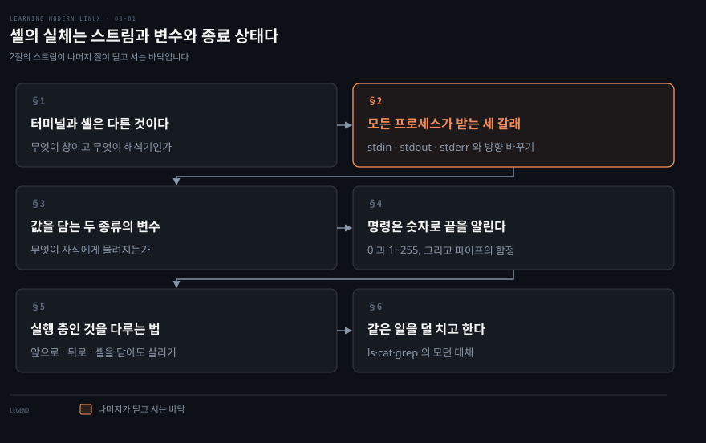
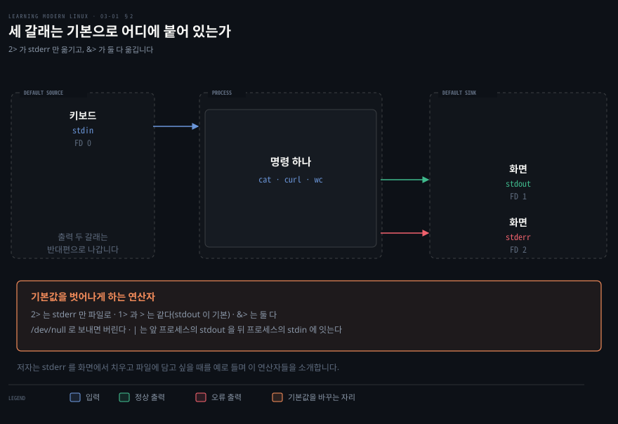
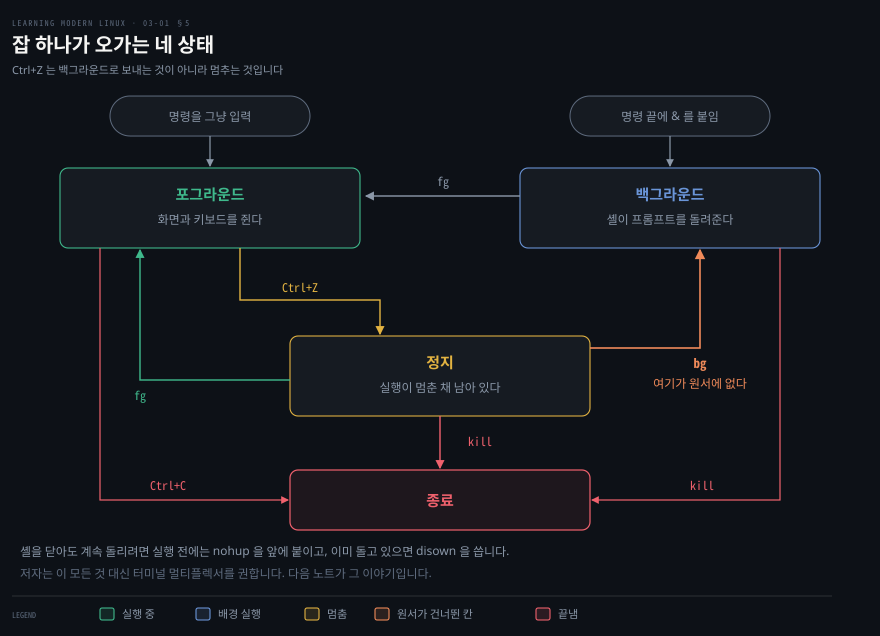

# 셸의 실체는 스트림과 변수와 종료 상태다

---

> 셸을 안다는 말은 명령을 많이 외운다는 뜻이 아닙니다. 원서 3장 앞부분은 셸이 모든 프로세스에 무엇을 쥐여 주는지에서 시작합니다.

## 핵심 요약

> 이 구간 전체가 매달린 하나의 생각은 **셸이 명령 해석기이고, 그 해석기가 실제로 다루는 것은 스트림과 변수와 종료 상태 셋**이라는 것입니다.

저자가 셸을 정의하는 문장에 그 셋이 그대로 들어 있습니다. 셸은 터미널 안에서 도는 프로그램이며 다음을 합니다.

- 스트림으로 입출력을 다룹니다.
- 변수를 지원합니다.
- 몇 가지 내장 명령을 가집니다.
- 명령 실행과 상태를 처리합니다.
- 보통 대화형 사용과 스크립트 사용을 모두 지원합니다.

이 셋을 알면 나머지가 따라옵니다. `|` 와 `>` 가 왜 같은 문법 계열인지는 스트림에서 나옵니다. 자식 프로세스에 무엇이 물려지는지는 변수의 두 종류에서 나옵니다. 스크립트가 실패를 감지하는 방법은 종료 상태에서 나옵니다. 3장 뒷부분의 스크립팅은 이 셋 위에 흐름 제어를 얹은 것뿐입니다.

한 가지 더 있습니다. 원서의 실습 명령 가운데 의도대로 동작하지 않는 것이 둘 있어서, 이 노트는 그 자리를 직접 돌려 확인하고 병기했습니다. 셸 변수를 만드는 대목과 잡을 백그라운드로 보내는 대목입니다.


## 학습 목표

> 이 구간을 읽고 나면 아래 다섯 가지를 스스로 해낼 수 있습니다.

1. 터미널과 셸이 각각 무엇인지 구분해 말할 수 있습니다.
2. 파일 서술자 셋이 기본으로 어디에 붙어 있는지와 그 방향을 바꾸는 연산자를 설명할 수 있습니다.
3. 셸 변수와 환경 변수를 만드는 법과 자식 프로세스가 무엇을 물려받는지 가를 수 있습니다.
4. 종료 상태의 값 범위와 파이프라인에서 그것을 읽을 때의 함정을 말할 수 있습니다.
5. 잡이 오가는 상태들과 그 사이를 옮기는 명령을 짝지어 댈 수 있습니다.

아래는 이 문서 전체를 읽는 순서로 이은 지도입니다. 칸마다 절 번호와 그 절이 답하는 물음 하나를 적었습니다. 색이 붙은 칸이 나머지 절이 딛고 서는 바닥입니다.




## 이 문서가 다루지 않는 것

> 3장은 원서에서 가장 긴 장이라 노트를 셋으로 나눴습니다. 이 노트는 저자가 "수동, 곧 사람이 터미널 앞에 앉아 대화형으로 치는 방식" 이라 부른 축의 기초 구간입니다.

- 별칭·단축키·사람 친화 셸·터미널 멀티플렉서 → [자주 치는 것일수록 짧아야 한다](./03-02.%EC%9E%90%EC%A3%BC%20%EC%B9%98%EB%8A%94%20%EA%B2%83%EC%9D%BC%EC%88%98%EB%A1%9D%20%EC%A7%A7%EC%95%84%EC%95%BC%20%ED%95%9C%EB%8B%A4.md)
- 스크립트 작성·이식성·린트와 테스트 → [bash 는 조용히 실패하므로 시끄럽게 만들어야 한다](./03-03.bash%20%EB%8A%94%20%EC%A1%B0%EC%9A%A9%ED%9E%88%20%EC%8B%A4%ED%8C%A8%ED%95%98%EB%AF%80%EB%A1%9C%20%EC%8B%9C%EB%81%84%EB%9F%BD%EA%B2%8C%20%EB%A7%8C%EB%93%A4%EC%96%B4%EC%95%BC%20%ED%95%9C%EB%8B%A4.md)
- 파일 권한과 `chmod 750` 의 의미 → 원서 4장
- 셸이 커널에 무엇을 요청하는가 → [커널은 전부를 하지만 운영체제는 아니다](./02-01.%EC%BB%A4%EB%84%90%EC%9D%80%20%EC%A0%84%EB%B6%80%EB%A5%BC%20%ED%95%98%EC%A7%80%EB%A7%8C%20%EC%9A%B4%EC%98%81%EC%B2%B4%EC%A0%9C%EB%8A%94%20%EC%95%84%EB%8B%88%EB%8B%A4.md)

저자는 이 장을 시작하며 리눅스 환경을 하나 띄워 두고 예제를 바로 따라 쳐 보라고 권합니다. 이 노트도 그 전제로 읽는 편이 낫습니다.


## 1. 터미널과 셸은 다른 것이다

> 같은 창을 두고 터미널이라 부르기도 하고 셸이라 부르기도 합니다. 저자는 그 둘이 다른 프로그램이라는 데서 장을 엽니다.

**터미널**, 또는 터미널 에뮬레이터나 소프트 터미널이라 부르는 것은 전부 같은 것을 가리킵니다. 텍스트 사용자 인터페이스를 제공하는 프로그램입니다. 키보드에서 문자를 읽어 화면에 표시하는 일을 하고, 오래전에는 키보드와 화면이 붙은 통합 장치였지만 요즘은 그냥 앱입니다.

문자 입출력에 더해 터미널은 이스케이프 시퀀스를 지원합니다. 커서와 화면을 다루고 색을 내는 데 쓰이며, 예를 들어 Ctrl+H 는 백스페이스가 되어 커서 왼쪽 문자를 지웁니다.

지금 쓰는 터미널이 무엇인지는 환경 변수 `TERM` 에 있고, 그 설정은 `infocmp` 로 봅니다.

```bash
infocmp
```

저자의 출력에서는 이 터미널이 가로 80칸(`cols#80`)과 세로 24줄(`lines#24`), 그리고 256색(`colors#0x100`, 16진 표기)을 지원한다는 것을 읽어 냅니다. `infocmp` 의 출력은 소화하기 쉽지 않으니 자세한 것은 terminfo 데이터베이스를 보라고 덧붙입니다.

터미널의 예로는 `xterm`·`rxvt`·Gnome terminator 같은 것이 있고, GPU 를 쓰는 새 세대로는 Alacritty·kitty·warp 를 듭니다.

### 셸은 그 안에서 도는 명령 해석기입니다

셸은 터미널 안에서 돌면서 명령 해석기 노릇을 하는 프로그램입니다. 핵심 요약에서 세 갈래로 나눈 그 정의가 원서의 문장 그대로입니다.

셸은 형식상 `sh` 로 정의되어 있고, 그래서 POSIX 셸이라는 말을 자주 만납니다. 이 말은 스크립트와 이식성 문맥에서 더 중요해집니다.

원래는 저자의 이름을 딴 Bourne 셸 `sh` 가 있었습니다. 요즘은 대개 `bash` 가 그 자리를 대신하는데, 원래 이름을 비튼 말장난이자 Bourne Again Shell 의 줄임말이며 기본값으로 널리 쓰입니다. 지금 무엇을 쓰는지 궁금하면 `file -h /bin/sh` 로 알아봅니다. 그것이 안 되면 `echo $0` 이나 `echo $SHELL` 을 씁니다.

`sh` 의 다른 구현과 변종도 많습니다. Korn 셸 `ksh` 나 C 셸 `csh` 같은 것인데 요즘 널리 쓰이지는 않습니다. 저자는 이 절 이후 모든 예제에서 별도로 밝히지 않는 한 bash 를 전제한다고 못 박습니다.


## 2. 모든 프로세스가 세 갈래를 받는다

> 프로그램에 입력을 어떻게 먹이고, 그 출력이 화면에 갈지 파일에 갈지를 어떻게 정할까요. 저자는 이 두 물음으로 스트림을 엽니다.



셸은 모든 프로세스에 입출력용 파일 서술자 셋을 기본으로 쥐여 줍니다.

- `stdin`: FD 0
- `stdout`: FD 1
- `stderr`: FD 2

이 셋은 기본적으로 각각 키보드와 화면에 연결되어 있습니다. 달리 지정하지 않는 한, 셸에 입력한 명령은 키보드에서 입력을 받고 화면에 출력을 내놓습니다.

기본값을 쓰고 싶지 않을 때, 이를테면 `stderr` 를 화면에 뿌리지 않고 파일에 담고 싶을 때 스트림의 방향을 바꿉니다.

### 방향을 바꾸는 연산자

방향 바꾸기는 `$FD>` 와 `<$FD` 로 하며 `$FD` 가 파일 서술자입니다. `2>` 는 `stderr` 를 옮기라는 뜻입니다. `stdout` 이 기본이므로 `1>` 과 `>` 는 같습니다. 둘 다 옮기려면 `&>` 를 쓰고, 스트림을 아예 버리려면 `/dev/null` 로 보냅니다.

```bash
curl https://example.com &> /dev/null
curl https://example.com > /tmp/content.txt 2> /tmp/curl-status
cat > /tmp/interactive-input.txt
tr < /tmp/curl-status [A-Z] [a-z]
```

첫 줄은 `stdout` 과 `stderr` 를 모두 `/dev/null` 로 보내 전부 버립니다. 둘째 줄은 출력과 상태를 서로 다른 파일로 갈라 담습니다. 셋째 줄은 대화형으로 입력받아 파일에 저장하며, Ctrl+D 로 캡처를 끝내고 내용을 저장합니다. 넷째 줄은 `stdin` 에서 읽는 `tr` 로 모든 단어를 소문자로 바꿉니다.

### 셸이 알아듣는 특수 문자 셋

- **앰퍼샌드 `&`**: 명령 끝에 두면 그 명령을 백그라운드에서 실행합니다.
- **백슬래시 `\`**: 다음 줄로 명령을 이어 갑니다. 긴 명령의 가독성을 위한 것입니다.
- **파이프 `|`**: 한 프로세스의 `stdout` 을 다음 프로세스의 `stdin` 에 잇습니다. 임시 저장 파일 없이 데이터를 넘길 수 있습니다.

파이프를 실제로 써 보는 예로 저자는 HTML 파일의 줄 수를 셉니다.

```bash
curl https://example.com 2> /dev/null | \
     wc -l
```

```bash
46
```

`curl` 로 내려받되 `stderr` 로 나오는 상태 표시는 버리고, `curl` 의 `stdout` 을 `wc` 의 `stdin` 에 먹여 `-l` 옵션으로 줄 수를 셉니다. 저자는 실무라면 `curl` 의 `-s` 옵션을 쓰겠지만 여기서는 방금 배운 것을 적용해 보려는 것이라고 덧붙입니다.


## 3. 값을 담는 두 종류의 변수

> 값을 하드코딩하고 싶지 않거나 할 수 없을 때 변수를 씁니다. 문제는 그 변수가 어디까지 따라가느냐입니다.


저자가 드는 쓰임새는 셋입니다.

1. 리눅스가 드러내는 설정 항목을 다룰 때입니다. 셸이 실행 파일을 찾는 자리를 담은 `$PATH` 가 그런 예입니다.
2. 스크립트 문맥에서 사용자에게 값을 대화형으로 물을 때입니다.
3. 긴 값을 한 번만 정의해 입력을 줄일 때입니다. HTTP API 의 URL 같은 것이 여기 들고, 프로그래밍 언어의 상수에 가깝습니다.

종류는 둘입니다. **환경 변수**는 셸 전체 설정이고 `env` 로 나열합니다. **셸 변수**는 지금 실행의 문맥에서만 유효하며 bash 에서는 `set` 으로 나열합니다. 저자가 이어서 못 박는 문장이 이 절의 핵심입니다. 셸 변수는 자식 프로세스가 물려받지 못합니다.

bash 에서 환경 변수를 만들 때는 `export` 를 씁니다. 값을 읽을 때는 앞에 `$` 를 붙이고, 없앨 때는 `unset` 을 씁니다.

### 원서의 실습을 그대로 돌리면

원서는 이 두 종류를 실습으로 보이는데, 그 실습에 쓴 명령 둘이 bash 에서 의도한 일을 하지 않습니다.

> **원문 정오**: 저자는 셸 변수를 만드는 명령으로 `set MY_VAR=42` 를, 지우는 명령으로 `unset $MY_VAR` 를 적습니다. bash 에서 둘 다 의도한 일을 하지 않습니다. `set` 은 셸 옵션과 위치 인자를 다루는 내장 명령이라 `set MY_VAR=42` 는 변수를 만들지 않고 `$1` 을 문자열 `MY_VAR=42` 로 만듭니다. 대입은 `set` 없이 `MY_VAR=42` 라고 씁니다. `unset` 에는 `$` 를 붙이지 않습니다. `unset $MY_VAR` 는 변수 값을 먼저 펼친 뒤 그것을 이름으로 삼으므로 지우려던 변수가 살아남습니다.

이 진단의 근거는 원서 자신의 출력에도 있습니다. 저자가 실은 출력은 `MY_VAR=42` 가 아니라 `_=MY_VAR=42` 입니다. `_` 는 직전 명령의 마지막 인자를 담는 bash 특수 변수입니다. `set MY_VAR=42` 를 실행했으니 그 값이 `MY_VAR=42` 가 된 것입니다. `grep` 이 잡은 것은 만들어지지 않은 `MY_VAR` 가 아니라 `_` 였습니다. 저자는 그 `_=` 를 두고 "내보내지 않았다는 표시" 라고 읽지만 `_` 는 내보냄 여부와 무관한 다른 변수입니다.

2026-09-05 에 macOS 기본 bash 3.2 로 직접 돌려 확인한 결과가 도식의 셋째 행입니다. `set MY_VAR=42` 뒤 `$MY_VAR` 는 비어 있고 `$1` 이 `MY_VAR=42` 가 됩니다. `unset $MY_VAR2` 는 ``unset: `42': not a valid identifier`` 오류를 내고 변수는 값을 그대로 유지합니다.

원서가 이 실습으로 보이려던 사실 자체는 맞습니다. 자식 셸에서는 환경 변수만 보이고 셸 변수는 보이지 않습니다. 그 사실을 확인하려면 아래처럼 씁니다.

```bash
MY_VAR=42
export MY_GLOBAL_VAR="fun with vars"
bash -c 'echo "[${MY_VAR:-없음}] [${MY_GLOBAL_VAR:-없음}]"'
```

```bash
[없음] [fun with vars]
```

### 알아 둘 만한 변수들

저자가 표로 모아 둔 것 가운데 자주 만나는 것만 옮깁니다. 값은 `echo $XXX` 로 봅니다.

| 변수 | 종류 | 뜻 |
|---|---|---|
| `PATH` | POSIX | 셸이 실행 프로그램을 찾는 디렉토리 목록 |
| `HOME` | POSIX | 현재 사용자의 홈 디렉토리 경로 |
| `IFS` | POSIX | 필드를 가르는 문자 목록. 셸이 확장 시 단어를 쪼갤 때 씀 |
| `EDITOR` | 환경 | 파일을 편집할 때 기본으로 쓰는 프로그램의 경로 |
| `PS1` | 환경 | 지금 쓰는 주 프롬프트 문자열 |
| `PWD` · `OLDPWD` | 환경 · bash | 작업 디렉토리의 전체 경로와 직전 `cd` 이전의 경로 |
| `SHELL` · `TERM` | 환경 | 지금 쓰는 셸과 터미널 에뮬레이터 |
| `UID` · `USER` | 환경 | 현재 사용자의 고유 ID 와 이름 |
| `RANDOM` | bash | 0 과 32767 사이의 난수 |
| `?` | bash | 종료 상태 |
| `$` · `0` | bash | 현재 프로세스의 ID 와 이름 |
| `_` | bash | 포그라운드에서 마지막으로 실행한 명령의 마지막 인자 |


## 4. 명령은 숫자로 끝을 알린다

> 명령이 잘 끝났는지를 셸은 말이 아니라 숫자로 전달받습니다. 그 숫자를 읽는 법과 파이프라인에서의 함정이 이 절입니다.

셸은 명령 실행이 끝났다는 것을 **종료 상태**로 호출자에게 알립니다. 일반적으로 리눅스 명령은 끝날 때 상태를 돌려주도록 기대됩니다. 정상 종료일 수도 있고 비정상 종료일 수도 있습니다. 종료 상태 0 은 오류 없이 성공적으로 실행됐다는 뜻이고, 1 과 255 사이의 0 이 아닌 값은 실패를 알립니다. 값을 보려면 `echo $?` 를 씁니다.

파이프라인에서는 조심하라고 저자가 덧붙입니다. 일부 셸은 마지막 명령의 상태만 내주기 때문입니다. 그 한계는 `$PIPESTATUS` 로 우회할 수 있습니다.

### 내장 명령과 그 밖의 것

셸에는 내장 명령이 여럿 딸려 옵니다. 저자가 드는 예는 `yes`·`echo`·`cat`·`read` 인데, 배포판에 따라 이 가운데 일부는 내장이 아니라 `/usr/bin` 에 있을 수도 있다고 단서를 붙입니다. 내장 목록은 `help` 명령으로 봅니다. 그 밖의 모든 것은 셸 외부 프로그램이고 보통 사용자 명령은 `/usr/bin`, 관리 명령은 `/usr/sbin` 에 있습니다.

실행 파일이 어디 있는지 찾는 방법도 함께 보입니다.

```bash
which ls
type ls
```

```bash
/usr/bin/ls
ls is aliased to `ls --color=auto'
```

여기에 저자는 기술 감수자의 지적을 그대로 실어 둡니다. `which` 는 POSIX 가 아닌 외부 프로그램이라 항상 있으리라는 보장이 없으니, 프로그램 경로나 셸 별칭·함수를 얻는 데는 `which` 보다 `command -v` 를 쓰라는 것입니다.


## 5. 실행 중인 것을 다루는 법

> 명령 하나가 화면과 키보드를 통째로 쥐고 놓지 않을 때, 그리고 서버처럼 `stdin` 이 아예 없을 때 무엇을 할 수 있을까요.



대부분의 셸이 지원하는 기능이 **잡 컨트롤**입니다. 기본적으로 명령을 입력하면 그 명령이 화면과 키보드를 쥐는데, 이것을 포그라운드에서 돈다고 말합니다. 백그라운드로 프로세스를 띄우려면 명령 끝에 `&` 를 붙입니다.

```bash
watch -n 5 "ls" &
jobs
fg
```

`&` 를 끝에 붙여 백그라운드로 띄우고, `jobs` 로 모든 잡을 나열하며, `fg` 로 프로세스를 포그라운드로 가져옵니다. `watch` 를 끝내려면 Ctrl+C 를 씁니다.

셸을 닫은 뒤에도 백그라운드 프로세스를 계속 돌리려면 `nohup` 을 앞에 붙입니다. 이미 돌고 있고 `nohup` 을 앞에 붙이지 않았다면 사후에 `disown` 으로 같은 효과를 냅니다. 돌고 있는 프로세스를 없애려면 `kill` 을 여러 강도로 씁니다.

> **원문 정오**: 저자는 "포그라운드 프로세스를 백그라운드로 보내려면 Ctrl+Z 를 누른다" 고 적지만, Ctrl+Z 는 프로세스를 **멈추는** 것이지 백그라운드에서 계속 돌리는 것이 아닙니다. bash 매뉴얼은 서스펜드 문자를 입력하면 "stops that process and returns control to Bash" 라고 적고, 그 뒤에 백그라운드로 이어 돌리려면 `bg`, 포그라운드로 이어 돌리려면 `fg` 를 쓴다고 적습니다.[^bashjob] 도식에서 색이 붙은 칸이 원서가 건너뛴 `bg` 한 걸음입니다.

> **노트의 읽기**: 저자가 실은 `jobs` 출력은 `Job Group CPU State Command` 라는 머리글을 갖는데, 이것은 bash 의 형식이 아닙니다. bash 는 `[1]+  Running   watch -n 5 "ls" &` 처럼 찍습니다. 저자가 본문에서 자기 상용 셸로 Fish 를 쓴다고 밝히므로 그쪽 출력이 섞인 것으로 보입니다. 이 절이 bash 를 전제한다고 선언한 자리라 옮길 때 혼동하기 쉽습니다.

저자는 이 절을 이렇게 닫습니다. 잡 컨트롤보다는 터미널 멀티플렉서를 권한다는 것입니다. 멀티플렉서가 셸이 닫히는 경우나 여러 프로세스를 조율해야 하는 경우 같은 흔한 상황을 대신 처리해 주고 원격 시스템 작업도 지원하기 때문입니다. 그 이야기는 [다음 노트](./03-02.%EC%9E%90%EC%A3%BC%20%EC%B9%98%EB%8A%94%20%EA%B2%83%EC%9D%BC%EC%88%98%EB%A1%9D%20%EC%A7%A7%EC%95%84%EC%95%BC%20%ED%95%9C%EB%8B%A4.md)가 맡습니다.


## 6. 같은 일을 덜 치고 한다

> 매일 수십 번 치는 명령이라면 타건 하나가 아깝습니다. 저자는 자주 쓰는 명령에 모던 대체가 있다고 소개합니다.

자주 쓰는 명령으로 저자가 드는 것은 디렉토리를 오가는 `cd`, 내용을 나열하는 `ls`, 파일을 찾는 `find`, 내용을 보는 `cat` 과 `less` 입니다. 이렇게 자주 쓰니 가능한 한 효율적이고 싶고 타건 하나하나가 아깝다는 것이 출발점입니다.

모던 변종 가운데 어떤 것은 그대로 갈아 끼우는 대체이고 어떤 것은 기능을 넓힙니다. 공통점은 셋입니다.

- 흔한 작업에 분별 있는 기본값을 줍니다.
- 이해하기 쉬운 풍부한 출력을 냅니다.
- 같은 일을 더 적게 쳐서 끝내게 해 줍니다.

| 전통 | 모던 | 저자가 드는 이유 |
|---|---|---|
| `ls` | `exa` | Rust 로 쓰였고 Git 지원과 트리 렌더링이 내장 |
| `cat` | `bat` | 문법 강조, 출력되지 않는 문자 표시, Git 지원, 페이저 내장 |
| `find` + `grep` | `rg` | 빠르고 강력하며 결과에 줄 번호 같은 맥락이 함께 나옴 |
| `awk` · `sed` (JSON 한정) | `jq` | 대체가 아니라 JSON 전용 도구. HTTP API 와 설정 파일에서 자주 만남 |

`find` 와 `grep` 조합을 `rg` 하나로 줄이는 예가 이 표의 논지를 잘 보입니다.

```bash
find . -type f -name "*.yaml" -exec grep "sample" '{}' \; -print
```

```bash
      app: sample
        app: sample
./app.yaml
```

```bash
rg -t "yaml" sample
```

```bash
app.yaml
9:       app: sample
14:           app: sample
```

`rg` 쪽이 쓰기 쉬울 뿐 아니라 결과도 더 많은 정보를 담습니다. 이 경우에는 줄 번호가 그렇습니다.

저자가 곁들이는 팁이 하나 더 있습니다. 디렉토리 내용을 나열한 다음 가장 자주 하는 일이 화면을 지우는 것인데, 많은 사람이 `clear` 를 칩니다. 다섯 글자를 치고 엔터를 누르는 대신 Ctrl+L 을 쓰면 같은 효과를 훨씬 빨리 냅니다.

기업 환경에 이 지식을 적용할 사람에게는 주의를 덧붙입니다. 저자는 이 도구들에 이해관계가 없고 자신이 유용하다고 느껴 권할 뿐이며, 설치해 쓸 때는 자기가 쓰는 배포판이 검증한 버전을 쓰는 편이 좋다는 것입니다.


## 심화 학습

> 원서는 2022년에 나왔고 이 절이 권하는 도구 가운데 하나는 그 뒤로 손이 바뀌었습니다. 나머지는 원서 자신의 출력을 대조해 얻은 읽기입니다.

- **`exa` 는 더 유지보수되지 않습니다.** 저장소 README 첫 줄이 "exa is unmaintained, use the fork eza instead" 이고, 후속 프로젝트로 `eza` 를 지목합니다.[^exa] 저장소가 아카이브되지 않은 이유까지 적어 두었는데, 그럴 권한을 가진 사람에게 연락이 닿지 않기 때문이라고 합니다. 저자의 논지는 그대로 유효하고 이름만 바뀐 셈입니다.
- **원서의 셸 변수 실습은 의도대로 동작하지 않습니다.** 3절의 원문 정오가 그것이고, 근거는 원서 자신의 출력에 찍힌 `_=` 그리고 2026-09-05 의 bash 5 실행입니다.
- **Ctrl+Z 와 `bg` 사이가 한 칸 비어 있습니다.** 5절의 원문 정오가 그것이고, 근거는 bash 매뉴얼의 Job Control Basics 입니다.[^bashjob]
- **`jobs` 출력이 선언한 셸의 것이 아닙니다.** 5절의 노트의 읽기가 그것입니다. 원서가 bash 를 전제한다고 밝힌 절에 다른 셸의 출력이 들어 있으므로, 그 표를 그대로 외우면 자기 셸에서 다른 화면을 보게 됩니다.


## 결정 치트시트

> 이 구간이 판단으로 이어지는 자리를 모았습니다. 근거는 본문과 심화 학습입니다.

| 상황 | 선택 | 이유 |
|---|---|---|
| 출력은 보고 오류만 파일에 담아야 한다 | `2> 파일` | `stdout` 은 기본이라 건드리지 않음 |
| 출력과 오류를 통째로 버려야 한다 | `&> /dev/null` | 둘 다 옮긴 뒤 버리는 자리로 보냄 |
| 자식 프로세스에 값을 물려야 한다 | `export` | 셸 변수는 자식이 물려받지 못함 |
| 파이프라인 중간 명령의 실패를 봐야 한다 | `$PIPESTATUS` | 일부 셸은 마지막 상태만 내줌 |
| 명령의 경로를 이식성 있게 알아야 한다 | `command -v` | `which` 는 POSIX 가 아니고 없을 수 있음 |
| 멈춘 잡을 백그라운드에서 이어 돌려야 한다 | `bg` | Ctrl+Z 는 멈추기만 함 |
| 셸을 닫아도 프로세스를 살려야 한다 | 실행 전 `nohup`, 실행 뒤 `disown` | 저자가 든 두 시점의 방법 |
| `ls` 를 갈아 끼우려 한다 | `eza` | `exa` 는 유지보수가 끝났고 그 포크가 후속 |


## 적용 관점

> 이 구간이 실무로 착지하는 자리는 로그와 종료 상태입니다. 컨테이너 안에서 도는 프로세스의 출력이 어디로 가는지가 곧 이 절의 이야기입니다.

**한 가지 실행**: 자기가 쓰는 셸에서 아래 세 줄을 쳐 보고, 셸 변수와 환경 변수가 자식 프로세스에서 어떻게 갈리는지 눈으로 확인합니다. 3절 도식의 첫 두 행을 손으로 재현하는 것이 이 절을 착지시키는 가장 짧은 방법입니다.

```bash
MY_VAR=42
export MY_GLOBAL_VAR=hello
bash -c 'echo "shell=[${MY_VAR:-없음}] env=[${MY_GLOBAL_VAR:-없음}]"'
```

Spring 애플리케이션을 컨테이너로 띄워 본 사람에게 2절은 익숙한 이야기가 됩니다. 컨테이너 로그를 `kubectl logs` 로 보는 것은 결국 그 프로세스의 `stdout` 과 `stderr` 를 읽는 일입니다. 로그를 파일이 아니라 표준 출력으로 내보내라는 관례가 여기서 나옵니다. 3절의 환경 변수는 `ConfigMap` 과 `Secret` 이 앱에 값을 주입하는 통로 그 자체이며, Spring Boot 의 `SPRING_DATASOURCE_URL` 같은 이름이 그 위에 서 있습니다. 4절의 종료 상태는 컨테이너의 종료 코드가 되어 재시작 정책의 입력이 됩니다.


## 면접에서 받을 만한 질문

> 자답한 뒤 아래 정답과 맞춰 봅니다.

1. 터미널과 셸의 차이를 설명해 보십시오.
2. `2>` 와 `&>` 와 `>` 는 각각 무엇을 옮깁니까.
3. 셸 변수와 환경 변수는 어떻게 다릅니까. 자식 프로세스에서는 무엇이 보입니까.
4. 종료 상태 0 과 그 밖의 값은 각각 무엇을 뜻합니까. 파이프라인에서는 무엇을 조심해야 합니까.
5. 백그라운드로 명령을 띄우는 방법과, 이미 포그라운드에서 도는 것을 백그라운드로 옮기는 방법을 말해 보십시오.
6. 셸을 닫아도 프로세스를 계속 돌리려면 어떻게 합니까.


## 정답 (자답 후 펼치기)

### 정답 1 — 터미널과 셸

터미널은 텍스트 사용자 인터페이스를 제공하는 프로그램으로 키보드에서 문자를 읽어 화면에 표시합니다. 셸은 그 터미널 안에서 도는 명령 해석기이며 스트림·변수·내장 명령·실행 상태를 다룹니다.

### 정답 2 — 리다이렉션 연산자

`>` 는 `stdout` 을 옮깁니다. `stdout` 이 기본이라 `1>` 과 같습니다. `2>` 는 `stderr` 만 옮기고, `&>` 는 둘 다 옮깁니다. 버리려면 `/dev/null` 로 보냅니다.

### 정답 3 — 두 종류의 변수

환경 변수는 셸 전체 설정으로 `env` 가 나열하고 `export` 로 만듭니다. 셸 변수는 지금 실행의 문맥에서만 유효하며 `set` 이 나열합니다. 자식 프로세스는 환경 변수만 물려받고 셸 변수는 물려받지 못합니다.

### 정답 4 — 종료 상태

0 은 오류 없이 성공했다는 뜻이고 1 과 255 사이의 값은 실패를 알립니다. `echo $?` 로 읽습니다. 파이프라인에서는 일부 셸이 마지막 명령의 상태만 내주므로 중간 명령의 실패를 보려면 `$PIPESTATUS` 를 씁니다.

### 정답 5 — 백그라운드로 보내기

띄울 때부터 백그라운드로 두려면 명령 끝에 `&` 를 붙입니다. 이미 포그라운드에서 도는 것은 Ctrl+Z 로 멈춘 뒤 `bg` 로 백그라운드에서 이어 돌립니다. Ctrl+Z 만으로는 멈춘 상태에 머뭅니다.

### 정답 6 — 셸을 닫아도 살리기

실행 전이라면 `nohup` 을 명령 앞에 붙입니다. 이미 돌고 있다면 `disown` 을 사후에 씁니다. 저자는 이보다 터미널 멀티플렉서를 권합니다.


## 핵심 개념 체크리스트

- [ ] 파일 서술자 0·1·2 가 각각 무엇이고 기본으로 어디에 붙어 있는지 말할 수 있는가?
- [ ] `|` 가 무엇과 무엇을 잇는지 스트림의 말로 설명할 수 있는가?
- [ ] `export` 를 붙일 때와 붙이지 않을 때 자식 프로세스에서 무엇이 달라지는지 아는가?
- [ ] `$?` 와 `$PIPESTATUS` 를 각각 언제 쓰는지 아는가?
- [ ] 잡의 네 상태와 그 사이를 옮기는 명령을 짝지을 수 있는가?
- [ ] 원서의 셸 변수 실습이 왜 의도대로 동작하지 않는지 설명할 수 있는가?


## 관련 문서

- [Learning Modern Linux 정독 인덱스](./README.md) — 이 책의 장별 진행 상황
- [자주 치는 것일수록 짧아야 한다](./03-02.%EC%9E%90%EC%A3%BC%20%EC%B9%98%EB%8A%94%20%EA%B2%83%EC%9D%BC%EC%88%98%EB%A1%9D%20%EC%A7%A7%EC%95%84%EC%95%BC%20%ED%95%9C%EB%8B%A4.md) — 같은 장의 도구 선택 구간
- [bash 는 조용히 실패하므로 시끄럽게 만들어야 한다](./03-03.bash%20%EB%8A%94%20%EC%A1%B0%EC%9A%A9%ED%9E%88%20%EC%8B%A4%ED%8C%A8%ED%95%98%EB%AF%80%EB%A1%9C%20%EC%8B%9C%EB%81%84%EB%9F%BD%EA%B2%8C%20%EB%A7%8C%EB%93%A4%EC%96%B4%EC%95%BC%20%ED%95%9C%EB%8B%A4.md) — 같은 장의 자동화 구간
- [커널은 전부를 하지만 운영체제는 아니다](./02-01.%EC%BB%A4%EB%84%90%EC%9D%80%20%EC%A0%84%EB%B6%80%EB%A5%BC%20%ED%95%98%EC%A7%80%EB%A7%8C%20%EC%9A%B4%EC%98%81%EC%B2%B4%EC%A0%9C%EB%8A%94%20%EC%95%84%EB%8B%88%EB%8B%A4.md) — 셸이 유저 랜드에 있다는 사실의 근거


## 참고 자료

- 원서: 《Learning Modern Linux》 3장 Shells and Scripting
- 서지: Michael Hausenblas, O'Reilly, 2022년
- [GNU Bash 매뉴얼 — Job Control Basics](https://www.gnu.org/software/bash/manual/html_node/Job-Control-Basics.html) — 잡 상태와 `bg`·`fg` 의 정본
- [modern-unix](https://github.com/ibraheemdev/modern-unix) — 저자가 다른 대체 후보를 보라며 든 목록

[^bashjob]: GNU Bash 매뉴얼, Job Control Basics — "Typing the suspend character (typically '^Z', Control-Z) while a process is running stops that process and returns control to Bash." 그리고 이어서 "the `bg` command to continue it in the background, the `fg` command to continue it in the foreground". <https://www.gnu.org/software/bash/manual/html_node/Job-Control-Basics.html> (2026-09-05 조회)

[^exa]: exa 저장소 README — "exa is unmaintained, use the fork eza instead", 그리고 "(This repository isn't archived because the only person with the rights to do so is unreachable)". <https://github.com/ogham/exa> (2026-09-05 조회)
