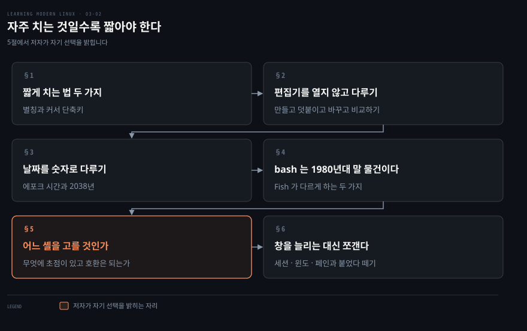
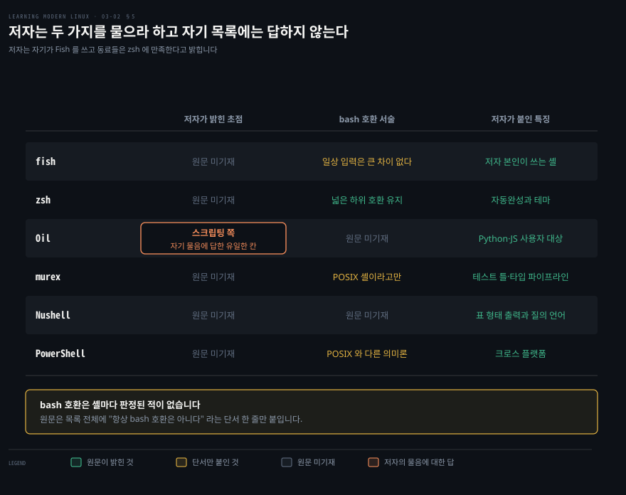
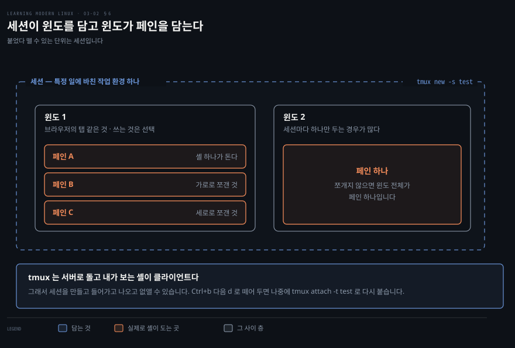
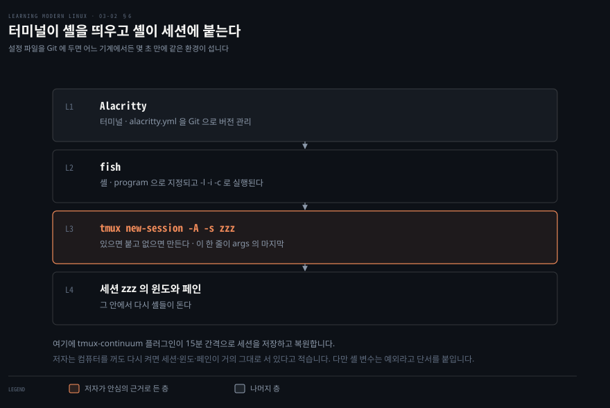

# 자주 치는 것일수록 짧아야 한다

---

> 저자가 이 구간을 여는 원칙은 한 줄입니다. 아주 자주 쓰는 명령일수록 가장 적은 노력이 들어야 한다는 것입니다.

## 핵심 요약

> 이 구간 전체가 매달린 하나의 생각은 **터미널에서 손이 덜 가게 만드는 방법이 세 층으로 쌓인다**는 것입니다. 지금 쓰는 셸 안에서 줄이는 층, 셸 자체를 갈아 끼우는 층, 그리고 터미널을 쪼개 쓰는 층입니다.

첫 층은 이미 가진 것으로 하는 일입니다. 저자는 하루에 수백 번 보는 `git diff --color-moved` 를 `d` 한 글자로 줄여 씁니다. 커서를 줄 앞으로 옮기고 왼쪽을 지우는 단축키도 여기 듭니다.

둘째 층은 셸을 바꾸는 것입니다. bash 는 1980년대 말부터 있었고 나이가 드러날 때가 있다는 것이 저자의 진단입니다. Fish 는 히스토리를 따로 관리하지 않고 그냥 치면 이전 실행이 나오며, 명령마다 자동 제안을 내놓습니다.

셋째 층은 터미널 자체를 다중화하는 것입니다. 창을 여러 개 띄우는 대신 세션 하나 안에서 윈도와 페인으로 나눕니다. 셸을 닫아도 그 상태가 남게 하는 것이 핵심이고, 저자가 잡 컨트롤 대신 이쪽을 권한 이유를 여기서 채웁니다.

세 층 가운데 저자가 자기 선택을 밝히는 곳은 둘째와 셋째입니다. 셸은 Fish 를 쓰되 취향이라 못 박지 않고, 멀티플렉서는 tmux 를 쓰라고 분명히 말합니다.


## 학습 목표

> 이 구간을 읽고 나면 아래 다섯 가지를 스스로 해낼 수 있습니다.

1. 자주 쓰는 명령을 줄이는 두 가지 방법을 셸별로 구분해 말할 수 있습니다.
2. 편집기를 열지 않고 파일 내용을 만들고 덧붙이고 바꾸고 비교할 수 있습니다.
3. 유닉스 에포크 시간이 무엇이고 2038년에 무슨 일이 생기는지 설명할 수 있습니다.
4. 셸을 고를 때 던질 두 물음을 대고, 후보들을 그 축 위에 놓을 수 있습니다.
5. tmux 의 세 단위와 붙었다 떼는 동작을 설명할 수 있습니다.

아래는 이 문서 전체를 읽는 순서로 이은 지도입니다. 칸마다 절 번호와 그 절이 답하는 물음 하나를 적었습니다. 색이 붙은 칸이 저자가 자기 선택을 밝히는 자리입니다.




## 이 문서가 다루지 않는 것

> 3장을 셋으로 나눈 가운데 구간입니다. 앞뒤는 각각 다른 노트가 맡습니다.

- 터미널·셸의 정의, 스트림, 변수, 종료 상태, 잡 컨트롤 → [셸의 실체는 스트림과 변수와 종료 상태다](./03-01.%EC%85%B8%EC%9D%98%20%EC%8B%A4%EC%B2%B4%EB%8A%94%20%EC%8A%A4%ED%8A%B8%EB%A6%BC%EA%B3%BC%20%EB%B3%80%EC%88%98%EC%99%80%20%EC%A2%85%EB%A3%8C%20%EC%83%81%ED%83%9C%EB%8B%A4.md)
- 스크립트 작성과 이식성, 린트와 테스트 → [bash 는 조용히 실패하므로 시끄럽게 만들어야 한다](./03-03.bash%20%EB%8A%94%20%EC%A1%B0%EC%9A%A9%ED%9E%88%20%EC%8B%A4%ED%8C%A8%ED%95%98%EB%AF%80%EB%A1%9C%20%EC%8B%9C%EB%81%84%EB%9F%BD%EA%B2%8C%20%EB%A7%8C%EB%93%A4%EC%96%B4%EC%95%BC%20%ED%95%9C%EB%8B%A4.md)
- 셸 설정 파일이 놓이는 자리와 권한 → 원서 4·5장

저자가 이 구간에서 자기 설정 파일을 통째로 싣는 대목이 여럿 있습니다. 이 노트는 그 설정을 옮겨 적기보다 왜 그렇게 했는지를 남깁니다.


## 1. 자주 치는 것일수록 짧아야 한다

> 인터페이스에 관한 기본 통찰 하나를 셸에 적용하면 이 절이 나옵니다. 아주 자주 쓰는 명령일수록 입력이 빨라야 한다는 것입니다.

저자가 드는 자기 예가 구체적입니다. 저장소에서 변경을 하루에 수백 번 보기 때문에 `git diff --color-moved` 대신 `d` 한 글자를 칩니다. 이것을 부르는 이름은 셸마다 다릅니다. bash 에서는 별칭이라 하고, Fish 에는 축약이 따로 있습니다.

Fish 의 축약은 인자를 받지 않는 단순한 명령에 알맞습니다. 저자가 실제로 쓰는 것 가운데 몇 개만 옮기면 이렇습니다.

```bash
abbr -a -U -- d 'git diff --color-moved'
abbr -a -U -- k kubectl
abbr -a -U -- l 'exa --long --all --git'
abbr -a -U -- s 'git status'
abbr -a -U -- cat bat
```

인자를 받는 더 복잡한 것을 줄이려면 함수를 씁니다. 저자가 드는 예는 파일을 전부 스테이징하고 인자를 메시지로 삼아 커밋하는 함수입니다.

```bash
function c
      git add --all
      git commit -m "$argv"
end
```

### 커서를 옮기고 줄을 다루는 단축키

명령을 치다 보면 줄 앞으로 가거나 커서 왼쪽을 통째로 지우고 싶어집니다. 저자가 모아 둔 것 가운데 자주 쓰는 것만 옮깁니다.

| 하려는 일 | 키 |
|---|---|
| 줄 처음으로 · 줄 끝으로 | Ctrl+a · Ctrl+e |
| 한 글자 앞으로 · 뒤로 | Ctrl+f · Ctrl+b |
| 한 단어 앞으로 · 뒤로 | Alt+f · Alt+b |
| 커서 오른쪽 전부 지우기 · 왼쪽 전부 지우기 | Ctrl+k · Ctrl+u |
| 커서 왼쪽 한 단어 지우기 | Ctrl+w |
| 화면 지우기 | Ctrl+l |
| 명령 취소 | Ctrl+c |
| 히스토리 검색 · 검색 취소 | Ctrl+r · Ctrl+g |

이 단축키들이 Emacs 편집 키 조합에 바탕을 둔다는 점을 저자가 밝힙니다. `vi` 를 선호하면 `.bashrc` 에 `set -o vi` 를 넣어 `vi` 방식으로 편집할 수 있습니다. 다만 모든 셸이 모든 단축키를 지원하지는 않고, 히스토리 관리 같은 동작은 셸마다 다르게 구현될 수 있습니다. Alt+f 는 왼쪽 Alt 에서만 동작하고 Ctrl+_ 의 실행 취소는 bash 전용입니다.


## 2. 편집기를 열지 않고 텍스트를 다루기

> 한 줄을 넣자고 매번 편집기를 띄우고 싶지는 않습니다. 스크립트 안에서는 아예 그럴 수도 없습니다.

저자가 드는 방법은 리다이렉션과 몇 개의 명령으로 끝납니다.

```bash
echo "First line" > /tmp/something
echo "Second line" >> /tmp/something
sed 's/line/LINE/' /tmp/something
cat << 'EOF' > /tmp/another
First line
Second line
Third line
EOF
diff -y /tmp/something /tmp/another
```

`>` 로 만들고 `>>` 로 덧붙입니다. `sed` 는 내용을 바꿔 `stdout` 으로 내놓습니다. `<<` 로 여는 것을 히어 도큐먼트라 하고 여러 줄을 한 번에 넣을 때 씁니다. `diff -y` 는 두 파일을 나란히 놓고 차이를 보입니다.

### 긴 파일을 보는 법

화면에 다 안 들어가는 파일에는 페이저를 씁니다. `less` 가 대표적이고 `bat` 에는 페이저가 내장되어 있습니다. 페이징은 출력을 화면 크기에 맞는 쪽으로 나누고 쪽을 오가는 명령을 붙이는 것입니다.

일부만 보는 방법도 있습니다. `head` 와 `tail` 입니다.

```bash
head -5 /tmp/longfile
sudo tail -f /var/log/Xorg.0.log
```

`-f` 는 따라간다는 뜻이라 계속 자라는 파일을 실시간으로 봅니다.


## 3. 날짜를 숫자로 다루기

> `date` 는 유일한 파일 이름을 만드는 데 쓸모가 있습니다. 여러 형식으로 날짜를 만들고 서로 바꾸는 일도 합니다.

```bash
date +%s
date -d @1629582883 '+%m/%d/%Y:%H:%M:%S'
```

```bash
1629582883
08/21/2021:21:54:43
```

첫 줄이 유닉스 타임스탬프를 만들고, 둘째 줄이 그것을 사람이 읽는 날짜로 바꿉니다.

> **원문 정오**: 저자의 둘째 명령은 `date -d @1629742883` 로 적혀 있는데, 그 값은 2021년 8월 23일 18시 21분 23초(UTC)이지 출력에 찍힌 `08/21/2021:21:54:43` 이 아닙니다. 두 숫자는 160,000초, 곧 44시간 남짓 떨어져 있습니다. 출력과 맞는 값은 바로 앞 줄이 만든 `1629582883` 이며, 실제로 그 값을 변환하면 책과 글자까지 같은 출력이 나옵니다. 위 코드 블록은 그 확인된 값으로 고쳐 적었습니다.

> **노트의 읽기**: `date -d` 는 GNU coreutils 문법입니다. macOS 의 BSD `date` 에서는 `illegal option -- d` 로 거부되고, 같은 일을 하려면 `date -r 1629582883` 을 씁니다. 원서가 리눅스를 전제하니 원문은 맞지만, 맥에서 따라 치면 첫 줄부터 막힙니다.

### 에포크 시간과 2038년

유닉스 에포크 시간, 줄여서 유닉스 시간은 1970년 1월 1일 0시 0분 0초 UTC 부터 흐른 초의 수입니다. 유닉스 시간은 모든 날을 정확히 86,400초로 취급합니다.

유닉스 시간을 부호 있는 32비트 정수로 저장하는 소프트웨어를 다룬다면 주의해야 합니다. 2038년 1월 19일에 카운터가 넘치기 때문이고, 이것을 2038년 문제라 부릅니다. 부호 있는 32비트의 최댓값 2,147,483,647 을 시각으로 바꾸면 정확히 그날 3시 14분 7초(UTC)가 나옵니다.


## 4. bash 가 사람 친화적이지 않다는 말

> bash 는 여전히 가장 널리 쓰이는 셸이지만 가장 사람 친화적인 셸은 아니라는 것이 저자의 진단입니다. 1980년대 말부터 있었고 그 나이가 가끔 드러납니다.

저자가 자세히 드는 예는 Fish 입니다. 스스로를 똑똑하고 사용자 친화적인 명령행 셸이라 소개합니다. 매일 하는 일에서 입력만 놓고 보면 bash 와 큰 차이가 없고 앞 절의 단축키도 대부분 그대로 통합니다. 다만 두 자리에서 다르고, 그 두 자리가 훨씬 편하다고 적습니다.

- **히스토리를 따로 관리하지 않습니다.** 그냥 치면 그 명령의 이전 실행들이 나오고 위아래 키로 고릅니다.
- **자동 제안이 많은 명령에 붙습니다.** Tab 을 누르면 명령·인자·경로를 완성하려 하고, 알아보지 못한 명령은 입력을 붉게 물들이는 식으로 시각적 힌트를 줍니다.

### 환경 변수 문법이 다릅니다

Fish 로 옮길 때 가장 먼저 걸리는 것이 이것입니다.

| 하려는 일 | Fish 명령 |
|---|---|
| 환경 변수 `KEY` 를 값 `VAL` 로 내보내기 | `set -x KEY VAL` |
| 환경 변수 `KEY` 지우기 | `set -e KEY` |
| 한 명령에만 환경 변수 붙이기 | `env KEY=VAL cmd` |
| 프롬프트의 경로 길이를 1로 | `set -g fish_prompt_pwd_dir_length 1` |
| 축약 관리 · 함수 관리 | `abbr` · `functions` 와 `funcd` |

여기에 하나 더 있습니다. 다른 셸과 달리 Fish 는 마지막 명령의 종료 상태를 `$?` 가 아니라 `$status` 에 담습니다. bash 에서 오던 사람은 Fish FAQ 를 보라고 저자가 권합니다.

설정은 `fish_config` 명령으로 합니다. 배포판에 따라 `browse` 하위 명령이 필요할 수 있으며, Fish 가 `http://localhost:8000` 으로 서버를 띄우고 기본 브라우저를 자동으로 열어 설정을 보고 바꾸게 해 줍니다.


## 5. 어느 셸을 고를 것인가

> 저자는 새 셸을 볼 때 두 가지를 자문하라고 합니다. 그 셸의 초점이 대화형 사용인가 스크립팅인가, 그리고 그 주변 커뮤니티가 얼마나 활발한가입니다.



도식은 그 두 물음을 열로 세우고 저자가 실제로 적은 것만 칸에 넣은 것입니다. 그러자 빈 칸이 눈에 띕니다. 초점을 밝힌 셸은 여섯 중 하나뿐이고, 커뮤니티가 얼마나 활발한지는 어느 셸에도 적혀 있지 않아 열로 세울 수조차 없었습니다.

bash 호환도 마찬가지입니다. 원문이 셸마다 호환 여부를 판정한 곳은 없습니다. 목록 전체에 "항상 bash 호환은 아니다" 라는 단서 한 줄이 붙어 있을 뿐입니다. 예외는 둘입니다. zsh 에는 "넓은 하위 호환을 유지한다" 고 적었고 fish 에는 일상 입력에서 큰 차이를 느끼지 못할 것이라고 적었습니다. 나머지 넷은 확인이 읽는 사람 몫입니다.

목록에 오른 셸을 저자의 서술 그대로 옮기면 이렇습니다. Oil 은 Python 과 JavaScript 사용자를 겨냥하며 대화형보다 스크립팅에 초점이 있습니다. murex 는 통합 테스트 프레임워크와 타입 있는 파이프라인, 이벤트 기반 프로그래밍을 갖춘 POSIX 셸입니다. Nushell 은 표 형태 출력과 강력한 질의 언어를 갖춘 실험적인 새 패러다임입니다. PowerShell 은 윈도우 PowerShell 의 포크에서 출발해 POSIX 셸과 다른 의미론과 상호작용을 제공합니다.

`zsh` 는 Bourne 계열 셸로 강력한 자동완성 시스템과 풍부한 테마 지원을 갖습니다. Oh My Zsh 를 쓰면 앞 절에서 본 Fish 처럼 설정해 쓰면서도 bash 와의 하위 호환을 넓게 유지할 수 있습니다. 시작 파일이 다섯이라는 점이 특징입니다.

| 파일 | 언제 읽히나 |
|---|---|
| `.zshenv` | 셸을 부를 때마다. 검색 경로와 중요한 환경 변수를 넣되 출력을 내거나 tty 를 가정하는 명령은 넣지 않는다 |
| `.zprofile` | `.zlogin` 대신 쓰는 ksh 사용자용. `.zshrc` 보다 먼저 읽히며 둘을 함께 쓰지는 않는다 |
| `.zshrc` | 대화형 셸에서. 별칭·함수·옵션·키 바인딩을 넣는다 |
| `.zlogin` | 로그인 셸에서. 로그인 셸에서만 실행할 명령을 넣고 별칭이나 환경 변수 설정은 넣지 않는다 |
| `.zlogout` | 로그인 셸이 끝날 때 |

`$ZDOTDIR` 이 설정되어 있지 않으면 `$HOME` 을 대신 씁니다.

### 저자의 결론

지금 시점에서 bash 를 뺀 모든 모던 셸이 사람 중심 관점에서는 좋은 선택으로 보인다는 것이 저자의 결론입니다. 매끄러운 자동완성과 쉬운 설정과 똑똑한 환경은 사치가 아니고, 명령행에서 보내는 시간을 생각하면 여러 셸을 써 보고 마음에 드는 것을 고르라고 권합니다. 자기는 Fish 를 쓰고 동료 다수는 zsh 에 아주 만족한다고 덧붙입니다.

옮기기를 망설이게 하는 이유로 저자가 꼽는 것은 넷입니다. 원격 시스템에서 일하거나 자기 셸을 설치할 수 없는 경우, 호환성이나 손에 익은 습관 때문에 bash 에 남은 경우, 습관을 떼기 어려운 경우, 그리고 거의 모든 안내가 암묵적으로 bash 를 전제하는 경우입니다. `export FOO=BAR` 같은 지시가 그 예입니다. 그러면서도 이 문제들이 대체로 대부분의 사용자에게는 실제 문제가 아니라고 봅니다. 원격 시스템에서 잠시 bash 를 써야 할 수는 있어도 대개는 자기가 통제하는 환경에서 일하고, 학습 곡선이 있지만 길게 보면 투자가 회수된다는 것입니다.


## 6. 창을 늘리는 대신 하나를 쪼갠다

> 오픈소스 프로젝트를 만지면서 블로그를 쓰고 서버에 붙고 API 를 두드리는 일은 창을 여럿 요구합니다. 그것들을 묶는 단위가 세션입니다.



저자가 드는 상황은 구체적입니다.

- `watch` 로 디렉토리를 주기적으로 훑으면서 동시에 파일을 편집하는 일
- 서버 프로세스를 포그라운드로 띄워 로그를 보면서 다른 일을 하는 일
- `vi` 로 편집하면서 `git` 으로 상태를 보고 커밋하는 일
- 클라우드의 VM 에 `ssh` 로 붙은 채 로컬 파일을 관리하는 일

이런 묶음에는 세 가지 어려움이 따릅니다.

1. 창이 여러 개 필요합니다.
2. 터미널을 닫거나 원격이 끊겨도 창과 경로가 그대로 남아 있어야 합니다.
3. 특정 작업에 집중하려고 확대하거나 축소하면서도 전체를 조망하고 오갈 수 있어야 합니다. 이 셋을 풀려고 사람들이 낸 발상이 터미널 하나 위에 여러 윈도와 세션을 겹치는 것, 곧 터미널 입출력을 다중화하는 것입니다.

원조는 `screen` 입니다. 지금도 쓰이지만 다른 것을 쓸 수 없는 원격 환경이 아니라면 아마 쓰지 않는 편이 좋다고 저자는 적습니다. 이유는 셋입니다. 더 이상 활발히 유지보수되지 않습니다. 유연하지 않습니다. 모던 멀티플렉서가 가진 기능이 여럿 빠져 있습니다.

### tmux 를 다루는 명령

세션을 만들고 붙는 것부터 시작합니다.

```bash
tmux new -s test
tmux attach -t test
```

떼어 둘 때는 Ctrl+b 다음에 d 를 누릅니다. 앞 세션을 이전 터미널에서 떼어 내면서 붙고 싶으면 `attach` 에 `-d` 를 함께 줍니다. 기본 트리거는 Ctrl+b 이고, 저자는 이것을 자주 누르니 손이 쉽게 닿는 안 쓰는 키에 매핑하라고 권합니다.

| 대상 | 하려는 일 | 명령 |
|---|---|---|
| 세션 | 새로 만들기 · 이름 바꾸기 | `:new -s 이름` · 트리거 + `$` |
| 세션 | 전부 나열 · 닫기 | 트리거 + `s` · 트리거 |
| 윈도 | 새로 만들기 · 이름 바꾸기 | 트리거 + `c` · 트리거 + `,` |
| 윈도 | 전환 · 전부 나열 · 닫기 | 트리거 + `1`~`9` · 트리거 + `w` · 트리거 + `&` |
| 페인 | 가로로 쪼개기 · 세로로 쪼개기 | 트리거 + `"` · 트리거 + `%` |
| 페인 | 확대·축소 토글 · 닫기 | 트리거 + `z` · 트리거 + `x` |

다른 선택지도 있습니다.

- **tmuxinator**: tmux 세션을 관리하는 메타 도구
- **Byobu**: `screen` 이나 tmux 를 감싸며 우분투·데비안 계열에서 특히 쓸모 있음
- **Zellij**: 레이아웃 엔진과 플러그인 시스템까지 갖춘 Rust 기반
- **dvtm**: 타일링 창 관리를 터미널로 가져온 것
- **3mux**: Go 로 쓰인 간단한 것

그럼에도 저자는 여기서만큼은 분명한 선호를 밝힙니다. tmux 를 쓰라는 것입니다. 성숙하고 안정적이며 플러그인이 많고 유연하며, 쓰는 사람이 많아 읽을 자료와 도움을 구할 곳이 넉넉하기 때문입니다. 나머지는 흥미롭지만 비교적 새것이거나 `screen` 처럼 전성기가 지났다고 봅니다.


## 7. 터미널과 멀티플렉서와 셸을 한 벌로 묶기

> 셋을 따로 고르는 것으로 끝이 아닙니다. 저자는 이 셋을 설정 파일 하나로 묶어 어느 기계에서든 몇 초 만에 같은 환경을 세웁니다.



저자의 터미널은 Alacritty 입니다. 빠르고, 무엇보다 YAML 설정 파일로 구성하기 때문에 Git 으로 버전 관리해 어느 대상 시스템에서든 몇 초 만에 쓸 수 있습니다. 이 `alacritty.yml` 이 색부터 키 바인딩과 글꼴 크기까지 터미널의 모든 설정을 담습니다.

대부분의 설정은 즉시 반영되고 나머지는 파일을 저장할 때 반영됩니다. 그 가운데 `shell` 이라는 설정 하나가 멀티플렉서와 셸의 연결을 정의합니다.

```bash
shell:
   program: /usr/local/bin/fish
   args:
   - -l
   - -i
   - -c
   - "tmux new-session -A -s zzz"
```

Alacritty 가 기본 셸로 fish 를 쓰게 하되, 터미널을 띄우면 특정 세션에 자동으로 붙게 한 것입니다. `new-session -A` 의 `-A` 가 무슨 뜻인지는 원서가 적지 않습니다. tmux 매뉴얼을 펴 보면 그 이름의 세션이 이미 있을 때 새로 만드는 대신 붙으라는 플래그입니다.[^tmux-A]

여기에 tmux-continuum 플러그인이 더해지면 마음이 놓인다고 저자는 적습니다. 컴퓨터를 꺼도 다시 켜면 터미널이 세션과 윈도와 페인을 거의 그대로 갖춘 채 돌아오기 때문입니다. 다만 셸 변수는 예외라고 단서를 붙입니다. 앞 노트에서 본 대로 셸 변수는 프로세스가 죽으면 사라지는 것이니 일관된 이야기입니다.

저자가 쓰는 플러그인은 둘입니다. tmux-resurrect 는 Ctrl+s 로 저장하고 Ctrl+r 로 복원하게 해 주고, tmux-continuum 은 15분 간격으로 세션을 자동 저장하고 복원합니다. 먼저 플러그인 관리자 tpm 을 설치한 뒤 트리거와 I 로 플러그인을 받습니다.


## 심화 학습

> 이 구간은 도구 선택이 주제라 원서가 나온 뒤 바뀐 것이 가장 많이 걸리는 자리입니다. 확인한 것만 적습니다.

- **날짜 변환 예제의 입력값이 출력과 맞지 않습니다.** 3절의 원문 정오가 그것입니다. `1629582883` 을 변환하면 책이 실은 출력과 글자까지 같은 값이 나오므로, 두 번째 명령의 숫자가 오타로 보입니다.
- **`date -d` 는 리눅스 전용 문법입니다.** 3절의 노트의 읽기가 그것입니다. 맥에서 실습하려면 `date -r` 로 바꿔야 합니다.
- **저자의 축약 목록에 있는 `exa` 는 유지보수가 끝났습니다.** 후속 포크가 `eza` 라는 것은 [앞 노트의 심화 학습](./03-01.%EC%85%B8%EC%9D%98%20%EC%8B%A4%EC%B2%B4%EB%8A%94%20%EC%8A%A4%ED%8A%B8%EB%A6%BC%EA%B3%BC%20%EB%B3%80%EC%88%98%EC%99%80%20%EC%A2%85%EB%A3%8C%20%EC%83%81%ED%83%9C%EB%8B%A4.md)에서 확인했습니다. `abbr -a -U -- l 'exa --long --all --git'` 을 그대로 옮겨 쓰면 설치부터 막힙니다.
- **저자가 쓴다고 밝힌 구성은 그대로 따라 할 필요가 없습니다.** 이 구간에서 옮길 만한 것은 설정 파일의 내용이 아니라 그 배치의 이유입니다. 자주 치는 것을 줄이고, 상태를 셸 바깥에 두고, 그 설정을 버전 관리한다는 셋입니다.


## 결정 치트시트

> 이 구간이 판단으로 이어지는 자리를 모았습니다. 근거는 본문과 심화 학습입니다.

| 상황 | 선택 | 이유 |
|---|---|---|
| 인자 없는 긴 명령을 줄이려 한다 | bash 는 별칭, Fish 는 축약 | 저자가 셸별로 이름을 갈라 소개 |
| 인자를 받는 여러 줄을 줄이려 한다 | 함수 | 축약은 인자 없는 단순 명령에 알맞음 |
| bash 호환을 유지하면서 대화형을 개선하려 한다 | zsh + Oh My Zsh | 넓은 하위 호환을 유지 |
| 문법을 바꿔서라도 대화형이 편해야 한다 | Fish | 히스토리 관리 없음, 자동 제안 |
| 원격 시스템이라 셸을 못 깐다 | bash 로 버틴다 | 저자가 든 유일하게 실질적인 제약 |
| 셸을 닫아도 작업 상태가 남아야 한다 | tmux | 저자가 잡 컨트롤 대신 권한 것 |
| 멀티플렉서를 하나만 고른다 | tmux | 성숙·안정·플러그인·자료가 근거 |
| 원격에 아무것도 깔 수 없다 | `screen` | 그때만 쓰라고 저자가 한정 |


## 적용 관점

> 이 구간이 실무로 착지하는 자리는 원격 작업입니다. 클러스터에 붙어 로그를 보면서 다른 창에서 매니페스트를 고치는 일이 저자가 든 상황 그대로입니다.

**한 가지 실행**: tmux 세션 하나를 만들어 페인 둘로 쪼개고, 한쪽에서 로그를 따라가면서 다른 쪽에서 편집합니다. 그런 다음 세션을 떼었다가 다시 붙여, 셸을 닫아도 상태가 남는다는 것을 눈으로 확인합니다.

```bash
tmux new -s k8s
kubectl logs -f deploy/myapp
tmux attach -t k8s
```

Spring 애플리케이션을 운영해 본 사람에게 이 구간이 닿는 자리는 배포 창구입니다. `kubectl logs -f` 로 로그를 따라가는 동안 터미널이 끊기면 그 추적도 끊깁니다. 멀티플렉서 세션 안에서 돌리면 노트북을 덮었다 열어도 그 자리에 그대로 있습니다. 4절의 환경 변수 문법 차이도 실무에서 걸립니다. 사내 안내 문서가 `export KUBECONFIG=...` 로 적혀 있는데 Fish 를 쓰고 있으면 그 줄이 그대로 듣지 않고 `set -x KUBECONFIG ...` 가 됩니다.


## 면접에서 받을 만한 질문

> 자답한 뒤 아래 정답과 맞춰 봅니다.

1. 자주 쓰는 명령을 줄이는 방법을 셸별로 말해 보십시오.
2. 히어 도큐먼트는 무엇이고 언제 씁니까.
3. 유닉스 에포크 시간은 무엇이며 2038년 문제는 왜 생깁니까.
4. 셸을 새로 고를 때 무엇을 자문해야 합니까.
5. tmux 의 세 단위를 큰 것에서 작은 것 순으로 말하고 각각을 설명해 보십시오.
6. 터미널을 닫아도 작업이 남게 하려면 어떻게 합니까.


## 정답 (자답 후 펼치기)

### 정답 1 — 명령 줄이기

bash 에서는 별칭을, Fish 에서는 축약을 씁니다. 축약은 인자를 받지 않는 단순 명령에 알맞고, 인자를 받거나 여러 줄이 필요하면 함수를 정의합니다.

### 정답 2 — 히어 도큐먼트

`cat << 'EOF' > 파일` 형태로 여러 줄을 한 번에 파일에 넣는 방법입니다. 편집기를 열 수 없는 스크립트 안에서 설정 파일을 만들 때 특히 쓸모가 있습니다.

### 정답 3 — 에포크 시간과 2038년

1970년 1월 1일 0시 0분 0초 UTC 부터 흐른 초의 수이고, 모든 날을 정확히 86,400초로 취급합니다. 이 값을 부호 있는 32비트 정수로 저장하면 2038년 1월 19일에 카운터가 넘칩니다.

### 정답 4 — 셸을 고르는 두 물음

그 셸의 초점이 대화형 사용인지 스크립팅인지, 그리고 주변 커뮤니티가 얼마나 활발한지입니다. 여기에 bash 호환이 필요한 환경인지를 함께 봅니다.

### 정답 5 — tmux 의 세 단위

세션은 특정 일에 바친 작업 환경이고 다른 모든 단위를 담는 그릇입니다. 윈도는 세션에 속한 브라우저 탭 같은 것이며 쓰는 것은 선택입니다. 페인은 실제로 셸 하나가 도는 곳이고 윈도의 일부이며 가로나 세로로 쪼갤 수 있습니다.

### 정답 6 — 터미널을 닫아도 남기기

멀티플렉서 세션 안에서 작업하고 Ctrl+b 다음 d 로 떼어 둡니다. tmux 가 서버로 돌기 때문에 클라이언트인 터미널이 사라져도 세션은 남고, 나중에 `tmux attach -t 이름` 으로 다시 붙습니다.


## 핵심 개념 체크리스트

- [ ] 별칭·축약·함수를 각각 언제 쓰는지 구분할 수 있는가?
- [ ] 편집기 없이 파일을 만들고 덧붙이고 바꾸는 명령을 댈 수 있는가?
- [ ] 2038년 문제의 원인을 비트 수로 설명할 수 있는가?
- [ ] Fish 가 bash 와 다른 두 지점과 환경 변수 문법 차이를 말할 수 있는가?
- [ ] 저자가 셸을 볼 때 던지라고 한 두 물음과, 그가 정작 답하지 않은 칸을 말할 수 있는가?
- [ ] 세션·윈도·페인의 포함 관계와 붙었다 떼는 명령을 아는가?


## 관련 문서

- [Learning Modern Linux 정독 인덱스](./README.md) — 이 책의 장별 진행 상황
- [셸의 실체는 스트림과 변수와 종료 상태다](./03-01.%EC%85%B8%EC%9D%98%20%EC%8B%A4%EC%B2%B4%EB%8A%94%20%EC%8A%A4%ED%8A%B8%EB%A6%BC%EA%B3%BC%20%EB%B3%80%EC%88%98%EC%99%80%20%EC%A2%85%EB%A3%8C%20%EC%83%81%ED%83%9C%EB%8B%A4.md) — 이 구간이 딛고 선 기초
- [bash 는 조용히 실패하므로 시끄럽게 만들어야 한다](./03-03.bash%20%EB%8A%94%20%EC%A1%B0%EC%9A%A9%ED%9E%88%20%EC%8B%A4%ED%8C%A8%ED%95%98%EB%AF%80%EB%A1%9C%20%EC%8B%9C%EB%81%84%EB%9F%BD%EA%B2%8C%20%EB%A7%8C%EB%93%A4%EC%96%B4%EC%95%BC%20%ED%95%9C%EB%8B%A4.md) — 같은 장의 자동화 구간


## 참고 자료

- 원서: 《Learning Modern Linux》 3장 Shells and Scripting
- 서지: Michael Hausenblas, O'Reilly, 2022년
- [Fish shell](https://fishshell.com/) — 저자가 자세히 다룬 모던 셸
- [tmux](https://github.com/tmux/tmux/wiki) — 저자가 분명하게 권한 멀티플렉서

[^tmux-A]: `tmux(1)` man 페이지, `new-session` 항목 — "The -A flag makes new-session behave like attach-session if session-name already exists". 로컬 tmux 3.6a 매뉴얼에서 확인했습니다. <https://man7.org/linux/man-pages/man1/tmux.1.html> (2026-09-05 조회)
